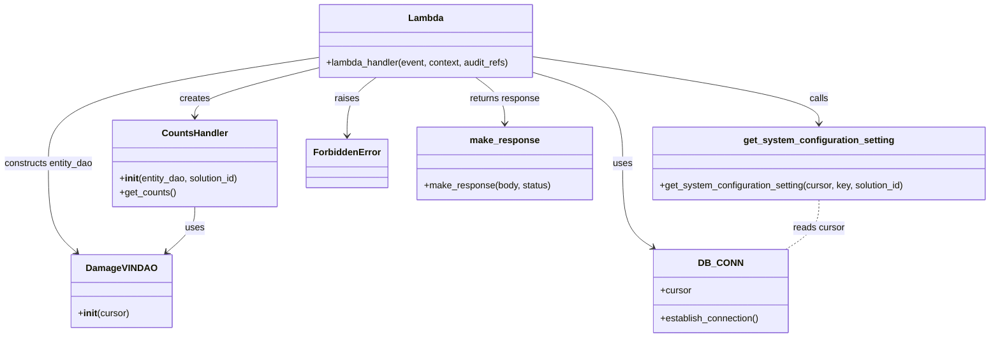

# Diagram: entity_core/entity_service/entity_service/damageview/counts/get_vin_counts.py


> Auto-generated by Obscura crawlers

## Diagram 1



### SVG

<svg id="container" width="1712.421875" xmlns="http://www.w3.org/2000/svg" class="classDiagram" height="584" viewBox="0 0 1712.421875 584" role="graphics-document document" aria-roledescription="class"><style>#container{font-family:"trebuchet ms",verdana,arial,sans-serif;font-size:16px;fill:#333;}@keyframes edge-animation-frame{from{stroke-dashoffset:0;}}@keyframes dash{to{stroke-dashoffset:0;}}#container .edge-animation-slow{stroke-dasharray:9,5!important;stroke-dashoffset:900;animation:dash 50s linear infinite;stroke-linecap:round;}#container .edge-animation-fast{stroke-dasharray:9,5!important;stroke-dashoffset:900;animation:dash 20s linear infinite;stroke-linecap:round;}#container .error-icon{fill:#552222;}#container .error-text{fill:#552222;stroke:#552222;}#container .edge-thickness-normal{stroke-width:1px;}#container .edge-thickness-thick{stroke-width:3.5px;}#container .edge-pattern-solid{stroke-dasharray:0;}#container .edge-thickness-invisible{stroke-width:0;fill:none;}#container .edge-pattern-dashed{stroke-dasharray:3;}#container .edge-pattern-dotted{stroke-dasharray:2;}#container .marker{fill:#333333;stroke:#333333;}#container .marker.cross{stroke:#333333;}#container svg{font-family:"trebuchet ms",verdana,arial,sans-serif;font-size:16px;}#container p{margin:0;}#container g.classGroup text{fill:#9370DB;stroke:none;font-family:"trebuchet ms",verdana,arial,sans-serif;font-size:10px;}#container g.classGroup text .title{font-weight:bolder;}#container .nodeLabel,#container .edgeLabel{color:#131300;}#container .edgeLabel .label rect{fill:#ECECFF;}#container .label text{fill:#131300;}#container .labelBkg{background:#ECECFF;}#container .edgeLabel .label span{background:#ECECFF;}#container .classTitle{font-weight:bolder;}#container .node rect,#container .node circle,#container .node ellipse,#container .node polygon,#container .node path{fill:#ECECFF;stroke:#9370DB;stroke-width:1px;}#container .divider{stroke:#9370DB;stroke-width:1;}#container g.clickable{cursor:pointer;}#container g.classGroup rect{fill:#ECECFF;stroke:#9370DB;}#container g.classGroup line{stroke:#9370DB;stroke-width:1;}#container .classLabel .box{stroke:none;stroke-width:0;fill:#ECECFF;opacity:0.5;}#container .classLabel .label{fill:#9370DB;font-size:10px;}#container .relation{stroke:#333333;stroke-width:1;fill:none;}#container .dashed-line{stroke-dasharray:3;}#container .dotted-line{stroke-dasharray:1 2;}#container #compositionStart,#container .composition{fill:#333333!important;stroke:#333333!important;stroke-width:1;}#container #compositionEnd,#container .composition{fill:#333333!important;stroke:#333333!important;stroke-width:1;}#container #dependencyStart,#container .dependency{fill:#333333!important;stroke:#333333!important;stroke-width:1;}#container #dependencyStart,#container .dependency{fill:#333333!important;stroke:#333333!important;stroke-width:1;}#container #extensionStart,#container .extension{fill:transparent!important;stroke:#333333!important;stroke-width:1;}#container #extensionEnd,#container .extension{fill:transparent!important;stroke:#333333!important;stroke-width:1;}#container #aggregationStart,#container .aggregation{fill:transparent!important;stroke:#333333!important;stroke-width:1;}#container #aggregationEnd,#container .aggregation{fill:transparent!important;stroke:#333333!important;stroke-width:1;}#container #lollipopStart,#container .lollipop{fill:#ECECFF!important;stroke:#333333!important;stroke-width:1;}#container #lollipopEnd,#container .lollipop{fill:#ECECFF!important;stroke:#333333!important;stroke-width:1;}#container .edgeTerminals{font-size:11px;line-height:initial;}#container .classTitleText{text-anchor:middle;font-size:18px;fill:#333;}#container .label-icon{display:inline-block;height:1em;overflow:visible;vertical-align:-0.125em;}#container .node .label-icon path{fill:currentColor;stroke:revert;stroke-width:revert;}#container :root{--mermaid-font-family:"trebuchet ms",verdana,arial,sans-serif;}</style><g><defs><marker id="container_class-aggregationStart" class="marker aggregation class" refX="18" refY="7" markerWidth="190" markerHeight="240" orient="auto"><path d="M 18,7 L9,13 L1,7 L9,1 Z"></path></marker></defs><defs><marker id="container_class-aggregationEnd" class="marker aggregation class" refX="1" refY="7" markerWidth="20" markerHeight="28" orient="auto"><path d="M 18,7 L9,13 L1,7 L9,1 Z"></path></marker></defs><defs><marker id="container_class-extensionStart" class="marker extension class" refX="18" refY="7" markerWidth="190" markerHeight="240" orient="auto"><path d="M 1,7 L18,13 V 1 Z"></path></marker></defs><defs><marker id="container_class-extensionEnd" class="marker extension class" refX="1" refY="7" markerWidth="20" markerHeight="28" orient="auto"><path d="M 1,1 V 13 L18,7 Z"></path></marker></defs><defs><marker id="container_class-compositionStart" class="marker composition class" refX="18" refY="7" markerWidth="190" markerHeight="240" orient="auto"><path d="M 18,7 L9,13 L1,7 L9,1 Z"></path></marker></defs><defs><marker id="container_class-compositionEnd" class="marker composition class" refX="1" refY="7" markerWidth="20" markerHeight="28" orient="auto"><path d="M 18,7 L9,13 L1,7 L9,1 Z"></path></marker></defs><defs><marker id="container_class-dependencyStart" class="marker dependency class" refX="6" refY="7" markerWidth="190" markerHeight="240" orient="auto"><path d="M 5,7 L9,13 L1,7 L9,1 Z"></path></marker></defs><defs><marker id="container_class-dependencyEnd" class="marker dependency class" refX="13" refY="7" markerWidth="20" markerHeight="28" orient="auto"><path d="M 18,7 L9,13 L14,7 L9,1 Z"></path></marker></defs><defs><marker id="container_class-lollipopStart" class="marker lollipop class" refX="13" refY="7" markerWidth="190" markerHeight="240" orient="auto"><circle stroke="black" fill="transparent" cx="7" cy="7" r="6"></circle></marker></defs><defs><marker id="container_class-lollipopEnd" class="marker lollipop class" refX="1" refY="7" markerWidth="190" markerHeight="240" orient="auto"><circle stroke="black" fill="transparent" cx="7" cy="7" r="6"></circle></marker></defs><g class="root"><g class="clusters"></g><g class="edgePaths"><path d="M552.375,118.376L517.68,127.147C482.986,135.918,413.596,153.459,378.902,167.396C344.207,181.333,344.207,191.667,344.207,196.833L344.207,202" id="id_Lambda_CountsHandler_1" class="edge-thickness-normal edge-pattern-solid relation" style=";;;" data-edge="true" data-et="edge" data-id="id_Lambda_CountsHandler_1" data-points="W3sieCI6NTUyLjM3NSwieSI6MTE4LjM3NjI2ODkxMDIxODQzfSx7IngiOjM0NC4yMDcwMzEyNSwieSI6MTcxfSx7IngiOjM0NC4yMDcwMzEyNSwieSI6MjA4fV0=" marker-end="url(#container_class-dependencyEnd)"></path><path d="M552.375,99.688L474.73,111.573C397.086,123.458,241.797,147.229,164.152,177.781C86.508,208.333,86.508,245.667,86.508,283C86.508,320.333,86.508,357.667,94.807,383.354C103.107,409.042,119.705,423.083,128.005,430.104L136.304,437.125" id="id_Lambda_DamageVINDAO_2" class="edge-thickness-normal edge-pattern-solid relation" style=";;;" data-edge="true" data-et="edge" data-id="id_Lambda_DamageVINDAO_2" data-points="W3sieCI6NTUyLjM3NSwieSI6OTkuNjg3Njg2NDg0NjExODV9LHsieCI6ODYuNTA3ODEyNSwieSI6MTcxfSx7IngiOjg2LjUwNzgxMjUsInkiOjI4M30seyJ4Ijo4Ni41MDc4MTI1LCJ5IjozOTV9LHsieCI6MTQwLjg4NDcxMTg2OTI2NjA2LCJ5Ijo0NDF9XQ==" marker-end="url(#container_class-dependencyEnd)"></path><path d="M927.195,126.736L952.001,134.113C976.807,141.491,1026.419,156.245,1051.225,182.289C1076.031,208.333,1076.031,245.667,1076.031,283C1076.031,320.333,1076.031,357.667,1084.806,381.96C1093.58,406.254,1111.128,417.507,1119.903,423.134L1128.677,428.761" id="id_Lambda_DB_CONN_3" class="edge-thickness-normal edge-pattern-solid relation" style=";;;" data-edge="true" data-et="edge" data-id="id_Lambda_DB_CONN_3" data-points="W3sieCI6OTI3LjE5NTMxMjUsInkiOjEyNi43MzYwMDk5NDQzNTM0NH0seyJ4IjoxMDc2LjAzMTI1LCJ5IjoxNzF9LHsieCI6MTA3Ni4wMzEyNSwieSI6MjgzfSx7IngiOjEwNzYuMDMxMjUsInkiOjM5NX0seyJ4IjoxMTMzLjcyNzcyNzIwNzU2ODcsInkiOjQzMn1d" marker-end="url(#container_class-dependencyEnd)"></path><path d="M927.195,98.716L1008.658,110.763C1090.121,122.81,1253.047,146.905,1334.51,166.119C1415.973,185.333,1415.973,199.667,1415.973,206.833L1415.973,214" id="id_Lambda_get_system_configuration_setting_4" class="edge-thickness-normal edge-pattern-solid relation" style=";;;" data-edge="true" data-et="edge" data-id="id_Lambda_get_system_configuration_setting_4" data-points="W3sieCI6OTI3LjE5NTMxMjUsInkiOjk4LjcxNTcwODQ3NTgyOTU2fSx7IngiOjE0MTUuOTcyNjU2MjUsInkiOjE3MX0seyJ4IjoxNDE1Ljk3MjY1NjI1LCJ5IjoyMjB9XQ==" marker-end="url(#container_class-dependencyEnd)"></path><path d="M1415.973,346L1415.973,354.167C1415.973,362.333,1415.973,378.667,1406.357,393C1396.74,407.333,1377.508,419.667,1367.892,425.833L1358.276,432" id="id_get_system_configuration_setting_DB_CONN_5" class="edge-thickness-normal edge-pattern-dashed relation" style=";;;" data-edge="true" data-et="edge" data-id="id_get_system_configuration_setting_DB_CONN_5" data-points="W3sieCI6MTQxNS45NzI2NTYyNSwieSI6MzQ2fSx7IngiOjE0MTUuOTcyNjU2MjUsInkiOjM5NX0seyJ4IjoxMzU4LjI3NjE3OTA0MjQzMTMsInkiOjQzMn1d"></path><path d="M344.207,358L344.207,364.167C344.207,370.333,344.207,382.667,335.908,395.854C327.608,409.042,311.01,423.083,302.71,430.104L294.411,437.125" id="id_CountsHandler_DamageVINDAO_6" class="edge-thickness-normal edge-pattern-solid relation" style=";;;" data-edge="true" data-et="edge" data-id="id_CountsHandler_DamageVINDAO_6" data-points="W3sieCI6MzQ0LjIwNzAzMTI1LCJ5IjozNTh9LHsieCI6MzQ0LjIwNzAzMTI1LCJ5IjozOTV9LHsieCI6Mjg5LjgzMDEzMTg4MDczMzksInkiOjQ0MX1d" marker-end="url(#container_class-dependencyEnd)"></path><path d="M655.343,134L647.078,140.167C638.812,146.333,622.281,158.667,614.016,175.5C605.75,192.333,605.75,213.667,605.75,224.333L605.75,235" id="id_Lambda_ForbiddenError_7" class="edge-thickness-normal edge-pattern-solid relation" style=";;;" data-edge="true" data-et="edge" data-id="id_Lambda_ForbiddenError_7" data-points="W3sieCI6NjU1LjM0MzAwNzgxMjUsInkiOjEzNH0seyJ4Ijo2MDUuNzUsInkiOjE3MX0seyJ4Ijo2MDUuNzUsInkiOjI0MX1d" marker-end="url(#container_class-dependencyEnd)"></path><path d="M824.227,134L832.493,140.167C840.758,146.333,857.289,158.667,865.555,172C873.82,185.333,873.82,199.667,873.82,206.833L873.82,214" id="id_Lambda_make_response_8" class="edge-thickness-normal edge-pattern-solid relation" style=";;;" data-edge="true" data-et="edge" data-id="id_Lambda_make_response_8" data-points="W3sieCI6ODI0LjIyNzMwNDY4NzUsInkiOjEzNH0seyJ4Ijo4NzMuODIwMzEyNSwieSI6MTcxfSx7IngiOjg3My44MjAzMTI1LCJ5IjoyMjB9XQ==" marker-end="url(#container_class-dependencyEnd)"></path></g><g class="edgeLabels"><g class="edgeLabel" transform="translate(344.20703125, 171)"><g class="label" data-id="id_Lambda_CountsHandler_1" transform="translate(-26.171875, -12)"><foreignObject width="52.34375" height="24"><div xmlns="http://www.w3.org/1999/xhtml" class="labelBkg" style="display: table-cell; white-space: nowrap; line-height: 1.5; max-width: 200px; text-align: center;"><span class="edgeLabel"><p>creates</p></span></div></foreignObject></g></g><g class="edgeLabel" transform="translate(86.5078125, 283)"><g class="label" data-id="id_Lambda_DamageVINDAO_2" transform="translate(-78.5078125, -12)"><foreignObject width="157.015625" height="24"><div xmlns="http://www.w3.org/1999/xhtml" class="labelBkg" style="display: table-cell; white-space: nowrap; line-height: 1.5; max-width: 200px; text-align: center;"><span class="edgeLabel"><p>constructs entity_dao</p></span></div></foreignObject></g></g><g class="edgeLabel" transform="translate(1076.03125, 283)"><g class="label" data-id="id_Lambda_DB_CONN_3" transform="translate(-16.4921875, -12)"><foreignObject width="32.984375" height="24"><div xmlns="http://www.w3.org/1999/xhtml" class="labelBkg" style="display: table-cell; white-space: nowrap; line-height: 1.5; max-width: 200px; text-align: center;"><span class="edgeLabel"><p>uses</p></span></div></foreignObject></g></g><g class="edgeLabel" transform="translate(1415.97265625, 171)"><g class="label" data-id="id_Lambda_get_system_configuration_setting_4" transform="translate(-16.4453125, -12)"><foreignObject width="32.890625" height="24"><div xmlns="http://www.w3.org/1999/xhtml" class="labelBkg" style="display: table-cell; white-space: nowrap; line-height: 1.5; max-width: 200px; text-align: center;"><span class="edgeLabel"><p>calls</p></span></div></foreignObject></g></g><g class="edgeLabel" transform="translate(1415.97265625, 395)"><g class="label" data-id="id_get_system_configuration_setting_DB_CONN_5" transform="translate(-44.984375, -12)"><foreignObject width="89.96875" height="24"><div xmlns="http://www.w3.org/1999/xhtml" class="labelBkg" style="display: table-cell; white-space: nowrap; line-height: 1.5; max-width: 200px; text-align: center;"><span class="edgeLabel"><p>reads cursor</p></span></div></foreignObject></g></g><g class="edgeLabel" transform="translate(344.20703125, 395)"><g class="label" data-id="id_CountsHandler_DamageVINDAO_6" transform="translate(-16.4921875, -12)"><foreignObject width="32.984375" height="24"><div xmlns="http://www.w3.org/1999/xhtml" class="labelBkg" style="display: table-cell; white-space: nowrap; line-height: 1.5; max-width: 200px; text-align: center;"><span class="edgeLabel"><p>uses</p></span></div></foreignObject></g></g><g class="edgeLabel" transform="translate(605.75, 171)"><g class="label" data-id="id_Lambda_ForbiddenError_7" transform="translate(-21.25, -12)"><foreignObject width="42.5" height="24"><div xmlns="http://www.w3.org/1999/xhtml" class="labelBkg" style="display: table-cell; white-space: nowrap; line-height: 1.5; max-width: 200px; text-align: center;"><span class="edgeLabel"><p>raises</p></span></div></foreignObject></g></g><g class="edgeLabel" transform="translate(873.8203125, 171)"><g class="label" data-id="id_Lambda_make_response_8" transform="translate(-61.5390625, -12)"><foreignObject width="123.078125" height="24"><div xmlns="http://www.w3.org/1999/xhtml" class="labelBkg" style="display: table-cell; white-space: nowrap; line-height: 1.5; max-width: 200px; text-align: center;"><span class="edgeLabel"><p>returns response</p></span></div></foreignObject></g></g></g><g class="nodes"><g class="node default" id="classId-Lambda-0" transform="translate(739.78515625, 71)"><g class="basic label-container"><path d="M-187.41015625 -63 L187.41015625 -63 L187.41015625 63 L-187.41015625 63" stroke="none" stroke-width="0" fill="#ECECFF" style=""></path><path d="M-187.41015625 -63 C-94.73135942278749 -63, -2.052562595574983 -63, 187.41015625 -63 M-187.41015625 -63 C-69.40680775713601 -63, 48.596540735727984 -63, 187.41015625 -63 M187.41015625 -63 C187.41015625 -29.2821478233855, 187.41015625 4.435704353228999, 187.41015625 63 M187.41015625 -63 C187.41015625 -18.11278064531671, 187.41015625 26.774438709366578, 187.41015625 63 M187.41015625 63 C83.98860388729359 63, -19.432948475412815 63, -187.41015625 63 M187.41015625 63 C38.43042755704707 63, -110.54930113590586 63, -187.41015625 63 M-187.41015625 63 C-187.41015625 25.713207734999983, -187.41015625 -11.573584530000034, -187.41015625 -63 M-187.41015625 63 C-187.41015625 28.697282748554876, -187.41015625 -5.6054345028902475, -187.41015625 -63" stroke="#9370DB" stroke-width="1.3" fill="none" stroke-dasharray="0 0" style=""></path></g><g class="annotation-group text" transform="translate(0, -39)"></g><g class="label-group text" transform="translate(-29.1328125, -39)"><g class="label" style="font-weight: bolder" transform="translate(0,-12)"><foreignObject width="58.265625" height="24"><div xmlns="http://www.w3.org/1999/xhtml" style="display: table-cell; white-space: nowrap; line-height: 1.5; max-width: 108px; text-align: center;"><span class="nodeLabel markdown-node-label" style=""><p>Lambda</p></span></div></foreignObject></g></g><g class="members-group text" transform="translate(-175.41015625, 9)"></g><g class="methods-group text" transform="translate(-175.41015625, 39)"><g class="label" style="" transform="translate(0,-12)"><foreignObject width="321.6875" height="24"><div xmlns="http://www.w3.org/1999/xhtml" style="display: table-cell; white-space: nowrap; line-height: 1.5; max-width: 379px; text-align: center;"><span class="nodeLabel markdown-node-label" style=""><p>+lambda_handler(event, context, audit_refs)</p></span></div></foreignObject></g></g><g class="divider" style=""><path d="M-187.41015625 -15 C-95.47646386681818 -15, -3.5427714836363577 -15, 187.41015625 -15 M-187.41015625 -15 C-42.51051457691449 -15, 102.38912709617102 -15, 187.41015625 -15" stroke="#9370DB" stroke-width="1.3" fill="none" stroke-dasharray="0 0" style=""></path></g><g class="divider" style=""><path d="M-187.41015625 9 C-77.34732887972336 9, 32.71549849055327 9, 187.41015625 9 M-187.41015625 9 C-89.33314166623525 9, 8.743872917529501 9, 187.41015625 9" stroke="#9370DB" stroke-width="1.3" fill="none" stroke-dasharray="0 0" style=""></path></g></g><g class="node default" id="classId-DB_CONN-1" transform="translate(1246.001953125, 504)"><g class="basic label-container"><path d="M-115.8359375 -72 L115.8359375 -72 L115.8359375 72 L-115.8359375 72" stroke="none" stroke-width="0" fill="#ECECFF" style=""></path><path d="M-115.8359375 -72 C-30.959041423414646 -72, 53.91785465317071 -72, 115.8359375 -72 M-115.8359375 -72 C-24.658253831198294 -72, 66.51942983760341 -72, 115.8359375 -72 M115.8359375 -72 C115.8359375 -18.186378523525278, 115.8359375 35.627242952949445, 115.8359375 72 M115.8359375 -72 C115.8359375 -15.782079053573952, 115.8359375 40.435841892852096, 115.8359375 72 M115.8359375 72 C42.62153739026138 72, -30.59286271947724 72, -115.8359375 72 M115.8359375 72 C39.621081422067675 72, -36.59377465586465 72, -115.8359375 72 M-115.8359375 72 C-115.8359375 15.659695855760276, -115.8359375 -40.68060828847945, -115.8359375 -72 M-115.8359375 72 C-115.8359375 33.3565066420079, -115.8359375 -5.286986715984199, -115.8359375 -72" stroke="#9370DB" stroke-width="1.3" fill="none" stroke-dasharray="0 0" style=""></path></g><g class="annotation-group text" transform="translate(0, -48)"></g><g class="label-group text" transform="translate(-34.40625, -48)"><g class="label" style="font-weight: bolder" transform="translate(0,-12)"><foreignObject width="68.8125" height="24"><div xmlns="http://www.w3.org/1999/xhtml" style="display: table-cell; white-space: nowrap; line-height: 1.5; max-width: 119px; text-align: center;"><span class="nodeLabel markdown-node-label" style=""><p>DB_CONN</p></span></div></foreignObject></g></g><g class="members-group text" transform="translate(-103.8359375, 0)"><g class="label" style="" transform="translate(0,-12)"><foreignObject width="53.71875" height="24"><div xmlns="http://www.w3.org/1999/xhtml" style="display: table-cell; white-space: nowrap; line-height: 1.5; max-width: 112px; text-align: center;"><span class="nodeLabel markdown-node-label" style=""><p>+cursor</p></span></div></foreignObject></g></g><g class="methods-group text" transform="translate(-103.8359375, 48)"><g class="label" style="" transform="translate(0,-12)"><foreignObject width="173.265625" height="24"><div xmlns="http://www.w3.org/1999/xhtml" style="display: table-cell; white-space: nowrap; line-height: 1.5; max-width: 231px; text-align: center;"><span class="nodeLabel markdown-node-label" style=""><p>+establish_connection()</p></span></div></foreignObject></g></g><g class="divider" style=""><path d="M-115.8359375 -24 C-44.03924069832088 -24, 27.757456103358237 -24, 115.8359375 -24 M-115.8359375 -24 C-48.28288499863143 -24, 19.270167502737138 -24, 115.8359375 -24" stroke="#9370DB" stroke-width="1.3" fill="none" stroke-dasharray="0 0" style=""></path></g><g class="divider" style=""><path d="M-115.8359375 24 C-28.976826993858168 24, 57.882283512283664 24, 115.8359375 24 M-115.8359375 24 C-27.163157056056335 24, 61.50962338788733 24, 115.8359375 24" stroke="#9370DB" stroke-width="1.3" fill="none" stroke-dasharray="0 0" style=""></path></g></g><g class="node default" id="classId-DamageVINDAO-2" transform="translate(215.357421875, 504)"><g class="basic label-container"><path d="M-84.6328125 -63 L84.6328125 -63 L84.6328125 63 L-84.6328125 63" stroke="none" stroke-width="0" fill="#ECECFF" style=""></path><path d="M-84.6328125 -63 C-31.037724432321028 -63, 22.557363635357945 -63, 84.6328125 -63 M-84.6328125 -63 C-49.742825687821885 -63, -14.85283887564377 -63, 84.6328125 -63 M84.6328125 -63 C84.6328125 -31.20813335127278, 84.6328125 0.5837332974544367, 84.6328125 63 M84.6328125 -63 C84.6328125 -32.163601205905124, 84.6328125 -1.327202411810255, 84.6328125 63 M84.6328125 63 C19.648109482607424 63, -45.33659353478515 63, -84.6328125 63 M84.6328125 63 C27.297229252333302 63, -30.038353995333395 63, -84.6328125 63 M-84.6328125 63 C-84.6328125 36.79023865958385, -84.6328125 10.580477319167706, -84.6328125 -63 M-84.6328125 63 C-84.6328125 23.863511242270903, -84.6328125 -15.272977515458194, -84.6328125 -63" stroke="#9370DB" stroke-width="1.3" fill="none" stroke-dasharray="0 0" style=""></path></g><g class="annotation-group text" transform="translate(0, -39)"></g><g class="label-group text" transform="translate(-56.734375, -39)"><g class="label" style="font-weight: bolder" transform="translate(0,-12)"><foreignObject width="113.46875" height="24"><div xmlns="http://www.w3.org/1999/xhtml" style="display: table-cell; white-space: nowrap; line-height: 1.5; max-width: 163px; text-align: center;"><span class="nodeLabel markdown-node-label" style=""><p>DamageVINDAO</p></span></div></foreignObject></g></g><g class="members-group text" transform="translate(-72.6328125, 9)"></g><g class="methods-group text" transform="translate(-72.6328125, 39)"><g class="label" style="" transform="translate(0,-12)"><foreignObject width="88.53125" height="24"><div xmlns="http://www.w3.org/1999/xhtml" style="display: table-cell; white-space: nowrap; line-height: 1.5; max-width: 177px; text-align: center;"><span class="nodeLabel markdown-node-label" style=""><p>+<strong>init</strong>(cursor)</p></span></div></foreignObject></g></g><g class="divider" style=""><path d="M-84.6328125 -15 C-35.97212572944522 -15, 12.688561041109566 -15, 84.6328125 -15 M-84.6328125 -15 C-47.30605354468013 -15, -9.979294589360265 -15, 84.6328125 -15" stroke="#9370DB" stroke-width="1.3" fill="none" stroke-dasharray="0 0" style=""></path></g><g class="divider" style=""><path d="M-84.6328125 9 C-20.352511169869956 9, 43.92779016026009 9, 84.6328125 9 M-84.6328125 9 C-46.60909827347739 9, -8.585384046954786 9, 84.6328125 9" stroke="#9370DB" stroke-width="1.3" fill="none" stroke-dasharray="0 0" style=""></path></g></g><g class="node default" id="classId-CountsHandler-3" transform="translate(344.20703125, 283)"><g class="basic label-container"><path d="M-144.19140625 -75 L144.19140625 -75 L144.19140625 75 L-144.19140625 75" stroke="none" stroke-width="0" fill="#ECECFF" style=""></path><path d="M-144.19140625 -75 C-84.95887532788913 -75, -25.726344405778264 -75, 144.19140625 -75 M-144.19140625 -75 C-33.62092998112425 -75, 76.9495462877515 -75, 144.19140625 -75 M144.19140625 -75 C144.19140625 -40.81166633995435, 144.19140625 -6.6233326799087, 144.19140625 75 M144.19140625 -75 C144.19140625 -30.613963134174533, 144.19140625 13.772073731650934, 144.19140625 75 M144.19140625 75 C80.76668067357406 75, 17.3419550971481 75, -144.19140625 75 M144.19140625 75 C34.00026206191106 75, -76.19088212617788 75, -144.19140625 75 M-144.19140625 75 C-144.19140625 19.89597698079549, -144.19140625 -35.20804603840902, -144.19140625 -75 M-144.19140625 75 C-144.19140625 37.953904200179494, -144.19140625 0.9078084003589879, -144.19140625 -75" stroke="#9370DB" stroke-width="1.3" fill="none" stroke-dasharray="0 0" style=""></path></g><g class="annotation-group text" transform="translate(0, -51)"></g><g class="label-group text" transform="translate(-54.3515625, -51)"><g class="label" style="font-weight: bolder" transform="translate(0,-12)"><foreignObject width="108.703125" height="24"><div xmlns="http://www.w3.org/1999/xhtml" style="display: table-cell; white-space: nowrap; line-height: 1.5; max-width: 159px; text-align: center;"><span class="nodeLabel markdown-node-label" style=""><p>CountsHandler</p></span></div></foreignObject></g></g><g class="members-group text" transform="translate(-132.19140625, -3)"></g><g class="methods-group text" transform="translate(-132.19140625, 27)"><g class="label" style="" transform="translate(0,-12)"><foreignObject width="210.03125" height="24"><div xmlns="http://www.w3.org/1999/xhtml" style="display: table-cell; white-space: nowrap; line-height: 1.5; max-width: 299px; text-align: center;"><span class="nodeLabel markdown-node-label" style=""><p>+<strong>init</strong>(entity_dao, solution_id)</p></span></div></foreignObject></g><g class="label" style="" transform="translate(0,12)"><foreignObject width="97.53125" height="24"><div xmlns="http://www.w3.org/1999/xhtml" style="display: table-cell; white-space: nowrap; line-height: 1.5; max-width: 155px; text-align: center;"><span class="nodeLabel markdown-node-label" style=""><p>+get_counts()</p></span></div></foreignObject></g></g><g class="divider" style=""><path d="M-144.19140625 -27 C-71.05122600101399 -27, 2.0889542479720262 -27, 144.19140625 -27 M-144.19140625 -27 C-52.01223194024897 -27, 40.16694236950207 -27, 144.19140625 -27" stroke="#9370DB" stroke-width="1.3" fill="none" stroke-dasharray="0 0" style=""></path></g><g class="divider" style=""><path d="M-144.19140625 -3 C-67.12073884733441 -3, 9.949928555331184 -3, 144.19140625 -3 M-144.19140625 -3 C-76.01622070841645 -3, -7.84103516683291 -3, 144.19140625 -3" stroke="#9370DB" stroke-width="1.3" fill="none" stroke-dasharray="0 0" style=""></path></g></g><g class="node default" id="classId-get_system_configuration_setting-4" transform="translate(1415.97265625, 283)"><g class="basic label-container"><path d="M-288.44921875 -63 L288.44921875 -63 L288.44921875 63 L-288.44921875 63" stroke="none" stroke-width="0" fill="#ECECFF" style=""></path><path d="M-288.44921875 -63 C-114.51812275701502 -63, 59.41297323596996 -63, 288.44921875 -63 M-288.44921875 -63 C-147.5489048095377 -63, -6.648590869075406 -63, 288.44921875 -63 M288.44921875 -63 C288.44921875 -21.049184374000205, 288.44921875 20.90163125199959, 288.44921875 63 M288.44921875 -63 C288.44921875 -30.848835305626018, 288.44921875 1.302329388747964, 288.44921875 63 M288.44921875 63 C163.55607440609865 63, 38.66293006219729 63, -288.44921875 63 M288.44921875 63 C90.7401890926154 63, -106.96884056476921 63, -288.44921875 63 M-288.44921875 63 C-288.44921875 18.702434478662767, -288.44921875 -25.595131042674467, -288.44921875 -63 M-288.44921875 63 C-288.44921875 13.160051283848574, -288.44921875 -36.67989743230285, -288.44921875 -63" stroke="#9370DB" stroke-width="1.3" fill="none" stroke-dasharray="0 0" style=""></path></g><g class="annotation-group text" transform="translate(0, -39)"></g><g class="label-group text" transform="translate(-124.1640625, -39)"><g class="label" style="font-weight: bolder" transform="translate(0,-12)"><foreignObject width="248.328125" height="24"><div xmlns="http://www.w3.org/1999/xhtml" style="display: table-cell; white-space: nowrap; line-height: 1.5; max-width: 294px; text-align: center;"><span class="nodeLabel markdown-node-label" style=""><p>get_system_configuration_setting</p></span></div></foreignObject></g></g><g class="members-group text" transform="translate(-276.44921875, 9)"></g><g class="methods-group text" transform="translate(-276.44921875, 39)"><g class="label" style="" transform="translate(0,-12)"><foreignObject width="428.734375" height="24"><div xmlns="http://www.w3.org/1999/xhtml" style="display: table-cell; white-space: nowrap; line-height: 1.5; max-width: 486px; text-align: center;"><span class="nodeLabel markdown-node-label" style=""><p>+get_system_configuration_setting(cursor, key, solution_id)</p></span></div></foreignObject></g></g><g class="divider" style=""><path d="M-288.44921875 -15 C-126.07252419538722 -15, 36.304170359225566 -15, 288.44921875 -15 M-288.44921875 -15 C-146.2701383688653 -15, -4.091057987730608 -15, 288.44921875 -15" stroke="#9370DB" stroke-width="1.3" fill="none" stroke-dasharray="0 0" style=""></path></g><g class="divider" style=""><path d="M-288.44921875 9 C-102.23022384426147 9, 83.98877106147705 9, 288.44921875 9 M-288.44921875 9 C-61.71821725351688 9, 165.01278424296623 9, 288.44921875 9" stroke="#9370DB" stroke-width="1.3" fill="none" stroke-dasharray="0 0" style=""></path></g></g><g class="node default" id="classId-ForbiddenError-5" transform="translate(605.75, 283)"><g class="basic label-container"><path d="M-67.3515625 -42 L67.3515625 -42 L67.3515625 42 L-67.3515625 42" stroke="none" stroke-width="0" fill="#ECECFF" style=""></path><path d="M-67.3515625 -42 C-31.659262406298915 -42, 4.033037687402171 -42, 67.3515625 -42 M-67.3515625 -42 C-13.873029824321193 -42, 39.60550285135761 -42, 67.3515625 -42 M67.3515625 -42 C67.3515625 -23.058069129045432, 67.3515625 -4.116138258090864, 67.3515625 42 M67.3515625 -42 C67.3515625 -20.39533844013625, 67.3515625 1.2093231197275003, 67.3515625 42 M67.3515625 42 C35.43032384008657 42, 3.5090851801731375 42, -67.3515625 42 M67.3515625 42 C25.19933053417921 42, -16.95290143164158 42, -67.3515625 42 M-67.3515625 42 C-67.3515625 23.2731376131662, -67.3515625 4.546275226332398, -67.3515625 -42 M-67.3515625 42 C-67.3515625 15.540507680123554, -67.3515625 -10.918984639752892, -67.3515625 -42" stroke="#9370DB" stroke-width="1.3" fill="none" stroke-dasharray="0 0" style=""></path></g><g class="annotation-group text" transform="translate(0, -18)"></g><g class="label-group text" transform="translate(-55.3515625, -18)"><g class="label" style="font-weight: bolder" transform="translate(0,-12)"><foreignObject width="110.703125" height="24"><div xmlns="http://www.w3.org/1999/xhtml" style="display: table-cell; white-space: nowrap; line-height: 1.5; max-width: 161px; text-align: center;"><span class="nodeLabel markdown-node-label" style=""><p>ForbiddenError</p></span></div></foreignObject></g></g><g class="members-group text" transform="translate(-55.3515625, 30)"></g><g class="methods-group text" transform="translate(-55.3515625, 60)"></g><g class="divider" style=""><path d="M-67.3515625 6 C-21.97968831689014 6, 23.39218586621972 6, 67.3515625 6 M-67.3515625 6 C-26.22064916106997 6, 14.910264177860057 6, 67.3515625 6" stroke="#9370DB" stroke-width="1.3" fill="none" stroke-dasharray="0 0" style=""></path></g><g class="divider" style=""><path d="M-67.3515625 24 C-16.618832725393418 24, 34.113897049213165 24, 67.3515625 24 M-67.3515625 24 C-39.00852034879211 24, -10.665478197584221 24, 67.3515625 24" stroke="#9370DB" stroke-width="1.3" fill="none" stroke-dasharray="0 0" style=""></path></g></g><g class="node default" id="classId-make_response-6" transform="translate(873.8203125, 283)"><g class="basic label-container"><path d="M-150.71875 -63 L150.71875 -63 L150.71875 63 L-150.71875 63" stroke="none" stroke-width="0" fill="#ECECFF" style=""></path><path d="M-150.71875 -63 C-46.662520680641066 -63, 57.39370863871787 -63, 150.71875 -63 M-150.71875 -63 C-58.440862746705434 -63, 33.83702450658913 -63, 150.71875 -63 M150.71875 -63 C150.71875 -30.29327194931811, 150.71875 2.413456101363778, 150.71875 63 M150.71875 -63 C150.71875 -36.86248983613483, 150.71875 -10.724979672269662, 150.71875 63 M150.71875 63 C71.24318105430734 63, -8.232387891385315 63, -150.71875 63 M150.71875 63 C68.6427574973897 63, -13.43323500522061 63, -150.71875 63 M-150.71875 63 C-150.71875 28.49484928049931, -150.71875 -6.010301439001381, -150.71875 -63 M-150.71875 63 C-150.71875 18.1860807947819, -150.71875 -26.627838410436198, -150.71875 -63" stroke="#9370DB" stroke-width="1.3" fill="none" stroke-dasharray="0 0" style=""></path></g><g class="annotation-group text" transform="translate(0, -39)"></g><g class="label-group text" transform="translate(-57.46875, -39)"><g class="label" style="font-weight: bolder" transform="translate(0,-12)"><foreignObject width="114.9375" height="24"><div xmlns="http://www.w3.org/1999/xhtml" style="display: table-cell; white-space: nowrap; line-height: 1.5; max-width: 164px; text-align: center;"><span class="nodeLabel markdown-node-label" style=""><p>make_response</p></span></div></foreignObject></g></g><g class="members-group text" transform="translate(-138.71875, 9)"></g><g class="methods-group text" transform="translate(-138.71875, 39)"><g class="label" style="" transform="translate(0,-12)"><foreignObject width="219.96875" height="24"><div xmlns="http://www.w3.org/1999/xhtml" style="display: table-cell; white-space: nowrap; line-height: 1.5; max-width: 277px; text-align: center;"><span class="nodeLabel markdown-node-label" style=""><p>+make_response(body, status)</p></span></div></foreignObject></g></g><g class="divider" style=""><path d="M-150.71875 -15 C-51.22332845222614 -15, 48.27209309554772 -15, 150.71875 -15 M-150.71875 -15 C-76.78099761379596 -15, -2.8432452275919218 -15, 150.71875 -15" stroke="#9370DB" stroke-width="1.3" fill="none" stroke-dasharray="0 0" style=""></path></g><g class="divider" style=""><path d="M-150.71875 9 C-87.22763328330356 9, -23.736516566607122 9, 150.71875 9 M-150.71875 9 C-43.28058042675488 9, 64.15758914649024 9, 150.71875 9" stroke="#9370DB" stroke-width="1.3" fill="none" stroke-dasharray="0 0" style=""></path></g></g></g></g></g></svg>

## Diagram 2

```mermaid
flowchart TD
    Event[Lambda Event] --> AuthCheck{Auth Check: FEATURE}
    AuthCheck -->|allowed| GetPath[get_path_parameter(solution_id)]
    AuthCheck -->|denied| Forbidden[ForbiddenError: access denied]
    GetPath --> SysConfig[Check SHOW_DAMAGED_VINS_COUNT_WIDGET]
    SysConfig -->|no| Forbidden
    SysConfig -->|yes| DBConnect[DB_CONN.establish_connection()]
    DBConnect --> Cursor[DB_CONN.cursor]
    Cursor --> CreateDAO[DamageVINDAO(cursor)]
    CreateDAO --> CreateCountsHandler[CountsHandler(entity_dao, solution_id)]
    CreateCountsHandler --> FetchCounts[CountsHandler.get_counts()]
    FetchCounts --> Response[make_response(counts, 200)]
    Response --> Return[Return HTTP 200]
```

> SVG rendering failed for this diagram.
