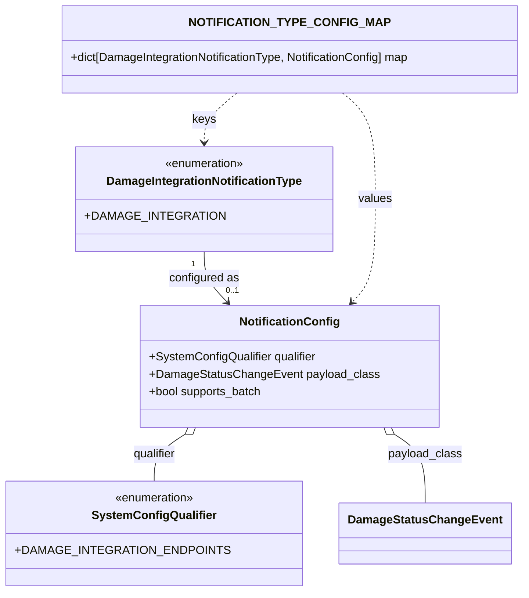

# Diagram: entity_core/entity_service/entity_service/damageview/damage_integration/config_registry.py

> Auto-generated by Obscura crawlers

## Mermaid

```mermaid
classDiagram
    class NOTIFICATION_TYPE_CONFIG_MAP {
        +dict[DamageIntegrationNotificationType, NotificationConfig] map
    }
    class DamageIntegrationNotificationType <<enumeration>> {
        +DAMAGE_INTEGRATION
    }
    class NotificationConfig {
        +SystemConfigQualifier qualifier
        +DamageStatusChangeEvent payload_class
        +bool supports_batch
    }
    class SystemConfigQualifier <<enumeration>> {
        +DAMAGE_INTEGRATION_ENDPOINTS
    }
    class DamageStatusChangeEvent

    DamageIntegrationNotificationType "1" --> "0..1" NotificationConfig : configured as
    NOTIFICATION_TYPE_CONFIG_MAP ..> DamageIntegrationNotificationType : keys
    NOTIFICATION_TYPE_CONFIG_MAP ..> NotificationConfig : values
    NotificationConfig o-- SystemConfigQualifier : qualifier
    NotificationConfig o-- DamageStatusChangeEvent : payload_class
```

> SVG rendering failed for this diagram.
