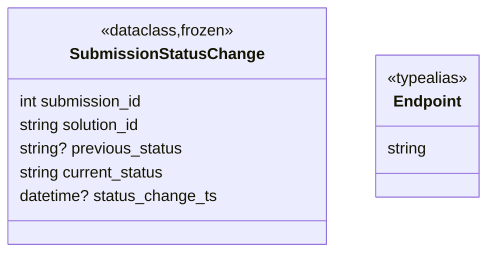

# Diagram: entity_core/entity_service/entity_service/damageview/damage_integration/model.py


> Auto-generated by Obscura crawlers

## Diagram 1



### SVG

<svg id="container" width="491.1796875" xmlns="http://www.w3.org/2000/svg" class="classDiagram" height="256" viewBox="0 0 491.1796875 256" role="graphics-document document" aria-roledescription="class"><style>#container{font-family:"trebuchet ms",verdana,arial,sans-serif;font-size:16px;fill:#333;}@keyframes edge-animation-frame{from{stroke-dashoffset:0;}}@keyframes dash{to{stroke-dashoffset:0;}}#container .edge-animation-slow{stroke-dasharray:9,5!important;stroke-dashoffset:900;animation:dash 50s linear infinite;stroke-linecap:round;}#container .edge-animation-fast{stroke-dasharray:9,5!important;stroke-dashoffset:900;animation:dash 20s linear infinite;stroke-linecap:round;}#container .error-icon{fill:#552222;}#container .error-text{fill:#552222;stroke:#552222;}#container .edge-thickness-normal{stroke-width:1px;}#container .edge-thickness-thick{stroke-width:3.5px;}#container .edge-pattern-solid{stroke-dasharray:0;}#container .edge-thickness-invisible{stroke-width:0;fill:none;}#container .edge-pattern-dashed{stroke-dasharray:3;}#container .edge-pattern-dotted{stroke-dasharray:2;}#container .marker{fill:#333333;stroke:#333333;}#container .marker.cross{stroke:#333333;}#container svg{font-family:"trebuchet ms",verdana,arial,sans-serif;font-size:16px;}#container p{margin:0;}#container g.classGroup text{fill:#9370DB;stroke:none;font-family:"trebuchet ms",verdana,arial,sans-serif;font-size:10px;}#container g.classGroup text .title{font-weight:bolder;}#container .nodeLabel,#container .edgeLabel{color:#131300;}#container .edgeLabel .label rect{fill:#ECECFF;}#container .label text{fill:#131300;}#container .labelBkg{background:#ECECFF;}#container .edgeLabel .label span{background:#ECECFF;}#container .classTitle{font-weight:bolder;}#container .node rect,#container .node circle,#container .node ellipse,#container .node polygon,#container .node path{fill:#ECECFF;stroke:#9370DB;stroke-width:1px;}#container .divider{stroke:#9370DB;stroke-width:1;}#container g.clickable{cursor:pointer;}#container g.classGroup rect{fill:#ECECFF;stroke:#9370DB;}#container g.classGroup line{stroke:#9370DB;stroke-width:1;}#container .classLabel .box{stroke:none;stroke-width:0;fill:#ECECFF;opacity:0.5;}#container .classLabel .label{fill:#9370DB;font-size:10px;}#container .relation{stroke:#333333;stroke-width:1;fill:none;}#container .dashed-line{stroke-dasharray:3;}#container .dotted-line{stroke-dasharray:1 2;}#container #compositionStart,#container .composition{fill:#333333!important;stroke:#333333!important;stroke-width:1;}#container #compositionEnd,#container .composition{fill:#333333!important;stroke:#333333!important;stroke-width:1;}#container #dependencyStart,#container .dependency{fill:#333333!important;stroke:#333333!important;stroke-width:1;}#container #dependencyStart,#container .dependency{fill:#333333!important;stroke:#333333!important;stroke-width:1;}#container #extensionStart,#container .extension{fill:transparent!important;stroke:#333333!important;stroke-width:1;}#container #extensionEnd,#container .extension{fill:transparent!important;stroke:#333333!important;stroke-width:1;}#container #aggregationStart,#container .aggregation{fill:transparent!important;stroke:#333333!important;stroke-width:1;}#container #aggregationEnd,#container .aggregation{fill:transparent!important;stroke:#333333!important;stroke-width:1;}#container #lollipopStart,#container .lollipop{fill:#ECECFF!important;stroke:#333333!important;stroke-width:1;}#container #lollipopEnd,#container .lollipop{fill:#ECECFF!important;stroke:#333333!important;stroke-width:1;}#container .edgeTerminals{font-size:11px;line-height:initial;}#container .classTitleText{text-anchor:middle;font-size:18px;fill:#333;}#container .label-icon{display:inline-block;height:1em;overflow:visible;vertical-align:-0.125em;}#container .node .label-icon path{fill:currentColor;stroke:revert;stroke-width:revert;}#container :root{--mermaid-font-family:"trebuchet ms",verdana,arial,sans-serif;}</style><g><defs><marker id="container_class-aggregationStart" class="marker aggregation class" refX="18" refY="7" markerWidth="190" markerHeight="240" orient="auto"><path d="M 18,7 L9,13 L1,7 L9,1 Z"></path></marker></defs><defs><marker id="container_class-aggregationEnd" class="marker aggregation class" refX="1" refY="7" markerWidth="20" markerHeight="28" orient="auto"><path d="M 18,7 L9,13 L1,7 L9,1 Z"></path></marker></defs><defs><marker id="container_class-extensionStart" class="marker extension class" refX="18" refY="7" markerWidth="190" markerHeight="240" orient="auto"><path d="M 1,7 L18,13 V 1 Z"></path></marker></defs><defs><marker id="container_class-extensionEnd" class="marker extension class" refX="1" refY="7" markerWidth="20" markerHeight="28" orient="auto"><path d="M 1,1 V 13 L18,7 Z"></path></marker></defs><defs><marker id="container_class-compositionStart" class="marker composition class" refX="18" refY="7" markerWidth="190" markerHeight="240" orient="auto"><path d="M 18,7 L9,13 L1,7 L9,1 Z"></path></marker></defs><defs><marker id="container_class-compositionEnd" class="marker composition class" refX="1" refY="7" markerWidth="20" markerHeight="28" orient="auto"><path d="M 18,7 L9,13 L1,7 L9,1 Z"></path></marker></defs><defs><marker id="container_class-dependencyStart" class="marker dependency class" refX="6" refY="7" markerWidth="190" markerHeight="240" orient="auto"><path d="M 5,7 L9,13 L1,7 L9,1 Z"></path></marker></defs><defs><marker id="container_class-dependencyEnd" class="marker dependency class" refX="13" refY="7" markerWidth="20" markerHeight="28" orient="auto"><path d="M 18,7 L9,13 L14,7 L9,1 Z"></path></marker></defs><defs><marker id="container_class-lollipopStart" class="marker lollipop class" refX="13" refY="7" markerWidth="190" markerHeight="240" orient="auto"><circle stroke="black" fill="transparent" cx="7" cy="7" r="6"></circle></marker></defs><defs><marker id="container_class-lollipopEnd" class="marker lollipop class" refX="1" refY="7" markerWidth="190" markerHeight="240" orient="auto"><circle stroke="black" fill="transparent" cx="7" cy="7" r="6"></circle></marker></defs><g class="root"><g class="clusters"></g><g class="edgePaths"></g><g class="edgeLabels"></g><g class="nodes"><g class="node default" id="classId-SubmissionStatusChange-0" transform="translate(166.76171875, 128)"><g class="basic label-container"><path d="M-158.76171875 -120 L158.76171875 -120 L158.76171875 120 L-158.76171875 120" stroke="none" stroke-width="0" fill="#ECECFF" style=""></path><path d="M-158.76171875 -120 C-35.75531744438496 -120, 87.25108386123009 -120, 158.76171875 -120 M-158.76171875 -120 C-74.6691435120908 -120, 9.423431725818403 -120, 158.76171875 -120 M158.76171875 -120 C158.76171875 -29.308425075791973, 158.76171875 61.38314984841605, 158.76171875 120 M158.76171875 -120 C158.76171875 -26.817675705235658, 158.76171875 66.36464858952868, 158.76171875 120 M158.76171875 120 C69.08597024791649 120, -20.589778254167015 120, -158.76171875 120 M158.76171875 120 C33.08859220725141 120, -92.58453433549718 120, -158.76171875 120 M-158.76171875 120 C-158.76171875 26.346621163979407, -158.76171875 -67.30675767204119, -158.76171875 -120 M-158.76171875 120 C-158.76171875 40.25992321888677, -158.76171875 -39.48015356222646, -158.76171875 -120" stroke="#9370DB" stroke-width="1.3" fill="none" stroke-dasharray="0 0" style=""></path></g><g class="annotation-group text" transform="translate(-67.5234375, -96)"><g class="label" style="" transform="translate(0,-12)"><foreignObject width="135.046875" height="24"><div xmlns="http://www.w3.org/1999/xhtml" style="display: table-cell; white-space: nowrap; line-height: 1.5; max-width: 185px; text-align: center;"><span class="nodeLabel markdown-node-label" style=""><p>«dataclass,frozen»</p></span></div></foreignObject></g></g><g class="label-group text" transform="translate(-92.4296875, -72)"><g class="label" style="font-weight: bolder" transform="translate(0,-12)"><foreignObject width="184.859375" height="24"><div xmlns="http://www.w3.org/1999/xhtml" style="display: table-cell; white-space: nowrap; line-height: 1.5; max-width: 232px; text-align: center;"><span class="nodeLabel markdown-node-label" style=""><p>SubmissionStatusChange</p></span></div></foreignObject></g></g><g class="members-group text" transform="translate(-146.76171875, -24)"><g class="label" style="" transform="translate(0,-12)"><foreignObject width="128.84375" height="24"><div xmlns="http://www.w3.org/1999/xhtml" style="display: table-cell; white-space: nowrap; line-height: 1.5; max-width: 179px; text-align: center;"><span class="nodeLabel markdown-node-label" style=""><p>int submission_id</p></span></div></foreignObject></g><g class="label" style="" transform="translate(0,12)"><foreignObject width="128.109375" height="24"><div xmlns="http://www.w3.org/1999/xhtml" style="display: table-cell; white-space: nowrap; line-height: 1.5; max-width: 178px; text-align: center;"><span class="nodeLabel markdown-node-label" style=""><p>string solution_id</p></span></div></foreignObject></g><g class="label" style="" transform="translate(0,36)"><foreignObject width="167.671875" height="24"><div xmlns="http://www.w3.org/1999/xhtml" style="display: table-cell; white-space: nowrap; line-height: 1.5; max-width: 218px; text-align: center;"><span class="nodeLabel markdown-node-label" style=""><p>string? previous_status</p></span></div></foreignObject></g><g class="label" style="" transform="translate(0,60)"><foreignObject width="151.140625" height="24"><div xmlns="http://www.w3.org/1999/xhtml" style="display: table-cell; white-space: nowrap; line-height: 1.5; max-width: 201px; text-align: center;"><span class="nodeLabel markdown-node-label" style=""><p>string current_status</p></span></div></foreignObject></g><g class="label" style="" transform="translate(0,84)"><foreignObject width="201.09375" height="24"><div xmlns="http://www.w3.org/1999/xhtml" style="display: table-cell; white-space: nowrap; line-height: 1.5; max-width: 251px; text-align: center;"><span class="nodeLabel markdown-node-label" style=""><p>datetime? status_change_ts</p></span></div></foreignObject></g></g><g class="methods-group text" transform="translate(-146.76171875, 120)"></g><g class="divider" style=""><path d="M-158.76171875 -48 C-32.944126593625285 -48, 92.87346556274943 -48, 158.76171875 -48 M-158.76171875 -48 C-51.8528590789214 -48, 55.056000592157204 -48, 158.76171875 -48" stroke="#9370DB" stroke-width="1.3" fill="none" stroke-dasharray="0 0" style=""></path></g><g class="divider" style=""><path d="M-158.76171875 96 C-61.891164625963796 96, 34.97938949807241 96, 158.76171875 96 M-158.76171875 96 C-33.412861256176456 96, 91.93599623764709 96, 158.76171875 96" stroke="#9370DB" stroke-width="1.3" fill="none" stroke-dasharray="0 0" style=""></path></g></g><g class="node default" id="classId-Endpoint-1" transform="translate(429.3515625, 128)"><g class="basic label-container"><path d="M-53.828125 -72 L53.828125 -72 L53.828125 72 L-53.828125 72" stroke="none" stroke-width="0" fill="#ECECFF" style=""></path><path d="M-53.828125 -72 C-13.075995880525724 -72, 27.67613323894855 -72, 53.828125 -72 M-53.828125 -72 C-31.697617773114686 -72, -9.567110546229372 -72, 53.828125 -72 M53.828125 -72 C53.828125 -29.689245144445394, 53.828125 12.621509711109212, 53.828125 72 M53.828125 -72 C53.828125 -21.26111980773831, 53.828125 29.47776038452338, 53.828125 72 M53.828125 72 C24.78447004522906 72, -4.2591849095418794 72, -53.828125 72 M53.828125 72 C19.56508077312685 72, -14.697963453746297 72, -53.828125 72 M-53.828125 72 C-53.828125 21.206383513811296, -53.828125 -29.587232972377407, -53.828125 -72 M-53.828125 72 C-53.828125 18.676816529900165, -53.828125 -34.64636694019967, -53.828125 -72" stroke="#9370DB" stroke-width="1.3" fill="none" stroke-dasharray="0 0" style=""></path></g><g class="annotation-group text" transform="translate(-41.828125, -48)"><g class="label" style="" transform="translate(0,-12)"><foreignObject width="83.65625" height="24"><div xmlns="http://www.w3.org/1999/xhtml" style="display: table-cell; white-space: nowrap; line-height: 1.5; max-width: 134px; text-align: center;"><span class="nodeLabel markdown-node-label" style=""><p>«typealias»</p></span></div></foreignObject></g></g><g class="label-group text" transform="translate(-32.953125, -24)"><g class="label" style="font-weight: bolder" transform="translate(0,-12)"><foreignObject width="65.90625" height="24"><div xmlns="http://www.w3.org/1999/xhtml" style="display: table-cell; white-space: nowrap; line-height: 1.5; max-width: 116px; text-align: center;"><span class="nodeLabel markdown-node-label" style=""><p>Endpoint</p></span></div></foreignObject></g></g><g class="members-group text" transform="translate(-41.828125, 24)"><g class="label" style="" transform="translate(0,-12)"><foreignObject width="41.640625" height="24"><div xmlns="http://www.w3.org/1999/xhtml" style="display: table-cell; white-space: nowrap; line-height: 1.5; max-width: 92px; text-align: center;"><span class="nodeLabel markdown-node-label" style=""><p>string</p></span></div></foreignObject></g></g><g class="methods-group text" transform="translate(-41.828125, 72)"></g><g class="divider" style=""><path d="M-53.828125 0 C-13.728679148972887 0, 26.370766702054226 0, 53.828125 0 M-53.828125 0 C-22.50935707436197 0, 8.809410851276063 0, 53.828125 0" stroke="#9370DB" stroke-width="1.3" fill="none" stroke-dasharray="0 0" style=""></path></g><g class="divider" style=""><path d="M-53.828125 48 C-24.580390497599065 48, 4.667344004801869 48, 53.828125 48 M-53.828125 48 C-11.081179853411648 48, 31.665765293176705 48, 53.828125 48" stroke="#9370DB" stroke-width="1.3" fill="none" stroke-dasharray="0 0" style=""></path></g></g></g></g></g></svg>

## Diagram 2

```mermaid
flowchart LR
SSC[SubmissionStatusChange]
ID[submission_id: int]
SOL[solution_id: string]
PRE[previous_status: string|null]
CUR[current_status: string]
TS[status_change_ts: datetime|null]
REC[Record status change]
NOT[Notify listeners]

SSC --> ID
SSC --> SOL
SSC --> PRE
SSC --> CUR
SSC --> TS
SSC --> REC
REC --> NOT
```

> SVG rendering failed for this diagram.
