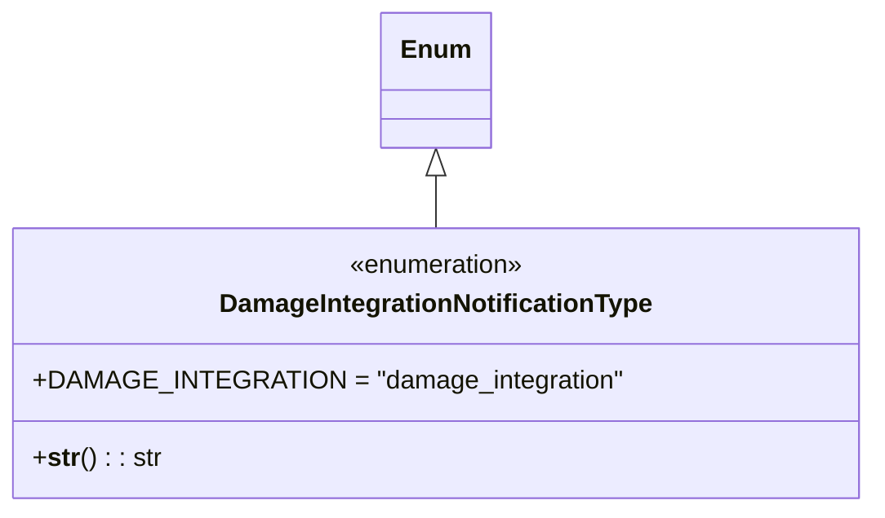

# Diagram: entity_core/entity_service/entity_service/damageview/damage_integration/notification_type.py

> Auto-generated by Obscura crawlers

## Mermaid

### SVG

<svg id="container" width="515.3046875" xmlns="http://www.w3.org/2000/svg" class="classDiagram" height="318" viewBox="0 0 515.3046875 318" role="graphics-document document" aria-roledescription="class"><g><defs><marker id="container_class-aggregationStart" class="marker aggregation class" refX="18" refY="7" markerWidth="190" markerHeight="240" orient="auto"><path d="M 18,7 L9,13 L1,7 L9,1 Z"></path></marker></defs><defs><marker id="container_class-aggregationEnd" class="marker aggregation class" refX="1" refY="7" markerWidth="20" markerHeight="28" orient="auto"><path d="M 18,7 L9,13 L1,7 L9,1 Z"></path></marker></defs><defs><marker id="container_class-extensionStart" class="marker extension class" refX="18" refY="7" markerWidth="190" markerHeight="240" orient="auto"><path d="M 1,7 L18,13 V 1 Z"></path></marker></defs><defs><marker id="container_class-extensionEnd" class="marker extension class" refX="1" refY="7" markerWidth="20" markerHeight="28" orient="auto"><path d="M 1,1 V 13 L18,7 Z"></path></marker></defs><defs><marker id="container_class-compositionStart" class="marker composition class" refX="18" refY="7" markerWidth="190" markerHeight="240" orient="auto"><path d="M 18,7 L9,13 L1,7 L9,1 Z"></path></marker></defs><defs><marker id="container_class-compositionEnd" class="marker composition class" refX="1" refY="7" markerWidth="20" markerHeight="28" orient="auto"><path d="M 18,7 L9,13 L1,7 L9,1 Z"></path></marker></defs><defs><marker id="container_class-dependencyStart" class="marker dependency class" refX="6" refY="7" markerWidth="190" markerHeight="240" orient="auto"><path d="M 5,7 L9,13 L1,7 L9,1 Z"></path></marker></defs><defs><marker id="container_class-dependencyEnd" class="marker dependency class" refX="13" refY="7" markerWidth="20" markerHeight="28" orient="auto"><path d="M 18,7 L9,13 L14,7 L9,1 Z"></path></marker></defs><defs><marker id="container_class-lollipopStart" class="marker lollipop class" refX="13" refY="7" markerWidth="190" markerHeight="240" orient="auto"><circle stroke="black" fill="transparent" cx="7" cy="7" r="6"></circle></marker></defs><defs><marker id="container_class-lollipopEnd" class="marker lollipop class" refX="1" refY="7" markerWidth="190" markerHeight="240" orient="auto"><circle stroke="black" fill="transparent" cx="7" cy="7" r="6"></circle></marker></defs><g class="root"><g class="clusters"></g><g class="edgePaths"><path d="M257.652,109.25L257.652,110.542C257.652,111.833,257.652,114.417,257.652,119.875C257.652,125.333,257.652,133.667,257.652,137.833L257.652,142" id="id_Enum_DamageIntegrationNotificationType_1" class="edge-thickness-normal edge-pattern-solid relation" style=";;;" data-edge="true" data-et="edge" data-id="id_Enum_DamageIntegrationNotificationType_1" data-points="W3sieCI6MjU3LjY1MjM0Mzc1LCJ5Ijo5Mn0seyJ4IjoyNTcuNjUyMzQzNzUsInkiOjExN30seyJ4IjoyNTcuNjUyMzQzNzUsInkiOjE0Mn1d" marker-start="url(#container_class-extensionStart)"></path></g><g class="edgeLabels"><g class="edgeLabel"><g class="label" data-id="id_Enum_DamageIntegrationNotificationType_1" transform="translate(0, 0)"><foreignObject width="0" height="0">

</foreignObject></g></g></g><g class="nodes"><g class="node default" id="classId-Enum-0" transform="translate(257.65234375, 50)"><g class="basic label-container"><path d="M-32.0859375 -42 L32.0859375 -42 L32.0859375 42 L-32.0859375 42" stroke="none" stroke-width="0" fill="#ECECFF" style=""></path><path d="M-32.0859375 -42 C-18.36601766947236 -42, -4.646097838944719 -42, 32.0859375 -42 M-32.0859375 -42 C-12.108589686083633 -42, 7.868758127832734 -42, 32.0859375 -42 M32.0859375 -42 C32.0859375 -22.232399239545217, 32.0859375 -2.464798479090433, 32.0859375 42 M32.0859375 -42 C32.0859375 -8.67924592932313, 32.0859375 24.64150814135374, 32.0859375 42 M32.0859375 42 C18.71288483865908 42, 5.339832177318158 42, -32.0859375 42 M32.0859375 42 C8.955439533177636 42, -14.175058433644729 42, -32.0859375 42 M-32.0859375 42 C-32.0859375 24.75896928755575, -32.0859375 7.517938575111501, -32.0859375 -42 M-32.0859375 42 C-32.0859375 13.571735261769955, -32.0859375 -14.85652947646009, -32.0859375 -42" stroke="#9370DB" stroke-width="1.3" fill="none" stroke-dasharray="0 0" style=""></path></g><g class="annotation-group text" transform="translate(0, -18)"></g><g class="label-group text" transform="translate(-20.0859375, -18)"><g class="label" style="font-weight: bolder" transform="translate(0,-12)"><foreignObject width="40.171875" height="24">

Enum

</foreignObject></g></g><g class="members-group text" transform="translate(-20.0859375, 30)"></g><g class="methods-group text" transform="translate(-20.0859375, 60)"></g><g class="divider" style=""><path d="M-32.0859375 6 C-16.139477519519325 6, -0.1930175390386495 6, 32.0859375 6 M-32.0859375 6 C-11.702155311942427 6, 8.681626876115146 6, 32.0859375 6" stroke="#9370DB" stroke-width="1.3" fill="none" stroke-dasharray="0 0" style=""></path></g><g class="divider" style=""><path d="M-32.0859375 24 C-6.976875210256473 24, 18.132187079487053 24, 32.0859375 24 M-32.0859375 24 C-7.687091553865166 24, 16.71175439226967 24, 32.0859375 24" stroke="#9370DB" stroke-width="1.3" fill="none" stroke-dasharray="0 0" style=""></path></g></g><g class="node default" id="classId-DamageIntegrationNotificationType-1" transform="translate(257.65234375, 226)"><g class="basic label-container"><path d="M-249.65234375 -84 L249.65234375 -84 L249.65234375 84 L-249.65234375 84" stroke="none" stroke-width="0" fill="#ECECFF" style=""></path><path d="M-249.65234375 -84 C-94.86932716421387 -84, 59.91368942157226 -84, 249.65234375 -84 M-249.65234375 -84 C-101.8464922904233 -84, 45.9593591691534 -84, 249.65234375 -84 M249.65234375 -84 C249.65234375 -45.836166951812494, 249.65234375 -7.672333903624988, 249.65234375 84 M249.65234375 -84 C249.65234375 -46.96688389069587, 249.65234375 -9.933767781391737, 249.65234375 84 M249.65234375 84 C146.98880356513737 84, 44.32526338027475 84, -249.65234375 84 M249.65234375 84 C85.58586504182705 84, -78.4806136663459 84, -249.65234375 84 M-249.65234375 84 C-249.65234375 42.66137122608392, -249.65234375 1.3227424521678444, -249.65234375 -84 M-249.65234375 84 C-249.65234375 34.45098138584797, -249.65234375 -15.098037228304065, -249.65234375 -84" stroke="#9370DB" stroke-width="1.3" fill="none" stroke-dasharray="0 0" style=""></path></g><g class="annotation-group text" transform="translate(-55.5546875, -60)"><g class="label" style="" transform="translate(0,-12)"><foreignObject width="111.109375" height="24">

«enumeration»

</foreignObject></g></g><g class="label-group text" transform="translate(-130.1171875, -36)"><g class="label" style="font-weight: bolder" transform="translate(0,-12)"><foreignObject width="260.234375" height="24">

DamageIntegrationNotificationType

</foreignObject></g></g><g class="members-group text" transform="translate(-237.65234375, 12)"><g class="label" style="" transform="translate(0,-12)"><foreignObject width="345.1875" height="24">

+DAMAGE_INTEGRATION = "damage_integration"

</foreignObject></g></g><g class="methods-group text" transform="translate(-237.65234375, 60)"><g class="label" style="" transform="translate(0,-12)"><foreignObject width="78.515625" height="24">

+<strong>str</strong>() : : str

</foreignObject></g></g><g class="divider" style=""><path d="M-249.65234375 -12 C-81.83503524370553 -12, 85.98227326258893 -12, 249.65234375 -12 M-249.65234375 -12 C-62.91859023160288 -12, 123.81516328679425 -12, 249.65234375 -12" stroke="#9370DB" stroke-width="1.3" fill="none" stroke-dasharray="0 0" style=""></path></g><g class="divider" style=""><path d="M-249.65234375 36 C-148.09808536206873 36, -46.54382697413743 36, 249.65234375 36 M-249.65234375 36 C-116.47630483519151 36, 16.699734079616974 36, 249.65234375 36" stroke="#9370DB" stroke-width="1.3" fill="none" stroke-dasharray="0 0" style=""></path></g></g></g></g></g></svg>
