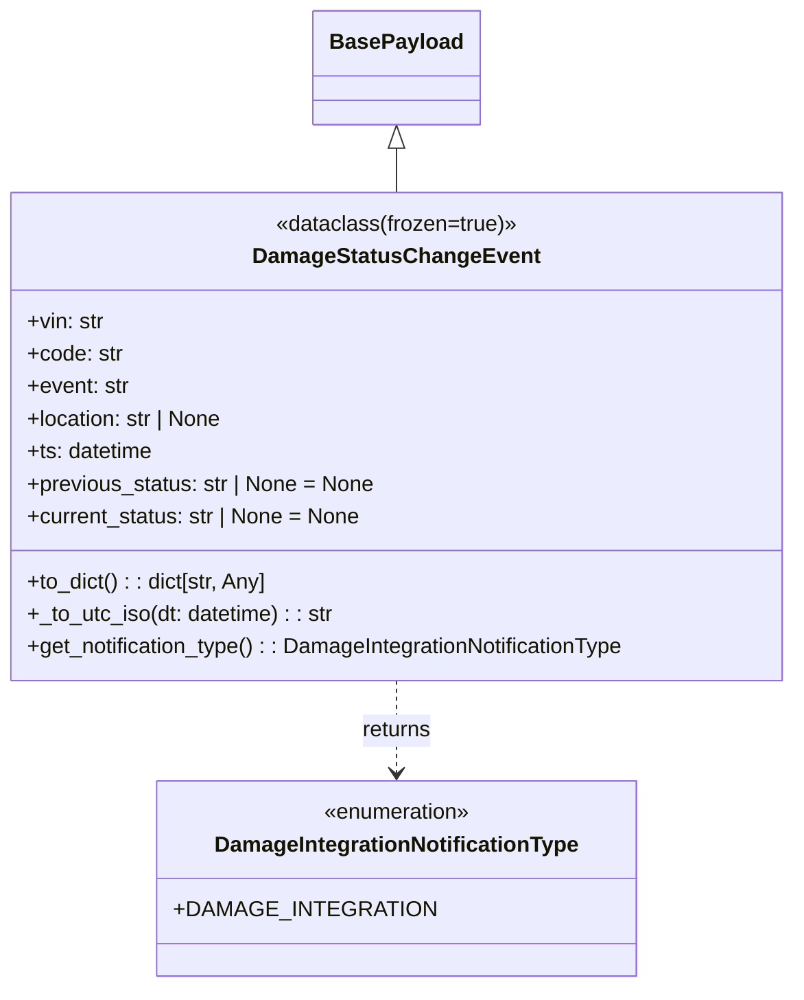

# Diagram: entity_core/entity_service/entity_service/damageview/damage_integration/payloads/damage_status_change_event.py

> Auto-generated by Obscura crawlers

## Mermaid

### SVG

<svg id="container" width="589.125" xmlns="http://www.w3.org/2000/svg" class="classDiagram" height="728" viewBox="0 0 589.125 728" role="graphics-document document" aria-roledescription="class"><g><defs><marker id="container_class-aggregationStart" class="marker aggregation class" refX="18" refY="7" markerWidth="190" markerHeight="240" orient="auto"><path d="M 18,7 L9,13 L1,7 L9,1 Z"></path></marker></defs><defs><marker id="container_class-aggregationEnd" class="marker aggregation class" refX="1" refY="7" markerWidth="20" markerHeight="28" orient="auto"><path d="M 18,7 L9,13 L1,7 L9,1 Z"></path></marker></defs><defs><marker id="container_class-extensionStart" class="marker extension class" refX="18" refY="7" markerWidth="190" markerHeight="240" orient="auto"><path d="M 1,7 L18,13 V 1 Z"></path></marker></defs><defs><marker id="container_class-extensionEnd" class="marker extension class" refX="1" refY="7" markerWidth="20" markerHeight="28" orient="auto"><path d="M 1,1 V 13 L18,7 Z"></path></marker></defs><defs><marker id="container_class-compositionStart" class="marker composition class" refX="18" refY="7" markerWidth="190" markerHeight="240" orient="auto"><path d="M 18,7 L9,13 L1,7 L9,1 Z"></path></marker></defs><defs><marker id="container_class-compositionEnd" class="marker composition class" refX="1" refY="7" markerWidth="20" markerHeight="28" orient="auto"><path d="M 18,7 L9,13 L1,7 L9,1 Z"></path></marker></defs><defs><marker id="container_class-dependencyStart" class="marker dependency class" refX="6" refY="7" markerWidth="190" markerHeight="240" orient="auto"><path d="M 5,7 L9,13 L1,7 L9,1 Z"></path></marker></defs><defs><marker id="container_class-dependencyEnd" class="marker dependency class" refX="13" refY="7" markerWidth="20" markerHeight="28" orient="auto"><path d="M 18,7 L9,13 L14,7 L9,1 Z"></path></marker></defs><defs><marker id="container_class-lollipopStart" class="marker lollipop class" refX="13" refY="7" markerWidth="190" markerHeight="240" orient="auto"><circle stroke="black" fill="transparent" cx="7" cy="7" r="6"></circle></marker></defs><defs><marker id="container_class-lollipopEnd" class="marker lollipop class" refX="1" refY="7" markerWidth="190" markerHeight="240" orient="auto"><circle stroke="black" fill="transparent" cx="7" cy="7" r="6"></circle></marker></defs><g class="root"><g class="clusters"></g><g class="edgePaths"><path d="M294.563,109.25L294.563,110.542C294.563,111.833,294.563,114.417,294.563,119.875C294.563,125.333,294.563,133.667,294.563,137.833L294.563,142" id="id_BasePayload_DamageStatusChangeEvent_1" class="edge-thickness-normal edge-pattern-solid relation" style=";;;" data-edge="true" data-et="edge" data-id="id_BasePayload_DamageStatusChangeEvent_1" data-points="W3sieCI6Mjk0LjU2MjUsInkiOjkyfSx7IngiOjI5NC41NjI1LCJ5IjoxMTd9LHsieCI6Mjk0LjU2MjUsInkiOjE0Mn1d" marker-start="url(#container_class-extensionStart)"></path><path d="M294.563,502L294.563,508.167C294.563,514.333,294.563,526.667,294.563,538C294.563,549.333,294.563,559.667,294.563,564.833L294.563,570" id="id_DamageStatusChangeEvent_DamageIntegrationNotificationType_2" class="edge-thickness-normal edge-pattern-dashed relation" style=";;;" data-edge="true" data-et="edge" data-id="id_DamageStatusChangeEvent_DamageIntegrationNotificationType_2" data-points="W3sieCI6Mjk0LjU2MjUsInkiOjUwMn0seyJ4IjoyOTQuNTYyNSwieSI6NTM5fSx7IngiOjI5NC41NjI1LCJ5Ijo1NzZ9XQ==" marker-end="url(#container_class-dependencyEnd)"></path></g><g class="edgeLabels"><g class="edgeLabel"><g class="label" data-id="id_BasePayload_DamageStatusChangeEvent_1" transform="translate(0, 0)"><foreignObject width="0" height="0">

</foreignObject></g></g><g class="edgeLabel" transform="translate(294.5625, 539)"><g class="label" data-id="id_DamageStatusChangeEvent_DamageIntegrationNotificationType_2" transform="translate(-26.265625, -12)"><foreignObject width="52.53125" height="24">

returns

</foreignObject></g></g></g><g class="nodes"><g class="node default" id="classId-BasePayload-0" transform="translate(294.5625, 50)"><g class="basic label-container"><path d="M-58.4296875 -42 L58.4296875 -42 L58.4296875 42 L-58.4296875 42" stroke="none" stroke-width="0" fill="#ECECFF" style=""></path><path d="M-58.4296875 -42 C-14.151726692087657 -42, 30.126234115824687 -42, 58.4296875 -42 M-58.4296875 -42 C-24.90560751254965 -42, 8.618472474900699 -42, 58.4296875 -42 M58.4296875 -42 C58.4296875 -24.60096298318738, 58.4296875 -7.201925966374759, 58.4296875 42 M58.4296875 -42 C58.4296875 -18.536892477802994, 58.4296875 4.926215044394013, 58.4296875 42 M58.4296875 42 C20.809784759316322 42, -16.810117981367355 42, -58.4296875 42 M58.4296875 42 C29.083393940375668 42, -0.2628996192486639 42, -58.4296875 42 M-58.4296875 42 C-58.4296875 14.290661957557507, -58.4296875 -13.418676084884986, -58.4296875 -42 M-58.4296875 42 C-58.4296875 14.49035133668751, -58.4296875 -13.01929732662498, -58.4296875 -42" stroke="#9370DB" stroke-width="1.3" fill="none" stroke-dasharray="0 0" style=""></path></g><g class="annotation-group text" transform="translate(0, -18)"></g><g class="label-group text" transform="translate(-46.4296875, -18)"><g class="label" style="font-weight: bolder" transform="translate(0,-12)"><foreignObject width="92.859375" height="24">

BasePayload

</foreignObject></g></g><g class="members-group text" transform="translate(-46.4296875, 30)"></g><g class="methods-group text" transform="translate(-46.4296875, 60)"></g><g class="divider" style=""><path d="M-58.4296875 6 C-26.518834084883526 6, 5.392019330232948 6, 58.4296875 6 M-58.4296875 6 C-34.69085485489751 6, -10.952022209795011 6, 58.4296875 6" stroke="#9370DB" stroke-width="1.3" fill="none" stroke-dasharray="0 0" style=""></path></g><g class="divider" style=""><path d="M-58.4296875 24 C-26.962609525325014 24, 4.504468449349972 24, 58.4296875 24 M-58.4296875 24 C-17.83736765467907 24, 22.75495219064186 24, 58.4296875 24" stroke="#9370DB" stroke-width="1.3" fill="none" stroke-dasharray="0 0" style=""></path></g></g><g class="node default" id="classId-DamageIntegrationNotificationType-1" transform="translate(294.5625, 648)"><g class="basic label-container"><path d="M-162.63671875 -72 L162.63671875 -72 L162.63671875 72 L-162.63671875 72" stroke="none" stroke-width="0" fill="#ECECFF" style=""></path><path d="M-162.63671875 -72 C-92.58400765173859 -72, -22.531296553477176 -72, 162.63671875 -72 M-162.63671875 -72 C-49.78652083680852 -72, 63.06367707638296 -72, 162.63671875 -72 M162.63671875 -72 C162.63671875 -31.592545652804567, 162.63671875 8.814908694390866, 162.63671875 72 M162.63671875 -72 C162.63671875 -20.03398493132876, 162.63671875 31.93203013734248, 162.63671875 72 M162.63671875 72 C50.21534152041069 72, -62.20603570917862 72, -162.63671875 72 M162.63671875 72 C71.32335574363606 72, -19.990007262727886 72, -162.63671875 72 M-162.63671875 72 C-162.63671875 21.668923278725615, -162.63671875 -28.66215344254877, -162.63671875 -72 M-162.63671875 72 C-162.63671875 32.17648691621578, -162.63671875 -7.647026167568441, -162.63671875 -72" stroke="#9370DB" stroke-width="1.3" fill="none" stroke-dasharray="0 0" style=""></path></g><g class="annotation-group text" transform="translate(-55.5546875, -48)"><g class="label" style="" transform="translate(0,-12)"><foreignObject width="111.109375" height="24">

«enumeration»

</foreignObject></g></g><g class="label-group text" transform="translate(-130.1171875, -24)"><g class="label" style="font-weight: bolder" transform="translate(0,-12)"><foreignObject width="260.234375" height="24">

DamageIntegrationNotificationType

</foreignObject></g></g><g class="members-group text" transform="translate(-150.63671875, 24)"><g class="label" style="" transform="translate(0,-12)"><foreignObject width="171.15625" height="24">

+DAMAGE_INTEGRATION

</foreignObject></g></g><g class="methods-group text" transform="translate(-150.63671875, 72)"></g><g class="divider" style=""><path d="M-162.63671875 0 C-87.92145823171708 0, -13.206197713434165 0, 162.63671875 0 M-162.63671875 0 C-44.33121869603974 0, 73.97428135792052 0, 162.63671875 0" stroke="#9370DB" stroke-width="1.3" fill="none" stroke-dasharray="0 0" style=""></path></g><g class="divider" style=""><path d="M-162.63671875 48 C-80.90671935806965 48, 0.8232800338606978 48, 162.63671875 48 M-162.63671875 48 C-69.64848158946805 48, 23.339755571063904 48, 162.63671875 48" stroke="#9370DB" stroke-width="1.3" fill="none" stroke-dasharray="0 0" style=""></path></g></g><g class="node default" id="classId-DamageStatusChangeEvent-2" transform="translate(294.5625, 322)"><g class="basic label-container"><path d="M-286.5625 -180 L286.5625 -180 L286.5625 180 L-286.5625 180" stroke="none" stroke-width="0" fill="#ECECFF" style=""></path><path d="M-286.5625 -180 C-83.67927870359398 -180, 119.20394259281204 -180, 286.5625 -180 M-286.5625 -180 C-115.85643242368096 -180, 54.849635152638086 -180, 286.5625 -180 M286.5625 -180 C286.5625 -93.77894955558865, 286.5625 -7.557899111177306, 286.5625 180 M286.5625 -180 C286.5625 -65.65588978420958, 286.5625 48.688220431580845, 286.5625 180 M286.5625 180 C76.76722364146346 180, -133.02805271707308 180, -286.5625 180 M286.5625 180 C138.50643830035744 180, -9.54962339928511 180, -286.5625 180 M-286.5625 180 C-286.5625 62.88620380934796, -286.5625 -54.22759238130408, -286.5625 -180 M-286.5625 180 C-286.5625 57.763889061116245, -286.5625 -64.47222187776751, -286.5625 -180" stroke="#9370DB" stroke-width="1.3" fill="none" stroke-dasharray="0 0" style=""></path></g><g class="annotation-group text" transform="translate(-89.890625, -156)"><g class="label" style="" transform="translate(0,-12)"><foreignObject width="179.78125" height="24">

«dataclass(frozen=true)»

</foreignObject></g></g><g class="label-group text" transform="translate(-99.703125, -132)"><g class="label" style="font-weight: bolder" transform="translate(0,-12)"><foreignObject width="199.40625" height="24">

DamageStatusChangeEvent

</foreignObject></g></g><g class="members-group text" transform="translate(-274.5625, -84)"><g class="label" style="" transform="translate(0,-12)"><foreignObject width="57.09375" height="24">

+vin: str

</foreignObject></g><g class="label" style="" transform="translate(0,12)"><foreignObject width="70.453125" height="24">

+code: str

</foreignObject></g><g class="label" style="" transform="translate(0,36)"><foreignObject width="75.890625" height="24">

+event: str

</foreignObject></g><g class="label" style="" transform="translate(0,60)"><foreignObject width="147.9375" height="24">

+location: str | None

</foreignObject></g><g class="label" style="" transform="translate(0,84)"><foreignObject width="94.484375" height="24">

+ts: datetime

</foreignObject></g><g class="label" style="" transform="translate(0,108)"><foreignObject width="258.40625" height="24">

+previous_status: str | None = None

</foreignObject></g><g class="label" style="" transform="translate(0,132)"><foreignObject width="248.90625" height="24">

+current_status: str | None = None

</foreignObject></g></g><g class="methods-group text" transform="translate(-274.5625, 108)"><g class="label" style="" transform="translate(0,-12)"><foreignObject width="179.078125" height="24">

+to_dict() : : dict[str, Any]

</foreignObject></g><g class="label" style="" transform="translate(0,12)"><foreignObject width="228.34375" height="24">

+_to_utc_iso(dt: datetime) : : str

</foreignObject></g><g class="label" style="" transform="translate(0,36)"><foreignObject width="449.421875" height="24">

+get_notification_type() : : DamageIntegrationNotificationType

</foreignObject></g></g><g class="divider" style=""><path d="M-286.5625 -108 C-89.35431242529248 -108, 107.85387514941505 -108, 286.5625 -108 M-286.5625 -108 C-116.58963737363419 -108, 53.38322525273162 -108, 286.5625 -108" stroke="#9370DB" stroke-width="1.3" fill="none" stroke-dasharray="0 0" style=""></path></g><g class="divider" style=""><path d="M-286.5625 84 C-113.29733962902841 84, 59.96782074194317 84, 286.5625 84 M-286.5625 84 C-76.39420631259384 84, 133.77408737481232 84, 286.5625 84" stroke="#9370DB" stroke-width="1.3" fill="none" stroke-dasharray="0 0" style=""></path></g></g></g></g></g></svg>
