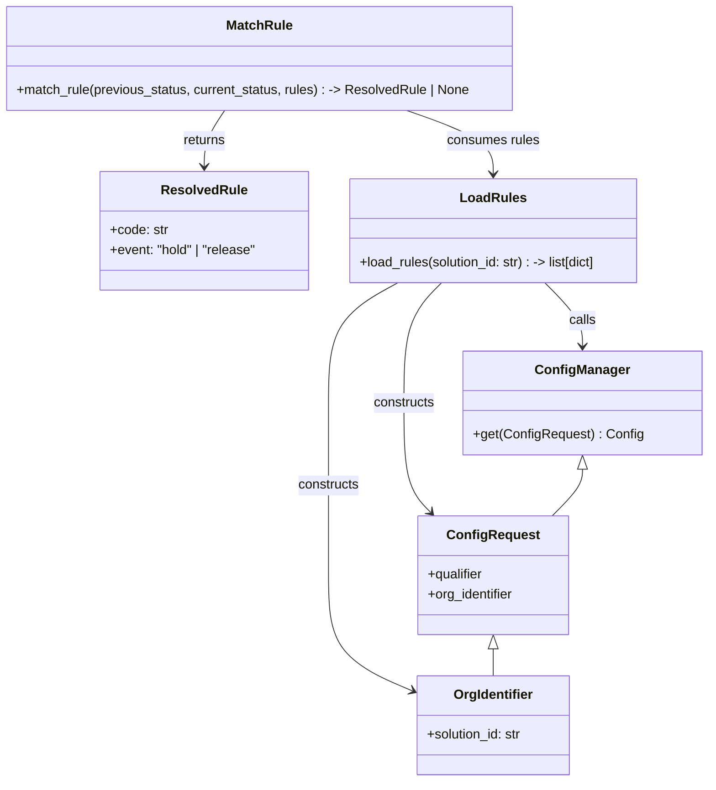

# Diagram: entity_core/entity_service/entity_service/damageview/damage_integration/rule.py


> Auto-generated by Obscura crawlers

## Diagram 1



### SVG

<svg id="container" width="856.384765625" xmlns="http://www.w3.org/2000/svg" class="classDiagram" height="948" viewBox="0 0 856.384765625 948" role="graphics-document document" aria-roledescription="class"><style>#container{font-family:"trebuchet ms",verdana,arial,sans-serif;font-size:16px;fill:#333;}@keyframes edge-animation-frame{from{stroke-dashoffset:0;}}@keyframes dash{to{stroke-dashoffset:0;}}#container .edge-animation-slow{stroke-dasharray:9,5!important;stroke-dashoffset:900;animation:dash 50s linear infinite;stroke-linecap:round;}#container .edge-animation-fast{stroke-dasharray:9,5!important;stroke-dashoffset:900;animation:dash 20s linear infinite;stroke-linecap:round;}#container .error-icon{fill:#552222;}#container .error-text{fill:#552222;stroke:#552222;}#container .edge-thickness-normal{stroke-width:1px;}#container .edge-thickness-thick{stroke-width:3.5px;}#container .edge-pattern-solid{stroke-dasharray:0;}#container .edge-thickness-invisible{stroke-width:0;fill:none;}#container .edge-pattern-dashed{stroke-dasharray:3;}#container .edge-pattern-dotted{stroke-dasharray:2;}#container .marker{fill:#333333;stroke:#333333;}#container .marker.cross{stroke:#333333;}#container svg{font-family:"trebuchet ms",verdana,arial,sans-serif;font-size:16px;}#container p{margin:0;}#container g.classGroup text{fill:#9370DB;stroke:none;font-family:"trebuchet ms",verdana,arial,sans-serif;font-size:10px;}#container g.classGroup text .title{font-weight:bolder;}#container .nodeLabel,#container .edgeLabel{color:#131300;}#container .edgeLabel .label rect{fill:#ECECFF;}#container .label text{fill:#131300;}#container .labelBkg{background:#ECECFF;}#container .edgeLabel .label span{background:#ECECFF;}#container .classTitle{font-weight:bolder;}#container .node rect,#container .node circle,#container .node ellipse,#container .node polygon,#container .node path{fill:#ECECFF;stroke:#9370DB;stroke-width:1px;}#container .divider{stroke:#9370DB;stroke-width:1;}#container g.clickable{cursor:pointer;}#container g.classGroup rect{fill:#ECECFF;stroke:#9370DB;}#container g.classGroup line{stroke:#9370DB;stroke-width:1;}#container .classLabel .box{stroke:none;stroke-width:0;fill:#ECECFF;opacity:0.5;}#container .classLabel .label{fill:#9370DB;font-size:10px;}#container .relation{stroke:#333333;stroke-width:1;fill:none;}#container .dashed-line{stroke-dasharray:3;}#container .dotted-line{stroke-dasharray:1 2;}#container #compositionStart,#container .composition{fill:#333333!important;stroke:#333333!important;stroke-width:1;}#container #compositionEnd,#container .composition{fill:#333333!important;stroke:#333333!important;stroke-width:1;}#container #dependencyStart,#container .dependency{fill:#333333!important;stroke:#333333!important;stroke-width:1;}#container #dependencyStart,#container .dependency{fill:#333333!important;stroke:#333333!important;stroke-width:1;}#container #extensionStart,#container .extension{fill:transparent!important;stroke:#333333!important;stroke-width:1;}#container #extensionEnd,#container .extension{fill:transparent!important;stroke:#333333!important;stroke-width:1;}#container #aggregationStart,#container .aggregation{fill:transparent!important;stroke:#333333!important;stroke-width:1;}#container #aggregationEnd,#container .aggregation{fill:transparent!important;stroke:#333333!important;stroke-width:1;}#container #lollipopStart,#container .lollipop{fill:#ECECFF!important;stroke:#333333!important;stroke-width:1;}#container #lollipopEnd,#container .lollipop{fill:#ECECFF!important;stroke:#333333!important;stroke-width:1;}#container .edgeTerminals{font-size:11px;line-height:initial;}#container .classTitleText{text-anchor:middle;font-size:18px;fill:#333;}#container .label-icon{display:inline-block;height:1em;overflow:visible;vertical-align:-0.125em;}#container .node .label-icon path{fill:currentColor;stroke:revert;stroke-width:revert;}#container :root{--mermaid-font-family:"trebuchet ms",verdana,arial,sans-serif;}</style><g><defs><marker id="container_class-aggregationStart" class="marker aggregation class" refX="18" refY="7" markerWidth="190" markerHeight="240" orient="auto"><path d="M 18,7 L9,13 L1,7 L9,1 Z"></path></marker></defs><defs><marker id="container_class-aggregationEnd" class="marker aggregation class" refX="1" refY="7" markerWidth="20" markerHeight="28" orient="auto"><path d="M 18,7 L9,13 L1,7 L9,1 Z"></path></marker></defs><defs><marker id="container_class-extensionStart" class="marker extension class" refX="18" refY="7" markerWidth="190" markerHeight="240" orient="auto"><path d="M 1,7 L18,13 V 1 Z"></path></marker></defs><defs><marker id="container_class-extensionEnd" class="marker extension class" refX="1" refY="7" markerWidth="20" markerHeight="28" orient="auto"><path d="M 1,1 V 13 L18,7 Z"></path></marker></defs><defs><marker id="container_class-compositionStart" class="marker composition class" refX="18" refY="7" markerWidth="190" markerHeight="240" orient="auto"><path d="M 18,7 L9,13 L1,7 L9,1 Z"></path></marker></defs><defs><marker id="container_class-compositionEnd" class="marker composition class" refX="1" refY="7" markerWidth="20" markerHeight="28" orient="auto"><path d="M 18,7 L9,13 L1,7 L9,1 Z"></path></marker></defs><defs><marker id="container_class-dependencyStart" class="marker dependency class" refX="6" refY="7" markerWidth="190" markerHeight="240" orient="auto"><path d="M 5,7 L9,13 L1,7 L9,1 Z"></path></marker></defs><defs><marker id="container_class-dependencyEnd" class="marker dependency class" refX="13" refY="7" markerWidth="20" markerHeight="28" orient="auto"><path d="M 18,7 L9,13 L14,7 L9,1 Z"></path></marker></defs><defs><marker id="container_class-lollipopStart" class="marker lollipop class" refX="13" refY="7" markerWidth="190" markerHeight="240" orient="auto"><circle stroke="black" fill="transparent" cx="7" cy="7" r="6"></circle></marker></defs><defs><marker id="container_class-lollipopEnd" class="marker lollipop class" refX="1" refY="7" markerWidth="190" markerHeight="240" orient="auto"><circle stroke="black" fill="transparent" cx="7" cy="7" r="6"></circle></marker></defs><g class="root"><g class="clusters"></g><g class="edgePaths"><path d="M663.232,343L670.724,350.667C678.216,358.333,693.201,373.667,700.693,386.5C708.186,399.333,708.186,409.667,708.186,414.833L708.186,420" id="id_LoadRules_ConfigManager_1" class="edge-thickness-normal edge-pattern-solid relation" style=";;;" data-edge="true" data-et="edge" data-id="id_LoadRules_ConfigManager_1" data-points="W3sieCI6NjYzLjIzMTUyNTk0NjEwMDksInkiOjM0M30seyJ4Ijo3MDguMTg1NTQ2ODc1LCJ5IjozODl9LHsieCI6NzA4LjE4NTU0Njg3NSwieSI6NDI2fV0=" marker-end="url(#container_class-dependencyEnd)"></path><path d="M540.097,343L532.604,350.667C525.112,358.333,510.127,373.667,502.635,398C495.143,422.333,495.143,455.667,495.143,489C495.143,522.333,495.143,555.667,500.47,577.785C505.798,599.903,516.453,610.806,521.78,616.257L527.108,621.709" id="id_LoadRules_ConfigRequest_2" class="edge-thickness-normal edge-pattern-solid relation" style=";;;" data-edge="true" data-et="edge" data-id="id_LoadRules_ConfigRequest_2" data-points="W3sieCI6NTQwLjA5NjU5OTA1Mzg5OTEsInkiOjM0M30seyJ4Ijo0OTUuMTQyNTc4MTI1LCJ5IjozODl9LHsieCI6NDk1LjE0MjU3ODEyNSwieSI6NDg5fSx7IngiOjQ5NS4xNDI1NzgxMjUsInkiOjU4OX0seyJ4Ijo1MzEuMzAxMjQ3MTMzMDI3NiwieSI6NjI2fV0=" marker-end="url(#container_class-dependencyEnd)"></path><path d="M486.76,343L472.777,350.667C458.794,358.333,430.827,373.667,416.844,398C402.861,422.333,402.861,455.667,402.861,489C402.861,522.333,402.861,555.667,402.861,590.5C402.861,625.333,402.861,661.667,402.861,696C402.861,730.333,402.861,762.667,419.35,785.883C435.839,809.1,468.818,823.2,485.307,830.25L501.796,837.3" id="id_LoadRules_OrgIdentifier_3" class="edge-thickness-normal edge-pattern-solid relation" style=";;;" data-edge="true" data-et="edge" data-id="id_LoadRules_OrgIdentifier_3" data-points="W3sieCI6NDg2Ljc1OTcyOTc4Nzg0NDA0LCJ5IjozNDN9LHsieCI6NDAyLjg2MTMyODEyNSwieSI6Mzg5fSx7IngiOjQwMi44NjEzMjgxMjUsInkiOjQ4OX0seyJ4Ijo0MDIuODYxMzI4MTI1LCJ5Ijo1ODl9LHsieCI6NDAyLjg2MTMyODEyNSwieSI6Njk4fSx7IngiOjQwMi44NjEzMjgxMjUsInkiOjc5NX0seyJ4Ijo1MDcuMzEyNSwieSI6ODM5LjY1OTA5MjAyNTUwNDN9XQ==" marker-end="url(#container_class-dependencyEnd)"></path><path d="M271.471,134L267.039,140.167C262.607,146.333,253.743,158.667,249.311,170C244.879,181.333,244.879,191.667,244.879,196.833L244.879,202" id="id_MatchRule_ResolvedRule_4" class="edge-thickness-normal edge-pattern-solid relation" style=";;;" data-edge="true" data-et="edge" data-id="id_MatchRule_ResolvedRule_4" data-points="W3sieCI6MjcxLjQ3MTIxMDkzNzUsInkiOjEzNH0seyJ4IjoyNDQuODc4OTA2MjUsInkiOjE3MX0seyJ4IjoyNDQuODc4OTA2MjUsInkiOjIwOH1d" marker-end="url(#container_class-dependencyEnd)"></path><path d="M496.246,134L513.816,140.167C531.385,146.333,566.525,158.667,584.094,171.5C601.664,184.333,601.664,197.667,601.664,204.333L601.664,211" id="id_MatchRule_LoadRules_5" class="edge-thickness-normal edge-pattern-solid relation" style=";;;" data-edge="true" data-et="edge" data-id="id_MatchRule_LoadRules_5" data-points="W3sieCI6NDk2LjI0NTg1OTM3NSwieSI6MTM0fSx7IngiOjYwMS42NjQwNjI1LCJ5IjoxNzF9LHsieCI6NjAxLjY2NDA2MjUsInkiOjIxN31d" marker-end="url(#container_class-dependencyEnd)"></path><path d="M708.186,569.25L708.186,572.542C708.186,575.833,708.186,582.417,702.159,591.875C696.133,601.333,684.08,613.667,678.053,619.833L672.027,626" id="id_ConfigManager_ConfigRequest_6" class="edge-thickness-normal edge-pattern-solid relation" style=";;;" data-edge="true" data-et="edge" data-id="id_ConfigManager_ConfigRequest_6" data-points="W3sieCI6NzA4LjE4NTU0Njg3NSwieSI6NTUyfSx7IngiOjcwOC4xODU1NDY4NzUsInkiOjU4OX0seyJ4Ijo2NzIuMDI2ODc3ODY2OTcyNCwieSI6NjI2fV0=" marker-start="url(#container_class-extensionStart)"></path><path d="M601.664,787.25L601.664,788.542C601.664,789.833,601.664,792.417,601.664,797.875C601.664,803.333,601.664,811.667,601.664,815.833L601.664,820" id="id_ConfigRequest_OrgIdentifier_7" class="edge-thickness-normal edge-pattern-solid relation" style=";;;" data-edge="true" data-et="edge" data-id="id_ConfigRequest_OrgIdentifier_7" data-points="W3sieCI6NjAxLjY2NDA2MjUsInkiOjc3MH0seyJ4Ijo2MDEuNjY0MDYyNSwieSI6Nzk1fSx7IngiOjYwMS42NjQwNjI1LCJ5Ijo4MjB9XQ==" marker-start="url(#container_class-extensionStart)"></path></g><g class="edgeLabels"><g class="edgeLabel" transform="translate(708.185546875, 389)"><g class="label" data-id="id_LoadRules_ConfigManager_1" transform="translate(-16.4453125, -12)"><foreignObject width="32.890625" height="24"><div xmlns="http://www.w3.org/1999/xhtml" class="labelBkg" style="display: table-cell; white-space: nowrap; line-height: 1.5; max-width: 200px; text-align: center;"><span class="edgeLabel"><p>calls</p></span></div></foreignObject></g></g><g class="edgeLabel" transform="translate(495.142578125, 489)"><g class="label" data-id="id_LoadRules_ConfigRequest_2" transform="translate(-37.84375, -12)"><foreignObject width="75.6875" height="24"><div xmlns="http://www.w3.org/1999/xhtml" class="labelBkg" style="display: table-cell; white-space: nowrap; line-height: 1.5; max-width: 200px; text-align: center;"><span class="edgeLabel"><p>constructs</p></span></div></foreignObject></g></g><g class="edgeLabel" transform="translate(402.861328125, 589)"><g class="label" data-id="id_LoadRules_OrgIdentifier_3" transform="translate(-37.84375, -12)"><foreignObject width="75.6875" height="24"><div xmlns="http://www.w3.org/1999/xhtml" class="labelBkg" style="display: table-cell; white-space: nowrap; line-height: 1.5; max-width: 200px; text-align: center;"><span class="edgeLabel"><p>constructs</p></span></div></foreignObject></g></g><g class="edgeLabel" transform="translate(244.87890625, 171)"><g class="label" data-id="id_MatchRule_ResolvedRule_4" transform="translate(-26.265625, -12)"><foreignObject width="52.53125" height="24"><div xmlns="http://www.w3.org/1999/xhtml" class="labelBkg" style="display: table-cell; white-space: nowrap; line-height: 1.5; max-width: 200px; text-align: center;"><span class="edgeLabel"><p>returns</p></span></div></foreignObject></g></g><g class="edgeLabel" transform="translate(601.6640625, 171)"><g class="label" data-id="id_MatchRule_LoadRules_5" transform="translate(-56.6328125, -12)"><foreignObject width="113.265625" height="24"><div xmlns="http://www.w3.org/1999/xhtml" class="labelBkg" style="display: table-cell; white-space: nowrap; line-height: 1.5; max-width: 200px; text-align: center;"><span class="edgeLabel"><p>consumes rules</p></span></div></foreignObject></g></g><g class="edgeLabel"><g class="label" data-id="id_ConfigManager_ConfigRequest_6" transform="translate(0, 0)"><foreignObject width="0" height="0"><div xmlns="http://www.w3.org/1999/xhtml" class="labelBkg" style="display: table-cell; white-space: nowrap; line-height: 1.5; max-width: 200px; text-align: center;"><span class="edgeLabel"></span></div></foreignObject></g></g><g class="edgeLabel"><g class="label" data-id="id_ConfigRequest_OrgIdentifier_7" transform="translate(0, 0)"><foreignObject width="0" height="0"><div xmlns="http://www.w3.org/1999/xhtml" class="labelBkg" style="display: table-cell; white-space: nowrap; line-height: 1.5; max-width: 200px; text-align: center;"><span class="edgeLabel"></span></div></foreignObject></g></g></g><g class="nodes"><g class="node default" id="classId-ResolvedRule-0" transform="translate(244.87890625, 280)"><g class="basic label-container"><path d="M-127.78515625 -72 L127.78515625 -72 L127.78515625 72 L-127.78515625 72" stroke="none" stroke-width="0" fill="#ECECFF" style=""></path><path d="M-127.78515625 -72 C-74.06906588005371 -72, -20.352975510107427 -72, 127.78515625 -72 M-127.78515625 -72 C-62.10824975074293 -72, 3.568656748514144 -72, 127.78515625 -72 M127.78515625 -72 C127.78515625 -15.543418866902435, 127.78515625 40.91316226619513, 127.78515625 72 M127.78515625 -72 C127.78515625 -21.852406939037337, 127.78515625 28.295186121925326, 127.78515625 72 M127.78515625 72 C33.49914075135591 72, -60.78687474728818 72, -127.78515625 72 M127.78515625 72 C46.20413168108746 72, -35.37689288782508 72, -127.78515625 72 M-127.78515625 72 C-127.78515625 16.57327072477075, -127.78515625 -38.8534585504585, -127.78515625 -72 M-127.78515625 72 C-127.78515625 42.6895807969437, -127.78515625 13.379161593887403, -127.78515625 -72" stroke="#9370DB" stroke-width="1.3" fill="none" stroke-dasharray="0 0" style=""></path></g><g class="annotation-group text" transform="translate(0, -48)"></g><g class="label-group text" transform="translate(-49.5859375, -48)"><g class="label" style="font-weight: bolder" transform="translate(0,-12)"><foreignObject width="99.171875" height="24"><div xmlns="http://www.w3.org/1999/xhtml" style="display: table-cell; white-space: nowrap; line-height: 1.5; max-width: 148px; text-align: center;"><span class="nodeLabel markdown-node-label" style=""><p>ResolvedRule</p></span></div></foreignObject></g></g><g class="members-group text" transform="translate(-115.78515625, 0)"><g class="label" style="" transform="translate(0,-12)"><foreignObject width="70.453125" height="24"><div xmlns="http://www.w3.org/1999/xhtml" style="display: table-cell; white-space: nowrap; line-height: 1.5; max-width: 129px; text-align: center;"><span class="nodeLabel markdown-node-label" style=""><p>+code: str</p></span></div></foreignObject></g><g class="label" style="" transform="translate(0,12)"><foreignObject width="181.984375" height="24"><div xmlns="http://www.w3.org/1999/xhtml" style="display: table-cell; white-space: nowrap; line-height: 1.5; max-width: 239px; text-align: center;"><span class="nodeLabel markdown-node-label" style=""><p>+event: "hold" | "release"</p></span></div></foreignObject></g></g><g class="methods-group text" transform="translate(-115.78515625, 72)"></g><g class="divider" style=""><path d="M-127.78515625 -24 C-28.873356646490294 -24, 70.03844295701941 -24, 127.78515625 -24 M-127.78515625 -24 C-29.28084249986823 -24, 69.22347125026354 -24, 127.78515625 -24" stroke="#9370DB" stroke-width="1.3" fill="none" stroke-dasharray="0 0" style=""></path></g><g class="divider" style=""><path d="M-127.78515625 48 C-34.949541213289294 48, 57.88607382342141 48, 127.78515625 48 M-127.78515625 48 C-63.40838640803048 48, 0.9683834339390387 48, 127.78515625 48" stroke="#9370DB" stroke-width="1.3" fill="none" stroke-dasharray="0 0" style=""></path></g></g><g class="node default" id="classId-ConfigManager-1" transform="translate(708.185546875, 489)"><g class="basic label-container"><path d="M-140.19921875 -63 L140.19921875 -63 L140.19921875 63 L-140.19921875 63" stroke="none" stroke-width="0" fill="#ECECFF" style=""></path><path d="M-140.19921875 -63 C-78.44997701891234 -63, -16.70073528782467 -63, 140.19921875 -63 M-140.19921875 -63 C-57.04068896922779 -63, 26.117840811544426 -63, 140.19921875 -63 M140.19921875 -63 C140.19921875 -25.568004078027165, 140.19921875 11.86399184394567, 140.19921875 63 M140.19921875 -63 C140.19921875 -19.8305580403785, 140.19921875 23.338883919243003, 140.19921875 63 M140.19921875 63 C28.954340746417813 63, -82.29053725716437 63, -140.19921875 63 M140.19921875 63 C71.41889688162692 63, 2.638575013253842 63, -140.19921875 63 M-140.19921875 63 C-140.19921875 26.113588623088823, -140.19921875 -10.772822753822354, -140.19921875 -63 M-140.19921875 63 C-140.19921875 24.128448039015716, -140.19921875 -14.743103921968569, -140.19921875 -63" stroke="#9370DB" stroke-width="1.3" fill="none" stroke-dasharray="0 0" style=""></path></g><g class="annotation-group text" transform="translate(0, -39)"></g><g class="label-group text" transform="translate(-54.3828125, -39)"><g class="label" style="font-weight: bolder" transform="translate(0,-12)"><foreignObject width="108.765625" height="24"><div xmlns="http://www.w3.org/1999/xhtml" style="display: table-cell; white-space: nowrap; line-height: 1.5; max-width: 158px; text-align: center;"><span class="nodeLabel markdown-node-label" style=""><p>ConfigManager</p></span></div></foreignObject></g></g><g class="members-group text" transform="translate(-128.19921875, 9)"></g><g class="methods-group text" transform="translate(-128.19921875, 39)"><g class="label" style="" transform="translate(0,-12)"><foreignObject width="202.015625" height="24"><div xmlns="http://www.w3.org/1999/xhtml" style="display: table-cell; white-space: nowrap; line-height: 1.5; max-width: 260px; text-align: center;"><span class="nodeLabel markdown-node-label" style=""><p>+get(ConfigRequest) : Config</p></span></div></foreignObject></g></g><g class="divider" style=""><path d="M-140.19921875 -15 C-77.80443726789224 -15, -15.40965578578448 -15, 140.19921875 -15 M-140.19921875 -15 C-54.9172930515677 -15, 30.364632646864607 -15, 140.19921875 -15" stroke="#9370DB" stroke-width="1.3" fill="none" stroke-dasharray="0 0" style=""></path></g><g class="divider" style=""><path d="M-140.19921875 9 C-78.84920140059887 9, -17.49918405119773 9, 140.19921875 9 M-140.19921875 9 C-78.15764691343455 9, -16.116075076869095 9, 140.19921875 9" stroke="#9370DB" stroke-width="1.3" fill="none" stroke-dasharray="0 0" style=""></path></g></g><g class="node default" id="classId-ConfigRequest-2" transform="translate(601.6640625, 698)"><g class="basic label-container"><path d="M-91.71875 -72 L91.71875 -72 L91.71875 72 L-91.71875 72" stroke="none" stroke-width="0" fill="#ECECFF" style=""></path><path d="M-91.71875 -72 C-41.874462978739196 -72, 7.9698240425216085 -72, 91.71875 -72 M-91.71875 -72 C-33.40718039702685 -72, 24.904389205946302 -72, 91.71875 -72 M91.71875 -72 C91.71875 -42.516836970021195, 91.71875 -13.03367394004239, 91.71875 72 M91.71875 -72 C91.71875 -26.22939502203591, 91.71875 19.54120995592818, 91.71875 72 M91.71875 72 C28.088702550312476 72, -35.54134489937505 72, -91.71875 72 M91.71875 72 C41.738973762796135 72, -8.24080247440773 72, -91.71875 72 M-91.71875 72 C-91.71875 23.90401534539808, -91.71875 -24.19196930920384, -91.71875 -72 M-91.71875 72 C-91.71875 36.247258620176865, -91.71875 0.4945172403537299, -91.71875 -72" stroke="#9370DB" stroke-width="1.3" fill="none" stroke-dasharray="0 0" style=""></path></g><g class="annotation-group text" transform="translate(0, -48)"></g><g class="label-group text" transform="translate(-52.90625, -48)"><g class="label" style="font-weight: bolder" transform="translate(0,-12)"><foreignObject width="105.8125" height="24"><div xmlns="http://www.w3.org/1999/xhtml" style="display: table-cell; white-space: nowrap; line-height: 1.5; max-width: 154px; text-align: center;"><span class="nodeLabel markdown-node-label" style=""><p>ConfigRequest</p></span></div></foreignObject></g></g><g class="members-group text" transform="translate(-79.71875, 0)"><g class="label" style="" transform="translate(0,-12)"><foreignObject width="68.71875" height="24"><div xmlns="http://www.w3.org/1999/xhtml" style="display: table-cell; white-space: nowrap; line-height: 1.5; max-width: 127px; text-align: center;"><span class="nodeLabel markdown-node-label" style=""><p>+qualifier</p></span></div></foreignObject></g><g class="label" style="" transform="translate(0,12)"><foreignObject width="106.53125" height="24"><div xmlns="http://www.w3.org/1999/xhtml" style="display: table-cell; white-space: nowrap; line-height: 1.5; max-width: 165px; text-align: center;"><span class="nodeLabel markdown-node-label" style=""><p>+org_identifier</p></span></div></foreignObject></g></g><g class="methods-group text" transform="translate(-79.71875, 72)"></g><g class="divider" style=""><path d="M-91.71875 -24 C-25.06829208354125 -24, 41.5821658329175 -24, 91.71875 -24 M-91.71875 -24 C-39.837813890690114 -24, 12.043122218619772 -24, 91.71875 -24" stroke="#9370DB" stroke-width="1.3" fill="none" stroke-dasharray="0 0" style=""></path></g><g class="divider" style=""><path d="M-91.71875 48 C-29.82734414437433 48, 32.06406171125134 48, 91.71875 48 M-91.71875 48 C-42.47159641371279 48, 6.775557172574423 48, 91.71875 48" stroke="#9370DB" stroke-width="1.3" fill="none" stroke-dasharray="0 0" style=""></path></g></g><g class="node default" id="classId-OrgIdentifier-3" transform="translate(601.6640625, 880)"><g class="basic label-container"><path d="M-94.3515625 -60 L94.3515625 -60 L94.3515625 60 L-94.3515625 60" stroke="none" stroke-width="0" fill="#ECECFF" style=""></path><path d="M-94.3515625 -60 C-40.25496278950212 -60, 13.841636920995754 -60, 94.3515625 -60 M-94.3515625 -60 C-49.292598016765794 -60, -4.233633533531588 -60, 94.3515625 -60 M94.3515625 -60 C94.3515625 -25.473730561603475, 94.3515625 9.05253887679305, 94.3515625 60 M94.3515625 -60 C94.3515625 -23.619674190041287, 94.3515625 12.760651619917425, 94.3515625 60 M94.3515625 60 C50.12792520985931 60, 5.904287919718627 60, -94.3515625 60 M94.3515625 60 C28.46121179420527 60, -37.42913891158946 60, -94.3515625 60 M-94.3515625 60 C-94.3515625 34.204519243196415, -94.3515625 8.409038486392838, -94.3515625 -60 M-94.3515625 60 C-94.3515625 24.697116448198997, -94.3515625 -10.605767103602005, -94.3515625 -60" stroke="#9370DB" stroke-width="1.3" fill="none" stroke-dasharray="0 0" style=""></path></g><g class="annotation-group text" transform="translate(0, -36)"></g><g class="label-group text" transform="translate(-46.984375, -36)"><g class="label" style="font-weight: bolder" transform="translate(0,-12)"><foreignObject width="93.96875" height="24"><div xmlns="http://www.w3.org/1999/xhtml" style="display: table-cell; white-space: nowrap; line-height: 1.5; max-width: 143px; text-align: center;"><span class="nodeLabel markdown-node-label" style=""><p>OrgIdentifier</p></span></div></foreignObject></g></g><g class="members-group text" transform="translate(-82.3515625, 12)"><g class="label" style="" transform="translate(0,-12)"><foreignObject width="117.71875" height="24"><div xmlns="http://www.w3.org/1999/xhtml" style="display: table-cell; white-space: nowrap; line-height: 1.5; max-width: 176px; text-align: center;"><span class="nodeLabel markdown-node-label" style=""><p>+solution_id: str</p></span></div></foreignObject></g></g><g class="methods-group text" transform="translate(-82.3515625, 60)"></g><g class="divider" style=""><path d="M-94.3515625 -12 C-49.3129133991505 -12, -4.274264298301006 -12, 94.3515625 -12 M-94.3515625 -12 C-43.513409911608605 -12, 7.32474267678279 -12, 94.3515625 -12" stroke="#9370DB" stroke-width="1.3" fill="none" stroke-dasharray="0 0" style=""></path></g><g class="divider" style=""><path d="M-94.3515625 36 C-31.75672235538486 36, 30.83811778923028 36, 94.3515625 36 M-94.3515625 36 C-45.956971921310696 36, 2.437618657378607 36, 94.3515625 36" stroke="#9370DB" stroke-width="1.3" fill="none" stroke-dasharray="0 0" style=""></path></g></g><g class="node default" id="classId-LoadRules-4" transform="translate(601.6640625, 280)"><g class="basic label-container"><path d="M-179 -63 L179 -63 L179 63 L-179 63" stroke="none" stroke-width="0" fill="#ECECFF" style=""></path><path d="M-179 -63 C-74.74864153299 -63, 29.502716934019986 -63, 179 -63 M-179 -63 C-82.22990192503934 -63, 14.540196149921314 -63, 179 -63 M179 -63 C179 -21.92412114472272, 179 19.151757710554563, 179 63 M179 -63 C179 -36.279890962911516, 179 -9.559781925823032, 179 63 M179 63 C90.58445553157328 63, 2.1689110631465667 63, -179 63 M179 63 C93.61040805046743 63, 8.220816100934854 63, -179 63 M-179 63 C-179 17.56623908314156, -179 -27.86752183371688, -179 -63 M-179 63 C-179 27.83475177377386, -179 -7.33049645245228, -179 -63" stroke="#9370DB" stroke-width="1.3" fill="none" stroke-dasharray="0 0" style=""></path></g><g class="annotation-group text" transform="translate(0, -39)"></g><g class="label-group text" transform="translate(-37.8125, -39)"><g class="label" style="font-weight: bolder" transform="translate(0,-12)"><foreignObject width="75.625" height="24"><div xmlns="http://www.w3.org/1999/xhtml" style="display: table-cell; white-space: nowrap; line-height: 1.5; max-width: 125px; text-align: center;"><span class="nodeLabel markdown-node-label" style=""><p>LoadRules</p></span></div></foreignObject></g></g><g class="members-group text" transform="translate(-167, 9)"></g><g class="methods-group text" transform="translate(-167, 39)"><g class="label" style="" transform="translate(0,-12)"><foreignObject width="296.1875" height="24"><div xmlns="http://www.w3.org/1999/xhtml" style="display: table-cell; white-space: nowrap; line-height: 1.5; max-width: 375px; text-align: center;"><span class="nodeLabel markdown-node-label" style=""><p>+load_rules(solution_id: str) : -&gt; list[dict]</p></span></div></foreignObject></g></g><g class="divider" style=""><path d="M-179 -15 C-57.447678080255955 -15, 64.10464383948809 -15, 179 -15 M-179 -15 C-85.78345242991372 -15, 7.433095140172554 -15, 179 -15" stroke="#9370DB" stroke-width="1.3" fill="none" stroke-dasharray="0 0" style=""></path></g><g class="divider" style=""><path d="M-179 9 C-106.74071624662653 9, -34.48143249325307 9, 179 9 M-179 9 C-61.06665649744849 9, 56.86668700510302 9, 179 9" stroke="#9370DB" stroke-width="1.3" fill="none" stroke-dasharray="0 0" style=""></path></g></g><g class="node default" id="classId-MatchRule-5" transform="translate(316.75, 71)"><g class="basic label-container"><path d="M-308.75 -63 L308.75 -63 L308.75 63 L-308.75 63" stroke="none" stroke-width="0" fill="#ECECFF" style=""></path><path d="M-308.75 -63 C-165.77598997516904 -63, -22.80197995033808 -63, 308.75 -63 M-308.75 -63 C-73.44267530497615 -63, 161.8646493900477 -63, 308.75 -63 M308.75 -63 C308.75 -34.56519914826117, 308.75 -6.130398296522351, 308.75 63 M308.75 -63 C308.75 -28.095270811930135, 308.75 6.80945837613973, 308.75 63 M308.75 63 C62.775267337060654 63, -183.1994653258787 63, -308.75 63 M308.75 63 C155.13120239139639 63, 1.5124047827927711 63, -308.75 63 M-308.75 63 C-308.75 35.674996382172665, -308.75 8.349992764345338, -308.75 -63 M-308.75 63 C-308.75 19.142544141820807, -308.75 -24.714911716358387, -308.75 -63" stroke="#9370DB" stroke-width="1.3" fill="none" stroke-dasharray="0 0" style=""></path></g><g class="annotation-group text" transform="translate(0, -39)"></g><g class="label-group text" transform="translate(-38.328125, -39)"><g class="label" style="font-weight: bolder" transform="translate(0,-12)"><foreignObject width="76.65625" height="24"><div xmlns="http://www.w3.org/1999/xhtml" style="display: table-cell; white-space: nowrap; line-height: 1.5; max-width: 126px; text-align: center;"><span class="nodeLabel markdown-node-label" style=""><p>MatchRule</p></span></div></foreignObject></g></g><g class="members-group text" transform="translate(-296.75, 9)"></g><g class="methods-group text" transform="translate(-296.75, 39)"><g class="label" style="" transform="translate(0,-12)"><foreignObject width="555.171875" height="24"><div xmlns="http://www.w3.org/1999/xhtml" style="display: table-cell; white-space: nowrap; line-height: 1.5; max-width: 634px; text-align: center;"><span class="nodeLabel markdown-node-label" style=""><p>+match_rule(previous_status, current_status, rules) : -&gt; ResolvedRule | None</p></span></div></foreignObject></g></g><g class="divider" style=""><path d="M-308.75 -15 C-110.20442549409978 -15, 88.34114901180044 -15, 308.75 -15 M-308.75 -15 C-64.35708152803866 -15, 180.03583694392267 -15, 308.75 -15" stroke="#9370DB" stroke-width="1.3" fill="none" stroke-dasharray="0 0" style=""></path></g><g class="divider" style=""><path d="M-308.75 9 C-184.2369565064717 9, -59.7239130129434 9, 308.75 9 M-308.75 9 C-104.57498750125586 9, 99.60002499748828 9, 308.75 9" stroke="#9370DB" stroke-width="1.3" fill="none" stroke-dasharray="0 0" style=""></path></g></g></g></g></g></svg>

## Diagram 2

```mermaid
flowchart TD
    Start((Start)) --> Normalize[Normalize previous_status -> prev and current_status -> curr (lowercase)]
    Normalize --> InitWildcard[Set wildcard_match = None]
    InitWildcard --> ForEach[For each rule in rules]
    ForEach --> Extract[Extract fromStatuses, toStatuses (lowercase)]
    Extract --> CheckTo{Is curr in to_statuses?}
    CheckTo -- No --> NextRule[Continue to next rule]
    NextRule --> ForEach
    CheckTo -- Yes --> CreateResolved[resolved = ResolvedRule(code, event)]
    CreateResolved --> CheckFrom{Is prev in from_statuses?}
    CheckFrom -- Yes --> ReturnResolved([Return resolved]) --> End((End))
    CheckFrom -- No --> CheckWildcard{Does "*" exist in from_statuses?}
    CheckWildcard -- Yes --> SetWildcard[Set wildcard_match = resolved] --> NextRule
    CheckWildcard -- No --> NextRule
    NextRule --> ForEach
    ForEach -.-> AfterLoop[After iterating all rules]
    AfterLoop --> HasWildcard{wildcard_match != null?}
    HasWildcard -- Yes --> ReturnWildcard([Return wildcard_match]) --> End
    HasWildcard -- No --> ReturnNone([Return None]) --> End
```

> SVG rendering failed for this diagram.
