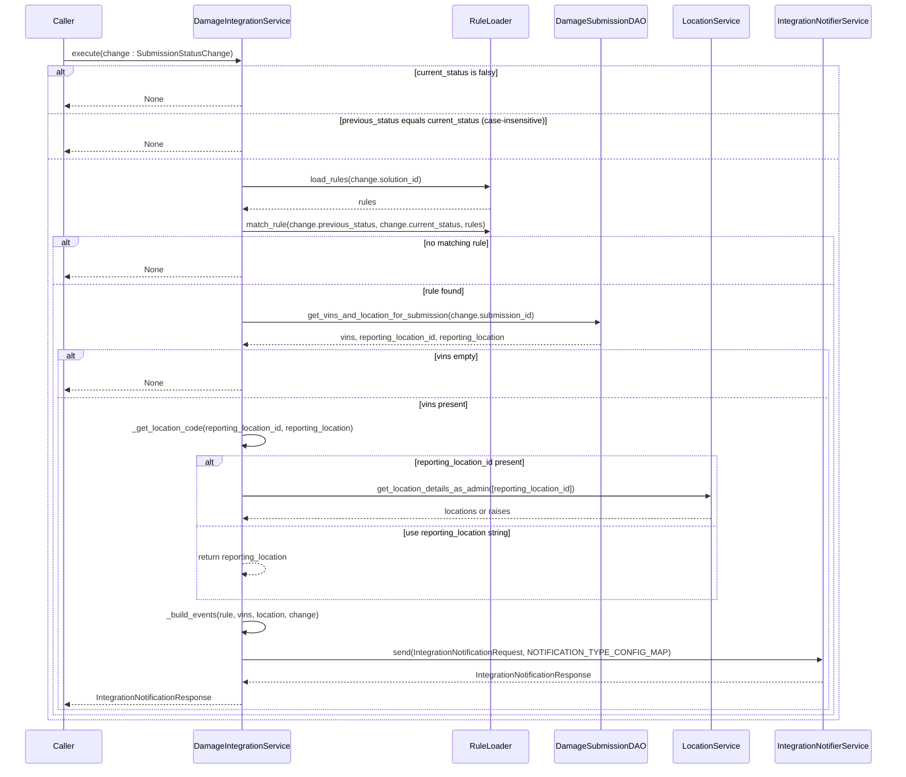
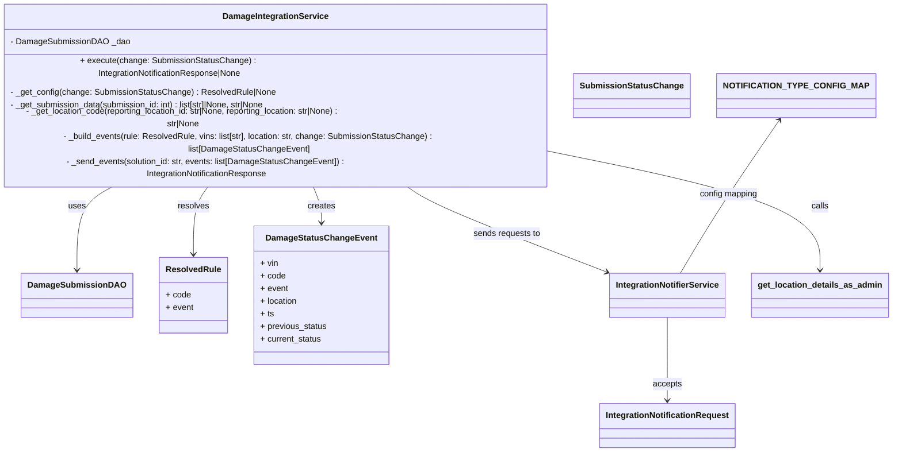

# Diagram: entity_core/entity_service/entity_service/damageview/damage_integration/service.py

> Auto-generated by Obscura crawlers

## Diagram 1

### SVG

<svg id="container" width="1878" xmlns="http://www.w3.org/2000/svg" height="1580" viewBox="-50 -10 1878 1580" role="graphics-document document" aria-roledescription="sequence"><g><rect x="1571" y="1494" fill="#eaeaea" stroke="#666" width="207" height="65" name="Notifier" rx="3" ry="3" class="actor actor-bottom"></rect><text x="1674.5" y="1526.5" dominant-baseline="central" alignment-baseline="central" class="actor actor-box" style="text-anchor: middle; font-size: 16px; font-weight: 400;"><tspan x="1674.5" dy="0">IntegrationNotifierService</tspan></text></g><g><rect x="1371" y="1494" fill="#eaeaea" stroke="#666" width="150" height="65" name="Location" rx="3" ry="3" class="actor actor-bottom"></rect><text x="1446" y="1526.5" dominant-baseline="central" alignment-baseline="central" class="actor actor-box" style="text-anchor: middle; font-size: 16px; font-weight: 400;"><tspan x="1446" dy="0">LocationService</tspan></text></g><g><rect x="1129" y="1494" fill="#eaeaea" stroke="#666" width="192" height="65" name="DAO" rx="3" ry="3" class="actor actor-bottom"></rect><text x="1225" y="1526.5" dominant-baseline="central" alignment-baseline="central" class="actor actor-box" style="text-anchor: middle; font-size: 16px; font-weight: 400;"><tspan x="1225" dy="0">DamageSubmissionDAO</tspan></text></g><g><rect x="929" y="1494" fill="#eaeaea" stroke="#666" width="150" height="65" name="Rules" rx="3" ry="3" class="actor actor-bottom"></rect><text x="1004" y="1526.5" dominant-baseline="central" alignment-baseline="central" class="actor actor-box" style="text-anchor: middle; font-size: 16px; font-weight: 400;"><tspan x="1004" dy="0">RuleLoader</tspan></text></g><g><rect x="353" y="1494" fill="#eaeaea" stroke="#666" width="210" height="65" name="Service" rx="3" ry="3" class="actor actor-bottom"></rect><text x="458" y="1526.5" dominant-baseline="central" alignment-baseline="central" class="actor actor-box" style="text-anchor: middle; font-size: 16px; font-weight: 400;"><tspan x="458" dy="0">DamageIntegrationService</tspan></text></g><g><rect x="0" y="1494" fill="#eaeaea" stroke="#666" width="150" height="65" name="Caller" rx="3" ry="3" class="actor actor-bottom"></rect><text x="75" y="1526.5" dominant-baseline="central" alignment-baseline="central" class="actor actor-box" style="text-anchor: middle; font-size: 16px; font-weight: 400;"><tspan x="75" dy="0">Caller</tspan></text></g><g><line id="actor5" x1="1674.5" y1="65" x2="1674.5" y2="1494" class="actor-line 200" stroke-width="0.5px" stroke="#999" name="Notifier"></line><g id="root-5"><rect x="1571" y="0" fill="#eaeaea" stroke="#666" width="207" height="65" name="Notifier" rx="3" ry="3" class="actor actor-top"></rect><text x="1674.5" y="32.5" dominant-baseline="central" alignment-baseline="central" class="actor actor-box" style="text-anchor: middle; font-size: 16px; font-weight: 400;"><tspan x="1674.5" dy="0">IntegrationNotifierService</tspan></text></g></g><g><line id="actor4" x1="1446" y1="65" x2="1446" y2="1494" class="actor-line 200" stroke-width="0.5px" stroke="#999" name="Location"></line><g id="root-4"><rect x="1371" y="0" fill="#eaeaea" stroke="#666" width="150" height="65" name="Location" rx="3" ry="3" class="actor actor-top"></rect><text x="1446" y="32.5" dominant-baseline="central" alignment-baseline="central" class="actor actor-box" style="text-anchor: middle; font-size: 16px; font-weight: 400;"><tspan x="1446" dy="0">LocationService</tspan></text></g></g><g><line id="actor3" x1="1225" y1="65" x2="1225" y2="1494" class="actor-line 200" stroke-width="0.5px" stroke="#999" name="DAO"></line><g id="root-3"><rect x="1129" y="0" fill="#eaeaea" stroke="#666" width="192" height="65" name="DAO" rx="3" ry="3" class="actor actor-top"></rect><text x="1225" y="32.5" dominant-baseline="central" alignment-baseline="central" class="actor actor-box" style="text-anchor: middle; font-size: 16px; font-weight: 400;"><tspan x="1225" dy="0">DamageSubmissionDAO</tspan></text></g></g><g><line id="actor2" x1="1004" y1="65" x2="1004" y2="1494" class="actor-line 200" stroke-width="0.5px" stroke="#999" name="Rules"></line><g id="root-2"><rect x="929" y="0" fill="#eaeaea" stroke="#666" width="150" height="65" name="Rules" rx="3" ry="3" class="actor actor-top"></rect><text x="1004" y="32.5" dominant-baseline="central" alignment-baseline="central" class="actor actor-box" style="text-anchor: middle; font-size: 16px; font-weight: 400;"><tspan x="1004" dy="0">RuleLoader</tspan></text></g></g><g><line id="actor1" x1="458" y1="65" x2="458" y2="1494" class="actor-line 200" stroke-width="0.5px" stroke="#999" name="Service"></line><g id="root-1"><rect x="353" y="0" fill="#eaeaea" stroke="#666" width="210" height="65" name="Service" rx="3" ry="3" class="actor actor-top"></rect><text x="458" y="32.5" dominant-baseline="central" alignment-baseline="central" class="actor actor-box" style="text-anchor: middle; font-size: 16px; font-weight: 400;"><tspan x="458" dy="0">DamageIntegrationService</tspan></text></g></g><g><line id="actor0" x1="75" y1="65" x2="75" y2="1494" class="actor-line 200" stroke-width="0.5px" stroke="#999" name="Caller"></line><g id="root-0"><rect x="0" y="0" fill="#eaeaea" stroke="#666" width="150" height="65" name="Caller" rx="3" ry="3" class="actor actor-top"></rect><text x="75" y="32.5" dominant-baseline="central" alignment-baseline="central" class="actor actor-box" style="text-anchor: middle; font-size: 16px; font-weight: 400;"><tspan x="75" dy="0">Caller</tspan></text></g></g><g></g><defs><symbol id="computer" width="24" height="24"><path transform="scale(.5)" d="M2 2v13h20v-13h-20zm18 11h-16v-9h16v9zm-10.228 6l.466-1h3.524l.467 1h-4.457zm14.228 3h-24l2-6h2.104l-1.33 4h18.45l-1.297-4h2.073l2 6zm-5-10h-14v-7h14v7z"></path></symbol></defs><defs><symbol id="database" fill-rule="evenodd" clip-rule="evenodd"><path transform="scale(.5)" d="M12.258.001l.256.004.255.005.253.008.251.01.249.012.247.015.246.016.242.019.241.02.239.023.236.024.233.027.231.028.229.031.225.032.223.034.22.036.217.038.214.04.211.041.208.043.205.045.201.046.198.048.194.05.191.051.187.053.183.054.18.056.175.057.172.059.168.06.163.061.16.063.155.064.15.066.074.033.073.033.071.034.07.034.069.035.068.035.067.035.066.035.064.036.064.036.062.036.06.036.06.037.058.037.058.037.055.038.055.038.053.038.052.038.051.039.05.039.048.039.047.039.045.04.044.04.043.04.041.04.04.041.039.041.037.041.036.041.034.041.033.042.032.042.03.042.029.042.027.042.026.043.024.043.023.043.021.043.02.043.018.044.017.043.015.044.013.044.012.044.011.045.009.044.007.045.006.045.004.045.002.045.001.045v17l-.001.045-.002.045-.004.045-.006.045-.007.045-.009.044-.011.045-.012.044-.013.044-.015.044-.017.043-.018.044-.02.043-.021.043-.023.043-.024.043-.026.043-.027.042-.029.042-.03.042-.032.042-.033.042-.034.041-.036.041-.037.041-.039.041-.04.041-.041.04-.043.04-.044.04-.045.04-.047.039-.048.039-.05.039-.051.039-.052.038-.053.038-.055.038-.055.038-.058.037-.058.037-.06.037-.06.036-.062.036-.064.036-.064.036-.066.035-.067.035-.068.035-.069.035-.07.034-.071.034-.073.033-.074.033-.15.066-.155.064-.16.063-.163.061-.168.06-.172.059-.175.057-.18.056-.183.054-.187.053-.191.051-.194.05-.198.048-.201.046-.205.045-.208.043-.211.041-.214.04-.217.038-.22.036-.223.034-.225.032-.229.031-.231.028-.233.027-.236.024-.239.023-.241.02-.242.019-.246.016-.247.015-.249.012-.251.01-.253.008-.255.005-.256.004-.258.001-.258-.001-.256-.004-.255-.005-.253-.008-.251-.01-.249-.012-.247-.015-.245-.016-.243-.019-.241-.02-.238-.023-.236-.024-.234-.027-.231-.028-.228-.031-.226-.032-.223-.034-.22-.036-.217-.038-.214-.04-.211-.041-.208-.043-.204-.045-.201-.046-.198-.048-.195-.05-.19-.051-.187-.053-.184-.054-.179-.056-.176-.057-.172-.059-.167-.06-.164-.061-.159-.063-.155-.064-.151-.066-.074-.033-.072-.033-.072-.034-.07-.034-.069-.035-.068-.035-.067-.035-.066-.035-.064-.036-.063-.036-.062-.036-.061-.036-.06-.037-.058-.037-.057-.037-.056-.038-.055-.038-.053-.038-.052-.038-.051-.039-.049-.039-.049-.039-.046-.039-.046-.04-.044-.04-.043-.04-.041-.04-.04-.041-.039-.041-.037-.041-.036-.041-.034-.041-.033-.042-.032-.042-.03-.042-.029-.042-.027-.042-.026-.043-.024-.043-.023-.043-.021-.043-.02-.043-.018-.044-.017-.043-.015-.044-.013-.044-.012-.044-.011-.045-.009-.044-.007-.045-.006-.045-.004-.045-.002-.045-.001-.045v-17l.001-.045.002-.045.004-.045.006-.045.007-.045.009-.044.011-.045.012-.044.013-.044.015-.044.017-.043.018-.044.02-.043.021-.043.023-.043.024-.043.026-.043.027-.042.029-.042.03-.042.032-.042.033-.042.034-.041.036-.041.037-.041.039-.041.04-.041.041-.04.043-.04.044-.04.046-.04.046-.039.049-.039.049-.039.051-.039.052-.038.053-.038.055-.038.056-.038.057-.037.058-.037.06-.037.061-.036.062-.036.063-.036.064-.036.066-.035.067-.035.068-.035.069-.035.07-.034.072-.034.072-.033.074-.033.151-.066.155-.064.159-.063.164-.061.167-.06.172-.059.176-.057.179-.056.184-.054.187-.053.19-.051.195-.05.198-.048.201-.046.204-.045.208-.043.211-.041.214-.04.217-.038.22-.036.223-.034.226-.032.228-.031.231-.028.234-.027.236-.024.238-.023.241-.02.243-.019.245-.016.247-.015.249-.012.251-.01.253-.008.255-.005.256-.004.258-.001.258.001zm-9.258 20.499v.01l.001.021.003.021.004.022.005.021.006.022.007.022.009.023.01.022.011.023.012.023.013.023.015.023.016.024.017.023.018.024.019.024.021.024.022.025.023.024.024.025.052.049.056.05.061.051.066.051.07.051.075.051.079.052.084.052.088.052.092.052.097.052.102.051.105.052.11.052.114.051.119.051.123.051.127.05.131.05.135.05.139.048.144.049.147.047.152.047.155.047.16.045.163.045.167.043.171.043.176.041.178.041.183.039.187.039.19.037.194.035.197.035.202.033.204.031.209.03.212.029.216.027.219.025.222.024.226.021.23.02.233.018.236.016.24.015.243.012.246.01.249.008.253.005.256.004.259.001.26-.001.257-.004.254-.005.25-.008.247-.011.244-.012.241-.014.237-.016.233-.018.231-.021.226-.021.224-.024.22-.026.216-.027.212-.028.21-.031.205-.031.202-.034.198-.034.194-.036.191-.037.187-.039.183-.04.179-.04.175-.042.172-.043.168-.044.163-.045.16-.046.155-.046.152-.047.148-.048.143-.049.139-.049.136-.05.131-.05.126-.05.123-.051.118-.052.114-.051.11-.052.106-.052.101-.052.096-.052.092-.052.088-.053.083-.051.079-.052.074-.052.07-.051.065-.051.06-.051.056-.05.051-.05.023-.024.023-.025.021-.024.02-.024.019-.024.018-.024.017-.024.015-.023.014-.024.013-.023.012-.023.01-.023.01-.022.008-.022.006-.022.006-.022.004-.022.004-.021.001-.021.001-.021v-4.127l-.077.055-.08.053-.083.054-.085.053-.087.052-.09.052-.093.051-.095.05-.097.05-.1.049-.102.049-.105.048-.106.047-.109.047-.111.046-.114.045-.115.045-.118.044-.12.043-.122.042-.124.042-.126.041-.128.04-.13.04-.132.038-.134.038-.135.037-.138.037-.139.035-.142.035-.143.034-.144.033-.147.032-.148.031-.15.03-.151.03-.153.029-.154.027-.156.027-.158.026-.159.025-.161.024-.162.023-.163.022-.165.021-.166.02-.167.019-.169.018-.169.017-.171.016-.173.015-.173.014-.175.013-.175.012-.177.011-.178.01-.179.008-.179.008-.181.006-.182.005-.182.004-.184.003-.184.002h-.37l-.184-.002-.184-.003-.182-.004-.182-.005-.181-.006-.179-.008-.179-.008-.178-.01-.176-.011-.176-.012-.175-.013-.173-.014-.172-.015-.171-.016-.17-.017-.169-.018-.167-.019-.166-.02-.165-.021-.163-.022-.162-.023-.161-.024-.159-.025-.157-.026-.156-.027-.155-.027-.153-.029-.151-.03-.15-.03-.148-.031-.146-.032-.145-.033-.143-.034-.141-.035-.14-.035-.137-.037-.136-.037-.134-.038-.132-.038-.13-.04-.128-.04-.126-.041-.124-.042-.122-.042-.12-.044-.117-.043-.116-.045-.113-.045-.112-.046-.109-.047-.106-.047-.105-.048-.102-.049-.1-.049-.097-.05-.095-.05-.093-.052-.09-.051-.087-.052-.085-.053-.083-.054-.08-.054-.077-.054v4.127zm0-5.654v.011l.001.021.003.021.004.021.005.022.006.022.007.022.009.022.01.022.011.023.012.023.013.023.015.024.016.023.017.024.018.024.019.024.021.024.022.024.023.025.024.024.052.05.056.05.061.05.066.051.07.051.075.052.079.051.084.052.088.052.092.052.097.052.102.052.105.052.11.051.114.051.119.052.123.05.127.051.131.05.135.049.139.049.144.048.147.048.152.047.155.046.16.045.163.045.167.044.171.042.176.042.178.04.183.04.187.038.19.037.194.036.197.034.202.033.204.032.209.03.212.028.216.027.219.025.222.024.226.022.23.02.233.018.236.016.24.014.243.012.246.01.249.008.253.006.256.003.259.001.26-.001.257-.003.254-.006.25-.008.247-.01.244-.012.241-.015.237-.016.233-.018.231-.02.226-.022.224-.024.22-.025.216-.027.212-.029.21-.03.205-.032.202-.033.198-.035.194-.036.191-.037.187-.039.183-.039.179-.041.175-.042.172-.043.168-.044.163-.045.16-.045.155-.047.152-.047.148-.048.143-.048.139-.05.136-.049.131-.05.126-.051.123-.051.118-.051.114-.052.11-.052.106-.052.101-.052.096-.052.092-.052.088-.052.083-.052.079-.052.074-.051.07-.052.065-.051.06-.05.056-.051.051-.049.023-.025.023-.024.021-.025.02-.024.019-.024.018-.024.017-.024.015-.023.014-.023.013-.024.012-.022.01-.023.01-.023.008-.022.006-.022.006-.022.004-.021.004-.022.001-.021.001-.021v-4.139l-.077.054-.08.054-.083.054-.085.052-.087.053-.09.051-.093.051-.095.051-.097.05-.1.049-.102.049-.105.048-.106.047-.109.047-.111.046-.114.045-.115.044-.118.044-.12.044-.122.042-.124.042-.126.041-.128.04-.13.039-.132.039-.134.038-.135.037-.138.036-.139.036-.142.035-.143.033-.144.033-.147.033-.148.031-.15.03-.151.03-.153.028-.154.028-.156.027-.158.026-.159.025-.161.024-.162.023-.163.022-.165.021-.166.02-.167.019-.169.018-.169.017-.171.016-.173.015-.173.014-.175.013-.175.012-.177.011-.178.009-.179.009-.179.007-.181.007-.182.005-.182.004-.184.003-.184.002h-.37l-.184-.002-.184-.003-.182-.004-.182-.005-.181-.007-.179-.007-.179-.009-.178-.009-.176-.011-.176-.012-.175-.013-.173-.014-.172-.015-.171-.016-.17-.017-.169-.018-.167-.019-.166-.02-.165-.021-.163-.022-.162-.023-.161-.024-.159-.025-.157-.026-.156-.027-.155-.028-.153-.028-.151-.03-.15-.03-.148-.031-.146-.033-.145-.033-.143-.033-.141-.035-.14-.036-.137-.036-.136-.037-.134-.038-.132-.039-.13-.039-.128-.04-.126-.041-.124-.042-.122-.043-.12-.043-.117-.044-.116-.044-.113-.046-.112-.046-.109-.046-.106-.047-.105-.048-.102-.049-.1-.049-.097-.05-.095-.051-.093-.051-.09-.051-.087-.053-.085-.052-.083-.054-.08-.054-.077-.054v4.139zm0-5.666v.011l.001.02.003.022.004.021.005.022.006.021.007.022.009.023.01.022.011.023.012.023.013.023.015.023.016.024.017.024.018.023.019.024.021.025.022.024.023.024.024.025.052.05.056.05.061.05.066.051.07.051.075.052.079.051.084.052.088.052.092.052.097.052.102.052.105.051.11.052.114.051.119.051.123.051.127.05.131.05.135.05.139.049.144.048.147.048.152.047.155.046.16.045.163.045.167.043.171.043.176.042.178.04.183.04.187.038.19.037.194.036.197.034.202.033.204.032.209.03.212.028.216.027.219.025.222.024.226.021.23.02.233.018.236.017.24.014.243.012.246.01.249.008.253.006.256.003.259.001.26-.001.257-.003.254-.006.25-.008.247-.01.244-.013.241-.014.237-.016.233-.018.231-.02.226-.022.224-.024.22-.025.216-.027.212-.029.21-.03.205-.032.202-.033.198-.035.194-.036.191-.037.187-.039.183-.039.179-.041.175-.042.172-.043.168-.044.163-.045.16-.045.155-.047.152-.047.148-.048.143-.049.139-.049.136-.049.131-.051.126-.05.123-.051.118-.052.114-.051.11-.052.106-.052.101-.052.096-.052.092-.052.088-.052.083-.052.079-.052.074-.052.07-.051.065-.051.06-.051.056-.05.051-.049.023-.025.023-.025.021-.024.02-.024.019-.024.018-.024.017-.024.015-.023.014-.024.013-.023.012-.023.01-.022.01-.023.008-.022.006-.022.006-.022.004-.022.004-.021.001-.021.001-.021v-4.153l-.077.054-.08.054-.083.053-.085.053-.087.053-.09.051-.093.051-.095.051-.097.05-.1.049-.102.048-.105.048-.106.048-.109.046-.111.046-.114.046-.115.044-.118.044-.12.043-.122.043-.124.042-.126.041-.128.04-.13.039-.132.039-.134.038-.135.037-.138.036-.139.036-.142.034-.143.034-.144.033-.147.032-.148.032-.15.03-.151.03-.153.028-.154.028-.156.027-.158.026-.159.024-.161.024-.162.023-.163.023-.165.021-.166.02-.167.019-.169.018-.169.017-.171.016-.173.015-.173.014-.175.013-.175.012-.177.01-.178.01-.179.009-.179.007-.181.006-.182.006-.182.004-.184.003-.184.001-.185.001-.185-.001-.184-.001-.184-.003-.182-.004-.182-.006-.181-.006-.179-.007-.179-.009-.178-.01-.176-.01-.176-.012-.175-.013-.173-.014-.172-.015-.171-.016-.17-.017-.169-.018-.167-.019-.166-.02-.165-.021-.163-.023-.162-.023-.161-.024-.159-.024-.157-.026-.156-.027-.155-.028-.153-.028-.151-.03-.15-.03-.148-.032-.146-.032-.145-.033-.143-.034-.141-.034-.14-.036-.137-.036-.136-.037-.134-.038-.132-.039-.13-.039-.128-.041-.126-.041-.124-.041-.122-.043-.12-.043-.117-.044-.116-.044-.113-.046-.112-.046-.109-.046-.106-.048-.105-.048-.102-.048-.1-.05-.097-.049-.095-.051-.093-.051-.09-.052-.087-.052-.085-.053-.083-.053-.08-.054-.077-.054v4.153zm8.74-8.179l-.257.004-.254.005-.25.008-.247.011-.244.012-.241.014-.237.016-.233.018-.231.021-.226.022-.224.023-.22.026-.216.027-.212.028-.21.031-.205.032-.202.033-.198.034-.194.036-.191.038-.187.038-.183.04-.179.041-.175.042-.172.043-.168.043-.163.045-.16.046-.155.046-.152.048-.148.048-.143.048-.139.049-.136.05-.131.05-.126.051-.123.051-.118.051-.114.052-.11.052-.106.052-.101.052-.096.052-.092.052-.088.052-.083.052-.079.052-.074.051-.07.052-.065.051-.06.05-.056.05-.051.05-.023.025-.023.024-.021.024-.02.025-.019.024-.018.024-.017.023-.015.024-.014.023-.013.023-.012.023-.01.023-.01.022-.008.022-.006.023-.006.021-.004.022-.004.021-.001.021-.001.021.001.021.001.021.004.021.004.022.006.021.006.023.008.022.01.022.01.023.012.023.013.023.014.023.015.024.017.023.018.024.019.024.02.025.021.024.023.024.023.025.051.05.056.05.06.05.065.051.07.052.074.051.079.052.083.052.088.052.092.052.096.052.101.052.106.052.11.052.114.052.118.051.123.051.126.051.131.05.136.05.139.049.143.048.148.048.152.048.155.046.16.046.163.045.168.043.172.043.175.042.179.041.183.04.187.038.191.038.194.036.198.034.202.033.205.032.21.031.212.028.216.027.22.026.224.023.226.022.231.021.233.018.237.016.241.014.244.012.247.011.25.008.254.005.257.004.26.001.26-.001.257-.004.254-.005.25-.008.247-.011.244-.012.241-.014.237-.016.233-.018.231-.021.226-.022.224-.023.22-.026.216-.027.212-.028.21-.031.205-.032.202-.033.198-.034.194-.036.191-.038.187-.038.183-.04.179-.041.175-.042.172-.043.168-.043.163-.045.16-.046.155-.046.152-.048.148-.048.143-.048.139-.049.136-.05.131-.05.126-.051.123-.051.118-.051.114-.052.11-.052.106-.052.101-.052.096-.052.092-.052.088-.052.083-.052.079-.052.074-.051.07-.052.065-.051.06-.05.056-.05.051-.05.023-.025.023-.024.021-.024.02-.025.019-.024.018-.024.017-.023.015-.024.014-.023.013-.023.012-.023.01-.023.01-.022.008-.022.006-.023.006-.021.004-.022.004-.021.001-.021.001-.021-.001-.021-.001-.021-.004-.021-.004-.022-.006-.021-.006-.023-.008-.022-.01-.022-.01-.023-.012-.023-.013-.023-.014-.023-.015-.024-.017-.023-.018-.024-.019-.024-.02-.025-.021-.024-.023-.024-.023-.025-.051-.05-.056-.05-.06-.05-.065-.051-.07-.052-.074-.051-.079-.052-.083-.052-.088-.052-.092-.052-.096-.052-.101-.052-.106-.052-.11-.052-.114-.052-.118-.051-.123-.051-.126-.051-.131-.05-.136-.05-.139-.049-.143-.048-.148-.048-.152-.048-.155-.046-.16-.046-.163-.045-.168-.043-.172-.043-.175-.042-.179-.041-.183-.04-.187-.038-.191-.038-.194-.036-.198-.034-.202-.033-.205-.032-.21-.031-.212-.028-.216-.027-.22-.026-.224-.023-.226-.022-.231-.021-.233-.018-.237-.016-.241-.014-.244-.012-.247-.011-.25-.008-.254-.005-.257-.004-.26-.001-.26.001z"></path></symbol></defs><defs><symbol id="clock" width="24" height="24"><path transform="scale(.5)" d="M12 2c5.514 0 10 4.486 10 10s-4.486 10-10 10-10-4.486-10-10 4.486-10 10-10zm0-2c-6.627 0-12 5.373-12 12s5.373 12 12 12 12-5.373 12-12-5.373-12-12-12zm5.848 12.459c.202.038.202.333.001.372-1.907.361-6.045 1.111-6.547 1.111-.719 0-1.301-.582-1.301-1.301 0-.512.77-5.447 1.125-7.445.034-.192.312-.181.343.014l.985 6.238 5.394 1.011z"></path></symbol></defs><defs><marker id="arrowhead" refX="7.9" refY="5" markerUnits="userSpaceOnUse" markerWidth="12" markerHeight="12" orient="auto-start-reverse"><path d="M -1 0 L 10 5 L 0 10 z"></path></marker></defs><defs><marker id="crosshead" markerWidth="15" markerHeight="8" orient="auto" refX="4" refY="4.5"><path fill="none" stroke="#000000" stroke-width="1pt" d="M 1,2 L 6,7 M 6,2 L 1,7" style="stroke-dasharray: 0, 0;"></path></marker></defs><defs><marker id="filled-head" refX="15.5" refY="7" markerWidth="20" markerHeight="28" orient="auto"><path d="M 18,7 L9,13 L14,7 L9,1 Z"></path></marker></defs><defs><marker id="sequencenumber" refX="15" refY="15" markerWidth="60" markerHeight="40" orient="auto"><circle cx="15" cy="15" r="6"></circle></marker></defs><g><line x1="357" y1="928" x2="1457" y2="928" class="loopLine"></line><line x1="1457" y1="928" x2="1457" y2="1222" class="loopLine"></line><line x1="357" y1="1222" x2="1457" y2="1222" class="loopLine"></line><line x1="357" y1="928" x2="357" y2="1222" class="loopLine"></line><line x1="357" y1="1074" x2="1457" y2="1074" class="loopLine" style="stroke-dasharray: 3, 3;"></line><polygon points="357,928 407,928 407,941 398.6,948 357,948" class="labelBox"></polygon><text x="382" y="941" text-anchor="middle" dominant-baseline="middle" alignment-baseline="middle" class="labelText" style="font-size: 16px; font-weight: 400;">alt</text><text x="932" y="946" text-anchor="middle" class="loopText" style="font-size: 16px; font-weight: 400;"><tspan x="932">[reporting_location_id present]</tspan></text><text x="907" y="1092" text-anchor="middle" class="loopText" style="font-size: 16px; font-weight: 400;">[use reporting_location string]</text></g><g><line x1="64" y1="712" x2="1685.5" y2="712" class="loopLine"></line><line x1="1685.5" y1="712" x2="1685.5" y2="1454" class="loopLine"></line><line x1="64" y1="1454" x2="1685.5" y2="1454" class="loopLine"></line><line x1="64" y1="712" x2="64" y2="1454" class="loopLine"></line><line x1="64" y1="810" x2="1685.5" y2="810" class="loopLine" style="stroke-dasharray: 3, 3;"></line><polygon points="64,712 114,712 114,725 105.6,732 64,732" class="labelBox"></polygon><text x="89" y="725" text-anchor="middle" dominant-baseline="middle" alignment-baseline="middle" class="labelText" style="font-size: 16px; font-weight: 400;">alt</text><text x="899.75" y="730" text-anchor="middle" class="loopText" style="font-size: 16px; font-weight: 400;"><tspan x="899.75">[vins empty]</tspan></text><text x="874.75" y="828" text-anchor="middle" class="loopText" style="font-size: 16px; font-weight: 400;">[vins present]</text></g><g><line x1="54" y1="478" x2="1695.5" y2="478" class="loopLine"></line><line x1="1695.5" y1="478" x2="1695.5" y2="1464" class="loopLine"></line><line x1="54" y1="1464" x2="1695.5" y2="1464" class="loopLine"></line><line x1="54" y1="478" x2="54" y2="1464" class="loopLine"></line><line x1="54" y1="576" x2="1695.5" y2="576" class="loopLine" style="stroke-dasharray: 3, 3;"></line><polygon points="54,478 104,478 104,491 95.6,498 54,498" class="labelBox"></polygon><text x="79" y="491" text-anchor="middle" dominant-baseline="middle" alignment-baseline="middle" class="labelText" style="font-size: 16px; font-weight: 400;">alt</text><text x="899.75" y="496" text-anchor="middle" class="loopText" style="font-size: 16px; font-weight: 400;"><tspan x="899.75">[no matching rule]</tspan></text><text x="874.75" y="594" text-anchor="middle" class="loopText" style="font-size: 16px; font-weight: 400;">[rule found]</text></g><g><line x1="44" y1="123" x2="1705.5" y2="123" class="loopLine"></line><line x1="1705.5" y1="123" x2="1705.5" y2="1474" class="loopLine"></line><line x1="44" y1="1474" x2="1705.5" y2="1474" class="loopLine"></line><line x1="44" y1="123" x2="44" y2="1474" class="loopLine"></line><line x1="44" y1="221" x2="1705.5" y2="221" class="loopLine" style="stroke-dasharray: 3, 3;"></line><line x1="44" y1="314" x2="1705.5" y2="314" class="loopLine" style="stroke-dasharray: 3, 3;"></line><polygon points="44,123 94,123 94,136 85.6,143 44,143" class="labelBox"></polygon><text x="69" y="136" text-anchor="middle" dominant-baseline="middle" alignment-baseline="middle" class="labelText" style="font-size: 16px; font-weight: 400;">alt</text><text x="899.75" y="141" text-anchor="middle" class="loopText" style="font-size: 16px; font-weight: 400;"><tspan x="899.75">[current_status is falsy]</tspan></text><text x="874.75" y="239" text-anchor="middle" class="loopText" style="font-size: 16px; font-weight: 400;">[previous_status equals current_status (case-insensitive)]</text></g><text x="265" y="80" text-anchor="middle" dominant-baseline="middle" alignment-baseline="middle" class="messageText" dy="1em" style="font-size: 16px; font-weight: 400;">execute(change : SubmissionStatusChange)</text><line x1="76" y1="113" x2="454" y2="113" class="messageLine0" stroke-width="2" stroke="none" marker-end="url(#arrowhead)" style="fill: none;"></line><text x="268" y="173" text-anchor="middle" dominant-baseline="middle" alignment-baseline="middle" class="messageText" dy="1em" style="font-size: 16px; font-weight: 400;">None</text><line x1="457" y1="206" x2="79" y2="206" class="messageLine1" stroke-width="2" stroke="none" marker-end="url(#arrowhead)" style="stroke-dasharray: 3, 3; fill: none;"></line><text x="268" y="266" text-anchor="middle" dominant-baseline="middle" alignment-baseline="middle" class="messageText" dy="1em" style="font-size: 16px; font-weight: 400;">None</text><line x1="457" y1="299" x2="79" y2="299" class="messageLine1" stroke-width="2" stroke="none" marker-end="url(#arrowhead)" style="stroke-dasharray: 3, 3; fill: none;"></line><text x="730" y="339" text-anchor="middle" dominant-baseline="middle" alignment-baseline="middle" class="messageText" dy="1em" style="font-size: 16px; font-weight: 400;">load_rules(change.solution_id)</text><line x1="459" y1="372" x2="1000" y2="372" class="messageLine0" stroke-width="2" stroke="none" marker-end="url(#arrowhead)" style="fill: none;"></line><text x="733" y="387" text-anchor="middle" dominant-baseline="middle" alignment-baseline="middle" class="messageText" dy="1em" style="font-size: 16px; font-weight: 400;">rules</text><line x1="1003" y1="420" x2="462" y2="420" class="messageLine1" stroke-width="2" stroke="none" marker-end="url(#arrowhead)" style="stroke-dasharray: 3, 3; fill: none;"></line><text x="730" y="435" text-anchor="middle" dominant-baseline="middle" alignment-baseline="middle" class="messageText" dy="1em" style="font-size: 16px; font-weight: 400;">match_rule(change.previous_status, change.current_status, rules)</text><line x1="459" y1="468" x2="1000" y2="468" class="messageLine0" stroke-width="2" stroke="none" marker-end="url(#arrowhead)" style="fill: none;"></line><text x="268" y="528" text-anchor="middle" dominant-baseline="middle" alignment-baseline="middle" class="messageText" dy="1em" style="font-size: 16px; font-weight: 400;">None</text><line x1="457" y1="561" x2="79" y2="561" class="messageLine1" stroke-width="2" stroke="none" marker-end="url(#arrowhead)" style="stroke-dasharray: 3, 3; fill: none;"></line><text x="840" y="621" text-anchor="middle" dominant-baseline="middle" alignment-baseline="middle" class="messageText" dy="1em" style="font-size: 16px; font-weight: 400;">get_vins_and_location_for_submission(change.submission_id)</text><line x1="459" y1="654" x2="1221" y2="654" class="messageLine0" stroke-width="2" stroke="none" marker-end="url(#arrowhead)" style="fill: none;"></line><text x="843" y="669" text-anchor="middle" dominant-baseline="middle" alignment-baseline="middle" class="messageText" dy="1em" style="font-size: 16px; font-weight: 400;">vins, reporting_location_id, reporting_location</text><line x1="1224" y1="702" x2="462" y2="702" class="messageLine1" stroke-width="2" stroke="none" marker-end="url(#arrowhead)" style="stroke-dasharray: 3, 3; fill: none;"></line><text x="268" y="762" text-anchor="middle" dominant-baseline="middle" alignment-baseline="middle" class="messageText" dy="1em" style="font-size: 16px; font-weight: 400;">None</text><line x1="457" y1="795" x2="79" y2="795" class="messageLine1" stroke-width="2" stroke="none" marker-end="url(#arrowhead)" style="stroke-dasharray: 3, 3; fill: none;"></line><text x="459" y="855" text-anchor="middle" dominant-baseline="middle" alignment-baseline="middle" class="messageText" dy="1em" style="font-size: 16px; font-weight: 400;">_get_location_code(reporting_location_id, reporting_location)</text><path d="M 459,888 C 519,878 519,918 459,908" class="messageLine0" stroke-width="2" stroke="none" marker-end="url(#arrowhead)" style="fill: none;"></path><text x="951" y="978" text-anchor="middle" dominant-baseline="middle" alignment-baseline="middle" class="messageText" dy="1em" style="font-size: 16px; font-weight: 400;">get_location_details_as_admin([reporting_location_id])</text><line x1="459" y1="1011" x2="1442" y2="1011" class="messageLine0" stroke-width="2" stroke="none" marker-end="url(#arrowhead)" style="fill: none;"></line><text x="954" y="1026" text-anchor="middle" dominant-baseline="middle" alignment-baseline="middle" class="messageText" dy="1em" style="font-size: 16px; font-weight: 400;">locations or raises</text><line x1="1445" y1="1059" x2="462" y2="1059" class="messageLine1" stroke-width="2" stroke="none" marker-end="url(#arrowhead)" style="stroke-dasharray: 3, 3; fill: none;"></line><text x="459" y="1119" text-anchor="middle" dominant-baseline="middle" alignment-baseline="middle" class="messageText" dy="1em" style="font-size: 16px; font-weight: 400;">return reporting_location</text><path d="M 459,1152 C 519,1142 519,1182 459,1172" class="messageLine1" stroke-width="2" stroke="none" marker-end="url(#arrowhead)" style="stroke-dasharray: 3, 3; fill: none;"></path><text x="459" y="1237" text-anchor="middle" dominant-baseline="middle" alignment-baseline="middle" class="messageText" dy="1em" style="font-size: 16px; font-weight: 400;">_build_events(rule, vins, location, change)</text><path d="M 459,1270 C 519,1260 519,1300 459,1290" class="messageLine0" stroke-width="2" stroke="none" marker-end="url(#arrowhead)" style="fill: none;"></path><text x="1065" y="1315" text-anchor="middle" dominant-baseline="middle" alignment-baseline="middle" class="messageText" dy="1em" style="font-size: 16px; font-weight: 400;">send(IntegrationNotificationRequest, NOTIFICATION_TYPE_CONFIG_MAP)</text><line x1="459" y1="1348" x2="1670.5" y2="1348" class="messageLine0" stroke-width="2" stroke="none" marker-end="url(#arrowhead)" style="fill: none;"></line><text x="1068" y="1363" text-anchor="middle" dominant-baseline="middle" alignment-baseline="middle" class="messageText" dy="1em" style="font-size: 16px; font-weight: 400;">IntegrationNotificationResponse</text><line x1="1673.5" y1="1396" x2="462" y2="1396" class="messageLine1" stroke-width="2" stroke="none" marker-end="url(#arrowhead)" style="stroke-dasharray: 3, 3; fill: none;"></line><text x="268" y="1411" text-anchor="middle" dominant-baseline="middle" alignment-baseline="middle" class="messageText" dy="1em" style="font-size: 16px; font-weight: 400;">IntegrationNotificationResponse</text><line x1="457" y1="1444" x2="79" y2="1444" class="messageLine1" stroke-width="2" stroke="none" marker-end="url(#arrowhead)" style="stroke-dasharray: 3, 3; fill: none;"></line></svg>

## Diagram 2

### SVG

<svg id="container" width="1691.6640625" xmlns="http://www.w3.org/2000/svg" class="classDiagram" height="776" viewBox="0 0 1691.6640625 776" role="graphics-document document" aria-roledescription="class"><g><defs><marker id="container_class-aggregationStart" class="marker aggregation class" refX="18" refY="7" markerWidth="190" markerHeight="240" orient="auto"><path d="M 18,7 L9,13 L1,7 L9,1 Z"></path></marker></defs><defs><marker id="container_class-aggregationEnd" class="marker aggregation class" refX="1" refY="7" markerWidth="20" markerHeight="28" orient="auto"><path d="M 18,7 L9,13 L1,7 L9,1 Z"></path></marker></defs><defs><marker id="container_class-extensionStart" class="marker extension class" refX="18" refY="7" markerWidth="190" markerHeight="240" orient="auto"><path d="M 1,7 L18,13 V 1 Z"></path></marker></defs><defs><marker id="container_class-extensionEnd" class="marker extension class" refX="1" refY="7" markerWidth="20" markerHeight="28" orient="auto"><path d="M 1,1 V 13 L18,7 Z"></path></marker></defs><defs><marker id="container_class-compositionStart" class="marker composition class" refX="18" refY="7" markerWidth="190" markerHeight="240" orient="auto"><path d="M 18,7 L9,13 L1,7 L9,1 Z"></path></marker></defs><defs><marker id="container_class-compositionEnd" class="marker composition class" refX="1" refY="7" markerWidth="20" markerHeight="28" orient="auto"><path d="M 18,7 L9,13 L1,7 L9,1 Z"></path></marker></defs><defs><marker id="container_class-dependencyStart" class="marker dependency class" refX="6" refY="7" markerWidth="190" markerHeight="240" orient="auto"><path d="M 5,7 L9,13 L1,7 L9,1 Z"></path></marker></defs><defs><marker id="container_class-dependencyEnd" class="marker dependency class" refX="13" refY="7" markerWidth="20" markerHeight="28" orient="auto"><path d="M 18,7 L9,13 L14,7 L9,1 Z"></path></marker></defs><defs><marker id="container_class-lollipopStart" class="marker lollipop class" refX="13" refY="7" markerWidth="190" markerHeight="240" orient="auto"><circle stroke="black" fill="transparent" cx="7" cy="7" r="6"></circle></marker></defs><defs><marker id="container_class-lollipopEnd" class="marker lollipop class" refX="1" refY="7" markerWidth="190" markerHeight="240" orient="auto"><circle stroke="black" fill="transparent" cx="7" cy="7" r="6"></circle></marker></defs><g class="root"><g class="clusters"></g><g class="edgePaths"><path d="M252.481,272L239.115,278.167C225.749,284.333,199.017,296.667,185.651,323C172.285,349.333,172.285,389.667,172.285,409.833L172.285,430" id="id_DamageIntegrationService_DamageSubmissionDAO_1" class="edge-thickness-normal edge-pattern-solid relation" style=";;;" data-edge="true" data-et="edge" data-id="id_DamageIntegrationService_DamageSubmissionDAO_1" data-points="W3sieCI6MjUyLjQ4MTE4NTI4MTA2NTEsInkiOjI3Mn0seyJ4IjoxNzIuMjg1MTU2MjUsInkiOjMwOX0seyJ4IjoxNzIuMjg1MTU2MjUsInkiOjQzNn1d" marker-end="url(#container_class-dependencyEnd)"></path><path d="M417.881,272L412.242,278.167C406.603,284.333,395.325,296.667,389.686,318C384.047,339.333,384.047,369.667,384.047,384.833L384.047,400" id="id_DamageIntegrationService_ResolvedRule_2" class="edge-thickness-normal edge-pattern-solid relation" style=";;;" data-edge="true" data-et="edge" data-id="id_DamageIntegrationService_ResolvedRule_2" data-points="W3sieCI6NDE3Ljg4MDg3MDkzMTk1MjY0LCJ5IjoyNzJ9LHsieCI6Mzg0LjA0Njg3NSwieSI6MzA5fSx7IngiOjM4NC4wNDY4NzUsInkiOjQwNn1d" marker-end="url(#container_class-dependencyEnd)"></path><path d="M604.107,272L607.168,278.167C610.229,284.333,616.351,296.667,619.412,308C622.473,319.333,622.473,329.667,622.473,334.833L622.473,340" id="id_DamageIntegrationService_DamageStatusChangeEvent_3" class="edge-thickness-normal edge-pattern-solid relation" style=";;;" data-edge="true" data-et="edge" data-id="id_DamageIntegrationService_DamageStatusChangeEvent_3" data-points="W3sieCI6NjA0LjEwNjkyNDkyNjAzNTUsInkiOjI3Mn0seyJ4Ijo2MjIuNDcyNjU2MjUsInkiOjMwOX0seyJ4Ijo2MjIuNDcyNjU2MjUsInkiOjM0Nn1d" marker-end="url(#container_class-dependencyEnd)"></path><path d="M777.403,272L788.56,278.167C799.716,284.333,822.03,296.667,886.338,323.648C950.646,350.629,1056.947,392.257,1110.098,413.071L1163.249,433.886" id="id_DamageIntegrationService_IntegrationNotifierService_4" class="edge-thickness-normal edge-pattern-solid relation" style=";;;" data-edge="true" data-et="edge" data-id="id_DamageIntegrationService_IntegrationNotifierService_4" data-points="W3sieCI6Nzc3LjQwMjY5MDQ1ODU3OTksInkiOjI3Mn0seyJ4Ijo4NDQuMzQzNzUsInkiOjMwOX0seyJ4IjoxMTY4LjgzNTkzNzUsInkiOjQzNi4wNzM1MzUwMDI0NDM5fV0=" marker-end="url(#container_class-dependencyEnd)"></path><path d="M1069.172,227.934L1150.695,241.445C1232.219,254.956,1395.266,281.978,1476.789,315.656C1558.313,349.333,1558.313,389.667,1558.313,409.833L1558.313,430" id="id_DamageIntegrationService_get_location_details_as_admin_5" class="edge-thickness-normal edge-pattern-solid relation" style=";;;" data-edge="true" data-et="edge" data-id="id_DamageIntegrationService_get_location_details_as_admin_5" data-points="W3sieCI6MTA2OS4xNzE4NzUsInkiOjIyNy45MzQzODAzODY4OTkwOH0seyJ4IjoxNTU4LjMxMjUsInkiOjMwOX0seyJ4IjoxNTU4LjMxMjUsInkiOjQzNn1d" marker-end="url(#container_class-dependencyEnd)"></path><path d="M1275.898,520L1275.898,541.167C1275.898,562.333,1275.898,604.667,1275.898,631C1275.898,657.333,1275.898,667.667,1275.898,672.833L1275.898,678" id="id_IntegrationNotifierService_IntegrationNotificationRequest_6" class="edge-thickness-normal edge-pattern-solid relation" style=";;;" data-edge="true" data-et="edge" data-id="id_IntegrationNotifierService_IntegrationNotificationRequest_6" data-points="W3sieCI6MTI3NS44OTg0Mzc1LCJ5Ijo1MjB9LHsieCI6MTI3NS44OTg0Mzc1LCJ5Ijo2NDd9LHsieCI6MTI3NS44OTg0Mzc1LCJ5Ijo2ODR9XQ==" marker-end="url(#container_class-dependencyEnd)"></path><path d="M1473.287,186.604L1456.242,207.004C1439.198,227.403,1405.109,268.201,1376.15,309.767C1347.192,351.333,1323.365,393.667,1311.452,414.833L1299.538,436" id="id_NOTIFICATION_TYPE_CONFIG_MAP_IntegrationNotifierService_7" class="edge-thickness-normal edge-pattern-solid relation" style=";;;" data-edge="true" data-et="edge" data-id="id_NOTIFICATION_TYPE_CONFIG_MAP_IntegrationNotifierService_7" data-points="W3sieCI6MTQ3Ny4xMzM2OTA4Mjg0MDI1LCJ5IjoxODJ9LHsieCI6MTM3MS4wMTk1MzEyNSwieSI6MzA5fSx7IngiOjEyOTkuNTM3OTk5MjYwMzU1LCJ5Ijo0MzZ9XQ==" marker-start="url(#container_class-dependencyStart)"></path></g><g class="edgeLabels"><g class="edgeLabel" transform="translate(172.28515625, 309)"><g class="label" data-id="id_DamageIntegrationService_DamageSubmissionDAO_1" transform="translate(-16.4921875, -12)"><foreignObject width="32.984375" height="24">

uses

</foreignObject></g></g><g class="edgeLabel" transform="translate(384.046875, 309)"><g class="label" data-id="id_DamageIntegrationService_ResolvedRule_2" transform="translate(-29.8828125, -12)"><foreignObject width="59.765625" height="24">

resolves

</foreignObject></g></g><g class="edgeLabel" transform="translate(622.47265625, 309)"><g class="label" data-id="id_DamageIntegrationService_DamageStatusChangeEvent_3" transform="translate(-26.171875, -12)"><foreignObject width="52.34375" height="24">

creates

</foreignObject></g></g><g class="edgeLabel" transform="translate(970.98, 358.59169)"><g class="label" data-id="id_DamageIntegrationService_IntegrationNotifierService_4" transform="translate(-64.359375, -12)"><foreignObject width="128.71875" height="24">

sends requests to

</foreignObject></g></g><g class="edgeLabel" transform="translate(1558.3125, 309)"><g class="label" data-id="id_DamageIntegrationService_get_location_details_as_admin_5" transform="translate(-16.4453125, -12)"><foreignObject width="32.890625" height="24">

calls

</foreignObject></g></g><g class="edgeLabel" transform="translate(1275.8984375, 647)"><g class="label" data-id="id_IntegrationNotifierService_IntegrationNotificationRequest_6" transform="translate(-27.421875, -12)"><foreignObject width="54.84375" height="24">

accepts

</foreignObject></g></g><g class="edgeLabel" transform="translate(1377.35513, 301.4174)"><g class="label" data-id="id_NOTIFICATION_TYPE_CONFIG_MAP_IntegrationNotifierService_7" transform="translate(-55.7265625, -12)"><foreignObject width="111.453125" height="24">

config mapping

</foreignObject></g></g></g><g class="nodes"><g class="node default" id="classId-DamageIntegrationService-0" transform="translate(538.5859375, 140)"><g class="basic label-container"><path d="M-530.5859375 -132 L530.5859375 -132 L530.5859375 132 L-530.5859375 132" stroke="none" stroke-width="0" fill="#ECECFF" style=""></path><path d="M-530.5859375 -132 C-175.19673041025732 -132, 180.19247667948537 -132, 530.5859375 -132 M-530.5859375 -132 C-136.14586684282983 -132, 258.29420381434034 -132, 530.5859375 -132 M530.5859375 -132 C530.5859375 -39.46921364195053, 530.5859375 53.06157271609894, 530.5859375 132 M530.5859375 -132 C530.5859375 -42.38620653662886, 530.5859375 47.227586926742276, 530.5859375 132 M530.5859375 132 C145.6405282372856 132, -239.3048810254288 132, -530.5859375 132 M530.5859375 132 C288.1598583670843 132, 45.73377923416865 132, -530.5859375 132 M-530.5859375 132 C-530.5859375 46.98005679455599, -530.5859375 -38.039886410888016, -530.5859375 -132 M-530.5859375 132 C-530.5859375 54.597535085352874, -530.5859375 -22.804929829294252, -530.5859375 -132" stroke="#9370DB" stroke-width="1.3" fill="none" stroke-dasharray="0 0" style=""></path></g><g class="annotation-group text" transform="translate(0, -108)"></g><g class="label-group text" transform="translate(-96.546875, -108)"><g class="label" style="font-weight: bolder" transform="translate(0,-12)"><foreignObject width="193.09375" height="24">

DamageIntegrationService

</foreignObject></g></g><g class="members-group text" transform="translate(-518.5859375, -60)"><g class="label" style="" transform="translate(0,-12)"><foreignObject width="222.4375" height="24">

- DamageSubmissionDAO _dao

</foreignObject></g></g><g class="methods-group text" transform="translate(-518.5859375, -12)"><g class="label" style="" transform="translate(0,-12)"><foreignObject width="613.140625" height="24">

+ execute(change: SubmissionStatusChange) : IntegrationNotificationResponse|None

</foreignObject></g><g class="label" style="" transform="translate(0,12)"><foreignObject width="501.140625" height="24">

- _get_config(change: SubmissionStatusChange) : ResolvedRule|None

</foreignObject></g><g class="label" style="" transform="translate(0,36)"><foreignObject width="497.71875" height="24">

- _get_submission_data(submission_id: int) : list[str]|None, str|None

</foreignObject></g><g class="label" style="" transform="translate(0,60)"><foreignObject width="683.484375" height="24">

- _get_location_code(reporting_location_id: str|None, reporting_location: str|None) : str|None

</foreignObject></g><g class="label" style="" transform="translate(0,84)"><foreignObject width="940.625" height="24">

- _build_events(rule: ResolvedRule, vins: list[str], location: str, change: SubmissionStatusChange) : list[DamageStatusChangeEvent]

</foreignObject></g><g class="label" style="" transform="translate(0,108)"><foreignObject width="769.484375" height="24">

- _send_events(solution_id: str, events: list[DamageStatusChangeEvent]) : IntegrationNotificationResponse

</foreignObject></g></g><g class="divider" style=""><path d="M-530.5859375 -84 C-231.70625716109265 -84, 67.1734231778147 -84, 530.5859375 -84 M-530.5859375 -84 C-175.86191493184913 -84, 178.86210763630174 -84, 530.5859375 -84" stroke="#9370DB" stroke-width="1.3" fill="none" stroke-dasharray="0 0" style=""></path></g><g class="divider" style=""><path d="M-530.5859375 -36 C-177.48058308913 -36, 175.62477132174 -36, 530.5859375 -36 M-530.5859375 -36 C-300.3373683125976 -36, -70.08879912519524 -36, 530.5859375 -36" stroke="#9370DB" stroke-width="1.3" fill="none" stroke-dasharray="0 0" style=""></path></g></g><g class="node default" id="classId-DamageSubmissionDAO-1" transform="translate(172.28515625, 478)"><g class="basic label-container"><path d="M-98.6875 -42 L98.6875 -42 L98.6875 42 L-98.6875 42" stroke="none" stroke-width="0" fill="#ECECFF" style=""></path><path d="M-98.6875 -42 C-22.871365078509157 -42, 52.944769842981685 -42, 98.6875 -42 M-98.6875 -42 C-25.2669881828933 -42, 48.1535236342134 -42, 98.6875 -42 M98.6875 -42 C98.6875 -24.771779497759304, 98.6875 -7.543558995518609, 98.6875 42 M98.6875 -42 C98.6875 -20.6416400095946, 98.6875 0.7167199808108009, 98.6875 42 M98.6875 42 C32.59095777997746 42, -33.505584440045084 42, -98.6875 42 M98.6875 42 C40.25461055199701 42, -18.178278896005978 42, -98.6875 42 M-98.6875 42 C-98.6875 20.71751825196503, -98.6875 -0.564963496069943, -98.6875 -42 M-98.6875 42 C-98.6875 10.40483574383143, -98.6875 -21.19032851233714, -98.6875 -42" stroke="#9370DB" stroke-width="1.3" fill="none" stroke-dasharray="0 0" style=""></path></g><g class="annotation-group text" transform="translate(0, -18)"></g><g class="label-group text" transform="translate(-86.6875, -18)"><g class="label" style="font-weight: bolder" transform="translate(0,-12)"><foreignObject width="173.375" height="24">

DamageSubmissionDAO

</foreignObject></g></g><g class="members-group text" transform="translate(-86.6875, 30)"></g><g class="methods-group text" transform="translate(-86.6875, 60)"></g><g class="divider" style=""><path d="M-98.6875 6 C-42.439766399832045 6, 13.80796720033591 6, 98.6875 6 M-98.6875 6 C-35.26165240037592 6, 28.164195199248155 6, 98.6875 6" stroke="#9370DB" stroke-width="1.3" fill="none" stroke-dasharray="0 0" style=""></path></g><g class="divider" style=""><path d="M-98.6875 24 C-37.512279286170006 24, 23.662941427659987 24, 98.6875 24 M-98.6875 24 C-46.267497858318 24, 6.152504283363996 24, 98.6875 24" stroke="#9370DB" stroke-width="1.3" fill="none" stroke-dasharray="0 0" style=""></path></g></g><g class="node default" id="classId-SubmissionStatusChange-2" transform="translate(1223.6015625, 140)"><g class="basic label-container"><path d="M-104.4296875 -42 L104.4296875 -42 L104.4296875 42 L-104.4296875 42" stroke="none" stroke-width="0" fill="#ECECFF" style=""></path><path d="M-104.4296875 -42 C-24.75014892110366 -42, 54.92938965779268 -42, 104.4296875 -42 M-104.4296875 -42 C-48.75188586901539 -42, 6.925915761969222 -42, 104.4296875 -42 M104.4296875 -42 C104.4296875 -25.066440839867695, 104.4296875 -8.132881679735391, 104.4296875 42 M104.4296875 -42 C104.4296875 -16.035241648860904, 104.4296875 9.929516702278192, 104.4296875 42 M104.4296875 42 C43.5178390596659 42, -17.394009380668194 42, -104.4296875 42 M104.4296875 42 C21.163847248768278 42, -62.101993002463445 42, -104.4296875 42 M-104.4296875 42 C-104.4296875 25.002698996096, -104.4296875 8.005397992192002, -104.4296875 -42 M-104.4296875 42 C-104.4296875 24.981783086004377, -104.4296875 7.963566172008754, -104.4296875 -42" stroke="#9370DB" stroke-width="1.3" fill="none" stroke-dasharray="0 0" style=""></path></g><g class="annotation-group text" transform="translate(0, -18)"></g><g class="label-group text" transform="translate(-92.4296875, -18)"><g class="label" style="font-weight: bolder" transform="translate(0,-12)"><foreignObject width="184.859375" height="24">

SubmissionStatusChange

</foreignObject></g></g><g class="members-group text" transform="translate(-92.4296875, 30)"></g><g class="methods-group text" transform="translate(-92.4296875, 60)"></g><g class="divider" style=""><path d="M-104.4296875 6 C-35.64483035235055 6, 33.140026795298894 6, 104.4296875 6 M-104.4296875 6 C-55.0028419493527 6, -5.575996398705399 6, 104.4296875 6" stroke="#9370DB" stroke-width="1.3" fill="none" stroke-dasharray="0 0" style=""></path></g><g class="divider" style=""><path d="M-104.4296875 24 C-50.69647031076409 24, 3.036746878471817 24, 104.4296875 24 M-104.4296875 24 C-55.639505952627985 24, -6.84932440525597 24, 104.4296875 24" stroke="#9370DB" stroke-width="1.3" fill="none" stroke-dasharray="0 0" style=""></path></g></g><g class="node default" id="classId-ResolvedRule-3" transform="translate(384.046875, 478)"><g class="basic label-container"><path d="M-63.07421875 -72 L63.07421875 -72 L63.07421875 72 L-63.07421875 72" stroke="none" stroke-width="0" fill="#ECECFF" style=""></path><path d="M-63.07421875 -72 C-36.04236218243941 -72, -9.010505614878824 -72, 63.07421875 -72 M-63.07421875 -72 C-16.719508836023316 -72, 29.63520107795337 -72, 63.07421875 -72 M63.07421875 -72 C63.07421875 -21.28961421995453, 63.07421875 29.42077156009094, 63.07421875 72 M63.07421875 -72 C63.07421875 -35.252234170894894, 63.07421875 1.4955316582102114, 63.07421875 72 M63.07421875 72 C35.03031012027094 72, 6.986401490541873 72, -63.07421875 72 M63.07421875 72 C32.69209497701661 72, 2.309971204033218 72, -63.07421875 72 M-63.07421875 72 C-63.07421875 16.361891605630255, -63.07421875 -39.27621678873949, -63.07421875 -72 M-63.07421875 72 C-63.07421875 33.39760498056659, -63.07421875 -5.204790038866818, -63.07421875 -72" stroke="#9370DB" stroke-width="1.3" fill="none" stroke-dasharray="0 0" style=""></path></g><g class="annotation-group text" transform="translate(0, -48)"></g><g class="label-group text" transform="translate(-49.5859375, -48)"><g class="label" style="font-weight: bolder" transform="translate(0,-12)"><foreignObject width="99.171875" height="24">

ResolvedRule

</foreignObject></g></g><g class="members-group text" transform="translate(-51.07421875, 0)"><g class="label" style="" transform="translate(0,-12)"><foreignObject width="47.1875" height="24">

+ code

</foreignObject></g><g class="label" style="" transform="translate(0,12)"><foreignObject width="52.5625" height="24">

+ event

</foreignObject></g></g><g class="methods-group text" transform="translate(-51.07421875, 72)"></g><g class="divider" style=""><path d="M-63.07421875 -24 C-14.315970414846191 -24, 34.44227792030762 -24, 63.07421875 -24 M-63.07421875 -24 C-27.68828007931274 -24, 7.69765859137452 -24, 63.07421875 -24" stroke="#9370DB" stroke-width="1.3" fill="none" stroke-dasharray="0 0" style=""></path></g><g class="divider" style=""><path d="M-63.07421875 48 C-22.10487954679052 48, 18.86445965641896 48, 63.07421875 48 M-63.07421875 48 C-31.748221521343115 48, -0.42222429268623074 48, 63.07421875 48" stroke="#9370DB" stroke-width="1.3" fill="none" stroke-dasharray="0 0" style=""></path></g></g><g class="node default" id="classId-DamageStatusChangeEvent-4" transform="translate(622.47265625, 478)"><g class="basic label-container"><path d="M-125.3515625 -132 L125.3515625 -132 L125.3515625 132 L-125.3515625 132" stroke="none" stroke-width="0" fill="#ECECFF" style=""></path><path d="M-125.3515625 -132 C-69.69859888208588 -132, -14.04563526417175 -132, 125.3515625 -132 M-125.3515625 -132 C-33.280134963974305 -132, 58.79129257205139 -132, 125.3515625 -132 M125.3515625 -132 C125.3515625 -75.78876479304466, 125.3515625 -19.577529586089312, 125.3515625 132 M125.3515625 -132 C125.3515625 -56.38081579491306, 125.3515625 19.238368410173877, 125.3515625 132 M125.3515625 132 C32.76738972647901 132, -59.81678304704198 132, -125.3515625 132 M125.3515625 132 C52.75701708791631 132, -19.83752832416738 132, -125.3515625 132 M-125.3515625 132 C-125.3515625 72.69130387037004, -125.3515625 13.38260774074007, -125.3515625 -132 M-125.3515625 132 C-125.3515625 73.9252999418476, -125.3515625 15.850599883695196, -125.3515625 -132" stroke="#9370DB" stroke-width="1.3" fill="none" stroke-dasharray="0 0" style=""></path></g><g class="annotation-group text" transform="translate(0, -108)"></g><g class="label-group text" transform="translate(-99.703125, -108)"><g class="label" style="font-weight: bolder" transform="translate(0,-12)"><foreignObject width="199.40625" height="24">

DamageStatusChangeEvent

</foreignObject></g></g><g class="members-group text" transform="translate(-113.3515625, -60)"><g class="label" style="" transform="translate(0,-12)"><foreignObject width="33.984375" height="24">

+ vin

</foreignObject></g><g class="label" style="" transform="translate(0,12)"><foreignObject width="47.1875" height="24">

+ code

</foreignObject></g><g class="label" style="" transform="translate(0,36)"><foreignObject width="52.5625" height="24">

+ event

</foreignObject></g><g class="label" style="" transform="translate(0,60)"><foreignObject width="71.390625" height="24">

+ location

</foreignObject></g><g class="label" style="" transform="translate(0,84)"><foreignObject width="25.484375" height="24">

+ ts

</foreignObject></g><g class="label" style="" transform="translate(0,108)"><foreignObject width="127" height="24">

+ previous_status

</foreignObject></g><g class="label" style="" transform="translate(0,132)"><foreignObject width="117.5" height="24">

+ current_status

</foreignObject></g></g><g class="methods-group text" transform="translate(-113.3515625, 132)"></g><g class="divider" style=""><path d="M-125.3515625 -84 C-47.589167471088814 -84, 30.173227557822372 -84, 125.3515625 -84 M-125.3515625 -84 C-62.6810651384272 -84, -0.010567776854401245 -84, 125.3515625 -84" stroke="#9370DB" stroke-width="1.3" fill="none" stroke-dasharray="0 0" style=""></path></g><g class="divider" style=""><path d="M-125.3515625 108 C-30.635813894657545 108, 64.07993471068491 108, 125.3515625 108 M-125.3515625 108 C-50.78001628171219 108, 23.791529936575614 108, 125.3515625 108" stroke="#9370DB" stroke-width="1.3" fill="none" stroke-dasharray="0 0" style=""></path></g></g><g class="node default" id="classId-IntegrationNotificationRequest-5" transform="translate(1275.8984375, 726)"><g class="basic label-container"><path d="M-125.53125 -42 L125.53125 -42 L125.53125 42 L-125.53125 42" stroke="none" stroke-width="0" fill="#ECECFF" style=""></path><path d="M-125.53125 -42 C-52.57957564768273 -42, 20.37209870463454 -42, 125.53125 -42 M-125.53125 -42 C-42.533039389483434 -42, 40.46517122103313 -42, 125.53125 -42 M125.53125 -42 C125.53125 -8.499730809273032, 125.53125 25.000538381453936, 125.53125 42 M125.53125 -42 C125.53125 -18.737308435676965, 125.53125 4.5253831286460695, 125.53125 42 M125.53125 42 C74.26319781603462 42, 22.99514563206924 42, -125.53125 42 M125.53125 42 C57.93925082201936 42, -9.652748355961279 42, -125.53125 42 M-125.53125 42 C-125.53125 19.641544243938775, -125.53125 -2.7169115121224507, -125.53125 -42 M-125.53125 42 C-125.53125 20.76378310298315, -125.53125 -0.472433794033698, -125.53125 -42" stroke="#9370DB" stroke-width="1.3" fill="none" stroke-dasharray="0 0" style=""></path></g><g class="annotation-group text" transform="translate(0, -18)"></g><g class="label-group text" transform="translate(-113.53125, -18)"><g class="label" style="font-weight: bolder" transform="translate(0,-12)"><foreignObject width="227.0625" height="24">

IntegrationNotificationRequest

</foreignObject></g></g><g class="members-group text" transform="translate(-113.53125, 30)"></g><g class="methods-group text" transform="translate(-113.53125, 60)"></g><g class="divider" style=""><path d="M-125.53125 6 C-71.01087049114196 6, -16.4904909822839 6, 125.53125 6 M-125.53125 6 C-72.49996626786987 6, -19.468682535739717 6, 125.53125 6" stroke="#9370DB" stroke-width="1.3" fill="none" stroke-dasharray="0 0" style=""></path></g><g class="divider" style=""><path d="M-125.53125 24 C-32.63963928154871 24, 60.25197143690258 24, 125.53125 24 M-125.53125 24 C-29.04271248124016 24, 67.44582503751968 24, 125.53125 24" stroke="#9370DB" stroke-width="1.3" fill="none" stroke-dasharray="0 0" style=""></path></g></g><g class="node default" id="classId-IntegrationNotifierService-6" transform="translate(1275.8984375, 478)"><g class="basic label-container"><path d="M-107.0625 -42 L107.0625 -42 L107.0625 42 L-107.0625 42" stroke="none" stroke-width="0" fill="#ECECFF" style=""></path><path d="M-107.0625 -42 C-28.654214524993037 -42, 49.754070950013926 -42, 107.0625 -42 M-107.0625 -42 C-31.01306892842983 -42, 45.03636214314034 -42, 107.0625 -42 M107.0625 -42 C107.0625 -21.674613922558642, 107.0625 -1.3492278451172837, 107.0625 42 M107.0625 -42 C107.0625 -20.08108735223104, 107.0625 1.8378252955379182, 107.0625 42 M107.0625 42 C22.96659009617035 42, -61.1293198076593 42, -107.0625 42 M107.0625 42 C26.905001987414522 42, -53.252496025170956 42, -107.0625 42 M-107.0625 42 C-107.0625 17.50070887431139, -107.0625 -6.998582251377222, -107.0625 -42 M-107.0625 42 C-107.0625 16.213146570847695, -107.0625 -9.573706858304611, -107.0625 -42" stroke="#9370DB" stroke-width="1.3" fill="none" stroke-dasharray="0 0" style=""></path></g><g class="annotation-group text" transform="translate(0, -18)"></g><g class="label-group text" transform="translate(-95.0625, -18)"><g class="label" style="font-weight: bolder" transform="translate(0,-12)"><foreignObject width="190.125" height="24">

IntegrationNotifierService

</foreignObject></g></g><g class="members-group text" transform="translate(-95.0625, 30)"></g><g class="methods-group text" transform="translate(-95.0625, 60)"></g><g class="divider" style=""><path d="M-107.0625 6 C-28.249612249404024 6, 50.56327550119195 6, 107.0625 6 M-107.0625 6 C-28.037764489271353 6, 50.98697102145729 6, 107.0625 6" stroke="#9370DB" stroke-width="1.3" fill="none" stroke-dasharray="0 0" style=""></path></g><g class="divider" style=""><path d="M-107.0625 24 C-28.320085456997617 24, 50.422329086004765 24, 107.0625 24 M-107.0625 24 C-52.219909417480345 24, 2.6226811650393103 24, 107.0625 24" stroke="#9370DB" stroke-width="1.3" fill="none" stroke-dasharray="0 0" style=""></path></g></g><g class="node default" id="classId-NOTIFICATION_TYPE_CONFIG_MAP-7" transform="translate(1512.2265625, 140)"><g class="basic label-container"><path d="M-134.1953125 -42 L134.1953125 -42 L134.1953125 42 L-134.1953125 42" stroke="none" stroke-width="0" fill="#ECECFF" style=""></path><path d="M-134.1953125 -42 C-45.585800287100724 -42, 43.02371192579855 -42, 134.1953125 -42 M-134.1953125 -42 C-36.64545135896233 -42, 60.904409782075334 -42, 134.1953125 -42 M134.1953125 -42 C134.1953125 -14.159251821325299, 134.1953125 13.681496357349403, 134.1953125 42 M134.1953125 -42 C134.1953125 -23.115017712592163, 134.1953125 -4.230035425184326, 134.1953125 42 M134.1953125 42 C69.59009104228694 42, 4.984869584573886 42, -134.1953125 42 M134.1953125 42 C43.651648845550724 42, -46.89201480889855 42, -134.1953125 42 M-134.1953125 42 C-134.1953125 9.14827378889317, -134.1953125 -23.70345242221366, -134.1953125 -42 M-134.1953125 42 C-134.1953125 15.534633307913065, -134.1953125 -10.93073338417387, -134.1953125 -42" stroke="#9370DB" stroke-width="1.3" fill="none" stroke-dasharray="0 0" style=""></path></g><g class="annotation-group text" transform="translate(0, -18)"></g><g class="label-group text" transform="translate(-122.1953125, -18)"><g class="label" style="font-weight: bolder" transform="translate(0,-12)"><foreignObject width="244.390625" height="24">

NOTIFICATION_TYPE_CONFIG_MAP

</foreignObject></g></g><g class="members-group text" transform="translate(-122.1953125, 30)"></g><g class="methods-group text" transform="translate(-122.1953125, 60)"></g><g class="divider" style=""><path d="M-134.1953125 6 C-47.774205624076785 6, 38.64690125184643 6, 134.1953125 6 M-134.1953125 6 C-58.52397775042198 6, 17.147356999156045 6, 134.1953125 6" stroke="#9370DB" stroke-width="1.3" fill="none" stroke-dasharray="0 0" style=""></path></g><g class="divider" style=""><path d="M-134.1953125 24 C-28.642777198121124 24, 76.90975810375775 24, 134.1953125 24 M-134.1953125 24 C-51.386724199284444 24, 31.42186410143111 24, 134.1953125 24" stroke="#9370DB" stroke-width="1.3" fill="none" stroke-dasharray="0 0" style=""></path></g></g><g class="node default" id="classId-get_location_details_as_admin-8" transform="translate(1558.3125, 478)"><g class="basic label-container"><path d="M-125.3515625 -42 L125.3515625 -42 L125.3515625 42 L-125.3515625 42" stroke="none" stroke-width="0" fill="#ECECFF" style=""></path><path d="M-125.3515625 -42 C-36.45877071775574 -42, 52.43402106448852 -42, 125.3515625 -42 M-125.3515625 -42 C-63.917895446063476 -42, -2.4842283921269512 -42, 125.3515625 -42 M125.3515625 -42 C125.3515625 -13.920143437694911, 125.3515625 14.159713124610178, 125.3515625 42 M125.3515625 -42 C125.3515625 -22.698928753872462, 125.3515625 -3.3978575077449236, 125.3515625 42 M125.3515625 42 C66.64313185450533 42, 7.93470120901064 42, -125.3515625 42 M125.3515625 42 C54.2698388657609 42, -16.811884768478194 42, -125.3515625 42 M-125.3515625 42 C-125.3515625 14.460933708046014, -125.3515625 -13.078132583907973, -125.3515625 -42 M-125.3515625 42 C-125.3515625 22.255018527318697, -125.3515625 2.510037054637394, -125.3515625 -42" stroke="#9370DB" stroke-width="1.3" fill="none" stroke-dasharray="0 0" style=""></path></g><g class="annotation-group text" transform="translate(0, -18)"></g><g class="label-group text" transform="translate(-113.3515625, -18)"><g class="label" style="font-weight: bolder" transform="translate(0,-12)"><foreignObject width="226.703125" height="24">

get_location_details_as_admin

</foreignObject></g></g><g class="members-group text" transform="translate(-113.3515625, 30)"></g><g class="methods-group text" transform="translate(-113.3515625, 60)"></g><g class="divider" style=""><path d="M-125.3515625 6 C-29.45757683838518 6, 66.43640882322964 6, 125.3515625 6 M-125.3515625 6 C-49.71874365663156 6, 25.91407518673688 6, 125.3515625 6" stroke="#9370DB" stroke-width="1.3" fill="none" stroke-dasharray="0 0" style=""></path></g><g class="divider" style=""><path d="M-125.3515625 24 C-45.08159022766391 24, 35.18838204467218 24, 125.3515625 24 M-125.3515625 24 C-67.22615007085662 24, -9.100737641713252 24, 125.3515625 24" stroke="#9370DB" stroke-width="1.3" fill="none" stroke-dasharray="0 0" style=""></path></g></g></g></g></g></svg>
