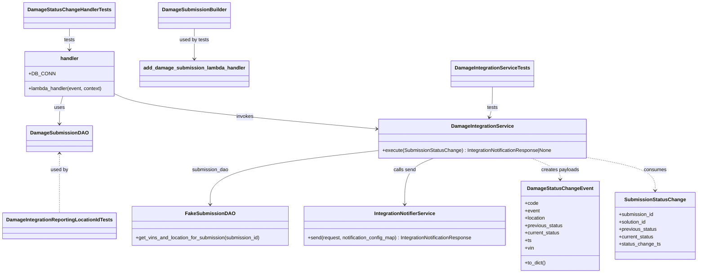
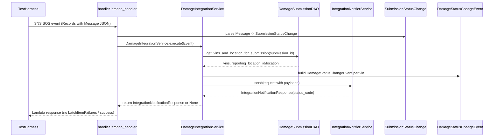

# Diagram: entity_core/entity_service/entity_service/damageview/damage_integration/tests/test_damage_integration_service.py

> Auto-generated by Obscura crawlers

## Diagram 1

### SVG

<svg id="container" width="2223.7109375" xmlns="http://www.w3.org/2000/svg" class="classDiagram" height="880" viewBox="0 0 2223.7109375 880" role="graphics-document document" aria-roledescription="class"><g><defs><marker id="container_class-aggregationStart" class="marker aggregation class" refX="18" refY="7" markerWidth="190" markerHeight="240" orient="auto"><path d="M 18,7 L9,13 L1,7 L9,1 Z"></path></marker></defs><defs><marker id="container_class-aggregationEnd" class="marker aggregation class" refX="1" refY="7" markerWidth="20" markerHeight="28" orient="auto"><path d="M 18,7 L9,13 L1,7 L9,1 Z"></path></marker></defs><defs><marker id="container_class-extensionStart" class="marker extension class" refX="18" refY="7" markerWidth="190" markerHeight="240" orient="auto"><path d="M 1,7 L18,13 V 1 Z"></path></marker></defs><defs><marker id="container_class-extensionEnd" class="marker extension class" refX="1" refY="7" markerWidth="20" markerHeight="28" orient="auto"><path d="M 1,1 V 13 L18,7 Z"></path></marker></defs><defs><marker id="container_class-compositionStart" class="marker composition class" refX="18" refY="7" markerWidth="190" markerHeight="240" orient="auto"><path d="M 18,7 L9,13 L1,7 L9,1 Z"></path></marker></defs><defs><marker id="container_class-compositionEnd" class="marker composition class" refX="1" refY="7" markerWidth="20" markerHeight="28" orient="auto"><path d="M 18,7 L9,13 L1,7 L9,1 Z"></path></marker></defs><defs><marker id="container_class-dependencyStart" class="marker dependency class" refX="6" refY="7" markerWidth="190" markerHeight="240" orient="auto"><path d="M 5,7 L9,13 L1,7 L9,1 Z"></path></marker></defs><defs><marker id="container_class-dependencyEnd" class="marker dependency class" refX="13" refY="7" markerWidth="20" markerHeight="28" orient="auto"><path d="M 18,7 L9,13 L14,7 L9,1 Z"></path></marker></defs><defs><marker id="container_class-lollipopStart" class="marker lollipop class" refX="13" refY="7" markerWidth="190" markerHeight="240" orient="auto"><circle stroke="black" fill="transparent" cx="7" cy="7" r="6"></circle></marker></defs><defs><marker id="container_class-lollipopEnd" class="marker lollipop class" refX="1" refY="7" markerWidth="190" markerHeight="240" orient="auto"><circle stroke="black" fill="transparent" cx="7" cy="7" r="6"></circle></marker></defs><g class="root"><g class="clusters"></g><g class="edgePaths"><path d="M1207.152,484.976L1116.032,495.313C1024.911,505.65,842.671,526.325,751.55,555.329C660.43,584.333,660.43,621.667,660.43,640.333L660.43,659" id="id_DamageIntegrationService_FakeSubmissionDAO_1" class="edge-thickness-normal edge-pattern-solid relation" style=";;;" data-edge="true" data-et="edge" data-id="id_DamageIntegrationService_FakeSubmissionDAO_1" data-points="W3sieCI6MTIwNy4xNTIzNDM3NSwieSI6NDg0Ljk3NTY3MDgyNDkzMTg1fSx7IngiOjY2MC40Mjk2ODc1LCJ5Ijo1NDd9LHsieCI6NjYwLjQyOTY4NzUsInkiOjY2NX1d" marker-end="url(#container_class-dependencyEnd)"></path><path d="M1383.6,510L1368.105,516.167C1352.611,522.333,1321.622,534.667,1306.127,559.5C1290.633,584.333,1290.633,621.667,1290.633,640.333L1290.633,659" id="id_DamageIntegrationService_IntegrationNotifierService_2" class="edge-thickness-normal edge-pattern-solid relation" style=";;;" data-edge="true" data-et="edge" data-id="id_DamageIntegrationService_IntegrationNotifierService_2" data-points="W3sieCI6MTM4My41OTk2NDg0Mzc1LCJ5Ijo1MTB9LHsieCI6MTI5MC42MzI4MTI1LCJ5Ijo1NDd9LHsieCI6MTI5MC42MzI4MTI1LCJ5Ijo2NjV9XQ==" marker-end="url(#container_class-dependencyEnd)"></path><path d="M1700.189,510L1715.684,516.167C1731.178,522.333,1762.167,534.667,1777.662,546C1793.156,557.333,1793.156,567.667,1793.156,572.833L1793.156,578" id="id_DamageIntegrationService_DamageStatusChangeEvent_3" class="edge-thickness-normal edge-pattern-dashed relation" style=";;;" data-edge="true" data-et="edge" data-id="id_DamageIntegrationService_DamageStatusChangeEvent_3" data-points="W3sieCI6MTcwMC4xODk0MTQwNjI1LCJ5Ijo1MTB9LHsieCI6MTc5My4xNTYyNSwieSI6NTQ3fSx7IngiOjE3OTMuMTU2MjUsInkiOjU4NH1d" marker-end="url(#container_class-dependencyEnd)"></path><path d="M1876.637,507.956L1912.372,514.463C1948.108,520.97,2019.579,533.985,2055.315,551.659C2091.051,569.333,2091.051,591.667,2091.051,602.833L2091.051,614" id="id_DamageIntegrationService_SubmissionStatusChange_4" class="edge-thickness-normal edge-pattern-dashed relation" style=";;;" data-edge="true" data-et="edge" data-id="id_DamageIntegrationService_SubmissionStatusChange_4" data-points="W3sieCI6MTg3Ni42MzY3MTg3NSwieSI6NTA3Ljk1NTcyNzUzNjU2MTc3fSx7IngiOjIwOTEuMDUwNzgxMjUsInkiOjU0N30seyJ4IjoyMDkxLjA1MDc4MTI1LCJ5Ijo2MjB9XQ==" marker-end="url(#container_class-dependencyEnd)"></path><path d="M194.633,310L192.821,316.167C191.008,322.333,187.383,334.667,185.57,349.5C183.758,364.333,183.758,381.667,183.758,390.333L183.758,399" id="id_handler_DamageSubmissionDAO_5" class="edge-thickness-normal edge-pattern-solid relation" style=";;;" data-edge="true" data-et="edge" data-id="id_handler_DamageSubmissionDAO_5" data-points="W3sieCI6MTk0LjYzMzQ1NzU2ODgwNzMzLCJ5IjozMTB9LHsieCI6MTgzLjc1NzgxMjUsInkiOjM0N30seyJ4IjoxODMuNzU3ODEyNSwieSI6NDA1fV0=" marker-end="url(#container_class-dependencyEnd)"></path><path d="M362.082,303.966L377.987,311.139C393.892,318.311,425.702,332.655,565.551,351.258C705.4,369.86,953.289,392.72,1077.233,404.15L1201.178,415.58" id="id_handler_DamageIntegrationService_6" class="edge-thickness-normal edge-pattern-solid relation" style=";;;" data-edge="true" data-et="edge" data-id="id_handler_DamageIntegrationService_6" data-points="W3sieCI6MzYyLjA4MjAzMTI1LCJ5IjozMDMuOTY2NDk5MTM1NDA5NDR9LHsieCI6NDU3LjUxMTcxODc1LCJ5IjozNDd9LHsieCI6MTIwNy4xNTIzNDM3NSwieSI6NDE2LjEzMDYyNTg2MDA0NDIzfV0=" marker-end="url(#container_class-dependencyEnd)"></path><path d="M183.758,495L183.758,503.667C183.758,512.333,183.758,529.667,183.758,561.5C183.758,593.333,183.758,639.667,183.758,662.833L183.758,686" id="id_DamageSubmissionDAO_DamageIntegrationReportingLocationIdTests_7" class="edge-thickness-normal edge-pattern-dashed relation" style=";;;" data-edge="true" data-et="edge" data-id="id_DamageSubmissionDAO_DamageIntegrationReportingLocationIdTests_7" data-points="W3sieCI6MTgzLjc1NzgxMjUsInkiOjQ4OX0seyJ4IjoxODMuNzU3ODEyNSwieSI6NTQ3fSx7IngiOjE4My43NTc4MTI1LCJ5Ijo2ODZ9XQ==" marker-start="url(#container_class-dependencyStart)"></path><path d="M1574.434,280L1574.434,291.167C1574.434,302.333,1574.434,324.667,1572.736,341.049C1571.039,357.431,1567.645,367.863,1565.948,373.079L1564.251,378.294" id="id_DamageIntegrationServiceTests_DamageIntegrationService_8" class="edge-thickness-normal edge-pattern-solid relation" style=";;;" data-edge="true" data-et="edge" data-id="id_DamageIntegrationServiceTests_DamageIntegrationService_8" data-points="W3sieCI6MTU3NC40MzM1OTM3NSwieSI6MjgwfSx7IngiOjE1NzQuNDMzNTkzNzUsInkiOjM0N30seyJ4IjoxNTYyLjM5NDE0MDYyNSwieSI6Mzg0fV0=" marker-end="url(#container_class-dependencyEnd)"></path><path d="M215.797,92L215.797,98.167C215.797,104.333,215.797,116.667,215.797,128C215.797,139.333,215.797,149.667,215.797,154.833L215.797,160" id="id_DamageStatusChangeHandlerTests_handler_9" class="edge-thickness-normal edge-pattern-solid relation" style=";;;" data-edge="true" data-et="edge" data-id="id_DamageStatusChangeHandlerTests_handler_9" data-points="W3sieCI6MjE1Ljc5Njg3NSwieSI6OTJ9LHsieCI6MjE1Ljc5Njg3NSwieSI6MTI5fSx7IngiOjIxNS43OTY4NzUsInkiOjE2Nn1d" marker-end="url(#container_class-dependencyEnd)"></path><path d="M612.512,92L612.512,98.167C612.512,104.333,612.512,116.667,612.512,133C612.512,149.333,612.512,169.667,612.512,179.833L612.512,190" id="id_DamageSubmissionBuilder_add_damage_submission_lambda_handler_10" class="edge-thickness-normal edge-pattern-solid relation" style=";;;" data-edge="true" data-et="edge" data-id="id_DamageSubmissionBuilder_add_damage_submission_lambda_handler_10" data-points="W3sieCI6NjEyLjUxMTcxODc1LCJ5Ijo5Mn0seyJ4Ijo2MTIuNTExNzE4NzUsInkiOjEyOX0seyJ4Ijo2MTIuNTExNzE4NzUsInkiOjE5Nn1d" marker-end="url(#container_class-dependencyEnd)"></path></g><g class="edgeLabels"><g class="edgeLabel" transform="translate(660.4296875, 547)"><g class="label" data-id="id_DamageIntegrationService_FakeSubmissionDAO_1" transform="translate(-59.078125, -12)"><foreignObject width="118.15625" height="24">

submission_dao

</foreignObject></g></g><g class="edgeLabel" transform="translate(1290.6328125, 547)"><g class="label" data-id="id_DamageIntegrationService_IntegrationNotifierService_2" transform="translate(-36.1328125, -12)"><foreignObject width="72.265625" height="24">

calls send

</foreignObject></g></g><g class="edgeLabel" transform="translate(1793.15625, 547)"><g class="label" data-id="id_DamageIntegrationService_DamageStatusChangeEvent_3" transform="translate(-60.8984375, -12)"><foreignObject width="121.796875" height="24">

creates payloads

</foreignObject></g></g><g class="edgeLabel" transform="translate(2091.05078125, 547)"><g class="label" data-id="id_DamageIntegrationService_SubmissionStatusChange_4" transform="translate(-36.375, -12)"><foreignObject width="72.75" height="24">

consumes

</foreignObject></g></g><g class="edgeLabel" transform="translate(183.7578125, 347)"><g class="label" data-id="id_handler_DamageSubmissionDAO_5" transform="translate(-16.4921875, -12)"><foreignObject width="32.984375" height="24">

uses

</foreignObject></g></g><g class="edgeLabel" transform="translate(780.21126, 376.75882)"><g class="label" data-id="id_handler_DamageIntegrationService_6" transform="translate(-27.5859375, -12)"><foreignObject width="55.171875" height="24">

invokes

</foreignObject></g></g><g class="edgeLabel" transform="translate(183.7578125, 547)"><g class="label" data-id="id_DamageSubmissionDAO_DamageIntegrationReportingLocationIdTests_7" transform="translate(-28.3125, -12)"><foreignObject width="56.625" height="24">

used by

</foreignObject></g></g><g class="edgeLabel" transform="translate(1574.43359375, 347)"><g class="label" data-id="id_DamageIntegrationServiceTests_DamageIntegrationService_8" transform="translate(-17.4921875, -12)"><foreignObject width="34.984375" height="24">

tests

</foreignObject></g></g><g class="edgeLabel" transform="translate(215.796875, 129)"><g class="label" data-id="id_DamageStatusChangeHandlerTests_handler_9" transform="translate(-17.4921875, -12)"><foreignObject width="34.984375" height="24">

tests

</foreignObject></g></g><g class="edgeLabel" transform="translate(612.51171875, 129)"><g class="label" data-id="id_DamageSubmissionBuilder_add_damage_submission_lambda_handler_10" transform="translate(-47.921875, -12)"><foreignObject width="95.84375" height="24">

used by tests

</foreignObject></g></g></g><g class="nodes"><g class="node default" id="classId-DamageIntegrationService-0" transform="translate(1541.89453125, 447)"><g class="basic label-container"><path d="M-334.7421875 -63 L334.7421875 -63 L334.7421875 63 L-334.7421875 63" stroke="none" stroke-width="0" fill="#ECECFF" style=""></path><path d="M-334.7421875 -63 C-180.43411433722054 -63, -26.12604117444107 -63, 334.7421875 -63 M-334.7421875 -63 C-165.2283419456647 -63, 4.285503608670581 -63, 334.7421875 -63 M334.7421875 -63 C334.7421875 -31.98767828471272, 334.7421875 -0.9753565694254434, 334.7421875 63 M334.7421875 -63 C334.7421875 -18.57014803098754, 334.7421875 25.85970393802492, 334.7421875 63 M334.7421875 63 C173.67862273527086 63, 12.615057970541727 63, -334.7421875 63 M334.7421875 63 C153.65468955112664 63, -27.432808397746726 63, -334.7421875 63 M-334.7421875 63 C-334.7421875 34.75725094599801, -334.7421875 6.5145018919960265, -334.7421875 -63 M-334.7421875 63 C-334.7421875 16.996554605077748, -334.7421875 -29.006890789844505, -334.7421875 -63" stroke="#9370DB" stroke-width="1.3" fill="none" stroke-dasharray="0 0" style=""></path></g><g class="annotation-group text" transform="translate(0, -39)"></g><g class="label-group text" transform="translate(-96.546875, -39)"><g class="label" style="font-weight: bolder" transform="translate(0,-12)"><foreignObject width="193.09375" height="24">

DamageIntegrationService

</foreignObject></g></g><g class="members-group text" transform="translate(-322.7421875, 9)"></g><g class="methods-group text" transform="translate(-322.7421875, 39)"><g class="label" style="" transform="translate(0,-12)"><foreignObject width="548.9375" height="24">

+execute(SubmissionStatusChange) : IntegrationNotificationResponse|None

</foreignObject></g></g><g class="divider" style=""><path d="M-334.7421875 -15 C-181.58195539706324 -15, -28.42172329412648 -15, 334.7421875 -15 M-334.7421875 -15 C-122.83833349722352 -15, 89.06552050555297 -15, 334.7421875 -15" stroke="#9370DB" stroke-width="1.3" fill="none" stroke-dasharray="0 0" style=""></path></g><g class="divider" style=""><path d="M-334.7421875 9 C-98.95690950405427 9, 136.82836849189147 9, 334.7421875 9 M-334.7421875 9 C-179.4529720263057 9, -24.163756552611403 9, 334.7421875 9" stroke="#9370DB" stroke-width="1.3" fill="none" stroke-dasharray="0 0" style=""></path></g></g><g class="node default" id="classId-FakeSubmissionDAO-1" transform="translate(660.4296875, 728)"><g class="basic label-container"><path d="M-250.9140625 -63 L250.9140625 -63 L250.9140625 63 L-250.9140625 63" stroke="none" stroke-width="0" fill="#ECECFF" style=""></path><path d="M-250.9140625 -63 C-85.99707948001105 -63, 78.9199035399779 -63, 250.9140625 -63 M-250.9140625 -63 C-111.03301753815259 -63, 28.848027423694816 -63, 250.9140625 -63 M250.9140625 -63 C250.9140625 -28.083077807599437, 250.9140625 6.833844384801125, 250.9140625 63 M250.9140625 -63 C250.9140625 -13.772942216827246, 250.9140625 35.45411556634551, 250.9140625 63 M250.9140625 63 C72.91106720179224 63, -105.09192809641553 63, -250.9140625 63 M250.9140625 63 C137.54801485778225 63, 24.181967215564498 63, -250.9140625 63 M-250.9140625 63 C-250.9140625 24.423155832701745, -250.9140625 -14.15368833459651, -250.9140625 -63 M-250.9140625 63 C-250.9140625 25.072236912624277, -250.9140625 -12.855526174751446, -250.9140625 -63" stroke="#9370DB" stroke-width="1.3" fill="none" stroke-dasharray="0 0" style=""></path></g><g class="annotation-group text" transform="translate(0, -39)"></g><g class="label-group text" transform="translate(-73.984375, -39)"><g class="label" style="font-weight: bolder" transform="translate(0,-12)"><foreignObject width="147.96875" height="24">

FakeSubmissionDAO

</foreignObject></g></g><g class="members-group text" transform="translate(-238.9140625, 9)"></g><g class="methods-group text" transform="translate(-238.9140625, 39)"><g class="label" style="" transform="translate(0,-12)"><foreignObject width="403.84375" height="24">

+get_vins_and_location_for_submission(submission_id)

</foreignObject></g></g><g class="divider" style=""><path d="M-250.9140625 -15 C-118.22234150851367 -15, 14.46937948297267 -15, 250.9140625 -15 M-250.9140625 -15 C-100.32726694594785 -15, 50.25952860810429 -15, 250.9140625 -15" stroke="#9370DB" stroke-width="1.3" fill="none" stroke-dasharray="0 0" style=""></path></g><g class="divider" style=""><path d="M-250.9140625 9 C-114.05742915325558 9, 22.799204193488833 9, 250.9140625 9 M-250.9140625 9 C-130.87921373630428 9, -10.844364972608531 9, 250.9140625 9" stroke="#9370DB" stroke-width="1.3" fill="none" stroke-dasharray="0 0" style=""></path></g></g><g class="node default" id="classId-IntegrationNotifierService-2" transform="translate(1290.6328125, 728)"><g class="basic label-container"><path d="M-329.2890625 -63 L329.2890625 -63 L329.2890625 63 L-329.2890625 63" stroke="none" stroke-width="0" fill="#ECECFF" style=""></path><path d="M-329.2890625 -63 C-88.56772720719516 -63, 152.15360808560968 -63, 329.2890625 -63 M-329.2890625 -63 C-190.80821590283807 -63, -52.32736930567614 -63, 329.2890625 -63 M329.2890625 -63 C329.2890625 -25.46416365016215, 329.2890625 12.071672699675702, 329.2890625 63 M329.2890625 -63 C329.2890625 -19.721602216862095, 329.2890625 23.55679556627581, 329.2890625 63 M329.2890625 63 C148.18958051817546 63, -32.90990146364908 63, -329.2890625 63 M329.2890625 63 C95.02923640622467 63, -139.23058968755066 63, -329.2890625 63 M-329.2890625 63 C-329.2890625 36.17238029762211, -329.2890625 9.344760595244232, -329.2890625 -63 M-329.2890625 63 C-329.2890625 17.45148223962491, -329.2890625 -28.097035520750183, -329.2890625 -63" stroke="#9370DB" stroke-width="1.3" fill="none" stroke-dasharray="0 0" style=""></path></g><g class="annotation-group text" transform="translate(0, -39)"></g><g class="label-group text" transform="translate(-95.0625, -39)"><g class="label" style="font-weight: bolder" transform="translate(0,-12)"><foreignObject width="190.125" height="24">

IntegrationNotifierService

</foreignObject></g></g><g class="members-group text" transform="translate(-317.2890625, 9)"></g><g class="methods-group text" transform="translate(-317.2890625, 39)"><g class="label" style="" transform="translate(0,-12)"><foreignObject width="539.515625" height="24">

+send(request, notification_config_map) : IntegrationNotificationResponse

</foreignObject></g></g><g class="divider" style=""><path d="M-329.2890625 -15 C-146.41345244851274 -15, 36.462157602974514 -15, 329.2890625 -15 M-329.2890625 -15 C-187.44985403183074 -15, -45.61064556366148 -15, 329.2890625 -15" stroke="#9370DB" stroke-width="1.3" fill="none" stroke-dasharray="0 0" style=""></path></g><g class="divider" style=""><path d="M-329.2890625 9 C-182.5597302811824 9, -35.83039806236479 9, 329.2890625 9 M-329.2890625 9 C-160.82626075143074 9, 7.636540997138525 9, 329.2890625 9" stroke="#9370DB" stroke-width="1.3" fill="none" stroke-dasharray="0 0" style=""></path></g></g><g class="node default" id="classId-DamageStatusChangeEvent-3" transform="translate(1793.15625, 728)"><g class="basic label-container"><path d="M-123.234375 -144 L123.234375 -144 L123.234375 144 L-123.234375 144" stroke="none" stroke-width="0" fill="#ECECFF" style=""></path><path d="M-123.234375 -144 C-60.551625470621005 -144, 2.1311240587579903 -144, 123.234375 -144 M-123.234375 -144 C-61.66914765648161 -144, -0.10392031296322557 -144, 123.234375 -144 M123.234375 -144 C123.234375 -79.23407172858225, 123.234375 -14.468143457164501, 123.234375 144 M123.234375 -144 C123.234375 -52.699314711892356, 123.234375 38.60137057621529, 123.234375 144 M123.234375 144 C65.72386503277937 144, 8.213355065558758 144, -123.234375 144 M123.234375 144 C58.73682343766109 144, -5.760728124677826 144, -123.234375 144 M-123.234375 144 C-123.234375 59.47754355287118, -123.234375 -25.044912894257635, -123.234375 -144 M-123.234375 144 C-123.234375 78.40660679892714, -123.234375 12.813213597854286, -123.234375 -144" stroke="#9370DB" stroke-width="1.3" fill="none" stroke-dasharray="0 0" style=""></path></g><g class="annotation-group text" transform="translate(0, -120)"></g><g class="label-group text" transform="translate(-99.703125, -120)"><g class="label" style="font-weight: bolder" transform="translate(0,-12)"><foreignObject width="199.40625" height="24">

DamageStatusChangeEvent

</foreignObject></g></g><g class="members-group text" transform="translate(-111.234375, -72)"><g class="label" style="" transform="translate(0,-12)"><foreignObject width="42.953125" height="24">

+code

</foreignObject></g><g class="label" style="" transform="translate(0,12)"><foreignObject width="48.328125" height="24">

+event

</foreignObject></g><g class="label" style="" transform="translate(0,36)"><foreignObject width="67.140625" height="24">

+location

</foreignObject></g><g class="label" style="" transform="translate(0,60)"><foreignObject width="122.765625" height="24">

+previous_status

</foreignObject></g><g class="label" style="" transform="translate(0,84)"><foreignObject width="113.25" height="24">

+current_status

</foreignObject></g><g class="label" style="" transform="translate(0,108)"><foreignObject width="21.15625" height="24">

+ts

</foreignObject></g><g class="label" style="" transform="translate(0,132)"><foreignObject width="29.59375" height="24">

+vin

</foreignObject></g></g><g class="methods-group text" transform="translate(-111.234375, 120)"><g class="label" style="" transform="translate(0,-12)"><foreignObject width="68.34375" height="24">

+to_dict()

</foreignObject></g></g><g class="divider" style=""><path d="M-123.234375 -96 C-66.2026264492932 -96, -9.170877898586411 -96, 123.234375 -96 M-123.234375 -96 C-71.49564098118846 -96, -19.756906962376917 -96, 123.234375 -96" stroke="#9370DB" stroke-width="1.3" fill="none" stroke-dasharray="0 0" style=""></path></g><g class="divider" style=""><path d="M-123.234375 96 C-71.37491813484675 96, -19.51546126969349 96, 123.234375 96 M-123.234375 96 C-59.54308200316123 96, 4.148210993677537 96, 123.234375 96" stroke="#9370DB" stroke-width="1.3" fill="none" stroke-dasharray="0 0" style=""></path></g></g><g class="node default" id="classId-SubmissionStatusChange-4" transform="translate(2091.05078125, 728)"><g class="basic label-container"><path d="M-124.66015625 -108 L124.66015625 -108 L124.66015625 108 L-124.66015625 108" stroke="none" stroke-width="0" fill="#ECECFF" style=""></path><path d="M-124.66015625 -108 C-39.49834861807564 -108, 45.66345901384872 -108, 124.66015625 -108 M-124.66015625 -108 C-67.57601354613661 -108, -10.49187084227323 -108, 124.66015625 -108 M124.66015625 -108 C124.66015625 -37.72850394172502, 124.66015625 32.542992116549954, 124.66015625 108 M124.66015625 -108 C124.66015625 -24.198373143221175, 124.66015625 59.60325371355765, 124.66015625 108 M124.66015625 108 C64.19375579258576 108, 3.727355335171538 108, -124.66015625 108 M124.66015625 108 C64.09735349799593 108, 3.5345507459918366 108, -124.66015625 108 M-124.66015625 108 C-124.66015625 40.95488275836561, -124.66015625 -26.090234483268773, -124.66015625 -108 M-124.66015625 108 C-124.66015625 58.834932141502854, -124.66015625 9.669864283005708, -124.66015625 -108" stroke="#9370DB" stroke-width="1.3" fill="none" stroke-dasharray="0 0" style=""></path></g><g class="annotation-group text" transform="translate(0, -84)"></g><g class="label-group text" transform="translate(-92.4296875, -84)"><g class="label" style="font-weight: bolder" transform="translate(0,-12)"><foreignObject width="184.859375" height="24">

SubmissionStatusChange

</foreignObject></g></g><g class="members-group text" transform="translate(-112.66015625, -36)"><g class="label" style="" transform="translate(0,-12)"><foreignObject width="112.921875" height="24">

+submission_id

</foreignObject></g><g class="label" style="" transform="translate(0,12)"><foreignObject width="90.21875" height="24">

+solution_id

</foreignObject></g><g class="label" style="" transform="translate(0,36)"><foreignObject width="122.765625" height="24">

+previous_status

</foreignObject></g><g class="label" style="" transform="translate(0,60)"><foreignObject width="113.25" height="24">

+current_status

</foreignObject></g><g class="label" style="" transform="translate(0,84)"><foreignObject width="132.890625" height="24">

+status_change_ts

</foreignObject></g></g><g class="methods-group text" transform="translate(-112.66015625, 108)"></g><g class="divider" style=""><path d="M-124.66015625 -60 C-31.73738268713025 -60, 61.1853908757395 -60, 124.66015625 -60 M-124.66015625 -60 C-34.71804902707119 -60, 55.22405819585762 -60, 124.66015625 -60" stroke="#9370DB" stroke-width="1.3" fill="none" stroke-dasharray="0 0" style=""></path></g><g class="divider" style=""><path d="M-124.66015625 84 C-73.58690354136687 84, -22.513650832733717 84, 124.66015625 84 M-124.66015625 84 C-46.67594145410284 84, 31.30827334179432 84, 124.66015625 84" stroke="#9370DB" stroke-width="1.3" fill="none" stroke-dasharray="0 0" style=""></path></g></g><g class="node default" id="classId-handler-5" transform="translate(215.796875, 238)"><g class="basic label-container"><path d="M-146.28515625 -72 L146.28515625 -72 L146.28515625 72 L-146.28515625 72" stroke="none" stroke-width="0" fill="#ECECFF" style=""></path><path d="M-146.28515625 -72 C-37.57301750823743 -72, 71.13912123352515 -72, 146.28515625 -72 M-146.28515625 -72 C-58.469150640964216 -72, 29.34685496807157 -72, 146.28515625 -72 M146.28515625 -72 C146.28515625 -17.86231265310755, 146.28515625 36.2753746937849, 146.28515625 72 M146.28515625 -72 C146.28515625 -22.504854266866076, 146.28515625 26.99029146626785, 146.28515625 72 M146.28515625 72 C32.71410088627607 72, -80.85695447744786 72, -146.28515625 72 M146.28515625 72 C69.59920276311082 72, -7.086750723778351 72, -146.28515625 72 M-146.28515625 72 C-146.28515625 34.31153888787694, -146.28515625 -3.3769222242461154, -146.28515625 -72 M-146.28515625 72 C-146.28515625 19.491372172495247, -146.28515625 -33.01725565500951, -146.28515625 -72" stroke="#9370DB" stroke-width="1.3" fill="none" stroke-dasharray="0 0" style=""></path></g><g class="annotation-group text" transform="translate(0, -48)"></g><g class="label-group text" transform="translate(-28.3828125, -48)"><g class="label" style="font-weight: bolder" transform="translate(0,-12)"><foreignObject width="56.765625" height="24">

handler

</foreignObject></g></g><g class="members-group text" transform="translate(-134.28515625, 0)"><g class="label" style="" transform="translate(0,-12)"><foreignObject width="76.953125" height="24">

+DB_CONN

</foreignObject></g></g><g class="methods-group text" transform="translate(-134.28515625, 48)"><g class="label" style="" transform="translate(0,-12)"><foreignObject width="240.1875" height="24">

+lambda_handler(event, context)

</foreignObject></g></g><g class="divider" style=""><path d="M-146.28515625 -24 C-54.31651389408805 -24, 37.65212846182391 -24, 146.28515625 -24 M-146.28515625 -24 C-33.08763930414891 -24, 80.10987764170218 -24, 146.28515625 -24" stroke="#9370DB" stroke-width="1.3" fill="none" stroke-dasharray="0 0" style=""></path></g><g class="divider" style=""><path d="M-146.28515625 24 C-62.093395670531876 24, 22.098364908936247 24, 146.28515625 24 M-146.28515625 24 C-57.05772599298109 24, 32.16970426403782 24, 146.28515625 24" stroke="#9370DB" stroke-width="1.3" fill="none" stroke-dasharray="0 0" style=""></path></g></g><g class="node default" id="classId-DamageSubmissionDAO-6" transform="translate(183.7578125, 447)"><g class="basic label-container"><path d="M-98.6875 -42 L98.6875 -42 L98.6875 42 L-98.6875 42" stroke="none" stroke-width="0" fill="#ECECFF" style=""></path><path d="M-98.6875 -42 C-35.72622491697192 -42, 27.235050166056155 -42, 98.6875 -42 M-98.6875 -42 C-52.403085848227406 -42, -6.118671696454811 -42, 98.6875 -42 M98.6875 -42 C98.6875 -22.360409897884377, 98.6875 -2.7208197957687545, 98.6875 42 M98.6875 -42 C98.6875 -10.27769125852776, 98.6875 21.44461748294448, 98.6875 42 M98.6875 42 C26.362363669190998 42, -45.962772661618004 42, -98.6875 42 M98.6875 42 C36.238147614955444 42, -26.21120477008911 42, -98.6875 42 M-98.6875 42 C-98.6875 18.439027480989502, -98.6875 -5.121945038020996, -98.6875 -42 M-98.6875 42 C-98.6875 18.604295231958254, -98.6875 -4.791409536083492, -98.6875 -42" stroke="#9370DB" stroke-width="1.3" fill="none" stroke-dasharray="0 0" style=""></path></g><g class="annotation-group text" transform="translate(0, -18)"></g><g class="label-group text" transform="translate(-86.6875, -18)"><g class="label" style="font-weight: bolder" transform="translate(0,-12)"><foreignObject width="173.375" height="24">

DamageSubmissionDAO

</foreignObject></g></g><g class="members-group text" transform="translate(-86.6875, 30)"></g><g class="methods-group text" transform="translate(-86.6875, 60)"></g><g class="divider" style=""><path d="M-98.6875 6 C-56.54614540008969 6, -14.404790800179384 6, 98.6875 6 M-98.6875 6 C-41.009644707172676 6, 16.66821058565465 6, 98.6875 6" stroke="#9370DB" stroke-width="1.3" fill="none" stroke-dasharray="0 0" style=""></path></g><g class="divider" style=""><path d="M-98.6875 24 C-26.602498608136756 24, 45.48250278372649 24, 98.6875 24 M-98.6875 24 C-58.48799383612396 24, -18.288487672247925 24, 98.6875 24" stroke="#9370DB" stroke-width="1.3" fill="none" stroke-dasharray="0 0" style=""></path></g></g><g class="node default" id="classId-DamageSubmissionBuilder-7" transform="translate(612.51171875, 50)"><g class="basic label-container"><path d="M-109.9140625 -42 L109.9140625 -42 L109.9140625 42 L-109.9140625 42" stroke="none" stroke-width="0" fill="#ECECFF" style=""></path><path d="M-109.9140625 -42 C-46.43299352444579 -42, 17.048075451108417 -42, 109.9140625 -42 M-109.9140625 -42 C-27.19795597808276 -42, 55.51815054383448 -42, 109.9140625 -42 M109.9140625 -42 C109.9140625 -21.777751013452338, 109.9140625 -1.5555020269046764, 109.9140625 42 M109.9140625 -42 C109.9140625 -13.069400252460301, 109.9140625 15.861199495079397, 109.9140625 42 M109.9140625 42 C40.58875823977024 42, -28.736546020459514 42, -109.9140625 42 M109.9140625 42 C32.2861780549849 42, -45.3417063900302 42, -109.9140625 42 M-109.9140625 42 C-109.9140625 10.390145319290141, -109.9140625 -21.219709361419717, -109.9140625 -42 M-109.9140625 42 C-109.9140625 10.925472780185011, -109.9140625 -20.149054439629978, -109.9140625 -42" stroke="#9370DB" stroke-width="1.3" fill="none" stroke-dasharray="0 0" style=""></path></g><g class="annotation-group text" transform="translate(0, -18)"></g><g class="label-group text" transform="translate(-97.9140625, -18)"><g class="label" style="font-weight: bolder" transform="translate(0,-12)"><foreignObject width="195.828125" height="24">

DamageSubmissionBuilder

</foreignObject></g></g><g class="members-group text" transform="translate(-97.9140625, 30)"></g><g class="methods-group text" transform="translate(-97.9140625, 60)"></g><g class="divider" style=""><path d="M-109.9140625 6 C-40.55847200062476 6, 28.79711849875048 6, 109.9140625 6 M-109.9140625 6 C-42.75055261650019 6, 24.412957266999626 6, 109.9140625 6" stroke="#9370DB" stroke-width="1.3" fill="none" stroke-dasharray="0 0" style=""></path></g><g class="divider" style=""><path d="M-109.9140625 24 C-47.88067473040927 24, 14.152713039181464 24, 109.9140625 24 M-109.9140625 24 C-46.81698302119894 24, 16.280096457602113 24, 109.9140625 24" stroke="#9370DB" stroke-width="1.3" fill="none" stroke-dasharray="0 0" style=""></path></g></g><g class="node default" id="classId-add_damage_submission_lambda_handler-8" transform="translate(612.51171875, 238)"><g class="basic label-container"><path d="M-168.390625 -42 L168.390625 -42 L168.390625 42 L-168.390625 42" stroke="none" stroke-width="0" fill="#ECECFF" style=""></path><path d="M-168.390625 -42 C-52.15974141441367 -42, 64.07114217117265 -42, 168.390625 -42 M-168.390625 -42 C-82.5800648701958 -42, 3.2304952596084036 -42, 168.390625 -42 M168.390625 -42 C168.390625 -9.57515338074412, 168.390625 22.84969323851176, 168.390625 42 M168.390625 -42 C168.390625 -13.274508839459326, 168.390625 15.450982321081348, 168.390625 42 M168.390625 42 C78.56739662905287 42, -11.25583174189427 42, -168.390625 42 M168.390625 42 C33.76210487870986 42, -100.86641524258027 42, -168.390625 42 M-168.390625 42 C-168.390625 12.050756224862035, -168.390625 -17.89848755027593, -168.390625 -42 M-168.390625 42 C-168.390625 19.923054047564335, -168.390625 -2.1538919048713296, -168.390625 -42" stroke="#9370DB" stroke-width="1.3" fill="none" stroke-dasharray="0 0" style=""></path></g><g class="annotation-group text" transform="translate(0, -18)"></g><g class="label-group text" transform="translate(-156.390625, -18)"><g class="label" style="font-weight: bolder" transform="translate(0,-12)"><foreignObject width="312.78125" height="24">

add_damage_submission_lambda_handler

</foreignObject></g></g><g class="members-group text" transform="translate(-156.390625, 30)"></g><g class="methods-group text" transform="translate(-156.390625, 60)"></g><g class="divider" style=""><path d="M-168.390625 6 C-35.92059315503067 6, 96.54943868993865 6, 168.390625 6 M-168.390625 6 C-69.7029419039256 6, 28.98474119214879 6, 168.390625 6" stroke="#9370DB" stroke-width="1.3" fill="none" stroke-dasharray="0 0" style=""></path></g><g class="divider" style=""><path d="M-168.390625 24 C-47.97387951871329 24, 72.44286596257342 24, 168.390625 24 M-168.390625 24 C-86.87494058779055 24, -5.359256175581095 24, 168.390625 24" stroke="#9370DB" stroke-width="1.3" fill="none" stroke-dasharray="0 0" style=""></path></g></g><g class="node default" id="classId-DamageIntegrationReportingLocationIdTests-9" transform="translate(183.7578125, 728)"><g class="basic label-container"><path d="M-175.7578125 -42 L175.7578125 -42 L175.7578125 42 L-175.7578125 42" stroke="none" stroke-width="0" fill="#ECECFF" style=""></path><path d="M-175.7578125 -42 C-102.64021406824419 -42, -29.522615636488382 -42, 175.7578125 -42 M-175.7578125 -42 C-57.07663956110646 -42, 61.60453337778708 -42, 175.7578125 -42 M175.7578125 -42 C175.7578125 -22.62815687858786, 175.7578125 -3.256313757175718, 175.7578125 42 M175.7578125 -42 C175.7578125 -23.92295164844044, 175.7578125 -5.845903296880877, 175.7578125 42 M175.7578125 42 C61.45680870895495 42, -52.844195082090096 42, -175.7578125 42 M175.7578125 42 C47.76034819104443 42, -80.23711611791114 42, -175.7578125 42 M-175.7578125 42 C-175.7578125 16.010554010052857, -175.7578125 -9.978891979894286, -175.7578125 -42 M-175.7578125 42 C-175.7578125 19.075355882033143, -175.7578125 -3.849288235933713, -175.7578125 -42" stroke="#9370DB" stroke-width="1.3" fill="none" stroke-dasharray="0 0" style=""></path></g><g class="annotation-group text" transform="translate(0, -18)"></g><g class="label-group text" transform="translate(-163.7578125, -18)"><g class="label" style="font-weight: bolder" transform="translate(0,-12)"><foreignObject width="327.515625" height="24">

DamageIntegrationReportingLocationIdTests

</foreignObject></g></g><g class="members-group text" transform="translate(-163.7578125, 30)"></g><g class="methods-group text" transform="translate(-163.7578125, 60)"></g><g class="divider" style=""><path d="M-175.7578125 6 C-99.59839174418181 6, -23.43897098836362 6, 175.7578125 6 M-175.7578125 6 C-52.50850170479211 6, 70.74080909041578 6, 175.7578125 6" stroke="#9370DB" stroke-width="1.3" fill="none" stroke-dasharray="0 0" style=""></path></g><g class="divider" style=""><path d="M-175.7578125 24 C-41.58301544574044 24, 92.59178160851911 24, 175.7578125 24 M-175.7578125 24 C-45.15275638381169 24, 85.45229973237662 24, 175.7578125 24" stroke="#9370DB" stroke-width="1.3" fill="none" stroke-dasharray="0 0" style=""></path></g></g><g class="node default" id="classId-DamageIntegrationServiceTests-10" transform="translate(1574.43359375, 238)"><g class="basic label-container"><path d="M-127.65625 -42 L127.65625 -42 L127.65625 42 L-127.65625 42" stroke="none" stroke-width="0" fill="#ECECFF" style=""></path><path d="M-127.65625 -42 C-61.87409309893354 -42, 3.908063802132915 -42, 127.65625 -42 M-127.65625 -42 C-32.091757392784984 -42, 63.47273521443003 -42, 127.65625 -42 M127.65625 -42 C127.65625 -15.247280163893492, 127.65625 11.505439672213015, 127.65625 42 M127.65625 -42 C127.65625 -11.838645159778892, 127.65625 18.322709680442216, 127.65625 42 M127.65625 42 C37.627978940298846 42, -52.40029211940231 42, -127.65625 42 M127.65625 42 C28.331899758703173 42, -70.99245048259365 42, -127.65625 42 M-127.65625 42 C-127.65625 12.824122361426294, -127.65625 -16.35175527714741, -127.65625 -42 M-127.65625 42 C-127.65625 14.18763406870945, -127.65625 -13.6247318625811, -127.65625 -42" stroke="#9370DB" stroke-width="1.3" fill="none" stroke-dasharray="0 0" style=""></path></g><g class="annotation-group text" transform="translate(0, -18)"></g><g class="label-group text" transform="translate(-115.65625, -18)"><g class="label" style="font-weight: bolder" transform="translate(0,-12)"><foreignObject width="231.3125" height="24">

DamageIntegrationServiceTests

</foreignObject></g></g><g class="members-group text" transform="translate(-115.65625, 30)"></g><g class="methods-group text" transform="translate(-115.65625, 60)"></g><g class="divider" style=""><path d="M-127.65625 6 C-68.54017704247546 6, -9.424104084950926 6, 127.65625 6 M-127.65625 6 C-39.97540025751897 6, 47.70544948496206 6, 127.65625 6" stroke="#9370DB" stroke-width="1.3" fill="none" stroke-dasharray="0 0" style=""></path></g><g class="divider" style=""><path d="M-127.65625 24 C-53.59502087933711 24, 20.466208241325774 24, 127.65625 24 M-127.65625 24 C-68.23701070922382 24, -8.817771418447634 24, 127.65625 24" stroke="#9370DB" stroke-width="1.3" fill="none" stroke-dasharray="0 0" style=""></path></g></g><g class="node default" id="classId-DamageStatusChangeHandlerTests-11" transform="translate(215.796875, 50)"><g class="basic label-container"><path d="M-139.6953125 -42 L139.6953125 -42 L139.6953125 42 L-139.6953125 42" stroke="none" stroke-width="0" fill="#ECECFF" style=""></path><path d="M-139.6953125 -42 C-80.32761029800358 -42, -20.95990809600714 -42, 139.6953125 -42 M-139.6953125 -42 C-42.83811561930554 -42, 54.01908126138892 -42, 139.6953125 -42 M139.6953125 -42 C139.6953125 -19.243794765298716, 139.6953125 3.5124104694025675, 139.6953125 42 M139.6953125 -42 C139.6953125 -9.451477759443975, 139.6953125 23.09704448111205, 139.6953125 42 M139.6953125 42 C44.83434317289273 42, -50.02662615421454 42, -139.6953125 42 M139.6953125 42 C71.90183237193541 42, 4.108352243870826 42, -139.6953125 42 M-139.6953125 42 C-139.6953125 22.502922268112385, -139.6953125 3.005844536224771, -139.6953125 -42 M-139.6953125 42 C-139.6953125 17.640858056572192, -139.6953125 -6.718283886855616, -139.6953125 -42" stroke="#9370DB" stroke-width="1.3" fill="none" stroke-dasharray="0 0" style=""></path></g><g class="annotation-group text" transform="translate(0, -18)"></g><g class="label-group text" transform="translate(-127.6953125, -18)"><g class="label" style="font-weight: bolder" transform="translate(0,-12)"><foreignObject width="255.390625" height="24">

DamageStatusChangeHandlerTests

</foreignObject></g></g><g class="members-group text" transform="translate(-127.6953125, 30)"></g><g class="methods-group text" transform="translate(-127.6953125, 60)"></g><g class="divider" style=""><path d="M-139.6953125 6 C-82.44580571412374 6, -25.196298928247472 6, 139.6953125 6 M-139.6953125 6 C-41.34172864386497 6, 57.01185521227006 6, 139.6953125 6" stroke="#9370DB" stroke-width="1.3" fill="none" stroke-dasharray="0 0" style=""></path></g><g class="divider" style=""><path d="M-139.6953125 24 C-81.7335135789592 24, -23.77171465791841 24, 139.6953125 24 M-139.6953125 24 C-55.387592093443175 24, 28.92012831311365 24, 139.6953125 24" stroke="#9370DB" stroke-width="1.3" fill="none" stroke-dasharray="0 0" style=""></path></g></g></g></g></g></svg>

## Diagram 2

### SVG

<svg id="container" width="2367" xmlns="http://www.w3.org/2000/svg" height="651" viewBox="-50 -10 2367 651" role="graphics-document document" aria-roledescription="sequence"><g><rect x="2050" y="565" fill="#eaeaea" stroke="#666" width="217" height="65" name="Payload" rx="3" ry="3" class="actor actor-bottom"></rect><text x="2158.5" y="597.5" dominant-baseline="central" alignment-baseline="central" class="actor actor-box" style="text-anchor: middle; font-size: 16px; font-weight: 400;"><tspan x="2158.5" dy="0">DamageStatusChangeEvent</tspan></text></g><g><rect x="1798" y="565" fill="#eaeaea" stroke="#666" width="202" height="65" name="Event" rx="3" ry="3" class="actor actor-bottom"></rect><text x="1899" y="597.5" dominant-baseline="central" alignment-baseline="central" class="actor actor-box" style="text-anchor: middle; font-size: 16px; font-weight: 400;"><tspan x="1899" dy="0">SubmissionStatusChange</tspan></text></g><g><rect x="1541" y="565" fill="#eaeaea" stroke="#666" width="207" height="65" name="Notifier" rx="3" ry="3" class="actor actor-bottom"></rect><text x="1644.5" y="597.5" dominant-baseline="central" alignment-baseline="central" class="actor actor-box" style="text-anchor: middle; font-size: 16px; font-weight: 400;"><tspan x="1644.5" dy="0">IntegrationNotifierService</tspan></text></g><g><rect x="1299" y="565" fill="#eaeaea" stroke="#666" width="192" height="65" name="SubmissionDAO" rx="3" ry="3" class="actor actor-bottom"></rect><text x="1395" y="597.5" dominant-baseline="central" alignment-baseline="central" class="actor actor-box" style="text-anchor: middle; font-size: 16px; font-weight: 400;"><tspan x="1395" dy="0">DamageSubmissionDAO</tspan></text></g><g><rect x="824" y="565" fill="#eaeaea" stroke="#666" width="210" height="65" name="DamageService" rx="3" ry="3" class="actor actor-bottom"></rect><text x="929" y="597.5" dominant-baseline="central" alignment-baseline="central" class="actor actor-box" style="text-anchor: middle; font-size: 16px; font-weight: 400;"><tspan x="929" dy="0">DamageIntegrationService</tspan></text></g><g><rect x="412" y="565" fill="#eaeaea" stroke="#666" width="200" height="65" name="Handler" rx="3" ry="3" class="actor actor-bottom"></rect><text x="512" y="597.5" dominant-baseline="central" alignment-baseline="central" class="actor actor-box" style="text-anchor: middle; font-size: 16px; font-weight: 400;"><tspan x="512" dy="0">handler.lambda_handler</tspan></text></g><g><rect x="0" y="565" fill="#eaeaea" stroke="#666" width="150" height="65" name="Test" rx="3" ry="3" class="actor actor-bottom"></rect><text x="75" y="597.5" dominant-baseline="central" alignment-baseline="central" class="actor actor-box" style="text-anchor: middle; font-size: 16px; font-weight: 400;"><tspan x="75" dy="0">TestHarness</tspan></text></g><g><line id="actor6" x1="2158.5" y1="65" x2="2158.5" y2="565" class="actor-line 200" stroke-width="0.5px" stroke="#999" name="Payload"></line><g id="root-6"><rect x="2050" y="0" fill="#eaeaea" stroke="#666" width="217" height="65" name="Payload" rx="3" ry="3" class="actor actor-top"></rect><text x="2158.5" y="32.5" dominant-baseline="central" alignment-baseline="central" class="actor actor-box" style="text-anchor: middle; font-size: 16px; font-weight: 400;"><tspan x="2158.5" dy="0">DamageStatusChangeEvent</tspan></text></g></g><g><line id="actor5" x1="1899" y1="65" x2="1899" y2="565" class="actor-line 200" stroke-width="0.5px" stroke="#999" name="Event"></line><g id="root-5"><rect x="1798" y="0" fill="#eaeaea" stroke="#666" width="202" height="65" name="Event" rx="3" ry="3" class="actor actor-top"></rect><text x="1899" y="32.5" dominant-baseline="central" alignment-baseline="central" class="actor actor-box" style="text-anchor: middle; font-size: 16px; font-weight: 400;"><tspan x="1899" dy="0">SubmissionStatusChange</tspan></text></g></g><g><line id="actor4" x1="1644.5" y1="65" x2="1644.5" y2="565" class="actor-line 200" stroke-width="0.5px" stroke="#999" name="Notifier"></line><g id="root-4"><rect x="1541" y="0" fill="#eaeaea" stroke="#666" width="207" height="65" name="Notifier" rx="3" ry="3" class="actor actor-top"></rect><text x="1644.5" y="32.5" dominant-baseline="central" alignment-baseline="central" class="actor actor-box" style="text-anchor: middle; font-size: 16px; font-weight: 400;"><tspan x="1644.5" dy="0">IntegrationNotifierService</tspan></text></g></g><g><line id="actor3" x1="1395" y1="65" x2="1395" y2="565" class="actor-line 200" stroke-width="0.5px" stroke="#999" name="SubmissionDAO"></line><g id="root-3"><rect x="1299" y="0" fill="#eaeaea" stroke="#666" width="192" height="65" name="SubmissionDAO" rx="3" ry="3" class="actor actor-top"></rect><text x="1395" y="32.5" dominant-baseline="central" alignment-baseline="central" class="actor actor-box" style="text-anchor: middle; font-size: 16px; font-weight: 400;"><tspan x="1395" dy="0">DamageSubmissionDAO</tspan></text></g></g><g><line id="actor2" x1="929" y1="65" x2="929" y2="565" class="actor-line 200" stroke-width="0.5px" stroke="#999" name="DamageService"></line><g id="root-2"><rect x="824" y="0" fill="#eaeaea" stroke="#666" width="210" height="65" name="DamageService" rx="3" ry="3" class="actor actor-top"></rect><text x="929" y="32.5" dominant-baseline="central" alignment-baseline="central" class="actor actor-box" style="text-anchor: middle; font-size: 16px; font-weight: 400;"><tspan x="929" dy="0">DamageIntegrationService</tspan></text></g></g><g><line id="actor1" x1="512" y1="65" x2="512" y2="565" class="actor-line 200" stroke-width="0.5px" stroke="#999" name="Handler"></line><g id="root-1"><rect x="412" y="0" fill="#eaeaea" stroke="#666" width="200" height="65" name="Handler" rx="3" ry="3" class="actor actor-top"></rect><text x="512" y="32.5" dominant-baseline="central" alignment-baseline="central" class="actor actor-box" style="text-anchor: middle; font-size: 16px; font-weight: 400;"><tspan x="512" dy="0">handler.lambda_handler</tspan></text></g></g><g><line id="actor0" x1="75" y1="65" x2="75" y2="565" class="actor-line 200" stroke-width="0.5px" stroke="#999" name="Test"></line><g id="root-0"><rect x="0" y="0" fill="#eaeaea" stroke="#666" width="150" height="65" name="Test" rx="3" ry="3" class="actor actor-top"></rect><text x="75" y="32.5" dominant-baseline="central" alignment-baseline="central" class="actor actor-box" style="text-anchor: middle; font-size: 16px; font-weight: 400;"><tspan x="75" dy="0">TestHarness</tspan></text></g></g><g></g><defs><symbol id="computer" width="24" height="24"><path transform="scale(.5)" d="M2 2v13h20v-13h-20zm18 11h-16v-9h16v9zm-10.228 6l.466-1h3.524l.467 1h-4.457zm14.228 3h-24l2-6h2.104l-1.33 4h18.45l-1.297-4h2.073l2 6zm-5-10h-14v-7h14v7z"></path></symbol></defs><defs><symbol id="database" fill-rule="evenodd" clip-rule="evenodd"><path transform="scale(.5)" d="M12.258.001l.256.004.255.005.253.008.251.01.249.012.247.015.246.016.242.019.241.02.239.023.236.024.233.027.231.028.229.031.225.032.223.034.22.036.217.038.214.04.211.041.208.043.205.045.201.046.198.048.194.05.191.051.187.053.183.054.18.056.175.057.172.059.168.06.163.061.16.063.155.064.15.066.074.033.073.033.071.034.07.034.069.035.068.035.067.035.066.035.064.036.064.036.062.036.06.036.06.037.058.037.058.037.055.038.055.038.053.038.052.038.051.039.05.039.048.039.047.039.045.04.044.04.043.04.041.04.04.041.039.041.037.041.036.041.034.041.033.042.032.042.03.042.029.042.027.042.026.043.024.043.023.043.021.043.02.043.018.044.017.043.015.044.013.044.012.044.011.045.009.044.007.045.006.045.004.045.002.045.001.045v17l-.001.045-.002.045-.004.045-.006.045-.007.045-.009.044-.011.045-.012.044-.013.044-.015.044-.017.043-.018.044-.02.043-.021.043-.023.043-.024.043-.026.043-.027.042-.029.042-.03.042-.032.042-.033.042-.034.041-.036.041-.037.041-.039.041-.04.041-.041.04-.043.04-.044.04-.045.04-.047.039-.048.039-.05.039-.051.039-.052.038-.053.038-.055.038-.055.038-.058.037-.058.037-.06.037-.06.036-.062.036-.064.036-.064.036-.066.035-.067.035-.068.035-.069.035-.07.034-.071.034-.073.033-.074.033-.15.066-.155.064-.16.063-.163.061-.168.06-.172.059-.175.057-.18.056-.183.054-.187.053-.191.051-.194.05-.198.048-.201.046-.205.045-.208.043-.211.041-.214.04-.217.038-.22.036-.223.034-.225.032-.229.031-.231.028-.233.027-.236.024-.239.023-.241.02-.242.019-.246.016-.247.015-.249.012-.251.01-.253.008-.255.005-.256.004-.258.001-.258-.001-.256-.004-.255-.005-.253-.008-.251-.01-.249-.012-.247-.015-.245-.016-.243-.019-.241-.02-.238-.023-.236-.024-.234-.027-.231-.028-.228-.031-.226-.032-.223-.034-.22-.036-.217-.038-.214-.04-.211-.041-.208-.043-.204-.045-.201-.046-.198-.048-.195-.05-.19-.051-.187-.053-.184-.054-.179-.056-.176-.057-.172-.059-.167-.06-.164-.061-.159-.063-.155-.064-.151-.066-.074-.033-.072-.033-.072-.034-.07-.034-.069-.035-.068-.035-.067-.035-.066-.035-.064-.036-.063-.036-.062-.036-.061-.036-.06-.037-.058-.037-.057-.037-.056-.038-.055-.038-.053-.038-.052-.038-.051-.039-.049-.039-.049-.039-.046-.039-.046-.04-.044-.04-.043-.04-.041-.04-.04-.041-.039-.041-.037-.041-.036-.041-.034-.041-.033-.042-.032-.042-.03-.042-.029-.042-.027-.042-.026-.043-.024-.043-.023-.043-.021-.043-.02-.043-.018-.044-.017-.043-.015-.044-.013-.044-.012-.044-.011-.045-.009-.044-.007-.045-.006-.045-.004-.045-.002-.045-.001-.045v-17l.001-.045.002-.045.004-.045.006-.045.007-.045.009-.044.011-.045.012-.044.013-.044.015-.044.017-.043.018-.044.02-.043.021-.043.023-.043.024-.043.026-.043.027-.042.029-.042.03-.042.032-.042.033-.042.034-.041.036-.041.037-.041.039-.041.04-.041.041-.04.043-.04.044-.04.046-.04.046-.039.049-.039.049-.039.051-.039.052-.038.053-.038.055-.038.056-.038.057-.037.058-.037.06-.037.061-.036.062-.036.063-.036.064-.036.066-.035.067-.035.068-.035.069-.035.07-.034.072-.034.072-.033.074-.033.151-.066.155-.064.159-.063.164-.061.167-.06.172-.059.176-.057.179-.056.184-.054.187-.053.19-.051.195-.05.198-.048.201-.046.204-.045.208-.043.211-.041.214-.04.217-.038.22-.036.223-.034.226-.032.228-.031.231-.028.234-.027.236-.024.238-.023.241-.02.243-.019.245-.016.247-.015.249-.012.251-.01.253-.008.255-.005.256-.004.258-.001.258.001zm-9.258 20.499v.01l.001.021.003.021.004.022.005.021.006.022.007.022.009.023.01.022.011.023.012.023.013.023.015.023.016.024.017.023.018.024.019.024.021.024.022.025.023.024.024.025.052.049.056.05.061.051.066.051.07.051.075.051.079.052.084.052.088.052.092.052.097.052.102.051.105.052.11.052.114.051.119.051.123.051.127.05.131.05.135.05.139.048.144.049.147.047.152.047.155.047.16.045.163.045.167.043.171.043.176.041.178.041.183.039.187.039.19.037.194.035.197.035.202.033.204.031.209.03.212.029.216.027.219.025.222.024.226.021.23.02.233.018.236.016.24.015.243.012.246.01.249.008.253.005.256.004.259.001.26-.001.257-.004.254-.005.25-.008.247-.011.244-.012.241-.014.237-.016.233-.018.231-.021.226-.021.224-.024.22-.026.216-.027.212-.028.21-.031.205-.031.202-.034.198-.034.194-.036.191-.037.187-.039.183-.04.179-.04.175-.042.172-.043.168-.044.163-.045.16-.046.155-.046.152-.047.148-.048.143-.049.139-.049.136-.05.131-.05.126-.05.123-.051.118-.052.114-.051.11-.052.106-.052.101-.052.096-.052.092-.052.088-.053.083-.051.079-.052.074-.052.07-.051.065-.051.06-.051.056-.05.051-.05.023-.024.023-.025.021-.024.02-.024.019-.024.018-.024.017-.024.015-.023.014-.024.013-.023.012-.023.01-.023.01-.022.008-.022.006-.022.006-.022.004-.022.004-.021.001-.021.001-.021v-4.127l-.077.055-.08.053-.083.054-.085.053-.087.052-.09.052-.093.051-.095.05-.097.05-.1.049-.102.049-.105.048-.106.047-.109.047-.111.046-.114.045-.115.045-.118.044-.12.043-.122.042-.124.042-.126.041-.128.04-.13.04-.132.038-.134.038-.135.037-.138.037-.139.035-.142.035-.143.034-.144.033-.147.032-.148.031-.15.03-.151.03-.153.029-.154.027-.156.027-.158.026-.159.025-.161.024-.162.023-.163.022-.165.021-.166.02-.167.019-.169.018-.169.017-.171.016-.173.015-.173.014-.175.013-.175.012-.177.011-.178.01-.179.008-.179.008-.181.006-.182.005-.182.004-.184.003-.184.002h-.37l-.184-.002-.184-.003-.182-.004-.182-.005-.181-.006-.179-.008-.179-.008-.178-.01-.176-.011-.176-.012-.175-.013-.173-.014-.172-.015-.171-.016-.17-.017-.169-.018-.167-.019-.166-.02-.165-.021-.163-.022-.162-.023-.161-.024-.159-.025-.157-.026-.156-.027-.155-.027-.153-.029-.151-.03-.15-.03-.148-.031-.146-.032-.145-.033-.143-.034-.141-.035-.14-.035-.137-.037-.136-.037-.134-.038-.132-.038-.13-.04-.128-.04-.126-.041-.124-.042-.122-.042-.12-.044-.117-.043-.116-.045-.113-.045-.112-.046-.109-.047-.106-.047-.105-.048-.102-.049-.1-.049-.097-.05-.095-.05-.093-.052-.09-.051-.087-.052-.085-.053-.083-.054-.08-.054-.077-.054v4.127zm0-5.654v.011l.001.021.003.021.004.021.005.022.006.022.007.022.009.022.01.022.011.023.012.023.013.023.015.024.016.023.017.024.018.024.019.024.021.024.022.024.023.025.024.024.052.05.056.05.061.05.066.051.07.051.075.052.079.051.084.052.088.052.092.052.097.052.102.052.105.052.11.051.114.051.119.052.123.05.127.051.131.05.135.049.139.049.144.048.147.048.152.047.155.046.16.045.163.045.167.044.171.042.176.042.178.04.183.04.187.038.19.037.194.036.197.034.202.033.204.032.209.03.212.028.216.027.219.025.222.024.226.022.23.02.233.018.236.016.24.014.243.012.246.01.249.008.253.006.256.003.259.001.26-.001.257-.003.254-.006.25-.008.247-.01.244-.012.241-.015.237-.016.233-.018.231-.02.226-.022.224-.024.22-.025.216-.027.212-.029.21-.03.205-.032.202-.033.198-.035.194-.036.191-.037.187-.039.183-.039.179-.041.175-.042.172-.043.168-.044.163-.045.16-.045.155-.047.152-.047.148-.048.143-.048.139-.05.136-.049.131-.05.126-.051.123-.051.118-.051.114-.052.11-.052.106-.052.101-.052.096-.052.092-.052.088-.052.083-.052.079-.052.074-.051.07-.052.065-.051.06-.05.056-.051.051-.049.023-.025.023-.024.021-.025.02-.024.019-.024.018-.024.017-.024.015-.023.014-.023.013-.024.012-.022.01-.023.01-.023.008-.022.006-.022.006-.022.004-.021.004-.022.001-.021.001-.021v-4.139l-.077.054-.08.054-.083.054-.085.052-.087.053-.09.051-.093.051-.095.051-.097.05-.1.049-.102.049-.105.048-.106.047-.109.047-.111.046-.114.045-.115.044-.118.044-.12.044-.122.042-.124.042-.126.041-.128.04-.13.039-.132.039-.134.038-.135.037-.138.036-.139.036-.142.035-.143.033-.144.033-.147.033-.148.031-.15.03-.151.03-.153.028-.154.028-.156.027-.158.026-.159.025-.161.024-.162.023-.163.022-.165.021-.166.02-.167.019-.169.018-.169.017-.171.016-.173.015-.173.014-.175.013-.175.012-.177.011-.178.009-.179.009-.179.007-.181.007-.182.005-.182.004-.184.003-.184.002h-.37l-.184-.002-.184-.003-.182-.004-.182-.005-.181-.007-.179-.007-.179-.009-.178-.009-.176-.011-.176-.012-.175-.013-.173-.014-.172-.015-.171-.016-.17-.017-.169-.018-.167-.019-.166-.02-.165-.021-.163-.022-.162-.023-.161-.024-.159-.025-.157-.026-.156-.027-.155-.028-.153-.028-.151-.03-.15-.03-.148-.031-.146-.033-.145-.033-.143-.033-.141-.035-.14-.036-.137-.036-.136-.037-.134-.038-.132-.039-.13-.039-.128-.04-.126-.041-.124-.042-.122-.043-.12-.043-.117-.044-.116-.044-.113-.046-.112-.046-.109-.046-.106-.047-.105-.048-.102-.049-.1-.049-.097-.05-.095-.051-.093-.051-.09-.051-.087-.053-.085-.052-.083-.054-.08-.054-.077-.054v4.139zm0-5.666v.011l.001.02.003.022.004.021.005.022.006.021.007.022.009.023.01.022.011.023.012.023.013.023.015.023.016.024.017.024.018.023.019.024.021.025.022.024.023.024.024.025.052.05.056.05.061.05.066.051.07.051.075.052.079.051.084.052.088.052.092.052.097.052.102.052.105.051.11.052.114.051.119.051.123.051.127.05.131.05.135.05.139.049.144.048.147.048.152.047.155.046.16.045.163.045.167.043.171.043.176.042.178.04.183.04.187.038.19.037.194.036.197.034.202.033.204.032.209.03.212.028.216.027.219.025.222.024.226.021.23.02.233.018.236.017.24.014.243.012.246.01.249.008.253.006.256.003.259.001.26-.001.257-.003.254-.006.25-.008.247-.01.244-.013.241-.014.237-.016.233-.018.231-.02.226-.022.224-.024.22-.025.216-.027.212-.029.21-.03.205-.032.202-.033.198-.035.194-.036.191-.037.187-.039.183-.039.179-.041.175-.042.172-.043.168-.044.163-.045.16-.045.155-.047.152-.047.148-.048.143-.049.139-.049.136-.049.131-.051.126-.05.123-.051.118-.052.114-.051.11-.052.106-.052.101-.052.096-.052.092-.052.088-.052.083-.052.079-.052.074-.052.07-.051.065-.051.06-.051.056-.05.051-.049.023-.025.023-.025.021-.024.02-.024.019-.024.018-.024.017-.024.015-.023.014-.024.013-.023.012-.023.01-.022.01-.023.008-.022.006-.022.006-.022.004-.022.004-.021.001-.021.001-.021v-4.153l-.077.054-.08.054-.083.053-.085.053-.087.053-.09.051-.093.051-.095.051-.097.05-.1.049-.102.048-.105.048-.106.048-.109.046-.111.046-.114.046-.115.044-.118.044-.12.043-.122.043-.124.042-.126.041-.128.04-.13.039-.132.039-.134.038-.135.037-.138.036-.139.036-.142.034-.143.034-.144.033-.147.032-.148.032-.15.03-.151.03-.153.028-.154.028-.156.027-.158.026-.159.024-.161.024-.162.023-.163.023-.165.021-.166.02-.167.019-.169.018-.169.017-.171.016-.173.015-.173.014-.175.013-.175.012-.177.01-.178.01-.179.009-.179.007-.181.006-.182.006-.182.004-.184.003-.184.001-.185.001-.185-.001-.184-.001-.184-.003-.182-.004-.182-.006-.181-.006-.179-.007-.179-.009-.178-.01-.176-.01-.176-.012-.175-.013-.173-.014-.172-.015-.171-.016-.17-.017-.169-.018-.167-.019-.166-.02-.165-.021-.163-.023-.162-.023-.161-.024-.159-.024-.157-.026-.156-.027-.155-.028-.153-.028-.151-.03-.15-.03-.148-.032-.146-.032-.145-.033-.143-.034-.141-.034-.14-.036-.137-.036-.136-.037-.134-.038-.132-.039-.13-.039-.128-.041-.126-.041-.124-.041-.122-.043-.12-.043-.117-.044-.116-.044-.113-.046-.112-.046-.109-.046-.106-.048-.105-.048-.102-.048-.1-.05-.097-.049-.095-.051-.093-.051-.09-.052-.087-.052-.085-.053-.083-.053-.08-.054-.077-.054v4.153zm8.74-8.179l-.257.004-.254.005-.25.008-.247.011-.244.012-.241.014-.237.016-.233.018-.231.021-.226.022-.224.023-.22.026-.216.027-.212.028-.21.031-.205.032-.202.033-.198.034-.194.036-.191.038-.187.038-.183.04-.179.041-.175.042-.172.043-.168.043-.163.045-.16.046-.155.046-.152.048-.148.048-.143.048-.139.049-.136.05-.131.05-.126.051-.123.051-.118.051-.114.052-.11.052-.106.052-.101.052-.096.052-.092.052-.088.052-.083.052-.079.052-.074.051-.07.052-.065.051-.06.05-.056.05-.051.05-.023.025-.023.024-.021.024-.02.025-.019.024-.018.024-.017.023-.015.024-.014.023-.013.023-.012.023-.01.023-.01.022-.008.022-.006.023-.006.021-.004.022-.004.021-.001.021-.001.021.001.021.001.021.004.021.004.022.006.021.006.023.008.022.01.022.01.023.012.023.013.023.014.023.015.024.017.023.018.024.019.024.02.025.021.024.023.024.023.025.051.05.056.05.06.05.065.051.07.052.074.051.079.052.083.052.088.052.092.052.096.052.101.052.106.052.11.052.114.052.118.051.123.051.126.051.131.05.136.05.139.049.143.048.148.048.152.048.155.046.16.046.163.045.168.043.172.043.175.042.179.041.183.04.187.038.191.038.194.036.198.034.202.033.205.032.21.031.212.028.216.027.22.026.224.023.226.022.231.021.233.018.237.016.241.014.244.012.247.011.25.008.254.005.257.004.26.001.26-.001.257-.004.254-.005.25-.008.247-.011.244-.012.241-.014.237-.016.233-.018.231-.021.226-.022.224-.023.22-.026.216-.027.212-.028.21-.031.205-.032.202-.033.198-.034.194-.036.191-.038.187-.038.183-.04.179-.041.175-.042.172-.043.168-.043.163-.045.16-.046.155-.046.152-.048.148-.048.143-.048.139-.049.136-.05.131-.05.126-.051.123-.051.118-.051.114-.052.11-.052.106-.052.101-.052.096-.052.092-.052.088-.052.083-.052.079-.052.074-.051.07-.052.065-.051.06-.05.056-.05.051-.05.023-.025.023-.024.021-.024.02-.025.019-.024.018-.024.017-.023.015-.024.014-.023.013-.023.012-.023.01-.023.01-.022.008-.022.006-.023.006-.021.004-.022.004-.021.001-.021.001-.021-.001-.021-.001-.021-.004-.021-.004-.022-.006-.021-.006-.023-.008-.022-.01-.022-.01-.023-.012-.023-.013-.023-.014-.023-.015-.024-.017-.023-.018-.024-.019-.024-.02-.025-.021-.024-.023-.024-.023-.025-.051-.05-.056-.05-.06-.05-.065-.051-.07-.052-.074-.051-.079-.052-.083-.052-.088-.052-.092-.052-.096-.052-.101-.052-.106-.052-.11-.052-.114-.052-.118-.051-.123-.051-.126-.051-.131-.05-.136-.05-.139-.049-.143-.048-.148-.048-.152-.048-.155-.046-.16-.046-.163-.045-.168-.043-.172-.043-.175-.042-.179-.041-.183-.04-.187-.038-.191-.038-.194-.036-.198-.034-.202-.033-.205-.032-.21-.031-.212-.028-.216-.027-.22-.026-.224-.023-.226-.022-.231-.021-.233-.018-.237-.016-.241-.014-.244-.012-.247-.011-.25-.008-.254-.005-.257-.004-.26-.001-.26.001z"></path></symbol></defs><defs><symbol id="clock" width="24" height="24"><path transform="scale(.5)" d="M12 2c5.514 0 10 4.486 10 10s-4.486 10-10 10-10-4.486-10-10 4.486-10 10-10zm0-2c-6.627 0-12 5.373-12 12s5.373 12 12 12 12-5.373 12-12-5.373-12-12-12zm5.848 12.459c.202.038.202.333.001.372-1.907.361-6.045 1.111-6.547 1.111-.719 0-1.301-.582-1.301-1.301 0-.512.77-5.447 1.125-7.445.034-.192.312-.181.343.014l.985 6.238 5.394 1.011z"></path></symbol></defs><defs><marker id="arrowhead" refX="7.9" refY="5" markerUnits="userSpaceOnUse" markerWidth="12" markerHeight="12" orient="auto-start-reverse"><path d="M -1 0 L 10 5 L 0 10 z"></path></marker></defs><defs><marker id="crosshead" markerWidth="15" markerHeight="8" orient="auto" refX="4" refY="4.5"><path fill="none" stroke="#000000" stroke-width="1pt" d="M 1,2 L 6,7 M 6,2 L 1,7" style="stroke-dasharray: 0, 0;"></path></marker></defs><defs><marker id="filled-head" refX="15.5" refY="7" markerWidth="20" markerHeight="28" orient="auto"><path d="M 18,7 L9,13 L14,7 L9,1 Z"></path></marker></defs><defs><marker id="sequencenumber" refX="15" refY="15" markerWidth="60" markerHeight="40" orient="auto"><circle cx="15" cy="15" r="6"></circle></marker></defs><text x="292" y="80" text-anchor="middle" dominant-baseline="middle" alignment-baseline="middle" class="messageText" dy="1em" style="font-size: 16px; font-weight: 400;">SNS SQS event (Records with Message JSON)</text><line x1="76" y1="113" x2="508" y2="113" class="messageLine0" stroke-width="2" stroke="none" marker-end="url(#arrowhead)" style="fill: none;"></line><text x="1204" y="128" text-anchor="middle" dominant-baseline="middle" alignment-baseline="middle" class="messageText" dy="1em" style="font-size: 16px; font-weight: 400;">parse Message -&gt; SubmissionStatusChange</text><line x1="513" y1="161" x2="1895" y2="161" class="messageLine0" stroke-width="2" stroke="none" marker-end="url(#arrowhead)" style="fill: none;"></line><text x="719" y="176" text-anchor="middle" dominant-baseline="middle" alignment-baseline="middle" class="messageText" dy="1em" style="font-size: 16px; font-weight: 400;">DamageIntegrationService.execute(Event)</text><line x1="513" y1="209" x2="925" y2="209" class="messageLine0" stroke-width="2" stroke="none" marker-end="url(#arrowhead)" style="fill: none;"></line><text x="1161" y="224" text-anchor="middle" dominant-baseline="middle" alignment-baseline="middle" class="messageText" dy="1em" style="font-size: 16px; font-weight: 400;">get_vins_and_location_for_submission(submission_id)</text><line x1="930" y1="257" x2="1391" y2="257" class="messageLine0" stroke-width="2" stroke="none" marker-end="url(#arrowhead)" style="fill: none;"></line><text x="1164" y="272" text-anchor="middle" dominant-baseline="middle" alignment-baseline="middle" class="messageText" dy="1em" style="font-size: 16px; font-weight: 400;">vins, reporting_location_id/location</text><line x1="1394" y1="305" x2="933" y2="305" class="messageLine1" stroke-width="2" stroke="none" marker-end="url(#arrowhead)" style="stroke-dasharray: 3, 3; fill: none;"></line><text x="1542" y="320" text-anchor="middle" dominant-baseline="middle" alignment-baseline="middle" class="messageText" dy="1em" style="font-size: 16px; font-weight: 400;">build DamageStatusChangeEvent per vin</text><line x1="930" y1="353" x2="2154.5" y2="353" class="messageLine0" stroke-width="2" stroke="none" marker-end="url(#arrowhead)" style="fill: none;"></line><text x="1285" y="368" text-anchor="middle" dominant-baseline="middle" alignment-baseline="middle" class="messageText" dy="1em" style="font-size: 16px; font-weight: 400;">send(request with payloads)</text><line x1="930" y1="401" x2="1640.5" y2="401" class="messageLine0" stroke-width="2" stroke="none" marker-end="url(#arrowhead)" style="fill: none;"></line><text x="1288" y="416" text-anchor="middle" dominant-baseline="middle" alignment-baseline="middle" class="messageText" dy="1em" style="font-size: 16px; font-weight: 400;">IntegrationNotificationResponse(status_code)</text><line x1="1643.5" y1="449" x2="933" y2="449" class="messageLine1" stroke-width="2" stroke="none" marker-end="url(#arrowhead)" style="stroke-dasharray: 3, 3; fill: none;"></line><text x="722" y="464" text-anchor="middle" dominant-baseline="middle" alignment-baseline="middle" class="messageText" dy="1em" style="font-size: 16px; font-weight: 400;">return IntegrationNotificationResponse or None</text><line x1="928" y1="497" x2="516" y2="497" class="messageLine1" stroke-width="2" stroke="none" marker-end="url(#arrowhead)" style="stroke-dasharray: 3, 3; fill: none;"></line><text x="295" y="512" text-anchor="middle" dominant-baseline="middle" alignment-baseline="middle" class="messageText" dy="1em" style="font-size: 16px; font-weight: 400;">Lambda response (no batchItemFailures / success)</text><line x1="511" y1="545" x2="79" y2="545" class="messageLine1" stroke-width="2" stroke="none" marker-end="url(#arrowhead)" style="stroke-dasharray: 3, 3; fill: none;"></line></svg>
