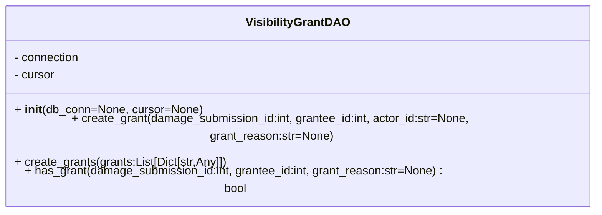

# Diagram: entity_core/entity_service/entity_service/damageview/db/daos/submission_org_visibility.py


> Auto-generated by Obscura crawlers

## Diagram 1



### SVG

<svg id="container" width="832.40625" xmlns="http://www.w3.org/2000/svg" class="classDiagram" height="256" viewBox="0 0 832.40625 256" role="graphics-document document" aria-roledescription="class"><style>#container{font-family:"trebuchet ms",verdana,arial,sans-serif;font-size:16px;fill:#333;}@keyframes edge-animation-frame{from{stroke-dashoffset:0;}}@keyframes dash{to{stroke-dashoffset:0;}}#container .edge-animation-slow{stroke-dasharray:9,5!important;stroke-dashoffset:900;animation:dash 50s linear infinite;stroke-linecap:round;}#container .edge-animation-fast{stroke-dasharray:9,5!important;stroke-dashoffset:900;animation:dash 20s linear infinite;stroke-linecap:round;}#container .error-icon{fill:#552222;}#container .error-text{fill:#552222;stroke:#552222;}#container .edge-thickness-normal{stroke-width:1px;}#container .edge-thickness-thick{stroke-width:3.5px;}#container .edge-pattern-solid{stroke-dasharray:0;}#container .edge-thickness-invisible{stroke-width:0;fill:none;}#container .edge-pattern-dashed{stroke-dasharray:3;}#container .edge-pattern-dotted{stroke-dasharray:2;}#container .marker{fill:#333333;stroke:#333333;}#container .marker.cross{stroke:#333333;}#container svg{font-family:"trebuchet ms",verdana,arial,sans-serif;font-size:16px;}#container p{margin:0;}#container g.classGroup text{fill:#9370DB;stroke:none;font-family:"trebuchet ms",verdana,arial,sans-serif;font-size:10px;}#container g.classGroup text .title{font-weight:bolder;}#container .nodeLabel,#container .edgeLabel{color:#131300;}#container .edgeLabel .label rect{fill:#ECECFF;}#container .label text{fill:#131300;}#container .labelBkg{background:#ECECFF;}#container .edgeLabel .label span{background:#ECECFF;}#container .classTitle{font-weight:bolder;}#container .node rect,#container .node circle,#container .node ellipse,#container .node polygon,#container .node path{fill:#ECECFF;stroke:#9370DB;stroke-width:1px;}#container .divider{stroke:#9370DB;stroke-width:1;}#container g.clickable{cursor:pointer;}#container g.classGroup rect{fill:#ECECFF;stroke:#9370DB;}#container g.classGroup line{stroke:#9370DB;stroke-width:1;}#container .classLabel .box{stroke:none;stroke-width:0;fill:#ECECFF;opacity:0.5;}#container .classLabel .label{fill:#9370DB;font-size:10px;}#container .relation{stroke:#333333;stroke-width:1;fill:none;}#container .dashed-line{stroke-dasharray:3;}#container .dotted-line{stroke-dasharray:1 2;}#container #compositionStart,#container .composition{fill:#333333!important;stroke:#333333!important;stroke-width:1;}#container #compositionEnd,#container .composition{fill:#333333!important;stroke:#333333!important;stroke-width:1;}#container #dependencyStart,#container .dependency{fill:#333333!important;stroke:#333333!important;stroke-width:1;}#container #dependencyStart,#container .dependency{fill:#333333!important;stroke:#333333!important;stroke-width:1;}#container #extensionStart,#container .extension{fill:transparent!important;stroke:#333333!important;stroke-width:1;}#container #extensionEnd,#container .extension{fill:transparent!important;stroke:#333333!important;stroke-width:1;}#container #aggregationStart,#container .aggregation{fill:transparent!important;stroke:#333333!important;stroke-width:1;}#container #aggregationEnd,#container .aggregation{fill:transparent!important;stroke:#333333!important;stroke-width:1;}#container #lollipopStart,#container .lollipop{fill:#ECECFF!important;stroke:#333333!important;stroke-width:1;}#container #lollipopEnd,#container .lollipop{fill:#ECECFF!important;stroke:#333333!important;stroke-width:1;}#container .edgeTerminals{font-size:11px;line-height:initial;}#container .classTitleText{text-anchor:middle;font-size:18px;fill:#333;}#container .label-icon{display:inline-block;height:1em;overflow:visible;vertical-align:-0.125em;}#container .node .label-icon path{fill:currentColor;stroke:revert;stroke-width:revert;}#container :root{--mermaid-font-family:"trebuchet ms",verdana,arial,sans-serif;}</style><g><defs><marker id="container_class-aggregationStart" class="marker aggregation class" refX="18" refY="7" markerWidth="190" markerHeight="240" orient="auto"><path d="M 18,7 L9,13 L1,7 L9,1 Z"></path></marker></defs><defs><marker id="container_class-aggregationEnd" class="marker aggregation class" refX="1" refY="7" markerWidth="20" markerHeight="28" orient="auto"><path d="M 18,7 L9,13 L1,7 L9,1 Z"></path></marker></defs><defs><marker id="container_class-extensionStart" class="marker extension class" refX="18" refY="7" markerWidth="190" markerHeight="240" orient="auto"><path d="M 1,7 L18,13 V 1 Z"></path></marker></defs><defs><marker id="container_class-extensionEnd" class="marker extension class" refX="1" refY="7" markerWidth="20" markerHeight="28" orient="auto"><path d="M 1,1 V 13 L18,7 Z"></path></marker></defs><defs><marker id="container_class-compositionStart" class="marker composition class" refX="18" refY="7" markerWidth="190" markerHeight="240" orient="auto"><path d="M 18,7 L9,13 L1,7 L9,1 Z"></path></marker></defs><defs><marker id="container_class-compositionEnd" class="marker composition class" refX="1" refY="7" markerWidth="20" markerHeight="28" orient="auto"><path d="M 18,7 L9,13 L1,7 L9,1 Z"></path></marker></defs><defs><marker id="container_class-dependencyStart" class="marker dependency class" refX="6" refY="7" markerWidth="190" markerHeight="240" orient="auto"><path d="M 5,7 L9,13 L1,7 L9,1 Z"></path></marker></defs><defs><marker id="container_class-dependencyEnd" class="marker dependency class" refX="13" refY="7" markerWidth="20" markerHeight="28" orient="auto"><path d="M 18,7 L9,13 L14,7 L9,1 Z"></path></marker></defs><defs><marker id="container_class-lollipopStart" class="marker lollipop class" refX="13" refY="7" markerWidth="190" markerHeight="240" orient="auto"><circle stroke="black" fill="transparent" cx="7" cy="7" r="6"></circle></marker></defs><defs><marker id="container_class-lollipopEnd" class="marker lollipop class" refX="1" refY="7" markerWidth="190" markerHeight="240" orient="auto"><circle stroke="black" fill="transparent" cx="7" cy="7" r="6"></circle></marker></defs><g class="root"><g class="clusters"></g><g class="edgePaths"></g><g class="edgeLabels"></g><g class="nodes"><g class="node default" id="classId-VisibilityGrantDAO-0" transform="translate(416.203125, 128)"><g class="basic label-container"><path d="M-408.203125 -120 L408.203125 -120 L408.203125 120 L-408.203125 120" stroke="none" stroke-width="0" fill="#ECECFF" style=""></path><path d="M-408.203125 -120 C-119.41372573754751 -120, 169.37567352490498 -120, 408.203125 -120 M-408.203125 -120 C-196.40247325673025 -120, 15.398178486539507 -120, 408.203125 -120 M408.203125 -120 C408.203125 -50.989716765734585, 408.203125 18.02056646853083, 408.203125 120 M408.203125 -120 C408.203125 -61.6282499875934, 408.203125 -3.2564999751867987, 408.203125 120 M408.203125 120 C156.2224390203062 120, -95.75824695938758 120, -408.203125 120 M408.203125 120 C82.30950168014272 120, -243.58412163971457 120, -408.203125 120 M-408.203125 120 C-408.203125 39.677063374301625, -408.203125 -40.64587325139675, -408.203125 -120 M-408.203125 120 C-408.203125 51.826640978408236, -408.203125 -16.34671804318353, -408.203125 -120" stroke="#9370DB" stroke-width="1.3" fill="none" stroke-dasharray="0 0" style=""></path></g><g class="annotation-group text" transform="translate(0, -96)"></g><g class="label-group text" transform="translate(-67.265625, -96)"><g class="label" style="font-weight: bolder" transform="translate(0,-12)"><foreignObject width="134.53125" height="24"><div xmlns="http://www.w3.org/1999/xhtml" style="display: table-cell; white-space: nowrap; line-height: 1.5; max-width: 182px; text-align: center;"><span class="nodeLabel markdown-node-label" style=""><p>VisibilityGrantDAO</p></span></div></foreignObject></g></g><g class="members-group text" transform="translate(-396.203125, -48)"><g class="label" style="" transform="translate(0,-12)"><foreignObject width="91.5" height="24"><div xmlns="http://www.w3.org/1999/xhtml" style="display: table-cell; white-space: nowrap; line-height: 1.5; max-width: 149px; text-align: center;"><span class="nodeLabel markdown-node-label" style=""><p>- connection</p></span></div></foreignObject></g><g class="label" style="" transform="translate(0,12)"><foreignObject width="56.421875" height="24"><div xmlns="http://www.w3.org/1999/xhtml" style="display: table-cell; white-space: nowrap; line-height: 1.5; max-width: 115px; text-align: center;"><span class="nodeLabel markdown-node-label" style=""><p>- cursor</p></span></div></foreignObject></g></g><g class="methods-group text" transform="translate(-396.203125, 24)"><g class="label" style="" transform="translate(0,-12)"><foreignObject width="255.609375" height="24"><div xmlns="http://www.w3.org/1999/xhtml" style="display: table-cell; white-space: nowrap; line-height: 1.5; max-width: 346px; text-align: center;"><span class="nodeLabel markdown-node-label" style=""><p>+ <strong>init</strong>(db_conn=None, cursor=None)</p></span></div></foreignObject></g><g class="label" style="" transform="translate(0,12)"><foreignObject width="725.140625" height="24"><div xmlns="http://www.w3.org/1999/xhtml" style="display: table-cell; white-space: nowrap; line-height: 1.5; max-width: 783px; text-align: center;"><span class="nodeLabel markdown-node-label" style=""><p>+ create_grant(damage_submission_id:int, grantee_id:int, actor_id:str=None, grant_reason:str=None)</p></span></div></foreignObject></g><g class="label" style="" transform="translate(0,36)"><foreignObject width="292.90625" height="24"><div xmlns="http://www.w3.org/1999/xhtml" style="display: table-cell; white-space: nowrap; line-height: 1.5; max-width: 350px; text-align: center;"><span class="nodeLabel markdown-node-label" style=""><p>+ create_grants(grants:List[Dict[str,Any]])</p></span></div></foreignObject></g><g class="label" style="" transform="translate(0,60)"><foreignObject width="614.640625" height="24"><div xmlns="http://www.w3.org/1999/xhtml" style="display: table-cell; white-space: nowrap; line-height: 1.5; max-width: 672px; text-align: center;"><span class="nodeLabel markdown-node-label" style=""><p>+ has_grant(damage_submission_id:int, grantee_id:int, grant_reason:str=None) : bool</p></span></div></foreignObject></g></g><g class="divider" style=""><path d="M-408.203125 -72 C-177.7202966192944 -72, 52.762531761411196 -72, 408.203125 -72 M-408.203125 -72 C-215.08971190015606 -72, -21.976298800312122 -72, 408.203125 -72" stroke="#9370DB" stroke-width="1.3" fill="none" stroke-dasharray="0 0" style=""></path></g><g class="divider" style=""><path d="M-408.203125 0 C-167.29850988218902 0, 73.60610523562195 0, 408.203125 0 M-408.203125 0 C-171.0052515061576 0, 66.19262198768479 0, 408.203125 0" stroke="#9370DB" stroke-width="1.3" fill="none" stroke-dasharray="0 0" style=""></path></g></g></g></g></g></svg>

## Diagram 2

```mermaid
flowchart TD
    Init[VisibilityGrantDAO.__init__] --> CheckDB{db_conn provided?}
    CheckDB -- yes --> Establish[connection.establish_connection()]
    Establish --> GetCursor[connection.get_cursor()]
    GetCursor --> SetCursor[set self.cursor]
    CheckDB -- no --> CheckCursor{cursor provided?}
    CheckCursor -- yes --> SetCursor2[set self.cursor from cursor]
    CheckCursor -- no --> Error[raise ValueError("Either db_conn or cursor must be provided")]

    subgraph CreateGrant["create_grant(damage_submission_id, grantee_id, actor_id=None, grant_reason=None)"]
        CGStart[call create_grant] --> BuildQuery1[prepare INSERT query]
        BuildQuery1 --> Exec1[cursor.execute(query, params)]
        Exec1 --> Log[logging.info(cursor.mogrify(...))]
        Exec1 --> CheckRow1{cursor.rowcount > 0?}
        CheckRow1 -- yes --> Fetch1[cursor.fetchone()[0]]
        CheckRow1 -- no --> ReturnNone1[return None]
        Fetch1 --> ReturnID1[return id]
    end

    subgraph CreateGrants["create_grants(grants)"]
        CGS[call create_grants] --> EmptyCheck{grants empty?}
        EmptyCheck -- yes --> ReturnNone2[return]
        EmptyCheck -- no --> BuildValues[build values list from grants]
        BuildValues --> ExecMany[execute_values(cursor, query, values)]
        ExecMany --> Descr[columns = [desc[0] for desc in cursor.description]]
        Descr --> FetchAll[rows = cursor.fetchall()]
        FetchAll --> MapRows[return [dict(zip(columns,row)) for row in rows]]
    end

    subgraph HasGrant["has_grant(damage_submission_id, grantee_id, grant_reason=None) -> bool"]
        HGStart[call has_grant] --> BuildQuery2[prepare SELECT 1 query and params]
        BuildQuery2 --> GrantReasonCheck{grant_reason provided?}
        GrantReasonCheck -- yes --> AppendReason[append "AND grant_reason = %s" and param]
        GrantReasonCheck -- no --> NoAppend[use params as-is]
        AppendReason --> Exec2[cursor.execute(query, params)]
        NoAppend --> Exec2
        Exec2 --> Fetch2[cursor.fetchone()]
        Fetch2 --> ResultCheck{fetch is not None?}
        ResultCheck -- yes --> ReturnTrue[return True]
        ResultCheck -- no --> ReturnFalse[return False]
    end

    %% Connections from DAO init to method calls
    SetCursor --> CGStart
    SetCursor --> CGS
    SetCursor --> HGStart
```

> SVG rendering failed for this diagram.
