# Diagram: entity_core/entity_service/entity_service/damageview/db/search_filters/filters_strategies.py

> Auto-generated by Obscura crawlers

## Mermaid

```mermaid
classDiagram
    class Filter {
        <<abstract>>
        +build_filter() string
        +build_query_parameters() dict
    }

    class OrgFilter {
        -_solution_id
        -_org_fv_id
        -_org_type
        -_org_id
        +build_filter() string
        +build_query_parameters() dict
    }
    class AssigneeEmailFilter {
        -_assignee_email
        +build_filter() string
        +build_query_parameters() dict
    }
    class SubmitterEmailFilter {
        -_submitter_email
        +build_filter() string
        +build_query_parameters() dict
    }
    class WatchFilter {
        -_watch
        +build_filter() string
        +build_query_parameters() dict
    }
    class SubmissionIdFilter {
        -_submission_id
        +build_filter() string
        +build_query_parameters() dict
    }
    class ExternalIdFilter {
        -_external_id
        +build_filter() string
        +build_query_parameters() dict
    }
    class VinFilter {
        -_entity_id
        +build_filter() string
        +build_query_parameters() dict
    }
    class DateFromFilter {
        -_date_from
        +build_filter() string
        +build_query_parameters() dict
    }
    class DateToFilter {
        -_date_to
        +build_filter() string
        +build_query_parameters() dict
    }
    class StatusFilter {
        -_status
        +build_filter() string
        +build_query_parameters() dict
    }
    class StatusNullFilter {
        +build_filter() string
        +build_query_parameters() dict
    }
    class StatusNotNullFilter {
        +build_filter() string
        +build_query_parameters() dict
    }
    class DamageAreaFilter {
        -_damage_area
        -_solution_id
        +build_filter() string
        +build_query_parameters() dict
    }
    class DamageAreaNullFilter {
        -_solution_id
        +build_filter() string
        +build_query_parameters() dict
    }
    class DamageAreaNotNullFilter {
        -_solution_id
        +build_filter() string
        +build_query_parameters() dict
    }
    class AssigneeFilter {
        -_assignee
        +build_filter() string
        +build_query_parameters() dict
    }
    class AssigneeNullFilter {
        +build_filter() string
        +build_query_parameters() dict
    }
    class AssigneeNotNullFilter {
        +build_filter() string
        +build_query_parameters() dict
    }
    class PartnerFilter {
        -_partner
        +build_filter() string
        +build_query_parameters() dict
    }
    class PartnerNullFilter {
        +build_filter() string
        +build_query_parameters() dict
    }
    class PartnerNotNullFilter {
        +build_filter() string
        +build_query_parameters() dict
    }
    class InProgressStatusFilter {
        -_in_progress_status
        +build_filter() string
        +build_query_parameters() dict
    }
    class InProgressStatusNullFilter {
        +build_filter() string
        +build_query_parameters() dict
    }
    class InProgressStatusNotNullFilter {
        +build_filter() string
        +build_query_parameters() dict
    }
    class ProductTypeFilter {
        -_product_type
        +build_filter() string
        +build_query_parameters() dict
    }
    class ProductTypeNullFilter {
        +build_filter() string
        +build_query_parameters() dict
    }
    class ProductTypeNotNullFilter {
        +build_filter() string
        +build_query_parameters() dict
    }
    class ProductTypeContainsFilter {
        -_product_type_contains
        +build_filter() string
        +build_query_parameters() dict
    }
    class LastMilestoneFilter {
        -last_milestone_code_list
        -last_milestone_description_list
        +build_filter() string
        +build_query_parameters() dict
    }
    class LastMilestoneNullFilter {
        +build_filter() string
        +build_query_parameters() dict
    }
    class LastMilestoneNotNullFilter {
        +build_filter() string
        +build_query_parameters() dict
    }
    class LastMilestoneContainsFilter {
        -_last_milestone_contains
        +build_filter() string
        +build_query_parameters() dict
    }
    class CurrentPositionFilter {
        -_current_position_type
        -_current_position_codes
        -_current_position_codes_null
        -_current_position_code_not_null
        -_replaces
        +build_filter() string
        +build_query_parameters() dict
    }
    class ArchivedFilter {
        +build_filter() string
        +build_query_parameters() dict
    }
    class DamageHoldFilter {
        -_damage_hold
        -_solution_id
        +build_filter() string
        +build_query_parameters() dict
    }
    class StolenVinFilter {
        -_stolen_vin
        -_solution_id
        +build_filter() string
        +build_query_parameters() dict
    }

    %% Inheritance
    Filter <|-- OrgFilter
    Filter <|-- AssigneeEmailFilter
    Filter <|-- SubmitterEmailFilter
    Filter <|-- WatchFilter
    Filter <|-- SubmissionIdFilter
    Filter <|-- ExternalIdFilter
    Filter <|-- VinFilter
    Filter <|-- DateFromFilter
    Filter <|-- DateToFilter
    Filter <|-- StatusFilter
    Filter <|-- StatusNullFilter
    Filter <|-- StatusNotNullFilter
    Filter <|-- DamageAreaFilter
    Filter <|-- DamageAreaNullFilter
    Filter <|-- DamageAreaNotNullFilter
    Filter <|-- AssigneeFilter
    Filter <|-- AssigneeNullFilter
    Filter <|-- AssigneeNotNullFilter
    Filter <|-- PartnerFilter
    Filter <|-- PartnerNullFilter
    Filter <|-- PartnerNotNullFilter
    Filter <|-- InProgressStatusFilter
    Filter <|-- InProgressStatusNullFilter
    Filter <|-- InProgressStatusNotNullFilter
    Filter <|-- ProductTypeFilter
    Filter <|-- ProductTypeNullFilter
    Filter <|-- ProductTypeNotNullFilter
    Filter <|-- ProductTypeContainsFilter
    Filter <|-- LastMilestoneFilter
    Filter <|-- LastMilestoneNullFilter
    Filter <|-- LastMilestoneNotNullFilter
    Filter <|-- LastMilestoneContainsFilter
    Filter <|-- CurrentPositionFilter
    Filter <|-- ArchivedFilter
    Filter <|-- DamageHoldFilter
    Filter <|-- StolenVinFilter

    %% Enums / external constants
    class OrgTypes {
        <<enumeration>>
        SHIPPER
        CARRIER
        PARTNER
    }
    class DamageViewCustomFields {
        <<enumeration>>
        DAMAGE_AREA
    }
    class DamageViewCurrentPositionTypes {
        <<enumeration>>
        IN_TRANSIT
        AT_LOCATION
    }

    %% Associations
    OrgFilter ..> OrgTypes : uses
    PartnerNullFilter ..> OrgTypes : references
    PartnerNotNullFilter ..> OrgTypes : references
    DamageAreaFilter ..> DamageViewCustomFields : uses
    DamageAreaNullFilter ..> DamageViewCustomFields : uses
    DamageAreaNotNullFilter ..> DamageViewCustomFields : uses
    CurrentPositionFilter ..> DamageViewCurrentPositionTypes : uses
```

### SVG

<svg id="container" width="13596.640625" xmlns="http://www.w3.org/2000/svg" class="classDiagram" height="770" viewBox="0 0 13596.640625 770" role="graphics-document document" aria-roledescription="class"><g><defs><marker id="container_class-aggregationStart" class="marker aggregation class" refX="18" refY="7" markerWidth="190" markerHeight="240" orient="auto"><path d="M 18,7 L9,13 L1,7 L9,1 Z"></path></marker></defs><defs><marker id="container_class-aggregationEnd" class="marker aggregation class" refX="1" refY="7" markerWidth="20" markerHeight="28" orient="auto"><path d="M 18,7 L9,13 L1,7 L9,1 Z"></path></marker></defs><defs><marker id="container_class-extensionStart" class="marker extension class" refX="18" refY="7" markerWidth="190" markerHeight="240" orient="auto"><path d="M 1,7 L18,13 V 1 Z"></path></marker></defs><defs><marker id="container_class-extensionEnd" class="marker extension class" refX="1" refY="7" markerWidth="20" markerHeight="28" orient="auto"><path d="M 1,1 V 13 L18,7 Z"></path></marker></defs><defs><marker id="container_class-compositionStart" class="marker composition class" refX="18" refY="7" markerWidth="190" markerHeight="240" orient="auto"><path d="M 18,7 L9,13 L1,7 L9,1 Z"></path></marker></defs><defs><marker id="container_class-compositionEnd" class="marker composition class" refX="1" refY="7" markerWidth="20" markerHeight="28" orient="auto"><path d="M 18,7 L9,13 L1,7 L9,1 Z"></path></marker></defs><defs><marker id="container_class-dependencyStart" class="marker dependency class" refX="6" refY="7" markerWidth="190" markerHeight="240" orient="auto"><path d="M 5,7 L9,13 L1,7 L9,1 Z"></path></marker></defs><defs><marker id="container_class-dependencyEnd" class="marker dependency class" refX="13" refY="7" markerWidth="20" markerHeight="28" orient="auto"><path d="M 18,7 L9,13 L14,7 L9,1 Z"></path></marker></defs><defs><marker id="container_class-lollipopStart" class="marker lollipop class" refX="13" refY="7" markerWidth="190" markerHeight="240" orient="auto"><circle stroke="black" fill="transparent" cx="7" cy="7" r="6"></circle></marker></defs><defs><marker id="container_class-lollipopEnd" class="marker lollipop class" refX="1" refY="7" markerWidth="190" markerHeight="240" orient="auto"><circle stroke="black" fill="transparent" cx="7" cy="7" r="6"></circle></marker></defs><g class="root"><g class="clusters"></g><g class="edgePaths"><path d="M6419.372,97.897L5375.106,116.081C4330.84,134.265,2242.309,170.632,1198.043,194.983C153.777,219.333,153.777,231.667,153.777,237.833L153.777,244" id="id_Filter_OrgFilter_1" class="edge-thickness-normal edge-pattern-solid relation" style=";;;" data-edge="true" data-et="edge" data-id="id_Filter_OrgFilter_1" data-points="W3sieCI6NjQzNi42MTkxNDA2MjUsInkiOjk3LjU5NjcxNzM4NDgxNTI5fSx7IngiOjE1My43NzczNDM3NSwieSI6MjA3fSx7IngiOjE1My43NzczNDM3NSwieSI6MjQ0fV0=" marker-start="url(#container_class-extensionStart)"></path><path d="M6419.372,98.069L5435.312,116.225C4451.252,134.38,2483.132,170.69,1499.072,201.012C515.012,231.333,515.012,255.667,515.012,267.833L515.012,280" id="id_Filter_AssigneeEmailFilter_2" class="edge-thickness-normal edge-pattern-solid relation" style=";;;" data-edge="true" data-et="edge" data-id="id_Filter_AssigneeEmailFilter_2" data-points="W3sieCI6NjQzNi42MTkxNDA2MjUsInkiOjk3Ljc1MTIzMzEwMzI0NDE1fSx7IngiOjUxNS4wMTE3MTg3NSwieSI6MjA3fSx7IngiOjUxNS4wMTE3MTg3NSwieSI6MjgwfV0=" marker-start="url(#container_class-extensionStart)"></path><path d="M6419.372,98.276L5499.14,116.397C4578.907,134.517,2738.442,170.759,1818.209,201.046C897.977,231.333,897.977,255.667,897.977,267.833L897.977,280" id="id_Filter_SubmitterEmailFilter_3" class="edge-thickness-normal edge-pattern-solid relation" style=";;;" data-edge="true" data-et="edge" data-id="id_Filter_SubmitterEmailFilter_3" data-points="W3sieCI6NjQzNi42MTkxNDA2MjUsInkiOjk3LjkzNjQ3NzIzMzA0MjI3fSx7IngiOjg5Ny45NzY1NjI1LCJ5IjoyMDd9LHsieCI6ODk3Ljk3NjU2MjUsInkiOjI4MH1d" marker-start="url(#container_class-extensionStart)"></path><path d="M6419.373,98.503L5560.46,116.586C4701.547,134.668,2983.721,170.834,2124.808,201.084C1265.895,231.333,1265.895,255.667,1265.895,267.833L1265.895,280" id="id_Filter_WatchFilter_4" class="edge-thickness-normal edge-pattern-solid relation" style=";;;" data-edge="true" data-et="edge" data-id="id_Filter_WatchFilter_4" data-points="W3sieCI6NjQzNi42MTkxNDA2MjUsInkiOjk4LjEzOTU2MjQzNjIzMjUyfSx7IngiOjEyNjUuODk0NTMxMjUsInkiOjIwN30seyJ4IjoxMjY1Ljg5NDUzMTI1LCJ5IjoyODB9XQ==" marker-start="url(#container_class-extensionStart)"></path><path d="M6419.374,98.76L5621.18,116.8C4822.986,134.84,3226.598,170.92,2428.405,201.127C1630.211,231.333,1630.211,255.667,1630.211,267.833L1630.211,280" id="id_Filter_SubmissionIdFilter_5" class="edge-thickness-normal edge-pattern-solid relation" style=";;;" data-edge="true" data-et="edge" data-id="id_Filter_SubmissionIdFilter_5" data-points="W3sieCI6NjQzNi42MTkxNDA2MjUsInkiOjk4LjM3MDM3Mzk0NjczNjQ2fSx7IngiOjE2MzAuMjEwOTM3NSwieSI6MjA3fSx7IngiOjE2MzAuMjEwOTM3NSwieSI6MjgwfV0=" marker-start="url(#container_class-extensionStart)"></path><path d="M6419.374,99.065L5683.15,117.054C4946.925,135.043,3474.476,171.022,2738.252,201.178C2002.027,231.333,2002.027,255.667,2002.027,267.833L2002.027,280" id="id_Filter_ExternalIdFilter_6" class="edge-thickness-normal edge-pattern-solid relation" style=";;;" data-edge="true" data-et="edge" data-id="id_Filter_ExternalIdFilter_6" data-points="W3sieCI6NjQzNi42MTkxNDA2MjUsInkiOjk4LjY0Mzc2Nzg3MjI2MTgyfSx7IngiOjIwMDIuMDI3MzQzNzUsInkiOjIwN30seyJ4IjoyMDAyLjAyNzM0Mzc1LCJ5IjoyODB9XQ==" marker-start="url(#container_class-extensionStart)"></path><path d="M6419.375,99.404L5741.964,117.337C5064.552,135.269,3709.729,171.135,3032.318,201.234C2354.906,231.333,2354.906,255.667,2354.906,267.833L2354.906,280" id="id_Filter_VinFilter_7" class="edge-thickness-normal edge-pattern-solid relation" style=";;;" data-edge="true" data-et="edge" data-id="id_Filter_VinFilter_7" data-points="W3sieCI6NjQzNi42MTkxNDA2MjUsInkiOjk4Ljk0NzY4MTM4ODgzNTQyfSx7IngiOjIzNTQuOTA2MjUsInkiOjIwN30seyJ4IjoyMzU0LjkwNjI1LCJ5IjoyODB9XQ==" marker-start="url(#container_class-extensionStart)"></path><path d="M6419.376,99.803L5800.576,117.669C5181.776,135.536,3944.175,171.268,3325.375,201.301C2706.574,231.333,2706.574,255.667,2706.574,267.833L2706.574,280" id="id_Filter_DateFromFilter_8" class="edge-thickness-normal edge-pattern-solid relation" style=";;;" data-edge="true" data-et="edge" data-id="id_Filter_DateFromFilter_8" data-points="W3sieCI6NjQzNi42MTkxNDA2MjUsInkiOjk5LjMwNTU2MDI5Njc1NzI2fSx7IngiOjI3MDYuNTc0MjE4NzUsInkiOjIwN30seyJ4IjoyNzA2LjU3NDIxODc1LCJ5IjoyODB9XQ==" marker-start="url(#container_class-extensionStart)"></path><path d="M6419.378,100.293L5860.355,118.077C5301.331,135.862,4183.285,171.431,3624.262,201.382C3065.238,231.333,3065.238,255.667,3065.238,267.833L3065.238,280" id="id_Filter_DateToFilter_9" class="edge-thickness-normal edge-pattern-solid relation" style=";;;" data-edge="true" data-et="edge" data-id="id_Filter_DateToFilter_9" data-points="W3sieCI6NjQzNi42MTkxNDA2MjUsInkiOjk5Ljc0NDIwNDU3Mzc2MTIxfSx7IngiOjMwNjUuMjM4MjgxMjUsInkiOjIwN30seyJ4IjozMDY1LjIzODI4MTI1LCJ5IjoyODB9XQ==" marker-start="url(#container_class-extensionStart)"></path><path d="M6419.38,100.882L5919.183,118.569C5418.986,136.255,4418.593,171.627,3918.396,201.48C3418.199,231.333,3418.199,255.667,3418.199,267.833L3418.199,280" id="id_Filter_StatusFilter_10" class="edge-thickness-normal edge-pattern-solid relation" style=";;;" data-edge="true" data-et="edge" data-id="id_Filter_StatusFilter_10" data-points="W3sieCI6NjQzNi42MTkxNDA2MjUsInkiOjEwMC4yNzI4NTMzOTY1Mzk0OX0seyJ4IjozNDE4LjE5OTIxODc1LCJ5IjoyMDd9LHsieCI6MzQxOC4xOTkyMTg3NSwieSI6MjgwfV0=" marker-start="url(#container_class-extensionStart)"></path><path d="M6419.383,101.635L5979.07,119.196C5538.757,136.757,4658.13,171.878,4217.817,203.106C3777.504,234.333,3777.504,261.667,3777.504,275.333L3777.504,289" id="id_Filter_StatusNullFilter_11" class="edge-thickness-normal edge-pattern-solid relation" style=";;;" data-edge="true" data-et="edge" data-id="id_Filter_StatusNullFilter_11" data-points="W3sieCI6NjQzNi42MTkxNDA2MjUsInkiOjEwMC45NDc0OTY4Njg1MjF9LHsieCI6Mzc3Ny41MDM5MDYyNSwieSI6MjA3fSx7IngiOjM3NzcuNTAzOTA2MjUsInkiOjI4OX1d" marker-start="url(#container_class-extensionStart)"></path><path d="M6419.387,102.651L6041.266,120.043C5663.144,137.434,4906.9,172.217,4528.778,203.275C4150.656,234.333,4150.656,261.667,4150.656,275.333L4150.656,289" id="id_Filter_StatusNotNullFilter_12" class="edge-thickness-normal edge-pattern-solid relation" style=";;;" data-edge="true" data-et="edge" data-id="id_Filter_StatusNotNullFilter_12" data-points="W3sieCI6NjQzNi42MTkxNDA2MjUsInkiOjEwMS44NTg4OTAwMDczMzl9LHsieCI6NDE1MC42NTYyNSwieSI6MjA3fSx7IngiOjQxNTAuNjU2MjUsInkiOjI4OX1d" marker-start="url(#container_class-extensionStart)"></path><path d="M6419.432,109.282L6229.781,125.568C6040.129,141.855,5660.826,174.427,5471.175,200.88C5281.523,227.333,5281.523,247.667,5281.523,257.833L5281.523,268" id="id_Filter_DamageAreaFilter_13" class="edge-thickness-normal edge-pattern-solid relation" style=";;;" data-edge="true" data-et="edge" data-id="id_Filter_DamageAreaFilter_13" data-points="W3sieCI6NjQzNi42MTkxNDA2MjUsInkiOjEwNy44MDYxMTQ3NjI2MTcxN30seyJ4Ijo1MjgxLjUyMzQzNzUsInkiOjIwN30seyJ4Ijo1MjgxLjUyMzQzNzUsInkiOjI2OH1d" marker-start="url(#container_class-extensionStart)"></path><path d="M6751.782,128.301L6817.18,141.418C6882.578,154.534,7013.373,180.767,7078.77,206.05C7144.168,231.333,7144.168,255.667,7144.168,267.833L7144.168,280" id="id_Filter_DamageAreaNullFilter_14" class="edge-thickness-normal edge-pattern-solid relation" style=";;;" data-edge="true" data-et="edge" data-id="id_Filter_DamageAreaNullFilter_14" data-points="W3sieCI6NjczNC44NjkxNDA2MjUsInkiOjEyNC45MDkxODIxNjM4MDUwN30seyJ4Ijo3MTQ0LjE2Nzk2ODc1LCJ5IjoyMDd9LHsieCI6NzE0NC4xNjc5Njg3NSwieSI6MjgwfV0=" marker-start="url(#container_class-extensionStart)"></path><path d="M6752.001,114.524L6883.247,129.937C7014.492,145.349,7276.982,176.175,7408.227,203.754C7539.473,231.333,7539.473,255.667,7539.473,267.833L7539.473,280" id="id_Filter_DamageAreaNotNullFilter_15" class="edge-thickness-normal edge-pattern-solid relation" style=";;;" data-edge="true" data-et="edge" data-id="id_Filter_DamageAreaNotNullFilter_15" data-points="W3sieCI6NjczNC44NjkxNDA2MjUsInkiOjExMi41MTIzMjEwOTE3Njc3Mn0seyJ4Ijo3NTM5LjQ3MjY1NjI1LCJ5IjoyMDd9LHsieCI6NzUzOS40NzI2NTYyNSwieSI6MjgwfV0=" marker-start="url(#container_class-extensionStart)"></path><path d="M6419.491,114.88L6291.093,130.233C6162.695,145.587,5905.898,176.293,5777.5,203.813C5649.102,231.333,5649.102,255.667,5649.102,267.833L5649.102,280" id="id_Filter_AssigneeFilter_16" class="edge-thickness-normal edge-pattern-solid relation" style=";;;" data-edge="true" data-et="edge" data-id="id_Filter_AssigneeFilter_16" data-points="W3sieCI6NjQzNi42MTkxNDA2MjUsInkiOjExMi44MzE3NzUzMTExN30seyJ4Ijo1NjQ5LjEwMTU2MjUsInkiOjIwN30seyJ4Ijo1NjQ5LjEwMTU2MjUsInkiOjI4MH1d" marker-start="url(#container_class-extensionStart)"></path><path d="M6419.695,127.724L6352.651,140.937C6285.608,154.15,6151.521,180.575,6084.477,207.454C6017.434,234.333,6017.434,261.667,6017.434,275.333L6017.434,289" id="id_Filter_AssigneeNullFilter_17" class="edge-thickness-normal edge-pattern-solid relation" style=";;;" data-edge="true" data-et="edge" data-id="id_Filter_AssigneeNullFilter_17" data-points="W3sieCI6NjQzNi42MTkxNDA2MjUsInkiOjEyNC4zODg4NjE1ODYwNDY5MX0seyJ4Ijo2MDE3LjQzMzU5Mzc1LCJ5IjoyMDd9LHsieCI6NjAxNy40MzM1OTM3NSwieSI6Mjg5fV0=" marker-start="url(#container_class-extensionStart)"></path><path d="M6426.38,190.894L6421.919,193.578C6417.458,196.263,6408.535,201.631,6404.074,217.982C6399.613,234.333,6399.613,261.667,6399.613,275.333L6399.613,289" id="id_Filter_AssigneeNotNullFilter_18" class="edge-thickness-normal edge-pattern-solid relation" style=";;;" data-edge="true" data-et="edge" data-id="id_Filter_AssigneeNotNullFilter_18" data-points="W3sieCI6NjQ0MS4xNjAzNDgwNzQ3NzcsInkiOjE4Mn0seyJ4Ijo2Mzk5LjYxMzI4MTI1LCJ5IjoyMDd9LHsieCI6NjM5OS42MTMyODEyNSwieSI6Mjg5fV0=" marker-start="url(#container_class-extensionStart)"></path><path d="M6745.108,190.894L6749.57,193.578C6754.031,196.263,6762.953,201.631,6767.414,216.482C6771.875,231.333,6771.875,255.667,6771.875,267.833L6771.875,280" id="id_Filter_PartnerFilter_19" class="edge-thickness-normal edge-pattern-solid relation" style=";;;" data-edge="true" data-et="edge" data-id="id_Filter_PartnerFilter_19" data-points="W3sieCI6NjczMC4zMjc5MzMxNzUyMjMsInkiOjE4Mn0seyJ4Ijo2NzcxLjg3NSwieSI6MjA3fSx7IngiOjY3NzEuODc1LCJ5IjoyODB9XQ==" marker-start="url(#container_class-extensionStart)"></path><path d="M6419.395,104.044L6103.783,121.203C5788.171,138.363,5156.947,172.681,4841.335,203.507C4525.723,234.333,4525.723,261.667,4525.723,275.333L4525.723,289" id="id_Filter_PartnerNullFilter_20" class="edge-thickness-normal edge-pattern-solid relation" style=";;;" data-edge="true" data-et="edge" data-id="id_Filter_PartnerNullFilter_20" data-points="W3sieCI6NjQzNi42MTkxNDA2MjUsInkiOjEwMy4xMDc2ODI0MzI3NzE5NX0seyJ4Ijo0NTI1LjcyMjY1NjI1LCJ5IjoyMDd9LHsieCI6NDUyNS43MjI2NTYyNSwieSI6Mjg5fV0=" marker-start="url(#container_class-extensionStart)"></path><path d="M6419.407,106.069L6166.623,122.891C5913.838,139.713,5408.269,173.356,5155.484,203.845C4902.699,234.333,4902.699,261.667,4902.699,275.333L4902.699,289" id="id_Filter_PartnerNotNullFilter_21" class="edge-thickness-normal edge-pattern-solid relation" style=";;;" data-edge="true" data-et="edge" data-id="id_Filter_PartnerNotNullFilter_21" data-points="W3sieCI6NjQzNi42MTkxNDA2MjUsInkiOjEwNC45MjM2ODA0NTczMTg0NX0seyJ4Ijo0OTAyLjY5OTIxODc1LCJ5IjoyMDd9LHsieCI6NDkwMi42OTkyMTg3NSwieSI6Mjg5fV0=" marker-start="url(#container_class-extensionStart)"></path><path d="M6752.06,108.798L6949.34,125.165C7146.619,141.532,7541.179,174.266,7738.459,202.8C7935.738,231.333,7935.738,255.667,7935.738,267.833L7935.738,280" id="id_Filter_InProgressStatusFilter_22" class="edge-thickness-normal edge-pattern-solid relation" style=";;;" data-edge="true" data-et="edge" data-id="id_Filter_InProgressStatusFilter_22" data-points="W3sieCI6NjczNC44NjkxNDA2MjUsInkiOjEwNy4zNzE5MDU1NDkzNTg1N30seyJ4Ijo3OTM1LjczODI4MTI1LCJ5IjoyMDd9LHsieCI6NzkzNS43MzgyODEyNSwieSI6MjgwfV0=" marker-start="url(#container_class-extensionStart)"></path><path d="M6752.084,105.658L7015.695,122.548C7279.306,139.439,7806.528,173.219,8070.139,203.776C8333.75,234.333,8333.75,261.667,8333.75,275.333L8333.75,289" id="id_Filter_InProgressStatusNullFilter_23" class="edge-thickness-normal edge-pattern-solid relation" style=";;;" data-edge="true" data-et="edge" data-id="id_Filter_InProgressStatusNullFilter_23" data-points="W3sieCI6NjczNC44NjkxNDA2MjUsInkiOjEwNC41NTQ4ODc4ODAwNTA4MX0seyJ4Ijo4MzMzLjc1LCJ5IjoyMDd9LHsieCI6ODMzMy43NSwieSI6Mjg5fV0=" marker-start="url(#container_class-extensionStart)"></path><path d="M6752.096,103.626L7084.348,120.855C7416.6,138.084,8081.105,172.542,8413.357,203.438C8745.609,234.333,8745.609,261.667,8745.609,275.333L8745.609,289" id="id_Filter_InProgressStatusNotNullFilter_24" class="edge-thickness-normal edge-pattern-solid relation" style=";;;" data-edge="true" data-et="edge" data-id="id_Filter_InProgressStatusNotNullFilter_24" data-points="W3sieCI6NjczNC44NjkxNDA2MjUsInkiOjEwMi43MzI4ODk4NzM5NTIyN30seyJ4Ijo4NzQ1LjYwOTM3NSwieSI6MjA3fSx7IngiOjg3NDUuNjA5Mzc1LCJ5IjoyODl9XQ==" marker-start="url(#container_class-extensionStart)"></path><path d="M6752.103,102.289L7150.421,119.741C7548.74,137.193,8345.378,172.096,8743.697,201.715C9142.016,231.333,9142.016,255.667,9142.016,267.833L9142.016,280" id="id_Filter_ProductTypeFilter_25" class="edge-thickness-normal edge-pattern-solid relation" style=";;;" data-edge="true" data-et="edge" data-id="id_Filter_ProductTypeFilter_25" data-points="W3sieCI6NjczNC44NjkxNDA2MjUsInkiOjEwMS41MzM3MzQ4MTczMjY1Nn0seyJ4Ijo5MTQyLjAxNTYyNSwieSI6MjA3fSx7IngiOjkxNDIuMDE1NjI1LCJ5IjoyODB9XQ==" marker-start="url(#container_class-extensionStart)"></path><path d="M6752.107,101.342L7214.048,118.952C7675.989,136.561,8599.871,171.781,9061.813,203.057C9523.754,234.333,9523.754,261.667,9523.754,275.333L9523.754,289" id="id_Filter_ProductTypeNullFilter_26" class="edge-thickness-normal edge-pattern-solid relation" style=";;;" data-edge="true" data-et="edge" data-id="id_Filter_ProductTypeNullFilter_26" data-points="W3sieCI6NjczNC44NjkxNDA2MjUsInkiOjEwMC42ODQ4MDA3MDk0NTEzNX0seyJ4Ijo5NTIzLjc1MzkwNjI1LCJ5IjoyMDd9LHsieCI6OTUyMy43NTM5MDYyNSwieSI6Mjg5fV0=" marker-start="url(#container_class-extensionStart)"></path><path d="M6752.109,100.589L7279.981,118.325C7807.853,136.06,8863.596,171.53,9391.468,202.932C9919.34,234.333,9919.34,261.667,9919.34,275.333L9919.34,289" id="id_Filter_ProductTypeNotNullFilter_27" class="edge-thickness-normal edge-pattern-solid relation" style=";;;" data-edge="true" data-et="edge" data-id="id_Filter_ProductTypeNotNullFilter_27" data-points="W3sieCI6NjczNC44NjkxNDA2MjUsInkiOjEwMC4wMTAyMDU2NDIwMTY4NH0seyJ4Ijo5OTE5LjMzOTg0Mzc1LCJ5IjoyMDd9LHsieCI6OTkxOS4zMzk4NDM3NSwieSI6Mjg5fV0=" marker-start="url(#container_class-extensionStart)"></path><path d="M6752.111,99.985L7347.347,117.821C7942.583,135.657,9133.055,171.328,9728.291,201.331C10323.527,231.333,10323.527,255.667,10323.527,267.833L10323.527,280" id="id_Filter_ProductTypeContainsFilter_28" class="edge-thickness-normal edge-pattern-solid relation" style=";;;" data-edge="true" data-et="edge" data-id="id_Filter_ProductTypeContainsFilter_28" data-points="W3sieCI6NjczNC44NjkxNDA2MjUsInkiOjk5LjQ2ODQyMzk1NDA3OTU3fSx7IngiOjEwMzIzLjUyNzM0Mzc1LCJ5IjoyMDd9LHsieCI6MTAzMjMuNTI3MzQzNzUsInkiOjI4MH1d" marker-start="url(#container_class-extensionStart)"></path><path d="M6752.113,99.511L7412.836,117.426C8073.56,135.341,9395.006,171.17,10055.73,199.252C10716.453,227.333,10716.453,247.667,10716.453,257.833L10716.453,268" id="id_Filter_LastMilestoneFilter_29" class="edge-thickness-normal edge-pattern-solid relation" style=";;;" data-edge="true" data-et="edge" data-id="id_Filter_LastMilestoneFilter_29" data-points="W3sieCI6NjczNC44NjkxNDA2MjUsInkiOjk5LjA0MzM3MzY4MzEwODA5fSx7IngiOjEwNzE2LjQ1MzEyNSwieSI6MjA3fSx7IngiOjEwNzE2LjQ1MzEyNSwieSI6MjY4fV0=" marker-start="url(#container_class-extensionStart)"></path><path d="M6752.114,99.125L7477.322,117.104C8202.53,135.083,9652.947,171.042,10378.155,202.687C11103.363,234.333,11103.363,261.667,11103.363,275.333L11103.363,289" id="id_Filter_LastMilestoneNullFilter_30" class="edge-thickness-normal edge-pattern-solid relation" style=";;;" data-edge="true" data-et="edge" data-id="id_Filter_LastMilestoneNullFilter_30" data-points="W3sieCI6NjczNC44NjkxNDA2MjUsInkiOjk4LjY5NzA4MDEzODkxNzl9LHsieCI6MTExMDMuMzYzMjgxMjUsInkiOjIwN30seyJ4IjoxMTEwMy4zNjMyODEyNSwieSI6Mjg5fV0=" marker-start="url(#container_class-extensionStart)"></path><path d="M6752.115,98.789L7544.116,116.824C8336.117,134.859,9920.119,170.93,10712.12,202.631C11504.121,234.333,11504.121,261.667,11504.121,275.333L11504.121,289" id="id_Filter_LastMilestoneNotNullFilter_31" class="edge-thickness-normal edge-pattern-solid relation" style=";;;" data-edge="true" data-et="edge" data-id="id_Filter_LastMilestoneNotNullFilter_31" data-points="W3sieCI6NjczNC44NjkxNDA2MjUsInkiOjk4LjM5NTgzNTY5MTE1OTg3fSx7IngiOjExNTA0LjEyMTA5Mzc1LCJ5IjoyMDd9LHsieCI6MTE1MDQuMTIxMDkzNzUsInkiOjI4OX1d" marker-start="url(#container_class-extensionStart)"></path><path d="M6752.115,98.497L7612.344,116.581C8472.572,134.665,10193.028,170.832,11053.256,201.083C11913.484,231.333,11913.484,255.667,11913.484,267.833L11913.484,280" id="id_Filter_LastMilestoneContainsFilter_32" class="edge-thickness-normal edge-pattern-solid relation" style=";;;" data-edge="true" data-et="edge" data-id="id_Filter_LastMilestoneContainsFilter_32" data-points="W3sieCI6NjczNC44NjkxNDA2MjUsInkiOjk4LjEzNDkxMjYwMTgyNjQ2fSx7IngiOjExOTEzLjQ4NDM3NSwieSI6MjA3fSx7IngiOjExOTEzLjQ4NDM3NSwieSI6MjgwfV0=" marker-start="url(#container_class-extensionStart)"></path><path d="M6752.116,98.251L7679.623,116.376C8607.131,134.501,10462.145,170.75,11389.653,193.042C12317.16,215.333,12317.16,223.667,12317.16,227.833L12317.16,232" id="id_Filter_CurrentPositionFilter_33" class="edge-thickness-normal edge-pattern-solid relation" style=";;;" data-edge="true" data-et="edge" data-id="id_Filter_CurrentPositionFilter_33" data-points="W3sieCI6NjczNC44NjkxNDA2MjUsInkiOjk3LjkxNDExNDA2MDg5OTk1fSx7IngiOjEyMzE3LjE2MDE1NjI1LCJ5IjoyMDd9LHsieCI6MTIzMTcuMTYwMTU2MjUsInkiOjIzMn1d" marker-start="url(#container_class-extensionStart)"></path><path d="M6752.116,98.05L7742.629,116.208C8733.143,134.367,10714.169,170.683,11704.682,202.508C12695.195,234.333,12695.195,261.667,12695.195,275.333L12695.195,289" id="id_Filter_ArchivedFilter_34" class="edge-thickness-normal edge-pattern-solid relation" style=";;;" data-edge="true" data-et="edge" data-id="id_Filter_ArchivedFilter_34" data-points="W3sieCI6NjczNC44NjkxNDA2MjUsInkiOjk3LjczMzc5NzExNjk3OTY3fSx7IngiOjEyNjk1LjE5NTMxMjUsInkiOjIwN30seyJ4IjoxMjY5NS4xOTUzMTI1LCJ5IjoyODl9XQ==" marker-start="url(#container_class-extensionStart)"></path><path d="M6752.117,97.877L7803.882,116.064C8855.647,134.251,10959.177,170.626,12010.942,198.979C13062.707,227.333,13062.707,247.667,13062.707,257.833L13062.707,268" id="id_Filter_DamageHoldFilter_35" class="edge-thickness-normal edge-pattern-solid relation" style=";;;" data-edge="true" data-et="edge" data-id="id_Filter_DamageHoldFilter_35" data-points="W3sieCI6NjczNC44NjkxNDA2MjUsInkiOjk3LjU3ODY3NzczNTU0NDA5fSx7IngiOjEzMDYyLjcwNzAzMTI1LCJ5IjoyMDd9LHsieCI6MTMwNjIuNzA3MDMxMjUsInkiOjI2OH1d" marker-start="url(#container_class-extensionStart)"></path><path d="M6752.117,97.722L7865.412,115.935C8978.708,134.148,11205.299,170.574,12318.595,198.954C13431.891,227.333,13431.891,247.667,13431.891,257.833L13431.891,268" id="id_Filter_StolenVinFilter_36" class="edge-thickness-normal edge-pattern-solid relation" style=";;;" data-edge="true" data-et="edge" data-id="id_Filter_StolenVinFilter_36" data-points="W3sieCI6NjczNC44NjkxNDA2MjUsInkiOjk3LjQzOTYyMDYwMDg5MTE5fSx7IngiOjEzNDMxLjg5MDYyNSwieSI6MjA3fSx7IngiOjEzNDMxLjg5MDYyNSwieSI6MjY4fV0=" marker-start="url(#container_class-extensionStart)"></path><path d="M153.777,484L153.777,492.167C153.777,500.333,153.777,516.667,869.446,546.605C1585.116,576.543,3016.454,620.086,3732.123,641.858L4447.792,663.629" id="id_OrgFilter_OrgTypes_37" class="edge-thickness-normal edge-pattern-dashed relation" style=";;;" data-edge="true" data-et="edge" data-id="id_OrgFilter_OrgTypes_37" data-points="W3sieCI6MTUzLjc3NzM0Mzc1LCJ5Ijo0ODR9LHsieCI6MTUzLjc3NzM0Mzc1LCJ5Ijo1MzN9LHsieCI6NDQ1My43ODkwNjI1LCJ5Ijo2NjMuODExNjkwODQxMjgzOH1d" marker-end="url(#container_class-dependencyEnd)"></path><path d="M4525.723,439L4525.723,454.667C4525.723,470.333,4525.723,501.667,4525.723,522.5C4525.723,543.333,4525.723,553.667,4525.723,558.833L4525.723,564" id="id_PartnerNullFilter_OrgTypes_38" class="edge-thickness-normal edge-pattern-dashed relation" style=";;;" data-edge="true" data-et="edge" data-id="id_PartnerNullFilter_OrgTypes_38" data-points="W3sieCI6NDUyNS43MjI2NTYyNSwieSI6NDM5fSx7IngiOjQ1MjUuNzIyNjU2MjUsInkiOjUzM30seyJ4Ijo0NTI1LjcyMjY1NjI1LCJ5Ijo1NzB9XQ==" marker-end="url(#container_class-dependencyEnd)"></path><path d="M4902.699,439L4902.699,454.667C4902.699,470.333,4902.699,501.667,4852.802,534.938C4802.904,568.208,4703.109,603.417,4653.212,621.021L4603.314,638.625" id="id_PartnerNotNullFilter_OrgTypes_39" class="edge-thickness-normal edge-pattern-dashed relation" style=";;;" data-edge="true" data-et="edge" data-id="id_PartnerNotNullFilter_OrgTypes_39" data-points="W3sieCI6NDkwMi42OTkyMTg3NSwieSI6NDM5fSx7IngiOjQ5MDIuNjk5MjE4NzUsInkiOjUzM30seyJ4Ijo0NTk3LjY1NjI1LCJ5Ijo2NDAuNjIxMzE4ODgxNzI3Nn1d" marker-end="url(#container_class-dependencyEnd)"></path><path d="M5281.523,460L5281.523,472.167C5281.523,484.333,5281.523,508.667,5572.35,541.599C5863.176,574.532,6444.828,616.064,6735.654,636.831L7026.48,657.597" id="id_DamageAreaFilter_DamageViewCustomFields_40" class="edge-thickness-normal edge-pattern-dashed relation" style=";;;" data-edge="true" data-et="edge" data-id="id_DamageAreaFilter_DamageViewCustomFields_40" data-points="W3sieCI6NTI4MS41MjM0Mzc1LCJ5Ijo0NjB9LHsieCI6NTI4MS41MjM0Mzc1LCJ5Ijo1MzN9LHsieCI6NzAzMi40NjQ4NDM3NSwieSI6NjU4LjAyMzk2NjI2MTAwNzR9XQ==" marker-end="url(#container_class-dependencyEnd)"></path><path d="M7144.168,448L7144.168,462.167C7144.168,476.333,7144.168,504.667,7144.168,528C7144.168,551.333,7144.168,569.667,7144.168,578.833L7144.168,588" id="id_DamageAreaNullFilter_DamageViewCustomFields_41" class="edge-thickness-normal edge-pattern-dashed relation" style=";;;" data-edge="true" data-et="edge" data-id="id_DamageAreaNullFilter_DamageViewCustomFields_41" data-points="W3sieCI6NzE0NC4xNjc5Njg3NSwieSI6NDQ4fSx7IngiOjcxNDQuMTY3OTY4NzUsInkiOjUzM30seyJ4Ijo3MTQ0LjE2Nzk2ODc1LCJ5Ijo1OTR9XQ==" marker-end="url(#container_class-dependencyEnd)"></path><path d="M7539.473,448L7539.473,462.167C7539.473,476.333,7539.473,504.667,7493.154,534.417C7446.834,564.168,7354.196,595.336,7307.877,610.92L7261.558,626.504" id="id_DamageAreaNotNullFilter_DamageViewCustomFields_42" class="edge-thickness-normal edge-pattern-dashed relation" style=";;;" data-edge="true" data-et="edge" data-id="id_DamageAreaNotNullFilter_DamageViewCustomFields_42" data-points="W3sieCI6NzUzOS40NzI2NTYyNSwieSI6NDQ4fSx7IngiOjc1MzkuNDcyNjU2MjUsInkiOjUzM30seyJ4Ijo3MjU1Ljg3MTA5Mzc1LCJ5Ijo2MjguNDE3NTU3NjU5MjQyMn1d" marker-end="url(#container_class-dependencyEnd)"></path><path d="M12317.16,496L12317.16,502.167C12317.16,508.333,12317.16,520.667,12317.16,534C12317.16,547.333,12317.16,561.667,12317.16,568.833L12317.16,576" id="id_CurrentPositionFilter_DamageViewCurrentPositionTypes_43" class="edge-thickness-normal edge-pattern-dashed relation" style=";;;" data-edge="true" data-et="edge" data-id="id_CurrentPositionFilter_DamageViewCurrentPositionTypes_43" data-points="W3sieCI6MTIzMTcuMTYwMTU2MjUsInkiOjQ5Nn0seyJ4IjoxMjMxNy4xNjAxNTYyNSwieSI6NTMzfSx7IngiOjEyMzE3LjE2MDE1NjI1LCJ5Ijo1ODJ9XQ==" marker-end="url(#container_class-dependencyEnd)"></path></g><g class="edgeLabels"><g class="edgeLabel"><g class="label" data-id="id_Filter_OrgFilter_1" transform="translate(0, 0)"><foreignObject width="0" height="0">

</foreignObject></g></g><g class="edgeLabel"><g class="label" data-id="id_Filter_AssigneeEmailFilter_2" transform="translate(0, 0)"><foreignObject width="0" height="0">

</foreignObject></g></g><g class="edgeLabel"><g class="label" data-id="id_Filter_SubmitterEmailFilter_3" transform="translate(0, 0)"><foreignObject width="0" height="0">

</foreignObject></g></g><g class="edgeLabel"><g class="label" data-id="id_Filter_WatchFilter_4" transform="translate(0, 0)"><foreignObject width="0" height="0">

</foreignObject></g></g><g class="edgeLabel"><g class="label" data-id="id_Filter_SubmissionIdFilter_5" transform="translate(0, 0)"><foreignObject width="0" height="0">

</foreignObject></g></g><g class="edgeLabel"><g class="label" data-id="id_Filter_ExternalIdFilter_6" transform="translate(0, 0)"><foreignObject width="0" height="0">

</foreignObject></g></g><g class="edgeLabel"><g class="label" data-id="id_Filter_VinFilter_7" transform="translate(0, 0)"><foreignObject width="0" height="0">

</foreignObject></g></g><g class="edgeLabel"><g class="label" data-id="id_Filter_DateFromFilter_8" transform="translate(0, 0)"><foreignObject width="0" height="0">

</foreignObject></g></g><g class="edgeLabel"><g class="label" data-id="id_Filter_DateToFilter_9" transform="translate(0, 0)"><foreignObject width="0" height="0">

</foreignObject></g></g><g class="edgeLabel"><g class="label" data-id="id_Filter_StatusFilter_10" transform="translate(0, 0)"><foreignObject width="0" height="0">

</foreignObject></g></g><g class="edgeLabel"><g class="label" data-id="id_Filter_StatusNullFilter_11" transform="translate(0, 0)"><foreignObject width="0" height="0">

</foreignObject></g></g><g class="edgeLabel"><g class="label" data-id="id_Filter_StatusNotNullFilter_12" transform="translate(0, 0)"><foreignObject width="0" height="0">

</foreignObject></g></g><g class="edgeLabel"><g class="label" data-id="id_Filter_DamageAreaFilter_13" transform="translate(0, 0)"><foreignObject width="0" height="0">

</foreignObject></g></g><g class="edgeLabel"><g class="label" data-id="id_Filter_DamageAreaNullFilter_14" transform="translate(0, 0)"><foreignObject width="0" height="0">

</foreignObject></g></g><g class="edgeLabel"><g class="label" data-id="id_Filter_DamageAreaNotNullFilter_15" transform="translate(0, 0)"><foreignObject width="0" height="0">

</foreignObject></g></g><g class="edgeLabel"><g class="label" data-id="id_Filter_AssigneeFilter_16" transform="translate(0, 0)"><foreignObject width="0" height="0">

</foreignObject></g></g><g class="edgeLabel"><g class="label" data-id="id_Filter_AssigneeNullFilter_17" transform="translate(0, 0)"><foreignObject width="0" height="0">

</foreignObject></g></g><g class="edgeLabel"><g class="label" data-id="id_Filter_AssigneeNotNullFilter_18" transform="translate(0, 0)"><foreignObject width="0" height="0">

</foreignObject></g></g><g class="edgeLabel"><g class="label" data-id="id_Filter_PartnerFilter_19" transform="translate(0, 0)"><foreignObject width="0" height="0">

</foreignObject></g></g><g class="edgeLabel"><g class="label" data-id="id_Filter_PartnerNullFilter_20" transform="translate(0, 0)"><foreignObject width="0" height="0">

</foreignObject></g></g><g class="edgeLabel"><g class="label" data-id="id_Filter_PartnerNotNullFilter_21" transform="translate(0, 0)"><foreignObject width="0" height="0">

</foreignObject></g></g><g class="edgeLabel"><g class="label" data-id="id_Filter_InProgressStatusFilter_22" transform="translate(0, 0)"><foreignObject width="0" height="0">

</foreignObject></g></g><g class="edgeLabel"><g class="label" data-id="id_Filter_InProgressStatusNullFilter_23" transform="translate(0, 0)"><foreignObject width="0" height="0">

</foreignObject></g></g><g class="edgeLabel"><g class="label" data-id="id_Filter_InProgressStatusNotNullFilter_24" transform="translate(0, 0)"><foreignObject width="0" height="0">

</foreignObject></g></g><g class="edgeLabel"><g class="label" data-id="id_Filter_ProductTypeFilter_25" transform="translate(0, 0)"><foreignObject width="0" height="0">

</foreignObject></g></g><g class="edgeLabel"><g class="label" data-id="id_Filter_ProductTypeNullFilter_26" transform="translate(0, 0)"><foreignObject width="0" height="0">

</foreignObject></g></g><g class="edgeLabel"><g class="label" data-id="id_Filter_ProductTypeNotNullFilter_27" transform="translate(0, 0)"><foreignObject width="0" height="0">

</foreignObject></g></g><g class="edgeLabel"><g class="label" data-id="id_Filter_ProductTypeContainsFilter_28" transform="translate(0, 0)"><foreignObject width="0" height="0">

</foreignObject></g></g><g class="edgeLabel"><g class="label" data-id="id_Filter_LastMilestoneFilter_29" transform="translate(0, 0)"><foreignObject width="0" height="0">

</foreignObject></g></g><g class="edgeLabel"><g class="label" data-id="id_Filter_LastMilestoneNullFilter_30" transform="translate(0, 0)"><foreignObject width="0" height="0">

</foreignObject></g></g><g class="edgeLabel"><g class="label" data-id="id_Filter_LastMilestoneNotNullFilter_31" transform="translate(0, 0)"><foreignObject width="0" height="0">

</foreignObject></g></g><g class="edgeLabel"><g class="label" data-id="id_Filter_LastMilestoneContainsFilter_32" transform="translate(0, 0)"><foreignObject width="0" height="0">

</foreignObject></g></g><g class="edgeLabel"><g class="label" data-id="id_Filter_CurrentPositionFilter_33" transform="translate(0, 0)"><foreignObject width="0" height="0">

</foreignObject></g></g><g class="edgeLabel"><g class="label" data-id="id_Filter_ArchivedFilter_34" transform="translate(0, 0)"><foreignObject width="0" height="0">

</foreignObject></g></g><g class="edgeLabel"><g class="label" data-id="id_Filter_DamageHoldFilter_35" transform="translate(0, 0)"><foreignObject width="0" height="0">

</foreignObject></g></g><g class="edgeLabel"><g class="label" data-id="id_Filter_StolenVinFilter_36" transform="translate(0, 0)"><foreignObject width="0" height="0">

</foreignObject></g></g><g class="edgeLabel" transform="translate(153.77734375, 533)"><g class="label" data-id="id_OrgFilter_OrgTypes_37" transform="translate(-16.4921875, -12)"><foreignObject width="32.984375" height="24">

uses

</foreignObject></g></g><g class="edgeLabel" transform="translate(4525.72265625, 533)"><g class="label" data-id="id_PartnerNullFilter_OrgTypes_38" transform="translate(-37.828125, -12)"><foreignObject width="75.65625" height="24">

references

</foreignObject></g></g><g class="edgeLabel" transform="translate(4902.69921875, 533)"><g class="label" data-id="id_PartnerNotNullFilter_OrgTypes_39" transform="translate(-37.828125, -12)"><foreignObject width="75.65625" height="24">

references

</foreignObject></g></g><g class="edgeLabel" transform="translate(5281.5234375, 533)"><g class="label" data-id="id_DamageAreaFilter_DamageViewCustomFields_40" transform="translate(-16.4921875, -12)"><foreignObject width="32.984375" height="24">

uses

</foreignObject></g></g><g class="edgeLabel" transform="translate(7144.16796875, 533)"><g class="label" data-id="id_DamageAreaNullFilter_DamageViewCustomFields_41" transform="translate(-16.4921875, -12)"><foreignObject width="32.984375" height="24">

uses

</foreignObject></g></g><g class="edgeLabel" transform="translate(7539.47265625, 533)"><g class="label" data-id="id_DamageAreaNotNullFilter_DamageViewCustomFields_42" transform="translate(-16.4921875, -12)"><foreignObject width="32.984375" height="24">

uses

</foreignObject></g></g><g class="edgeLabel" transform="translate(12317.16015625, 533)"><g class="label" data-id="id_CurrentPositionFilter_DamageViewCurrentPositionTypes_43" transform="translate(-16.4921875, -12)"><foreignObject width="32.984375" height="24">

uses

</foreignObject></g></g></g><g class="nodes"><g class="node default" id="classId-Filter-0" transform="translate(6585.744140625, 95)"><g class="basic label-container"><path d="M-149.125 -87 L149.125 -87 L149.125 87 L-149.125 87" stroke="none" stroke-width="0" fill="#ECECFF" style=""></path><path d="M-149.125 -87 C-45.147637837719756 -87, 58.82972432456049 -87, 149.125 -87 M-149.125 -87 C-82.00669534668259 -87, -14.888390693365182 -87, 149.125 -87 M149.125 -87 C149.125 -24.40142298953097, 149.125 38.19715402093806, 149.125 87 M149.125 -87 C149.125 -46.639927100923, 149.125 -6.279854201846007, 149.125 87 M149.125 87 C57.9895467493089 87, -33.1459065013822 87, -149.125 87 M149.125 87 C83.7274844844144 87, 18.32996896882881 87, -149.125 87 M-149.125 87 C-149.125 19.10110259524791, -149.125 -48.79779480950418, -149.125 -87 M-149.125 87 C-149.125 51.122542399599915, -149.125 15.24508479919983, -149.125 -87" stroke="#9370DB" stroke-width="1.3" fill="none" stroke-dasharray="0 0" style=""></path></g><g class="annotation-group text" transform="translate(-38.609375, -63)"><g class="label" style="" transform="translate(0,-12)"><foreignObject width="77.21875" height="24">

«abstract»

</foreignObject></g></g><g class="label-group text" transform="translate(-18.8671875, -39)"><g class="label" style="font-weight: bolder" transform="translate(0,-12)"><foreignObject width="37.734375" height="24">

Filter

</foreignObject></g></g><g class="members-group text" transform="translate(-137.125, 9)"></g><g class="methods-group text" transform="translate(-137.125, 39)"><g class="label" style="" transform="translate(0,-12)"><foreignObject width="152.140625" height="24">

+build_filter() : string

</foreignObject></g><g class="label" style="" transform="translate(0,12)"><foreignObject width="235.640625" height="24">

+build_query_parameters() : dict

</foreignObject></g></g><g class="divider" style=""><path d="M-149.125 -15 C-83.68590308324444 -15, -18.24680616648888 -15, 149.125 -15 M-149.125 -15 C-89.05521949330807 -15, -28.985438986616145 -15, 149.125 -15" stroke="#9370DB" stroke-width="1.3" fill="none" stroke-dasharray="0 0" style=""></path></g><g class="divider" style=""><path d="M-149.125 9 C-57.445014897576044 9, 34.23497020484791 9, 149.125 9 M-149.125 9 C-55.50654563061397 9, 38.11190873877206 9, 149.125 9" stroke="#9370DB" stroke-width="1.3" fill="none" stroke-dasharray="0 0" style=""></path></g></g><g class="node default" id="classId-OrgFilter-1" transform="translate(153.77734375, 364)"><g class="basic label-container"><path d="M-145.77734375 -120 L145.77734375 -120 L145.77734375 120 L-145.77734375 120" stroke="none" stroke-width="0" fill="#ECECFF" style=""></path><path d="M-145.77734375 -120 C-52.24709356091806 -120, 41.28315662816388 -120, 145.77734375 -120 M-145.77734375 -120 C-87.12228351049168 -120, -28.467223270983354 -120, 145.77734375 -120 M145.77734375 -120 C145.77734375 -26.965494205142917, 145.77734375 66.06901158971417, 145.77734375 120 M145.77734375 -120 C145.77734375 -47.16916024339494, 145.77734375 25.661679513210117, 145.77734375 120 M145.77734375 120 C52.95401175128579 120, -39.86932024742842 120, -145.77734375 120 M145.77734375 120 C36.52375158231153 120, -72.72984058537693 120, -145.77734375 120 M-145.77734375 120 C-145.77734375 31.775152394840447, -145.77734375 -56.449695210319106, -145.77734375 -120 M-145.77734375 120 C-145.77734375 43.03895303811173, -145.77734375 -33.92209392377654, -145.77734375 -120" stroke="#9370DB" stroke-width="1.3" fill="none" stroke-dasharray="0 0" style=""></path></g><g class="annotation-group text" transform="translate(0, -96)"></g><g class="label-group text" transform="translate(-31.9140625, -96)"><g class="label" style="font-weight: bolder" transform="translate(0,-12)"><foreignObject width="63.828125" height="24">

OrgFilter

</foreignObject></g></g><g class="members-group text" transform="translate(-133.77734375, -48)"><g class="label" style="" transform="translate(0,-12)"><foreignObject width="95.71875" height="24">

-_solution_id

</foreignObject></g><g class="label" style="" transform="translate(0,12)"><foreignObject width="79.984375" height="24">

-_org_fv_id

</foreignObject></g><g class="label" style="" transform="translate(0,36)"><foreignObject width="76.625" height="24">

-_org_type

</foreignObject></g><g class="label" style="" transform="translate(0,60)"><foreignObject width="59.234375" height="24">

-_org_id

</foreignObject></g></g><g class="methods-group text" transform="translate(-133.77734375, 72)"><g class="label" style="" transform="translate(0,-12)"><foreignObject width="152.140625" height="24">

+build_filter() : string

</foreignObject></g><g class="label" style="" transform="translate(0,12)"><foreignObject width="235.640625" height="24">

+build_query_parameters() : dict

</foreignObject></g></g><g class="divider" style=""><path d="M-145.77734375 -72 C-83.8882857057902 -72, -21.99922766158039 -72, 145.77734375 -72 M-145.77734375 -72 C-66.40649315070371 -72, 12.96435744859258 -72, 145.77734375 -72" stroke="#9370DB" stroke-width="1.3" fill="none" stroke-dasharray="0 0" style=""></path></g><g class="divider" style=""><path d="M-145.77734375 48 C-61.11188863153342 48, 23.553566486933164 48, 145.77734375 48 M-145.77734375 48 C-62.84428089675218 48, 20.088781956495637 48, 145.77734375 48" stroke="#9370DB" stroke-width="1.3" fill="none" stroke-dasharray="0 0" style=""></path></g></g><g class="node default" id="classId-AssigneeEmailFilter-2" transform="translate(515.01171875, 364)"><g class="basic label-container"><path d="M-165.45703125 -84 L165.45703125 -84 L165.45703125 84 L-165.45703125 84" stroke="none" stroke-width="0" fill="#ECECFF" style=""></path><path d="M-165.45703125 -84 C-47.37818749082679 -84, 70.70065626834642 -84, 165.45703125 -84 M-165.45703125 -84 C-95.63908319702591 -84, -25.821135144051823 -84, 165.45703125 -84 M165.45703125 -84 C165.45703125 -18.348922355971453, 165.45703125 47.302155288057094, 165.45703125 84 M165.45703125 -84 C165.45703125 -34.2694076978239, 165.45703125 15.461184604352198, 165.45703125 84 M165.45703125 84 C74.28705960233219 84, -16.882912045335615 84, -165.45703125 84 M165.45703125 84 C60.207741163999614 84, -45.04154892200077 84, -165.45703125 84 M-165.45703125 84 C-165.45703125 27.22784042732087, -165.45703125 -29.54431914535826, -165.45703125 -84 M-165.45703125 84 C-165.45703125 30.97065480483495, -165.45703125 -22.0586903903301, -165.45703125 -84" stroke="#9370DB" stroke-width="1.3" fill="none" stroke-dasharray="0 0" style=""></path></g><g class="annotation-group text" transform="translate(0, -60)"></g><g class="label-group text" transform="translate(-71.2734375, -60)"><g class="label" style="font-weight: bolder" transform="translate(0,-12)"><foreignObject width="142.546875" height="24">

AssigneeEmailFilter

</foreignObject></g></g><g class="members-group text" transform="translate(-153.45703125, -12)"><g class="label" style="" transform="translate(0,-12)"><foreignObject width="124.171875" height="24">

-_assignee_email

</foreignObject></g></g><g class="methods-group text" transform="translate(-153.45703125, 36)"><g class="label" style="" transform="translate(0,-12)"><foreignObject width="152.140625" height="24">

+build_filter() : string

</foreignObject></g><g class="label" style="" transform="translate(0,12)"><foreignObject width="235.640625" height="24">

+build_query_parameters() : dict

</foreignObject></g></g><g class="divider" style=""><path d="M-165.45703125 -36 C-60.56920797769307 -36, 44.31861529461386 -36, 165.45703125 -36 M-165.45703125 -36 C-86.23433774731527 -36, -7.011644244630531 -36, 165.45703125 -36" stroke="#9370DB" stroke-width="1.3" fill="none" stroke-dasharray="0 0" style=""></path></g><g class="divider" style=""><path d="M-165.45703125 12 C-54.950236476691444 12, 55.55655829661711 12, 165.45703125 12 M-165.45703125 12 C-49.490126159577116 12, 66.47677893084577 12, 165.45703125 12" stroke="#9370DB" stroke-width="1.3" fill="none" stroke-dasharray="0 0" style=""></path></g></g><g class="node default" id="classId-SubmitterEmailFilter-3" transform="translate(897.9765625, 364)"><g class="basic label-container"><path d="M-167.5078125 -84 L167.5078125 -84 L167.5078125 84 L-167.5078125 84" stroke="none" stroke-width="0" fill="#ECECFF" style=""></path><path d="M-167.5078125 -84 C-71.00118905658391 -84, 25.505434386832178 -84, 167.5078125 -84 M-167.5078125 -84 C-59.06217245667234 -84, 49.383467586655314 -84, 167.5078125 -84 M167.5078125 -84 C167.5078125 -17.049804104840476, 167.5078125 49.90039179031905, 167.5078125 84 M167.5078125 -84 C167.5078125 -31.52352442517529, 167.5078125 20.952951149649422, 167.5078125 84 M167.5078125 84 C89.92168855440973 84, 12.335564608819453 84, -167.5078125 84 M167.5078125 84 C35.38435893378292 84, -96.73909463243416 84, -167.5078125 84 M-167.5078125 84 C-167.5078125 35.08701024206873, -167.5078125 -13.825979515862542, -167.5078125 -84 M-167.5078125 84 C-167.5078125 23.113079168467628, -167.5078125 -37.773841663064744, -167.5078125 -84" stroke="#9370DB" stroke-width="1.3" fill="none" stroke-dasharray="0 0" style=""></path></g><g class="annotation-group text" transform="translate(0, -60)"></g><g class="label-group text" transform="translate(-75.375, -60)"><g class="label" style="font-weight: bolder" transform="translate(0,-12)"><foreignObject width="150.75" height="24">

SubmitterEmailFilter

</foreignObject></g></g><g class="members-group text" transform="translate(-155.5078125, -12)"><g class="label" style="" transform="translate(0,-12)"><foreignObject width="131.265625" height="24">

-_submitter_email

</foreignObject></g></g><g class="methods-group text" transform="translate(-155.5078125, 36)"><g class="label" style="" transform="translate(0,-12)"><foreignObject width="152.140625" height="24">

+build_filter() : string

</foreignObject></g><g class="label" style="" transform="translate(0,12)"><foreignObject width="235.640625" height="24">

+build_query_parameters() : dict

</foreignObject></g></g><g class="divider" style=""><path d="M-167.5078125 -36 C-65.8216986452571 -36, 35.8644152094858 -36, 167.5078125 -36 M-167.5078125 -36 C-48.795316149898596 -36, 69.91718020020281 -36, 167.5078125 -36" stroke="#9370DB" stroke-width="1.3" fill="none" stroke-dasharray="0 0" style=""></path></g><g class="divider" style=""><path d="M-167.5078125 12 C-68.02764410230638 12, 31.452524295387235 12, 167.5078125 12 M-167.5078125 12 C-60.90122483357655 12, 45.7053628328469 12, 167.5078125 12" stroke="#9370DB" stroke-width="1.3" fill="none" stroke-dasharray="0 0" style=""></path></g></g><g class="node default" id="classId-WatchFilter-4" transform="translate(1265.89453125, 364)"><g class="basic label-container"><path d="M-150.41015625 -84 L150.41015625 -84 L150.41015625 84 L-150.41015625 84" stroke="none" stroke-width="0" fill="#ECECFF" style=""></path><path d="M-150.41015625 -84 C-79.25446486055324 -84, -8.098773471106483 -84, 150.41015625 -84 M-150.41015625 -84 C-59.421403215561895 -84, 31.56734981887621 -84, 150.41015625 -84 M150.41015625 -84 C150.41015625 -33.808403456731455, 150.41015625 16.38319308653709, 150.41015625 84 M150.41015625 -84 C150.41015625 -34.143225034696826, 150.41015625 15.713549930606348, 150.41015625 84 M150.41015625 84 C90.24383809510624 84, 30.07751994021247 84, -150.41015625 84 M150.41015625 84 C32.19747074790763 84, -86.01521475418474 84, -150.41015625 84 M-150.41015625 84 C-150.41015625 18.571800047951683, -150.41015625 -46.856399904096634, -150.41015625 -84 M-150.41015625 84 C-150.41015625 49.20011330724928, -150.41015625 14.400226614498564, -150.41015625 -84" stroke="#9370DB" stroke-width="1.3" fill="none" stroke-dasharray="0 0" style=""></path></g><g class="annotation-group text" transform="translate(0, -60)"></g><g class="label-group text" transform="translate(-41.1796875, -60)"><g class="label" style="font-weight: bolder" transform="translate(0,-12)"><foreignObject width="82.359375" height="24">

WatchFilter

</foreignObject></g></g><g class="members-group text" transform="translate(-138.41015625, -12)"><g class="label" style="" transform="translate(0,-12)"><foreignObject width="55.71875" height="24">

-_watch

</foreignObject></g></g><g class="methods-group text" transform="translate(-138.41015625, 36)"><g class="label" style="" transform="translate(0,-12)"><foreignObject width="152.140625" height="24">

+build_filter() : string

</foreignObject></g><g class="label" style="" transform="translate(0,12)"><foreignObject width="235.640625" height="24">

+build_query_parameters() : dict

</foreignObject></g></g><g class="divider" style=""><path d="M-150.41015625 -36 C-47.20292935592181 -36, 56.00429753815638 -36, 150.41015625 -36 M-150.41015625 -36 C-66.20204497443967 -36, 18.006066301120654 -36, 150.41015625 -36" stroke="#9370DB" stroke-width="1.3" fill="none" stroke-dasharray="0 0" style=""></path></g><g class="divider" style=""><path d="M-150.41015625 12 C-40.72318418903701 12, 68.96378787192597 12, 150.41015625 12 M-150.41015625 12 C-62.82003089678315 12, 24.770094456433696 12, 150.41015625 12" stroke="#9370DB" stroke-width="1.3" fill="none" stroke-dasharray="0 0" style=""></path></g></g><g class="node default" id="classId-SubmissionIdFilter-5" transform="translate(1630.2109375, 364)"><g class="basic label-container"><path d="M-163.90625 -84 L163.90625 -84 L163.90625 84 L-163.90625 84" stroke="none" stroke-width="0" fill="#ECECFF" style=""></path><path d="M-163.90625 -84 C-84.62765979354961 -84, -5.349069587099223 -84, 163.90625 -84 M-163.90625 -84 C-93.17574121950196 -84, -22.445232439003917 -84, 163.90625 -84 M163.90625 -84 C163.90625 -45.33838721174402, 163.90625 -6.676774423488041, 163.90625 84 M163.90625 -84 C163.90625 -38.42576950061149, 163.90625 7.148460998777026, 163.90625 84 M163.90625 84 C52.2721592460795 84, -59.36193150784101 84, -163.90625 84 M163.90625 84 C39.25823713168283 84, -85.38977573663433 84, -163.90625 84 M-163.90625 84 C-163.90625 39.90637953535881, -163.90625 -4.187240929282382, -163.90625 -84 M-163.90625 84 C-163.90625 48.78468196533408, -163.90625 13.56936393066816, -163.90625 -84" stroke="#9370DB" stroke-width="1.3" fill="none" stroke-dasharray="0 0" style=""></path></g><g class="annotation-group text" transform="translate(0, -60)"></g><g class="label-group text" transform="translate(-68.171875, -60)"><g class="label" style="font-weight: bolder" transform="translate(0,-12)"><foreignObject width="136.34375" height="24">

SubmissionIdFilter

</foreignObject></g></g><g class="members-group text" transform="translate(-151.90625, -12)"><g class="label" style="" transform="translate(0,-12)"><foreignObject width="118.421875" height="24">

-_submission_id

</foreignObject></g></g><g class="methods-group text" transform="translate(-151.90625, 36)"><g class="label" style="" transform="translate(0,-12)"><foreignObject width="152.140625" height="24">

+build_filter() : string

</foreignObject></g><g class="label" style="" transform="translate(0,12)"><foreignObject width="235.640625" height="24">

+build_query_parameters() : dict

</foreignObject></g></g><g class="divider" style=""><path d="M-163.90625 -36 C-80.07136703144366 -36, 3.763515937112686 -36, 163.90625 -36 M-163.90625 -36 C-66.28552646682522 -36, 31.335197066349565 -36, 163.90625 -36" stroke="#9370DB" stroke-width="1.3" fill="none" stroke-dasharray="0 0" style=""></path></g><g class="divider" style=""><path d="M-163.90625 12 C-71.19641400813515 12, 21.5134219837297 12, 163.90625 12 M-163.90625 12 C-42.51969678286166 12, 78.86685643427668 12, 163.90625 12" stroke="#9370DB" stroke-width="1.3" fill="none" stroke-dasharray="0 0" style=""></path></g></g><g class="node default" id="classId-ExternalIdFilter-6" transform="translate(2002.02734375, 364)"><g class="basic label-container"><path d="M-157.91015625 -84 L157.91015625 -84 L157.91015625 84 L-157.91015625 84" stroke="none" stroke-width="0" fill="#ECECFF" style=""></path><path d="M-157.91015625 -84 C-68.53597475393288 -84, 20.838206742134247 -84, 157.91015625 -84 M-157.91015625 -84 C-61.96314607011969 -84, 33.98386410976062 -84, 157.91015625 -84 M157.91015625 -84 C157.91015625 -19.885567748182524, 157.91015625 44.22886450363495, 157.91015625 84 M157.91015625 -84 C157.91015625 -46.63061180449957, 157.91015625 -9.261223608999146, 157.91015625 84 M157.91015625 84 C68.83638550945795 84, -20.23738523108409 84, -157.91015625 84 M157.91015625 84 C56.60110427423112 84, -44.70794770153776 84, -157.91015625 84 M-157.91015625 84 C-157.91015625 23.847094333364737, -157.91015625 -36.305811333270526, -157.91015625 -84 M-157.91015625 84 C-157.91015625 33.98719997326576, -157.91015625 -16.02560005346848, -157.91015625 -84" stroke="#9370DB" stroke-width="1.3" fill="none" stroke-dasharray="0 0" style=""></path></g><g class="annotation-group text" transform="translate(0, -60)"></g><g class="label-group text" transform="translate(-56.1796875, -60)"><g class="label" style="font-weight: bolder" transform="translate(0,-12)"><foreignObject width="112.359375" height="24">

ExternalIdFilter

</foreignObject></g></g><g class="members-group text" transform="translate(-145.91015625, -12)"><g class="label" style="" transform="translate(0,-12)"><foreignObject width="94.953125" height="24">

-_external_id

</foreignObject></g></g><g class="methods-group text" transform="translate(-145.91015625, 36)"><g class="label" style="" transform="translate(0,-12)"><foreignObject width="152.140625" height="24">

+build_filter() : string

</foreignObject></g><g class="label" style="" transform="translate(0,12)"><foreignObject width="235.640625" height="24">

+build_query_parameters() : dict

</foreignObject></g></g><g class="divider" style=""><path d="M-157.91015625 -36 C-86.01817049325908 -36, -14.126184736518155 -36, 157.91015625 -36 M-157.91015625 -36 C-82.28418629060712 -36, -6.658216331214248 -36, 157.91015625 -36" stroke="#9370DB" stroke-width="1.3" fill="none" stroke-dasharray="0 0" style=""></path></g><g class="divider" style=""><path d="M-157.91015625 12 C-78.00029537410643 12, 1.9095655017871422 12, 157.91015625 12 M-157.91015625 12 C-35.09153790664902 12, 87.72708043670195 12, 157.91015625 12" stroke="#9370DB" stroke-width="1.3" fill="none" stroke-dasharray="0 0" style=""></path></g></g><g class="node default" id="classId-VinFilter-7" transform="translate(2354.90625, 364)"><g class="basic label-container"><path d="M-144.96875 -84 L144.96875 -84 L144.96875 84 L-144.96875 84" stroke="none" stroke-width="0" fill="#ECECFF" style=""></path><path d="M-144.96875 -84 C-72.07669633351577 -84, 0.8153573329684605 -84, 144.96875 -84 M-144.96875 -84 C-47.45897164650955 -84, 50.05080670698089 -84, 144.96875 -84 M144.96875 -84 C144.96875 -34.65305001667315, 144.96875 14.693899966653703, 144.96875 84 M144.96875 -84 C144.96875 -38.49531735514827, 144.96875 7.009365289703453, 144.96875 84 M144.96875 84 C72.55659828422743 84, 0.14444656845486747 84, -144.96875 84 M144.96875 84 C72.88846962997097 84, 0.8081892599419405 84, -144.96875 84 M-144.96875 84 C-144.96875 33.50029370333675, -144.96875 -16.999412593326497, -144.96875 -84 M-144.96875 84 C-144.96875 29.84087764369915, -144.96875 -24.318244712601697, -144.96875 -84" stroke="#9370DB" stroke-width="1.3" fill="none" stroke-dasharray="0 0" style=""></path></g><g class="annotation-group text" transform="translate(0, -60)"></g><g class="label-group text" transform="translate(-30.296875, -60)"><g class="label" style="font-weight: bolder" transform="translate(0,-12)"><foreignObject width="60.59375" height="24">

VinFilter

</foreignObject></g></g><g class="members-group text" transform="translate(-132.96875, -12)"><g class="label" style="" transform="translate(0,-12)"><foreignObject width="77.046875" height="24">

-_entity_id

</foreignObject></g></g><g class="methods-group text" transform="translate(-132.96875, 36)"><g class="label" style="" transform="translate(0,-12)"><foreignObject width="152.140625" height="24">

+build_filter() : string

</foreignObject></g><g class="label" style="" transform="translate(0,12)"><foreignObject width="235.640625" height="24">

+build_query_parameters() : dict

</foreignObject></g></g><g class="divider" style=""><path d="M-144.96875 -36 C-62.385585725948545 -36, 20.19757854810291 -36, 144.96875 -36 M-144.96875 -36 C-81.20583129964469 -36, -17.44291259928937 -36, 144.96875 -36" stroke="#9370DB" stroke-width="1.3" fill="none" stroke-dasharray="0 0" style=""></path></g><g class="divider" style=""><path d="M-144.96875 12 C-86.30220615682701 12, -27.635662313654024 12, 144.96875 12 M-144.96875 12 C-50.398076630801725 12, 44.17259673839655 12, 144.96875 12" stroke="#9370DB" stroke-width="1.3" fill="none" stroke-dasharray="0 0" style=""></path></g></g><g class="node default" id="classId-DateFromFilter-8" transform="translate(2706.57421875, 364)"><g class="basic label-container"><path d="M-156.69921875 -84 L156.69921875 -84 L156.69921875 84 L-156.69921875 84" stroke="none" stroke-width="0" fill="#ECECFF" style=""></path><path d="M-156.69921875 -84 C-61.829558677857534 -84, 33.04010139428493 -84, 156.69921875 -84 M-156.69921875 -84 C-91.47841115415457 -84, -26.257603558309142 -84, 156.69921875 -84 M156.69921875 -84 C156.69921875 -35.752909009804235, 156.69921875 12.49418198039153, 156.69921875 84 M156.69921875 -84 C156.69921875 -30.562201675461623, 156.69921875 22.875596649076755, 156.69921875 84 M156.69921875 84 C52.02940190461487 84, -52.640414940770256 84, -156.69921875 84 M156.69921875 84 C77.19587846979712 84, -2.307461810405755 84, -156.69921875 84 M-156.69921875 84 C-156.69921875 23.208605213572184, -156.69921875 -37.58278957285563, -156.69921875 -84 M-156.69921875 84 C-156.69921875 45.609089127248545, -156.69921875 7.21817825449709, -156.69921875 -84" stroke="#9370DB" stroke-width="1.3" fill="none" stroke-dasharray="0 0" style=""></path></g><g class="annotation-group text" transform="translate(0, -60)"></g><g class="label-group text" transform="translate(-53.7578125, -60)"><g class="label" style="font-weight: bolder" transform="translate(0,-12)"><foreignObject width="107.515625" height="24">

DateFromFilter

</foreignObject></g></g><g class="members-group text" transform="translate(-144.69921875, -12)"><g class="label" style="" transform="translate(0,-12)"><foreignObject width="87.5" height="24">

-_date_from

</foreignObject></g></g><g class="methods-group text" transform="translate(-144.69921875, 36)"><g class="label" style="" transform="translate(0,-12)"><foreignObject width="152.140625" height="24">

+build_filter() : string

</foreignObject></g><g class="label" style="" transform="translate(0,12)"><foreignObject width="235.640625" height="24">

+build_query_parameters() : dict

</foreignObject></g></g><g class="divider" style=""><path d="M-156.69921875 -36 C-87.09592962570281 -36, -17.492640501405617 -36, 156.69921875 -36 M-156.69921875 -36 C-75.84417779672688 -36, 5.010863156546236 -36, 156.69921875 -36" stroke="#9370DB" stroke-width="1.3" fill="none" stroke-dasharray="0 0" style=""></path></g><g class="divider" style=""><path d="M-156.69921875 12 C-50.484677035568964 12, 55.72986467886207 12, 156.69921875 12 M-156.69921875 12 C-81.5272147874142 12, -6.35521082482839 12, 156.69921875 12" stroke="#9370DB" stroke-width="1.3" fill="none" stroke-dasharray="0 0" style=""></path></g></g><g class="node default" id="classId-DateToFilter-9" transform="translate(3065.23828125, 364)"><g class="basic label-container"><path d="M-151.96484375 -84 L151.96484375 -84 L151.96484375 84 L-151.96484375 84" stroke="none" stroke-width="0" fill="#ECECFF" style=""></path><path d="M-151.96484375 -84 C-65.49941533821124 -84, 20.96601307357753 -84, 151.96484375 -84 M-151.96484375 -84 C-89.28712237421252 -84, -26.609400998425045 -84, 151.96484375 -84 M151.96484375 -84 C151.96484375 -42.81739405673474, 151.96484375 -1.634788113469483, 151.96484375 84 M151.96484375 -84 C151.96484375 -24.216162624531293, 151.96484375 35.567674750937414, 151.96484375 84 M151.96484375 84 C56.3865739449203 84, -39.1916958601594 84, -151.96484375 84 M151.96484375 84 C62.979813469959595 84, -26.00521681008081 84, -151.96484375 84 M-151.96484375 84 C-151.96484375 42.627060636455234, -151.96484375 1.2541212729104672, -151.96484375 -84 M-151.96484375 84 C-151.96484375 37.61803306835388, -151.96484375 -8.763933863292237, -151.96484375 -84" stroke="#9370DB" stroke-width="1.3" fill="none" stroke-dasharray="0 0" style=""></path></g><g class="annotation-group text" transform="translate(0, -60)"></g><g class="label-group text" transform="translate(-44.2890625, -60)"><g class="label" style="font-weight: bolder" transform="translate(0,-12)"><foreignObject width="88.578125" height="24">

DateToFilter

</foreignObject></g></g><g class="members-group text" transform="translate(-139.96484375, -12)"><g class="label" style="" transform="translate(0,-12)"><foreignObject width="68.265625" height="24">

-_date_to

</foreignObject></g></g><g class="methods-group text" transform="translate(-139.96484375, 36)"><g class="label" style="" transform="translate(0,-12)"><foreignObject width="152.140625" height="24">

+build_filter() : string

</foreignObject></g><g class="label" style="" transform="translate(0,12)"><foreignObject width="235.640625" height="24">

+build_query_parameters() : dict

</foreignObject></g></g><g class="divider" style=""><path d="M-151.96484375 -36 C-31.498079594947384 -36, 88.96868456010523 -36, 151.96484375 -36 M-151.96484375 -36 C-63.127903475308244 -36, 25.70903679938351 -36, 151.96484375 -36" stroke="#9370DB" stroke-width="1.3" fill="none" stroke-dasharray="0 0" style=""></path></g><g class="divider" style=""><path d="M-151.96484375 12 C-60.713905145851854 12, 30.537033458296293 12, 151.96484375 12 M-151.96484375 12 C-41.82057230101201 12, 68.32369914797599 12, 151.96484375 12" stroke="#9370DB" stroke-width="1.3" fill="none" stroke-dasharray="0 0" style=""></path></g></g><g class="node default" id="classId-StatusFilter-10" transform="translate(3418.19921875, 364)"><g class="basic label-container"><path d="M-150.99609375 -84 L150.99609375 -84 L150.99609375 84 L-150.99609375 84" stroke="none" stroke-width="0" fill="#ECECFF" style=""></path><path d="M-150.99609375 -84 C-82.27994781425497 -84, -13.563801878509935 -84, 150.99609375 -84 M-150.99609375 -84 C-70.42095976483735 -84, 10.154174220325302 -84, 150.99609375 -84 M150.99609375 -84 C150.99609375 -44.39633925131621, 150.99609375 -4.792678502632427, 150.99609375 84 M150.99609375 -84 C150.99609375 -34.16177993527259, 150.99609375 15.676440129454818, 150.99609375 84 M150.99609375 84 C44.262494464127585 84, -62.47110482174483 84, -150.99609375 84 M150.99609375 84 C40.24611235181062 84, -70.50386904637875 84, -150.99609375 84 M-150.99609375 84 C-150.99609375 43.012298969340065, -150.99609375 2.024597938680131, -150.99609375 -84 M-150.99609375 84 C-150.99609375 38.452397181900054, -150.99609375 -7.095205636199893, -150.99609375 -84" stroke="#9370DB" stroke-width="1.3" fill="none" stroke-dasharray="0 0" style=""></path></g><g class="annotation-group text" transform="translate(0, -60)"></g><g class="label-group text" transform="translate(-42.3515625, -60)"><g class="label" style="font-weight: bolder" transform="translate(0,-12)"><foreignObject width="84.703125" height="24">

StatusFilter

</foreignObject></g></g><g class="members-group text" transform="translate(-138.99609375, -12)"><g class="label" style="" transform="translate(0,-12)"><foreignObject width="57.890625" height="24">

-_status

</foreignObject></g></g><g class="methods-group text" transform="translate(-138.99609375, 36)"><g class="label" style="" transform="translate(0,-12)"><foreignObject width="152.140625" height="24">

+build_filter() : string

</foreignObject></g><g class="label" style="" transform="translate(0,12)"><foreignObject width="235.640625" height="24">

+build_query_parameters() : dict

</foreignObject></g></g><g class="divider" style=""><path d="M-150.99609375 -36 C-33.26615819327975 -36, 84.4637773634405 -36, 150.99609375 -36 M-150.99609375 -36 C-72.25581657766428 -36, 6.484460594671447 -36, 150.99609375 -36" stroke="#9370DB" stroke-width="1.3" fill="none" stroke-dasharray="0 0" style=""></path></g><g class="divider" style=""><path d="M-150.99609375 12 C-57.5011824488177 12, 35.9937288523646 12, 150.99609375 12 M-150.99609375 12 C-43.42783222414329 12, 64.14042930171343 12, 150.99609375 12" stroke="#9370DB" stroke-width="1.3" fill="none" stroke-dasharray="0 0" style=""></path></g></g><g class="node default" id="classId-StatusNullFilter-11" transform="translate(3777.50390625, 364)"><g class="basic label-container"><path d="M-158.30859375 -75 L158.30859375 -75 L158.30859375 75 L-158.30859375 75" stroke="none" stroke-width="0" fill="#ECECFF" style=""></path><path d="M-158.30859375 -75 C-61.342064992329526 -75, 35.62446376534095 -75, 158.30859375 -75 M-158.30859375 -75 C-55.600906032804644 -75, 47.10678168439071 -75, 158.30859375 -75 M158.30859375 -75 C158.30859375 -39.90407139308586, 158.30859375 -4.8081427861717145, 158.30859375 75 M158.30859375 -75 C158.30859375 -43.40769164089528, 158.30859375 -11.81538328179056, 158.30859375 75 M158.30859375 75 C50.42361010869506 75, -57.46137353260988 75, -158.30859375 75 M158.30859375 75 C88.33351051279556 75, 18.35842727559111 75, -158.30859375 75 M-158.30859375 75 C-158.30859375 25.889252380648017, -158.30859375 -23.221495238703966, -158.30859375 -75 M-158.30859375 75 C-158.30859375 26.033391825921775, -158.30859375 -22.93321634815645, -158.30859375 -75" stroke="#9370DB" stroke-width="1.3" fill="none" stroke-dasharray="0 0" style=""></path></g><g class="annotation-group text" transform="translate(0, -51)"></g><g class="label-group text" transform="translate(-56.9765625, -51)"><g class="label" style="font-weight: bolder" transform="translate(0,-12)"><foreignObject width="113.953125" height="24">

StatusNullFilter

</foreignObject></g></g><g class="members-group text" transform="translate(-146.30859375, -3)"></g><g class="methods-group text" transform="translate(-146.30859375, 27)"><g class="label" style="" transform="translate(0,-12)"><foreignObject width="152.140625" height="24">

+build_filter() : string

</foreignObject></g><g class="label" style="" transform="translate(0,12)"><foreignObject width="235.640625" height="24">

+build_query_parameters() : dict

</foreignObject></g></g><g class="divider" style=""><path d="M-158.30859375 -27 C-60.968000006334705 -27, 36.37259373733059 -27, 158.30859375 -27 M-158.30859375 -27 C-61.09548828250793 -27, 36.11761718498414 -27, 158.30859375 -27" stroke="#9370DB" stroke-width="1.3" fill="none" stroke-dasharray="0 0" style=""></path></g><g class="divider" style=""><path d="M-158.30859375 -3 C-80.02477292916183 -3, -1.740952108323654 -3, 158.30859375 -3 M-158.30859375 -3 C-74.17185330367195 -3, 9.964887142656096 -3, 158.30859375 -3" stroke="#9370DB" stroke-width="1.3" fill="none" stroke-dasharray="0 0" style=""></path></g></g><g class="node default" id="classId-StatusNotNullFilter-12" transform="translate(4150.65625, 364)"><g class="basic label-container"><path d="M-164.84375 -75 L164.84375 -75 L164.84375 75 L-164.84375 75" stroke="none" stroke-width="0" fill="#ECECFF" style=""></path><path d="M-164.84375 -75 C-92.30447921039502 -75, -19.76520842079003 -75, 164.84375 -75 M-164.84375 -75 C-40.65034262575669 -75, 83.54306474848661 -75, 164.84375 -75 M164.84375 -75 C164.84375 -23.014057431661634, 164.84375 28.971885136676732, 164.84375 75 M164.84375 -75 C164.84375 -38.707411974149394, 164.84375 -2.414823948298789, 164.84375 75 M164.84375 75 C77.66026309266073 75, -9.523223814678545 75, -164.84375 75 M164.84375 75 C88.84903353499662 75, 12.854317069993243 75, -164.84375 75 M-164.84375 75 C-164.84375 18.443531548776207, -164.84375 -38.112936902447586, -164.84375 -75 M-164.84375 75 C-164.84375 17.124084483456656, -164.84375 -40.75183103308669, -164.84375 -75" stroke="#9370DB" stroke-width="1.3" fill="none" stroke-dasharray="0 0" style=""></path></g><g class="annotation-group text" transform="translate(0, -51)"></g><g class="label-group text" transform="translate(-70.046875, -51)"><g class="label" style="font-weight: bolder" transform="translate(0,-12)"><foreignObject width="140.09375" height="24">

StatusNotNullFilter

</foreignObject></g></g><g class="members-group text" transform="translate(-152.84375, -3)"></g><g class="methods-group text" transform="translate(-152.84375, 27)"><g class="label" style="" transform="translate(0,-12)"><foreignObject width="152.140625" height="24">

+build_filter() : string

</foreignObject></g><g class="label" style="" transform="translate(0,12)"><foreignObject width="235.640625" height="24">

+build_query_parameters() : dict

</foreignObject></g></g><g class="divider" style=""><path d="M-164.84375 -27 C-40.14729850527452 -27, 84.54915298945096 -27, 164.84375 -27 M-164.84375 -27 C-54.71643668123144 -27, 55.410876637537115 -27, 164.84375 -27" stroke="#9370DB" stroke-width="1.3" fill="none" stroke-dasharray="0 0" style=""></path></g><g class="divider" style=""><path d="M-164.84375 -3 C-98.36204880670044 -3, -31.880347613400886 -3, 164.84375 -3 M-164.84375 -3 C-97.69850869028785 -3, -30.553267380575704 -3, 164.84375 -3" stroke="#9370DB" stroke-width="1.3" fill="none" stroke-dasharray="0 0" style=""></path></g></g><g class="node default" id="classId-DamageAreaFilter-13" transform="translate(5281.5234375, 364)"><g class="basic label-container"><path d="M-162.0703125 -96 L162.0703125 -96 L162.0703125 96 L-162.0703125 96" stroke="none" stroke-width="0" fill="#ECECFF" style=""></path><path d="M-162.0703125 -96 C-79.75357501906457 -96, 2.56316246187086 -96, 162.0703125 -96 M-162.0703125 -96 C-84.41835321800399 -96, -6.766393936007972 -96, 162.0703125 -96 M162.0703125 -96 C162.0703125 -53.52322749447617, 162.0703125 -11.046454988952334, 162.0703125 96 M162.0703125 -96 C162.0703125 -34.666391449148875, 162.0703125 26.66721710170225, 162.0703125 96 M162.0703125 96 C50.63492109474558 96, -60.80047031050884 96, -162.0703125 96 M162.0703125 96 C90.18582591918585 96, 18.30133933837169 96, -162.0703125 96 M-162.0703125 96 C-162.0703125 45.059699680455246, -162.0703125 -5.880600639089508, -162.0703125 -96 M-162.0703125 96 C-162.0703125 34.63371682940824, -162.0703125 -26.732566341183514, -162.0703125 -96" stroke="#9370DB" stroke-width="1.3" fill="none" stroke-dasharray="0 0" style=""></path></g><g class="annotation-group text" transform="translate(0, -72)"></g><g class="label-group text" transform="translate(-64.5, -72)"><g class="label" style="font-weight: bolder" transform="translate(0,-12)"><foreignObject width="129" height="24">

DamageAreaFilter

</foreignObject></g></g><g class="members-group text" transform="translate(-150.0703125, -24)"><g class="label" style="" transform="translate(0,-12)"><foreignObject width="109.828125" height="24">

-_damage_area

</foreignObject></g><g class="label" style="" transform="translate(0,12)"><foreignObject width="95.71875" height="24">

-_solution_id

</foreignObject></g></g><g class="methods-group text" transform="translate(-150.0703125, 48)"><g class="label" style="" transform="translate(0,-12)"><foreignObject width="152.140625" height="24">

+build_filter() : string

</foreignObject></g><g class="label" style="" transform="translate(0,12)"><foreignObject width="235.640625" height="24">

+build_query_parameters() : dict

</foreignObject></g></g><g class="divider" style=""><path d="M-162.0703125 -48 C-69.55386363196253 -48, 22.962585236074943 -48, 162.0703125 -48 M-162.0703125 -48 C-45.912009712370335 -48, 70.24629307525933 -48, 162.0703125 -48" stroke="#9370DB" stroke-width="1.3" fill="none" stroke-dasharray="0 0" style=""></path></g><g class="divider" style=""><path d="M-162.0703125 24 C-69.87387725215719 24, 22.322557995685628 24, 162.0703125 24 M-162.0703125 24 C-97.1730539333022 24, -32.2757953666044 24, 162.0703125 24" stroke="#9370DB" stroke-width="1.3" fill="none" stroke-dasharray="0 0" style=""></path></g></g><g class="node default" id="classId-DamageAreaNullFilter-14" transform="translate(7144.16796875, 364)"><g class="basic label-container"><path d="M-169.38671875 -84 L169.38671875 -84 L169.38671875 84 L-169.38671875 84" stroke="none" stroke-width="0" fill="#ECECFF" style=""></path><path d="M-169.38671875 -84 C-44.06900949010338 -84, 81.24869976979323 -84, 169.38671875 -84 M-169.38671875 -84 C-61.42609832390848 -84, 46.53452210218305 -84, 169.38671875 -84 M169.38671875 -84 C169.38671875 -17.693445745607534, 169.38671875 48.61310850878493, 169.38671875 84 M169.38671875 -84 C169.38671875 -22.817354960779326, 169.38671875 38.36529007844135, 169.38671875 84 M169.38671875 84 C96.34320262731958 84, 23.29968650463917 84, -169.38671875 84 M169.38671875 84 C64.28560810464369 84, -40.81550254071263 84, -169.38671875 84 M-169.38671875 84 C-169.38671875 24.323761387046204, -169.38671875 -35.35247722590759, -169.38671875 -84 M-169.38671875 84 C-169.38671875 18.941369156633186, -169.38671875 -46.11726168673363, -169.38671875 -84" stroke="#9370DB" stroke-width="1.3" fill="none" stroke-dasharray="0 0" style=""></path></g><g class="annotation-group text" transform="translate(0, -60)"></g><g class="label-group text" transform="translate(-79.1328125, -60)"><g class="label" style="font-weight: bolder" transform="translate(0,-12)"><foreignObject width="158.265625" height="24">

DamageAreaNullFilter

</foreignObject></g></g><g class="members-group text" transform="translate(-157.38671875, -12)"><g class="label" style="" transform="translate(0,-12)"><foreignObject width="95.71875" height="24">

-_solution_id

</foreignObject></g></g><g class="methods-group text" transform="translate(-157.38671875, 36)"><g class="label" style="" transform="translate(0,-12)"><foreignObject width="152.140625" height="24">

+build_filter() : string

</foreignObject></g><g class="label" style="" transform="translate(0,12)"><foreignObject width="235.640625" height="24">

+build_query_parameters() : dict

</foreignObject></g></g><g class="divider" style=""><path d="M-169.38671875 -36 C-81.27300221993873 -36, 6.840714310122536 -36, 169.38671875 -36 M-169.38671875 -36 C-66.92301936978565 -36, 35.5406800104287 -36, 169.38671875 -36" stroke="#9370DB" stroke-width="1.3" fill="none" stroke-dasharray="0 0" style=""></path></g><g class="divider" style=""><path d="M-169.38671875 12 C-82.80766467086949 12, 3.7713894082610295 12, 169.38671875 12 M-169.38671875 12 C-85.2794277193426 12, -1.1721366886852138 12, 169.38671875 12" stroke="#9370DB" stroke-width="1.3" fill="none" stroke-dasharray="0 0" style=""></path></g></g><g class="node default" id="classId-DamageAreaNotNullFilter-15" transform="translate(7539.47265625, 364)"><g class="basic label-container"><path d="M-175.91796875 -84 L175.91796875 -84 L175.91796875 84 L-175.91796875 84" stroke="none" stroke-width="0" fill="#ECECFF" style=""></path><path d="M-175.91796875 -84 C-93.76460711540402 -84, -11.611245480808037 -84, 175.91796875 -84 M-175.91796875 -84 C-90.26332853738973 -84, -4.60868832477945 -84, 175.91796875 -84 M175.91796875 -84 C175.91796875 -46.58132992279264, 175.91796875 -9.162659845585281, 175.91796875 84 M175.91796875 -84 C175.91796875 -19.318464456723774, 175.91796875 45.36307108655245, 175.91796875 84 M175.91796875 84 C89.57482578240345 84, 3.231682814806902 84, -175.91796875 84 M175.91796875 84 C82.32165058018882 84, -11.274667589622368 84, -175.91796875 84 M-175.91796875 84 C-175.91796875 42.75839905841041, -175.91796875 1.5167981168208229, -175.91796875 -84 M-175.91796875 84 C-175.91796875 32.459017804686624, -175.91796875 -19.08196439062675, -175.91796875 -84" stroke="#9370DB" stroke-width="1.3" fill="none" stroke-dasharray="0 0" style=""></path></g><g class="annotation-group text" transform="translate(0, -60)"></g><g class="label-group text" transform="translate(-92.1953125, -60)"><g class="label" style="font-weight: bolder" transform="translate(0,-12)"><foreignObject width="184.390625" height="24">

DamageAreaNotNullFilter

</foreignObject></g></g><g class="members-group text" transform="translate(-163.91796875, -12)"><g class="label" style="" transform="translate(0,-12)"><foreignObject width="95.71875" height="24">

-_solution_id

</foreignObject></g></g><g class="methods-group text" transform="translate(-163.91796875, 36)"><g class="label" style="" transform="translate(0,-12)"><foreignObject width="152.140625" height="24">

+build_filter() : string

</foreignObject></g><g class="label" style="" transform="translate(0,12)"><foreignObject width="235.640625" height="24">

+build_query_parameters() : dict

</foreignObject></g></g><g class="divider" style=""><path d="M-175.91796875 -36 C-77.19605713441777 -36, 21.52585448116446 -36, 175.91796875 -36 M-175.91796875 -36 C-41.60857630216344 -36, 92.70081614567312 -36, 175.91796875 -36" stroke="#9370DB" stroke-width="1.3" fill="none" stroke-dasharray="0 0" style=""></path></g><g class="divider" style=""><path d="M-175.91796875 12 C-73.36009250087197 12, 29.197783748256057 12, 175.91796875 12 M-175.91796875 12 C-71.05643270798745 12, 33.80510333402509 12, 175.91796875 12" stroke="#9370DB" stroke-width="1.3" fill="none" stroke-dasharray="0 0" style=""></path></g></g><g class="node default" id="classId-AssigneeFilter-16" transform="translate(5649.1015625, 364)"><g class="basic label-container"><path d="M-155.5078125 -84 L155.5078125 -84 L155.5078125 84 L-155.5078125 84" stroke="none" stroke-width="0" fill="#ECECFF" style=""></path><path d="M-155.5078125 -84 C-61.60113327976465 -84, 32.305545940470694 -84, 155.5078125 -84 M-155.5078125 -84 C-62.695499374240484 -84, 30.116813751519032 -84, 155.5078125 -84 M155.5078125 -84 C155.5078125 -42.41205669147676, 155.5078125 -0.824113382953513, 155.5078125 84 M155.5078125 -84 C155.5078125 -22.88116710394661, 155.5078125 38.23766579210678, 155.5078125 84 M155.5078125 84 C87.23589414700737 84, 18.963975794014743 84, -155.5078125 84 M155.5078125 84 C46.02169291956099 84, -63.46442666087802 84, -155.5078125 84 M-155.5078125 84 C-155.5078125 33.92445538942529, -155.5078125 -16.15108922114942, -155.5078125 -84 M-155.5078125 84 C-155.5078125 39.2667912044953, -155.5078125 -5.466417591009403, -155.5078125 -84" stroke="#9370DB" stroke-width="1.3" fill="none" stroke-dasharray="0 0" style=""></path></g><g class="annotation-group text" transform="translate(0, -60)"></g><g class="label-group text" transform="translate(-51.375, -60)"><g class="label" style="font-weight: bolder" transform="translate(0,-12)"><foreignObject width="102.75" height="24">

AssigneeFilter

</foreignObject></g></g><g class="members-group text" transform="translate(-143.5078125, -12)"><g class="label" style="" transform="translate(0,-12)"><foreignObject width="76.15625" height="24">

-_assignee

</foreignObject></g></g><g class="methods-group text" transform="translate(-143.5078125, 36)"><g class="label" style="" transform="translate(0,-12)"><foreignObject width="152.140625" height="24">

+build_filter() : string

</foreignObject></g><g class="label" style="" transform="translate(0,12)"><foreignObject width="235.640625" height="24">

+build_query_parameters() : dict

</foreignObject></g></g><g class="divider" style=""><path d="M-155.5078125 -36 C-64.85928648438822 -36, 25.789239531223558 -36, 155.5078125 -36 M-155.5078125 -36 C-82.6654714279963 -36, -9.823130355992589 -36, 155.5078125 -36" stroke="#9370DB" stroke-width="1.3" fill="none" stroke-dasharray="0 0" style=""></path></g><g class="divider" style=""><path d="M-155.5078125 12 C-31.483686122415634 12, 92.54044025516873 12, 155.5078125 12 M-155.5078125 12 C-73.78943666969478 12, 7.92893916061044 12, 155.5078125 12" stroke="#9370DB" stroke-width="1.3" fill="none" stroke-dasharray="0 0" style=""></path></g></g><g class="node default" id="classId-AssigneeNullFilter-17" transform="translate(6017.43359375, 364)"><g class="basic label-container"><path d="M-162.82421875 -75 L162.82421875 -75 L162.82421875 75 L-162.82421875 75" stroke="none" stroke-width="0" fill="#ECECFF" style=""></path><path d="M-162.82421875 -75 C-54.63148214860959 -75, 53.561254452780815 -75, 162.82421875 -75 M-162.82421875 -75 C-71.22453200523599 -75, 20.37515473952803 -75, 162.82421875 -75 M162.82421875 -75 C162.82421875 -30.910638122074083, 162.82421875 13.178723755851834, 162.82421875 75 M162.82421875 -75 C162.82421875 -17.601267874985076, 162.82421875 39.79746425002985, 162.82421875 75 M162.82421875 75 C75.90156453907393 75, -11.021089671852138 75, -162.82421875 75 M162.82421875 75 C46.284179996819674 75, -70.25585875636065 75, -162.82421875 75 M-162.82421875 75 C-162.82421875 19.73070806119948, -162.82421875 -35.53858387760104, -162.82421875 -75 M-162.82421875 75 C-162.82421875 21.05946391053606, -162.82421875 -32.88107217892788, -162.82421875 -75" stroke="#9370DB" stroke-width="1.3" fill="none" stroke-dasharray="0 0" style=""></path></g><g class="annotation-group text" transform="translate(0, -51)"></g><g class="label-group text" transform="translate(-66.0078125, -51)"><g class="label" style="font-weight: bolder" transform="translate(0,-12)"><foreignObject width="132.015625" height="24">

AssigneeNullFilter

</foreignObject></g></g><g class="members-group text" transform="translate(-150.82421875, -3)"></g><g class="methods-group text" transform="translate(-150.82421875, 27)"><g class="label" style="" transform="translate(0,-12)"><foreignObject width="152.140625" height="24">

+build_filter() : string

</foreignObject></g><g class="label" style="" transform="translate(0,12)"><foreignObject width="235.640625" height="24">

+build_query_parameters() : dict

</foreignObject></g></g><g class="divider" style=""><path d="M-162.82421875 -27 C-45.543322147361025 -27, 71.73757445527795 -27, 162.82421875 -27 M-162.82421875 -27 C-41.582405805404505 -27, 79.65940713919099 -27, 162.82421875 -27" stroke="#9370DB" stroke-width="1.3" fill="none" stroke-dasharray="0 0" style=""></path></g><g class="divider" style=""><path d="M-162.82421875 -3 C-55.877904997522506 -3, 51.06840875495499 -3, 162.82421875 -3 M-162.82421875 -3 C-45.74784351209236 -3, 71.32853172581528 -3, 162.82421875 -3" stroke="#9370DB" stroke-width="1.3" fill="none" stroke-dasharray="0 0" style=""></path></g></g><g class="node default" id="classId-AssigneeNotNullFilter-18" transform="translate(6399.61328125, 364)"><g class="basic label-container"><path d="M-169.35546875 -75 L169.35546875 -75 L169.35546875 75 L-169.35546875 75" stroke="none" stroke-width="0" fill="#ECECFF" style=""></path><path d="M-169.35546875 -75 C-84.81680134481688 -75, -0.27813393963376143 -75, 169.35546875 -75 M-169.35546875 -75 C-72.93516099719956 -75, 23.48514675560088 -75, 169.35546875 -75 M169.35546875 -75 C169.35546875 -27.023616783174482, 169.35546875 20.952766433651036, 169.35546875 75 M169.35546875 -75 C169.35546875 -23.658205416140575, 169.35546875 27.68358916771885, 169.35546875 75 M169.35546875 75 C62.52902933750191 75, -44.29741007499618 75, -169.35546875 75 M169.35546875 75 C74.44689652427479 75, -20.461675701450417 75, -169.35546875 75 M-169.35546875 75 C-169.35546875 32.36428603448479, -169.35546875 -10.271427931030416, -169.35546875 -75 M-169.35546875 75 C-169.35546875 21.83147202278893, -169.35546875 -31.33705595442214, -169.35546875 -75" stroke="#9370DB" stroke-width="1.3" fill="none" stroke-dasharray="0 0" style=""></path></g><g class="annotation-group text" transform="translate(0, -51)"></g><g class="label-group text" transform="translate(-79.0703125, -51)"><g class="label" style="font-weight: bolder" transform="translate(0,-12)"><foreignObject width="158.140625" height="24">

AssigneeNotNullFilter

</foreignObject></g></g><g class="members-group text" transform="translate(-157.35546875, -3)"></g><g class="methods-group text" transform="translate(-157.35546875, 27)"><g class="label" style="" transform="translate(0,-12)"><foreignObject width="152.140625" height="24">

+build_filter() : string

</foreignObject></g><g class="label" style="" transform="translate(0,12)"><foreignObject width="235.640625" height="24">

+build_query_parameters() : dict

</foreignObject></g></g><g class="divider" style=""><path d="M-169.35546875 -27 C-99.69976465279203 -27, -30.044060555584053 -27, 169.35546875 -27 M-169.35546875 -27 C-49.29765264252515 -27, 70.7601634649497 -27, 169.35546875 -27" stroke="#9370DB" stroke-width="1.3" fill="none" stroke-dasharray="0 0" style=""></path></g><g class="divider" style=""><path d="M-169.35546875 -3 C-90.13920920706357 -3, -10.922949664127145 -3, 169.35546875 -3 M-169.35546875 -3 C-92.6842257249682 -3, -16.0129826999364 -3, 169.35546875 -3" stroke="#9370DB" stroke-width="1.3" fill="none" stroke-dasharray="0 0" style=""></path></g></g><g class="node default" id="classId-PartnerFilter-19" transform="translate(6771.875, 364)"><g class="basic label-container"><path d="M-152.90625 -84 L152.90625 -84 L152.90625 84 L-152.90625 84" stroke="none" stroke-width="0" fill="#ECECFF" style=""></path><path d="M-152.90625 -84 C-85.12127615324185 -84, -17.336302306483702 -84, 152.90625 -84 M-152.90625 -84 C-30.732448329788156 -84, 91.44135334042369 -84, 152.90625 -84 M152.90625 -84 C152.90625 -23.084560108563288, 152.90625 37.830879782873424, 152.90625 84 M152.90625 -84 C152.90625 -26.985353929928692, 152.90625 30.029292140142616, 152.90625 84 M152.90625 84 C59.970100813301 84, -32.966048373397996 84, -152.90625 84 M152.90625 84 C78.1458322601919 84, 3.38541452038379 84, -152.90625 84 M-152.90625 84 C-152.90625 17.009917777838822, -152.90625 -49.980164444322355, -152.90625 -84 M-152.90625 84 C-152.90625 29.026837228703464, -152.90625 -25.946325542593073, -152.90625 -84" stroke="#9370DB" stroke-width="1.3" fill="none" stroke-dasharray="0 0" style=""></path></g><g class="annotation-group text" transform="translate(0, -60)"></g><g class="label-group text" transform="translate(-46.171875, -60)"><g class="label" style="font-weight: bolder" transform="translate(0,-12)"><foreignObject width="92.34375" height="24">

PartnerFilter

</foreignObject></g></g><g class="members-group text" transform="translate(-140.90625, -12)"><g class="label" style="" transform="translate(0,-12)"><foreignObject width="67.765625" height="24">

-_partner

</foreignObject></g></g><g class="methods-group text" transform="translate(-140.90625, 36)"><g class="label" style="" transform="translate(0,-12)"><foreignObject width="152.140625" height="24">

+build_filter() : string

</foreignObject></g><g class="label" style="" transform="translate(0,12)"><foreignObject width="235.640625" height="24">

+build_query_parameters() : dict

</foreignObject></g></g><g class="divider" style=""><path d="M-152.90625 -36 C-68.69304158118793 -36, 15.520166837624146 -36, 152.90625 -36 M-152.90625 -36 C-78.38440806741981 -36, -3.862566134839625 -36, 152.90625 -36" stroke="#9370DB" stroke-width="1.3" fill="none" stroke-dasharray="0 0" style=""></path></g><g class="divider" style=""><path d="M-152.90625 12 C-56.625507123637064 12, 39.65523575272587 12, 152.90625 12 M-152.90625 12 C-62.594293954601056 12, 27.717662090797887 12, 152.90625 12" stroke="#9370DB" stroke-width="1.3" fill="none" stroke-dasharray="0 0" style=""></path></g></g><g class="node default" id="classId-PartnerNullFilter-20" transform="translate(4525.72265625, 364)"><g class="basic label-container"><path d="M-160.22265625 -75 L160.22265625 -75 L160.22265625 75 L-160.22265625 75" stroke="none" stroke-width="0" fill="#ECECFF" style=""></path><path d="M-160.22265625 -75 C-62.97307431022095 -75, 34.2765076295581 -75, 160.22265625 -75 M-160.22265625 -75 C-57.62921228740143 -75, 44.96423167519714 -75, 160.22265625 -75 M160.22265625 -75 C160.22265625 -40.378548099115875, 160.22265625 -5.75709619823175, 160.22265625 75 M160.22265625 -75 C160.22265625 -30.812529213867343, 160.22265625 13.374941572265314, 160.22265625 75 M160.22265625 75 C57.23644294667821 75, -45.74977035664358 75, -160.22265625 75 M160.22265625 75 C74.46703564457621 75, -11.288584960847572 75, -160.22265625 75 M-160.22265625 75 C-160.22265625 44.185049078342296, -160.22265625 13.370098156684591, -160.22265625 -75 M-160.22265625 75 C-160.22265625 40.06595368512553, -160.22265625 5.1319073702510565, -160.22265625 -75" stroke="#9370DB" stroke-width="1.3" fill="none" stroke-dasharray="0 0" style=""></path></g><g class="annotation-group text" transform="translate(0, -51)"></g><g class="label-group text" transform="translate(-60.8046875, -51)"><g class="label" style="font-weight: bolder" transform="translate(0,-12)"><foreignObject width="121.609375" height="24">

PartnerNullFilter

</foreignObject></g></g><g class="members-group text" transform="translate(-148.22265625, -3)"></g><g class="methods-group text" transform="translate(-148.22265625, 27)"><g class="label" style="" transform="translate(0,-12)"><foreignObject width="152.140625" height="24">

+build_filter() : string

</foreignObject></g><g class="label" style="" transform="translate(0,12)"><foreignObject width="235.640625" height="24">

+build_query_parameters() : dict

</foreignObject></g></g><g class="divider" style=""><path d="M-160.22265625 -27 C-52.336021201579584 -27, 55.55061384684083 -27, 160.22265625 -27 M-160.22265625 -27 C-41.364322843465786 -27, 77.49401056306843 -27, 160.22265625 -27" stroke="#9370DB" stroke-width="1.3" fill="none" stroke-dasharray="0 0" style=""></path></g><g class="divider" style=""><path d="M-160.22265625 -3 C-35.373497967183994 -3, 89.47566031563201 -3, 160.22265625 -3 M-160.22265625 -3 C-74.42781860684205 -3, 11.367019036315895 -3, 160.22265625 -3" stroke="#9370DB" stroke-width="1.3" fill="none" stroke-dasharray="0 0" style=""></path></g></g><g class="node default" id="classId-PartnerNotNullFilter-21" transform="translate(4902.69921875, 364)"><g class="basic label-container"><path d="M-166.75390625 -75 L166.75390625 -75 L166.75390625 75 L-166.75390625 75" stroke="none" stroke-width="0" fill="#ECECFF" style=""></path><path d="M-166.75390625 -75 C-83.81221418402484 -75, -0.8705221180496778 -75, 166.75390625 -75 M-166.75390625 -75 C-42.6885345456775 -75, 81.376837158645 -75, 166.75390625 -75 M166.75390625 -75 C166.75390625 -36.687995663558546, 166.75390625 1.6240086728829084, 166.75390625 75 M166.75390625 -75 C166.75390625 -38.35339821326715, 166.75390625 -1.7067964265342965, 166.75390625 75 M166.75390625 75 C66.17995484235077 75, -34.393996565298465 75, -166.75390625 75 M166.75390625 75 C38.26064602987134 75, -90.23261419025732 75, -166.75390625 75 M-166.75390625 75 C-166.75390625 33.757872297817705, -166.75390625 -7.484255404364589, -166.75390625 -75 M-166.75390625 75 C-166.75390625 32.017258106205944, -166.75390625 -10.965483787588113, -166.75390625 -75" stroke="#9370DB" stroke-width="1.3" fill="none" stroke-dasharray="0 0" style=""></path></g><g class="annotation-group text" transform="translate(0, -51)"></g><g class="label-group text" transform="translate(-73.8671875, -51)"><g class="label" style="font-weight: bolder" transform="translate(0,-12)"><foreignObject width="147.734375" height="24">

PartnerNotNullFilter

</foreignObject></g></g><g class="members-group text" transform="translate(-154.75390625, -3)"></g><g class="methods-group text" transform="translate(-154.75390625, 27)"><g class="label" style="" transform="translate(0,-12)"><foreignObject width="152.140625" height="24">

+build_filter() : string

</foreignObject></g><g class="label" style="" transform="translate(0,12)"><foreignObject width="235.640625" height="24">

+build_query_parameters() : dict

</foreignObject></g></g><g class="divider" style=""><path d="M-166.75390625 -27 C-70.50071788419396 -27, 25.75247048161208 -27, 166.75390625 -27 M-166.75390625 -27 C-39.89621737733934 -27, 86.96147149532132 -27, 166.75390625 -27" stroke="#9370DB" stroke-width="1.3" fill="none" stroke-dasharray="0 0" style=""></path></g><g class="divider" style=""><path d="M-166.75390625 -3 C-90.60843750659843 -3, -14.46296876319687 -3, 166.75390625 -3 M-166.75390625 -3 C-36.97085012461599 -3, 92.81220600076801 -3, 166.75390625 -3" stroke="#9370DB" stroke-width="1.3" fill="none" stroke-dasharray="0 0" style=""></path></g></g><g class="node default" id="classId-InProgressStatusFilter-22" transform="translate(7935.73828125, 364)"><g class="basic label-container"><path d="M-170.34765625 -84 L170.34765625 -84 L170.34765625 84 L-170.34765625 84" stroke="none" stroke-width="0" fill="#ECECFF" style=""></path><path d="M-170.34765625 -84 C-80.38506475425552 -84, 9.577526741488953 -84, 170.34765625 -84 M-170.34765625 -84 C-92.98620171506361 -84, -15.62474718012723 -84, 170.34765625 -84 M170.34765625 -84 C170.34765625 -42.52836450155996, 170.34765625 -1.0567290031199263, 170.34765625 84 M170.34765625 -84 C170.34765625 -28.996942962193657, 170.34765625 26.006114075612686, 170.34765625 84 M170.34765625 84 C47.15981187767635 84, -76.0280324946473 84, -170.34765625 84 M170.34765625 84 C84.01143123184168 84, -2.324793786316633 84, -170.34765625 84 M-170.34765625 84 C-170.34765625 21.559891274156058, -170.34765625 -40.880217451687884, -170.34765625 -84 M-170.34765625 84 C-170.34765625 21.809487061710357, -170.34765625 -40.38102587657929, -170.34765625 -84" stroke="#9370DB" stroke-width="1.3" fill="none" stroke-dasharray="0 0" style=""></path></g><g class="annotation-group text" transform="translate(0, -60)"></g><g class="label-group text" transform="translate(-81.0546875, -60)"><g class="label" style="font-weight: bolder" transform="translate(0,-12)"><foreignObject width="162.109375" height="24">

InProgressStatusFilter

</foreignObject></g></g><g class="members-group text" transform="translate(-158.34765625, -12)"><g class="label" style="" transform="translate(0,-12)"><foreignObject width="150.171875" height="24">

-_in_progress_status

</foreignObject></g></g><g class="methods-group text" transform="translate(-158.34765625, 36)"><g class="label" style="" transform="translate(0,-12)"><foreignObject width="152.140625" height="24">

+build_filter() : string

</foreignObject></g><g class="label" style="" transform="translate(0,12)"><foreignObject width="235.640625" height="24">

+build_query_parameters() : dict

</foreignObject></g></g><g class="divider" style=""><path d="M-170.34765625 -36 C-36.61425037592241 -36, 97.11915549815518 -36, 170.34765625 -36 M-170.34765625 -36 C-100.99861647323294 -36, -31.649576696465886 -36, 170.34765625 -36" stroke="#9370DB" stroke-width="1.3" fill="none" stroke-dasharray="0 0" style=""></path></g><g class="divider" style=""><path d="M-170.34765625 12 C-62.12574333743299 12, 46.09616957513401 12, 170.34765625 12 M-170.34765625 12 C-99.79340645332093 12, -29.239156656641853 12, 170.34765625 12" stroke="#9370DB" stroke-width="1.3" fill="none" stroke-dasharray="0 0" style=""></path></g></g><g class="node default" id="classId-InProgressStatusNullFilter-23" transform="translate(8333.75, 364)"><g class="basic label-container"><path d="M-177.6640625 -75 L177.6640625 -75 L177.6640625 75 L-177.6640625 75" stroke="none" stroke-width="0" fill="#ECECFF" style=""></path><path d="M-177.6640625 -75 C-105.55889677814461 -75, -33.45373105628923 -75, 177.6640625 -75 M-177.6640625 -75 C-78.07218520018749 -75, 21.51969209962502 -75, 177.6640625 -75 M177.6640625 -75 C177.6640625 -26.656884586790284, 177.6640625 21.686230826419433, 177.6640625 75 M177.6640625 -75 C177.6640625 -44.78146457801367, 177.6640625 -14.562929156027337, 177.6640625 75 M177.6640625 75 C99.74601272627551 75, 21.82796295255102 75, -177.6640625 75 M177.6640625 75 C49.25667937378813 75, -79.15070375242374 75, -177.6640625 75 M-177.6640625 75 C-177.6640625 37.096832826364064, -177.6640625 -0.8063343472718714, -177.6640625 -75 M-177.6640625 75 C-177.6640625 35.42881940476366, -177.6640625 -4.142361190472684, -177.6640625 -75" stroke="#9370DB" stroke-width="1.3" fill="none" stroke-dasharray="0 0" style=""></path></g><g class="annotation-group text" transform="translate(0, -51)"></g><g class="label-group text" transform="translate(-95.6875, -51)"><g class="label" style="font-weight: bolder" transform="translate(0,-12)"><foreignObject width="191.375" height="24">

InProgressStatusNullFilter

</foreignObject></g></g><g class="members-group text" transform="translate(-165.6640625, -3)"></g><g class="methods-group text" transform="translate(-165.6640625, 27)"><g class="label" style="" transform="translate(0,-12)"><foreignObject width="152.140625" height="24">

+build_filter() : string

</foreignObject></g><g class="label" style="" transform="translate(0,12)"><foreignObject width="235.640625" height="24">

+build_query_parameters() : dict

</foreignObject></g></g><g class="divider" style=""><path d="M-177.6640625 -27 C-37.36018014520192 -27, 102.94370220959615 -27, 177.6640625 -27 M-177.6640625 -27 C-42.75742831518315 -27, 92.1492058696337 -27, 177.6640625 -27" stroke="#9370DB" stroke-width="1.3" fill="none" stroke-dasharray="0 0" style=""></path></g><g class="divider" style=""><path d="M-177.6640625 -3 C-73.04978483801463 -3, 31.56449282397074 -3, 177.6640625 -3 M-177.6640625 -3 C-75.8601776683637 -3, 25.94370716327259 -3, 177.6640625 -3" stroke="#9370DB" stroke-width="1.3" fill="none" stroke-dasharray="0 0" style=""></path></g></g><g class="node default" id="classId-InProgressStatusNotNullFilter-24" transform="translate(8745.609375, 364)"><g class="basic label-container"><path d="M-184.1953125 -75 L184.1953125 -75 L184.1953125 75 L-184.1953125 75" stroke="none" stroke-width="0" fill="#ECECFF" style=""></path><path d="M-184.1953125 -75 C-45.77670064395596 -75, 92.64191121208808 -75, 184.1953125 -75 M-184.1953125 -75 C-96.409721182482 -75, -8.624129864964004 -75, 184.1953125 -75 M184.1953125 -75 C184.1953125 -36.726592514914984, 184.1953125 1.5468149701700327, 184.1953125 75 M184.1953125 -75 C184.1953125 -15.618321327950035, 184.1953125 43.76335734409993, 184.1953125 75 M184.1953125 75 C62.88256605529229 75, -58.430180389415426 75, -184.1953125 75 M184.1953125 75 C105.00836354444395 75, 25.821414588887905 75, -184.1953125 75 M-184.1953125 75 C-184.1953125 44.54215394281182, -184.1953125 14.084307885623652, -184.1953125 -75 M-184.1953125 75 C-184.1953125 20.214681124291232, -184.1953125 -34.570637751417536, -184.1953125 -75" stroke="#9370DB" stroke-width="1.3" fill="none" stroke-dasharray="0 0" style=""></path></g><g class="annotation-group text" transform="translate(0, -51)"></g><g class="label-group text" transform="translate(-108.75, -51)"><g class="label" style="font-weight: bolder" transform="translate(0,-12)"><foreignObject width="217.5" height="24">

InProgressStatusNotNullFilter

</foreignObject></g></g><g class="members-group text" transform="translate(-172.1953125, -3)"></g><g class="methods-group text" transform="translate(-172.1953125, 27)"><g class="label" style="" transform="translate(0,-12)"><foreignObject width="152.140625" height="24">

+build_filter() : string

</foreignObject></g><g class="label" style="" transform="translate(0,12)"><foreignObject width="235.640625" height="24">

+build_query_parameters() : dict

</foreignObject></g></g><g class="divider" style=""><path d="M-184.1953125 -27 C-59.84487049944765 -27, 64.5055715011047 -27, 184.1953125 -27 M-184.1953125 -27 C-37.64019152800557 -27, 108.91492944398885 -27, 184.1953125 -27" stroke="#9370DB" stroke-width="1.3" fill="none" stroke-dasharray="0 0" style=""></path></g><g class="divider" style=""><path d="M-184.1953125 -3 C-98.35976718799337 -3, -12.52422187598674 -3, 184.1953125 -3 M-184.1953125 -3 C-54.78886663251245 -3, 74.6175792349751 -3, 184.1953125 -3" stroke="#9370DB" stroke-width="1.3" fill="none" stroke-dasharray="0 0" style=""></path></g></g><g class="node default" id="classId-ProductTypeFilter-25" transform="translate(9142.015625, 364)"><g class="basic label-container"><path d="M-162.2109375 -84 L162.2109375 -84 L162.2109375 84 L-162.2109375 84" stroke="none" stroke-width="0" fill="#ECECFF" style=""></path><path d="M-162.2109375 -84 C-38.57828761531937 -84, 85.05436226936126 -84, 162.2109375 -84 M-162.2109375 -84 C-42.28541539370025 -84, 77.6401067125995 -84, 162.2109375 -84 M162.2109375 -84 C162.2109375 -39.76505981313127, 162.2109375 4.469880373737453, 162.2109375 84 M162.2109375 -84 C162.2109375 -24.081162452484087, 162.2109375 35.83767509503183, 162.2109375 84 M162.2109375 84 C49.61323301431395 84, -62.9844714713721 84, -162.2109375 84 M162.2109375 84 C37.97207466201506 84, -86.26678817596988 84, -162.2109375 84 M-162.2109375 84 C-162.2109375 26.435889422186804, -162.2109375 -31.12822115562639, -162.2109375 -84 M-162.2109375 84 C-162.2109375 48.482302953683046, -162.2109375 12.964605907366092, -162.2109375 -84" stroke="#9370DB" stroke-width="1.3" fill="none" stroke-dasharray="0 0" style=""></path></g><g class="annotation-group text" transform="translate(0, -60)"></g><g class="label-group text" transform="translate(-64.78125, -60)"><g class="label" style="font-weight: bolder" transform="translate(0,-12)"><foreignObject width="129.5625" height="24">

ProductTypeFilter

</foreignObject></g></g><g class="members-group text" transform="translate(-150.2109375, -12)"><g class="label" style="" transform="translate(0,-12)"><foreignObject width="110.140625" height="24">

-_product_type

</foreignObject></g></g><g class="methods-group text" transform="translate(-150.2109375, 36)"><g class="label" style="" transform="translate(0,-12)"><foreignObject width="152.140625" height="24">

+build_filter() : string

</foreignObject></g><g class="label" style="" transform="translate(0,12)"><foreignObject width="235.640625" height="24">

+build_query_parameters() : dict

</foreignObject></g></g><g class="divider" style=""><path d="M-162.2109375 -36 C-40.80584493617823 -36, 80.59924762764354 -36, 162.2109375 -36 M-162.2109375 -36 C-65.22480642836442 -36, 31.761324643271166 -36, 162.2109375 -36" stroke="#9370DB" stroke-width="1.3" fill="none" stroke-dasharray="0 0" style=""></path></g><g class="divider" style=""><path d="M-162.2109375 12 C-79.76452989507872 12, 2.681877709842553 12, 162.2109375 12 M-162.2109375 12 C-40.7922126732299 12, 80.6265121535402 12, 162.2109375 12" stroke="#9370DB" stroke-width="1.3" fill="none" stroke-dasharray="0 0" style=""></path></g></g><g class="node default" id="classId-ProductTypeNullFilter-26" transform="translate(9523.75390625, 364)"><g class="basic label-container"><path d="M-169.52734375 -75 L169.52734375 -75 L169.52734375 75 L-169.52734375 75" stroke="none" stroke-width="0" fill="#ECECFF" style=""></path><path d="M-169.52734375 -75 C-89.78209276542427 -75, -10.036841780848533 -75, 169.52734375 -75 M-169.52734375 -75 C-80.53305666305656 -75, 8.461230423886889 -75, 169.52734375 -75 M169.52734375 -75 C169.52734375 -33.22916041643843, 169.52734375 8.541679167123135, 169.52734375 75 M169.52734375 -75 C169.52734375 -38.100530420922816, 169.52734375 -1.2010608418456314, 169.52734375 75 M169.52734375 75 C82.29887747576753 75, -4.929588798464948 75, -169.52734375 75 M169.52734375 75 C48.97721066054382 75, -71.57292242891236 75, -169.52734375 75 M-169.52734375 75 C-169.52734375 16.232190589186892, -169.52734375 -42.535618821626215, -169.52734375 -75 M-169.52734375 75 C-169.52734375 16.49638192648105, -169.52734375 -42.0072361470379, -169.52734375 -75" stroke="#9370DB" stroke-width="1.3" fill="none" stroke-dasharray="0 0" style=""></path></g><g class="annotation-group text" transform="translate(0, -51)"></g><g class="label-group text" transform="translate(-79.4140625, -51)"><g class="label" style="font-weight: bolder" transform="translate(0,-12)"><foreignObject width="158.828125" height="24">

ProductTypeNullFilter

</foreignObject></g></g><g class="members-group text" transform="translate(-157.52734375, -3)"></g><g class="methods-group text" transform="translate(-157.52734375, 27)"><g class="label" style="" transform="translate(0,-12)"><foreignObject width="152.140625" height="24">

+build_filter() : string

</foreignObject></g><g class="label" style="" transform="translate(0,12)"><foreignObject width="235.640625" height="24">

+build_query_parameters() : dict

</foreignObject></g></g><g class="divider" style=""><path d="M-169.52734375 -27 C-89.20511773321451 -27, -8.882891716429015 -27, 169.52734375 -27 M-169.52734375 -27 C-54.78986601673604 -27, 59.947611716527916 -27, 169.52734375 -27" stroke="#9370DB" stroke-width="1.3" fill="none" stroke-dasharray="0 0" style=""></path></g><g class="divider" style=""><path d="M-169.52734375 -3 C-97.94374593216918 -3, -26.360148114338358 -3, 169.52734375 -3 M-169.52734375 -3 C-39.38744431087659 -3, 90.75245512824682 -3, 169.52734375 -3" stroke="#9370DB" stroke-width="1.3" fill="none" stroke-dasharray="0 0" style=""></path></g></g><g class="node default" id="classId-ProductTypeNotNullFilter-27" transform="translate(9919.33984375, 364)"><g class="basic label-container"><path d="M-176.05859375 -75 L176.05859375 -75 L176.05859375 75 L-176.05859375 75" stroke="none" stroke-width="0" fill="#ECECFF" style=""></path><path d="M-176.05859375 -75 C-64.44906388169326 -75, 47.160465986613474 -75, 176.05859375 -75 M-176.05859375 -75 C-65.07175522704087 -75, 45.915083295918265 -75, 176.05859375 -75 M176.05859375 -75 C176.05859375 -15.600224383772371, 176.05859375 43.79955123245526, 176.05859375 75 M176.05859375 -75 C176.05859375 -30.589722796913293, 176.05859375 13.820554406173414, 176.05859375 75 M176.05859375 75 C37.096572594640605 75, -101.86544856071879 75, -176.05859375 75 M176.05859375 75 C91.01679422293502 75, 5.974994695870038 75, -176.05859375 75 M-176.05859375 75 C-176.05859375 44.10887330251504, -176.05859375 13.217746605030086, -176.05859375 -75 M-176.05859375 75 C-176.05859375 27.877177262840142, -176.05859375 -19.245645474319716, -176.05859375 -75" stroke="#9370DB" stroke-width="1.3" fill="none" stroke-dasharray="0 0" style=""></path></g><g class="annotation-group text" transform="translate(0, -51)"></g><g class="label-group text" transform="translate(-92.4765625, -51)"><g class="label" style="font-weight: bolder" transform="translate(0,-12)"><foreignObject width="184.953125" height="24">

ProductTypeNotNullFilter

</foreignObject></g></g><g class="members-group text" transform="translate(-164.05859375, -3)"></g><g class="methods-group text" transform="translate(-164.05859375, 27)"><g class="label" style="" transform="translate(0,-12)"><foreignObject width="152.140625" height="24">

+build_filter() : string

</foreignObject></g><g class="label" style="" transform="translate(0,12)"><foreignObject width="235.640625" height="24">

+build_query_parameters() : dict

</foreignObject></g></g><g class="divider" style=""><path d="M-176.05859375 -27 C-35.758566509459996 -27, 104.54146073108001 -27, 176.05859375 -27 M-176.05859375 -27 C-36.535306049319786 -27, 102.98798165136043 -27, 176.05859375 -27" stroke="#9370DB" stroke-width="1.3" fill="none" stroke-dasharray="0 0" style=""></path></g><g class="divider" style=""><path d="M-176.05859375 -3 C-91.66753114427739 -3, -7.276468538554781 -3, 176.05859375 -3 M-176.05859375 -3 C-50.7425450728103 -3, 74.5735036043794 -3, 176.05859375 -3" stroke="#9370DB" stroke-width="1.3" fill="none" stroke-dasharray="0 0" style=""></path></g></g><g class="node default" id="classId-ProductTypeContainsFilter-28" transform="translate(10323.52734375, 364)"><g class="basic label-container"><path d="M-178.12890625 -84 L178.12890625 -84 L178.12890625 84 L-178.12890625 84" stroke="none" stroke-width="0" fill="#ECECFF" style=""></path><path d="M-178.12890625 -84 C-91.21019795844421 -84, -4.291489666888424 -84, 178.12890625 -84 M-178.12890625 -84 C-90.76388829661506 -84, -3.3988703432301293 -84, 178.12890625 -84 M178.12890625 -84 C178.12890625 -45.576944548875886, 178.12890625 -7.153889097751772, 178.12890625 84 M178.12890625 -84 C178.12890625 -40.67782435400779, 178.12890625 2.644351291984421, 178.12890625 84 M178.12890625 84 C43.91426350539544 84, -90.30037923920912 84, -178.12890625 84 M178.12890625 84 C92.63986278054782 84, 7.150819311095631 84, -178.12890625 84 M-178.12890625 84 C-178.12890625 49.94861153607031, -178.12890625 15.89722307214062, -178.12890625 -84 M-178.12890625 84 C-178.12890625 32.62869615837946, -178.12890625 -18.742607683241076, -178.12890625 -84" stroke="#9370DB" stroke-width="1.3" fill="none" stroke-dasharray="0 0" style=""></path></g><g class="annotation-group text" transform="translate(0, -60)"></g><g class="label-group text" transform="translate(-96.6171875, -60)"><g class="label" style="font-weight: bolder" transform="translate(0,-12)"><foreignObject width="193.234375" height="24">

ProductTypeContainsFilter

</foreignObject></g></g><g class="members-group text" transform="translate(-166.12890625, -12)"><g class="label" style="" transform="translate(0,-12)"><foreignObject width="179.59375" height="24">

-_product_type_contains

</foreignObject></g></g><g class="methods-group text" transform="translate(-166.12890625, 36)"><g class="label" style="" transform="translate(0,-12)"><foreignObject width="152.140625" height="24">

+build_filter() : string

</foreignObject></g><g class="label" style="" transform="translate(0,12)"><foreignObject width="235.640625" height="24">

+build_query_parameters() : dict

</foreignObject></g></g><g class="divider" style=""><path d="M-178.12890625 -36 C-95.60719941375991 -36, -13.08549257751983 -36, 178.12890625 -36 M-178.12890625 -36 C-56.85879037170153 -36, 64.41132550659694 -36, 178.12890625 -36" stroke="#9370DB" stroke-width="1.3" fill="none" stroke-dasharray="0 0" style=""></path></g><g class="divider" style=""><path d="M-178.12890625 12 C-92.5553538409515 12, -6.981801431902994 12, 178.12890625 12 M-178.12890625 12 C-48.23745834430889 12, 81.65398956138222 12, 178.12890625 12" stroke="#9370DB" stroke-width="1.3" fill="none" stroke-dasharray="0 0" style=""></path></g></g><g class="node default" id="classId-LastMilestoneFilter-29" transform="translate(10716.453125, 364)"><g class="basic label-container"><path d="M-164.796875 -96 L164.796875 -96 L164.796875 96 L-164.796875 96" stroke="none" stroke-width="0" fill="#ECECFF" style=""></path><path d="M-164.796875 -96 C-34.325726143666856 -96, 96.14542271266629 -96, 164.796875 -96 M-164.796875 -96 C-72.67714077704743 -96, 19.442593445905146 -96, 164.796875 -96 M164.796875 -96 C164.796875 -50.631472542750835, 164.796875 -5.26294508550167, 164.796875 96 M164.796875 -96 C164.796875 -46.28578314288541, 164.796875 3.428433714229186, 164.796875 96 M164.796875 96 C81.13839765470291 96, -2.520079690594173 96, -164.796875 96 M164.796875 96 C86.30894022968998 96, 7.821005459379961 96, -164.796875 96 M-164.796875 96 C-164.796875 53.20280558080037, -164.796875 10.405611161600746, -164.796875 -96 M-164.796875 96 C-164.796875 24.026650947663, -164.796875 -47.946698104674, -164.796875 -96" stroke="#9370DB" stroke-width="1.3" fill="none" stroke-dasharray="0 0" style=""></path></g><g class="annotation-group text" transform="translate(0, -72)"></g><g class="label-group text" transform="translate(-69.953125, -72)"><g class="label" style="font-weight: bolder" transform="translate(0,-12)"><foreignObject width="139.90625" height="24">

LastMilestoneFilter

</foreignObject></g></g><g class="members-group text" transform="translate(-152.796875, -24)"><g class="label" style="" transform="translate(0,-12)"><foreignObject width="186.109375" height="24">

-last_milestone_code_list

</foreignObject></g><g class="label" style="" transform="translate(0,12)"><foreignObject width="234.078125" height="24">

-last_milestone_description_list

</foreignObject></g></g><g class="methods-group text" transform="translate(-152.796875, 48)"><g class="label" style="" transform="translate(0,-12)"><foreignObject width="152.140625" height="24">

+build_filter() : string

</foreignObject></g><g class="label" style="" transform="translate(0,12)"><foreignObject width="235.640625" height="24">

+build_query_parameters() : dict

</foreignObject></g></g><g class="divider" style=""><path d="M-164.796875 -48 C-90.4679531835873 -48, -16.139031367174596 -48, 164.796875 -48 M-164.796875 -48 C-51.53360557703803 -48, 61.72966384592394 -48, 164.796875 -48" stroke="#9370DB" stroke-width="1.3" fill="none" stroke-dasharray="0 0" style=""></path></g><g class="divider" style=""><path d="M-164.796875 24 C-34.834891153144525 24, 95.12709269371095 24, 164.796875 24 M-164.796875 24 C-63.922478457068976 24, 36.95191808586205 24, 164.796875 24" stroke="#9370DB" stroke-width="1.3" fill="none" stroke-dasharray="0 0" style=""></path></g></g><g class="node default" id="classId-LastMilestoneNullFilter-30" transform="translate(11103.36328125, 364)"><g class="basic label-container"><path d="M-172.11328125 -75 L172.11328125 -75 L172.11328125 75 L-172.11328125 75" stroke="none" stroke-width="0" fill="#ECECFF" style=""></path><path d="M-172.11328125 -75 C-60.015629454349266 -75, 52.08202234130147 -75, 172.11328125 -75 M-172.11328125 -75 C-84.47098489788061 -75, 3.1713114542387757 -75, 172.11328125 -75 M172.11328125 -75 C172.11328125 -27.548023845077488, 172.11328125 19.903952309845025, 172.11328125 75 M172.11328125 -75 C172.11328125 -30.506387626942455, 172.11328125 13.98722474611509, 172.11328125 75 M172.11328125 75 C69.10373364740008 75, -33.90581395519985 75, -172.11328125 75 M172.11328125 75 C68.01016255574132 75, -36.092956138517366 75, -172.11328125 75 M-172.11328125 75 C-172.11328125 26.440975114551726, -172.11328125 -22.118049770896548, -172.11328125 -75 M-172.11328125 75 C-172.11328125 15.337852973765344, -172.11328125 -44.32429405246931, -172.11328125 -75" stroke="#9370DB" stroke-width="1.3" fill="none" stroke-dasharray="0 0" style=""></path></g><g class="annotation-group text" transform="translate(0, -51)"></g><g class="label-group text" transform="translate(-84.5859375, -51)"><g class="label" style="font-weight: bolder" transform="translate(0,-12)"><foreignObject width="169.171875" height="24">

LastMilestoneNullFilter

</foreignObject></g></g><g class="members-group text" transform="translate(-160.11328125, -3)"></g><g class="methods-group text" transform="translate(-160.11328125, 27)"><g class="label" style="" transform="translate(0,-12)"><foreignObject width="152.140625" height="24">

+build_filter() : string

</foreignObject></g><g class="label" style="" transform="translate(0,12)"><foreignObject width="235.640625" height="24">

+build_query_parameters() : dict

</foreignObject></g></g><g class="divider" style=""><path d="M-172.11328125 -27 C-35.35930681099177 -27, 101.39466762801646 -27, 172.11328125 -27 M-172.11328125 -27 C-66.81336730984752 -27, 38.48654663030496 -27, 172.11328125 -27" stroke="#9370DB" stroke-width="1.3" fill="none" stroke-dasharray="0 0" style=""></path></g><g class="divider" style=""><path d="M-172.11328125 -3 C-45.533181405943864 -3, 81.04691843811227 -3, 172.11328125 -3 M-172.11328125 -3 C-62.021834045399686 -3, 48.06961315920063 -3, 172.11328125 -3" stroke="#9370DB" stroke-width="1.3" fill="none" stroke-dasharray="0 0" style=""></path></g></g><g class="node default" id="classId-LastMilestoneNotNullFilter-31" transform="translate(11504.12109375, 364)"><g class="basic label-container"><path d="M-178.64453125 -75 L178.64453125 -75 L178.64453125 75 L-178.64453125 75" stroke="none" stroke-width="0" fill="#ECECFF" style=""></path><path d="M-178.64453125 -75 C-53.831155705314856 -75, 70.98221983937029 -75, 178.64453125 -75 M-178.64453125 -75 C-51.44808148485494 -75, 75.74836828029012 -75, 178.64453125 -75 M178.64453125 -75 C178.64453125 -23.413068834490325, 178.64453125 28.17386233101935, 178.64453125 75 M178.64453125 -75 C178.64453125 -43.955366857893836, 178.64453125 -12.910733715787664, 178.64453125 75 M178.64453125 75 C53.96920187682771 75, -70.70612749634458 75, -178.64453125 75 M178.64453125 75 C103.40210573380932 75, 28.159680217618643 75, -178.64453125 75 M-178.64453125 75 C-178.64453125 16.210305108230138, -178.64453125 -42.579389783539725, -178.64453125 -75 M-178.64453125 75 C-178.64453125 36.20898192233184, -178.64453125 -2.5820361553363256, -178.64453125 -75" stroke="#9370DB" stroke-width="1.3" fill="none" stroke-dasharray="0 0" style=""></path></g><g class="annotation-group text" transform="translate(0, -51)"></g><g class="label-group text" transform="translate(-97.6484375, -51)"><g class="label" style="font-weight: bolder" transform="translate(0,-12)"><foreignObject width="195.296875" height="24">

LastMilestoneNotNullFilter

</foreignObject></g></g><g class="members-group text" transform="translate(-166.64453125, -3)"></g><g class="methods-group text" transform="translate(-166.64453125, 27)"><g class="label" style="" transform="translate(0,-12)"><foreignObject width="152.140625" height="24">

+build_filter() : string

</foreignObject></g><g class="label" style="" transform="translate(0,12)"><foreignObject width="235.640625" height="24">

+build_query_parameters() : dict

</foreignObject></g></g><g class="divider" style=""><path d="M-178.64453125 -27 C-85.01959645204177 -27, 8.605338345916465 -27, 178.64453125 -27 M-178.64453125 -27 C-69.62235777955394 -27, 39.399815690892126 -27, 178.64453125 -27" stroke="#9370DB" stroke-width="1.3" fill="none" stroke-dasharray="0 0" style=""></path></g><g class="divider" style=""><path d="M-178.64453125 -3 C-63.37138244019084 -3, 51.901766369618315 -3, 178.64453125 -3 M-178.64453125 -3 C-97.22353559663138 -3, -15.802539943262758 -3, 178.64453125 -3" stroke="#9370DB" stroke-width="1.3" fill="none" stroke-dasharray="0 0" style=""></path></g></g><g class="node default" id="classId-LastMilestoneContainsFilter-32" transform="translate(11913.484375, 364)"><g class="basic label-container"><path d="M-180.71875 -84 L180.71875 -84 L180.71875 84 L-180.71875 84" stroke="none" stroke-width="0" fill="#ECECFF" style=""></path><path d="M-180.71875 -84 C-77.74004305571873 -84, 25.23866388856254 -84, 180.71875 -84 M-180.71875 -84 C-39.724203082618885 -84, 101.27034383476223 -84, 180.71875 -84 M180.71875 -84 C180.71875 -18.916510000308747, 180.71875 46.166979999382505, 180.71875 84 M180.71875 -84 C180.71875 -18.472884676813052, 180.71875 47.054230646373895, 180.71875 84 M180.71875 84 C66.46599061773068 84, -47.786768764538635 84, -180.71875 84 M180.71875 84 C52.641293570116346 84, -75.43616285976731 84, -180.71875 84 M-180.71875 84 C-180.71875 30.048860693544043, -180.71875 -23.902278612911914, -180.71875 -84 M-180.71875 84 C-180.71875 31.318118959205805, -180.71875 -21.36376208158839, -180.71875 -84" stroke="#9370DB" stroke-width="1.3" fill="none" stroke-dasharray="0 0" style=""></path></g><g class="annotation-group text" transform="translate(0, -60)"></g><g class="label-group text" transform="translate(-101.796875, -60)"><g class="label" style="font-weight: bolder" transform="translate(0,-12)"><foreignObject width="203.59375" height="24">

LastMilestoneContainsFilter

</foreignObject></g></g><g class="members-group text" transform="translate(-168.71875, -12)"><g class="label" style="" transform="translate(0,-12)"><foreignObject width="189.515625" height="24">

-_last_milestone_contains

</foreignObject></g></g><g class="methods-group text" transform="translate(-168.71875, 36)"><g class="label" style="" transform="translate(0,-12)"><foreignObject width="152.140625" height="24">

+build_filter() : string

</foreignObject></g><g class="label" style="" transform="translate(0,12)"><foreignObject width="235.640625" height="24">

+build_query_parameters() : dict

</foreignObject></g></g><g class="divider" style=""><path d="M-180.71875 -36 C-42.805573208732625 -36, 95.10760358253475 -36, 180.71875 -36 M-180.71875 -36 C-62.84038286723634 -36, 55.037984265527314 -36, 180.71875 -36" stroke="#9370DB" stroke-width="1.3" fill="none" stroke-dasharray="0 0" style=""></path></g><g class="divider" style=""><path d="M-180.71875 12 C-42.06307234568993 12, 96.59260530862014 12, 180.71875 12 M-180.71875 12 C-40.748839368685594 12, 99.22107126262881 12, 180.71875 12" stroke="#9370DB" stroke-width="1.3" fill="none" stroke-dasharray="0 0" style=""></path></g></g><g class="node default" id="classId-CurrentPositionFilter-33" transform="translate(12317.16015625, 364)"><g class="basic label-container"><path d="M-172.95703125 -132 L172.95703125 -132 L172.95703125 132 L-172.95703125 132" stroke="none" stroke-width="0" fill="#ECECFF" style=""></path><path d="M-172.95703125 -132 C-103.10732467206779 -132, -33.25761809413558 -132, 172.95703125 -132 M-172.95703125 -132 C-87.34896752541836 -132, -1.740903800836719 -132, 172.95703125 -132 M172.95703125 -132 C172.95703125 -74.15632385665138, 172.95703125 -16.312647713302766, 172.95703125 132 M172.95703125 -132 C172.95703125 -42.564463010623385, 172.95703125 46.87107397875323, 172.95703125 132 M172.95703125 132 C94.32202116396006 132, 15.687011077920118 132, -172.95703125 132 M172.95703125 132 C44.013880735170574 132, -84.92926977965885 132, -172.95703125 132 M-172.95703125 132 C-172.95703125 45.901040490339085, -172.95703125 -40.19791901932183, -172.95703125 -132 M-172.95703125 132 C-172.95703125 56.49038200004446, -172.95703125 -19.019235999911075, -172.95703125 -132" stroke="#9370DB" stroke-width="1.3" fill="none" stroke-dasharray="0 0" style=""></path></g><g class="annotation-group text" transform="translate(0, -108)"></g><g class="label-group text" transform="translate(-76.1953125, -108)"><g class="label" style="font-weight: bolder" transform="translate(0,-12)"><foreignObject width="152.390625" height="24">

CurrentPositionFilter

</foreignObject></g></g><g class="members-group text" transform="translate(-160.95703125, -60)"><g class="label" style="" transform="translate(0,-12)"><foreignObject width="173.671875" height="24">

-_current_position_type

</foreignObject></g><g class="label" style="" transform="translate(0,12)"><foreignObject width="184.3125" height="24">

-_current_position_codes

</foreignObject></g><g class="label" style="" transform="translate(0,36)"><foreignObject width="220.375" height="24">

-_current_position_codes_null

</foreignObject></g><g class="label" style="" transform="translate(0,60)"><foreignObject width="245.71875" height="24">

-_current_position_code_not_null

</foreignObject></g><g class="label" style="" transform="translate(0,84)"><foreignObject width="74.25" height="24">

-_replaces

</foreignObject></g></g><g class="methods-group text" transform="translate(-160.95703125, 84)"><g class="label" style="" transform="translate(0,-12)"><foreignObject width="152.140625" height="24">

+build_filter() : string

</foreignObject></g><g class="label" style="" transform="translate(0,12)"><foreignObject width="235.640625" height="24">

+build_query_parameters() : dict

</foreignObject></g></g><g class="divider" style=""><path d="M-172.95703125 -84 C-73.7883042463403 -84, 25.380422757319394 -84, 172.95703125 -84 M-172.95703125 -84 C-53.49076533126039 -84, 65.97550058747922 -84, 172.95703125 -84" stroke="#9370DB" stroke-width="1.3" fill="none" stroke-dasharray="0 0" style=""></path></g><g class="divider" style=""><path d="M-172.95703125 60 C-71.37503008795053 60, 30.20697107409893 60, 172.95703125 60 M-172.95703125 60 C-35.55317626434385 60, 101.8506787213123 60, 172.95703125 60" stroke="#9370DB" stroke-width="1.3" fill="none" stroke-dasharray="0 0" style=""></path></g></g><g class="node default" id="classId-ArchivedFilter-34" transform="translate(12695.1953125, 364)"><g class="basic label-container"><path d="M-155.078125 -75 L155.078125 -75 L155.078125 75 L-155.078125 75" stroke="none" stroke-width="0" fill="#ECECFF" style=""></path><path d="M-155.078125 -75 C-61.38193119812429 -75, 32.314262603751416 -75, 155.078125 -75 M-155.078125 -75 C-87.69899530668529 -75, -20.31986561337058 -75, 155.078125 -75 M155.078125 -75 C155.078125 -16.838701709081832, 155.078125 41.322596581836336, 155.078125 75 M155.078125 -75 C155.078125 -28.762346168522654, 155.078125 17.47530766295469, 155.078125 75 M155.078125 75 C35.95952503640339 75, -83.15907492719322 75, -155.078125 75 M155.078125 75 C57.55633319023012 75, -39.96545861953976 75, -155.078125 75 M-155.078125 75 C-155.078125 36.15642182357066, -155.078125 -2.687156352858679, -155.078125 -75 M-155.078125 75 C-155.078125 36.13807255793308, -155.078125 -2.723854884133843, -155.078125 -75" stroke="#9370DB" stroke-width="1.3" fill="none" stroke-dasharray="0 0" style=""></path></g><g class="annotation-group text" transform="translate(0, -51)"></g><g class="label-group text" transform="translate(-50.515625, -51)"><g class="label" style="font-weight: bolder" transform="translate(0,-12)"><foreignObject width="101.03125" height="24">

ArchivedFilter

</foreignObject></g></g><g class="members-group text" transform="translate(-143.078125, -3)"></g><g class="methods-group text" transform="translate(-143.078125, 27)"><g class="label" style="" transform="translate(0,-12)"><foreignObject width="152.140625" height="24">

+build_filter() : string

</foreignObject></g><g class="label" style="" transform="translate(0,12)"><foreignObject width="235.640625" height="24">

+build_query_parameters() : dict

</foreignObject></g></g><g class="divider" style=""><path d="M-155.078125 -27 C-77.2823529855063 -27, 0.5134190289874141 -27, 155.078125 -27 M-155.078125 -27 C-57.52023513650977 -27, 40.03765472698046 -27, 155.078125 -27" stroke="#9370DB" stroke-width="1.3" fill="none" stroke-dasharray="0 0" style=""></path></g><g class="divider" style=""><path d="M-155.078125 -3 C-82.41030571742621 -3, -9.742486434852424 -3, 155.078125 -3 M-155.078125 -3 C-61.203896777679915 -3, 32.67033144464017 -3, 155.078125 -3" stroke="#9370DB" stroke-width="1.3" fill="none" stroke-dasharray="0 0" style=""></path></g></g><g class="node default" id="classId-DamageHoldFilter-35" transform="translate(13062.70703125, 364)"><g class="basic label-container"><path d="M-162.43359375 -96 L162.43359375 -96 L162.43359375 96 L-162.43359375 96" stroke="none" stroke-width="0" fill="#ECECFF" style=""></path><path d="M-162.43359375 -96 C-84.09601552376552 -96, -5.758437297531032 -96, 162.43359375 -96 M-162.43359375 -96 C-56.261674776033146 -96, 49.91024419793371 -96, 162.43359375 -96 M162.43359375 -96 C162.43359375 -21.265149728044364, 162.43359375 53.46970054391127, 162.43359375 96 M162.43359375 -96 C162.43359375 -24.52274405817525, 162.43359375 46.9545118836495, 162.43359375 96 M162.43359375 96 C34.212498982796035 96, -94.00859578440793 96, -162.43359375 96 M162.43359375 96 C50.90251952044784 96, -60.62855470910432 96, -162.43359375 96 M-162.43359375 96 C-162.43359375 40.95329934349999, -162.43359375 -14.093401313000015, -162.43359375 -96 M-162.43359375 96 C-162.43359375 42.41340000151392, -162.43359375 -11.173199996972158, -162.43359375 -96" stroke="#9370DB" stroke-width="1.3" fill="none" stroke-dasharray="0 0" style=""></path></g><g class="annotation-group text" transform="translate(0, -72)"></g><g class="label-group text" transform="translate(-65.2265625, -72)"><g class="label" style="font-weight: bolder" transform="translate(0,-12)"><foreignObject width="130.453125" height="24">

DamageHoldFilter

</foreignObject></g></g><g class="members-group text" transform="translate(-150.43359375, -24)"><g class="label" style="" transform="translate(0,-12)"><foreignObject width="111.390625" height="24">

-_damage_hold

</foreignObject></g><g class="label" style="" transform="translate(0,12)"><foreignObject width="95.71875" height="24">

-_solution_id

</foreignObject></g></g><g class="methods-group text" transform="translate(-150.43359375, 48)"><g class="label" style="" transform="translate(0,-12)"><foreignObject width="152.140625" height="24">

+build_filter() : string

</foreignObject></g><g class="label" style="" transform="translate(0,12)"><foreignObject width="235.640625" height="24">

+build_query_parameters() : dict

</foreignObject></g></g><g class="divider" style=""><path d="M-162.43359375 -48 C-89.0138349644429 -48, -15.594076178885814 -48, 162.43359375 -48 M-162.43359375 -48 C-76.25641061083448 -48, 9.920772528331042 -48, 162.43359375 -48" stroke="#9370DB" stroke-width="1.3" fill="none" stroke-dasharray="0 0" style=""></path></g><g class="divider" style=""><path d="M-162.43359375 24 C-79.88195376595186 24, 2.669686218096274 24, 162.43359375 24 M-162.43359375 24 C-82.8481001887307 24, -3.2626066274613947 24, 162.43359375 24" stroke="#9370DB" stroke-width="1.3" fill="none" stroke-dasharray="0 0" style=""></path></g></g><g class="node default" id="classId-StolenVinFilter-36" transform="translate(13431.890625, 364)"><g class="basic label-container"><path d="M-156.75 -96 L156.75 -96 L156.75 96 L-156.75 96" stroke="none" stroke-width="0" fill="#ECECFF" style=""></path><path d="M-156.75 -96 C-92.46950916487955 -96, -28.189018329759108 -96, 156.75 -96 M-156.75 -96 C-64.75746423569082 -96, 27.235071528618363 -96, 156.75 -96 M156.75 -96 C156.75 -21.435606324995035, 156.75 53.12878735000993, 156.75 96 M156.75 -96 C156.75 -40.08369375363351, 156.75 15.832612492732977, 156.75 96 M156.75 96 C71.86330109597507 96, -13.02339780804985 96, -156.75 96 M156.75 96 C49.7016942432257 96, -57.346611513548595 96, -156.75 96 M-156.75 96 C-156.75 23.622957074640794, -156.75 -48.75408585071841, -156.75 -96 M-156.75 96 C-156.75 44.60220056704216, -156.75 -6.795598865915679, -156.75 -96" stroke="#9370DB" stroke-width="1.3" fill="none" stroke-dasharray="0 0" style=""></path></g><g class="annotation-group text" transform="translate(0, -72)"></g><g class="label-group text" transform="translate(-53.859375, -72)"><g class="label" style="font-weight: bolder" transform="translate(0,-12)"><foreignObject width="107.71875" height="24">

StolenVinFilter

</foreignObject></g></g><g class="members-group text" transform="translate(-144.75, -24)"><g class="label" style="" transform="translate(0,-12)"><foreignObject width="88.15625" height="24">

-_stolen_vin

</foreignObject></g><g class="label" style="" transform="translate(0,12)"><foreignObject width="95.71875" height="24">

-_solution_id

</foreignObject></g></g><g class="methods-group text" transform="translate(-144.75, 48)"><g class="label" style="" transform="translate(0,-12)"><foreignObject width="152.140625" height="24">

+build_filter() : string

</foreignObject></g><g class="label" style="" transform="translate(0,12)"><foreignObject width="235.640625" height="24">

+build_query_parameters() : dict

</foreignObject></g></g><g class="divider" style=""><path d="M-156.75 -48 C-58.46659430221119 -48, 39.816811395577616 -48, 156.75 -48 M-156.75 -48 C-61.134720407526686 -48, 34.48055918494663 -48, 156.75 -48" stroke="#9370DB" stroke-width="1.3" fill="none" stroke-dasharray="0 0" style=""></path></g><g class="divider" style=""><path d="M-156.75 24 C-43.08288919061472 24, 70.58422161877056 24, 156.75 24 M-156.75 24 C-44.90747231815679 24, 66.93505536368642 24, 156.75 24" stroke="#9370DB" stroke-width="1.3" fill="none" stroke-dasharray="0 0" style=""></path></g></g><g class="node default" id="classId-OrgTypes-37" transform="translate(4525.72265625, 666)"><g class="basic label-container"><path d="M-71.93359375 -96 L71.93359375 -96 L71.93359375 96 L-71.93359375 96" stroke="none" stroke-width="0" fill="#ECECFF" style=""></path><path d="M-71.93359375 -96 C-40.77314241091193 -96, -9.612691071823853 -96, 71.93359375 -96 M-71.93359375 -96 C-26.52524239183277 -96, 18.88310896633446 -96, 71.93359375 -96 M71.93359375 -96 C71.93359375 -28.654054413424916, 71.93359375 38.69189117315017, 71.93359375 96 M71.93359375 -96 C71.93359375 -52.26542691657742, 71.93359375 -8.530853833154836, 71.93359375 96 M71.93359375 96 C21.499096475255854 96, -28.935400799488292 96, -71.93359375 96 M71.93359375 96 C31.68189738725067 96, -8.569798975498657 96, -71.93359375 96 M-71.93359375 96 C-71.93359375 40.0904096702824, -71.93359375 -15.819180659435204, -71.93359375 -96 M-71.93359375 96 C-71.93359375 23.75188983413281, -71.93359375 -48.49622033173438, -71.93359375 -96" stroke="#9370DB" stroke-width="1.3" fill="none" stroke-dasharray="0 0" style=""></path></g><g class="annotation-group text" transform="translate(-55.5546875, -72)"><g class="label" style="" transform="translate(0,-12)"><foreignObject width="111.109375" height="24">

«enumeration»

</foreignObject></g></g><g class="label-group text" transform="translate(-34.25, -48)"><g class="label" style="font-weight: bolder" transform="translate(0,-12)"><foreignObject width="68.5" height="24">

OrgTypes

</foreignObject></g></g><g class="members-group text" transform="translate(-59.93359375, 0)"><g class="label" style="" transform="translate(0,-12)"><foreignObject width="61.15625" height="24">

SHIPPER

</foreignObject></g><g class="label" style="" transform="translate(0,12)"><foreignObject width="60.453125" height="24">

CARRIER

</foreignObject></g><g class="label" style="" transform="translate(0,36)"><foreignObject width="64.3125" height="24">

PARTNER

</foreignObject></g></g><g class="methods-group text" transform="translate(-59.93359375, 96)"></g><g class="divider" style=""><path d="M-71.93359375 -24 C-22.39792996879413 -24, 27.13773381241174 -24, 71.93359375 -24 M-71.93359375 -24 C-15.479175163185552 -24, 40.975243423628896 -24, 71.93359375 -24" stroke="#9370DB" stroke-width="1.3" fill="none" stroke-dasharray="0 0" style=""></path></g><g class="divider" style=""><path d="M-71.93359375 72 C-23.889765966065795 72, 24.15406181786841 72, 71.93359375 72 M-71.93359375 72 C-39.2401334034656 72, -6.546673056931198 72, 71.93359375 72" stroke="#9370DB" stroke-width="1.3" fill="none" stroke-dasharray="0 0" style=""></path></g></g><g class="node default" id="classId-DamageViewCustomFields-38" transform="translate(7144.16796875, 666)"><g class="basic label-container"><path d="M-111.703125 -72 L111.703125 -72 L111.703125 72 L-111.703125 72" stroke="none" stroke-width="0" fill="#ECECFF" style=""></path><path d="M-111.703125 -72 C-25.510830160050773 -72, 60.681464679898454 -72, 111.703125 -72 M-111.703125 -72 C-37.82418018976604 -72, 36.05476462046792 -72, 111.703125 -72 M111.703125 -72 C111.703125 -32.62599017316542, 111.703125 6.748019653669161, 111.703125 72 M111.703125 -72 C111.703125 -28.574722452168558, 111.703125 14.850555095662884, 111.703125 72 M111.703125 72 C60.58787625973955 72, 9.472627519479104 72, -111.703125 72 M111.703125 72 C37.38048216995861 72, -36.94216066008278 72, -111.703125 72 M-111.703125 72 C-111.703125 18.38585677922037, -111.703125 -35.22828644155926, -111.703125 -72 M-111.703125 72 C-111.703125 32.40008166420944, -111.703125 -7.199836671581124, -111.703125 -72" stroke="#9370DB" stroke-width="1.3" fill="none" stroke-dasharray="0 0" style=""></path></g><g class="annotation-group text" transform="translate(-55.5546875, -48)"><g class="label" style="" transform="translate(0,-12)"><foreignObject width="111.109375" height="24">

«enumeration»

</foreignObject></g></g><g class="label-group text" transform="translate(-95.078125, -24)"><g class="label" style="font-weight: bolder" transform="translate(0,-12)"><foreignObject width="190.15625" height="24">

DamageViewCustomFields

</foreignObject></g></g><g class="members-group text" transform="translate(-99.703125, 24)"><g class="label" style="" transform="translate(0,-12)"><foreignObject width="104.328125" height="24">

DAMAGE_AREA

</foreignObject></g></g><g class="methods-group text" transform="translate(-99.703125, 72)"></g><g class="divider" style=""><path d="M-111.703125 0 C-53.416510570577316 0, 4.8701038588453684 0, 111.703125 0 M-111.703125 0 C-64.42330596655034 0, -17.143486933100675 0, 111.703125 0" stroke="#9370DB" stroke-width="1.3" fill="none" stroke-dasharray="0 0" style=""></path></g><g class="divider" style=""><path d="M-111.703125 48 C-57.8319747306333 48, -3.960824461266597 48, 111.703125 48 M-111.703125 48 C-66.13098456639113 48, -20.558844132782284 48, 111.703125 48" stroke="#9370DB" stroke-width="1.3" fill="none" stroke-dasharray="0 0" style=""></path></g></g><g class="node default" id="classId-DamageViewCurrentPositionTypes-39" transform="translate(12317.16015625, 666)"><g class="basic label-container"><path d="M-136.9765625 -84 L136.9765625 -84 L136.9765625 84 L-136.9765625 84" stroke="none" stroke-width="0" fill="#ECECFF" style=""></path><path d="M-136.9765625 -84 C-77.57973956234713 -84, -18.182916624694272 -84, 136.9765625 -84 M-136.9765625 -84 C-44.40942000401944 -84, 48.157722491961124 -84, 136.9765625 -84 M136.9765625 -84 C136.9765625 -46.09345357223611, 136.9765625 -8.186907144472215, 136.9765625 84 M136.9765625 -84 C136.9765625 -23.46764299589752, 136.9765625 37.06471400820496, 136.9765625 84 M136.9765625 84 C46.489813672779306 84, -43.99693515444139 84, -136.9765625 84 M136.9765625 84 C27.44419487030096 84, -82.08817275939808 84, -136.9765625 84 M-136.9765625 84 C-136.9765625 31.755608287739413, -136.9765625 -20.488783424521174, -136.9765625 -84 M-136.9765625 84 C-136.9765625 29.424892453706256, -136.9765625 -25.150215092587487, -136.9765625 -84" stroke="#9370DB" stroke-width="1.3" fill="none" stroke-dasharray="0 0" style=""></path></g><g class="annotation-group text" transform="translate(-55.5546875, -60)"><g class="label" style="" transform="translate(0,-12)"><foreignObject width="111.109375" height="24">

«enumeration»

</foreignObject></g></g><g class="label-group text" transform="translate(-124.9765625, -36)"><g class="label" style="font-weight: bolder" transform="translate(0,-12)"><foreignObject width="249.953125" height="24">

DamageViewCurrentPositionTypes

</foreignObject></g></g><g class="members-group text" transform="translate(-124.9765625, 12)"><g class="label" style="" transform="translate(0,-12)"><foreignObject width="82.9375" height="24">

IN_TRANSIT

</foreignObject></g><g class="label" style="" transform="translate(0,12)"><foreignObject width="94.8125" height="24">

AT_LOCATION

</foreignObject></g></g><g class="methods-group text" transform="translate(-124.9765625, 84)"></g><g class="divider" style=""><path d="M-136.9765625 -12 C-67.28101175443526 -12, 2.41453899112949 -12, 136.9765625 -12 M-136.9765625 -12 C-69.41997238825083 -12, -1.8633822765016532 -12, 136.9765625 -12" stroke="#9370DB" stroke-width="1.3" fill="none" stroke-dasharray="0 0" style=""></path></g><g class="divider" style=""><path d="M-136.9765625 60 C-32.689340437146285 60, 71.59788162570743 60, 136.9765625 60 M-136.9765625 60 C-59.26200763099828 60, 18.452547238003433 60, 136.9765625 60" stroke="#9370DB" stroke-width="1.3" fill="none" stroke-dasharray="0 0" style=""></path></g></g></g></g></g></svg>
