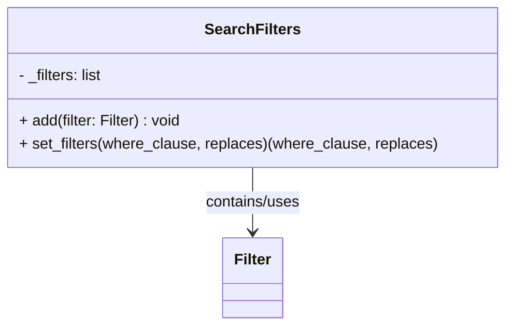

# Diagram: entity_core/entity_service/entity_service/damageview/db/search_filters/search_filters.py


> Auto-generated by Obscura crawlers

## Diagram 1



### SVG

<svg id="container" width="525.4453125" xmlns="http://www.w3.org/2000/svg" class="classDiagram" height="342" viewBox="0 0 525.4453125 342" role="graphics-document document" aria-roledescription="class"><style>#container{font-family:"trebuchet ms",verdana,arial,sans-serif;font-size:16px;fill:#333;}@keyframes edge-animation-frame{from{stroke-dashoffset:0;}}@keyframes dash{to{stroke-dashoffset:0;}}#container .edge-animation-slow{stroke-dasharray:9,5!important;stroke-dashoffset:900;animation:dash 50s linear infinite;stroke-linecap:round;}#container .edge-animation-fast{stroke-dasharray:9,5!important;stroke-dashoffset:900;animation:dash 20s linear infinite;stroke-linecap:round;}#container .error-icon{fill:#552222;}#container .error-text{fill:#552222;stroke:#552222;}#container .edge-thickness-normal{stroke-width:1px;}#container .edge-thickness-thick{stroke-width:3.5px;}#container .edge-pattern-solid{stroke-dasharray:0;}#container .edge-thickness-invisible{stroke-width:0;fill:none;}#container .edge-pattern-dashed{stroke-dasharray:3;}#container .edge-pattern-dotted{stroke-dasharray:2;}#container .marker{fill:#333333;stroke:#333333;}#container .marker.cross{stroke:#333333;}#container svg{font-family:"trebuchet ms",verdana,arial,sans-serif;font-size:16px;}#container p{margin:0;}#container g.classGroup text{fill:#9370DB;stroke:none;font-family:"trebuchet ms",verdana,arial,sans-serif;font-size:10px;}#container g.classGroup text .title{font-weight:bolder;}#container .nodeLabel,#container .edgeLabel{color:#131300;}#container .edgeLabel .label rect{fill:#ECECFF;}#container .label text{fill:#131300;}#container .labelBkg{background:#ECECFF;}#container .edgeLabel .label span{background:#ECECFF;}#container .classTitle{font-weight:bolder;}#container .node rect,#container .node circle,#container .node ellipse,#container .node polygon,#container .node path{fill:#ECECFF;stroke:#9370DB;stroke-width:1px;}#container .divider{stroke:#9370DB;stroke-width:1;}#container g.clickable{cursor:pointer;}#container g.classGroup rect{fill:#ECECFF;stroke:#9370DB;}#container g.classGroup line{stroke:#9370DB;stroke-width:1;}#container .classLabel .box{stroke:none;stroke-width:0;fill:#ECECFF;opacity:0.5;}#container .classLabel .label{fill:#9370DB;font-size:10px;}#container .relation{stroke:#333333;stroke-width:1;fill:none;}#container .dashed-line{stroke-dasharray:3;}#container .dotted-line{stroke-dasharray:1 2;}#container #compositionStart,#container .composition{fill:#333333!important;stroke:#333333!important;stroke-width:1;}#container #compositionEnd,#container .composition{fill:#333333!important;stroke:#333333!important;stroke-width:1;}#container #dependencyStart,#container .dependency{fill:#333333!important;stroke:#333333!important;stroke-width:1;}#container #dependencyStart,#container .dependency{fill:#333333!important;stroke:#333333!important;stroke-width:1;}#container #extensionStart,#container .extension{fill:transparent!important;stroke:#333333!important;stroke-width:1;}#container #extensionEnd,#container .extension{fill:transparent!important;stroke:#333333!important;stroke-width:1;}#container #aggregationStart,#container .aggregation{fill:transparent!important;stroke:#333333!important;stroke-width:1;}#container #aggregationEnd,#container .aggregation{fill:transparent!important;stroke:#333333!important;stroke-width:1;}#container #lollipopStart,#container .lollipop{fill:#ECECFF!important;stroke:#333333!important;stroke-width:1;}#container #lollipopEnd,#container .lollipop{fill:#ECECFF!important;stroke:#333333!important;stroke-width:1;}#container .edgeTerminals{font-size:11px;line-height:initial;}#container .classTitleText{text-anchor:middle;font-size:18px;fill:#333;}#container .label-icon{display:inline-block;height:1em;overflow:visible;vertical-align:-0.125em;}#container .node .label-icon path{fill:currentColor;stroke:revert;stroke-width:revert;}#container :root{--mermaid-font-family:"trebuchet ms",verdana,arial,sans-serif;}</style><g><defs><marker id="container_class-aggregationStart" class="marker aggregation class" refX="18" refY="7" markerWidth="190" markerHeight="240" orient="auto"><path d="M 18,7 L9,13 L1,7 L9,1 Z"></path></marker></defs><defs><marker id="container_class-aggregationEnd" class="marker aggregation class" refX="1" refY="7" markerWidth="20" markerHeight="28" orient="auto"><path d="M 18,7 L9,13 L1,7 L9,1 Z"></path></marker></defs><defs><marker id="container_class-extensionStart" class="marker extension class" refX="18" refY="7" markerWidth="190" markerHeight="240" orient="auto"><path d="M 1,7 L18,13 V 1 Z"></path></marker></defs><defs><marker id="container_class-extensionEnd" class="marker extension class" refX="1" refY="7" markerWidth="20" markerHeight="28" orient="auto"><path d="M 1,1 V 13 L18,7 Z"></path></marker></defs><defs><marker id="container_class-compositionStart" class="marker composition class" refX="18" refY="7" markerWidth="190" markerHeight="240" orient="auto"><path d="M 18,7 L9,13 L1,7 L9,1 Z"></path></marker></defs><defs><marker id="container_class-compositionEnd" class="marker composition class" refX="1" refY="7" markerWidth="20" markerHeight="28" orient="auto"><path d="M 18,7 L9,13 L1,7 L9,1 Z"></path></marker></defs><defs><marker id="container_class-dependencyStart" class="marker dependency class" refX="6" refY="7" markerWidth="190" markerHeight="240" orient="auto"><path d="M 5,7 L9,13 L1,7 L9,1 Z"></path></marker></defs><defs><marker id="container_class-dependencyEnd" class="marker dependency class" refX="13" refY="7" markerWidth="20" markerHeight="28" orient="auto"><path d="M 18,7 L9,13 L14,7 L9,1 Z"></path></marker></defs><defs><marker id="container_class-lollipopStart" class="marker lollipop class" refX="13" refY="7" markerWidth="190" markerHeight="240" orient="auto"><circle stroke="black" fill="transparent" cx="7" cy="7" r="6"></circle></marker></defs><defs><marker id="container_class-lollipopEnd" class="marker lollipop class" refX="1" refY="7" markerWidth="190" markerHeight="240" orient="auto"><circle stroke="black" fill="transparent" cx="7" cy="7" r="6"></circle></marker></defs><g class="root"><g class="clusters"></g><g class="edgePaths"><path d="M262.723,176L262.723,182.167C262.723,188.333,262.723,200.667,262.723,212C262.723,223.333,262.723,233.667,262.723,238.833L262.723,244" id="id_SearchFilters_Filter_1" class="edge-thickness-normal edge-pattern-solid relation" style=";;;" data-edge="true" data-et="edge" data-id="id_SearchFilters_Filter_1" data-points="W3sieCI6MjYyLjcyMjY1NjI1LCJ5IjoxNzZ9LHsieCI6MjYyLjcyMjY1NjI1LCJ5IjoyMTN9LHsieCI6MjYyLjcyMjY1NjI1LCJ5IjoyNTB9XQ==" marker-end="url(#container_class-dependencyEnd)"></path></g><g class="edgeLabels"><g class="edgeLabel" transform="translate(262.72265625, 213)"><g class="label" data-id="id_SearchFilters_Filter_1" transform="translate(-51.296875, -12)"><foreignObject width="102.59375" height="24"><div xmlns="http://www.w3.org/1999/xhtml" class="labelBkg" style="display: table-cell; white-space: nowrap; line-height: 1.5; max-width: 200px; text-align: center;"><span class="edgeLabel"><p>contains/uses</p></span></div></foreignObject></g></g></g><g class="nodes"><g class="node default" id="classId-SearchFilters-0" transform="translate(262.72265625, 92)"><g class="basic label-container"><path d="M-254.72265625 -84 L254.72265625 -84 L254.72265625 84 L-254.72265625 84" stroke="none" stroke-width="0" fill="#ECECFF" style=""></path><path d="M-254.72265625 -84 C-91.61040780500159 -84, 71.50184063999683 -84, 254.72265625 -84 M-254.72265625 -84 C-68.28482946715596 -84, 118.15299731568808 -84, 254.72265625 -84 M254.72265625 -84 C254.72265625 -19.72775544727007, 254.72265625 44.54448910545986, 254.72265625 84 M254.72265625 -84 C254.72265625 -35.507030237246624, 254.72265625 12.985939525506751, 254.72265625 84 M254.72265625 84 C105.06698283923137 84, -44.588690571537256 84, -254.72265625 84 M254.72265625 84 C91.54254518776625 84, -71.6375658744675 84, -254.72265625 84 M-254.72265625 84 C-254.72265625 39.992330601178736, -254.72265625 -4.015338797642528, -254.72265625 -84 M-254.72265625 84 C-254.72265625 19.051131788026623, -254.72265625 -45.89773642394675, -254.72265625 -84" stroke="#9370DB" stroke-width="1.3" fill="none" stroke-dasharray="0 0" style=""></path></g><g class="annotation-group text" transform="translate(0, -60)"></g><g class="label-group text" transform="translate(-47.3515625, -60)"><g class="label" style="font-weight: bolder" transform="translate(0,-12)"><foreignObject width="94.703125" height="24"><div xmlns="http://www.w3.org/1999/xhtml" style="display: table-cell; white-space: nowrap; line-height: 1.5; max-width: 143px; text-align: center;"><span class="nodeLabel markdown-node-label" style=""><p>SearchFilters</p></span></div></foreignObject></g></g><g class="members-group text" transform="translate(-242.72265625, -12)"><g class="label" style="" transform="translate(0,-12)"><foreignObject width="90.78125" height="24"><div xmlns="http://www.w3.org/1999/xhtml" style="display: table-cell; white-space: nowrap; line-height: 1.5; max-width: 148px; text-align: center;"><span class="nodeLabel markdown-node-label" style=""><p>- _filters: list</p></span></div></foreignObject></g></g><g class="methods-group text" transform="translate(-242.72265625, 36)"><g class="label" style="" transform="translate(0,-12)"><foreignObject width="173.484375" height="24"><div xmlns="http://www.w3.org/1999/xhtml" style="display: table-cell; white-space: nowrap; line-height: 1.5; max-width: 231px; text-align: center;"><span class="nodeLabel markdown-node-label" style=""><p>+ add(filter: Filter) : void</p></span></div></foreignObject></g><g class="label" style="" transform="translate(0,12)"><foreignObject width="438.09375" height="24"><div xmlns="http://www.w3.org/1999/xhtml" style="display: table-cell; white-space: nowrap; line-height: 1.5; max-width: 495px; text-align: center;"><span class="nodeLabel markdown-node-label" style=""><p>+ set_filters(where_clause, replaces)(where_clause, replaces)</p></span></div></foreignObject></g></g><g class="divider" style=""><path d="M-254.72265625 -36 C-92.99666581598458 -36, 68.72932461803083 -36, 254.72265625 -36 M-254.72265625 -36 C-56.325273028138355 -36, 142.0721101937233 -36, 254.72265625 -36" stroke="#9370DB" stroke-width="1.3" fill="none" stroke-dasharray="0 0" style=""></path></g><g class="divider" style=""><path d="M-254.72265625 12 C-105.69221136405011 12, 43.33823352189978 12, 254.72265625 12 M-254.72265625 12 C-52.39500592607152 12, 149.93264439785696 12, 254.72265625 12" stroke="#9370DB" stroke-width="1.3" fill="none" stroke-dasharray="0 0" style=""></path></g></g><g class="node default" id="classId-Filter-1" transform="translate(262.72265625, 292)"><g class="basic label-container"><path d="M-30.8671875 -42 L30.8671875 -42 L30.8671875 42 L-30.8671875 42" stroke="none" stroke-width="0" fill="#ECECFF" style=""></path><path d="M-30.8671875 -42 C-7.601514736843438 -42, 15.664158026313125 -42, 30.8671875 -42 M-30.8671875 -42 C-8.660742774259816 -42, 13.545701951480368 -42, 30.8671875 -42 M30.8671875 -42 C30.8671875 -8.683634833564213, 30.8671875 24.632730332871574, 30.8671875 42 M30.8671875 -42 C30.8671875 -18.273686338238388, 30.8671875 5.452627323523224, 30.8671875 42 M30.8671875 42 C13.545424857231751 42, -3.776337785536498 42, -30.8671875 42 M30.8671875 42 C17.846576626523756 42, 4.825965753047516 42, -30.8671875 42 M-30.8671875 42 C-30.8671875 13.912083577856365, -30.8671875 -14.175832844287271, -30.8671875 -42 M-30.8671875 42 C-30.8671875 20.89176695846208, -30.8671875 -0.21646608307583648, -30.8671875 -42" stroke="#9370DB" stroke-width="1.3" fill="none" stroke-dasharray="0 0" style=""></path></g><g class="annotation-group text" transform="translate(0, -18)"></g><g class="label-group text" transform="translate(-18.8671875, -18)"><g class="label" style="font-weight: bolder" transform="translate(0,-12)"><foreignObject width="37.734375" height="24"><div xmlns="http://www.w3.org/1999/xhtml" style="display: table-cell; white-space: nowrap; line-height: 1.5; max-width: 88px; text-align: center;"><span class="nodeLabel markdown-node-label" style=""><p>Filter</p></span></div></foreignObject></g></g><g class="members-group text" transform="translate(-18.8671875, 30)"></g><g class="methods-group text" transform="translate(-18.8671875, 60)"></g><g class="divider" style=""><path d="M-30.8671875 6 C-17.546638745359807 6, -4.226089990719611 6, 30.8671875 6 M-30.8671875 6 C-15.36203905354396 6, 0.14310939291208058 6, 30.8671875 6" stroke="#9370DB" stroke-width="1.3" fill="none" stroke-dasharray="0 0" style=""></path></g><g class="divider" style=""><path d="M-30.8671875 24 C-12.175801184630888 24, 6.5155851307382235 24, 30.8671875 24 M-30.8671875 24 C-10.067364534528007 24, 10.732458430943986 24, 30.8671875 24" stroke="#9370DB" stroke-width="1.3" fill="none" stroke-dasharray="0 0" style=""></path></g></g></g></g></g></svg>

## Diagram 2

```mermaid
flowchart TD
Start([start]) --> CreateSearchFilters[Create SearchFilters]
CreateSearchFilters --> AddOrgFilter[add OrgFilter(params)]
AddOrgFilter --> CheckSearchVersion{params.search_version}
CheckSearchVersion --> |MY_SUBMISSIONS| CheckOrgType{OrgTypes.SHIPPER in params.org_type?}
CheckOrgType --> |yes| SetAssignee[Set params.assignee_email = params.user_email]
SetAssignee --> AddAssigneeFilter[add AssigneeEmailFilter(params)]
CheckOrgType --> |no| SetSubmitter[Set params.submitter_email = params.user_email]
SetSubmitter --> AddSubmitterFilter[add SubmitterEmailFilter(params)]
AddAssigneeFilter --> AfterVersion
AddSubmitterFilter --> AfterVersion
CheckSearchVersion --> |SUBMISSION_DETAILS| AddSubmissionIdFilter[add SubmissionIdFilter(params)]
AddSubmissionIdFilter --> AfterVersion
CheckSearchVersion --> |other| AfterVersion
AfterVersion --> CheckArchived{not params.get("get_archived")?}
CheckArchived --> |true| AddArchivedFilter[add ArchivedFilter(params)]
CheckArchived --> |false| SkipArchived[skip ArchivedFilter]
AddArchivedFilter --> AfterMapping
SkipArchived --> AfterMapping
AfterMapping --> MappingLoop[For each key in filters_mapping: if key in params -> add corresponding filter]
MappingLoop --> SetFiltersCall[call search_filters.set_filters(where_clause, replaces)]
SetFiltersCall --> Return[return where_clause, replaces]
Return --> End([end])
```

> SVG rendering failed for this diagram.
