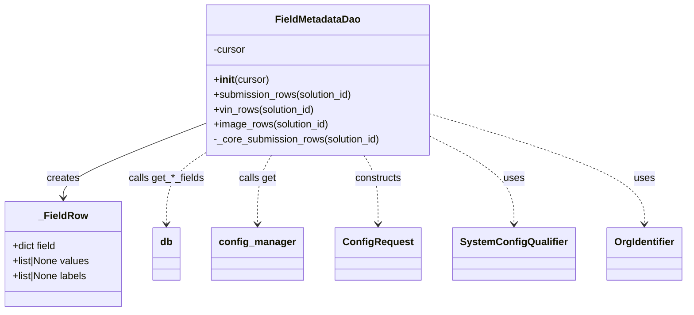

# Diagram: entity_core/entity_service/entity_service/damageview/fields/dao/fields_metadata_dao.py


> Auto-generated by Obscura crawlers

## Diagram 1



### SVG

<svg id="container" width="1070.3671875" xmlns="http://www.w3.org/2000/svg" class="classDiagram" height="498" viewBox="0 0 1070.3671875 498" role="graphics-document document" aria-roledescription="class"><style>#container{font-family:"trebuchet ms",verdana,arial,sans-serif;font-size:16px;fill:#333;}@keyframes edge-animation-frame{from{stroke-dashoffset:0;}}@keyframes dash{to{stroke-dashoffset:0;}}#container .edge-animation-slow{stroke-dasharray:9,5!important;stroke-dashoffset:900;animation:dash 50s linear infinite;stroke-linecap:round;}#container .edge-animation-fast{stroke-dasharray:9,5!important;stroke-dashoffset:900;animation:dash 20s linear infinite;stroke-linecap:round;}#container .error-icon{fill:#552222;}#container .error-text{fill:#552222;stroke:#552222;}#container .edge-thickness-normal{stroke-width:1px;}#container .edge-thickness-thick{stroke-width:3.5px;}#container .edge-pattern-solid{stroke-dasharray:0;}#container .edge-thickness-invisible{stroke-width:0;fill:none;}#container .edge-pattern-dashed{stroke-dasharray:3;}#container .edge-pattern-dotted{stroke-dasharray:2;}#container .marker{fill:#333333;stroke:#333333;}#container .marker.cross{stroke:#333333;}#container svg{font-family:"trebuchet ms",verdana,arial,sans-serif;font-size:16px;}#container p{margin:0;}#container g.classGroup text{fill:#9370DB;stroke:none;font-family:"trebuchet ms",verdana,arial,sans-serif;font-size:10px;}#container g.classGroup text .title{font-weight:bolder;}#container .nodeLabel,#container .edgeLabel{color:#131300;}#container .edgeLabel .label rect{fill:#ECECFF;}#container .label text{fill:#131300;}#container .labelBkg{background:#ECECFF;}#container .edgeLabel .label span{background:#ECECFF;}#container .classTitle{font-weight:bolder;}#container .node rect,#container .node circle,#container .node ellipse,#container .node polygon,#container .node path{fill:#ECECFF;stroke:#9370DB;stroke-width:1px;}#container .divider{stroke:#9370DB;stroke-width:1;}#container g.clickable{cursor:pointer;}#container g.classGroup rect{fill:#ECECFF;stroke:#9370DB;}#container g.classGroup line{stroke:#9370DB;stroke-width:1;}#container .classLabel .box{stroke:none;stroke-width:0;fill:#ECECFF;opacity:0.5;}#container .classLabel .label{fill:#9370DB;font-size:10px;}#container .relation{stroke:#333333;stroke-width:1;fill:none;}#container .dashed-line{stroke-dasharray:3;}#container .dotted-line{stroke-dasharray:1 2;}#container #compositionStart,#container .composition{fill:#333333!important;stroke:#333333!important;stroke-width:1;}#container #compositionEnd,#container .composition{fill:#333333!important;stroke:#333333!important;stroke-width:1;}#container #dependencyStart,#container .dependency{fill:#333333!important;stroke:#333333!important;stroke-width:1;}#container #dependencyStart,#container .dependency{fill:#333333!important;stroke:#333333!important;stroke-width:1;}#container #extensionStart,#container .extension{fill:transparent!important;stroke:#333333!important;stroke-width:1;}#container #extensionEnd,#container .extension{fill:transparent!important;stroke:#333333!important;stroke-width:1;}#container #aggregationStart,#container .aggregation{fill:transparent!important;stroke:#333333!important;stroke-width:1;}#container #aggregationEnd,#container .aggregation{fill:transparent!important;stroke:#333333!important;stroke-width:1;}#container #lollipopStart,#container .lollipop{fill:#ECECFF!important;stroke:#333333!important;stroke-width:1;}#container #lollipopEnd,#container .lollipop{fill:#ECECFF!important;stroke:#333333!important;stroke-width:1;}#container .edgeTerminals{font-size:11px;line-height:initial;}#container .classTitleText{text-anchor:middle;font-size:18px;fill:#333;}#container .label-icon{display:inline-block;height:1em;overflow:visible;vertical-align:-0.125em;}#container .node .label-icon path{fill:currentColor;stroke:revert;stroke-width:revert;}#container :root{--mermaid-font-family:"trebuchet ms",verdana,arial,sans-serif;}</style><g><defs><marker id="container_class-aggregationStart" class="marker aggregation class" refX="18" refY="7" markerWidth="190" markerHeight="240" orient="auto"><path d="M 18,7 L9,13 L1,7 L9,1 Z"></path></marker></defs><defs><marker id="container_class-aggregationEnd" class="marker aggregation class" refX="1" refY="7" markerWidth="20" markerHeight="28" orient="auto"><path d="M 18,7 L9,13 L1,7 L9,1 Z"></path></marker></defs><defs><marker id="container_class-extensionStart" class="marker extension class" refX="18" refY="7" markerWidth="190" markerHeight="240" orient="auto"><path d="M 1,7 L18,13 V 1 Z"></path></marker></defs><defs><marker id="container_class-extensionEnd" class="marker extension class" refX="1" refY="7" markerWidth="20" markerHeight="28" orient="auto"><path d="M 1,1 V 13 L18,7 Z"></path></marker></defs><defs><marker id="container_class-compositionStart" class="marker composition class" refX="18" refY="7" markerWidth="190" markerHeight="240" orient="auto"><path d="M 18,7 L9,13 L1,7 L9,1 Z"></path></marker></defs><defs><marker id="container_class-compositionEnd" class="marker composition class" refX="1" refY="7" markerWidth="20" markerHeight="28" orient="auto"><path d="M 18,7 L9,13 L1,7 L9,1 Z"></path></marker></defs><defs><marker id="container_class-dependencyStart" class="marker dependency class" refX="6" refY="7" markerWidth="190" markerHeight="240" orient="auto"><path d="M 5,7 L9,13 L1,7 L9,1 Z"></path></marker></defs><defs><marker id="container_class-dependencyEnd" class="marker dependency class" refX="13" refY="7" markerWidth="20" markerHeight="28" orient="auto"><path d="M 18,7 L9,13 L14,7 L9,1 Z"></path></marker></defs><defs><marker id="container_class-lollipopStart" class="marker lollipop class" refX="13" refY="7" markerWidth="190" markerHeight="240" orient="auto"><circle stroke="black" fill="transparent" cx="7" cy="7" r="6"></circle></marker></defs><defs><marker id="container_class-lollipopEnd" class="marker lollipop class" refX="1" refY="7" markerWidth="190" markerHeight="240" orient="auto"><circle stroke="black" fill="transparent" cx="7" cy="7" r="6"></circle></marker></defs><g class="root"><g class="clusters"></g><g class="edgePaths"><path d="M321.035,198.727L284.443,213.106C247.85,227.485,174.665,256.242,138.073,275.788C101.48,295.333,101.48,305.667,101.48,310.833L101.48,316" id="id_FieldMetadataDao__FieldRow_1" class="edge-thickness-normal edge-pattern-solid relation" style=";;;" data-edge="true" data-et="edge" data-id="id_FieldMetadataDao__FieldRow_1" data-points="W3sieCI6MzIxLjAzNTE1NjI1LCJ5IjoxOTguNzI3MDU0MDg0NzA1MzR9LHsieCI6MTAxLjQ4MDQ2ODc1LCJ5IjoyODV9LHsieCI6MTAxLjQ4MDQ2ODc1LCJ5IjozMjJ9XQ==" marker-end="url(#container_class-dependencyEnd)"></path><path d="M321.801,248L312.59,254.167C303.38,260.333,284.96,272.667,275.749,291C266.539,309.333,266.539,333.667,266.539,345.833L266.539,358" id="id_FieldMetadataDao_db_2" class="edge-thickness-normal edge-pattern-dashed relation" style=";;;" data-edge="true" data-et="edge" data-id="id_FieldMetadataDao_db_2" data-points="W3sieCI6MzIxLjgwMDYzMTk2NjU2MDUsInkiOjI0OH0seyJ4IjoyNjYuNTM5MDYyNSwieSI6Mjg1fSx7IngiOjI2Ni41MzkwNjI1LCJ5IjozNjR9XQ==" marker-end="url(#container_class-dependencyEnd)"></path><path d="M430.246,248L426.609,254.167C422.971,260.333,415.697,272.667,412.059,291C408.422,309.333,408.422,333.667,408.422,345.833L408.422,358" id="id_FieldMetadataDao_config_manager_3" class="edge-thickness-normal edge-pattern-dashed relation" style=";;;" data-edge="true" data-et="edge" data-id="id_FieldMetadataDao_config_manager_3" data-points="W3sieCI6NDMwLjI0NjA5Mzc1LCJ5IjoyNDh9LHsieCI6NDA4LjQyMTg3NSwieSI6Mjg1fSx7IngiOjQwOC40MjE4NzUsInkiOjM2NH1d" marker-end="url(#container_class-dependencyEnd)"></path><path d="M571.809,248L575.446,254.167C579.083,260.333,586.358,272.667,589.995,291C593.633,309.333,593.633,333.667,593.633,345.833L593.633,358" id="id_FieldMetadataDao_ConfigRequest_4" class="edge-thickness-normal edge-pattern-dashed relation" style=";;;" data-edge="true" data-et="edge" data-id="id_FieldMetadataDao_ConfigRequest_4" data-points="W3sieCI6NTcxLjgwODU5Mzc1LCJ5IjoyNDh9LHsieCI6NTkzLjYzMjgxMjUsInkiOjI4NX0seyJ4Ijo1OTMuNjMyODEyNSwieSI6MzY0fV0=" marker-end="url(#container_class-dependencyEnd)"></path><path d="M681.02,222.058L701.094,232.548C721.169,243.038,761.319,264.019,781.394,286.676C801.469,309.333,801.469,333.667,801.469,345.833L801.469,358" id="id_FieldMetadataDao_SystemConfigQualifier_5" class="edge-thickness-normal edge-pattern-dashed relation" style=";;;" data-edge="true" data-et="edge" data-id="id_FieldMetadataDao_SystemConfigQualifier_5" data-points="W3sieCI6NjgxLjAxOTUzMTI1LCJ5IjoyMjIuMDU3NTE5NTM1MDU5MX0seyJ4Ijo4MDEuNDY4NzUsInkiOjI4NX0seyJ4Ijo4MDEuNDY4NzUsInkiOjM2NH1d" marker-end="url(#container_class-dependencyEnd)"></path><path d="M681.02,184.253L734.747,201.044C788.474,217.835,895.928,251.418,949.656,280.375C1003.383,309.333,1003.383,333.667,1003.383,345.833L1003.383,358" id="id_FieldMetadataDao_OrgIdentifier_6" class="edge-thickness-normal edge-pattern-dashed relation" style=";;;" data-edge="true" data-et="edge" data-id="id_FieldMetadataDao_OrgIdentifier_6" data-points="W3sieCI6NjgxLjAxOTUzMTI1LCJ5IjoxODQuMjUyNTQ0NjUyOTI0MTJ9LHsieCI6MTAwMy4zODI4MTI1LCJ5IjoyODV9LHsieCI6MTAwMy4zODI4MTI1LCJ5IjozNjR9XQ==" marker-end="url(#container_class-dependencyEnd)"></path></g><g class="edgeLabels"><g class="edgeLabel" transform="translate(101.48046875, 285)"><g class="label" data-id="id_FieldMetadataDao__FieldRow_1" transform="translate(-26.171875, -12)"><foreignObject width="52.34375" height="24"><div xmlns="http://www.w3.org/1999/xhtml" class="labelBkg" style="display: table-cell; white-space: nowrap; line-height: 1.5; max-width: 200px; text-align: center;"><span class="edgeLabel"><p>creates</p></span></div></foreignObject></g></g><g class="edgeLabel" transform="translate(266.5390625, 285)"><g class="label" data-id="id_FieldMetadataDao_db_2" transform="translate(-59.703125, -12)"><foreignObject width="119.40625" height="24"><div xmlns="http://www.w3.org/1999/xhtml" class="labelBkg" style="display: table-cell; white-space: nowrap; line-height: 1.5; max-width: 200px; text-align: center;"><span class="edgeLabel"><p>calls get_*_fields</p></span></div></foreignObject></g></g><g class="edgeLabel" transform="translate(408.421875, 285)"><g class="label" data-id="id_FieldMetadataDao_config_manager_3" transform="translate(-29.84375, -12)"><foreignObject width="59.6875" height="24"><div xmlns="http://www.w3.org/1999/xhtml" class="labelBkg" style="display: table-cell; white-space: nowrap; line-height: 1.5; max-width: 200px; text-align: center;"><span class="edgeLabel"><p>calls get</p></span></div></foreignObject></g></g><g class="edgeLabel" transform="translate(593.6328125, 285)"><g class="label" data-id="id_FieldMetadataDao_ConfigRequest_4" transform="translate(-37.84375, -12)"><foreignObject width="75.6875" height="24"><div xmlns="http://www.w3.org/1999/xhtml" class="labelBkg" style="display: table-cell; white-space: nowrap; line-height: 1.5; max-width: 200px; text-align: center;"><span class="edgeLabel"><p>constructs</p></span></div></foreignObject></g></g><g class="edgeLabel" transform="translate(801.46875, 285)"><g class="label" data-id="id_FieldMetadataDao_SystemConfigQualifier_5" transform="translate(-16.4921875, -12)"><foreignObject width="32.984375" height="24"><div xmlns="http://www.w3.org/1999/xhtml" class="labelBkg" style="display: table-cell; white-space: nowrap; line-height: 1.5; max-width: 200px; text-align: center;"><span class="edgeLabel"><p>uses</p></span></div></foreignObject></g></g><g class="edgeLabel" transform="translate(1003.3828125, 285)"><g class="label" data-id="id_FieldMetadataDao_OrgIdentifier_6" transform="translate(-16.4921875, -12)"><foreignObject width="32.984375" height="24"><div xmlns="http://www.w3.org/1999/xhtml" class="labelBkg" style="display: table-cell; white-space: nowrap; line-height: 1.5; max-width: 200px; text-align: center;"><span class="edgeLabel"><p>uses</p></span></div></foreignObject></g></g></g><g class="nodes"><g class="node default" id="classId-_FieldRow-0" transform="translate(101.48046875, 406)"><g class="basic label-container"><path d="M-93.48046875 -84 L93.48046875 -84 L93.48046875 84 L-93.48046875 84" stroke="none" stroke-width="0" fill="#ECECFF" style=""></path><path d="M-93.48046875 -84 C-43.66929980886993 -84, 6.14186913226014 -84, 93.48046875 -84 M-93.48046875 -84 C-47.330345581562625 -84, -1.1802224131252501 -84, 93.48046875 -84 M93.48046875 -84 C93.48046875 -20.78201453161227, 93.48046875 42.43597093677546, 93.48046875 84 M93.48046875 -84 C93.48046875 -24.38606788390311, 93.48046875 35.22786423219378, 93.48046875 84 M93.48046875 84 C34.463152639814936 84, -24.554163470370128 84, -93.48046875 84 M93.48046875 84 C48.700171567306974 84, 3.919874384613948 84, -93.48046875 84 M-93.48046875 84 C-93.48046875 42.50737772351646, -93.48046875 1.0147554470329254, -93.48046875 -84 M-93.48046875 84 C-93.48046875 35.76778641494878, -93.48046875 -12.46442717010244, -93.48046875 -84" stroke="#9370DB" stroke-width="1.3" fill="none" stroke-dasharray="0 0" style=""></path></g><g class="annotation-group text" transform="translate(0, -60)"></g><g class="label-group text" transform="translate(-37.1171875, -60)"><g class="label" style="font-weight: bolder" transform="translate(0,-12)"><foreignObject width="74.234375" height="24"><div xmlns="http://www.w3.org/1999/xhtml" style="display: table-cell; white-space: nowrap; line-height: 1.5; max-width: 124px; text-align: center;"><span class="nodeLabel markdown-node-label" style=""><p>_FieldRow</p></span></div></foreignObject></g></g><g class="members-group text" transform="translate(-81.48046875, -12)"><g class="label" style="" transform="translate(0,-12)"><foreignObject width="71.828125" height="24"><div xmlns="http://www.w3.org/1999/xhtml" style="display: table-cell; white-space: nowrap; line-height: 1.5; max-width: 129px; text-align: center;"><span class="nodeLabel markdown-node-label" style=""><p>+dict field</p></span></div></foreignObject></g><g class="label" style="" transform="translate(0,12)"><foreignObject width="125.84375" height="24"><div xmlns="http://www.w3.org/1999/xhtml" style="display: table-cell; white-space: nowrap; line-height: 1.5; max-width: 183px; text-align: center;"><span class="nodeLabel markdown-node-label" style=""><p>+list|None values</p></span></div></foreignObject></g><g class="label" style="" transform="translate(0,36)"><foreignObject width="123.1875" height="24"><div xmlns="http://www.w3.org/1999/xhtml" style="display: table-cell; white-space: nowrap; line-height: 1.5; max-width: 181px; text-align: center;"><span class="nodeLabel markdown-node-label" style=""><p>+list|None labels</p></span></div></foreignObject></g></g><g class="methods-group text" transform="translate(-81.48046875, 84)"></g><g class="divider" style=""><path d="M-93.48046875 -36 C-48.58933361645344 -36, -3.698198482906875 -36, 93.48046875 -36 M-93.48046875 -36 C-39.25910720114471 -36, 14.962254347710584 -36, 93.48046875 -36" stroke="#9370DB" stroke-width="1.3" fill="none" stroke-dasharray="0 0" style=""></path></g><g class="divider" style=""><path d="M-93.48046875 60 C-23.847829661192065 60, 45.78480942761587 60, 93.48046875 60 M-93.48046875 60 C-53.275356627467865 60, -13.07024450493573 60, 93.48046875 60" stroke="#9370DB" stroke-width="1.3" fill="none" stroke-dasharray="0 0" style=""></path></g></g><g class="node default" id="classId-FieldMetadataDao-1" transform="translate(501.02734375, 128)"><g class="basic label-container"><path d="M-179.9921875 -120 L179.9921875 -120 L179.9921875 120 L-179.9921875 120" stroke="none" stroke-width="0" fill="#ECECFF" style=""></path><path d="M-179.9921875 -120 C-104.58712801845319 -120, -29.18206853690637 -120, 179.9921875 -120 M-179.9921875 -120 C-44.29138100004741 -120, 91.40942549990518 -120, 179.9921875 -120 M179.9921875 -120 C179.9921875 -48.36304477158562, 179.9921875 23.27391045682876, 179.9921875 120 M179.9921875 -120 C179.9921875 -27.814002427069624, 179.9921875 64.37199514586075, 179.9921875 120 M179.9921875 120 C44.04889278406739 120, -91.89440193186522 120, -179.9921875 120 M179.9921875 120 C93.96581905956836 120, 7.939450619136721 120, -179.9921875 120 M-179.9921875 120 C-179.9921875 39.60214137933855, -179.9921875 -40.795717241322905, -179.9921875 -120 M-179.9921875 120 C-179.9921875 36.025330742472136, -179.9921875 -47.94933851505573, -179.9921875 -120" stroke="#9370DB" stroke-width="1.3" fill="none" stroke-dasharray="0 0" style=""></path></g><g class="annotation-group text" transform="translate(0, -96)"></g><g class="label-group text" transform="translate(-66.296875, -96)"><g class="label" style="font-weight: bolder" transform="translate(0,-12)"><foreignObject width="132.59375" height="24"><div xmlns="http://www.w3.org/1999/xhtml" style="display: table-cell; white-space: nowrap; line-height: 1.5; max-width: 181px; text-align: center;"><span class="nodeLabel markdown-node-label" style=""><p>FieldMetadataDao</p></span></div></foreignObject></g></g><g class="members-group text" transform="translate(-167.9921875, -48)"><g class="label" style="" transform="translate(0,-12)"><foreignObject width="52.1875" height="24"><div xmlns="http://www.w3.org/1999/xhtml" style="display: table-cell; white-space: nowrap; line-height: 1.5; max-width: 110px; text-align: center;"><span class="nodeLabel markdown-node-label" style=""><p>-cursor</p></span></div></foreignObject></g></g><g class="methods-group text" transform="translate(-167.9921875, 0)"><g class="label" style="" transform="translate(0,-12)"><foreignObject width="88.53125" height="24"><div xmlns="http://www.w3.org/1999/xhtml" style="display: table-cell; white-space: nowrap; line-height: 1.5; max-width: 177px; text-align: center;"><span class="nodeLabel markdown-node-label" style=""><p>+<strong>init</strong>(cursor)</p></span></div></foreignObject></g><g class="label" style="" transform="translate(0,12)"><foreignObject width="225.421875" height="24"><div xmlns="http://www.w3.org/1999/xhtml" style="display: table-cell; white-space: nowrap; line-height: 1.5; max-width: 283px; text-align: center;"><span class="nodeLabel markdown-node-label" style=""><p>+submission_rows(solution_id)</p></span></div></foreignObject></g><g class="label" style="" transform="translate(0,36)"><foreignObject width="164.484375" height="24"><div xmlns="http://www.w3.org/1999/xhtml" style="display: table-cell; white-space: nowrap; line-height: 1.5; max-width: 222px; text-align: center;"><span class="nodeLabel markdown-node-label" style=""><p>+vin_rows(solution_id)</p></span></div></foreignObject></g><g class="label" style="" transform="translate(0,60)"><foreignObject width="186.125" height="24"><div xmlns="http://www.w3.org/1999/xhtml" style="display: table-cell; white-space: nowrap; line-height: 1.5; max-width: 243px; text-align: center;"><span class="nodeLabel markdown-node-label" style=""><p>+image_rows(solution_id)</p></span></div></foreignObject></g><g class="label" style="" transform="translate(0,84)"><foreignObject width="269.6875" height="24"><div xmlns="http://www.w3.org/1999/xhtml" style="display: table-cell; white-space: nowrap; line-height: 1.5; max-width: 327px; text-align: center;"><span class="nodeLabel markdown-node-label" style=""><p>-_core_submission_rows(solution_id)</p></span></div></foreignObject></g></g><g class="divider" style=""><path d="M-179.9921875 -72 C-85.49335583417965 -72, 9.005475831640695 -72, 179.9921875 -72 M-179.9921875 -72 C-88.15507779827793 -72, 3.682031903444141 -72, 179.9921875 -72" stroke="#9370DB" stroke-width="1.3" fill="none" stroke-dasharray="0 0" style=""></path></g><g class="divider" style=""><path d="M-179.9921875 -24 C-78.69027885395116 -24, 22.611629792097688 -24, 179.9921875 -24 M-179.9921875 -24 C-45.73860469623628 -24, 88.51497810752744 -24, 179.9921875 -24" stroke="#9370DB" stroke-width="1.3" fill="none" stroke-dasharray="0 0" style=""></path></g></g><g class="node default" id="classId-db-2" transform="translate(266.5390625, 406)"><g class="basic label-container"><path d="M-21.578125 -42 L21.578125 -42 L21.578125 42 L-21.578125 42" stroke="none" stroke-width="0" fill="#ECECFF" style=""></path><path d="M-21.578125 -42 C-11.164727035232351 -42, -0.7513290704647027 -42, 21.578125 -42 M-21.578125 -42 C-9.925925281626293 -42, 1.7262744367474134 -42, 21.578125 -42 M21.578125 -42 C21.578125 -10.529225185153777, 21.578125 20.941549629692446, 21.578125 42 M21.578125 -42 C21.578125 -17.08429885621445, 21.578125 7.831402287571102, 21.578125 42 M21.578125 42 C6.582737254150127 42, -8.412650491699747 42, -21.578125 42 M21.578125 42 C10.750672202506236 42, -0.07678059498752887 42, -21.578125 42 M-21.578125 42 C-21.578125 22.155477470448947, -21.578125 2.3109549408978936, -21.578125 -42 M-21.578125 42 C-21.578125 20.510610608625242, -21.578125 -0.9787787827495151, -21.578125 -42" stroke="#9370DB" stroke-width="1.3" fill="none" stroke-dasharray="0 0" style=""></path></g><g class="annotation-group text" transform="translate(0, -18)"></g><g class="label-group text" transform="translate(-9.578125, -18)"><g class="label" style="font-weight: bolder" transform="translate(0,-12)"><foreignObject width="19.15625" height="24"><div xmlns="http://www.w3.org/1999/xhtml" style="display: table-cell; white-space: nowrap; line-height: 1.5; max-width: 69px; text-align: center;"><span class="nodeLabel markdown-node-label" style=""><p>db</p></span></div></foreignObject></g></g><g class="members-group text" transform="translate(-9.578125, 30)"></g><g class="methods-group text" transform="translate(-9.578125, 60)"></g><g class="divider" style=""><path d="M-21.578125 6 C-8.953888194886593 6, 3.6703486102268137 6, 21.578125 6 M-21.578125 6 C-8.923064907249165 6, 3.7319951855016704 6, 21.578125 6" stroke="#9370DB" stroke-width="1.3" fill="none" stroke-dasharray="0 0" style=""></path></g><g class="divider" style=""><path d="M-21.578125 24 C-6.376902365125302 24, 8.824320269749396 24, 21.578125 24 M-21.578125 24 C-11.678581129996758 24, -1.7790372599935154 24, 21.578125 24" stroke="#9370DB" stroke-width="1.3" fill="none" stroke-dasharray="0 0" style=""></path></g></g><g class="node default" id="classId-config_manager-3" transform="translate(408.421875, 406)"><g class="basic label-container"><path d="M-70.3046875 -42 L70.3046875 -42 L70.3046875 42 L-70.3046875 42" stroke="none" stroke-width="0" fill="#ECECFF" style=""></path><path d="M-70.3046875 -42 C-19.283905886075743 -42, 31.736875727848513 -42, 70.3046875 -42 M-70.3046875 -42 C-26.759120886607512 -42, 16.786445726784976 -42, 70.3046875 -42 M70.3046875 -42 C70.3046875 -17.135228852298436, 70.3046875 7.729542295403128, 70.3046875 42 M70.3046875 -42 C70.3046875 -10.875068294110523, 70.3046875 20.249863411778954, 70.3046875 42 M70.3046875 42 C39.91434847797193 42, 9.524009455943848 42, -70.3046875 42 M70.3046875 42 C19.693828525681084 42, -30.91703044863783 42, -70.3046875 42 M-70.3046875 42 C-70.3046875 21.103062890419306, -70.3046875 0.20612578083861166, -70.3046875 -42 M-70.3046875 42 C-70.3046875 16.325557834303158, -70.3046875 -9.348884331393684, -70.3046875 -42" stroke="#9370DB" stroke-width="1.3" fill="none" stroke-dasharray="0 0" style=""></path></g><g class="annotation-group text" transform="translate(0, -18)"></g><g class="label-group text" transform="translate(-58.3046875, -18)"><g class="label" style="font-weight: bolder" transform="translate(0,-12)"><foreignObject width="116.609375" height="24"><div xmlns="http://www.w3.org/1999/xhtml" style="display: table-cell; white-space: nowrap; line-height: 1.5; max-width: 166px; text-align: center;"><span class="nodeLabel markdown-node-label" style=""><p>config_manager</p></span></div></foreignObject></g></g><g class="members-group text" transform="translate(-58.3046875, 30)"></g><g class="methods-group text" transform="translate(-58.3046875, 60)"></g><g class="divider" style=""><path d="M-70.3046875 6 C-36.3407174200118 6, -2.3767473400235986 6, 70.3046875 6 M-70.3046875 6 C-21.08579973243178 6, 28.13308803513644 6, 70.3046875 6" stroke="#9370DB" stroke-width="1.3" fill="none" stroke-dasharray="0 0" style=""></path></g><g class="divider" style=""><path d="M-70.3046875 24 C-23.613189446959808 24, 23.078308606080384 24, 70.3046875 24 M-70.3046875 24 C-29.031011722318873 24, 12.242664055362255 24, 70.3046875 24" stroke="#9370DB" stroke-width="1.3" fill="none" stroke-dasharray="0 0" style=""></path></g></g><g class="node default" id="classId-ConfigRequest-4" transform="translate(593.6328125, 406)"><g class="basic label-container"><path d="M-64.90625 -42 L64.90625 -42 L64.90625 42 L-64.90625 42" stroke="none" stroke-width="0" fill="#ECECFF" style=""></path><path d="M-64.90625 -42 C-24.665598410413423 -42, 15.575053179173153 -42, 64.90625 -42 M-64.90625 -42 C-32.27911239415932 -42, 0.34802521168136025 -42, 64.90625 -42 M64.90625 -42 C64.90625 -15.161044807267036, 64.90625 11.677910385465928, 64.90625 42 M64.90625 -42 C64.90625 -23.196703552427266, 64.90625 -4.393407104854532, 64.90625 42 M64.90625 42 C25.68193920252093 42, -13.54237159495814 42, -64.90625 42 M64.90625 42 C25.762879853044268 42, -13.380490293911464 42, -64.90625 42 M-64.90625 42 C-64.90625 24.90772759253689, -64.90625 7.81545518507378, -64.90625 -42 M-64.90625 42 C-64.90625 19.10098475721674, -64.90625 -3.798030485566521, -64.90625 -42" stroke="#9370DB" stroke-width="1.3" fill="none" stroke-dasharray="0 0" style=""></path></g><g class="annotation-group text" transform="translate(0, -18)"></g><g class="label-group text" transform="translate(-52.90625, -18)"><g class="label" style="font-weight: bolder" transform="translate(0,-12)"><foreignObject width="105.8125" height="24"><div xmlns="http://www.w3.org/1999/xhtml" style="display: table-cell; white-space: nowrap; line-height: 1.5; max-width: 154px; text-align: center;"><span class="nodeLabel markdown-node-label" style=""><p>ConfigRequest</p></span></div></foreignObject></g></g><g class="members-group text" transform="translate(-52.90625, 30)"></g><g class="methods-group text" transform="translate(-52.90625, 60)"></g><g class="divider" style=""><path d="M-64.90625 6 C-36.755855160885716 6, -8.605460321771432 6, 64.90625 6 M-64.90625 6 C-34.48643558344818 6, -4.066621166896354 6, 64.90625 6" stroke="#9370DB" stroke-width="1.3" fill="none" stroke-dasharray="0 0" style=""></path></g><g class="divider" style=""><path d="M-64.90625 24 C-24.78150457486774 24, 15.343240850264522 24, 64.90625 24 M-64.90625 24 C-20.70872094346535 24, 23.488808113069297 24, 64.90625 24" stroke="#9370DB" stroke-width="1.3" fill="none" stroke-dasharray="0 0" style=""></path></g></g><g class="node default" id="classId-SystemConfigQualifier-5" transform="translate(801.46875, 406)"><g class="basic label-container"><path d="M-92.9296875 -42 L92.9296875 -42 L92.9296875 42 L-92.9296875 42" stroke="none" stroke-width="0" fill="#ECECFF" style=""></path><path d="M-92.9296875 -42 C-30.364727951133453 -42, 32.200231597733094 -42, 92.9296875 -42 M-92.9296875 -42 C-39.10638147617264 -42, 14.716924547654713 -42, 92.9296875 -42 M92.9296875 -42 C92.9296875 -23.76959362911838, 92.9296875 -5.539187258236758, 92.9296875 42 M92.9296875 -42 C92.9296875 -13.51010337211435, 92.9296875 14.979793255771298, 92.9296875 42 M92.9296875 42 C49.9933912867624 42, 7.057095073524806 42, -92.9296875 42 M92.9296875 42 C54.16388416428865 42, 15.398080828577307 42, -92.9296875 42 M-92.9296875 42 C-92.9296875 13.088926494002585, -92.9296875 -15.82214701199483, -92.9296875 -42 M-92.9296875 42 C-92.9296875 21.191539599480887, -92.9296875 0.38307919896177367, -92.9296875 -42" stroke="#9370DB" stroke-width="1.3" fill="none" stroke-dasharray="0 0" style=""></path></g><g class="annotation-group text" transform="translate(0, -18)"></g><g class="label-group text" transform="translate(-80.9296875, -18)"><g class="label" style="font-weight: bolder" transform="translate(0,-12)"><foreignObject width="161.859375" height="24"><div xmlns="http://www.w3.org/1999/xhtml" style="display: table-cell; white-space: nowrap; line-height: 1.5; max-width: 210px; text-align: center;"><span class="nodeLabel markdown-node-label" style=""><p>SystemConfigQualifier</p></span></div></foreignObject></g></g><g class="members-group text" transform="translate(-80.9296875, 30)"></g><g class="methods-group text" transform="translate(-80.9296875, 60)"></g><g class="divider" style=""><path d="M-92.9296875 6 C-32.08275639198561 6, 28.764174716028776 6, 92.9296875 6 M-92.9296875 6 C-27.959114093995467 6, 37.011459312009066 6, 92.9296875 6" stroke="#9370DB" stroke-width="1.3" fill="none" stroke-dasharray="0 0" style=""></path></g><g class="divider" style=""><path d="M-92.9296875 24 C-24.198389604861447 24, 44.532908290277106 24, 92.9296875 24 M-92.9296875 24 C-37.44209267421196 24, 18.045502151576073 24, 92.9296875 24" stroke="#9370DB" stroke-width="1.3" fill="none" stroke-dasharray="0 0" style=""></path></g></g><g class="node default" id="classId-OrgIdentifier-6" transform="translate(1003.3828125, 406)"><g class="basic label-container"><path d="M-58.984375 -42 L58.984375 -42 L58.984375 42 L-58.984375 42" stroke="none" stroke-width="0" fill="#ECECFF" style=""></path><path d="M-58.984375 -42 C-25.586808159805862 -42, 7.810758680388275 -42, 58.984375 -42 M-58.984375 -42 C-26.78296049576594 -42, 5.418454008468117 -42, 58.984375 -42 M58.984375 -42 C58.984375 -18.816059055628536, 58.984375 4.367881888742929, 58.984375 42 M58.984375 -42 C58.984375 -19.852057567180807, 58.984375 2.295884865638385, 58.984375 42 M58.984375 42 C16.887913008182373 42, -25.208548983635254 42, -58.984375 42 M58.984375 42 C26.874450901710375 42, -5.23547319657925 42, -58.984375 42 M-58.984375 42 C-58.984375 9.696212236131892, -58.984375 -22.607575527736216, -58.984375 -42 M-58.984375 42 C-58.984375 25.10714844394885, -58.984375 8.214296887897703, -58.984375 -42" stroke="#9370DB" stroke-width="1.3" fill="none" stroke-dasharray="0 0" style=""></path></g><g class="annotation-group text" transform="translate(0, -18)"></g><g class="label-group text" transform="translate(-46.984375, -18)"><g class="label" style="font-weight: bolder" transform="translate(0,-12)"><foreignObject width="93.96875" height="24"><div xmlns="http://www.w3.org/1999/xhtml" style="display: table-cell; white-space: nowrap; line-height: 1.5; max-width: 143px; text-align: center;"><span class="nodeLabel markdown-node-label" style=""><p>OrgIdentifier</p></span></div></foreignObject></g></g><g class="members-group text" transform="translate(-46.984375, 30)"></g><g class="methods-group text" transform="translate(-46.984375, 60)"></g><g class="divider" style=""><path d="M-58.984375 6 C-34.283646466028756 6, -9.58291793205752 6, 58.984375 6 M-58.984375 6 C-23.274233924296297 6, 12.435907151407406 6, 58.984375 6" stroke="#9370DB" stroke-width="1.3" fill="none" stroke-dasharray="0 0" style=""></path></g><g class="divider" style=""><path d="M-58.984375 24 C-14.114500900958419 24, 30.755373198083163 24, 58.984375 24 M-58.984375 24 C-30.40420647768917 24, -1.824037955378337 24, 58.984375 24" stroke="#9370DB" stroke-width="1.3" fill="none" stroke-dasharray="0 0" style=""></path></g></g></g></g></g></svg>

## Diagram 2

```mermaid
flowchart LR
sub_submission[submission_rows(solution_id)]
sub_db[get_submission_fields(cursor, solution_id)]
sub_list[rows = list(db.get_submission_fields(...) or [])]
sub_core_call[_core_submission_rows(solution_id)]
sub_extend[rows.extend(core_rows)]
sub_return[return rows]

sub_submission --> sub_db
sub_db --> sub_list
sub_list --> sub_core_call
sub_core_call --> core_start

sub_core_start[raw_defs = config_manager.get(ConfigRequest(SystemConfigQualifier.DAMAGEVIEW_FIELD_DEFS, OrgIdentifier(solution_id))) or {}]
core_get_defaults[core_defaults = list(raw_defs.get("coreFields") or [])]
core_loop[for d in core_defaults]
core_make_f[f = dict(d)]
core_vw[vw = f.get("visibleWhen") or {}]
core_vw_check[isinstance(vw, dict)?]
core_vw_fix[vw = {}]
core_set_group[vw["group"] = "coreFields"]
core_assign[f["visibleWhen"] = vw]
core_append[out.append(_FieldRow(field=f, values=None, labels=None))]

sub_core_call --> sub_core_start
sub_core_start --> core_get_defaults
core_get_defaults --> core_loop
core_loop --> core_make_f
core_make_f --> core_vw
core_vw --> core_vw_check
core_vw_check -- yes --> core_set_group
core_vw_check -- no --> core_vw_fix
core_vw_fix --> core_set_group
core_set_group --> core_assign
core_assign --> core_append
core_append --> core_loop
core_append --> sub_extend

sub_extend --> sub_return
```

> SVG rendering failed for this diagram.
