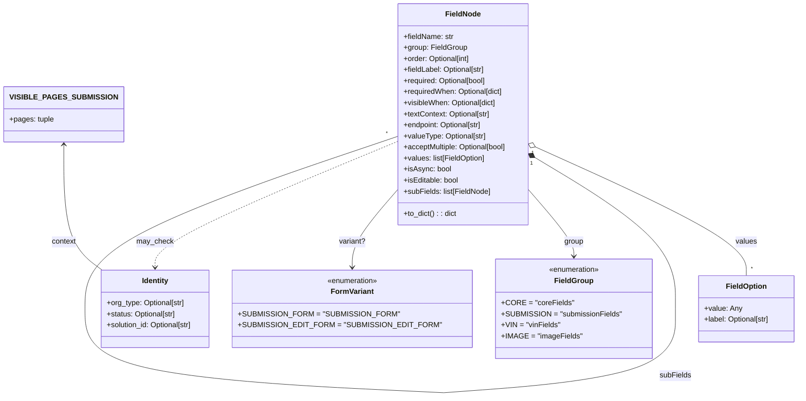

# Diagram: entity_core/entity_service/entity_service/damageview/fields/models/domain.py

> Auto-generated by Obscura crawlers

## Mermaid

```mermaid
classDiagram
    class FieldGroup <<enumeration>> {
        +CORE = "coreFields"
        +SUBMISSION = "submissionFields"
        +VIN = "vinFields"
        +IMAGE = "imageFields"
    }
    class FormVariant <<enumeration>> {
        +SUBMISSION_FORM = "SUBMISSION_FORM"
        +SUBMISSION_EDIT_FORM = "SUBMISSION_EDIT_FORM"
    }
    class Identity {
        +org_type: Optional[str]
        +status: Optional[str]
        +solution_id: Optional[str]
    }
    class FieldOption {
        +value: Any
        +label: Optional[str]
    }
    class FieldNode {
        +fieldName: str
        +group: FieldGroup
        +order: Optional[int]
        +fieldLabel: Optional[str]
        +required: Optional[bool]
        +requiredWhen: Optional[dict]
        +visibleWhen: Optional[dict]
        +textContext: Optional[str]
        +endpoint: Optional[str]
        +valueType: Optional[str]
        +acceptMultiple: Optional[bool]
        +values: list[FieldOption]
        +isAsync: bool
        +isEditable: bool
        +subFields: list[FieldNode]
        +to_dict(): dict
    }
    class VISIBLE_PAGES_SUBMISSION {
        +pages: tuple
    }

    FieldNode "1" o-- "*" FieldOption : values
    FieldNode "1" *-- "*" FieldNode : subFields
    FieldNode --> FieldGroup : group
    FieldNode --> FormVariant : variant? 
    VISIBLE_PAGES_SUBMISSION <-- Identity : context
    FieldNode ..> Identity : may_check
```

> SVG rendering failed for this diagram.
