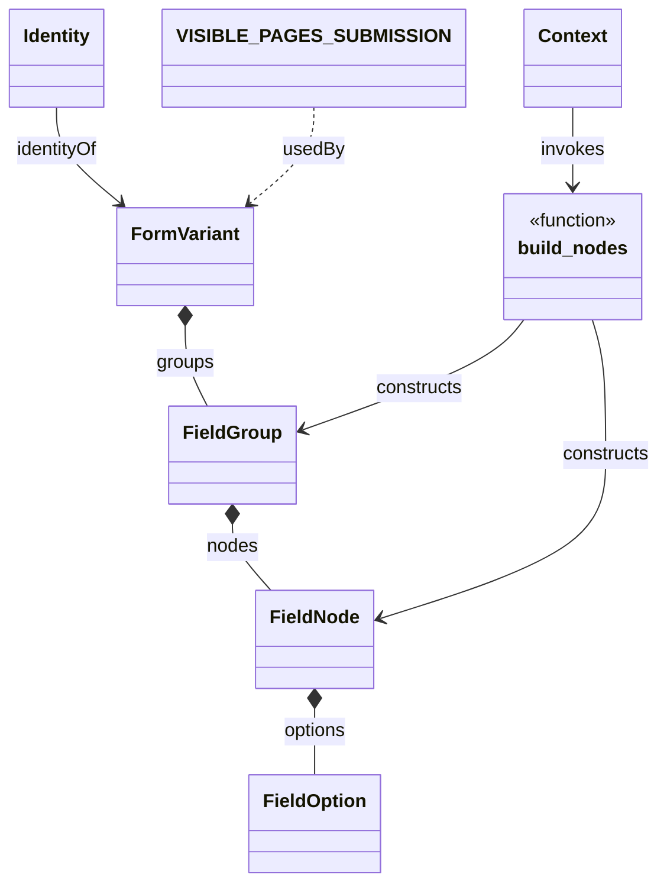

# Diagram: entity_core/entity_service/entity_service/damageview/fields/pipeline/__init__.py


> Auto-generated by Obscura crawlers

## Diagram 1



> SVG rendering failed for this diagram.

## Diagram 2

```mermaid
flowchart TD
    Context[Context] -->|calls| Build[build_nodes()]
    Build --> Nodes[Nodes]
    Nodes --> FieldGroup[FieldGroup]
    FieldGroup --> FieldNode[FieldNode]
    FieldNode --> FieldOption[FieldOption]
    Identity[Identity] -->|relates to| FormVariant[FormVariant]
    VISIBLE_PAGES_SUBMISSION[VISIBLE_PAGES_SUBMISSION] -.->|applies to| FormVariant
```

> SVG rendering failed for this diagram.
