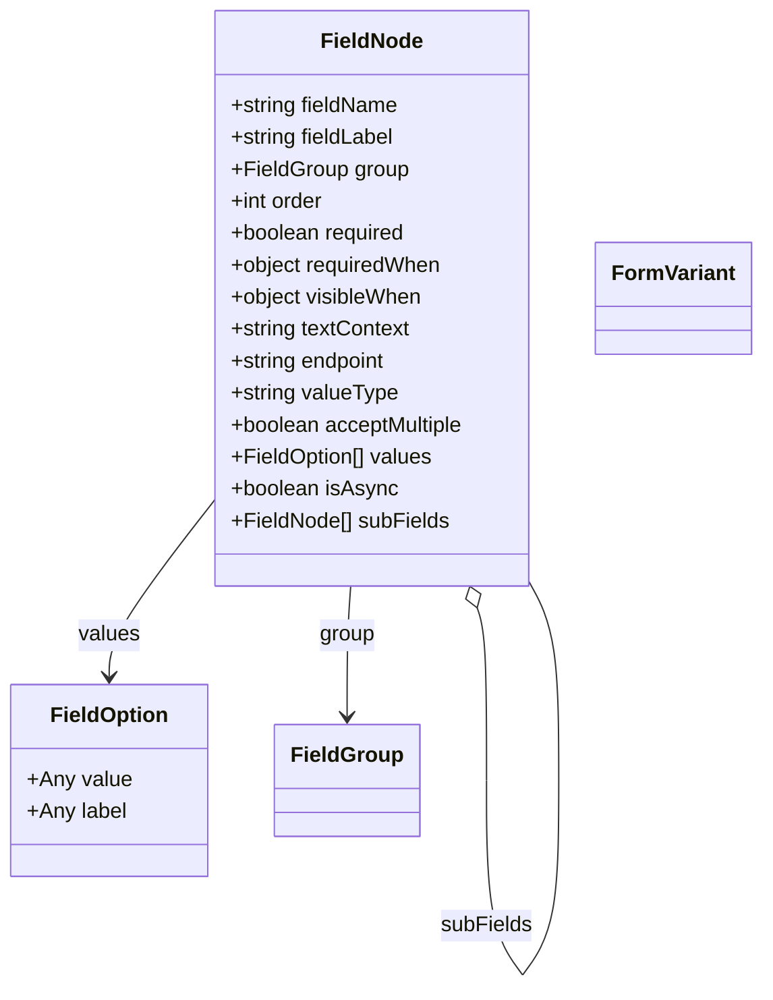

# Diagram: entity_core/entity_service/entity_service/damageview/fields/pipeline/normalizer.py


> Auto-generated by Obscura crawlers

## Diagram 1



### SVG

<svg id="container" width="559.5538940429688" xmlns="http://www.w3.org/2000/svg" class="classDiagram" height="740.1499633789062" viewBox="0 0 559.5538940429688 740.1499633789062" role="graphics-document document" aria-roledescription="class"><style>#container{font-family:"trebuchet ms",verdana,arial,sans-serif;font-size:16px;fill:#333;}@keyframes edge-animation-frame{from{stroke-dashoffset:0;}}@keyframes dash{to{stroke-dashoffset:0;}}#container .edge-animation-slow{stroke-dasharray:9,5!important;stroke-dashoffset:900;animation:dash 50s linear infinite;stroke-linecap:round;}#container .edge-animation-fast{stroke-dasharray:9,5!important;stroke-dashoffset:900;animation:dash 20s linear infinite;stroke-linecap:round;}#container .error-icon{fill:#552222;}#container .error-text{fill:#552222;stroke:#552222;}#container .edge-thickness-normal{stroke-width:1px;}#container .edge-thickness-thick{stroke-width:3.5px;}#container .edge-pattern-solid{stroke-dasharray:0;}#container .edge-thickness-invisible{stroke-width:0;fill:none;}#container .edge-pattern-dashed{stroke-dasharray:3;}#container .edge-pattern-dotted{stroke-dasharray:2;}#container .marker{fill:#333333;stroke:#333333;}#container .marker.cross{stroke:#333333;}#container svg{font-family:"trebuchet ms",verdana,arial,sans-serif;font-size:16px;}#container p{margin:0;}#container g.classGroup text{fill:#9370DB;stroke:none;font-family:"trebuchet ms",verdana,arial,sans-serif;font-size:10px;}#container g.classGroup text .title{font-weight:bolder;}#container .nodeLabel,#container .edgeLabel{color:#131300;}#container .edgeLabel .label rect{fill:#ECECFF;}#container .label text{fill:#131300;}#container .labelBkg{background:#ECECFF;}#container .edgeLabel .label span{background:#ECECFF;}#container .classTitle{font-weight:bolder;}#container .node rect,#container .node circle,#container .node ellipse,#container .node polygon,#container .node path{fill:#ECECFF;stroke:#9370DB;stroke-width:1px;}#container .divider{stroke:#9370DB;stroke-width:1;}#container g.clickable{cursor:pointer;}#container g.classGroup rect{fill:#ECECFF;stroke:#9370DB;}#container g.classGroup line{stroke:#9370DB;stroke-width:1;}#container .classLabel .box{stroke:none;stroke-width:0;fill:#ECECFF;opacity:0.5;}#container .classLabel .label{fill:#9370DB;font-size:10px;}#container .relation{stroke:#333333;stroke-width:1;fill:none;}#container .dashed-line{stroke-dasharray:3;}#container .dotted-line{stroke-dasharray:1 2;}#container #compositionStart,#container .composition{fill:#333333!important;stroke:#333333!important;stroke-width:1;}#container #compositionEnd,#container .composition{fill:#333333!important;stroke:#333333!important;stroke-width:1;}#container #dependencyStart,#container .dependency{fill:#333333!important;stroke:#333333!important;stroke-width:1;}#container #dependencyStart,#container .dependency{fill:#333333!important;stroke:#333333!important;stroke-width:1;}#container #extensionStart,#container .extension{fill:transparent!important;stroke:#333333!important;stroke-width:1;}#container #extensionEnd,#container .extension{fill:transparent!important;stroke:#333333!important;stroke-width:1;}#container #aggregationStart,#container .aggregation{fill:transparent!important;stroke:#333333!important;stroke-width:1;}#container #aggregationEnd,#container .aggregation{fill:transparent!important;stroke:#333333!important;stroke-width:1;}#container #lollipopStart,#container .lollipop{fill:#ECECFF!important;stroke:#333333!important;stroke-width:1;}#container #lollipopEnd,#container .lollipop{fill:#ECECFF!important;stroke:#333333!important;stroke-width:1;}#container .edgeTerminals{font-size:11px;line-height:initial;}#container .classTitleText{text-anchor:middle;font-size:18px;fill:#333;}#container .label-icon{display:inline-block;height:1em;overflow:visible;vertical-align:-0.125em;}#container .node .label-icon path{fill:currentColor;stroke:revert;stroke-width:revert;}#container :root{--mermaid-font-family:"trebuchet ms",verdana,arial,sans-serif;}</style><g><defs><marker id="container_class-aggregationStart" class="marker aggregation class" refX="18" refY="7" markerWidth="190" markerHeight="240" orient="auto"><path d="M 18,7 L9,13 L1,7 L9,1 Z"></path></marker></defs><defs><marker id="container_class-aggregationEnd" class="marker aggregation class" refX="1" refY="7" markerWidth="20" markerHeight="28" orient="auto"><path d="M 18,7 L9,13 L1,7 L9,1 Z"></path></marker></defs><defs><marker id="container_class-extensionStart" class="marker extension class" refX="18" refY="7" markerWidth="190" markerHeight="240" orient="auto"><path d="M 1,7 L18,13 V 1 Z"></path></marker></defs><defs><marker id="container_class-extensionEnd" class="marker extension class" refX="1" refY="7" markerWidth="20" markerHeight="28" orient="auto"><path d="M 1,1 V 13 L18,7 Z"></path></marker></defs><defs><marker id="container_class-compositionStart" class="marker composition class" refX="18" refY="7" markerWidth="190" markerHeight="240" orient="auto"><path d="M 18,7 L9,13 L1,7 L9,1 Z"></path></marker></defs><defs><marker id="container_class-compositionEnd" class="marker composition class" refX="1" refY="7" markerWidth="20" markerHeight="28" orient="auto"><path d="M 18,7 L9,13 L1,7 L9,1 Z"></path></marker></defs><defs><marker id="container_class-dependencyStart" class="marker dependency class" refX="6" refY="7" markerWidth="190" markerHeight="240" orient="auto"><path d="M 5,7 L9,13 L1,7 L9,1 Z"></path></marker></defs><defs><marker id="container_class-dependencyEnd" class="marker dependency class" refX="13" refY="7" markerWidth="20" markerHeight="28" orient="auto"><path d="M 18,7 L9,13 L14,7 L9,1 Z"></path></marker></defs><defs><marker id="container_class-lollipopStart" class="marker lollipop class" refX="13" refY="7" markerWidth="190" markerHeight="240" orient="auto"><circle stroke="black" fill="transparent" cx="7" cy="7" r="6"></circle></marker></defs><defs><marker id="container_class-lollipopEnd" class="marker lollipop class" refX="1" refY="7" markerWidth="190" markerHeight="240" orient="auto"><circle stroke="black" fill="transparent" cx="7" cy="7" r="6"></circle></marker></defs><g class="root"><g class="clusters"></g><g class="edgePaths"><path d="M255.593,440L255.209,446.167C254.825,452.333,254.057,464.667,253.673,481C253.289,497.333,253.289,517.667,253.289,527.833L253.289,538" id="id_FieldNode_FieldGroup_1" class="edge-thickness-normal edge-pattern-solid relation" style=";;;" data-edge="true" data-et="edge" data-id="id_FieldNode_FieldGroup_1" data-points="W3sieCI6MjU1LjU5MzQ1MDQ2OTQ3NjU1LCJ5Ijo0NDB9LHsieCI6MjUzLjI4OTA2MjUsInkiOjQ3N30seyJ4IjoyNTMuMjg5MDYyNSwieSI6NTQ0fV0=" marker-end="url(#container_class-dependencyEnd)"></path><path d="M149.413,383.962L137.816,399.469C126.22,414.975,103.026,445.987,91.429,466.66C79.832,487.333,79.832,497.667,79.832,502.833L79.832,508" id="id_FieldNode_FieldOption_2" class="edge-thickness-normal edge-pattern-solid relation" style=";;;" data-edge="true" data-et="edge" data-id="id_FieldNode_FieldOption_2" data-points="W3sieCI6MTQ5LjQxMzI4MTI1MDc0NTA2LCJ5IjozODMuOTYyMjIwMzY4MTY1NH0seyJ4Ijo3OS44MzIwMzEyNSwieSI6NDc3fSx7IngiOjc5LjgzMjAzMTI1LCJ5Ijo1MTR9XQ==" marker-end="url(#container_class-dependencyEnd)"></path><path d="M347.946,456.334L349.116,459.778C350.285,463.223,352.625,470.111,353.794,491.714C354.964,513.317,354.964,549.633,354.964,567.792L354.964,585.95" id="FieldNode-cyclic-special-1" class="edge-thickness-normal edge-pattern-solid relation" style=";;;" data-edge="true" data-et="edge" data-id="FieldNode-cyclic-special-1" data-points="W3sieCI6MzQyLjM5ODk4NDA2Njk1MDU2LCJ5Ijo0NDB9LHsieCI6MzU0Ljk2NDA2MjUwMDc0NTA2LCJ5Ijo0Nzd9LHsieCI6MzU0Ljk2NDA2MjUwMDc0NTA2LCJ5Ijo1ODUuOTQ5OTk5OTk5MjU0OX1d" marker-start="url(#container_class-aggregationStart)"></path><path d="M354.964,586.05L354.964,604.208C354.964,622.367,354.964,658.683,359.477,683.008C363.991,707.333,373.018,719.667,377.531,725.833L382.045,732" id="FieldNode-cyclic-special-mid" class="edge-thickness-normal edge-pattern-solid relation" style=";;;" data-edge="true" data-et="edge" data-id="FieldNode-cyclic-special-mid" data-points="W3sieCI6MzU0Ljk2NDA2MjUwMDc0NTA2LCJ5Ijo1ODYuMDUwMDAwMDAwNzQ1MX0seyJ4IjozNTQuOTY0MDYyNTAwNzQ1MDYsInkiOjY5NX0seyJ4IjozODIuMDQ0NjU0NjA1NDYzNiwieSI6NzMyfV0="></path><path d="M382.118,732L386.631,725.833C391.145,719.667,400.172,707.333,404.685,683C409.198,658.667,409.198,622.333,409.198,586C409.198,549.667,409.198,513.333,405.779,488.993C402.359,464.653,395.519,452.306,392.099,446.132L388.679,439.959" id="FieldNode-cyclic-special-2" class="edge-thickness-normal edge-pattern-solid relation" style=";;;" data-edge="true" data-et="edge" data-id="FieldNode-cyclic-special-2" data-points="W3sieCI6MzgyLjExNzg0NTM5NjAyNjUsInkiOjczMn0seyJ4Ijo0MDkuMTk4NDM3NTAwNzQ1MDYsInkiOjY5NX0seyJ4Ijo0MDkuMTk4NDM3NTAwNzQ1MDYsInkiOjU4Nn0seyJ4Ijo0MDkuMTk4NDM3NTAwNzQ1MDYsInkiOjQ3N30seyJ4IjozODguNjc4OTA2MjUwNzQ1MDYsInkiOjQzOS45NTg1ODMwMTUxMzQyfV0="></path></g><g class="edgeLabels"><g class="edgeLabel" transform="translate(253.2890625, 477)"><g class="label" data-id="id_FieldNode_FieldGroup_1" transform="translate(-21.09375, -12)"><foreignObject width="42.1875" height="24"><div xmlns="http://www.w3.org/1999/xhtml" class="labelBkg" style="display: table-cell; white-space: nowrap; line-height: 1.5; max-width: 200px; text-align: center;"><span class="edgeLabel"><p>group</p></span></div></foreignObject></g></g><g class="edgeLabel" transform="translate(79.83203125, 477)"><g class="label" data-id="id_FieldNode_FieldOption_2" transform="translate(-23.1796875, -12)"><foreignObject width="46.359375" height="24"><div xmlns="http://www.w3.org/1999/xhtml" class="labelBkg" style="display: table-cell; white-space: nowrap; line-height: 1.5; max-width: 200px; text-align: center;"><span class="edgeLabel"><p>values</p></span></div></foreignObject></g></g><g class="edgeLabel"><g class="label" data-id="FieldNode-cyclic-special-1" transform="translate(0, 0)"><foreignObject width="0" height="0"><div xmlns="http://www.w3.org/1999/xhtml" class="labelBkg" style="display: table-cell; white-space: nowrap; line-height: 1.5; max-width: 200px; text-align: center;"><span class="edgeLabel"></span></div></foreignObject></g></g><g class="edgeLabel" transform="translate(354.96406250074506, 695)"><g class="label" data-id="FieldNode-cyclic-special-mid" transform="translate(-34.234375, -12)"><foreignObject width="68.46875" height="24"><div xmlns="http://www.w3.org/1999/xhtml" class="labelBkg" style="display: table-cell; white-space: nowrap; line-height: 1.5; max-width: 200px; text-align: center;"><span class="edgeLabel"><p>subFields</p></span></div></foreignObject></g></g><g class="edgeLabel"><g class="label" data-id="FieldNode-cyclic-special-2" transform="translate(0, 0)"><foreignObject width="0" height="0"><div xmlns="http://www.w3.org/1999/xhtml" class="labelBkg" style="display: table-cell; white-space: nowrap; line-height: 1.5; max-width: 200px; text-align: center;"><span class="edgeLabel"></span></div></foreignObject></g></g></g><g class="nodes"><g class="node default" id="classId-FieldNode-0" transform="translate(269.04609375074506, 224)"><g class="basic label-container"><path d="M-119.6328125 -216 L119.6328125 -216 L119.6328125 216 L-119.6328125 216" stroke="none" stroke-width="0" fill="#ECECFF" style=""></path><path d="M-119.6328125 -216 C-42.062315736841214 -216, 35.50818102631757 -216, 119.6328125 -216 M-119.6328125 -216 C-31.190134082651227 -216, 57.252544334697546 -216, 119.6328125 -216 M119.6328125 -216 C119.6328125 -113.93711293899891, 119.6328125 -11.874225877997816, 119.6328125 216 M119.6328125 -216 C119.6328125 -118.40820425950001, 119.6328125 -20.81640851900002, 119.6328125 216 M119.6328125 216 C59.14256834579689 216, -1.3476758084062226 216, -119.6328125 216 M119.6328125 216 C63.37205035232264 216, 7.111288204645277 216, -119.6328125 216 M-119.6328125 216 C-119.6328125 61.74492941474648, -119.6328125 -92.51014117050704, -119.6328125 -216 M-119.6328125 216 C-119.6328125 87.93378884478588, -119.6328125 -40.13242231042824, -119.6328125 -216" stroke="#9370DB" stroke-width="1.3" fill="none" stroke-dasharray="0 0" style=""></path></g><g class="annotation-group text" transform="translate(0, -192)"></g><g class="label-group text" transform="translate(-36.671875, -192)"><g class="label" style="font-weight: bolder" transform="translate(0,-12)"><foreignObject width="73.34375" height="24"><div xmlns="http://www.w3.org/1999/xhtml" style="display: table-cell; white-space: nowrap; line-height: 1.5; max-width: 123px; text-align: center;"><span class="nodeLabel markdown-node-label" style=""><p>FieldNode</p></span></div></foreignObject></g></g><g class="members-group text" transform="translate(-107.6328125, -144)"><g class="label" style="" transform="translate(0,-12)"><foreignObject width="128.03125" height="24"><div xmlns="http://www.w3.org/1999/xhtml" style="display: table-cell; white-space: nowrap; line-height: 1.5; max-width: 185px; text-align: center;"><span class="nodeLabel markdown-node-label" style=""><p>+string fieldName</p></span></div></foreignObject></g><g class="label" style="" transform="translate(0,12)"><foreignObject width="125.390625" height="24"><div xmlns="http://www.w3.org/1999/xhtml" style="display: table-cell; white-space: nowrap; line-height: 1.5; max-width: 183px; text-align: center;"><span class="nodeLabel markdown-node-label" style=""><p>+string fieldLabel</p></span></div></foreignObject></g><g class="label" style="" transform="translate(0,36)"><foreignObject width="133.0625" height="24"><div xmlns="http://www.w3.org/1999/xhtml" style="display: table-cell; white-space: nowrap; line-height: 1.5; max-width: 190px; text-align: center;"><span class="nodeLabel markdown-node-label" style=""><p>+FieldGroup group</p></span></div></foreignObject></g><g class="label" style="" transform="translate(0,60)"><foreignObject width="71.40625" height="24"><div xmlns="http://www.w3.org/1999/xhtml" style="display: table-cell; white-space: nowrap; line-height: 1.5; max-width: 130px; text-align: center;"><span class="nodeLabel markdown-node-label" style=""><p>+int order</p></span></div></foreignObject></g><g class="label" style="" transform="translate(0,84)"><foreignObject width="133.46875" height="24"><div xmlns="http://www.w3.org/1999/xhtml" style="display: table-cell; white-space: nowrap; line-height: 1.5; max-width: 191px; text-align: center;"><span class="nodeLabel markdown-node-label" style=""><p>+boolean required</p></span></div></foreignObject></g><g class="label" style="" transform="translate(0,108)"><foreignObject width="160.1875" height="24"><div xmlns="http://www.w3.org/1999/xhtml" style="display: table-cell; white-space: nowrap; line-height: 1.5; max-width: 218px; text-align: center;"><span class="nodeLabel markdown-node-label" style=""><p>+object requiredWhen</p></span></div></foreignObject></g><g class="label" style="" transform="translate(0,132)"><foreignObject width="145.59375" height="24"><div xmlns="http://www.w3.org/1999/xhtml" style="display: table-cell; white-space: nowrap; line-height: 1.5; max-width: 203px; text-align: center;"><span class="nodeLabel markdown-node-label" style=""><p>+object visibleWhen</p></span></div></foreignObject></g><g class="label" style="" transform="translate(0,156)"><foreignObject width="136.515625" height="24"><div xmlns="http://www.w3.org/1999/xhtml" style="display: table-cell; white-space: nowrap; line-height: 1.5; max-width: 194px; text-align: center;"><span class="nodeLabel markdown-node-label" style=""><p>+string textContext</p></span></div></foreignObject></g><g class="label" style="" transform="translate(0,180)"><foreignObject width="120.046875" height="24"><div xmlns="http://www.w3.org/1999/xhtml" style="display: table-cell; white-space: nowrap; line-height: 1.5; max-width: 178px; text-align: center;"><span class="nodeLabel markdown-node-label" style=""><p>+string endpoint</p></span></div></foreignObject></g><g class="label" style="" transform="translate(0,204)"><foreignObject width="126.46875" height="24"><div xmlns="http://www.w3.org/1999/xhtml" style="display: table-cell; white-space: nowrap; line-height: 1.5; max-width: 184px; text-align: center;"><span class="nodeLabel markdown-node-label" style=""><p>+string valueType</p></span></div></foreignObject></g><g class="label" style="" transform="translate(0,228)"><foreignObject width="178.59375" height="24"><div xmlns="http://www.w3.org/1999/xhtml" style="display: table-cell; white-space: nowrap; line-height: 1.5; max-width: 236px; text-align: center;"><span class="nodeLabel markdown-node-label" style=""><p>+boolean acceptMultiple</p></span></div></foreignObject></g><g class="label" style="" transform="translate(0,252)"><foreignObject width="153.171875" height="24"><div xmlns="http://www.w3.org/1999/xhtml" style="display: table-cell; white-space: nowrap; line-height: 1.5; max-width: 211px; text-align: center;"><span class="nodeLabel markdown-node-label" style=""><p>+FieldOption[] values</p></span></div></foreignObject></g><g class="label" style="" transform="translate(0,276)"><foreignObject width="124.921875" height="24"><div xmlns="http://www.w3.org/1999/xhtml" style="display: table-cell; white-space: nowrap; line-height: 1.5; max-width: 183px; text-align: center;"><span class="nodeLabel markdown-node-label" style=""><p>+boolean isAsync</p></span></div></foreignObject></g><g class="label" style="" transform="translate(0,300)"><foreignObject width="164.265625" height="24"><div xmlns="http://www.w3.org/1999/xhtml" style="display: table-cell; white-space: nowrap; line-height: 1.5; max-width: 222px; text-align: center;"><span class="nodeLabel markdown-node-label" style=""><p>+FieldNode[] subFields</p></span></div></foreignObject></g></g><g class="methods-group text" transform="translate(-107.6328125, 216)"></g><g class="divider" style=""><path d="M-119.6328125 -168 C-64.10166472036411 -168, -8.570516940728211 -168, 119.6328125 -168 M-119.6328125 -168 C-66.63227371170247 -168, -13.631734923404935 -168, 119.6328125 -168" stroke="#9370DB" stroke-width="1.3" fill="none" stroke-dasharray="0 0" style=""></path></g><g class="divider" style=""><path d="M-119.6328125 192 C-48.65549779008094 192, 22.321816919838113 192, 119.6328125 192 M-119.6328125 192 C-66.67007255263931 192, -13.707332605278609 192, 119.6328125 192" stroke="#9370DB" stroke-width="1.3" fill="none" stroke-dasharray="0 0" style=""></path></g></g><g class="node default" id="classId-FieldOption-1" transform="translate(79.83203125, 586)"><g class="basic label-container"><path d="M-71.83203125 -72 L71.83203125 -72 L71.83203125 72 L-71.83203125 72" stroke="none" stroke-width="0" fill="#ECECFF" style=""></path><path d="M-71.83203125 -72 C-40.47516483990162 -72, -9.11829842980324 -72, 71.83203125 -72 M-71.83203125 -72 C-19.393716522204123 -72, 33.044598205591754 -72, 71.83203125 -72 M71.83203125 -72 C71.83203125 -17.466258556516365, 71.83203125 37.06748288696727, 71.83203125 72 M71.83203125 -72 C71.83203125 -35.86069925218066, 71.83203125 0.2786014956386822, 71.83203125 72 M71.83203125 72 C40.16423481552877 72, 8.496438381057544 72, -71.83203125 72 M71.83203125 72 C28.41876380569012 72, -14.994503638619761 72, -71.83203125 72 M-71.83203125 72 C-71.83203125 36.86138728403555, -71.83203125 1.7227745680711024, -71.83203125 -72 M-71.83203125 72 C-71.83203125 28.18617452145113, -71.83203125 -15.627650957097742, -71.83203125 -72" stroke="#9370DB" stroke-width="1.3" fill="none" stroke-dasharray="0 0" style=""></path></g><g class="annotation-group text" transform="translate(0, -48)"></g><g class="label-group text" transform="translate(-42.4140625, -48)"><g class="label" style="font-weight: bolder" transform="translate(0,-12)"><foreignObject width="84.828125" height="24"><div xmlns="http://www.w3.org/1999/xhtml" style="display: table-cell; white-space: nowrap; line-height: 1.5; max-width: 134px; text-align: center;"><span class="nodeLabel markdown-node-label" style=""><p>FieldOption</p></span></div></foreignObject></g></g><g class="members-group text" transform="translate(-59.83203125, 0)"><g class="label" style="" transform="translate(0,-12)"><foreignObject width="77.25" height="24"><div xmlns="http://www.w3.org/1999/xhtml" style="display: table-cell; white-space: nowrap; line-height: 1.5; max-width: 135px; text-align: center;"><span class="nodeLabel markdown-node-label" style=""><p>+Any value</p></span></div></foreignObject></g><g class="label" style="" transform="translate(0,12)"><foreignObject width="74.59375" height="24"><div xmlns="http://www.w3.org/1999/xhtml" style="display: table-cell; white-space: nowrap; line-height: 1.5; max-width: 132px; text-align: center;"><span class="nodeLabel markdown-node-label" style=""><p>+Any label</p></span></div></foreignObject></g></g><g class="methods-group text" transform="translate(-59.83203125, 72)"></g><g class="divider" style=""><path d="M-71.83203125 -24 C-33.42197862746329 -24, 4.988073995073421 -24, 71.83203125 -24 M-71.83203125 -24 C-17.114161440415913 -24, 37.603708369168174 -24, 71.83203125 -24" stroke="#9370DB" stroke-width="1.3" fill="none" stroke-dasharray="0 0" style=""></path></g><g class="divider" style=""><path d="M-71.83203125 48 C-23.18134959727113 48, 25.46933205545774 48, 71.83203125 48 M-71.83203125 48 C-34.45120579743459 48, 2.9296196551308213 48, 71.83203125 48" stroke="#9370DB" stroke-width="1.3" fill="none" stroke-dasharray="0 0" style=""></path></g></g><g class="node default" id="classId-FieldGroup-2" transform="translate(253.2890625, 586)"><g class="basic label-container"><path d="M-51.625 -42 L51.625 -42 L51.625 42 L-51.625 42" stroke="none" stroke-width="0" fill="#ECECFF" style=""></path><path d="M-51.625 -42 C-11.105700376453257 -42, 29.413599247093487 -42, 51.625 -42 M-51.625 -42 C-22.43532642644705 -42, 6.7543471471058965 -42, 51.625 -42 M51.625 -42 C51.625 -15.111933010601618, 51.625 11.776133978796764, 51.625 42 M51.625 -42 C51.625 -8.542250869565187, 51.625 24.915498260869626, 51.625 42 M51.625 42 C23.579319988335122 42, -4.466360023329756 42, -51.625 42 M51.625 42 C13.609318503490627 42, -24.406362993018746 42, -51.625 42 M-51.625 42 C-51.625 11.204825607318899, -51.625 -19.590348785362202, -51.625 -42 M-51.625 42 C-51.625 11.38145575422298, -51.625 -19.23708849155404, -51.625 -42" stroke="#9370DB" stroke-width="1.3" fill="none" stroke-dasharray="0 0" style=""></path></g><g class="annotation-group text" transform="translate(0, -18)"></g><g class="label-group text" transform="translate(-39.625, -18)"><g class="label" style="font-weight: bolder" transform="translate(0,-12)"><foreignObject width="79.25" height="24"><div xmlns="http://www.w3.org/1999/xhtml" style="display: table-cell; white-space: nowrap; line-height: 1.5; max-width: 129px; text-align: center;"><span class="nodeLabel markdown-node-label" style=""><p>FieldGroup</p></span></div></foreignObject></g></g><g class="members-group text" transform="translate(-39.625, 30)"></g><g class="methods-group text" transform="translate(-39.625, 60)"></g><g class="divider" style=""><path d="M-51.625 6 C-17.975182995084175 6, 15.67463400983165 6, 51.625 6 M-51.625 6 C-27.266242859246162 6, -2.9074857184923246 6, 51.625 6" stroke="#9370DB" stroke-width="1.3" fill="none" stroke-dasharray="0 0" style=""></path></g><g class="divider" style=""><path d="M-51.625 24 C-27.65572838810845 24, -3.6864567762169003 24, 51.625 24 M-51.625 24 C-30.39380780892507 24, -9.162615617850143 24, 51.625 24" stroke="#9370DB" stroke-width="1.3" fill="none" stroke-dasharray="0 0" style=""></path></g></g><g class="node default" id="classId-FormVariant-3" transform="translate(495.11640625074506, 224)"><g class="basic label-container"><path d="M-56.4375 -42 L56.4375 -42 L56.4375 42 L-56.4375 42" stroke="none" stroke-width="0" fill="#ECECFF" style=""></path><path d="M-56.4375 -42 C-13.56105180295058 -42, 29.31539639409884 -42, 56.4375 -42 M-56.4375 -42 C-14.553989118774119 -42, 27.329521762451762 -42, 56.4375 -42 M56.4375 -42 C56.4375 -22.934174159307815, 56.4375 -3.868348318615631, 56.4375 42 M56.4375 -42 C56.4375 -15.024262776363798, 56.4375 11.951474447272403, 56.4375 42 M56.4375 42 C19.452800248762834 42, -17.53189950247433 42, -56.4375 42 M56.4375 42 C32.563999426018924 42, 8.690498852037855 42, -56.4375 42 M-56.4375 42 C-56.4375 19.932892873577835, -56.4375 -2.1342142528443304, -56.4375 -42 M-56.4375 42 C-56.4375 15.279927545233647, -56.4375 -11.440144909532705, -56.4375 -42" stroke="#9370DB" stroke-width="1.3" fill="none" stroke-dasharray="0 0" style=""></path></g><g class="annotation-group text" transform="translate(0, -18)"></g><g class="label-group text" transform="translate(-44.4375, -18)"><g class="label" style="font-weight: bolder" transform="translate(0,-12)"><foreignObject width="88.875" height="24"><div xmlns="http://www.w3.org/1999/xhtml" style="display: table-cell; white-space: nowrap; line-height: 1.5; max-width: 138px; text-align: center;"><span class="nodeLabel markdown-node-label" style=""><p>FormVariant</p></span></div></foreignObject></g></g><g class="members-group text" transform="translate(-44.4375, 30)"></g><g class="methods-group text" transform="translate(-44.4375, 60)"></g><g class="divider" style=""><path d="M-56.4375 6 C-16.649033232670327 6, 23.139433534659346 6, 56.4375 6 M-56.4375 6 C-23.10594124996023 6, 10.225617500079537 6, 56.4375 6" stroke="#9370DB" stroke-width="1.3" fill="none" stroke-dasharray="0 0" style=""></path></g><g class="divider" style=""><path d="M-56.4375 24 C-24.758444783287384 24, 6.920610433425232 24, 56.4375 24 M-56.4375 24 C-26.158103895652935 24, 4.121292208694129 24, 56.4375 24" stroke="#9370DB" stroke-width="1.3" fill="none" stroke-dasharray="0 0" style=""></path></g></g><g class="label edgeLabel" id="FieldNode---FieldNode---1" transform="translate(354.96406250074506, 586)"><rect width="0.1" height="0.1"></rect><g class="label" style="" transform="translate(0, 0)"><rect></rect><foreignObject width="0" height="0"><div xmlns="http://www.w3.org/1999/xhtml" style="display: table-cell; white-space: nowrap; line-height: 1.5; max-width: 10px; text-align: center;"><span class="nodeLabel"></span></div></foreignObject></g></g><g class="label edgeLabel" id="FieldNode---FieldNode---2" transform="translate(382.08125000074506, 732.0500000007451)"><rect width="0.1" height="0.1"></rect><g class="label" style="" transform="translate(0, 0)"><rect></rect><foreignObject width="0" height="0"><div xmlns="http://www.w3.org/1999/xhtml" style="display: table-cell; white-space: nowrap; line-height: 1.5; max-width: 10px; text-align: center;"><span class="nodeLabel"></span></div></foreignObject></g></g></g></g></g></svg>

## Diagram 2

```mermaid
flowchart TD
    options[options(values, labels)] -->|returns list of FieldOption| build_node[build_node(data, group, default_order, values)]
    coerce[coerce_json(raw)] --> clean_up[clean_up(...)] --> clean_visible_when[clean_visible_when(raw)]
    clean_visible_when -->|visibleWhen| build_node
    coerce -->|requiredWhen| build_node
    build_node --> FieldNodeInstance[FieldNode instance]
    normalize_submission[normalize_submission_rows(rows)] -->|uses row.field| options
    normalize_submission -->|calls| build_node
    normalize_vin[normalize_vin_rows(rows)] -->|builds parent| build_node
    normalize_vin -->|calls for sub_fields| options
    normalize_vin -->|attaches subFields (FieldNode[])| FieldNodeInstance
    normalize_image[normalize_image_rows(rows)] -->|constructs FieldNode directly| FieldNodeInstance
```

> SVG rendering failed for this diagram.
