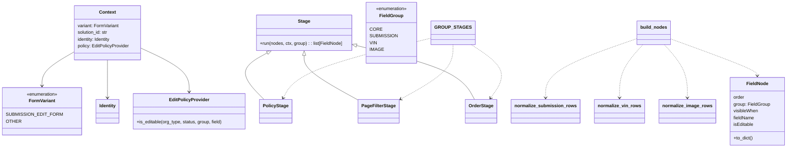

# Diagram: entity_core/entity_service/entity_service/damageview/fields/pipeline/pipeline.py


> Auto-generated by Obscura crawlers

## Diagram 1



> SVG rendering failed for this diagram.

## Diagram 2

```mermaid
flowchart TD
subgraph Inputs
SUB_ROWS[submission_rows]
VIN_ROWS[vin_rows]
IMG_ROWS[image_rows]
end
SUB_ROWS --> NORM_SUB[normalize_submission_rows()]
VIN_ROWS --> NORM_VIN[normalize_vin_rows()]
IMG_ROWS --> NORM_IMG[normalize_image_rows()]
NORM_SUB --> CORE_OR_SUB[core_or_sub (list)]
NORM_VIN --> VIN_LIST[vin (list)]
NORM_IMG --> IMG_LIST[image (list)]
CORE_OR_SUB --> SPLIT[split into core & submission]
SPLIT --> CORE[core]
SPLIT --> SUBMISSION[submission]
CORE --> C_PS[PolicyStage]
C_PS --> C_PF[PageFilterStage]
C_PF --> C_ORD[OrderStage]
C_ORD --> CORE_OUT[core processed]
SUBMISSION --> S_PS[PolicyStage]
S_PS --> S_PF[PageFilterStage]
S_PF --> S_ORD[OrderStage]
S_ORD --> SUB_OUT[submission processed]
VIN_LIST --> V_PS[PolicyStage]
V_PS --> V_ORD[OrderStage]
V_ORD --> VIN_OUT[vin processed]
IMG_LIST --> I_PS[PolicyStage]
I_PS --> I_ORD[OrderStage]
I_ORD --> IMG_OUT[image processed]
CORE_OUT --> AGG[aggregate results]
SUB_OUT --> AGG
VIN_OUT --> AGG
IMG_OUT --> AGG
AGG --> OUT{build_nodes result}
OUT --> R_CORE[CORE: list(dict)]
OUT --> R_SUB[SUBMISSION: list(dict)]
OUT --> R_VIN[VIN: list(dict)]
OUT --> R_IMG[IMAGE: list(dict)]
```

> SVG rendering failed for this diagram.
