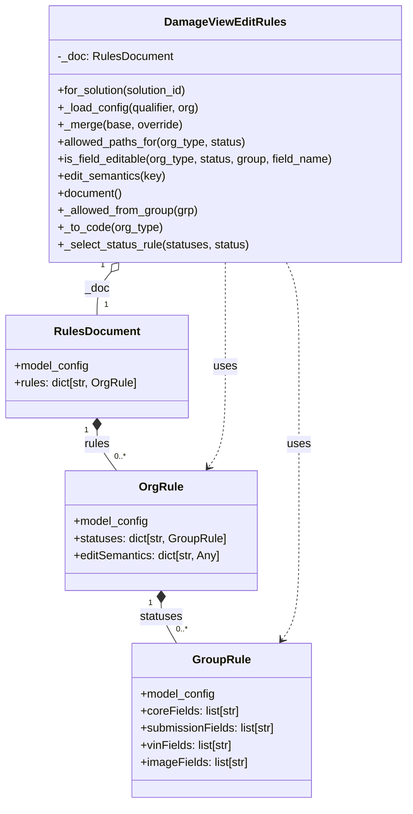
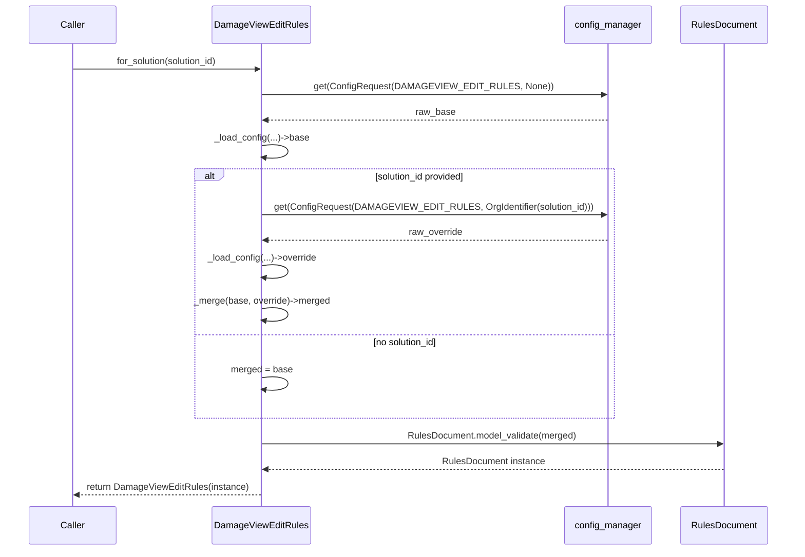

# Diagram: entity_core/entity_service/entity_service/damageview/fields/rules/edit_rules.py

> Auto-generated by Obscura crawlers

## Diagram 1

### SVG

<svg id="container" width="571.64453125" xmlns="http://www.w3.org/2000/svg" class="classDiagram" height="1126" viewBox="0 0 571.64453125 1126" role="graphics-document document" aria-roledescription="class"><g><defs><marker id="container_class-aggregationStart" class="marker aggregation class" refX="18" refY="7" markerWidth="190" markerHeight="240" orient="auto"><path d="M 18,7 L9,13 L1,7 L9,1 Z"></path></marker></defs><defs><marker id="container_class-aggregationEnd" class="marker aggregation class" refX="1" refY="7" markerWidth="20" markerHeight="28" orient="auto"><path d="M 18,7 L9,13 L1,7 L9,1 Z"></path></marker></defs><defs><marker id="container_class-extensionStart" class="marker extension class" refX="18" refY="7" markerWidth="190" markerHeight="240" orient="auto"><path d="M 1,7 L18,13 V 1 Z"></path></marker></defs><defs><marker id="container_class-extensionEnd" class="marker extension class" refX="1" refY="7" markerWidth="20" markerHeight="28" orient="auto"><path d="M 1,1 V 13 L18,7 Z"></path></marker></defs><defs><marker id="container_class-compositionStart" class="marker composition class" refX="18" refY="7" markerWidth="190" markerHeight="240" orient="auto"><path d="M 18,7 L9,13 L1,7 L9,1 Z"></path></marker></defs><defs><marker id="container_class-compositionEnd" class="marker composition class" refX="1" refY="7" markerWidth="20" markerHeight="28" orient="auto"><path d="M 18,7 L9,13 L1,7 L9,1 Z"></path></marker></defs><defs><marker id="container_class-dependencyStart" class="marker dependency class" refX="6" refY="7" markerWidth="190" markerHeight="240" orient="auto"><path d="M 5,7 L9,13 L1,7 L9,1 Z"></path></marker></defs><defs><marker id="container_class-dependencyEnd" class="marker dependency class" refX="13" refY="7" markerWidth="20" markerHeight="28" orient="auto"><path d="M 18,7 L9,13 L14,7 L9,1 Z"></path></marker></defs><defs><marker id="container_class-lollipopStart" class="marker lollipop class" refX="13" refY="7" markerWidth="190" markerHeight="240" orient="auto"><circle stroke="black" fill="transparent" cx="7" cy="7" r="6"></circle></marker></defs><defs><marker id="container_class-lollipopEnd" class="marker lollipop class" refX="1" refY="7" markerWidth="190" markerHeight="240" orient="auto"><circle stroke="black" fill="transparent" cx="7" cy="7" r="6"></circle></marker></defs><g class="root"><g class="clusters"></g><g class="edgePaths"><path d="M135.633,603.25L135.633,606.542C135.633,609.833,135.633,616.417,140.197,625.875C144.762,635.333,153.891,647.667,158.455,653.833L163.02,660" id="id_RulesDocument_OrgRule_1" class="edge-thickness-normal edge-pattern-solid relation" style=";;;" data-edge="true" data-et="edge" data-id="id_RulesDocument_OrgRule_1" data-points="W3sieCI6MTM1LjYzMjgxMjUsInkiOjU4Nn0seyJ4IjoxMzUuNjMyODEyNSwieSI6NjIzfSx7IngiOjE2My4wMTk2OTI2NjUyODkyNiwieSI6NjYwfV0=" marker-start="url(#container_class-compositionStart)"></path><path d="M225.195,845.25L225.195,848.542C225.195,851.833,225.195,858.417,228.813,867.875C232.431,877.333,239.667,889.667,243.285,895.833L246.903,902" id="id_OrgRule_GroupRule_2" class="edge-thickness-normal edge-pattern-solid relation" style=";;;" data-edge="true" data-et="edge" data-id="id_OrgRule_GroupRule_2" data-points="W3sieCI6MjI1LjE5NTMxMjUsInkiOjgyOH0seyJ4IjoyMjUuMTk1MzEyNSwieSI6ODY1fSx7IngiOjI0Ni45MDI5MDk0ODI3NTg2MiwieSI6OTAyfV0=" marker-start="url(#container_class-compositionStart)"></path><path d="M155.194,381.303L151.933,385.253C148.673,389.202,142.153,397.101,138.893,407.217C135.633,417.333,135.633,429.667,135.633,435.833L135.633,442" id="id_DamageViewEditRules_RulesDocument_3" class="edge-thickness-normal edge-pattern-solid relation" style=";;;" data-edge="true" data-et="edge" data-id="id_DamageViewEditRules_RulesDocument_3" data-points="W3sieCI6MTY2LjE3NDg2MzE5MTI0NDI0LCJ5IjozNjh9LHsieCI6MTM1LjYzMjgxMjUsInkiOjQwNX0seyJ4IjoxMzUuNjMyODEyNSwieSI6NDQyfV0=" marker-start="url(#container_class-aggregationStart)"></path><path d="M400.458,368L403.394,374.167C406.33,380.333,412.202,392.667,415.138,417C418.074,441.333,418.074,477.667,418.074,514C418.074,550.333,418.074,586.667,418.074,625C418.074,663.333,418.074,703.667,418.074,744C418.074,784.333,418.074,824.667,414.086,850.198C410.098,875.728,402.121,886.457,398.133,891.821L394.144,897.185" id="id_DamageViewEditRules_GroupRule_4" class="edge-thickness-normal edge-pattern-dashed relation" style=";;;" data-edge="true" data-et="edge" data-id="id_DamageViewEditRules_GroupRule_4" data-points="W3sieCI6NDAwLjQ1ODA1NzMxNTY2ODIsInkiOjM2OH0seyJ4Ijo0MTguMDc0MjE4NzUsInkiOjQwNX0seyJ4Ijo0MTguMDc0MjE4NzUsInkiOjUxNH0seyJ4Ijo0MTguMDc0MjE4NzUsInkiOjYyM30seyJ4Ijo0MTguMDc0MjE4NzUsInkiOjc0NH0seyJ4Ijo0MTguMDc0MjE4NzUsInkiOjg2NX0seyJ4IjozOTAuNTY0NDM5NjU1MTcyNCwieSI6OTAyfV0=" marker-end="url(#container_class-dependencyEnd)"></path><path d="M314.758,368L314.758,374.167C314.758,380.333,314.758,392.667,314.758,417C314.758,441.333,314.758,477.667,314.758,514C314.758,550.333,314.758,586.667,310.788,610.196C306.819,633.726,298.88,644.452,294.91,649.814L290.941,655.177" id="id_DamageViewEditRules_OrgRule_5" class="edge-thickness-normal edge-pattern-dashed relation" style=";;;" data-edge="true" data-et="edge" data-id="id_DamageViewEditRules_OrgRule_5" data-points="W3sieCI6MzE0Ljc1NzgxMjUsInkiOjM2OH0seyJ4IjozMTQuNzU3ODEyNSwieSI6NDA1fSx7IngiOjMxNC43NTc4MTI1LCJ5Ijo1MTR9LHsieCI6MzE0Ljc1NzgxMjUsInkiOjYyM30seyJ4IjoyODcuMzcwOTMyMzM0NzEwNzQsInkiOjY2MH1d" marker-end="url(#container_class-dependencyEnd)"></path></g><g class="edgeLabels"><g class="edgeLabel" transform="translate(135.6328125, 623)"><g class="label" data-id="id_RulesDocument_OrgRule_1" transform="translate(-18.1484375, -12)"><foreignObject width="36.296875" height="24">

rules

</foreignObject></g></g><g class="edgeLabel" transform="translate(225.1953125, 865)"><g class="label" data-id="id_OrgRule_GroupRule_2" transform="translate(-30.296875, -12)"><foreignObject width="60.59375" height="24">

statuses

</foreignObject></g></g><g class="edgeLabel" transform="translate(135.6328125, 405)"><g class="label" data-id="id_DamageViewEditRules_RulesDocument_3" transform="translate(-17.28125, -12)"><foreignObject width="34.5625" height="24">

_doc

</foreignObject></g></g><g class="edgeLabel" transform="translate(418.07421875, 623)"><g class="label" data-id="id_DamageViewEditRules_GroupRule_4" transform="translate(-16.4921875, -12)"><foreignObject width="32.984375" height="24">

uses

</foreignObject></g></g><g class="edgeLabel" transform="translate(314.7578125, 514)"><g class="label" data-id="id_DamageViewEditRules_OrgRule_5" transform="translate(-16.4921875, -12)"><foreignObject width="32.984375" height="24">

uses

</foreignObject></g></g><g class="edgeTerminals" transform="translate(120.63281125000005, 603.4999989285715)"><g class="inner" transform="translate(0, 0)"><foreignObject style="width: 9px; height: 12px;">
1
</foreignObject></g></g><g class="edgeTerminals" transform="translate(210.19531125000003, 845.4999989285715)"><g class="inner" transform="translate(0, 0)"><foreignObject style="width: 9px; height: 12px;">
1
</foreignObject></g></g><g class="edgeTerminals" transform="translate(143.46647918934048, 371.9470647187779)"><g class="inner" transform="translate(0, 0)"><foreignObject style="width: 9px; height: 12px;">
1
</foreignObject></g></g><g class="edgeTerminals" transform="translate(159.66480750836448, 632.0099260302061)"><g class="inner" transform="translate(0, 0)"></g><foreignObject style="width: 36px; height: 12px;">
0..*
</foreignObject></g><g class="edgeTerminals" transform="translate(245.9851006657162, 874.3155176603624)"><g class="inner" transform="translate(0, 0)"></g><foreignObject style="width: 36px; height: 12px;">
0..*
</foreignObject></g><g class="edgeTerminals" transform="translate(145.63281124999997, 419.4999989285714)"><g class="inner" transform="translate(0, 0)"></g><foreignObject style="width: 9px; height: 12px;">
1
</foreignObject></g></g><g class="nodes"><g class="node default" id="classId-GroupRule-0" transform="translate(310.265625, 1010)"><g class="basic label-container"><path d="M-127.6875 -108 L127.6875 -108 L127.6875 108 L-127.6875 108" stroke="none" stroke-width="0" fill="#ECECFF" style=""></path><path d="M-127.6875 -108 C-63.0185228438051 -108, 1.6504543123897975 -108, 127.6875 -108 M-127.6875 -108 C-30.27960250757188 -108, 67.12829498485624 -108, 127.6875 -108 M127.6875 -108 C127.6875 -25.990232133284792, 127.6875 56.019535733430416, 127.6875 108 M127.6875 -108 C127.6875 -42.34818554144641, 127.6875 23.303628917107176, 127.6875 108 M127.6875 108 C70.4954130620682 108, 13.303326124136404 108, -127.6875 108 M127.6875 108 C52.20145134763085 108, -23.2845973047383 108, -127.6875 108 M-127.6875 108 C-127.6875 61.23436454591291, -127.6875 14.468729091825821, -127.6875 -108 M-127.6875 108 C-127.6875 57.0386217395096, -127.6875 6.077243479019202, -127.6875 -108" stroke="#9370DB" stroke-width="1.3" fill="none" stroke-dasharray="0 0" style=""></path></g><g class="annotation-group text" transform="translate(0, -84)"></g><g class="label-group text" transform="translate(-38.421875, -84)"><g class="label" style="font-weight: bolder" transform="translate(0,-12)"><foreignObject width="76.84375" height="24">

GroupRule

</foreignObject></g></g><g class="members-group text" transform="translate(-115.6875, -36)"><g class="label" style="" transform="translate(0,-12)"><foreignObject width="105.59375" height="24">

+model_config

</foreignObject></g><g class="label" style="" transform="translate(0,12)"><foreignObject width="141.515625" height="24">

+coreFields: list[str]

</foreignObject></g><g class="label" style="" transform="translate(0,36)"><foreignObject width="192.953125" height="24">

+submissionFields: list[str]

</foreignObject></g><g class="label" style="" transform="translate(0,60)"><foreignObject width="132.03125" height="24">

+vinFields: list[str]

</foreignObject></g><g class="label" style="" transform="translate(0,84)"><foreignObject width="153.96875" height="24">

+imageFields: list[str]

</foreignObject></g></g><g class="methods-group text" transform="translate(-115.6875, 108)"></g><g class="divider" style=""><path d="M-127.6875 -60 C-54.87865083334253 -60, 17.930198333314934 -60, 127.6875 -60 M-127.6875 -60 C-73.42895306432337 -60, -19.170406128646718 -60, 127.6875 -60" stroke="#9370DB" stroke-width="1.3" fill="none" stroke-dasharray="0 0" style=""></path></g><g class="divider" style=""><path d="M-127.6875 84 C-67.28571070559411 84, -6.883921411188211 84, 127.6875 84 M-127.6875 84 C-50.027430068772006 84, 27.63263986245599 84, 127.6875 84" stroke="#9370DB" stroke-width="1.3" fill="none" stroke-dasharray="0 0" style=""></path></g></g><g class="node default" id="classId-OrgRule-1" transform="translate(225.1953125, 744)"><g class="basic label-container"><path d="M-135.140625 -84 L135.140625 -84 L135.140625 84 L-135.140625 84" stroke="none" stroke-width="0" fill="#ECECFF" style=""></path><path d="M-135.140625 -84 C-70.12258669047444 -84, -5.10454838094887 -84, 135.140625 -84 M-135.140625 -84 C-71.2694970024304 -84, -7.398369004860783 -84, 135.140625 -84 M135.140625 -84 C135.140625 -40.683554658647544, 135.140625 2.632890682704911, 135.140625 84 M135.140625 -84 C135.140625 -18.793592534179695, 135.140625 46.41281493164061, 135.140625 84 M135.140625 84 C57.69420784375106 84, -19.752209312497882 84, -135.140625 84 M135.140625 84 C31.219462085818236 84, -72.70170082836353 84, -135.140625 84 M-135.140625 84 C-135.140625 39.59723119700747, -135.140625 -4.805537605985066, -135.140625 -84 M-135.140625 84 C-135.140625 18.28547911156531, -135.140625 -47.42904177686938, -135.140625 -84" stroke="#9370DB" stroke-width="1.3" fill="none" stroke-dasharray="0 0" style=""></path></g><g class="annotation-group text" transform="translate(0, -60)"></g><g class="label-group text" transform="translate(-29.3125, -60)"><g class="label" style="font-weight: bolder" transform="translate(0,-12)"><foreignObject width="58.625" height="24">

OrgRule

</foreignObject></g></g><g class="members-group text" transform="translate(-123.140625, -12)"><g class="label" style="" transform="translate(0,-12)"><foreignObject width="105.59375" height="24">

+model_config

</foreignObject></g><g class="label" style="" transform="translate(0,12)"><foreignObject width="216.96875" height="24">

+statuses: dict[str, GroupRule]

</foreignObject></g><g class="label" style="" transform="translate(0,36)"><foreignObject width="209.625" height="24">

+editSemantics: dict[str, Any]

</foreignObject></g></g><g class="methods-group text" transform="translate(-123.140625, 84)"></g><g class="divider" style=""><path d="M-135.140625 -36 C-54.75977874756154 -36, 25.62106750487692 -36, 135.140625 -36 M-135.140625 -36 C-48.156032752449974 -36, 38.82855949510005 -36, 135.140625 -36" stroke="#9370DB" stroke-width="1.3" fill="none" stroke-dasharray="0 0" style=""></path></g><g class="divider" style=""><path d="M-135.140625 60 C-53.08792692700257 60, 28.96477114599486 60, 135.140625 60 M-135.140625 60 C-30.959198420477264 60, 73.22222815904547 60, 135.140625 60" stroke="#9370DB" stroke-width="1.3" fill="none" stroke-dasharray="0 0" style=""></path></g></g><g class="node default" id="classId-RulesDocument-2" transform="translate(135.6328125, 514)"><g class="basic label-container"><path d="M-127.6328125 -72 L127.6328125 -72 L127.6328125 72 L-127.6328125 72" stroke="none" stroke-width="0" fill="#ECECFF" style=""></path><path d="M-127.6328125 -72 C-68.76440822238825 -72, -9.89600394477651 -72, 127.6328125 -72 M-127.6328125 -72 C-76.24710572163559 -72, -24.861398943271183 -72, 127.6328125 -72 M127.6328125 -72 C127.6328125 -38.902794228479856, 127.6328125 -5.805588456959711, 127.6328125 72 M127.6328125 -72 C127.6328125 -19.011868246418423, 127.6328125 33.976263507163154, 127.6328125 72 M127.6328125 72 C56.434503061808556 72, -14.763806376382888 72, -127.6328125 72 M127.6328125 72 C37.695565570272635 72, -52.24168135945473 72, -127.6328125 72 M-127.6328125 72 C-127.6328125 30.748147156019535, -127.6328125 -10.503705687960931, -127.6328125 -72 M-127.6328125 72 C-127.6328125 33.84083500232101, -127.6328125 -4.318329995357985, -127.6328125 -72" stroke="#9370DB" stroke-width="1.3" fill="none" stroke-dasharray="0 0" style=""></path></g><g class="annotation-group text" transform="translate(0, -48)"></g><g class="label-group text" transform="translate(-57.21875, -48)"><g class="label" style="font-weight: bolder" transform="translate(0,-12)"><foreignObject width="114.4375" height="24">

RulesDocument

</foreignObject></g></g><g class="members-group text" transform="translate(-115.6328125, 0)"><g class="label" style="" transform="translate(0,-12)"><foreignObject width="105.59375" height="24">

+model_config

</foreignObject></g><g class="label" style="" transform="translate(0,12)"><foreignObject width="174.046875" height="24">

+rules: dict[str, OrgRule]

</foreignObject></g></g><g class="methods-group text" transform="translate(-115.6328125, 72)"></g><g class="divider" style=""><path d="M-127.6328125 -24 C-48.08886576904655 -24, 31.4550809619069 -24, 127.6328125 -24 M-127.6328125 -24 C-65.27047962444641 -24, -2.9081467488928325 -24, 127.6328125 -24" stroke="#9370DB" stroke-width="1.3" fill="none" stroke-dasharray="0 0" style=""></path></g><g class="divider" style=""><path d="M-127.6328125 48 C-74.6430630376006 48, -21.65331357520118 48, 127.6328125 48 M-127.6328125 48 C-41.29820435409556 48, 45.03640379180888 48, 127.6328125 48" stroke="#9370DB" stroke-width="1.3" fill="none" stroke-dasharray="0 0" style=""></path></g></g><g class="node default" id="classId-DamageViewEditRules-3" transform="translate(314.7578125, 188)"><g class="basic label-container"><path d="M-248.88671875 -180 L248.88671875 -180 L248.88671875 180 L-248.88671875 180" stroke="none" stroke-width="0" fill="#ECECFF" style=""></path><path d="M-248.88671875 -180 C-121.53281581144515 -180, 5.821087127109706 -180, 248.88671875 -180 M-248.88671875 -180 C-87.0512999339542 -180, 74.7841188820916 -180, 248.88671875 -180 M248.88671875 -180 C248.88671875 -98.2532744668437, 248.88671875 -16.506548933687412, 248.88671875 180 M248.88671875 -180 C248.88671875 -88.22270773946983, 248.88671875 3.554584521060349, 248.88671875 180 M248.88671875 180 C94.98022382118455 180, -58.926271107630896 180, -248.88671875 180 M248.88671875 180 C79.16733597973283 180, -90.55204679053435 180, -248.88671875 180 M-248.88671875 180 C-248.88671875 43.446384679931725, -248.88671875 -93.10723064013655, -248.88671875 -180 M-248.88671875 180 C-248.88671875 52.85769539029138, -248.88671875 -74.28460921941723, -248.88671875 -180" stroke="#9370DB" stroke-width="1.3" fill="none" stroke-dasharray="0 0" style=""></path></g><g class="annotation-group text" transform="translate(0, -156)"></g><g class="label-group text" transform="translate(-80.7734375, -156)"><g class="label" style="font-weight: bolder" transform="translate(0,-12)"><foreignObject width="161.546875" height="24">

DamageViewEditRules

</foreignObject></g></g><g class="members-group text" transform="translate(-236.88671875, -108)"><g class="label" style="" transform="translate(0,-12)"><foreignObject width="161.703125" height="24">

-_doc: RulesDocument

</foreignObject></g></g><g class="methods-group text" transform="translate(-236.88671875, -60)"><g class="label" style="" transform="translate(0,-12)"><foreignObject width="187.921875" height="24">

+for_solution(solution_id)

</foreignObject></g><g class="label" style="" transform="translate(0,12)"><foreignObject width="200" height="24">

+_load_config(qualifier, org)

</foreignObject></g><g class="label" style="" transform="translate(0,36)"><foreignObject width="173.515625" height="24">

+_merge(base, override)

</foreignObject></g><g class="label" style="" transform="translate(0,60)"><foreignObject width="268.234375" height="24">

+allowed_paths_for(org_type, status)

</foreignObject></g><g class="label" style="" transform="translate(0,84)"><foreignObject width="393" height="24">

+is_field_editable(org_type, status, group, field_name)

</foreignObject></g><g class="label" style="" transform="translate(0,108)"><foreignObject width="153.21875" height="24">

+edit_semantics(key)

</foreignObject></g><g class="label" style="" transform="translate(0,132)"><foreignObject width="91.65625" height="24">

+document()

</foreignObject></g><g class="label" style="" transform="translate(0,156)"><foreignObject width="198.78125" height="24">

+_allowed_from_group(grp)

</foreignObject></g><g class="label" style="" transform="translate(0,180)"><foreignObject width="146.0625" height="24">

+_to_code(org_type)

</foreignObject></g><g class="label" style="" transform="translate(0,204)"><foreignObject width="270.953125" height="24">

+_select_status_rule(statuses, status)

</foreignObject></g></g><g class="divider" style=""><path d="M-248.88671875 -132 C-116.99264556336223 -132, 14.901427623275538 -132, 248.88671875 -132 M-248.88671875 -132 C-131.08816795797514 -132, -13.289617165950318 -132, 248.88671875 -132" stroke="#9370DB" stroke-width="1.3" fill="none" stroke-dasharray="0 0" style=""></path></g><g class="divider" style=""><path d="M-248.88671875 -84 C-81.06373942706821 -84, 86.75923989586357 -84, 248.88671875 -84 M-248.88671875 -84 C-65.57231170038929 -84, 117.74209534922142 -84, 248.88671875 -84" stroke="#9370DB" stroke-width="1.3" fill="none" stroke-dasharray="0 0" style=""></path></g></g></g></g></g></svg>

## Diagram 2

### SVG

<svg id="container" width="1397" xmlns="http://www.w3.org/2000/svg" height="997" viewBox="-50 -10 1397 997" role="graphics-document document" aria-roledescription="sequence"><g><rect x="1147" y="911" fill="#eaeaea" stroke="#666" width="150" height="65" name="RR" rx="3" ry="3" class="actor actor-bottom"></rect><text x="1222" y="943.5" dominant-baseline="central" alignment-baseline="central" class="actor actor-box" style="text-anchor: middle; font-size: 16px; font-weight: 400;"><tspan x="1222" dy="0">RulesDocument</tspan></text></g><g><rect x="947" y="911" fill="#eaeaea" stroke="#666" width="150" height="65" name="CM" rx="3" ry="3" class="actor actor-bottom"></rect><text x="1022" y="943.5" dominant-baseline="central" alignment-baseline="central" class="actor actor-box" style="text-anchor: middle; font-size: 16px; font-weight: 400;"><tspan x="1022" dy="0">config_manager</tspan></text></g><g><rect x="335.5" y="911" fill="#eaeaea" stroke="#666" width="179" height="65" name="DV" rx="3" ry="3" class="actor actor-bottom"></rect><text x="425" y="943.5" dominant-baseline="central" alignment-baseline="central" class="actor actor-box" style="text-anchor: middle; font-size: 16px; font-weight: 400;"><tspan x="425" dy="0">DamageViewEditRules</tspan></text></g><g><rect x="0" y="911" fill="#eaeaea" stroke="#666" width="150" height="65" name="Caller" rx="3" ry="3" class="actor actor-bottom"></rect><text x="75" y="943.5" dominant-baseline="central" alignment-baseline="central" class="actor actor-box" style="text-anchor: middle; font-size: 16px; font-weight: 400;"><tspan x="75" dy="0">Caller</tspan></text></g><g><line id="actor3" x1="1222" y1="65" x2="1222" y2="911" class="actor-line 200" stroke-width="0.5px" stroke="#999" name="RR"></line><g id="root-3"><rect x="1147" y="0" fill="#eaeaea" stroke="#666" width="150" height="65" name="RR" rx="3" ry="3" class="actor actor-top"></rect><text x="1222" y="32.5" dominant-baseline="central" alignment-baseline="central" class="actor actor-box" style="text-anchor: middle; font-size: 16px; font-weight: 400;"><tspan x="1222" dy="0">RulesDocument</tspan></text></g></g><g><line id="actor2" x1="1022" y1="65" x2="1022" y2="911" class="actor-line 200" stroke-width="0.5px" stroke="#999" name="CM"></line><g id="root-2"><rect x="947" y="0" fill="#eaeaea" stroke="#666" width="150" height="65" name="CM" rx="3" ry="3" class="actor actor-top"></rect><text x="1022" y="32.5" dominant-baseline="central" alignment-baseline="central" class="actor actor-box" style="text-anchor: middle; font-size: 16px; font-weight: 400;"><tspan x="1022" dy="0">config_manager</tspan></text></g></g><g><line id="actor1" x1="425" y1="65" x2="425" y2="911" class="actor-line 200" stroke-width="0.5px" stroke="#999" name="DV"></line><g id="root-1"><rect x="335.5" y="0" fill="#eaeaea" stroke="#666" width="179" height="65" name="DV" rx="3" ry="3" class="actor actor-top"></rect><text x="425" y="32.5" dominant-baseline="central" alignment-baseline="central" class="actor actor-box" style="text-anchor: middle; font-size: 16px; font-weight: 400;"><tspan x="425" dy="0">DamageViewEditRules</tspan></text></g></g><g><line id="actor0" x1="75" y1="65" x2="75" y2="911" class="actor-line 200" stroke-width="0.5px" stroke="#999" name="Caller"></line><g id="root-0"><rect x="0" y="0" fill="#eaeaea" stroke="#666" width="150" height="65" name="Caller" rx="3" ry="3" class="actor actor-top"></rect><text x="75" y="32.5" dominant-baseline="central" alignment-baseline="central" class="actor actor-box" style="text-anchor: middle; font-size: 16px; font-weight: 400;"><tspan x="75" dy="0">Caller</tspan></text></g></g><g></g><defs><symbol id="computer" width="24" height="24"><path transform="scale(.5)" d="M2 2v13h20v-13h-20zm18 11h-16v-9h16v9zm-10.228 6l.466-1h3.524l.467 1h-4.457zm14.228 3h-24l2-6h2.104l-1.33 4h18.45l-1.297-4h2.073l2 6zm-5-10h-14v-7h14v7z"></path></symbol></defs><defs><symbol id="database" fill-rule="evenodd" clip-rule="evenodd"><path transform="scale(.5)" d="M12.258.001l.256.004.255.005.253.008.251.01.249.012.247.015.246.016.242.019.241.02.239.023.236.024.233.027.231.028.229.031.225.032.223.034.22.036.217.038.214.04.211.041.208.043.205.045.201.046.198.048.194.05.191.051.187.053.183.054.18.056.175.057.172.059.168.06.163.061.16.063.155.064.15.066.074.033.073.033.071.034.07.034.069.035.068.035.067.035.066.035.064.036.064.036.062.036.06.036.06.037.058.037.058.037.055.038.055.038.053.038.052.038.051.039.05.039.048.039.047.039.045.04.044.04.043.04.041.04.04.041.039.041.037.041.036.041.034.041.033.042.032.042.03.042.029.042.027.042.026.043.024.043.023.043.021.043.02.043.018.044.017.043.015.044.013.044.012.044.011.045.009.044.007.045.006.045.004.045.002.045.001.045v17l-.001.045-.002.045-.004.045-.006.045-.007.045-.009.044-.011.045-.012.044-.013.044-.015.044-.017.043-.018.044-.02.043-.021.043-.023.043-.024.043-.026.043-.027.042-.029.042-.03.042-.032.042-.033.042-.034.041-.036.041-.037.041-.039.041-.04.041-.041.04-.043.04-.044.04-.045.04-.047.039-.048.039-.05.039-.051.039-.052.038-.053.038-.055.038-.055.038-.058.037-.058.037-.06.037-.06.036-.062.036-.064.036-.064.036-.066.035-.067.035-.068.035-.069.035-.07.034-.071.034-.073.033-.074.033-.15.066-.155.064-.16.063-.163.061-.168.06-.172.059-.175.057-.18.056-.183.054-.187.053-.191.051-.194.05-.198.048-.201.046-.205.045-.208.043-.211.041-.214.04-.217.038-.22.036-.223.034-.225.032-.229.031-.231.028-.233.027-.236.024-.239.023-.241.02-.242.019-.246.016-.247.015-.249.012-.251.01-.253.008-.255.005-.256.004-.258.001-.258-.001-.256-.004-.255-.005-.253-.008-.251-.01-.249-.012-.247-.015-.245-.016-.243-.019-.241-.02-.238-.023-.236-.024-.234-.027-.231-.028-.228-.031-.226-.032-.223-.034-.22-.036-.217-.038-.214-.04-.211-.041-.208-.043-.204-.045-.201-.046-.198-.048-.195-.05-.19-.051-.187-.053-.184-.054-.179-.056-.176-.057-.172-.059-.167-.06-.164-.061-.159-.063-.155-.064-.151-.066-.074-.033-.072-.033-.072-.034-.07-.034-.069-.035-.068-.035-.067-.035-.066-.035-.064-.036-.063-.036-.062-.036-.061-.036-.06-.037-.058-.037-.057-.037-.056-.038-.055-.038-.053-.038-.052-.038-.051-.039-.049-.039-.049-.039-.046-.039-.046-.04-.044-.04-.043-.04-.041-.04-.04-.041-.039-.041-.037-.041-.036-.041-.034-.041-.033-.042-.032-.042-.03-.042-.029-.042-.027-.042-.026-.043-.024-.043-.023-.043-.021-.043-.02-.043-.018-.044-.017-.043-.015-.044-.013-.044-.012-.044-.011-.045-.009-.044-.007-.045-.006-.045-.004-.045-.002-.045-.001-.045v-17l.001-.045.002-.045.004-.045.006-.045.007-.045.009-.044.011-.045.012-.044.013-.044.015-.044.017-.043.018-.044.02-.043.021-.043.023-.043.024-.043.026-.043.027-.042.029-.042.03-.042.032-.042.033-.042.034-.041.036-.041.037-.041.039-.041.04-.041.041-.04.043-.04.044-.04.046-.04.046-.039.049-.039.049-.039.051-.039.052-.038.053-.038.055-.038.056-.038.057-.037.058-.037.06-.037.061-.036.062-.036.063-.036.064-.036.066-.035.067-.035.068-.035.069-.035.07-.034.072-.034.072-.033.074-.033.151-.066.155-.064.159-.063.164-.061.167-.06.172-.059.176-.057.179-.056.184-.054.187-.053.19-.051.195-.05.198-.048.201-.046.204-.045.208-.043.211-.041.214-.04.217-.038.22-.036.223-.034.226-.032.228-.031.231-.028.234-.027.236-.024.238-.023.241-.02.243-.019.245-.016.247-.015.249-.012.251-.01.253-.008.255-.005.256-.004.258-.001.258.001zm-9.258 20.499v.01l.001.021.003.021.004.022.005.021.006.022.007.022.009.023.01.022.011.023.012.023.013.023.015.023.016.024.017.023.018.024.019.024.021.024.022.025.023.024.024.025.052.049.056.05.061.051.066.051.07.051.075.051.079.052.084.052.088.052.092.052.097.052.102.051.105.052.11.052.114.051.119.051.123.051.127.05.131.05.135.05.139.048.144.049.147.047.152.047.155.047.16.045.163.045.167.043.171.043.176.041.178.041.183.039.187.039.19.037.194.035.197.035.202.033.204.031.209.03.212.029.216.027.219.025.222.024.226.021.23.02.233.018.236.016.24.015.243.012.246.01.249.008.253.005.256.004.259.001.26-.001.257-.004.254-.005.25-.008.247-.011.244-.012.241-.014.237-.016.233-.018.231-.021.226-.021.224-.024.22-.026.216-.027.212-.028.21-.031.205-.031.202-.034.198-.034.194-.036.191-.037.187-.039.183-.04.179-.04.175-.042.172-.043.168-.044.163-.045.16-.046.155-.046.152-.047.148-.048.143-.049.139-.049.136-.05.131-.05.126-.05.123-.051.118-.052.114-.051.11-.052.106-.052.101-.052.096-.052.092-.052.088-.053.083-.051.079-.052.074-.052.07-.051.065-.051.06-.051.056-.05.051-.05.023-.024.023-.025.021-.024.02-.024.019-.024.018-.024.017-.024.015-.023.014-.024.013-.023.012-.023.01-.023.01-.022.008-.022.006-.022.006-.022.004-.022.004-.021.001-.021.001-.021v-4.127l-.077.055-.08.053-.083.054-.085.053-.087.052-.09.052-.093.051-.095.05-.097.05-.1.049-.102.049-.105.048-.106.047-.109.047-.111.046-.114.045-.115.045-.118.044-.12.043-.122.042-.124.042-.126.041-.128.04-.13.04-.132.038-.134.038-.135.037-.138.037-.139.035-.142.035-.143.034-.144.033-.147.032-.148.031-.15.03-.151.03-.153.029-.154.027-.156.027-.158.026-.159.025-.161.024-.162.023-.163.022-.165.021-.166.02-.167.019-.169.018-.169.017-.171.016-.173.015-.173.014-.175.013-.175.012-.177.011-.178.01-.179.008-.179.008-.181.006-.182.005-.182.004-.184.003-.184.002h-.37l-.184-.002-.184-.003-.182-.004-.182-.005-.181-.006-.179-.008-.179-.008-.178-.01-.176-.011-.176-.012-.175-.013-.173-.014-.172-.015-.171-.016-.17-.017-.169-.018-.167-.019-.166-.02-.165-.021-.163-.022-.162-.023-.161-.024-.159-.025-.157-.026-.156-.027-.155-.027-.153-.029-.151-.03-.15-.03-.148-.031-.146-.032-.145-.033-.143-.034-.141-.035-.14-.035-.137-.037-.136-.037-.134-.038-.132-.038-.13-.04-.128-.04-.126-.041-.124-.042-.122-.042-.12-.044-.117-.043-.116-.045-.113-.045-.112-.046-.109-.047-.106-.047-.105-.048-.102-.049-.1-.049-.097-.05-.095-.05-.093-.052-.09-.051-.087-.052-.085-.053-.083-.054-.08-.054-.077-.054v4.127zm0-5.654v.011l.001.021.003.021.004.021.005.022.006.022.007.022.009.022.01.022.011.023.012.023.013.023.015.024.016.023.017.024.018.024.019.024.021.024.022.024.023.025.024.024.052.05.056.05.061.05.066.051.07.051.075.052.079.051.084.052.088.052.092.052.097.052.102.052.105.052.11.051.114.051.119.052.123.05.127.051.131.05.135.049.139.049.144.048.147.048.152.047.155.046.16.045.163.045.167.044.171.042.176.042.178.04.183.04.187.038.19.037.194.036.197.034.202.033.204.032.209.03.212.028.216.027.219.025.222.024.226.022.23.02.233.018.236.016.24.014.243.012.246.01.249.008.253.006.256.003.259.001.26-.001.257-.003.254-.006.25-.008.247-.01.244-.012.241-.015.237-.016.233-.018.231-.02.226-.022.224-.024.22-.025.216-.027.212-.029.21-.03.205-.032.202-.033.198-.035.194-.036.191-.037.187-.039.183-.039.179-.041.175-.042.172-.043.168-.044.163-.045.16-.045.155-.047.152-.047.148-.048.143-.048.139-.05.136-.049.131-.05.126-.051.123-.051.118-.051.114-.052.11-.052.106-.052.101-.052.096-.052.092-.052.088-.052.083-.052.079-.052.074-.051.07-.052.065-.051.06-.05.056-.051.051-.049.023-.025.023-.024.021-.025.02-.024.019-.024.018-.024.017-.024.015-.023.014-.023.013-.024.012-.022.01-.023.01-.023.008-.022.006-.022.006-.022.004-.021.004-.022.001-.021.001-.021v-4.139l-.077.054-.08.054-.083.054-.085.052-.087.053-.09.051-.093.051-.095.051-.097.05-.1.049-.102.049-.105.048-.106.047-.109.047-.111.046-.114.045-.115.044-.118.044-.12.044-.122.042-.124.042-.126.041-.128.04-.13.039-.132.039-.134.038-.135.037-.138.036-.139.036-.142.035-.143.033-.144.033-.147.033-.148.031-.15.03-.151.03-.153.028-.154.028-.156.027-.158.026-.159.025-.161.024-.162.023-.163.022-.165.021-.166.02-.167.019-.169.018-.169.017-.171.016-.173.015-.173.014-.175.013-.175.012-.177.011-.178.009-.179.009-.179.007-.181.007-.182.005-.182.004-.184.003-.184.002h-.37l-.184-.002-.184-.003-.182-.004-.182-.005-.181-.007-.179-.007-.179-.009-.178-.009-.176-.011-.176-.012-.175-.013-.173-.014-.172-.015-.171-.016-.17-.017-.169-.018-.167-.019-.166-.02-.165-.021-.163-.022-.162-.023-.161-.024-.159-.025-.157-.026-.156-.027-.155-.028-.153-.028-.151-.03-.15-.03-.148-.031-.146-.033-.145-.033-.143-.033-.141-.035-.14-.036-.137-.036-.136-.037-.134-.038-.132-.039-.13-.039-.128-.04-.126-.041-.124-.042-.122-.043-.12-.043-.117-.044-.116-.044-.113-.046-.112-.046-.109-.046-.106-.047-.105-.048-.102-.049-.1-.049-.097-.05-.095-.051-.093-.051-.09-.051-.087-.053-.085-.052-.083-.054-.08-.054-.077-.054v4.139zm0-5.666v.011l.001.02.003.022.004.021.005.022.006.021.007.022.009.023.01.022.011.023.012.023.013.023.015.023.016.024.017.024.018.023.019.024.021.025.022.024.023.024.024.025.052.05.056.05.061.05.066.051.07.051.075.052.079.051.084.052.088.052.092.052.097.052.102.052.105.051.11.052.114.051.119.051.123.051.127.05.131.05.135.05.139.049.144.048.147.048.152.047.155.046.16.045.163.045.167.043.171.043.176.042.178.04.183.04.187.038.19.037.194.036.197.034.202.033.204.032.209.03.212.028.216.027.219.025.222.024.226.021.23.02.233.018.236.017.24.014.243.012.246.01.249.008.253.006.256.003.259.001.26-.001.257-.003.254-.006.25-.008.247-.01.244-.013.241-.014.237-.016.233-.018.231-.02.226-.022.224-.024.22-.025.216-.027.212-.029.21-.03.205-.032.202-.033.198-.035.194-.036.191-.037.187-.039.183-.039.179-.041.175-.042.172-.043.168-.044.163-.045.16-.045.155-.047.152-.047.148-.048.143-.049.139-.049.136-.049.131-.051.126-.05.123-.051.118-.052.114-.051.11-.052.106-.052.101-.052.096-.052.092-.052.088-.052.083-.052.079-.052.074-.052.07-.051.065-.051.06-.051.056-.05.051-.049.023-.025.023-.025.021-.024.02-.024.019-.024.018-.024.017-.024.015-.023.014-.024.013-.023.012-.023.01-.022.01-.023.008-.022.006-.022.006-.022.004-.022.004-.021.001-.021.001-.021v-4.153l-.077.054-.08.054-.083.053-.085.053-.087.053-.09.051-.093.051-.095.051-.097.05-.1.049-.102.048-.105.048-.106.048-.109.046-.111.046-.114.046-.115.044-.118.044-.12.043-.122.043-.124.042-.126.041-.128.04-.13.039-.132.039-.134.038-.135.037-.138.036-.139.036-.142.034-.143.034-.144.033-.147.032-.148.032-.15.03-.151.03-.153.028-.154.028-.156.027-.158.026-.159.024-.161.024-.162.023-.163.023-.165.021-.166.02-.167.019-.169.018-.169.017-.171.016-.173.015-.173.014-.175.013-.175.012-.177.01-.178.01-.179.009-.179.007-.181.006-.182.006-.182.004-.184.003-.184.001-.185.001-.185-.001-.184-.001-.184-.003-.182-.004-.182-.006-.181-.006-.179-.007-.179-.009-.178-.01-.176-.01-.176-.012-.175-.013-.173-.014-.172-.015-.171-.016-.17-.017-.169-.018-.167-.019-.166-.02-.165-.021-.163-.023-.162-.023-.161-.024-.159-.024-.157-.026-.156-.027-.155-.028-.153-.028-.151-.03-.15-.03-.148-.032-.146-.032-.145-.033-.143-.034-.141-.034-.14-.036-.137-.036-.136-.037-.134-.038-.132-.039-.13-.039-.128-.041-.126-.041-.124-.041-.122-.043-.12-.043-.117-.044-.116-.044-.113-.046-.112-.046-.109-.046-.106-.048-.105-.048-.102-.048-.1-.05-.097-.049-.095-.051-.093-.051-.09-.052-.087-.052-.085-.053-.083-.053-.08-.054-.077-.054v4.153zm8.74-8.179l-.257.004-.254.005-.25.008-.247.011-.244.012-.241.014-.237.016-.233.018-.231.021-.226.022-.224.023-.22.026-.216.027-.212.028-.21.031-.205.032-.202.033-.198.034-.194.036-.191.038-.187.038-.183.04-.179.041-.175.042-.172.043-.168.043-.163.045-.16.046-.155.046-.152.048-.148.048-.143.048-.139.049-.136.05-.131.05-.126.051-.123.051-.118.051-.114.052-.11.052-.106.052-.101.052-.096.052-.092.052-.088.052-.083.052-.079.052-.074.051-.07.052-.065.051-.06.05-.056.05-.051.05-.023.025-.023.024-.021.024-.02.025-.019.024-.018.024-.017.023-.015.024-.014.023-.013.023-.012.023-.01.023-.01.022-.008.022-.006.023-.006.021-.004.022-.004.021-.001.021-.001.021.001.021.001.021.004.021.004.022.006.021.006.023.008.022.01.022.01.023.012.023.013.023.014.023.015.024.017.023.018.024.019.024.02.025.021.024.023.024.023.025.051.05.056.05.06.05.065.051.07.052.074.051.079.052.083.052.088.052.092.052.096.052.101.052.106.052.11.052.114.052.118.051.123.051.126.051.131.05.136.05.139.049.143.048.148.048.152.048.155.046.16.046.163.045.168.043.172.043.175.042.179.041.183.04.187.038.191.038.194.036.198.034.202.033.205.032.21.031.212.028.216.027.22.026.224.023.226.022.231.021.233.018.237.016.241.014.244.012.247.011.25.008.254.005.257.004.26.001.26-.001.257-.004.254-.005.25-.008.247-.011.244-.012.241-.014.237-.016.233-.018.231-.021.226-.022.224-.023.22-.026.216-.027.212-.028.21-.031.205-.032.202-.033.198-.034.194-.036.191-.038.187-.038.183-.04.179-.041.175-.042.172-.043.168-.043.163-.045.16-.046.155-.046.152-.048.148-.048.143-.048.139-.049.136-.05.131-.05.126-.051.123-.051.118-.051.114-.052.11-.052.106-.052.101-.052.096-.052.092-.052.088-.052.083-.052.079-.052.074-.051.07-.052.065-.051.06-.05.056-.05.051-.05.023-.025.023-.024.021-.024.02-.025.019-.024.018-.024.017-.023.015-.024.014-.023.013-.023.012-.023.01-.023.01-.022.008-.022.006-.023.006-.021.004-.022.004-.021.001-.021.001-.021-.001-.021-.001-.021-.004-.021-.004-.022-.006-.021-.006-.023-.008-.022-.01-.022-.01-.023-.012-.023-.013-.023-.014-.023-.015-.024-.017-.023-.018-.024-.019-.024-.02-.025-.021-.024-.023-.024-.023-.025-.051-.05-.056-.05-.06-.05-.065-.051-.07-.052-.074-.051-.079-.052-.083-.052-.088-.052-.092-.052-.096-.052-.101-.052-.106-.052-.11-.052-.114-.052-.118-.051-.123-.051-.126-.051-.131-.05-.136-.05-.139-.049-.143-.048-.148-.048-.152-.048-.155-.046-.16-.046-.163-.045-.168-.043-.172-.043-.175-.042-.179-.041-.183-.04-.187-.038-.191-.038-.194-.036-.198-.034-.202-.033-.205-.032-.21-.031-.212-.028-.216-.027-.22-.026-.224-.023-.226-.022-.231-.021-.233-.018-.237-.016-.241-.014-.244-.012-.247-.011-.25-.008-.254-.005-.257-.004-.26-.001-.26.001z"></path></symbol></defs><defs><symbol id="clock" width="24" height="24"><path transform="scale(.5)" d="M12 2c5.514 0 10 4.486 10 10s-4.486 10-10 10-10-4.486-10-10 4.486-10 10-10zm0-2c-6.627 0-12 5.373-12 12s5.373 12 12 12 12-5.373 12-12-5.373-12-12-12zm5.848 12.459c.202.038.202.333.001.372-1.907.361-6.045 1.111-6.547 1.111-.719 0-1.301-.582-1.301-1.301 0-.512.77-5.447 1.125-7.445.034-.192.312-.181.343.014l.985 6.238 5.394 1.011z"></path></symbol></defs><defs><marker id="arrowhead" refX="7.9" refY="5" markerUnits="userSpaceOnUse" markerWidth="12" markerHeight="12" orient="auto-start-reverse"><path d="M -1 0 L 10 5 L 0 10 z"></path></marker></defs><defs><marker id="crosshead" markerWidth="15" markerHeight="8" orient="auto" refX="4" refY="4.5"><path fill="none" stroke="#000000" stroke-width="1pt" d="M 1,2 L 6,7 M 6,2 L 1,7" style="stroke-dasharray: 0, 0;"></path></marker></defs><defs><marker id="filled-head" refX="15.5" refY="7" markerWidth="20" markerHeight="28" orient="auto"><path d="M 18,7 L9,13 L14,7 L9,1 Z"></path></marker></defs><defs><marker id="sequencenumber" refX="15" refY="15" markerWidth="60" markerHeight="40" orient="auto"><circle cx="15" cy="15" r="6"></circle></marker></defs><g><line x1="298" y1="297" x2="1033" y2="297" class="loopLine"></line><line x1="1033" y1="297" x2="1033" y2="747" class="loopLine"></line><line x1="298" y1="747" x2="1033" y2="747" class="loopLine"></line><line x1="298" y1="297" x2="298" y2="747" class="loopLine"></line><line x1="298" y1="599" x2="1033" y2="599" class="loopLine" style="stroke-dasharray: 3, 3;"></line><polygon points="298,297 348,297 348,310 339.6,317 298,317" class="labelBox"></polygon><text x="323" y="310" text-anchor="middle" dominant-baseline="middle" alignment-baseline="middle" class="labelText" style="font-size: 16px; font-weight: 400;">alt</text><text x="690.5" y="315" text-anchor="middle" class="loopText" style="font-size: 16px; font-weight: 400;"><tspan x="690.5">[solution_id provided]</tspan></text><text x="665.5" y="617" text-anchor="middle" class="loopText" style="font-size: 16px; font-weight: 400;">[no solution_id]</text></g><text x="249" y="80" text-anchor="middle" dominant-baseline="middle" alignment-baseline="middle" class="messageText" dy="1em" style="font-size: 16px; font-weight: 400;">for_solution(solution_id)</text><line x1="76" y1="113" x2="421" y2="113" class="messageLine0" stroke-width="2" stroke="none" marker-end="url(#arrowhead)" style="fill: none;"></line><text x="722" y="128" text-anchor="middle" dominant-baseline="middle" alignment-baseline="middle" class="messageText" dy="1em" style="font-size: 16px; font-weight: 400;">get(ConfigRequest(DAMAGEVIEW_EDIT_RULES, None))</text><line x1="426" y1="161" x2="1018" y2="161" class="messageLine0" stroke-width="2" stroke="none" marker-end="url(#arrowhead)" style="fill: none;"></line><text x="725" y="176" text-anchor="middle" dominant-baseline="middle" alignment-baseline="middle" class="messageText" dy="1em" style="font-size: 16px; font-weight: 400;">raw_base</text><line x1="1021" y1="209" x2="429" y2="209" class="messageLine1" stroke-width="2" stroke="none" marker-end="url(#arrowhead)" style="stroke-dasharray: 3, 3; fill: none;"></line><text x="426" y="224" text-anchor="middle" dominant-baseline="middle" alignment-baseline="middle" class="messageText" dy="1em" style="font-size: 16px; font-weight: 400;">_load_config(...)-&gt;base</text><path d="M 426,257 C 486,247 486,287 426,277" class="messageLine0" stroke-width="2" stroke="none" marker-end="url(#arrowhead)" style="fill: none;"></path><text x="722" y="347" text-anchor="middle" dominant-baseline="middle" alignment-baseline="middle" class="messageText" dy="1em" style="font-size: 16px; font-weight: 400;">get(ConfigRequest(DAMAGEVIEW_EDIT_RULES, OrgIdentifier(solution_id)))</text><line x1="426" y1="380" x2="1018" y2="380" class="messageLine0" stroke-width="2" stroke="none" marker-end="url(#arrowhead)" style="fill: none;"></line><text x="725" y="395" text-anchor="middle" dominant-baseline="middle" alignment-baseline="middle" class="messageText" dy="1em" style="font-size: 16px; font-weight: 400;">raw_override</text><line x1="1021" y1="428" x2="429" y2="428" class="messageLine1" stroke-width="2" stroke="none" marker-end="url(#arrowhead)" style="stroke-dasharray: 3, 3; fill: none;"></line><text x="426" y="443" text-anchor="middle" dominant-baseline="middle" alignment-baseline="middle" class="messageText" dy="1em" style="font-size: 16px; font-weight: 400;">_load_config(...)-&gt;override</text><path d="M 426,476 C 486,466 486,506 426,496" class="messageLine0" stroke-width="2" stroke="none" marker-end="url(#arrowhead)" style="fill: none;"></path><text x="426" y="521" text-anchor="middle" dominant-baseline="middle" alignment-baseline="middle" class="messageText" dy="1em" style="font-size: 16px; font-weight: 400;">_merge(base, override)-&gt;merged</text><path d="M 426,554 C 486,544 486,584 426,574" class="messageLine0" stroke-width="2" stroke="none" marker-end="url(#arrowhead)" style="fill: none;"></path><text x="426" y="644" text-anchor="middle" dominant-baseline="middle" alignment-baseline="middle" class="messageText" dy="1em" style="font-size: 16px; font-weight: 400;">merged = base</text><path d="M 426,677 C 486,667 486,707 426,697" class="messageLine0" stroke-width="2" stroke="none" marker-end="url(#arrowhead)" style="fill: none;"></path><text x="822" y="762" text-anchor="middle" dominant-baseline="middle" alignment-baseline="middle" class="messageText" dy="1em" style="font-size: 16px; font-weight: 400;">RulesDocument.model_validate(merged)</text><line x1="426" y1="795" x2="1218" y2="795" class="messageLine0" stroke-width="2" stroke="none" marker-end="url(#arrowhead)" style="fill: none;"></line><text x="825" y="810" text-anchor="middle" dominant-baseline="middle" alignment-baseline="middle" class="messageText" dy="1em" style="font-size: 16px; font-weight: 400;">RulesDocument instance</text><line x1="1221" y1="843" x2="429" y2="843" class="messageLine1" stroke-width="2" stroke="none" marker-end="url(#arrowhead)" style="stroke-dasharray: 3, 3; fill: none;"></line><text x="252" y="858" text-anchor="middle" dominant-baseline="middle" alignment-baseline="middle" class="messageText" dy="1em" style="font-size: 16px; font-weight: 400;">return DamageViewEditRules(instance)</text><line x1="424" y1="891" x2="79" y2="891" class="messageLine1" stroke-width="2" stroke="none" marker-end="url(#arrowhead)" style="stroke-dasharray: 3, 3; fill: none;"></line></svg>
