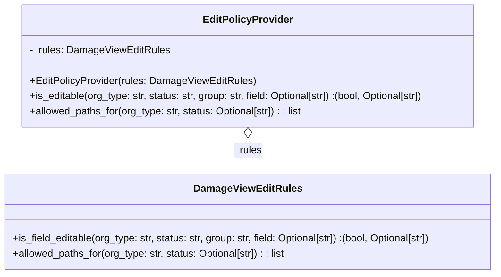

# Diagram: entity_core/entity_service/entity_service/damageview/fields/rules/policy.py

> Auto-generated by Obscura crawlers

## Mermaid

### SVG

<svg id="container" width="796.5703125" xmlns="http://www.w3.org/2000/svg" class="classDiagram" height="432" viewBox="0 0 796.5703125 432" role="graphics-document document" aria-roledescription="class"><g><defs><marker id="container_class-aggregationStart" class="marker aggregation class" refX="18" refY="7" markerWidth="190" markerHeight="240" orient="auto"><path d="M 18,7 L9,13 L1,7 L9,1 Z"></path></marker></defs><defs><marker id="container_class-aggregationEnd" class="marker aggregation class" refX="1" refY="7" markerWidth="20" markerHeight="28" orient="auto"><path d="M 18,7 L9,13 L1,7 L9,1 Z"></path></marker></defs><defs><marker id="container_class-extensionStart" class="marker extension class" refX="18" refY="7" markerWidth="190" markerHeight="240" orient="auto"><path d="M 1,7 L18,13 V 1 Z"></path></marker></defs><defs><marker id="container_class-extensionEnd" class="marker extension class" refX="1" refY="7" markerWidth="20" markerHeight="28" orient="auto"><path d="M 1,1 V 13 L18,7 Z"></path></marker></defs><defs><marker id="container_class-compositionStart" class="marker composition class" refX="18" refY="7" markerWidth="190" markerHeight="240" orient="auto"><path d="M 18,7 L9,13 L1,7 L9,1 Z"></path></marker></defs><defs><marker id="container_class-compositionEnd" class="marker composition class" refX="1" refY="7" markerWidth="20" markerHeight="28" orient="auto"><path d="M 18,7 L9,13 L1,7 L9,1 Z"></path></marker></defs><defs><marker id="container_class-dependencyStart" class="marker dependency class" refX="6" refY="7" markerWidth="190" markerHeight="240" orient="auto"><path d="M 5,7 L9,13 L1,7 L9,1 Z"></path></marker></defs><defs><marker id="container_class-dependencyEnd" class="marker dependency class" refX="13" refY="7" markerWidth="20" markerHeight="28" orient="auto"><path d="M 18,7 L9,13 L14,7 L9,1 Z"></path></marker></defs><defs><marker id="container_class-lollipopStart" class="marker lollipop class" refX="13" refY="7" markerWidth="190" markerHeight="240" orient="auto"><circle stroke="black" fill="transparent" cx="7" cy="7" r="6"></circle></marker></defs><defs><marker id="container_class-lollipopEnd" class="marker lollipop class" refX="1" refY="7" markerWidth="190" markerHeight="240" orient="auto"><circle stroke="black" fill="transparent" cx="7" cy="7" r="6"></circle></marker></defs><g class="root"><g class="clusters"></g><g class="edgePaths"><path d="M398.285,217.25L398.285,220.542C398.285,223.833,398.285,230.417,398.285,239.875C398.285,249.333,398.285,261.667,398.285,267.833L398.285,274" id="id_EditPolicyProvider_DamageViewEditRules_1" class="edge-thickness-normal edge-pattern-solid relation" style=";;;" data-edge="true" data-et="edge" data-id="id_EditPolicyProvider_DamageViewEditRules_1" data-points="W3sieCI6Mzk4LjI4NTE1NjI1LCJ5IjoyMDB9LHsieCI6Mzk4LjI4NTE1NjI1LCJ5IjoyMzd9LHsieCI6Mzk4LjI4NTE1NjI1LCJ5IjoyNzR9XQ==" marker-start="url(#container_class-aggregationStart)"></path></g><g class="edgeLabels"><g class="edgeLabel" transform="translate(398.28515625, 237)"><g class="label" data-id="id_EditPolicyProvider_DamageViewEditRules_1" transform="translate(-22.3046875, -12)"><foreignObject width="44.609375" height="24">

_rules

</foreignObject></g></g></g><g class="nodes"><g class="node default" id="classId-DamageViewEditRules-0" transform="translate(398.28515625, 349)"><g class="basic label-container"><path d="M-390.28515625 -75 L390.28515625 -75 L390.28515625 75 L-390.28515625 75" stroke="none" stroke-width="0" fill="#ECECFF" style=""></path><path d="M-390.28515625 -75 C-117.77943653097509 -75, 154.72628318804982 -75, 390.28515625 -75 M-390.28515625 -75 C-164.50764851836615 -75, 61.269859213267694 -75, 390.28515625 -75 M390.28515625 -75 C390.28515625 -31.930926696903114, 390.28515625 11.138146606193772, 390.28515625 75 M390.28515625 -75 C390.28515625 -42.641951451180766, 390.28515625 -10.283902902361532, 390.28515625 75 M390.28515625 75 C98.99812059760382 75, -192.28891505479237 75, -390.28515625 75 M390.28515625 75 C154.65021497061826 75, -80.98472630876347 75, -390.28515625 75 M-390.28515625 75 C-390.28515625 32.20897361123291, -390.28515625 -10.582052777534173, -390.28515625 -75 M-390.28515625 75 C-390.28515625 16.949576360286613, -390.28515625 -41.10084727942677, -390.28515625 -75" stroke="#9370DB" stroke-width="1.3" fill="none" stroke-dasharray="0 0" style=""></path></g><g class="annotation-group text" transform="translate(0, -51)"></g><g class="label-group text" transform="translate(-80.7734375, -51)"><g class="label" style="font-weight: bolder" transform="translate(0,-12)"><foreignObject width="161.546875" height="24">

DamageViewEditRules

</foreignObject></g></g><g class="members-group text" transform="translate(-378.28515625, -3)"></g><g class="methods-group text" transform="translate(-378.28515625, 27)"><g class="label" style="" transform="translate(0,-12)"><foreignObject width="675.796875" height="24">

+is_field_editable(org_type: str, status: str, group: str, field: Optional[str]) :(bool, Optional[str])

</foreignObject></g><g class="label" style="" transform="translate(0,12)"><foreignObject width="438.09375" height="24">

+allowed_paths_for(org_type: str, status: Optional[str]) : : list

</foreignObject></g></g><g class="divider" style=""><path d="M-390.28515625 -27 C-108.58892648774753 -27, 173.10730327450494 -27, 390.28515625 -27 M-390.28515625 -27 C-225.88296230955282 -27, -61.48076836910565 -27, 390.28515625 -27" stroke="#9370DB" stroke-width="1.3" fill="none" stroke-dasharray="0 0" style=""></path></g><g class="divider" style=""><path d="M-390.28515625 -3 C-107.52685043837403 -3, 175.23145537325195 -3, 390.28515625 -3 M-390.28515625 -3 C-170.60446729057756 -3, 49.07622166884488 -3, 390.28515625 -3" stroke="#9370DB" stroke-width="1.3" fill="none" stroke-dasharray="0 0" style=""></path></g></g><g class="node default" id="classId-EditPolicyProvider-1" transform="translate(398.28515625, 104)"><g class="basic label-container"><path d="M-363.37109375 -96 L363.37109375 -96 L363.37109375 96 L-363.37109375 96" stroke="none" stroke-width="0" fill="#ECECFF" style=""></path><path d="M-363.37109375 -96 C-136.111104016726 -96, 91.14888571654802 -96, 363.37109375 -96 M-363.37109375 -96 C-160.38252257826133 -96, 42.60604859347734 -96, 363.37109375 -96 M363.37109375 -96 C363.37109375 -36.9378983563507, 363.37109375 22.1242032872986, 363.37109375 96 M363.37109375 -96 C363.37109375 -22.458164905779483, 363.37109375 51.08367018844103, 363.37109375 96 M363.37109375 96 C125.06397999975866 96, -113.24313375048268 96, -363.37109375 96 M363.37109375 96 C171.6251905225798 96, -20.1207127048404 96, -363.37109375 96 M-363.37109375 96 C-363.37109375 40.45109930156721, -363.37109375 -15.097801396865577, -363.37109375 -96 M-363.37109375 96 C-363.37109375 37.625102543488, -363.37109375 -20.749794913024004, -363.37109375 -96" stroke="#9370DB" stroke-width="1.3" fill="none" stroke-dasharray="0 0" style=""></path></g><g class="annotation-group text" transform="translate(0, -72)"></g><g class="label-group text" transform="translate(-67.0390625, -72)"><g class="label" style="font-weight: bolder" transform="translate(0,-12)"><foreignObject width="134.078125" height="24">

EditPolicyProvider

</foreignObject></g></g><g class="members-group text" transform="translate(-351.37109375, -24)"><g class="label" style="" transform="translate(0,-12)"><foreignObject width="217.234375" height="24">

-_rules: DamageViewEditRules

</foreignObject></g></g><g class="methods-group text" transform="translate(-351.37109375, 24)"><g class="label" style="" transform="translate(0,-12)"><foreignObject width="353.875" height="24">

+EditPolicyProvider(rules: DamageViewEditRules)

</foreignObject></g><g class="label" style="" transform="translate(0,12)"><foreignObject width="635.703125" height="24">

+is_editable(org_type: str, status: str, group: str, field: Optional[str]) :(bool, Optional[str])

</foreignObject></g><g class="label" style="" transform="translate(0,36)"><foreignObject width="438.09375" height="24">

+allowed_paths_for(org_type: str, status: Optional[str]) : : list

</foreignObject></g></g><g class="divider" style=""><path d="M-363.37109375 -48 C-145.7478419187642 -48, 71.87540991247158 -48, 363.37109375 -48 M-363.37109375 -48 C-180.33073142236805 -48, 2.709630905263907 -48, 363.37109375 -48" stroke="#9370DB" stroke-width="1.3" fill="none" stroke-dasharray="0 0" style=""></path></g><g class="divider" style=""><path d="M-363.37109375 0 C-170.56734544315006 0, 22.23640286369988 0, 363.37109375 0 M-363.37109375 0 C-157.37911529443053 0, 48.61286316113893 0, 363.37109375 0" stroke="#9370DB" stroke-width="1.3" fill="none" stroke-dasharray="0 0" style=""></path></g></g></g></g></g></svg>
