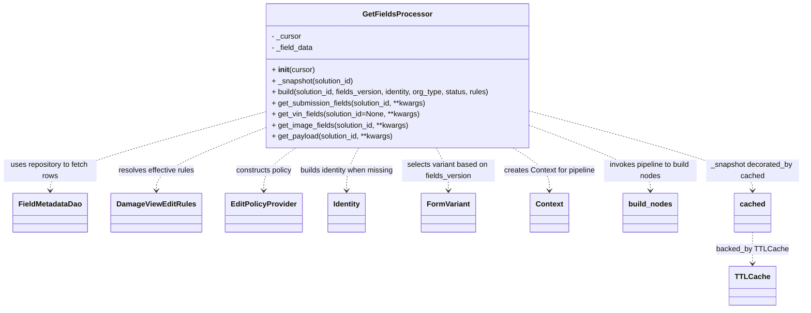

# Diagram: entity_core/entity_service/entity_service/damageview/fields/service.py


> Auto-generated by Obscura crawlers

## Diagram 1



### SVG

<svg id="container" width="1720.6328125" xmlns="http://www.w3.org/2000/svg" class="classDiagram" height="668" viewBox="0 0 1720.6328125 668" role="graphics-document document" aria-roledescription="class"><style>#container{font-family:"trebuchet ms",verdana,arial,sans-serif;font-size:16px;fill:#333;}@keyframes edge-animation-frame{from{stroke-dashoffset:0;}}@keyframes dash{to{stroke-dashoffset:0;}}#container .edge-animation-slow{stroke-dasharray:9,5!important;stroke-dashoffset:900;animation:dash 50s linear infinite;stroke-linecap:round;}#container .edge-animation-fast{stroke-dasharray:9,5!important;stroke-dashoffset:900;animation:dash 20s linear infinite;stroke-linecap:round;}#container .error-icon{fill:#552222;}#container .error-text{fill:#552222;stroke:#552222;}#container .edge-thickness-normal{stroke-width:1px;}#container .edge-thickness-thick{stroke-width:3.5px;}#container .edge-pattern-solid{stroke-dasharray:0;}#container .edge-thickness-invisible{stroke-width:0;fill:none;}#container .edge-pattern-dashed{stroke-dasharray:3;}#container .edge-pattern-dotted{stroke-dasharray:2;}#container .marker{fill:#333333;stroke:#333333;}#container .marker.cross{stroke:#333333;}#container svg{font-family:"trebuchet ms",verdana,arial,sans-serif;font-size:16px;}#container p{margin:0;}#container g.classGroup text{fill:#9370DB;stroke:none;font-family:"trebuchet ms",verdana,arial,sans-serif;font-size:10px;}#container g.classGroup text .title{font-weight:bolder;}#container .nodeLabel,#container .edgeLabel{color:#131300;}#container .edgeLabel .label rect{fill:#ECECFF;}#container .label text{fill:#131300;}#container .labelBkg{background:#ECECFF;}#container .edgeLabel .label span{background:#ECECFF;}#container .classTitle{font-weight:bolder;}#container .node rect,#container .node circle,#container .node ellipse,#container .node polygon,#container .node path{fill:#ECECFF;stroke:#9370DB;stroke-width:1px;}#container .divider{stroke:#9370DB;stroke-width:1;}#container g.clickable{cursor:pointer;}#container g.classGroup rect{fill:#ECECFF;stroke:#9370DB;}#container g.classGroup line{stroke:#9370DB;stroke-width:1;}#container .classLabel .box{stroke:none;stroke-width:0;fill:#ECECFF;opacity:0.5;}#container .classLabel .label{fill:#9370DB;font-size:10px;}#container .relation{stroke:#333333;stroke-width:1;fill:none;}#container .dashed-line{stroke-dasharray:3;}#container .dotted-line{stroke-dasharray:1 2;}#container #compositionStart,#container .composition{fill:#333333!important;stroke:#333333!important;stroke-width:1;}#container #compositionEnd,#container .composition{fill:#333333!important;stroke:#333333!important;stroke-width:1;}#container #dependencyStart,#container .dependency{fill:#333333!important;stroke:#333333!important;stroke-width:1;}#container #dependencyStart,#container .dependency{fill:#333333!important;stroke:#333333!important;stroke-width:1;}#container #extensionStart,#container .extension{fill:transparent!important;stroke:#333333!important;stroke-width:1;}#container #extensionEnd,#container .extension{fill:transparent!important;stroke:#333333!important;stroke-width:1;}#container #aggregationStart,#container .aggregation{fill:transparent!important;stroke:#333333!important;stroke-width:1;}#container #aggregationEnd,#container .aggregation{fill:transparent!important;stroke:#333333!important;stroke-width:1;}#container #lollipopStart,#container .lollipop{fill:#ECECFF!important;stroke:#333333!important;stroke-width:1;}#container #lollipopEnd,#container .lollipop{fill:#ECECFF!important;stroke:#333333!important;stroke-width:1;}#container .edgeTerminals{font-size:11px;line-height:initial;}#container .classTitleText{text-anchor:middle;font-size:18px;fill:#333;}#container .label-icon{display:inline-block;height:1em;overflow:visible;vertical-align:-0.125em;}#container .node .label-icon path{fill:currentColor;stroke:revert;stroke-width:revert;}#container :root{--mermaid-font-family:"trebuchet ms",verdana,arial,sans-serif;}</style><g><defs><marker id="container_class-aggregationStart" class="marker aggregation class" refX="18" refY="7" markerWidth="190" markerHeight="240" orient="auto"><path d="M 18,7 L9,13 L1,7 L9,1 Z"></path></marker></defs><defs><marker id="container_class-aggregationEnd" class="marker aggregation class" refX="1" refY="7" markerWidth="20" markerHeight="28" orient="auto"><path d="M 18,7 L9,13 L1,7 L9,1 Z"></path></marker></defs><defs><marker id="container_class-extensionStart" class="marker extension class" refX="18" refY="7" markerWidth="190" markerHeight="240" orient="auto"><path d="M 1,7 L18,13 V 1 Z"></path></marker></defs><defs><marker id="container_class-extensionEnd" class="marker extension class" refX="1" refY="7" markerWidth="20" markerHeight="28" orient="auto"><path d="M 1,1 V 13 L18,7 Z"></path></marker></defs><defs><marker id="container_class-compositionStart" class="marker composition class" refX="18" refY="7" markerWidth="190" markerHeight="240" orient="auto"><path d="M 18,7 L9,13 L1,7 L9,1 Z"></path></marker></defs><defs><marker id="container_class-compositionEnd" class="marker composition class" refX="1" refY="7" markerWidth="20" markerHeight="28" orient="auto"><path d="M 18,7 L9,13 L1,7 L9,1 Z"></path></marker></defs><defs><marker id="container_class-dependencyStart" class="marker dependency class" refX="6" refY="7" markerWidth="190" markerHeight="240" orient="auto"><path d="M 5,7 L9,13 L1,7 L9,1 Z"></path></marker></defs><defs><marker id="container_class-dependencyEnd" class="marker dependency class" refX="13" refY="7" markerWidth="20" markerHeight="28" orient="auto"><path d="M 18,7 L9,13 L14,7 L9,1 Z"></path></marker></defs><defs><marker id="container_class-lollipopStart" class="marker lollipop class" refX="13" refY="7" markerWidth="190" markerHeight="240" orient="auto"><circle stroke="black" fill="transparent" cx="7" cy="7" r="6"></circle></marker></defs><defs><marker id="container_class-lollipopEnd" class="marker lollipop class" refX="1" refY="7" markerWidth="190" markerHeight="240" orient="auto"><circle stroke="black" fill="transparent" cx="7" cy="7" r="6"></circle></marker></defs><g class="root"><g class="clusters"></g><g class="edgePaths"><path d="M554.492,244.406L480.077,265.172C405.661,285.937,256.831,327.469,182.415,355.401C108,383.333,108,397.667,108,404.833L108,412" id="id_GetFieldsProcessor_FieldMetadataDao_1" class="edge-thickness-normal edge-pattern-dashed relation" style=";;;" data-edge="true" data-et="edge" data-id="id_GetFieldsProcessor_FieldMetadataDao_1" data-points="W3sieCI6NTU0LjQ5MjE4NzUsInkiOjI0NC40MDU5MjEzMjU0OTIxfSx7IngiOjEwOCwieSI6MzY5fSx7IngiOjEwOCwieSI6NDE4fV0=" marker-end="url(#container_class-dependencyEnd)"></path><path d="M554.492,279.018L516.922,294.015C479.352,309.012,404.211,339.006,366.641,361.17C329.07,383.333,329.07,397.667,329.07,404.833L329.07,412" id="id_GetFieldsProcessor_DamageViewEditRules_2" class="edge-thickness-normal edge-pattern-dashed relation" style=";;;" data-edge="true" data-et="edge" data-id="id_GetFieldsProcessor_DamageViewEditRules_2" data-points="W3sieCI6NTU0LjQ5MjE4NzUsInkiOjI3OS4wMTc3OTg0NjY1OTM2Nn0seyJ4IjozMjkuMDcwMzEyNSwieSI6MzY5fSx7IngiOjMyOS4wNzAzMTI1LCJ5Ijo0MTh9XQ==" marker-end="url(#container_class-dependencyEnd)"></path><path d="M620.618,320L608.996,328.167C597.373,336.333,574.128,352.667,562.505,368C550.883,383.333,550.883,397.667,550.883,404.833L550.883,412" id="id_GetFieldsProcessor_EditPolicyProvider_3" class="edge-thickness-normal edge-pattern-dashed relation" style=";;;" data-edge="true" data-et="edge" data-id="id_GetFieldsProcessor_EditPolicyProvider_3" data-points="W3sieCI6NjIwLjYxODE3ODM1MzY1ODUsInkiOjMyMH0seyJ4Ijo1NTAuODgyODEyNSwieSI6MzY5fSx7IngiOjU1MC44ODI4MTI1LCJ5Ijo0MTh9XQ==" marker-end="url(#container_class-dependencyEnd)"></path><path d="M758.925,320L754.543,328.167C750.161,336.333,741.397,352.667,737.015,368C732.633,383.333,732.633,397.667,732.633,404.833L732.633,412" id="id_GetFieldsProcessor_Identity_4" class="edge-thickness-normal edge-pattern-dashed relation" style=";;;" data-edge="true" data-et="edge" data-id="id_GetFieldsProcessor_Identity_4" data-points="W3sieCI6NzU4LjkyNTQ5NTQyNjgyOTIsInkiOjMyMH0seyJ4Ijo3MzIuNjMyODEyNSwieSI6MzY5fSx7IngiOjczMi42MzI4MTI1LCJ5Ijo0MTh9XQ==" marker-end="url(#container_class-dependencyEnd)"></path><path d="M926.34,320L930.722,328.167C935.104,336.333,943.869,352.667,948.251,368C952.633,383.333,952.633,397.667,952.633,404.833L952.633,412" id="id_GetFieldsProcessor_FormVariant_5" class="edge-thickness-normal edge-pattern-dashed relation" style=";;;" data-edge="true" data-et="edge" data-id="id_GetFieldsProcessor_FormVariant_5" data-points="W3sieCI6OTI2LjM0MDEyOTU3MzE3MDgsInkiOjMyMH0seyJ4Ijo5NTIuNjMyODEyNSwieSI6MzY5fSx7IngiOjk1Mi42MzI4MTI1LCJ5Ijo0MTh9XQ==" marker-end="url(#container_class-dependencyEnd)"></path><path d="M1093.755,320L1106.901,328.167C1120.047,336.333,1146.34,352.667,1159.486,368C1172.633,383.333,1172.633,397.667,1172.633,404.833L1172.633,412" id="id_GetFieldsProcessor_Context_6" class="edge-thickness-normal edge-pattern-dashed relation" style=";;;" data-edge="true" data-et="edge" data-id="id_GetFieldsProcessor_Context_6" data-points="W3sieCI6MTA5My43NTQ3NjM3MTk1MTIsInkiOjMyMH0seyJ4IjoxMTcyLjYzMjgxMjUsInkiOjM2OX0seyJ4IjoxMTcyLjYzMjgxMjUsInkiOjQxOH1d" marker-end="url(#container_class-dependencyEnd)"></path><path d="M1130.773,271.398L1174.417,287.665C1218.06,303.932,1305.346,336.466,1348.99,359.9C1392.633,383.333,1392.633,397.667,1392.633,404.833L1392.633,412" id="id_GetFieldsProcessor_build_nodes_7" class="edge-thickness-normal edge-pattern-dashed relation" style=";;;" data-edge="true" data-et="edge" data-id="id_GetFieldsProcessor_build_nodes_7" data-points="W3sieCI6MTEzMC43NzM0Mzc1LCJ5IjoyNzEuMzk3ODY5MzE4MTgxODV9LHsieCI6MTM5Mi42MzI4MTI1LCJ5IjozNjl9LHsieCI6MTM5Mi42MzI4MTI1LCJ5Ijo0MTh9XQ==" marker-end="url(#container_class-dependencyEnd)"></path><path d="M1130.773,240.713L1211.083,262.094C1291.393,283.475,1452.013,326.238,1532.323,354.785C1612.633,383.333,1612.633,397.667,1612.633,404.833L1612.633,412" id="id_GetFieldsProcessor_cached_8" class="edge-thickness-normal edge-pattern-dashed relation" style=";;;" data-edge="true" data-et="edge" data-id="id_GetFieldsProcessor_cached_8" data-points="W3sieCI6MTEzMC43NzM0Mzc1LCJ5IjoyNDAuNzEyNzYzNzk4NzAxM30seyJ4IjoxNjEyLjYzMjgxMjUsInkiOjM2OX0seyJ4IjoxNjEyLjYzMjgxMjUsInkiOjQxOH1d" marker-end="url(#container_class-dependencyEnd)"></path><path d="M1612.633,502L1612.633,508.167C1612.633,514.333,1612.633,526.667,1612.633,538C1612.633,549.333,1612.633,559.667,1612.633,564.833L1612.633,570" id="id_cached_TTLCache_9" class="edge-thickness-normal edge-pattern-dashed relation" style=";;;" data-edge="true" data-et="edge" data-id="id_cached_TTLCache_9" data-points="W3sieCI6MTYxMi42MzI4MTI1LCJ5Ijo1MDJ9LHsieCI6MTYxMi42MzI4MTI1LCJ5Ijo1Mzl9LHsieCI6MTYxMi42MzI4MTI1LCJ5Ijo1NzZ9XQ==" marker-end="url(#container_class-dependencyEnd)"></path></g><g class="edgeLabels"><g class="edgeLabel" transform="translate(108, 369)"><g class="label" data-id="id_GetFieldsProcessor_FieldMetadataDao_1" transform="translate(-100, -24)"><foreignObject width="200" height="48"><div xmlns="http://www.w3.org/1999/xhtml" class="labelBkg" style="display: table; white-space: break-spaces; line-height: 1.5; max-width: 200px; text-align: center; width: 200px;"><span class="edgeLabel"><p>uses repository to fetch rows</p></span></div></foreignObject></g></g><g class="edgeLabel" transform="translate(329.0703125, 369)"><g class="label" data-id="id_GetFieldsProcessor_DamageViewEditRules_2" transform="translate(-83.5, -12)"><foreignObject width="167" height="24"><div xmlns="http://www.w3.org/1999/xhtml" class="labelBkg" style="display: table-cell; white-space: nowrap; line-height: 1.5; max-width: 200px; text-align: center;"><span class="edgeLabel"><p>resolves effective rules</p></span></div></foreignObject></g></g><g class="edgeLabel" transform="translate(550.8828125, 369)"><g class="label" data-id="id_GetFieldsProcessor_EditPolicyProvider_3" transform="translate(-61.75, -12)"><foreignObject width="123.5" height="24"><div xmlns="http://www.w3.org/1999/xhtml" class="labelBkg" style="display: table-cell; white-space: nowrap; line-height: 1.5; max-width: 200px; text-align: center;"><span class="edgeLabel"><p>constructs policy</p></span></div></foreignObject></g></g><g class="edgeLabel" transform="translate(732.6328125, 369)"><g class="label" data-id="id_GetFieldsProcessor_Identity_4" transform="translate(-100, -24)"><foreignObject width="200" height="48"><div xmlns="http://www.w3.org/1999/xhtml" class="labelBkg" style="display: table; white-space: break-spaces; line-height: 1.5; max-width: 200px; text-align: center; width: 200px;"><span class="edgeLabel"><p>builds identity when missing</p></span></div></foreignObject></g></g><g class="edgeLabel" transform="translate(952.6328125, 369)"><g class="label" data-id="id_GetFieldsProcessor_FormVariant_5" transform="translate(-100, -24)"><foreignObject width="200" height="48"><div xmlns="http://www.w3.org/1999/xhtml" class="labelBkg" style="display: table; white-space: break-spaces; line-height: 1.5; max-width: 200px; text-align: center; width: 200px;"><span class="edgeLabel"><p>selects variant based on fields_version</p></span></div></foreignObject></g></g><g class="edgeLabel" transform="translate(1172.6328125, 369)"><g class="label" data-id="id_GetFieldsProcessor_Context_6" transform="translate(-100, -24)"><foreignObject width="200" height="48"><div xmlns="http://www.w3.org/1999/xhtml" class="labelBkg" style="display: table; white-space: break-spaces; line-height: 1.5; max-width: 200px; text-align: center; width: 200px;"><span class="edgeLabel"><p>creates Context for pipeline</p></span></div></foreignObject></g></g><g class="edgeLabel" transform="translate(1392.6328125, 369)"><g class="label" data-id="id_GetFieldsProcessor_build_nodes_7" transform="translate(-100, -24)"><foreignObject width="200" height="48"><div xmlns="http://www.w3.org/1999/xhtml" class="labelBkg" style="display: table; white-space: break-spaces; line-height: 1.5; max-width: 200px; text-align: center; width: 200px;"><span class="edgeLabel"><p>invokes pipeline to build nodes</p></span></div></foreignObject></g></g><g class="edgeLabel" transform="translate(1612.6328125, 369)"><g class="label" data-id="id_GetFieldsProcessor_cached_8" transform="translate(-100, -24)"><foreignObject width="200" height="48"><div xmlns="http://www.w3.org/1999/xhtml" class="labelBkg" style="display: table; white-space: break-spaces; line-height: 1.5; max-width: 200px; text-align: center; width: 200px;"><span class="edgeLabel"><p>_snapshot decorated_by cached</p></span></div></foreignObject></g></g><g class="edgeLabel" transform="translate(1612.6328125, 539)"><g class="label" data-id="id_cached_TTLCache_9" transform="translate(-74.4765625, -12)"><foreignObject width="148.953125" height="24"><div xmlns="http://www.w3.org/1999/xhtml" class="labelBkg" style="display: table-cell; white-space: nowrap; line-height: 1.5; max-width: 200px; text-align: center;"><span class="edgeLabel"><p>backed_by TTLCache</p></span></div></foreignObject></g></g></g><g class="nodes"><g class="node default" id="classId-GetFieldsProcessor-0" transform="translate(842.6328125, 164)"><g class="basic label-container"><path d="M-288.140625 -156 L288.140625 -156 L288.140625 156 L-288.140625 156" stroke="none" stroke-width="0" fill="#ECECFF" style=""></path><path d="M-288.140625 -156 C-103.17270912985182 -156, 81.79520674029635 -156, 288.140625 -156 M-288.140625 -156 C-99.04413041255236 -156, 90.05236417489527 -156, 288.140625 -156 M288.140625 -156 C288.140625 -65.3610251368061, 288.140625 25.27794972638779, 288.140625 156 M288.140625 -156 C288.140625 -79.78958887807657, 288.140625 -3.5791777561531433, 288.140625 156 M288.140625 156 C67.16928407617911 156, -153.80205684764178 156, -288.140625 156 M288.140625 156 C150.59193382007194 156, 13.043242640143887 156, -288.140625 156 M-288.140625 156 C-288.140625 44.7316490422066, -288.140625 -66.5367019155868, -288.140625 -156 M-288.140625 156 C-288.140625 83.77442333575704, -288.140625 11.54884667151407, -288.140625 -156" stroke="#9370DB" stroke-width="1.3" fill="none" stroke-dasharray="0 0" style=""></path></g><g class="annotation-group text" transform="translate(0, -132)"></g><g class="label-group text" transform="translate(-69.921875, -132)"><g class="label" style="font-weight: bolder" transform="translate(0,-12)"><foreignObject width="139.84375" height="24"><div xmlns="http://www.w3.org/1999/xhtml" style="display: table-cell; white-space: nowrap; line-height: 1.5; max-width: 188px; text-align: center;"><span class="nodeLabel markdown-node-label" style=""><p>GetFieldsProcessor</p></span></div></foreignObject></g></g><g class="members-group text" transform="translate(-276.140625, -84)"><g class="label" style="" transform="translate(0,-12)"><foreignObject width="64.421875" height="24"><div xmlns="http://www.w3.org/1999/xhtml" style="display: table-cell; white-space: nowrap; line-height: 1.5; max-width: 123px; text-align: center;"><span class="nodeLabel markdown-node-label" style=""><p>- _cursor</p></span></div></foreignObject></g><g class="label" style="" transform="translate(0,12)"><foreignObject width="91.4375" height="24"><div xmlns="http://www.w3.org/1999/xhtml" style="display: table-cell; white-space: nowrap; line-height: 1.5; max-width: 149px; text-align: center;"><span class="nodeLabel markdown-node-label" style=""><p>- _field_data</p></span></div></foreignObject></g></g><g class="methods-group text" transform="translate(-276.140625, -12)"><g class="label" style="" transform="translate(0,-12)"><foreignObject width="92.78125" height="24"><div xmlns="http://www.w3.org/1999/xhtml" style="display: table-cell; white-space: nowrap; line-height: 1.5; max-width: 183px; text-align: center;"><span class="nodeLabel markdown-node-label" style=""><p>+ <strong>init</strong>(cursor)</p></span></div></foreignObject></g><g class="label" style="" transform="translate(0,12)"><foreignObject width="180.171875" height="24"><div xmlns="http://www.w3.org/1999/xhtml" style="display: table-cell; white-space: nowrap; line-height: 1.5; max-width: 238px; text-align: center;"><span class="nodeLabel markdown-node-label" style=""><p>+ _snapshot(solution_id)</p></span></div></foreignObject></g><g class="label" style="" transform="translate(0,36)"><foreignObject width="482.359375" height="24"><div xmlns="http://www.w3.org/1999/xhtml" style="display: table-cell; white-space: nowrap; line-height: 1.5; max-width: 540px; text-align: center;"><span class="nodeLabel markdown-node-label" style=""><p>+ build(solution_id, fields_version, identity, org_type, status, rules)</p></span></div></foreignObject></g><g class="label" style="" transform="translate(0,60)"><foreignObject width="337.78125" height="24"><div xmlns="http://www.w3.org/1999/xhtml" style="display: table-cell; white-space: nowrap; line-height: 1.5; max-width: 395px; text-align: center;"><span class="nodeLabel markdown-node-label" style=""><p>+ get_submission_fields(solution_id, **kwargs)</p></span></div></foreignObject></g><g class="label" style="" transform="translate(0,84)"><foreignObject width="322.75" height="24"><div xmlns="http://www.w3.org/1999/xhtml" style="display: table-cell; white-space: nowrap; line-height: 1.5; max-width: 380px; text-align: center;"><span class="nodeLabel markdown-node-label" style=""><p>+ get_vin_fields(solution_id=None, **kwargs)</p></span></div></foreignObject></g><g class="label" style="" transform="translate(0,108)"><foreignObject width="298.484375" height="24"><div xmlns="http://www.w3.org/1999/xhtml" style="display: table-cell; white-space: nowrap; line-height: 1.5; max-width: 356px; text-align: center;"><span class="nodeLabel markdown-node-label" style=""><p>+ get_image_fields(solution_id, **kwargs)</p></span></div></foreignObject></g><g class="label" style="" transform="translate(0,132)"><foreignObject width="265.4375" height="24"><div xmlns="http://www.w3.org/1999/xhtml" style="display: table-cell; white-space: nowrap; line-height: 1.5; max-width: 323px; text-align: center;"><span class="nodeLabel markdown-node-label" style=""><p>+ get_payload(solution_id, **kwargs)</p></span></div></foreignObject></g></g><g class="divider" style=""><path d="M-288.140625 -108 C-148.4722850642831 -108, -8.803945128566227 -108, 288.140625 -108 M-288.140625 -108 C-165.23516843627962 -108, -42.329711872559244 -108, 288.140625 -108" stroke="#9370DB" stroke-width="1.3" fill="none" stroke-dasharray="0 0" style=""></path></g><g class="divider" style=""><path d="M-288.140625 -36 C-147.3408102772318 -36, -6.5409955544636205 -36, 288.140625 -36 M-288.140625 -36 C-62.81445711471983 -36, 162.51171077056034 -36, 288.140625 -36" stroke="#9370DB" stroke-width="1.3" fill="none" stroke-dasharray="0 0" style=""></path></g></g><g class="node default" id="classId-FieldMetadataDao-1" transform="translate(108, 460)"><g class="basic label-container"><path d="M-78.296875 -42 L78.296875 -42 L78.296875 42 L-78.296875 42" stroke="none" stroke-width="0" fill="#ECECFF" style=""></path><path d="M-78.296875 -42 C-37.77662677864682 -42, 2.743621442706356 -42, 78.296875 -42 M-78.296875 -42 C-27.88358871316423 -42, 22.52969757367154 -42, 78.296875 -42 M78.296875 -42 C78.296875 -21.53912347701312, 78.296875 -1.0782469540262412, 78.296875 42 M78.296875 -42 C78.296875 -23.41073566162613, 78.296875 -4.821471323252261, 78.296875 42 M78.296875 42 C26.687385103684427 42, -24.922104792631146 42, -78.296875 42 M78.296875 42 C19.927812977223255 42, -38.44124904555349 42, -78.296875 42 M-78.296875 42 C-78.296875 22.59574836636305, -78.296875 3.191496732726101, -78.296875 -42 M-78.296875 42 C-78.296875 20.03532977107245, -78.296875 -1.9293404578550977, -78.296875 -42" stroke="#9370DB" stroke-width="1.3" fill="none" stroke-dasharray="0 0" style=""></path></g><g class="annotation-group text" transform="translate(0, -18)"></g><g class="label-group text" transform="translate(-66.296875, -18)"><g class="label" style="font-weight: bolder" transform="translate(0,-12)"><foreignObject width="132.59375" height="24"><div xmlns="http://www.w3.org/1999/xhtml" style="display: table-cell; white-space: nowrap; line-height: 1.5; max-width: 181px; text-align: center;"><span class="nodeLabel markdown-node-label" style=""><p>FieldMetadataDao</p></span></div></foreignObject></g></g><g class="members-group text" transform="translate(-66.296875, 30)"></g><g class="methods-group text" transform="translate(-66.296875, 60)"></g><g class="divider" style=""><path d="M-78.296875 6 C-40.664017776853086 6, -3.0311605537061723 6, 78.296875 6 M-78.296875 6 C-41.177445650582314 6, -4.058016301164628 6, 78.296875 6" stroke="#9370DB" stroke-width="1.3" fill="none" stroke-dasharray="0 0" style=""></path></g><g class="divider" style=""><path d="M-78.296875 24 C-34.18886219805861 24, 9.919150603882784 24, 78.296875 24 M-78.296875 24 C-25.12222207097566 24, 28.05243085804868 24, 78.296875 24" stroke="#9370DB" stroke-width="1.3" fill="none" stroke-dasharray="0 0" style=""></path></g></g><g class="node default" id="classId-DamageViewEditRules-2" transform="translate(329.0703125, 460)"><g class="basic label-container"><path d="M-92.7734375 -42 L92.7734375 -42 L92.7734375 42 L-92.7734375 42" stroke="none" stroke-width="0" fill="#ECECFF" style=""></path><path d="M-92.7734375 -42 C-55.630245065221 -42, -18.487052630441994 -42, 92.7734375 -42 M-92.7734375 -42 C-44.61669665803901 -42, 3.540044183921978 -42, 92.7734375 -42 M92.7734375 -42 C92.7734375 -18.767451246658958, 92.7734375 4.465097506682085, 92.7734375 42 M92.7734375 -42 C92.7734375 -23.893039803272597, 92.7734375 -5.786079606545194, 92.7734375 42 M92.7734375 42 C40.45326595928626 42, -11.866905581427474 42, -92.7734375 42 M92.7734375 42 C39.20770151530862 42, -14.358034469382758 42, -92.7734375 42 M-92.7734375 42 C-92.7734375 12.535184030509349, -92.7734375 -16.929631938981302, -92.7734375 -42 M-92.7734375 42 C-92.7734375 13.573686139632311, -92.7734375 -14.852627720735377, -92.7734375 -42" stroke="#9370DB" stroke-width="1.3" fill="none" stroke-dasharray="0 0" style=""></path></g><g class="annotation-group text" transform="translate(0, -18)"></g><g class="label-group text" transform="translate(-80.7734375, -18)"><g class="label" style="font-weight: bolder" transform="translate(0,-12)"><foreignObject width="161.546875" height="24"><div xmlns="http://www.w3.org/1999/xhtml" style="display: table-cell; white-space: nowrap; line-height: 1.5; max-width: 209px; text-align: center;"><span class="nodeLabel markdown-node-label" style=""><p>DamageViewEditRules</p></span></div></foreignObject></g></g><g class="members-group text" transform="translate(-80.7734375, 30)"></g><g class="methods-group text" transform="translate(-80.7734375, 60)"></g><g class="divider" style=""><path d="M-92.7734375 6 C-26.049246335588563 6, 40.67494482882287 6, 92.7734375 6 M-92.7734375 6 C-23.215424847169018 6, 46.342587805661964 6, 92.7734375 6" stroke="#9370DB" stroke-width="1.3" fill="none" stroke-dasharray="0 0" style=""></path></g><g class="divider" style=""><path d="M-92.7734375 24 C-45.645488046054126 24, 1.4824614078917477 24, 92.7734375 24 M-92.7734375 24 C-24.470890968192094 24, 43.83165556361581 24, 92.7734375 24" stroke="#9370DB" stroke-width="1.3" fill="none" stroke-dasharray="0 0" style=""></path></g></g><g class="node default" id="classId-EditPolicyProvider-3" transform="translate(550.8828125, 460)"><g class="basic label-container"><path d="M-79.0390625 -42 L79.0390625 -42 L79.0390625 42 L-79.0390625 42" stroke="none" stroke-width="0" fill="#ECECFF" style=""></path><path d="M-79.0390625 -42 C-34.44669641409516 -42, 10.145669671809685 -42, 79.0390625 -42 M-79.0390625 -42 C-19.969993367378628 -42, 39.099075765242745 -42, 79.0390625 -42 M79.0390625 -42 C79.0390625 -10.013075677351576, 79.0390625 21.973848645296847, 79.0390625 42 M79.0390625 -42 C79.0390625 -23.753384150261127, 79.0390625 -5.506768300522253, 79.0390625 42 M79.0390625 42 C15.960366230359313 42, -47.118330039281375 42, -79.0390625 42 M79.0390625 42 C46.01086462869554 42, 12.982666757391087 42, -79.0390625 42 M-79.0390625 42 C-79.0390625 23.18099960807274, -79.0390625 4.3619992161454775, -79.0390625 -42 M-79.0390625 42 C-79.0390625 9.60127449232413, -79.0390625 -22.79745101535174, -79.0390625 -42" stroke="#9370DB" stroke-width="1.3" fill="none" stroke-dasharray="0 0" style=""></path></g><g class="annotation-group text" transform="translate(0, -18)"></g><g class="label-group text" transform="translate(-67.0390625, -18)"><g class="label" style="font-weight: bolder" transform="translate(0,-12)"><foreignObject width="134.078125" height="24"><div xmlns="http://www.w3.org/1999/xhtml" style="display: table-cell; white-space: nowrap; line-height: 1.5; max-width: 183px; text-align: center;"><span class="nodeLabel markdown-node-label" style=""><p>EditPolicyProvider</p></span></div></foreignObject></g></g><g class="members-group text" transform="translate(-67.0390625, 30)"></g><g class="methods-group text" transform="translate(-67.0390625, 60)"></g><g class="divider" style=""><path d="M-79.0390625 6 C-29.26860756744594 6, 20.50184736510812 6, 79.0390625 6 M-79.0390625 6 C-18.15220946247151 6, 42.73464357505698 6, 79.0390625 6" stroke="#9370DB" stroke-width="1.3" fill="none" stroke-dasharray="0 0" style=""></path></g><g class="divider" style=""><path d="M-79.0390625 24 C-16.93100066878204 24, 45.17706116243592 24, 79.0390625 24 M-79.0390625 24 C-21.247050759964523 24, 36.544960980070954 24, 79.0390625 24" stroke="#9370DB" stroke-width="1.3" fill="none" stroke-dasharray="0 0" style=""></path></g></g><g class="node default" id="classId-Identity-4" transform="translate(732.6328125, 460)"><g class="basic label-container"><path d="M-40.71875 -42 L40.71875 -42 L40.71875 42 L-40.71875 42" stroke="none" stroke-width="0" fill="#ECECFF" style=""></path><path d="M-40.71875 -42 C-10.147513784285191 -42, 20.423722431429617 -42, 40.71875 -42 M-40.71875 -42 C-23.004025246892777 -42, -5.289300493785554 -42, 40.71875 -42 M40.71875 -42 C40.71875 -11.96482055808341, 40.71875 18.07035888383318, 40.71875 42 M40.71875 -42 C40.71875 -14.344908022369466, 40.71875 13.310183955261067, 40.71875 42 M40.71875 42 C13.204665751300091 42, -14.309418497399818 42, -40.71875 42 M40.71875 42 C20.054531542120486 42, -0.6096869157590277 42, -40.71875 42 M-40.71875 42 C-40.71875 20.739270528431952, -40.71875 -0.5214589431360963, -40.71875 -42 M-40.71875 42 C-40.71875 21.60032441643984, -40.71875 1.2006488328796792, -40.71875 -42" stroke="#9370DB" stroke-width="1.3" fill="none" stroke-dasharray="0 0" style=""></path></g><g class="annotation-group text" transform="translate(0, -18)"></g><g class="label-group text" transform="translate(-28.71875, -18)"><g class="label" style="font-weight: bolder" transform="translate(0,-12)"><foreignObject width="57.4375" height="24"><div xmlns="http://www.w3.org/1999/xhtml" style="display: table-cell; white-space: nowrap; line-height: 1.5; max-width: 106px; text-align: center;"><span class="nodeLabel markdown-node-label" style=""><p>Identity</p></span></div></foreignObject></g></g><g class="members-group text" transform="translate(-28.71875, 30)"></g><g class="methods-group text" transform="translate(-28.71875, 60)"></g><g class="divider" style=""><path d="M-40.71875 6 C-8.444560372255161 6, 23.829629255489678 6, 40.71875 6 M-40.71875 6 C-22.766366583566708 6, -4.813983167133415 6, 40.71875 6" stroke="#9370DB" stroke-width="1.3" fill="none" stroke-dasharray="0 0" style=""></path></g><g class="divider" style=""><path d="M-40.71875 24 C-13.703117149773046 24, 13.312515700453908 24, 40.71875 24 M-40.71875 24 C-22.50943668291477 24, -4.300123365829542 24, 40.71875 24" stroke="#9370DB" stroke-width="1.3" fill="none" stroke-dasharray="0 0" style=""></path></g></g><g class="node default" id="classId-FormVariant-5" transform="translate(952.6328125, 460)"><g class="basic label-container"><path d="M-56.4375 -42 L56.4375 -42 L56.4375 42 L-56.4375 42" stroke="none" stroke-width="0" fill="#ECECFF" style=""></path><path d="M-56.4375 -42 C-19.996480519961864 -42, 16.444538960076272 -42, 56.4375 -42 M-56.4375 -42 C-21.751154718748722 -42, 12.935190562502555 -42, 56.4375 -42 M56.4375 -42 C56.4375 -10.978704912972894, 56.4375 20.04259017405421, 56.4375 42 M56.4375 -42 C56.4375 -8.842482285310261, 56.4375 24.315035429379478, 56.4375 42 M56.4375 42 C20.93999701614331 42, -14.557505967713382 42, -56.4375 42 M56.4375 42 C31.906931818528403 42, 7.376363637056805 42, -56.4375 42 M-56.4375 42 C-56.4375 10.168366959868916, -56.4375 -21.66326608026217, -56.4375 -42 M-56.4375 42 C-56.4375 15.819234495798518, -56.4375 -10.361531008402963, -56.4375 -42" stroke="#9370DB" stroke-width="1.3" fill="none" stroke-dasharray="0 0" style=""></path></g><g class="annotation-group text" transform="translate(0, -18)"></g><g class="label-group text" transform="translate(-44.4375, -18)"><g class="label" style="font-weight: bolder" transform="translate(0,-12)"><foreignObject width="88.875" height="24"><div xmlns="http://www.w3.org/1999/xhtml" style="display: table-cell; white-space: nowrap; line-height: 1.5; max-width: 138px; text-align: center;"><span class="nodeLabel markdown-node-label" style=""><p>FormVariant</p></span></div></foreignObject></g></g><g class="members-group text" transform="translate(-44.4375, 30)"></g><g class="methods-group text" transform="translate(-44.4375, 60)"></g><g class="divider" style=""><path d="M-56.4375 6 C-24.714133408932636 6, 7.009233182134729 6, 56.4375 6 M-56.4375 6 C-20.303814462183063 6, 15.829871075633875 6, 56.4375 6" stroke="#9370DB" stroke-width="1.3" fill="none" stroke-dasharray="0 0" style=""></path></g><g class="divider" style=""><path d="M-56.4375 24 C-22.09788637964496 24, 12.241727240710077 24, 56.4375 24 M-56.4375 24 C-11.399508969260424 24, 33.63848206147915 24, 56.4375 24" stroke="#9370DB" stroke-width="1.3" fill="none" stroke-dasharray="0 0" style=""></path></g></g><g class="node default" id="classId-Context-6" transform="translate(1172.6328125, 460)"><g class="basic label-container"><path d="M-40.171875 -42 L40.171875 -42 L40.171875 42 L-40.171875 42" stroke="none" stroke-width="0" fill="#ECECFF" style=""></path><path d="M-40.171875 -42 C-16.00437399393899 -42, 8.163127012122018 -42, 40.171875 -42 M-40.171875 -42 C-22.966083674560686 -42, -5.760292349121372 -42, 40.171875 -42 M40.171875 -42 C40.171875 -9.217838474146312, 40.171875 23.564323051707376, 40.171875 42 M40.171875 -42 C40.171875 -15.997022448688483, 40.171875 10.005955102623034, 40.171875 42 M40.171875 42 C16.57084901785047 42, -7.030176964299059 42, -40.171875 42 M40.171875 42 C17.77286755779822 42, -4.626139884403557 42, -40.171875 42 M-40.171875 42 C-40.171875 18.853392643311636, -40.171875 -4.293214713376727, -40.171875 -42 M-40.171875 42 C-40.171875 13.193898310402524, -40.171875 -15.612203379194952, -40.171875 -42" stroke="#9370DB" stroke-width="1.3" fill="none" stroke-dasharray="0 0" style=""></path></g><g class="annotation-group text" transform="translate(0, -18)"></g><g class="label-group text" transform="translate(-28.171875, -18)"><g class="label" style="font-weight: bolder" transform="translate(0,-12)"><foreignObject width="56.34375" height="24"><div xmlns="http://www.w3.org/1999/xhtml" style="display: table-cell; white-space: nowrap; line-height: 1.5; max-width: 105px; text-align: center;"><span class="nodeLabel markdown-node-label" style=""><p>Context</p></span></div></foreignObject></g></g><g class="members-group text" transform="translate(-28.171875, 30)"></g><g class="methods-group text" transform="translate(-28.171875, 60)"></g><g class="divider" style=""><path d="M-40.171875 6 C-11.153289984662273 6, 17.865295030675455 6, 40.171875 6 M-40.171875 6 C-14.420324733356477 6, 11.331225533287046 6, 40.171875 6" stroke="#9370DB" stroke-width="1.3" fill="none" stroke-dasharray="0 0" style=""></path></g><g class="divider" style=""><path d="M-40.171875 24 C-11.697496161487503 24, 16.776882677024993 24, 40.171875 24 M-40.171875 24 C-17.372365212983716 24, 5.4271445740325674 24, 40.171875 24" stroke="#9370DB" stroke-width="1.3" fill="none" stroke-dasharray="0 0" style=""></path></g></g><g class="node default" id="classId-build_nodes-7" transform="translate(1392.6328125, 460)"><g class="basic label-container"><path d="M-57.2734375 -42 L57.2734375 -42 L57.2734375 42 L-57.2734375 42" stroke="none" stroke-width="0" fill="#ECECFF" style=""></path><path d="M-57.2734375 -42 C-12.826410827429946 -42, 31.620615845140108 -42, 57.2734375 -42 M-57.2734375 -42 C-20.073739784102663 -42, 17.125957931794673 -42, 57.2734375 -42 M57.2734375 -42 C57.2734375 -14.115341758603112, 57.2734375 13.769316482793776, 57.2734375 42 M57.2734375 -42 C57.2734375 -23.901867305383714, 57.2734375 -5.803734610767428, 57.2734375 42 M57.2734375 42 C17.296968521230703 42, -22.679500457538595 42, -57.2734375 42 M57.2734375 42 C30.17237809891615 42, 3.0713186978322966 42, -57.2734375 42 M-57.2734375 42 C-57.2734375 9.68254861538297, -57.2734375 -22.63490276923406, -57.2734375 -42 M-57.2734375 42 C-57.2734375 15.654060491245026, -57.2734375 -10.691879017509947, -57.2734375 -42" stroke="#9370DB" stroke-width="1.3" fill="none" stroke-dasharray="0 0" style=""></path></g><g class="annotation-group text" transform="translate(0, -18)"></g><g class="label-group text" transform="translate(-45.2734375, -18)"><g class="label" style="font-weight: bolder" transform="translate(0,-12)"><foreignObject width="90.546875" height="24"><div xmlns="http://www.w3.org/1999/xhtml" style="display: table-cell; white-space: nowrap; line-height: 1.5; max-width: 140px; text-align: center;"><span class="nodeLabel markdown-node-label" style=""><p>build_nodes</p></span></div></foreignObject></g></g><g class="members-group text" transform="translate(-45.2734375, 30)"></g><g class="methods-group text" transform="translate(-45.2734375, 60)"></g><g class="divider" style=""><path d="M-57.2734375 6 C-32.80074672307547 6, -8.32805594615094 6, 57.2734375 6 M-57.2734375 6 C-28.485700375744063 6, 0.302036748511874 6, 57.2734375 6" stroke="#9370DB" stroke-width="1.3" fill="none" stroke-dasharray="0 0" style=""></path></g><g class="divider" style=""><path d="M-57.2734375 24 C-26.66367076868678 24, 3.946095962626437 24, 57.2734375 24 M-57.2734375 24 C-16.770558859068373 24, 23.732319781863254 24, 57.2734375 24" stroke="#9370DB" stroke-width="1.3" fill="none" stroke-dasharray="0 0" style=""></path></g></g><g class="node default" id="classId-TTLCache-8" transform="translate(1612.6328125, 618)"><g class="basic label-container"><path d="M-46.1796875 -42 L46.1796875 -42 L46.1796875 42 L-46.1796875 42" stroke="none" stroke-width="0" fill="#ECECFF" style=""></path><path d="M-46.1796875 -42 C-18.761729806543563 -42, 8.656227886912873 -42, 46.1796875 -42 M-46.1796875 -42 C-18.283374170222146 -42, 9.612939159555708 -42, 46.1796875 -42 M46.1796875 -42 C46.1796875 -16.74777894154027, 46.1796875 8.504442116919464, 46.1796875 42 M46.1796875 -42 C46.1796875 -21.458648597690182, 46.1796875 -0.9172971953803639, 46.1796875 42 M46.1796875 42 C27.650354816808463 42, 9.121022133616925 42, -46.1796875 42 M46.1796875 42 C13.732153960263432 42, -18.715379579473137 42, -46.1796875 42 M-46.1796875 42 C-46.1796875 17.965402677110667, -46.1796875 -6.069194645778666, -46.1796875 -42 M-46.1796875 42 C-46.1796875 15.82163320298583, -46.1796875 -10.356733594028341, -46.1796875 -42" stroke="#9370DB" stroke-width="1.3" fill="none" stroke-dasharray="0 0" style=""></path></g><g class="annotation-group text" transform="translate(0, -18)"></g><g class="label-group text" transform="translate(-34.1796875, -18)"><g class="label" style="font-weight: bolder" transform="translate(0,-12)"><foreignObject width="68.359375" height="24"><div xmlns="http://www.w3.org/1999/xhtml" style="display: table-cell; white-space: nowrap; line-height: 1.5; max-width: 117px; text-align: center;"><span class="nodeLabel markdown-node-label" style=""><p>TTLCache</p></span></div></foreignObject></g></g><g class="members-group text" transform="translate(-34.1796875, 30)"></g><g class="methods-group text" transform="translate(-34.1796875, 60)"></g><g class="divider" style=""><path d="M-46.1796875 6 C-26.454407189342593 6, -6.729126878685186 6, 46.1796875 6 M-46.1796875 6 C-17.3928093377729 6, 11.394068824454202 6, 46.1796875 6" stroke="#9370DB" stroke-width="1.3" fill="none" stroke-dasharray="0 0" style=""></path></g><g class="divider" style=""><path d="M-46.1796875 24 C-16.756746993461746 24, 12.666193513076507 24, 46.1796875 24 M-46.1796875 24 C-9.810611310285978 24, 26.558464879428044 24, 46.1796875 24" stroke="#9370DB" stroke-width="1.3" fill="none" stroke-dasharray="0 0" style=""></path></g></g><g class="node default" id="classId-cached-9" transform="translate(1612.6328125, 460)"><g class="basic label-container"><path d="M-37.8046875 -42 L37.8046875 -42 L37.8046875 42 L-37.8046875 42" stroke="none" stroke-width="0" fill="#ECECFF" style=""></path><path d="M-37.8046875 -42 C-14.836035614246729 -42, 8.132616271506542 -42, 37.8046875 -42 M-37.8046875 -42 C-10.600495561390446 -42, 16.60369637721911 -42, 37.8046875 -42 M37.8046875 -42 C37.8046875 -11.032019147534893, 37.8046875 19.935961704930214, 37.8046875 42 M37.8046875 -42 C37.8046875 -15.14668167165545, 37.8046875 11.7066366566891, 37.8046875 42 M37.8046875 42 C22.042678325312835 42, 6.28066915062567 42, -37.8046875 42 M37.8046875 42 C20.75522746502227 42, 3.7057674300445385 42, -37.8046875 42 M-37.8046875 42 C-37.8046875 21.61984472412388, -37.8046875 1.2396894482477592, -37.8046875 -42 M-37.8046875 42 C-37.8046875 19.868909549182188, -37.8046875 -2.262180901635624, -37.8046875 -42" stroke="#9370DB" stroke-width="1.3" fill="none" stroke-dasharray="0 0" style=""></path></g><g class="annotation-group text" transform="translate(0, -18)"></g><g class="label-group text" transform="translate(-25.8046875, -18)"><g class="label" style="font-weight: bolder" transform="translate(0,-12)"><foreignObject width="51.609375" height="24"><div xmlns="http://www.w3.org/1999/xhtml" style="display: table-cell; white-space: nowrap; line-height: 1.5; max-width: 102px; text-align: center;"><span class="nodeLabel markdown-node-label" style=""><p>cached</p></span></div></foreignObject></g></g><g class="members-group text" transform="translate(-25.8046875, 30)"></g><g class="methods-group text" transform="translate(-25.8046875, 60)"></g><g class="divider" style=""><path d="M-37.8046875 6 C-19.10337081413083 6, -0.40205412826166054 6, 37.8046875 6 M-37.8046875 6 C-11.645539139112053 6, 14.513609221775894 6, 37.8046875 6" stroke="#9370DB" stroke-width="1.3" fill="none" stroke-dasharray="0 0" style=""></path></g><g class="divider" style=""><path d="M-37.8046875 24 C-14.641922693805785 24, 8.52084211238843 24, 37.8046875 24 M-37.8046875 24 C-15.694254166273257 24, 6.416179167453485 24, 37.8046875 24" stroke="#9370DB" stroke-width="1.3" fill="none" stroke-dasharray="0 0" style=""></path></g></g></g></g></g></svg>

## Diagram 2

```mermaid
flowchart TD
A[Call build(solution_id, fields_version, identity, org_type, status, rules)] --> B[Resolve identity or create Identity(org_type,status,solution_id)]
A --> C[Determine effective_rules = rules or DamageViewEditRules.for_solution(...)]
A --> D{fields_version == DVFV.SUBMISSION_EDIT_FORM}
D -->|true| E[variant = FormVariant.SUBMISSION_EDIT_FORM]
D -->|false| F[variant = FormVariant.SUBMISSION_FORM]
E --> G[policy = EditPolicyProvider(effective_rules)]
F --> G
G --> H[_snapshot(solution_id) decorated with @cached(TTLCache)]
H --> I[Tuple: submission_rows, vin_rows, image_rows]
I --> J[ctx = Context(variant, solution_id, identity, policy)]
J --> K[res = build_nodes(submission_rows, vin_rows, image_rows, ctx)]
K --> L[self._field_data = res]
L --> M[return res]
```

> SVG rendering failed for this diagram.

## Diagram 3

```mermaid
flowchart TD
S[Call get_submission_fields(solution_id, **kwargs)] --> T{self._field_data present?}
T -->|yes| U[return self._field_data["submissionFields"] or []]
T -->|no| V[call build(solution_id, **kwargs)]
V --> W[return build(...).get("submissionFields", [])]
```

> SVG rendering failed for this diagram.
