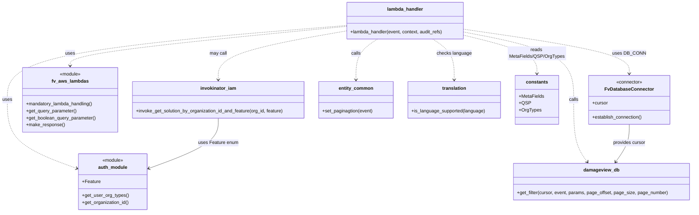

# Diagram: entity_core/entity_service/entity_service/damageview/filter/get_filters.py


> Auto-generated by Obscura crawlers

## Diagram 1

```mermaid
graph TD
Start([Start]) --> GetAuth[Get org_type & org_id via fv.aws.lambdas.auth]
Start --> GetParams[Get query params: filter_type, query, locale via fv.aws.lambdas.get_query_parameter]
GetParams --> LangCheck{translation.is_language_supported(language)?}
LangCheck -- no --> SetEn[language = "en"]
LangCheck -- yes --> UseLocale[use locale.lower()]
GetAuth --> BuildParams[Build params dict {"org_type","org_id","filter_type","everything","language"}]
UseLocale --> BuildParams
SetEn --> BuildParams
BuildParams --> DBConn[DB_CONN.establish_connection()]
DBConn --> Cursor[Get cursor from DB_CONN]
Cursor --> Pagination[entity_service.common.entity.set_paginagtion(event) -> page_offset,page_number,page_size]
Pagination --> CheckOrgType{OrgTypes.SHIPPER in org_type?}
CheckOrgType -- yes --> InvokeSol[invoke_get_solution_by_organization_id_and_feature(org_id, Feature.FINISHED_VEHICLE)]
InvokeSol --> AddSolution[params["solution_id"] = solution_id]
CheckOrgType -- no --> SkipSolution[skip solution_id]
AddSolution --> IncludeAssignee
SkipSolution --> IncludeAssignee
IncludeAssignee[params["include_assignee"] = get_boolean_query_parameter(...)] --> GetFilter[entity_service.db.damageview.get_filter(cursor,event,params,page_offset,page_size,page_number) -> (filter, full_count)]
GetFilter --> CheckFullCount{full_count is not None?}
CheckFullCount -- yes --> BuildMeta[Build response with "meta" (TOTAL_PAGES,CURRENT_PAGE,TOTAL_COUNT) and "data"]
CheckFullCount -- no --> BuildData[Build response with "data" only]
BuildMeta --> MakeResponse[fv.aws.lambdas.make_response(response, 200)]
BuildData --> MakeResponse
MakeResponse --> End([Return response])
```

> SVG rendering failed for this diagram.

## Diagram 2



### SVG

<svg id="container" width="2368.197265625" xmlns="http://www.w3.org/2000/svg" class="classDiagram" height="728" viewBox="0 0 2368.197265625 728" role="graphics-document document" aria-roledescription="class"><style>#container{font-family:"trebuchet ms",verdana,arial,sans-serif;font-size:16px;fill:#333;}@keyframes edge-animation-frame{from{stroke-dashoffset:0;}}@keyframes dash{to{stroke-dashoffset:0;}}#container .edge-animation-slow{stroke-dasharray:9,5!important;stroke-dashoffset:900;animation:dash 50s linear infinite;stroke-linecap:round;}#container .edge-animation-fast{stroke-dasharray:9,5!important;stroke-dashoffset:900;animation:dash 20s linear infinite;stroke-linecap:round;}#container .error-icon{fill:#552222;}#container .error-text{fill:#552222;stroke:#552222;}#container .edge-thickness-normal{stroke-width:1px;}#container .edge-thickness-thick{stroke-width:3.5px;}#container .edge-pattern-solid{stroke-dasharray:0;}#container .edge-thickness-invisible{stroke-width:0;fill:none;}#container .edge-pattern-dashed{stroke-dasharray:3;}#container .edge-pattern-dotted{stroke-dasharray:2;}#container .marker{fill:#333333;stroke:#333333;}#container .marker.cross{stroke:#333333;}#container svg{font-family:"trebuchet ms",verdana,arial,sans-serif;font-size:16px;}#container p{margin:0;}#container g.classGroup text{fill:#9370DB;stroke:none;font-family:"trebuchet ms",verdana,arial,sans-serif;font-size:10px;}#container g.classGroup text .title{font-weight:bolder;}#container .nodeLabel,#container .edgeLabel{color:#131300;}#container .edgeLabel .label rect{fill:#ECECFF;}#container .label text{fill:#131300;}#container .labelBkg{background:#ECECFF;}#container .edgeLabel .label span{background:#ECECFF;}#container .classTitle{font-weight:bolder;}#container .node rect,#container .node circle,#container .node ellipse,#container .node polygon,#container .node path{fill:#ECECFF;stroke:#9370DB;stroke-width:1px;}#container .divider{stroke:#9370DB;stroke-width:1;}#container g.clickable{cursor:pointer;}#container g.classGroup rect{fill:#ECECFF;stroke:#9370DB;}#container g.classGroup line{stroke:#9370DB;stroke-width:1;}#container .classLabel .box{stroke:none;stroke-width:0;fill:#ECECFF;opacity:0.5;}#container .classLabel .label{fill:#9370DB;font-size:10px;}#container .relation{stroke:#333333;stroke-width:1;fill:none;}#container .dashed-line{stroke-dasharray:3;}#container .dotted-line{stroke-dasharray:1 2;}#container #compositionStart,#container .composition{fill:#333333!important;stroke:#333333!important;stroke-width:1;}#container #compositionEnd,#container .composition{fill:#333333!important;stroke:#333333!important;stroke-width:1;}#container #dependencyStart,#container .dependency{fill:#333333!important;stroke:#333333!important;stroke-width:1;}#container #dependencyStart,#container .dependency{fill:#333333!important;stroke:#333333!important;stroke-width:1;}#container #extensionStart,#container .extension{fill:transparent!important;stroke:#333333!important;stroke-width:1;}#container #extensionEnd,#container .extension{fill:transparent!important;stroke:#333333!important;stroke-width:1;}#container #aggregationStart,#container .aggregation{fill:transparent!important;stroke:#333333!important;stroke-width:1;}#container #aggregationEnd,#container .aggregation{fill:transparent!important;stroke:#333333!important;stroke-width:1;}#container #lollipopStart,#container .lollipop{fill:#ECECFF!important;stroke:#333333!important;stroke-width:1;}#container #lollipopEnd,#container .lollipop{fill:#ECECFF!important;stroke:#333333!important;stroke-width:1;}#container .edgeTerminals{font-size:11px;line-height:initial;}#container .classTitleText{text-anchor:middle;font-size:18px;fill:#333;}#container .label-icon{display:inline-block;height:1em;overflow:visible;vertical-align:-0.125em;}#container .node .label-icon path{fill:currentColor;stroke:revert;stroke-width:revert;}#container :root{--mermaid-font-family:"trebuchet ms",verdana,arial,sans-serif;}</style><g><defs><marker id="container_class-aggregationStart" class="marker aggregation class" refX="18" refY="7" markerWidth="190" markerHeight="240" orient="auto"><path d="M 18,7 L9,13 L1,7 L9,1 Z"></path></marker></defs><defs><marker id="container_class-aggregationEnd" class="marker aggregation class" refX="1" refY="7" markerWidth="20" markerHeight="28" orient="auto"><path d="M 18,7 L9,13 L1,7 L9,1 Z"></path></marker></defs><defs><marker id="container_class-extensionStart" class="marker extension class" refX="18" refY="7" markerWidth="190" markerHeight="240" orient="auto"><path d="M 1,7 L18,13 V 1 Z"></path></marker></defs><defs><marker id="container_class-extensionEnd" class="marker extension class" refX="1" refY="7" markerWidth="20" markerHeight="28" orient="auto"><path d="M 1,1 V 13 L18,7 Z"></path></marker></defs><defs><marker id="container_class-compositionStart" class="marker composition class" refX="18" refY="7" markerWidth="190" markerHeight="240" orient="auto"><path d="M 18,7 L9,13 L1,7 L9,1 Z"></path></marker></defs><defs><marker id="container_class-compositionEnd" class="marker composition class" refX="1" refY="7" markerWidth="20" markerHeight="28" orient="auto"><path d="M 18,7 L9,13 L1,7 L9,1 Z"></path></marker></defs><defs><marker id="container_class-dependencyStart" class="marker dependency class" refX="6" refY="7" markerWidth="190" markerHeight="240" orient="auto"><path d="M 5,7 L9,13 L1,7 L9,1 Z"></path></marker></defs><defs><marker id="container_class-dependencyEnd" class="marker dependency class" refX="13" refY="7" markerWidth="20" markerHeight="28" orient="auto"><path d="M 18,7 L9,13 L14,7 L9,1 Z"></path></marker></defs><defs><marker id="container_class-lollipopStart" class="marker lollipop class" refX="13" refY="7" markerWidth="190" markerHeight="240" orient="auto"><circle stroke="black" fill="transparent" cx="7" cy="7" r="6"></circle></marker></defs><defs><marker id="container_class-lollipopEnd" class="marker lollipop class" refX="1" refY="7" markerWidth="190" markerHeight="240" orient="auto"><circle stroke="black" fill="transparent" cx="7" cy="7" r="6"></circle></marker></defs><g class="root"><g class="clusters"></g><g class="edgePaths"><path d="M1189.816,90.687L1031.3,106.072C872.784,121.458,555.751,152.229,397.235,174.781C238.719,197.333,238.719,211.667,238.719,218.833L238.719,226" id="id_lambda_handler_fv_aws_lambdas_1" class="edge-thickness-normal edge-pattern-dashed relation" style=";;;" data-edge="true" data-et="edge" data-id="id_lambda_handler_fv_aws_lambdas_1" data-points="W3sieCI6MTE4OS44MTY0MDYyNSwieSI6OTAuNjg2ODAzOTI0MDkwOTF9LHsieCI6MjM4LjcxODc1LCJ5IjoxODN9LHsieCI6MjM4LjcxODc1LCJ5IjoyMzJ9XQ==" marker-end="url(#container_class-dependencyEnd)"></path><path d="M1189.816,87.604L995.596,103.504C801.375,119.403,412.934,151.201,218.713,193.767C24.492,236.333,24.492,289.667,24.492,341C24.492,392.333,24.492,441.667,64.44,480.996C104.388,520.326,184.284,549.651,224.232,564.314L264.18,578.977" id="id_lambda_handler_auth_module_2" class="edge-thickness-normal edge-pattern-dashed relation" style=";;;" data-edge="true" data-et="edge" data-id="id_lambda_handler_auth_module_2" data-points="W3sieCI6MTE4OS44MTY0MDYyNSwieSI6ODcuNjA0MjM0NzEzNjg4NTh9LHsieCI6MjQuNDkyMTg3NSwieSI6MTgzfSx7IngiOjI0LjQ5MjE4NzUsInkiOjM0M30seyJ4IjoyNC40OTIxODc1LCJ5Ijo0OTF9LHsieCI6MjY5LjgxMjUsInkiOjU4MS4wNDQwNDgyMDkzOTYxfV0=" marker-end="url(#container_class-dependencyEnd)"></path><path d="M1595.48,100.777L1688.827,114.481C1782.173,128.185,1968.866,155.592,2062.212,180.963C2155.559,206.333,2155.559,229.667,2155.559,241.333L2155.559,253" id="id_lambda_handler_FvDatabaseConnector_3" class="edge-thickness-normal edge-pattern-dashed relation" style=";;;" data-edge="true" data-et="edge" data-id="id_lambda_handler_FvDatabaseConnector_3" data-points="W3sieCI6MTU5NS40ODA0Njg3NSwieSI6MTAwLjc3NzAxNTQzNzM5Mjc5fSx7IngiOjIxNTUuNTU4NTkzNzUsInkiOjE4M30seyJ4IjoyMTU1LjU1ODU5Mzc1LCJ5IjoyNTl9XQ==" marker-end="url(#container_class-dependencyEnd)"></path><path d="M1298.153,134L1285.903,142.167C1273.654,150.333,1249.155,166.667,1236.906,190C1224.656,213.333,1224.656,243.667,1224.656,258.833L1224.656,274" id="id_lambda_handler_entity_common_4" class="edge-thickness-normal edge-pattern-dashed relation" style=";;;" data-edge="true" data-et="edge" data-id="id_lambda_handler_entity_common_4" data-points="W3sieCI6MTI5OC4xNTI4MzIwMzEyNSwieSI6MTM0fSx7IngiOjEyMjQuNjU2MjUsInkiOjE4M30seyJ4IjoxMjI0LjY1NjI1LCJ5IjoyODB9XQ==" marker-end="url(#container_class-dependencyEnd)"></path><path d="M1595.48,110.634L1657.205,122.695C1718.93,134.756,1842.379,158.878,1904.104,197.606C1965.828,236.333,1965.828,289.667,1965.828,341C1965.828,392.333,1965.828,441.667,1973.569,477.186C1981.31,512.705,1996.791,534.41,2004.532,545.263L2012.273,556.115" id="id_lambda_handler_damageview_db_5" class="edge-thickness-normal edge-pattern-dashed relation" style=";;;" data-edge="true" data-et="edge" data-id="id_lambda_handler_damageview_db_5" data-points="W3sieCI6MTU5NS40ODA0Njg3NSwieSI6MTEwLjYzMzYyMjc0NTkyMTJ9LHsieCI6MTk2NS44MjgxMjUsInkiOjE4M30seyJ4IjoxOTY1LjgyODEyNSwieSI6MzQzfSx7IngiOjE5NjUuODI4MTI1LCJ5Ijo0OTF9LHsieCI6MjAxNS43NTcxOTU3MjM2ODQyLCJ5Ijo1NjF9XQ==" marker-end="url(#container_class-dependencyEnd)"></path><path d="M1189.816,106.305L1116.38,119.088C1042.943,131.87,896.069,157.435,822.632,185.384C749.195,213.333,749.195,243.667,749.195,258.833L749.195,274" id="id_lambda_handler_invokinator_iam_6" class="edge-thickness-normal edge-pattern-dashed relation" style=";;;" data-edge="true" data-et="edge" data-id="id_lambda_handler_invokinator_iam_6" data-points="W3sieCI6MTE4OS44MTY0MDYyNSwieSI6MTA2LjMwNTExNjQzNzE5MTkxfSx7IngiOjc0OS4xOTUzMTI1LCJ5IjoxODN9LHsieCI6NzQ5LjE5NTMxMjUsInkiOjI4MH1d" marker-end="url(#container_class-dependencyEnd)"></path><path d="M1487.144,134L1499.393,142.167C1511.643,150.333,1536.142,166.667,1548.391,190C1560.641,213.333,1560.641,243.667,1560.641,258.833L1560.641,274" id="id_lambda_handler_translation_7" class="edge-thickness-normal edge-pattern-dashed relation" style=";;;" data-edge="true" data-et="edge" data-id="id_lambda_handler_translation_7" data-points="W3sieCI6MTQ4Ny4xNDQwNDI5Njg3NSwieSI6MTM0fSx7IngiOjE1NjAuNjQwNjI1LCJ5IjoxODN9LHsieCI6MTU2MC42NDA2MjUsInkiOjI4MH1d" marker-end="url(#container_class-dependencyEnd)"></path><path d="M1595.48,121.596L1636.508,131.83C1677.535,142.064,1759.59,162.532,1800.617,184.433C1841.645,206.333,1841.645,229.667,1841.645,241.333L1841.645,253" id="id_lambda_handler_constants_8" class="edge-thickness-normal edge-pattern-dashed relation" style=";;;" data-edge="true" data-et="edge" data-id="id_lambda_handler_constants_8" data-points="W3sieCI6MTU5NS40ODA0Njg3NSwieSI6MTIxLjU5NTUxMjU1ODM5ODUxfSx7IngiOjE4NDEuNjQ0NTMxMjUsInkiOjE4M30seyJ4IjoxODQxLjY0NDUzMTI1LCJ5IjoyNTl9XQ==" marker-end="url(#container_class-dependencyEnd)"></path><path d="M2155.559,427L2155.559,437.667C2155.559,448.333,2155.559,469.667,2147.818,491.186C2140.077,512.705,2124.595,534.41,2116.854,545.263L2109.114,556.115" id="id_FvDatabaseConnector_damageview_db_9" class="edge-thickness-normal edge-pattern-solid relation" style=";;;" data-edge="true" data-et="edge" data-id="id_FvDatabaseConnector_damageview_db_9" data-points="W3sieCI6MjE1NS41NTg1OTM3NSwieSI6NDI3fSx7IngiOjIxNTUuNTU4NTkzNzUsInkiOjQ5MX0seyJ4IjoyMTA1LjYyOTUyMzAyNjMxNiwieSI6NTYxfV0=" marker-end="url(#container_class-dependencyEnd)"></path><path d="M749.195,406L749.195,420.167C749.195,434.333,749.195,462.667,709.247,491.496C669.299,520.326,589.403,549.651,549.456,564.314L509.508,578.977" id="id_invokinator_iam_auth_module_10" class="edge-thickness-normal edge-pattern-solid relation" style=";;;" data-edge="true" data-et="edge" data-id="id_invokinator_iam_auth_module_10" data-points="W3sieCI6NzQ5LjE5NTMxMjUsInkiOjQwNn0seyJ4Ijo3NDkuMTk1MzEyNSwieSI6NDkxfSx7IngiOjUwMy44NzUsInkiOjU4MS4wNDQwNDgyMDkzOTYxfV0=" marker-end="url(#container_class-dependencyEnd)"></path></g><g class="edgeLabels"><g class="edgeLabel" transform="translate(238.71875, 183)"><g class="label" data-id="id_lambda_handler_fv_aws_lambdas_1" transform="translate(-16.4921875, -12)"><foreignObject width="32.984375" height="24"><div xmlns="http://www.w3.org/1999/xhtml" class="labelBkg" style="display: table-cell; white-space: nowrap; line-height: 1.5; max-width: 200px; text-align: center;"><span class="edgeLabel"><p>uses</p></span></div></foreignObject></g></g><g class="edgeLabel" transform="translate(24.4921875, 343)"><g class="label" data-id="id_lambda_handler_auth_module_2" transform="translate(-16.4921875, -12)"><foreignObject width="32.984375" height="24"><div xmlns="http://www.w3.org/1999/xhtml" class="labelBkg" style="display: table-cell; white-space: nowrap; line-height: 1.5; max-width: 200px; text-align: center;"><span class="edgeLabel"><p>uses</p></span></div></foreignObject></g></g><g class="edgeLabel" transform="translate(2155.55859375, 183)"><g class="label" data-id="id_lambda_handler_FvDatabaseConnector_3" transform="translate(-53.09375, -12)"><foreignObject width="106.1875" height="24"><div xmlns="http://www.w3.org/1999/xhtml" class="labelBkg" style="display: table-cell; white-space: nowrap; line-height: 1.5; max-width: 200px; text-align: center;"><span class="edgeLabel"><p>uses DB_CONN</p></span></div></foreignObject></g></g><g class="edgeLabel" transform="translate(1224.65625, 183)"><g class="label" data-id="id_lambda_handler_entity_common_4" transform="translate(-16.4453125, -12)"><foreignObject width="32.890625" height="24"><div xmlns="http://www.w3.org/1999/xhtml" class="labelBkg" style="display: table-cell; white-space: nowrap; line-height: 1.5; max-width: 200px; text-align: center;"><span class="edgeLabel"><p>calls</p></span></div></foreignObject></g></g><g class="edgeLabel" transform="translate(1965.828125, 343)"><g class="label" data-id="id_lambda_handler_damageview_db_5" transform="translate(-16.4453125, -12)"><foreignObject width="32.890625" height="24"><div xmlns="http://www.w3.org/1999/xhtml" class="labelBkg" style="display: table-cell; white-space: nowrap; line-height: 1.5; max-width: 200px; text-align: center;"><span class="edgeLabel"><p>calls</p></span></div></foreignObject></g></g><g class="edgeLabel" transform="translate(749.1953125, 183)"><g class="label" data-id="id_lambda_handler_invokinator_iam_6" transform="translate(-29.8515625, -12)"><foreignObject width="59.703125" height="24"><div xmlns="http://www.w3.org/1999/xhtml" class="labelBkg" style="display: table-cell; white-space: nowrap; line-height: 1.5; max-width: 200px; text-align: center;"><span class="edgeLabel"><p>may call</p></span></div></foreignObject></g></g><g class="edgeLabel" transform="translate(1560.640625, 183)"><g class="label" data-id="id_lambda_handler_translation_7" transform="translate(-59.359375, -12)"><foreignObject width="118.71875" height="24"><div xmlns="http://www.w3.org/1999/xhtml" class="labelBkg" style="display: table-cell; white-space: nowrap; line-height: 1.5; max-width: 200px; text-align: center;"><span class="edgeLabel"><p>checks language</p></span></div></foreignObject></g></g><g class="edgeLabel" transform="translate(1841.64453125, 183)"><g class="label" data-id="id_lambda_handler_constants_8" transform="translate(-100, -24)"><foreignObject width="200" height="48"><div xmlns="http://www.w3.org/1999/xhtml" class="labelBkg" style="display: table; white-space: break-spaces; line-height: 1.5; max-width: 200px; text-align: center; width: 200px;"><span class="edgeLabel"><p>reads MetaFields/QSP/OrgTypes</p></span></div></foreignObject></g></g><g class="edgeLabel" transform="translate(2155.55859375, 491)"><g class="label" data-id="id_FvDatabaseConnector_damageview_db_9" transform="translate(-56.296875, -12)"><foreignObject width="112.59375" height="24"><div xmlns="http://www.w3.org/1999/xhtml" class="labelBkg" style="display: table-cell; white-space: nowrap; line-height: 1.5; max-width: 200px; text-align: center;"><span class="edgeLabel"><p>provides cursor</p></span></div></foreignObject></g></g><g class="edgeLabel" transform="translate(749.1953125, 491)"><g class="label" data-id="id_invokinator_iam_auth_module_10" transform="translate(-68.3203125, -12)"><foreignObject width="136.640625" height="24"><div xmlns="http://www.w3.org/1999/xhtml" class="labelBkg" style="display: table-cell; white-space: nowrap; line-height: 1.5; max-width: 200px; text-align: center;"><span class="edgeLabel"><p>uses Feature enum</p></span></div></foreignObject></g></g></g><g class="nodes"><g class="node default" id="classId-lambda_handler-0" transform="translate(1392.6484375, 71)"><g class="basic label-container"><path d="M-202.83203125 -63 L202.83203125 -63 L202.83203125 63 L-202.83203125 63" stroke="none" stroke-width="0" fill="#ECECFF" style=""></path><path d="M-202.83203125 -63 C-57.02293714609226 -63, 88.78615695781548 -63, 202.83203125 -63 M-202.83203125 -63 C-56.12969654067243 -63, 90.57263816865515 -63, 202.83203125 -63 M202.83203125 -63 C202.83203125 -32.87814998134081, 202.83203125 -2.7562999626816236, 202.83203125 63 M202.83203125 -63 C202.83203125 -19.582712395298906, 202.83203125 23.83457520940219, 202.83203125 63 M202.83203125 63 C43.94847992208287 63, -114.93507140583426 63, -202.83203125 63 M202.83203125 63 C96.87179926621887 63, -9.088432717562256 63, -202.83203125 63 M-202.83203125 63 C-202.83203125 14.580994847425615, -202.83203125 -33.83801030514877, -202.83203125 -63 M-202.83203125 63 C-202.83203125 19.24997653564862, -202.83203125 -24.50004692870276, -202.83203125 -63" stroke="#9370DB" stroke-width="1.3" fill="none" stroke-dasharray="0 0" style=""></path></g><g class="annotation-group text" transform="translate(0, -39)"></g><g class="label-group text" transform="translate(-59.9765625, -39)"><g class="label" style="font-weight: bolder" transform="translate(0,-12)"><foreignObject width="119.953125" height="24"><div xmlns="http://www.w3.org/1999/xhtml" style="display: table-cell; white-space: nowrap; line-height: 1.5; max-width: 170px; text-align: center;"><span class="nodeLabel markdown-node-label" style=""><p>lambda_handler</p></span></div></foreignObject></g></g><g class="members-group text" transform="translate(-190.83203125, 9)"></g><g class="methods-group text" transform="translate(-190.83203125, 39)"><g class="label" style="" transform="translate(0,-12)"><foreignObject width="321.6875" height="24"><div xmlns="http://www.w3.org/1999/xhtml" style="display: table-cell; white-space: nowrap; line-height: 1.5; max-width: 379px; text-align: center;"><span class="nodeLabel markdown-node-label" style=""><p>+lambda_handler(event, context, audit_refs)</p></span></div></foreignObject></g></g><g class="divider" style=""><path d="M-202.83203125 -15 C-44.995077747899444 -15, 112.84187575420111 -15, 202.83203125 -15 M-202.83203125 -15 C-58.59812148475541 -15, 85.63578828048918 -15, 202.83203125 -15" stroke="#9370DB" stroke-width="1.3" fill="none" stroke-dasharray="0 0" style=""></path></g><g class="divider" style=""><path d="M-202.83203125 9 C-71.29897750587241 9, 60.23407623825517 9, 202.83203125 9 M-202.83203125 9 C-92.17630907918064 9, 18.47941309163872 9, 202.83203125 9" stroke="#9370DB" stroke-width="1.3" fill="none" stroke-dasharray="0 0" style=""></path></g></g><g class="node default" id="classId-FvDatabaseConnector-1" transform="translate(2155.55859375, 343)"><g class="basic label-container"><path d="M-138.28515625 -84 L138.28515625 -84 L138.28515625 84 L-138.28515625 84" stroke="none" stroke-width="0" fill="#ECECFF" style=""></path><path d="M-138.28515625 -84 C-58.78690994428929 -84, 20.711336361421417 -84, 138.28515625 -84 M-138.28515625 -84 C-38.54719144491543 -84, 61.190773360169146 -84, 138.28515625 -84 M138.28515625 -84 C138.28515625 -18.376577754647087, 138.28515625 47.246844490705826, 138.28515625 84 M138.28515625 -84 C138.28515625 -33.51470655001629, 138.28515625 16.970586899967415, 138.28515625 84 M138.28515625 84 C76.394749774641 84, 14.504343299281999 84, -138.28515625 84 M138.28515625 84 C39.210935430555054 84, -59.86328538888989 84, -138.28515625 84 M-138.28515625 84 C-138.28515625 48.57962810350982, -138.28515625 13.159256207019638, -138.28515625 -84 M-138.28515625 84 C-138.28515625 45.70721309738961, -138.28515625 7.4144261947792245, -138.28515625 -84" stroke="#9370DB" stroke-width="1.3" fill="none" stroke-dasharray="0 0" style=""></path></g><g class="annotation-group text" transform="translate(-45.3125, -60)"><g class="label" style="" transform="translate(0,-12)"><foreignObject width="90.625" height="24"><div xmlns="http://www.w3.org/1999/xhtml" style="display: table-cell; white-space: nowrap; line-height: 1.5; max-width: 141px; text-align: center;"><span class="nodeLabel markdown-node-label" style=""><p>«connector»</p></span></div></foreignObject></g></g><g class="label-group text" transform="translate(-79.3046875, -36)"><g class="label" style="font-weight: bolder" transform="translate(0,-12)"><foreignObject width="158.609375" height="24"><div xmlns="http://www.w3.org/1999/xhtml" style="display: table-cell; white-space: nowrap; line-height: 1.5; max-width: 207px; text-align: center;"><span class="nodeLabel markdown-node-label" style=""><p>FvDatabaseConnector</p></span></div></foreignObject></g></g><g class="members-group text" transform="translate(-126.28515625, 12)"><g class="label" style="" transform="translate(0,-12)"><foreignObject width="53.71875" height="24"><div xmlns="http://www.w3.org/1999/xhtml" style="display: table-cell; white-space: nowrap; line-height: 1.5; max-width: 112px; text-align: center;"><span class="nodeLabel markdown-node-label" style=""><p>+cursor</p></span></div></foreignObject></g></g><g class="methods-group text" transform="translate(-126.28515625, 60)"><g class="label" style="" transform="translate(0,-12)"><foreignObject width="173.265625" height="24"><div xmlns="http://www.w3.org/1999/xhtml" style="display: table-cell; white-space: nowrap; line-height: 1.5; max-width: 231px; text-align: center;"><span class="nodeLabel markdown-node-label" style=""><p>+establish_connection()</p></span></div></foreignObject></g></g><g class="divider" style=""><path d="M-138.28515625 -12 C-41.91417723845015 -12, 54.4568017730997 -12, 138.28515625 -12 M-138.28515625 -12 C-29.96772880801838 -12, 78.34969863396324 -12, 138.28515625 -12" stroke="#9370DB" stroke-width="1.3" fill="none" stroke-dasharray="0 0" style=""></path></g><g class="divider" style=""><path d="M-138.28515625 36 C-35.08653381409225 36, 68.1120886218155 36, 138.28515625 36 M-138.28515625 36 C-71.85373221668908 36, -5.4223081833781634 36, 138.28515625 36" stroke="#9370DB" stroke-width="1.3" fill="none" stroke-dasharray="0 0" style=""></path></g></g><g class="node default" id="classId-fv_aws_lambdas-2" transform="translate(238.71875, 343)"><g class="basic label-container"><path d="M-162.734375 -111 L162.734375 -111 L162.734375 111 L-162.734375 111" stroke="none" stroke-width="0" fill="#ECECFF" style=""></path><path d="M-162.734375 -111 C-67.35552876236744 -111, 28.023317475265117 -111, 162.734375 -111 M-162.734375 -111 C-90.33723365261002 -111, -17.94009230522005 -111, 162.734375 -111 M162.734375 -111 C162.734375 -49.88443861140674, 162.734375 11.231122777186513, 162.734375 111 M162.734375 -111 C162.734375 -55.678720542855956, 162.734375 -0.3574410857119119, 162.734375 111 M162.734375 111 C54.95225201890811 111, -52.829870962183776 111, -162.734375 111 M162.734375 111 C33.903087655607294 111, -94.92819968878541 111, -162.734375 111 M-162.734375 111 C-162.734375 63.5791709153142, -162.734375 16.1583418306284, -162.734375 -111 M-162.734375 111 C-162.734375 52.09210332479782, -162.734375 -6.815793350404363, -162.734375 -111" stroke="#9370DB" stroke-width="1.3" fill="none" stroke-dasharray="0 0" style=""></path></g><g class="annotation-group text" transform="translate(-36.6015625, -87)"><g class="label" style="" transform="translate(0,-12)"><foreignObject width="73.203125" height="24"><div xmlns="http://www.w3.org/1999/xhtml" style="display: table-cell; white-space: nowrap; line-height: 1.5; max-width: 123px; text-align: center;"><span class="nodeLabel markdown-node-label" style=""><p>«module»</p></span></div></foreignObject></g></g><g class="label-group text" transform="translate(-60.0625, -63)"><g class="label" style="font-weight: bolder" transform="translate(0,-12)"><foreignObject width="120.125" height="24"><div xmlns="http://www.w3.org/1999/xhtml" style="display: table-cell; white-space: nowrap; line-height: 1.5; max-width: 168px; text-align: center;"><span class="nodeLabel markdown-node-label" style=""><p>fv_aws_lambdas</p></span></div></foreignObject></g></g><g class="members-group text" transform="translate(-150.734375, -15)"></g><g class="methods-group text" transform="translate(-150.734375, 15)"><g class="label" style="" transform="translate(0,-12)"><foreignObject width="232.078125" height="24"><div xmlns="http://www.w3.org/1999/xhtml" style="display: table-cell; white-space: nowrap; line-height: 1.5; max-width: 289px; text-align: center;"><span class="nodeLabel markdown-node-label" style=""><p>+mandatory_lambda_handling()</p></span></div></foreignObject></g><g class="label" style="" transform="translate(0,12)"><foreignObject width="173.640625" height="24"><div xmlns="http://www.w3.org/1999/xhtml" style="display: table-cell; white-space: nowrap; line-height: 1.5; max-width: 231px; text-align: center;"><span class="nodeLabel markdown-node-label" style=""><p>+get_query_parameter()</p></span></div></foreignObject></g><g class="label" style="" transform="translate(0,36)"><foreignObject width="241.40625" height="24"><div xmlns="http://www.w3.org/1999/xhtml" style="display: table-cell; white-space: nowrap; line-height: 1.5; max-width: 299px; text-align: center;"><span class="nodeLabel markdown-node-label" style=""><p>+get_boolean_query_parameter()</p></span></div></foreignObject></g><g class="label" style="" transform="translate(0,60)"><foreignObject width="131.84375" height="24"><div xmlns="http://www.w3.org/1999/xhtml" style="display: table-cell; white-space: nowrap; line-height: 1.5; max-width: 189px; text-align: center;"><span class="nodeLabel markdown-node-label" style=""><p>+make_response()</p></span></div></foreignObject></g></g><g class="divider" style=""><path d="M-162.734375 -39 C-91.53183941662547 -39, -20.329303833250947 -39, 162.734375 -39 M-162.734375 -39 C-57.86159059801322 -39, 47.011193803973555 -39, 162.734375 -39" stroke="#9370DB" stroke-width="1.3" fill="none" stroke-dasharray="0 0" style=""></path></g><g class="divider" style=""><path d="M-162.734375 -15 C-59.84501571900664 -15, 43.04434356198672 -15, 162.734375 -15 M-162.734375 -15 C-73.72421872889295 -15, 15.2859375422141 -15, 162.734375 -15" stroke="#9370DB" stroke-width="1.3" fill="none" stroke-dasharray="0 0" style=""></path></g></g><g class="node default" id="classId-auth_module-3" transform="translate(386.84375, 624)"><g class="basic label-container"><path d="M-117.03125 -96 L117.03125 -96 L117.03125 96 L-117.03125 96" stroke="none" stroke-width="0" fill="#ECECFF" style=""></path><path d="M-117.03125 -96 C-32.49804143977316 -96, 52.03516712045368 -96, 117.03125 -96 M-117.03125 -96 C-56.58251857662027 -96, 3.866212846759467 -96, 117.03125 -96 M117.03125 -96 C117.03125 -33.30042760364922, 117.03125 29.399144792701563, 117.03125 96 M117.03125 -96 C117.03125 -50.89374028958848, 117.03125 -5.7874805791769575, 117.03125 96 M117.03125 96 C66.67667509618529 96, 16.322100192370584 96, -117.03125 96 M117.03125 96 C65.23164460215989 96, 13.432039204319793 96, -117.03125 96 M-117.03125 96 C-117.03125 32.39941616514817, -117.03125 -31.201167669703665, -117.03125 -96 M-117.03125 96 C-117.03125 49.96197169217739, -117.03125 3.9239433843547857, -117.03125 -96" stroke="#9370DB" stroke-width="1.3" fill="none" stroke-dasharray="0 0" style=""></path></g><g class="annotation-group text" transform="translate(-36.6015625, -72)"><g class="label" style="" transform="translate(0,-12)"><foreignObject width="73.203125" height="24"><div xmlns="http://www.w3.org/1999/xhtml" style="display: table-cell; white-space: nowrap; line-height: 1.5; max-width: 123px; text-align: center;"><span class="nodeLabel markdown-node-label" style=""><p>«module»</p></span></div></foreignObject></g></g><g class="label-group text" transform="translate(-48.390625, -48)"><g class="label" style="font-weight: bolder" transform="translate(0,-12)"><foreignObject width="96.78125" height="24"><div xmlns="http://www.w3.org/1999/xhtml" style="display: table-cell; white-space: nowrap; line-height: 1.5; max-width: 147px; text-align: center;"><span class="nodeLabel markdown-node-label" style=""><p>auth_module</p></span></div></foreignObject></g></g><g class="members-group text" transform="translate(-105.03125, 0)"><g class="label" style="" transform="translate(0,-12)"><foreignObject width="62.0625" height="24"><div xmlns="http://www.w3.org/1999/xhtml" style="display: table-cell; white-space: nowrap; line-height: 1.5; max-width: 119px; text-align: center;"><span class="nodeLabel markdown-node-label" style=""><p>+Feature</p></span></div></foreignObject></g></g><g class="methods-group text" transform="translate(-105.03125, 48)"><g class="label" style="" transform="translate(0,-12)"><foreignObject width="158.25" height="24"><div xmlns="http://www.w3.org/1999/xhtml" style="display: table-cell; white-space: nowrap; line-height: 1.5; max-width: 216px; text-align: center;"><span class="nodeLabel markdown-node-label" style=""><p>+get_user_org_types()</p></span></div></foreignObject></g><g class="label" style="" transform="translate(0,12)"><foreignObject width="161.671875" height="24"><div xmlns="http://www.w3.org/1999/xhtml" style="display: table-cell; white-space: nowrap; line-height: 1.5; max-width: 219px; text-align: center;"><span class="nodeLabel markdown-node-label" style=""><p>+get_organization_id()</p></span></div></foreignObject></g></g><g class="divider" style=""><path d="M-117.03125 -24 C-68.56898197318313 -24, -20.10671394636627 -24, 117.03125 -24 M-117.03125 -24 C-53.89276901472922 -24, 9.245711970541564 -24, 117.03125 -24" stroke="#9370DB" stroke-width="1.3" fill="none" stroke-dasharray="0 0" style=""></path></g><g class="divider" style=""><path d="M-117.03125 24 C-56.62831894443261 24, 3.774612111134786 24, 117.03125 24 M-117.03125 24 C-38.67151673121151 24, 39.68821653757698 24, 117.03125 24" stroke="#9370DB" stroke-width="1.3" fill="none" stroke-dasharray="0 0" style=""></path></g></g><g class="node default" id="classId-invokinator_iam-4" transform="translate(749.1953125, 343)"><g class="basic label-container"><path d="M-297.7421875 -63 L297.7421875 -63 L297.7421875 63 L-297.7421875 63" stroke="none" stroke-width="0" fill="#ECECFF" style=""></path><path d="M-297.7421875 -63 C-66.34862309488051 -63, 165.04494131023898 -63, 297.7421875 -63 M-297.7421875 -63 C-148.05522311436195 -63, 1.6317412712760984 -63, 297.7421875 -63 M297.7421875 -63 C297.7421875 -19.255418570014328, 297.7421875 24.489162859971344, 297.7421875 63 M297.7421875 -63 C297.7421875 -37.68095837434534, 297.7421875 -12.361916748690682, 297.7421875 63 M297.7421875 63 C102.30517421396635 63, -93.1318390720673 63, -297.7421875 63 M297.7421875 63 C144.33147804023358 63, -9.079231419532846 63, -297.7421875 63 M-297.7421875 63 C-297.7421875 33.94700892556889, -297.7421875 4.894017851137775, -297.7421875 -63 M-297.7421875 63 C-297.7421875 19.531559612872726, -297.7421875 -23.936880774254547, -297.7421875 -63" stroke="#9370DB" stroke-width="1.3" fill="none" stroke-dasharray="0 0" style=""></path></g><g class="annotation-group text" transform="translate(0, -39)"></g><g class="label-group text" transform="translate(-58.953125, -39)"><g class="label" style="font-weight: bolder" transform="translate(0,-12)"><foreignObject width="117.90625" height="24"><div xmlns="http://www.w3.org/1999/xhtml" style="display: table-cell; white-space: nowrap; line-height: 1.5; max-width: 167px; text-align: center;"><span class="nodeLabel markdown-node-label" style=""><p>invokinator_iam</p></span></div></foreignObject></g></g><g class="members-group text" transform="translate(-285.7421875, 9)"></g><g class="methods-group text" transform="translate(-285.7421875, 39)"><g class="label" style="" transform="translate(0,-12)"><foreignObject width="512.53125" height="24"><div xmlns="http://www.w3.org/1999/xhtml" style="display: table-cell; white-space: nowrap; line-height: 1.5; max-width: 570px; text-align: center;"><span class="nodeLabel markdown-node-label" style=""><p>+invoke_get_solution_by_organization_id_and_feature(org_id, feature)</p></span></div></foreignObject></g></g><g class="divider" style=""><path d="M-297.7421875 -15 C-90.57477174630523 -15, 116.59264400738954 -15, 297.7421875 -15 M-297.7421875 -15 C-77.79856155852096 -15, 142.14506438295808 -15, 297.7421875 -15" stroke="#9370DB" stroke-width="1.3" fill="none" stroke-dasharray="0 0" style=""></path></g><g class="divider" style=""><path d="M-297.7421875 9 C-148.8385849432663 9, 0.06501761346737567 9, 297.7421875 9 M-297.7421875 9 C-130.16093607769983 9, 37.42031534460034 9, 297.7421875 9" stroke="#9370DB" stroke-width="1.3" fill="none" stroke-dasharray="0 0" style=""></path></g></g><g class="node default" id="classId-damageview_db-5" transform="translate(2060.693359375, 624)"><g class="basic label-container"><path d="M-299.50390625 -63 L299.50390625 -63 L299.50390625 63 L-299.50390625 63" stroke="none" stroke-width="0" fill="#ECECFF" style=""></path><path d="M-299.50390625 -63 C-122.19604665141028 -63, 55.11181294717943 -63, 299.50390625 -63 M-299.50390625 -63 C-170.86399134830856 -63, -42.22407644661712 -63, 299.50390625 -63 M299.50390625 -63 C299.50390625 -12.637908279272793, 299.50390625 37.724183441454414, 299.50390625 63 M299.50390625 -63 C299.50390625 -25.061687847473678, 299.50390625 12.876624305052644, 299.50390625 63 M299.50390625 63 C63.119672437015765 63, -173.26456137596847 63, -299.50390625 63 M299.50390625 63 C136.6342367512945 63, -26.235432747410982 63, -299.50390625 63 M-299.50390625 63 C-299.50390625 25.39965669402659, -299.50390625 -12.200686611946821, -299.50390625 -63 M-299.50390625 63 C-299.50390625 32.440787299548944, -299.50390625 1.8815745990978954, -299.50390625 -63" stroke="#9370DB" stroke-width="1.3" fill="none" stroke-dasharray="0 0" style=""></path></g><g class="annotation-group text" transform="translate(0, -39)"></g><g class="label-group text" transform="translate(-59.0234375, -39)"><g class="label" style="font-weight: bolder" transform="translate(0,-12)"><foreignObject width="118.046875" height="24"><div xmlns="http://www.w3.org/1999/xhtml" style="display: table-cell; white-space: nowrap; line-height: 1.5; max-width: 167px; text-align: center;"><span class="nodeLabel markdown-node-label" style=""><p>damageview_db</p></span></div></foreignObject></g></g><g class="members-group text" transform="translate(-287.50390625, 9)"></g><g class="methods-group text" transform="translate(-287.50390625, 39)"><g class="label" style="" transform="translate(0,-12)"><foreignObject width="515.984375" height="24"><div xmlns="http://www.w3.org/1999/xhtml" style="display: table-cell; white-space: nowrap; line-height: 1.5; max-width: 573px; text-align: center;"><span class="nodeLabel markdown-node-label" style=""><p>+get_filter(cursor, event, params, page_offset, page_size, page_number)</p></span></div></foreignObject></g></g><g class="divider" style=""><path d="M-299.50390625 -15 C-164.272046454672 -15, -29.040186659343988 -15, 299.50390625 -15 M-299.50390625 -15 C-171.59974967105111 -15, -43.69559309210223 -15, 299.50390625 -15" stroke="#9370DB" stroke-width="1.3" fill="none" stroke-dasharray="0 0" style=""></path></g><g class="divider" style=""><path d="M-299.50390625 9 C-72.1737346317584 9, 155.1564369864832 9, 299.50390625 9 M-299.50390625 9 C-178.33500931251024 9, -57.16611237502045 9, 299.50390625 9" stroke="#9370DB" stroke-width="1.3" fill="none" stroke-dasharray="0 0" style=""></path></g></g><g class="node default" id="classId-entity_common-6" transform="translate(1224.65625, 343)"><g class="basic label-container"><path d="M-127.71875 -63 L127.71875 -63 L127.71875 63 L-127.71875 63" stroke="none" stroke-width="0" fill="#ECECFF" style=""></path><path d="M-127.71875 -63 C-47.383968038393135 -63, 32.95081392321373 -63, 127.71875 -63 M-127.71875 -63 C-27.189496928068095 -63, 73.33975614386381 -63, 127.71875 -63 M127.71875 -63 C127.71875 -23.13179132867564, 127.71875 16.73641734264872, 127.71875 63 M127.71875 -63 C127.71875 -30.8270360348559, 127.71875 1.3459279302881981, 127.71875 63 M127.71875 63 C63.30237012897841 63, -1.11400974204318 63, -127.71875 63 M127.71875 63 C44.621599297241715 63, -38.47555140551657 63, -127.71875 63 M-127.71875 63 C-127.71875 18.719976898031007, -127.71875 -25.560046203937986, -127.71875 -63 M-127.71875 63 C-127.71875 14.395899857444839, -127.71875 -34.20820028511032, -127.71875 -63" stroke="#9370DB" stroke-width="1.3" fill="none" stroke-dasharray="0 0" style=""></path></g><g class="annotation-group text" transform="translate(0, -39)"></g><g class="label-group text" transform="translate(-56.484375, -39)"><g class="label" style="font-weight: bolder" transform="translate(0,-12)"><foreignObject width="112.96875" height="24"><div xmlns="http://www.w3.org/1999/xhtml" style="display: table-cell; white-space: nowrap; line-height: 1.5; max-width: 162px; text-align: center;"><span class="nodeLabel markdown-node-label" style=""><p>entity_common</p></span></div></foreignObject></g></g><g class="members-group text" transform="translate(-115.71875, 9)"></g><g class="methods-group text" transform="translate(-115.71875, 39)"><g class="label" style="" transform="translate(0,-12)"><foreignObject width="174.953125" height="24"><div xmlns="http://www.w3.org/1999/xhtml" style="display: table-cell; white-space: nowrap; line-height: 1.5; max-width: 232px; text-align: center;"><span class="nodeLabel markdown-node-label" style=""><p>+set_paginagtion(event)</p></span></div></foreignObject></g></g><g class="divider" style=""><path d="M-127.71875 -15 C-41.08914411843509 -15, 45.54046176312983 -15, 127.71875 -15 M-127.71875 -15 C-52.12006576941086 -15, 23.478618461178286 -15, 127.71875 -15" stroke="#9370DB" stroke-width="1.3" fill="none" stroke-dasharray="0 0" style=""></path></g><g class="divider" style=""><path d="M-127.71875 9 C-72.20268832492454 9, -16.686626649849075 9, 127.71875 9 M-127.71875 9 C-33.65871413247105 9, 60.401321735057905 9, 127.71875 9" stroke="#9370DB" stroke-width="1.3" fill="none" stroke-dasharray="0 0" style=""></path></g></g><g class="node default" id="classId-translation-7" transform="translate(1560.640625, 343)"><g class="basic label-container"><path d="M-158.265625 -63 L158.265625 -63 L158.265625 63 L-158.265625 63" stroke="none" stroke-width="0" fill="#ECECFF" style=""></path><path d="M-158.265625 -63 C-61.32046565549463 -63, 35.62469368901074 -63, 158.265625 -63 M-158.265625 -63 C-43.5671333463238 -63, 71.1313583073524 -63, 158.265625 -63 M158.265625 -63 C158.265625 -24.29730314876165, 158.265625 14.405393702476701, 158.265625 63 M158.265625 -63 C158.265625 -15.661754959166565, 158.265625 31.67649008166687, 158.265625 63 M158.265625 63 C68.85843104948879 63, -20.548762901022428 63, -158.265625 63 M158.265625 63 C63.9581446926166 63, -30.3493356147668 63, -158.265625 63 M-158.265625 63 C-158.265625 29.065412778284085, -158.265625 -4.869174443431831, -158.265625 -63 M-158.265625 63 C-158.265625 26.661226475123385, -158.265625 -9.67754704975323, -158.265625 -63" stroke="#9370DB" stroke-width="1.3" fill="none" stroke-dasharray="0 0" style=""></path></g><g class="annotation-group text" transform="translate(0, -39)"></g><g class="label-group text" transform="translate(-40.234375, -39)"><g class="label" style="font-weight: bolder" transform="translate(0,-12)"><foreignObject width="80.46875" height="24"><div xmlns="http://www.w3.org/1999/xhtml" style="display: table-cell; white-space: nowrap; line-height: 1.5; max-width: 129px; text-align: center;"><span class="nodeLabel markdown-node-label" style=""><p>translation</p></span></div></foreignObject></g></g><g class="members-group text" transform="translate(-146.265625, 9)"></g><g class="methods-group text" transform="translate(-146.265625, 39)"><g class="label" style="" transform="translate(0,-12)"><foreignObject width="252.296875" height="24"><div xmlns="http://www.w3.org/1999/xhtml" style="display: table-cell; white-space: nowrap; line-height: 1.5; max-width: 310px; text-align: center;"><span class="nodeLabel markdown-node-label" style=""><p>+is_language_supported(language)</p></span></div></foreignObject></g></g><g class="divider" style=""><path d="M-158.265625 -15 C-82.19899022594059 -15, -6.132355451881182 -15, 158.265625 -15 M-158.265625 -15 C-47.56366856691109 -15, 63.13828786617782 -15, 158.265625 -15" stroke="#9370DB" stroke-width="1.3" fill="none" stroke-dasharray="0 0" style=""></path></g><g class="divider" style=""><path d="M-158.265625 9 C-92.74121664382838 9, -27.21680828765676 9, 158.265625 9 M-158.265625 9 C-69.14002133680502 9, 19.98558232638996 9, 158.265625 9" stroke="#9370DB" stroke-width="1.3" fill="none" stroke-dasharray="0 0" style=""></path></g></g><g class="node default" id="classId-constants-8" transform="translate(1841.64453125, 343)"><g class="basic label-container"><path d="M-72.73828125 -84 L72.73828125 -84 L72.73828125 84 L-72.73828125 84" stroke="none" stroke-width="0" fill="#ECECFF" style=""></path><path d="M-72.73828125 -84 C-15.654646750802144 -84, 41.42898774839571 -84, 72.73828125 -84 M-72.73828125 -84 C-21.758544190892707 -84, 29.221192868214587 -84, 72.73828125 -84 M72.73828125 -84 C72.73828125 -40.957974701632985, 72.73828125 2.0840505967340306, 72.73828125 84 M72.73828125 -84 C72.73828125 -22.81724007651711, 72.73828125 38.36551984696578, 72.73828125 84 M72.73828125 84 C20.316561456226488 84, -32.105158337547024 84, -72.73828125 84 M72.73828125 84 C24.354651543040944 84, -24.02897816391811 84, -72.73828125 84 M-72.73828125 84 C-72.73828125 32.51035021958095, -72.73828125 -18.9792995608381, -72.73828125 -84 M-72.73828125 84 C-72.73828125 39.74126521862552, -72.73828125 -4.517469562748957, -72.73828125 -84" stroke="#9370DB" stroke-width="1.3" fill="none" stroke-dasharray="0 0" style=""></path></g><g class="annotation-group text" transform="translate(0, -60)"></g><g class="label-group text" transform="translate(-35.7734375, -60)"><g class="label" style="font-weight: bolder" transform="translate(0,-12)"><foreignObject width="71.546875" height="24"><div xmlns="http://www.w3.org/1999/xhtml" style="display: table-cell; white-space: nowrap; line-height: 1.5; max-width: 121px; text-align: center;"><span class="nodeLabel markdown-node-label" style=""><p>constants</p></span></div></foreignObject></g></g><g class="members-group text" transform="translate(-60.73828125, -12)"><g class="label" style="" transform="translate(0,-12)"><foreignObject width="85.703125" height="24"><div xmlns="http://www.w3.org/1999/xhtml" style="display: table-cell; white-space: nowrap; line-height: 1.5; max-width: 143px; text-align: center;"><span class="nodeLabel markdown-node-label" style=""><p>+MetaFields</p></span></div></foreignObject></g><g class="label" style="" transform="translate(0,12)"><foreignObject width="37.0625" height="24"><div xmlns="http://www.w3.org/1999/xhtml" style="display: table-cell; white-space: nowrap; line-height: 1.5; max-width: 94px; text-align: center;"><span class="nodeLabel markdown-node-label" style=""><p>+QSP</p></span></div></foreignObject></g><g class="label" style="" transform="translate(0,36)"><foreignObject width="74.515625" height="24"><div xmlns="http://www.w3.org/1999/xhtml" style="display: table-cell; white-space: nowrap; line-height: 1.5; max-width: 132px; text-align: center;"><span class="nodeLabel markdown-node-label" style=""><p>+OrgTypes</p></span></div></foreignObject></g></g><g class="methods-group text" transform="translate(-60.73828125, 84)"></g><g class="divider" style=""><path d="M-72.73828125 -36 C-38.637561909695 -36, -4.536842569390004 -36, 72.73828125 -36 M-72.73828125 -36 C-15.571896143331095 -36, 41.59448896333781 -36, 72.73828125 -36" stroke="#9370DB" stroke-width="1.3" fill="none" stroke-dasharray="0 0" style=""></path></g><g class="divider" style=""><path d="M-72.73828125 60 C-43.13249642581857 60, -13.526711601637146 60, 72.73828125 60 M-72.73828125 60 C-16.313261732925426 60, 40.11175778414915 60, 72.73828125 60" stroke="#9370DB" stroke-width="1.3" fill="none" stroke-dasharray="0 0" style=""></path></g></g></g></g></g></svg>
