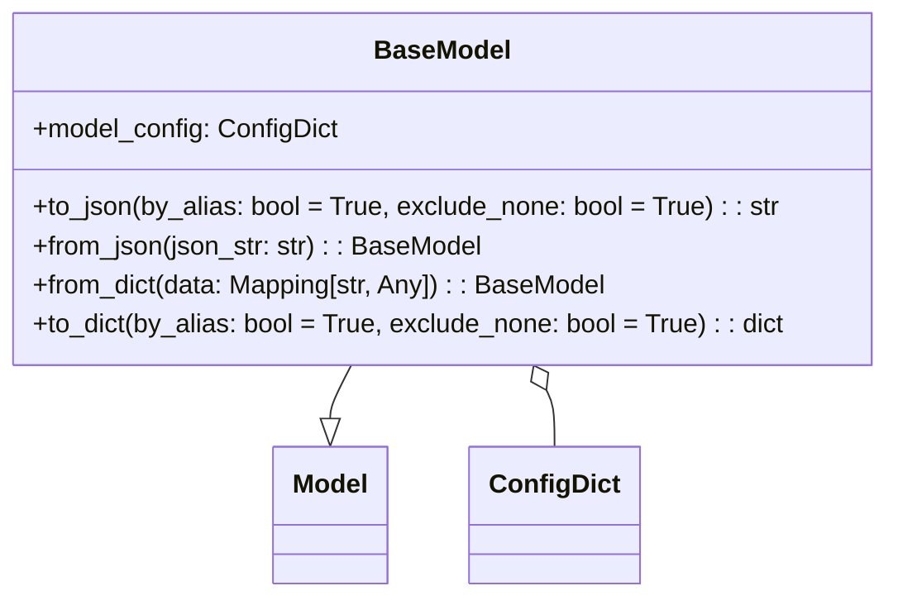

# Diagram: entity_core/entity_service/entity_service/damageview/model/base_model.py

> Auto-generated by Obscura crawlers

## Mermaid

### SVG

<svg id="container" width="542.65625" xmlns="http://www.w3.org/2000/svg" class="classDiagram" height="366" viewBox="0 0 542.65625 366" role="graphics-document document" aria-roledescription="class"><g><defs><marker id="container_class-aggregationStart" class="marker aggregation class" refX="18" refY="7" markerWidth="190" markerHeight="240" orient="auto"><path d="M 18,7 L9,13 L1,7 L9,1 Z"></path></marker></defs><defs><marker id="container_class-aggregationEnd" class="marker aggregation class" refX="1" refY="7" markerWidth="20" markerHeight="28" orient="auto"><path d="M 18,7 L9,13 L1,7 L9,1 Z"></path></marker></defs><defs><marker id="container_class-extensionStart" class="marker extension class" refX="18" refY="7" markerWidth="190" markerHeight="240" orient="auto"><path d="M 1,7 L18,13 V 1 Z"></path></marker></defs><defs><marker id="container_class-extensionEnd" class="marker extension class" refX="1" refY="7" markerWidth="20" markerHeight="28" orient="auto"><path d="M 1,1 V 13 L18,7 Z"></path></marker></defs><defs><marker id="container_class-compositionStart" class="marker composition class" refX="18" refY="7" markerWidth="190" markerHeight="240" orient="auto"><path d="M 18,7 L9,13 L1,7 L9,1 Z"></path></marker></defs><defs><marker id="container_class-compositionEnd" class="marker composition class" refX="1" refY="7" markerWidth="20" markerHeight="28" orient="auto"><path d="M 18,7 L9,13 L1,7 L9,1 Z"></path></marker></defs><defs><marker id="container_class-dependencyStart" class="marker dependency class" refX="6" refY="7" markerWidth="190" markerHeight="240" orient="auto"><path d="M 5,7 L9,13 L1,7 L9,1 Z"></path></marker></defs><defs><marker id="container_class-dependencyEnd" class="marker dependency class" refX="13" refY="7" markerWidth="20" markerHeight="28" orient="auto"><path d="M 18,7 L9,13 L14,7 L9,1 Z"></path></marker></defs><defs><marker id="container_class-lollipopStart" class="marker lollipop class" refX="13" refY="7" markerWidth="190" markerHeight="240" orient="auto"><circle stroke="black" fill="transparent" cx="7" cy="7" r="6"></circle></marker></defs><defs><marker id="container_class-lollipopEnd" class="marker lollipop class" refX="1" refY="7" markerWidth="190" markerHeight="240" orient="auto"><circle stroke="black" fill="transparent" cx="7" cy="7" r="6"></circle></marker></defs><g class="root"><g class="clusters"></g><g class="edgePaths"><path d="M216.976,224L214.879,228.167C212.782,232.333,208.588,240.667,206.491,246.125C204.395,251.583,204.395,254.167,204.395,255.458L204.395,256.75" id="id_BaseModel_Model_1" class="edge-thickness-normal edge-pattern-solid relation" style=";;;" data-edge="true" data-et="edge" data-id="id_BaseModel_Model_1" data-points="W3sieCI6MjE2Ljk3NjAzMzgzNDU4NjQ3LCJ5IjoyMjR9LHsieCI6MjA0LjM5NDUzMTI1LCJ5IjoyNDl9LHsieCI6MjA0LjM5NDUzMTI1LCJ5IjoyNzR9XQ==" marker-end="url(#container_class-extensionEnd)"></path><path d="M333.435,239.409L334.239,241.007C335.044,242.606,336.653,245.803,337.457,251.568C338.262,257.333,338.262,265.667,338.262,269.833L338.262,274" id="id_BaseModel_ConfigDict_2" class="edge-thickness-normal edge-pattern-solid relation" style=";;;" data-edge="true" data-et="edge" data-id="id_BaseModel_ConfigDict_2" data-points="W3sieCI6MzI1LjY4MDIxNjE2NTQxMzUsInkiOjIyNH0seyJ4IjozMzguMjYxNzE4NzUsInkiOjI0OX0seyJ4IjozMzguMjYxNzE4NzUsInkiOjI3NH1d" marker-start="url(#container_class-aggregationStart)"></path></g><g class="edgeLabels"><g class="edgeLabel"><g class="label" data-id="id_BaseModel_Model_1" transform="translate(0, 0)"><foreignObject width="0" height="0">

</foreignObject></g></g><g class="edgeLabel"><g class="label" data-id="id_BaseModel_ConfigDict_2" transform="translate(0, 0)"><foreignObject width="0" height="0">

</foreignObject></g></g></g><g class="nodes"><g class="node default" id="classId-Model-0" transform="translate(204.39453125, 316)"><g class="basic label-container"><path d="M-34.5546875 -42 L34.5546875 -42 L34.5546875 42 L-34.5546875 42" stroke="none" stroke-width="0" fill="#ECECFF" style=""></path><path d="M-34.5546875 -42 C-14.968606880563652 -42, 4.617473738872697 -42, 34.5546875 -42 M-34.5546875 -42 C-14.079539123949285 -42, 6.39560925210143 -42, 34.5546875 -42 M34.5546875 -42 C34.5546875 -14.824233928868711, 34.5546875 12.351532142262577, 34.5546875 42 M34.5546875 -42 C34.5546875 -9.661459244449034, 34.5546875 22.67708151110193, 34.5546875 42 M34.5546875 42 C10.813539231552717 42, -12.927609036894566 42, -34.5546875 42 M34.5546875 42 C8.906305140495146 42, -16.74207721900971 42, -34.5546875 42 M-34.5546875 42 C-34.5546875 22.217058687969956, -34.5546875 2.4341173759399126, -34.5546875 -42 M-34.5546875 42 C-34.5546875 24.00827550288637, -34.5546875 6.01655100577274, -34.5546875 -42" stroke="#9370DB" stroke-width="1.3" fill="none" stroke-dasharray="0 0" style=""></path></g><g class="annotation-group text" transform="translate(0, -18)"></g><g class="label-group text" transform="translate(-22.5546875, -18)"><g class="label" style="font-weight: bolder" transform="translate(0,-12)"><foreignObject width="45.109375" height="24">

Model

</foreignObject></g></g><g class="members-group text" transform="translate(-22.5546875, 30)"></g><g class="methods-group text" transform="translate(-22.5546875, 60)"></g><g class="divider" style=""><path d="M-34.5546875 6 C-11.518162323274446 6, 11.518362853451109 6, 34.5546875 6 M-34.5546875 6 C-15.154606904110867 6, 4.245473691778265 6, 34.5546875 6" stroke="#9370DB" stroke-width="1.3" fill="none" stroke-dasharray="0 0" style=""></path></g><g class="divider" style=""><path d="M-34.5546875 24 C-15.577753052075025 24, 3.3991813958499506 24, 34.5546875 24 M-34.5546875 24 C-11.967281688923283 24, 10.620124122153435 24, 34.5546875 24" stroke="#9370DB" stroke-width="1.3" fill="none" stroke-dasharray="0 0" style=""></path></g></g><g class="node default" id="classId-ConfigDict-1" transform="translate(338.26171875, 316)"><g class="basic label-container"><path d="M-49.3125 -42 L49.3125 -42 L49.3125 42 L-49.3125 42" stroke="none" stroke-width="0" fill="#ECECFF" style=""></path><path d="M-49.3125 -42 C-22.925697088042696 -42, 3.4611058239146075 -42, 49.3125 -42 M-49.3125 -42 C-21.182035560451872 -42, 6.948428879096255 -42, 49.3125 -42 M49.3125 -42 C49.3125 -18.252049853457116, 49.3125 5.495900293085768, 49.3125 42 M49.3125 -42 C49.3125 -18.137612731068508, 49.3125 5.724774537862984, 49.3125 42 M49.3125 42 C27.827260359754266 42, 6.3420207195085325 42, -49.3125 42 M49.3125 42 C26.146866164344207 42, 2.9812323286884137 42, -49.3125 42 M-49.3125 42 C-49.3125 22.992056515151322, -49.3125 3.9841130303026446, -49.3125 -42 M-49.3125 42 C-49.3125 14.439987838938777, -49.3125 -13.120024322122447, -49.3125 -42" stroke="#9370DB" stroke-width="1.3" fill="none" stroke-dasharray="0 0" style=""></path></g><g class="annotation-group text" transform="translate(0, -18)"></g><g class="label-group text" transform="translate(-37.3125, -18)"><g class="label" style="font-weight: bolder" transform="translate(0,-12)"><foreignObject width="74.625" height="24">

ConfigDict

</foreignObject></g></g><g class="members-group text" transform="translate(-37.3125, 30)"></g><g class="methods-group text" transform="translate(-37.3125, 60)"></g><g class="divider" style=""><path d="M-49.3125 6 C-21.56383014363916 6, 6.184839712721683 6, 49.3125 6 M-49.3125 6 C-19.395781923649423 6, 10.520936152701154 6, 49.3125 6" stroke="#9370DB" stroke-width="1.3" fill="none" stroke-dasharray="0 0" style=""></path></g><g class="divider" style=""><path d="M-49.3125 24 C-10.482502139543051 24, 28.347495720913898 24, 49.3125 24 M-49.3125 24 C-11.077191965160779 24, 27.158116069678442 24, 49.3125 24" stroke="#9370DB" stroke-width="1.3" fill="none" stroke-dasharray="0 0" style=""></path></g></g><g class="node default" id="classId-BaseModel-2" transform="translate(271.328125, 116)"><g class="basic label-container"><path d="M-263.328125 -108 L263.328125 -108 L263.328125 108 L-263.328125 108" stroke="none" stroke-width="0" fill="#ECECFF" style=""></path><path d="M-263.328125 -108 C-132.95424556960322 -108, -2.5803661392064328 -108, 263.328125 -108 M-263.328125 -108 C-108.57352209059405 -108, 46.18108081881189 -108, 263.328125 -108 M263.328125 -108 C263.328125 -41.31449942496499, 263.328125 25.371001150070015, 263.328125 108 M263.328125 -108 C263.328125 -55.56946929631949, 263.328125 -3.1389385926389792, 263.328125 108 M263.328125 108 C126.48513867718702 108, -10.357847645625952 108, -263.328125 108 M263.328125 108 C92.55897601618074 108, -78.21017296763853 108, -263.328125 108 M-263.328125 108 C-263.328125 35.18814072532574, -263.328125 -37.623718549348524, -263.328125 -108 M-263.328125 108 C-263.328125 46.49505687340098, -263.328125 -15.009886253198033, -263.328125 -108" stroke="#9370DB" stroke-width="1.3" fill="none" stroke-dasharray="0 0" style=""></path></g><g class="annotation-group text" transform="translate(0, -84)"></g><g class="label-group text" transform="translate(-40.078125, -84)"><g class="label" style="font-weight: bolder" transform="translate(0,-12)"><foreignObject width="80.15625" height="24">

BaseModel

</foreignObject></g></g><g class="members-group text" transform="translate(-251.328125, -36)"><g class="label" style="" transform="translate(0,-12)"><foreignObject width="186.796875" height="24">

+model_config: ConfigDict

</foreignObject></g></g><g class="methods-group text" transform="translate(-251.328125, 12)"><g class="label" style="" transform="translate(0,-12)"><foreignObject width="458.5625" height="24">

+to_json(by_alias: bool = True, exclude_none: bool = True) : : str

</foreignObject></g><g class="label" style="" transform="translate(0,12)"><foreignObject width="278.09375" height="24">

+from_json(json_str: str) : : BaseModel

</foreignObject></g><g class="label" style="" transform="translate(0,36)"><foreignObject width="353.28125" height="24">

+from_dict(data: Mapping[str, Any]) : : BaseModel

</foreignObject></g><g class="label" style="" transform="translate(0,60)"><foreignObject width="462.578125" height="24">

+to_dict(by_alias: bool = True, exclude_none: bool = True) : : dict

</foreignObject></g></g><g class="divider" style=""><path d="M-263.328125 -60 C-79.08959395495555 -60, 105.1489370900889 -60, 263.328125 -60 M-263.328125 -60 C-127.38165501637334 -60, 8.564814967253312 -60, 263.328125 -60" stroke="#9370DB" stroke-width="1.3" fill="none" stroke-dasharray="0 0" style=""></path></g><g class="divider" style=""><path d="M-263.328125 -12 C-59.23622049527282 -12, 144.85568400945436 -12, 263.328125 -12 M-263.328125 -12 C-129.01693305099687 -12, 5.294258898006262 -12, 263.328125 -12" stroke="#9370DB" stroke-width="1.3" fill="none" stroke-dasharray="0 0" style=""></path></g></g></g></g></g></svg>
