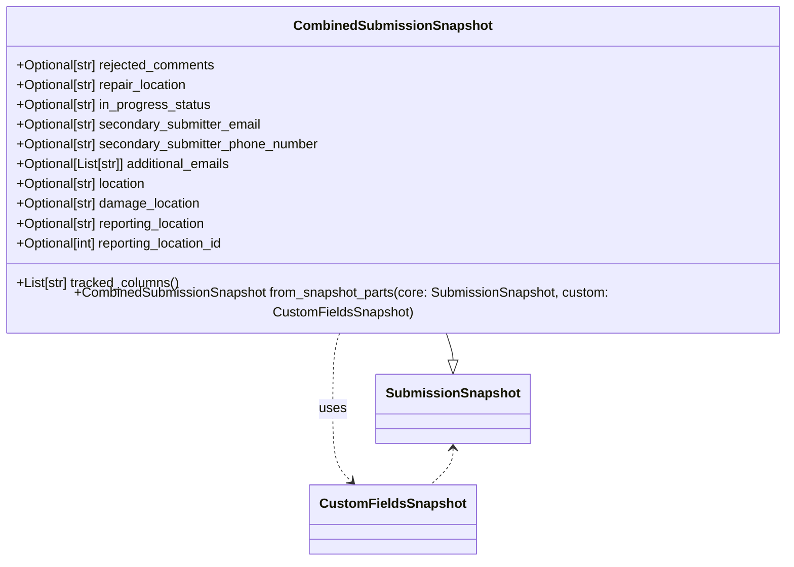

# Diagram: entity_core/entity_service/entity_service/damageview/model/combined_submission_snapshot.py


> Auto-generated by Obscura crawlers

## Diagram 1



### SVG

<svg id="container" width="981.5859375" xmlns="http://www.w3.org/2000/svg" class="classDiagram" height="668" viewBox="0 0 981.5859375 668" role="graphics-document document" aria-roledescription="class"><style>#container{font-family:"trebuchet ms",verdana,arial,sans-serif;font-size:16px;fill:#333;}@keyframes edge-animation-frame{from{stroke-dashoffset:0;}}@keyframes dash{to{stroke-dashoffset:0;}}#container .edge-animation-slow{stroke-dasharray:9,5!important;stroke-dashoffset:900;animation:dash 50s linear infinite;stroke-linecap:round;}#container .edge-animation-fast{stroke-dasharray:9,5!important;stroke-dashoffset:900;animation:dash 20s linear infinite;stroke-linecap:round;}#container .error-icon{fill:#552222;}#container .error-text{fill:#552222;stroke:#552222;}#container .edge-thickness-normal{stroke-width:1px;}#container .edge-thickness-thick{stroke-width:3.5px;}#container .edge-pattern-solid{stroke-dasharray:0;}#container .edge-thickness-invisible{stroke-width:0;fill:none;}#container .edge-pattern-dashed{stroke-dasharray:3;}#container .edge-pattern-dotted{stroke-dasharray:2;}#container .marker{fill:#333333;stroke:#333333;}#container .marker.cross{stroke:#333333;}#container svg{font-family:"trebuchet ms",verdana,arial,sans-serif;font-size:16px;}#container p{margin:0;}#container g.classGroup text{fill:#9370DB;stroke:none;font-family:"trebuchet ms",verdana,arial,sans-serif;font-size:10px;}#container g.classGroup text .title{font-weight:bolder;}#container .nodeLabel,#container .edgeLabel{color:#131300;}#container .edgeLabel .label rect{fill:#ECECFF;}#container .label text{fill:#131300;}#container .labelBkg{background:#ECECFF;}#container .edgeLabel .label span{background:#ECECFF;}#container .classTitle{font-weight:bolder;}#container .node rect,#container .node circle,#container .node ellipse,#container .node polygon,#container .node path{fill:#ECECFF;stroke:#9370DB;stroke-width:1px;}#container .divider{stroke:#9370DB;stroke-width:1;}#container g.clickable{cursor:pointer;}#container g.classGroup rect{fill:#ECECFF;stroke:#9370DB;}#container g.classGroup line{stroke:#9370DB;stroke-width:1;}#container .classLabel .box{stroke:none;stroke-width:0;fill:#ECECFF;opacity:0.5;}#container .classLabel .label{fill:#9370DB;font-size:10px;}#container .relation{stroke:#333333;stroke-width:1;fill:none;}#container .dashed-line{stroke-dasharray:3;}#container .dotted-line{stroke-dasharray:1 2;}#container #compositionStart,#container .composition{fill:#333333!important;stroke:#333333!important;stroke-width:1;}#container #compositionEnd,#container .composition{fill:#333333!important;stroke:#333333!important;stroke-width:1;}#container #dependencyStart,#container .dependency{fill:#333333!important;stroke:#333333!important;stroke-width:1;}#container #dependencyStart,#container .dependency{fill:#333333!important;stroke:#333333!important;stroke-width:1;}#container #extensionStart,#container .extension{fill:transparent!important;stroke:#333333!important;stroke-width:1;}#container #extensionEnd,#container .extension{fill:transparent!important;stroke:#333333!important;stroke-width:1;}#container #aggregationStart,#container .aggregation{fill:transparent!important;stroke:#333333!important;stroke-width:1;}#container #aggregationEnd,#container .aggregation{fill:transparent!important;stroke:#333333!important;stroke-width:1;}#container #lollipopStart,#container .lollipop{fill:#ECECFF!important;stroke:#333333!important;stroke-width:1;}#container #lollipopEnd,#container .lollipop{fill:#ECECFF!important;stroke:#333333!important;stroke-width:1;}#container .edgeTerminals{font-size:11px;line-height:initial;}#container .classTitleText{text-anchor:middle;font-size:18px;fill:#333;}#container .label-icon{display:inline-block;height:1em;overflow:visible;vertical-align:-0.125em;}#container .node .label-icon path{fill:currentColor;stroke:revert;stroke-width:revert;}#container :root{--mermaid-font-family:"trebuchet ms",verdana,arial,sans-serif;}</style><g><defs><marker id="container_class-aggregationStart" class="marker aggregation class" refX="18" refY="7" markerWidth="190" markerHeight="240" orient="auto"><path d="M 18,7 L9,13 L1,7 L9,1 Z"></path></marker></defs><defs><marker id="container_class-aggregationEnd" class="marker aggregation class" refX="1" refY="7" markerWidth="20" markerHeight="28" orient="auto"><path d="M 18,7 L9,13 L1,7 L9,1 Z"></path></marker></defs><defs><marker id="container_class-extensionStart" class="marker extension class" refX="18" refY="7" markerWidth="190" markerHeight="240" orient="auto"><path d="M 1,7 L18,13 V 1 Z"></path></marker></defs><defs><marker id="container_class-extensionEnd" class="marker extension class" refX="1" refY="7" markerWidth="20" markerHeight="28" orient="auto"><path d="M 1,1 V 13 L18,7 Z"></path></marker></defs><defs><marker id="container_class-compositionStart" class="marker composition class" refX="18" refY="7" markerWidth="190" markerHeight="240" orient="auto"><path d="M 18,7 L9,13 L1,7 L9,1 Z"></path></marker></defs><defs><marker id="container_class-compositionEnd" class="marker composition class" refX="1" refY="7" markerWidth="20" markerHeight="28" orient="auto"><path d="M 18,7 L9,13 L1,7 L9,1 Z"></path></marker></defs><defs><marker id="container_class-dependencyStart" class="marker dependency class" refX="6" refY="7" markerWidth="190" markerHeight="240" orient="auto"><path d="M 5,7 L9,13 L1,7 L9,1 Z"></path></marker></defs><defs><marker id="container_class-dependencyEnd" class="marker dependency class" refX="13" refY="7" markerWidth="20" markerHeight="28" orient="auto"><path d="M 18,7 L9,13 L14,7 L9,1 Z"></path></marker></defs><defs><marker id="container_class-lollipopStart" class="marker lollipop class" refX="13" refY="7" markerWidth="190" markerHeight="240" orient="auto"><circle stroke="black" fill="transparent" cx="7" cy="7" r="6"></circle></marker></defs><defs><marker id="container_class-lollipopEnd" class="marker lollipop class" refX="1" refY="7" markerWidth="190" markerHeight="240" orient="auto"><circle stroke="black" fill="transparent" cx="7" cy="7" r="6"></circle></marker></defs><g class="root"><g class="clusters"></g><g class="edgePaths"><path d="M552.839,392L554.186,396.167C555.532,400.333,558.225,408.667,559.571,414.125C560.918,419.583,560.918,422.167,560.918,423.458L560.918,424.75" id="id_CombinedSubmissionSnapshot_SubmissionSnapshot_1" class="edge-thickness-normal edge-pattern-solid relation" style=";;;" data-edge="true" data-et="edge" data-id="id_CombinedSubmissionSnapshot_SubmissionSnapshot_1" data-points="W3sieCI6NTUyLjgzOTA1MTY5OTMwODgsInkiOjM5Mn0seyJ4Ijo1NjAuOTE3OTY4NzUsInkiOjQxN30seyJ4Ijo1NjAuOTE3OTY4NzUsInkiOjQ0Mn1d" marker-end="url(#container_class-extensionEnd)"></path><path d="M428.747,392L427.4,396.167C426.054,400.333,423.361,408.667,422.014,424C420.668,439.333,420.668,461.667,420.668,484C420.668,506.333,420.668,528.667,424.306,543.309C427.944,557.952,435.22,564.903,438.858,568.379L442.496,571.855" id="id_CombinedSubmissionSnapshot_CustomFieldsSnapshot_2" class="edge-thickness-normal edge-pattern-dashed relation" style=";;;" data-edge="true" data-et="edge" data-id="id_CombinedSubmissionSnapshot_CustomFieldsSnapshot_2" data-points="W3sieCI6NDI4Ljc0Njg4NTgwMDY5MTI1LCJ5IjozOTJ9LHsieCI6NDIwLjY2Nzk2ODc1LCJ5Ijo0MTd9LHsieCI6NDIwLjY2Nzk2ODc1LCJ5Ijo0ODR9LHsieCI6NDIwLjY2Nzk2ODc1LCJ5Ijo1NTF9LHsieCI6NDQ2LjgzNDAxMzUyNjExOTQsInkiOjU3Nn1d" marker-end="url(#container_class-dependencyEnd)"></path><path d="M560.918,532L560.918,535.167C560.918,538.333,560.918,544.667,556.557,552C552.196,559.333,543.474,567.667,539.113,571.833L534.752,576" id="id_SubmissionSnapshot_CustomFieldsSnapshot_3" class="edge-thickness-normal edge-pattern-dashed relation" style=";;;" data-edge="true" data-et="edge" data-id="id_SubmissionSnapshot_CustomFieldsSnapshot_3" data-points="W3sieCI6NTYwLjkxNzk2ODc1LCJ5Ijo1MjZ9LHsieCI6NTYwLjkxNzk2ODc1LCJ5Ijo1NTF9LHsieCI6NTM0Ljc1MTkyMzk3Mzg4MDYsInkiOjU3Nn1d" marker-start="url(#container_class-dependencyStart)"></path></g><g class="edgeLabels"><g class="edgeLabel"><g class="label" data-id="id_CombinedSubmissionSnapshot_SubmissionSnapshot_1" transform="translate(0, 0)"><foreignObject width="0" height="0"><div xmlns="http://www.w3.org/1999/xhtml" class="labelBkg" style="display: table-cell; white-space: nowrap; line-height: 1.5; max-width: 200px; text-align: center;"><span class="edgeLabel"></span></div></foreignObject></g></g><g class="edgeLabel" transform="translate(420.66796875, 484)"><g class="label" data-id="id_CombinedSubmissionSnapshot_CustomFieldsSnapshot_2" transform="translate(-16.4921875, -12)"><foreignObject width="32.984375" height="24"><div xmlns="http://www.w3.org/1999/xhtml" class="labelBkg" style="display: table-cell; white-space: nowrap; line-height: 1.5; max-width: 200px; text-align: center;"><span class="edgeLabel"><p>uses</p></span></div></foreignObject></g></g><g class="edgeLabel"><g class="label" data-id="id_SubmissionSnapshot_CustomFieldsSnapshot_3" transform="translate(0, 0)"><foreignObject width="0" height="0"><div xmlns="http://www.w3.org/1999/xhtml" class="labelBkg" style="display: table-cell; white-space: nowrap; line-height: 1.5; max-width: 200px; text-align: center;"><span class="edgeLabel"></span></div></foreignObject></g></g></g><g class="nodes"><g class="node default" id="classId-SubmissionSnapshot-0" transform="translate(560.91796875, 484)"><g class="basic label-container"><path d="M-88.7578125 -42 L88.7578125 -42 L88.7578125 42 L-88.7578125 42" stroke="none" stroke-width="0" fill="#ECECFF" style=""></path><path d="M-88.7578125 -42 C-26.574391251691218 -42, 35.609029996617565 -42, 88.7578125 -42 M-88.7578125 -42 C-33.50854920034761 -42, 21.740714099304782 -42, 88.7578125 -42 M88.7578125 -42 C88.7578125 -12.740999155536969, 88.7578125 16.518001688926063, 88.7578125 42 M88.7578125 -42 C88.7578125 -17.73485602378367, 88.7578125 6.5302879524326585, 88.7578125 42 M88.7578125 42 C47.20841963255086 42, 5.659026765101714 42, -88.7578125 42 M88.7578125 42 C36.43283843574384 42, -15.892135628512321 42, -88.7578125 42 M-88.7578125 42 C-88.7578125 17.534707243827842, -88.7578125 -6.930585512344315, -88.7578125 -42 M-88.7578125 42 C-88.7578125 23.426562389701175, -88.7578125 4.85312477940235, -88.7578125 -42" stroke="#9370DB" stroke-width="1.3" fill="none" stroke-dasharray="0 0" style=""></path></g><g class="annotation-group text" transform="translate(0, -18)"></g><g class="label-group text" transform="translate(-76.7578125, -18)"><g class="label" style="font-weight: bolder" transform="translate(0,-12)"><foreignObject width="153.515625" height="24"><div xmlns="http://www.w3.org/1999/xhtml" style="display: table-cell; white-space: nowrap; line-height: 1.5; max-width: 202px; text-align: center;"><span class="nodeLabel markdown-node-label" style=""><p>SubmissionSnapshot</p></span></div></foreignObject></g></g><g class="members-group text" transform="translate(-76.7578125, 30)"></g><g class="methods-group text" transform="translate(-76.7578125, 60)"></g><g class="divider" style=""><path d="M-88.7578125 6 C-48.85425621401129 6, -8.950699928022587 6, 88.7578125 6 M-88.7578125 6 C-35.89396796454987 6, 16.969876570900254 6, 88.7578125 6" stroke="#9370DB" stroke-width="1.3" fill="none" stroke-dasharray="0 0" style=""></path></g><g class="divider" style=""><path d="M-88.7578125 24 C-24.396903411337405 24, 39.96400567732519 24, 88.7578125 24 M-88.7578125 24 C-47.04166714787261 24, -5.3255217957452174 24, 88.7578125 24" stroke="#9370DB" stroke-width="1.3" fill="none" stroke-dasharray="0 0" style=""></path></g></g><g class="node default" id="classId-CustomFieldsSnapshot-1" transform="translate(490.79296875, 618)"><g class="basic label-container"><path d="M-95.21875 -42 L95.21875 -42 L95.21875 42 L-95.21875 42" stroke="none" stroke-width="0" fill="#ECECFF" style=""></path><path d="M-95.21875 -42 C-26.041550764982077 -42, 43.13564847003585 -42, 95.21875 -42 M-95.21875 -42 C-22.839271258234177 -42, 49.540207483531645 -42, 95.21875 -42 M95.21875 -42 C95.21875 -9.950688383568156, 95.21875 22.098623232863687, 95.21875 42 M95.21875 -42 C95.21875 -19.814928952688177, 95.21875 2.3701420946236453, 95.21875 42 M95.21875 42 C45.0212008173338 42, -5.176348365332402 42, -95.21875 42 M95.21875 42 C53.79479447902829 42, 12.37083895805658 42, -95.21875 42 M-95.21875 42 C-95.21875 15.39890218378315, -95.21875 -11.2021956324337, -95.21875 -42 M-95.21875 42 C-95.21875 17.01557473776779, -95.21875 -7.968850524464422, -95.21875 -42" stroke="#9370DB" stroke-width="1.3" fill="none" stroke-dasharray="0 0" style=""></path></g><g class="annotation-group text" transform="translate(0, -18)"></g><g class="label-group text" transform="translate(-83.21875, -18)"><g class="label" style="font-weight: bolder" transform="translate(0,-12)"><foreignObject width="166.4375" height="24"><div xmlns="http://www.w3.org/1999/xhtml" style="display: table-cell; white-space: nowrap; line-height: 1.5; max-width: 215px; text-align: center;"><span class="nodeLabel markdown-node-label" style=""><p>CustomFieldsSnapshot</p></span></div></foreignObject></g></g><g class="members-group text" transform="translate(-83.21875, 30)"></g><g class="methods-group text" transform="translate(-83.21875, 60)"></g><g class="divider" style=""><path d="M-95.21875 6 C-34.8491718904562 6, 25.520406219087604 6, 95.21875 6 M-95.21875 6 C-27.031333229475905 6, 41.15608354104819 6, 95.21875 6" stroke="#9370DB" stroke-width="1.3" fill="none" stroke-dasharray="0 0" style=""></path></g><g class="divider" style=""><path d="M-95.21875 24 C-35.71551269469835 24, 23.787724610603306 24, 95.21875 24 M-95.21875 24 C-39.300661793005744 24, 16.61742641398851 24, 95.21875 24" stroke="#9370DB" stroke-width="1.3" fill="none" stroke-dasharray="0 0" style=""></path></g></g><g class="node default" id="classId-CombinedSubmissionSnapshot-2" transform="translate(490.79296875, 200)"><g class="basic label-container"><path d="M-482.79296875 -192 L482.79296875 -192 L482.79296875 192 L-482.79296875 192" stroke="none" stroke-width="0" fill="#ECECFF" style=""></path><path d="M-482.79296875 -192 C-257.92988807993447 -192, -33.06680740986894 -192, 482.79296875 -192 M-482.79296875 -192 C-110.18795684295497 -192, 262.41705506409005 -192, 482.79296875 -192 M482.79296875 -192 C482.79296875 -88.70884356216055, 482.79296875 14.582312875678895, 482.79296875 192 M482.79296875 -192 C482.79296875 -84.84930967123137, 482.79296875 22.301380657537266, 482.79296875 192 M482.79296875 192 C259.22255988972745 192, 35.6521510294549 192, -482.79296875 192 M482.79296875 192 C252.25055181360165 192, 21.708134877203292 192, -482.79296875 192 M-482.79296875 192 C-482.79296875 89.25721536871447, -482.79296875 -13.485569262571062, -482.79296875 -192 M-482.79296875 192 C-482.79296875 108.75135328391588, -482.79296875 25.50270656783175, -482.79296875 -192" stroke="#9370DB" stroke-width="1.3" fill="none" stroke-dasharray="0 0" style=""></path></g><g class="annotation-group text" transform="translate(0, -168)"></g><g class="label-group text" transform="translate(-113.4921875, -168)"><g class="label" style="font-weight: bolder" transform="translate(0,-12)"><foreignObject width="226.984375" height="24"><div xmlns="http://www.w3.org/1999/xhtml" style="display: table-cell; white-space: nowrap; line-height: 1.5; max-width: 276px; text-align: center;"><span class="nodeLabel markdown-node-label" style=""><p>CombinedSubmissionSnapshot</p></span></div></foreignObject></g></g><g class="members-group text" transform="translate(-470.79296875, -120)"><g class="label" style="" transform="translate(0,-12)"><foreignObject width="247.296875" height="24"><div xmlns="http://www.w3.org/1999/xhtml" style="display: table-cell; white-space: nowrap; line-height: 1.5; max-width: 305px; text-align: center;"><span class="nodeLabel markdown-node-label" style=""><p>+Optional[str] rejected_comments</p></span></div></foreignObject></g><g class="label" style="" transform="translate(0,12)"><foreignObject width="213.953125" height="24"><div xmlns="http://www.w3.org/1999/xhtml" style="display: table-cell; white-space: nowrap; line-height: 1.5; max-width: 271px; text-align: center;"><span class="nodeLabel markdown-node-label" style=""><p>+Optional[str] repair_location</p></span></div></foreignObject></g><g class="label" style="" transform="translate(0,36)"><foreignObject width="241.453125" height="24"><div xmlns="http://www.w3.org/1999/xhtml" style="display: table-cell; white-space: nowrap; line-height: 1.5; max-width: 299px; text-align: center;"><span class="nodeLabel markdown-node-label" style=""><p>+Optional[str] in_progress_status</p></span></div></foreignObject></g><g class="label" style="" transform="translate(0,60)"><foreignObject width="304.953125" height="24"><div xmlns="http://www.w3.org/1999/xhtml" style="display: table-cell; white-space: nowrap; line-height: 1.5; max-width: 363px; text-align: center;"><span class="nodeLabel markdown-node-label" style=""><p>+Optional[str] secondary_submitter_email</p></span></div></foreignObject></g><g class="label" style="" transform="translate(0,84)"><foreignObject width="376.0625" height="24"><div xmlns="http://www.w3.org/1999/xhtml" style="display: table-cell; white-space: nowrap; line-height: 1.5; max-width: 434px; text-align: center;"><span class="nodeLabel markdown-node-label" style=""><p>+Optional[str] secondary_submitter_phone_number</p></span></div></foreignObject></g><g class="label" style="" transform="translate(0,108)"><foreignObject width="271.203125" height="24"><div xmlns="http://www.w3.org/1999/xhtml" style="display: table-cell; white-space: nowrap; line-height: 1.5; max-width: 329px; text-align: center;"><span class="nodeLabel markdown-node-label" style=""><p>+Optional[List[str]] additional_emails</p></span></div></foreignObject></g><g class="label" style="" transform="translate(0,132)"><foreignObject width="163.921875" height="24"><div xmlns="http://www.w3.org/1999/xhtml" style="display: table-cell; white-space: nowrap; line-height: 1.5; max-width: 221px; text-align: center;"><span class="nodeLabel markdown-node-label" style=""><p>+Optional[str] location</p></span></div></foreignObject></g><g class="label" style="" transform="translate(0,156)"><foreignObject width="229.078125" height="24"><div xmlns="http://www.w3.org/1999/xhtml" style="display: table-cell; white-space: nowrap; line-height: 1.5; max-width: 286px; text-align: center;"><span class="nodeLabel markdown-node-label" style=""><p>+Optional[str] damage_location</p></span></div></foreignObject></g><g class="label" style="" transform="translate(0,180)"><foreignObject width="239.578125" height="24"><div xmlns="http://www.w3.org/1999/xhtml" style="display: table-cell; white-space: nowrap; line-height: 1.5; max-width: 297px; text-align: center;"><span class="nodeLabel markdown-node-label" style=""><p>+Optional[str] reporting_location</p></span></div></foreignObject></g><g class="label" style="" transform="translate(0,204)"><foreignObject width="262.375" height="24"><div xmlns="http://www.w3.org/1999/xhtml" style="display: table-cell; white-space: nowrap; line-height: 1.5; max-width: 320px; text-align: center;"><span class="nodeLabel markdown-node-label" style=""><p>+Optional[int] reporting_location_id</p></span></div></foreignObject></g></g><g class="methods-group text" transform="translate(-470.79296875, 144)"><g class="label" style="" transform="translate(0,-12)"><foreignObject width="201.375" height="24"><div xmlns="http://www.w3.org/1999/xhtml" style="display: table-cell; white-space: nowrap; line-height: 1.5; max-width: 259px; text-align: center;"><span class="nodeLabel markdown-node-label" style=""><p>+List[str] tracked_columns()</p></span></div></foreignObject></g><g class="label" style="" transform="translate(0,12)"><foreignObject width="828.09375" height="24"><div xmlns="http://www.w3.org/1999/xhtml" style="display: table-cell; white-space: nowrap; line-height: 1.5; max-width: 885px; text-align: center;"><span class="nodeLabel markdown-node-label" style=""><p>+CombinedSubmissionSnapshot from_snapshot_parts(core: SubmissionSnapshot, custom: CustomFieldsSnapshot)</p></span></div></foreignObject></g></g><g class="divider" style=""><path d="M-482.79296875 -144 C-167.5265422406896 -144, 147.7398842686208 -144, 482.79296875 -144 M-482.79296875 -144 C-220.73145879728185 -144, 41.33005115543631 -144, 482.79296875 -144" stroke="#9370DB" stroke-width="1.3" fill="none" stroke-dasharray="0 0" style=""></path></g><g class="divider" style=""><path d="M-482.79296875 120 C-251.29716385952457 120, -19.801358969049147 120, 482.79296875 120 M-482.79296875 120 C-244.02451070712942 120, -5.256052664258846 120, 482.79296875 120" stroke="#9370DB" stroke-width="1.3" fill="none" stroke-dasharray="0 0" style=""></path></g></g></g></g></g></svg>

## Diagram 2

```mermaid
flowchart TD
    Start([from_snapshot_parts(core, custom)])
    Start --> BuildCore["core_dict = core.model_dump() if core else {}"]
    BuildCore --> BuildCustom["custom_dict = custom.model_dump() if custom else {}"]
    BuildCustom --> Merge["data = {**core_dict, **custom_dict}"]
    Merge --> CheckEmails{"additional_emails is str?"}
    CheckEmails -- Yes --> SplitEmails["data['additional_emails'] = [e.strip() for e in additional_emails.split(',') if e.strip()]"]
    CheckEmails -- No --> EmailsDone
    SplitEmails --> EmailsDone
    EmailsDone --> CheckReportId{"reporting_location_id is str and isdigit()?"}
    CheckReportId -- Yes --> CastId["data['reporting_location_id'] = int(reporting_location_id)"]
    CheckReportId -- No --> IdDone
    CastId --> IdDone
    IdDone --> Return["return cls(**data)"]
    Return --> End([end])
```

> SVG rendering failed for this diagram.
