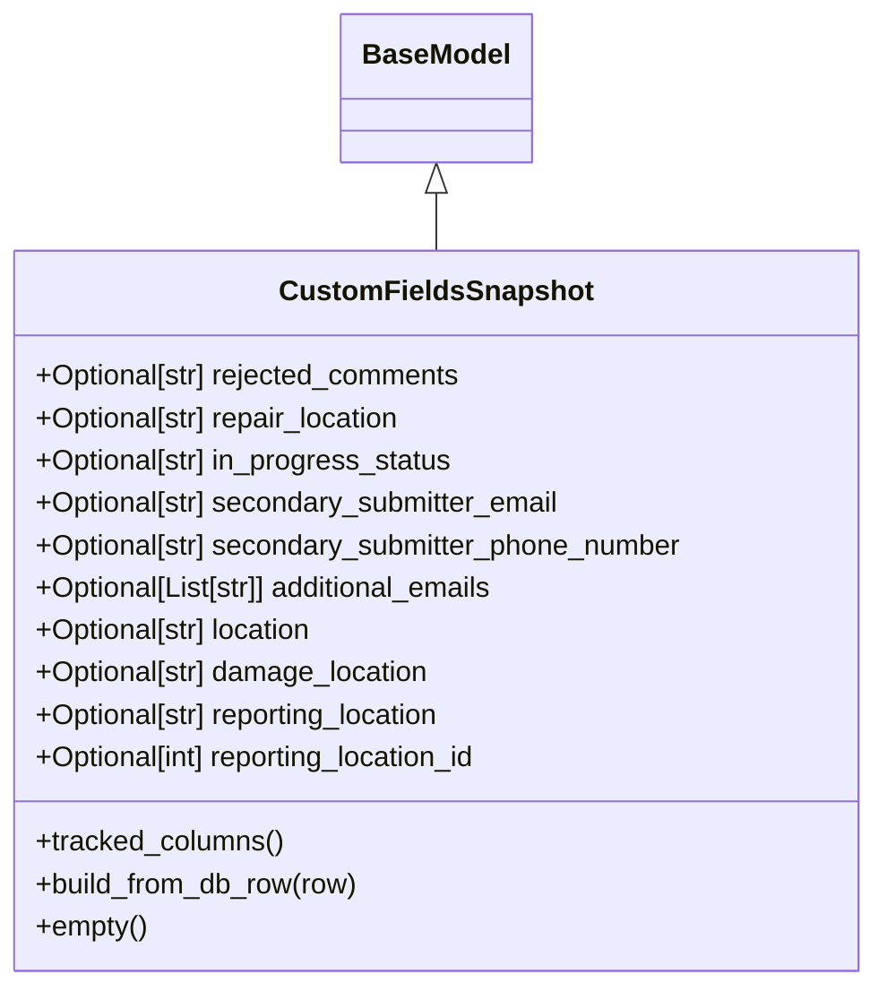

# Diagram: entity_core/entity_service/entity_service/damageview/model/custom_fields_snapshot.py


> Auto-generated by Obscura crawlers

## Diagram 1



### SVG

<svg id="container" width="499.28125" xmlns="http://www.w3.org/2000/svg" class="classDiagram" height="558" viewBox="0 0 499.28125 558" role="graphics-document document" aria-roledescription="class"><style>#container{font-family:"trebuchet ms",verdana,arial,sans-serif;font-size:16px;fill:#333;}@keyframes edge-animation-frame{from{stroke-dashoffset:0;}}@keyframes dash{to{stroke-dashoffset:0;}}#container .edge-animation-slow{stroke-dasharray:9,5!important;stroke-dashoffset:900;animation:dash 50s linear infinite;stroke-linecap:round;}#container .edge-animation-fast{stroke-dasharray:9,5!important;stroke-dashoffset:900;animation:dash 20s linear infinite;stroke-linecap:round;}#container .error-icon{fill:#552222;}#container .error-text{fill:#552222;stroke:#552222;}#container .edge-thickness-normal{stroke-width:1px;}#container .edge-thickness-thick{stroke-width:3.5px;}#container .edge-pattern-solid{stroke-dasharray:0;}#container .edge-thickness-invisible{stroke-width:0;fill:none;}#container .edge-pattern-dashed{stroke-dasharray:3;}#container .edge-pattern-dotted{stroke-dasharray:2;}#container .marker{fill:#333333;stroke:#333333;}#container .marker.cross{stroke:#333333;}#container svg{font-family:"trebuchet ms",verdana,arial,sans-serif;font-size:16px;}#container p{margin:0;}#container g.classGroup text{fill:#9370DB;stroke:none;font-family:"trebuchet ms",verdana,arial,sans-serif;font-size:10px;}#container g.classGroup text .title{font-weight:bolder;}#container .nodeLabel,#container .edgeLabel{color:#131300;}#container .edgeLabel .label rect{fill:#ECECFF;}#container .label text{fill:#131300;}#container .labelBkg{background:#ECECFF;}#container .edgeLabel .label span{background:#ECECFF;}#container .classTitle{font-weight:bolder;}#container .node rect,#container .node circle,#container .node ellipse,#container .node polygon,#container .node path{fill:#ECECFF;stroke:#9370DB;stroke-width:1px;}#container .divider{stroke:#9370DB;stroke-width:1;}#container g.clickable{cursor:pointer;}#container g.classGroup rect{fill:#ECECFF;stroke:#9370DB;}#container g.classGroup line{stroke:#9370DB;stroke-width:1;}#container .classLabel .box{stroke:none;stroke-width:0;fill:#ECECFF;opacity:0.5;}#container .classLabel .label{fill:#9370DB;font-size:10px;}#container .relation{stroke:#333333;stroke-width:1;fill:none;}#container .dashed-line{stroke-dasharray:3;}#container .dotted-line{stroke-dasharray:1 2;}#container #compositionStart,#container .composition{fill:#333333!important;stroke:#333333!important;stroke-width:1;}#container #compositionEnd,#container .composition{fill:#333333!important;stroke:#333333!important;stroke-width:1;}#container #dependencyStart,#container .dependency{fill:#333333!important;stroke:#333333!important;stroke-width:1;}#container #dependencyStart,#container .dependency{fill:#333333!important;stroke:#333333!important;stroke-width:1;}#container #extensionStart,#container .extension{fill:transparent!important;stroke:#333333!important;stroke-width:1;}#container #extensionEnd,#container .extension{fill:transparent!important;stroke:#333333!important;stroke-width:1;}#container #aggregationStart,#container .aggregation{fill:transparent!important;stroke:#333333!important;stroke-width:1;}#container #aggregationEnd,#container .aggregation{fill:transparent!important;stroke:#333333!important;stroke-width:1;}#container #lollipopStart,#container .lollipop{fill:#ECECFF!important;stroke:#333333!important;stroke-width:1;}#container #lollipopEnd,#container .lollipop{fill:#ECECFF!important;stroke:#333333!important;stroke-width:1;}#container .edgeTerminals{font-size:11px;line-height:initial;}#container .classTitleText{text-anchor:middle;font-size:18px;fill:#333;}#container .label-icon{display:inline-block;height:1em;overflow:visible;vertical-align:-0.125em;}#container .node .label-icon path{fill:currentColor;stroke:revert;stroke-width:revert;}#container :root{--mermaid-font-family:"trebuchet ms",verdana,arial,sans-serif;}</style><g><defs><marker id="container_class-aggregationStart" class="marker aggregation class" refX="18" refY="7" markerWidth="190" markerHeight="240" orient="auto"><path d="M 18,7 L9,13 L1,7 L9,1 Z"></path></marker></defs><defs><marker id="container_class-aggregationEnd" class="marker aggregation class" refX="1" refY="7" markerWidth="20" markerHeight="28" orient="auto"><path d="M 18,7 L9,13 L1,7 L9,1 Z"></path></marker></defs><defs><marker id="container_class-extensionStart" class="marker extension class" refX="18" refY="7" markerWidth="190" markerHeight="240" orient="auto"><path d="M 1,7 L18,13 V 1 Z"></path></marker></defs><defs><marker id="container_class-extensionEnd" class="marker extension class" refX="1" refY="7" markerWidth="20" markerHeight="28" orient="auto"><path d="M 1,1 V 13 L18,7 Z"></path></marker></defs><defs><marker id="container_class-compositionStart" class="marker composition class" refX="18" refY="7" markerWidth="190" markerHeight="240" orient="auto"><path d="M 18,7 L9,13 L1,7 L9,1 Z"></path></marker></defs><defs><marker id="container_class-compositionEnd" class="marker composition class" refX="1" refY="7" markerWidth="20" markerHeight="28" orient="auto"><path d="M 18,7 L9,13 L1,7 L9,1 Z"></path></marker></defs><defs><marker id="container_class-dependencyStart" class="marker dependency class" refX="6" refY="7" markerWidth="190" markerHeight="240" orient="auto"><path d="M 5,7 L9,13 L1,7 L9,1 Z"></path></marker></defs><defs><marker id="container_class-dependencyEnd" class="marker dependency class" refX="13" refY="7" markerWidth="20" markerHeight="28" orient="auto"><path d="M 18,7 L9,13 L14,7 L9,1 Z"></path></marker></defs><defs><marker id="container_class-lollipopStart" class="marker lollipop class" refX="13" refY="7" markerWidth="190" markerHeight="240" orient="auto"><circle stroke="black" fill="transparent" cx="7" cy="7" r="6"></circle></marker></defs><defs><marker id="container_class-lollipopEnd" class="marker lollipop class" refX="1" refY="7" markerWidth="190" markerHeight="240" orient="auto"><circle stroke="black" fill="transparent" cx="7" cy="7" r="6"></circle></marker></defs><g class="root"><g class="clusters"></g><g class="edgePaths"><path d="M249.641,109.25L249.641,110.542C249.641,111.833,249.641,114.417,249.641,119.875C249.641,125.333,249.641,133.667,249.641,137.833L249.641,142" id="id_BaseModel_CustomFieldsSnapshot_1" class="edge-thickness-normal edge-pattern-solid relation" style=";;;" data-edge="true" data-et="edge" data-id="id_BaseModel_CustomFieldsSnapshot_1" data-points="W3sieCI6MjQ5LjY0MDYyNSwieSI6OTJ9LHsieCI6MjQ5LjY0MDYyNSwieSI6MTE3fSx7IngiOjI0OS42NDA2MjUsInkiOjE0Mn1d" marker-start="url(#container_class-extensionStart)"></path></g><g class="edgeLabels"><g class="edgeLabel"><g class="label" data-id="id_BaseModel_CustomFieldsSnapshot_1" transform="translate(0, 0)"><foreignObject width="0" height="0"><div xmlns="http://www.w3.org/1999/xhtml" class="labelBkg" style="display: table-cell; white-space: nowrap; line-height: 1.5; max-width: 200px; text-align: center;"><span class="edgeLabel"></span></div></foreignObject></g></g></g><g class="nodes"><g class="node default" id="classId-BaseModel-0" transform="translate(249.640625, 50)"><g class="basic label-container"><path d="M-52.078125 -42 L52.078125 -42 L52.078125 42 L-52.078125 42" stroke="none" stroke-width="0" fill="#ECECFF" style=""></path><path d="M-52.078125 -42 C-12.516674700487563 -42, 27.044775599024874 -42, 52.078125 -42 M-52.078125 -42 C-24.795263797443916 -42, 2.4875974051121688 -42, 52.078125 -42 M52.078125 -42 C52.078125 -10.797939013024372, 52.078125 20.404121973951256, 52.078125 42 M52.078125 -42 C52.078125 -20.75981801394764, 52.078125 0.48036397210471904, 52.078125 42 M52.078125 42 C23.413729078164383 42, -5.250666843671233 42, -52.078125 42 M52.078125 42 C25.55792820599041 42, -0.9622685880191781 42, -52.078125 42 M-52.078125 42 C-52.078125 20.99789745749532, -52.078125 -0.004205085009360232, -52.078125 -42 M-52.078125 42 C-52.078125 14.59498097535226, -52.078125 -12.810038049295478, -52.078125 -42" stroke="#9370DB" stroke-width="1.3" fill="none" stroke-dasharray="0 0" style=""></path></g><g class="annotation-group text" transform="translate(0, -18)"></g><g class="label-group text" transform="translate(-40.078125, -18)"><g class="label" style="font-weight: bolder" transform="translate(0,-12)"><foreignObject width="80.15625" height="24"><div xmlns="http://www.w3.org/1999/xhtml" style="display: table-cell; white-space: nowrap; line-height: 1.5; max-width: 130px; text-align: center;"><span class="nodeLabel markdown-node-label" style=""><p>BaseModel</p></span></div></foreignObject></g></g><g class="members-group text" transform="translate(-40.078125, 30)"></g><g class="methods-group text" transform="translate(-40.078125, 60)"></g><g class="divider" style=""><path d="M-52.078125 6 C-10.928131600124672 6, 30.221861799750656 6, 52.078125 6 M-52.078125 6 C-11.293641242189288 6, 29.490842515621424 6, 52.078125 6" stroke="#9370DB" stroke-width="1.3" fill="none" stroke-dasharray="0 0" style=""></path></g><g class="divider" style=""><path d="M-52.078125 24 C-18.76503026102771 24, 14.548064477944578 24, 52.078125 24 M-52.078125 24 C-15.90480695620208 24, 20.26851108759584 24, 52.078125 24" stroke="#9370DB" stroke-width="1.3" fill="none" stroke-dasharray="0 0" style=""></path></g></g><g class="node default" id="classId-CustomFieldsSnapshot-1" transform="translate(249.640625, 346)"><g class="basic label-container"><path d="M-241.640625 -204 L241.640625 -204 L241.640625 204 L-241.640625 204" stroke="none" stroke-width="0" fill="#ECECFF" style=""></path><path d="M-241.640625 -204 C-60.450495161511896 -204, 120.73963467697621 -204, 241.640625 -204 M-241.640625 -204 C-88.9230747996375 -204, 63.79447540072499 -204, 241.640625 -204 M241.640625 -204 C241.640625 -104.51109668590102, 241.640625 -5.022193371802047, 241.640625 204 M241.640625 -204 C241.640625 -45.05813888876966, 241.640625 113.88372222246068, 241.640625 204 M241.640625 204 C93.96638381762438 204, -53.70785736475125 204, -241.640625 204 M241.640625 204 C76.55545454290296 204, -88.52971591419407 204, -241.640625 204 M-241.640625 204 C-241.640625 75.97150420386288, -241.640625 -52.056991592274244, -241.640625 -204 M-241.640625 204 C-241.640625 62.42270042516179, -241.640625 -79.15459914967641, -241.640625 -204" stroke="#9370DB" stroke-width="1.3" fill="none" stroke-dasharray="0 0" style=""></path></g><g class="annotation-group text" transform="translate(0, -180)"></g><g class="label-group text" transform="translate(-83.21875, -180)"><g class="label" style="font-weight: bolder" transform="translate(0,-12)"><foreignObject width="166.4375" height="24"><div xmlns="http://www.w3.org/1999/xhtml" style="display: table-cell; white-space: nowrap; line-height: 1.5; max-width: 215px; text-align: center;"><span class="nodeLabel markdown-node-label" style=""><p>CustomFieldsSnapshot</p></span></div></foreignObject></g></g><g class="members-group text" transform="translate(-229.640625, -132)"><g class="label" style="" transform="translate(0,-12)"><foreignObject width="247.296875" height="24"><div xmlns="http://www.w3.org/1999/xhtml" style="display: table-cell; white-space: nowrap; line-height: 1.5; max-width: 305px; text-align: center;"><span class="nodeLabel markdown-node-label" style=""><p>+Optional[str] rejected_comments</p></span></div></foreignObject></g><g class="label" style="" transform="translate(0,12)"><foreignObject width="213.953125" height="24"><div xmlns="http://www.w3.org/1999/xhtml" style="display: table-cell; white-space: nowrap; line-height: 1.5; max-width: 271px; text-align: center;"><span class="nodeLabel markdown-node-label" style=""><p>+Optional[str] repair_location</p></span></div></foreignObject></g><g class="label" style="" transform="translate(0,36)"><foreignObject width="241.453125" height="24"><div xmlns="http://www.w3.org/1999/xhtml" style="display: table-cell; white-space: nowrap; line-height: 1.5; max-width: 299px; text-align: center;"><span class="nodeLabel markdown-node-label" style=""><p>+Optional[str] in_progress_status</p></span></div></foreignObject></g><g class="label" style="" transform="translate(0,60)"><foreignObject width="304.953125" height="24"><div xmlns="http://www.w3.org/1999/xhtml" style="display: table-cell; white-space: nowrap; line-height: 1.5; max-width: 363px; text-align: center;"><span class="nodeLabel markdown-node-label" style=""><p>+Optional[str] secondary_submitter_email</p></span></div></foreignObject></g><g class="label" style="" transform="translate(0,84)"><foreignObject width="376.0625" height="24"><div xmlns="http://www.w3.org/1999/xhtml" style="display: table-cell; white-space: nowrap; line-height: 1.5; max-width: 434px; text-align: center;"><span class="nodeLabel markdown-node-label" style=""><p>+Optional[str] secondary_submitter_phone_number</p></span></div></foreignObject></g><g class="label" style="" transform="translate(0,108)"><foreignObject width="271.203125" height="24"><div xmlns="http://www.w3.org/1999/xhtml" style="display: table-cell; white-space: nowrap; line-height: 1.5; max-width: 329px; text-align: center;"><span class="nodeLabel markdown-node-label" style=""><p>+Optional[List[str]] additional_emails</p></span></div></foreignObject></g><g class="label" style="" transform="translate(0,132)"><foreignObject width="163.921875" height="24"><div xmlns="http://www.w3.org/1999/xhtml" style="display: table-cell; white-space: nowrap; line-height: 1.5; max-width: 221px; text-align: center;"><span class="nodeLabel markdown-node-label" style=""><p>+Optional[str] location</p></span></div></foreignObject></g><g class="label" style="" transform="translate(0,156)"><foreignObject width="229.078125" height="24"><div xmlns="http://www.w3.org/1999/xhtml" style="display: table-cell; white-space: nowrap; line-height: 1.5; max-width: 286px; text-align: center;"><span class="nodeLabel markdown-node-label" style=""><p>+Optional[str] damage_location</p></span></div></foreignObject></g><g class="label" style="" transform="translate(0,180)"><foreignObject width="239.578125" height="24"><div xmlns="http://www.w3.org/1999/xhtml" style="display: table-cell; white-space: nowrap; line-height: 1.5; max-width: 297px; text-align: center;"><span class="nodeLabel markdown-node-label" style=""><p>+Optional[str] reporting_location</p></span></div></foreignObject></g><g class="label" style="" transform="translate(0,204)"><foreignObject width="262.375" height="24"><div xmlns="http://www.w3.org/1999/xhtml" style="display: table-cell; white-space: nowrap; line-height: 1.5; max-width: 320px; text-align: center;"><span class="nodeLabel markdown-node-label" style=""><p>+Optional[int] reporting_location_id</p></span></div></foreignObject></g></g><g class="methods-group text" transform="translate(-229.640625, 132)"><g class="label" style="" transform="translate(0,-12)"><foreignObject width="141.59375" height="24"><div xmlns="http://www.w3.org/1999/xhtml" style="display: table-cell; white-space: nowrap; line-height: 1.5; max-width: 199px; text-align: center;"><span class="nodeLabel markdown-node-label" style=""><p>+tracked_columns()</p></span></div></foreignObject></g><g class="label" style="" transform="translate(0,12)"><foreignObject width="186.078125" height="24"><div xmlns="http://www.w3.org/1999/xhtml" style="display: table-cell; white-space: nowrap; line-height: 1.5; max-width: 243px; text-align: center;"><span class="nodeLabel markdown-node-label" style=""><p>+build_from_db_row(row)</p></span></div></foreignObject></g><g class="label" style="" transform="translate(0,36)"><foreignObject width="63.859375" height="24"><div xmlns="http://www.w3.org/1999/xhtml" style="display: table-cell; white-space: nowrap; line-height: 1.5; max-width: 121px; text-align: center;"><span class="nodeLabel markdown-node-label" style=""><p>+empty()</p></span></div></foreignObject></g></g><g class="divider" style=""><path d="M-241.640625 -156 C-80.72214252582853 -156, 80.19633994834294 -156, 241.640625 -156 M-241.640625 -156 C-119.10027232347547 -156, 3.440080353049069 -156, 241.640625 -156" stroke="#9370DB" stroke-width="1.3" fill="none" stroke-dasharray="0 0" style=""></path></g><g class="divider" style=""><path d="M-241.640625 108 C-128.34870718042404 108, -15.056789360848086 108, 241.640625 108 M-241.640625 108 C-116.96862354846893 108, 7.703377903062147 108, 241.640625 108" stroke="#9370DB" stroke-width="1.3" fill="none" stroke-dasharray="0 0" style=""></path></g></g></g></g></g></svg>

## Diagram 2

```mermaid
flowchart TD
    Row((row))
    Row -->|falsy| ReturnEmpty([return cls()])
    Row -->|truthy| ToDict[convert row to dict (row._asdict() or dict(row))]
    ToDict --> Drop[drop "in_progress_status_updated" key if present]
    Drop --> EmailsCheck{additional_emails is a str?}
    EmailsCheck -->|yes| SplitEmails[split by comma, strip entries -> list]
    EmailsCheck -->|is None| SetNone[set additional_emails = None]
    EmailsCheck -->|other| Keep[leave additional_emails as-is]
    SplitEmails --> ReportingCheck
    SetNone --> ReportingCheck
    Keep --> ReportingCheck
    ReportingCheck{reporting_location_id is str and isdigit?}
    ReportingCheck -->|yes| ConvertID[convert reporting_location_id to int]
    ReportingCheck -->|no| SkipID[leave reporting_location_id as-is]
    ConvertID --> ReturnNode([return cls(**data)])
    SkipID --> ReturnNode
```

> SVG rendering failed for this diagram.
