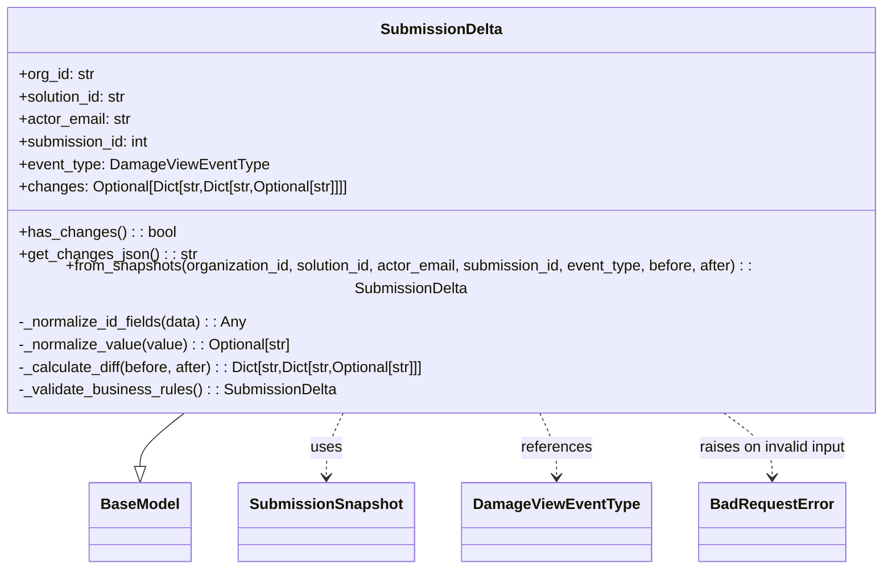

# Diagram: entity_core/entity_service/entity_service/damageview/model/submission_delta.py

> Auto-generated by Obscura crawlers

## Mermaid

### SVG

<svg id="container" width="973.2421875" xmlns="http://www.w3.org/2000/svg" class="classDiagram" height="582" viewBox="0 0 973.2421875 582" role="graphics-document document" aria-roledescription="class"><g><defs><marker id="container_class-aggregationStart" class="marker aggregation class" refX="18" refY="7" markerWidth="190" markerHeight="240" orient="auto"><path d="M 18,7 L9,13 L1,7 L9,1 Z"></path></marker></defs><defs><marker id="container_class-aggregationEnd" class="marker aggregation class" refX="1" refY="7" markerWidth="20" markerHeight="28" orient="auto"><path d="M 18,7 L9,13 L1,7 L9,1 Z"></path></marker></defs><defs><marker id="container_class-extensionStart" class="marker extension class" refX="18" refY="7" markerWidth="190" markerHeight="240" orient="auto"><path d="M 1,7 L18,13 V 1 Z"></path></marker></defs><defs><marker id="container_class-extensionEnd" class="marker extension class" refX="1" refY="7" markerWidth="20" markerHeight="28" orient="auto"><path d="M 1,1 V 13 L18,7 Z"></path></marker></defs><defs><marker id="container_class-compositionStart" class="marker composition class" refX="18" refY="7" markerWidth="190" markerHeight="240" orient="auto"><path d="M 18,7 L9,13 L1,7 L9,1 Z"></path></marker></defs><defs><marker id="container_class-compositionEnd" class="marker composition class" refX="1" refY="7" markerWidth="20" markerHeight="28" orient="auto"><path d="M 18,7 L9,13 L1,7 L9,1 Z"></path></marker></defs><defs><marker id="container_class-dependencyStart" class="marker dependency class" refX="6" refY="7" markerWidth="190" markerHeight="240" orient="auto"><path d="M 5,7 L9,13 L1,7 L9,1 Z"></path></marker></defs><defs><marker id="container_class-dependencyEnd" class="marker dependency class" refX="13" refY="7" markerWidth="20" markerHeight="28" orient="auto"><path d="M 18,7 L9,13 L14,7 L9,1 Z"></path></marker></defs><defs><marker id="container_class-lollipopStart" class="marker lollipop class" refX="13" refY="7" markerWidth="190" markerHeight="240" orient="auto"><circle stroke="black" fill="transparent" cx="7" cy="7" r="6"></circle></marker></defs><defs><marker id="container_class-lollipopEnd" class="marker lollipop class" refX="1" refY="7" markerWidth="190" markerHeight="240" orient="auto"><circle stroke="black" fill="transparent" cx="7" cy="7" r="6"></circle></marker></defs><g class="root"><g class="clusters"></g><g class="edgePaths"><path d="M225.729,416L217.842,422.167C209.956,428.333,194.183,440.667,186.297,450.125C178.41,459.583,178.41,466.167,178.41,469.458L178.41,472.75" id="id_SubmissionDelta_BaseModel_1" class="edge-thickness-normal edge-pattern-solid relation" style=";;;" data-edge="true" data-et="edge" data-id="id_SubmissionDelta_BaseModel_1" data-points="W3sieCI6MjI1LjcyODg0Nzg5OTM3NzU3LCJ5Ijo0MTZ9LHsieCI6MTc4LjQxMDE1NjI1LCJ5Ijo0NTN9LHsieCI6MTc4LjQxMDE1NjI1LCJ5Ijo0OTB9XQ==" marker-end="url(#container_class-extensionEnd)"></path><path d="M387.266,416L384.263,422.167C381.26,428.333,375.253,440.667,372.249,452C369.246,463.333,369.246,473.667,369.246,478.833L369.246,484" id="id_SubmissionDelta_SubmissionSnapshot_2" class="edge-thickness-normal edge-pattern-dashed relation" style=";;;" data-edge="true" data-et="edge" data-id="id_SubmissionDelta_SubmissionSnapshot_2" data-points="W3sieCI6Mzg3LjI2NjMyMTk2NTc2NzY0LCJ5Ijo0MTZ9LHsieCI6MzY5LjI0NjA5Mzc1LCJ5Ijo0NTN9LHsieCI6MzY5LjI0NjA5Mzc1LCJ5Ijo0OTB9XQ==" marker-end="url(#container_class-dependencyEnd)"></path><path d="M585.976,416L588.979,422.167C591.983,428.333,597.989,440.667,600.993,452C603.996,463.333,603.996,473.667,603.996,478.833L603.996,484" id="id_SubmissionDelta_DamageViewEventType_3" class="edge-thickness-normal edge-pattern-dashed relation" style=";;;" data-edge="true" data-et="edge" data-id="id_SubmissionDelta_DamageViewEventType_3" data-points="W3sieCI6NTg1Ljk3NTg2NTUzNDIzMjQsInkiOjQxNn0seyJ4Ijo2MDMuOTk2MDkzNzUsInkiOjQ1M30seyJ4Ijo2MDMuOTk2MDkzNzUsInkiOjQ5MH1d" marker-end="url(#container_class-dependencyEnd)"></path><path d="M772.431,416L781.071,422.167C789.711,428.333,806.99,440.667,815.63,452C824.27,463.333,824.27,473.667,824.27,478.833L824.27,484" id="id_SubmissionDelta_BadRequestError_4" class="edge-thickness-normal edge-pattern-dashed relation" style=";;;" data-edge="true" data-et="edge" data-id="id_SubmissionDelta_BadRequestError_4" data-points="W3sieCI6NzcyLjQzMTM4OTM5MzE1MzUsInkiOjQxNn0seyJ4Ijo4MjQuMjY5NTMxMjUsInkiOjQ1M30seyJ4Ijo4MjQuMjY5NTMxMjUsInkiOjQ5MH1d" marker-end="url(#container_class-dependencyEnd)"></path></g><g class="edgeLabels"><g class="edgeLabel"><g class="label" data-id="id_SubmissionDelta_BaseModel_1" transform="translate(0, 0)"><foreignObject width="0" height="0">

</foreignObject></g></g><g class="edgeLabel" transform="translate(369.24609375, 453)"><g class="label" data-id="id_SubmissionDelta_SubmissionSnapshot_2" transform="translate(-16.4921875, -12)"><foreignObject width="32.984375" height="24">

uses

</foreignObject></g></g><g class="edgeLabel" transform="translate(603.99609375, 453)"><g class="label" data-id="id_SubmissionDelta_DamageViewEventType_3" transform="translate(-37.828125, -12)"><foreignObject width="75.65625" height="24">

references

</foreignObject></g></g><g class="edgeLabel" transform="translate(824.26953125, 453)"><g class="label" data-id="id_SubmissionDelta_BadRequestError_4" transform="translate(-80.5625, -12)"><foreignObject width="161.125" height="24">

raises on invalid input

</foreignObject></g></g></g><g class="nodes"><g class="node default" id="classId-BaseModel-0" transform="translate(178.41015625, 532)"><g class="basic label-container"><path d="M-52.078125 -42 L52.078125 -42 L52.078125 42 L-52.078125 42" stroke="none" stroke-width="0" fill="#ECECFF" style=""></path><path d="M-52.078125 -42 C-17.37413630459335 -42, 17.3298523908133 -42, 52.078125 -42 M-52.078125 -42 C-26.7477446020081 -42, -1.4173642040162022 -42, 52.078125 -42 M52.078125 -42 C52.078125 -18.184931714578596, 52.078125 5.630136570842808, 52.078125 42 M52.078125 -42 C52.078125 -21.595083522185423, 52.078125 -1.1901670443708454, 52.078125 42 M52.078125 42 C28.90184141048344 42, 5.725557820966877 42, -52.078125 42 M52.078125 42 C14.275420286379529 42, -23.527284427240943 42, -52.078125 42 M-52.078125 42 C-52.078125 11.182995762954768, -52.078125 -19.634008474090464, -52.078125 -42 M-52.078125 42 C-52.078125 22.90970139893102, -52.078125 3.8194027978620397, -52.078125 -42" stroke="#9370DB" stroke-width="1.3" fill="none" stroke-dasharray="0 0" style=""></path></g><g class="annotation-group text" transform="translate(0, -18)"></g><g class="label-group text" transform="translate(-40.078125, -18)"><g class="label" style="font-weight: bolder" transform="translate(0,-12)"><foreignObject width="80.15625" height="24">

BaseModel

</foreignObject></g></g><g class="members-group text" transform="translate(-40.078125, 30)"></g><g class="methods-group text" transform="translate(-40.078125, 60)"></g><g class="divider" style=""><path d="M-52.078125 6 C-18.18544560936693 6, 15.70723378126614 6, 52.078125 6 M-52.078125 6 C-16.835785176335847 6, 18.406554647328306 6, 52.078125 6" stroke="#9370DB" stroke-width="1.3" fill="none" stroke-dasharray="0 0" style=""></path></g><g class="divider" style=""><path d="M-52.078125 24 C-23.15096564903365 24, 5.776193701932698 24, 52.078125 24 M-52.078125 24 C-25.43812065737057 24, 1.2018836852588635 24, 52.078125 24" stroke="#9370DB" stroke-width="1.3" fill="none" stroke-dasharray="0 0" style=""></path></g></g><g class="node default" id="classId-SubmissionDelta-1" transform="translate(486.62109375, 212)"><g class="basic label-container"><path d="M-478.62109375 -204 L478.62109375 -204 L478.62109375 204 L-478.62109375 204" stroke="none" stroke-width="0" fill="#ECECFF" style=""></path><path d="M-478.62109375 -204 C-263.1642834835138 -204, -47.707473217027655 -204, 478.62109375 -204 M-478.62109375 -204 C-220.66204043379486 -204, 37.297012882410286 -204, 478.62109375 -204 M478.62109375 -204 C478.62109375 -95.6037072196738, 478.62109375 12.792585560652412, 478.62109375 204 M478.62109375 -204 C478.62109375 -61.74648161397886, 478.62109375 80.50703677204228, 478.62109375 204 M478.62109375 204 C130.0296460430099 204, -218.5618016639802 204, -478.62109375 204 M478.62109375 204 C257.33514323925465 204, 36.0491927285093 204, -478.62109375 204 M-478.62109375 204 C-478.62109375 119.59419988961898, -478.62109375 35.188399779237955, -478.62109375 -204 M-478.62109375 204 C-478.62109375 67.87032875436242, -478.62109375 -68.25934249127516, -478.62109375 -204" stroke="#9370DB" stroke-width="1.3" fill="none" stroke-dasharray="0 0" style=""></path></g><g class="annotation-group text" transform="translate(0, -180)"></g><g class="label-group text" transform="translate(-61.5390625, -180)"><g class="label" style="font-weight: bolder" transform="translate(0,-12)"><foreignObject width="123.078125" height="24">

SubmissionDelta

</foreignObject></g></g><g class="members-group text" transform="translate(-466.62109375, -132)"><g class="label" style="" transform="translate(0,-12)"><foreignObject width="81.5625" height="24">

+org_id: str

</foreignObject></g><g class="label" style="" transform="translate(0,12)"><foreignObject width="117.71875" height="24">

+solution_id: str

</foreignObject></g><g class="label" style="" transform="translate(0,36)"><foreignObject width="119.875" height="24">

+actor_email: str

</foreignObject></g><g class="label" style="" transform="translate(0,60)"><foreignObject width="140.671875" height="24">

+submission_id: int

</foreignObject></g><g class="label" style="" transform="translate(0,84)"><foreignObject width="261.34375" height="24">

+event_type: DamageViewEventType

</foreignObject></g><g class="label" style="" transform="translate(0,108)"><foreignObject width="361.828125" height="24">

+changes: Optional[Dict[str,Dict[str,Optional[str]]]]

</foreignObject></g></g><g class="methods-group text" transform="translate(-466.62109375, 36)"><g class="label" style="" transform="translate(0,-12)"><foreignObject width="164.078125" height="24">

+has_changes() : : bool

</foreignObject></g><g class="label" style="" transform="translate(0,12)"><foreignObject width="187.359375" height="24">

+get_changes_json() : : str

</foreignObject></g><g class="label" style="" transform="translate(0,36)"><foreignObject width="871.703125" height="24">

+from_snapshots(organization_id, solution_id, actor_email, submission_id, event_type, before, after) : : SubmissionDelta

</foreignObject></g><g class="label" style="" transform="translate(0,60)"><foreignObject width="244.8125" height="24">

-_normalize_id_fields(data) : : Any

</foreignObject></g><g class="label" style="" transform="translate(0,84)"><foreignObject width="294.046875" height="24">

-_normalize_value(value) : : Optional[str]

</foreignObject></g><g class="label" style="" transform="translate(0,108)"><foreignObject width="444.3125" height="24">

-_calculate_diff(before, after) : : Dict[str,Dict[str,Optional[str]]]

</foreignObject></g><g class="label" style="" transform="translate(0,132)"><foreignObject width="339.5" height="24">

-_validate_business_rules() : : SubmissionDelta

</foreignObject></g></g><g class="divider" style=""><path d="M-478.62109375 -156 C-132.40196221450697 -156, 213.81716932098607 -156, 478.62109375 -156 M-478.62109375 -156 C-169.75027110523376 -156, 139.12055153953247 -156, 478.62109375 -156" stroke="#9370DB" stroke-width="1.3" fill="none" stroke-dasharray="0 0" style=""></path></g><g class="divider" style=""><path d="M-478.62109375 12 C-186.68571874091282 12, 105.24965626817436 12, 478.62109375 12 M-478.62109375 12 C-219.74244520345928 12, 39.136203343081434 12, 478.62109375 12" stroke="#9370DB" stroke-width="1.3" fill="none" stroke-dasharray="0 0" style=""></path></g></g><g class="node default" id="classId-SubmissionSnapshot-2" transform="translate(369.24609375, 532)"><g class="basic label-container"><path d="M-88.7578125 -42 L88.7578125 -42 L88.7578125 42 L-88.7578125 42" stroke="none" stroke-width="0" fill="#ECECFF" style=""></path><path d="M-88.7578125 -42 C-38.815991371679885 -42, 11.125829756640229 -42, 88.7578125 -42 M-88.7578125 -42 C-27.094000079499416 -42, 34.56981234100117 -42, 88.7578125 -42 M88.7578125 -42 C88.7578125 -9.298487308854149, 88.7578125 23.403025382291702, 88.7578125 42 M88.7578125 -42 C88.7578125 -15.660665948626264, 88.7578125 10.678668102747473, 88.7578125 42 M88.7578125 42 C49.428584813980045 42, 10.09935712796009 42, -88.7578125 42 M88.7578125 42 C20.26677640900529 42, -48.22425968198942 42, -88.7578125 42 M-88.7578125 42 C-88.7578125 19.664608726440715, -88.7578125 -2.67078254711857, -88.7578125 -42 M-88.7578125 42 C-88.7578125 23.095499640769933, -88.7578125 4.190999281539867, -88.7578125 -42" stroke="#9370DB" stroke-width="1.3" fill="none" stroke-dasharray="0 0" style=""></path></g><g class="annotation-group text" transform="translate(0, -18)"></g><g class="label-group text" transform="translate(-76.7578125, -18)"><g class="label" style="font-weight: bolder" transform="translate(0,-12)"><foreignObject width="153.515625" height="24">

SubmissionSnapshot

</foreignObject></g></g><g class="members-group text" transform="translate(-76.7578125, 30)"></g><g class="methods-group text" transform="translate(-76.7578125, 60)"></g><g class="divider" style=""><path d="M-88.7578125 6 C-24.983256689484456 6, 38.79129912103109 6, 88.7578125 6 M-88.7578125 6 C-40.10143465281869 6, 8.554943194362622 6, 88.7578125 6" stroke="#9370DB" stroke-width="1.3" fill="none" stroke-dasharray="0 0" style=""></path></g><g class="divider" style=""><path d="M-88.7578125 24 C-28.07580558200661 24, 32.60620133598678 24, 88.7578125 24 M-88.7578125 24 C-52.36084200199793 24, -15.963871503995861 24, 88.7578125 24" stroke="#9370DB" stroke-width="1.3" fill="none" stroke-dasharray="0 0" style=""></path></g></g><g class="node default" id="classId-DamageViewEventType-3" transform="translate(603.99609375, 532)"><g class="basic label-container"><path d="M-95.9921875 -42 L95.9921875 -42 L95.9921875 42 L-95.9921875 42" stroke="none" stroke-width="0" fill="#ECECFF" style=""></path><path d="M-95.9921875 -42 C-30.242171968724094 -42, 35.50784356255181 -42, 95.9921875 -42 M-95.9921875 -42 C-31.734283250999113 -42, 32.523620998001775 -42, 95.9921875 -42 M95.9921875 -42 C95.9921875 -10.657554259527814, 95.9921875 20.684891480944373, 95.9921875 42 M95.9921875 -42 C95.9921875 -19.826779871082945, 95.9921875 2.346440257834111, 95.9921875 42 M95.9921875 42 C54.16517082068594 42, 12.338154141371874 42, -95.9921875 42 M95.9921875 42 C41.41152955001416 42, -13.169128399971683 42, -95.9921875 42 M-95.9921875 42 C-95.9921875 18.426722496578208, -95.9921875 -5.146555006843585, -95.9921875 -42 M-95.9921875 42 C-95.9921875 21.1302438972039, -95.9921875 0.26048779440780123, -95.9921875 -42" stroke="#9370DB" stroke-width="1.3" fill="none" stroke-dasharray="0 0" style=""></path></g><g class="annotation-group text" transform="translate(0, -18)"></g><g class="label-group text" transform="translate(-83.9921875, -18)"><g class="label" style="font-weight: bolder" transform="translate(0,-12)"><foreignObject width="167.984375" height="24">

DamageViewEventType

</foreignObject></g></g><g class="members-group text" transform="translate(-83.9921875, 30)"></g><g class="methods-group text" transform="translate(-83.9921875, 60)"></g><g class="divider" style=""><path d="M-95.9921875 6 C-38.87078952972818 6, 18.250608440543644 6, 95.9921875 6 M-95.9921875 6 C-47.670032156557845 6, 0.6521231868843103 6, 95.9921875 6" stroke="#9370DB" stroke-width="1.3" fill="none" stroke-dasharray="0 0" style=""></path></g><g class="divider" style=""><path d="M-95.9921875 24 C-22.396369793791223 24, 51.199447912417554 24, 95.9921875 24 M-95.9921875 24 C-45.17823540316402 24, 5.6357166936719665 24, 95.9921875 24" stroke="#9370DB" stroke-width="1.3" fill="none" stroke-dasharray="0 0" style=""></path></g></g><g class="node default" id="classId-BadRequestError-4" transform="translate(824.26953125, 532)"><g class="basic label-container"><path d="M-74.28125 -42 L74.28125 -42 L74.28125 42 L-74.28125 42" stroke="none" stroke-width="0" fill="#ECECFF" style=""></path><path d="M-74.28125 -42 C-43.58128158709759 -42, -12.881313174195178 -42, 74.28125 -42 M-74.28125 -42 C-35.63113219468602 -42, 3.018985610627965 -42, 74.28125 -42 M74.28125 -42 C74.28125 -10.621667619332413, 74.28125 20.756664761335173, 74.28125 42 M74.28125 -42 C74.28125 -22.56534910068859, 74.28125 -3.1306982013771787, 74.28125 42 M74.28125 42 C34.23028044593075 42, -5.820689108138495 42, -74.28125 42 M74.28125 42 C15.808609860138887 42, -42.664030279722226 42, -74.28125 42 M-74.28125 42 C-74.28125 20.841197307877856, -74.28125 -0.3176053842442883, -74.28125 -42 M-74.28125 42 C-74.28125 24.006271000645743, -74.28125 6.012542001291486, -74.28125 -42" stroke="#9370DB" stroke-width="1.3" fill="none" stroke-dasharray="0 0" style=""></path></g><g class="annotation-group text" transform="translate(0, -18)"></g><g class="label-group text" transform="translate(-62.28125, -18)"><g class="label" style="font-weight: bolder" transform="translate(0,-12)"><foreignObject width="124.5625" height="24">

BadRequestError

</foreignObject></g></g><g class="members-group text" transform="translate(-62.28125, 30)"></g><g class="methods-group text" transform="translate(-62.28125, 60)"></g><g class="divider" style=""><path d="M-74.28125 6 C-23.00992375198416 6, 28.26140249603168 6, 74.28125 6 M-74.28125 6 C-32.85771690294819 6, 8.565816194103618 6, 74.28125 6" stroke="#9370DB" stroke-width="1.3" fill="none" stroke-dasharray="0 0" style=""></path></g><g class="divider" style=""><path d="M-74.28125 24 C-43.95721414975668 24, -13.633178299513354 24, 74.28125 24 M-74.28125 24 C-44.204235754565005 24, -14.12722150913001 24, 74.28125 24" stroke="#9370DB" stroke-width="1.3" fill="none" stroke-dasharray="0 0" style=""></path></g></g></g></g></g></svg>
