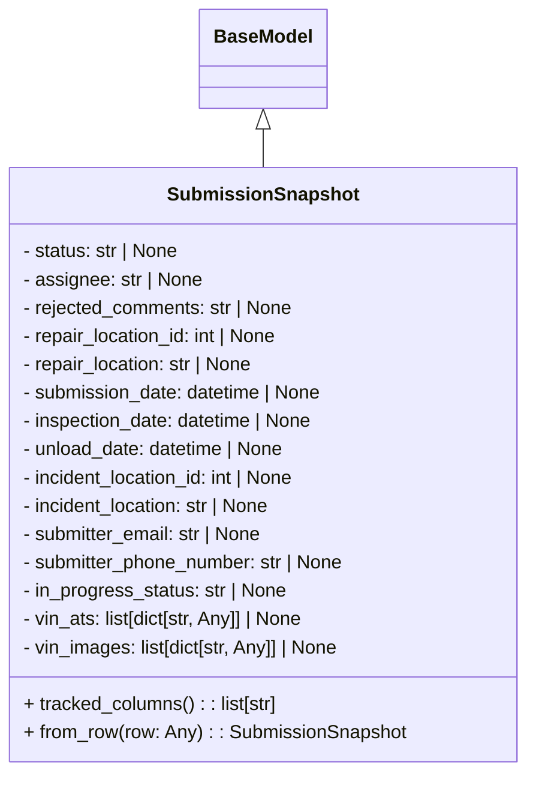

# Diagram: entity_core/entity_service/entity_service/damageview/model/submission_snapshot.py

> Auto-generated by Obscura crawlers

## Mermaid

### SVG

<svg id="container" width="441.7109375" xmlns="http://www.w3.org/2000/svg" class="classDiagram" height="654" viewBox="0 0 441.7109375 654" role="graphics-document document" aria-roledescription="class"><g><defs><marker id="container_class-aggregationStart" class="marker aggregation class" refX="18" refY="7" markerWidth="190" markerHeight="240" orient="auto"><path d="M 18,7 L9,13 L1,7 L9,1 Z"></path></marker></defs><defs><marker id="container_class-aggregationEnd" class="marker aggregation class" refX="1" refY="7" markerWidth="20" markerHeight="28" orient="auto"><path d="M 18,7 L9,13 L1,7 L9,1 Z"></path></marker></defs><defs><marker id="container_class-extensionStart" class="marker extension class" refX="18" refY="7" markerWidth="190" markerHeight="240" orient="auto"><path d="M 1,7 L18,13 V 1 Z"></path></marker></defs><defs><marker id="container_class-extensionEnd" class="marker extension class" refX="1" refY="7" markerWidth="20" markerHeight="28" orient="auto"><path d="M 1,1 V 13 L18,7 Z"></path></marker></defs><defs><marker id="container_class-compositionStart" class="marker composition class" refX="18" refY="7" markerWidth="190" markerHeight="240" orient="auto"><path d="M 18,7 L9,13 L1,7 L9,1 Z"></path></marker></defs><defs><marker id="container_class-compositionEnd" class="marker composition class" refX="1" refY="7" markerWidth="20" markerHeight="28" orient="auto"><path d="M 18,7 L9,13 L1,7 L9,1 Z"></path></marker></defs><defs><marker id="container_class-dependencyStart" class="marker dependency class" refX="6" refY="7" markerWidth="190" markerHeight="240" orient="auto"><path d="M 5,7 L9,13 L1,7 L9,1 Z"></path></marker></defs><defs><marker id="container_class-dependencyEnd" class="marker dependency class" refX="13" refY="7" markerWidth="20" markerHeight="28" orient="auto"><path d="M 18,7 L9,13 L14,7 L9,1 Z"></path></marker></defs><defs><marker id="container_class-lollipopStart" class="marker lollipop class" refX="13" refY="7" markerWidth="190" markerHeight="240" orient="auto"><circle stroke="black" fill="transparent" cx="7" cy="7" r="6"></circle></marker></defs><defs><marker id="container_class-lollipopEnd" class="marker lollipop class" refX="1" refY="7" markerWidth="190" markerHeight="240" orient="auto"><circle stroke="black" fill="transparent" cx="7" cy="7" r="6"></circle></marker></defs><g class="root"><g class="clusters"></g><g class="edgePaths"><path d="M220.855,109.25L220.855,110.542C220.855,111.833,220.855,114.417,220.855,119.875C220.855,125.333,220.855,133.667,220.855,137.833L220.855,142" id="id_BaseModel_SubmissionSnapshot_1" class="edge-thickness-normal edge-pattern-solid relation" style=";;;" data-edge="true" data-et="edge" data-id="id_BaseModel_SubmissionSnapshot_1" data-points="W3sieCI6MjIwLjg1NTQ2ODc1LCJ5Ijo5Mn0seyJ4IjoyMjAuODU1NDY4NzUsInkiOjExN30seyJ4IjoyMjAuODU1NDY4NzUsInkiOjE0Mn1d" marker-start="url(#container_class-extensionStart)"></path></g><g class="edgeLabels"><g class="edgeLabel"><g class="label" data-id="id_BaseModel_SubmissionSnapshot_1" transform="translate(0, 0)"><foreignObject width="0" height="0">

</foreignObject></g></g></g><g class="nodes"><g class="node default" id="classId-BaseModel-0" transform="translate(220.85546875, 50)"><g class="basic label-container"><path d="M-52.078125 -42 L52.078125 -42 L52.078125 42 L-52.078125 42" stroke="none" stroke-width="0" fill="#ECECFF" style=""></path><path d="M-52.078125 -42 C-27.239077662064417 -42, -2.400030324128835 -42, 52.078125 -42 M-52.078125 -42 C-12.838040944958458 -42, 26.402043110083085 -42, 52.078125 -42 M52.078125 -42 C52.078125 -17.009960619366048, 52.078125 7.9800787612679045, 52.078125 42 M52.078125 -42 C52.078125 -24.525418850310086, 52.078125 -7.050837700620171, 52.078125 42 M52.078125 42 C28.700567590961867 42, 5.323010181923735 42, -52.078125 42 M52.078125 42 C15.123976161070694 42, -21.830172677858613 42, -52.078125 42 M-52.078125 42 C-52.078125 24.063218533186152, -52.078125 6.126437066372304, -52.078125 -42 M-52.078125 42 C-52.078125 10.823623759351214, -52.078125 -20.35275248129757, -52.078125 -42" stroke="#9370DB" stroke-width="1.3" fill="none" stroke-dasharray="0 0" style=""></path></g><g class="annotation-group text" transform="translate(0, -18)"></g><g class="label-group text" transform="translate(-40.078125, -18)"><g class="label" style="font-weight: bolder" transform="translate(0,-12)"><foreignObject width="80.15625" height="24">

BaseModel

</foreignObject></g></g><g class="members-group text" transform="translate(-40.078125, 30)"></g><g class="methods-group text" transform="translate(-40.078125, 60)"></g><g class="divider" style=""><path d="M-52.078125 6 C-25.685657150098837 6, 0.7068106998023254 6, 52.078125 6 M-52.078125 6 C-20.297809749069472 6, 11.482505501861056 6, 52.078125 6" stroke="#9370DB" stroke-width="1.3" fill="none" stroke-dasharray="0 0" style=""></path></g><g class="divider" style=""><path d="M-52.078125 24 C-22.231163847234008 24, 7.615797305531984 24, 52.078125 24 M-52.078125 24 C-13.273724172617165 24, 25.53067665476567 24, 52.078125 24" stroke="#9370DB" stroke-width="1.3" fill="none" stroke-dasharray="0 0" style=""></path></g></g><g class="node default" id="classId-SubmissionSnapshot-1" transform="translate(220.85546875, 394)"><g class="basic label-container"><path d="M-212.85546875 -252 L212.85546875 -252 L212.85546875 252 L-212.85546875 252" stroke="none" stroke-width="0" fill="#ECECFF" style=""></path><path d="M-212.85546875 -252 C-106.46738296617477 -252, -0.07929718234953498 -252, 212.85546875 -252 M-212.85546875 -252 C-116.62178310793712 -252, -20.38809746587424 -252, 212.85546875 -252 M212.85546875 -252 C212.85546875 -80.48308401919041, 212.85546875 91.03383196161917, 212.85546875 252 M212.85546875 -252 C212.85546875 -129.4833324230197, 212.85546875 -6.966664846039436, 212.85546875 252 M212.85546875 252 C78.07682882202653 252, -56.701811105946945 252, -212.85546875 252 M212.85546875 252 C65.7082715852755 252, -81.438925579449 252, -212.85546875 252 M-212.85546875 252 C-212.85546875 80.81690093378171, -212.85546875 -90.36619813243658, -212.85546875 -252 M-212.85546875 252 C-212.85546875 103.5762835016289, -212.85546875 -44.847432996742214, -212.85546875 -252" stroke="#9370DB" stroke-width="1.3" fill="none" stroke-dasharray="0 0" style=""></path></g><g class="annotation-group text" transform="translate(0, -228)"></g><g class="label-group text" transform="translate(-76.7578125, -228)"><g class="label" style="font-weight: bolder" transform="translate(0,-12)"><foreignObject width="153.515625" height="24">

SubmissionSnapshot

</foreignObject></g></g><g class="members-group text" transform="translate(-200.85546875, -180)"><g class="label" style="" transform="translate(0,-12)"><foreignObject width="135.890625" height="24">

- status: str | None

</foreignObject></g><g class="label" style="" transform="translate(0,12)"><foreignObject width="154.46875" height="24">

- assignee: str | None

</foreignObject></g><g class="label" style="" transform="translate(0,36)"><foreignObject width="234.03125" height="24">

- rejected_comments: str | None

</foreignObject></g><g class="label" style="" transform="translate(0,60)"><foreignObject width="223.3125" height="24">

- repair_location_id: int | None

</foreignObject></g><g class="label" style="" transform="translate(0,84)"><foreignObject width="200.6875" height="24">

- repair_location: str | None

</foreignObject></g><g class="label" style="" transform="translate(0,108)"><foreignObject width="260.375" height="24">

- submission_date: datetime | None

</foreignObject></g><g class="label" style="" transform="translate(0,132)"><foreignObject width="254.09375" height="24">

- inspection_date: datetime | None

</foreignObject></g><g class="label" style="" transform="translate(0,156)"><foreignObject width="228.59375" height="24">

- unload_date: datetime | None

</foreignObject></g><g class="label" style="" transform="translate(0,180)"><foreignObject width="240.9375" height="24">

- incident_location_id: int | None

</foreignObject></g><g class="label" style="" transform="translate(0,204)"><foreignObject width="218.296875" height="24">

- incident_location: str | None

</foreignObject></g><g class="label" style="" transform="translate(0,228)"><foreignObject width="209.4375" height="24">

- submitter_email: str | None

</foreignObject></g><g class="label" style="" transform="translate(0,252)"><foreignObject width="280.53125" height="24">

- submitter_phone_number: str | None

</foreignObject></g><g class="label" style="" transform="translate(0,276)"><foreignObject width="228.171875" height="24">

- in_progress_status: str | None

</foreignObject></g><g class="label" style="" transform="translate(0,300)"><foreignObject width="246.875" height="24">

- vin_ats: list[dict[str, Any]] | None

</foreignObject></g><g class="label" style="" transform="translate(0,324)"><foreignObject width="276.265625" height="24">

- vin_images: list[dict[str, Any]] | None

</foreignObject></g></g><g class="methods-group text" transform="translate(-200.85546875, 204)"><g class="label" style="" transform="translate(0,-12)"><foreignObject width="218.484375" height="24">

+ tracked_columns() : : list[str]

</foreignObject></g><g class="label" style="" transform="translate(0,12)"><foreignObject width="324.953125" height="24">

+ from_row(row: Any) : : SubmissionSnapshot

</foreignObject></g></g><g class="divider" style=""><path d="M-212.85546875 -204 C-46.85479655513788 -204, 119.14587563972424 -204, 212.85546875 -204 M-212.85546875 -204 C-82.02755257506419 -204, 48.800363599871616 -204, 212.85546875 -204" stroke="#9370DB" stroke-width="1.3" fill="none" stroke-dasharray="0 0" style=""></path></g><g class="divider" style=""><path d="M-212.85546875 180 C-122.63987077996832 180, -32.42427280993664 180, 212.85546875 180 M-212.85546875 180 C-95.50552720863865 180, 21.844414332722693 180, 212.85546875 180" stroke="#9370DB" stroke-width="1.3" fill="none" stroke-dasharray="0 0" style=""></path></g></g></g></g></g></svg>
