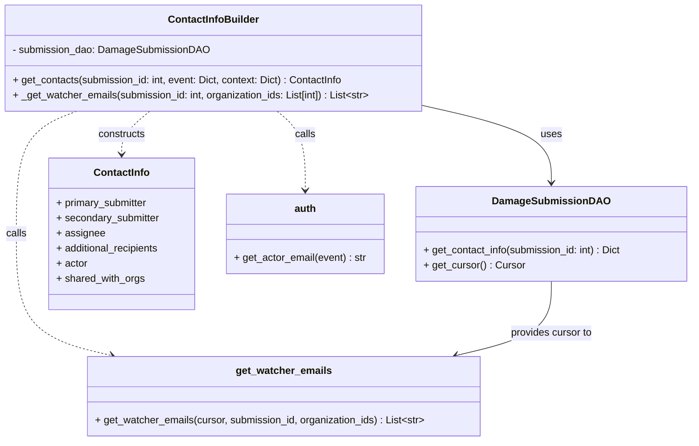
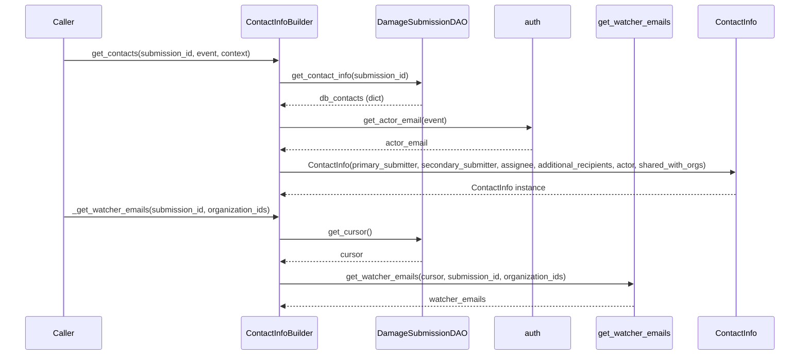

# Diagram: entity_core/entity_service/entity_service/damageview/notification_handler/builders/contacts_data_builder.py

> Auto-generated by Obscura crawlers

## Diagram 1

### SVG

<svg id="container" width="1097.32421875" xmlns="http://www.w3.org/2000/svg" class="classDiagram" height="698" viewBox="0 0 1097.32421875 698" role="graphics-document document" aria-roledescription="class"><g><defs><marker id="container_class-aggregationStart" class="marker aggregation class" refX="18" refY="7" markerWidth="190" markerHeight="240" orient="auto"><path d="M 18,7 L9,13 L1,7 L9,1 Z"></path></marker></defs><defs><marker id="container_class-aggregationEnd" class="marker aggregation class" refX="1" refY="7" markerWidth="20" markerHeight="28" orient="auto"><path d="M 18,7 L9,13 L1,7 L9,1 Z"></path></marker></defs><defs><marker id="container_class-extensionStart" class="marker extension class" refX="18" refY="7" markerWidth="190" markerHeight="240" orient="auto"><path d="M 1,7 L18,13 V 1 Z"></path></marker></defs><defs><marker id="container_class-extensionEnd" class="marker extension class" refX="1" refY="7" markerWidth="20" markerHeight="28" orient="auto"><path d="M 1,1 V 13 L18,7 Z"></path></marker></defs><defs><marker id="container_class-compositionStart" class="marker composition class" refX="18" refY="7" markerWidth="190" markerHeight="240" orient="auto"><path d="M 18,7 L9,13 L1,7 L9,1 Z"></path></marker></defs><defs><marker id="container_class-compositionEnd" class="marker composition class" refX="1" refY="7" markerWidth="20" markerHeight="28" orient="auto"><path d="M 18,7 L9,13 L1,7 L9,1 Z"></path></marker></defs><defs><marker id="container_class-dependencyStart" class="marker dependency class" refX="6" refY="7" markerWidth="190" markerHeight="240" orient="auto"><path d="M 5,7 L9,13 L1,7 L9,1 Z"></path></marker></defs><defs><marker id="container_class-dependencyEnd" class="marker dependency class" refX="13" refY="7" markerWidth="20" markerHeight="28" orient="auto"><path d="M 18,7 L9,13 L14,7 L9,1 Z"></path></marker></defs><defs><marker id="container_class-lollipopStart" class="marker lollipop class" refX="13" refY="7" markerWidth="190" markerHeight="240" orient="auto"><circle stroke="black" fill="transparent" cx="7" cy="7" r="6"></circle></marker></defs><defs><marker id="container_class-lollipopEnd" class="marker lollipop class" refX="1" refY="7" markerWidth="190" markerHeight="240" orient="auto"><circle stroke="black" fill="transparent" cx="7" cy="7" r="6"></circle></marker></defs><g class="root"><g class="clusters"></g><g class="edgePaths"><path d="M673,167.203L706.748,174.835C740.496,182.468,807.992,197.734,841.74,218.034C875.488,238.333,875.488,263.667,875.488,276.333L875.488,289" id="id_ContactInfoBuilder_DamageSubmissionDAO_1" class="edge-thickness-normal edge-pattern-solid relation" style=";;;" data-edge="true" data-et="edge" data-id="id_ContactInfoBuilder_DamageSubmissionDAO_1" data-points="W3sieCI6NjczLCJ5IjoxNjcuMjAyNTgxODMyMjUzOX0seyJ4Ijo4NzUuNDg4MjgxMjUsInkiOjIxM30seyJ4Ijo4NzUuNDg4MjgxMjUsInkiOjI5NX1d" marker-end="url(#container_class-dependencyEnd)"></path><path d="M239.166,176L231.727,182.167C224.288,188.333,209.41,200.667,201.97,212C194.531,223.333,194.531,233.667,194.531,238.833L194.531,244" id="id_ContactInfoBuilder_ContactInfo_2" class="edge-thickness-normal edge-pattern-dashed relation" style=";;;" data-edge="true" data-et="edge" data-id="id_ContactInfoBuilder_ContactInfo_2" data-points="W3sieCI6MjM5LjE2NjMyMjMxNDA0OTU4LCJ5IjoxNzZ9LHsieCI6MTk0LjUzMTI1LCJ5IjoyMTN9LHsieCI6MTk0LjUzMTI1LCJ5IjoyNTB9XQ==" marker-end="url(#container_class-dependencyEnd)"></path><path d="M441.834,176L449.273,182.167C456.712,188.333,471.59,200.667,479.03,221.5C486.469,242.333,486.469,271.667,486.469,286.333L486.469,301" id="id_ContactInfoBuilder_auth_3" class="edge-thickness-normal edge-pattern-dashed relation" style=";;;" data-edge="true" data-et="edge" data-id="id_ContactInfoBuilder_auth_3" data-points="W3sieCI6NDQxLjgzMzY3NzY4NTk1MDQsInkiOjE3Nn0seyJ4Ijo0ODYuNDY4NzUsInkiOjIxM30seyJ4Ijo0ODYuNDY4NzUsInkiOjMwN31d" marker-end="url(#container_class-dependencyEnd)"></path><path d="M122.4,176L106.389,182.167C90.377,188.333,58.355,200.667,42.343,233C26.332,265.333,26.332,317.667,26.332,370C26.332,422.333,26.332,474.667,51.541,506.771C76.75,538.875,127.168,550.75,152.377,556.687L177.586,562.624" id="id_ContactInfoBuilder_get_watcher_emails_4" class="edge-thickness-normal edge-pattern-dashed relation" style=";;;" data-edge="true" data-et="edge" data-id="id_ContactInfoBuilder_get_watcher_emails_4" data-points="W3sieCI6MTIyLjM5OTkyMjUyMDY2MTE2LCJ5IjoxNzZ9LHsieCI6MjYuMzMyMDMxMjUsInkiOjIxM30seyJ4IjoyNi4zMzIwMzEyNSwieSI6MzcwfSx7IngiOjI2LjMzMjAzMTI1LCJ5Ijo1Mjd9LHsieCI6MTgzLjQyNTkzNzQ5OTk5OTk3LCJ5Ijo1NjR9XQ==" marker-end="url(#container_class-dependencyEnd)"></path><path d="M875.488,445L875.488,458.667C875.488,472.333,875.488,499.667,850.279,519.271C825.07,538.875,774.652,550.75,749.444,556.687L724.235,562.624" id="id_DamageSubmissionDAO_get_watcher_emails_5" class="edge-thickness-normal edge-pattern-solid relation" style=";;;" data-edge="true" data-et="edge" data-id="id_DamageSubmissionDAO_get_watcher_emails_5" data-points="W3sieCI6ODc1LjQ4ODI4MTI1LCJ5Ijo0NDV9LHsieCI6ODc1LjQ4ODI4MTI1LCJ5Ijo1Mjd9LHsieCI6NzE4LjM5NDM3NTAwMDAwMDEsInkiOjU2NH1d" marker-end="url(#container_class-dependencyEnd)"></path></g><g class="edgeLabels"><g class="edgeLabel" transform="translate(875.48828125, 213)"><g class="label" data-id="id_ContactInfoBuilder_DamageSubmissionDAO_1" transform="translate(-16.4921875, -12)"><foreignObject width="32.984375" height="24">

uses

</foreignObject></g></g><g class="edgeLabel" transform="translate(194.53125, 213)"><g class="label" data-id="id_ContactInfoBuilder_ContactInfo_2" transform="translate(-37.84375, -12)"><foreignObject width="75.6875" height="24">

constructs

</foreignObject></g></g><g class="edgeLabel" transform="translate(486.46875, 213)"><g class="label" data-id="id_ContactInfoBuilder_auth_3" transform="translate(-16.4453125, -12)"><foreignObject width="32.890625" height="24">

calls

</foreignObject></g></g><g class="edgeLabel" transform="translate(26.33203125, 370)"><g class="label" data-id="id_ContactInfoBuilder_get_watcher_emails_4" transform="translate(-16.4453125, -12)"><foreignObject width="32.890625" height="24">

calls

</foreignObject></g></g><g class="edgeLabel" transform="translate(875.48828125, 527)"><g class="label" data-id="id_DamageSubmissionDAO_get_watcher_emails_5" transform="translate(-65.859375, -12)"><foreignObject width="131.71875" height="24">

provides cursor to

</foreignObject></g></g></g><g class="nodes"><g class="node default" id="classId-ContactInfoBuilder-0" transform="translate(340.5, 92)"><g class="basic label-container"><path d="M-332.5 -84 L332.5 -84 L332.5 84 L-332.5 84" stroke="none" stroke-width="0" fill="#ECECFF" style=""></path><path d="M-332.5 -84 C-156.87001399887976 -84, 18.759972002240488 -84, 332.5 -84 M-332.5 -84 C-109.40426186342211 -84, 113.69147627315579 -84, 332.5 -84 M332.5 -84 C332.5 -48.625272860356375, 332.5 -13.25054572071275, 332.5 84 M332.5 -84 C332.5 -26.072920710352264, 332.5 31.854158579295472, 332.5 84 M332.5 84 C72.1094192768399 84, -188.2811614463202 84, -332.5 84 M332.5 84 C186.8468141699532 84, 41.19362833990641 84, -332.5 84 M-332.5 84 C-332.5 45.25896602540037, -332.5 6.517932050800738, -332.5 -84 M-332.5 84 C-332.5 25.505851232191787, -332.5 -32.988297535616425, -332.5 -84" stroke="#9370DB" stroke-width="1.3" fill="none" stroke-dasharray="0 0" style=""></path></g><g class="annotation-group text" transform="translate(0, -60)"></g><g class="label-group text" transform="translate(-68.953125, -60)"><g class="label" style="font-weight: bolder" transform="translate(0,-12)"><foreignObject width="137.90625" height="24">

ContactInfoBuilder

</foreignObject></g></g><g class="members-group text" transform="translate(-320.5, -12)"><g class="label" style="" transform="translate(0,-12)"><foreignObject width="308.8125" height="24">

- submission_dao: DamageSubmissionDAO

</foreignObject></g></g><g class="methods-group text" transform="translate(-320.5, 36)"><g class="label" style="" transform="translate(0,-12)"><foreignObject width="526.34375" height="24">

+ get_contacts(submission_id: int, event: Dict, context: Dict) : ContactInfo

</foreignObject></g><g class="label" style="" transform="translate(0,12)"><foreignObject width="572.046875" height="24">

+ _get_watcher_emails(submission_id: int, organization_ids: List[int]) : List&lt;str&gt;

</foreignObject></g></g><g class="divider" style=""><path d="M-332.5 -36 C-79.96584483166404 -36, 172.5683103366719 -36, 332.5 -36 M-332.5 -36 C-123.31749993645539 -36, 85.86500012708922 -36, 332.5 -36" stroke="#9370DB" stroke-width="1.3" fill="none" stroke-dasharray="0 0" style=""></path></g><g class="divider" style=""><path d="M-332.5 12 C-159.12484874258232 12, 14.250302514835369 12, 332.5 12 M-332.5 12 C-161.3018140658386 12, 9.896371868322774 12, 332.5 12" stroke="#9370DB" stroke-width="1.3" fill="none" stroke-dasharray="0 0" style=""></path></g></g><g class="node default" id="classId-DamageSubmissionDAO-1" transform="translate(875.48828125, 370)"><g class="basic label-container"><path d="M-213.8359375 -75 L213.8359375 -75 L213.8359375 75 L-213.8359375 75" stroke="none" stroke-width="0" fill="#ECECFF" style=""></path><path d="M-213.8359375 -75 C-50.22893676014931 -75, 113.37806397970138 -75, 213.8359375 -75 M-213.8359375 -75 C-43.27789572795615 -75, 127.2801460440877 -75, 213.8359375 -75 M213.8359375 -75 C213.8359375 -35.92781231923578, 213.8359375 3.1443753615284464, 213.8359375 75 M213.8359375 -75 C213.8359375 -18.751535530008155, 213.8359375 37.49692893998369, 213.8359375 75 M213.8359375 75 C69.66723634366147 75, -74.50146481267706 75, -213.8359375 75 M213.8359375 75 C72.5848824479068 75, -68.66617260418639 75, -213.8359375 75 M-213.8359375 75 C-213.8359375 26.60140431303975, -213.8359375 -21.797191373920498, -213.8359375 -75 M-213.8359375 75 C-213.8359375 44.58725830216056, -213.8359375 14.17451660432112, -213.8359375 -75" stroke="#9370DB" stroke-width="1.3" fill="none" stroke-dasharray="0 0" style=""></path></g><g class="annotation-group text" transform="translate(0, -51)"></g><g class="label-group text" transform="translate(-86.6875, -51)"><g class="label" style="font-weight: bolder" transform="translate(0,-12)"><foreignObject width="173.375" height="24">

DamageSubmissionDAO

</foreignObject></g></g><g class="members-group text" transform="translate(-201.8359375, -3)"></g><g class="methods-group text" transform="translate(-201.8359375, 27)"><g class="label" style="" transform="translate(0,-12)"><foreignObject width="316.984375" height="24">

+ get_contact_info(submission_id: int) : Dict

</foreignObject></g><g class="label" style="" transform="translate(0,12)"><foreignObject width="158.140625" height="24">

+ get_cursor() : Cursor

</foreignObject></g></g><g class="divider" style=""><path d="M-213.8359375 -27 C-79.55282091216915 -27, 54.730295675661694 -27, 213.8359375 -27 M-213.8359375 -27 C-52.13482651344316 -27, 109.56628447311368 -27, 213.8359375 -27" stroke="#9370DB" stroke-width="1.3" fill="none" stroke-dasharray="0 0" style=""></path></g><g class="divider" style=""><path d="M-213.8359375 -3 C-78.18074364802402 -3, 57.47445020395196 -3, 213.8359375 -3 M-213.8359375 -3 C-59.15375549952668 -3, 95.52842650094664 -3, 213.8359375 -3" stroke="#9370DB" stroke-width="1.3" fill="none" stroke-dasharray="0 0" style=""></path></g></g><g class="node default" id="classId-ContactInfo-2" transform="translate(194.53125, 370)"><g class="basic label-container"><path d="M-116.75390625 -120 L116.75390625 -120 L116.75390625 120 L-116.75390625 120" stroke="none" stroke-width="0" fill="#ECECFF" style=""></path><path d="M-116.75390625 -120 C-62.360592010668356 -120, -7.967277771336711 -120, 116.75390625 -120 M-116.75390625 -120 C-64.97339942809936 -120, -13.192892606198697 -120, 116.75390625 -120 M116.75390625 -120 C116.75390625 -40.291000900767415, 116.75390625 39.41799819846517, 116.75390625 120 M116.75390625 -120 C116.75390625 -62.927785873958626, 116.75390625 -5.855571747917253, 116.75390625 120 M116.75390625 120 C34.53860753270149 120, -47.67669118459702 120, -116.75390625 120 M116.75390625 120 C69.25403778964795 120, 21.754169329295905 120, -116.75390625 120 M-116.75390625 120 C-116.75390625 56.130260340475154, -116.75390625 -7.739479319049693, -116.75390625 -120 M-116.75390625 120 C-116.75390625 26.38215871529769, -116.75390625 -67.23568256940462, -116.75390625 -120" stroke="#9370DB" stroke-width="1.3" fill="none" stroke-dasharray="0 0" style=""></path></g><g class="annotation-group text" transform="translate(0, -96)"></g><g class="label-group text" transform="translate(-42.4296875, -96)"><g class="label" style="font-weight: bolder" transform="translate(0,-12)"><foreignObject width="84.859375" height="24">

ContactInfo

</foreignObject></g></g><g class="members-group text" transform="translate(-104.75390625, -48)"><g class="label" style="" transform="translate(0,-12)"><foreignObject width="147.453125" height="24">

+ primary_submitter

</foreignObject></g><g class="label" style="" transform="translate(0,12)"><foreignObject width="165.359375" height="24">

+ secondary_submitter

</foreignObject></g><g class="label" style="" transform="translate(0,36)"><foreignObject width="75.203125" height="24">

+ assignee

</foreignObject></g><g class="label" style="" transform="translate(0,60)"><foreignObject width="167.078125" height="24">

+ additional_recipients

</foreignObject></g><g class="label" style="" transform="translate(0,84)"><foreignObject width="49.640625" height="24">

+ actor

</foreignObject></g><g class="label" style="" transform="translate(0,108)"><foreignObject width="139.859375" height="24">

+ shared_with_orgs

</foreignObject></g></g><g class="methods-group text" transform="translate(-104.75390625, 120)"></g><g class="divider" style=""><path d="M-116.75390625 -72 C-60.653543959494826 -72, -4.553181668989652 -72, 116.75390625 -72 M-116.75390625 -72 C-67.31286261035501 -72, -17.871818970710024 -72, 116.75390625 -72" stroke="#9370DB" stroke-width="1.3" fill="none" stroke-dasharray="0 0" style=""></path></g><g class="divider" style=""><path d="M-116.75390625 96 C-56.57523162065931 96, 3.6034430086813813 96, 116.75390625 96 M-116.75390625 96 C-46.16860718783482 96, 24.416691874330354 96, 116.75390625 96" stroke="#9370DB" stroke-width="1.3" fill="none" stroke-dasharray="0 0" style=""></path></g></g><g class="node default" id="classId-auth-3" transform="translate(486.46875, 370)"><g class="basic label-container"><path d="M-125.18359375 -63 L125.18359375 -63 L125.18359375 63 L-125.18359375 63" stroke="none" stroke-width="0" fill="#ECECFF" style=""></path><path d="M-125.18359375 -63 C-47.196179538548535 -63, 30.79123467290293 -63, 125.18359375 -63 M-125.18359375 -63 C-60.43688466554838 -63, 4.309824418903247 -63, 125.18359375 -63 M125.18359375 -63 C125.18359375 -23.098215573558996, 125.18359375 16.80356885288201, 125.18359375 63 M125.18359375 -63 C125.18359375 -21.9185349834722, 125.18359375 19.162930033055602, 125.18359375 63 M125.18359375 63 C49.39317778196944 63, -26.397238186061116 63, -125.18359375 63 M125.18359375 63 C67.15931453648366 63, 9.135035322967326 63, -125.18359375 63 M-125.18359375 63 C-125.18359375 35.4794402516152, -125.18359375 7.958880503230404, -125.18359375 -63 M-125.18359375 63 C-125.18359375 12.698754636027985, -125.18359375 -37.60249072794403, -125.18359375 -63" stroke="#9370DB" stroke-width="1.3" fill="none" stroke-dasharray="0 0" style=""></path></g><g class="annotation-group text" transform="translate(0, -39)"></g><g class="label-group text" transform="translate(-16.6640625, -39)"><g class="label" style="font-weight: bolder" transform="translate(0,-12)"><foreignObject width="33.328125" height="24">

auth

</foreignObject></g></g><g class="members-group text" transform="translate(-113.18359375, 9)"></g><g class="methods-group text" transform="translate(-113.18359375, 39)"><g class="label" style="" transform="translate(0,-12)"><foreignObject width="209.703125" height="24">

+ get_actor_email(event) : str

</foreignObject></g></g><g class="divider" style=""><path d="M-125.18359375 -15 C-66.62476960349699 -15, -8.065945456993973 -15, 125.18359375 -15 M-125.18359375 -15 C-25.97166779416564 -15, 73.24025816166872 -15, 125.18359375 -15" stroke="#9370DB" stroke-width="1.3" fill="none" stroke-dasharray="0 0" style=""></path></g><g class="divider" style=""><path d="M-125.18359375 9 C-29.785231840442563 9, 65.61313006911487 9, 125.18359375 9 M-125.18359375 9 C-63.83117955646461 9, -2.4787653629292237 9, 125.18359375 9" stroke="#9370DB" stroke-width="1.3" fill="none" stroke-dasharray="0 0" style=""></path></g></g><g class="node default" id="classId-get_watcher_emails-4" transform="translate(450.91015625, 627)"><g class="basic label-container"><path d="M-310.3984375 -63 L310.3984375 -63 L310.3984375 63 L-310.3984375 63" stroke="none" stroke-width="0" fill="#ECECFF" style=""></path><path d="M-310.3984375 -63 C-155.9477563431807 -63, -1.4970751863614282 -63, 310.3984375 -63 M-310.3984375 -63 C-81.75695581394845 -63, 146.8845258721031 -63, 310.3984375 -63 M310.3984375 -63 C310.3984375 -27.670423463402038, 310.3984375 7.659153073195924, 310.3984375 63 M310.3984375 -63 C310.3984375 -23.35875296862094, 310.3984375 16.28249406275812, 310.3984375 63 M310.3984375 63 C118.76817837237098 63, -72.86208075525803 63, -310.3984375 63 M310.3984375 63 C82.41325469654325 63, -145.5719281069135 63, -310.3984375 63 M-310.3984375 63 C-310.3984375 37.36037786500599, -310.3984375 11.72075573001198, -310.3984375 -63 M-310.3984375 63 C-310.3984375 14.31112473894342, -310.3984375 -34.37775052211316, -310.3984375 -63" stroke="#9370DB" stroke-width="1.3" fill="none" stroke-dasharray="0 0" style=""></path></g><g class="annotation-group text" transform="translate(0, -39)"></g><g class="label-group text" transform="translate(-72.4375, -39)"><g class="label" style="font-weight: bolder" transform="translate(0,-12)"><foreignObject width="144.875" height="24">

get_watcher_emails

</foreignObject></g></g><g class="members-group text" transform="translate(-298.3984375, 9)"></g><g class="methods-group text" transform="translate(-298.3984375, 39)"><g class="label" style="" transform="translate(0,-12)"><foreignObject width="524.359375" height="24">

+ get_watcher_emails(cursor, submission_id, organization_ids) : List&lt;str&gt;

</foreignObject></g></g><g class="divider" style=""><path d="M-310.3984375 -15 C-138.86526024308068 -15, 32.66791701383863 -15, 310.3984375 -15 M-310.3984375 -15 C-138.89890831920252 -15, 32.60062086159496 -15, 310.3984375 -15" stroke="#9370DB" stroke-width="1.3" fill="none" stroke-dasharray="0 0" style=""></path></g><g class="divider" style=""><path d="M-310.3984375 9 C-120.18764911520631 9, 70.02313926958738 9, 310.3984375 9 M-310.3984375 9 C-167.4154909814565 9, -24.432544462912972 9, 310.3984375 9" stroke="#9370DB" stroke-width="1.3" fill="none" stroke-dasharray="0 0" style=""></path></g></g></g></g></g></svg>

## Diagram 2

### SVG

<svg id="container" width="1655" xmlns="http://www.w3.org/2000/svg" height="747" viewBox="-50 -10 1655 747" role="graphics-document document" aria-roledescription="sequence"><g><rect x="1405" y="661" fill="#eaeaea" stroke="#666" width="150" height="65" name="ContactInfo" rx="3" ry="3" class="actor actor-bottom"></rect><text x="1480" y="693.5" dominant-baseline="central" alignment-baseline="central" class="actor actor-box" style="text-anchor: middle; font-size: 16px; font-weight: 400;"><tspan x="1480" dy="0">ContactInfo</tspan></text></g><g><rect x="1192" y="661" fill="#eaeaea" stroke="#666" width="163" height="65" name="get_watcher_emails" rx="3" ry="3" class="actor actor-bottom"></rect><text x="1273.5" y="693.5" dominant-baseline="central" alignment-baseline="central" class="actor actor-box" style="text-anchor: middle; font-size: 16px; font-weight: 400;"><tspan x="1273.5" dy="0">get_watcher_emails</tspan></text></g><g><rect x="992" y="661" fill="#eaeaea" stroke="#666" width="150" height="65" name="auth" rx="3" ry="3" class="actor actor-bottom"></rect><text x="1067" y="693.5" dominant-baseline="central" alignment-baseline="central" class="actor actor-box" style="text-anchor: middle; font-size: 16px; font-weight: 400;"><tspan x="1067" dy="0">auth</tspan></text></g><g><rect x="750" y="661" fill="#eaeaea" stroke="#666" width="192" height="65" name="DamageSubmissionDAO" rx="3" ry="3" class="actor actor-bottom"></rect><text x="846" y="693.5" dominant-baseline="central" alignment-baseline="central" class="actor actor-box" style="text-anchor: middle; font-size: 16px; font-weight: 400;"><tspan x="846" dy="0">DamageSubmissionDAO</tspan></text></g><g><rect x="461.5" y="661" fill="#eaeaea" stroke="#666" width="157" height="65" name="ContactInfoBuilder" rx="3" ry="3" class="actor actor-bottom"></rect><text x="540" y="693.5" dominant-baseline="central" alignment-baseline="central" class="actor actor-box" style="text-anchor: middle; font-size: 16px; font-weight: 400;"><tspan x="540" dy="0">ContactInfoBuilder</tspan></text></g><g><rect x="0" y="661" fill="#eaeaea" stroke="#666" width="150" height="65" name="Caller" rx="3" ry="3" class="actor actor-bottom"></rect><text x="75" y="693.5" dominant-baseline="central" alignment-baseline="central" class="actor actor-box" style="text-anchor: middle; font-size: 16px; font-weight: 400;"><tspan x="75" dy="0">Caller</tspan></text></g><g><line id="actor5" x1="1480" y1="65" x2="1480" y2="661" class="actor-line 200" stroke-width="0.5px" stroke="#999" name="ContactInfo"></line><g id="root-5"><rect x="1405" y="0" fill="#eaeaea" stroke="#666" width="150" height="65" name="ContactInfo" rx="3" ry="3" class="actor actor-top"></rect><text x="1480" y="32.5" dominant-baseline="central" alignment-baseline="central" class="actor actor-box" style="text-anchor: middle; font-size: 16px; font-weight: 400;"><tspan x="1480" dy="0">ContactInfo</tspan></text></g></g><g><line id="actor4" x1="1273.5" y1="65" x2="1273.5" y2="661" class="actor-line 200" stroke-width="0.5px" stroke="#999" name="get_watcher_emails"></line><g id="root-4"><rect x="1192" y="0" fill="#eaeaea" stroke="#666" width="163" height="65" name="get_watcher_emails" rx="3" ry="3" class="actor actor-top"></rect><text x="1273.5" y="32.5" dominant-baseline="central" alignment-baseline="central" class="actor actor-box" style="text-anchor: middle; font-size: 16px; font-weight: 400;"><tspan x="1273.5" dy="0">get_watcher_emails</tspan></text></g></g><g><line id="actor3" x1="1067" y1="65" x2="1067" y2="661" class="actor-line 200" stroke-width="0.5px" stroke="#999" name="auth"></line><g id="root-3"><rect x="992" y="0" fill="#eaeaea" stroke="#666" width="150" height="65" name="auth" rx="3" ry="3" class="actor actor-top"></rect><text x="1067" y="32.5" dominant-baseline="central" alignment-baseline="central" class="actor actor-box" style="text-anchor: middle; font-size: 16px; font-weight: 400;"><tspan x="1067" dy="0">auth</tspan></text></g></g><g><line id="actor2" x1="846" y1="65" x2="846" y2="661" class="actor-line 200" stroke-width="0.5px" stroke="#999" name="DamageSubmissionDAO"></line><g id="root-2"><rect x="750" y="0" fill="#eaeaea" stroke="#666" width="192" height="65" name="DamageSubmissionDAO" rx="3" ry="3" class="actor actor-top"></rect><text x="846" y="32.5" dominant-baseline="central" alignment-baseline="central" class="actor actor-box" style="text-anchor: middle; font-size: 16px; font-weight: 400;"><tspan x="846" dy="0">DamageSubmissionDAO</tspan></text></g></g><g><line id="actor1" x1="540" y1="65" x2="540" y2="661" class="actor-line 200" stroke-width="0.5px" stroke="#999" name="ContactInfoBuilder"></line><g id="root-1"><rect x="461.5" y="0" fill="#eaeaea" stroke="#666" width="157" height="65" name="ContactInfoBuilder" rx="3" ry="3" class="actor actor-top"></rect><text x="540" y="32.5" dominant-baseline="central" alignment-baseline="central" class="actor actor-box" style="text-anchor: middle; font-size: 16px; font-weight: 400;"><tspan x="540" dy="0">ContactInfoBuilder</tspan></text></g></g><g><line id="actor0" x1="75" y1="65" x2="75" y2="661" class="actor-line 200" stroke-width="0.5px" stroke="#999" name="Caller"></line><g id="root-0"><rect x="0" y="0" fill="#eaeaea" stroke="#666" width="150" height="65" name="Caller" rx="3" ry="3" class="actor actor-top"></rect><text x="75" y="32.5" dominant-baseline="central" alignment-baseline="central" class="actor actor-box" style="text-anchor: middle; font-size: 16px; font-weight: 400;"><tspan x="75" dy="0">Caller</tspan></text></g></g><g></g><defs><symbol id="computer" width="24" height="24"><path transform="scale(.5)" d="M2 2v13h20v-13h-20zm18 11h-16v-9h16v9zm-10.228 6l.466-1h3.524l.467 1h-4.457zm14.228 3h-24l2-6h2.104l-1.33 4h18.45l-1.297-4h2.073l2 6zm-5-10h-14v-7h14v7z"></path></symbol></defs><defs><symbol id="database" fill-rule="evenodd" clip-rule="evenodd"><path transform="scale(.5)" d="M12.258.001l.256.004.255.005.253.008.251.01.249.012.247.015.246.016.242.019.241.02.239.023.236.024.233.027.231.028.229.031.225.032.223.034.22.036.217.038.214.04.211.041.208.043.205.045.201.046.198.048.194.05.191.051.187.053.183.054.18.056.175.057.172.059.168.06.163.061.16.063.155.064.15.066.074.033.073.033.071.034.07.034.069.035.068.035.067.035.066.035.064.036.064.036.062.036.06.036.06.037.058.037.058.037.055.038.055.038.053.038.052.038.051.039.05.039.048.039.047.039.045.04.044.04.043.04.041.04.04.041.039.041.037.041.036.041.034.041.033.042.032.042.03.042.029.042.027.042.026.043.024.043.023.043.021.043.02.043.018.044.017.043.015.044.013.044.012.044.011.045.009.044.007.045.006.045.004.045.002.045.001.045v17l-.001.045-.002.045-.004.045-.006.045-.007.045-.009.044-.011.045-.012.044-.013.044-.015.044-.017.043-.018.044-.02.043-.021.043-.023.043-.024.043-.026.043-.027.042-.029.042-.03.042-.032.042-.033.042-.034.041-.036.041-.037.041-.039.041-.04.041-.041.04-.043.04-.044.04-.045.04-.047.039-.048.039-.05.039-.051.039-.052.038-.053.038-.055.038-.055.038-.058.037-.058.037-.06.037-.06.036-.062.036-.064.036-.064.036-.066.035-.067.035-.068.035-.069.035-.07.034-.071.034-.073.033-.074.033-.15.066-.155.064-.16.063-.163.061-.168.06-.172.059-.175.057-.18.056-.183.054-.187.053-.191.051-.194.05-.198.048-.201.046-.205.045-.208.043-.211.041-.214.04-.217.038-.22.036-.223.034-.225.032-.229.031-.231.028-.233.027-.236.024-.239.023-.241.02-.242.019-.246.016-.247.015-.249.012-.251.01-.253.008-.255.005-.256.004-.258.001-.258-.001-.256-.004-.255-.005-.253-.008-.251-.01-.249-.012-.247-.015-.245-.016-.243-.019-.241-.02-.238-.023-.236-.024-.234-.027-.231-.028-.228-.031-.226-.032-.223-.034-.22-.036-.217-.038-.214-.04-.211-.041-.208-.043-.204-.045-.201-.046-.198-.048-.195-.05-.19-.051-.187-.053-.184-.054-.179-.056-.176-.057-.172-.059-.167-.06-.164-.061-.159-.063-.155-.064-.151-.066-.074-.033-.072-.033-.072-.034-.07-.034-.069-.035-.068-.035-.067-.035-.066-.035-.064-.036-.063-.036-.062-.036-.061-.036-.06-.037-.058-.037-.057-.037-.056-.038-.055-.038-.053-.038-.052-.038-.051-.039-.049-.039-.049-.039-.046-.039-.046-.04-.044-.04-.043-.04-.041-.04-.04-.041-.039-.041-.037-.041-.036-.041-.034-.041-.033-.042-.032-.042-.03-.042-.029-.042-.027-.042-.026-.043-.024-.043-.023-.043-.021-.043-.02-.043-.018-.044-.017-.043-.015-.044-.013-.044-.012-.044-.011-.045-.009-.044-.007-.045-.006-.045-.004-.045-.002-.045-.001-.045v-17l.001-.045.002-.045.004-.045.006-.045.007-.045.009-.044.011-.045.012-.044.013-.044.015-.044.017-.043.018-.044.02-.043.021-.043.023-.043.024-.043.026-.043.027-.042.029-.042.03-.042.032-.042.033-.042.034-.041.036-.041.037-.041.039-.041.04-.041.041-.04.043-.04.044-.04.046-.04.046-.039.049-.039.049-.039.051-.039.052-.038.053-.038.055-.038.056-.038.057-.037.058-.037.06-.037.061-.036.062-.036.063-.036.064-.036.066-.035.067-.035.068-.035.069-.035.07-.034.072-.034.072-.033.074-.033.151-.066.155-.064.159-.063.164-.061.167-.06.172-.059.176-.057.179-.056.184-.054.187-.053.19-.051.195-.05.198-.048.201-.046.204-.045.208-.043.211-.041.214-.04.217-.038.22-.036.223-.034.226-.032.228-.031.231-.028.234-.027.236-.024.238-.023.241-.02.243-.019.245-.016.247-.015.249-.012.251-.01.253-.008.255-.005.256-.004.258-.001.258.001zm-9.258 20.499v.01l.001.021.003.021.004.022.005.021.006.022.007.022.009.023.01.022.011.023.012.023.013.023.015.023.016.024.017.023.018.024.019.024.021.024.022.025.023.024.024.025.052.049.056.05.061.051.066.051.07.051.075.051.079.052.084.052.088.052.092.052.097.052.102.051.105.052.11.052.114.051.119.051.123.051.127.05.131.05.135.05.139.048.144.049.147.047.152.047.155.047.16.045.163.045.167.043.171.043.176.041.178.041.183.039.187.039.19.037.194.035.197.035.202.033.204.031.209.03.212.029.216.027.219.025.222.024.226.021.23.02.233.018.236.016.24.015.243.012.246.01.249.008.253.005.256.004.259.001.26-.001.257-.004.254-.005.25-.008.247-.011.244-.012.241-.014.237-.016.233-.018.231-.021.226-.021.224-.024.22-.026.216-.027.212-.028.21-.031.205-.031.202-.034.198-.034.194-.036.191-.037.187-.039.183-.04.179-.04.175-.042.172-.043.168-.044.163-.045.16-.046.155-.046.152-.047.148-.048.143-.049.139-.049.136-.05.131-.05.126-.05.123-.051.118-.052.114-.051.11-.052.106-.052.101-.052.096-.052.092-.052.088-.053.083-.051.079-.052.074-.052.07-.051.065-.051.06-.051.056-.05.051-.05.023-.024.023-.025.021-.024.02-.024.019-.024.018-.024.017-.024.015-.023.014-.024.013-.023.012-.023.01-.023.01-.022.008-.022.006-.022.006-.022.004-.022.004-.021.001-.021.001-.021v-4.127l-.077.055-.08.053-.083.054-.085.053-.087.052-.09.052-.093.051-.095.05-.097.05-.1.049-.102.049-.105.048-.106.047-.109.047-.111.046-.114.045-.115.045-.118.044-.12.043-.122.042-.124.042-.126.041-.128.04-.13.04-.132.038-.134.038-.135.037-.138.037-.139.035-.142.035-.143.034-.144.033-.147.032-.148.031-.15.03-.151.03-.153.029-.154.027-.156.027-.158.026-.159.025-.161.024-.162.023-.163.022-.165.021-.166.02-.167.019-.169.018-.169.017-.171.016-.173.015-.173.014-.175.013-.175.012-.177.011-.178.01-.179.008-.179.008-.181.006-.182.005-.182.004-.184.003-.184.002h-.37l-.184-.002-.184-.003-.182-.004-.182-.005-.181-.006-.179-.008-.179-.008-.178-.01-.176-.011-.176-.012-.175-.013-.173-.014-.172-.015-.171-.016-.17-.017-.169-.018-.167-.019-.166-.02-.165-.021-.163-.022-.162-.023-.161-.024-.159-.025-.157-.026-.156-.027-.155-.027-.153-.029-.151-.03-.15-.03-.148-.031-.146-.032-.145-.033-.143-.034-.141-.035-.14-.035-.137-.037-.136-.037-.134-.038-.132-.038-.13-.04-.128-.04-.126-.041-.124-.042-.122-.042-.12-.044-.117-.043-.116-.045-.113-.045-.112-.046-.109-.047-.106-.047-.105-.048-.102-.049-.1-.049-.097-.05-.095-.05-.093-.052-.09-.051-.087-.052-.085-.053-.083-.054-.08-.054-.077-.054v4.127zm0-5.654v.011l.001.021.003.021.004.021.005.022.006.022.007.022.009.022.01.022.011.023.012.023.013.023.015.024.016.023.017.024.018.024.019.024.021.024.022.024.023.025.024.024.052.05.056.05.061.05.066.051.07.051.075.052.079.051.084.052.088.052.092.052.097.052.102.052.105.052.11.051.114.051.119.052.123.05.127.051.131.05.135.049.139.049.144.048.147.048.152.047.155.046.16.045.163.045.167.044.171.042.176.042.178.04.183.04.187.038.19.037.194.036.197.034.202.033.204.032.209.03.212.028.216.027.219.025.222.024.226.022.23.02.233.018.236.016.24.014.243.012.246.01.249.008.253.006.256.003.259.001.26-.001.257-.003.254-.006.25-.008.247-.01.244-.012.241-.015.237-.016.233-.018.231-.02.226-.022.224-.024.22-.025.216-.027.212-.029.21-.03.205-.032.202-.033.198-.035.194-.036.191-.037.187-.039.183-.039.179-.041.175-.042.172-.043.168-.044.163-.045.16-.045.155-.047.152-.047.148-.048.143-.048.139-.05.136-.049.131-.05.126-.051.123-.051.118-.051.114-.052.11-.052.106-.052.101-.052.096-.052.092-.052.088-.052.083-.052.079-.052.074-.051.07-.052.065-.051.06-.05.056-.051.051-.049.023-.025.023-.024.021-.025.02-.024.019-.024.018-.024.017-.024.015-.023.014-.023.013-.024.012-.022.01-.023.01-.023.008-.022.006-.022.006-.022.004-.021.004-.022.001-.021.001-.021v-4.139l-.077.054-.08.054-.083.054-.085.052-.087.053-.09.051-.093.051-.095.051-.097.05-.1.049-.102.049-.105.048-.106.047-.109.047-.111.046-.114.045-.115.044-.118.044-.12.044-.122.042-.124.042-.126.041-.128.04-.13.039-.132.039-.134.038-.135.037-.138.036-.139.036-.142.035-.143.033-.144.033-.147.033-.148.031-.15.03-.151.03-.153.028-.154.028-.156.027-.158.026-.159.025-.161.024-.162.023-.163.022-.165.021-.166.02-.167.019-.169.018-.169.017-.171.016-.173.015-.173.014-.175.013-.175.012-.177.011-.178.009-.179.009-.179.007-.181.007-.182.005-.182.004-.184.003-.184.002h-.37l-.184-.002-.184-.003-.182-.004-.182-.005-.181-.007-.179-.007-.179-.009-.178-.009-.176-.011-.176-.012-.175-.013-.173-.014-.172-.015-.171-.016-.17-.017-.169-.018-.167-.019-.166-.02-.165-.021-.163-.022-.162-.023-.161-.024-.159-.025-.157-.026-.156-.027-.155-.028-.153-.028-.151-.03-.15-.03-.148-.031-.146-.033-.145-.033-.143-.033-.141-.035-.14-.036-.137-.036-.136-.037-.134-.038-.132-.039-.13-.039-.128-.04-.126-.041-.124-.042-.122-.043-.12-.043-.117-.044-.116-.044-.113-.046-.112-.046-.109-.046-.106-.047-.105-.048-.102-.049-.1-.049-.097-.05-.095-.051-.093-.051-.09-.051-.087-.053-.085-.052-.083-.054-.08-.054-.077-.054v4.139zm0-5.666v.011l.001.02.003.022.004.021.005.022.006.021.007.022.009.023.01.022.011.023.012.023.013.023.015.023.016.024.017.024.018.023.019.024.021.025.022.024.023.024.024.025.052.05.056.05.061.05.066.051.07.051.075.052.079.051.084.052.088.052.092.052.097.052.102.052.105.051.11.052.114.051.119.051.123.051.127.05.131.05.135.05.139.049.144.048.147.048.152.047.155.046.16.045.163.045.167.043.171.043.176.042.178.04.183.04.187.038.19.037.194.036.197.034.202.033.204.032.209.03.212.028.216.027.219.025.222.024.226.021.23.02.233.018.236.017.24.014.243.012.246.01.249.008.253.006.256.003.259.001.26-.001.257-.003.254-.006.25-.008.247-.01.244-.013.241-.014.237-.016.233-.018.231-.02.226-.022.224-.024.22-.025.216-.027.212-.029.21-.03.205-.032.202-.033.198-.035.194-.036.191-.037.187-.039.183-.039.179-.041.175-.042.172-.043.168-.044.163-.045.16-.045.155-.047.152-.047.148-.048.143-.049.139-.049.136-.049.131-.051.126-.05.123-.051.118-.052.114-.051.11-.052.106-.052.101-.052.096-.052.092-.052.088-.052.083-.052.079-.052.074-.052.07-.051.065-.051.06-.051.056-.05.051-.049.023-.025.023-.025.021-.024.02-.024.019-.024.018-.024.017-.024.015-.023.014-.024.013-.023.012-.023.01-.022.01-.023.008-.022.006-.022.006-.022.004-.022.004-.021.001-.021.001-.021v-4.153l-.077.054-.08.054-.083.053-.085.053-.087.053-.09.051-.093.051-.095.051-.097.05-.1.049-.102.048-.105.048-.106.048-.109.046-.111.046-.114.046-.115.044-.118.044-.12.043-.122.043-.124.042-.126.041-.128.04-.13.039-.132.039-.134.038-.135.037-.138.036-.139.036-.142.034-.143.034-.144.033-.147.032-.148.032-.15.03-.151.03-.153.028-.154.028-.156.027-.158.026-.159.024-.161.024-.162.023-.163.023-.165.021-.166.02-.167.019-.169.018-.169.017-.171.016-.173.015-.173.014-.175.013-.175.012-.177.01-.178.01-.179.009-.179.007-.181.006-.182.006-.182.004-.184.003-.184.001-.185.001-.185-.001-.184-.001-.184-.003-.182-.004-.182-.006-.181-.006-.179-.007-.179-.009-.178-.01-.176-.01-.176-.012-.175-.013-.173-.014-.172-.015-.171-.016-.17-.017-.169-.018-.167-.019-.166-.02-.165-.021-.163-.023-.162-.023-.161-.024-.159-.024-.157-.026-.156-.027-.155-.028-.153-.028-.151-.03-.15-.03-.148-.032-.146-.032-.145-.033-.143-.034-.141-.034-.14-.036-.137-.036-.136-.037-.134-.038-.132-.039-.13-.039-.128-.041-.126-.041-.124-.041-.122-.043-.12-.043-.117-.044-.116-.044-.113-.046-.112-.046-.109-.046-.106-.048-.105-.048-.102-.048-.1-.05-.097-.049-.095-.051-.093-.051-.09-.052-.087-.052-.085-.053-.083-.053-.08-.054-.077-.054v4.153zm8.74-8.179l-.257.004-.254.005-.25.008-.247.011-.244.012-.241.014-.237.016-.233.018-.231.021-.226.022-.224.023-.22.026-.216.027-.212.028-.21.031-.205.032-.202.033-.198.034-.194.036-.191.038-.187.038-.183.04-.179.041-.175.042-.172.043-.168.043-.163.045-.16.046-.155.046-.152.048-.148.048-.143.048-.139.049-.136.05-.131.05-.126.051-.123.051-.118.051-.114.052-.11.052-.106.052-.101.052-.096.052-.092.052-.088.052-.083.052-.079.052-.074.051-.07.052-.065.051-.06.05-.056.05-.051.05-.023.025-.023.024-.021.024-.02.025-.019.024-.018.024-.017.023-.015.024-.014.023-.013.023-.012.023-.01.023-.01.022-.008.022-.006.023-.006.021-.004.022-.004.021-.001.021-.001.021.001.021.001.021.004.021.004.022.006.021.006.023.008.022.01.022.01.023.012.023.013.023.014.023.015.024.017.023.018.024.019.024.02.025.021.024.023.024.023.025.051.05.056.05.06.05.065.051.07.052.074.051.079.052.083.052.088.052.092.052.096.052.101.052.106.052.11.052.114.052.118.051.123.051.126.051.131.05.136.05.139.049.143.048.148.048.152.048.155.046.16.046.163.045.168.043.172.043.175.042.179.041.183.04.187.038.191.038.194.036.198.034.202.033.205.032.21.031.212.028.216.027.22.026.224.023.226.022.231.021.233.018.237.016.241.014.244.012.247.011.25.008.254.005.257.004.26.001.26-.001.257-.004.254-.005.25-.008.247-.011.244-.012.241-.014.237-.016.233-.018.231-.021.226-.022.224-.023.22-.026.216-.027.212-.028.21-.031.205-.032.202-.033.198-.034.194-.036.191-.038.187-.038.183-.04.179-.041.175-.042.172-.043.168-.043.163-.045.16-.046.155-.046.152-.048.148-.048.143-.048.139-.049.136-.05.131-.05.126-.051.123-.051.118-.051.114-.052.11-.052.106-.052.101-.052.096-.052.092-.052.088-.052.083-.052.079-.052.074-.051.07-.052.065-.051.06-.05.056-.05.051-.05.023-.025.023-.024.021-.024.02-.025.019-.024.018-.024.017-.023.015-.024.014-.023.013-.023.012-.023.01-.023.01-.022.008-.022.006-.023.006-.021.004-.022.004-.021.001-.021.001-.021-.001-.021-.001-.021-.004-.021-.004-.022-.006-.021-.006-.023-.008-.022-.01-.022-.01-.023-.012-.023-.013-.023-.014-.023-.015-.024-.017-.023-.018-.024-.019-.024-.02-.025-.021-.024-.023-.024-.023-.025-.051-.05-.056-.05-.06-.05-.065-.051-.07-.052-.074-.051-.079-.052-.083-.052-.088-.052-.092-.052-.096-.052-.101-.052-.106-.052-.11-.052-.114-.052-.118-.051-.123-.051-.126-.051-.131-.05-.136-.05-.139-.049-.143-.048-.148-.048-.152-.048-.155-.046-.16-.046-.163-.045-.168-.043-.172-.043-.175-.042-.179-.041-.183-.04-.187-.038-.191-.038-.194-.036-.198-.034-.202-.033-.205-.032-.21-.031-.212-.028-.216-.027-.22-.026-.224-.023-.226-.022-.231-.021-.233-.018-.237-.016-.241-.014-.244-.012-.247-.011-.25-.008-.254-.005-.257-.004-.26-.001-.26.001z"></path></symbol></defs><defs><symbol id="clock" width="24" height="24"><path transform="scale(.5)" d="M12 2c5.514 0 10 4.486 10 10s-4.486 10-10 10-10-4.486-10-10 4.486-10 10-10zm0-2c-6.627 0-12 5.373-12 12s5.373 12 12 12 12-5.373 12-12-5.373-12-12-12zm5.848 12.459c.202.038.202.333.001.372-1.907.361-6.045 1.111-6.547 1.111-.719 0-1.301-.582-1.301-1.301 0-.512.77-5.447 1.125-7.445.034-.192.312-.181.343.014l.985 6.238 5.394 1.011z"></path></symbol></defs><defs><marker id="arrowhead" refX="7.9" refY="5" markerUnits="userSpaceOnUse" markerWidth="12" markerHeight="12" orient="auto-start-reverse"><path d="M -1 0 L 10 5 L 0 10 z"></path></marker></defs><defs><marker id="crosshead" markerWidth="15" markerHeight="8" orient="auto" refX="4" refY="4.5"><path fill="none" stroke="#000000" stroke-width="1pt" d="M 1,2 L 6,7 M 6,2 L 1,7" style="stroke-dasharray: 0, 0;"></path></marker></defs><defs><marker id="filled-head" refX="15.5" refY="7" markerWidth="20" markerHeight="28" orient="auto"><path d="M 18,7 L9,13 L14,7 L9,1 Z"></path></marker></defs><defs><marker id="sequencenumber" refX="15" refY="15" markerWidth="60" markerHeight="40" orient="auto"><circle cx="15" cy="15" r="6"></circle></marker></defs><text x="306" y="80" text-anchor="middle" dominant-baseline="middle" alignment-baseline="middle" class="messageText" dy="1em" style="font-size: 16px; font-weight: 400;">get_contacts(submission_id, event, context)</text><line x1="76" y1="113" x2="536" y2="113" class="messageLine0" stroke-width="2" stroke="none" marker-end="url(#arrowhead)" style="fill: none;"></line><text x="692" y="128" text-anchor="middle" dominant-baseline="middle" alignment-baseline="middle" class="messageText" dy="1em" style="font-size: 16px; font-weight: 400;">get_contact_info(submission_id)</text><line x1="541" y1="161" x2="842" y2="161" class="messageLine0" stroke-width="2" stroke="none" marker-end="url(#arrowhead)" style="fill: none;"></line><text x="695" y="176" text-anchor="middle" dominant-baseline="middle" alignment-baseline="middle" class="messageText" dy="1em" style="font-size: 16px; font-weight: 400;">db_contacts (dict)</text><line x1="845" y1="209" x2="544" y2="209" class="messageLine1" stroke-width="2" stroke="none" marker-end="url(#arrowhead)" style="stroke-dasharray: 3, 3; fill: none;"></line><text x="802" y="224" text-anchor="middle" dominant-baseline="middle" alignment-baseline="middle" class="messageText" dy="1em" style="font-size: 16px; font-weight: 400;">get_actor_email(event)</text><line x1="541" y1="257" x2="1063" y2="257" class="messageLine0" stroke-width="2" stroke="none" marker-end="url(#arrowhead)" style="fill: none;"></line><text x="805" y="272" text-anchor="middle" dominant-baseline="middle" alignment-baseline="middle" class="messageText" dy="1em" style="font-size: 16px; font-weight: 400;">actor_email</text><line x1="1066" y1="305" x2="544" y2="305" class="messageLine1" stroke-width="2" stroke="none" marker-end="url(#arrowhead)" style="stroke-dasharray: 3, 3; fill: none;"></line><text x="1009" y="320" text-anchor="middle" dominant-baseline="middle" alignment-baseline="middle" class="messageText" dy="1em" style="font-size: 16px; font-weight: 400;">ContactInfo(primary_submitter, secondary_submitter, assignee, additional_recipients, actor, shared_with_orgs)</text><line x1="541" y1="353" x2="1476" y2="353" class="messageLine0" stroke-width="2" stroke="none" marker-end="url(#arrowhead)" style="fill: none;"></line><text x="1012" y="368" text-anchor="middle" dominant-baseline="middle" alignment-baseline="middle" class="messageText" dy="1em" style="font-size: 16px; font-weight: 400;">ContactInfo instance</text><line x1="1479" y1="401" x2="544" y2="401" class="messageLine1" stroke-width="2" stroke="none" marker-end="url(#arrowhead)" style="stroke-dasharray: 3, 3; fill: none;"></line><text x="306" y="416" text-anchor="middle" dominant-baseline="middle" alignment-baseline="middle" class="messageText" dy="1em" style="font-size: 16px; font-weight: 400;">_get_watcher_emails(submission_id, organization_ids)</text><line x1="76" y1="449" x2="536" y2="449" class="messageLine0" stroke-width="2" stroke="none" marker-end="url(#arrowhead)" style="fill: none;"></line><text x="692" y="464" text-anchor="middle" dominant-baseline="middle" alignment-baseline="middle" class="messageText" dy="1em" style="font-size: 16px; font-weight: 400;">get_cursor()</text><line x1="541" y1="497" x2="842" y2="497" class="messageLine0" stroke-width="2" stroke="none" marker-end="url(#arrowhead)" style="fill: none;"></line><text x="695" y="512" text-anchor="middle" dominant-baseline="middle" alignment-baseline="middle" class="messageText" dy="1em" style="font-size: 16px; font-weight: 400;">cursor</text><line x1="845" y1="545" x2="544" y2="545" class="messageLine1" stroke-width="2" stroke="none" marker-end="url(#arrowhead)" style="stroke-dasharray: 3, 3; fill: none;"></line><text x="905" y="560" text-anchor="middle" dominant-baseline="middle" alignment-baseline="middle" class="messageText" dy="1em" style="font-size: 16px; font-weight: 400;">get_watcher_emails(cursor, submission_id, organization_ids)</text><line x1="541" y1="593" x2="1269.5" y2="593" class="messageLine0" stroke-width="2" stroke="none" marker-end="url(#arrowhead)" style="fill: none;"></line><text x="908" y="608" text-anchor="middle" dominant-baseline="middle" alignment-baseline="middle" class="messageText" dy="1em" style="font-size: 16px; font-weight: 400;">watcher_emails</text><line x1="1272.5" y1="641" x2="544" y2="641" class="messageLine1" stroke-width="2" stroke="none" marker-end="url(#arrowhead)" style="stroke-dasharray: 3, 3; fill: none;"></line></svg>
