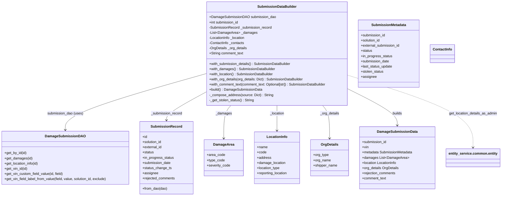
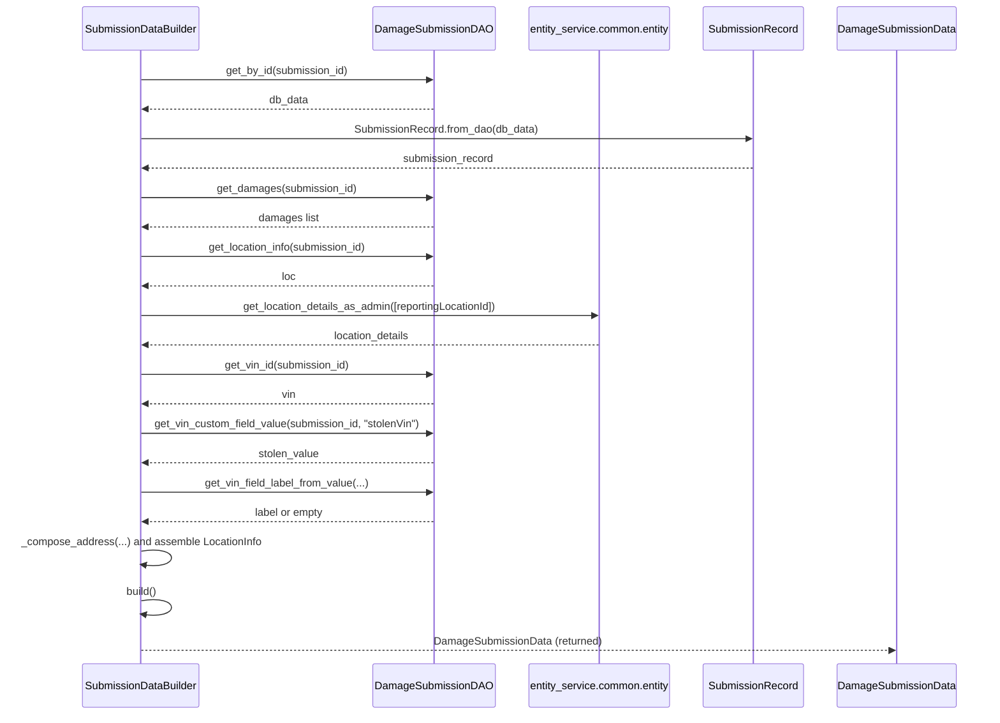

# Diagram: entity_core/entity_service/entity_service/damageview/notification_handler/builders/submission_data_builder.py

> Auto-generated by Obscura crawlers

## Diagram 1

### SVG

<svg id="container" width="2294.2734375" xmlns="http://www.w3.org/2000/svg" class="classDiagram" height="906" viewBox="0 0 2294.2734375 906" role="graphics-document document" aria-roledescription="class"><g><defs><marker id="container_class-aggregationStart" class="marker aggregation class" refX="18" refY="7" markerWidth="190" markerHeight="240" orient="auto"><path d="M 18,7 L9,13 L1,7 L9,1 Z"></path></marker></defs><defs><marker id="container_class-aggregationEnd" class="marker aggregation class" refX="1" refY="7" markerWidth="20" markerHeight="28" orient="auto"><path d="M 18,7 L9,13 L1,7 L9,1 Z"></path></marker></defs><defs><marker id="container_class-extensionStart" class="marker extension class" refX="18" refY="7" markerWidth="190" markerHeight="240" orient="auto"><path d="M 1,7 L18,13 V 1 Z"></path></marker></defs><defs><marker id="container_class-extensionEnd" class="marker extension class" refX="1" refY="7" markerWidth="20" markerHeight="28" orient="auto"><path d="M 1,1 V 13 L18,7 Z"></path></marker></defs><defs><marker id="container_class-compositionStart" class="marker composition class" refX="18" refY="7" markerWidth="190" markerHeight="240" orient="auto"><path d="M 18,7 L9,13 L1,7 L9,1 Z"></path></marker></defs><defs><marker id="container_class-compositionEnd" class="marker composition class" refX="1" refY="7" markerWidth="20" markerHeight="28" orient="auto"><path d="M 18,7 L9,13 L1,7 L9,1 Z"></path></marker></defs><defs><marker id="container_class-dependencyStart" class="marker dependency class" refX="6" refY="7" markerWidth="190" markerHeight="240" orient="auto"><path d="M 5,7 L9,13 L1,7 L9,1 Z"></path></marker></defs><defs><marker id="container_class-dependencyEnd" class="marker dependency class" refX="13" refY="7" markerWidth="20" markerHeight="28" orient="auto"><path d="M 18,7 L9,13 L14,7 L9,1 Z"></path></marker></defs><defs><marker id="container_class-lollipopStart" class="marker lollipop class" refX="13" refY="7" markerWidth="190" markerHeight="240" orient="auto"><circle stroke="black" fill="transparent" cx="7" cy="7" r="6"></circle></marker></defs><defs><marker id="container_class-lollipopEnd" class="marker lollipop class" refX="1" refY="7" markerWidth="190" markerHeight="240" orient="auto"><circle stroke="black" fill="transparent" cx="7" cy="7" r="6"></circle></marker></defs><g class="root"><g class="clusters"></g><g class="edgePaths"><path d="M942.773,341.869L835.971,372.391C729.169,402.913,515.565,463.956,408.763,507.145C301.961,550.333,301.961,575.667,301.961,588.333L301.961,601" id="id_SubmissionDataBuilder_DamageSubmissionDAO_1" class="edge-thickness-normal edge-pattern-solid relation" style=";;;" data-edge="true" data-et="edge" data-id="id_SubmissionDataBuilder_DamageSubmissionDAO_1" data-points="W3sieCI6OTQyLjc3MzQzNzUsInkiOjM0MS44NjkzOTQyMDMxNzg5fSx7IngiOjMwMS45NjA5Mzc1LCJ5Ijo1MjV9LHsieCI6MzAxLjk2MDkzNzUsInkiOjYwN31d" marker-end="url(#container_class-dependencyEnd)"></path><path d="M942.773,428.417L913.467,444.514C884.16,460.611,825.547,492.806,796.24,514.07C766.934,535.333,766.934,545.667,766.934,550.833L766.934,556" id="id_SubmissionDataBuilder_SubmissionRecord_2" class="edge-thickness-normal edge-pattern-solid relation" style=";;;" data-edge="true" data-et="edge" data-id="id_SubmissionDataBuilder_SubmissionRecord_2" data-points="W3sieCI6OTQyLjc3MzQzNzUsInkiOjQyOC40MTcwMDAzNzk1NDE5NX0seyJ4Ijo3NjYuOTMzNTkzNzUsInkiOjUyNX0seyJ4Ijo3NjYuOTMzNTkzNzUsInkiOjU2Mn1d" marker-end="url(#container_class-dependencyEnd)"></path><path d="M1059.154,488L1053.704,494.167C1048.255,500.333,1037.356,512.667,1031.907,538C1026.457,563.333,1026.457,601.667,1026.457,620.833L1026.457,640" id="id_SubmissionDataBuilder_DamageArea_3" class="edge-thickness-normal edge-pattern-solid relation" style=";;;" data-edge="true" data-et="edge" data-id="id_SubmissionDataBuilder_DamageArea_3" data-points="W3sieCI6MTA1OS4xNTM5NjU0NzgzMzk0LCJ5Ijo0ODh9LHsieCI6MTAyNi40NTcwMzEyNSwieSI6NTI1fSx7IngiOjEwMjYuNDU3MDMxMjUsInkiOjY0Nn1d" marker-end="url(#container_class-dependencyEnd)"></path><path d="M1271.242,488L1271.242,494.167C1271.242,500.333,1271.242,512.667,1271.242,532C1271.242,551.333,1271.242,577.667,1271.242,590.833L1271.242,604" id="id_SubmissionDataBuilder_LocationInfo_4" class="edge-thickness-normal edge-pattern-solid relation" style=";;;" data-edge="true" data-et="edge" data-id="id_SubmissionDataBuilder_LocationInfo_4" data-points="W3sieCI6MTI3MS4yNDIxODc1LCJ5Ijo0ODh9LHsieCI6MTI3MS4yNDIxODc1LCJ5Ijo1MjV9LHsieCI6MTI3MS4yNDIxODc1LCJ5Ijo2MTB9XQ==" marker-end="url(#container_class-dependencyEnd)"></path><path d="M1481.743,488L1487.152,494.167C1492.56,500.333,1503.378,512.667,1508.787,538C1514.195,563.333,1514.195,601.667,1514.195,620.833L1514.195,640" id="id_SubmissionDataBuilder_OrgDetails_5" class="edge-thickness-normal edge-pattern-solid relation" style=";;;" data-edge="true" data-et="edge" data-id="id_SubmissionDataBuilder_OrgDetails_5" data-points="W3sieCI6MTQ4MS43NDMwOTAwMjcwNzU4LCJ5Ijo0ODh9LHsieCI6MTUxNC4xOTUzMTI1LCJ5Ijo1MjV9LHsieCI6MTUxNC4xOTUzMTI1LCJ5Ijo2NDZ9XQ==" marker-end="url(#container_class-dependencyEnd)"></path><path d="M1599.711,412.656L1637.063,431.38C1674.415,450.104,1749.12,487.552,1786.472,515.443C1823.824,543.333,1823.824,561.667,1823.824,570.833L1823.824,580" id="id_SubmissionDataBuilder_DamageSubmissionData_6" class="edge-thickness-normal edge-pattern-solid relation" style=";;;" data-edge="true" data-et="edge" data-id="id_SubmissionDataBuilder_DamageSubmissionData_6" data-points="W3sieCI6MTU5OS43MTA5Mzc1LCJ5Ijo0MTIuNjU1ODEzMjYzMDE5NDd9LHsieCI6MTgyMy44MjQyMTg3NSwieSI6NTI1fSx7IngiOjE4MjMuODI0MjE4NzUsInkiOjU4Nn1d" marker-end="url(#container_class-dependencyEnd)"></path><path d="M1599.711,349.628L1694.18,378.857C1788.648,408.085,1977.586,466.543,2072.055,521.938C2166.523,577.333,2166.523,629.667,2166.523,655.833L2166.523,682" id="id_SubmissionDataBuilder_entity_service.common.entity_7" class="edge-thickness-normal edge-pattern-dashed relation" style=";;;" data-edge="true" data-et="edge" data-id="id_SubmissionDataBuilder_entity_service.common.entity_7" data-points="W3sieCI6MTU5OS43MTA5Mzc1LCJ5IjozNDkuNjI4MjI0MzcwODMzMn0seyJ4IjoyMTY2LjUyMzQzNzUsInkiOjUyNX0seyJ4IjoyMTY2LjUyMzQzNzUsInkiOjY4OH1d" marker-end="url(#container_class-dependencyEnd)"></path></g><g class="edgeLabels"><g class="edgeLabel" transform="translate(301.9609375, 525)"><g class="label" data-id="id_SubmissionDataBuilder_DamageSubmissionDAO_1" transform="translate(-82.8671875, -12)"><foreignObject width="165.734375" height="24">

submission_dao (uses)

</foreignObject></g></g><g class="edgeLabel" transform="translate(766.93359375, 525)"><g class="label" data-id="id_SubmissionDataBuilder_SubmissionRecord_2" transform="translate(-72.765625, -12)"><foreignObject width="145.53125" height="24">

_submission_record

</foreignObject></g></g><g class="edgeLabel" transform="translate(1026.45703125, 525)"><g class="label" data-id="id_SubmissionDataBuilder_DamageArea_3" transform="translate(-36.3984375, -12)"><foreignObject width="72.796875" height="24">

_damages

</foreignObject></g></g><g class="edgeLabel" transform="translate(1271.2421875, 525)"><g class="label" data-id="id_SubmissionDataBuilder_LocationInfo_4" transform="translate(-33.65625, -12)"><foreignObject width="67.3125" height="24">

_location

</foreignObject></g></g><g class="edgeLabel" transform="translate(1514.1953125, 525)"><g class="label" data-id="id_SubmissionDataBuilder_OrgDetails_5" transform="translate(-44.5, -12)"><foreignObject width="89" height="24">

_org_details

</foreignObject></g></g><g class="edgeLabel" transform="translate(1823.82421875, 525)"><g class="label" data-id="id_SubmissionDataBuilder_DamageSubmissionData_6" transform="translate(-22.4921875, -12)"><foreignObject width="44.984375" height="24">

builds

</foreignObject></g></g><g class="edgeLabel" transform="translate(2166.5234375, 525)"><g class="label" data-id="id_SubmissionDataBuilder_entity_service.common.entity_7" transform="translate(-112.2265625, -12)"><foreignObject width="224.453125" height="24">

get_location_details_as_admin

</foreignObject></g></g></g><g class="nodes"><g class="node default" id="classId-SubmissionDataBuilder-0" transform="translate(1271.2421875, 248)"><g class="basic label-container"><path d="M-328.46875 -240 L328.46875 -240 L328.46875 240 L-328.46875 240" stroke="none" stroke-width="0" fill="#ECECFF" style=""></path><path d="M-328.46875 -240 C-186.9171841565876 -240, -45.36561831317522 -240, 328.46875 -240 M-328.46875 -240 C-186.3645310923649 -240, -44.2603121847298 -240, 328.46875 -240 M328.46875 -240 C328.46875 -137.21446922142343, 328.46875 -34.42893844284686, 328.46875 240 M328.46875 -240 C328.46875 -107.11811288161596, 328.46875 25.763774236768086, 328.46875 240 M328.46875 240 C186.57839156631127 240, 44.688033132622536 240, -328.46875 240 M328.46875 240 C177.39728635750492 240, 26.32582271500985 240, -328.46875 240 M-328.46875 240 C-328.46875 121.2649616703972, -328.46875 2.5299233407943973, -328.46875 -240 M-328.46875 240 C-328.46875 81.17787217815828, -328.46875 -77.64425564368344, -328.46875 -240" stroke="#9370DB" stroke-width="1.3" fill="none" stroke-dasharray="0 0" style=""></path></g><g class="annotation-group text" transform="translate(0, -216)"></g><g class="label-group text" transform="translate(-85.578125, -216)"><g class="label" style="font-weight: bolder" transform="translate(0,-12)"><foreignObject width="171.15625" height="24">

SubmissionDataBuilder

</foreignObject></g></g><g class="members-group text" transform="translate(-316.46875, -168)"><g class="label" style="" transform="translate(0,-12)"><foreignObject width="302.265625" height="24">

+DamageSubmissionDAO submission_dao

</foreignObject></g><g class="label" style="" transform="translate(0,12)"><foreignObject width="136.828125" height="24">

+int submission_id

</foreignObject></g><g class="label" style="" transform="translate(0,36)"><foreignObject width="289.453125" height="24">

-SubmissionRecord _submission_record

</foreignObject></g><g class="label" style="" transform="translate(0,60)"><foreignObject width="215.21875" height="24">

-List&lt;DamageArea&gt; _damages

</foreignObject></g><g class="label" style="" transform="translate(0,84)"><foreignObject width="168.765625" height="24">

-LocationInfo _location

</foreignObject></g><g class="label" style="" transform="translate(0,108)"><foreignObject width="163.796875" height="24">

-ContactInfo _contacts

</foreignObject></g><g class="label" style="" transform="translate(0,132)"><foreignObject width="175.078125" height="24">

-OrgDetails _org_details

</foreignObject></g><g class="label" style="" transform="translate(0,156)"><foreignObject width="158.09375" height="24">

+String comment_text

</foreignObject></g></g><g class="methods-group text" transform="translate(-316.46875, 48)"><g class="label" style="" transform="translate(0,-12)"><foreignObject width="379.609375" height="24">

+with_submission_details() : SubmissionDataBuilder

</foreignObject></g><g class="label" style="" transform="translate(0,12)"><foreignObject width="304.21875" height="24">

+with_damages() : SubmissionDataBuilder

</foreignObject></g><g class="label" style="" transform="translate(0,36)"><foreignObject width="298.75" height="24">

+with_location() : SubmissionDataBuilder

</foreignObject></g><g class="label" style="" transform="translate(0,60)"><foreignObject width="437.734375" height="24">

+with_org_details(org_details: Dict) : SubmissionDataBuilder

</foreignObject></g><g class="label" style="" transform="translate(0,84)"><foreignObject width="547.359375" height="24">

+with_comment_text(comment_text: Optional[str]) : SubmissionDataBuilder

</foreignObject></g><g class="label" style="" transform="translate(0,108)"><foreignObject width="243.0625" height="24">

+build() : DamageSubmissionData

</foreignObject></g><g class="label" style="" transform="translate(0,132)"><foreignObject width="293.078125" height="24">

-_compose_address(source: Dict) : String

</foreignObject></g><g class="label" style="" transform="translate(0,156)"><foreignObject width="207.859375" height="24">

-_get_stolen_status() : String

</foreignObject></g></g><g class="divider" style=""><path d="M-328.46875 -192 C-119.27230090692072 -192, 89.92414818615856 -192, 328.46875 -192 M-328.46875 -192 C-189.83588671835196 -192, -51.203023436703916 -192, 328.46875 -192" stroke="#9370DB" stroke-width="1.3" fill="none" stroke-dasharray="0 0" style=""></path></g><g class="divider" style=""><path d="M-328.46875 24 C-166.6233001275926 24, -4.777850255185172 24, 328.46875 24 M-328.46875 24 C-155.51475862617198 24, 17.439232747656035 24, 328.46875 24" stroke="#9370DB" stroke-width="1.3" fill="none" stroke-dasharray="0 0" style=""></path></g></g><g class="node default" id="classId-DamageSubmissionDAO-1" transform="translate(301.9609375, 730)"><g class="basic label-container"><path d="M-293.9609375 -123 L293.9609375 -123 L293.9609375 123 L-293.9609375 123" stroke="none" stroke-width="0" fill="#ECECFF" style=""></path><path d="M-293.9609375 -123 C-114.40499121298211 -123, 65.15095507403578 -123, 293.9609375 -123 M-293.9609375 -123 C-173.56188631723535 -123, -53.162835134470726 -123, 293.9609375 -123 M293.9609375 -123 C293.9609375 -38.626660759646455, 293.9609375 45.74667848070709, 293.9609375 123 M293.9609375 -123 C293.9609375 -70.95577356534841, 293.9609375 -18.911547130696803, 293.9609375 123 M293.9609375 123 C150.55166280885905 123, 7.142388117718099 123, -293.9609375 123 M293.9609375 123 C64.7380948470715 123, -164.484747805857 123, -293.9609375 123 M-293.9609375 123 C-293.9609375 65.88895466182866, -293.9609375 8.777909323657326, -293.9609375 -123 M-293.9609375 123 C-293.9609375 63.94184197111955, -293.9609375 4.883683942239102, -293.9609375 -123" stroke="#9370DB" stroke-width="1.3" fill="none" stroke-dasharray="0 0" style=""></path></g><g class="annotation-group text" transform="translate(0, -99)"></g><g class="label-group text" transform="translate(-86.6875, -99)"><g class="label" style="font-weight: bolder" transform="translate(0,-12)"><foreignObject width="173.375" height="24">

DamageSubmissionDAO

</foreignObject></g></g><g class="members-group text" transform="translate(-281.9609375, -51)"></g><g class="methods-group text" transform="translate(-281.9609375, -21)"><g class="label" style="" transform="translate(0,-12)"><foreignObject width="102.546875" height="24">

+get_by_id(id)

</foreignObject></g><g class="label" style="" transform="translate(0,12)"><foreignObject width="127.78125" height="24">

+get_damages(id)

</foreignObject></g><g class="label" style="" transform="translate(0,36)"><foreignObject width="159.0625" height="24">

+get_location_info(id)

</foreignObject></g><g class="label" style="" transform="translate(0,60)"><foreignObject width="107" height="24">

+get_vin_id(id)

</foreignObject></g><g class="label" style="" transform="translate(0,84)"><foreignObject width="272.453125" height="24">

+get_vin_custom_field_value(id, field)

</foreignObject></g><g class="label" style="" transform="translate(0,108)"><foreignObject width="477.234375" height="24">

+get_vin_field_label_from_value(field, value, solution_id, exclude)

</foreignObject></g></g><g class="divider" style=""><path d="M-293.9609375 -75 C-137.13563541975748 -75, 19.689666660485045 -75, 293.9609375 -75 M-293.9609375 -75 C-103.47929253222318 -75, 87.00235243555363 -75, 293.9609375 -75" stroke="#9370DB" stroke-width="1.3" fill="none" stroke-dasharray="0 0" style=""></path></g><g class="divider" style=""><path d="M-293.9609375 -51 C-140.90680719342797 -51, 12.147323113144068 -51, 293.9609375 -51 M-293.9609375 -51 C-114.79939482606497 -51, 64.36214784787006 -51, 293.9609375 -51" stroke="#9370DB" stroke-width="1.3" fill="none" stroke-dasharray="0 0" style=""></path></g></g><g class="node default" id="classId-SubmissionRecord-2" transform="translate(766.93359375, 730)"><g class="basic label-container"><path d="M-121.01171875 -168 L121.01171875 -168 L121.01171875 168 L-121.01171875 168" stroke="none" stroke-width="0" fill="#ECECFF" style=""></path><path d="M-121.01171875 -168 C-54.274589881310646 -168, 12.462538987378707 -168, 121.01171875 -168 M-121.01171875 -168 C-54.17353782291629 -168, 12.664643104167425 -168, 121.01171875 -168 M121.01171875 -168 C121.01171875 -39.49528012968321, 121.01171875 89.00943974063358, 121.01171875 168 M121.01171875 -168 C121.01171875 -59.1035401891953, 121.01171875 49.7929196216094, 121.01171875 168 M121.01171875 168 C45.941854529664326 168, -29.128009690671348 168, -121.01171875 168 M121.01171875 168 C26.49108166399823 168, -68.02955542200354 168, -121.01171875 168 M-121.01171875 168 C-121.01171875 52.41478458718687, -121.01171875 -63.170430825626255, -121.01171875 -168 M-121.01171875 168 C-121.01171875 66.4908623136173, -121.01171875 -35.0182753727654, -121.01171875 -168" stroke="#9370DB" stroke-width="1.3" fill="none" stroke-dasharray="0 0" style=""></path></g><g class="annotation-group text" transform="translate(0, -144)"></g><g class="label-group text" transform="translate(-67.5078125, -144)"><g class="label" style="font-weight: bolder" transform="translate(0,-12)"><foreignObject width="135.015625" height="24">

SubmissionRecord

</foreignObject></g></g><g class="members-group text" transform="translate(-109.01171875, -96)"><g class="label" style="" transform="translate(0,-12)"><foreignObject width="22.078125" height="24">

+id

</foreignObject></g><g class="label" style="" transform="translate(0,12)"><foreignObject width="90.21875" height="24">

+solution_id

</foreignObject></g><g class="label" style="" transform="translate(0,36)"><foreignObject width="89.765625" height="24">

+external_id

</foreignObject></g><g class="label" style="" transform="translate(0,60)"><foreignObject width="52.390625" height="24">

+status

</foreignObject></g><g class="label" style="" transform="translate(0,84)"><foreignObject width="144.671875" height="24">

+in_progress_status

</foreignObject></g><g class="label" style="" transform="translate(0,108)"><foreignObject width="131.046875" height="24">

+submission_date

</foreignObject></g><g class="label" style="" transform="translate(0,132)"><foreignObject width="132.890625" height="24">

+status_change_ts

</foreignObject></g><g class="label" style="" transform="translate(0,156)"><foreignObject width="70.734375" height="24">

+assignee

</foreignObject></g><g class="label" style="" transform="translate(0,180)"><foreignObject width="150.515625" height="24">

+rejected_comments

</foreignObject></g></g><g class="methods-group text" transform="translate(-109.01171875, 144)"><g class="label" style="" transform="translate(0,-12)"><foreignObject width="115.46875" height="24">

+from_dao(dao)

</foreignObject></g></g><g class="divider" style=""><path d="M-121.01171875 -120 C-72.10037172136555 -120, -23.18902469273111 -120, 121.01171875 -120 M-121.01171875 -120 C-67.99322069532857 -120, -14.974722640657163 -120, 121.01171875 -120" stroke="#9370DB" stroke-width="1.3" fill="none" stroke-dasharray="0 0" style=""></path></g><g class="divider" style=""><path d="M-121.01171875 120 C-43.11740233153435 120, 34.7769140869313 120, 121.01171875 120 M-121.01171875 120 C-41.7670942968122 120, 37.47753015637559 120, 121.01171875 120" stroke="#9370DB" stroke-width="1.3" fill="none" stroke-dasharray="0 0" style=""></path></g></g><g class="node default" id="classId-DamageSubmissionData-3" transform="translate(1823.82421875, 730)"><g class="basic label-container"><path d="M-172.94921875 -144 L172.94921875 -144 L172.94921875 144 L-172.94921875 144" stroke="none" stroke-width="0" fill="#ECECFF" style=""></path><path d="M-172.94921875 -144 C-72.47790355150075 -144, 27.99341164699851 -144, 172.94921875 -144 M-172.94921875 -144 C-86.83711023986949 -144, -0.7250017297389775 -144, 172.94921875 -144 M172.94921875 -144 C172.94921875 -76.64908763483912, 172.94921875 -9.29817526967824, 172.94921875 144 M172.94921875 -144 C172.94921875 -68.3797127526718, 172.94921875 7.240574494656414, 172.94921875 144 M172.94921875 144 C87.29882684701661 144, 1.6484349440332267 144, -172.94921875 144 M172.94921875 144 C97.9449136024464 144, 22.94060845489281 144, -172.94921875 144 M-172.94921875 144 C-172.94921875 74.45256852272345, -172.94921875 4.9051370454469065, -172.94921875 -144 M-172.94921875 144 C-172.94921875 68.60313046339415, -172.94921875 -6.793739073211697, -172.94921875 -144" stroke="#9370DB" stroke-width="1.3" fill="none" stroke-dasharray="0 0" style=""></path></g><g class="annotation-group text" transform="translate(0, -120)"></g><g class="label-group text" transform="translate(-88.2734375, -120)"><g class="label" style="font-weight: bolder" transform="translate(0,-12)"><foreignObject width="176.546875" height="24">

DamageSubmissionData

</foreignObject></g></g><g class="members-group text" transform="translate(-160.94921875, -72)"><g class="label" style="" transform="translate(0,-12)"><foreignObject width="112.921875" height="24">

+submission_id

</foreignObject></g><g class="label" style="" transform="translate(0,12)"><foreignObject width="29.59375" height="24">

+vin

</foreignObject></g><g class="label" style="" transform="translate(0,36)"><foreignObject width="233.625" height="24">

+metadata SubmissionMetadata

</foreignObject></g><g class="label" style="" transform="translate(0,60)"><foreignObject width="208.765625" height="24">

+damages List&lt;DamageArea&gt;

</foreignObject></g><g class="label" style="" transform="translate(0,84)"><foreignObject width="162.140625" height="24">

+location LocationInfo

</foreignObject></g><g class="label" style="" transform="translate(0,108)"><foreignObject width="168.609375" height="24">

+org_details OrgDetails

</foreignObject></g><g class="label" style="" transform="translate(0,132)"><foreignObject width="155.703125" height="24">

+rejection_comments

</foreignObject></g><g class="label" style="" transform="translate(0,156)"><foreignObject width="111.609375" height="24">

+comment_text

</foreignObject></g></g><g class="methods-group text" transform="translate(-160.94921875, 144)"></g><g class="divider" style=""><path d="M-172.94921875 -96 C-62.212928880224965 -96, 48.52336098955007 -96, 172.94921875 -96 M-172.94921875 -96 C-40.70242097644419 -96, 91.54437679711162 -96, 172.94921875 -96" stroke="#9370DB" stroke-width="1.3" fill="none" stroke-dasharray="0 0" style=""></path></g><g class="divider" style=""><path d="M-172.94921875 120 C-42.15586713701785 120, 88.6374844759643 120, 172.94921875 120 M-172.94921875 120 C-103.33223706312106 120, -33.71525537624211 120, 172.94921875 120" stroke="#9370DB" stroke-width="1.3" fill="none" stroke-dasharray="0 0" style=""></path></g></g><g class="node default" id="classId-SubmissionMetadata-4" transform="translate(1790.41796875, 248)"><g class="basic label-container"><path d="M-140.70703125 -156 L140.70703125 -156 L140.70703125 156 L-140.70703125 156" stroke="none" stroke-width="0" fill="#ECECFF" style=""></path><path d="M-140.70703125 -156 C-33.44277228418825 -156, 73.8214866816235 -156, 140.70703125 -156 M-140.70703125 -156 C-73.61655739237466 -156, -6.5260835347493185 -156, 140.70703125 -156 M140.70703125 -156 C140.70703125 -42.3618100980608, 140.70703125 71.2763798038784, 140.70703125 156 M140.70703125 -156 C140.70703125 -47.97309620904619, 140.70703125 60.05380758190762, 140.70703125 156 M140.70703125 156 C42.76658207164242 156, -55.173867106715164 156, -140.70703125 156 M140.70703125 156 C65.53381325819949 156, -9.639404733601026 156, -140.70703125 156 M-140.70703125 156 C-140.70703125 54.37444569368223, -140.70703125 -47.251108612635534, -140.70703125 -156 M-140.70703125 156 C-140.70703125 41.59754081948698, -140.70703125 -72.80491836102604, -140.70703125 -156" stroke="#9370DB" stroke-width="1.3" fill="none" stroke-dasharray="0 0" style=""></path></g><g class="annotation-group text" transform="translate(0, -132)"></g><g class="label-group text" transform="translate(-76.8046875, -132)"><g class="label" style="font-weight: bolder" transform="translate(0,-12)"><foreignObject width="153.609375" height="24">

SubmissionMetadata

</foreignObject></g></g><g class="members-group text" transform="translate(-128.70703125, -84)"><g class="label" style="" transform="translate(0,-12)"><foreignObject width="112.921875" height="24">

+submission_id

</foreignObject></g><g class="label" style="" transform="translate(0,12)"><foreignObject width="90.21875" height="24">

+solution_id

</foreignObject></g><g class="label" style="" transform="translate(0,36)"><foreignObject width="180.609375" height="24">

+external_submission_id

</foreignObject></g><g class="label" style="" transform="translate(0,60)"><foreignObject width="52.390625" height="24">

+status

</foreignObject></g><g class="label" style="" transform="translate(0,84)"><foreignObject width="144.671875" height="24">

+in_progress_status

</foreignObject></g><g class="label" style="" transform="translate(0,108)"><foreignObject width="131.046875" height="24">

+submission_date

</foreignObject></g><g class="label" style="" transform="translate(0,132)"><foreignObject width="146.140625" height="24">

+last_status_update

</foreignObject></g><g class="label" style="" transform="translate(0,156)"><foreignObject width="105.765625" height="24">

+stolen_status

</foreignObject></g><g class="label" style="" transform="translate(0,180)"><foreignObject width="70.734375" height="24">

+assignee

</foreignObject></g></g><g class="methods-group text" transform="translate(-128.70703125, 156)"></g><g class="divider" style=""><path d="M-140.70703125 -108 C-60.97188699098933 -108, 18.763257268021334 -108, 140.70703125 -108 M-140.70703125 -108 C-37.32987217503984 -108, 66.04728689992032 -108, 140.70703125 -108" stroke="#9370DB" stroke-width="1.3" fill="none" stroke-dasharray="0 0" style=""></path></g><g class="divider" style=""><path d="M-140.70703125 132 C-29.56926601561564 132, 81.56849921876872 132, 140.70703125 132 M-140.70703125 132 C-55.56860715397036 132, 29.569816942059276 132, 140.70703125 132" stroke="#9370DB" stroke-width="1.3" fill="none" stroke-dasharray="0 0" style=""></path></g></g><g class="node default" id="classId-DamageArea-5" transform="translate(1026.45703125, 730)"><g class="basic label-container"><path d="M-88.51171875 -84 L88.51171875 -84 L88.51171875 84 L-88.51171875 84" stroke="none" stroke-width="0" fill="#ECECFF" style=""></path><path d="M-88.51171875 -84 C-42.62889965084974 -84, 3.253919448300522 -84, 88.51171875 -84 M-88.51171875 -84 C-46.77160205903878 -84, -5.031485368077554 -84, 88.51171875 -84 M88.51171875 -84 C88.51171875 -33.5747457883368, 88.51171875 16.850508423326403, 88.51171875 84 M88.51171875 -84 C88.51171875 -22.456272703621543, 88.51171875 39.08745459275691, 88.51171875 84 M88.51171875 84 C50.217009723622176 84, 11.922300697244353 84, -88.51171875 84 M88.51171875 84 C20.11056270798821 84, -48.29059333402358 84, -88.51171875 84 M-88.51171875 84 C-88.51171875 48.400424932605624, -88.51171875 12.800849865211248, -88.51171875 -84 M-88.51171875 84 C-88.51171875 37.69486634079087, -88.51171875 -8.610267318418266, -88.51171875 -84" stroke="#9370DB" stroke-width="1.3" fill="none" stroke-dasharray="0 0" style=""></path></g><g class="annotation-group text" transform="translate(0, -60)"></g><g class="label-group text" transform="translate(-45.6328125, -60)"><g class="label" style="font-weight: bolder" transform="translate(0,-12)"><foreignObject width="91.265625" height="24">

DamageArea

</foreignObject></g></g><g class="members-group text" transform="translate(-76.51171875, -12)"><g class="label" style="" transform="translate(0,-12)"><foreignObject width="82.375" height="24">

+area_code

</foreignObject></g><g class="label" style="" transform="translate(0,12)"><foreignObject width="82.34375" height="24">

+type_code

</foreignObject></g><g class="label" style="" transform="translate(0,36)"><foreignObject width="107.390625" height="24">

+severity_code

</foreignObject></g></g><g class="methods-group text" transform="translate(-76.51171875, 84)"></g><g class="divider" style=""><path d="M-88.51171875 -36 C-50.78822181629737 -36, -13.064724882594746 -36, 88.51171875 -36 M-88.51171875 -36 C-25.6663317876126 -36, 37.1790551747748 -36, 88.51171875 -36" stroke="#9370DB" stroke-width="1.3" fill="none" stroke-dasharray="0 0" style=""></path></g><g class="divider" style=""><path d="M-88.51171875 60 C-30.39688572920744 60, 27.71794729158512 60, 88.51171875 60 M-88.51171875 60 C-45.068798220949375 60, -1.6258776918987508 60, 88.51171875 60" stroke="#9370DB" stroke-width="1.3" fill="none" stroke-dasharray="0 0" style=""></path></g></g><g class="node default" id="classId-LocationInfo-6" transform="translate(1271.2421875, 730)"><g class="basic label-container"><path d="M-106.2734375 -120 L106.2734375 -120 L106.2734375 120 L-106.2734375 120" stroke="none" stroke-width="0" fill="#ECECFF" style=""></path><path d="M-106.2734375 -120 C-51.63062859597299 -120, 3.0121803080540133 -120, 106.2734375 -120 M-106.2734375 -120 C-38.02341055991339 -120, 30.226616380173226 -120, 106.2734375 -120 M106.2734375 -120 C106.2734375 -66.20382082510444, 106.2734375 -12.407641650208888, 106.2734375 120 M106.2734375 -120 C106.2734375 -24.225666566070302, 106.2734375 71.5486668678594, 106.2734375 120 M106.2734375 120 C54.045889964693146 120, 1.8183424293862913 120, -106.2734375 120 M106.2734375 120 C48.91633550215009 120, -8.440766495699819 120, -106.2734375 120 M-106.2734375 120 C-106.2734375 49.09468021026464, -106.2734375 -21.810639579470717, -106.2734375 -120 M-106.2734375 120 C-106.2734375 60.119940452488194, -106.2734375 0.23988090497638836, -106.2734375 -120" stroke="#9370DB" stroke-width="1.3" fill="none" stroke-dasharray="0 0" style=""></path></g><g class="annotation-group text" transform="translate(0, -96)"></g><g class="label-group text" transform="translate(-45.75, -96)"><g class="label" style="font-weight: bolder" transform="translate(0,-12)"><foreignObject width="91.5" height="24">

LocationInfo

</foreignObject></g></g><g class="members-group text" transform="translate(-94.2734375, -48)"><g class="label" style="" transform="translate(0,-12)"><foreignObject width="48.5" height="24">

+name

</foreignObject></g><g class="label" style="" transform="translate(0,12)"><foreignObject width="42.953125" height="24">

+code

</foreignObject></g><g class="label" style="" transform="translate(0,36)"><foreignObject width="64.796875" height="24">

+address

</foreignObject></g><g class="label" style="" transform="translate(0,60)"><foreignObject width="132.296875" height="24">

+damage_location

</foreignObject></g><g class="label" style="" transform="translate(0,84)"><foreignObject width="106.9375" height="24">

+location_type

</foreignObject></g><g class="label" style="" transform="translate(0,108)"><foreignObject width="142.796875" height="24">

+reporting_location

</foreignObject></g></g><g class="methods-group text" transform="translate(-94.2734375, 120)"></g><g class="divider" style=""><path d="M-106.2734375 -72 C-27.42792458503176 -72, 51.41758832993648 -72, 106.2734375 -72 M-106.2734375 -72 C-51.6588224571495 -72, 2.955792585701005 -72, 106.2734375 -72" stroke="#9370DB" stroke-width="1.3" fill="none" stroke-dasharray="0 0" style=""></path></g><g class="divider" style=""><path d="M-106.2734375 96 C-22.559033167858928 96, 61.155371164282144 96, 106.2734375 96 M-106.2734375 96 C-25.669232252611565 96, 54.93497299477687 96, 106.2734375 96" stroke="#9370DB" stroke-width="1.3" fill="none" stroke-dasharray="0 0" style=""></path></g></g><g class="node default" id="classId-OrgDetails-7" transform="translate(1514.1953125, 730)"><g class="basic label-container"><path d="M-86.6796875 -84 L86.6796875 -84 L86.6796875 84 L-86.6796875 84" stroke="none" stroke-width="0" fill="#ECECFF" style=""></path><path d="M-86.6796875 -84 C-26.511594633712193 -84, 33.656498232575615 -84, 86.6796875 -84 M-86.6796875 -84 C-25.974220227464237 -84, 34.73124704507153 -84, 86.6796875 -84 M86.6796875 -84 C86.6796875 -36.26663031438314, 86.6796875 11.466739371233714, 86.6796875 84 M86.6796875 -84 C86.6796875 -48.47265841308819, 86.6796875 -12.94531682617638, 86.6796875 84 M86.6796875 84 C48.89047663484639 84, 11.101265769692773 84, -86.6796875 84 M86.6796875 84 C23.2618682561615 84, -40.155950987677 84, -86.6796875 84 M-86.6796875 84 C-86.6796875 24.87964658814831, -86.6796875 -34.24070682370338, -86.6796875 -84 M-86.6796875 84 C-86.6796875 50.19372962162046, -86.6796875 16.387459243240926, -86.6796875 -84" stroke="#9370DB" stroke-width="1.3" fill="none" stroke-dasharray="0 0" style=""></path></g><g class="annotation-group text" transform="translate(0, -60)"></g><g class="label-group text" transform="translate(-38.546875, -60)"><g class="label" style="font-weight: bolder" transform="translate(0,-12)"><foreignObject width="77.09375" height="24">

OrgDetails

</foreignObject></g></g><g class="members-group text" transform="translate(-74.6796875, -12)"><g class="label" style="" transform="translate(0,-12)"><foreignObject width="71.453125" height="24">

+org_type

</foreignObject></g><g class="label" style="" transform="translate(0,12)"><foreignObject width="80.484375" height="24">

+org_name

</foreignObject></g><g class="label" style="" transform="translate(0,36)"><foreignObject width="110.8125" height="24">

+shipper_name

</foreignObject></g></g><g class="methods-group text" transform="translate(-74.6796875, 84)"></g><g class="divider" style=""><path d="M-86.6796875 -36 C-32.54305602663708 -36, 21.593575446725836 -36, 86.6796875 -36 M-86.6796875 -36 C-25.983213366385257 -36, 34.713260767229485 -36, 86.6796875 -36" stroke="#9370DB" stroke-width="1.3" fill="none" stroke-dasharray="0 0" style=""></path></g><g class="divider" style=""><path d="M-86.6796875 60 C-47.00979310703572 60, -7.339898714071438 60, 86.6796875 60 M-86.6796875 60 C-27.026589144981052 60, 32.626509210037895 60, 86.6796875 60" stroke="#9370DB" stroke-width="1.3" fill="none" stroke-dasharray="0 0" style=""></path></g></g><g class="node default" id="classId-ContactInfo-8" transform="translate(2035.5546875, 248)"><g class="basic label-container"><path d="M-54.4296875 -42 L54.4296875 -42 L54.4296875 42 L-54.4296875 42" stroke="none" stroke-width="0" fill="#ECECFF" style=""></path><path d="M-54.4296875 -42 C-28.771119212064157 -42, -3.112550924128314 -42, 54.4296875 -42 M-54.4296875 -42 C-11.639297001828218 -42, 31.151093496343563 -42, 54.4296875 -42 M54.4296875 -42 C54.4296875 -17.315512084437522, 54.4296875 7.368975831124956, 54.4296875 42 M54.4296875 -42 C54.4296875 -17.721221968779005, 54.4296875 6.557556062441989, 54.4296875 42 M54.4296875 42 C19.70860386140852 42, -15.01247977718296 42, -54.4296875 42 M54.4296875 42 C26.608471254604275 42, -1.2127449907914496 42, -54.4296875 42 M-54.4296875 42 C-54.4296875 22.338582128946715, -54.4296875 2.6771642578934305, -54.4296875 -42 M-54.4296875 42 C-54.4296875 22.88934248662223, -54.4296875 3.7786849732444594, -54.4296875 -42" stroke="#9370DB" stroke-width="1.3" fill="none" stroke-dasharray="0 0" style=""></path></g><g class="annotation-group text" transform="translate(0, -18)"></g><g class="label-group text" transform="translate(-42.4296875, -18)"><g class="label" style="font-weight: bolder" transform="translate(0,-12)"><foreignObject width="84.859375" height="24">

ContactInfo

</foreignObject></g></g><g class="members-group text" transform="translate(-42.4296875, 30)"></g><g class="methods-group text" transform="translate(-42.4296875, 60)"></g><g class="divider" style=""><path d="M-54.4296875 6 C-12.491903274453819 6, 29.445880951092363 6, 54.4296875 6 M-54.4296875 6 C-13.993545977192689 6, 26.442595545614623 6, 54.4296875 6" stroke="#9370DB" stroke-width="1.3" fill="none" stroke-dasharray="0 0" style=""></path></g><g class="divider" style=""><path d="M-54.4296875 24 C-20.46820255182746 24, 13.49328239634508 24, 54.4296875 24 M-54.4296875 24 C-20.71044944659247 24, 13.00878860681506 24, 54.4296875 24" stroke="#9370DB" stroke-width="1.3" fill="none" stroke-dasharray="0 0" style=""></path></g></g><g class="node default" id="classId-entity_service.common.entity-9" transform="translate(2166.5234375, 730)"><g class="basic label-container"><path d="M-119.75 -42 L119.75 -42 L119.75 42 L-119.75 42" stroke="none" stroke-width="0" fill="#ECECFF" style=""></path><path d="M-119.75 -42 C-32.89633042568779 -42, 53.95733914862441 -42, 119.75 -42 M-119.75 -42 C-28.710726413825185 -42, 62.32854717234963 -42, 119.75 -42 M119.75 -42 C119.75 -9.383434269467031, 119.75 23.233131461065938, 119.75 42 M119.75 -42 C119.75 -14.996096487766163, 119.75 12.007807024467674, 119.75 42 M119.75 42 C61.553749753793525 42, 3.3574995075870504 42, -119.75 42 M119.75 42 C24.423351529939367 42, -70.90329694012127 42, -119.75 42 M-119.75 42 C-119.75 24.88965146925352, -119.75 7.779302938507037, -119.75 -42 M-119.75 42 C-119.75 10.105912024754854, -119.75 -21.78817595049029, -119.75 -42" stroke="#9370DB" stroke-width="1.3" fill="none" stroke-dasharray="0 0" style=""></path></g><g class="annotation-group text" transform="translate(0, -18)"></g><g class="label-group text" transform="translate(-107.75, -18)"><g class="label" style="font-weight: bolder" transform="translate(0,-12)"><foreignObject width="215.5" height="24">

entity_service.common.entity

</foreignObject></g></g><g class="members-group text" transform="translate(-107.75, 30)"></g><g class="methods-group text" transform="translate(-107.75, 60)"></g><g class="divider" style=""><path d="M-119.75 6 C-47.302688664943204 6, 25.14462267011359 6, 119.75 6 M-119.75 6 C-34.5470821970697 6, 50.6558356058606 6, 119.75 6" stroke="#9370DB" stroke-width="1.3" fill="none" stroke-dasharray="0 0" style=""></path></g><g class="divider" style=""><path d="M-119.75 24 C-33.12109020773086 24, 53.50781958453828 24, 119.75 24 M-119.75 24 C-54.053608074644856 24, 11.642783850710288 24, 119.75 24" stroke="#9370DB" stroke-width="1.3" fill="none" stroke-dasharray="0 0" style=""></path></g></g></g></g></g></svg>

## Diagram 2

### SVG

<svg id="container" width="1581" xmlns="http://www.w3.org/2000/svg" height="1143" viewBox="-134 -10 1581 1143" role="graphics-document document" aria-roledescription="sequence"><g><rect x="1202" y="1057" fill="#eaeaea" stroke="#666" width="195" height="65" name="Data" rx="3" ry="3" class="actor actor-bottom"></rect><text x="1299.5" y="1089.5" dominant-baseline="central" alignment-baseline="central" class="actor actor-box" style="text-anchor: middle; font-size: 16px; font-weight: 400;"><tspan x="1299.5" dy="0">DamageSubmissionData</tspan></text></g><g><rect x="998" y="1057" fill="#eaeaea" stroke="#666" width="154" height="65" name="Record" rx="3" ry="3" class="actor actor-bottom"></rect><text x="1075" y="1089.5" dominant-baseline="central" alignment-baseline="central" class="actor actor-box" style="text-anchor: middle; font-size: 16px; font-weight: 400;"><tspan x="1075" dy="0">SubmissionRecord</tspan></text></g><g><rect x="715" y="1057" fill="#eaeaea" stroke="#666" width="233" height="65" name="Entity" rx="3" ry="3" class="actor actor-bottom"></rect><text x="831.5" y="1089.5" dominant-baseline="central" alignment-baseline="central" class="actor actor-box" style="text-anchor: middle; font-size: 16px; font-weight: 400;"><tspan x="831.5" dy="0">entity_service.common.entity</tspan></text></g><g><rect x="473" y="1057" fill="#eaeaea" stroke="#666" width="192" height="65" name="DAO" rx="3" ry="3" class="actor actor-bottom"></rect><text x="569" y="1089.5" dominant-baseline="central" alignment-baseline="central" class="actor actor-box" style="text-anchor: middle; font-size: 16px; font-weight: 400;"><tspan x="569" dy="0">DamageSubmissionDAO</tspan></text></g><g><rect x="0" y="1057" fill="#eaeaea" stroke="#666" width="190" height="65" name="Builder" rx="3" ry="3" class="actor actor-bottom"></rect><text x="95" y="1089.5" dominant-baseline="central" alignment-baseline="central" class="actor actor-box" style="text-anchor: middle; font-size: 16px; font-weight: 400;"><tspan x="95" dy="0">SubmissionDataBuilder</tspan></text></g><g><line id="actor4" x1="1299.5" y1="65" x2="1299.5" y2="1057" class="actor-line 200" stroke-width="0.5px" stroke="#999" name="Data"></line><g id="root-4"><rect x="1202" y="0" fill="#eaeaea" stroke="#666" width="195" height="65" name="Data" rx="3" ry="3" class="actor actor-top"></rect><text x="1299.5" y="32.5" dominant-baseline="central" alignment-baseline="central" class="actor actor-box" style="text-anchor: middle; font-size: 16px; font-weight: 400;"><tspan x="1299.5" dy="0">DamageSubmissionData</tspan></text></g></g><g><line id="actor3" x1="1075" y1="65" x2="1075" y2="1057" class="actor-line 200" stroke-width="0.5px" stroke="#999" name="Record"></line><g id="root-3"><rect x="998" y="0" fill="#eaeaea" stroke="#666" width="154" height="65" name="Record" rx="3" ry="3" class="actor actor-top"></rect><text x="1075" y="32.5" dominant-baseline="central" alignment-baseline="central" class="actor actor-box" style="text-anchor: middle; font-size: 16px; font-weight: 400;"><tspan x="1075" dy="0">SubmissionRecord</tspan></text></g></g><g><line id="actor2" x1="831.5" y1="65" x2="831.5" y2="1057" class="actor-line 200" stroke-width="0.5px" stroke="#999" name="Entity"></line><g id="root-2"><rect x="715" y="0" fill="#eaeaea" stroke="#666" width="233" height="65" name="Entity" rx="3" ry="3" class="actor actor-top"></rect><text x="831.5" y="32.5" dominant-baseline="central" alignment-baseline="central" class="actor actor-box" style="text-anchor: middle; font-size: 16px; font-weight: 400;"><tspan x="831.5" dy="0">entity_service.common.entity</tspan></text></g></g><g><line id="actor1" x1="569" y1="65" x2="569" y2="1057" class="actor-line 200" stroke-width="0.5px" stroke="#999" name="DAO"></line><g id="root-1"><rect x="473" y="0" fill="#eaeaea" stroke="#666" width="192" height="65" name="DAO" rx="3" ry="3" class="actor actor-top"></rect><text x="569" y="32.5" dominant-baseline="central" alignment-baseline="central" class="actor actor-box" style="text-anchor: middle; font-size: 16px; font-weight: 400;"><tspan x="569" dy="0">DamageSubmissionDAO</tspan></text></g></g><g><line id="actor0" x1="95" y1="65" x2="95" y2="1057" class="actor-line 200" stroke-width="0.5px" stroke="#999" name="Builder"></line><g id="root-0"><rect x="0" y="0" fill="#eaeaea" stroke="#666" width="190" height="65" name="Builder" rx="3" ry="3" class="actor actor-top"></rect><text x="95" y="32.5" dominant-baseline="central" alignment-baseline="central" class="actor actor-box" style="text-anchor: middle; font-size: 16px; font-weight: 400;"><tspan x="95" dy="0">SubmissionDataBuilder</tspan></text></g></g><g></g><defs><symbol id="computer" width="24" height="24"><path transform="scale(.5)" d="M2 2v13h20v-13h-20zm18 11h-16v-9h16v9zm-10.228 6l.466-1h3.524l.467 1h-4.457zm14.228 3h-24l2-6h2.104l-1.33 4h18.45l-1.297-4h2.073l2 6zm-5-10h-14v-7h14v7z"></path></symbol></defs><defs><symbol id="database" fill-rule="evenodd" clip-rule="evenodd"><path transform="scale(.5)" d="M12.258.001l.256.004.255.005.253.008.251.01.249.012.247.015.246.016.242.019.241.02.239.023.236.024.233.027.231.028.229.031.225.032.223.034.22.036.217.038.214.04.211.041.208.043.205.045.201.046.198.048.194.05.191.051.187.053.183.054.18.056.175.057.172.059.168.06.163.061.16.063.155.064.15.066.074.033.073.033.071.034.07.034.069.035.068.035.067.035.066.035.064.036.064.036.062.036.06.036.06.037.058.037.058.037.055.038.055.038.053.038.052.038.051.039.05.039.048.039.047.039.045.04.044.04.043.04.041.04.04.041.039.041.037.041.036.041.034.041.033.042.032.042.03.042.029.042.027.042.026.043.024.043.023.043.021.043.02.043.018.044.017.043.015.044.013.044.012.044.011.045.009.044.007.045.006.045.004.045.002.045.001.045v17l-.001.045-.002.045-.004.045-.006.045-.007.045-.009.044-.011.045-.012.044-.013.044-.015.044-.017.043-.018.044-.02.043-.021.043-.023.043-.024.043-.026.043-.027.042-.029.042-.03.042-.032.042-.033.042-.034.041-.036.041-.037.041-.039.041-.04.041-.041.04-.043.04-.044.04-.045.04-.047.039-.048.039-.05.039-.051.039-.052.038-.053.038-.055.038-.055.038-.058.037-.058.037-.06.037-.06.036-.062.036-.064.036-.064.036-.066.035-.067.035-.068.035-.069.035-.07.034-.071.034-.073.033-.074.033-.15.066-.155.064-.16.063-.163.061-.168.06-.172.059-.175.057-.18.056-.183.054-.187.053-.191.051-.194.05-.198.048-.201.046-.205.045-.208.043-.211.041-.214.04-.217.038-.22.036-.223.034-.225.032-.229.031-.231.028-.233.027-.236.024-.239.023-.241.02-.242.019-.246.016-.247.015-.249.012-.251.01-.253.008-.255.005-.256.004-.258.001-.258-.001-.256-.004-.255-.005-.253-.008-.251-.01-.249-.012-.247-.015-.245-.016-.243-.019-.241-.02-.238-.023-.236-.024-.234-.027-.231-.028-.228-.031-.226-.032-.223-.034-.22-.036-.217-.038-.214-.04-.211-.041-.208-.043-.204-.045-.201-.046-.198-.048-.195-.05-.19-.051-.187-.053-.184-.054-.179-.056-.176-.057-.172-.059-.167-.06-.164-.061-.159-.063-.155-.064-.151-.066-.074-.033-.072-.033-.072-.034-.07-.034-.069-.035-.068-.035-.067-.035-.066-.035-.064-.036-.063-.036-.062-.036-.061-.036-.06-.037-.058-.037-.057-.037-.056-.038-.055-.038-.053-.038-.052-.038-.051-.039-.049-.039-.049-.039-.046-.039-.046-.04-.044-.04-.043-.04-.041-.04-.04-.041-.039-.041-.037-.041-.036-.041-.034-.041-.033-.042-.032-.042-.03-.042-.029-.042-.027-.042-.026-.043-.024-.043-.023-.043-.021-.043-.02-.043-.018-.044-.017-.043-.015-.044-.013-.044-.012-.044-.011-.045-.009-.044-.007-.045-.006-.045-.004-.045-.002-.045-.001-.045v-17l.001-.045.002-.045.004-.045.006-.045.007-.045.009-.044.011-.045.012-.044.013-.044.015-.044.017-.043.018-.044.02-.043.021-.043.023-.043.024-.043.026-.043.027-.042.029-.042.03-.042.032-.042.033-.042.034-.041.036-.041.037-.041.039-.041.04-.041.041-.04.043-.04.044-.04.046-.04.046-.039.049-.039.049-.039.051-.039.052-.038.053-.038.055-.038.056-.038.057-.037.058-.037.06-.037.061-.036.062-.036.063-.036.064-.036.066-.035.067-.035.068-.035.069-.035.07-.034.072-.034.072-.033.074-.033.151-.066.155-.064.159-.063.164-.061.167-.06.172-.059.176-.057.179-.056.184-.054.187-.053.19-.051.195-.05.198-.048.201-.046.204-.045.208-.043.211-.041.214-.04.217-.038.22-.036.223-.034.226-.032.228-.031.231-.028.234-.027.236-.024.238-.023.241-.02.243-.019.245-.016.247-.015.249-.012.251-.01.253-.008.255-.005.256-.004.258-.001.258.001zm-9.258 20.499v.01l.001.021.003.021.004.022.005.021.006.022.007.022.009.023.01.022.011.023.012.023.013.023.015.023.016.024.017.023.018.024.019.024.021.024.022.025.023.024.024.025.052.049.056.05.061.051.066.051.07.051.075.051.079.052.084.052.088.052.092.052.097.052.102.051.105.052.11.052.114.051.119.051.123.051.127.05.131.05.135.05.139.048.144.049.147.047.152.047.155.047.16.045.163.045.167.043.171.043.176.041.178.041.183.039.187.039.19.037.194.035.197.035.202.033.204.031.209.03.212.029.216.027.219.025.222.024.226.021.23.02.233.018.236.016.24.015.243.012.246.01.249.008.253.005.256.004.259.001.26-.001.257-.004.254-.005.25-.008.247-.011.244-.012.241-.014.237-.016.233-.018.231-.021.226-.021.224-.024.22-.026.216-.027.212-.028.21-.031.205-.031.202-.034.198-.034.194-.036.191-.037.187-.039.183-.04.179-.04.175-.042.172-.043.168-.044.163-.045.16-.046.155-.046.152-.047.148-.048.143-.049.139-.049.136-.05.131-.05.126-.05.123-.051.118-.052.114-.051.11-.052.106-.052.101-.052.096-.052.092-.052.088-.053.083-.051.079-.052.074-.052.07-.051.065-.051.06-.051.056-.05.051-.05.023-.024.023-.025.021-.024.02-.024.019-.024.018-.024.017-.024.015-.023.014-.024.013-.023.012-.023.01-.023.01-.022.008-.022.006-.022.006-.022.004-.022.004-.021.001-.021.001-.021v-4.127l-.077.055-.08.053-.083.054-.085.053-.087.052-.09.052-.093.051-.095.05-.097.05-.1.049-.102.049-.105.048-.106.047-.109.047-.111.046-.114.045-.115.045-.118.044-.12.043-.122.042-.124.042-.126.041-.128.04-.13.04-.132.038-.134.038-.135.037-.138.037-.139.035-.142.035-.143.034-.144.033-.147.032-.148.031-.15.03-.151.03-.153.029-.154.027-.156.027-.158.026-.159.025-.161.024-.162.023-.163.022-.165.021-.166.02-.167.019-.169.018-.169.017-.171.016-.173.015-.173.014-.175.013-.175.012-.177.011-.178.01-.179.008-.179.008-.181.006-.182.005-.182.004-.184.003-.184.002h-.37l-.184-.002-.184-.003-.182-.004-.182-.005-.181-.006-.179-.008-.179-.008-.178-.01-.176-.011-.176-.012-.175-.013-.173-.014-.172-.015-.171-.016-.17-.017-.169-.018-.167-.019-.166-.02-.165-.021-.163-.022-.162-.023-.161-.024-.159-.025-.157-.026-.156-.027-.155-.027-.153-.029-.151-.03-.15-.03-.148-.031-.146-.032-.145-.033-.143-.034-.141-.035-.14-.035-.137-.037-.136-.037-.134-.038-.132-.038-.13-.04-.128-.04-.126-.041-.124-.042-.122-.042-.12-.044-.117-.043-.116-.045-.113-.045-.112-.046-.109-.047-.106-.047-.105-.048-.102-.049-.1-.049-.097-.05-.095-.05-.093-.052-.09-.051-.087-.052-.085-.053-.083-.054-.08-.054-.077-.054v4.127zm0-5.654v.011l.001.021.003.021.004.021.005.022.006.022.007.022.009.022.01.022.011.023.012.023.013.023.015.024.016.023.017.024.018.024.019.024.021.024.022.024.023.025.024.024.052.05.056.05.061.05.066.051.07.051.075.052.079.051.084.052.088.052.092.052.097.052.102.052.105.052.11.051.114.051.119.052.123.05.127.051.131.05.135.049.139.049.144.048.147.048.152.047.155.046.16.045.163.045.167.044.171.042.176.042.178.04.183.04.187.038.19.037.194.036.197.034.202.033.204.032.209.03.212.028.216.027.219.025.222.024.226.022.23.02.233.018.236.016.24.014.243.012.246.01.249.008.253.006.256.003.259.001.26-.001.257-.003.254-.006.25-.008.247-.01.244-.012.241-.015.237-.016.233-.018.231-.02.226-.022.224-.024.22-.025.216-.027.212-.029.21-.03.205-.032.202-.033.198-.035.194-.036.191-.037.187-.039.183-.039.179-.041.175-.042.172-.043.168-.044.163-.045.16-.045.155-.047.152-.047.148-.048.143-.048.139-.05.136-.049.131-.05.126-.051.123-.051.118-.051.114-.052.11-.052.106-.052.101-.052.096-.052.092-.052.088-.052.083-.052.079-.052.074-.051.07-.052.065-.051.06-.05.056-.051.051-.049.023-.025.023-.024.021-.025.02-.024.019-.024.018-.024.017-.024.015-.023.014-.023.013-.024.012-.022.01-.023.01-.023.008-.022.006-.022.006-.022.004-.021.004-.022.001-.021.001-.021v-4.139l-.077.054-.08.054-.083.054-.085.052-.087.053-.09.051-.093.051-.095.051-.097.05-.1.049-.102.049-.105.048-.106.047-.109.047-.111.046-.114.045-.115.044-.118.044-.12.044-.122.042-.124.042-.126.041-.128.04-.13.039-.132.039-.134.038-.135.037-.138.036-.139.036-.142.035-.143.033-.144.033-.147.033-.148.031-.15.03-.151.03-.153.028-.154.028-.156.027-.158.026-.159.025-.161.024-.162.023-.163.022-.165.021-.166.02-.167.019-.169.018-.169.017-.171.016-.173.015-.173.014-.175.013-.175.012-.177.011-.178.009-.179.009-.179.007-.181.007-.182.005-.182.004-.184.003-.184.002h-.37l-.184-.002-.184-.003-.182-.004-.182-.005-.181-.007-.179-.007-.179-.009-.178-.009-.176-.011-.176-.012-.175-.013-.173-.014-.172-.015-.171-.016-.17-.017-.169-.018-.167-.019-.166-.02-.165-.021-.163-.022-.162-.023-.161-.024-.159-.025-.157-.026-.156-.027-.155-.028-.153-.028-.151-.03-.15-.03-.148-.031-.146-.033-.145-.033-.143-.033-.141-.035-.14-.036-.137-.036-.136-.037-.134-.038-.132-.039-.13-.039-.128-.04-.126-.041-.124-.042-.122-.043-.12-.043-.117-.044-.116-.044-.113-.046-.112-.046-.109-.046-.106-.047-.105-.048-.102-.049-.1-.049-.097-.05-.095-.051-.093-.051-.09-.051-.087-.053-.085-.052-.083-.054-.08-.054-.077-.054v4.139zm0-5.666v.011l.001.02.003.022.004.021.005.022.006.021.007.022.009.023.01.022.011.023.012.023.013.023.015.023.016.024.017.024.018.023.019.024.021.025.022.024.023.024.024.025.052.05.056.05.061.05.066.051.07.051.075.052.079.051.084.052.088.052.092.052.097.052.102.052.105.051.11.052.114.051.119.051.123.051.127.05.131.05.135.05.139.049.144.048.147.048.152.047.155.046.16.045.163.045.167.043.171.043.176.042.178.04.183.04.187.038.19.037.194.036.197.034.202.033.204.032.209.03.212.028.216.027.219.025.222.024.226.021.23.02.233.018.236.017.24.014.243.012.246.01.249.008.253.006.256.003.259.001.26-.001.257-.003.254-.006.25-.008.247-.01.244-.013.241-.014.237-.016.233-.018.231-.02.226-.022.224-.024.22-.025.216-.027.212-.029.21-.03.205-.032.202-.033.198-.035.194-.036.191-.037.187-.039.183-.039.179-.041.175-.042.172-.043.168-.044.163-.045.16-.045.155-.047.152-.047.148-.048.143-.049.139-.049.136-.049.131-.051.126-.05.123-.051.118-.052.114-.051.11-.052.106-.052.101-.052.096-.052.092-.052.088-.052.083-.052.079-.052.074-.052.07-.051.065-.051.06-.051.056-.05.051-.049.023-.025.023-.025.021-.024.02-.024.019-.024.018-.024.017-.024.015-.023.014-.024.013-.023.012-.023.01-.022.01-.023.008-.022.006-.022.006-.022.004-.022.004-.021.001-.021.001-.021v-4.153l-.077.054-.08.054-.083.053-.085.053-.087.053-.09.051-.093.051-.095.051-.097.05-.1.049-.102.048-.105.048-.106.048-.109.046-.111.046-.114.046-.115.044-.118.044-.12.043-.122.043-.124.042-.126.041-.128.04-.13.039-.132.039-.134.038-.135.037-.138.036-.139.036-.142.034-.143.034-.144.033-.147.032-.148.032-.15.03-.151.03-.153.028-.154.028-.156.027-.158.026-.159.024-.161.024-.162.023-.163.023-.165.021-.166.02-.167.019-.169.018-.169.017-.171.016-.173.015-.173.014-.175.013-.175.012-.177.01-.178.01-.179.009-.179.007-.181.006-.182.006-.182.004-.184.003-.184.001-.185.001-.185-.001-.184-.001-.184-.003-.182-.004-.182-.006-.181-.006-.179-.007-.179-.009-.178-.01-.176-.01-.176-.012-.175-.013-.173-.014-.172-.015-.171-.016-.17-.017-.169-.018-.167-.019-.166-.02-.165-.021-.163-.023-.162-.023-.161-.024-.159-.024-.157-.026-.156-.027-.155-.028-.153-.028-.151-.03-.15-.03-.148-.032-.146-.032-.145-.033-.143-.034-.141-.034-.14-.036-.137-.036-.136-.037-.134-.038-.132-.039-.13-.039-.128-.041-.126-.041-.124-.041-.122-.043-.12-.043-.117-.044-.116-.044-.113-.046-.112-.046-.109-.046-.106-.048-.105-.048-.102-.048-.1-.05-.097-.049-.095-.051-.093-.051-.09-.052-.087-.052-.085-.053-.083-.053-.08-.054-.077-.054v4.153zm8.74-8.179l-.257.004-.254.005-.25.008-.247.011-.244.012-.241.014-.237.016-.233.018-.231.021-.226.022-.224.023-.22.026-.216.027-.212.028-.21.031-.205.032-.202.033-.198.034-.194.036-.191.038-.187.038-.183.04-.179.041-.175.042-.172.043-.168.043-.163.045-.16.046-.155.046-.152.048-.148.048-.143.048-.139.049-.136.05-.131.05-.126.051-.123.051-.118.051-.114.052-.11.052-.106.052-.101.052-.096.052-.092.052-.088.052-.083.052-.079.052-.074.051-.07.052-.065.051-.06.05-.056.05-.051.05-.023.025-.023.024-.021.024-.02.025-.019.024-.018.024-.017.023-.015.024-.014.023-.013.023-.012.023-.01.023-.01.022-.008.022-.006.023-.006.021-.004.022-.004.021-.001.021-.001.021.001.021.001.021.004.021.004.022.006.021.006.023.008.022.01.022.01.023.012.023.013.023.014.023.015.024.017.023.018.024.019.024.02.025.021.024.023.024.023.025.051.05.056.05.06.05.065.051.07.052.074.051.079.052.083.052.088.052.092.052.096.052.101.052.106.052.11.052.114.052.118.051.123.051.126.051.131.05.136.05.139.049.143.048.148.048.152.048.155.046.16.046.163.045.168.043.172.043.175.042.179.041.183.04.187.038.191.038.194.036.198.034.202.033.205.032.21.031.212.028.216.027.22.026.224.023.226.022.231.021.233.018.237.016.241.014.244.012.247.011.25.008.254.005.257.004.26.001.26-.001.257-.004.254-.005.25-.008.247-.011.244-.012.241-.014.237-.016.233-.018.231-.021.226-.022.224-.023.22-.026.216-.027.212-.028.21-.031.205-.032.202-.033.198-.034.194-.036.191-.038.187-.038.183-.04.179-.041.175-.042.172-.043.168-.043.163-.045.16-.046.155-.046.152-.048.148-.048.143-.048.139-.049.136-.05.131-.05.126-.051.123-.051.118-.051.114-.052.11-.052.106-.052.101-.052.096-.052.092-.052.088-.052.083-.052.079-.052.074-.051.07-.052.065-.051.06-.05.056-.05.051-.05.023-.025.023-.024.021-.024.02-.025.019-.024.018-.024.017-.023.015-.024.014-.023.013-.023.012-.023.01-.023.01-.022.008-.022.006-.023.006-.021.004-.022.004-.021.001-.021.001-.021-.001-.021-.001-.021-.004-.021-.004-.022-.006-.021-.006-.023-.008-.022-.01-.022-.01-.023-.012-.023-.013-.023-.014-.023-.015-.024-.017-.023-.018-.024-.019-.024-.02-.025-.021-.024-.023-.024-.023-.025-.051-.05-.056-.05-.06-.05-.065-.051-.07-.052-.074-.051-.079-.052-.083-.052-.088-.052-.092-.052-.096-.052-.101-.052-.106-.052-.11-.052-.114-.052-.118-.051-.123-.051-.126-.051-.131-.05-.136-.05-.139-.049-.143-.048-.148-.048-.152-.048-.155-.046-.16-.046-.163-.045-.168-.043-.172-.043-.175-.042-.179-.041-.183-.04-.187-.038-.191-.038-.194-.036-.198-.034-.202-.033-.205-.032-.21-.031-.212-.028-.216-.027-.22-.026-.224-.023-.226-.022-.231-.021-.233-.018-.237-.016-.241-.014-.244-.012-.247-.011-.25-.008-.254-.005-.257-.004-.26-.001-.26.001z"></path></symbol></defs><defs><symbol id="clock" width="24" height="24"><path transform="scale(.5)" d="M12 2c5.514 0 10 4.486 10 10s-4.486 10-10 10-10-4.486-10-10 4.486-10 10-10zm0-2c-6.627 0-12 5.373-12 12s5.373 12 12 12 12-5.373 12-12-5.373-12-12-12zm5.848 12.459c.202.038.202.333.001.372-1.907.361-6.045 1.111-6.547 1.111-.719 0-1.301-.582-1.301-1.301 0-.512.77-5.447 1.125-7.445.034-.192.312-.181.343.014l.985 6.238 5.394 1.011z"></path></symbol></defs><defs><marker id="arrowhead" refX="7.9" refY="5" markerUnits="userSpaceOnUse" markerWidth="12" markerHeight="12" orient="auto-start-reverse"><path d="M -1 0 L 10 5 L 0 10 z"></path></marker></defs><defs><marker id="crosshead" markerWidth="15" markerHeight="8" orient="auto" refX="4" refY="4.5"><path fill="none" stroke="#000000" stroke-width="1pt" d="M 1,2 L 6,7 M 6,2 L 1,7" style="stroke-dasharray: 0, 0;"></path></marker></defs><defs><marker id="filled-head" refX="15.5" refY="7" markerWidth="20" markerHeight="28" orient="auto"><path d="M 18,7 L9,13 L14,7 L9,1 Z"></path></marker></defs><defs><marker id="sequencenumber" refX="15" refY="15" markerWidth="60" markerHeight="40" orient="auto"><circle cx="15" cy="15" r="6"></circle></marker></defs><text x="331" y="80" text-anchor="middle" dominant-baseline="middle" alignment-baseline="middle" class="messageText" dy="1em" style="font-size: 16px; font-weight: 400;">get_by_id(submission_id)</text><line x1="96" y1="113" x2="565" y2="113" class="messageLine0" stroke-width="2" stroke="none" marker-end="url(#arrowhead)" style="fill: none;"></line><text x="334" y="128" text-anchor="middle" dominant-baseline="middle" alignment-baseline="middle" class="messageText" dy="1em" style="font-size: 16px; font-weight: 400;">db_data</text><line x1="568" y1="161" x2="99" y2="161" class="messageLine1" stroke-width="2" stroke="none" marker-end="url(#arrowhead)" style="stroke-dasharray: 3, 3; fill: none;"></line><text x="584" y="176" text-anchor="middle" dominant-baseline="middle" alignment-baseline="middle" class="messageText" dy="1em" style="font-size: 16px; font-weight: 400;">SubmissionRecord.from_dao(db_data)</text><line x1="96" y1="209" x2="1071" y2="209" class="messageLine0" stroke-width="2" stroke="none" marker-end="url(#arrowhead)" style="fill: none;"></line><text x="587" y="224" text-anchor="middle" dominant-baseline="middle" alignment-baseline="middle" class="messageText" dy="1em" style="font-size: 16px; font-weight: 400;">submission_record</text><line x1="1074" y1="257" x2="99" y2="257" class="messageLine1" stroke-width="2" stroke="none" marker-end="url(#arrowhead)" style="stroke-dasharray: 3, 3; fill: none;"></line><text x="331" y="272" text-anchor="middle" dominant-baseline="middle" alignment-baseline="middle" class="messageText" dy="1em" style="font-size: 16px; font-weight: 400;">get_damages(submission_id)</text><line x1="96" y1="305" x2="565" y2="305" class="messageLine0" stroke-width="2" stroke="none" marker-end="url(#arrowhead)" style="fill: none;"></line><text x="334" y="320" text-anchor="middle" dominant-baseline="middle" alignment-baseline="middle" class="messageText" dy="1em" style="font-size: 16px; font-weight: 400;">damages list</text><line x1="568" y1="353" x2="99" y2="353" class="messageLine1" stroke-width="2" stroke="none" marker-end="url(#arrowhead)" style="stroke-dasharray: 3, 3; fill: none;"></line><text x="331" y="368" text-anchor="middle" dominant-baseline="middle" alignment-baseline="middle" class="messageText" dy="1em" style="font-size: 16px; font-weight: 400;">get_location_info(submission_id)</text><line x1="96" y1="401" x2="565" y2="401" class="messageLine0" stroke-width="2" stroke="none" marker-end="url(#arrowhead)" style="fill: none;"></line><text x="334" y="416" text-anchor="middle" dominant-baseline="middle" alignment-baseline="middle" class="messageText" dy="1em" style="font-size: 16px; font-weight: 400;">loc</text><line x1="568" y1="449" x2="99" y2="449" class="messageLine1" stroke-width="2" stroke="none" marker-end="url(#arrowhead)" style="stroke-dasharray: 3, 3; fill: none;"></line><text x="462" y="464" text-anchor="middle" dominant-baseline="middle" alignment-baseline="middle" class="messageText" dy="1em" style="font-size: 16px; font-weight: 400;">get_location_details_as_admin([reportingLocationId])</text><line x1="96" y1="497" x2="827.5" y2="497" class="messageLine0" stroke-width="2" stroke="none" marker-end="url(#arrowhead)" style="fill: none;"></line><text x="465" y="512" text-anchor="middle" dominant-baseline="middle" alignment-baseline="middle" class="messageText" dy="1em" style="font-size: 16px; font-weight: 400;">location_details</text><line x1="830.5" y1="545" x2="99" y2="545" class="messageLine1" stroke-width="2" stroke="none" marker-end="url(#arrowhead)" style="stroke-dasharray: 3, 3; fill: none;"></line><text x="331" y="560" text-anchor="middle" dominant-baseline="middle" alignment-baseline="middle" class="messageText" dy="1em" style="font-size: 16px; font-weight: 400;">get_vin_id(submission_id)</text><line x1="96" y1="593" x2="565" y2="593" class="messageLine0" stroke-width="2" stroke="none" marker-end="url(#arrowhead)" style="fill: none;"></line><text x="334" y="608" text-anchor="middle" dominant-baseline="middle" alignment-baseline="middle" class="messageText" dy="1em" style="font-size: 16px; font-weight: 400;">vin</text><line x1="568" y1="641" x2="99" y2="641" class="messageLine1" stroke-width="2" stroke="none" marker-end="url(#arrowhead)" style="stroke-dasharray: 3, 3; fill: none;"></line><text x="331" y="656" text-anchor="middle" dominant-baseline="middle" alignment-baseline="middle" class="messageText" dy="1em" style="font-size: 16px; font-weight: 400;">get_vin_custom_field_value(submission_id, "stolenVin")</text><line x1="96" y1="689" x2="565" y2="689" class="messageLine0" stroke-width="2" stroke="none" marker-end="url(#arrowhead)" style="fill: none;"></line><text x="334" y="704" text-anchor="middle" dominant-baseline="middle" alignment-baseline="middle" class="messageText" dy="1em" style="font-size: 16px; font-weight: 400;">stolen_value</text><line x1="568" y1="737" x2="99" y2="737" class="messageLine1" stroke-width="2" stroke="none" marker-end="url(#arrowhead)" style="stroke-dasharray: 3, 3; fill: none;"></line><text x="331" y="752" text-anchor="middle" dominant-baseline="middle" alignment-baseline="middle" class="messageText" dy="1em" style="font-size: 16px; font-weight: 400;">get_vin_field_label_from_value(...)</text><line x1="96" y1="785" x2="565" y2="785" class="messageLine0" stroke-width="2" stroke="none" marker-end="url(#arrowhead)" style="fill: none;"></line><text x="334" y="800" text-anchor="middle" dominant-baseline="middle" alignment-baseline="middle" class="messageText" dy="1em" style="font-size: 16px; font-weight: 400;">label or empty</text><line x1="568" y1="833" x2="99" y2="833" class="messageLine1" stroke-width="2" stroke="none" marker-end="url(#arrowhead)" style="stroke-dasharray: 3, 3; fill: none;"></line><text x="96" y="848" text-anchor="middle" dominant-baseline="middle" alignment-baseline="middle" class="messageText" dy="1em" style="font-size: 16px; font-weight: 400;">_compose_address(...) and assemble LocationInfo</text><path d="M 96,881 C 156,871 156,911 96,901" class="messageLine0" stroke-width="2" stroke="none" marker-end="url(#arrowhead)" style="fill: none;"></path><text x="96" y="926" text-anchor="middle" dominant-baseline="middle" alignment-baseline="middle" class="messageText" dy="1em" style="font-size: 16px; font-weight: 400;">build()</text><path d="M 96,959 C 156,949 156,989 96,979" class="messageLine0" stroke-width="2" stroke="none" marker-end="url(#arrowhead)" style="fill: none;"></path><text x="696" y="1004" text-anchor="middle" dominant-baseline="middle" alignment-baseline="middle" class="messageText" dy="1em" style="font-size: 16px; font-weight: 400;">DamageSubmissionData (returned)</text><line x1="96" y1="1037" x2="1295.5" y2="1037" class="messageLine1" stroke-width="2" stroke="none" marker-end="url(#arrowhead)" style="stroke-dasharray: 3, 3; fill: none;"></line></svg>
