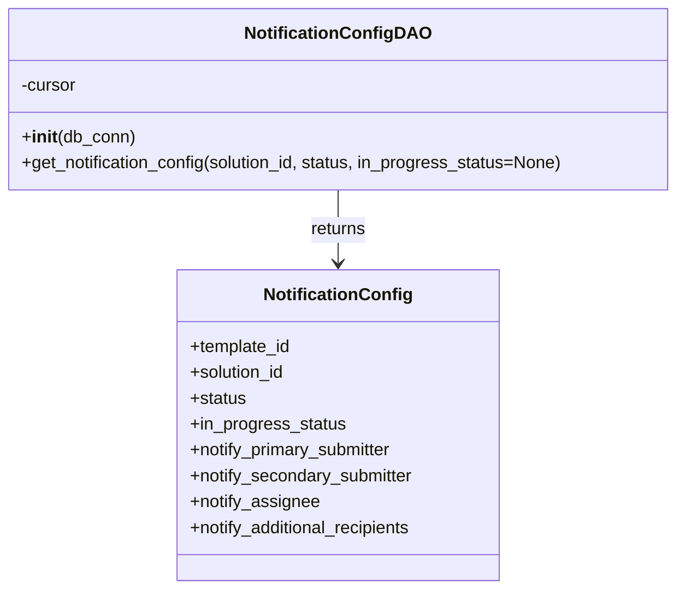

# Diagram: entity_core/entity_service/entity_service/damageview/notification_handler/daos/notification_config_dao.py


> Auto-generated by Obscura crawlers

## Diagram 1



### SVG

<svg id="container" width="631.15625" xmlns="http://www.w3.org/2000/svg" class="classDiagram" height="546" viewBox="0 0 631.15625 546" role="graphics-document document" aria-roledescription="class"><style>#container{font-family:"trebuchet ms",verdana,arial,sans-serif;font-size:16px;fill:#333;}@keyframes edge-animation-frame{from{stroke-dashoffset:0;}}@keyframes dash{to{stroke-dashoffset:0;}}#container .edge-animation-slow{stroke-dasharray:9,5!important;stroke-dashoffset:900;animation:dash 50s linear infinite;stroke-linecap:round;}#container .edge-animation-fast{stroke-dasharray:9,5!important;stroke-dashoffset:900;animation:dash 20s linear infinite;stroke-linecap:round;}#container .error-icon{fill:#552222;}#container .error-text{fill:#552222;stroke:#552222;}#container .edge-thickness-normal{stroke-width:1px;}#container .edge-thickness-thick{stroke-width:3.5px;}#container .edge-pattern-solid{stroke-dasharray:0;}#container .edge-thickness-invisible{stroke-width:0;fill:none;}#container .edge-pattern-dashed{stroke-dasharray:3;}#container .edge-pattern-dotted{stroke-dasharray:2;}#container .marker{fill:#333333;stroke:#333333;}#container .marker.cross{stroke:#333333;}#container svg{font-family:"trebuchet ms",verdana,arial,sans-serif;font-size:16px;}#container p{margin:0;}#container g.classGroup text{fill:#9370DB;stroke:none;font-family:"trebuchet ms",verdana,arial,sans-serif;font-size:10px;}#container g.classGroup text .title{font-weight:bolder;}#container .nodeLabel,#container .edgeLabel{color:#131300;}#container .edgeLabel .label rect{fill:#ECECFF;}#container .label text{fill:#131300;}#container .labelBkg{background:#ECECFF;}#container .edgeLabel .label span{background:#ECECFF;}#container .classTitle{font-weight:bolder;}#container .node rect,#container .node circle,#container .node ellipse,#container .node polygon,#container .node path{fill:#ECECFF;stroke:#9370DB;stroke-width:1px;}#container .divider{stroke:#9370DB;stroke-width:1;}#container g.clickable{cursor:pointer;}#container g.classGroup rect{fill:#ECECFF;stroke:#9370DB;}#container g.classGroup line{stroke:#9370DB;stroke-width:1;}#container .classLabel .box{stroke:none;stroke-width:0;fill:#ECECFF;opacity:0.5;}#container .classLabel .label{fill:#9370DB;font-size:10px;}#container .relation{stroke:#333333;stroke-width:1;fill:none;}#container .dashed-line{stroke-dasharray:3;}#container .dotted-line{stroke-dasharray:1 2;}#container #compositionStart,#container .composition{fill:#333333!important;stroke:#333333!important;stroke-width:1;}#container #compositionEnd,#container .composition{fill:#333333!important;stroke:#333333!important;stroke-width:1;}#container #dependencyStart,#container .dependency{fill:#333333!important;stroke:#333333!important;stroke-width:1;}#container #dependencyStart,#container .dependency{fill:#333333!important;stroke:#333333!important;stroke-width:1;}#container #extensionStart,#container .extension{fill:transparent!important;stroke:#333333!important;stroke-width:1;}#container #extensionEnd,#container .extension{fill:transparent!important;stroke:#333333!important;stroke-width:1;}#container #aggregationStart,#container .aggregation{fill:transparent!important;stroke:#333333!important;stroke-width:1;}#container #aggregationEnd,#container .aggregation{fill:transparent!important;stroke:#333333!important;stroke-width:1;}#container #lollipopStart,#container .lollipop{fill:#ECECFF!important;stroke:#333333!important;stroke-width:1;}#container #lollipopEnd,#container .lollipop{fill:#ECECFF!important;stroke:#333333!important;stroke-width:1;}#container .edgeTerminals{font-size:11px;line-height:initial;}#container .classTitleText{text-anchor:middle;font-size:18px;fill:#333;}#container .label-icon{display:inline-block;height:1em;overflow:visible;vertical-align:-0.125em;}#container .node .label-icon path{fill:currentColor;stroke:revert;stroke-width:revert;}#container :root{--mermaid-font-family:"trebuchet ms",verdana,arial,sans-serif;}</style><g><defs><marker id="container_class-aggregationStart" class="marker aggregation class" refX="18" refY="7" markerWidth="190" markerHeight="240" orient="auto"><path d="M 18,7 L9,13 L1,7 L9,1 Z"></path></marker></defs><defs><marker id="container_class-aggregationEnd" class="marker aggregation class" refX="1" refY="7" markerWidth="20" markerHeight="28" orient="auto"><path d="M 18,7 L9,13 L1,7 L9,1 Z"></path></marker></defs><defs><marker id="container_class-extensionStart" class="marker extension class" refX="18" refY="7" markerWidth="190" markerHeight="240" orient="auto"><path d="M 1,7 L18,13 V 1 Z"></path></marker></defs><defs><marker id="container_class-extensionEnd" class="marker extension class" refX="1" refY="7" markerWidth="20" markerHeight="28" orient="auto"><path d="M 1,1 V 13 L18,7 Z"></path></marker></defs><defs><marker id="container_class-compositionStart" class="marker composition class" refX="18" refY="7" markerWidth="190" markerHeight="240" orient="auto"><path d="M 18,7 L9,13 L1,7 L9,1 Z"></path></marker></defs><defs><marker id="container_class-compositionEnd" class="marker composition class" refX="1" refY="7" markerWidth="20" markerHeight="28" orient="auto"><path d="M 18,7 L9,13 L1,7 L9,1 Z"></path></marker></defs><defs><marker id="container_class-dependencyStart" class="marker dependency class" refX="6" refY="7" markerWidth="190" markerHeight="240" orient="auto"><path d="M 5,7 L9,13 L1,7 L9,1 Z"></path></marker></defs><defs><marker id="container_class-dependencyEnd" class="marker dependency class" refX="13" refY="7" markerWidth="20" markerHeight="28" orient="auto"><path d="M 18,7 L9,13 L14,7 L9,1 Z"></path></marker></defs><defs><marker id="container_class-lollipopStart" class="marker lollipop class" refX="13" refY="7" markerWidth="190" markerHeight="240" orient="auto"><circle stroke="black" fill="transparent" cx="7" cy="7" r="6"></circle></marker></defs><defs><marker id="container_class-lollipopEnd" class="marker lollipop class" refX="1" refY="7" markerWidth="190" markerHeight="240" orient="auto"><circle stroke="black" fill="transparent" cx="7" cy="7" r="6"></circle></marker></defs><g class="root"><g class="clusters"></g><g class="edgePaths"><path d="M315.578,176L315.578,182.167C315.578,188.333,315.578,200.667,315.578,212C315.578,223.333,315.578,233.667,315.578,238.833L315.578,244" id="id_NotificationConfigDAO_NotificationConfig_1" class="edge-thickness-normal edge-pattern-solid relation" style=";;;" data-edge="true" data-et="edge" data-id="id_NotificationConfigDAO_NotificationConfig_1" data-points="W3sieCI6MzE1LjU3ODEyNSwieSI6MTc2fSx7IngiOjMxNS41NzgxMjUsInkiOjIxM30seyJ4IjozMTUuNTc4MTI1LCJ5IjoyNTB9XQ==" marker-end="url(#container_class-dependencyEnd)"></path></g><g class="edgeLabels"><g class="edgeLabel" transform="translate(315.578125, 213)"><g class="label" data-id="id_NotificationConfigDAO_NotificationConfig_1" transform="translate(-26.265625, -12)"><foreignObject width="52.53125" height="24"><div xmlns="http://www.w3.org/1999/xhtml" class="labelBkg" style="display: table-cell; white-space: nowrap; line-height: 1.5; max-width: 200px; text-align: center;"><span class="edgeLabel"><p>returns</p></span></div></foreignObject></g></g></g><g class="nodes"><g class="node default" id="classId-NotificationConfigDAO-0" transform="translate(315.578125, 92)"><g class="basic label-container"><path d="M-307.578125 -84 L307.578125 -84 L307.578125 84 L-307.578125 84" stroke="none" stroke-width="0" fill="#ECECFF" style=""></path><path d="M-307.578125 -84 C-137.13128375113777 -84, 33.315557497724456 -84, 307.578125 -84 M-307.578125 -84 C-88.75133922033635 -84, 130.0754465593273 -84, 307.578125 -84 M307.578125 -84 C307.578125 -26.772739969022275, 307.578125 30.45452006195545, 307.578125 84 M307.578125 -84 C307.578125 -31.91698470524811, 307.578125 20.166030589503777, 307.578125 84 M307.578125 84 C148.7534247886778 84, -10.071275422644419 84, -307.578125 84 M307.578125 84 C177.29961873498175 84, 47.0211124699635 84, -307.578125 84 M-307.578125 84 C-307.578125 43.40682225303918, -307.578125 2.8136445060783615, -307.578125 -84 M-307.578125 84 C-307.578125 38.612718367875765, -307.578125 -6.774563264248471, -307.578125 -84" stroke="#9370DB" stroke-width="1.3" fill="none" stroke-dasharray="0 0" style=""></path></g><g class="annotation-group text" transform="translate(0, -60)"></g><g class="label-group text" transform="translate(-81.109375, -60)"><g class="label" style="font-weight: bolder" transform="translate(0,-12)"><foreignObject width="162.21875" height="24"><div xmlns="http://www.w3.org/1999/xhtml" style="display: table-cell; white-space: nowrap; line-height: 1.5; max-width: 210px; text-align: center;"><span class="nodeLabel markdown-node-label" style=""><p>NotificationConfigDAO</p></span></div></foreignObject></g></g><g class="members-group text" transform="translate(-295.578125, -12)"><g class="label" style="" transform="translate(0,-12)"><foreignObject width="52.1875" height="24"><div xmlns="http://www.w3.org/1999/xhtml" style="display: table-cell; white-space: nowrap; line-height: 1.5; max-width: 110px; text-align: center;"><span class="nodeLabel markdown-node-label" style=""><p>-cursor</p></span></div></foreignObject></g></g><g class="methods-group text" transform="translate(-295.578125, 36)"><g class="label" style="" transform="translate(0,-12)"><foreignObject width="104.96875" height="24"><div xmlns="http://www.w3.org/1999/xhtml" style="display: table-cell; white-space: nowrap; line-height: 1.5; max-width: 194px; text-align: center;"><span class="nodeLabel markdown-node-label" style=""><p>+<strong>init</strong>(db_conn)</p></span></div></foreignObject></g><g class="label" style="" transform="translate(0,12)"><foreignObject width="510.046875" height="24"><div xmlns="http://www.w3.org/1999/xhtml" style="display: table-cell; white-space: nowrap; line-height: 1.5; max-width: 567px; text-align: center;"><span class="nodeLabel markdown-node-label" style=""><p>+get_notification_config(solution_id, status, in_progress_status=None)</p></span></div></foreignObject></g></g><g class="divider" style=""><path d="M-307.578125 -36 C-155.41375960091065 -36, -3.2493942018213033 -36, 307.578125 -36 M-307.578125 -36 C-126.05209941917252 -36, 55.47392616165496 -36, 307.578125 -36" stroke="#9370DB" stroke-width="1.3" fill="none" stroke-dasharray="0 0" style=""></path></g><g class="divider" style=""><path d="M-307.578125 12 C-158.54099940637678 12, -9.503873812753568 12, 307.578125 12 M-307.578125 12 C-126.56513889197961 12, 54.44784721604077 12, 307.578125 12" stroke="#9370DB" stroke-width="1.3" fill="none" stroke-dasharray="0 0" style=""></path></g></g><g class="node default" id="classId-NotificationConfig-1" transform="translate(315.578125, 394)"><g class="basic label-container"><path d="M-151.203125 -144 L151.203125 -144 L151.203125 144 L-151.203125 144" stroke="none" stroke-width="0" fill="#ECECFF" style=""></path><path d="M-151.203125 -144 C-34.52458617359416 -144, 82.15395265281168 -144, 151.203125 -144 M-151.203125 -144 C-83.9389199279739 -144, -16.674714855947798 -144, 151.203125 -144 M151.203125 -144 C151.203125 -67.67208646219646, 151.203125 8.655827075607078, 151.203125 144 M151.203125 -144 C151.203125 -66.92217547409402, 151.203125 10.155649051811963, 151.203125 144 M151.203125 144 C51.89811043703101 144, -47.406904125937984 144, -151.203125 144 M151.203125 144 C46.3050638646652 144, -58.5929972706696 144, -151.203125 144 M-151.203125 144 C-151.203125 30.370422522900526, -151.203125 -83.25915495419895, -151.203125 -144 M-151.203125 144 C-151.203125 30.712401116353533, -151.203125 -82.57519776729293, -151.203125 -144" stroke="#9370DB" stroke-width="1.3" fill="none" stroke-dasharray="0 0" style=""></path></g><g class="annotation-group text" transform="translate(0, -120)"></g><g class="label-group text" transform="translate(-65.8125, -120)"><g class="label" style="font-weight: bolder" transform="translate(0,-12)"><foreignObject width="131.625" height="24"><div xmlns="http://www.w3.org/1999/xhtml" style="display: table-cell; white-space: nowrap; line-height: 1.5; max-width: 181px; text-align: center;"><span class="nodeLabel markdown-node-label" style=""><p>NotificationConfig</p></span></div></foreignObject></g></g><g class="members-group text" transform="translate(-139.203125, -72)"><g class="label" style="" transform="translate(0,-12)"><foreignObject width="95.03125" height="24"><div xmlns="http://www.w3.org/1999/xhtml" style="display: table-cell; white-space: nowrap; line-height: 1.5; max-width: 152px; text-align: center;"><span class="nodeLabel markdown-node-label" style=""><p>+template_id</p></span></div></foreignObject></g><g class="label" style="" transform="translate(0,12)"><foreignObject width="90.21875" height="24"><div xmlns="http://www.w3.org/1999/xhtml" style="display: table-cell; white-space: nowrap; line-height: 1.5; max-width: 148px; text-align: center;"><span class="nodeLabel markdown-node-label" style=""><p>+solution_id</p></span></div></foreignObject></g><g class="label" style="" transform="translate(0,36)"><foreignObject width="52.390625" height="24"><div xmlns="http://www.w3.org/1999/xhtml" style="display: table-cell; white-space: nowrap; line-height: 1.5; max-width: 110px; text-align: center;"><span class="nodeLabel markdown-node-label" style=""><p>+status</p></span></div></foreignObject></g><g class="label" style="" transform="translate(0,60)"><foreignObject width="144.671875" height="24"><div xmlns="http://www.w3.org/1999/xhtml" style="display: table-cell; white-space: nowrap; line-height: 1.5; max-width: 202px; text-align: center;"><span class="nodeLabel markdown-node-label" style=""><p>+in_progress_status</p></span></div></foreignObject></g><g class="label" style="" transform="translate(0,84)"><foreignObject width="193.28125" height="24"><div xmlns="http://www.w3.org/1999/xhtml" style="display: table-cell; white-space: nowrap; line-height: 1.5; max-width: 251px; text-align: center;"><span class="nodeLabel markdown-node-label" style=""><p>+notify_primary_submitter</p></span></div></foreignObject></g><g class="label" style="" transform="translate(0,108)"><foreignObject width="211.1875" height="24"><div xmlns="http://www.w3.org/1999/xhtml" style="display: table-cell; white-space: nowrap; line-height: 1.5; max-width: 269px; text-align: center;"><span class="nodeLabel markdown-node-label" style=""><p>+notify_secondary_submitter</p></span></div></foreignObject></g><g class="label" style="" transform="translate(0,132)"><foreignObject width="120.734375" height="24"><div xmlns="http://www.w3.org/1999/xhtml" style="display: table-cell; white-space: nowrap; line-height: 1.5; max-width: 178px; text-align: center;"><span class="nodeLabel markdown-node-label" style=""><p>+notify_assignee</p></span></div></foreignObject></g><g class="label" style="" transform="translate(0,156)"><foreignObject width="212.59375" height="24"><div xmlns="http://www.w3.org/1999/xhtml" style="display: table-cell; white-space: nowrap; line-height: 1.5; max-width: 270px; text-align: center;"><span class="nodeLabel markdown-node-label" style=""><p>+notify_additional_recipients</p></span></div></foreignObject></g></g><g class="methods-group text" transform="translate(-139.203125, 144)"></g><g class="divider" style=""><path d="M-151.203125 -96 C-85.93938239092829 -96, -20.675639781856574 -96, 151.203125 -96 M-151.203125 -96 C-41.270248302157256 -96, 68.66262839568549 -96, 151.203125 -96" stroke="#9370DB" stroke-width="1.3" fill="none" stroke-dasharray="0 0" style=""></path></g><g class="divider" style=""><path d="M-151.203125 120 C-65.45550332934683 120, 20.29211834130635 120, 151.203125 120 M-151.203125 120 C-63.9848135094426 120, 23.233497981114795 120, 151.203125 120" stroke="#9370DB" stroke-width="1.3" fill="none" stroke-dasharray="0 0" style=""></path></g></g></g></g></g></svg>

## Diagram 2

```mermaid
flowchart TD
    Start([Start]) --> EstablishConn[db_conn.establish_connection()]
    EstablishConn --> GetCursor[self.cursor = db_conn.get_cursor()]
    GetCursor --> PrepareSQL[Prepare SQL query string and data dict]
    PrepareSQL --> Mogrify[self.cursor.mogrify(sql, data) -> query]
    Mogrify --> Execute[self.cursor.execute(query)]
    Execute --> Fetch[result := self.cursor.fetchone()]
    Fetch -->|found| Extract[notify_settings = result.notify_settings or {}]
    Extract --> BuildConfig[Create NotificationConfig(template_id, solution_id, status, in_progress_status,\nnotify_primary_submitter, notify_secondary_submitter, notify_assignee, notify_additional_recipients)]
    BuildConfig --> ReturnConfig[return NotificationConfig]
    Fetch -->|not found| ReturnNone[return None]
    ReturnConfig --> End([End])
    ReturnNone --> End
```

> SVG rendering failed for this diagram.
