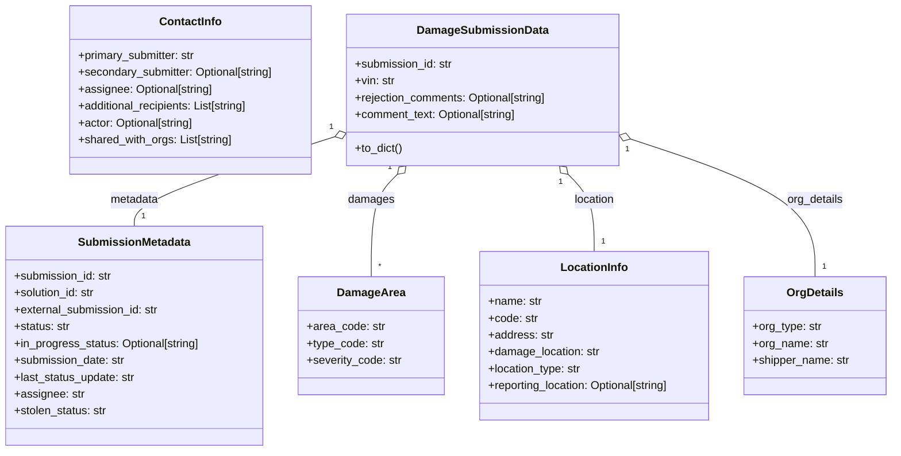

# Diagram: entity_core/entity_service/entity_service/damageview/notification_handler/models/damage_submission.py


> Auto-generated by Obscura crawlers

## Diagram 1



### SVG

<svg id="container" width="1275.0625" xmlns="http://www.w3.org/2000/svg" class="classDiagram" height="642" viewBox="0 0 1275.0625 642" role="graphics-document document" aria-roledescription="class"><style>#container{font-family:"trebuchet ms",verdana,arial,sans-serif;font-size:16px;fill:#333;}@keyframes edge-animation-frame{from{stroke-dashoffset:0;}}@keyframes dash{to{stroke-dashoffset:0;}}#container .edge-animation-slow{stroke-dasharray:9,5!important;stroke-dashoffset:900;animation:dash 50s linear infinite;stroke-linecap:round;}#container .edge-animation-fast{stroke-dasharray:9,5!important;stroke-dashoffset:900;animation:dash 20s linear infinite;stroke-linecap:round;}#container .error-icon{fill:#552222;}#container .error-text{fill:#552222;stroke:#552222;}#container .edge-thickness-normal{stroke-width:1px;}#container .edge-thickness-thick{stroke-width:3.5px;}#container .edge-pattern-solid{stroke-dasharray:0;}#container .edge-thickness-invisible{stroke-width:0;fill:none;}#container .edge-pattern-dashed{stroke-dasharray:3;}#container .edge-pattern-dotted{stroke-dasharray:2;}#container .marker{fill:#333333;stroke:#333333;}#container .marker.cross{stroke:#333333;}#container svg{font-family:"trebuchet ms",verdana,arial,sans-serif;font-size:16px;}#container p{margin:0;}#container g.classGroup text{fill:#9370DB;stroke:none;font-family:"trebuchet ms",verdana,arial,sans-serif;font-size:10px;}#container g.classGroup text .title{font-weight:bolder;}#container .nodeLabel,#container .edgeLabel{color:#131300;}#container .edgeLabel .label rect{fill:#ECECFF;}#container .label text{fill:#131300;}#container .labelBkg{background:#ECECFF;}#container .edgeLabel .label span{background:#ECECFF;}#container .classTitle{font-weight:bolder;}#container .node rect,#container .node circle,#container .node ellipse,#container .node polygon,#container .node path{fill:#ECECFF;stroke:#9370DB;stroke-width:1px;}#container .divider{stroke:#9370DB;stroke-width:1;}#container g.clickable{cursor:pointer;}#container g.classGroup rect{fill:#ECECFF;stroke:#9370DB;}#container g.classGroup line{stroke:#9370DB;stroke-width:1;}#container .classLabel .box{stroke:none;stroke-width:0;fill:#ECECFF;opacity:0.5;}#container .classLabel .label{fill:#9370DB;font-size:10px;}#container .relation{stroke:#333333;stroke-width:1;fill:none;}#container .dashed-line{stroke-dasharray:3;}#container .dotted-line{stroke-dasharray:1 2;}#container #compositionStart,#container .composition{fill:#333333!important;stroke:#333333!important;stroke-width:1;}#container #compositionEnd,#container .composition{fill:#333333!important;stroke:#333333!important;stroke-width:1;}#container #dependencyStart,#container .dependency{fill:#333333!important;stroke:#333333!important;stroke-width:1;}#container #dependencyStart,#container .dependency{fill:#333333!important;stroke:#333333!important;stroke-width:1;}#container #extensionStart,#container .extension{fill:transparent!important;stroke:#333333!important;stroke-width:1;}#container #extensionEnd,#container .extension{fill:transparent!important;stroke:#333333!important;stroke-width:1;}#container #aggregationStart,#container .aggregation{fill:transparent!important;stroke:#333333!important;stroke-width:1;}#container #aggregationEnd,#container .aggregation{fill:transparent!important;stroke:#333333!important;stroke-width:1;}#container #lollipopStart,#container .lollipop{fill:#ECECFF!important;stroke:#333333!important;stroke-width:1;}#container #lollipopEnd,#container .lollipop{fill:#ECECFF!important;stroke:#333333!important;stroke-width:1;}#container .edgeTerminals{font-size:11px;line-height:initial;}#container .classTitleText{text-anchor:middle;font-size:18px;fill:#333;}#container .label-icon{display:inline-block;height:1em;overflow:visible;vertical-align:-0.125em;}#container .node .label-icon path{fill:currentColor;stroke:revert;stroke-width:revert;}#container :root{--mermaid-font-family:"trebuchet ms",verdana,arial,sans-serif;}</style><g><defs><marker id="container_class-aggregationStart" class="marker aggregation class" refX="18" refY="7" markerWidth="190" markerHeight="240" orient="auto"><path d="M 18,7 L9,13 L1,7 L9,1 Z"></path></marker></defs><defs><marker id="container_class-aggregationEnd" class="marker aggregation class" refX="1" refY="7" markerWidth="20" markerHeight="28" orient="auto"><path d="M 18,7 L9,13 L1,7 L9,1 Z"></path></marker></defs><defs><marker id="container_class-extensionStart" class="marker extension class" refX="18" refY="7" markerWidth="190" markerHeight="240" orient="auto"><path d="M 1,7 L18,13 V 1 Z"></path></marker></defs><defs><marker id="container_class-extensionEnd" class="marker extension class" refX="1" refY="7" markerWidth="20" markerHeight="28" orient="auto"><path d="M 1,1 V 13 L18,7 Z"></path></marker></defs><defs><marker id="container_class-compositionStart" class="marker composition class" refX="18" refY="7" markerWidth="190" markerHeight="240" orient="auto"><path d="M 18,7 L9,13 L1,7 L9,1 Z"></path></marker></defs><defs><marker id="container_class-compositionEnd" class="marker composition class" refX="1" refY="7" markerWidth="20" markerHeight="28" orient="auto"><path d="M 18,7 L9,13 L1,7 L9,1 Z"></path></marker></defs><defs><marker id="container_class-dependencyStart" class="marker dependency class" refX="6" refY="7" markerWidth="190" markerHeight="240" orient="auto"><path d="M 5,7 L9,13 L1,7 L9,1 Z"></path></marker></defs><defs><marker id="container_class-dependencyEnd" class="marker dependency class" refX="13" refY="7" markerWidth="20" markerHeight="28" orient="auto"><path d="M 18,7 L9,13 L14,7 L9,1 Z"></path></marker></defs><defs><marker id="container_class-lollipopStart" class="marker lollipop class" refX="13" refY="7" markerWidth="190" markerHeight="240" orient="auto"><circle stroke="black" fill="transparent" cx="7" cy="7" r="6"></circle></marker></defs><defs><marker id="container_class-lollipopEnd" class="marker lollipop class" refX="1" refY="7" markerWidth="190" markerHeight="240" orient="auto"><circle stroke="black" fill="transparent" cx="7" cy="7" r="6"></circle></marker></defs><g class="root"><g class="clusters"></g><g class="edgePaths"><path d="M476.692,195.005L429.268,210.004C381.845,225.003,286.999,255.002,239.576,276.167C192.152,297.333,192.152,309.667,192.152,315.833L192.152,322" id="id_DamageSubmissionData_SubmissionMetadata_1" class="edge-thickness-normal edge-pattern-solid relation" style=";;;" data-edge="true" data-et="edge" data-id="id_DamageSubmissionData_SubmissionMetadata_1" data-points="W3sieCI6NDkzLjEzODY3MTg3NSwieSI6MTg5LjgwMjcxNTcwODM3ODF9LHsieCI6MTkyLjE1MjM0Mzc1LCJ5IjoyODV9LHsieCI6MTkyLjE1MjM0Mzc1LCJ5IjozMjJ9XQ==" marker-start="url(#container_class-aggregationStart)"></path><path d="M566.183,248.083L559.914,254.235C553.644,260.388,541.105,272.694,534.836,297.014C528.566,321.333,528.566,357.667,528.566,375.833L528.566,394" id="id_DamageSubmissionData_DamageArea_2" class="edge-thickness-normal edge-pattern-solid relation" style=";;;" data-edge="true" data-et="edge" data-id="id_DamageSubmissionData_DamageArea_2" data-points="W3sieCI6NTc4LjQ5NDc4NzUxOTkwNDQsInkiOjIzNn0seyJ4Ijo1MjguNTY2NDA2MjUsInkiOjI4NX0seyJ4Ijo1MjguNTY2NDA2MjUsInkiOjM5NH1d" marker-start="url(#container_class-aggregationStart)"></path><path d="M810.899,248.083L817.168,254.235C823.438,260.388,835.977,272.694,842.246,291.014C848.516,309.333,848.516,333.667,848.516,345.833L848.516,358" id="id_DamageSubmissionData_LocationInfo_3" class="edge-thickness-normal edge-pattern-solid relation" style=";;;" data-edge="true" data-et="edge" data-id="id_DamageSubmissionData_LocationInfo_3" data-points="W3sieCI6Nzk4LjU4NzI0MzczMDA5NTYsInkiOjIzNn0seyJ4Ijo4NDguNTE1NjI1LCJ5IjoyODV9LHsieCI6ODQ4LjUxNTYyNSwieSI6MzU4fV0=" marker-start="url(#container_class-aggregationStart)"></path><path d="M900.332,197.55L944.716,212.125C989.099,226.7,1077.866,255.85,1122.249,288.592C1166.633,321.333,1166.633,357.667,1166.633,375.833L1166.633,394" id="id_DamageSubmissionData_OrgDetails_4" class="edge-thickness-normal edge-pattern-solid relation" style=";;;" data-edge="true" data-et="edge" data-id="id_DamageSubmissionData_OrgDetails_4" data-points="W3sieCI6ODgzLjk0MzM1OTM3NSwieSI6MTkyLjE2Nzk0NDY2OTM2MDIyfSx7IngiOjExNjYuNjMyODEyNSwieSI6Mjg1fSx7IngiOjExNjYuNjMyODEyNSwieSI6Mzk0fV0=" marker-start="url(#container_class-aggregationStart)"></path></g><g class="edgeLabels"><g class="edgeLabel" transform="translate(192.15234375, 285)"><g class="label" data-id="id_DamageSubmissionData_SubmissionMetadata_1" transform="translate(-34.7265625, -12)"><foreignObject width="69.453125" height="24"><div xmlns="http://www.w3.org/1999/xhtml" class="labelBkg" style="display: table-cell; white-space: nowrap; line-height: 1.5; max-width: 200px; text-align: center;"><span class="edgeLabel"><p>metadata</p></span></div></foreignObject></g></g><g class="edgeLabel" transform="translate(528.56640625, 285)"><g class="label" data-id="id_DamageSubmissionData_DamageArea_2" transform="translate(-32.3984375, -12)"><foreignObject width="64.796875" height="24"><div xmlns="http://www.w3.org/1999/xhtml" class="labelBkg" style="display: table-cell; white-space: nowrap; line-height: 1.5; max-width: 200px; text-align: center;"><span class="edgeLabel"><p>damages</p></span></div></foreignObject></g></g><g class="edgeLabel" transform="translate(848.515625, 285)"><g class="label" data-id="id_DamageSubmissionData_LocationInfo_3" transform="translate(-29.578125, -12)"><foreignObject width="59.15625" height="24"><div xmlns="http://www.w3.org/1999/xhtml" class="labelBkg" style="display: table-cell; white-space: nowrap; line-height: 1.5; max-width: 200px; text-align: center;"><span class="edgeLabel"><p>location</p></span></div></foreignObject></g></g><g class="edgeLabel" transform="translate(1166.6328125, 285)"><g class="label" data-id="id_DamageSubmissionData_OrgDetails_4" transform="translate(-40.5, -12)"><foreignObject width="81" height="24"><div xmlns="http://www.w3.org/1999/xhtml" class="labelBkg" style="display: table-cell; white-space: nowrap; line-height: 1.5; max-width: 200px; text-align: center;"><span class="edgeLabel"><p>org_details</p></span></div></foreignObject></g></g><g class="edgeTerminals" transform="translate(471.92994034684847, 180.77831659715585)"><g class="inner" transform="translate(0, 0)"><foreignObject style="width: 9px; height: 12px;"><div xmlns="http://www.w3.org/1999/xhtml" style="display: inline-block; padding-right: 1px; white-space: nowrap;"><span class="edgeLabel">1</span></div></foreignObject></g></g><g class="edgeTerminals" transform="translate(555.4982399372798, 237.5520393918557)"><g class="inner" transform="translate(0, 0)"><foreignObject style="width: 9px; height: 12px;"><div xmlns="http://www.w3.org/1999/xhtml" style="display: inline-block; padding-right: 1px; white-space: nowrap;"><span class="edgeLabel">1</span></div></foreignObject></g></g><g class="edgeTerminals" transform="translate(800.5705827745653, 258.963370345314)"><g class="inner" transform="translate(0, 0)"><foreignObject style="width: 9px; height: 12px;"><div xmlns="http://www.w3.org/1999/xhtml" style="display: inline-block; padding-right: 1px; white-space: nowrap;"><span class="edgeLabel">1</span></div></foreignObject></g></g><g class="edgeTerminals" transform="translate(895.8898637563811, 211.87913497417892)"><g class="inner" transform="translate(0, 0)"><foreignObject style="width: 9px; height: 12px;"><div xmlns="http://www.w3.org/1999/xhtml" style="display: inline-block; padding-right: 1px; white-space: nowrap;"><span class="edgeLabel">1</span></div></foreignObject></g></g><g class="edgeTerminals" transform="translate(202.1523418749999, 299.49999839285715)"><g class="inner" transform="translate(0, 0)"></g><foreignObject style="width: 9px; height: 12px;"><div xmlns="http://www.w3.org/1999/xhtml" style="display: inline-block; padding-right: 1px; white-space: nowrap;"><span class="edgeLabel">1</span></div></foreignObject></g><g class="edgeTerminals" transform="translate(538.5664081249998, 371.50000160714285)"><g class="inner" transform="translate(0, 0)"></g><foreignObject style="width: 9px; height: 12px;"><div xmlns="http://www.w3.org/1999/xhtml" style="display: inline-block; padding-right: 1px; white-space: nowrap;"><span class="edgeLabel">*</span></div></foreignObject></g><g class="edgeTerminals" transform="translate(858.5156274999998, 335.5000021428571)"><g class="inner" transform="translate(0, 0)"></g><foreignObject style="width: 9px; height: 12px;"><div xmlns="http://www.w3.org/1999/xhtml" style="display: inline-block; padding-right: 1px; white-space: nowrap;"><span class="edgeLabel">1</span></div></foreignObject></g><g class="edgeTerminals" transform="translate(1176.63281125, 371.4999989285715)"><g class="inner" transform="translate(0, 0)"></g><foreignObject style="width: 9px; height: 12px;"><div xmlns="http://www.w3.org/1999/xhtml" style="display: inline-block; padding-right: 1px; white-space: nowrap;"><span class="edgeLabel">1</span></div></foreignObject></g></g><g class="nodes"><g class="node default" id="classId-DamageArea-0" transform="translate(528.56640625, 478)"><g class="basic label-container"><path d="M-102.26171875 -84 L102.26171875 -84 L102.26171875 84 L-102.26171875 84" stroke="none" stroke-width="0" fill="#ECECFF" style=""></path><path d="M-102.26171875 -84 C-37.25941449813102 -84, 27.742889753737956 -84, 102.26171875 -84 M-102.26171875 -84 C-23.417577692721053 -84, 55.42656336455789 -84, 102.26171875 -84 M102.26171875 -84 C102.26171875 -47.54506501265765, 102.26171875 -11.090130025315304, 102.26171875 84 M102.26171875 -84 C102.26171875 -43.25759405616338, 102.26171875 -2.5151881123267543, 102.26171875 84 M102.26171875 84 C27.022449312795743 84, -48.216820124408514 84, -102.26171875 84 M102.26171875 84 C49.35158900500327 84, -3.558540739993461 84, -102.26171875 84 M-102.26171875 84 C-102.26171875 33.91909034292743, -102.26171875 -16.161819314145134, -102.26171875 -84 M-102.26171875 84 C-102.26171875 22.277091153204516, -102.26171875 -39.44581769359097, -102.26171875 -84" stroke="#9370DB" stroke-width="1.3" fill="none" stroke-dasharray="0 0" style=""></path></g><g class="annotation-group text" transform="translate(0, -60)"></g><g class="label-group text" transform="translate(-45.6328125, -60)"><g class="label" style="font-weight: bolder" transform="translate(0,-12)"><foreignObject width="91.265625" height="24"><div xmlns="http://www.w3.org/1999/xhtml" style="display: table-cell; white-space: nowrap; line-height: 1.5; max-width: 140px; text-align: center;"><span class="nodeLabel markdown-node-label" style=""><p>DamageArea</p></span></div></foreignObject></g></g><g class="members-group text" transform="translate(-90.26171875, -12)"><g class="label" style="" transform="translate(0,-12)"><foreignObject width="109.875" height="24"><div xmlns="http://www.w3.org/1999/xhtml" style="display: table-cell; white-space: nowrap; line-height: 1.5; max-width: 168px; text-align: center;"><span class="nodeLabel markdown-node-label" style=""><p>+area_code: str</p></span></div></foreignObject></g><g class="label" style="" transform="translate(0,12)"><foreignObject width="109.84375" height="24"><div xmlns="http://www.w3.org/1999/xhtml" style="display: table-cell; white-space: nowrap; line-height: 1.5; max-width: 168px; text-align: center;"><span class="nodeLabel markdown-node-label" style=""><p>+type_code: str</p></span></div></foreignObject></g><g class="label" style="" transform="translate(0,36)"><foreignObject width="134.890625" height="24"><div xmlns="http://www.w3.org/1999/xhtml" style="display: table-cell; white-space: nowrap; line-height: 1.5; max-width: 193px; text-align: center;"><span class="nodeLabel markdown-node-label" style=""><p>+severity_code: str</p></span></div></foreignObject></g></g><g class="methods-group text" transform="translate(-90.26171875, 84)"></g><g class="divider" style=""><path d="M-102.26171875 -36 C-56.04163406901312 -36, -9.821549388026241 -36, 102.26171875 -36 M-102.26171875 -36 C-58.89972881032671 -36, -15.537738870653413 -36, 102.26171875 -36" stroke="#9370DB" stroke-width="1.3" fill="none" stroke-dasharray="0 0" style=""></path></g><g class="divider" style=""><path d="M-102.26171875 60 C-37.26643705465874 60, 27.728844640682524 60, 102.26171875 60 M-102.26171875 60 C-36.88118096767275 60, 28.499356814654504 60, 102.26171875 60" stroke="#9370DB" stroke-width="1.3" fill="none" stroke-dasharray="0 0" style=""></path></g></g><g class="node default" id="classId-LocationInfo-1" transform="translate(848.515625, 478)"><g class="basic label-container"><path d="M-167.6875 -120 L167.6875 -120 L167.6875 120 L-167.6875 120" stroke="none" stroke-width="0" fill="#ECECFF" style=""></path><path d="M-167.6875 -120 C-96.80753368613556 -120, -25.927567372271113 -120, 167.6875 -120 M-167.6875 -120 C-54.97244363601365 -120, 57.7426127279727 -120, 167.6875 -120 M167.6875 -120 C167.6875 -46.8024718588522, 167.6875 26.3950562822956, 167.6875 120 M167.6875 -120 C167.6875 -36.622366221609354, 167.6875 46.75526755678129, 167.6875 120 M167.6875 120 C55.835825237982306 120, -56.01584952403539 120, -167.6875 120 M167.6875 120 C50.643461243655 120, -66.40057751269 120, -167.6875 120 M-167.6875 120 C-167.6875 26.578646130742527, -167.6875 -66.84270773851495, -167.6875 -120 M-167.6875 120 C-167.6875 54.82040167071884, -167.6875 -10.359196658562325, -167.6875 -120" stroke="#9370DB" stroke-width="1.3" fill="none" stroke-dasharray="0 0" style=""></path></g><g class="annotation-group text" transform="translate(0, -96)"></g><g class="label-group text" transform="translate(-45.75, -96)"><g class="label" style="font-weight: bolder" transform="translate(0,-12)"><foreignObject width="91.5" height="24"><div xmlns="http://www.w3.org/1999/xhtml" style="display: table-cell; white-space: nowrap; line-height: 1.5; max-width: 141px; text-align: center;"><span class="nodeLabel markdown-node-label" style=""><p>LocationInfo</p></span></div></foreignObject></g></g><g class="members-group text" transform="translate(-155.6875, -48)"><g class="label" style="" transform="translate(0,-12)"><foreignObject width="76.015625" height="24"><div xmlns="http://www.w3.org/1999/xhtml" style="display: table-cell; white-space: nowrap; line-height: 1.5; max-width: 134px; text-align: center;"><span class="nodeLabel markdown-node-label" style=""><p>+name: str</p></span></div></foreignObject></g><g class="label" style="" transform="translate(0,12)"><foreignObject width="70.453125" height="24"><div xmlns="http://www.w3.org/1999/xhtml" style="display: table-cell; white-space: nowrap; line-height: 1.5; max-width: 129px; text-align: center;"><span class="nodeLabel markdown-node-label" style=""><p>+code: str</p></span></div></foreignObject></g><g class="label" style="" transform="translate(0,36)"><foreignObject width="92.296875" height="24"><div xmlns="http://www.w3.org/1999/xhtml" style="display: table-cell; white-space: nowrap; line-height: 1.5; max-width: 150px; text-align: center;"><span class="nodeLabel markdown-node-label" style=""><p>+address: str</p></span></div></foreignObject></g><g class="label" style="" transform="translate(0,60)"><foreignObject width="159.796875" height="24"><div xmlns="http://www.w3.org/1999/xhtml" style="display: table-cell; white-space: nowrap; line-height: 1.5; max-width: 218px; text-align: center;"><span class="nodeLabel markdown-node-label" style=""><p>+damage_location: str</p></span></div></foreignObject></g><g class="label" style="" transform="translate(0,84)"><foreignObject width="134.4375" height="24"><div xmlns="http://www.w3.org/1999/xhtml" style="display: table-cell; white-space: nowrap; line-height: 1.5; max-width: 193px; text-align: center;"><span class="nodeLabel markdown-node-label" style=""><p>+location_type: str</p></span></div></foreignObject></g><g class="label" style="" transform="translate(0,108)"><foreignObject width="265.625" height="24"><div xmlns="http://www.w3.org/1999/xhtml" style="display: table-cell; white-space: nowrap; line-height: 1.5; max-width: 323px; text-align: center;"><span class="nodeLabel markdown-node-label" style=""><p>+reporting_location: Optional[string]</p></span></div></foreignObject></g></g><g class="methods-group text" transform="translate(-155.6875, 120)"></g><g class="divider" style=""><path d="M-167.6875 -72 C-76.92233928468458 -72, 13.842821430630835 -72, 167.6875 -72 M-167.6875 -72 C-47.933339330630986 -72, 71.82082133873803 -72, 167.6875 -72" stroke="#9370DB" stroke-width="1.3" fill="none" stroke-dasharray="0 0" style=""></path></g><g class="divider" style=""><path d="M-167.6875 96 C-75.12132207482107 96, 17.444855850357868 96, 167.6875 96 M-167.6875 96 C-78.52216995551359 96, 10.64316008897282 96, 167.6875 96" stroke="#9370DB" stroke-width="1.3" fill="none" stroke-dasharray="0 0" style=""></path></g></g><g class="node default" id="classId-SubmissionMetadata-2" transform="translate(192.15234375, 478)"><g class="basic label-container"><path d="M-184.15234375 -156 L184.15234375 -156 L184.15234375 156 L-184.15234375 156" stroke="none" stroke-width="0" fill="#ECECFF" style=""></path><path d="M-184.15234375 -156 C-99.54415568652348 -156, -14.935967623046963 -156, 184.15234375 -156 M-184.15234375 -156 C-92.56174980866072 -156, -0.9711558673214427 -156, 184.15234375 -156 M184.15234375 -156 C184.15234375 -40.538987000076304, 184.15234375 74.92202599984739, 184.15234375 156 M184.15234375 -156 C184.15234375 -88.70471177422411, 184.15234375 -21.409423548448217, 184.15234375 156 M184.15234375 156 C89.36660421010666 156, -5.419135329786684 156, -184.15234375 156 M184.15234375 156 C83.90505223829537 156, -16.342239273409263 156, -184.15234375 156 M-184.15234375 156 C-184.15234375 59.67117523722855, -184.15234375 -36.657649525542894, -184.15234375 -156 M-184.15234375 156 C-184.15234375 46.01061001075732, -184.15234375 -63.97877997848536, -184.15234375 -156" stroke="#9370DB" stroke-width="1.3" fill="none" stroke-dasharray="0 0" style=""></path></g><g class="annotation-group text" transform="translate(0, -132)"></g><g class="label-group text" transform="translate(-76.8046875, -132)"><g class="label" style="font-weight: bolder" transform="translate(0,-12)"><foreignObject width="153.609375" height="24"><div xmlns="http://www.w3.org/1999/xhtml" style="display: table-cell; white-space: nowrap; line-height: 1.5; max-width: 202px; text-align: center;"><span class="nodeLabel markdown-node-label" style=""><p>SubmissionMetadata</p></span></div></foreignObject></g></g><g class="members-group text" transform="translate(-172.15234375, -84)"><g class="label" style="" transform="translate(0,-12)"><foreignObject width="140.421875" height="24"><div xmlns="http://www.w3.org/1999/xhtml" style="display: table-cell; white-space: nowrap; line-height: 1.5; max-width: 199px; text-align: center;"><span class="nodeLabel markdown-node-label" style=""><p>+submission_id: str</p></span></div></foreignObject></g><g class="label" style="" transform="translate(0,12)"><foreignObject width="117.71875" height="24"><div xmlns="http://www.w3.org/1999/xhtml" style="display: table-cell; white-space: nowrap; line-height: 1.5; max-width: 176px; text-align: center;"><span class="nodeLabel markdown-node-label" style=""><p>+solution_id: str</p></span></div></foreignObject></g><g class="label" style="" transform="translate(0,36)"><foreignObject width="208.125" height="24"><div xmlns="http://www.w3.org/1999/xhtml" style="display: table-cell; white-space: nowrap; line-height: 1.5; max-width: 266px; text-align: center;"><span class="nodeLabel markdown-node-label" style=""><p>+external_submission_id: str</p></span></div></foreignObject></g><g class="label" style="" transform="translate(0,60)"><foreignObject width="79.890625" height="24"><div xmlns="http://www.w3.org/1999/xhtml" style="display: table-cell; white-space: nowrap; line-height: 1.5; max-width: 138px; text-align: center;"><span class="nodeLabel markdown-node-label" style=""><p>+status: str</p></span></div></foreignObject></g><g class="label" style="" transform="translate(0,84)"><foreignObject width="267.5" height="24"><div xmlns="http://www.w3.org/1999/xhtml" style="display: table-cell; white-space: nowrap; line-height: 1.5; max-width: 325px; text-align: center;"><span class="nodeLabel markdown-node-label" style=""><p>+in_progress_status: Optional[string]</p></span></div></foreignObject></g><g class="label" style="" transform="translate(0,108)"><foreignObject width="158.546875" height="24"><div xmlns="http://www.w3.org/1999/xhtml" style="display: table-cell; white-space: nowrap; line-height: 1.5; max-width: 217px; text-align: center;"><span class="nodeLabel markdown-node-label" style=""><p>+submission_date: str</p></span></div></foreignObject></g><g class="label" style="" transform="translate(0,132)"><foreignObject width="173.640625" height="24"><div xmlns="http://www.w3.org/1999/xhtml" style="display: table-cell; white-space: nowrap; line-height: 1.5; max-width: 232px; text-align: center;"><span class="nodeLabel markdown-node-label" style=""><p>+last_status_update: str</p></span></div></foreignObject></g><g class="label" style="" transform="translate(0,156)"><foreignObject width="98.234375" height="24"><div xmlns="http://www.w3.org/1999/xhtml" style="display: table-cell; white-space: nowrap; line-height: 1.5; max-width: 156px; text-align: center;"><span class="nodeLabel markdown-node-label" style=""><p>+assignee: str</p></span></div></foreignObject></g><g class="label" style="" transform="translate(0,180)"><foreignObject width="133.265625" height="24"><div xmlns="http://www.w3.org/1999/xhtml" style="display: table-cell; white-space: nowrap; line-height: 1.5; max-width: 191px; text-align: center;"><span class="nodeLabel markdown-node-label" style=""><p>+stolen_status: str</p></span></div></foreignObject></g></g><g class="methods-group text" transform="translate(-172.15234375, 156)"></g><g class="divider" style=""><path d="M-184.15234375 -108 C-52.34166474426351 -108, 79.46901426147298 -108, 184.15234375 -108 M-184.15234375 -108 C-103.27210401590497 -108, -22.391864281809944 -108, 184.15234375 -108" stroke="#9370DB" stroke-width="1.3" fill="none" stroke-dasharray="0 0" style=""></path></g><g class="divider" style=""><path d="M-184.15234375 132 C-107.06525611918238 132, -29.97816848836476 132, 184.15234375 132 M-184.15234375 132 C-48.179861550679306 132, 87.79262064864139 132, 184.15234375 132" stroke="#9370DB" stroke-width="1.3" fill="none" stroke-dasharray="0 0" style=""></path></g></g><g class="node default" id="classId-ContactInfo-3" transform="translate(267.869140625, 128)"><g class="basic label-container"><path d="M-175.26953125 -120 L175.26953125 -120 L175.26953125 120 L-175.26953125 120" stroke="none" stroke-width="0" fill="#ECECFF" style=""></path><path d="M-175.26953125 -120 C-75.90433459221448 -120, 23.460862065571035 -120, 175.26953125 -120 M-175.26953125 -120 C-58.40495847537434 -120, 58.459614299251314 -120, 175.26953125 -120 M175.26953125 -120 C175.26953125 -41.70106345564105, 175.26953125 36.597873088717904, 175.26953125 120 M175.26953125 -120 C175.26953125 -43.01469770738228, 175.26953125 33.970604585235435, 175.26953125 120 M175.26953125 120 C39.73618402841771 120, -95.79716319316458 120, -175.26953125 120 M175.26953125 120 C43.530799552204144 120, -88.20793214559171 120, -175.26953125 120 M-175.26953125 120 C-175.26953125 41.49854031307645, -175.26953125 -37.00291937384711, -175.26953125 -120 M-175.26953125 120 C-175.26953125 49.98068752099827, -175.26953125 -20.038624958003453, -175.26953125 -120" stroke="#9370DB" stroke-width="1.3" fill="none" stroke-dasharray="0 0" style=""></path></g><g class="annotation-group text" transform="translate(0, -96)"></g><g class="label-group text" transform="translate(-42.4296875, -96)"><g class="label" style="font-weight: bolder" transform="translate(0,-12)"><foreignObject width="84.859375" height="24"><div xmlns="http://www.w3.org/1999/xhtml" style="display: table-cell; white-space: nowrap; line-height: 1.5; max-width: 134px; text-align: center;"><span class="nodeLabel markdown-node-label" style=""><p>ContactInfo</p></span></div></foreignObject></g></g><g class="members-group text" transform="translate(-163.26953125, -48)"><g class="label" style="" transform="translate(0,-12)"><foreignObject width="170.875" height="24"><div xmlns="http://www.w3.org/1999/xhtml" style="display: table-cell; white-space: nowrap; line-height: 1.5; max-width: 229px; text-align: center;"><span class="nodeLabel markdown-node-label" style=""><p>+primary_submitter: str</p></span></div></foreignObject></g><g class="label" style="" transform="translate(0,12)"><foreignObject width="284.109375" height="24"><div xmlns="http://www.w3.org/1999/xhtml" style="display: table-cell; white-space: nowrap; line-height: 1.5; max-width: 341px; text-align: center;"><span class="nodeLabel markdown-node-label" style=""><p>+secondary_submitter: Optional[string]</p></span></div></foreignObject></g><g class="label" style="" transform="translate(0,36)"><foreignObject width="193.5625" height="24"><div xmlns="http://www.w3.org/1999/xhtml" style="display: table-cell; white-space: nowrap; line-height: 1.5; max-width: 251px; text-align: center;"><span class="nodeLabel markdown-node-label" style=""><p>+assignee: Optional[string]</p></span></div></foreignObject></g><g class="label" style="" transform="translate(0,60)"><foreignObject width="248.34375" height="24"><div xmlns="http://www.w3.org/1999/xhtml" style="display: table-cell; white-space: nowrap; line-height: 1.5; max-width: 306px; text-align: center;"><span class="nodeLabel markdown-node-label" style=""><p>+additional_recipients: List[string]</p></span></div></foreignObject></g><g class="label" style="" transform="translate(0,84)"><foreignObject width="168.15625" height="24"><div xmlns="http://www.w3.org/1999/xhtml" style="display: table-cell; white-space: nowrap; line-height: 1.5; max-width: 226px; text-align: center;"><span class="nodeLabel markdown-node-label" style=""><p>+actor: Optional[string]</p></span></div></foreignObject></g><g class="label" style="" transform="translate(0,108)"><foreignObject width="221.375" height="24"><div xmlns="http://www.w3.org/1999/xhtml" style="display: table-cell; white-space: nowrap; line-height: 1.5; max-width: 279px; text-align: center;"><span class="nodeLabel markdown-node-label" style=""><p>+shared_with_orgs: List[string]</p></span></div></foreignObject></g></g><g class="methods-group text" transform="translate(-163.26953125, 120)"></g><g class="divider" style=""><path d="M-175.26953125 -72 C-69.70383160362485 -72, 35.8618680427503 -72, 175.26953125 -72 M-175.26953125 -72 C-41.24502840369021 -72, 92.77947444261957 -72, 175.26953125 -72" stroke="#9370DB" stroke-width="1.3" fill="none" stroke-dasharray="0 0" style=""></path></g><g class="divider" style=""><path d="M-175.26953125 96 C-45.044531834857 96, 85.180467580286 96, 175.26953125 96 M-175.26953125 96 C-56.07709267504258 96, 63.11534589991484 96, 175.26953125 96" stroke="#9370DB" stroke-width="1.3" fill="none" stroke-dasharray="0 0" style=""></path></g></g><g class="node default" id="classId-OrgDetails-4" transform="translate(1166.6328125, 478)"><g class="basic label-container"><path d="M-100.4296875 -84 L100.4296875 -84 L100.4296875 84 L-100.4296875 84" stroke="none" stroke-width="0" fill="#ECECFF" style=""></path><path d="M-100.4296875 -84 C-49.4296787047701 -84, 1.5703300904598052 -84, 100.4296875 -84 M-100.4296875 -84 C-27.621109143509557 -84, 45.187469212980886 -84, 100.4296875 -84 M100.4296875 -84 C100.4296875 -47.01941957671646, 100.4296875 -10.038839153432917, 100.4296875 84 M100.4296875 -84 C100.4296875 -47.019849112025135, 100.4296875 -10.03969822405027, 100.4296875 84 M100.4296875 84 C48.64624498834132 84, -3.1371975233173544 84, -100.4296875 84 M100.4296875 84 C37.56595948071606 84, -25.29776853856788 84, -100.4296875 84 M-100.4296875 84 C-100.4296875 45.90048845659717, -100.4296875 7.800976913194333, -100.4296875 -84 M-100.4296875 84 C-100.4296875 25.82041162751748, -100.4296875 -32.35917674496504, -100.4296875 -84" stroke="#9370DB" stroke-width="1.3" fill="none" stroke-dasharray="0 0" style=""></path></g><g class="annotation-group text" transform="translate(0, -60)"></g><g class="label-group text" transform="translate(-38.546875, -60)"><g class="label" style="font-weight: bolder" transform="translate(0,-12)"><foreignObject width="77.09375" height="24"><div xmlns="http://www.w3.org/1999/xhtml" style="display: table-cell; white-space: nowrap; line-height: 1.5; max-width: 125px; text-align: center;"><span class="nodeLabel markdown-node-label" style=""><p>OrgDetails</p></span></div></foreignObject></g></g><g class="members-group text" transform="translate(-88.4296875, -12)"><g class="label" style="" transform="translate(0,-12)"><foreignObject width="98.953125" height="24"><div xmlns="http://www.w3.org/1999/xhtml" style="display: table-cell; white-space: nowrap; line-height: 1.5; max-width: 157px; text-align: center;"><span class="nodeLabel markdown-node-label" style=""><p>+org_type: str</p></span></div></foreignObject></g><g class="label" style="" transform="translate(0,12)"><foreignObject width="107.984375" height="24"><div xmlns="http://www.w3.org/1999/xhtml" style="display: table-cell; white-space: nowrap; line-height: 1.5; max-width: 166px; text-align: center;"><span class="nodeLabel markdown-node-label" style=""><p>+org_name: str</p></span></div></foreignObject></g><g class="label" style="" transform="translate(0,36)"><foreignObject width="138.3125" height="24"><div xmlns="http://www.w3.org/1999/xhtml" style="display: table-cell; white-space: nowrap; line-height: 1.5; max-width: 196px; text-align: center;"><span class="nodeLabel markdown-node-label" style=""><p>+shipper_name: str</p></span></div></foreignObject></g></g><g class="methods-group text" transform="translate(-88.4296875, 84)"></g><g class="divider" style=""><path d="M-100.4296875 -36 C-53.03493272511504 -36, -5.640177950230083 -36, 100.4296875 -36 M-100.4296875 -36 C-44.5719345360709 -36, 11.285818427858203 -36, 100.4296875 -36" stroke="#9370DB" stroke-width="1.3" fill="none" stroke-dasharray="0 0" style=""></path></g><g class="divider" style=""><path d="M-100.4296875 60 C-43.29700836995491 60, 13.835670760090181 60, 100.4296875 60 M-100.4296875 60 C-44.63183381975859 60, 11.16601986048282 60, 100.4296875 60" stroke="#9370DB" stroke-width="1.3" fill="none" stroke-dasharray="0 0" style=""></path></g></g><g class="node default" id="classId-DamageSubmissionData-5" transform="translate(688.541015625, 128)"><g class="basic label-container"><path d="M-195.40234375 -108 L195.40234375 -108 L195.40234375 108 L-195.40234375 108" stroke="none" stroke-width="0" fill="#ECECFF" style=""></path><path d="M-195.40234375 -108 C-86.75009776332372 -108, 21.902148223352555 -108, 195.40234375 -108 M-195.40234375 -108 C-93.82760235147889 -108, 7.747139047042225 -108, 195.40234375 -108 M195.40234375 -108 C195.40234375 -23.663196407830995, 195.40234375 60.67360718433801, 195.40234375 108 M195.40234375 -108 C195.40234375 -32.586451515818624, 195.40234375 42.82709696836275, 195.40234375 108 M195.40234375 108 C85.66370125564794 108, -24.074941238704127 108, -195.40234375 108 M195.40234375 108 C113.14131965390736 108, 30.88029555781472 108, -195.40234375 108 M-195.40234375 108 C-195.40234375 39.99973544792526, -195.40234375 -28.00052910414948, -195.40234375 -108 M-195.40234375 108 C-195.40234375 53.2488235125996, -195.40234375 -1.5023529748008002, -195.40234375 -108" stroke="#9370DB" stroke-width="1.3" fill="none" stroke-dasharray="0 0" style=""></path></g><g class="annotation-group text" transform="translate(0, -84)"></g><g class="label-group text" transform="translate(-88.2734375, -84)"><g class="label" style="font-weight: bolder" transform="translate(0,-12)"><foreignObject width="176.546875" height="24"><div xmlns="http://www.w3.org/1999/xhtml" style="display: table-cell; white-space: nowrap; line-height: 1.5; max-width: 225px; text-align: center;"><span class="nodeLabel markdown-node-label" style=""><p>DamageSubmissionData</p></span></div></foreignObject></g></g><g class="members-group text" transform="translate(-183.40234375, -36)"><g class="label" style="" transform="translate(0,-12)"><foreignObject width="140.421875" height="24"><div xmlns="http://www.w3.org/1999/xhtml" style="display: table-cell; white-space: nowrap; line-height: 1.5; max-width: 199px; text-align: center;"><span class="nodeLabel markdown-node-label" style=""><p>+submission_id: str</p></span></div></foreignObject></g><g class="label" style="" transform="translate(0,12)"><foreignObject width="57.09375" height="24"><div xmlns="http://www.w3.org/1999/xhtml" style="display: table-cell; white-space: nowrap; line-height: 1.5; max-width: 115px; text-align: center;"><span class="nodeLabel markdown-node-label" style=""><p>+vin: str</p></span></div></foreignObject></g><g class="label" style="" transform="translate(0,36)"><foreignObject width="278.53125" height="24"><div xmlns="http://www.w3.org/1999/xhtml" style="display: table-cell; white-space: nowrap; line-height: 1.5; max-width: 336px; text-align: center;"><span class="nodeLabel markdown-node-label" style=""><p>+rejection_comments: Optional[string]</p></span></div></foreignObject></g><g class="label" style="" transform="translate(0,60)"><foreignObject width="234.5" height="24"><div xmlns="http://www.w3.org/1999/xhtml" style="display: table-cell; white-space: nowrap; line-height: 1.5; max-width: 292px; text-align: center;"><span class="nodeLabel markdown-node-label" style=""><p>+comment_text: Optional[string]</p></span></div></foreignObject></g></g><g class="methods-group text" transform="translate(-183.40234375, 84)"><g class="label" style="" transform="translate(0,-12)"><foreignObject width="68.34375" height="24"><div xmlns="http://www.w3.org/1999/xhtml" style="display: table-cell; white-space: nowrap; line-height: 1.5; max-width: 126px; text-align: center;"><span class="nodeLabel markdown-node-label" style=""><p>+to_dict()</p></span></div></foreignObject></g></g><g class="divider" style=""><path d="M-195.40234375 -60 C-112.79118626165334 -60, -30.180028773306674 -60, 195.40234375 -60 M-195.40234375 -60 C-111.51576502941019 -60, -27.62918630882038 -60, 195.40234375 -60" stroke="#9370DB" stroke-width="1.3" fill="none" stroke-dasharray="0 0" style=""></path></g><g class="divider" style=""><path d="M-195.40234375 60 C-101.67321029754517 60, -7.944076845090336 60, 195.40234375 60 M-195.40234375 60 C-62.411634975385226 60, 70.57907379922955 60, 195.40234375 60" stroke="#9370DB" stroke-width="1.3" fill="none" stroke-dasharray="0 0" style=""></path></g></g></g></g></g></svg>

## Diagram 2

```mermaid
flowchart LR
DS[DamageSubmissionData] -->|has| M[SubmissionMetadata]
DS -->|has| L[LocationInfo]
DS -->|has| O[OrgDetails]
DS -->|has many| DA[DamageArea[]]
DS -->|method: to_dict()| AS[asdict()]
AS --> D[dict]
```

> SVG rendering failed for this diagram.
