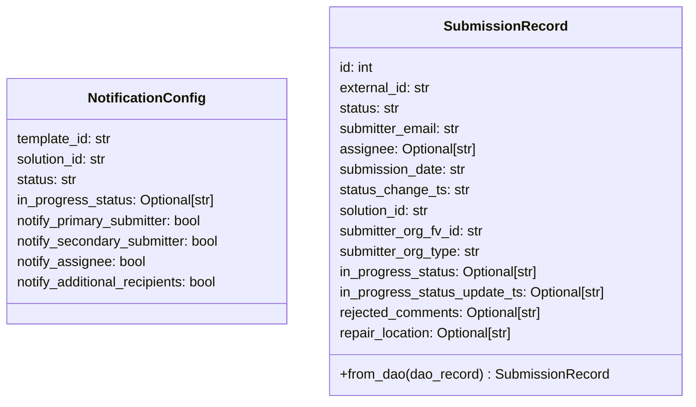

# Diagram: entity_core/entity_service/entity_service/damageview/notification_handler/models/records.py


> Auto-generated by Obscura crawlers

## Diagram 1



### SVG

<svg id="container" width="810.1484375" xmlns="http://www.w3.org/2000/svg" class="classDiagram" height="472" viewBox="0 0 810.1484375 472" role="graphics-document document" aria-roledescription="class"><style>#container{font-family:"trebuchet ms",verdana,arial,sans-serif;font-size:16px;fill:#333;}@keyframes edge-animation-frame{from{stroke-dashoffset:0;}}@keyframes dash{to{stroke-dashoffset:0;}}#container .edge-animation-slow{stroke-dasharray:9,5!important;stroke-dashoffset:900;animation:dash 50s linear infinite;stroke-linecap:round;}#container .edge-animation-fast{stroke-dasharray:9,5!important;stroke-dashoffset:900;animation:dash 20s linear infinite;stroke-linecap:round;}#container .error-icon{fill:#552222;}#container .error-text{fill:#552222;stroke:#552222;}#container .edge-thickness-normal{stroke-width:1px;}#container .edge-thickness-thick{stroke-width:3.5px;}#container .edge-pattern-solid{stroke-dasharray:0;}#container .edge-thickness-invisible{stroke-width:0;fill:none;}#container .edge-pattern-dashed{stroke-dasharray:3;}#container .edge-pattern-dotted{stroke-dasharray:2;}#container .marker{fill:#333333;stroke:#333333;}#container .marker.cross{stroke:#333333;}#container svg{font-family:"trebuchet ms",verdana,arial,sans-serif;font-size:16px;}#container p{margin:0;}#container g.classGroup text{fill:#9370DB;stroke:none;font-family:"trebuchet ms",verdana,arial,sans-serif;font-size:10px;}#container g.classGroup text .title{font-weight:bolder;}#container .nodeLabel,#container .edgeLabel{color:#131300;}#container .edgeLabel .label rect{fill:#ECECFF;}#container .label text{fill:#131300;}#container .labelBkg{background:#ECECFF;}#container .edgeLabel .label span{background:#ECECFF;}#container .classTitle{font-weight:bolder;}#container .node rect,#container .node circle,#container .node ellipse,#container .node polygon,#container .node path{fill:#ECECFF;stroke:#9370DB;stroke-width:1px;}#container .divider{stroke:#9370DB;stroke-width:1;}#container g.clickable{cursor:pointer;}#container g.classGroup rect{fill:#ECECFF;stroke:#9370DB;}#container g.classGroup line{stroke:#9370DB;stroke-width:1;}#container .classLabel .box{stroke:none;stroke-width:0;fill:#ECECFF;opacity:0.5;}#container .classLabel .label{fill:#9370DB;font-size:10px;}#container .relation{stroke:#333333;stroke-width:1;fill:none;}#container .dashed-line{stroke-dasharray:3;}#container .dotted-line{stroke-dasharray:1 2;}#container #compositionStart,#container .composition{fill:#333333!important;stroke:#333333!important;stroke-width:1;}#container #compositionEnd,#container .composition{fill:#333333!important;stroke:#333333!important;stroke-width:1;}#container #dependencyStart,#container .dependency{fill:#333333!important;stroke:#333333!important;stroke-width:1;}#container #dependencyStart,#container .dependency{fill:#333333!important;stroke:#333333!important;stroke-width:1;}#container #extensionStart,#container .extension{fill:transparent!important;stroke:#333333!important;stroke-width:1;}#container #extensionEnd,#container .extension{fill:transparent!important;stroke:#333333!important;stroke-width:1;}#container #aggregationStart,#container .aggregation{fill:transparent!important;stroke:#333333!important;stroke-width:1;}#container #aggregationEnd,#container .aggregation{fill:transparent!important;stroke:#333333!important;stroke-width:1;}#container #lollipopStart,#container .lollipop{fill:#ECECFF!important;stroke:#333333!important;stroke-width:1;}#container #lollipopEnd,#container .lollipop{fill:#ECECFF!important;stroke:#333333!important;stroke-width:1;}#container .edgeTerminals{font-size:11px;line-height:initial;}#container .classTitleText{text-anchor:middle;font-size:18px;fill:#333;}#container .label-icon{display:inline-block;height:1em;overflow:visible;vertical-align:-0.125em;}#container .node .label-icon path{fill:currentColor;stroke:revert;stroke-width:revert;}#container :root{--mermaid-font-family:"trebuchet ms",verdana,arial,sans-serif;}</style><g><defs><marker id="container_class-aggregationStart" class="marker aggregation class" refX="18" refY="7" markerWidth="190" markerHeight="240" orient="auto"><path d="M 18,7 L9,13 L1,7 L9,1 Z"></path></marker></defs><defs><marker id="container_class-aggregationEnd" class="marker aggregation class" refX="1" refY="7" markerWidth="20" markerHeight="28" orient="auto"><path d="M 18,7 L9,13 L1,7 L9,1 Z"></path></marker></defs><defs><marker id="container_class-extensionStart" class="marker extension class" refX="18" refY="7" markerWidth="190" markerHeight="240" orient="auto"><path d="M 1,7 L18,13 V 1 Z"></path></marker></defs><defs><marker id="container_class-extensionEnd" class="marker extension class" refX="1" refY="7" markerWidth="20" markerHeight="28" orient="auto"><path d="M 1,1 V 13 L18,7 Z"></path></marker></defs><defs><marker id="container_class-compositionStart" class="marker composition class" refX="18" refY="7" markerWidth="190" markerHeight="240" orient="auto"><path d="M 18,7 L9,13 L1,7 L9,1 Z"></path></marker></defs><defs><marker id="container_class-compositionEnd" class="marker composition class" refX="1" refY="7" markerWidth="20" markerHeight="28" orient="auto"><path d="M 18,7 L9,13 L1,7 L9,1 Z"></path></marker></defs><defs><marker id="container_class-dependencyStart" class="marker dependency class" refX="6" refY="7" markerWidth="190" markerHeight="240" orient="auto"><path d="M 5,7 L9,13 L1,7 L9,1 Z"></path></marker></defs><defs><marker id="container_class-dependencyEnd" class="marker dependency class" refX="13" refY="7" markerWidth="20" markerHeight="28" orient="auto"><path d="M 18,7 L9,13 L14,7 L9,1 Z"></path></marker></defs><defs><marker id="container_class-lollipopStart" class="marker lollipop class" refX="13" refY="7" markerWidth="190" markerHeight="240" orient="auto"><circle stroke="black" fill="transparent" cx="7" cy="7" r="6"></circle></marker></defs><defs><marker id="container_class-lollipopEnd" class="marker lollipop class" refX="1" refY="7" markerWidth="190" markerHeight="240" orient="auto"><circle stroke="black" fill="transparent" cx="7" cy="7" r="6"></circle></marker></defs><g class="root"><g class="clusters"></g><g class="edgePaths"></g><g class="edgeLabels"></g><g class="nodes"><g class="node default" id="classId-NotificationConfig-0" transform="translate(175.6953125, 236)"><g class="basic label-container"><path d="M-167.6953125 -144 L167.6953125 -144 L167.6953125 144 L-167.6953125 144" stroke="none" stroke-width="0" fill="#ECECFF" style=""></path><path d="M-167.6953125 -144 C-61.14089221248797 -144, 45.41352807502406 -144, 167.6953125 -144 M-167.6953125 -144 C-58.73481640700372 -144, 50.22567968599256 -144, 167.6953125 -144 M167.6953125 -144 C167.6953125 -41.71582865244133, 167.6953125 60.56834269511734, 167.6953125 144 M167.6953125 -144 C167.6953125 -80.84004832592413, 167.6953125 -17.68009665184826, 167.6953125 144 M167.6953125 144 C51.907110058722935 144, -63.88109238255413 144, -167.6953125 144 M167.6953125 144 C54.91156527075073 144, -57.872181958498544 144, -167.6953125 144 M-167.6953125 144 C-167.6953125 32.09749013226809, -167.6953125 -79.80501973546382, -167.6953125 -144 M-167.6953125 144 C-167.6953125 64.78978631145957, -167.6953125 -14.42042737708087, -167.6953125 -144" stroke="#9370DB" stroke-width="1.3" fill="none" stroke-dasharray="0 0" style=""></path></g><g class="annotation-group text" transform="translate(0, -120)"></g><g class="label-group text" transform="translate(-65.8125, -120)"><g class="label" style="font-weight: bolder" transform="translate(0,-12)"><foreignObject width="131.625" height="24"><div xmlns="http://www.w3.org/1999/xhtml" style="display: table-cell; white-space: nowrap; line-height: 1.5; max-width: 181px; text-align: center;"><span class="nodeLabel markdown-node-label" style=""><p>NotificationConfig</p></span></div></foreignObject></g></g><g class="members-group text" transform="translate(-155.6953125, -72)"><g class="label" style="" transform="translate(0,-12)"><foreignObject width="114.625" height="24"><div xmlns="http://www.w3.org/1999/xhtml" style="display: table-cell; white-space: nowrap; line-height: 1.5; max-width: 165px; text-align: center;"><span class="nodeLabel markdown-node-label" style=""><p>template_id: str</p></span></div></foreignObject></g><g class="label" style="" transform="translate(0,12)"><foreignObject width="109.734375" height="24"><div xmlns="http://www.w3.org/1999/xhtml" style="display: table-cell; white-space: nowrap; line-height: 1.5; max-width: 161px; text-align: center;"><span class="nodeLabel markdown-node-label" style=""><p>solution_id: str</p></span></div></foreignObject></g><g class="label" style="" transform="translate(0,36)"><foreignObject width="71.90625" height="24"><div xmlns="http://www.w3.org/1999/xhtml" style="display: table-cell; white-space: nowrap; line-height: 1.5; max-width: 123px; text-align: center;"><span class="nodeLabel markdown-node-label" style=""><p>status: str</p></span></div></foreignObject></g><g class="label" style="" transform="translate(0,60)"><foreignObject width="237.296875" height="24"><div xmlns="http://www.w3.org/1999/xhtml" style="display: table-cell; white-space: nowrap; line-height: 1.5; max-width: 287px; text-align: center;"><span class="nodeLabel markdown-node-label" style=""><p>in_progress_status: Optional[str]</p></span></div></foreignObject></g><g class="label" style="" transform="translate(0,84)"><foreignObject width="226.421875" height="24"><div xmlns="http://www.w3.org/1999/xhtml" style="display: table-cell; white-space: nowrap; line-height: 1.5; max-width: 277px; text-align: center;"><span class="nodeLabel markdown-node-label" style=""><p>notify_primary_submitter: bool</p></span></div></foreignObject></g><g class="label" style="" transform="translate(0,108)"><foreignObject width="244.328125" height="24"><div xmlns="http://www.w3.org/1999/xhtml" style="display: table-cell; white-space: nowrap; line-height: 1.5; max-width: 295px; text-align: center;"><span class="nodeLabel markdown-node-label" style=""><p>notify_secondary_submitter: bool</p></span></div></foreignObject></g><g class="label" style="" transform="translate(0,132)"><foreignObject width="153.703125" height="24"><div xmlns="http://www.w3.org/1999/xhtml" style="display: table-cell; white-space: nowrap; line-height: 1.5; max-width: 204px; text-align: center;"><span class="nodeLabel markdown-node-label" style=""><p>notify_assignee: bool</p></span></div></foreignObject></g><g class="label" style="" transform="translate(0,156)"><foreignObject width="245.578125" height="24"><div xmlns="http://www.w3.org/1999/xhtml" style="display: table-cell; white-space: nowrap; line-height: 1.5; max-width: 296px; text-align: center;"><span class="nodeLabel markdown-node-label" style=""><p>notify_additional_recipients: bool</p></span></div></foreignObject></g></g><g class="methods-group text" transform="translate(-155.6953125, 144)"></g><g class="divider" style=""><path d="M-167.6953125 -96 C-83.61578558775129 -96, 0.4637413244974198 -96, 167.6953125 -96 M-167.6953125 -96 C-35.55335866727668 -96, 96.58859516544663 -96, 167.6953125 -96" stroke="#9370DB" stroke-width="1.3" fill="none" stroke-dasharray="0 0" style=""></path></g><g class="divider" style=""><path d="M-167.6953125 120 C-85.83018777426304 120, -3.9650630485260763 120, 167.6953125 120 M-167.6953125 120 C-69.39712551192247 120, 28.901061476155064 120, 167.6953125 120" stroke="#9370DB" stroke-width="1.3" fill="none" stroke-dasharray="0 0" style=""></path></g></g><g class="node default" id="classId-SubmissionRecord-1" transform="translate(597.76953125, 236)"><g class="basic label-container"><path d="M-204.37890625 -228 L204.37890625 -228 L204.37890625 228 L-204.37890625 228" stroke="none" stroke-width="0" fill="#ECECFF" style=""></path><path d="M-204.37890625 -228 C-51.93775959193195 -228, 100.5033870661361 -228, 204.37890625 -228 M-204.37890625 -228 C-62.57117092811757 -228, 79.23656439376487 -228, 204.37890625 -228 M204.37890625 -228 C204.37890625 -87.86483624407421, 204.37890625 52.270327511851576, 204.37890625 228 M204.37890625 -228 C204.37890625 -74.65691256557855, 204.37890625 78.6861748688429, 204.37890625 228 M204.37890625 228 C60.33908739964323 228, -83.70073145071353 228, -204.37890625 228 M204.37890625 228 C113.24172842191061 228, 22.104550593821216 228, -204.37890625 228 M-204.37890625 228 C-204.37890625 97.41248694697384, -204.37890625 -33.175026106052314, -204.37890625 -228 M-204.37890625 228 C-204.37890625 99.00417411139495, -204.37890625 -29.99165177721011, -204.37890625 -228" stroke="#9370DB" stroke-width="1.3" fill="none" stroke-dasharray="0 0" style=""></path></g><g class="annotation-group text" transform="translate(0, -204)"></g><g class="label-group text" transform="translate(-67.5078125, -204)"><g class="label" style="font-weight: bolder" transform="translate(0,-12)"><foreignObject width="135.015625" height="24"><div xmlns="http://www.w3.org/1999/xhtml" style="display: table-cell; white-space: nowrap; line-height: 1.5; max-width: 184px; text-align: center;"><span class="nodeLabel markdown-node-label" style=""><p>SubmissionRecord</p></span></div></foreignObject></g></g><g class="members-group text" transform="translate(-192.37890625, -156)"><g class="label" style="" transform="translate(0,-12)"><foreignObject width="41.828125" height="24"><div xmlns="http://www.w3.org/1999/xhtml" style="display: table-cell; white-space: nowrap; line-height: 1.5; max-width: 92px; text-align: center;"><span class="nodeLabel markdown-node-label" style=""><p>id: int</p></span></div></foreignObject></g><g class="label" style="" transform="translate(0,12)"><foreignObject width="109.28125" height="24"><div xmlns="http://www.w3.org/1999/xhtml" style="display: table-cell; white-space: nowrap; line-height: 1.5; max-width: 160px; text-align: center;"><span class="nodeLabel markdown-node-label" style=""><p>external_id: str</p></span></div></foreignObject></g><g class="label" style="" transform="translate(0,36)"><foreignObject width="71.90625" height="24"><div xmlns="http://www.w3.org/1999/xhtml" style="display: table-cell; white-space: nowrap; line-height: 1.5; max-width: 123px; text-align: center;"><span class="nodeLabel markdown-node-label" style=""><p>status: str</p></span></div></foreignObject></g><g class="label" style="" transform="translate(0,60)"><foreignObject width="145.453125" height="24"><div xmlns="http://www.w3.org/1999/xhtml" style="display: table-cell; white-space: nowrap; line-height: 1.5; max-width: 196px; text-align: center;"><span class="nodeLabel markdown-node-label" style=""><p>submitter_email: str</p></span></div></foreignObject></g><g class="label" style="" transform="translate(0,84)"><foreignObject width="163.609375" height="24"><div xmlns="http://www.w3.org/1999/xhtml" style="display: table-cell; white-space: nowrap; line-height: 1.5; max-width: 214px; text-align: center;"><span class="nodeLabel markdown-node-label" style=""><p>assignee: Optional[str]</p></span></div></foreignObject></g><g class="label" style="" transform="translate(0,108)"><foreignObject width="150.5625" height="24"><div xmlns="http://www.w3.org/1999/xhtml" style="display: table-cell; white-space: nowrap; line-height: 1.5; max-width: 201px; text-align: center;"><span class="nodeLabel markdown-node-label" style=""><p>submission_date: str</p></span></div></foreignObject></g><g class="label" style="" transform="translate(0,132)"><foreignObject width="152.40625" height="24"><div xmlns="http://www.w3.org/1999/xhtml" style="display: table-cell; white-space: nowrap; line-height: 1.5; max-width: 203px; text-align: center;"><span class="nodeLabel markdown-node-label" style=""><p>status_change_ts: str</p></span></div></foreignObject></g><g class="label" style="" transform="translate(0,156)"><foreignObject width="109.734375" height="24"><div xmlns="http://www.w3.org/1999/xhtml" style="display: table-cell; white-space: nowrap; line-height: 1.5; max-width: 161px; text-align: center;"><span class="nodeLabel markdown-node-label" style=""><p>solution_id: str</p></span></div></foreignObject></g><g class="label" style="" transform="translate(0,180)"><foreignObject width="171.765625" height="24"><div xmlns="http://www.w3.org/1999/xhtml" style="display: table-cell; white-space: nowrap; line-height: 1.5; max-width: 223px; text-align: center;"><span class="nodeLabel markdown-node-label" style=""><p>submitter_org_fv_id: str</p></span></div></foreignObject></g><g class="label" style="" transform="translate(0,204)"><foreignObject width="168.40625" height="24"><div xmlns="http://www.w3.org/1999/xhtml" style="display: table-cell; white-space: nowrap; line-height: 1.5; max-width: 219px; text-align: center;"><span class="nodeLabel markdown-node-label" style=""><p>submitter_org_type: str</p></span></div></foreignObject></g><g class="label" style="" transform="translate(0,228)"><foreignObject width="237.296875" height="24"><div xmlns="http://www.w3.org/1999/xhtml" style="display: table-cell; white-space: nowrap; line-height: 1.5; max-width: 287px; text-align: center;"><span class="nodeLabel markdown-node-label" style=""><p>in_progress_status: Optional[str]</p></span></div></foreignObject></g><g class="label" style="" transform="translate(0,252)"><foreignObject width="317.25" height="24"><div xmlns="http://www.w3.org/1999/xhtml" style="display: table-cell; white-space: nowrap; line-height: 1.5; max-width: 367px; text-align: center;"><span class="nodeLabel markdown-node-label" style=""><p>in_progress_status_update_ts: Optional[str]</p></span></div></foreignObject></g><g class="label" style="" transform="translate(0,276)"><foreignObject width="243.15625" height="24"><div xmlns="http://www.w3.org/1999/xhtml" style="display: table-cell; white-space: nowrap; line-height: 1.5; max-width: 293px; text-align: center;"><span class="nodeLabel markdown-node-label" style=""><p>rejected_comments: Optional[str]</p></span></div></foreignObject></g><g class="label" style="" transform="translate(0,300)"><foreignObject width="209.8125" height="24"><div xmlns="http://www.w3.org/1999/xhtml" style="display: table-cell; white-space: nowrap; line-height: 1.5; max-width: 260px; text-align: center;"><span class="nodeLabel markdown-node-label" style=""><p>repair_location: Optional[str]</p></span></div></foreignObject></g></g><g class="methods-group text" transform="translate(-192.37890625, 204)"><g class="label" style="" transform="translate(0,-12)"><foreignObject width="316.015625" height="24"><div xmlns="http://www.w3.org/1999/xhtml" style="display: table-cell; white-space: nowrap; line-height: 1.5; max-width: 373px; text-align: center;"><span class="nodeLabel markdown-node-label" style=""><p>+from_dao(dao_record) : SubmissionRecord</p></span></div></foreignObject></g></g><g class="divider" style=""><path d="M-204.37890625 -180 C-67.05585792901309 -180, 70.26719039197383 -180, 204.37890625 -180 M-204.37890625 -180 C-76.38289978535079 -180, 51.613106679298426 -180, 204.37890625 -180" stroke="#9370DB" stroke-width="1.3" fill="none" stroke-dasharray="0 0" style=""></path></g><g class="divider" style=""><path d="M-204.37890625 180 C-100.62163670824916 180, 3.1356328335016883 180, 204.37890625 180 M-204.37890625 180 C-118.48291980495775 180, -32.58693335991549 180, 204.37890625 180" stroke="#9370DB" stroke-width="1.3" fill="none" stroke-dasharray="0 0" style=""></path></g></g></g></g></g></svg>

## Diagram 2

```mermaid
flowchart TD
    Start([Start]) --> Check{dao_record provided?}
    Check -- No --> RaiseError[/raise ValueError("No database record provided")/]
    Check -- Yes --> Create[Create SubmissionRecord with mapped fields:
id, external_id, status, submitter_email, assignee,
submission_date, status_change_ts, solution_id,
submitter_org_fv_id, submitter_org_type,
in_progress_status, in_progress_status_update_ts,
rejected_comments, repair_location]
    Create --> Return([Return SubmissionRecord])
    RaiseError --> End([End])
    Return --> End
```

> SVG rendering failed for this diagram.
