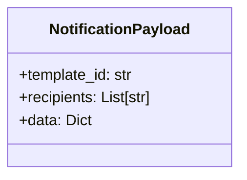

# Diagram: entity_core/entity_service/entity_service/damageview/notification_handler/models/response.py

> Auto-generated by Obscura crawlers

## Mermaid

### SVG

<svg id="container" width="255.2578125" xmlns="http://www.w3.org/2000/svg" class="classDiagram" height="184" viewBox="0 0 255.2578125 184" role="graphics-document document" aria-roledescription="class"><g><defs><marker id="container_class-aggregationStart" class="marker aggregation class" refX="18" refY="7" markerWidth="190" markerHeight="240" orient="auto"><path d="M 18,7 L9,13 L1,7 L9,1 Z"></path></marker></defs><defs><marker id="container_class-aggregationEnd" class="marker aggregation class" refX="1" refY="7" markerWidth="20" markerHeight="28" orient="auto"><path d="M 18,7 L9,13 L1,7 L9,1 Z"></path></marker></defs><defs><marker id="container_class-extensionStart" class="marker extension class" refX="18" refY="7" markerWidth="190" markerHeight="240" orient="auto"><path d="M 1,7 L18,13 V 1 Z"></path></marker></defs><defs><marker id="container_class-extensionEnd" class="marker extension class" refX="1" refY="7" markerWidth="20" markerHeight="28" orient="auto"><path d="M 1,1 V 13 L18,7 Z"></path></marker></defs><defs><marker id="container_class-compositionStart" class="marker composition class" refX="18" refY="7" markerWidth="190" markerHeight="240" orient="auto"><path d="M 18,7 L9,13 L1,7 L9,1 Z"></path></marker></defs><defs><marker id="container_class-compositionEnd" class="marker composition class" refX="1" refY="7" markerWidth="20" markerHeight="28" orient="auto"><path d="M 18,7 L9,13 L1,7 L9,1 Z"></path></marker></defs><defs><marker id="container_class-dependencyStart" class="marker dependency class" refX="6" refY="7" markerWidth="190" markerHeight="240" orient="auto"><path d="M 5,7 L9,13 L1,7 L9,1 Z"></path></marker></defs><defs><marker id="container_class-dependencyEnd" class="marker dependency class" refX="13" refY="7" markerWidth="20" markerHeight="28" orient="auto"><path d="M 18,7 L9,13 L14,7 L9,1 Z"></path></marker></defs><defs><marker id="container_class-lollipopStart" class="marker lollipop class" refX="13" refY="7" markerWidth="190" markerHeight="240" orient="auto"><circle stroke="black" fill="transparent" cx="7" cy="7" r="6"></circle></marker></defs><defs><marker id="container_class-lollipopEnd" class="marker lollipop class" refX="1" refY="7" markerWidth="190" markerHeight="240" orient="auto"><circle stroke="black" fill="transparent" cx="7" cy="7" r="6"></circle></marker></defs><g class="root"><g class="clusters"></g><g class="edgePaths"></g><g class="edgeLabels"></g><g class="nodes"><g class="node default" id="classId-NotificationPayload-0" transform="translate(127.62890625, 92)"><g class="basic label-container"><path d="M-119.62890625 -84 L119.62890625 -84 L119.62890625 84 L-119.62890625 84" stroke="none" stroke-width="0" fill="#ECECFF" style=""></path><path d="M-119.62890625 -84 C-49.07963414312036 -84, 21.469637963759283 -84, 119.62890625 -84 M-119.62890625 -84 C-54.43273990395714 -84, 10.763426442085716 -84, 119.62890625 -84 M119.62890625 -84 C119.62890625 -36.86486948355235, 119.62890625 10.270261032895306, 119.62890625 84 M119.62890625 -84 C119.62890625 -17.698589242782163, 119.62890625 48.602821514435675, 119.62890625 84 M119.62890625 84 C41.30768501370973 84, -37.01353622258054 84, -119.62890625 84 M119.62890625 84 C65.50322396434515 84, 11.377541678690307 84, -119.62890625 84 M-119.62890625 84 C-119.62890625 38.65163930624665, -119.62890625 -6.696721387506699, -119.62890625 -84 M-119.62890625 84 C-119.62890625 25.676526052855692, -119.62890625 -32.646947894288616, -119.62890625 -84" stroke="#9370DB" stroke-width="1.3" fill="none" stroke-dasharray="0 0" style=""></path></g><g class="annotation-group text" transform="translate(0, -60)"></g><g class="label-group text" transform="translate(-71.7890625, -60)"><g class="label" style="font-weight: bolder" transform="translate(0,-12)"><foreignObject width="143.578125" height="24">

NotificationPayload

</foreignObject></g></g><g class="members-group text" transform="translate(-107.62890625, -12)"><g class="label" style="" transform="translate(0,-12)"><foreignObject width="122.53125" height="24">

+template_id: str

</foreignObject></g><g class="label" style="" transform="translate(0,12)"><foreignObject width="143.46875" height="24">

+recipients: List[str]

</foreignObject></g><g class="label" style="" transform="translate(0,36)"><foreignObject width="76.953125" height="24">

+data: Dict

</foreignObject></g></g><g class="methods-group text" transform="translate(-107.62890625, 84)"></g><g class="divider" style=""><path d="M-119.62890625 -36 C-38.687999216015825 -36, 42.25290781796835 -36, 119.62890625 -36 M-119.62890625 -36 C-65.96261043437272 -36, -12.296314618745441 -36, 119.62890625 -36" stroke="#9370DB" stroke-width="1.3" fill="none" stroke-dasharray="0 0" style=""></path></g><g class="divider" style=""><path d="M-119.62890625 60 C-30.75782951878992 60, 58.11324721242016 60, 119.62890625 60 M-119.62890625 60 C-62.17301983228488 60, -4.7171334145697585 60, 119.62890625 60" stroke="#9370DB" stroke-width="1.3" fill="none" stroke-dasharray="0 0" style=""></path></g></g></g></g></g></svg>
