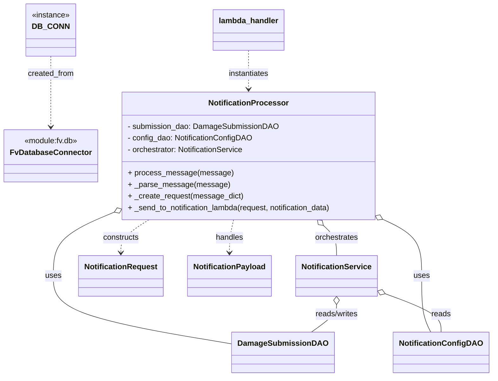

# Diagram: entity_core/entity_service/entity_service/damageview/notification_handler/notification_handler.py


> Auto-generated by Obscura crawlers

## Diagram 1



### SVG

<svg id="container" width="996.85546875" xmlns="http://www.w3.org/2000/svg" class="classDiagram" height="778" viewBox="0 0 996.85546875 778" role="graphics-document document" aria-roledescription="class"><style>#container{font-family:"trebuchet ms",verdana,arial,sans-serif;font-size:16px;fill:#333;}@keyframes edge-animation-frame{from{stroke-dashoffset:0;}}@keyframes dash{to{stroke-dashoffset:0;}}#container .edge-animation-slow{stroke-dasharray:9,5!important;stroke-dashoffset:900;animation:dash 50s linear infinite;stroke-linecap:round;}#container .edge-animation-fast{stroke-dasharray:9,5!important;stroke-dashoffset:900;animation:dash 20s linear infinite;stroke-linecap:round;}#container .error-icon{fill:#552222;}#container .error-text{fill:#552222;stroke:#552222;}#container .edge-thickness-normal{stroke-width:1px;}#container .edge-thickness-thick{stroke-width:3.5px;}#container .edge-pattern-solid{stroke-dasharray:0;}#container .edge-thickness-invisible{stroke-width:0;fill:none;}#container .edge-pattern-dashed{stroke-dasharray:3;}#container .edge-pattern-dotted{stroke-dasharray:2;}#container .marker{fill:#333333;stroke:#333333;}#container .marker.cross{stroke:#333333;}#container svg{font-family:"trebuchet ms",verdana,arial,sans-serif;font-size:16px;}#container p{margin:0;}#container g.classGroup text{fill:#9370DB;stroke:none;font-family:"trebuchet ms",verdana,arial,sans-serif;font-size:10px;}#container g.classGroup text .title{font-weight:bolder;}#container .nodeLabel,#container .edgeLabel{color:#131300;}#container .edgeLabel .label rect{fill:#ECECFF;}#container .label text{fill:#131300;}#container .labelBkg{background:#ECECFF;}#container .edgeLabel .label span{background:#ECECFF;}#container .classTitle{font-weight:bolder;}#container .node rect,#container .node circle,#container .node ellipse,#container .node polygon,#container .node path{fill:#ECECFF;stroke:#9370DB;stroke-width:1px;}#container .divider{stroke:#9370DB;stroke-width:1;}#container g.clickable{cursor:pointer;}#container g.classGroup rect{fill:#ECECFF;stroke:#9370DB;}#container g.classGroup line{stroke:#9370DB;stroke-width:1;}#container .classLabel .box{stroke:none;stroke-width:0;fill:#ECECFF;opacity:0.5;}#container .classLabel .label{fill:#9370DB;font-size:10px;}#container .relation{stroke:#333333;stroke-width:1;fill:none;}#container .dashed-line{stroke-dasharray:3;}#container .dotted-line{stroke-dasharray:1 2;}#container #compositionStart,#container .composition{fill:#333333!important;stroke:#333333!important;stroke-width:1;}#container #compositionEnd,#container .composition{fill:#333333!important;stroke:#333333!important;stroke-width:1;}#container #dependencyStart,#container .dependency{fill:#333333!important;stroke:#333333!important;stroke-width:1;}#container #dependencyStart,#container .dependency{fill:#333333!important;stroke:#333333!important;stroke-width:1;}#container #extensionStart,#container .extension{fill:transparent!important;stroke:#333333!important;stroke-width:1;}#container #extensionEnd,#container .extension{fill:transparent!important;stroke:#333333!important;stroke-width:1;}#container #aggregationStart,#container .aggregation{fill:transparent!important;stroke:#333333!important;stroke-width:1;}#container #aggregationEnd,#container .aggregation{fill:transparent!important;stroke:#333333!important;stroke-width:1;}#container #lollipopStart,#container .lollipop{fill:#ECECFF!important;stroke:#333333!important;stroke-width:1;}#container #lollipopEnd,#container .lollipop{fill:#ECECFF!important;stroke:#333333!important;stroke-width:1;}#container .edgeTerminals{font-size:11px;line-height:initial;}#container .classTitleText{text-anchor:middle;font-size:18px;fill:#333;}#container .label-icon{display:inline-block;height:1em;overflow:visible;vertical-align:-0.125em;}#container .node .label-icon path{fill:currentColor;stroke:revert;stroke-width:revert;}#container :root{--mermaid-font-family:"trebuchet ms",verdana,arial,sans-serif;}</style><g><defs><marker id="container_class-aggregationStart" class="marker aggregation class" refX="18" refY="7" markerWidth="190" markerHeight="240" orient="auto"><path d="M 18,7 L9,13 L1,7 L9,1 Z"></path></marker></defs><defs><marker id="container_class-aggregationEnd" class="marker aggregation class" refX="1" refY="7" markerWidth="20" markerHeight="28" orient="auto"><path d="M 18,7 L9,13 L1,7 L9,1 Z"></path></marker></defs><defs><marker id="container_class-extensionStart" class="marker extension class" refX="18" refY="7" markerWidth="190" markerHeight="240" orient="auto"><path d="M 1,7 L18,13 V 1 Z"></path></marker></defs><defs><marker id="container_class-extensionEnd" class="marker extension class" refX="1" refY="7" markerWidth="20" markerHeight="28" orient="auto"><path d="M 1,1 V 13 L18,7 Z"></path></marker></defs><defs><marker id="container_class-compositionStart" class="marker composition class" refX="18" refY="7" markerWidth="190" markerHeight="240" orient="auto"><path d="M 18,7 L9,13 L1,7 L9,1 Z"></path></marker></defs><defs><marker id="container_class-compositionEnd" class="marker composition class" refX="1" refY="7" markerWidth="20" markerHeight="28" orient="auto"><path d="M 18,7 L9,13 L1,7 L9,1 Z"></path></marker></defs><defs><marker id="container_class-dependencyStart" class="marker dependency class" refX="6" refY="7" markerWidth="190" markerHeight="240" orient="auto"><path d="M 5,7 L9,13 L1,7 L9,1 Z"></path></marker></defs><defs><marker id="container_class-dependencyEnd" class="marker dependency class" refX="13" refY="7" markerWidth="20" markerHeight="28" orient="auto"><path d="M 18,7 L9,13 L14,7 L9,1 Z"></path></marker></defs><defs><marker id="container_class-lollipopStart" class="marker lollipop class" refX="13" refY="7" markerWidth="190" markerHeight="240" orient="auto"><circle stroke="black" fill="transparent" cx="7" cy="7" r="6"></circle></marker></defs><defs><marker id="container_class-lollipopEnd" class="marker lollipop class" refX="1" refY="7" markerWidth="190" markerHeight="240" orient="auto"><circle stroke="black" fill="transparent" cx="7" cy="7" r="6"></circle></marker></defs><g class="root"><g class="clusters"></g><g class="edgePaths"><path d="M99.305,116L99.305,122.167C99.305,128.333,99.305,140.667,99.305,165C99.305,189.333,99.305,225.667,99.305,243.833L99.305,262" id="id_DB_CONN_FvDatabaseConnector_1" class="edge-thickness-normal edge-pattern-dashed relation" style=";;;" data-edge="true" data-et="edge" data-id="id_DB_CONN_FvDatabaseConnector_1" data-points="W3sieCI6OTkuMzA0Njg3NSwieSI6MTE2fSx7IngiOjk5LjMwNDY4NzUsInkiOjE1M30seyJ4Ijo5OS4zMDQ2ODc1LCJ5IjoyNjh9XQ==" marker-end="url(#container_class-dependencyEnd)"></path><path d="M224.786,444.658L206.99,452.382C189.194,460.105,153.603,475.553,135.807,496.443C118.012,517.333,118.012,543.667,118.012,570C118.012,596.333,118.012,622.667,178.674,646.191C239.336,669.716,360.66,690.433,421.322,700.791L481.984,711.149" id="id_NotificationProcessor_DamageSubmissionDAO_2" class="edge-thickness-normal edge-pattern-solid relation" style=";;;" data-edge="true" data-et="edge" data-id="id_NotificationProcessor_DamageSubmissionDAO_2" data-points="W3sieCI6MjQwLjYwOTM3NSwieSI6NDM3Ljc5MDE0MjY1MzYzODU1fSx7IngiOjExOC4wMTE3MTg3NSwieSI6NDkxfSx7IngiOjExOC4wMTE3MTg3NSwieSI6NTcwfSx7IngiOjExOC4wMTE3MTg3NSwieSI6NjQ5fSx7IngiOjQ4MS45ODQzNzUsInkiOjcxMS4xNDg5NDMzNTU3NjM3fV0=" marker-start="url(#container_class-aggregationStart)"></path><path d="M789.7,458.961L800.706,464.301C811.713,469.641,833.725,480.32,844.732,498.827C855.738,517.333,855.738,543.667,855.738,570C855.738,596.333,855.738,622.667,858.861,642C861.984,661.333,868.23,673.667,871.353,679.833L874.476,686" id="id_NotificationProcessor_NotificationConfigDAO_3" class="edge-thickness-normal edge-pattern-solid relation" style=";;;" data-edge="true" data-et="edge" data-id="id_NotificationProcessor_NotificationConfigDAO_3" data-points="W3sieCI6Nzc0LjE3OTY4NzUsInkiOjQ1MS40MzE2MDcxNTg4NzY4M30seyJ4Ijo4NTUuNzM4MjgxMjUsInkiOjQ5MX0seyJ4Ijo4NTUuNzM4MjgxMjUsInkiOjU3MH0seyJ4Ijo4NTUuNzM4MjgxMjUsInkiOjY0OX0seyJ4Ijo4NzQuNDc2MTE3NDg0MTc3MiwieSI6Njg2fV0=" marker-start="url(#container_class-aggregationStart)"></path><path d="M661.325,465.775L665.826,469.979C670.327,474.183,679.33,482.592,683.831,492.962C688.332,503.333,688.332,515.667,688.332,521.833L688.332,528" id="id_NotificationProcessor_NotificationService_4" class="edge-thickness-normal edge-pattern-solid relation" style=";;;" data-edge="true" data-et="edge" data-id="id_NotificationProcessor_NotificationService_4" data-points="W3sieCI6NjQ4LjcxODQ5NTc0NzA0MTQsInkiOjQ1NH0seyJ4Ijo2ODguMzMyMDMxMjUsInkiOjQ5MX0seyJ4Ijo2ODguMzMyMDMxMjUsInkiOjUyOH1d" marker-start="url(#container_class-aggregationStart)"></path><path d="M688.332,629.25L688.332,632.542C688.332,635.833,688.332,642.417,679.928,651.875C671.524,661.333,654.717,673.667,646.313,679.833L637.909,686" id="id_NotificationService_DamageSubmissionDAO_5" class="edge-thickness-normal edge-pattern-solid relation" style=";;;" data-edge="true" data-et="edge" data-id="id_NotificationService_DamageSubmissionDAO_5" data-points="W3sieCI6Njg4LjMzMjAzMTI1LCJ5Ijo2MTJ9LHsieCI6Njg4LjMzMjAzMTI1LCJ5Ijo2NDl9LHsieCI6NjM3LjkwODkyMDA5NDkzNjcsInkiOjY4Nn1d" marker-start="url(#container_class-aggregationStart)"></path><path d="M785.984,607.194L804.277,614.161C822.571,621.129,859.159,635.065,877.452,648.199C895.746,661.333,895.746,673.667,895.746,679.833L895.746,686" id="id_NotificationService_NotificationConfigDAO_6" class="edge-thickness-normal edge-pattern-solid relation" style=";;;" data-edge="true" data-et="edge" data-id="id_NotificationService_NotificationConfigDAO_6" data-points="W3sieCI6NzY5Ljg2MzI4MTI1LCJ5Ijo2MDEuMDUzNjc0MzM4MDE2NX0seyJ4Ijo4OTUuNzQ2MDkzNzUsInkiOjY0OX0seyJ4Ijo4OTUuNzQ2MDkzNzUsInkiOjY4Nn1d" marker-start="url(#container_class-aggregationStart)"></path><path d="M309.761,454L300.528,460.167C291.295,466.333,272.829,478.667,263.596,490C254.363,501.333,254.363,511.667,254.363,516.833L254.363,522" id="id_NotificationProcessor_NotificationRequest_7" class="edge-thickness-normal edge-pattern-dashed relation" style=";;;" data-edge="true" data-et="edge" data-id="id_NotificationProcessor_NotificationRequest_7" data-points="W3sieCI6MzA5Ljc2MDY1NTUxMDM1NTA0LCJ5Ijo0NTR9LHsieCI6MjU0LjM2MzI4MTI1LCJ5Ijo0OTF9LHsieCI6MjU0LjM2MzI4MTI1LCJ5Ijo1Mjh9XQ==" marker-end="url(#container_class-dependencyEnd)"></path><path d="M480.539,454L479.285,460.167C478.03,466.333,475.521,478.667,474.266,490C473.012,501.333,473.012,511.667,473.012,516.833L473.012,522" id="id_NotificationProcessor_NotificationPayload_8" class="edge-thickness-normal edge-pattern-dashed relation" style=";;;" data-edge="true" data-et="edge" data-id="id_NotificationProcessor_NotificationPayload_8" data-points="W3sieCI6NDgwLjUzOTMxNjc1Mjk1ODYsInkiOjQ1NH0seyJ4Ijo0NzMuMDExNzE4NzUsInkiOjQ5MX0seyJ4Ijo0NzMuMDExNzE4NzUsInkiOjUyOH1d" marker-end="url(#container_class-dependencyEnd)"></path><path d="M507.395,104L507.395,112.167C507.395,120.333,507.395,136.667,507.395,150C507.395,163.333,507.395,173.667,507.395,178.833L507.395,184" id="id_lambda_handler_NotificationProcessor_9" class="edge-thickness-normal edge-pattern-dashed relation" style=";;;" data-edge="true" data-et="edge" data-id="id_lambda_handler_NotificationProcessor_9" data-points="W3sieCI6NTA3LjM5NDUzMTI1LCJ5IjoxMDR9LHsieCI6NTA3LjM5NDUzMTI1LCJ5IjoxNTN9LHsieCI6NTA3LjM5NDUzMTI1LCJ5IjoxOTB9XQ==" marker-end="url(#container_class-dependencyEnd)"></path></g><g class="edgeLabels"><g class="edgeLabel" transform="translate(99.3046875, 153)"><g class="label" data-id="id_DB_CONN_FvDatabaseConnector_1" transform="translate(-48.2734375, -12)"><foreignObject width="96.546875" height="24"><div xmlns="http://www.w3.org/1999/xhtml" class="labelBkg" style="display: table-cell; white-space: nowrap; line-height: 1.5; max-width: 200px; text-align: center;"><span class="edgeLabel"><p>created_from</p></span></div></foreignObject></g></g><g class="edgeLabel" transform="translate(118.01171875, 570)"><g class="label" data-id="id_NotificationProcessor_DamageSubmissionDAO_2" transform="translate(-16.4921875, -12)"><foreignObject width="32.984375" height="24"><div xmlns="http://www.w3.org/1999/xhtml" class="labelBkg" style="display: table-cell; white-space: nowrap; line-height: 1.5; max-width: 200px; text-align: center;"><span class="edgeLabel"><p>uses</p></span></div></foreignObject></g></g><g class="edgeLabel" transform="translate(855.73828125, 570)"><g class="label" data-id="id_NotificationProcessor_NotificationConfigDAO_3" transform="translate(-16.4921875, -12)"><foreignObject width="32.984375" height="24"><div xmlns="http://www.w3.org/1999/xhtml" class="labelBkg" style="display: table-cell; white-space: nowrap; line-height: 1.5; max-width: 200px; text-align: center;"><span class="edgeLabel"><p>uses</p></span></div></foreignObject></g></g><g class="edgeLabel" transform="translate(688.33203125, 491)"><g class="label" data-id="id_NotificationProcessor_NotificationService_4" transform="translate(-45.046875, -12)"><foreignObject width="90.09375" height="24"><div xmlns="http://www.w3.org/1999/xhtml" class="labelBkg" style="display: table-cell; white-space: nowrap; line-height: 1.5; max-width: 200px; text-align: center;"><span class="edgeLabel"><p>orchestrates</p></span></div></foreignObject></g></g><g class="edgeLabel" transform="translate(688.33203125, 649)"><g class="label" data-id="id_NotificationService_DamageSubmissionDAO_5" transform="translate(-45.9453125, -12)"><foreignObject width="91.890625" height="24"><div xmlns="http://www.w3.org/1999/xhtml" class="labelBkg" style="display: table-cell; white-space: nowrap; line-height: 1.5; max-width: 200px; text-align: center;"><span class="edgeLabel"><p>reads/writes</p></span></div></foreignObject></g></g><g class="edgeLabel" transform="translate(895.74609375, 649)"><g class="label" data-id="id_NotificationService_NotificationConfigDAO_6" transform="translate(-20.0078125, -12)"><foreignObject width="40.015625" height="24"><div xmlns="http://www.w3.org/1999/xhtml" class="labelBkg" style="display: table-cell; white-space: nowrap; line-height: 1.5; max-width: 200px; text-align: center;"><span class="edgeLabel"><p>reads</p></span></div></foreignObject></g></g><g class="edgeLabel" transform="translate(254.36328125, 491)"><g class="label" data-id="id_NotificationProcessor_NotificationRequest_7" transform="translate(-37.84375, -12)"><foreignObject width="75.6875" height="24"><div xmlns="http://www.w3.org/1999/xhtml" class="labelBkg" style="display: table-cell; white-space: nowrap; line-height: 1.5; max-width: 200px; text-align: center;"><span class="edgeLabel"><p>constructs</p></span></div></foreignObject></g></g><g class="edgeLabel" transform="translate(473.01171875, 491)"><g class="label" data-id="id_NotificationProcessor_NotificationPayload_8" transform="translate(-28.9140625, -12)"><foreignObject width="57.828125" height="24"><div xmlns="http://www.w3.org/1999/xhtml" class="labelBkg" style="display: table-cell; white-space: nowrap; line-height: 1.5; max-width: 200px; text-align: center;"><span class="edgeLabel"><p>handles</p></span></div></foreignObject></g></g><g class="edgeLabel" transform="translate(507.39453125, 153)"><g class="label" data-id="id_lambda_handler_NotificationProcessor_9" transform="translate(-42.9140625, -12)"><foreignObject width="85.828125" height="24"><div xmlns="http://www.w3.org/1999/xhtml" class="labelBkg" style="display: table-cell; white-space: nowrap; line-height: 1.5; max-width: 200px; text-align: center;"><span class="edgeLabel"><p>instantiates</p></span></div></foreignObject></g></g></g><g class="nodes"><g class="node default" id="classId-FvDatabaseConnector-0" transform="translate(99.3046875, 322)"><g class="basic label-container"><path d="M-91.3046875 -54 L91.3046875 -54 L91.3046875 54 L-91.3046875 54" stroke="none" stroke-width="0" fill="#ECECFF" style=""></path><path d="M-91.3046875 -54 C-42.350343808143684 -54, 6.603999883712632 -54, 91.3046875 -54 M-91.3046875 -54 C-23.30578095524993 -54, 44.69312558950014 -54, 91.3046875 -54 M91.3046875 -54 C91.3046875 -14.686608485110902, 91.3046875 24.626783029778196, 91.3046875 54 M91.3046875 -54 C91.3046875 -12.792616103261821, 91.3046875 28.414767793476358, 91.3046875 54 M91.3046875 54 C33.07828497412684 54, -25.148117551746324 54, -91.3046875 54 M91.3046875 54 C54.115105031688536 54, 16.925522563377072 54, -91.3046875 54 M-91.3046875 54 C-91.3046875 17.529551681750554, -91.3046875 -18.94089663649889, -91.3046875 -54 M-91.3046875 54 C-91.3046875 30.945471238380712, -91.3046875 7.890942476761424, -91.3046875 -54" stroke="#9370DB" stroke-width="1.3" fill="none" stroke-dasharray="0 0" style=""></path></g><g class="annotation-group text" transform="translate(-56.2265625, -30)"><g class="label" style="" transform="translate(0,-12)"><foreignObject width="112.453125" height="24"><div xmlns="http://www.w3.org/1999/xhtml" style="display: table-cell; white-space: nowrap; line-height: 1.5; max-width: 162px; text-align: center;"><span class="nodeLabel markdown-node-label" style=""><p>«module:fv.db»</p></span></div></foreignObject></g></g><g class="label-group text" transform="translate(-79.3046875, -6)"><g class="label" style="font-weight: bolder" transform="translate(0,-12)"><foreignObject width="158.609375" height="24"><div xmlns="http://www.w3.org/1999/xhtml" style="display: table-cell; white-space: nowrap; line-height: 1.5; max-width: 207px; text-align: center;"><span class="nodeLabel markdown-node-label" style=""><p>FvDatabaseConnector</p></span></div></foreignObject></g></g><g class="members-group text" transform="translate(-79.3046875, 42)"></g><g class="methods-group text" transform="translate(-79.3046875, 72)"></g><g class="divider" style=""><path d="M-91.3046875 18 C-37.53672345926043 18, 16.231240581479142 18, 91.3046875 18 M-91.3046875 18 C-34.24664501813261 18, 22.811397463734778 18, 91.3046875 18" stroke="#9370DB" stroke-width="1.3" fill="none" stroke-dasharray="0 0" style=""></path></g><g class="divider" style=""><path d="M-91.3046875 36 C-27.136207950957797 36, 37.03227159808441 36, 91.3046875 36 M-91.3046875 36 C-23.093892337879936 36, 45.11690282424013 36, 91.3046875 36" stroke="#9370DB" stroke-width="1.3" fill="none" stroke-dasharray="0 0" style=""></path></g></g><g class="node default" id="classId-DamageSubmissionDAO-1" transform="translate(580.671875, 728)"><g class="basic label-container"><path d="M-98.6875 -42 L98.6875 -42 L98.6875 42 L-98.6875 42" stroke="none" stroke-width="0" fill="#ECECFF" style=""></path><path d="M-98.6875 -42 C-42.67545195788718 -42, 13.336596084225647 -42, 98.6875 -42 M-98.6875 -42 C-38.58962208249271 -42, 21.50825583501458 -42, 98.6875 -42 M98.6875 -42 C98.6875 -11.063439774991352, 98.6875 19.873120450017296, 98.6875 42 M98.6875 -42 C98.6875 -25.171778221631275, 98.6875 -8.34355644326255, 98.6875 42 M98.6875 42 C26.735929509566063 42, -45.215640980867875 42, -98.6875 42 M98.6875 42 C46.828250934055106 42, -5.030998131889788 42, -98.6875 42 M-98.6875 42 C-98.6875 23.492192431942495, -98.6875 4.984384863884991, -98.6875 -42 M-98.6875 42 C-98.6875 15.497580310523645, -98.6875 -11.00483937895271, -98.6875 -42" stroke="#9370DB" stroke-width="1.3" fill="none" stroke-dasharray="0 0" style=""></path></g><g class="annotation-group text" transform="translate(0, -18)"></g><g class="label-group text" transform="translate(-86.6875, -18)"><g class="label" style="font-weight: bolder" transform="translate(0,-12)"><foreignObject width="173.375" height="24"><div xmlns="http://www.w3.org/1999/xhtml" style="display: table-cell; white-space: nowrap; line-height: 1.5; max-width: 222px; text-align: center;"><span class="nodeLabel markdown-node-label" style=""><p>DamageSubmissionDAO</p></span></div></foreignObject></g></g><g class="members-group text" transform="translate(-86.6875, 30)"></g><g class="methods-group text" transform="translate(-86.6875, 60)"></g><g class="divider" style=""><path d="M-98.6875 6 C-29.820379246834477 6, 39.046741506331045 6, 98.6875 6 M-98.6875 6 C-42.19119189378545 6, 14.305116212429098 6, 98.6875 6" stroke="#9370DB" stroke-width="1.3" fill="none" stroke-dasharray="0 0" style=""></path></g><g class="divider" style=""><path d="M-98.6875 24 C-51.22679234859145 24, -3.7660846971829045 24, 98.6875 24 M-98.6875 24 C-55.466938772280436 24, -12.246377544560872 24, 98.6875 24" stroke="#9370DB" stroke-width="1.3" fill="none" stroke-dasharray="0 0" style=""></path></g></g><g class="node default" id="classId-NotificationConfigDAO-2" transform="translate(895.74609375, 728)"><g class="basic label-container"><path d="M-93.109375 -42 L93.109375 -42 L93.109375 42 L-93.109375 42" stroke="none" stroke-width="0" fill="#ECECFF" style=""></path><path d="M-93.109375 -42 C-33.252903199629216 -42, 26.603568600741568 -42, 93.109375 -42 M-93.109375 -42 C-33.463861879263 -42, 26.181651241474 -42, 93.109375 -42 M93.109375 -42 C93.109375 -9.017902759078552, 93.109375 23.964194481842895, 93.109375 42 M93.109375 -42 C93.109375 -20.432396925336672, 93.109375 1.135206149326656, 93.109375 42 M93.109375 42 C43.397449046579176 42, -6.314476906841648 42, -93.109375 42 M93.109375 42 C33.468850119792165 42, -26.17167476041567 42, -93.109375 42 M-93.109375 42 C-93.109375 9.104327058805382, -93.109375 -23.791345882389237, -93.109375 -42 M-93.109375 42 C-93.109375 9.13418828095918, -93.109375 -23.73162343808164, -93.109375 -42" stroke="#9370DB" stroke-width="1.3" fill="none" stroke-dasharray="0 0" style=""></path></g><g class="annotation-group text" transform="translate(0, -18)"></g><g class="label-group text" transform="translate(-81.109375, -18)"><g class="label" style="font-weight: bolder" transform="translate(0,-12)"><foreignObject width="162.21875" height="24"><div xmlns="http://www.w3.org/1999/xhtml" style="display: table-cell; white-space: nowrap; line-height: 1.5; max-width: 210px; text-align: center;"><span class="nodeLabel markdown-node-label" style=""><p>NotificationConfigDAO</p></span></div></foreignObject></g></g><g class="members-group text" transform="translate(-81.109375, 30)"></g><g class="methods-group text" transform="translate(-81.109375, 60)"></g><g class="divider" style=""><path d="M-93.109375 6 C-21.786556306711518 6, 49.536262386576965 6, 93.109375 6 M-93.109375 6 C-41.11384684342409 6, 10.881681313151816 6, 93.109375 6" stroke="#9370DB" stroke-width="1.3" fill="none" stroke-dasharray="0 0" style=""></path></g><g class="divider" style=""><path d="M-93.109375 24 C-26.74035720892337 24, 39.62866058215326 24, 93.109375 24 M-93.109375 24 C-46.15684016088114 24, 0.795694678237723 24, 93.109375 24" stroke="#9370DB" stroke-width="1.3" fill="none" stroke-dasharray="0 0" style=""></path></g></g><g class="node default" id="classId-NotificationService-3" transform="translate(688.33203125, 570)"><g class="basic label-container"><path d="M-81.53125 -42 L81.53125 -42 L81.53125 42 L-81.53125 42" stroke="none" stroke-width="0" fill="#ECECFF" style=""></path><path d="M-81.53125 -42 C-18.290568997773896 -42, 44.95011200445221 -42, 81.53125 -42 M-81.53125 -42 C-30.271130347785274 -42, 20.988989304429452 -42, 81.53125 -42 M81.53125 -42 C81.53125 -17.595523643192376, 81.53125 6.808952713615248, 81.53125 42 M81.53125 -42 C81.53125 -15.009363398216252, 81.53125 11.981273203567497, 81.53125 42 M81.53125 42 C42.815280627210385 42, 4.099311254420769 42, -81.53125 42 M81.53125 42 C19.498591080609287 42, -42.534067838781425 42, -81.53125 42 M-81.53125 42 C-81.53125 16.36207283920136, -81.53125 -9.27585432159728, -81.53125 -42 M-81.53125 42 C-81.53125 23.810591158317656, -81.53125 5.621182316635313, -81.53125 -42" stroke="#9370DB" stroke-width="1.3" fill="none" stroke-dasharray="0 0" style=""></path></g><g class="annotation-group text" transform="translate(0, -18)"></g><g class="label-group text" transform="translate(-69.53125, -18)"><g class="label" style="font-weight: bolder" transform="translate(0,-12)"><foreignObject width="139.0625" height="24"><div xmlns="http://www.w3.org/1999/xhtml" style="display: table-cell; white-space: nowrap; line-height: 1.5; max-width: 187px; text-align: center;"><span class="nodeLabel markdown-node-label" style=""><p>NotificationService</p></span></div></foreignObject></g></g><g class="members-group text" transform="translate(-69.53125, 30)"></g><g class="methods-group text" transform="translate(-69.53125, 60)"></g><g class="divider" style=""><path d="M-81.53125 6 C-22.516358869965693 6, 36.498532260068615 6, 81.53125 6 M-81.53125 6 C-26.218830383010804 6, 29.093589233978392 6, 81.53125 6" stroke="#9370DB" stroke-width="1.3" fill="none" stroke-dasharray="0 0" style=""></path></g><g class="divider" style=""><path d="M-81.53125 24 C-46.2010101310459 24, -10.870770262091796 24, 81.53125 24 M-81.53125 24 C-22.118014607508805 24, 37.29522078498239 24, 81.53125 24" stroke="#9370DB" stroke-width="1.3" fill="none" stroke-dasharray="0 0" style=""></path></g></g><g class="node default" id="classId-NotificationProcessor-4" transform="translate(507.39453125, 322)"><g class="basic label-container"><path d="M-266.78515625 -132 L266.78515625 -132 L266.78515625 132 L-266.78515625 132" stroke="none" stroke-width="0" fill="#ECECFF" style=""></path><path d="M-266.78515625 -132 C-104.10888633565509 -132, 58.56738357868983 -132, 266.78515625 -132 M-266.78515625 -132 C-56.22366523162941 -132, 154.33782578674118 -132, 266.78515625 -132 M266.78515625 -132 C266.78515625 -41.47264776314748, 266.78515625 49.054704473705044, 266.78515625 132 M266.78515625 -132 C266.78515625 -46.48834012853479, 266.78515625 39.023319742930425, 266.78515625 132 M266.78515625 132 C68.40337096014264 132, -129.97841432971472 132, -266.78515625 132 M266.78515625 132 C115.87375441926642 132, -35.03764741146716 132, -266.78515625 132 M-266.78515625 132 C-266.78515625 31.27405804600457, -266.78515625 -69.45188390799086, -266.78515625 -132 M-266.78515625 132 C-266.78515625 69.28489853307315, -266.78515625 6.569797066146307, -266.78515625 -132" stroke="#9370DB" stroke-width="1.3" fill="none" stroke-dasharray="0 0" style=""></path></g><g class="annotation-group text" transform="translate(0, -108)"></g><g class="label-group text" transform="translate(-78.8046875, -108)"><g class="label" style="font-weight: bolder" transform="translate(0,-12)"><foreignObject width="157.609375" height="24"><div xmlns="http://www.w3.org/1999/xhtml" style="display: table-cell; white-space: nowrap; line-height: 1.5; max-width: 206px; text-align: center;"><span class="nodeLabel markdown-node-label" style=""><p>NotificationProcessor</p></span></div></foreignObject></g></g><g class="members-group text" transform="translate(-254.78515625, -60)"><g class="label" style="" transform="translate(0,-12)"><foreignObject width="308.8125" height="24"><div xmlns="http://www.w3.org/1999/xhtml" style="display: table-cell; white-space: nowrap; line-height: 1.5; max-width: 366px; text-align: center;"><span class="nodeLabel markdown-node-label" style=""><p>- submission_dao: DamageSubmissionDAO</p></span></div></foreignObject></g><g class="label" style="" transform="translate(0,12)"><foreignObject width="258.09375" height="24"><div xmlns="http://www.w3.org/1999/xhtml" style="display: table-cell; white-space: nowrap; line-height: 1.5; max-width: 315px; text-align: center;"><span class="nodeLabel markdown-node-label" style=""><p>- config_dao: NotificationConfigDAO</p></span></div></foreignObject></g><g class="label" style="" transform="translate(0,36)"><foreignObject width="245.359375" height="24"><div xmlns="http://www.w3.org/1999/xhtml" style="display: table-cell; white-space: nowrap; line-height: 1.5; max-width: 303px; text-align: center;"><span class="nodeLabel markdown-node-label" style=""><p>- orchestrator: NotificationService</p></span></div></foreignObject></g></g><g class="methods-group text" transform="translate(-254.78515625, 36)"><g class="label" style="" transform="translate(0,-12)"><foreignObject width="210.75" height="24"><div xmlns="http://www.w3.org/1999/xhtml" style="display: table-cell; white-space: nowrap; line-height: 1.5; max-width: 268px; text-align: center;"><span class="nodeLabel markdown-node-label" style=""><p>+ process_message(message)</p></span></div></foreignObject></g><g class="label" style="" transform="translate(0,12)"><foreignObject width="203.859375" height="24"><div xmlns="http://www.w3.org/1999/xhtml" style="display: table-cell; white-space: nowrap; line-height: 1.5; max-width: 261px; text-align: center;"><span class="nodeLabel markdown-node-label" style=""><p>+ _parse_message(message)</p></span></div></foreignObject></g><g class="label" style="" transform="translate(0,36)"><foreignObject width="236.296875" height="24"><div xmlns="http://www.w3.org/1999/xhtml" style="display: table-cell; white-space: nowrap; line-height: 1.5; max-width: 294px; text-align: center;"><span class="nodeLabel markdown-node-label" style=""><p>+ _create_request(message_dict)</p></span></div></foreignObject></g><g class="label" style="" transform="translate(0,60)"><foreignObject width="430.765625" height="24"><div xmlns="http://www.w3.org/1999/xhtml" style="display: table-cell; white-space: nowrap; line-height: 1.5; max-width: 488px; text-align: center;"><span class="nodeLabel markdown-node-label" style=""><p>+ _send_to_notification_lambda(request, notification_data)</p></span></div></foreignObject></g></g><g class="divider" style=""><path d="M-266.78515625 -84 C-102.98883663600037 -84, 60.80748297799926 -84, 266.78515625 -84 M-266.78515625 -84 C-129.04256181447818 -84, 8.700032621043647 -84, 266.78515625 -84" stroke="#9370DB" stroke-width="1.3" fill="none" stroke-dasharray="0 0" style=""></path></g><g class="divider" style=""><path d="M-266.78515625 12 C-95.61921922605478 12, 75.54671779789044 12, 266.78515625 12 M-266.78515625 12 C-78.1313578634215 12, 110.522440523157 12, 266.78515625 12" stroke="#9370DB" stroke-width="1.3" fill="none" stroke-dasharray="0 0" style=""></path></g></g><g class="node default" id="classId-NotificationRequest-5" transform="translate(254.36328125, 570)"><g class="basic label-container"><path d="M-84.859375 -42 L84.859375 -42 L84.859375 42 L-84.859375 42" stroke="none" stroke-width="0" fill="#ECECFF" style=""></path><path d="M-84.859375 -42 C-20.927669707651077 -42, 43.004035584697846 -42, 84.859375 -42 M-84.859375 -42 C-45.3315721667348 -42, -5.803769333469603 -42, 84.859375 -42 M84.859375 -42 C84.859375 -17.75370186584693, 84.859375 6.492596268306137, 84.859375 42 M84.859375 -42 C84.859375 -22.33185353951426, 84.859375 -2.6637070790285193, 84.859375 42 M84.859375 42 C48.84428365937803 42, 12.829192318756057 42, -84.859375 42 M84.859375 42 C31.41418521278713 42, -22.031004574425737 42, -84.859375 42 M-84.859375 42 C-84.859375 18.685045963320526, -84.859375 -4.629908073358948, -84.859375 -42 M-84.859375 42 C-84.859375 16.49002670218026, -84.859375 -9.019946595639482, -84.859375 -42" stroke="#9370DB" stroke-width="1.3" fill="none" stroke-dasharray="0 0" style=""></path></g><g class="annotation-group text" transform="translate(0, -18)"></g><g class="label-group text" transform="translate(-72.859375, -18)"><g class="label" style="font-weight: bolder" transform="translate(0,-12)"><foreignObject width="145.71875" height="24"><div xmlns="http://www.w3.org/1999/xhtml" style="display: table-cell; white-space: nowrap; line-height: 1.5; max-width: 194px; text-align: center;"><span class="nodeLabel markdown-node-label" style=""><p>NotificationRequest</p></span></div></foreignObject></g></g><g class="members-group text" transform="translate(-72.859375, 30)"></g><g class="methods-group text" transform="translate(-72.859375, 60)"></g><g class="divider" style=""><path d="M-84.859375 6 C-38.38575925655592 6, 8.087856486888157 6, 84.859375 6 M-84.859375 6 C-18.543748778569835 6, 47.77187744286033 6, 84.859375 6" stroke="#9370DB" stroke-width="1.3" fill="none" stroke-dasharray="0 0" style=""></path></g><g class="divider" style=""><path d="M-84.859375 24 C-46.95650663717046 24, -9.053638274340926 24, 84.859375 24 M-84.859375 24 C-28.59091372899252 24, 27.677547542014963 24, 84.859375 24" stroke="#9370DB" stroke-width="1.3" fill="none" stroke-dasharray="0 0" style=""></path></g></g><g class="node default" id="classId-NotificationPayload-6" transform="translate(473.01171875, 570)"><g class="basic label-container"><path d="M-83.7890625 -42 L83.7890625 -42 L83.7890625 42 L-83.7890625 42" stroke="none" stroke-width="0" fill="#ECECFF" style=""></path><path d="M-83.7890625 -42 C-42.02715842374905 -42, -0.2652543474981002 -42, 83.7890625 -42 M-83.7890625 -42 C-38.935315770447716 -42, 5.918430959104569 -42, 83.7890625 -42 M83.7890625 -42 C83.7890625 -22.130320310307148, 83.7890625 -2.2606406206142964, 83.7890625 42 M83.7890625 -42 C83.7890625 -24.87595039028992, 83.7890625 -7.751900780579838, 83.7890625 42 M83.7890625 42 C18.953890724711627 42, -45.881281050576746 42, -83.7890625 42 M83.7890625 42 C25.357671175324924 42, -33.07372014935015 42, -83.7890625 42 M-83.7890625 42 C-83.7890625 17.526982192496742, -83.7890625 -6.946035615006515, -83.7890625 -42 M-83.7890625 42 C-83.7890625 18.94305699547945, -83.7890625 -4.113886009041103, -83.7890625 -42" stroke="#9370DB" stroke-width="1.3" fill="none" stroke-dasharray="0 0" style=""></path></g><g class="annotation-group text" transform="translate(0, -18)"></g><g class="label-group text" transform="translate(-71.7890625, -18)"><g class="label" style="font-weight: bolder" transform="translate(0,-12)"><foreignObject width="143.578125" height="24"><div xmlns="http://www.w3.org/1999/xhtml" style="display: table-cell; white-space: nowrap; line-height: 1.5; max-width: 192px; text-align: center;"><span class="nodeLabel markdown-node-label" style=""><p>NotificationPayload</p></span></div></foreignObject></g></g><g class="members-group text" transform="translate(-71.7890625, 30)"></g><g class="methods-group text" transform="translate(-71.7890625, 60)"></g><g class="divider" style=""><path d="M-83.7890625 6 C-18.86821888377162 6, 46.05262473245676 6, 83.7890625 6 M-83.7890625 6 C-42.24904133811439 6, -0.7090201762287762 6, 83.7890625 6" stroke="#9370DB" stroke-width="1.3" fill="none" stroke-dasharray="0 0" style=""></path></g><g class="divider" style=""><path d="M-83.7890625 24 C-47.52836486544328 24, -11.267667230886559 24, 83.7890625 24 M-83.7890625 24 C-16.76035548363322 24, 50.26835153273356 24, 83.7890625 24" stroke="#9370DB" stroke-width="1.3" fill="none" stroke-dasharray="0 0" style=""></path></g></g><g class="node default" id="classId-DB_CONN-7" transform="translate(99.3046875, 62)"><g class="basic label-container"><path d="M-51.546875 -54 L51.546875 -54 L51.546875 54 L-51.546875 54" stroke="none" stroke-width="0" fill="#ECECFF" style=""></path><path d="M-51.546875 -54 C-21.004048219064902 -54, 9.538778561870195 -54, 51.546875 -54 M-51.546875 -54 C-15.972411008507429 -54, 19.602052982985143 -54, 51.546875 -54 M51.546875 -54 C51.546875 -23.154854458456047, 51.546875 7.6902910830879065, 51.546875 54 M51.546875 -54 C51.546875 -12.764513399475753, 51.546875 28.470973201048494, 51.546875 54 M51.546875 54 C25.98470807026392 54, 0.42254114052784075 54, -51.546875 54 M51.546875 54 C16.384339655605814 54, -18.778195688788372 54, -51.546875 54 M-51.546875 54 C-51.546875 17.061793586061086, -51.546875 -19.87641282787783, -51.546875 -54 M-51.546875 54 C-51.546875 13.322564301361062, -51.546875 -27.354871397277876, -51.546875 -54" stroke="#9370DB" stroke-width="1.3" fill="none" stroke-dasharray="0 0" style=""></path></g><g class="annotation-group text" transform="translate(-39.546875, -30)"><g class="label" style="" transform="translate(0,-12)"><foreignObject width="79.09375" height="24"><div xmlns="http://www.w3.org/1999/xhtml" style="display: table-cell; white-space: nowrap; line-height: 1.5; max-width: 129px; text-align: center;"><span class="nodeLabel markdown-node-label" style=""><p>«instance»</p></span></div></foreignObject></g></g><g class="label-group text" transform="translate(-34.40625, -6)"><g class="label" style="font-weight: bolder" transform="translate(0,-12)"><foreignObject width="68.8125" height="24"><div xmlns="http://www.w3.org/1999/xhtml" style="display: table-cell; white-space: nowrap; line-height: 1.5; max-width: 119px; text-align: center;"><span class="nodeLabel markdown-node-label" style=""><p>DB_CONN</p></span></div></foreignObject></g></g><g class="members-group text" transform="translate(-39.546875, 42)"></g><g class="methods-group text" transform="translate(-39.546875, 72)"></g><g class="divider" style=""><path d="M-51.546875 18 C-11.60236332160553 18, 28.34214835678894 18, 51.546875 18 M-51.546875 18 C-23.057204671234544 18, 5.432465657530912 18, 51.546875 18" stroke="#9370DB" stroke-width="1.3" fill="none" stroke-dasharray="0 0" style=""></path></g><g class="divider" style=""><path d="M-51.546875 36 C-11.665464499363274 36, 28.21594600127345 36, 51.546875 36 M-51.546875 36 C-25.692594789852237 36, 0.16168542029552668 36, 51.546875 36" stroke="#9370DB" stroke-width="1.3" fill="none" stroke-dasharray="0 0" style=""></path></g></g><g class="node default" id="classId-lambda_handler-8" transform="translate(507.39453125, 62)"><g class="basic label-container"><path d="M-71.9765625 -42 L71.9765625 -42 L71.9765625 42 L-71.9765625 42" stroke="none" stroke-width="0" fill="#ECECFF" style=""></path><path d="M-71.9765625 -42 C-20.04763965941592 -42, 31.881283181168158 -42, 71.9765625 -42 M-71.9765625 -42 C-33.7524852570153 -42, 4.471591985969397 -42, 71.9765625 -42 M71.9765625 -42 C71.9765625 -13.773262939267621, 71.9765625 14.453474121464758, 71.9765625 42 M71.9765625 -42 C71.9765625 -18.408661999532438, 71.9765625 5.182676000935125, 71.9765625 42 M71.9765625 42 C36.39776558291553 42, 0.8189686658310649 42, -71.9765625 42 M71.9765625 42 C29.569439514621493 42, -12.837683470757014 42, -71.9765625 42 M-71.9765625 42 C-71.9765625 10.368366726665677, -71.9765625 -21.263266546668646, -71.9765625 -42 M-71.9765625 42 C-71.9765625 24.281161860160815, -71.9765625 6.562323720321629, -71.9765625 -42" stroke="#9370DB" stroke-width="1.3" fill="none" stroke-dasharray="0 0" style=""></path></g><g class="annotation-group text" transform="translate(0, -18)"></g><g class="label-group text" transform="translate(-59.9765625, -18)"><g class="label" style="font-weight: bolder" transform="translate(0,-12)"><foreignObject width="119.953125" height="24"><div xmlns="http://www.w3.org/1999/xhtml" style="display: table-cell; white-space: nowrap; line-height: 1.5; max-width: 170px; text-align: center;"><span class="nodeLabel markdown-node-label" style=""><p>lambda_handler</p></span></div></foreignObject></g></g><g class="members-group text" transform="translate(-59.9765625, 30)"></g><g class="methods-group text" transform="translate(-59.9765625, 60)"></g><g class="divider" style=""><path d="M-71.9765625 6 C-36.789083946699904 6, -1.601605393399808 6, 71.9765625 6 M-71.9765625 6 C-28.089637966817726 6, 15.797286566364548 6, 71.9765625 6" stroke="#9370DB" stroke-width="1.3" fill="none" stroke-dasharray="0 0" style=""></path></g><g class="divider" style=""><path d="M-71.9765625 24 C-41.5285642128265 24, -11.080565925653005 24, 71.9765625 24 M-71.9765625 24 C-32.97372800083332 24, 6.029106498333363 24, 71.9765625 24" stroke="#9370DB" stroke-width="1.3" fill="none" stroke-dasharray="0 0" style=""></path></g></g></g></g></g></svg>

## Diagram 2

```mermaid
flowchart TD
LH[lambda_handler(event, context, audit_refs)] --> Instantiate[Create NotificationProcessor(DB_CONN)]
Instantiate --> Records{event.Records exists?}
Records -->|yes| LoopRecord{iterate Records}
LoopRecord --> GetBody[message = record.body]
GetBody --> TryProcess{try}
TryProcess --> Process[processor.process_message(message)]
Process --> Parse[_parse_message(message)]
Parse --> CreateReq[_create_request(message_dict)]
CreateReq --> Orchestrator[orchestrator.process_request(request)]
Orchestrator --> PayloadLoop{for each NotificationPayload}
PayloadLoop --> Send[_send_to_notification_lambda(request, notification_payload)]
Send --> BuildEvent[build notification_event with template_id, users, context]
BuildEvent --> Invoke[invoke_lambda("create_notification", full_payload, Event)]
Invoke --> PayloadLoop
PayloadLoop --> DonePayloads[end payload loop]
DonePayloads --> NextRecord{more records?}
NextRecord -->|yes| LoopRecord
NextRecord -->|no| ReturnResp[return make_response({"status":"processed"})]
TryProcess -->|except| LogError1[logging.error("Failed to process record")]
LogError1 --> NextRecord
Records -->|no| ReturnResp
Parse -->|if string| JSONparse[json.loads(message)]
JSONparse --> CreateReq
```

> SVG rendering failed for this diagram.
