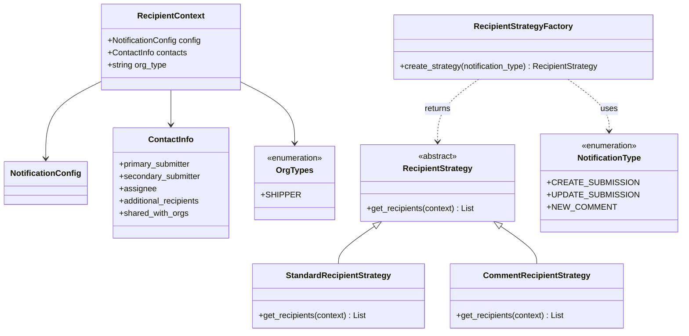
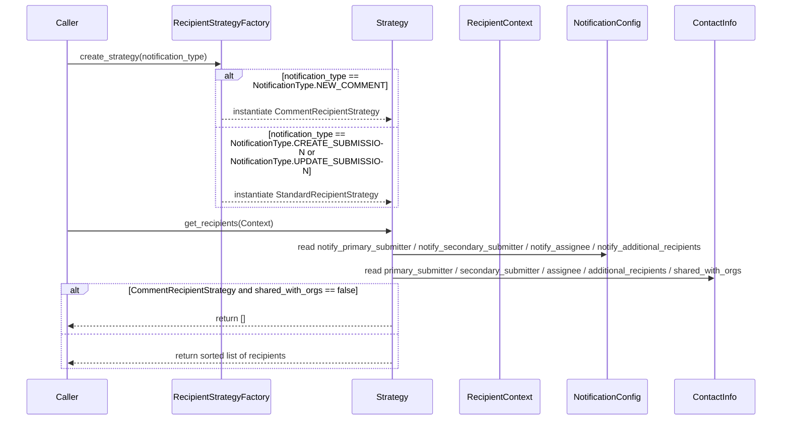

# Diagram: entity_core/entity_service/entity_service/damageview/notification_handler/receipients/receipients.py

> Auto-generated by Obscura crawlers

## Diagram 1

### SVG

<svg id="container" width="1296.6171875" xmlns="http://www.w3.org/2000/svg" class="classDiagram" height="650" viewBox="0 0 1296.6171875 650" role="graphics-document document" aria-roledescription="class"><g><defs><marker id="container_class-aggregationStart" class="marker aggregation class" refX="18" refY="7" markerWidth="190" markerHeight="240" orient="auto"><path d="M 18,7 L9,13 L1,7 L9,1 Z"></path></marker></defs><defs><marker id="container_class-aggregationEnd" class="marker aggregation class" refX="1" refY="7" markerWidth="20" markerHeight="28" orient="auto"><path d="M 18,7 L9,13 L1,7 L9,1 Z"></path></marker></defs><defs><marker id="container_class-extensionStart" class="marker extension class" refX="18" refY="7" markerWidth="190" markerHeight="240" orient="auto"><path d="M 1,7 L18,13 V 1 Z"></path></marker></defs><defs><marker id="container_class-extensionEnd" class="marker extension class" refX="1" refY="7" markerWidth="20" markerHeight="28" orient="auto"><path d="M 1,1 V 13 L18,7 Z"></path></marker></defs><defs><marker id="container_class-compositionStart" class="marker composition class" refX="18" refY="7" markerWidth="190" markerHeight="240" orient="auto"><path d="M 18,7 L9,13 L1,7 L9,1 Z"></path></marker></defs><defs><marker id="container_class-compositionEnd" class="marker composition class" refX="1" refY="7" markerWidth="20" markerHeight="28" orient="auto"><path d="M 18,7 L9,13 L1,7 L9,1 Z"></path></marker></defs><defs><marker id="container_class-dependencyStart" class="marker dependency class" refX="6" refY="7" markerWidth="190" markerHeight="240" orient="auto"><path d="M 5,7 L9,13 L1,7 L9,1 Z"></path></marker></defs><defs><marker id="container_class-dependencyEnd" class="marker dependency class" refX="13" refY="7" markerWidth="20" markerHeight="28" orient="auto"><path d="M 18,7 L9,13 L14,7 L9,1 Z"></path></marker></defs><defs><marker id="container_class-lollipopStart" class="marker lollipop class" refX="13" refY="7" markerWidth="190" markerHeight="240" orient="auto"><circle stroke="black" fill="transparent" cx="7" cy="7" r="6"></circle></marker></defs><defs><marker id="container_class-lollipopEnd" class="marker lollipop class" refX="1" refY="7" markerWidth="190" markerHeight="240" orient="auto"><circle stroke="black" fill="transparent" cx="7" cy="7" r="6"></circle></marker></defs><g class="root"><g class="clusters"></g><g class="edgePaths"><path d="M718.685,442.781L707.01,450.817C695.336,458.854,671.986,474.927,660.311,487.13C648.637,499.333,648.637,507.667,648.637,511.833L648.637,516" id="id_RecipientStrategy_StandardRecipientStrategy_1" class="edge-thickness-normal edge-pattern-solid relation" style=";;;" data-edge="true" data-et="edge" data-id="id_RecipientStrategy_StandardRecipientStrategy_1" data-points="W3sieCI6NzMyLjg5NDEyMDA2NTc4OTUsInkiOjQzM30seyJ4Ijo2NDguNjM2NzE4NzUsInkiOjQ5MX0seyJ4Ijo2NDguNjM2NzE4NzUsInkiOjUxNn1d" marker-start="url(#container_class-extensionStart)"></path><path d="M965.01,442.781L976.685,450.817C988.36,458.854,1011.709,474.927,1023.384,487.13C1035.059,499.333,1035.059,507.667,1035.059,511.833L1035.059,516" id="id_RecipientStrategy_CommentRecipientStrategy_2" class="edge-thickness-normal edge-pattern-solid relation" style=";;;" data-edge="true" data-et="edge" data-id="id_RecipientStrategy_CommentRecipientStrategy_2" data-points="W3sieCI6OTUwLjgwMTE5MjQzNDIxMDUsInkiOjQzM30seyJ4IjoxMDM1LjA1ODU5Mzc1LCJ5Ijo0OTF9LHsieCI6MTAzNS4wNTg1OTM3NSwieSI6NTE2fV0=" marker-start="url(#container_class-extensionStart)"></path><path d="M919.49,155L906.55,164.667C893.609,174.333,867.729,193.667,854.788,214C841.848,234.333,841.848,255.667,841.848,266.333L841.848,277" id="id_RecipientStrategyFactory_RecipientStrategy_3" class="edge-thickness-normal edge-pattern-dashed relation" style=";;;" data-edge="true" data-et="edge" data-id="id_RecipientStrategyFactory_RecipientStrategy_3" data-points="W3sieCI6OTE5LjQ5MDI1MDUxNjUyODksInkiOjE1NX0seyJ4Ijo4NDEuODQ3NjU2MjUsInkiOjIxM30seyJ4Ijo4NDEuODQ3NjU2MjUsInkiOjI4M31d" marker-end="url(#container_class-dependencyEnd)"></path><path d="M191.996,159.979L174.299,168.816C156.602,177.653,121.207,195.326,103.51,220.33C85.813,245.333,85.813,277.667,85.813,293.833L85.813,310" id="id_RecipientContext_NotificationConfig_4" class="edge-thickness-normal edge-pattern-solid relation" style=";;;" data-edge="true" data-et="edge" data-id="id_RecipientContext_NotificationConfig_4" data-points="W3sieCI6MTkxLjk5NjA5Mzc1LCJ5IjoxNTkuOTc5MjM3NTI3MjAyMzd9LHsieCI6ODUuODEyNSwieSI6MjEzfSx7IngiOjg1LjgxMjUsInkiOjMxNn1d" marker-end="url(#container_class-dependencyEnd)"></path><path d="M328.137,176L328.137,182.167C328.137,188.333,328.137,200.667,328.137,212C328.137,223.333,328.137,233.667,328.137,238.833L328.137,244" id="id_RecipientContext_ContactInfo_5" class="edge-thickness-normal edge-pattern-solid relation" style=";;;" data-edge="true" data-et="edge" data-id="id_RecipientContext_ContactInfo_5" data-points="W3sieCI6MzI4LjEzNjcxODc1LCJ5IjoxNzZ9LHsieCI6MzI4LjEzNjcxODc1LCJ5IjoyMTN9LHsieCI6MzI4LjEzNjcxODc1LCJ5IjoyNTB9XQ==" marker-end="url(#container_class-dependencyEnd)"></path><path d="M464.277,161.058L481.344,169.715C498.41,178.372,532.543,195.686,549.609,215.51C566.676,235.333,566.676,257.667,566.676,268.833L566.676,280" id="id_RecipientContext_OrgTypes_6" class="edge-thickness-normal edge-pattern-solid relation" style=";;;" data-edge="true" data-et="edge" data-id="id_RecipientContext_OrgTypes_6" data-points="W3sieCI6NDY0LjI3NzM0Mzc1LCJ5IjoxNjEuMDU3OTM3MzEzNzI2MTR9LHsieCI6NTY2LjY3NTc4MTI1LCJ5IjoyMTN9LHsieCI6NTY2LjY3NTc4MTI1LCJ5IjoyODZ9XQ==" marker-end="url(#container_class-dependencyEnd)"></path><path d="M1088.162,155L1101.103,164.667C1114.043,174.333,1139.924,193.667,1152.864,210.5C1165.805,227.333,1165.805,241.667,1165.805,248.833L1165.805,256" id="id_RecipientStrategyFactory_NotificationType_7" class="edge-thickness-normal edge-pattern-dashed relation" style=";;;" data-edge="true" data-et="edge" data-id="id_RecipientStrategyFactory_NotificationType_7" data-points="W3sieCI6MTA4OC4xNjIwOTMyMzM0NzEsInkiOjE1NX0seyJ4IjoxMTY1LjgwNDY4NzUsInkiOjIxM30seyJ4IjoxMTY1LjgwNDY4NzUsInkiOjI2Mn1d" marker-end="url(#container_class-dependencyEnd)"></path></g><g class="edgeLabels"><g class="edgeLabel"><g class="label" data-id="id_RecipientStrategy_StandardRecipientStrategy_1" transform="translate(0, 0)"><foreignObject width="0" height="0">

</foreignObject></g></g><g class="edgeLabel"><g class="label" data-id="id_RecipientStrategy_CommentRecipientStrategy_2" transform="translate(0, 0)"><foreignObject width="0" height="0">

</foreignObject></g></g><g class="edgeLabel" transform="translate(841.84765625, 213)"><g class="label" data-id="id_RecipientStrategyFactory_RecipientStrategy_3" transform="translate(-26.265625, -12)"><foreignObject width="52.53125" height="24">

returns

</foreignObject></g></g><g class="edgeLabel"><g class="label" data-id="id_RecipientContext_NotificationConfig_4" transform="translate(0, 0)"><foreignObject width="0" height="0">

</foreignObject></g></g><g class="edgeLabel"><g class="label" data-id="id_RecipientContext_ContactInfo_5" transform="translate(0, 0)"><foreignObject width="0" height="0">

</foreignObject></g></g><g class="edgeLabel"><g class="label" data-id="id_RecipientContext_OrgTypes_6" transform="translate(0, 0)"><foreignObject width="0" height="0">

</foreignObject></g></g><g class="edgeLabel" transform="translate(1165.8046875, 213)"><g class="label" data-id="id_RecipientStrategyFactory_NotificationType_7" transform="translate(-16.4921875, -12)"><foreignObject width="32.984375" height="24">

uses

</foreignObject></g></g></g><g class="nodes"><g class="node default" id="classId-RecipientContext-0" transform="translate(328.13671875, 92)"><g class="basic label-container"><path d="M-136.140625 -84 L136.140625 -84 L136.140625 84 L-136.140625 84" stroke="none" stroke-width="0" fill="#ECECFF" style=""></path><path d="M-136.140625 -84 C-31.003405038081823 -84, 74.13381492383635 -84, 136.140625 -84 M-136.140625 -84 C-48.76009085769029 -84, 38.62044328461943 -84, 136.140625 -84 M136.140625 -84 C136.140625 -20.10581262477813, 136.140625 43.78837475044374, 136.140625 84 M136.140625 -84 C136.140625 -46.2321059346208, 136.140625 -8.464211869241595, 136.140625 84 M136.140625 84 C28.934693513141212 84, -78.27123797371758 84, -136.140625 84 M136.140625 84 C76.49692867611441 84, 16.853232352228815 84, -136.140625 84 M-136.140625 84 C-136.140625 28.112700496196567, -136.140625 -27.774599007606867, -136.140625 -84 M-136.140625 84 C-136.140625 43.761760183917715, -136.140625 3.523520367835431, -136.140625 -84" stroke="#9370DB" stroke-width="1.3" fill="none" stroke-dasharray="0 0" style=""></path></g><g class="annotation-group text" transform="translate(0, -60)"></g><g class="label-group text" transform="translate(-62.640625, -60)"><g class="label" style="font-weight: bolder" transform="translate(0,-12)"><foreignObject width="125.28125" height="24">

RecipientContext

</foreignObject></g></g><g class="members-group text" transform="translate(-124.140625, -12)"><g class="label" style="" transform="translate(0,-12)"><foreignObject width="185.640625" height="24">

+NotificationConfig config

</foreignObject></g><g class="label" style="" transform="translate(0,12)"><foreignObject width="157.34375" height="24">

+ContactInfo contacts

</foreignObject></g><g class="label" style="" transform="translate(0,36)"><foreignObject width="117.3125" height="24">

+string org_type

</foreignObject></g></g><g class="methods-group text" transform="translate(-124.140625, 84)"></g><g class="divider" style=""><path d="M-136.140625 -36 C-71.11199386888924 -36, -6.0833627377784865 -36, 136.140625 -36 M-136.140625 -36 C-47.34280284763862 -36, 41.455019304722754 -36, 136.140625 -36" stroke="#9370DB" stroke-width="1.3" fill="none" stroke-dasharray="0 0" style=""></path></g><g class="divider" style=""><path d="M-136.140625 60 C-34.00693519640947 60, 68.12675460718106 60, 136.140625 60 M-136.140625 60 C-40.6108036255857 60, 54.919017748828594 60, 136.140625 60" stroke="#9370DB" stroke-width="1.3" fill="none" stroke-dasharray="0 0" style=""></path></g></g><g class="node default" id="classId-NotificationConfig-1" transform="translate(85.8125, 358)"><g class="basic label-container"><path d="M-77.8125 -42 L77.8125 -42 L77.8125 42 L-77.8125 42" stroke="none" stroke-width="0" fill="#ECECFF" style=""></path><path d="M-77.8125 -42 C-39.21367028357699 -42, -0.6148405671539763 -42, 77.8125 -42 M-77.8125 -42 C-35.15418770544098 -42, 7.504124589118035 -42, 77.8125 -42 M77.8125 -42 C77.8125 -10.911906666800078, 77.8125 20.176186666399843, 77.8125 42 M77.8125 -42 C77.8125 -19.697235490209504, 77.8125 2.6055290195809917, 77.8125 42 M77.8125 42 C17.30891796324343 42, -43.19466407351314 42, -77.8125 42 M77.8125 42 C30.78262835444844 42, -16.247243291103118 42, -77.8125 42 M-77.8125 42 C-77.8125 20.316850573772083, -77.8125 -1.3662988524558344, -77.8125 -42 M-77.8125 42 C-77.8125 24.988300743804118, -77.8125 7.976601487608235, -77.8125 -42" stroke="#9370DB" stroke-width="1.3" fill="none" stroke-dasharray="0 0" style=""></path></g><g class="annotation-group text" transform="translate(0, -18)"></g><g class="label-group text" transform="translate(-65.8125, -18)"><g class="label" style="font-weight: bolder" transform="translate(0,-12)"><foreignObject width="131.625" height="24">

NotificationConfig

</foreignObject></g></g><g class="members-group text" transform="translate(-65.8125, 30)"></g><g class="methods-group text" transform="translate(-65.8125, 60)"></g><g class="divider" style=""><path d="M-77.8125 6 C-19.7950975685839 6, 38.2223048628322 6, 77.8125 6 M-77.8125 6 C-37.50597855873193 6, 2.800542882536135 6, 77.8125 6" stroke="#9370DB" stroke-width="1.3" fill="none" stroke-dasharray="0 0" style=""></path></g><g class="divider" style=""><path d="M-77.8125 24 C-22.60799244288681 24, 32.59651511422638 24, 77.8125 24 M-77.8125 24 C-39.79727858295056 24, -1.7820571659011222 24, 77.8125 24" stroke="#9370DB" stroke-width="1.3" fill="none" stroke-dasharray="0 0" style=""></path></g></g><g class="node default" id="classId-ContactInfo-2" transform="translate(328.13671875, 358)"><g class="basic label-container"><path d="M-114.51171875 -108 L114.51171875 -108 L114.51171875 108 L-114.51171875 108" stroke="none" stroke-width="0" fill="#ECECFF" style=""></path><path d="M-114.51171875 -108 C-43.9959415515293 -108, 26.519835646941402 -108, 114.51171875 -108 M-114.51171875 -108 C-64.66339100147576 -108, -14.815063252951518 -108, 114.51171875 -108 M114.51171875 -108 C114.51171875 -39.85599923578292, 114.51171875 28.288001528434165, 114.51171875 108 M114.51171875 -108 C114.51171875 -26.07439635896418, 114.51171875 55.85120728207164, 114.51171875 108 M114.51171875 108 C35.00318727152526 108, -44.505344206949474 108, -114.51171875 108 M114.51171875 108 C53.388945974555874 108, -7.733826800888252 108, -114.51171875 108 M-114.51171875 108 C-114.51171875 32.636991568446206, -114.51171875 -42.72601686310759, -114.51171875 -108 M-114.51171875 108 C-114.51171875 62.286495582628085, -114.51171875 16.57299116525617, -114.51171875 -108" stroke="#9370DB" stroke-width="1.3" fill="none" stroke-dasharray="0 0" style=""></path></g><g class="annotation-group text" transform="translate(0, -84)"></g><g class="label-group text" transform="translate(-42.4296875, -84)"><g class="label" style="font-weight: bolder" transform="translate(0,-12)"><foreignObject width="84.859375" height="24">

ContactInfo

</foreignObject></g></g><g class="members-group text" transform="translate(-102.51171875, -36)"><g class="label" style="" transform="translate(0,-12)"><foreignObject width="143.203125" height="24">

+primary_submitter

</foreignObject></g><g class="label" style="" transform="translate(0,12)"><foreignObject width="161.109375" height="24">

+secondary_submitter

</foreignObject></g><g class="label" style="" transform="translate(0,36)"><foreignObject width="70.734375" height="24">

+assignee

</foreignObject></g><g class="label" style="" transform="translate(0,60)"><foreignObject width="162.59375" height="24">

+additional_recipients

</foreignObject></g><g class="label" style="" transform="translate(0,84)"><foreignObject width="135.625" height="24">

+shared_with_orgs

</foreignObject></g></g><g class="methods-group text" transform="translate(-102.51171875, 108)"></g><g class="divider" style=""><path d="M-114.51171875 -60 C-40.20959185374038 -60, 34.092535042519245 -60, 114.51171875 -60 M-114.51171875 -60 C-37.92184193297831 -60, 38.66803488404338 -60, 114.51171875 -60" stroke="#9370DB" stroke-width="1.3" fill="none" stroke-dasharray="0 0" style=""></path></g><g class="divider" style=""><path d="M-114.51171875 84 C-26.40174929116847 84, 61.70822016766306 84, 114.51171875 84 M-114.51171875 84 C-61.39446058887473 84, -8.277202427749458 84, 114.51171875 84" stroke="#9370DB" stroke-width="1.3" fill="none" stroke-dasharray="0 0" style=""></path></g></g><g class="node default" id="classId-RecipientStrategy-3" transform="translate(841.84765625, 358)"><g class="basic label-container"><path d="M-151.14453125 -75 L151.14453125 -75 L151.14453125 75 L-151.14453125 75" stroke="none" stroke-width="0" fill="#ECECFF" style=""></path><path d="M-151.14453125 -75 C-53.36429122392428 -75, 44.41594880215143 -75, 151.14453125 -75 M-151.14453125 -75 C-43.27793105419042 -75, 64.58866914161916 -75, 151.14453125 -75 M151.14453125 -75 C151.14453125 -27.872434491072227, 151.14453125 19.255131017855547, 151.14453125 75 M151.14453125 -75 C151.14453125 -34.574383402732714, 151.14453125 5.851233194534572, 151.14453125 75 M151.14453125 75 C67.85419022146604 75, -15.436150807067918 75, -151.14453125 75 M151.14453125 75 C70.16344651042259 75, -10.817638229154824 75, -151.14453125 75 M-151.14453125 75 C-151.14453125 21.264803547283634, -151.14453125 -32.47039290543273, -151.14453125 -75 M-151.14453125 75 C-151.14453125 37.575841307324815, -151.14453125 0.15168261464962995, -151.14453125 -75" stroke="#9370DB" stroke-width="1.3" fill="none" stroke-dasharray="0 0" style=""></path></g><g class="annotation-group text" transform="translate(-38.609375, -51)"><g class="label" style="" transform="translate(0,-12)"><foreignObject width="77.21875" height="24">

«abstract»

</foreignObject></g></g><g class="label-group text" transform="translate(-65.3671875, -27)"><g class="label" style="font-weight: bolder" transform="translate(0,-12)"><foreignObject width="130.734375" height="24">

RecipientStrategy

</foreignObject></g></g><g class="members-group text" transform="translate(-139.14453125, 21)"></g><g class="methods-group text" transform="translate(-139.14453125, 51)"><g class="label" style="" transform="translate(0,-12)"><foreignObject width="212.921875" height="24">

+get_recipients(context) : List

</foreignObject></g></g><g class="divider" style=""><path d="M-151.14453125 -3 C-51.041144837954846 -3, 49.06224157409031 -3, 151.14453125 -3 M-151.14453125 -3 C-44.869738111095344 -3, 61.40505502780931 -3, 151.14453125 -3" stroke="#9370DB" stroke-width="1.3" fill="none" stroke-dasharray="0 0" style=""></path></g><g class="divider" style=""><path d="M-151.14453125 21 C-76.93889190448934 21, -2.733252558978677 21, 151.14453125 21 M-151.14453125 21 C-41.421174588901266 21, 68.30218207219747 21, 151.14453125 21" stroke="#9370DB" stroke-width="1.3" fill="none" stroke-dasharray="0 0" style=""></path></g></g><g class="node default" id="classId-StandardRecipientStrategy-4" transform="translate(648.63671875, 579)"><g class="basic label-container"><path d="M-167.90234375 -63 L167.90234375 -63 L167.90234375 63 L-167.90234375 63" stroke="none" stroke-width="0" fill="#ECECFF" style=""></path><path d="M-167.90234375 -63 C-47.54058013546748 -63, 72.82118347906504 -63, 167.90234375 -63 M-167.90234375 -63 C-99.71492430251641 -63, -31.527504855032817 -63, 167.90234375 -63 M167.90234375 -63 C167.90234375 -28.95471131576479, 167.90234375 5.09057736847042, 167.90234375 63 M167.90234375 -63 C167.90234375 -35.68993014648413, 167.90234375 -8.379860292968253, 167.90234375 63 M167.90234375 63 C46.83678964312327 63, -74.22876446375346 63, -167.90234375 63 M167.90234375 63 C53.910520866740484 63, -60.08130201651903 63, -167.90234375 63 M-167.90234375 63 C-167.90234375 23.58982578760584, -167.90234375 -15.820348424788321, -167.90234375 -63 M-167.90234375 63 C-167.90234375 31.9795855181538, -167.90234375 0.9591710363076018, -167.90234375 -63" stroke="#9370DB" stroke-width="1.3" fill="none" stroke-dasharray="0 0" style=""></path></g><g class="annotation-group text" transform="translate(0, -39)"></g><g class="label-group text" transform="translate(-98.8828125, -39)"><g class="label" style="font-weight: bolder" transform="translate(0,-12)"><foreignObject width="197.765625" height="24">

StandardRecipientStrategy

</foreignObject></g></g><g class="members-group text" transform="translate(-155.90234375, 9)"></g><g class="methods-group text" transform="translate(-155.90234375, 39)"><g class="label" style="" transform="translate(0,-12)"><foreignObject width="212.921875" height="24">

+get_recipients(context) : List

</foreignObject></g></g><g class="divider" style=""><path d="M-167.90234375 -15 C-88.71803279633788 -15, -9.53372184267576 -15, 167.90234375 -15 M-167.90234375 -15 C-73.9007903148223 -15, 20.100763120355396 -15, 167.90234375 -15" stroke="#9370DB" stroke-width="1.3" fill="none" stroke-dasharray="0 0" style=""></path></g><g class="divider" style=""><path d="M-167.90234375 9 C-34.991259332710655 9, 97.91982508457869 9, 167.90234375 9 M-167.90234375 9 C-88.36852911883778 9, -8.83471448767557 9, 167.90234375 9" stroke="#9370DB" stroke-width="1.3" fill="none" stroke-dasharray="0 0" style=""></path></g></g><g class="node default" id="classId-CommentRecipientStrategy-5" transform="translate(1035.05859375, 579)"><g class="basic label-container"><path d="M-168.51953125 -63 L168.51953125 -63 L168.51953125 63 L-168.51953125 63" stroke="none" stroke-width="0" fill="#ECECFF" style=""></path><path d="M-168.51953125 -63 C-50.68628043771501 -63, 67.14697037456997 -63, 168.51953125 -63 M-168.51953125 -63 C-74.29791247331542 -63, 19.92370630336916 -63, 168.51953125 -63 M168.51953125 -63 C168.51953125 -36.23515803971837, 168.51953125 -9.470316079436742, 168.51953125 63 M168.51953125 -63 C168.51953125 -20.115041792787906, 168.51953125 22.769916414424188, 168.51953125 63 M168.51953125 63 C35.67817671104086 63, -97.16317782791828 63, -168.51953125 63 M168.51953125 63 C45.19821289261466 63, -78.12310546477067 63, -168.51953125 63 M-168.51953125 63 C-168.51953125 34.655746877814025, -168.51953125 6.3114937556280495, -168.51953125 -63 M-168.51953125 63 C-168.51953125 29.407191640467346, -168.51953125 -4.185616719065308, -168.51953125 -63" stroke="#9370DB" stroke-width="1.3" fill="none" stroke-dasharray="0 0" style=""></path></g><g class="annotation-group text" transform="translate(0, -39)"></g><g class="label-group text" transform="translate(-100.1171875, -39)"><g class="label" style="font-weight: bolder" transform="translate(0,-12)"><foreignObject width="200.234375" height="24">

CommentRecipientStrategy

</foreignObject></g></g><g class="members-group text" transform="translate(-156.51953125, 9)"></g><g class="methods-group text" transform="translate(-156.51953125, 39)"><g class="label" style="" transform="translate(0,-12)"><foreignObject width="212.921875" height="24">

+get_recipients(context) : List

</foreignObject></g></g><g class="divider" style=""><path d="M-168.51953125 -15 C-93.02225709881111 -15, -17.52498294762222 -15, 168.51953125 -15 M-168.51953125 -15 C-48.26680686967232 -15, 71.98591751065536 -15, 168.51953125 -15" stroke="#9370DB" stroke-width="1.3" fill="none" stroke-dasharray="0 0" style=""></path></g><g class="divider" style=""><path d="M-168.51953125 9 C-93.06957094973869 9, -17.61961064947738 9, 168.51953125 9 M-168.51953125 9 C-82.24856998886209 9, 4.022391272275826 9, 168.51953125 9" stroke="#9370DB" stroke-width="1.3" fill="none" stroke-dasharray="0 0" style=""></path></g></g><g class="node default" id="classId-RecipientStrategyFactory-6" transform="translate(1003.826171875, 92)"><g class="basic label-container"><path d="M-254.09765625 -63 L254.09765625 -63 L254.09765625 63 L-254.09765625 63" stroke="none" stroke-width="0" fill="#ECECFF" style=""></path><path d="M-254.09765625 -63 C-104.10179899825201 -63, 45.894058253495984 -63, 254.09765625 -63 M-254.09765625 -63 C-126.2746339879641 -63, 1.5483882740718116 -63, 254.09765625 -63 M254.09765625 -63 C254.09765625 -19.982704594572546, 254.09765625 23.03459081085491, 254.09765625 63 M254.09765625 -63 C254.09765625 -27.418970614139916, 254.09765625 8.162058771720169, 254.09765625 63 M254.09765625 63 C122.1050438091047 63, -9.8875686317906 63, -254.09765625 63 M254.09765625 63 C139.93473941849825 63, 25.771822586996507 63, -254.09765625 63 M-254.09765625 63 C-254.09765625 33.054936918025284, -254.09765625 3.1098738360505678, -254.09765625 -63 M-254.09765625 63 C-254.09765625 26.478913252054667, -254.09765625 -10.042173495890665, -254.09765625 -63" stroke="#9370DB" stroke-width="1.3" fill="none" stroke-dasharray="0 0" style=""></path></g><g class="annotation-group text" transform="translate(0, -39)"></g><g class="label-group text" transform="translate(-91.9609375, -39)"><g class="label" style="font-weight: bolder" transform="translate(0,-12)"><foreignObject width="183.921875" height="24">

RecipientStrategyFactory

</foreignObject></g></g><g class="members-group text" transform="translate(-242.09765625, 9)"></g><g class="methods-group text" transform="translate(-242.09765625, 39)"><g class="label" style="" transform="translate(0,-12)"><foreignObject width="392.234375" height="24">

+create_strategy(notification_type) : RecipientStrategy

</foreignObject></g></g><g class="divider" style=""><path d="M-254.09765625 -15 C-109.97008975200464 -15, 34.15747674599072 -15, 254.09765625 -15 M-254.09765625 -15 C-117.6977250732258 -15, 18.702206103548406 -15, 254.09765625 -15" stroke="#9370DB" stroke-width="1.3" fill="none" stroke-dasharray="0 0" style=""></path></g><g class="divider" style=""><path d="M-254.09765625 9 C-121.49204737925405 9, 11.113561491491907 9, 254.09765625 9 M-254.09765625 9 C-57.86186644296325 9, 138.3739233640735 9, 254.09765625 9" stroke="#9370DB" stroke-width="1.3" fill="none" stroke-dasharray="0 0" style=""></path></g></g><g class="node default" id="classId-OrgTypes-7" transform="translate(566.67578125, 358)"><g class="basic label-container"><path d="M-74.02734375 -72 L74.02734375 -72 L74.02734375 72 L-74.02734375 72" stroke="none" stroke-width="0" fill="#ECECFF" style=""></path><path d="M-74.02734375 -72 C-29.50213518604825 -72, 15.0230733779035 -72, 74.02734375 -72 M-74.02734375 -72 C-39.29625580560126 -72, -4.565167861202525 -72, 74.02734375 -72 M74.02734375 -72 C74.02734375 -25.279198321512247, 74.02734375 21.441603356975506, 74.02734375 72 M74.02734375 -72 C74.02734375 -18.593975675336672, 74.02734375 34.812048649326655, 74.02734375 72 M74.02734375 72 C20.19940680099016 72, -33.62853014801968 72, -74.02734375 72 M74.02734375 72 C21.35774594065736 72, -31.31185186868528 72, -74.02734375 72 M-74.02734375 72 C-74.02734375 16.95493895531291, -74.02734375 -38.09012208937418, -74.02734375 -72 M-74.02734375 72 C-74.02734375 21.166535084356674, -74.02734375 -29.66692983128665, -74.02734375 -72" stroke="#9370DB" stroke-width="1.3" fill="none" stroke-dasharray="0 0" style=""></path></g><g class="annotation-group text" transform="translate(-55.5546875, -48)"><g class="label" style="" transform="translate(0,-12)"><foreignObject width="111.109375" height="24">

«enumeration»

</foreignObject></g></g><g class="label-group text" transform="translate(-34.25, -24)"><g class="label" style="font-weight: bolder" transform="translate(0,-12)"><foreignObject width="68.5" height="24">

OrgTypes

</foreignObject></g></g><g class="members-group text" transform="translate(-62.02734375, 24)"><g class="label" style="" transform="translate(0,-12)"><foreignObject width="68.5" height="24">

+SHIPPER

</foreignObject></g></g><g class="methods-group text" transform="translate(-62.02734375, 72)"></g><g class="divider" style=""><path d="M-74.02734375 0 C-43.47859342943128 0, -12.929843108862556 0, 74.02734375 0 M-74.02734375 0 C-35.69479844273849 0, 2.6377468645230238 0, 74.02734375 0" stroke="#9370DB" stroke-width="1.3" fill="none" stroke-dasharray="0 0" style=""></path></g><g class="divider" style=""><path d="M-74.02734375 48 C-33.879118637022586 48, 6.269106475954828 48, 74.02734375 48 M-74.02734375 48 C-27.824143664046332 48, 18.379056421907336 48, 74.02734375 48" stroke="#9370DB" stroke-width="1.3" fill="none" stroke-dasharray="0 0" style=""></path></g></g><g class="node default" id="classId-NotificationType-8" transform="translate(1165.8046875, 358)"><g class="basic label-container"><path d="M-122.8125 -96 L122.8125 -96 L122.8125 96 L-122.8125 96" stroke="none" stroke-width="0" fill="#ECECFF" style=""></path><path d="M-122.8125 -96 C-39.26244532023301 -96, 44.287609359533974 -96, 122.8125 -96 M-122.8125 -96 C-51.484095755508335 -96, 19.84430848898333 -96, 122.8125 -96 M122.8125 -96 C122.8125 -51.008774410792924, 122.8125 -6.017548821585848, 122.8125 96 M122.8125 -96 C122.8125 -44.62387446584461, 122.8125 6.752251068310784, 122.8125 96 M122.8125 96 C47.23182554412659 96, -28.348848911746813 96, -122.8125 96 M122.8125 96 C60.53118160864951 96, -1.7501367827009773 96, -122.8125 96 M-122.8125 96 C-122.8125 25.57737358167978, -122.8125 -44.84525283664044, -122.8125 -96 M-122.8125 96 C-122.8125 25.159303353298682, -122.8125 -45.681393293402635, -122.8125 -96" stroke="#9370DB" stroke-width="1.3" fill="none" stroke-dasharray="0 0" style=""></path></g><g class="annotation-group text" transform="translate(-55.5546875, -72)"><g class="label" style="" transform="translate(0,-12)"><foreignObject width="111.109375" height="24">

«enumeration»

</foreignObject></g></g><g class="label-group text" transform="translate(-60.21875, -48)"><g class="label" style="font-weight: bolder" transform="translate(0,-12)"><foreignObject width="120.4375" height="24">

NotificationType

</foreignObject></g></g><g class="members-group text" transform="translate(-110.8125, 0)"><g class="label" style="" transform="translate(0,-12)"><foreignObject width="158.5625" height="24">

+CREATE_SUBMISSION

</foreignObject></g><g class="label" style="" transform="translate(0,12)"><foreignObject width="161.40625" height="24">

+UPDATE_SUBMISSION

</foreignObject></g><g class="label" style="" transform="translate(0,36)"><foreignObject width="119.671875" height="24">

+NEW_COMMENT

</foreignObject></g></g><g class="methods-group text" transform="translate(-110.8125, 96)"></g><g class="divider" style=""><path d="M-122.8125 -24 C-44.97071163014557 -24, 32.871076739708855 -24, 122.8125 -24 M-122.8125 -24 C-48.88563466839608 -24, 25.04123066320784 -24, 122.8125 -24" stroke="#9370DB" stroke-width="1.3" fill="none" stroke-dasharray="0 0" style=""></path></g><g class="divider" style=""><path d="M-122.8125 72 C-25.33464230552333 72, 72.14321538895334 72, 122.8125 72 M-122.8125 72 C-44.67280168866124 72, 33.466896622677524 72, 122.8125 72" stroke="#9370DB" stroke-width="1.3" fill="none" stroke-dasharray="0 0" style=""></path></g></g></g></g></g></svg>

## Diagram 2

### SVG

<svg id="container" width="1514" xmlns="http://www.w3.org/2000/svg" height="790" viewBox="-50 -10 1514 790" role="graphics-document document" aria-roledescription="sequence"><g><rect x="1264" y="704" fill="#eaeaea" stroke="#666" width="150" height="65" name="Contacts" rx="3" ry="3" class="actor actor-bottom"></rect><text x="1339" y="736.5" dominant-baseline="central" alignment-baseline="central" class="actor actor-box" style="text-anchor: middle; font-size: 16px; font-weight: 400;"><tspan x="1339" dy="0">ContactInfo</tspan></text></g><g><rect x="1063" y="704" fill="#eaeaea" stroke="#666" width="151" height="65" name="Config" rx="3" ry="3" class="actor actor-bottom"></rect><text x="1138.5" y="736.5" dominant-baseline="central" alignment-baseline="central" class="actor actor-box" style="text-anchor: middle; font-size: 16px; font-weight: 400;"><tspan x="1138.5" dy="0">NotificationConfig</tspan></text></g><g><rect x="863" y="704" fill="#eaeaea" stroke="#666" width="150" height="65" name="Context" rx="3" ry="3" class="actor actor-bottom"></rect><text x="938" y="736.5" dominant-baseline="central" alignment-baseline="central" class="actor actor-box" style="text-anchor: middle; font-size: 16px; font-weight: 400;"><tspan x="938" dy="0">RecipientContext</tspan></text></g><g><rect x="663" y="704" fill="#eaeaea" stroke="#666" width="150" height="65" name="Strategy" rx="3" ry="3" class="actor actor-bottom"></rect><text x="738" y="736.5" dominant-baseline="central" alignment-baseline="central" class="actor actor-box" style="text-anchor: middle; font-size: 16px; font-weight: 400;"><tspan x="738" dy="0">Strategy</tspan></text></g><g><rect x="289" y="704" fill="#eaeaea" stroke="#666" width="200" height="65" name="Factory" rx="3" ry="3" class="actor actor-bottom"></rect><text x="389" y="736.5" dominant-baseline="central" alignment-baseline="central" class="actor actor-box" style="text-anchor: middle; font-size: 16px; font-weight: 400;"><tspan x="389" dy="0">RecipientStrategyFactory</tspan></text></g><g><rect x="0" y="704" fill="#eaeaea" stroke="#666" width="150" height="65" name="Caller" rx="3" ry="3" class="actor actor-bottom"></rect><text x="75" y="736.5" dominant-baseline="central" alignment-baseline="central" class="actor actor-box" style="text-anchor: middle; font-size: 16px; font-weight: 400;"><tspan x="75" dy="0">Caller</tspan></text></g><g><line id="actor5" x1="1339" y1="65" x2="1339" y2="704" class="actor-line 200" stroke-width="0.5px" stroke="#999" name="Contacts"></line><g id="root-5"><rect x="1264" y="0" fill="#eaeaea" stroke="#666" width="150" height="65" name="Contacts" rx="3" ry="3" class="actor actor-top"></rect><text x="1339" y="32.5" dominant-baseline="central" alignment-baseline="central" class="actor actor-box" style="text-anchor: middle; font-size: 16px; font-weight: 400;"><tspan x="1339" dy="0">ContactInfo</tspan></text></g></g><g><line id="actor4" x1="1138.5" y1="65" x2="1138.5" y2="704" class="actor-line 200" stroke-width="0.5px" stroke="#999" name="Config"></line><g id="root-4"><rect x="1063" y="0" fill="#eaeaea" stroke="#666" width="151" height="65" name="Config" rx="3" ry="3" class="actor actor-top"></rect><text x="1138.5" y="32.5" dominant-baseline="central" alignment-baseline="central" class="actor actor-box" style="text-anchor: middle; font-size: 16px; font-weight: 400;"><tspan x="1138.5" dy="0">NotificationConfig</tspan></text></g></g><g><line id="actor3" x1="938" y1="65" x2="938" y2="704" class="actor-line 200" stroke-width="0.5px" stroke="#999" name="Context"></line><g id="root-3"><rect x="863" y="0" fill="#eaeaea" stroke="#666" width="150" height="65" name="Context" rx="3" ry="3" class="actor actor-top"></rect><text x="938" y="32.5" dominant-baseline="central" alignment-baseline="central" class="actor actor-box" style="text-anchor: middle; font-size: 16px; font-weight: 400;"><tspan x="938" dy="0">RecipientContext</tspan></text></g></g><g><line id="actor2" x1="738" y1="65" x2="738" y2="704" class="actor-line 200" stroke-width="0.5px" stroke="#999" name="Strategy"></line><g id="root-2"><rect x="663" y="0" fill="#eaeaea" stroke="#666" width="150" height="65" name="Strategy" rx="3" ry="3" class="actor actor-top"></rect><text x="738" y="32.5" dominant-baseline="central" alignment-baseline="central" class="actor actor-box" style="text-anchor: middle; font-size: 16px; font-weight: 400;"><tspan x="738" dy="0">Strategy</tspan></text></g></g><g><line id="actor1" x1="389" y1="65" x2="389" y2="704" class="actor-line 200" stroke-width="0.5px" stroke="#999" name="Factory"></line><g id="root-1"><rect x="289" y="0" fill="#eaeaea" stroke="#666" width="200" height="65" name="Factory" rx="3" ry="3" class="actor actor-top"></rect><text x="389" y="32.5" dominant-baseline="central" alignment-baseline="central" class="actor actor-box" style="text-anchor: middle; font-size: 16px; font-weight: 400;"><tspan x="389" dy="0">RecipientStrategyFactory</tspan></text></g></g><g><line id="actor0" x1="75" y1="65" x2="75" y2="704" class="actor-line 200" stroke-width="0.5px" stroke="#999" name="Caller"></line><g id="root-0"><rect x="0" y="0" fill="#eaeaea" stroke="#666" width="150" height="65" name="Caller" rx="3" ry="3" class="actor actor-top"></rect><text x="75" y="32.5" dominant-baseline="central" alignment-baseline="central" class="actor actor-box" style="text-anchor: middle; font-size: 16px; font-weight: 400;"><tspan x="75" dy="0">Caller</tspan></text></g></g><g></g><defs><symbol id="computer" width="24" height="24"><path transform="scale(.5)" d="M2 2v13h20v-13h-20zm18 11h-16v-9h16v9zm-10.228 6l.466-1h3.524l.467 1h-4.457zm14.228 3h-24l2-6h2.104l-1.33 4h18.45l-1.297-4h2.073l2 6zm-5-10h-14v-7h14v7z"></path></symbol></defs><defs><symbol id="database" fill-rule="evenodd" clip-rule="evenodd"><path transform="scale(.5)" d="M12.258.001l.256.004.255.005.253.008.251.01.249.012.247.015.246.016.242.019.241.02.239.023.236.024.233.027.231.028.229.031.225.032.223.034.22.036.217.038.214.04.211.041.208.043.205.045.201.046.198.048.194.05.191.051.187.053.183.054.18.056.175.057.172.059.168.06.163.061.16.063.155.064.15.066.074.033.073.033.071.034.07.034.069.035.068.035.067.035.066.035.064.036.064.036.062.036.06.036.06.037.058.037.058.037.055.038.055.038.053.038.052.038.051.039.05.039.048.039.047.039.045.04.044.04.043.04.041.04.04.041.039.041.037.041.036.041.034.041.033.042.032.042.03.042.029.042.027.042.026.043.024.043.023.043.021.043.02.043.018.044.017.043.015.044.013.044.012.044.011.045.009.044.007.045.006.045.004.045.002.045.001.045v17l-.001.045-.002.045-.004.045-.006.045-.007.045-.009.044-.011.045-.012.044-.013.044-.015.044-.017.043-.018.044-.02.043-.021.043-.023.043-.024.043-.026.043-.027.042-.029.042-.03.042-.032.042-.033.042-.034.041-.036.041-.037.041-.039.041-.04.041-.041.04-.043.04-.044.04-.045.04-.047.039-.048.039-.05.039-.051.039-.052.038-.053.038-.055.038-.055.038-.058.037-.058.037-.06.037-.06.036-.062.036-.064.036-.064.036-.066.035-.067.035-.068.035-.069.035-.07.034-.071.034-.073.033-.074.033-.15.066-.155.064-.16.063-.163.061-.168.06-.172.059-.175.057-.18.056-.183.054-.187.053-.191.051-.194.05-.198.048-.201.046-.205.045-.208.043-.211.041-.214.04-.217.038-.22.036-.223.034-.225.032-.229.031-.231.028-.233.027-.236.024-.239.023-.241.02-.242.019-.246.016-.247.015-.249.012-.251.01-.253.008-.255.005-.256.004-.258.001-.258-.001-.256-.004-.255-.005-.253-.008-.251-.01-.249-.012-.247-.015-.245-.016-.243-.019-.241-.02-.238-.023-.236-.024-.234-.027-.231-.028-.228-.031-.226-.032-.223-.034-.22-.036-.217-.038-.214-.04-.211-.041-.208-.043-.204-.045-.201-.046-.198-.048-.195-.05-.19-.051-.187-.053-.184-.054-.179-.056-.176-.057-.172-.059-.167-.06-.164-.061-.159-.063-.155-.064-.151-.066-.074-.033-.072-.033-.072-.034-.07-.034-.069-.035-.068-.035-.067-.035-.066-.035-.064-.036-.063-.036-.062-.036-.061-.036-.06-.037-.058-.037-.057-.037-.056-.038-.055-.038-.053-.038-.052-.038-.051-.039-.049-.039-.049-.039-.046-.039-.046-.04-.044-.04-.043-.04-.041-.04-.04-.041-.039-.041-.037-.041-.036-.041-.034-.041-.033-.042-.032-.042-.03-.042-.029-.042-.027-.042-.026-.043-.024-.043-.023-.043-.021-.043-.02-.043-.018-.044-.017-.043-.015-.044-.013-.044-.012-.044-.011-.045-.009-.044-.007-.045-.006-.045-.004-.045-.002-.045-.001-.045v-17l.001-.045.002-.045.004-.045.006-.045.007-.045.009-.044.011-.045.012-.044.013-.044.015-.044.017-.043.018-.044.02-.043.021-.043.023-.043.024-.043.026-.043.027-.042.029-.042.03-.042.032-.042.033-.042.034-.041.036-.041.037-.041.039-.041.04-.041.041-.04.043-.04.044-.04.046-.04.046-.039.049-.039.049-.039.051-.039.052-.038.053-.038.055-.038.056-.038.057-.037.058-.037.06-.037.061-.036.062-.036.063-.036.064-.036.066-.035.067-.035.068-.035.069-.035.07-.034.072-.034.072-.033.074-.033.151-.066.155-.064.159-.063.164-.061.167-.06.172-.059.176-.057.179-.056.184-.054.187-.053.19-.051.195-.05.198-.048.201-.046.204-.045.208-.043.211-.041.214-.04.217-.038.22-.036.223-.034.226-.032.228-.031.231-.028.234-.027.236-.024.238-.023.241-.02.243-.019.245-.016.247-.015.249-.012.251-.01.253-.008.255-.005.256-.004.258-.001.258.001zm-9.258 20.499v.01l.001.021.003.021.004.022.005.021.006.022.007.022.009.023.01.022.011.023.012.023.013.023.015.023.016.024.017.023.018.024.019.024.021.024.022.025.023.024.024.025.052.049.056.05.061.051.066.051.07.051.075.051.079.052.084.052.088.052.092.052.097.052.102.051.105.052.11.052.114.051.119.051.123.051.127.05.131.05.135.05.139.048.144.049.147.047.152.047.155.047.16.045.163.045.167.043.171.043.176.041.178.041.183.039.187.039.19.037.194.035.197.035.202.033.204.031.209.03.212.029.216.027.219.025.222.024.226.021.23.02.233.018.236.016.24.015.243.012.246.01.249.008.253.005.256.004.259.001.26-.001.257-.004.254-.005.25-.008.247-.011.244-.012.241-.014.237-.016.233-.018.231-.021.226-.021.224-.024.22-.026.216-.027.212-.028.21-.031.205-.031.202-.034.198-.034.194-.036.191-.037.187-.039.183-.04.179-.04.175-.042.172-.043.168-.044.163-.045.16-.046.155-.046.152-.047.148-.048.143-.049.139-.049.136-.05.131-.05.126-.05.123-.051.118-.052.114-.051.11-.052.106-.052.101-.052.096-.052.092-.052.088-.053.083-.051.079-.052.074-.052.07-.051.065-.051.06-.051.056-.05.051-.05.023-.024.023-.025.021-.024.02-.024.019-.024.018-.024.017-.024.015-.023.014-.024.013-.023.012-.023.01-.023.01-.022.008-.022.006-.022.006-.022.004-.022.004-.021.001-.021.001-.021v-4.127l-.077.055-.08.053-.083.054-.085.053-.087.052-.09.052-.093.051-.095.05-.097.05-.1.049-.102.049-.105.048-.106.047-.109.047-.111.046-.114.045-.115.045-.118.044-.12.043-.122.042-.124.042-.126.041-.128.04-.13.04-.132.038-.134.038-.135.037-.138.037-.139.035-.142.035-.143.034-.144.033-.147.032-.148.031-.15.03-.151.03-.153.029-.154.027-.156.027-.158.026-.159.025-.161.024-.162.023-.163.022-.165.021-.166.02-.167.019-.169.018-.169.017-.171.016-.173.015-.173.014-.175.013-.175.012-.177.011-.178.01-.179.008-.179.008-.181.006-.182.005-.182.004-.184.003-.184.002h-.37l-.184-.002-.184-.003-.182-.004-.182-.005-.181-.006-.179-.008-.179-.008-.178-.01-.176-.011-.176-.012-.175-.013-.173-.014-.172-.015-.171-.016-.17-.017-.169-.018-.167-.019-.166-.02-.165-.021-.163-.022-.162-.023-.161-.024-.159-.025-.157-.026-.156-.027-.155-.027-.153-.029-.151-.03-.15-.03-.148-.031-.146-.032-.145-.033-.143-.034-.141-.035-.14-.035-.137-.037-.136-.037-.134-.038-.132-.038-.13-.04-.128-.04-.126-.041-.124-.042-.122-.042-.12-.044-.117-.043-.116-.045-.113-.045-.112-.046-.109-.047-.106-.047-.105-.048-.102-.049-.1-.049-.097-.05-.095-.05-.093-.052-.09-.051-.087-.052-.085-.053-.083-.054-.08-.054-.077-.054v4.127zm0-5.654v.011l.001.021.003.021.004.021.005.022.006.022.007.022.009.022.01.022.011.023.012.023.013.023.015.024.016.023.017.024.018.024.019.024.021.024.022.024.023.025.024.024.052.05.056.05.061.05.066.051.07.051.075.052.079.051.084.052.088.052.092.052.097.052.102.052.105.052.11.051.114.051.119.052.123.05.127.051.131.05.135.049.139.049.144.048.147.048.152.047.155.046.16.045.163.045.167.044.171.042.176.042.178.04.183.04.187.038.19.037.194.036.197.034.202.033.204.032.209.03.212.028.216.027.219.025.222.024.226.022.23.02.233.018.236.016.24.014.243.012.246.01.249.008.253.006.256.003.259.001.26-.001.257-.003.254-.006.25-.008.247-.01.244-.012.241-.015.237-.016.233-.018.231-.02.226-.022.224-.024.22-.025.216-.027.212-.029.21-.03.205-.032.202-.033.198-.035.194-.036.191-.037.187-.039.183-.039.179-.041.175-.042.172-.043.168-.044.163-.045.16-.045.155-.047.152-.047.148-.048.143-.048.139-.05.136-.049.131-.05.126-.051.123-.051.118-.051.114-.052.11-.052.106-.052.101-.052.096-.052.092-.052.088-.052.083-.052.079-.052.074-.051.07-.052.065-.051.06-.05.056-.051.051-.049.023-.025.023-.024.021-.025.02-.024.019-.024.018-.024.017-.024.015-.023.014-.023.013-.024.012-.022.01-.023.01-.023.008-.022.006-.022.006-.022.004-.021.004-.022.001-.021.001-.021v-4.139l-.077.054-.08.054-.083.054-.085.052-.087.053-.09.051-.093.051-.095.051-.097.05-.1.049-.102.049-.105.048-.106.047-.109.047-.111.046-.114.045-.115.044-.118.044-.12.044-.122.042-.124.042-.126.041-.128.04-.13.039-.132.039-.134.038-.135.037-.138.036-.139.036-.142.035-.143.033-.144.033-.147.033-.148.031-.15.03-.151.03-.153.028-.154.028-.156.027-.158.026-.159.025-.161.024-.162.023-.163.022-.165.021-.166.02-.167.019-.169.018-.169.017-.171.016-.173.015-.173.014-.175.013-.175.012-.177.011-.178.009-.179.009-.179.007-.181.007-.182.005-.182.004-.184.003-.184.002h-.37l-.184-.002-.184-.003-.182-.004-.182-.005-.181-.007-.179-.007-.179-.009-.178-.009-.176-.011-.176-.012-.175-.013-.173-.014-.172-.015-.171-.016-.17-.017-.169-.018-.167-.019-.166-.02-.165-.021-.163-.022-.162-.023-.161-.024-.159-.025-.157-.026-.156-.027-.155-.028-.153-.028-.151-.03-.15-.03-.148-.031-.146-.033-.145-.033-.143-.033-.141-.035-.14-.036-.137-.036-.136-.037-.134-.038-.132-.039-.13-.039-.128-.04-.126-.041-.124-.042-.122-.043-.12-.043-.117-.044-.116-.044-.113-.046-.112-.046-.109-.046-.106-.047-.105-.048-.102-.049-.1-.049-.097-.05-.095-.051-.093-.051-.09-.051-.087-.053-.085-.052-.083-.054-.08-.054-.077-.054v4.139zm0-5.666v.011l.001.02.003.022.004.021.005.022.006.021.007.022.009.023.01.022.011.023.012.023.013.023.015.023.016.024.017.024.018.023.019.024.021.025.022.024.023.024.024.025.052.05.056.05.061.05.066.051.07.051.075.052.079.051.084.052.088.052.092.052.097.052.102.052.105.051.11.052.114.051.119.051.123.051.127.05.131.05.135.05.139.049.144.048.147.048.152.047.155.046.16.045.163.045.167.043.171.043.176.042.178.04.183.04.187.038.19.037.194.036.197.034.202.033.204.032.209.03.212.028.216.027.219.025.222.024.226.021.23.02.233.018.236.017.24.014.243.012.246.01.249.008.253.006.256.003.259.001.26-.001.257-.003.254-.006.25-.008.247-.01.244-.013.241-.014.237-.016.233-.018.231-.02.226-.022.224-.024.22-.025.216-.027.212-.029.21-.03.205-.032.202-.033.198-.035.194-.036.191-.037.187-.039.183-.039.179-.041.175-.042.172-.043.168-.044.163-.045.16-.045.155-.047.152-.047.148-.048.143-.049.139-.049.136-.049.131-.051.126-.05.123-.051.118-.052.114-.051.11-.052.106-.052.101-.052.096-.052.092-.052.088-.052.083-.052.079-.052.074-.052.07-.051.065-.051.06-.051.056-.05.051-.049.023-.025.023-.025.021-.024.02-.024.019-.024.018-.024.017-.024.015-.023.014-.024.013-.023.012-.023.01-.022.01-.023.008-.022.006-.022.006-.022.004-.022.004-.021.001-.021.001-.021v-4.153l-.077.054-.08.054-.083.053-.085.053-.087.053-.09.051-.093.051-.095.051-.097.05-.1.049-.102.048-.105.048-.106.048-.109.046-.111.046-.114.046-.115.044-.118.044-.12.043-.122.043-.124.042-.126.041-.128.04-.13.039-.132.039-.134.038-.135.037-.138.036-.139.036-.142.034-.143.034-.144.033-.147.032-.148.032-.15.03-.151.03-.153.028-.154.028-.156.027-.158.026-.159.024-.161.024-.162.023-.163.023-.165.021-.166.02-.167.019-.169.018-.169.017-.171.016-.173.015-.173.014-.175.013-.175.012-.177.01-.178.01-.179.009-.179.007-.181.006-.182.006-.182.004-.184.003-.184.001-.185.001-.185-.001-.184-.001-.184-.003-.182-.004-.182-.006-.181-.006-.179-.007-.179-.009-.178-.01-.176-.01-.176-.012-.175-.013-.173-.014-.172-.015-.171-.016-.17-.017-.169-.018-.167-.019-.166-.02-.165-.021-.163-.023-.162-.023-.161-.024-.159-.024-.157-.026-.156-.027-.155-.028-.153-.028-.151-.03-.15-.03-.148-.032-.146-.032-.145-.033-.143-.034-.141-.034-.14-.036-.137-.036-.136-.037-.134-.038-.132-.039-.13-.039-.128-.041-.126-.041-.124-.041-.122-.043-.12-.043-.117-.044-.116-.044-.113-.046-.112-.046-.109-.046-.106-.048-.105-.048-.102-.048-.1-.05-.097-.049-.095-.051-.093-.051-.09-.052-.087-.052-.085-.053-.083-.053-.08-.054-.077-.054v4.153zm8.74-8.179l-.257.004-.254.005-.25.008-.247.011-.244.012-.241.014-.237.016-.233.018-.231.021-.226.022-.224.023-.22.026-.216.027-.212.028-.21.031-.205.032-.202.033-.198.034-.194.036-.191.038-.187.038-.183.04-.179.041-.175.042-.172.043-.168.043-.163.045-.16.046-.155.046-.152.048-.148.048-.143.048-.139.049-.136.05-.131.05-.126.051-.123.051-.118.051-.114.052-.11.052-.106.052-.101.052-.096.052-.092.052-.088.052-.083.052-.079.052-.074.051-.07.052-.065.051-.06.05-.056.05-.051.05-.023.025-.023.024-.021.024-.02.025-.019.024-.018.024-.017.023-.015.024-.014.023-.013.023-.012.023-.01.023-.01.022-.008.022-.006.023-.006.021-.004.022-.004.021-.001.021-.001.021.001.021.001.021.004.021.004.022.006.021.006.023.008.022.01.022.01.023.012.023.013.023.014.023.015.024.017.023.018.024.019.024.02.025.021.024.023.024.023.025.051.05.056.05.06.05.065.051.07.052.074.051.079.052.083.052.088.052.092.052.096.052.101.052.106.052.11.052.114.052.118.051.123.051.126.051.131.05.136.05.139.049.143.048.148.048.152.048.155.046.16.046.163.045.168.043.172.043.175.042.179.041.183.04.187.038.191.038.194.036.198.034.202.033.205.032.21.031.212.028.216.027.22.026.224.023.226.022.231.021.233.018.237.016.241.014.244.012.247.011.25.008.254.005.257.004.26.001.26-.001.257-.004.254-.005.25-.008.247-.011.244-.012.241-.014.237-.016.233-.018.231-.021.226-.022.224-.023.22-.026.216-.027.212-.028.21-.031.205-.032.202-.033.198-.034.194-.036.191-.038.187-.038.183-.04.179-.041.175-.042.172-.043.168-.043.163-.045.16-.046.155-.046.152-.048.148-.048.143-.048.139-.049.136-.05.131-.05.126-.051.123-.051.118-.051.114-.052.11-.052.106-.052.101-.052.096-.052.092-.052.088-.052.083-.052.079-.052.074-.051.07-.052.065-.051.06-.05.056-.05.051-.05.023-.025.023-.024.021-.024.02-.025.019-.024.018-.024.017-.023.015-.024.014-.023.013-.023.012-.023.01-.023.01-.022.008-.022.006-.023.006-.021.004-.022.004-.021.001-.021.001-.021-.001-.021-.001-.021-.004-.021-.004-.022-.006-.021-.006-.023-.008-.022-.01-.022-.01-.023-.012-.023-.013-.023-.014-.023-.015-.024-.017-.023-.018-.024-.019-.024-.02-.025-.021-.024-.023-.024-.023-.025-.051-.05-.056-.05-.06-.05-.065-.051-.07-.052-.074-.051-.079-.052-.083-.052-.088-.052-.092-.052-.096-.052-.101-.052-.106-.052-.11-.052-.114-.052-.118-.051-.123-.051-.126-.051-.131-.05-.136-.05-.139-.049-.143-.048-.148-.048-.152-.048-.155-.046-.16-.046-.163-.045-.168-.043-.172-.043-.175-.042-.179-.041-.183-.04-.187-.038-.191-.038-.194-.036-.198-.034-.202-.033-.205-.032-.21-.031-.212-.028-.216-.027-.22-.026-.224-.023-.226-.022-.231-.021-.233-.018-.237-.016-.241-.014-.244-.012-.247-.011-.25-.008-.254-.005-.257-.004-.26-.001-.26.001z"></path></symbol></defs><defs><symbol id="clock" width="24" height="24"><path transform="scale(.5)" d="M12 2c5.514 0 10 4.486 10 10s-4.486 10-10 10-10-4.486-10-10 4.486-10 10-10zm0-2c-6.627 0-12 5.373-12 12s5.373 12 12 12 12-5.373 12-12-5.373-12-12-12zm5.848 12.459c.202.038.202.333.001.372-1.907.361-6.045 1.111-6.547 1.111-.719 0-1.301-.582-1.301-1.301 0-.512.77-5.447 1.125-7.445.034-.192.312-.181.343.014l.985 6.238 5.394 1.011z"></path></symbol></defs><defs><marker id="arrowhead" refX="7.9" refY="5" markerUnits="userSpaceOnUse" markerWidth="12" markerHeight="12" orient="auto-start-reverse"><path d="M -1 0 L 10 5 L 0 10 z"></path></marker></defs><defs><marker id="crosshead" markerWidth="15" markerHeight="8" orient="auto" refX="4" refY="4.5"><path fill="none" stroke="#000000" stroke-width="1pt" d="M 1,2 L 6,7 M 6,2 L 1,7" style="stroke-dasharray: 0, 0;"></path></marker></defs><defs><marker id="filled-head" refX="15.5" refY="7" markerWidth="20" markerHeight="28" orient="auto"><path d="M 18,7 L9,13 L14,7 L9,1 Z"></path></marker></defs><defs><marker id="sequencenumber" refX="15" refY="15" markerWidth="60" markerHeight="40" orient="auto"><circle cx="15" cy="15" r="6"></circle></marker></defs><g><line x1="378" y1="123" x2="749" y2="123" class="loopLine"></line><line x1="749" y1="123" x2="749" y2="364" class="loopLine"></line><line x1="378" y1="364" x2="749" y2="364" class="loopLine"></line><line x1="378" y1="123" x2="378" y2="364" class="loopLine"></line><line x1="378" y1="239" x2="749" y2="239" class="loopLine" style="stroke-dasharray: 3, 3;"></line><polygon points="378,123 428,123 428,136 419.6,143 378,143" class="labelBox"></polygon><text x="403" y="136" text-anchor="middle" dominant-baseline="middle" alignment-baseline="middle" class="labelText" style="font-size: 16px; font-weight: 400;">alt</text><text x="588.5" y="141" text-anchor="middle" class="loopText" style="font-size: 16px; font-weight: 400;"><tspan x="588.5">[notification_type ==</tspan></text><text x="588.5" y="160" text-anchor="middle" class="loopText" style="font-size: 16px; font-weight: 400;"><tspan x="588.5">NotificationType.NEW_COMMENT]</tspan></text><text x="563.5" y="257" text-anchor="middle" class="loopText" style="font-size: 16px; font-weight: 400;">[notification_type ==</text><text x="563.5" y="276" text-anchor="middle" class="loopText" style="font-size: 16px; font-weight: 400;">NotificationType.CREATE_SUBMISSION or</text><text x="563.5" y="295" text-anchor="middle" class="loopText" style="font-size: 16px; font-weight: 400;">NotificationType.UPDATE_SUBMISSION]</text></g><g><line x1="64" y1="518" x2="749" y2="518" class="loopLine"></line><line x1="749" y1="518" x2="749" y2="684" class="loopLine"></line><line x1="64" y1="684" x2="749" y2="684" class="loopLine"></line><line x1="64" y1="518" x2="64" y2="684" class="loopLine"></line><line x1="64" y1="616" x2="749" y2="616" class="loopLine" style="stroke-dasharray: 3, 3;"></line><polygon points="64,518 114,518 114,531 105.6,538 64,538" class="labelBox"></polygon><text x="89" y="531" text-anchor="middle" dominant-baseline="middle" alignment-baseline="middle" class="labelText" style="font-size: 16px; font-weight: 400;">alt</text><text x="431.5" y="536" text-anchor="middle" class="loopText" style="font-size: 16px; font-weight: 400;"><tspan x="431.5">[CommentRecipientStrategy and shared_with_orgs == false]</tspan></text></g><text x="231" y="80" text-anchor="middle" dominant-baseline="middle" alignment-baseline="middle" class="messageText" dy="1em" style="font-size: 16px; font-weight: 400;">create_strategy(notification_type)</text><line x1="76" y1="113" x2="385" y2="113" class="messageLine0" stroke-width="2" stroke="none" marker-end="url(#arrowhead)" style="fill: none;"></line><text x="562" y="191" text-anchor="middle" dominant-baseline="middle" alignment-baseline="middle" class="messageText" dy="1em" style="font-size: 16px; font-weight: 400;">instantiate CommentRecipientStrategy</text><line x1="390" y1="224" x2="734" y2="224" class="messageLine1" stroke-width="2" stroke="none" marker-end="url(#arrowhead)" style="stroke-dasharray: 3, 3; fill: none;"></line><text x="562" y="321" text-anchor="middle" dominant-baseline="middle" alignment-baseline="middle" class="messageText" dy="1em" style="font-size: 16px; font-weight: 400;">instantiate StandardRecipientStrategy</text><line x1="390" y1="354" x2="734" y2="354" class="messageLine1" stroke-width="2" stroke="none" marker-end="url(#arrowhead)" style="stroke-dasharray: 3, 3; fill: none;"></line><text x="405" y="379" text-anchor="middle" dominant-baseline="middle" alignment-baseline="middle" class="messageText" dy="1em" style="font-size: 16px; font-weight: 400;">get_recipients(Context)</text><line x1="76" y1="412" x2="734" y2="412" class="messageLine0" stroke-width="2" stroke="none" marker-end="url(#arrowhead)" style="fill: none;"></line><text x="937" y="427" text-anchor="middle" dominant-baseline="middle" alignment-baseline="middle" class="messageText" dy="1em" style="font-size: 16px; font-weight: 400;">read notify_primary_submitter / notify_secondary_submitter / notify_assignee / notify_additional_recipients</text><line x1="739" y1="460" x2="1134.5" y2="460" class="messageLine0" stroke-width="2" stroke="none" marker-end="url(#arrowhead)" style="fill: none;"></line><text x="1037" y="475" text-anchor="middle" dominant-baseline="middle" alignment-baseline="middle" class="messageText" dy="1em" style="font-size: 16px; font-weight: 400;">read primary_submitter / secondary_submitter / assignee / additional_recipients / shared_with_orgs</text><line x1="739" y1="508" x2="1335" y2="508" class="messageLine0" stroke-width="2" stroke="none" marker-end="url(#arrowhead)" style="fill: none;"></line><text x="408" y="568" text-anchor="middle" dominant-baseline="middle" alignment-baseline="middle" class="messageText" dy="1em" style="font-size: 16px; font-weight: 400;">return []</text><line x1="737" y1="601" x2="79" y2="601" class="messageLine1" stroke-width="2" stroke="none" marker-end="url(#arrowhead)" style="stroke-dasharray: 3, 3; fill: none;"></line><text x="408" y="641" text-anchor="middle" dominant-baseline="middle" alignment-baseline="middle" class="messageText" dy="1em" style="font-size: 16px; font-weight: 400;">return sorted list of recipients</text><line x1="737" y1="674" x2="79" y2="674" class="messageLine1" stroke-width="2" stroke="none" marker-end="url(#arrowhead)" style="stroke-dasharray: 3, 3; fill: none;"></line></svg>
