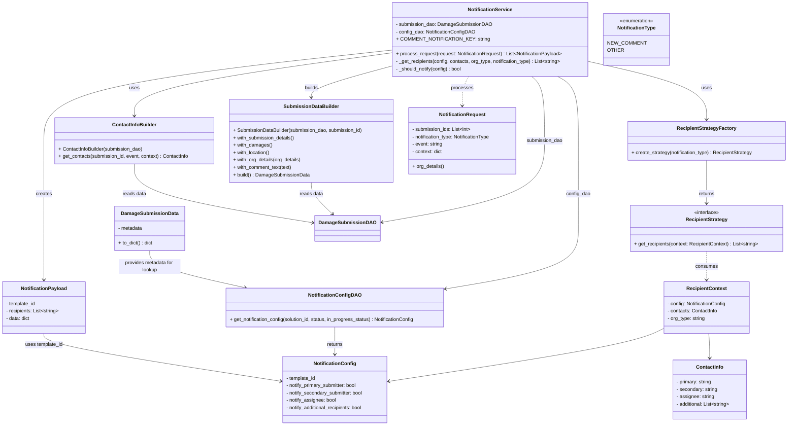

# Diagram: entity_core/entity_service/entity_service/damageview/notification_handler/services/notification_service.py

> Auto-generated by Obscura crawlers

## Mermaid

### SVG

<svg id="container" width="2570.751953125" xmlns="http://www.w3.org/2000/svg" class="classDiagram" height="1380" viewBox="0 0 2570.751953125 1380" role="graphics-document document" aria-roledescription="class"><g><defs><marker id="container_class-aggregationStart" class="marker aggregation class" refX="18" refY="7" markerWidth="190" markerHeight="240" orient="auto"><path d="M 18,7 L9,13 L1,7 L9,1 Z"></path></marker></defs><defs><marker id="container_class-aggregationEnd" class="marker aggregation class" refX="1" refY="7" markerWidth="20" markerHeight="28" orient="auto"><path d="M 18,7 L9,13 L1,7 L9,1 Z"></path></marker></defs><defs><marker id="container_class-extensionStart" class="marker extension class" refX="18" refY="7" markerWidth="190" markerHeight="240" orient="auto"><path d="M 1,7 L18,13 V 1 Z"></path></marker></defs><defs><marker id="container_class-extensionEnd" class="marker extension class" refX="1" refY="7" markerWidth="20" markerHeight="28" orient="auto"><path d="M 1,1 V 13 L18,7 Z"></path></marker></defs><defs><marker id="container_class-compositionStart" class="marker composition class" refX="18" refY="7" markerWidth="190" markerHeight="240" orient="auto"><path d="M 18,7 L9,13 L1,7 L9,1 Z"></path></marker></defs><defs><marker id="container_class-compositionEnd" class="marker composition class" refX="1" refY="7" markerWidth="20" markerHeight="28" orient="auto"><path d="M 18,7 L9,13 L1,7 L9,1 Z"></path></marker></defs><defs><marker id="container_class-dependencyStart" class="marker dependency class" refX="6" refY="7" markerWidth="190" markerHeight="240" orient="auto"><path d="M 5,7 L9,13 L1,7 L9,1 Z"></path></marker></defs><defs><marker id="container_class-dependencyEnd" class="marker dependency class" refX="13" refY="7" markerWidth="20" markerHeight="28" orient="auto"><path d="M 18,7 L9,13 L14,7 L9,1 Z"></path></marker></defs><defs><marker id="container_class-lollipopStart" class="marker lollipop class" refX="13" refY="7" markerWidth="190" markerHeight="240" orient="auto"><circle stroke="black" fill="transparent" cx="7" cy="7" r="6"></circle></marker></defs><defs><marker id="container_class-lollipopEnd" class="marker lollipop class" refX="1" refY="7" markerWidth="190" markerHeight="240" orient="auto"><circle stroke="black" fill="transparent" cx="7" cy="7" r="6"></circle></marker></defs><g class="root"><g class="clusters"></g><g class="edgePaths"><path d="M1287.314,212.416L1241.603,224.514C1195.891,236.611,1104.467,260.805,1058.755,278.069C1013.043,295.333,1013.043,305.667,1013.043,310.833L1013.043,316" id="id_NotificationService_SubmissionDataBuilder_1" class="edge-thickness-normal edge-pattern-solid relation" style=";;;" data-edge="true" data-et="edge" data-id="id_NotificationService_SubmissionDataBuilder_1" data-points="W3sieCI6MTI4Ny4zMTQ0NTMxMjUsInkiOjIxMi40MTY0Mzg2ODA4NzU4NH0seyJ4IjoxMDEzLjA0Mjk2ODc1LCJ5IjoyODV9LHsieCI6MTAxMy4wNDI5Njg3NSwieSI6MzIyfV0=" marker-end="url(#container_class-dependencyEnd)"></path><path d="M1821.173,248L1832.215,254.167C1843.257,260.333,1865.341,272.667,1876.384,307.5C1887.426,342.333,1887.426,399.667,1887.426,457C1887.426,514.333,1887.426,571.667,1887.426,619C1887.426,666.333,1887.426,703.667,1887.426,743C1887.426,782.333,1887.426,823.667,1816.754,856.268C1746.082,888.87,1604.738,912.74,1534.067,924.675L1463.395,936.61" id="id_NotificationService_NotificationConfigDAO_2" class="edge-thickness-normal edge-pattern-solid relation" style=";;;" data-edge="true" data-et="edge" data-id="id_NotificationService_NotificationConfigDAO_2" data-points="W3sieCI6MTgyMS4xNzI5MzI0MjQzNjMxLCJ5IjoyNDh9LHsieCI6MTg4Ny40MjU3ODEyNSwieSI6Mjg1fSx7IngiOjE4ODcuNDI1NzgxMjUsInkiOjQ1N30seyJ4IjoxODg3LjQyNTc4MTI1LCJ5Ijo2Mjl9LHsieCI6MTg4Ny40MjU3ODEyNSwieSI6NzQxfSx7IngiOjE4ODcuNDI1NzgxMjUsInkiOjg2NX0seyJ4IjoxNDU3LjQ3ODUxNTYyNSwieSI6OTM3LjYwOTUzNDIyNTY0OH1d" marker-end="url(#container_class-dependencyEnd)"></path><path d="M1739.861,248L1746.725,254.167C1753.588,260.333,1767.316,272.667,1774.179,307.5C1781.043,342.333,1781.043,399.667,1781.043,457C1781.043,514.333,1781.043,571.667,1689.134,616.024C1597.225,660.381,1413.406,691.762,1321.497,707.452L1229.588,723.143" id="id_NotificationService_DamageSubmissionDAO_3" class="edge-thickness-normal edge-pattern-solid relation" style=";;;" data-edge="true" data-et="edge" data-id="id_NotificationService_DamageSubmissionDAO_3" data-points="W3sieCI6MTczOS44NjEyMjg2MDI3MDcsInkiOjI0OH0seyJ4IjoxNzgxLjA0Mjk2ODc1LCJ5IjoyODV9LHsieCI6MTc4MS4wNDI5Njg3NSwieSI6NDU3fSx7IngiOjE3ODEuMDQyOTY4NzUsInkiOjYyOX0seyJ4IjoxMjIzLjY3MzgyODEyNSwieSI6NzI0LjE1MjM2OTI5OTI4NzZ9XQ==" marker-end="url(#container_class-dependencyEnd)"></path><path d="M1287.314,170.84L1145.644,189.867C1003.974,208.894,720.633,246.947,578.963,281.14C437.293,315.333,437.293,345.667,437.293,360.833L437.293,376" id="id_NotificationService_ContactInfoBuilder_4" class="edge-thickness-normal edge-pattern-solid relation" style=";;;" data-edge="true" data-et="edge" data-id="id_NotificationService_ContactInfoBuilder_4" data-points="W3sieCI6MTI4Ny4zMTQ0NTMxMjUsInkiOjE3MC44NDAyODczMDM0MTQ1M30seyJ4Ijo0MzcuMjkyOTY4NzUsInkiOjI4NX0seyJ4Ijo0MzcuMjkyOTY4NzUsInkiOjM4Mn1d" marker-end="url(#container_class-dependencyEnd)"></path><path d="M1925.283,199.519L1988.826,213.766C2052.368,228.013,2179.452,256.506,2242.995,287.92C2306.537,319.333,2306.537,353.667,2306.537,370.833L2306.537,388" id="id_NotificationService_RecipientStrategyFactory_5" class="edge-thickness-normal edge-pattern-solid relation" style=";;;" data-edge="true" data-et="edge" data-id="id_NotificationService_RecipientStrategyFactory_5" data-points="W3sieCI6MTkyNS4yODMyMDMxMjUsInkiOjE5OS41MTkyOTMwOTc3NzM2NH0seyJ4IjoyMzA2LjUzNzEwOTM3NSwieSI6Mjg1fSx7IngiOjIzMDYuNTM3MTA5Mzc1LCJ5IjozOTR9XQ==" marker-end="url(#container_class-dependencyEnd)"></path><path d="M1287.314,162.223L1096.584,182.686C905.854,203.149,524.394,244.074,333.664,293.204C142.934,342.333,142.934,399.667,142.934,457C142.934,514.333,142.934,571.667,142.934,619C142.934,666.333,142.934,703.667,142.934,743C142.934,782.333,142.934,823.667,142.934,851.5C142.934,879.333,142.934,893.667,142.934,900.833L142.934,908" id="id_NotificationService_NotificationPayload_6" class="edge-thickness-normal edge-pattern-solid relation" style=";;;" data-edge="true" data-et="edge" data-id="id_NotificationService_NotificationPayload_6" data-points="W3sieCI6MTI4Ny4zMTQ0NTMxMjUsInkiOjE2Mi4yMjI4NjIyNzU2NTY5fSx7IngiOjE0Mi45MzM1OTM3NSwieSI6Mjg1fSx7IngiOjE0Mi45MzM1OTM3NSwieSI6NDU3fSx7IngiOjE0Mi45MzM1OTM3NSwieSI6NjI5fSx7IngiOjE0Mi45MzM1OTM3NSwieSI6NzQxfSx7IngiOjE0Mi45MzM1OTM3NSwieSI6ODY1fSx7IngiOjE0Mi45MzM1OTM3NSwieSI6OTE0fV0=" marker-end="url(#container_class-dependencyEnd)"></path><path d="M1531.318,248L1527.465,254.167C1523.612,260.333,1515.906,272.667,1512.052,288.5C1508.199,304.333,1508.199,323.667,1508.199,333.333L1508.199,343" id="id_NotificationService_NotificationRequest_7" class="edge-thickness-normal edge-pattern-dashed relation" style=";;;" data-edge="true" data-et="edge" data-id="id_NotificationService_NotificationRequest_7" data-points="W3sieCI6MTUzMS4zMTgyMzQ5NzIxMzM3LCJ5IjoyNDh9LHsieCI6MTUwOC4xOTkyMTg3NSwieSI6Mjg1fSx7IngiOjE1MDguMTk5MjE4NzUsInkiOjM0OX1d" marker-end="url(#container_class-dependencyEnd)"></path><path d="M1013.043,592L1013.043,598.167C1013.043,604.333,1013.043,616.667,1023.997,633.793C1034.951,650.919,1056.858,672.838,1067.812,683.797L1078.766,694.756" id="id_SubmissionDataBuilder_DamageSubmissionDAO_8" class="edge-thickness-normal edge-pattern-solid relation" style=";;;" data-edge="true" data-et="edge" data-id="id_SubmissionDataBuilder_DamageSubmissionDAO_8" data-points="W3sieCI6MTAxMy4wNDI5Njg3NSwieSI6NTkyfSx7IngiOjEwMTMuMDQyOTY4NzUsInkiOjYyOX0seyJ4IjoxMDgzLjAwNzU2ODM1OTM3NSwieSI6Njk5fV0=" marker-end="url(#container_class-dependencyEnd)"></path><path d="M437.293,532L437.293,548.167C437.293,564.333,437.293,596.667,534.474,628.66C631.654,660.654,826.016,692.309,923.196,708.136L1020.377,723.963" id="id_ContactInfoBuilder_DamageSubmissionDAO_9" class="edge-thickness-normal edge-pattern-solid relation" style=";;;" data-edge="true" data-et="edge" data-id="id_ContactInfoBuilder_DamageSubmissionDAO_9" data-points="W3sieCI6NDM3LjI5Mjk2ODc1LCJ5Ijo1MzJ9LHsieCI6NDM3LjI5Mjk2ODc1LCJ5Ijo2Mjl9LHsieCI6MTAyNi4yOTg4MjgxMjUsInkiOjcyNC45Mjc0Mjk1MDEzNjE5fV0=" marker-end="url(#container_class-dependencyEnd)"></path><path d="M2306.537,520L2306.537,538.167C2306.537,556.333,2306.537,592.667,2306.537,616C2306.537,639.333,2306.537,649.667,2306.537,654.833L2306.537,660" id="id_RecipientStrategyFactory_RecipientStrategy_10" class="edge-thickness-normal edge-pattern-solid relation" style=";;;" data-edge="true" data-et="edge" data-id="id_RecipientStrategyFactory_RecipientStrategy_10" data-points="W3sieCI6MjMwNi41MzcxMDkzNzUsInkiOjUyMH0seyJ4IjoyMzA2LjUzNzEwOTM3NSwieSI6NjI5fSx7IngiOjIzMDYuNTM3MTA5Mzc1LCJ5Ijo2NjZ9XQ==" marker-end="url(#container_class-dependencyEnd)"></path><path d="M2306.537,816L2306.537,824.167C2306.537,832.333,2306.537,848.667,2306.537,864C2306.537,879.333,2306.537,893.667,2306.537,900.833L2306.537,908" id="id_RecipientStrategy_RecipientContext_11" class="edge-thickness-normal edge-pattern-dashed relation" style=";;;" data-edge="true" data-et="edge" data-id="id_RecipientStrategy_RecipientContext_11" data-points="W3sieCI6MjMwNi41MzcxMDkzNzUsInkiOjgxNn0seyJ4IjoyMzA2LjUzNzEwOTM3NSwieSI6ODY1fSx7IngiOjIzMDYuNTM3MTA5Mzc1LCJ5Ijo5MTR9XQ==" marker-end="url(#container_class-dependencyEnd)"></path><path d="M2167.123,1065.376L2148.63,1074.314C2130.137,1083.251,2093.152,1101.125,1945.107,1129.707C1797.063,1158.288,1537.959,1197.575,1408.408,1217.219L1278.856,1236.863" id="id_RecipientContext_NotificationConfig_12" class="edge-thickness-normal edge-pattern-solid relation" style=";;;" data-edge="true" data-et="edge" data-id="id_RecipientContext_NotificationConfig_12" data-points="W3sieCI6MjE2Ny4xMjMwNDY4NzUsInkiOjEwNjUuMzc2Mzk0NDE0NTQxfSx7IngiOjIwNTYuMTY2MDE1NjI1LCJ5IjoxMTE5fSx7IngiOjEyNzIuOTIzODI4MTI1LCJ5IjoxMjM3Ljc2MjI1NDUwMTQ4N31d" marker-end="url(#container_class-dependencyEnd)"></path><path d="M2313.479,1082L2313.989,1088.167C2314.499,1094.333,2315.518,1106.667,2316.027,1120C2316.537,1133.333,2316.537,1147.667,2316.537,1154.833L2316.537,1162" id="id_RecipientContext_ContactInfo_13" class="edge-thickness-normal edge-pattern-solid relation" style=";;;" data-edge="true" data-et="edge" data-id="id_RecipientContext_ContactInfo_13" data-points="W3sieCI6MjMxMy40NzkyNTgxMzUzMzA0LCJ5IjoxMDgyfSx7IngiOjIzMTYuNTM3MTA5Mzc1LCJ5IjoxMTE5fSx7IngiOjIzMTYuNTM3MTA5Mzc1LCJ5IjoxMTY4fV0=" marker-end="url(#container_class-dependencyEnd)"></path><path d="M1099.885,1061L1099.885,1070.667C1099.885,1080.333,1099.885,1099.667,1099.885,1114.5C1099.885,1129.333,1099.885,1139.667,1099.885,1144.833L1099.885,1150" id="id_NotificationConfigDAO_NotificationConfig_14" class="edge-thickness-normal edge-pattern-solid relation" style=";;;" data-edge="true" data-et="edge" data-id="id_NotificationConfigDAO_NotificationConfig_14" data-points="W3sieCI6MTA5OS44ODQ3NjU2MjUsInkiOjEwNjF9LHsieCI6MTA5OS44ODQ3NjU2MjUsInkiOjExMTl9LHsieCI6MTA5OS44ODQ3NjU2MjUsInkiOjExNTZ9XQ==" marker-end="url(#container_class-dependencyEnd)"></path><path d="M142.934,1082L142.934,1088.167C142.934,1094.333,142.934,1106.667,272.597,1132.48C402.26,1158.294,661.587,1197.588,791.25,1217.235L920.913,1236.882" id="id_NotificationPayload_NotificationConfig_15" class="edge-thickness-normal edge-pattern-solid relation" style=";;;" data-edge="true" data-et="edge" data-id="id_NotificationPayload_NotificationConfig_15" data-points="W3sieCI6MTQyLjkzMzU5Mzc1LCJ5IjoxMDgyfSx7IngiOjE0Mi45MzM1OTM3NSwieSI6MTExOX0seyJ4Ijo5MjYuODQ1NzAzMTI1LCJ5IjoxMjM3Ljc4MDYyMjQ2MDI0NjZ9XQ==" marker-end="url(#container_class-dependencyEnd)"></path><path d="M487.887,813L487.887,821.667C487.887,830.333,487.887,847.667,540.594,867.788C593.3,887.909,698.714,910.817,751.421,922.272L804.128,933.726" id="id_DamageSubmissionData_NotificationConfigDAO_16" class="edge-thickness-normal edge-pattern-solid relation" style=";;;" data-edge="true" data-et="edge" data-id="id_DamageSubmissionData_NotificationConfigDAO_16" data-points="W3sieCI6NDg3Ljg4NjcxODc1LCJ5Ijo4MTN9LHsieCI6NDg3Ljg4NjcxODc1LCJ5Ijo4NjV9LHsieCI6ODA5Ljk5MDk1Mzk0NzM2ODQsInkiOjkzNX1d" marker-end="url(#container_class-dependencyEnd)"></path></g><g class="edgeLabels"><g class="edgeLabel" transform="translate(1013.04296875, 285)"><g class="label" data-id="id_NotificationService_SubmissionDataBuilder_1" transform="translate(-22.4921875, -12)"><foreignObject width="44.984375" height="24">

builds

</foreignObject></g></g><g class="edgeLabel" transform="translate(1887.42578125, 629)"><g class="label" data-id="id_NotificationService_NotificationConfigDAO_2" transform="translate(-39.625, -12)"><foreignObject width="79.25" height="24">

config_dao

</foreignObject></g></g><g class="edgeLabel" transform="translate(1781.04296875, 457)"><g class="label" data-id="id_NotificationService_DamageSubmissionDAO_3" transform="translate(-59.078125, -12)"><foreignObject width="118.15625" height="24">

submission_dao

</foreignObject></g></g><g class="edgeLabel" transform="translate(437.29296875, 285)"><g class="label" data-id="id_NotificationService_ContactInfoBuilder_4" transform="translate(-16.4921875, -12)"><foreignObject width="32.984375" height="24">

uses

</foreignObject></g></g><g class="edgeLabel" transform="translate(2306.537109375, 285)"><g class="label" data-id="id_NotificationService_RecipientStrategyFactory_5" transform="translate(-16.4921875, -12)"><foreignObject width="32.984375" height="24">

uses

</foreignObject></g></g><g class="edgeLabel" transform="translate(142.93359375, 629)"><g class="label" data-id="id_NotificationService_NotificationPayload_6" transform="translate(-26.171875, -12)"><foreignObject width="52.34375" height="24">

creates

</foreignObject></g></g><g class="edgeLabel" transform="translate(1508.19921875, 285)"><g class="label" data-id="id_NotificationService_NotificationRequest_7" transform="translate(-35.7890625, -12)"><foreignObject width="71.578125" height="24">

processes

</foreignObject></g></g><g class="edgeLabel" transform="translate(1013.04296875, 629)"><g class="label" data-id="id_SubmissionDataBuilder_DamageSubmissionDAO_8" transform="translate(-38.4453125, -12)"><foreignObject width="76.890625" height="24">

reads data

</foreignObject></g></g><g class="edgeLabel" transform="translate(437.29296875, 629)"><g class="label" data-id="id_ContactInfoBuilder_DamageSubmissionDAO_9" transform="translate(-38.4453125, -12)"><foreignObject width="76.890625" height="24">

reads data

</foreignObject></g></g><g class="edgeLabel" transform="translate(2306.537109375, 629)"><g class="label" data-id="id_RecipientStrategyFactory_RecipientStrategy_10" transform="translate(-26.265625, -12)"><foreignObject width="52.53125" height="24">

returns

</foreignObject></g></g><g class="edgeLabel" transform="translate(2306.537109375, 865)"><g class="label" data-id="id_RecipientStrategy_RecipientContext_11" transform="translate(-36.375, -12)"><foreignObject width="72.75" height="24">

consumes

</foreignObject></g></g><g class="edgeLabel"><g class="label" data-id="id_RecipientContext_NotificationConfig_12" transform="translate(0, 0)"><foreignObject width="0" height="0">

</foreignObject></g></g><g class="edgeLabel"><g class="label" data-id="id_RecipientContext_ContactInfo_13" transform="translate(0, 0)"><foreignObject width="0" height="0">

</foreignObject></g></g><g class="edgeLabel" transform="translate(1099.884765625, 1119)"><g class="label" data-id="id_NotificationConfigDAO_NotificationConfig_14" transform="translate(-26.265625, -12)"><foreignObject width="52.53125" height="24">

returns

</foreignObject></g></g><g class="edgeLabel" transform="translate(142.93359375, 1119)"><g class="label" data-id="id_NotificationPayload_NotificationConfig_15" transform="translate(-62.171875, -12)"><foreignObject width="124.34375" height="24">

uses template_id

</foreignObject></g></g><g class="edgeLabel" transform="translate(487.88671875, 865)"><g class="label" data-id="id_DamageSubmissionData_NotificationConfigDAO_16" transform="translate(-100, -24)"><foreignObject width="200" height="48">

provides metadata for lookup

</foreignObject></g></g></g><g class="nodes"><g class="node default" id="classId-NotificationService-0" transform="translate(1606.298828125, 128)"><g class="basic label-container"><path d="M-318.984375 -120 L318.984375 -120 L318.984375 120 L-318.984375 120" stroke="none" stroke-width="0" fill="#ECECFF" style=""></path><path d="M-318.984375 -120 C-64.45229106164638 -120, 190.07979287670724 -120, 318.984375 -120 M-318.984375 -120 C-145.2551949423817 -120, 28.473985115236587 -120, 318.984375 -120 M318.984375 -120 C318.984375 -64.27631909807022, 318.984375 -8.552638196140435, 318.984375 120 M318.984375 -120 C318.984375 -43.87083990309115, 318.984375 32.258320193817696, 318.984375 120 M318.984375 120 C159.34904717246795 120, -0.28628065506410394 120, -318.984375 120 M318.984375 120 C110.11141496017873 120, -98.76154507964253 120, -318.984375 120 M-318.984375 120 C-318.984375 47.929286650431365, -318.984375 -24.14142669913727, -318.984375 -120 M-318.984375 120 C-318.984375 34.38148286533412, -318.984375 -51.23703426933176, -318.984375 -120" stroke="#9370DB" stroke-width="1.3" fill="none" stroke-dasharray="0 0" style=""></path></g><g class="annotation-group text" transform="translate(0, -96)"></g><g class="label-group text" transform="translate(-69.53125, -96)"><g class="label" style="font-weight: bolder" transform="translate(0,-12)"><foreignObject width="139.0625" height="24">

NotificationService

</foreignObject></g></g><g class="members-group text" transform="translate(-306.984375, -48)"><g class="label" style="" transform="translate(0,-12)"><foreignObject width="308.8125" height="24">

- submission_dao: DamageSubmissionDAO

</foreignObject></g><g class="label" style="" transform="translate(0,12)"><foreignObject width="258.09375" height="24">

- config_dao: NotificationConfigDAO

</foreignObject></g><g class="label" style="" transform="translate(0,36)"><foreignObject width="275.203125" height="24">

+ COMMENT_NOTIFICATION_KEY: string

</foreignObject></g></g><g class="methods-group text" transform="translate(-306.984375, 48)"><g class="label" style="" transform="translate(0,-12)"><foreignObject width="544.4375" height="24">

+ process_request(request: NotificationRequest) : List&lt;NotificationPayload&gt;

</foreignObject></g><g class="label" style="" transform="translate(0,12)"><foreignObject width="543.640625" height="24">

- _get_recipients(config, contacts, org_type, notification_type) : List&lt;string&gt;

</foreignObject></g><g class="label" style="" transform="translate(0,36)"><foreignObject width="218.390625" height="24">

- _should_notify(config) : bool

</foreignObject></g></g><g class="divider" style=""><path d="M-318.984375 -72 C-143.47262321352082 -72, 32.03912857295836 -72, 318.984375 -72 M-318.984375 -72 C-110.67314823077663 -72, 97.63807853844673 -72, 318.984375 -72" stroke="#9370DB" stroke-width="1.3" fill="none" stroke-dasharray="0 0" style=""></path></g><g class="divider" style=""><path d="M-318.984375 24 C-84.78661177021323 24, 149.41115145957355 24, 318.984375 24 M-318.984375 24 C-179.13573763013414 24, -39.28710026026829 24, 318.984375 24" stroke="#9370DB" stroke-width="1.3" fill="none" stroke-dasharray="0 0" style=""></path></g></g><g class="node default" id="classId-SubmissionDataBuilder-1" transform="translate(1013.04296875, 457)"><g class="basic label-container"><path d="M-266.390625 -135 L266.390625 -135 L266.390625 135 L-266.390625 135" stroke="none" stroke-width="0" fill="#ECECFF" style=""></path><path d="M-266.390625 -135 C-148.67983146122137 -135, -30.969037922442737 -135, 266.390625 -135 M-266.390625 -135 C-112.32083733933467 -135, 41.74895032133065 -135, 266.390625 -135 M266.390625 -135 C266.390625 -72.00129325833188, 266.390625 -9.002586516663754, 266.390625 135 M266.390625 -135 C266.390625 -43.82824632106352, 266.390625 47.343507357872966, 266.390625 135 M266.390625 135 C65.66172633037365 135, -135.0671723392527 135, -266.390625 135 M266.390625 135 C147.91044320794254 135, 29.43026141588507 135, -266.390625 135 M-266.390625 135 C-266.390625 61.51617913689698, -266.390625 -11.96764172620604, -266.390625 -135 M-266.390625 135 C-266.390625 78.26916715808666, -266.390625 21.53833431617332, -266.390625 -135" stroke="#9370DB" stroke-width="1.3" fill="none" stroke-dasharray="0 0" style=""></path></g><g class="annotation-group text" transform="translate(0, -111)"></g><g class="label-group text" transform="translate(-85.578125, -111)"><g class="label" style="font-weight: bolder" transform="translate(0,-12)"><foreignObject width="171.15625" height="24">

SubmissionDataBuilder

</foreignObject></g></g><g class="members-group text" transform="translate(-254.390625, -63)"></g><g class="methods-group text" transform="translate(-254.390625, -33)"><g class="label" style="" transform="translate(0,-12)"><foreignObject width="423.203125" height="24">

+ SubmissionDataBuilder(submission_dao, submission_id)

</foreignObject></g><g class="label" style="" transform="translate(0,12)"><foreignObject width="201.90625" height="24">

+ with_submission_details()

</foreignObject></g><g class="label" style="" transform="translate(0,36)"><foreignObject width="126.515625" height="24">

+ with_damages()

</foreignObject></g><g class="label" style="" transform="translate(0,60)"><foreignObject width="121.046875" height="24">

+ with_location()

</foreignObject></g><g class="label" style="" transform="translate(0,84)"><foreignObject width="223.71875" height="24">

+ with_org_details(org_details)

</foreignObject></g><g class="label" style="" transform="translate(0,108)"><foreignObject width="193" height="24">

+ with_comment_text(text)

</foreignObject></g><g class="label" style="" transform="translate(0,132)"><foreignObject width="247.296875" height="24">

+ build() : DamageSubmissionData

</foreignObject></g></g><g class="divider" style=""><path d="M-266.390625 -87 C-143.25703095707564 -87, -20.123436914151313 -87, 266.390625 -87 M-266.390625 -87 C-89.02249000521093 -87, 88.34564498957815 -87, 266.390625 -87" stroke="#9370DB" stroke-width="1.3" fill="none" stroke-dasharray="0 0" style=""></path></g><g class="divider" style=""><path d="M-266.390625 -63 C-68.30758254328157 -63, 129.77545991343686 -63, 266.390625 -63 M-266.390625 -63 C-153.28829315116457 -63, -40.18596130232913 -63, 266.390625 -63" stroke="#9370DB" stroke-width="1.3" fill="none" stroke-dasharray="0 0" style=""></path></g></g><g class="node default" id="classId-ContactInfoBuilder-2" transform="translate(437.29296875, 457)"><g class="basic label-container"><path d="M-259.359375 -75 L259.359375 -75 L259.359375 75 L-259.359375 75" stroke="none" stroke-width="0" fill="#ECECFF" style=""></path><path d="M-259.359375 -75 C-110.41694277291515 -75, 38.5254894541697 -75, 259.359375 -75 M-259.359375 -75 C-138.7896669925821 -75, -18.219958985164254 -75, 259.359375 -75 M259.359375 -75 C259.359375 -34.53945409042263, 259.359375 5.921091819154739, 259.359375 75 M259.359375 -75 C259.359375 -40.12335287048073, 259.359375 -5.24670574096146, 259.359375 75 M259.359375 75 C80.61595331300447 75, -98.12746837399106 75, -259.359375 75 M259.359375 75 C148.07525515610823 75, 36.791135312216454 75, -259.359375 75 M-259.359375 75 C-259.359375 23.16795662350757, -259.359375 -28.664086752984858, -259.359375 -75 M-259.359375 75 C-259.359375 30.888270130313444, -259.359375 -13.223459739373112, -259.359375 -75" stroke="#9370DB" stroke-width="1.3" fill="none" stroke-dasharray="0 0" style=""></path></g><g class="annotation-group text" transform="translate(0, -51)"></g><g class="label-group text" transform="translate(-68.953125, -51)"><g class="label" style="font-weight: bolder" transform="translate(0,-12)"><foreignObject width="137.90625" height="24">

ContactInfoBuilder

</foreignObject></g></g><g class="members-group text" transform="translate(-247.359375, -3)"></g><g class="methods-group text" transform="translate(-247.359375, 27)"><g class="label" style="" transform="translate(0,-12)"><foreignObject width="277.15625" height="24">

+ ContactInfoBuilder(submission_dao)

</foreignObject></g><g class="label" style="" transform="translate(0,12)"><foreignObject width="425.765625" height="24">

+ get_contacts(submission_id, event, context) : ContactInfo

</foreignObject></g></g><g class="divider" style=""><path d="M-259.359375 -27 C-77.9265232459625 -27, 103.506328508075 -27, 259.359375 -27 M-259.359375 -27 C-81.24530703135162 -27, 96.86876093729677 -27, 259.359375 -27" stroke="#9370DB" stroke-width="1.3" fill="none" stroke-dasharray="0 0" style=""></path></g><g class="divider" style=""><path d="M-259.359375 -3 C-57.07828159102522 -3, 145.20281181794957 -3, 259.359375 -3 M-259.359375 -3 C-53.377432728957444 -3, 152.6045095420851 -3, 259.359375 -3" stroke="#9370DB" stroke-width="1.3" fill="none" stroke-dasharray="0 0" style=""></path></g></g><g class="node default" id="classId-RecipientStrategyFactory-3" transform="translate(2306.537109375, 457)"><g class="basic label-container"><path d="M-256.21484375 -63 L256.21484375 -63 L256.21484375 63 L-256.21484375 63" stroke="none" stroke-width="0" fill="#ECECFF" style=""></path><path d="M-256.21484375 -63 C-142.1571840799628 -63, -28.099524409925635 -63, 256.21484375 -63 M-256.21484375 -63 C-55.96670479802441 -63, 144.28143415395118 -63, 256.21484375 -63 M256.21484375 -63 C256.21484375 -30.0431957207268, 256.21484375 2.9136085585464, 256.21484375 63 M256.21484375 -63 C256.21484375 -12.608857467416705, 256.21484375 37.78228506516659, 256.21484375 63 M256.21484375 63 C74.16109854954902 63, -107.89264665090195 63, -256.21484375 63 M256.21484375 63 C107.73662831718036 63, -40.74158711563928 63, -256.21484375 63 M-256.21484375 63 C-256.21484375 18.85723720819901, -256.21484375 -25.28552558360198, -256.21484375 -63 M-256.21484375 63 C-256.21484375 21.951539637842117, -256.21484375 -19.096920724315765, -256.21484375 -63" stroke="#9370DB" stroke-width="1.3" fill="none" stroke-dasharray="0 0" style=""></path></g><g class="annotation-group text" transform="translate(0, -39)"></g><g class="label-group text" transform="translate(-91.9609375, -39)"><g class="label" style="font-weight: bolder" transform="translate(0,-12)"><foreignObject width="183.921875" height="24">

RecipientStrategyFactory

</foreignObject></g></g><g class="members-group text" transform="translate(-244.21484375, 9)"></g><g class="methods-group text" transform="translate(-244.21484375, 39)"><g class="label" style="" transform="translate(0,-12)"><foreignObject width="396.46875" height="24">

+ create_strategy(notification_type) : RecipientStrategy

</foreignObject></g></g><g class="divider" style=""><path d="M-256.21484375 -15 C-81.32718920346437 -15, 93.56046534307126 -15, 256.21484375 -15 M-256.21484375 -15 C-72.14671472957542 -15, 111.92141429084916 -15, 256.21484375 -15" stroke="#9370DB" stroke-width="1.3" fill="none" stroke-dasharray="0 0" style=""></path></g><g class="divider" style=""><path d="M-256.21484375 9 C-67.30579937169716 9, 121.60324500660568 9, 256.21484375 9 M-256.21484375 9 C-131.4783993487698 9, -6.741954947539597 9, 256.21484375 9" stroke="#9370DB" stroke-width="1.3" fill="none" stroke-dasharray="0 0" style=""></path></g></g><g class="node default" id="classId-RecipientStrategy-4" transform="translate(2306.537109375, 741)"><g class="basic label-container"><path d="M-247.76171875 -75 L247.76171875 -75 L247.76171875 75 L-247.76171875 75" stroke="none" stroke-width="0" fill="#ECECFF" style=""></path><path d="M-247.76171875 -75 C-58.48492416715135 -75, 130.7918704156973 -75, 247.76171875 -75 M-247.76171875 -75 C-97.62686378135899 -75, 52.507991187282016 -75, 247.76171875 -75 M247.76171875 -75 C247.76171875 -27.78318544907482, 247.76171875 19.433629101850357, 247.76171875 75 M247.76171875 -75 C247.76171875 -20.526506921328384, 247.76171875 33.94698615734323, 247.76171875 75 M247.76171875 75 C102.33699076600925 75, -43.0877372179815 75, -247.76171875 75 M247.76171875 75 C148.56006197721234 75, 49.35840520442471 75, -247.76171875 75 M-247.76171875 75 C-247.76171875 23.476381463037796, -247.76171875 -28.047237073924407, -247.76171875 -75 M-247.76171875 75 C-247.76171875 38.96475965257121, -247.76171875 2.9295193051424206, -247.76171875 -75" stroke="#9370DB" stroke-width="1.3" fill="none" stroke-dasharray="0 0" style=""></path></g><g class="annotation-group text" transform="translate(-41.015625, -51)"><g class="label" style="" transform="translate(0,-12)"><foreignObject width="82.03125" height="24">

«interface»

</foreignObject></g></g><g class="label-group text" transform="translate(-65.3671875, -27)"><g class="label" style="font-weight: bolder" transform="translate(0,-12)"><foreignObject width="130.734375" height="24">

RecipientStrategy

</foreignObject></g></g><g class="members-group text" transform="translate(-235.76171875, 21)"></g><g class="methods-group text" transform="translate(-235.76171875, 51)"><g class="label" style="" transform="translate(0,-12)"><foreignObject width="406.15625" height="24">

+ get_recipients(context: RecipientContext) : List&lt;string&gt;

</foreignObject></g></g><g class="divider" style=""><path d="M-247.76171875 -3 C-58.711355637028845 -3, 130.3390074759423 -3, 247.76171875 -3 M-247.76171875 -3 C-141.46902697950793 -3, -35.17633520901589 -3, 247.76171875 -3" stroke="#9370DB" stroke-width="1.3" fill="none" stroke-dasharray="0 0" style=""></path></g><g class="divider" style=""><path d="M-247.76171875 21 C-93.37803025854333 21, 61.00565823291333 21, 247.76171875 21 M-247.76171875 21 C-61.791483256717356 21, 124.17875223656529 21, 247.76171875 21" stroke="#9370DB" stroke-width="1.3" fill="none" stroke-dasharray="0 0" style=""></path></g></g><g class="node default" id="classId-RecipientContext-5" transform="translate(2306.537109375, 998)"><g class="basic label-container"><path d="M-139.4140625 -84 L139.4140625 -84 L139.4140625 84 L-139.4140625 84" stroke="none" stroke-width="0" fill="#ECECFF" style=""></path><path d="M-139.4140625 -84 C-58.79625962662837 -84, 21.82154324674326 -84, 139.4140625 -84 M-139.4140625 -84 C-56.38303258126106 -84, 26.647997337477875 -84, 139.4140625 -84 M139.4140625 -84 C139.4140625 -41.88428623311217, 139.4140625 0.2314275337756584, 139.4140625 84 M139.4140625 -84 C139.4140625 -26.130595511616427, 139.4140625 31.738808976767146, 139.4140625 84 M139.4140625 84 C48.45259001284283 84, -42.50888247431433 84, -139.4140625 84 M139.4140625 84 C50.18452675652735 84, -39.045008986945305 84, -139.4140625 84 M-139.4140625 84 C-139.4140625 20.332536915073035, -139.4140625 -43.33492616985393, -139.4140625 -84 M-139.4140625 84 C-139.4140625 37.41999633550569, -139.4140625 -9.160007328988627, -139.4140625 -84" stroke="#9370DB" stroke-width="1.3" fill="none" stroke-dasharray="0 0" style=""></path></g><g class="annotation-group text" transform="translate(0, -60)"></g><g class="label-group text" transform="translate(-62.640625, -60)"><g class="label" style="font-weight: bolder" transform="translate(0,-12)"><foreignObject width="125.28125" height="24">

RecipientContext

</foreignObject></g></g><g class="members-group text" transform="translate(-127.4140625, -12)"><g class="label" style="" transform="translate(0,-12)"><foreignObject width="192.1875" height="24">

- config: NotificationConfig

</foreignObject></g><g class="label" style="" transform="translate(0,12)"><foreignObject width="163.875" height="24">

- contacts: ContactInfo

</foreignObject></g><g class="label" style="" transform="translate(0,36)"><foreignObject width="123.859375" height="24">

- org_type: string

</foreignObject></g></g><g class="methods-group text" transform="translate(-127.4140625, 84)"></g><g class="divider" style=""><path d="M-139.4140625 -36 C-37.535729936218246 -36, 64.34260262756351 -36, 139.4140625 -36 M-139.4140625 -36 C-40.65331561835511 -36, 58.10743126328978 -36, 139.4140625 -36" stroke="#9370DB" stroke-width="1.3" fill="none" stroke-dasharray="0 0" style=""></path></g><g class="divider" style=""><path d="M-139.4140625 60 C-64.42755233572302 60, 10.558957828553957 60, 139.4140625 60 M-139.4140625 60 C-38.45432999543061 60, 62.505402509138776 60, 139.4140625 60" stroke="#9370DB" stroke-width="1.3" fill="none" stroke-dasharray="0 0" style=""></path></g></g><g class="node default" id="classId-NotificationRequest-6" transform="translate(1508.19921875, 457)"><g class="basic label-container"><path d="M-178.765625 -108 L178.765625 -108 L178.765625 108 L-178.765625 108" stroke="none" stroke-width="0" fill="#ECECFF" style=""></path><path d="M-178.765625 -108 C-63.53348437217005 -108, 51.6986562556599 -108, 178.765625 -108 M-178.765625 -108 C-40.70167691435972 -108, 97.36227117128055 -108, 178.765625 -108 M178.765625 -108 C178.765625 -29.993935747003036, 178.765625 48.01212850599393, 178.765625 108 M178.765625 -108 C178.765625 -22.192204397713013, 178.765625 63.615591204573974, 178.765625 108 M178.765625 108 C42.70354500559884 108, -93.35853498880232 108, -178.765625 108 M178.765625 108 C48.985896544635494 108, -80.79383191072901 108, -178.765625 108 M-178.765625 108 C-178.765625 37.13245495171455, -178.765625 -33.7350900965709, -178.765625 -108 M-178.765625 108 C-178.765625 49.08998685809303, -178.765625 -9.820026283813945, -178.765625 -108" stroke="#9370DB" stroke-width="1.3" fill="none" stroke-dasharray="0 0" style=""></path></g><g class="annotation-group text" transform="translate(0, -84)"></g><g class="label-group text" transform="translate(-72.859375, -84)"><g class="label" style="font-weight: bolder" transform="translate(0,-12)"><foreignObject width="145.71875" height="24">

NotificationRequest

</foreignObject></g></g><g class="members-group text" transform="translate(-166.765625, -36)"><g class="label" style="" transform="translate(0,-12)"><foreignObject width="192.5625" height="24">

- submission_ids: List&lt;int&gt;

</foreignObject></g><g class="label" style="" transform="translate(0,12)"><foreignObject width="260.671875" height="24">

- notification_type: NotificationType

</foreignObject></g><g class="label" style="" transform="translate(0,36)"><foreignObject width="100.8125" height="24">

- event: string

</foreignObject></g><g class="label" style="" transform="translate(0,60)"><foreignObject width="100.046875" height="24">

- context: dict

</foreignObject></g></g><g class="methods-group text" transform="translate(-166.765625, 84)"><g class="label" style="" transform="translate(0,-12)"><foreignObject width="103.59375" height="24">

+ org_details()

</foreignObject></g></g><g class="divider" style=""><path d="M-178.765625 -60 C-96.31916205460496 -60, -13.872699109209918 -60, 178.765625 -60 M-178.765625 -60 C-85.62539974032731 -60, 7.514825519345379 -60, 178.765625 -60" stroke="#9370DB" stroke-width="1.3" fill="none" stroke-dasharray="0 0" style=""></path></g><g class="divider" style=""><path d="M-178.765625 60 C-72.87152633050798 60, 33.02257233898405 60, 178.765625 60 M-178.765625 60 C-89.32934084398663 60, 0.10694331202674334 60, 178.765625 60" stroke="#9370DB" stroke-width="1.3" fill="none" stroke-dasharray="0 0" style=""></path></g></g><g class="node default" id="classId-NotificationPayload-7" transform="translate(142.93359375, 998)"><g class="basic label-container"><path d="M-134.93359375 -84 L134.93359375 -84 L134.93359375 84 L-134.93359375 84" stroke="none" stroke-width="0" fill="#ECECFF" style=""></path><path d="M-134.93359375 -84 C-40.84589766658725 -84, 53.2417984168255 -84, 134.93359375 -84 M-134.93359375 -84 C-52.159173995249034 -84, 30.61524575950193 -84, 134.93359375 -84 M134.93359375 -84 C134.93359375 -33.1561830243509, 134.93359375 17.687633951298196, 134.93359375 84 M134.93359375 -84 C134.93359375 -41.85156203252767, 134.93359375 0.2968759349446657, 134.93359375 84 M134.93359375 84 C70.95274982193556 84, 6.971905893871096 84, -134.93359375 84 M134.93359375 84 C30.544382543160907 84, -73.84482866367819 84, -134.93359375 84 M-134.93359375 84 C-134.93359375 23.399651067007184, -134.93359375 -37.20069786598563, -134.93359375 -84 M-134.93359375 84 C-134.93359375 49.50345840944441, -134.93359375 15.006916818888826, -134.93359375 -84" stroke="#9370DB" stroke-width="1.3" fill="none" stroke-dasharray="0 0" style=""></path></g><g class="annotation-group text" transform="translate(0, -60)"></g><g class="label-group text" transform="translate(-71.7890625, -60)"><g class="label" style="font-weight: bolder" transform="translate(0,-12)"><foreignObject width="143.578125" height="24">

NotificationPayload

</foreignObject></g></g><g class="members-group text" transform="translate(-122.93359375, -12)"><g class="label" style="" transform="translate(0,-12)"><foreignObject width="97.8125" height="24">

- template_id

</foreignObject></g><g class="label" style="" transform="translate(0,12)"><foreignObject width="174.078125" height="24">

- recipients: List&lt;string&gt;

</foreignObject></g><g class="label" style="" transform="translate(0,36)"><foreignObject width="78.921875" height="24">

- data: dict

</foreignObject></g></g><g class="methods-group text" transform="translate(-122.93359375, 84)"></g><g class="divider" style=""><path d="M-134.93359375 -36 C-47.94757077547858 -36, 39.03845219904284 -36, 134.93359375 -36 M-134.93359375 -36 C-41.51594064473193 -36, 51.901712460536146 -36, 134.93359375 -36" stroke="#9370DB" stroke-width="1.3" fill="none" stroke-dasharray="0 0" style=""></path></g><g class="divider" style=""><path d="M-134.93359375 60 C-53.239227030384924 60, 28.45513968923015 60, 134.93359375 60 M-134.93359375 60 C-28.606101276726534 60, 77.72139119654693 60, 134.93359375 60" stroke="#9370DB" stroke-width="1.3" fill="none" stroke-dasharray="0 0" style=""></path></g></g><g class="node default" id="classId-NotificationConfig-8" transform="translate(1099.884765625, 1264)"><g class="basic label-container"><path d="M-173.0390625 -108 L173.0390625 -108 L173.0390625 108 L-173.0390625 108" stroke="none" stroke-width="0" fill="#ECECFF" style=""></path><path d="M-173.0390625 -108 C-80.01544491907923 -108, 13.008172661841542 -108, 173.0390625 -108 M-173.0390625 -108 C-75.66034108915527 -108, 21.718380321689466 -108, 173.0390625 -108 M173.0390625 -108 C173.0390625 -55.687659785090176, 173.0390625 -3.375319570180352, 173.0390625 108 M173.0390625 -108 C173.0390625 -41.5898134501584, 173.0390625 24.820373099683195, 173.0390625 108 M173.0390625 108 C48.169053792780005 108, -76.70095491443999 108, -173.0390625 108 M173.0390625 108 C94.96958109118547 108, 16.90009968237095 108, -173.0390625 108 M-173.0390625 108 C-173.0390625 34.251406573114835, -173.0390625 -39.49718685377033, -173.0390625 -108 M-173.0390625 108 C-173.0390625 45.64966928922539, -173.0390625 -16.700661421549214, -173.0390625 -108" stroke="#9370DB" stroke-width="1.3" fill="none" stroke-dasharray="0 0" style=""></path></g><g class="annotation-group text" transform="translate(0, -84)"></g><g class="label-group text" transform="translate(-65.8125, -84)"><g class="label" style="font-weight: bolder" transform="translate(0,-12)"><foreignObject width="131.625" height="24">

NotificationConfig

</foreignObject></g></g><g class="members-group text" transform="translate(-161.0390625, -36)"><g class="label" style="" transform="translate(0,-12)"><foreignObject width="97.8125" height="24">

- template_id

</foreignObject></g><g class="label" style="" transform="translate(0,12)"><foreignObject width="237.109375" height="24">

- notify_primary_submitter: bool

</foreignObject></g><g class="label" style="" transform="translate(0,36)"><foreignObject width="255.015625" height="24">

- notify_secondary_submitter: bool

</foreignObject></g><g class="label" style="" transform="translate(0,60)"><foreignObject width="164.390625" height="24">

- notify_assignee: bool

</foreignObject></g><g class="label" style="" transform="translate(0,84)"><foreignObject width="256.265625" height="24">

- notify_additional_recipients: bool

</foreignObject></g></g><g class="methods-group text" transform="translate(-161.0390625, 108)"></g><g class="divider" style=""><path d="M-173.0390625 -60 C-60.44843670079803 -60, 52.142189098403946 -60, 173.0390625 -60 M-173.0390625 -60 C-62.29156463322647 -60, 48.45593323354706 -60, 173.0390625 -60" stroke="#9370DB" stroke-width="1.3" fill="none" stroke-dasharray="0 0" style=""></path></g><g class="divider" style=""><path d="M-173.0390625 84 C-98.71889640245968 84, -24.398730304919354 84, 173.0390625 84 M-173.0390625 84 C-78.39578618486676 84, 16.24749013026647 84, 173.0390625 84" stroke="#9370DB" stroke-width="1.3" fill="none" stroke-dasharray="0 0" style=""></path></g></g><g class="node default" id="classId-DamageSubmissionData-9" transform="translate(487.88671875, 741)"><g class="basic label-container"><path d="M-112.37890625 -72 L112.37890625 -72 L112.37890625 72 L-112.37890625 72" stroke="none" stroke-width="0" fill="#ECECFF" style=""></path><path d="M-112.37890625 -72 C-67.15638671318078 -72, -21.93386717636156 -72, 112.37890625 -72 M-112.37890625 -72 C-43.759884017648574 -72, 24.859138214702853 -72, 112.37890625 -72 M112.37890625 -72 C112.37890625 -35.40181568748347, 112.37890625 1.1963686250330596, 112.37890625 72 M112.37890625 -72 C112.37890625 -36.94795153821711, 112.37890625 -1.895903076434223, 112.37890625 72 M112.37890625 72 C24.942930567685465 72, -62.49304511462907 72, -112.37890625 72 M112.37890625 72 C38.203248174298665 72, -35.97240990140267 72, -112.37890625 72 M-112.37890625 72 C-112.37890625 24.591547876640547, -112.37890625 -22.816904246718906, -112.37890625 -72 M-112.37890625 72 C-112.37890625 41.78329869848478, -112.37890625 11.566597396969556, -112.37890625 -72" stroke="#9370DB" stroke-width="1.3" fill="none" stroke-dasharray="0 0" style=""></path></g><g class="annotation-group text" transform="translate(0, -48)"></g><g class="label-group text" transform="translate(-88.2734375, -48)"><g class="label" style="font-weight: bolder" transform="translate(0,-12)"><foreignObject width="176.546875" height="24">

DamageSubmissionData

</foreignObject></g></g><g class="members-group text" transform="translate(-100.37890625, 0)"><g class="label" style="" transform="translate(0,-12)"><foreignObject width="80.140625" height="24">

- metadata

</foreignObject></g></g><g class="methods-group text" transform="translate(-100.37890625, 48)"><g class="label" style="" transform="translate(0,-12)"><foreignObject width="112.484375" height="24">

+ to_dict() : dict

</foreignObject></g></g><g class="divider" style=""><path d="M-112.37890625 -24 C-41.87793978336009 -24, 28.623026683279818 -24, 112.37890625 -24 M-112.37890625 -24 C-47.94153747871975 -24, 16.495831292560496 -24, 112.37890625 -24" stroke="#9370DB" stroke-width="1.3" fill="none" stroke-dasharray="0 0" style=""></path></g><g class="divider" style=""><path d="M-112.37890625 24 C-60.08353458176339 24, -7.788162913526776 24, 112.37890625 24 M-112.37890625 24 C-45.95092496346564 24, 20.477056323068723 24, 112.37890625 24" stroke="#9370DB" stroke-width="1.3" fill="none" stroke-dasharray="0 0" style=""></path></g></g><g class="node default" id="classId-ContactInfo-10" transform="translate(2316.537109375, 1264)"><g class="basic label-container"><path d="M-121.66015625 -96 L121.66015625 -96 L121.66015625 96 L-121.66015625 96" stroke="none" stroke-width="0" fill="#ECECFF" style=""></path><path d="M-121.66015625 -96 C-42.7522749152146 -96, 36.1556064195708 -96, 121.66015625 -96 M-121.66015625 -96 C-41.719267114632984 -96, 38.22162202073403 -96, 121.66015625 -96 M121.66015625 -96 C121.66015625 -26.073796844441944, 121.66015625 43.85240631111611, 121.66015625 96 M121.66015625 -96 C121.66015625 -46.002479286976985, 121.66015625 3.995041426046029, 121.66015625 96 M121.66015625 96 C35.7682251302146 96, -50.123705989570794 96, -121.66015625 96 M121.66015625 96 C52.72415354767601 96, -16.21184915464798 96, -121.66015625 96 M-121.66015625 96 C-121.66015625 34.10460399667707, -121.66015625 -27.79079200664586, -121.66015625 -96 M-121.66015625 96 C-121.66015625 28.716186480201458, -121.66015625 -38.567627039597085, -121.66015625 -96" stroke="#9370DB" stroke-width="1.3" fill="none" stroke-dasharray="0 0" style=""></path></g><g class="annotation-group text" transform="translate(0, -72)"></g><g class="label-group text" transform="translate(-42.4296875, -72)"><g class="label" style="font-weight: bolder" transform="translate(0,-12)"><foreignObject width="84.859375" height="24">

ContactInfo

</foreignObject></g></g><g class="members-group text" transform="translate(-109.66015625, -24)"><g class="label" style="" transform="translate(0,-12)"><foreignObject width="117.125" height="24">

- primary: string

</foreignObject></g><g class="label" style="" transform="translate(0,12)"><foreignObject width="135.03125" height="24">

- secondary: string

</foreignObject></g><g class="label" style="" transform="translate(0,36)"><foreignObject width="123.390625" height="24">

- assignee: string

</foreignObject></g><g class="label" style="" transform="translate(0,60)"><foreignObject width="176.890625" height="24">

- additional: List&lt;string&gt;

</foreignObject></g></g><g class="methods-group text" transform="translate(-109.66015625, 96)"></g><g class="divider" style=""><path d="M-121.66015625 -48 C-48.447631699057396 -48, 24.764892851885207 -48, 121.66015625 -48 M-121.66015625 -48 C-31.07748313766345 -48, 59.5051899746731 -48, 121.66015625 -48" stroke="#9370DB" stroke-width="1.3" fill="none" stroke-dasharray="0 0" style=""></path></g><g class="divider" style=""><path d="M-121.66015625 72 C-27.233659541600588 72, 67.19283716679882 72, 121.66015625 72 M-121.66015625 72 C-36.00508973314736 72, 49.649976783705284 72, 121.66015625 72" stroke="#9370DB" stroke-width="1.3" fill="none" stroke-dasharray="0 0" style=""></path></g></g><g class="node default" id="classId-DamageSubmissionDAO-11" transform="translate(1124.986328125, 741)"><g class="basic label-container"><path d="M-98.6875 -42 L98.6875 -42 L98.6875 42 L-98.6875 42" stroke="none" stroke-width="0" fill="#ECECFF" style=""></path><path d="M-98.6875 -42 C-35.96901901327376 -42, 26.749461973452483 -42, 98.6875 -42 M-98.6875 -42 C-35.09776473615682 -42, 28.491970527686362 -42, 98.6875 -42 M98.6875 -42 C98.6875 -16.710490493327843, 98.6875 8.579019013344315, 98.6875 42 M98.6875 -42 C98.6875 -23.971134581380287, 98.6875 -5.942269162760574, 98.6875 42 M98.6875 42 C47.79396213470418 42, -3.0995757305916385 42, -98.6875 42 M98.6875 42 C34.022015022589784 42, -30.643469954820432 42, -98.6875 42 M-98.6875 42 C-98.6875 24.734875275561684, -98.6875 7.469750551123369, -98.6875 -42 M-98.6875 42 C-98.6875 14.718852052428055, -98.6875 -12.56229589514389, -98.6875 -42" stroke="#9370DB" stroke-width="1.3" fill="none" stroke-dasharray="0 0" style=""></path></g><g class="annotation-group text" transform="translate(0, -18)"></g><g class="label-group text" transform="translate(-86.6875, -18)"><g class="label" style="font-weight: bolder" transform="translate(0,-12)"><foreignObject width="173.375" height="24">

DamageSubmissionDAO

</foreignObject></g></g><g class="members-group text" transform="translate(-86.6875, 30)"></g><g class="methods-group text" transform="translate(-86.6875, 60)"></g><g class="divider" style=""><path d="M-98.6875 6 C-41.86728025818452 6, 14.952939483630956 6, 98.6875 6 M-98.6875 6 C-23.979182542738414 6, 50.72913491452317 6, 98.6875 6" stroke="#9370DB" stroke-width="1.3" fill="none" stroke-dasharray="0 0" style=""></path></g><g class="divider" style=""><path d="M-98.6875 24 C-48.12997658052932 24, 2.4275468389413533 24, 98.6875 24 M-98.6875 24 C-21.374622782567428 24, 55.938254434865144 24, 98.6875 24" stroke="#9370DB" stroke-width="1.3" fill="none" stroke-dasharray="0 0" style=""></path></g></g><g class="node default" id="classId-NotificationConfigDAO-12" transform="translate(1099.884765625, 998)"><g class="basic label-container"><path d="M-357.59375 -63 L357.59375 -63 L357.59375 63 L-357.59375 63" stroke="none" stroke-width="0" fill="#ECECFF" style=""></path><path d="M-357.59375 -63 C-103.25181757863311 -63, 151.09011484273378 -63, 357.59375 -63 M-357.59375 -63 C-98.21527552682261 -63, 161.16319894635478 -63, 357.59375 -63 M357.59375 -63 C357.59375 -18.71323660614992, 357.59375 25.57352678770016, 357.59375 63 M357.59375 -63 C357.59375 -28.485133066512525, 357.59375 6.029733866974951, 357.59375 63 M357.59375 63 C172.0524636029203 63, -13.488822794159375 63, -357.59375 63 M357.59375 63 C214.1009355098257 63, 70.60812101965138 63, -357.59375 63 M-357.59375 63 C-357.59375 20.305486084057776, -357.59375 -22.389027831884448, -357.59375 -63 M-357.59375 63 C-357.59375 17.498696590118996, -357.59375 -28.002606819762008, -357.59375 -63" stroke="#9370DB" stroke-width="1.3" fill="none" stroke-dasharray="0 0" style=""></path></g><g class="annotation-group text" transform="translate(0, -39)"></g><g class="label-group text" transform="translate(-81.109375, -39)"><g class="label" style="font-weight: bolder" transform="translate(0,-12)"><foreignObject width="162.21875" height="24">

NotificationConfigDAO

</foreignObject></g></g><g class="members-group text" transform="translate(-345.59375, 9)"></g><g class="methods-group text" transform="translate(-345.59375, 39)"><g class="label" style="" transform="translate(0,-12)"><foreignObject width="610.078125" height="24">

+ get_notification_config(solution_id, status, in_progress_status) : NotificationConfig

</foreignObject></g></g><g class="divider" style=""><path d="M-357.59375 -15 C-201.5163853545919 -15, -45.43902070918381 -15, 357.59375 -15 M-357.59375 -15 C-121.4502153722764 -15, 114.6933192554472 -15, 357.59375 -15" stroke="#9370DB" stroke-width="1.3" fill="none" stroke-dasharray="0 0" style=""></path></g><g class="divider" style=""><path d="M-357.59375 9 C-187.48554043946547 9, -17.377330878930934 9, 357.59375 9 M-357.59375 9 C-86.1685451485244 9, 185.2566597029512 9, 357.59375 9" stroke="#9370DB" stroke-width="1.3" fill="none" stroke-dasharray="0 0" style=""></path></g></g><g class="node default" id="classId-NotificationType-13" transform="translate(2073.236328125, 128)"><g class="basic label-container"><path d="M-97.953125 -84 L97.953125 -84 L97.953125 84 L-97.953125 84" stroke="none" stroke-width="0" fill="#ECECFF" style=""></path><path d="M-97.953125 -84 C-34.62576153734103 -84, 28.701601925317945 -84, 97.953125 -84 M-97.953125 -84 C-20.985593804765315 -84, 55.98193739046937 -84, 97.953125 -84 M97.953125 -84 C97.953125 -43.214682688947754, 97.953125 -2.4293653778955075, 97.953125 84 M97.953125 -84 C97.953125 -50.0127714201614, 97.953125 -16.0255428403228, 97.953125 84 M97.953125 84 C39.1386268741352 84, -19.675871251729603 84, -97.953125 84 M97.953125 84 C22.440161671459947 84, -53.072801657080106 84, -97.953125 84 M-97.953125 84 C-97.953125 38.67475666141528, -97.953125 -6.6504866771694395, -97.953125 -84 M-97.953125 84 C-97.953125 31.683279451127078, -97.953125 -20.633441097745845, -97.953125 -84" stroke="#9370DB" stroke-width="1.3" fill="none" stroke-dasharray="0 0" style=""></path></g><g class="annotation-group text" transform="translate(-55.5546875, -60)"><g class="label" style="" transform="translate(0,-12)"><foreignObject width="111.109375" height="24">

«enumeration»

</foreignObject></g></g><g class="label-group text" transform="translate(-60.21875, -36)"><g class="label" style="font-weight: bolder" transform="translate(0,-12)"><foreignObject width="120.4375" height="24">

NotificationType

</foreignObject></g></g><g class="members-group text" transform="translate(-85.953125, 12)"><g class="label" style="" transform="translate(0,-12)"><foreignObject width="111.6875" height="24">

NEW_COMMENT

</foreignObject></g><g class="label" style="" transform="translate(0,12)"><foreignObject width="47.90625" height="24">

OTHER

</foreignObject></g></g><g class="methods-group text" transform="translate(-85.953125, 84)"></g><g class="divider" style=""><path d="M-97.953125 -12 C-34.15860610694125 -12, 29.6359127861175 -12, 97.953125 -12 M-97.953125 -12 C-46.28133934905327 -12, 5.390446301893462 -12, 97.953125 -12" stroke="#9370DB" stroke-width="1.3" fill="none" stroke-dasharray="0 0" style=""></path></g><g class="divider" style=""><path d="M-97.953125 60 C-25.744729283376415 60, 46.46366643324717 60, 97.953125 60 M-97.953125 60 C-36.880184706324926 60, 24.19275558735015 60, 97.953125 60" stroke="#9370DB" stroke-width="1.3" fill="none" stroke-dasharray="0 0" style=""></path></g></g></g></g></g></svg>
