# Diagram: entity_core/entity_service/entity_service/damageview/services/location_visibility_granter.py

> Auto-generated by Obscura crawlers

## Mermaid

```mermaid
classDiagram
    class GrantValidationError {
        <<exception>>
    }
    class EmptyRequestError
    class LocationNotFoundError {
        +location_id: int
    }
    class InvalidOrganizationError {
        +missing_fv_ids: List<string>
    }
    GrantValidationError <|-- EmptyRequestError
    GrantValidationError <|-- LocationNotFoundError
    GrantValidationError <|-- InvalidOrganizationError

    class OrgFvIds {
        +values: List<string>
        +to_response(): dict
        +from_event(event: dict): Optional<OrgFvIds>
        +as_set: Set<string>
        +fv_ids: List<string>
    }

    class GrantRequest {
        +location_id: int
        +http_method: str
        +user_email: str
        +org_fv_ids: Optional<OrgFvIds>
        +__post_init__(): None
        +is_modification_request(): bool
        +from_lambda_event(event: dict): GrantRequest
    }
    GrantRequest o-- OrgFvIds

    class GrantStrategy {
        <<protocol>>
        +dao: LocationOrganizationVisibilityDAO
        +execute(request: GrantRequest, current_grants: OrgFvIds): OrgFvIds
    }

    class BaseModificationStrategy {
        +dao: LocationOrganizationVisibilityDAO
        +_prepare_grants(fv_ids_to_add: Set<string>, user_email: str): List<Dict>
        +_get_final_grants(location_id: int): OrgFvIds
    }
    class ReplaceGrantStrategy {
        +execute(request: GrantRequest, current_grants: OrgFvIds): OrgFvIds
    }
    class AddOnlyGrantStrategy {
        +execute(request: GrantRequest, current_grants: OrgFvIds): OrgFvIds
    }
    BaseModificationStrategy <|-- ReplaceGrantStrategy
    BaseModificationStrategy <|-- AddOnlyGrantStrategy
    GrantStrategy <|.. ReplaceGrantStrategy
    GrantStrategy <|.. AddOnlyGrantStrategy

    class GrantStrategyFactory {
        -_STRATEGY_MAP: dict
        +create_strategy(http_method: str, dao: LocationOrganizationVisibilityDAO): GrantStrategy
    }
    GrantStrategyFactory ..> GrantStrategy

    class GrantService {
        +dao: LocationOrganizationVisibilityDAO
        +organization_service: OrganizationService
        +location_service: LocationService
        +process_grants(grant_request: GrantRequest): OrgFvIds
        +_get_current_grants(request: GrantRequest): OrgFvIds
        +_map_fv_ids_to_orgs(fv_ids: List<string>): Dict<string, Optional<int>>
        +_validate_request(request: GrantRequest): None
        +_validate_location_exists(location_id: int): None
        +_validate_organizations(org_fv_ids: OrgFvIds): None
    }
    GrantService --> LocationOrganizationVisibilityDAO : dao
    GrantService --> OrganizationService : organization_service
    GrantService --> LocationService : location_service

    class LocationOrganizationVisibilityDAO {
        +get_granted_orgs_for_location(location_id: int): List<string>
        +delete_and_create_grants(location_id: int, to_remove: List<string>, grants: List<Dict>): None
        +create_grants(location_id: int, grants: List<Dict>): None
    }
    BaseModificationStrategy --> LocationOrganizationVisibilityDAO : dao

    class OrganizationService {
        +get_organization_id_by_fv_id(fv_id: string): Optional<Dict>
    }
    class LocationService {
        +get_location_details_as_admin(location_id: int): Optional<Dict>
    }

    class fv_aws_lambdas {
        <<module>>
        +get_http_method(event)
        +get_int_path_parameter(event, name, required)
    }
    class auth {
        <<module>>
        +get_actor_email(event)
    }
    GrantRequest ..> fv_aws_lambdas
    GrantRequest ..> auth
```

### SVG

<svg id="container" width="4153.03125" xmlns="http://www.w3.org/2000/svg" class="classDiagram" height="890" viewBox="0 0 4153.03125 890" role="graphics-document document" aria-roledescription="class"><g><defs><marker id="container_class-aggregationStart" class="marker aggregation class" refX="18" refY="7" markerWidth="190" markerHeight="240" orient="auto"><path d="M 18,7 L9,13 L1,7 L9,1 Z"></path></marker></defs><defs><marker id="container_class-aggregationEnd" class="marker aggregation class" refX="1" refY="7" markerWidth="20" markerHeight="28" orient="auto"><path d="M 18,7 L9,13 L1,7 L9,1 Z"></path></marker></defs><defs><marker id="container_class-extensionStart" class="marker extension class" refX="18" refY="7" markerWidth="190" markerHeight="240" orient="auto"><path d="M 1,7 L18,13 V 1 Z"></path></marker></defs><defs><marker id="container_class-extensionEnd" class="marker extension class" refX="1" refY="7" markerWidth="20" markerHeight="28" orient="auto"><path d="M 1,1 V 13 L18,7 Z"></path></marker></defs><defs><marker id="container_class-compositionStart" class="marker composition class" refX="18" refY="7" markerWidth="190" markerHeight="240" orient="auto"><path d="M 18,7 L9,13 L1,7 L9,1 Z"></path></marker></defs><defs><marker id="container_class-compositionEnd" class="marker composition class" refX="1" refY="7" markerWidth="20" markerHeight="28" orient="auto"><path d="M 18,7 L9,13 L1,7 L9,1 Z"></path></marker></defs><defs><marker id="container_class-dependencyStart" class="marker dependency class" refX="6" refY="7" markerWidth="190" markerHeight="240" orient="auto"><path d="M 5,7 L9,13 L1,7 L9,1 Z"></path></marker></defs><defs><marker id="container_class-dependencyEnd" class="marker dependency class" refX="13" refY="7" markerWidth="20" markerHeight="28" orient="auto"><path d="M 18,7 L9,13 L14,7 L9,1 Z"></path></marker></defs><defs><marker id="container_class-lollipopStart" class="marker lollipop class" refX="13" refY="7" markerWidth="190" markerHeight="240" orient="auto"><circle stroke="black" fill="transparent" cx="7" cy="7" r="6"></circle></marker></defs><defs><marker id="container_class-lollipopEnd" class="marker lollipop class" refX="1" refY="7" markerWidth="190" markerHeight="240" orient="auto"><circle stroke="black" fill="transparent" cx="7" cy="7" r="6"></circle></marker></defs><g class="root"><g class="clusters"></g><g class="edgePaths"><path d="M161.11,207.577L149.429,222.481C137.748,237.385,114.386,267.192,102.705,305.263C91.023,343.333,91.023,389.667,91.023,412.833L91.023,436" id="id_GrantValidationError_EmptyRequestError_1" class="edge-thickness-normal edge-pattern-solid relation" style=";;;" data-edge="true" data-et="edge" data-id="id_GrantValidationError_EmptyRequestError_1" data-points="W3sieCI6MTcxLjc1MTAyMDEwMzUwMzE4LCJ5IjoxOTR9LHsieCI6OTEuMDIzNDM3NSwieSI6Mjk3fSx7IngiOjkxLjAyMzQzNzUsInkiOjQzNn1d" marker-start="url(#container_class-extensionStart)"></path><path d="M267.038,207.577L278.72,222.481C290.401,237.385,313.763,267.192,325.444,302.263C337.125,337.333,337.125,377.667,337.125,397.833L337.125,418" id="id_GrantValidationError_LocationNotFoundError_2" class="edge-thickness-normal edge-pattern-solid relation" style=";;;" data-edge="true" data-et="edge" data-id="id_GrantValidationError_LocationNotFoundError_2" data-points="W3sieCI6MjU2LjM5NzQxNzM5NjQ5NjgsInkiOjE5NH0seyJ4IjozMzcuMTI1LCJ5IjoyOTd9LHsieCI6MzM3LjEyNSwieSI6NDE4fV0=" marker-start="url(#container_class-extensionStart)"></path><path d="M317.576,178.996L369.777,198.663C421.978,218.33,526.379,257.665,578.58,297.499C630.781,337.333,630.781,377.667,630.781,397.833L630.781,418" id="id_GrantValidationError_InvalidOrganizationError_3" class="edge-thickness-normal edge-pattern-solid relation" style=";;;" data-edge="true" data-et="edge" data-id="id_GrantValidationError_InvalidOrganizationError_3" data-points="W3sieCI6MzAxLjQzMzU5Mzc1LCJ5IjoxNzIuOTEzODIzOTczMzAyNTh9LHsieCI6NjMwLjc4MTI1LCJ5IjoyOTd9LHsieCI6NjMwLjc4MTI1LCJ5Ijo0MTh9XQ==" marker-start="url(#container_class-extensionStart)"></path><path d="M3579.765,157.129L3261.957,180.441C2944.149,203.753,2308.532,250.376,1990.724,285.855C1672.916,321.333,1672.916,345.667,1672.916,357.833L1672.916,370" id="id_GrantRequest_OrgFvIds_4" class="edge-thickness-normal edge-pattern-solid relation" style=";;;" data-edge="true" data-et="edge" data-id="id_GrantRequest_OrgFvIds_4" data-points="W3sieCI6MzU5Ni45Njg3NSwieSI6MTU1Ljg2NzQ2MjUwMjQyOTZ9LHsieCI6MTY3Mi45MTYwMTU2MjUsInkiOjI5N30seyJ4IjoxNjcyLjkxNjAxNTYyNSwieSI6MzcwfV0=" marker-start="url(#container_class-aggregationStart)"></path><path d="M1929.165,568.448L1886.751,585.54C1844.336,602.632,1759.508,636.816,1670.858,664.075C1582.208,691.333,1489.736,711.667,1443.5,721.833L1397.265,732" id="id_BaseModificationStrategy_ReplaceGrantStrategy_5" class="edge-thickness-normal edge-pattern-solid relation" style=";;;" data-edge="true" data-et="edge" data-id="id_BaseModificationStrategy_ReplaceGrantStrategy_5" data-points="W3sieCI6MTk0NS4xNjQzOTY0NTQwMTU2LCJ5Ijo1NjJ9LHsieCI6MTY3NC42Nzk2ODc1LCJ5Ijo2NzF9LHsieCI6MTM5Ny4yNjQ1ODU0MzM0Njc4LCJ5Ijo3MzJ9XQ==" marker-start="url(#container_class-extensionStart)"></path><path d="M2209.12,577.048L2217.896,592.707C2226.671,608.365,2244.222,639.683,2224.895,665.508C2205.567,691.333,2149.361,711.667,2121.258,721.833L2093.155,732" id="id_BaseModificationStrategy_AddOnlyGrantStrategy_6" class="edge-thickness-normal edge-pattern-solid relation" style=";;;" data-edge="true" data-et="edge" data-id="id_BaseModificationStrategy_AddOnlyGrantStrategy_6" data-points="W3sieCI6MjIwMC42ODcwNjQ4NDc3OTgsInkiOjU2Mn0seyJ4IjoyMjYxLjc3MzQzNzUsInkiOjY3MX0seyJ4IjoyMDkzLjE1NDg2MzkxMTI5MDIsInkiOjczMn1d" marker-start="url(#container_class-extensionStart)"></path><path d="M1095.509,579.227L1094.716,594.522C1093.924,609.818,1092.339,640.409,1093.186,665.871C1094.033,691.333,1097.313,711.667,1098.953,721.833L1100.593,732" id="id_GrantStrategy_ReplaceGrantStrategy_7" class="edge-thickness-normal edge-pattern-dashed relation" style=";;;" data-edge="true" data-et="edge" data-id="id_GrantStrategy_ReplaceGrantStrategy_7" data-points="W3sieCI6MTA5Ni40MDE1NzQ2NDM3ODI0LCJ5Ijo1NjJ9LHsieCI6MTA5MC43NTM5MDYyNSwieSI6NjcxfSx7IngiOjExMDAuNTkyNjE1OTI3NDE5MywieSI6NzMyfV0=" marker-start="url(#container_class-extensionStart)"></path><path d="M1258.968,570.722L1287.486,587.435C1316.004,604.148,1373.04,637.574,1441.645,664.454C1510.25,691.333,1590.425,711.667,1630.512,721.833L1670.599,732" id="id_GrantStrategy_AddOnlyGrantStrategy_8" class="edge-thickness-normal edge-pattern-dashed relation" style=";;;" data-edge="true" data-et="edge" data-id="id_GrantStrategy_AddOnlyGrantStrategy_8" data-points="W3sieCI6MTI0NC4wODU4NzY3ODEwODgsInkiOjU2Mn0seyJ4IjoxNDMwLjA3NjE3MTg3NSwieSI6NjcxfSx7IngiOjE2NzAuNTk4OTk1MDg1Njg1NiwieSI6NzMyfV0=" marker-start="url(#container_class-extensionStart)"></path><path d="M1100.754,212L1100.754,226.167C1100.754,240.333,1100.754,268.667,1100.754,298C1100.754,327.333,1100.754,357.667,1100.754,372.833L1100.754,388" id="id_GrantStrategyFactory_GrantStrategy_9" class="edge-thickness-normal edge-pattern-dashed relation" style=";;;" data-edge="true" data-et="edge" data-id="id_GrantStrategyFactory_GrantStrategy_9" data-points="W3sieCI6MTEwMC43NTM5MDYyNSwieSI6MjEyfSx7IngiOjExMDAuNzUzOTA2MjUsInkiOjI5N30seyJ4IjoxMTAwLjc1MzkwNjI1LCJ5IjozOTR9XQ==" marker-end="url(#container_class-dependencyEnd)"></path><path d="M2885.242,619.763L2870.522,628.302C2855.803,636.842,2826.363,653.921,2804.545,668.011C2782.727,682.101,2768.531,693.203,2761.433,698.753L2754.334,704.304" id="id_GrantService_LocationOrganizationVisibilityDAO_10" class="edge-thickness-normal edge-pattern-solid relation" style=";;;" data-edge="true" data-et="edge" data-id="id_GrantService_LocationOrganizationVisibilityDAO_10" data-points="W3sieCI6Mjg4NS4yNDIxODc1LCJ5Ijo2MTkuNzYyODk2OTQ3NzA3OH0seyJ4IjoyNzk2LjkyMzgyODEyNSwieSI6NjcxfSx7IngiOjI3NDkuNjA3OTEwMTU2MjUsInkiOjcwOH1d" marker-end="url(#container_class-dependencyEnd)"></path><path d="M3267.781,634L3273.244,640.167C3278.706,646.333,3289.63,658.667,3295.092,674C3300.555,689.333,3300.555,707.667,3300.555,716.833L3300.555,726" id="id_GrantService_OrganizationService_11" class="edge-thickness-normal edge-pattern-solid relation" style=";;;" data-edge="true" data-et="edge" data-id="id_GrantService_OrganizationService_11" data-points="W3sieCI6MzI2Ny43ODEyOTA0NzkyNzQ1LCJ5Ijo2MzR9LHsieCI6MzMwMC41NTQ2ODc1LCJ5Ijo2NzF9LHsieCI6MzMwMC41NTQ2ODc1LCJ5Ijo3MzJ9XQ==" marker-end="url(#container_class-dependencyEnd)"></path><path d="M3373.961,542.843L3454.454,564.202C3534.947,585.562,3695.932,628.281,3776.425,658.807C3856.918,689.333,3856.918,707.667,3856.918,716.833L3856.918,726" id="id_GrantService_LocationService_12" class="edge-thickness-normal edge-pattern-solid relation" style=";;;" data-edge="true" data-et="edge" data-id="id_GrantService_LocationService_12" data-points="W3sieCI6MzM3My45NjA5Mzc1LCJ5Ijo1NDIuODQyOTc0NzYyNzQ2Mn0seyJ4IjozODU2LjkxNzk2ODc1LCJ5Ijo2NzF9LHsieCI6Mzg1Ni45MTc5Njg3NSwieSI6NzMyfV0=" marker-end="url(#container_class-dependencyEnd)"></path><path d="M2215.403,562L2228.767,580.167C2242.131,598.333,2268.858,634.667,2298.328,658.66C2327.798,682.653,2360.009,694.306,2376.115,700.132L2392.221,705.959" id="id_BaseModificationStrategy_LocationOrganizationVisibilityDAO_13" class="edge-thickness-normal edge-pattern-solid relation" style=";;;" data-edge="true" data-et="edge" data-id="id_BaseModificationStrategy_LocationOrganizationVisibilityDAO_13" data-points="W3sieCI6MjIxNS40MDMzODYwOTEzMjE0LCJ5Ijo1NjJ9LHsieCI6MjI5NS41ODU5Mzc1LCJ5Ijo2NzF9LHsieCI6MjM5Ny44NjI3NzcyMTc3NDIsInkiOjcwOH1d" marker-end="url(#container_class-dependencyEnd)"></path><path d="M3669.558,272L3665.021,276.167C3660.484,280.333,3651.41,288.667,3646.873,307.5C3642.336,326.333,3642.336,355.667,3642.336,370.333L3642.336,385" id="id_GrantRequest_fv_aws_lambdas_14" class="edge-thickness-normal edge-pattern-dashed relation" style=";;;" data-edge="true" data-et="edge" data-id="id_GrantRequest_fv_aws_lambdas_14" data-points="W3sieCI6MzY2OS41NTc3NzI2OTEwODMsInkiOjI3Mn0seyJ4IjozNjQyLjMzNTkzNzUsInkiOjI5N30seyJ4IjozNjQyLjMzNTkzNzUsInkiOjM5MX1d" marker-end="url(#container_class-dependencyEnd)"></path><path d="M3993.702,272L3999.397,276.167C4005.092,280.333,4016.481,288.667,4022.176,309.5C4027.871,330.333,4027.871,363.667,4027.871,380.333L4027.871,397" id="id_GrantRequest_auth_15" class="edge-thickness-normal edge-pattern-dashed relation" style=";;;" data-edge="true" data-et="edge" data-id="id_GrantRequest_auth_15" data-points="W3sieCI6Mzk5My43MDE5ODA0OTM2MzEsInkiOjI3Mn0seyJ4Ijo0MDI3Ljg3MTA5Mzc1LCJ5IjoyOTd9LHsieCI6NDAyNy44NzEwOTM3NSwieSI6NDAzfV0=" marker-end="url(#container_class-dependencyEnd)"></path></g><g class="edgeLabels"><g class="edgeLabel"><g class="label" data-id="id_GrantValidationError_EmptyRequestError_1" transform="translate(0, 0)"><foreignObject width="0" height="0">

</foreignObject></g></g><g class="edgeLabel"><g class="label" data-id="id_GrantValidationError_LocationNotFoundError_2" transform="translate(0, 0)"><foreignObject width="0" height="0">

</foreignObject></g></g><g class="edgeLabel"><g class="label" data-id="id_GrantValidationError_InvalidOrganizationError_3" transform="translate(0, 0)"><foreignObject width="0" height="0">

</foreignObject></g></g><g class="edgeLabel"><g class="label" data-id="id_GrantRequest_OrgFvIds_4" transform="translate(0, 0)"><foreignObject width="0" height="0">

</foreignObject></g></g><g class="edgeLabel"><g class="label" data-id="id_BaseModificationStrategy_ReplaceGrantStrategy_5" transform="translate(0, 0)"><foreignObject width="0" height="0">

</foreignObject></g></g><g class="edgeLabel"><g class="label" data-id="id_BaseModificationStrategy_AddOnlyGrantStrategy_6" transform="translate(0, 0)"><foreignObject width="0" height="0">

</foreignObject></g></g><g class="edgeLabel"><g class="label" data-id="id_GrantStrategy_ReplaceGrantStrategy_7" transform="translate(0, 0)"><foreignObject width="0" height="0">

</foreignObject></g></g><g class="edgeLabel"><g class="label" data-id="id_GrantStrategy_AddOnlyGrantStrategy_8" transform="translate(0, 0)"><foreignObject width="0" height="0">

</foreignObject></g></g><g class="edgeLabel"><g class="label" data-id="id_GrantStrategyFactory_GrantStrategy_9" transform="translate(0, 0)"><foreignObject width="0" height="0">

</foreignObject></g></g><g class="edgeLabel" transform="translate(2815.10558, 660.45202)"><g class="label" data-id="id_GrantService_LocationOrganizationVisibilityDAO_10" transform="translate(-13.8125, -12)"><foreignObject width="27.625" height="24">

dao

</foreignObject></g></g><g class="edgeLabel" transform="translate(3300.5546875, 671)"><g class="label" data-id="id_GrantService_OrganizationService_11" transform="translate(-74.7421875, -12)"><foreignObject width="149.484375" height="24">

organization_service

</foreignObject></g></g><g class="edgeLabel" transform="translate(3856.91796875, 671)"><g class="label" data-id="id_GrantService_LocationService_12" transform="translate(-59.140625, -12)"><foreignObject width="118.28125" height="24">

location_service

</foreignObject></g></g><g class="edgeLabel" transform="translate(2287.71922, 660.306)"><g class="label" data-id="id_BaseModificationStrategy_LocationOrganizationVisibilityDAO_13" transform="translate(-13.8125, -12)"><foreignObject width="27.625" height="24">

dao

</foreignObject></g></g><g class="edgeLabel"><g class="label" data-id="id_GrantRequest_fv_aws_lambdas_14" transform="translate(0, 0)"><foreignObject width="0" height="0">

</foreignObject></g></g><g class="edgeLabel"><g class="label" data-id="id_GrantRequest_auth_15" transform="translate(0, 0)"><foreignObject width="0" height="0">

</foreignObject></g></g></g><g class="nodes"><g class="node default" id="classId-GrantValidationError-0" transform="translate(214.07421875, 140)"><g class="basic label-container"><path d="M-87.359375 -54 L87.359375 -54 L87.359375 54 L-87.359375 54" stroke="none" stroke-width="0" fill="#ECECFF" style=""></path><path d="M-87.359375 -54 C-45.26120485398799 -54, -3.1630347079759815 -54, 87.359375 -54 M-87.359375 -54 C-32.53819712899975 -54, 22.282980742000504 -54, 87.359375 -54 M87.359375 -54 C87.359375 -21.567021146848617, 87.359375 10.865957706302765, 87.359375 54 M87.359375 -54 C87.359375 -15.53273563330611, 87.359375 22.93452873338778, 87.359375 54 M87.359375 54 C50.65139665879546 54, 13.943418317590925 54, -87.359375 54 M87.359375 54 C49.6795769581641 54, 11.999778916328196 54, -87.359375 54 M-87.359375 54 C-87.359375 14.451693779893574, -87.359375 -25.09661244021285, -87.359375 -54 M-87.359375 54 C-87.359375 26.4900736927241, -87.359375 -1.0198526145518017, -87.359375 -54" stroke="#9370DB" stroke-width="1.3" fill="none" stroke-dasharray="0 0" style=""></path></g><g class="annotation-group text" transform="translate(-44.3515625, -30)"><g class="label" style="" transform="translate(0,-12)"><foreignObject width="88.703125" height="24">

«exception»

</foreignObject></g></g><g class="label-group text" transform="translate(-75.359375, -6)"><g class="label" style="font-weight: bolder" transform="translate(0,-12)"><foreignObject width="150.71875" height="24">

GrantValidationError

</foreignObject></g></g><g class="members-group text" transform="translate(-75.359375, 42)"></g><g class="methods-group text" transform="translate(-75.359375, 72)"></g><g class="divider" style=""><path d="M-87.359375 18 C-31.152556545690594 18, 25.054261908618813 18, 87.359375 18 M-87.359375 18 C-34.22119174746355 18, 18.9169915050729 18, 87.359375 18" stroke="#9370DB" stroke-width="1.3" fill="none" stroke-dasharray="0 0" style=""></path></g><g class="divider" style=""><path d="M-87.359375 36 C-48.61693098138729 36, -9.874486962774583 36, 87.359375 36 M-87.359375 36 C-49.95218162777836 36, -12.544988255556717 36, 87.359375 36" stroke="#9370DB" stroke-width="1.3" fill="none" stroke-dasharray="0 0" style=""></path></g></g><g class="node default" id="classId-EmptyRequestError-1" transform="translate(91.0234375, 478)"><g class="basic label-container"><path d="M-83.0234375 -42 L83.0234375 -42 L83.0234375 42 L-83.0234375 42" stroke="none" stroke-width="0" fill="#ECECFF" style=""></path><path d="M-83.0234375 -42 C-45.795653502526015 -42, -8.56786950505203 -42, 83.0234375 -42 M-83.0234375 -42 C-45.88004060147342 -42, -8.736643702946836 -42, 83.0234375 -42 M83.0234375 -42 C83.0234375 -24.106588936230725, 83.0234375 -6.213177872461451, 83.0234375 42 M83.0234375 -42 C83.0234375 -19.33379594784598, 83.0234375 3.332408104308037, 83.0234375 42 M83.0234375 42 C31.860923737208417 42, -19.301590025583167 42, -83.0234375 42 M83.0234375 42 C48.240105495657936 42, 13.456773491315872 42, -83.0234375 42 M-83.0234375 42 C-83.0234375 12.900008953802683, -83.0234375 -16.199982092394634, -83.0234375 -42 M-83.0234375 42 C-83.0234375 14.837964451255548, -83.0234375 -12.324071097488904, -83.0234375 -42" stroke="#9370DB" stroke-width="1.3" fill="none" stroke-dasharray="0 0" style=""></path></g><g class="annotation-group text" transform="translate(0, -18)"></g><g class="label-group text" transform="translate(-71.0234375, -18)"><g class="label" style="font-weight: bolder" transform="translate(0,-12)"><foreignObject width="142.046875" height="24">

EmptyRequestError

</foreignObject></g></g><g class="members-group text" transform="translate(-71.0234375, 30)"></g><g class="methods-group text" transform="translate(-71.0234375, 60)"></g><g class="divider" style=""><path d="M-83.0234375 6 C-40.34872120542162 6, 2.3259950891567627 6, 83.0234375 6 M-83.0234375 6 C-26.48020004975389 6, 30.06303740049222 6, 83.0234375 6" stroke="#9370DB" stroke-width="1.3" fill="none" stroke-dasharray="0 0" style=""></path></g><g class="divider" style=""><path d="M-83.0234375 24 C-20.594141821042548 24, 41.835153857914904 24, 83.0234375 24 M-83.0234375 24 C-17.62815193990673 24, 47.76713362018654 24, 83.0234375 24" stroke="#9370DB" stroke-width="1.3" fill="none" stroke-dasharray="0 0" style=""></path></g></g><g class="node default" id="classId-LocationNotFoundError-2" transform="translate(337.125, 478)"><g class="basic label-container"><path d="M-113.078125 -60 L113.078125 -60 L113.078125 60 L-113.078125 60" stroke="none" stroke-width="0" fill="#ECECFF" style=""></path><path d="M-113.078125 -60 C-35.3913323529444 -60, 42.295460294111194 -60, 113.078125 -60 M-113.078125 -60 C-46.16303888364922 -60, 20.752047232701557 -60, 113.078125 -60 M113.078125 -60 C113.078125 -27.866568998365594, 113.078125 4.2668620032688125, 113.078125 60 M113.078125 -60 C113.078125 -33.52215854872702, 113.078125 -7.044317097454034, 113.078125 60 M113.078125 60 C63.818782639127825 60, 14.55944027825565 60, -113.078125 60 M113.078125 60 C54.14520036930935 60, -4.7877242613813 60, -113.078125 60 M-113.078125 60 C-113.078125 18.981866680594976, -113.078125 -22.036266638810048, -113.078125 -60 M-113.078125 60 C-113.078125 27.630063944070557, -113.078125 -4.739872111858887, -113.078125 -60" stroke="#9370DB" stroke-width="1.3" fill="none" stroke-dasharray="0 0" style=""></path></g><g class="annotation-group text" transform="translate(0, -36)"></g><g class="label-group text" transform="translate(-84.875, -36)"><g class="label" style="font-weight: bolder" transform="translate(0,-12)"><foreignObject width="169.75" height="24">

LocationNotFoundError

</foreignObject></g></g><g class="members-group text" transform="translate(-101.078125, 12)"><g class="label" style="" transform="translate(0,-12)"><foreignObject width="117.28125" height="24">

+location_id: int

</foreignObject></g></g><g class="methods-group text" transform="translate(-101.078125, 60)"></g><g class="divider" style=""><path d="M-113.078125 -12 C-43.72442732753066 -12, 25.629270344938675 -12, 113.078125 -12 M-113.078125 -12 C-27.411486500456462 -12, 58.255151999087076 -12, 113.078125 -12" stroke="#9370DB" stroke-width="1.3" fill="none" stroke-dasharray="0 0" style=""></path></g><g class="divider" style=""><path d="M-113.078125 36 C-65.67724476035568 36, -18.27636452071137 36, 113.078125 36 M-113.078125 36 C-61.03656800291072 36, -8.99501100582144 36, 113.078125 36" stroke="#9370DB" stroke-width="1.3" fill="none" stroke-dasharray="0 0" style=""></path></g></g><g class="node default" id="classId-InvalidOrganizationError-3" transform="translate(630.78125, 478)"><g class="basic label-container"><path d="M-130.578125 -60 L130.578125 -60 L130.578125 60 L-130.578125 60" stroke="none" stroke-width="0" fill="#ECECFF" style=""></path><path d="M-130.578125 -60 C-53.865011915686964 -60, 22.848101168626073 -60, 130.578125 -60 M-130.578125 -60 C-34.7665771180547 -60, 61.0449707638906 -60, 130.578125 -60 M130.578125 -60 C130.578125 -25.11040064748392, 130.578125 9.779198705032158, 130.578125 60 M130.578125 -60 C130.578125 -34.78649527001155, 130.578125 -9.572990540023099, 130.578125 60 M130.578125 60 C55.48479429223056 60, -19.60853641553888 60, -130.578125 60 M130.578125 60 C49.736095387383756 60, -31.105934225232488 60, -130.578125 60 M-130.578125 60 C-130.578125 15.235658052307748, -130.578125 -29.528683895384503, -130.578125 -60 M-130.578125 60 C-130.578125 33.00486471750648, -130.578125 6.009729435012964, -130.578125 -60" stroke="#9370DB" stroke-width="1.3" fill="none" stroke-dasharray="0 0" style=""></path></g><g class="annotation-group text" transform="translate(0, -36)"></g><g class="label-group text" transform="translate(-89.453125, -36)"><g class="label" style="font-weight: bolder" transform="translate(0,-12)"><foreignObject width="178.90625" height="24">

InvalidOrganizationError

</foreignObject></g></g><g class="members-group text" transform="translate(-118.578125, 12)"><g class="label" style="" transform="translate(0,-12)"><foreignObject width="147.703125" height="24">

+missing_fv_ids: List

</foreignObject></g></g><g class="methods-group text" transform="translate(-118.578125, 60)"></g><g class="divider" style=""><path d="M-130.578125 -12 C-27.57620054558103 -12, 75.42572390883794 -12, 130.578125 -12 M-130.578125 -12 C-47.774300026893286 -12, 35.02952494621343 -12, 130.578125 -12" stroke="#9370DB" stroke-width="1.3" fill="none" stroke-dasharray="0 0" style=""></path></g><g class="divider" style=""><path d="M-130.578125 36 C-47.89498188964885 36, 34.78816122070231 36, 130.578125 36 M-130.578125 36 C-42.417470079677415 36, 45.74318484064517 36, 130.578125 36" stroke="#9370DB" stroke-width="1.3" fill="none" stroke-dasharray="0 0" style=""></path></g></g><g class="node default" id="classId-OrgFvIds-4" transform="translate(1672.916015625, 478)"><g class="basic label-container"><path d="M-157.7734375 -108 L157.7734375 -108 L157.7734375 108 L-157.7734375 108" stroke="none" stroke-width="0" fill="#ECECFF" style=""></path><path d="M-157.7734375 -108 C-71.41756536345633 -108, 14.938306773087334 -108, 157.7734375 -108 M-157.7734375 -108 C-65.83347207067281 -108, 26.106493358654376 -108, 157.7734375 -108 M157.7734375 -108 C157.7734375 -53.33908791227968, 157.7734375 1.3218241754406392, 157.7734375 108 M157.7734375 -108 C157.7734375 -46.34346282996065, 157.7734375 15.3130743400787, 157.7734375 108 M157.7734375 108 C73.96331529300316 108, -9.846806913993674 108, -157.7734375 108 M157.7734375 108 C88.40213098920024 108, 19.03082447840049 108, -157.7734375 108 M-157.7734375 108 C-157.7734375 49.87084405815988, -157.7734375 -8.258311883680236, -157.7734375 -108 M-157.7734375 108 C-157.7734375 42.50530919311781, -157.7734375 -22.98938161376438, -157.7734375 -108" stroke="#9370DB" stroke-width="1.3" fill="none" stroke-dasharray="0 0" style=""></path></g><g class="annotation-group text" transform="translate(0, -84)"></g><g class="label-group text" transform="translate(-31.78125, -84)"><g class="label" style="font-weight: bolder" transform="translate(0,-12)"><foreignObject width="63.5625" height="24">

OrgFvIds

</foreignObject></g></g><g class="members-group text" transform="translate(-145.7734375, -36)"><g class="label" style="" transform="translate(0,-12)"><foreignObject width="87.984375" height="24">

+values: List

</foreignObject></g><g class="label" style="" transform="translate(0,12)"><foreignObject width="85.09375" height="24">

+as_set: Set

</foreignObject></g><g class="label" style="" transform="translate(0,36)"><foreignObject width="84.1875" height="24">

+fv_ids: List

</foreignObject></g></g><g class="methods-group text" transform="translate(-145.7734375, 60)"><g class="label" style="" transform="translate(0,-12)"><foreignObject width="155.375" height="24">

+to_response() : : dict

</foreignObject></g><g class="label" style="" transform="translate(0,12)"><foreignObject width="259.765625" height="24">

+from_event(event: dict) : : Optional

</foreignObject></g></g><g class="divider" style=""><path d="M-157.7734375 -60 C-77.74326356049983 -60, 2.2869103790003464 -60, 157.7734375 -60 M-157.7734375 -60 C-63.4503151993233 -60, 30.872807101353402 -60, 157.7734375 -60" stroke="#9370DB" stroke-width="1.3" fill="none" stroke-dasharray="0 0" style=""></path></g><g class="divider" style=""><path d="M-157.7734375 36 C-68.50487063551914 36, 20.76369622896172 36, 157.7734375 36 M-157.7734375 36 C-88.3005155698437 36, -18.827593639687393 36, 157.7734375 36" stroke="#9370DB" stroke-width="1.3" fill="none" stroke-dasharray="0 0" style=""></path></g></g><g class="node default" id="classId-GrantRequest-5" transform="translate(3813.2890625, 140)"><g class="basic label-container"><path d="M-216.3203125 -132 L216.3203125 -132 L216.3203125 132 L-216.3203125 132" stroke="none" stroke-width="0" fill="#ECECFF" style=""></path><path d="M-216.3203125 -132 C-56.141224803595094 -132, 104.03786289280981 -132, 216.3203125 -132 M-216.3203125 -132 C-87.87432995682005 -132, 40.5716525863599 -132, 216.3203125 -132 M216.3203125 -132 C216.3203125 -46.42863560674569, 216.3203125 39.14272878650863, 216.3203125 132 M216.3203125 -132 C216.3203125 -55.31803002318658, 216.3203125 21.36393995362684, 216.3203125 132 M216.3203125 132 C119.53147271778856 132, 22.74263293557712 132, -216.3203125 132 M216.3203125 132 C106.62470289836237 132, -3.0709067032752557 132, -216.3203125 132 M-216.3203125 132 C-216.3203125 48.65151667706458, -216.3203125 -34.696966645870845, -216.3203125 -132 M-216.3203125 132 C-216.3203125 47.438996029582796, -216.3203125 -37.12200794083441, -216.3203125 -132" stroke="#9370DB" stroke-width="1.3" fill="none" stroke-dasharray="0 0" style=""></path></g><g class="annotation-group text" transform="translate(0, -108)"></g><g class="label-group text" transform="translate(-50.15625, -108)"><g class="label" style="font-weight: bolder" transform="translate(0,-12)"><foreignObject width="100.3125" height="24">

GrantRequest

</foreignObject></g></g><g class="members-group text" transform="translate(-204.3203125, -60)"><g class="label" style="" transform="translate(0,-12)"><foreignObject width="117.28125" height="24">

+location_id: int

</foreignObject></g><g class="label" style="" transform="translate(0,12)"><foreignObject width="130.421875" height="24">

+http_method: str

</foreignObject></g><g class="label" style="" transform="translate(0,36)"><foreignObject width="114.390625" height="24">

+user_email: str

</foreignObject></g><g class="label" style="" transform="translate(0,60)"><foreignObject width="153.171875" height="24">

+org_fv_ids: Optional

</foreignObject></g></g><g class="methods-group text" transform="translate(-204.3203125, 60)"><g class="label" style="" transform="translate(0,-12)"><foreignObject width="142.6875" height="24">

+<strong>post_init</strong>() : : None

</foreignObject></g><g class="label" style="" transform="translate(0,12)"><foreignObject width="246.75" height="24">

+is_modification_request() : : bool

</foreignObject></g><g class="label" style="" transform="translate(0,36)"><foreignObject width="358.484375" height="24">

+from_lambda_event(event: dict) : : GrantRequest

</foreignObject></g></g><g class="divider" style=""><path d="M-216.3203125 -84 C-88.23531628567713 -84, 39.84967992864574 -84, 216.3203125 -84 M-216.3203125 -84 C-129.31857439081165 -84, -42.316836281623296 -84, 216.3203125 -84" stroke="#9370DB" stroke-width="1.3" fill="none" stroke-dasharray="0 0" style=""></path></g><g class="divider" style=""><path d="M-216.3203125 36 C-120.79818158430255 36, -25.27605066860511 36, 216.3203125 36 M-216.3203125 36 C-79.58594989239938 36, 57.14841271520123 36, 216.3203125 36" stroke="#9370DB" stroke-width="1.3" fill="none" stroke-dasharray="0 0" style=""></path></g></g><g class="node default" id="classId-GrantStrategy-6" transform="translate(1100.75390625, 478)"><g class="basic label-container"><path d="M-289.39453125 -84 L289.39453125 -84 L289.39453125 84 L-289.39453125 84" stroke="none" stroke-width="0" fill="#ECECFF" style=""></path><path d="M-289.39453125 -84 C-166.03676693462057 -84, -42.679002619241174 -84, 289.39453125 -84 M-289.39453125 -84 C-91.64609384483956 -84, 106.10234356032089 -84, 289.39453125 -84 M289.39453125 -84 C289.39453125 -43.92057695160549, 289.39453125 -3.84115390321098, 289.39453125 84 M289.39453125 -84 C289.39453125 -44.407960007291216, 289.39453125 -4.8159200145824315, 289.39453125 84 M289.39453125 84 C118.28928966462203 84, -52.815951920755936 84, -289.39453125 84 M289.39453125 84 C133.47356698163085 84, -22.447397286738294 84, -289.39453125 84 M-289.39453125 84 C-289.39453125 25.04662098015158, -289.39453125 -33.90675803969684, -289.39453125 -84 M-289.39453125 84 C-289.39453125 39.92539705228364, -289.39453125 -4.149205895432715, -289.39453125 -84" stroke="#9370DB" stroke-width="1.3" fill="none" stroke-dasharray="0 0" style=""></path></g><g class="annotation-group text" transform="translate(-39.5234375, -60)"><g class="label" style="" transform="translate(0,-12)"><foreignObject width="79.046875" height="24">

«protocol»

</foreignObject></g></g><g class="label-group text" transform="translate(-51.0703125, -36)"><g class="label" style="font-weight: bolder" transform="translate(0,-12)"><foreignObject width="102.140625" height="24">

GrantStrategy

</foreignObject></g></g><g class="members-group text" transform="translate(-277.39453125, 12)"><g class="label" style="" transform="translate(0,-12)"><foreignObject width="290.28125" height="24">

+dao: LocationOrganizationVisibilityDAO

</foreignObject></g></g><g class="methods-group text" transform="translate(-277.39453125, 60)"><g class="label" style="" transform="translate(0,-12)"><foreignObject width="503.71875" height="24">

+execute(request: GrantRequest, current_grants: OrgFvIds) : : OrgFvIds

</foreignObject></g></g><g class="divider" style=""><path d="M-289.39453125 -12 C-159.40444355856806 -12, -29.414355867136123 -12, 289.39453125 -12 M-289.39453125 -12 C-150.0153669773633 -12, -10.6362027047266 -12, 289.39453125 -12" stroke="#9370DB" stroke-width="1.3" fill="none" stroke-dasharray="0 0" style=""></path></g><g class="divider" style=""><path d="M-289.39453125 36 C-163.59725187842008 36, -37.799972506840135 36, 289.39453125 36 M-289.39453125 36 C-89.62498461791063 36, 110.14456201417875 36, 289.39453125 36" stroke="#9370DB" stroke-width="1.3" fill="none" stroke-dasharray="0 0" style=""></path></g></g><g class="node default" id="classId-BaseModificationStrategy-7" transform="translate(2153.611328125, 478)"><g class="basic label-container"><path d="M-272.921875 -84 L272.921875 -84 L272.921875 84 L-272.921875 84" stroke="none" stroke-width="0" fill="#ECECFF" style=""></path><path d="M-272.921875 -84 C-149.05988596474026 -84, -25.19789692948055 -84, 272.921875 -84 M-272.921875 -84 C-141.06252989450655 -84, -9.203184789013108 -84, 272.921875 -84 M272.921875 -84 C272.921875 -31.980953473728654, 272.921875 20.038093052542692, 272.921875 84 M272.921875 -84 C272.921875 -31.306268020751133, 272.921875 21.387463958497733, 272.921875 84 M272.921875 84 C90.05980446477352 84, -92.80226607045296 84, -272.921875 84 M272.921875 84 C77.55899402262375 84, -117.8038869547525 84, -272.921875 84 M-272.921875 84 C-272.921875 39.21387522230512, -272.921875 -5.57224955538976, -272.921875 -84 M-272.921875 84 C-272.921875 46.79633063262522, -272.921875 9.592661265250442, -272.921875 -84" stroke="#9370DB" stroke-width="1.3" fill="none" stroke-dasharray="0 0" style=""></path></g><g class="annotation-group text" transform="translate(0, -60)"></g><g class="label-group text" transform="translate(-93.984375, -60)"><g class="label" style="font-weight: bolder" transform="translate(0,-12)"><foreignObject width="187.96875" height="24">

BaseModificationStrategy

</foreignObject></g></g><g class="members-group text" transform="translate(-260.921875, -12)"><g class="label" style="" transform="translate(0,-12)"><foreignObject width="290.28125" height="24">

+dao: LocationOrganizationVisibilityDAO

</foreignObject></g></g><g class="methods-group text" transform="translate(-260.921875, 36)"><g class="label" style="" transform="translate(0,-12)"><foreignObject width="427.859375" height="24">

+_prepare_grants(fv_ids_to_add: Set, user_email: str) : : List

</foreignObject></g><g class="label" style="" transform="translate(0,12)"><foreignObject width="333.59375" height="24">

+_get_final_grants(location_id: int) : : OrgFvIds

</foreignObject></g></g><g class="divider" style=""><path d="M-272.921875 -36 C-76.03712552078491 -36, 120.84762395843018 -36, 272.921875 -36 M-272.921875 -36 C-88.29366237859128 -36, 96.33455024281744 -36, 272.921875 -36" stroke="#9370DB" stroke-width="1.3" fill="none" stroke-dasharray="0 0" style=""></path></g><g class="divider" style=""><path d="M-272.921875 12 C-97.8120547391326 12, 77.29776552173479 12, 272.921875 12 M-272.921875 12 C-142.8009861658566 12, -12.680097331713228 12, 272.921875 12" stroke="#9370DB" stroke-width="1.3" fill="none" stroke-dasharray="0 0" style=""></path></g></g><g class="node default" id="classId-ReplaceGrantStrategy-8" transform="translate(1110.75390625, 795)"><g class="basic label-container"><path d="M-303.80078125 -63 L303.80078125 -63 L303.80078125 63 L-303.80078125 63" stroke="none" stroke-width="0" fill="#ECECFF" style=""></path><path d="M-303.80078125 -63 C-120.80128680699036 -63, 62.198207636019276 -63, 303.80078125 -63 M-303.80078125 -63 C-67.34201474328444 -63, 169.11675176343113 -63, 303.80078125 -63 M303.80078125 -63 C303.80078125 -29.044482044397746, 303.80078125 4.911035911204507, 303.80078125 63 M303.80078125 -63 C303.80078125 -30.862348867099485, 303.80078125 1.275302265801031, 303.80078125 63 M303.80078125 63 C62.11166125464149 63, -179.57745874071702 63, -303.80078125 63 M303.80078125 63 C128.44067509662324 63, -46.919431056753524 63, -303.80078125 63 M-303.80078125 63 C-303.80078125 17.23114931974453, -303.80078125 -28.537701360510937, -303.80078125 -63 M-303.80078125 63 C-303.80078125 31.248681508456063, -303.80078125 -0.502636983087875, -303.80078125 -63" stroke="#9370DB" stroke-width="1.3" fill="none" stroke-dasharray="0 0" style=""></path></g><g class="annotation-group text" transform="translate(0, -39)"></g><g class="label-group text" transform="translate(-79.8828125, -39)"><g class="label" style="font-weight: bolder" transform="translate(0,-12)"><foreignObject width="159.765625" height="24">

ReplaceGrantStrategy

</foreignObject></g></g><g class="members-group text" transform="translate(-291.80078125, 9)"></g><g class="methods-group text" transform="translate(-291.80078125, 39)"><g class="label" style="" transform="translate(0,-12)"><foreignObject width="503.71875" height="24">

+execute(request: GrantRequest, current_grants: OrgFvIds) : : OrgFvIds

</foreignObject></g></g><g class="divider" style=""><path d="M-303.80078125 -15 C-100.51535553842629 -15, 102.77007017314742 -15, 303.80078125 -15 M-303.80078125 -15 C-137.0845277713059 -15, 29.631725707388227 -15, 303.80078125 -15" stroke="#9370DB" stroke-width="1.3" fill="none" stroke-dasharray="0 0" style=""></path></g><g class="divider" style=""><path d="M-303.80078125 9 C-79.78363627181332 9, 144.23350870637336 9, 303.80078125 9 M-303.80078125 9 C-140.57668076602877 9, 22.647419717942455 9, 303.80078125 9" stroke="#9370DB" stroke-width="1.3" fill="none" stroke-dasharray="0 0" style=""></path></g></g><g class="node default" id="classId-AddOnlyGrantStrategy-9" transform="translate(1919.0078125, 795)"><g class="basic label-container"><path d="M-304.84375 -63 L304.84375 -63 L304.84375 63 L-304.84375 63" stroke="none" stroke-width="0" fill="#ECECFF" style=""></path><path d="M-304.84375 -63 C-96.1578104366414 -63, 112.5281291267172 -63, 304.84375 -63 M-304.84375 -63 C-80.67734705795007 -63, 143.48905588409986 -63, 304.84375 -63 M304.84375 -63 C304.84375 -23.408068494230257, 304.84375 16.183863011539486, 304.84375 63 M304.84375 -63 C304.84375 -36.70298205778047, 304.84375 -10.405964115560934, 304.84375 63 M304.84375 63 C109.23708634730127 63, -86.36957730539746 63, -304.84375 63 M304.84375 63 C148.36849081583392 63, -8.106768368332155 63, -304.84375 63 M-304.84375 63 C-304.84375 19.920612136699624, -304.84375 -23.15877572660075, -304.84375 -63 M-304.84375 63 C-304.84375 28.372811355185952, -304.84375 -6.254377289628096, -304.84375 -63" stroke="#9370DB" stroke-width="1.3" fill="none" stroke-dasharray="0 0" style=""></path></g><g class="annotation-group text" transform="translate(0, -39)"></g><g class="label-group text" transform="translate(-81.96875, -39)"><g class="label" style="font-weight: bolder" transform="translate(0,-12)"><foreignObject width="163.9375" height="24">

AddOnlyGrantStrategy

</foreignObject></g></g><g class="members-group text" transform="translate(-292.84375, 9)"></g><g class="methods-group text" transform="translate(-292.84375, 39)"><g class="label" style="" transform="translate(0,-12)"><foreignObject width="503.71875" height="24">

+execute(request: GrantRequest, current_grants: OrgFvIds) : : OrgFvIds

</foreignObject></g></g><g class="divider" style=""><path d="M-304.84375 -15 C-169.5992686347847 -15, -34.354787269569385 -15, 304.84375 -15 M-304.84375 -15 C-111.96973216200985 -15, 80.9042856759803 -15, 304.84375 -15" stroke="#9370DB" stroke-width="1.3" fill="none" stroke-dasharray="0 0" style=""></path></g><g class="divider" style=""><path d="M-304.84375 9 C-115.9761643899472 9, 72.8914212201056 9, 304.84375 9 M-304.84375 9 C-97.09489924019402 9, 110.65395151961195 9, 304.84375 9" stroke="#9370DB" stroke-width="1.3" fill="none" stroke-dasharray="0 0" style=""></path></g></g><g class="node default" id="classId-GrantStrategyFactory-10" transform="translate(1100.75390625, 140)"><g class="basic label-container"><path d="M-380.8359375 -72 L380.8359375 -72 L380.8359375 72 L-380.8359375 72" stroke="none" stroke-width="0" fill="#ECECFF" style=""></path><path d="M-380.8359375 -72 C-116.19095554422239 -72, 148.45402641155522 -72, 380.8359375 -72 M-380.8359375 -72 C-225.84169913555118 -72, -70.84746077110236 -72, 380.8359375 -72 M380.8359375 -72 C380.8359375 -26.127974148094452, 380.8359375 19.744051703811095, 380.8359375 72 M380.8359375 -72 C380.8359375 -21.619205992908704, 380.8359375 28.761588014182593, 380.8359375 72 M380.8359375 72 C188.33800708908046 72, -4.159923321839074 72, -380.8359375 72 M380.8359375 72 C151.03864574790123 72, -78.75864600419754 72, -380.8359375 72 M-380.8359375 72 C-380.8359375 41.76373185795326, -380.8359375 11.527463715906514, -380.8359375 -72 M-380.8359375 72 C-380.8359375 32.202848886609004, -380.8359375 -7.594302226781991, -380.8359375 -72" stroke="#9370DB" stroke-width="1.3" fill="none" stroke-dasharray="0 0" style=""></path></g><g class="annotation-group text" transform="translate(0, -48)"></g><g class="label-group text" transform="translate(-77.671875, -48)"><g class="label" style="font-weight: bolder" transform="translate(0,-12)"><foreignObject width="155.34375" height="24">

GrantStrategyFactory

</foreignObject></g></g><g class="members-group text" transform="translate(-368.8359375, 0)"><g class="label" style="" transform="translate(0,-12)"><foreignObject width="156.46875" height="24">

-_STRATEGY_MAP: dict

</foreignObject></g></g><g class="methods-group text" transform="translate(-368.8359375, 48)"><g class="label" style="" transform="translate(0,-12)"><foreignObject width="660" height="24">

+create_strategy(http_method: str, dao: LocationOrganizationVisibilityDAO) : : GrantStrategy

</foreignObject></g></g><g class="divider" style=""><path d="M-380.8359375 -24 C-122.04773095266614 -24, 136.7404755946677 -24, 380.8359375 -24 M-380.8359375 -24 C-188.99297586497275 -24, 2.849985770054502 -24, 380.8359375 -24" stroke="#9370DB" stroke-width="1.3" fill="none" stroke-dasharray="0 0" style=""></path></g><g class="divider" style=""><path d="M-380.8359375 24 C-204.7756391171475 24, -28.71534073429501 24, 380.8359375 24 M-380.8359375 24 C-152.99203052495324 24, 74.85187645009353 24, 380.8359375 24" stroke="#9370DB" stroke-width="1.3" fill="none" stroke-dasharray="0 0" style=""></path></g></g><g class="node default" id="classId-GrantService-11" transform="translate(3129.6015625, 478)"><g class="basic label-container"><path d="M-244.359375 -156 L244.359375 -156 L244.359375 156 L-244.359375 156" stroke="none" stroke-width="0" fill="#ECECFF" style=""></path><path d="M-244.359375 -156 C-77.69808791047288 -156, 88.96319917905424 -156, 244.359375 -156 M-244.359375 -156 C-62.48175366522335 -156, 119.3958676695533 -156, 244.359375 -156 M244.359375 -156 C244.359375 -56.72355257172681, 244.359375 42.552894856546374, 244.359375 156 M244.359375 -156 C244.359375 -83.2746874581751, 244.359375 -10.549374916350189, 244.359375 156 M244.359375 156 C53.50281756722694 156, -137.35373986554612 156, -244.359375 156 M244.359375 156 C53.693891331879655 156, -136.9715923362407 156, -244.359375 156 M-244.359375 156 C-244.359375 72.53432697032066, -244.359375 -10.931346059358674, -244.359375 -156 M-244.359375 156 C-244.359375 90.37384909766904, -244.359375 24.747698195338074, -244.359375 -156" stroke="#9370DB" stroke-width="1.3" fill="none" stroke-dasharray="0 0" style=""></path></g><g class="annotation-group text" transform="translate(0, -132)"></g><g class="label-group text" transform="translate(-46.828125, -132)"><g class="label" style="font-weight: bolder" transform="translate(0,-12)"><foreignObject width="93.65625" height="24">

GrantService

</foreignObject></g></g><g class="members-group text" transform="translate(-232.359375, -84)"><g class="label" style="" transform="translate(0,-12)"><foreignObject width="290.28125" height="24">

+dao: LocationOrganizationVisibilityDAO

</foreignObject></g><g class="label" style="" transform="translate(0,12)"><foreignObject width="309.671875" height="24">

+organization_service: OrganizationService

</foreignObject></g><g class="label" style="" transform="translate(0,36)"><foreignObject width="248.5" height="24">

+location_service: LocationService

</foreignObject></g></g><g class="methods-group text" transform="translate(-232.359375, 12)"><g class="label" style="" transform="translate(0,-12)"><foreignObject width="417.890625" height="24">

+process_grants(grant_request: GrantRequest) : : OrgFvIds

</foreignObject></g><g class="label" style="" transform="translate(0,12)"><foreignObject width="407.015625" height="24">

+_get_current_grants(request: GrantRequest) : : OrgFvIds

</foreignObject></g><g class="label" style="" transform="translate(0,36)"><foreignObject width="301.890625" height="24">

+_map_fv_ids_to_orgs(fv_ids: List) : : Dict&gt;

</foreignObject></g><g class="label" style="" transform="translate(0,60)"><foreignObject width="366.828125" height="24">

+_validate_request(request: GrantRequest) : : None

</foreignObject></g><g class="label" style="" transform="translate(0,84)"><foreignObject width="367.4375" height="24">

+_validate_location_exists(location_id: int) : : None

</foreignObject></g><g class="label" style="" transform="translate(0,108)"><foreignObject width="391.703125" height="24">

+_validate_organizations(org_fv_ids: OrgFvIds) : : None

</foreignObject></g></g><g class="divider" style=""><path d="M-244.359375 -108 C-120.94152529218712 -108, 2.4763244156257542 -108, 244.359375 -108 M-244.359375 -108 C-127.58065855141031 -108, -10.801942102820618 -108, 244.359375 -108" stroke="#9370DB" stroke-width="1.3" fill="none" stroke-dasharray="0 0" style=""></path></g><g class="divider" style=""><path d="M-244.359375 -12 C-120.9319081643855 -12, 2.4955586712289914 -12, 244.359375 -12 M-244.359375 -12 C-100.5040521628942 -12, 43.351270674211605 -12, 244.359375 -12" stroke="#9370DB" stroke-width="1.3" fill="none" stroke-dasharray="0 0" style=""></path></g></g><g class="node default" id="classId-LocationOrganizationVisibilityDAO-12" transform="translate(2638.3515625, 795)"><g class="basic label-container"><path d="M-364.5 -87 L364.5 -87 L364.5 87 L-364.5 87" stroke="none" stroke-width="0" fill="#ECECFF" style=""></path><path d="M-364.5 -87 C-191.59294176595506 -87, -18.68588353191012 -87, 364.5 -87 M-364.5 -87 C-131.43118241497754 -87, 101.63763517004492 -87, 364.5 -87 M364.5 -87 C364.5 -25.980242593532743, 364.5 35.03951481293451, 364.5 87 M364.5 -87 C364.5 -28.17585575549893, 364.5 30.64828848900214, 364.5 87 M364.5 87 C75.70848171605581 87, -213.08303656788837 87, -364.5 87 M364.5 87 C95.2039252199973 87, -174.0921495600054 87, -364.5 87 M-364.5 87 C-364.5 47.72562525924384, -364.5 8.451250518487683, -364.5 -87 M-364.5 87 C-364.5 49.04107741067197, -364.5 11.082154821343934, -364.5 -87" stroke="#9370DB" stroke-width="1.3" fill="none" stroke-dasharray="0 0" style=""></path></g><g class="annotation-group text" transform="translate(0, -63)"></g><g class="label-group text" transform="translate(-125.125, -63)"><g class="label" style="font-weight: bolder" transform="translate(0,-12)"><foreignObject width="250.25" height="24">

LocationOrganizationVisibilityDAO

</foreignObject></g></g><g class="members-group text" transform="translate(-352.5, -15)"></g><g class="methods-group text" transform="translate(-352.5, 15)"><g class="label" style="" transform="translate(0,-12)"><foreignObject width="394.046875" height="24">

+get_granted_orgs_for_location(location_id: int) : : List

</foreignObject></g><g class="label" style="" transform="translate(0,12)"><foreignObject width="579.875" height="24">

+delete_and_create_grants(location_id: int, to_remove: List, grants: List) : : None

</foreignObject></g><g class="label" style="" transform="translate(0,36)"><foreignObject width="371.90625" height="24">

+create_grants(location_id: int, grants: List) : : None

</foreignObject></g></g><g class="divider" style=""><path d="M-364.5 -39 C-99.29331161200372 -39, 165.91337677599256 -39, 364.5 -39 M-364.5 -39 C-121.60919178574977 -39, 121.28161642850046 -39, 364.5 -39" stroke="#9370DB" stroke-width="1.3" fill="none" stroke-dasharray="0 0" style=""></path></g><g class="divider" style=""><path d="M-364.5 -15 C-150.47905533558205 -15, 63.54188932883591 -15, 364.5 -15 M-364.5 -15 C-166.52986302102812 -15, 31.44027395794376 -15, 364.5 -15" stroke="#9370DB" stroke-width="1.3" fill="none" stroke-dasharray="0 0" style=""></path></g></g><g class="node default" id="classId-OrganizationService-13" transform="translate(3300.5546875, 795)"><g class="basic label-container"><path d="M-247.703125 -63 L247.703125 -63 L247.703125 63 L-247.703125 63" stroke="none" stroke-width="0" fill="#ECECFF" style=""></path><path d="M-247.703125 -63 C-80.29050539205664 -63, 87.12211421588671 -63, 247.703125 -63 M-247.703125 -63 C-83.60669856160226 -63, 80.48972787679548 -63, 247.703125 -63 M247.703125 -63 C247.703125 -30.544687126914745, 247.703125 1.9106257461705098, 247.703125 63 M247.703125 -63 C247.703125 -24.81009338549744, 247.703125 13.379813229005123, 247.703125 63 M247.703125 63 C134.00668806106842 63, 20.31025112213686 63, -247.703125 63 M247.703125 63 C102.30524794382902 63, -43.09262911234197 63, -247.703125 63 M-247.703125 63 C-247.703125 15.894969220302677, -247.703125 -31.210061559394646, -247.703125 -63 M-247.703125 63 C-247.703125 20.959795685518017, -247.703125 -21.080408628963966, -247.703125 -63" stroke="#9370DB" stroke-width="1.3" fill="none" stroke-dasharray="0 0" style=""></path></g><g class="annotation-group text" transform="translate(0, -39)"></g><g class="label-group text" transform="translate(-73.34375, -39)"><g class="label" style="font-weight: bolder" transform="translate(0,-12)"><foreignObject width="146.6875" height="24">

OrganizationService

</foreignObject></g></g><g class="members-group text" transform="translate(-235.703125, 9)"></g><g class="methods-group text" transform="translate(-235.703125, 39)"><g class="label" style="" transform="translate(0,-12)"><foreignObject width="398.0625" height="24">

+get_organization_id_by_fv_id(fv_id: string) : : Optional

</foreignObject></g></g><g class="divider" style=""><path d="M-247.703125 -15 C-124.90974646351238 -15, -2.116367927024754 -15, 247.703125 -15 M-247.703125 -15 C-60.200551000306916 -15, 127.30202299938617 -15, 247.703125 -15" stroke="#9370DB" stroke-width="1.3" fill="none" stroke-dasharray="0 0" style=""></path></g><g class="divider" style=""><path d="M-247.703125 9 C-72.39270148367405 9, 102.91772203265191 9, 247.703125 9 M-247.703125 9 C-122.37999781840108 9, 2.9431293631978406 9, 247.703125 9" stroke="#9370DB" stroke-width="1.3" fill="none" stroke-dasharray="0 0" style=""></path></g></g><g class="node default" id="classId-LocationService-14" transform="translate(3856.91796875, 795)"><g class="basic label-container"><path d="M-258.66015625 -63 L258.66015625 -63 L258.66015625 63 L-258.66015625 63" stroke="none" stroke-width="0" fill="#ECECFF" style=""></path><path d="M-258.66015625 -63 C-151.55448733137018 -63, -44.448818412740394 -63, 258.66015625 -63 M-258.66015625 -63 C-149.2722149905272 -63, -39.88427373105441 -63, 258.66015625 -63 M258.66015625 -63 C258.66015625 -36.97850334800482, 258.66015625 -10.957006696009636, 258.66015625 63 M258.66015625 -63 C258.66015625 -13.182548465055788, 258.66015625 36.63490306988842, 258.66015625 63 M258.66015625 63 C85.29351667524097 63, -88.07312289951807 63, -258.66015625 63 M258.66015625 63 C121.12404338989899 63, -16.412069470202027 63, -258.66015625 63 M-258.66015625 63 C-258.66015625 16.45915761434984, -258.66015625 -30.081684771300317, -258.66015625 -63 M-258.66015625 63 C-258.66015625 32.64702803766818, -258.66015625 2.294056075336357, -258.66015625 -63" stroke="#9370DB" stroke-width="1.3" fill="none" stroke-dasharray="0 0" style=""></path></g><g class="annotation-group text" transform="translate(0, -39)"></g><g class="label-group text" transform="translate(-57.9921875, -39)"><g class="label" style="font-weight: bolder" transform="translate(0,-12)"><foreignObject width="115.984375" height="24">

LocationService

</foreignObject></g></g><g class="members-group text" transform="translate(-246.66015625, 9)"></g><g class="methods-group text" transform="translate(-246.66015625, 39)"><g class="label" style="" transform="translate(0,-12)"><foreignObject width="435.328125" height="24">

+get_location_details_as_admin(location_id: int) : : Optional

</foreignObject></g></g><g class="divider" style=""><path d="M-258.66015625 -15 C-136.1997976620216 -15, -13.739439074043219 -15, 258.66015625 -15 M-258.66015625 -15 C-112.33851102458053 -15, 33.98313420083895 -15, 258.66015625 -15" stroke="#9370DB" stroke-width="1.3" fill="none" stroke-dasharray="0 0" style=""></path></g><g class="divider" style=""><path d="M-258.66015625 9 C-82.78051496638821 9, 93.09912631722358 9, 258.66015625 9 M-258.66015625 9 C-122.90761152642955 9, 12.844933197140904 9, 258.66015625 9" stroke="#9370DB" stroke-width="1.3" fill="none" stroke-dasharray="0 0" style=""></path></g></g><g class="node default" id="classId-fv_aws_lambdas-15" transform="translate(3642.3359375, 478)"><g class="basic label-container"><path d="M-218.375 -87 L218.375 -87 L218.375 87 L-218.375 87" stroke="none" stroke-width="0" fill="#ECECFF" style=""></path><path d="M-218.375 -87 C-125.86667522626966 -87, -33.35835045253933 -87, 218.375 -87 M-218.375 -87 C-80.10490296178395 -87, 58.1651940764321 -87, 218.375 -87 M218.375 -87 C218.375 -41.04076428311884, 218.375 4.9184714337623205, 218.375 87 M218.375 -87 C218.375 -29.560059391056967, 218.375 27.879881217886066, 218.375 87 M218.375 87 C99.71603131429069 87, -18.942937371418623 87, -218.375 87 M218.375 87 C44.06771311035985 87, -130.2395737792803 87, -218.375 87 M-218.375 87 C-218.375 50.26833431168717, -218.375 13.53666862337434, -218.375 -87 M-218.375 87 C-218.375 27.277597158993103, -218.375 -32.444805682013794, -218.375 -87" stroke="#9370DB" stroke-width="1.3" fill="none" stroke-dasharray="0 0" style=""></path></g><g class="annotation-group text" transform="translate(-36.6015625, -63)"><g class="label" style="" transform="translate(0,-12)"><foreignObject width="73.203125" height="24">

«module»

</foreignObject></g></g><g class="label-group text" transform="translate(-60.0625, -39)"><g class="label" style="font-weight: bolder" transform="translate(0,-12)"><foreignObject width="120.125" height="24">

fv_aws_lambdas

</foreignObject></g></g><g class="members-group text" transform="translate(-206.375, 9)"></g><g class="methods-group text" transform="translate(-206.375, 39)"><g class="label" style="" transform="translate(0,-12)"><foreignObject width="184.5" height="24">

+get_http_method(event)

</foreignObject></g><g class="label" style="" transform="translate(0,12)"><foreignObject width="352.6875" height="24">

+get_int_path_parameter(event, name, required)

</foreignObject></g></g><g class="divider" style=""><path d="M-218.375 -15 C-128.2955897018638 -15, -38.21617940372761 -15, 218.375 -15 M-218.375 -15 C-114.2404622076845 -15, -10.105924415369003 -15, 218.375 -15" stroke="#9370DB" stroke-width="1.3" fill="none" stroke-dasharray="0 0" style=""></path></g><g class="divider" style=""><path d="M-218.375 9 C-110.41496361764425 9, -2.454927235288494 9, 218.375 9 M-218.375 9 C-63.54532388863518 9, 91.28435222272964 9, 218.375 9" stroke="#9370DB" stroke-width="1.3" fill="none" stroke-dasharray="0 0" style=""></path></g></g><g class="node default" id="classId-auth-16" transform="translate(4027.87109375, 478)"><g class="basic label-container"><path d="M-117.16015625 -75 L117.16015625 -75 L117.16015625 75 L-117.16015625 75" stroke="none" stroke-width="0" fill="#ECECFF" style=""></path><path d="M-117.16015625 -75 C-57.300488262205974 -75, 2.559179725588052 -75, 117.16015625 -75 M-117.16015625 -75 C-29.191456697385476 -75, 58.77724285522905 -75, 117.16015625 -75 M117.16015625 -75 C117.16015625 -19.853560092886035, 117.16015625 35.29287981422793, 117.16015625 75 M117.16015625 -75 C117.16015625 -32.17047960036901, 117.16015625 10.659040799261973, 117.16015625 75 M117.16015625 75 C35.563815084306015 75, -46.03252608138797 75, -117.16015625 75 M117.16015625 75 C66.5782747499708 75, 15.99639324994159 75, -117.16015625 75 M-117.16015625 75 C-117.16015625 19.243001564943974, -117.16015625 -36.51399687011205, -117.16015625 -75 M-117.16015625 75 C-117.16015625 34.68395587177013, -117.16015625 -5.632088256459738, -117.16015625 -75" stroke="#9370DB" stroke-width="1.3" fill="none" stroke-dasharray="0 0" style=""></path></g><g class="annotation-group text" transform="translate(-36.6015625, -51)"><g class="label" style="" transform="translate(0,-12)"><foreignObject width="73.203125" height="24">

«module»

</foreignObject></g></g><g class="label-group text" transform="translate(-16.6640625, -27)"><g class="label" style="font-weight: bolder" transform="translate(0,-12)"><foreignObject width="33.328125" height="24">

auth

</foreignObject></g></g><g class="members-group text" transform="translate(-105.16015625, 21)"></g><g class="methods-group text" transform="translate(-105.16015625, 51)"><g class="label" style="" transform="translate(0,-12)"><foreignObject width="173.71875" height="24">

+get_actor_email(event)

</foreignObject></g></g><g class="divider" style=""><path d="M-117.16015625 -3 C-28.781706129950294 -3, 59.59674399009941 -3, 117.16015625 -3 M-117.16015625 -3 C-48.04585601238766 -3, 21.06844422522468 -3, 117.16015625 -3" stroke="#9370DB" stroke-width="1.3" fill="none" stroke-dasharray="0 0" style=""></path></g><g class="divider" style=""><path d="M-117.16015625 21 C-40.883392536695155 21, 35.39337117660969 21, 117.16015625 21 M-117.16015625 21 C-29.225692530461075 21, 58.70877118907785 21, 117.16015625 21" stroke="#9370DB" stroke-width="1.3" fill="none" stroke-dasharray="0 0" style=""></path></g></g></g></g></g></svg>
