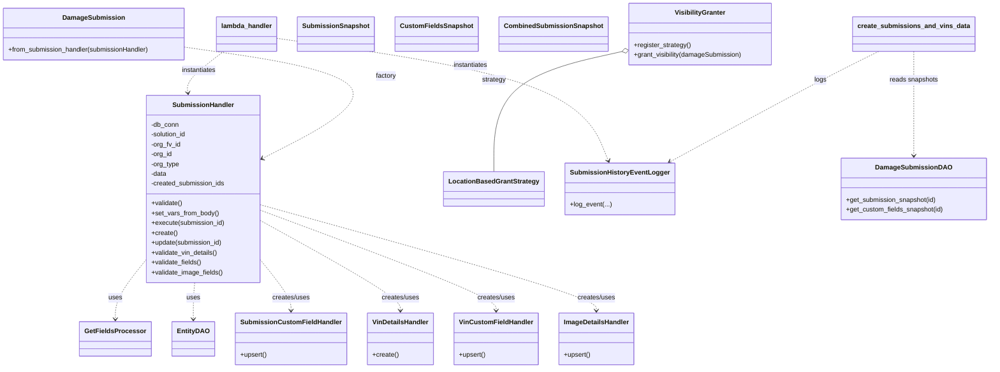

# Diagram: entity_core/entity_service/entity_service/damageview/submission/add_damage_submission.py


> Auto-generated by Obscura crawlers

## Diagram 1



### SVG

<svg id="container" width="2352.96875" xmlns="http://www.w3.org/2000/svg" class="classDiagram" height="896" viewBox="0 0 2352.96875 896" role="graphics-document document" aria-roledescription="class"><style>#container{font-family:"trebuchet ms",verdana,arial,sans-serif;font-size:16px;fill:#333;}@keyframes edge-animation-frame{from{stroke-dashoffset:0;}}@keyframes dash{to{stroke-dashoffset:0;}}#container .edge-animation-slow{stroke-dasharray:9,5!important;stroke-dashoffset:900;animation:dash 50s linear infinite;stroke-linecap:round;}#container .edge-animation-fast{stroke-dasharray:9,5!important;stroke-dashoffset:900;animation:dash 20s linear infinite;stroke-linecap:round;}#container .error-icon{fill:#552222;}#container .error-text{fill:#552222;stroke:#552222;}#container .edge-thickness-normal{stroke-width:1px;}#container .edge-thickness-thick{stroke-width:3.5px;}#container .edge-pattern-solid{stroke-dasharray:0;}#container .edge-thickness-invisible{stroke-width:0;fill:none;}#container .edge-pattern-dashed{stroke-dasharray:3;}#container .edge-pattern-dotted{stroke-dasharray:2;}#container .marker{fill:#333333;stroke:#333333;}#container .marker.cross{stroke:#333333;}#container svg{font-family:"trebuchet ms",verdana,arial,sans-serif;font-size:16px;}#container p{margin:0;}#container g.classGroup text{fill:#9370DB;stroke:none;font-family:"trebuchet ms",verdana,arial,sans-serif;font-size:10px;}#container g.classGroup text .title{font-weight:bolder;}#container .nodeLabel,#container .edgeLabel{color:#131300;}#container .edgeLabel .label rect{fill:#ECECFF;}#container .label text{fill:#131300;}#container .labelBkg{background:#ECECFF;}#container .edgeLabel .label span{background:#ECECFF;}#container .classTitle{font-weight:bolder;}#container .node rect,#container .node circle,#container .node ellipse,#container .node polygon,#container .node path{fill:#ECECFF;stroke:#9370DB;stroke-width:1px;}#container .divider{stroke:#9370DB;stroke-width:1;}#container g.clickable{cursor:pointer;}#container g.classGroup rect{fill:#ECECFF;stroke:#9370DB;}#container g.classGroup line{stroke:#9370DB;stroke-width:1;}#container .classLabel .box{stroke:none;stroke-width:0;fill:#ECECFF;opacity:0.5;}#container .classLabel .label{fill:#9370DB;font-size:10px;}#container .relation{stroke:#333333;stroke-width:1;fill:none;}#container .dashed-line{stroke-dasharray:3;}#container .dotted-line{stroke-dasharray:1 2;}#container #compositionStart,#container .composition{fill:#333333!important;stroke:#333333!important;stroke-width:1;}#container #compositionEnd,#container .composition{fill:#333333!important;stroke:#333333!important;stroke-width:1;}#container #dependencyStart,#container .dependency{fill:#333333!important;stroke:#333333!important;stroke-width:1;}#container #dependencyStart,#container .dependency{fill:#333333!important;stroke:#333333!important;stroke-width:1;}#container #extensionStart,#container .extension{fill:transparent!important;stroke:#333333!important;stroke-width:1;}#container #extensionEnd,#container .extension{fill:transparent!important;stroke:#333333!important;stroke-width:1;}#container #aggregationStart,#container .aggregation{fill:transparent!important;stroke:#333333!important;stroke-width:1;}#container #aggregationEnd,#container .aggregation{fill:transparent!important;stroke:#333333!important;stroke-width:1;}#container #lollipopStart,#container .lollipop{fill:#ECECFF!important;stroke:#333333!important;stroke-width:1;}#container #lollipopEnd,#container .lollipop{fill:#ECECFF!important;stroke:#333333!important;stroke-width:1;}#container .edgeTerminals{font-size:11px;line-height:initial;}#container .classTitleText{text-anchor:middle;font-size:18px;fill:#333;}#container .label-icon{display:inline-block;height:1em;overflow:visible;vertical-align:-0.125em;}#container .node .label-icon path{fill:currentColor;stroke:revert;stroke-width:revert;}#container :root{--mermaid-font-family:"trebuchet ms",verdana,arial,sans-serif;}</style><g><defs><marker id="container_class-aggregationStart" class="marker aggregation class" refX="18" refY="7" markerWidth="190" markerHeight="240" orient="auto"><path d="M 18,7 L9,13 L1,7 L9,1 Z"></path></marker></defs><defs><marker id="container_class-aggregationEnd" class="marker aggregation class" refX="1" refY="7" markerWidth="20" markerHeight="28" orient="auto"><path d="M 18,7 L9,13 L1,7 L9,1 Z"></path></marker></defs><defs><marker id="container_class-extensionStart" class="marker extension class" refX="18" refY="7" markerWidth="190" markerHeight="240" orient="auto"><path d="M 1,7 L18,13 V 1 Z"></path></marker></defs><defs><marker id="container_class-extensionEnd" class="marker extension class" refX="1" refY="7" markerWidth="20" markerHeight="28" orient="auto"><path d="M 1,1 V 13 L18,7 Z"></path></marker></defs><defs><marker id="container_class-compositionStart" class="marker composition class" refX="18" refY="7" markerWidth="190" markerHeight="240" orient="auto"><path d="M 18,7 L9,13 L1,7 L9,1 Z"></path></marker></defs><defs><marker id="container_class-compositionEnd" class="marker composition class" refX="1" refY="7" markerWidth="20" markerHeight="28" orient="auto"><path d="M 18,7 L9,13 L1,7 L9,1 Z"></path></marker></defs><defs><marker id="container_class-dependencyStart" class="marker dependency class" refX="6" refY="7" markerWidth="190" markerHeight="240" orient="auto"><path d="M 5,7 L9,13 L1,7 L9,1 Z"></path></marker></defs><defs><marker id="container_class-dependencyEnd" class="marker dependency class" refX="13" refY="7" markerWidth="20" markerHeight="28" orient="auto"><path d="M 18,7 L9,13 L14,7 L9,1 Z"></path></marker></defs><defs><marker id="container_class-lollipopStart" class="marker lollipop class" refX="13" refY="7" markerWidth="190" markerHeight="240" orient="auto"><circle stroke="black" fill="transparent" cx="7" cy="7" r="6"></circle></marker></defs><defs><marker id="container_class-lollipopEnd" class="marker lollipop class" refX="1" refY="7" markerWidth="190" markerHeight="240" orient="auto"><circle stroke="black" fill="transparent" cx="7" cy="7" r="6"></circle></marker></defs><g class="root"><g class="clusters"></g><g class="edgePaths"><path d="M355.246,640.223L344.393,654.353C333.54,668.482,311.835,696.741,300.982,719.537C290.129,742.333,290.129,759.667,290.129,768.333L290.129,777" id="id_SubmissionHandler_GetFieldsProcessor_1" class="edge-thickness-normal edge-pattern-dashed relation" style=";;;" data-edge="true" data-et="edge" data-id="id_SubmissionHandler_GetFieldsProcessor_1" data-points="W3sieCI6MzU1LjI0NjA5Mzc1LCJ5Ijo2NDAuMjIzMTkwMjk3MDc1Mn0seyJ4IjoyOTAuMTI4OTA2MjUsInkiOjcyNX0seyJ4IjoyOTAuMTI4OTA2MjUsInkiOjc4M31d" marker-end="url(#container_class-dependencyEnd)"></path><path d="M473.847,688L473.31,694.167C472.774,700.333,471.702,712.667,471.165,727.5C470.629,742.333,470.629,759.667,470.629,768.333L470.629,777" id="id_SubmissionHandler_EntityDAO_2" class="edge-thickness-normal edge-pattern-dashed relation" style=";;;" data-edge="true" data-et="edge" data-id="id_SubmissionHandler_EntityDAO_2" data-points="W3sieCI6NDczLjg0Njc3MTgxNjAzNzc0LCJ5Ijo2ODh9LHsieCI6NDcwLjYyODkwNjI1LCJ5Ijo3MjV9LHsieCI6NDcwLjYyODkwNjI1LCJ5Ijo3ODN9XQ==" marker-end="url(#container_class-dependencyEnd)"></path><path d="M632.105,640.223L642.958,654.353C653.811,668.482,675.517,696.741,686.37,716.037C697.223,735.333,697.223,745.667,697.223,750.833L697.223,756" id="id_SubmissionHandler_SubmissionCustomFieldHandler_3" class="edge-thickness-normal edge-pattern-dashed relation" style=";;;" data-edge="true" data-et="edge" data-id="id_SubmissionHandler_SubmissionCustomFieldHandler_3" data-points="W3sieCI6NjMyLjEwNTQ2ODc1LCJ5Ijo2NDAuMjIzMTkwMjk3MDc1Mn0seyJ4Ijo2OTcuMjIyNjU2MjUsInkiOjcyNX0seyJ4Ijo2OTcuMjIyNjU2MjUsInkiOjc2Mn1d" marker-end="url(#container_class-dependencyEnd)"></path><path d="M632.105,539.819L685.632,570.683C739.158,601.546,846.21,663.273,899.736,699.303C953.262,735.333,953.262,745.667,953.262,750.833L953.262,756" id="id_SubmissionHandler_VinDetailsHandler_4" class="edge-thickness-normal edge-pattern-dashed relation" style=";;;" data-edge="true" data-et="edge" data-id="id_SubmissionHandler_VinDetailsHandler_4" data-points="W3sieCI6NjMyLjEwNTQ2ODc1LCJ5Ijo1MzkuODE5Mzg1NjU2MjQ2M30seyJ4Ijo5NTMuMjYxNzE4NzUsInkiOjcyNX0seyJ4Ijo5NTMuMjYxNzE4NzUsInkiOjc2Mn1d" marker-end="url(#container_class-dependencyEnd)"></path><path d="M632.105,513.562L723.182,548.801C814.259,584.041,996.413,654.521,1087.49,694.927C1178.566,735.333,1178.566,745.667,1178.566,750.833L1178.566,756" id="id_SubmissionHandler_VinCustomFieldHandler_5" class="edge-thickness-normal edge-pattern-dashed relation" style=";;;" data-edge="true" data-et="edge" data-id="id_SubmissionHandler_VinCustomFieldHandler_5" data-points="W3sieCI6NjMyLjEwNTQ2ODc1LCJ5Ijo1MTMuNTYxNjQzMDU0MzE5OH0seyJ4IjoxMTc4LjU2NjQwNjI1LCJ5Ijo3MjV9LHsieCI6MTE3OC41NjY0MDYyNSwieSI6NzYyfV0=" marker-end="url(#container_class-dependencyEnd)"></path><path d="M632.105,499.839L762.503,537.365C892.9,574.892,1153.694,649.946,1284.091,692.64C1414.488,735.333,1414.488,745.667,1414.488,750.833L1414.488,756" id="id_SubmissionHandler_ImageDetailsHandler_6" class="edge-thickness-normal edge-pattern-dashed relation" style=";;;" data-edge="true" data-et="edge" data-id="id_SubmissionHandler_ImageDetailsHandler_6" data-points="W3sieCI6NjMyLjEwNTQ2ODc1LCJ5Ijo0OTkuODM4NTg1MTQ4OTg1MjZ9LHsieCI6MTQxNC40ODgyODEyNSwieSI6NzI1fSx7IngiOjE0MTQuNDg4MjgxMjUsInkiOjc2Mn1d" marker-end="url(#container_class-dependencyEnd)"></path><path d="M1474.544,127.071L1425.31,138.393C1376.075,149.714,1277.606,172.357,1228.371,220.845C1179.137,269.333,1179.137,343.667,1179.137,380.833L1179.137,418" id="id_VisibilityGranter_LocationBasedGrantStrategy_7" class="edge-thickness-normal edge-pattern-solid relation" style=";;;" data-edge="true" data-et="edge" data-id="id_VisibilityGranter_LocationBasedGrantStrategy_7" data-points="W3sieCI6MTQ5MS4zNTU0Njg3NSwieSI6MTIzLjIwNTMxMjQ1OTg5OTkxfSx7IngiOjExNzkuMTM2NzE4NzUsInkiOjE5NX0seyJ4IjoxMTc5LjEzNjcxODc1LCJ5Ijo0MTh9XQ==" marker-start="url(#container_class-aggregationStart)"></path><path d="M548.558,125L534.146,136.667C519.734,148.333,490.91,171.667,477.115,188.507C463.319,205.347,464.553,215.695,465.17,220.868L465.786,226.042" id="id_lambda_handler_SubmissionHandler_8" class="edge-thickness-normal edge-pattern-dashed relation" style=";;;" data-edge="true" data-et="edge" data-id="id_lambda_handler_SubmissionHandler_8" data-points="W3sieCI6NTQ4LjU1ODEwNTQ2ODc1LCJ5IjoxMjV9LHsieCI6NDYyLjA4NTkzNzUsInkiOjE5NX0seyJ4Ijo0NjYuNDk2NTk0OTI5MjQ1MywieSI6MjMyfV0=" marker-end="url(#container_class-dependencyEnd)"></path><path d="M672.418,93.458L788.895,110.382C905.372,127.305,1138.327,161.153,1267.182,210.808C1396.037,260.463,1420.793,325.925,1433.171,358.657L1445.549,391.388" id="id_lambda_handler_SubmissionHistoryEventLogger_9" class="edge-thickness-normal edge-pattern-dashed relation" style=";;;" data-edge="true" data-et="edge" data-id="id_lambda_handler_SubmissionHistoryEventLogger_9" data-points="W3sieCI6NjcyLjQxNzk2ODc1LCJ5Ijo5My40NTc5MTE2NzMwNDMzfSx7IngiOjEzNzEuMjgxMjUsInkiOjE5NX0seyJ4IjoxNDQ3LjY3MTQzMjc4MzAxODksInkiOjM5N31d" marker-end="url(#container_class-dependencyEnd)"></path><path d="M2170.398,125L2170.398,136.667C2170.398,148.333,2170.398,171.667,2170.398,214C2170.398,256.333,2170.398,317.667,2170.398,348.333L2170.398,379" id="id_create_submissions_and_vins_data_DamageSubmissionDAO_10" class="edge-thickness-normal edge-pattern-dashed relation" style=";;;" data-edge="true" data-et="edge" data-id="id_create_submissions_and_vins_data_DamageSubmissionDAO_10" data-points="W3sieCI6MjE3MC4zOTg0Mzc1LCJ5IjoxMjV9LHsieCI6MjE3MC4zOTg0Mzc1LCJ5IjoxOTV9LHsieCI6MjE3MC4zOTg0Mzc1LCJ5IjozODV9XQ==" marker-end="url(#container_class-dependencyEnd)"></path><path d="M2087.075,125L2063.93,136.667C2040.785,148.333,1994.494,171.667,1911.66,216.514C1828.826,261.362,1709.448,327.723,1649.759,360.904L1590.071,394.085" id="id_create_submissions_and_vins_data_SubmissionHistoryEventLogger_11" class="edge-thickness-normal edge-pattern-dashed relation" style=";;;" data-edge="true" data-et="edge" data-id="id_create_submissions_and_vins_data_SubmissionHistoryEventLogger_11" data-points="W3sieCI6MjA4Ny4wNzUxOTUzMTI1LCJ5IjoxMjV9LHsieCI6MTk0OC4yMDMxMjUsInkiOjE5NX0seyJ4IjoxNTg0LjgyNjQ0NDU3NTQ3MTcsInkiOjM5N31d" marker-end="url(#container_class-dependencyEnd)"></path><path d="M451.875,115.727L541.475,128.939C631.074,142.151,810.273,168.576,841.194,213.151C872.114,257.727,754.756,320.455,696.076,351.818L637.397,383.182" id="id_DamageSubmission_SubmissionHandler_12" class="edge-thickness-normal edge-pattern-dashed relation" style=";;;" data-edge="true" data-et="edge" data-id="id_DamageSubmission_SubmissionHandler_12" data-points="W3sieCI6NDUxLjg3NSwieSI6MTE1LjcyNjU5NTcyODI2NzE4fSx7IngiOjk4OS40NzI2NTYyNSwieSI6MTk1fSx7IngiOjYzMi4xMDU0Njg3NSwieSI6Mzg2LjAxMDI4OTYyMjEzNjF9XQ==" marker-end="url(#container_class-dependencyEnd)"></path></g><g class="edgeLabels"><g class="edgeLabel" transform="translate(290.12890625, 725)"><g class="label" data-id="id_SubmissionHandler_GetFieldsProcessor_1" transform="translate(-16.4921875, -12)"><foreignObject width="32.984375" height="24"><div xmlns="http://www.w3.org/1999/xhtml" class="labelBkg" style="display: table-cell; white-space: nowrap; line-height: 1.5; max-width: 200px; text-align: center;"><span class="edgeLabel"><p>uses</p></span></div></foreignObject></g></g><g class="edgeLabel" transform="translate(470.62890625, 725)"><g class="label" data-id="id_SubmissionHandler_EntityDAO_2" transform="translate(-16.4921875, -12)"><foreignObject width="32.984375" height="24"><div xmlns="http://www.w3.org/1999/xhtml" class="labelBkg" style="display: table-cell; white-space: nowrap; line-height: 1.5; max-width: 200px; text-align: center;"><span class="edgeLabel"><p>uses</p></span></div></foreignObject></g></g><g class="edgeLabel" transform="translate(697.22265625, 725)"><g class="label" data-id="id_SubmissionHandler_SubmissionCustomFieldHandler_3" transform="translate(-46.578125, -12)"><foreignObject width="93.15625" height="24"><div xmlns="http://www.w3.org/1999/xhtml" class="labelBkg" style="display: table-cell; white-space: nowrap; line-height: 1.5; max-width: 200px; text-align: center;"><span class="edgeLabel"><p>creates/uses</p></span></div></foreignObject></g></g><g class="edgeLabel" transform="translate(953.26171875, 725)"><g class="label" data-id="id_SubmissionHandler_VinDetailsHandler_4" transform="translate(-46.578125, -12)"><foreignObject width="93.15625" height="24"><div xmlns="http://www.w3.org/1999/xhtml" class="labelBkg" style="display: table-cell; white-space: nowrap; line-height: 1.5; max-width: 200px; text-align: center;"><span class="edgeLabel"><p>creates/uses</p></span></div></foreignObject></g></g><g class="edgeLabel" transform="translate(1178.56640625, 725)"><g class="label" data-id="id_SubmissionHandler_VinCustomFieldHandler_5" transform="translate(-46.578125, -12)"><foreignObject width="93.15625" height="24"><div xmlns="http://www.w3.org/1999/xhtml" class="labelBkg" style="display: table-cell; white-space: nowrap; line-height: 1.5; max-width: 200px; text-align: center;"><span class="edgeLabel"><p>creates/uses</p></span></div></foreignObject></g></g><g class="edgeLabel" transform="translate(1414.48828125, 725)"><g class="label" data-id="id_SubmissionHandler_ImageDetailsHandler_6" transform="translate(-46.578125, -12)"><foreignObject width="93.15625" height="24"><div xmlns="http://www.w3.org/1999/xhtml" class="labelBkg" style="display: table-cell; white-space: nowrap; line-height: 1.5; max-width: 200px; text-align: center;"><span class="edgeLabel"><p>creates/uses</p></span></div></foreignObject></g></g><g class="edgeLabel" transform="translate(1179.13671875, 195)"><g class="label" data-id="id_VisibilityGranter_LocationBasedGrantStrategy_7" transform="translate(-29.015625, -12)"><foreignObject width="58.03125" height="24"><div xmlns="http://www.w3.org/1999/xhtml" class="labelBkg" style="display: table-cell; white-space: nowrap; line-height: 1.5; max-width: 200px; text-align: center;"><span class="edgeLabel"><p>strategy</p></span></div></foreignObject></g></g><g class="edgeLabel" transform="translate(490.84108, 171.72245)"><g class="label" data-id="id_lambda_handler_SubmissionHandler_8" transform="translate(-42.9140625, -12)"><foreignObject width="85.828125" height="24"><div xmlns="http://www.w3.org/1999/xhtml" class="labelBkg" style="display: table-cell; white-space: nowrap; line-height: 1.5; max-width: 200px; text-align: center;"><span class="edgeLabel"><p>instantiates</p></span></div></foreignObject></g></g><g class="edgeLabel" transform="translate(1128.70841, 159.75512)"><g class="label" data-id="id_lambda_handler_SubmissionHistoryEventLogger_9" transform="translate(-42.9140625, -12)"><foreignObject width="85.828125" height="24"><div xmlns="http://www.w3.org/1999/xhtml" class="labelBkg" style="display: table-cell; white-space: nowrap; line-height: 1.5; max-width: 200px; text-align: center;"><span class="edgeLabel"><p>instantiates</p></span></div></foreignObject></g></g><g class="edgeLabel" transform="translate(2170.3984375, 195)"><g class="label" data-id="id_create_submissions_and_vins_data_DamageSubmissionDAO_10" transform="translate(-59.375, -12)"><foreignObject width="118.75" height="24"><div xmlns="http://www.w3.org/1999/xhtml" class="labelBkg" style="display: table-cell; white-space: nowrap; line-height: 1.5; max-width: 200px; text-align: center;"><span class="edgeLabel"><p>reads snapshots</p></span></div></foreignObject></g></g><g class="edgeLabel" transform="translate(1834.47797, 258.21947)"><g class="label" data-id="id_create_submissions_and_vins_data_SubmissionHistoryEventLogger_11" transform="translate(-14.8203125, -12)"><foreignObject width="29.640625" height="24"><div xmlns="http://www.w3.org/1999/xhtml" class="labelBkg" style="display: table-cell; white-space: nowrap; line-height: 1.5; max-width: 200px; text-align: center;"><span class="edgeLabel"><p>logs</p></span></div></foreignObject></g></g><g class="edgeLabel" transform="translate(921.11205, 184.91964)"><g class="label" data-id="id_DamageSubmission_SubmissionHandler_12" transform="translate(-25.1484375, -12)"><foreignObject width="50.296875" height="24"><div xmlns="http://www.w3.org/1999/xhtml" class="labelBkg" style="display: table-cell; white-space: nowrap; line-height: 1.5; max-width: 200px; text-align: center;"><span class="edgeLabel"><p>factory</p></span></div></foreignObject></g></g></g><g class="nodes"><g class="node default" id="classId-SubmissionHandler-0" transform="translate(493.67578125, 460)"><g class="basic label-container"><path d="M-138.4296875 -228 L138.4296875 -228 L138.4296875 228 L-138.4296875 228" stroke="none" stroke-width="0" fill="#ECECFF" style=""></path><path d="M-138.4296875 -228 C-48.43632214231707 -228, 41.557043215365866 -228, 138.4296875 -228 M-138.4296875 -228 C-54.832057542305336 -228, 28.76557241538933 -228, 138.4296875 -228 M138.4296875 -228 C138.4296875 -121.82916380281878, 138.4296875 -15.658327605637567, 138.4296875 228 M138.4296875 -228 C138.4296875 -46.862024981773885, 138.4296875 134.27595003645223, 138.4296875 228 M138.4296875 228 C32.47604334192532 228, -73.47760081614936 228, -138.4296875 228 M138.4296875 228 C79.91421164091975 228, 21.39873578183949 228, -138.4296875 228 M-138.4296875 228 C-138.4296875 119.72396775078003, -138.4296875 11.447935501560067, -138.4296875 -228 M-138.4296875 228 C-138.4296875 77.41877848053178, -138.4296875 -73.16244303893643, -138.4296875 -228" stroke="#9370DB" stroke-width="1.3" fill="none" stroke-dasharray="0 0" style=""></path></g><g class="annotation-group text" transform="translate(0, -204)"></g><g class="label-group text" transform="translate(-71.25, -204)"><g class="label" style="font-weight: bolder" transform="translate(0,-12)"><foreignObject width="142.5" height="24"><div xmlns="http://www.w3.org/1999/xhtml" style="display: table-cell; white-space: nowrap; line-height: 1.5; max-width: 193px; text-align: center;"><span class="nodeLabel markdown-node-label" style=""><p>SubmissionHandler</p></span></div></foreignObject></g></g><g class="members-group text" transform="translate(-126.4296875, -156)"><g class="label" style="" transform="translate(0,-12)"><foreignObject width="68.625" height="24"><div xmlns="http://www.w3.org/1999/xhtml" style="display: table-cell; white-space: nowrap; line-height: 1.5; max-width: 126px; text-align: center;"><span class="nodeLabel markdown-node-label" style=""><p>-db_conn</p></span></div></foreignObject></g><g class="label" style="" transform="translate(0,12)"><foreignObject width="88.6875" height="24"><div xmlns="http://www.w3.org/1999/xhtml" style="display: table-cell; white-space: nowrap; line-height: 1.5; max-width: 146px; text-align: center;"><span class="nodeLabel markdown-node-label" style=""><p>-solution_id</p></span></div></foreignObject></g><g class="label" style="" transform="translate(0,36)"><foreignObject width="73.265625" height="24"><div xmlns="http://www.w3.org/1999/xhtml" style="display: table-cell; white-space: nowrap; line-height: 1.5; max-width: 131px; text-align: center;"><span class="nodeLabel markdown-node-label" style=""><p>-org_fv_id</p></span></div></foreignObject></g><g class="label" style="" transform="translate(0,60)"><foreignObject width="52.515625" height="24"><div xmlns="http://www.w3.org/1999/xhtml" style="display: table-cell; white-space: nowrap; line-height: 1.5; max-width: 110px; text-align: center;"><span class="nodeLabel markdown-node-label" style=""><p>-org_id</p></span></div></foreignObject></g><g class="label" style="" transform="translate(0,84)"><foreignObject width="69.90625" height="24"><div xmlns="http://www.w3.org/1999/xhtml" style="display: table-cell; white-space: nowrap; line-height: 1.5; max-width: 127px; text-align: center;"><span class="nodeLabel markdown-node-label" style=""><p>-org_type</p></span></div></foreignObject></g><g class="label" style="" transform="translate(0,108)"><foreignObject width="39.09375" height="24"><div xmlns="http://www.w3.org/1999/xhtml" style="display: table-cell; white-space: nowrap; line-height: 1.5; max-width: 96px; text-align: center;"><span class="nodeLabel markdown-node-label" style=""><p>-data</p></span></div></foreignObject></g><g class="label" style="" transform="translate(0,132)"><foreignObject width="181.609375" height="24"><div xmlns="http://www.w3.org/1999/xhtml" style="display: table-cell; white-space: nowrap; line-height: 1.5; max-width: 239px; text-align: center;"><span class="nodeLabel markdown-node-label" style=""><p>-created_submission_ids</p></span></div></foreignObject></g></g><g class="methods-group text" transform="translate(-126.4296875, 36)"><g class="label" style="" transform="translate(0,-12)"><foreignObject width="76.09375" height="24"><div xmlns="http://www.w3.org/1999/xhtml" style="display: table-cell; white-space: nowrap; line-height: 1.5; max-width: 133px; text-align: center;"><span class="nodeLabel markdown-node-label" style=""><p>+validate()</p></span></div></foreignObject></g><g class="label" style="" transform="translate(0,12)"><foreignObject width="164.296875" height="24"><div xmlns="http://www.w3.org/1999/xhtml" style="display: table-cell; white-space: nowrap; line-height: 1.5; max-width: 222px; text-align: center;"><span class="nodeLabel markdown-node-label" style=""><p>+set_vars_from_body()</p></span></div></foreignObject></g><g class="label" style="" transform="translate(0,36)"><foreignObject width="179.25" height="24"><div xmlns="http://www.w3.org/1999/xhtml" style="display: table-cell; white-space: nowrap; line-height: 1.5; max-width: 237px; text-align: center;"><span class="nodeLabel markdown-node-label" style=""><p>+execute(submission_id)</p></span></div></foreignObject></g><g class="label" style="" transform="translate(0,60)"><foreignObject width="63.21875" height="24"><div xmlns="http://www.w3.org/1999/xhtml" style="display: table-cell; white-space: nowrap; line-height: 1.5; max-width: 121px; text-align: center;"><span class="nodeLabel markdown-node-label" style=""><p>+create()</p></span></div></foreignObject></g><g class="label" style="" transform="translate(0,84)"><foreignObject width="174.625" height="24"><div xmlns="http://www.w3.org/1999/xhtml" style="display: table-cell; white-space: nowrap; line-height: 1.5; max-width: 232px; text-align: center;"><span class="nodeLabel markdown-node-label" style=""><p>+update(submission_id)</p></span></div></foreignObject></g><g class="label" style="" transform="translate(0,108)"><foreignObject width="162.703125" height="24"><div xmlns="http://www.w3.org/1999/xhtml" style="display: table-cell; white-space: nowrap; line-height: 1.5; max-width: 220px; text-align: center;"><span class="nodeLabel markdown-node-label" style=""><p>+validate_vin_details()</p></span></div></foreignObject></g><g class="label" style="" transform="translate(0,132)"><foreignObject width="123.34375" height="24"><div xmlns="http://www.w3.org/1999/xhtml" style="display: table-cell; white-space: nowrap; line-height: 1.5; max-width: 181px; text-align: center;"><span class="nodeLabel markdown-node-label" style=""><p>+validate_fields()</p></span></div></foreignObject></g><g class="label" style="" transform="translate(0,156)"><foreignObject width="174.890625" height="24"><div xmlns="http://www.w3.org/1999/xhtml" style="display: table-cell; white-space: nowrap; line-height: 1.5; max-width: 232px; text-align: center;"><span class="nodeLabel markdown-node-label" style=""><p>+validate_image_fields()</p></span></div></foreignObject></g></g><g class="divider" style=""><path d="M-138.4296875 -180 C-72.84441179721051 -180, -7.259136094421024 -180, 138.4296875 -180 M-138.4296875 -180 C-73.09846790443314 -180, -7.767248308866272 -180, 138.4296875 -180" stroke="#9370DB" stroke-width="1.3" fill="none" stroke-dasharray="0 0" style=""></path></g><g class="divider" style=""><path d="M-138.4296875 12 C-37.74367305113512 12, 62.94234139772976 12, 138.4296875 12 M-138.4296875 12 C-70.72518204424115 12, -3.020676588482303 12, 138.4296875 12" stroke="#9370DB" stroke-width="1.3" fill="none" stroke-dasharray="0 0" style=""></path></g></g><g class="node default" id="classId-GetFieldsProcessor-1" transform="translate(290.12890625, 825)"><g class="basic label-container"><path d="M-81.921875 -42 L81.921875 -42 L81.921875 42 L-81.921875 42" stroke="none" stroke-width="0" fill="#ECECFF" style=""></path><path d="M-81.921875 -42 C-17.46413752144892 -42, 46.99359995710216 -42, 81.921875 -42 M-81.921875 -42 C-19.445498501795136 -42, 43.03087799640973 -42, 81.921875 -42 M81.921875 -42 C81.921875 -12.908871462130524, 81.921875 16.182257075738953, 81.921875 42 M81.921875 -42 C81.921875 -10.042715207920924, 81.921875 21.91456958415815, 81.921875 42 M81.921875 42 C43.12319809022235 42, 4.324521180444705 42, -81.921875 42 M81.921875 42 C46.652228206015735 42, 11.38258141203147 42, -81.921875 42 M-81.921875 42 C-81.921875 19.405220893011702, -81.921875 -3.1895582139765963, -81.921875 -42 M-81.921875 42 C-81.921875 20.780350481971734, -81.921875 -0.4392990360565321, -81.921875 -42" stroke="#9370DB" stroke-width="1.3" fill="none" stroke-dasharray="0 0" style=""></path></g><g class="annotation-group text" transform="translate(0, -18)"></g><g class="label-group text" transform="translate(-69.921875, -18)"><g class="label" style="font-weight: bolder" transform="translate(0,-12)"><foreignObject width="139.84375" height="24"><div xmlns="http://www.w3.org/1999/xhtml" style="display: table-cell; white-space: nowrap; line-height: 1.5; max-width: 188px; text-align: center;"><span class="nodeLabel markdown-node-label" style=""><p>GetFieldsProcessor</p></span></div></foreignObject></g></g><g class="members-group text" transform="translate(-69.921875, 30)"></g><g class="methods-group text" transform="translate(-69.921875, 60)"></g><g class="divider" style=""><path d="M-81.921875 6 C-25.29183607148311 6, 31.338202857033778 6, 81.921875 6 M-81.921875 6 C-48.916756525300336 6, -15.911638050600672 6, 81.921875 6" stroke="#9370DB" stroke-width="1.3" fill="none" stroke-dasharray="0 0" style=""></path></g><g class="divider" style=""><path d="M-81.921875 24 C-43.17481705304124 24, -4.427759106082476 24, 81.921875 24 M-81.921875 24 C-32.237465725018 24, 17.446943549964004 24, 81.921875 24" stroke="#9370DB" stroke-width="1.3" fill="none" stroke-dasharray="0 0" style=""></path></g></g><g class="node default" id="classId-EntityDAO-2" transform="translate(470.62890625, 825)"><g class="basic label-container"><path d="M-48.578125 -42 L48.578125 -42 L48.578125 42 L-48.578125 42" stroke="none" stroke-width="0" fill="#ECECFF" style=""></path><path d="M-48.578125 -42 C-16.547354814788605 -42, 15.48341537042279 -42, 48.578125 -42 M-48.578125 -42 C-26.289276846429754 -42, -4.000428692859508 -42, 48.578125 -42 M48.578125 -42 C48.578125 -19.773467067801835, 48.578125 2.4530658643963292, 48.578125 42 M48.578125 -42 C48.578125 -15.718541634190299, 48.578125 10.562916731619403, 48.578125 42 M48.578125 42 C18.35710502511599 42, -11.863914949768017 42, -48.578125 42 M48.578125 42 C9.828543180043987 42, -28.921038639912027 42, -48.578125 42 M-48.578125 42 C-48.578125 12.998154816900527, -48.578125 -16.003690366198946, -48.578125 -42 M-48.578125 42 C-48.578125 23.193392664649092, -48.578125 4.386785329298185, -48.578125 -42" stroke="#9370DB" stroke-width="1.3" fill="none" stroke-dasharray="0 0" style=""></path></g><g class="annotation-group text" transform="translate(0, -18)"></g><g class="label-group text" transform="translate(-36.578125, -18)"><g class="label" style="font-weight: bolder" transform="translate(0,-12)"><foreignObject width="73.15625" height="24"><div xmlns="http://www.w3.org/1999/xhtml" style="display: table-cell; white-space: nowrap; line-height: 1.5; max-width: 122px; text-align: center;"><span class="nodeLabel markdown-node-label" style=""><p>EntityDAO</p></span></div></foreignObject></g></g><g class="members-group text" transform="translate(-36.578125, 30)"></g><g class="methods-group text" transform="translate(-36.578125, 60)"></g><g class="divider" style=""><path d="M-48.578125 6 C-25.481175908327433 6, -2.3842268166548664 6, 48.578125 6 M-48.578125 6 C-10.322343067420498 6, 27.933438865159005 6, 48.578125 6" stroke="#9370DB" stroke-width="1.3" fill="none" stroke-dasharray="0 0" style=""></path></g><g class="divider" style=""><path d="M-48.578125 24 C-20.87209959297388 24, 6.833925814052243 24, 48.578125 24 M-48.578125 24 C-13.050214849745501 24, 22.477695300508998 24, 48.578125 24" stroke="#9370DB" stroke-width="1.3" fill="none" stroke-dasharray="0 0" style=""></path></g></g><g class="node default" id="classId-VisibilityGranter-3" transform="translate(1666.19921875, 83)"><g class="basic label-container"><path d="M-174.84375 -75 L174.84375 -75 L174.84375 75 L-174.84375 75" stroke="none" stroke-width="0" fill="#ECECFF" style=""></path><path d="M-174.84375 -75 C-62.467657961182 -75, 49.908434077636 -75, 174.84375 -75 M-174.84375 -75 C-94.21827123840443 -75, -13.592792476808853 -75, 174.84375 -75 M174.84375 -75 C174.84375 -20.92607208838907, 174.84375 33.14785582322186, 174.84375 75 M174.84375 -75 C174.84375 -19.368057274191926, 174.84375 36.26388545161615, 174.84375 75 M174.84375 75 C70.53605926329652 75, -33.771631473406956 75, -174.84375 75 M174.84375 75 C101.46840029059926 75, 28.093050581198526 75, -174.84375 75 M-174.84375 75 C-174.84375 28.44390128619135, -174.84375 -18.112197427617303, -174.84375 -75 M-174.84375 75 C-174.84375 25.801423135376368, -174.84375 -23.397153729247265, -174.84375 -75" stroke="#9370DB" stroke-width="1.3" fill="none" stroke-dasharray="0 0" style=""></path></g><g class="annotation-group text" transform="translate(0, -51)"></g><g class="label-group text" transform="translate(-59.453125, -51)"><g class="label" style="font-weight: bolder" transform="translate(0,-12)"><foreignObject width="118.90625" height="24"><div xmlns="http://www.w3.org/1999/xhtml" style="display: table-cell; white-space: nowrap; line-height: 1.5; max-width: 167px; text-align: center;"><span class="nodeLabel markdown-node-label" style=""><p>VisibilityGranter</p></span></div></foreignObject></g></g><g class="members-group text" transform="translate(-162.84375, -3)"></g><g class="methods-group text" transform="translate(-162.84375, 27)"><g class="label" style="" transform="translate(0,-12)"><foreignObject width="138.5625" height="24"><div xmlns="http://www.w3.org/1999/xhtml" style="display: table-cell; white-space: nowrap; line-height: 1.5; max-width: 196px; text-align: center;"><span class="nodeLabel markdown-node-label" style=""><p>+register_strategy()</p></span></div></foreignObject></g><g class="label" style="" transform="translate(0,12)"><foreignObject width="266.234375" height="24"><div xmlns="http://www.w3.org/1999/xhtml" style="display: table-cell; white-space: nowrap; line-height: 1.5; max-width: 324px; text-align: center;"><span class="nodeLabel markdown-node-label" style=""><p>+grant_visibility(damageSubmission)</p></span></div></foreignObject></g></g><g class="divider" style=""><path d="M-174.84375 -27 C-68.55112209331122 -27, 37.74150581337756 -27, 174.84375 -27 M-174.84375 -27 C-92.59086191668871 -27, -10.337973833377418 -27, 174.84375 -27" stroke="#9370DB" stroke-width="1.3" fill="none" stroke-dasharray="0 0" style=""></path></g><g class="divider" style=""><path d="M-174.84375 -3 C-69.65071069778561 -3, 35.542328604428775 -3, 174.84375 -3 M-174.84375 -3 C-54.716393828418234 -3, 65.41096234316353 -3, 174.84375 -3" stroke="#9370DB" stroke-width="1.3" fill="none" stroke-dasharray="0 0" style=""></path></g></g><g class="node default" id="classId-LocationBasedGrantStrategy-4" transform="translate(1179.13671875, 460)"><g class="basic label-container"><path d="M-116.734375 -42 L116.734375 -42 L116.734375 42 L-116.734375 42" stroke="none" stroke-width="0" fill="#ECECFF" style=""></path><path d="M-116.734375 -42 C-37.60773810874643 -42, 41.51889878250714 -42, 116.734375 -42 M-116.734375 -42 C-26.842076414392338 -42, 63.050222171215324 -42, 116.734375 -42 M116.734375 -42 C116.734375 -14.7090117666622, 116.734375 12.581976466675599, 116.734375 42 M116.734375 -42 C116.734375 -18.147325677814933, 116.734375 5.705348644370133, 116.734375 42 M116.734375 42 C32.208635054915334 42, -52.31710489016933 42, -116.734375 42 M116.734375 42 C48.02157106611838 42, -20.691232867763233 42, -116.734375 42 M-116.734375 42 C-116.734375 17.10676309304678, -116.734375 -7.78647381390644, -116.734375 -42 M-116.734375 42 C-116.734375 12.810243287312556, -116.734375 -16.37951342537489, -116.734375 -42" stroke="#9370DB" stroke-width="1.3" fill="none" stroke-dasharray="0 0" style=""></path></g><g class="annotation-group text" transform="translate(0, -18)"></g><g class="label-group text" transform="translate(-104.734375, -18)"><g class="label" style="font-weight: bolder" transform="translate(0,-12)"><foreignObject width="209.46875" height="24"><div xmlns="http://www.w3.org/1999/xhtml" style="display: table-cell; white-space: nowrap; line-height: 1.5; max-width: 255px; text-align: center;"><span class="nodeLabel markdown-node-label" style=""><p>LocationBasedGrantStrategy</p></span></div></foreignObject></g></g><g class="members-group text" transform="translate(-104.734375, 30)"></g><g class="methods-group text" transform="translate(-104.734375, 60)"></g><g class="divider" style=""><path d="M-116.734375 6 C-38.03998921013782 6, 40.65439657972436 6, 116.734375 6 M-116.734375 6 C-41.451142833702804 6, 33.83208933259439 6, 116.734375 6" stroke="#9370DB" stroke-width="1.3" fill="none" stroke-dasharray="0 0" style=""></path></g><g class="divider" style=""><path d="M-116.734375 24 C-37.693195923024504 24, 41.34798315395099 24, 116.734375 24 M-116.734375 24 C-62.17062508668312 24, -7.606875173366234 24, 116.734375 24" stroke="#9370DB" stroke-width="1.3" fill="none" stroke-dasharray="0 0" style=""></path></g></g><g class="node default" id="classId-DamageSubmission-5" transform="translate(229.9375, 83)"><g class="basic label-container"><path d="M-221.9375 -63 L221.9375 -63 L221.9375 63 L-221.9375 63" stroke="none" stroke-width="0" fill="#ECECFF" style=""></path><path d="M-221.9375 -63 C-79.88680596943612 -63, 62.16388806112775 -63, 221.9375 -63 M-221.9375 -63 C-83.10816212929171 -63, 55.72117574141657 -63, 221.9375 -63 M221.9375 -63 C221.9375 -13.76047931460802, 221.9375 35.47904137078396, 221.9375 63 M221.9375 -63 C221.9375 -31.358281280357712, 221.9375 0.283437439284576, 221.9375 63 M221.9375 63 C70.37267177225218 63, -81.19215645549565 63, -221.9375 63 M221.9375 63 C49.53471448146681 63, -122.86807103706639 63, -221.9375 63 M-221.9375 63 C-221.9375 12.771911734111711, -221.9375 -37.45617653177658, -221.9375 -63 M-221.9375 63 C-221.9375 26.429020677420453, -221.9375 -10.141958645159093, -221.9375 -63" stroke="#9370DB" stroke-width="1.3" fill="none" stroke-dasharray="0 0" style=""></path></g><g class="annotation-group text" transform="translate(0, -39)"></g><g class="label-group text" transform="translate(-71.390625, -39)"><g class="label" style="font-weight: bolder" transform="translate(0,-12)"><foreignObject width="142.78125" height="24"><div xmlns="http://www.w3.org/1999/xhtml" style="display: table-cell; white-space: nowrap; line-height: 1.5; max-width: 192px; text-align: center;"><span class="nodeLabel markdown-node-label" style=""><p>DamageSubmission</p></span></div></foreignObject></g></g><g class="members-group text" transform="translate(-209.9375, 9)"></g><g class="methods-group text" transform="translate(-209.9375, 39)"><g class="label" style="" transform="translate(0,-12)"><foreignObject width="348.484375" height="24"><div xmlns="http://www.w3.org/1999/xhtml" style="display: table-cell; white-space: nowrap; line-height: 1.5; max-width: 406px; text-align: center;"><span class="nodeLabel markdown-node-label" style=""><p>+from_submission_handler(submissionHandler)</p></span></div></foreignObject></g></g><g class="divider" style=""><path d="M-221.9375 -15 C-127.30644425253631 -15, -32.67538850507262 -15, 221.9375 -15 M-221.9375 -15 C-60.09147750591805 -15, 101.7545449881639 -15, 221.9375 -15" stroke="#9370DB" stroke-width="1.3" fill="none" stroke-dasharray="0 0" style=""></path></g><g class="divider" style=""><path d="M-221.9375 9 C-77.6685062000428 9, 66.6004875999144 9, 221.9375 9 M-221.9375 9 C-53.18925850311959 9, 115.55898299376082 9, 221.9375 9" stroke="#9370DB" stroke-width="1.3" fill="none" stroke-dasharray="0 0" style=""></path></g></g><g class="node default" id="classId-SubmissionHistoryEventLogger-6" transform="translate(1471.49609375, 460)"><g class="basic label-container"><path d="M-125.625 -63 L125.625 -63 L125.625 63 L-125.625 63" stroke="none" stroke-width="0" fill="#ECECFF" style=""></path><path d="M-125.625 -63 C-34.792004166809136 -63, 56.04099166638173 -63, 125.625 -63 M-125.625 -63 C-35.553078146673485 -63, 54.51884370665303 -63, 125.625 -63 M125.625 -63 C125.625 -35.34716465552637, 125.625 -7.6943293110527335, 125.625 63 M125.625 -63 C125.625 -30.34769379556039, 125.625 2.3046124088792226, 125.625 63 M125.625 63 C34.41544796012721 63, -56.79410407974558 63, -125.625 63 M125.625 63 C39.45613873633374 63, -46.71272252733252 63, -125.625 63 M-125.625 63 C-125.625 21.417588637633592, -125.625 -20.164822724732815, -125.625 -63 M-125.625 63 C-125.625 30.74522475709731, -125.625 -1.5095504858053772, -125.625 -63" stroke="#9370DB" stroke-width="1.3" fill="none" stroke-dasharray="0 0" style=""></path></g><g class="annotation-group text" transform="translate(0, -39)"></g><g class="label-group text" transform="translate(-113.625, -39)"><g class="label" style="font-weight: bolder" transform="translate(0,-12)"><foreignObject width="227.25" height="24"><div xmlns="http://www.w3.org/1999/xhtml" style="display: table-cell; white-space: nowrap; line-height: 1.5; max-width: 275px; text-align: center;"><span class="nodeLabel markdown-node-label" style=""><p>SubmissionHistoryEventLogger</p></span></div></foreignObject></g></g><g class="members-group text" transform="translate(-113.625, 9)"></g><g class="methods-group text" transform="translate(-113.625, 39)"><g class="label" style="" transform="translate(0,-12)"><foreignObject width="100.546875" height="24"><div xmlns="http://www.w3.org/1999/xhtml" style="display: table-cell; white-space: nowrap; line-height: 1.5; max-width: 158px; text-align: center;"><span class="nodeLabel markdown-node-label" style=""><p>+log_event(...)</p></span></div></foreignObject></g></g><g class="divider" style=""><path d="M-125.625 -15 C-73.84236949753996 -15, -22.059738995079925 -15, 125.625 -15 M-125.625 -15 C-49.14993339865336 -15, 27.32513320269328 -15, 125.625 -15" stroke="#9370DB" stroke-width="1.3" fill="none" stroke-dasharray="0 0" style=""></path></g><g class="divider" style=""><path d="M-125.625 9 C-35.74094176983475 9, 54.1431164603305 9, 125.625 9 M-125.625 9 C-48.247959036099815 9, 29.12908192780037 9, 125.625 9" stroke="#9370DB" stroke-width="1.3" fill="none" stroke-dasharray="0 0" style=""></path></g></g><g class="node default" id="classId-SubmissionSnapshot-7" transform="translate(811.17578125, 83)"><g class="basic label-container"><path d="M-88.7578125 -42 L88.7578125 -42 L88.7578125 42 L-88.7578125 42" stroke="none" stroke-width="0" fill="#ECECFF" style=""></path><path d="M-88.7578125 -42 C-52.748351936595895 -42, -16.73889137319179 -42, 88.7578125 -42 M-88.7578125 -42 C-43.51806255119697 -42, 1.7216873976060612 -42, 88.7578125 -42 M88.7578125 -42 C88.7578125 -16.3083305933867, 88.7578125 9.383338813226601, 88.7578125 42 M88.7578125 -42 C88.7578125 -20.78372995903855, 88.7578125 0.4325400819229017, 88.7578125 42 M88.7578125 42 C18.323994256261756 42, -52.10982398747649 42, -88.7578125 42 M88.7578125 42 C51.68810658143274 42, 14.618400662865483 42, -88.7578125 42 M-88.7578125 42 C-88.7578125 19.61925072574239, -88.7578125 -2.7614985485152204, -88.7578125 -42 M-88.7578125 42 C-88.7578125 19.319872750042816, -88.7578125 -3.360254499914369, -88.7578125 -42" stroke="#9370DB" stroke-width="1.3" fill="none" stroke-dasharray="0 0" style=""></path></g><g class="annotation-group text" transform="translate(0, -18)"></g><g class="label-group text" transform="translate(-76.7578125, -18)"><g class="label" style="font-weight: bolder" transform="translate(0,-12)"><foreignObject width="153.515625" height="24"><div xmlns="http://www.w3.org/1999/xhtml" style="display: table-cell; white-space: nowrap; line-height: 1.5; max-width: 202px; text-align: center;"><span class="nodeLabel markdown-node-label" style=""><p>SubmissionSnapshot</p></span></div></foreignObject></g></g><g class="members-group text" transform="translate(-76.7578125, 30)"></g><g class="methods-group text" transform="translate(-76.7578125, 60)"></g><g class="divider" style=""><path d="M-88.7578125 6 C-22.479636232927874 6, 43.79854003414425 6, 88.7578125 6 M-88.7578125 6 C-42.500472870708755 6, 3.7568667585824898 6, 88.7578125 6" stroke="#9370DB" stroke-width="1.3" fill="none" stroke-dasharray="0 0" style=""></path></g><g class="divider" style=""><path d="M-88.7578125 24 C-43.01633620650475 24, 2.725140086990507 24, 88.7578125 24 M-88.7578125 24 C-23.660012234085713 24, 41.437788031828575 24, 88.7578125 24" stroke="#9370DB" stroke-width="1.3" fill="none" stroke-dasharray="0 0" style=""></path></g></g><g class="node default" id="classId-CustomFieldsSnapshot-8" transform="translate(1045.15234375, 83)"><g class="basic label-container"><path d="M-95.21875 -42 L95.21875 -42 L95.21875 42 L-95.21875 42" stroke="none" stroke-width="0" fill="#ECECFF" style=""></path><path d="M-95.21875 -42 C-28.627020816095637 -42, 37.964708367808726 -42, 95.21875 -42 M-95.21875 -42 C-37.89781612162975 -42, 19.423117756740496 -42, 95.21875 -42 M95.21875 -42 C95.21875 -19.608229932294513, 95.21875 2.7835401354109734, 95.21875 42 M95.21875 -42 C95.21875 -17.66669387412947, 95.21875 6.666612251741057, 95.21875 42 M95.21875 42 C47.17400398954264 42, -0.8707420209147188 42, -95.21875 42 M95.21875 42 C35.21443192914394 42, -24.789886141712117 42, -95.21875 42 M-95.21875 42 C-95.21875 16.062298704051774, -95.21875 -9.875402591896453, -95.21875 -42 M-95.21875 42 C-95.21875 14.01989157129941, -95.21875 -13.960216857401178, -95.21875 -42" stroke="#9370DB" stroke-width="1.3" fill="none" stroke-dasharray="0 0" style=""></path></g><g class="annotation-group text" transform="translate(0, -18)"></g><g class="label-group text" transform="translate(-83.21875, -18)"><g class="label" style="font-weight: bolder" transform="translate(0,-12)"><foreignObject width="166.4375" height="24"><div xmlns="http://www.w3.org/1999/xhtml" style="display: table-cell; white-space: nowrap; line-height: 1.5; max-width: 215px; text-align: center;"><span class="nodeLabel markdown-node-label" style=""><p>CustomFieldsSnapshot</p></span></div></foreignObject></g></g><g class="members-group text" transform="translate(-83.21875, 30)"></g><g class="methods-group text" transform="translate(-83.21875, 60)"></g><g class="divider" style=""><path d="M-95.21875 6 C-40.475783475938655 6, 14.26718304812269 6, 95.21875 6 M-95.21875 6 C-37.38258422498566 6, 20.453581550028673 6, 95.21875 6" stroke="#9370DB" stroke-width="1.3" fill="none" stroke-dasharray="0 0" style=""></path></g><g class="divider" style=""><path d="M-95.21875 24 C-45.67994684466055 24, 3.8588563106789024 24, 95.21875 24 M-95.21875 24 C-56.419878947263754 24, -17.62100789452751 24, 95.21875 24" stroke="#9370DB" stroke-width="1.3" fill="none" stroke-dasharray="0 0" style=""></path></g></g><g class="node default" id="classId-CombinedSubmissionSnapshot-9" transform="translate(1315.86328125, 83)"><g class="basic label-container"><path d="M-125.4921875 -42 L125.4921875 -42 L125.4921875 42 L-125.4921875 42" stroke="none" stroke-width="0" fill="#ECECFF" style=""></path><path d="M-125.4921875 -42 C-28.550634900957263 -42, 68.39091769808547 -42, 125.4921875 -42 M-125.4921875 -42 C-69.02025377665998 -42, -12.548320053319955 -42, 125.4921875 -42 M125.4921875 -42 C125.4921875 -17.158240610259284, 125.4921875 7.683518779481432, 125.4921875 42 M125.4921875 -42 C125.4921875 -12.179387549959472, 125.4921875 17.641224900081056, 125.4921875 42 M125.4921875 42 C68.66040996922818 42, 11.828632438456367 42, -125.4921875 42 M125.4921875 42 C69.19238705263885 42, 12.8925866052777 42, -125.4921875 42 M-125.4921875 42 C-125.4921875 11.472235324324053, -125.4921875 -19.055529351351893, -125.4921875 -42 M-125.4921875 42 C-125.4921875 24.336977125484736, -125.4921875 6.673954250969473, -125.4921875 -42" stroke="#9370DB" stroke-width="1.3" fill="none" stroke-dasharray="0 0" style=""></path></g><g class="annotation-group text" transform="translate(0, -18)"></g><g class="label-group text" transform="translate(-113.4921875, -18)"><g class="label" style="font-weight: bolder" transform="translate(0,-12)"><foreignObject width="226.984375" height="24"><div xmlns="http://www.w3.org/1999/xhtml" style="display: table-cell; white-space: nowrap; line-height: 1.5; max-width: 276px; text-align: center;"><span class="nodeLabel markdown-node-label" style=""><p>CombinedSubmissionSnapshot</p></span></div></foreignObject></g></g><g class="members-group text" transform="translate(-113.4921875, 30)"></g><g class="methods-group text" transform="translate(-113.4921875, 60)"></g><g class="divider" style=""><path d="M-125.4921875 6 C-28.47739666438018 6, 68.53739417123964 6, 125.4921875 6 M-125.4921875 6 C-40.08970435701431 6, 45.312778785971375 6, 125.4921875 6" stroke="#9370DB" stroke-width="1.3" fill="none" stroke-dasharray="0 0" style=""></path></g><g class="divider" style=""><path d="M-125.4921875 24 C-59.508863074410414 24, 6.474461351179173 24, 125.4921875 24 M-125.4921875 24 C-43.1776705761326 24, 39.1368463477348 24, 125.4921875 24" stroke="#9370DB" stroke-width="1.3" fill="none" stroke-dasharray="0 0" style=""></path></g></g><g class="node default" id="classId-DamageSubmissionDAO-10" transform="translate(2170.3984375, 460)"><g class="basic label-container"><path d="M-174.5703125 -75 L174.5703125 -75 L174.5703125 75 L-174.5703125 75" stroke="none" stroke-width="0" fill="#ECECFF" style=""></path><path d="M-174.5703125 -75 C-100.40332984263657 -75, -26.236347185273132 -75, 174.5703125 -75 M-174.5703125 -75 C-102.74582540811362 -75, -30.921338316227235 -75, 174.5703125 -75 M174.5703125 -75 C174.5703125 -15.060374803874346, 174.5703125 44.87925039225131, 174.5703125 75 M174.5703125 -75 C174.5703125 -21.00851071591856, 174.5703125 32.98297856816288, 174.5703125 75 M174.5703125 75 C37.19295093427371 75, -100.18441063145258 75, -174.5703125 75 M174.5703125 75 C86.1636359023061 75, -2.243040695387805 75, -174.5703125 75 M-174.5703125 75 C-174.5703125 28.707017442076825, -174.5703125 -17.58596511584635, -174.5703125 -75 M-174.5703125 75 C-174.5703125 27.3437552781947, -174.5703125 -20.312489443610602, -174.5703125 -75" stroke="#9370DB" stroke-width="1.3" fill="none" stroke-dasharray="0 0" style=""></path></g><g class="annotation-group text" transform="translate(0, -51)"></g><g class="label-group text" transform="translate(-86.6875, -51)"><g class="label" style="font-weight: bolder" transform="translate(0,-12)"><foreignObject width="173.375" height="24"><div xmlns="http://www.w3.org/1999/xhtml" style="display: table-cell; white-space: nowrap; line-height: 1.5; max-width: 222px; text-align: center;"><span class="nodeLabel markdown-node-label" style=""><p>DamageSubmissionDAO</p></span></div></foreignObject></g></g><g class="members-group text" transform="translate(-162.5703125, -3)"></g><g class="methods-group text" transform="translate(-162.5703125, 27)"><g class="label" style="" transform="translate(0,-12)"><foreignObject width="221.1875" height="24"><div xmlns="http://www.w3.org/1999/xhtml" style="display: table-cell; white-space: nowrap; line-height: 1.5; max-width: 279px; text-align: center;"><span class="nodeLabel markdown-node-label" style=""><p>+get_submission_snapshot(id)</p></span></div></foreignObject></g><g class="label" style="" transform="translate(0,12)"><foreignObject width="238.453125" height="24"><div xmlns="http://www.w3.org/1999/xhtml" style="display: table-cell; white-space: nowrap; line-height: 1.5; max-width: 296px; text-align: center;"><span class="nodeLabel markdown-node-label" style=""><p>+get_custom_fields_snapshot(id)</p></span></div></foreignObject></g></g><g class="divider" style=""><path d="M-174.5703125 -27 C-99.11906681235979 -27, -23.66782112471958 -27, 174.5703125 -27 M-174.5703125 -27 C-55.19746146606947 -27, 64.17538956786106 -27, 174.5703125 -27" stroke="#9370DB" stroke-width="1.3" fill="none" stroke-dasharray="0 0" style=""></path></g><g class="divider" style=""><path d="M-174.5703125 -3 C-70.93630297791115 -3, 32.69770654417769 -3, 174.5703125 -3 M-174.5703125 -3 C-89.17014264912474 -3, -3.7699727982494835 -3, 174.5703125 -3" stroke="#9370DB" stroke-width="1.3" fill="none" stroke-dasharray="0 0" style=""></path></g></g><g class="node default" id="classId-SubmissionCustomFieldHandler-11" transform="translate(697.22265625, 825)"><g class="basic label-container"><path d="M-128.015625 -63 L128.015625 -63 L128.015625 63 L-128.015625 63" stroke="none" stroke-width="0" fill="#ECECFF" style=""></path><path d="M-128.015625 -63 C-52.799876247181885 -63, 22.41587250563623 -63, 128.015625 -63 M-128.015625 -63 C-75.26461366363708 -63, -22.513602327274157 -63, 128.015625 -63 M128.015625 -63 C128.015625 -21.210852016026976, 128.015625 20.578295967946048, 128.015625 63 M128.015625 -63 C128.015625 -13.206667363695878, 128.015625 36.58666527260824, 128.015625 63 M128.015625 63 C54.50653107310565 63, -19.002562853788703 63, -128.015625 63 M128.015625 63 C31.328298526065453 63, -65.3590279478691 63, -128.015625 63 M-128.015625 63 C-128.015625 32.468431315800686, -128.015625 1.9368626316013646, -128.015625 -63 M-128.015625 63 C-128.015625 15.103787758898314, -128.015625 -32.79242448220337, -128.015625 -63" stroke="#9370DB" stroke-width="1.3" fill="none" stroke-dasharray="0 0" style=""></path></g><g class="annotation-group text" transform="translate(0, -39)"></g><g class="label-group text" transform="translate(-116.015625, -39)"><g class="label" style="font-weight: bolder" transform="translate(0,-12)"><foreignObject width="232.03125" height="24"><div xmlns="http://www.w3.org/1999/xhtml" style="display: table-cell; white-space: nowrap; line-height: 1.5; max-width: 281px; text-align: center;"><span class="nodeLabel markdown-node-label" style=""><p>SubmissionCustomFieldHandler</p></span></div></foreignObject></g></g><g class="members-group text" transform="translate(-116.015625, 9)"></g><g class="methods-group text" transform="translate(-116.015625, 39)"><g class="label" style="" transform="translate(0,-12)"><foreignObject width="65.3125" height="24"><div xmlns="http://www.w3.org/1999/xhtml" style="display: table-cell; white-space: nowrap; line-height: 1.5; max-width: 123px; text-align: center;"><span class="nodeLabel markdown-node-label" style=""><p>+upsert()</p></span></div></foreignObject></g></g><g class="divider" style=""><path d="M-128.015625 -15 C-68.37736905151827 -15, -8.739113103036544 -15, 128.015625 -15 M-128.015625 -15 C-58.920852858706596 -15, 10.173919282586809 -15, 128.015625 -15" stroke="#9370DB" stroke-width="1.3" fill="none" stroke-dasharray="0 0" style=""></path></g><g class="divider" style=""><path d="M-128.015625 9 C-42.26641841447221 9, 43.482788171055574 9, 128.015625 9 M-128.015625 9 C-34.90344888720254 9, 58.20872722559491 9, 128.015625 9" stroke="#9370DB" stroke-width="1.3" fill="none" stroke-dasharray="0 0" style=""></path></g></g><g class="node default" id="classId-VinDetailsHandler-12" transform="translate(953.26171875, 825)"><g class="basic label-container"><path d="M-78.0234375 -63 L78.0234375 -63 L78.0234375 63 L-78.0234375 63" stroke="none" stroke-width="0" fill="#ECECFF" style=""></path><path d="M-78.0234375 -63 C-23.58892602916773 -63, 30.84558544166454 -63, 78.0234375 -63 M-78.0234375 -63 C-22.339451305408993 -63, 33.344534889182015 -63, 78.0234375 -63 M78.0234375 -63 C78.0234375 -18.178836234616575, 78.0234375 26.64232753076685, 78.0234375 63 M78.0234375 -63 C78.0234375 -36.259008407025505, 78.0234375 -9.518016814051002, 78.0234375 63 M78.0234375 63 C28.63548331935842 63, -20.752470861283157 63, -78.0234375 63 M78.0234375 63 C34.4997310384514 63, -9.023975423097198 63, -78.0234375 63 M-78.0234375 63 C-78.0234375 12.937281533854744, -78.0234375 -37.12543693229051, -78.0234375 -63 M-78.0234375 63 C-78.0234375 33.11579303006056, -78.0234375 3.231586060121117, -78.0234375 -63" stroke="#9370DB" stroke-width="1.3" fill="none" stroke-dasharray="0 0" style=""></path></g><g class="annotation-group text" transform="translate(0, -39)"></g><g class="label-group text" transform="translate(-66.0234375, -39)"><g class="label" style="font-weight: bolder" transform="translate(0,-12)"><foreignObject width="132.046875" height="24"><div xmlns="http://www.w3.org/1999/xhtml" style="display: table-cell; white-space: nowrap; line-height: 1.5; max-width: 182px; text-align: center;"><span class="nodeLabel markdown-node-label" style=""><p>VinDetailsHandler</p></span></div></foreignObject></g></g><g class="members-group text" transform="translate(-66.0234375, 9)"></g><g class="methods-group text" transform="translate(-66.0234375, 39)"><g class="label" style="" transform="translate(0,-12)"><foreignObject width="63.21875" height="24"><div xmlns="http://www.w3.org/1999/xhtml" style="display: table-cell; white-space: nowrap; line-height: 1.5; max-width: 121px; text-align: center;"><span class="nodeLabel markdown-node-label" style=""><p>+create()</p></span></div></foreignObject></g></g><g class="divider" style=""><path d="M-78.0234375 -15 C-30.934603360511034 -15, 16.154230778977933 -15, 78.0234375 -15 M-78.0234375 -15 C-39.05378040674309 -15, -0.08412331348617386 -15, 78.0234375 -15" stroke="#9370DB" stroke-width="1.3" fill="none" stroke-dasharray="0 0" style=""></path></g><g class="divider" style=""><path d="M-78.0234375 9 C-15.864426913198997 9, 46.294583673602006 9, 78.0234375 9 M-78.0234375 9 C-33.735662308037085 9, 10.55211288392583 9, 78.0234375 9" stroke="#9370DB" stroke-width="1.3" fill="none" stroke-dasharray="0 0" style=""></path></g></g><g class="node default" id="classId-VinCustomFieldHandler-13" transform="translate(1178.56640625, 825)"><g class="basic label-container"><path d="M-97.28125 -63 L97.28125 -63 L97.28125 63 L-97.28125 63" stroke="none" stroke-width="0" fill="#ECECFF" style=""></path><path d="M-97.28125 -63 C-25.86681072116137 -63, 45.54762855767726 -63, 97.28125 -63 M-97.28125 -63 C-26.32724079289943 -63, 44.62676841420114 -63, 97.28125 -63 M97.28125 -63 C97.28125 -28.827872198004293, 97.28125 5.344255603991414, 97.28125 63 M97.28125 -63 C97.28125 -17.029977155395116, 97.28125 28.940045689209768, 97.28125 63 M97.28125 63 C33.20812535532815 63, -30.8649992893437 63, -97.28125 63 M97.28125 63 C44.41845353447506 63, -8.444342931049874 63, -97.28125 63 M-97.28125 63 C-97.28125 13.048492164154425, -97.28125 -36.90301567169115, -97.28125 -63 M-97.28125 63 C-97.28125 14.12390900000743, -97.28125 -34.75218199998514, -97.28125 -63" stroke="#9370DB" stroke-width="1.3" fill="none" stroke-dasharray="0 0" style=""></path></g><g class="annotation-group text" transform="translate(0, -39)"></g><g class="label-group text" transform="translate(-85.28125, -39)"><g class="label" style="font-weight: bolder" transform="translate(0,-12)"><foreignObject width="170.5625" height="24"><div xmlns="http://www.w3.org/1999/xhtml" style="display: table-cell; white-space: nowrap; line-height: 1.5; max-width: 220px; text-align: center;"><span class="nodeLabel markdown-node-label" style=""><p>VinCustomFieldHandler</p></span></div></foreignObject></g></g><g class="members-group text" transform="translate(-85.28125, 9)"></g><g class="methods-group text" transform="translate(-85.28125, 39)"><g class="label" style="" transform="translate(0,-12)"><foreignObject width="65.3125" height="24"><div xmlns="http://www.w3.org/1999/xhtml" style="display: table-cell; white-space: nowrap; line-height: 1.5; max-width: 123px; text-align: center;"><span class="nodeLabel markdown-node-label" style=""><p>+upsert()</p></span></div></foreignObject></g></g><g class="divider" style=""><path d="M-97.28125 -15 C-40.140421292974814 -15, 17.000407414050372 -15, 97.28125 -15 M-97.28125 -15 C-24.712905863749796 -15, 47.85543827250041 -15, 97.28125 -15" stroke="#9370DB" stroke-width="1.3" fill="none" stroke-dasharray="0 0" style=""></path></g><g class="divider" style=""><path d="M-97.28125 9 C-56.20841453854847 9, -15.135579077096935 9, 97.28125 9 M-97.28125 9 C-30.098169299869284 9, 37.08491140026143 9, 97.28125 9" stroke="#9370DB" stroke-width="1.3" fill="none" stroke-dasharray="0 0" style=""></path></g></g><g class="node default" id="classId-ImageDetailsHandler-14" transform="translate(1414.48828125, 825)"><g class="basic label-container"><path d="M-88.640625 -63 L88.640625 -63 L88.640625 63 L-88.640625 63" stroke="none" stroke-width="0" fill="#ECECFF" style=""></path><path d="M-88.640625 -63 C-30.29813003530478 -63, 28.04436492939044 -63, 88.640625 -63 M-88.640625 -63 C-31.377424778504874 -63, 25.88577544299025 -63, 88.640625 -63 M88.640625 -63 C88.640625 -36.755539860869526, 88.640625 -10.511079721739051, 88.640625 63 M88.640625 -63 C88.640625 -14.909306833180196, 88.640625 33.18138633363961, 88.640625 63 M88.640625 63 C40.77291280620623 63, -7.094799387587543 63, -88.640625 63 M88.640625 63 C43.85830067422336 63, -0.9240236515532843 63, -88.640625 63 M-88.640625 63 C-88.640625 28.992160666101306, -88.640625 -5.015678667797388, -88.640625 -63 M-88.640625 63 C-88.640625 24.98747717795583, -88.640625 -13.025045644088337, -88.640625 -63" stroke="#9370DB" stroke-width="1.3" fill="none" stroke-dasharray="0 0" style=""></path></g><g class="annotation-group text" transform="translate(0, -39)"></g><g class="label-group text" transform="translate(-76.640625, -39)"><g class="label" style="font-weight: bolder" transform="translate(0,-12)"><foreignObject width="153.28125" height="24"><div xmlns="http://www.w3.org/1999/xhtml" style="display: table-cell; white-space: nowrap; line-height: 1.5; max-width: 203px; text-align: center;"><span class="nodeLabel markdown-node-label" style=""><p>ImageDetailsHandler</p></span></div></foreignObject></g></g><g class="members-group text" transform="translate(-76.640625, 9)"></g><g class="methods-group text" transform="translate(-76.640625, 39)"><g class="label" style="" transform="translate(0,-12)"><foreignObject width="65.3125" height="24"><div xmlns="http://www.w3.org/1999/xhtml" style="display: table-cell; white-space: nowrap; line-height: 1.5; max-width: 123px; text-align: center;"><span class="nodeLabel markdown-node-label" style=""><p>+upsert()</p></span></div></foreignObject></g></g><g class="divider" style=""><path d="M-88.640625 -15 C-35.12432696016139 -15, 18.39197107967722 -15, 88.640625 -15 M-88.640625 -15 C-49.7752376448939 -15, -10.909850289787798 -15, 88.640625 -15" stroke="#9370DB" stroke-width="1.3" fill="none" stroke-dasharray="0 0" style=""></path></g><g class="divider" style=""><path d="M-88.640625 9 C-32.08432926075233 9, 24.471966478495347 9, 88.640625 9 M-88.640625 9 C-39.15662841317416 9, 10.327368173651678 9, 88.640625 9" stroke="#9370DB" stroke-width="1.3" fill="none" stroke-dasharray="0 0" style=""></path></g></g><g class="node default" id="classId-lambda_handler-15" transform="translate(600.44140625, 83)"><g class="basic label-container"><path d="M-71.9765625 -42 L71.9765625 -42 L71.9765625 42 L-71.9765625 42" stroke="none" stroke-width="0" fill="#ECECFF" style=""></path><path d="M-71.9765625 -42 C-24.333175216013046 -42, 23.310212067973907 -42, 71.9765625 -42 M-71.9765625 -42 C-40.16860807723632 -42, -8.360653654472642 -42, 71.9765625 -42 M71.9765625 -42 C71.9765625 -18.0699433270418, 71.9765625 5.860113345916403, 71.9765625 42 M71.9765625 -42 C71.9765625 -14.44766820845447, 71.9765625 13.10466358309106, 71.9765625 42 M71.9765625 42 C40.17285910810568 42, 8.369155716211367 42, -71.9765625 42 M71.9765625 42 C38.06544396108067 42, 4.154325422161335 42, -71.9765625 42 M-71.9765625 42 C-71.9765625 9.850462685299156, -71.9765625 -22.299074629401687, -71.9765625 -42 M-71.9765625 42 C-71.9765625 20.56782321012497, -71.9765625 -0.864353579750059, -71.9765625 -42" stroke="#9370DB" stroke-width="1.3" fill="none" stroke-dasharray="0 0" style=""></path></g><g class="annotation-group text" transform="translate(0, -18)"></g><g class="label-group text" transform="translate(-59.9765625, -18)"><g class="label" style="font-weight: bolder" transform="translate(0,-12)"><foreignObject width="119.953125" height="24"><div xmlns="http://www.w3.org/1999/xhtml" style="display: table-cell; white-space: nowrap; line-height: 1.5; max-width: 170px; text-align: center;"><span class="nodeLabel markdown-node-label" style=""><p>lambda_handler</p></span></div></foreignObject></g></g><g class="members-group text" transform="translate(-59.9765625, 30)"></g><g class="methods-group text" transform="translate(-59.9765625, 60)"></g><g class="divider" style=""><path d="M-71.9765625 6 C-16.39485456059785 6, 39.1868533788043 6, 71.9765625 6 M-71.9765625 6 C-18.807057514095185 6, 34.36244747180963 6, 71.9765625 6" stroke="#9370DB" stroke-width="1.3" fill="none" stroke-dasharray="0 0" style=""></path></g><g class="divider" style=""><path d="M-71.9765625 24 C-15.505760188018613 24, 40.965042123962775 24, 71.9765625 24 M-71.9765625 24 C-36.54269757793135 24, -1.1088326558626989 24, 71.9765625 24" stroke="#9370DB" stroke-width="1.3" fill="none" stroke-dasharray="0 0" style=""></path></g></g><g class="node default" id="classId-create_submissions_and_vins_data-16" transform="translate(2170.3984375, 83)"><g class="basic label-container"><path d="M-141 -42 L141 -42 L141 42 L-141 42" stroke="none" stroke-width="0" fill="#ECECFF" style=""></path><path d="M-141 -42 C-28.5537357077704 -42, 83.8925285844592 -42, 141 -42 M-141 -42 C-62.62984987718899 -42, 15.740300245622024 -42, 141 -42 M141 -42 C141 -18.512662420291957, 141 4.974675159416087, 141 42 M141 -42 C141 -17.85581952747491, 141 6.288360945050179, 141 42 M141 42 C57.63318128384681 42, -25.73363743230638 42, -141 42 M141 42 C33.384922153708004 42, -74.23015569258399 42, -141 42 M-141 42 C-141 17.82155362127833, -141 -6.35689275744334, -141 -42 M-141 42 C-141 11.402375419455744, -141 -19.195249161088512, -141 -42" stroke="#9370DB" stroke-width="1.3" fill="none" stroke-dasharray="0 0" style=""></path></g><g class="annotation-group text" transform="translate(0, -18)"></g><g class="label-group text" transform="translate(-129, -18)"><g class="label" style="font-weight: bolder" transform="translate(0,-12)"><foreignObject width="258" height="24"><div xmlns="http://www.w3.org/1999/xhtml" style="display: table-cell; white-space: nowrap; line-height: 1.5; max-width: 306px; text-align: center;"><span class="nodeLabel markdown-node-label" style=""><p>create_submissions_and_vins_data</p></span></div></foreignObject></g></g><g class="members-group text" transform="translate(-129, 30)"></g><g class="methods-group text" transform="translate(-129, 60)"></g><g class="divider" style=""><path d="M-141 6 C-72.37942673681431 6, -3.758853473628619 6, 141 6 M-141 6 C-65.07501754929007 6, 10.849964901419867 6, 141 6" stroke="#9370DB" stroke-width="1.3" fill="none" stroke-dasharray="0 0" style=""></path></g><g class="divider" style=""><path d="M-141 24 C-80.48171027291323 24, -19.963420545826466 24, 141 24 M-141 24 C-36.141835826106714 24, 68.71632834778657 24, 141 24" stroke="#9370DB" stroke-width="1.3" fill="none" stroke-dasharray="0 0" style=""></path></g></g></g></g></g></svg>

## Diagram 2

```mermaid
flowchart TD
Start([Lambda invoked]) --> Establish[Establish DB_CONN connection and start transaction]
Establish --> Parse[Parse event: httpMethod, pathParameters, body, solution_id, actor]
Parse --> CheckBody{Body present?}
CheckBody -- No --> BadRequest([Raise BadRequestError and rollback])
CheckBody -- Yes --> LoadOrg[Resolve org details and solution details]
LoadOrg --> Instantiate[Instantiate SubmissionHandler and SubmissionHistoryEventLogger]
Instantiate --> Validate[submission_handler.validate()]
Validate --> SetVars[submission_handler.set_vars_from_body()]
SetVars --> CreateLoop[create_submissions_and_vins_data: for each vinDetails]
CreateLoop --> UpdateGroup[submission_handler.update_created_submissions_group_id_and_external_ids()]
UpdateGroup --> Snapshots[for each created submission: fetch before/after snapshots and log event]
Snapshots --> GetReturn[get_return_by_method(http_method, submission_ids)]
GetReturn --> BuildDamage[DamageSubmission.from_submission_handler]
BuildDamage --> Grant[process_damage_visibility_grants(DB_CONN, damage_submission)]
Grant --> Commit[DB_CONN.cursor.commit()]
Commit --> CheckCreated{status_code == 201 (Created)?}
CheckCreated -- Yes --> PostCreate[post_submission_creation_processes (notifications, SNS, watchers)]
CheckCreated -- No --> SkipPost[skip post-creation processes]
PostCreate --> Respond[make_response(response, status_code)]
SkipPost --> Respond
Respond --> Finally[finally: DB_CONN.cursor.rollback()]
Finally --> End([Return response])
```

> SVG rendering failed for this diagram.
