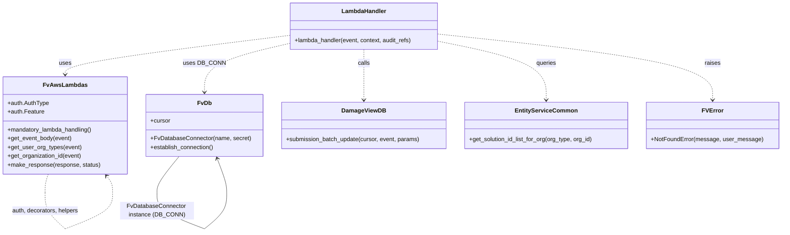

# Diagram: entity_core/entity_service/entity_service/damageview/submission/batch.py


> Auto-generated by Obscura crawlers

## Diagram 1

```mermaid
flowchart TD
    Client[Client Request] --> LH[lambda_handler(event, context, audit_refs)]
    LH --> Auth[Auth & Feature Check (AUTH_CHECK)]
    Auth --> UOT[get_user_org_types(event)[0]]
    Auth --> OID[get_organization_id(event)]
    LH --> Body[get_event_body(event)]
    Body --> Submissions[body.submissions]
    Body --> Assignee[body.assignee]
    LH --> DBConn[DB_CONN.establish_connection()]
    DBConn --> Cursor[DB_CONN.cursor]
    LH --> Solution[get_solution_id_list_for_org(UOT, OID)]
    Solution -->|empty| NF1[NotFoundError: "No valid solution found for this organization"]
    Solution -->|found| Params[params.solution_id = solution_id]
    Params --> Update[entity_service.db.damageview.submission_batch_update(cursor, event, params)]
    Update -->|0| NF2[NotFoundError: "No submissions were updated."]
    Update -->|>0| Resp[make_response({"data": submissions}, 200)]
    Resp --> Client
```

> SVG rendering failed for this diagram.

## Diagram 2



### SVG

<svg id="container" width="2088.6953125" xmlns="http://www.w3.org/2000/svg" class="classDiagram" height="628.25" viewBox="0 0 2088.6953125 628.25" role="graphics-document document" aria-roledescription="class"><style>#container{font-family:"trebuchet ms",verdana,arial,sans-serif;font-size:16px;fill:#333;}@keyframes edge-animation-frame{from{stroke-dashoffset:0;}}@keyframes dash{to{stroke-dashoffset:0;}}#container .edge-animation-slow{stroke-dasharray:9,5!important;stroke-dashoffset:900;animation:dash 50s linear infinite;stroke-linecap:round;}#container .edge-animation-fast{stroke-dasharray:9,5!important;stroke-dashoffset:900;animation:dash 20s linear infinite;stroke-linecap:round;}#container .error-icon{fill:#552222;}#container .error-text{fill:#552222;stroke:#552222;}#container .edge-thickness-normal{stroke-width:1px;}#container .edge-thickness-thick{stroke-width:3.5px;}#container .edge-pattern-solid{stroke-dasharray:0;}#container .edge-thickness-invisible{stroke-width:0;fill:none;}#container .edge-pattern-dashed{stroke-dasharray:3;}#container .edge-pattern-dotted{stroke-dasharray:2;}#container .marker{fill:#333333;stroke:#333333;}#container .marker.cross{stroke:#333333;}#container svg{font-family:"trebuchet ms",verdana,arial,sans-serif;font-size:16px;}#container p{margin:0;}#container g.classGroup text{fill:#9370DB;stroke:none;font-family:"trebuchet ms",verdana,arial,sans-serif;font-size:10px;}#container g.classGroup text .title{font-weight:bolder;}#container .nodeLabel,#container .edgeLabel{color:#131300;}#container .edgeLabel .label rect{fill:#ECECFF;}#container .label text{fill:#131300;}#container .labelBkg{background:#ECECFF;}#container .edgeLabel .label span{background:#ECECFF;}#container .classTitle{font-weight:bolder;}#container .node rect,#container .node circle,#container .node ellipse,#container .node polygon,#container .node path{fill:#ECECFF;stroke:#9370DB;stroke-width:1px;}#container .divider{stroke:#9370DB;stroke-width:1;}#container g.clickable{cursor:pointer;}#container g.classGroup rect{fill:#ECECFF;stroke:#9370DB;}#container g.classGroup line{stroke:#9370DB;stroke-width:1;}#container .classLabel .box{stroke:none;stroke-width:0;fill:#ECECFF;opacity:0.5;}#container .classLabel .label{fill:#9370DB;font-size:10px;}#container .relation{stroke:#333333;stroke-width:1;fill:none;}#container .dashed-line{stroke-dasharray:3;}#container .dotted-line{stroke-dasharray:1 2;}#container #compositionStart,#container .composition{fill:#333333!important;stroke:#333333!important;stroke-width:1;}#container #compositionEnd,#container .composition{fill:#333333!important;stroke:#333333!important;stroke-width:1;}#container #dependencyStart,#container .dependency{fill:#333333!important;stroke:#333333!important;stroke-width:1;}#container #dependencyStart,#container .dependency{fill:#333333!important;stroke:#333333!important;stroke-width:1;}#container #extensionStart,#container .extension{fill:transparent!important;stroke:#333333!important;stroke-width:1;}#container #extensionEnd,#container .extension{fill:transparent!important;stroke:#333333!important;stroke-width:1;}#container #aggregationStart,#container .aggregation{fill:transparent!important;stroke:#333333!important;stroke-width:1;}#container #aggregationEnd,#container .aggregation{fill:transparent!important;stroke:#333333!important;stroke-width:1;}#container #lollipopStart,#container .lollipop{fill:#ECECFF!important;stroke:#333333!important;stroke-width:1;}#container #lollipopEnd,#container .lollipop{fill:#ECECFF!important;stroke:#333333!important;stroke-width:1;}#container .edgeTerminals{font-size:11px;line-height:initial;}#container .classTitleText{text-anchor:middle;font-size:18px;fill:#333;}#container .label-icon{display:inline-block;height:1em;overflow:visible;vertical-align:-0.125em;}#container .node .label-icon path{fill:currentColor;stroke:revert;stroke-width:revert;}#container :root{--mermaid-font-family:"trebuchet ms",verdana,arial,sans-serif;}</style><g><defs><marker id="container_class-aggregationStart" class="marker aggregation class" refX="18" refY="7" markerWidth="190" markerHeight="240" orient="auto"><path d="M 18,7 L9,13 L1,7 L9,1 Z"></path></marker></defs><defs><marker id="container_class-aggregationEnd" class="marker aggregation class" refX="1" refY="7" markerWidth="20" markerHeight="28" orient="auto"><path d="M 18,7 L9,13 L1,7 L9,1 Z"></path></marker></defs><defs><marker id="container_class-extensionStart" class="marker extension class" refX="18" refY="7" markerWidth="190" markerHeight="240" orient="auto"><path d="M 1,7 L18,13 V 1 Z"></path></marker></defs><defs><marker id="container_class-extensionEnd" class="marker extension class" refX="1" refY="7" markerWidth="20" markerHeight="28" orient="auto"><path d="M 1,1 V 13 L18,7 Z"></path></marker></defs><defs><marker id="container_class-compositionStart" class="marker composition class" refX="18" refY="7" markerWidth="190" markerHeight="240" orient="auto"><path d="M 18,7 L9,13 L1,7 L9,1 Z"></path></marker></defs><defs><marker id="container_class-compositionEnd" class="marker composition class" refX="1" refY="7" markerWidth="20" markerHeight="28" orient="auto"><path d="M 18,7 L9,13 L1,7 L9,1 Z"></path></marker></defs><defs><marker id="container_class-dependencyStart" class="marker dependency class" refX="6" refY="7" markerWidth="190" markerHeight="240" orient="auto"><path d="M 5,7 L9,13 L1,7 L9,1 Z"></path></marker></defs><defs><marker id="container_class-dependencyEnd" class="marker dependency class" refX="13" refY="7" markerWidth="20" markerHeight="28" orient="auto"><path d="M 18,7 L9,13 L14,7 L9,1 Z"></path></marker></defs><defs><marker id="container_class-lollipopStart" class="marker lollipop class" refX="13" refY="7" markerWidth="190" markerHeight="240" orient="auto"><circle stroke="black" fill="transparent" cx="7" cy="7" r="6"></circle></marker></defs><defs><marker id="container_class-lollipopEnd" class="marker lollipop class" refX="1" refY="7" markerWidth="190" markerHeight="240" orient="auto"><circle stroke="black" fill="transparent" cx="7" cy="7" r="6"></circle></marker></defs><g class="root"><g class="clusters"></g><g class="edgePaths"><path d="M767.047,96.366L668.012,108.805C568.978,121.244,370.909,146.122,271.874,163.728C172.84,181.333,172.84,191.667,172.84,196.833L172.84,202" id="id_LambdaHandler_FvAwsLambdas_1" class="edge-thickness-normal edge-pattern-dashed relation" style=";;;" data-edge="true" data-et="edge" data-id="id_LambdaHandler_FvAwsLambdas_1" data-points="W3sieCI6NzY3LjA0Njg3NSwieSI6OTYuMzY1ODkxOTUyMDk0Mjd9LHsieCI6MTcyLjgzOTg0Mzc1LCJ5IjoxNzF9LHsieCI6MTcyLjgzOTg0Mzc1LCJ5IjoyMDh9XQ==" marker-end="url(#container_class-dependencyEnd)"></path><path d="M767.047,118.325L729.583,127.104C692.118,135.883,617.19,153.442,579.726,175.387C542.262,197.333,542.262,223.667,542.262,236.833L542.262,250" id="id_LambdaHandler_FvDb_2" class="edge-thickness-normal edge-pattern-dashed relation" style=";;;" data-edge="true" data-et="edge" data-id="id_LambdaHandler_FvDb_2" data-points="W3sieCI6NzY3LjA0Njg3NSwieSI6MTE4LjMyNDgyMDM1NzkxMTExfSx7IngiOjU0Mi4yNjE3MTg3NSwieSI6MTcxfSx7IngiOjU0Mi4yNjE3MTg3NSwieSI6MjU2fV0=" marker-end="url(#container_class-dependencyEnd)"></path><path d="M969,134L969,140.167C969,146.333,969,158.667,969,181.5C969,204.333,969,237.667,969,254.333L969,271" id="id_LambdaHandler_DamageViewDB_3" class="edge-thickness-normal edge-pattern-dashed relation" style=";;;" data-edge="true" data-et="edge" data-id="id_LambdaHandler_DamageViewDB_3" data-points="W3sieCI6OTY5LCJ5IjoxMzR9LHsieCI6OTY5LCJ5IjoxNzF9LHsieCI6OTY5LCJ5IjoyNzd9XQ==" marker-end="url(#container_class-dependencyEnd)"></path><path d="M1170.953,111.935L1219.52,121.779C1268.087,131.623,1365.221,151.312,1413.788,177.822C1462.355,204.333,1462.355,237.667,1462.355,254.333L1462.355,271" id="id_LambdaHandler_EntityServiceCommon_4" class="edge-thickness-normal edge-pattern-dashed relation" style=";;;" data-edge="true" data-et="edge" data-id="id_LambdaHandler_EntityServiceCommon_4" data-points="W3sieCI6MTE3MC45NTMxMjUsInkiOjExMS45MzQ2MDc1NTgyNTQ2MX0seyJ4IjoxNDYyLjM1NTQ2ODc1LCJ5IjoxNzF9LHsieCI6MTQ2Mi4zNTU0Njg3NSwieSI6Mjc3fV0=" marker-end="url(#container_class-dependencyEnd)"></path><path d="M1170.953,92.527L1293.648,105.606C1416.344,118.685,1661.734,144.842,1784.43,174.588C1907.125,204.333,1907.125,237.667,1907.125,254.333L1907.125,271" id="id_LambdaHandler_FVError_5" class="edge-thickness-normal edge-pattern-dashed relation" style=";;;" data-edge="true" data-et="edge" data-id="id_LambdaHandler_FVError_5" data-points="W3sieCI6MTE3MC45NTMxMjUsInkiOjkyLjUyNzMxNTEyMzI1MTE3fSx7IngiOjE5MDcuMTI1LCJ5IjoxNzF9LHsieCI6MTkwNy4xMjUsInkiOjI3N31d" marker-end="url(#container_class-dependencyEnd)"></path><path d="M475.537,424L465.873,436.167C456.209,448.333,436.88,472.667,427.215,489C417.551,505.333,417.551,513.667,417.551,517.833L417.551,522" id="FvDb-cyclic-special-1" class="edge-thickness-normal edge-pattern-solid relation" style=";;;" data-edge="true" data-et="edge" data-id="FvDb-cyclic-special-1" data-points="W3sieCI6NDc1LjUzNzM5NTUwMTU5MjM2LCJ5Ijo0MjR9LHsieCI6NDE3LjU1MDc4MTI1LCJ5Ijo0OTd9LHsieCI6NDE3LjU1MDc4MTI1LCJ5Ijo1MjJ9XQ=="></path><path d="M417.551,522.1L417.551,530.267C417.551,538.433,417.551,554.767,438.328,571.105C459.104,587.443,500.658,603.787,521.435,611.959L542.212,620.13" id="FvDb-cyclic-special-mid" class="edge-thickness-normal edge-pattern-solid relation" style=";;;" data-edge="true" data-et="edge" data-id="FvDb-cyclic-special-mid" data-points="W3sieCI6NDE3LjU1MDc4MTI1LCJ5Ijo1MjIuMTAwMDAwMDAxNDkwMX0seyJ4Ijo0MTcuNTUwNzgxMjUsInkiOjU3MS4xMDAwMDAwMDE0OTAxfSx7IngiOjU0Mi4yMTE3MTg3NDkyNTQ5LCJ5Ijo2MjAuMTMwMzM0NTI1NTI3Nn1d"></path><path d="M542.312,620.109L552.303,611.941C562.295,603.773,582.278,587.436,592.27,571.093C602.262,554.75,602.262,538.4,602.262,526.05C602.262,513.7,602.262,505.35,597.969,489.942C593.676,474.535,585.091,452.07,580.798,440.837L576.506,429.605" id="FvDb-cyclic-special-2" class="edge-thickness-normal edge-pattern-solid relation" style=";;;" data-edge="true" data-et="edge" data-id="FvDb-cyclic-special-2" data-points="W3sieCI6NTQyLjMxMTcxODc1MDc0NTEsInkiOjYyMC4xMDkxMjUwMDE2MjU0fSx7IngiOjYwMi4yNjE3MTg3NSwieSI6NTcxLjEwMDAwMDAwMTQ5MDF9LHsieCI6NjAyLjI2MTcxODc1LCJ5Ijo1MjIuMDUwMDAwMDAwNzQ1MX0seyJ4Ijo2MDIuMjYxNzE4NzUsInkiOjQ5N30seyJ4Ijo1NzQuMzYzNjI5NTc4MDI1NCwieSI6NDI0fV0=" marker-end="url(#container_class-dependencyEnd)"></path><path d="M126.322,472L124.854,476.167C123.385,480.333,120.448,488.667,118.98,497C117.512,505.333,117.512,513.667,117.512,517.833L117.512,522" id="FvAwsLambdas-cyclic-special-1" class="edge-thickness-normal edge-pattern-dashed relation" style=";;;" data-edge="true" data-et="edge" data-id="FvAwsLambdas-cyclic-special-1" data-points="W3sieCI6MTI2LjMyMTkyOTczNzI2MTE0LCJ5Ijo0NzJ9LHsieCI6MTE3LjUxMTcxODc1LCJ5Ijo0OTd9LHsieCI6MTE3LjUxMTcxODc1LCJ5Ijo1MjJ9XQ=="></path><path d="M117.512,522.1L117.512,530.267C117.512,538.433,117.512,554.767,126.725,571.101C135.938,587.435,154.364,603.77,163.577,611.938L172.79,620.106" id="FvAwsLambdas-cyclic-special-mid" class="edge-thickness-normal edge-pattern-dashed relation" style=";;;" data-edge="true" data-et="edge" data-id="FvAwsLambdas-cyclic-special-mid" data-points="W3sieCI6MTE3LjUxMTcxODc1LCJ5Ijo1MjIuMTAwMDAwMDAxNDkwMX0seyJ4IjoxMTcuNTExNzE4NzUsInkiOjU3MS4xMDAwMDAwMDE0OTAxfSx7IngiOjE3Mi43ODk4NDM3NDkyNTQ5NCwieSI6NjIwLjEwNTY3MzU0MDEyMjR9XQ=="></path><path d="M172.89,620.13L193.667,611.959C214.443,603.787,255.997,587.443,276.774,571.097C297.551,554.75,297.551,538.4,297.551,526.05C297.551,513.7,297.551,505.35,294.863,497.791C292.175,490.233,286.8,483.465,284.112,480.082L281.424,476.698" id="FvAwsLambdas-cyclic-special-2" class="edge-thickness-normal edge-pattern-dashed relation" style=";;;" data-edge="true" data-et="edge" data-id="FvAwsLambdas-cyclic-special-2" data-points="W3sieCI6MTcyLjg4OTg0Mzc1MDc0NTA2LCJ5Ijo2MjAuMTMwMzM0NTI1NTI3Nn0seyJ4IjoyOTcuNTUwNzgxMjUsInkiOjU3MS4xMDAwMDAwMDE0OTAxfSx7IngiOjI5Ny41NTA3ODEyNSwieSI6NTIyLjA1MDAwMDAwMDc0NTF9LHsieCI6Mjk3LjU1MDc4MTI1LCJ5Ijo0OTd9LHsieCI6Mjc3LjY5MjM1MTcxMTc4MzQzLCJ5Ijo0NzJ9XQ==" marker-end="url(#container_class-dependencyEnd)"></path></g><g class="edgeLabels"><g class="edgeLabel" transform="translate(172.83984375, 171)"><g class="label" data-id="id_LambdaHandler_FvAwsLambdas_1" transform="translate(-16.4921875, -12)"><foreignObject width="32.984375" height="24"><div xmlns="http://www.w3.org/1999/xhtml" class="labelBkg" style="display: table-cell; white-space: nowrap; line-height: 1.5; max-width: 200px; text-align: center;"><span class="edgeLabel"><p>uses</p></span></div></foreignObject></g></g><g class="edgeLabel" transform="translate(542.26171875, 171)"><g class="label" data-id="id_LambdaHandler_FvDb_2" transform="translate(-53.09375, -12)"><foreignObject width="106.1875" height="24"><div xmlns="http://www.w3.org/1999/xhtml" class="labelBkg" style="display: table-cell; white-space: nowrap; line-height: 1.5; max-width: 200px; text-align: center;"><span class="edgeLabel"><p>uses DB_CONN</p></span></div></foreignObject></g></g><g class="edgeLabel" transform="translate(969, 171)"><g class="label" data-id="id_LambdaHandler_DamageViewDB_3" transform="translate(-16.4453125, -12)"><foreignObject width="32.890625" height="24"><div xmlns="http://www.w3.org/1999/xhtml" class="labelBkg" style="display: table-cell; white-space: nowrap; line-height: 1.5; max-width: 200px; text-align: center;"><span class="edgeLabel"><p>calls</p></span></div></foreignObject></g></g><g class="edgeLabel" transform="translate(1462.35546875, 171)"><g class="label" data-id="id_LambdaHandler_EntityServiceCommon_4" transform="translate(-27.2421875, -12)"><foreignObject width="54.484375" height="24"><div xmlns="http://www.w3.org/1999/xhtml" class="labelBkg" style="display: table-cell; white-space: nowrap; line-height: 1.5; max-width: 200px; text-align: center;"><span class="edgeLabel"><p>queries</p></span></div></foreignObject></g></g><g class="edgeLabel" transform="translate(1907.125, 171)"><g class="label" data-id="id_LambdaHandler_FVError_5" transform="translate(-21.25, -12)"><foreignObject width="42.5" height="24"><div xmlns="http://www.w3.org/1999/xhtml" class="labelBkg" style="display: table-cell; white-space: nowrap; line-height: 1.5; max-width: 200px; text-align: center;"><span class="edgeLabel"><p>raises</p></span></div></foreignObject></g></g><g class="edgeLabel"><g class="label" data-id="FvDb-cyclic-special-1" transform="translate(0, 0)"><foreignObject width="0" height="0"><div xmlns="http://www.w3.org/1999/xhtml" class="labelBkg" style="display: table-cell; white-space: nowrap; line-height: 1.5; max-width: 200px; text-align: center;"><span class="edgeLabel"></span></div></foreignObject></g></g><g class="edgeLabel" transform="translate(417.55078125, 571.1000000014901)"><g class="label" data-id="FvDb-cyclic-special-mid" transform="translate(-100, -24)"><foreignObject width="200" height="48"><div xmlns="http://www.w3.org/1999/xhtml" class="labelBkg" style="display: table; white-space: break-spaces; line-height: 1.5; max-width: 200px; text-align: center; width: 200px;"><span class="edgeLabel"><p>FvDatabaseConnector instance (DB_CONN)</p></span></div></foreignObject></g></g><g class="edgeLabel"><g class="label" data-id="FvDb-cyclic-special-2" transform="translate(0, 0)"><foreignObject width="0" height="0"><div xmlns="http://www.w3.org/1999/xhtml" class="labelBkg" style="display: table-cell; white-space: nowrap; line-height: 1.5; max-width: 200px; text-align: center;"><span class="edgeLabel"></span></div></foreignObject></g></g><g class="edgeLabel"><g class="label" data-id="FvAwsLambdas-cyclic-special-1" transform="translate(0, 0)"><foreignObject width="0" height="0"><div xmlns="http://www.w3.org/1999/xhtml" class="labelBkg" style="display: table-cell; white-space: nowrap; line-height: 1.5; max-width: 200px; text-align: center;"><span class="edgeLabel"></span></div></foreignObject></g></g><g class="edgeLabel" transform="translate(117.51171875, 571.1000000014901)"><g class="label" data-id="FvAwsLambdas-cyclic-special-mid" transform="translate(-90.65625, -12)"><foreignObject width="181.3125" height="24"><div xmlns="http://www.w3.org/1999/xhtml" class="labelBkg" style="display: table-cell; white-space: nowrap; line-height: 1.5; max-width: 200px; text-align: center;"><span class="edgeLabel"><p>auth, decorators, helpers</p></span></div></foreignObject></g></g><g class="edgeLabel"><g class="label" data-id="FvAwsLambdas-cyclic-special-2" transform="translate(0, 0)"><foreignObject width="0" height="0"><div xmlns="http://www.w3.org/1999/xhtml" class="labelBkg" style="display: table-cell; white-space: nowrap; line-height: 1.5; max-width: 200px; text-align: center;"><span class="edgeLabel"></span></div></foreignObject></g></g></g><g class="nodes"><g class="node default" id="classId-LambdaHandler-0" transform="translate(969, 71)"><g class="basic label-container"><path d="M-201.953125 -63 L201.953125 -63 L201.953125 63 L-201.953125 63" stroke="none" stroke-width="0" fill="#ECECFF" style=""></path><path d="M-201.953125 -63 C-84.60310337851591 -63, 32.74691824296818 -63, 201.953125 -63 M-201.953125 -63 C-89.83141297120643 -63, 22.290299057587134 -63, 201.953125 -63 M201.953125 -63 C201.953125 -19.548863486944427, 201.953125 23.902273026111146, 201.953125 63 M201.953125 -63 C201.953125 -33.45012380845923, 201.953125 -3.9002476169184632, 201.953125 63 M201.953125 63 C104.80319194382018 63, 7.653258887640362 63, -201.953125 63 M201.953125 63 C54.09430732667877 63, -93.76451034664245 63, -201.953125 63 M-201.953125 63 C-201.953125 24.211899176987906, -201.953125 -14.576201646024188, -201.953125 -63 M-201.953125 63 C-201.953125 17.533742171968626, -201.953125 -27.932515656062748, -201.953125 -63" stroke="#9370DB" stroke-width="1.3" fill="none" stroke-dasharray="0 0" style=""></path></g><g class="annotation-group text" transform="translate(0, -39)"></g><g class="label-group text" transform="translate(-58.21875, -39)"><g class="label" style="font-weight: bolder" transform="translate(0,-12)"><foreignObject width="116.4375" height="24"><div xmlns="http://www.w3.org/1999/xhtml" style="display: table-cell; white-space: nowrap; line-height: 1.5; max-width: 167px; text-align: center;"><span class="nodeLabel markdown-node-label" style=""><p>LambdaHandler</p></span></div></foreignObject></g></g><g class="members-group text" transform="translate(-189.953125, 9)"></g><g class="methods-group text" transform="translate(-189.953125, 39)"><g class="label" style="" transform="translate(0,-12)"><foreignObject width="321.6875" height="24"><div xmlns="http://www.w3.org/1999/xhtml" style="display: table-cell; white-space: nowrap; line-height: 1.5; max-width: 379px; text-align: center;"><span class="nodeLabel markdown-node-label" style=""><p>+lambda_handler(event, context, audit_refs)</p></span></div></foreignObject></g></g><g class="divider" style=""><path d="M-201.953125 -15 C-89.5758030336437 -15, 22.80151893271261 -15, 201.953125 -15 M-201.953125 -15 C-52.7004507357897 -15, 96.5522235284206 -15, 201.953125 -15" stroke="#9370DB" stroke-width="1.3" fill="none" stroke-dasharray="0 0" style=""></path></g><g class="divider" style=""><path d="M-201.953125 9 C-54.99629844653296 9, 91.96052810693408 9, 201.953125 9 M-201.953125 9 C-87.8194229916541 9, 26.314279016691813 9, 201.953125 9" stroke="#9370DB" stroke-width="1.3" fill="none" stroke-dasharray="0 0" style=""></path></g></g><g class="node default" id="classId-FvAwsLambdas-1" transform="translate(172.83984375, 340)"><g class="basic label-container"><path d="M-164.83984375 -132 L164.83984375 -132 L164.83984375 132 L-164.83984375 132" stroke="none" stroke-width="0" fill="#ECECFF" style=""></path><path d="M-164.83984375 -132 C-67.35928265724482 -132, 30.121278435510362 -132, 164.83984375 -132 M-164.83984375 -132 C-77.54411843946008 -132, 9.751606871079844 -132, 164.83984375 -132 M164.83984375 -132 C164.83984375 -79.06744480053237, 164.83984375 -26.134889601064756, 164.83984375 132 M164.83984375 -132 C164.83984375 -36.847142764213004, 164.83984375 58.30571447157399, 164.83984375 132 M164.83984375 132 C73.71866547913854 132, -17.402512791722927 132, -164.83984375 132 M164.83984375 132 C64.39671312840147 132, -36.046417493197055 132, -164.83984375 132 M-164.83984375 132 C-164.83984375 37.895394005615856, -164.83984375 -56.20921198876829, -164.83984375 -132 M-164.83984375 132 C-164.83984375 51.302035602920654, -164.83984375 -29.395928794158692, -164.83984375 -132" stroke="#9370DB" stroke-width="1.3" fill="none" stroke-dasharray="0 0" style=""></path></g><g class="annotation-group text" transform="translate(0, -108)"></g><g class="label-group text" transform="translate(-55.2109375, -108)"><g class="label" style="font-weight: bolder" transform="translate(0,-12)"><foreignObject width="110.421875" height="24"><div xmlns="http://www.w3.org/1999/xhtml" style="display: table-cell; white-space: nowrap; line-height: 1.5; max-width: 159px; text-align: center;"><span class="nodeLabel markdown-node-label" style=""><p>FvAwsLambdas</p></span></div></foreignObject></g></g><g class="members-group text" transform="translate(-152.83984375, -60)"><g class="label" style="" transform="translate(0,-12)"><foreignObject width="112.1875" height="24"><div xmlns="http://www.w3.org/1999/xhtml" style="display: table-cell; white-space: nowrap; line-height: 1.5; max-width: 170px; text-align: center;"><span class="nodeLabel markdown-node-label" style=""><p>+auth.AuthType</p></span></div></foreignObject></g><g class="label" style="" transform="translate(0,12)"><foreignObject width="98.828125" height="24"><div xmlns="http://www.w3.org/1999/xhtml" style="display: table-cell; white-space: nowrap; line-height: 1.5; max-width: 156px; text-align: center;"><span class="nodeLabel markdown-node-label" style=""><p>+auth.Feature</p></span></div></foreignObject></g></g><g class="methods-group text" transform="translate(-152.83984375, 12)"><g class="label" style="" transform="translate(0,-12)"><foreignObject width="232.078125" height="24"><div xmlns="http://www.w3.org/1999/xhtml" style="display: table-cell; white-space: nowrap; line-height: 1.5; max-width: 289px; text-align: center;"><span class="nodeLabel markdown-node-label" style=""><p>+mandatory_lambda_handling()</p></span></div></foreignObject></g><g class="label" style="" transform="translate(0,12)"><foreignObject width="174.203125" height="24"><div xmlns="http://www.w3.org/1999/xhtml" style="display: table-cell; white-space: nowrap; line-height: 1.5; max-width: 232px; text-align: center;"><span class="nodeLabel markdown-node-label" style=""><p>+get_event_body(event)</p></span></div></foreignObject></g><g class="label" style="" transform="translate(0,36)"><foreignObject width="198.578125" height="24"><div xmlns="http://www.w3.org/1999/xhtml" style="display: table-cell; white-space: nowrap; line-height: 1.5; max-width: 256px; text-align: center;"><span class="nodeLabel markdown-node-label" style=""><p>+get_user_org_types(event)</p></span></div></foreignObject></g><g class="label" style="" transform="translate(0,60)"><foreignObject width="202.015625" height="24"><div xmlns="http://www.w3.org/1999/xhtml" style="display: table-cell; white-space: nowrap; line-height: 1.5; max-width: 259px; text-align: center;"><span class="nodeLabel markdown-node-label" style=""><p>+get_organization_id(event)</p></span></div></foreignObject></g><g class="label" style="" transform="translate(0,84)"><foreignObject width="250.46875" height="24"><div xmlns="http://www.w3.org/1999/xhtml" style="display: table-cell; white-space: nowrap; line-height: 1.5; max-width: 308px; text-align: center;"><span class="nodeLabel markdown-node-label" style=""><p>+make_response(response, status)</p></span></div></foreignObject></g></g><g class="divider" style=""><path d="M-164.83984375 -84 C-70.38810524300996 -84, 24.06363326398008 -84, 164.83984375 -84 M-164.83984375 -84 C-70.7260911714777 -84, 23.38766140704459 -84, 164.83984375 -84" stroke="#9370DB" stroke-width="1.3" fill="none" stroke-dasharray="0 0" style=""></path></g><g class="divider" style=""><path d="M-164.83984375 -12 C-43.57023572538591 -12, 77.69937229922817 -12, 164.83984375 -12 M-164.83984375 -12 C-84.84588589348651 -12, -4.851928036973021 -12, 164.83984375 -12" stroke="#9370DB" stroke-width="1.3" fill="none" stroke-dasharray="0 0" style=""></path></g></g><g class="node default" id="classId-FvDb-2" transform="translate(542.26171875, 340)"><g class="basic label-container"><path d="M-154.58203125 -84 L154.58203125 -84 L154.58203125 84 L-154.58203125 84" stroke="none" stroke-width="0" fill="#ECECFF" style=""></path><path d="M-154.58203125 -84 C-49.322705220017 -84, 55.936620809966 -84, 154.58203125 -84 M-154.58203125 -84 C-33.34204028966778 -84, 87.89795067066444 -84, 154.58203125 -84 M154.58203125 -84 C154.58203125 -45.08514974455565, 154.58203125 -6.170299489111301, 154.58203125 84 M154.58203125 -84 C154.58203125 -23.671366859955008, 154.58203125 36.657266280089985, 154.58203125 84 M154.58203125 84 C37.77549276351442 84, -79.03104572297116 84, -154.58203125 84 M154.58203125 84 C75.00152242041244 84, -4.578986409175116 84, -154.58203125 84 M-154.58203125 84 C-154.58203125 17.47214848920082, -154.58203125 -49.05570302159836, -154.58203125 -84 M-154.58203125 84 C-154.58203125 47.346114326897215, -154.58203125 10.69222865379443, -154.58203125 -84" stroke="#9370DB" stroke-width="1.3" fill="none" stroke-dasharray="0 0" style=""></path></g><g class="annotation-group text" transform="translate(0, -60)"></g><g class="label-group text" transform="translate(-17.7109375, -60)"><g class="label" style="font-weight: bolder" transform="translate(0,-12)"><foreignObject width="35.421875" height="24"><div xmlns="http://www.w3.org/1999/xhtml" style="display: table-cell; white-space: nowrap; line-height: 1.5; max-width: 85px; text-align: center;"><span class="nodeLabel markdown-node-label" style=""><p>FvDb</p></span></div></foreignObject></g></g><g class="members-group text" transform="translate(-142.58203125, -12)"><g class="label" style="" transform="translate(0,-12)"><foreignObject width="53.71875" height="24"><div xmlns="http://www.w3.org/1999/xhtml" style="display: table-cell; white-space: nowrap; line-height: 1.5; max-width: 112px; text-align: center;"><span class="nodeLabel markdown-node-label" style=""><p>+cursor</p></span></div></foreignObject></g></g><g class="methods-group text" transform="translate(-142.58203125, 36)"><g class="label" style="" transform="translate(0,-12)"><foreignObject width="267.453125" height="24"><div xmlns="http://www.w3.org/1999/xhtml" style="display: table-cell; white-space: nowrap; line-height: 1.5; max-width: 325px; text-align: center;"><span class="nodeLabel markdown-node-label" style=""><p>+FvDatabaseConnector(name, secret)</p></span></div></foreignObject></g><g class="label" style="" transform="translate(0,12)"><foreignObject width="173.265625" height="24"><div xmlns="http://www.w3.org/1999/xhtml" style="display: table-cell; white-space: nowrap; line-height: 1.5; max-width: 231px; text-align: center;"><span class="nodeLabel markdown-node-label" style=""><p>+establish_connection()</p></span></div></foreignObject></g></g><g class="divider" style=""><path d="M-154.58203125 -36 C-43.203741685421036 -36, 68.17454787915793 -36, 154.58203125 -36 M-154.58203125 -36 C-81.21198379748253 -36, -7.841936344965063 -36, 154.58203125 -36" stroke="#9370DB" stroke-width="1.3" fill="none" stroke-dasharray="0 0" style=""></path></g><g class="divider" style=""><path d="M-154.58203125 12 C-84.54564388003007 12, -14.50925651006014 12, 154.58203125 12 M-154.58203125 12 C-70.0741993387397 12, 14.433632572520594 12, 154.58203125 12" stroke="#9370DB" stroke-width="1.3" fill="none" stroke-dasharray="0 0" style=""></path></g></g><g class="node default" id="classId-DamageViewDB-3" transform="translate(969, 340)"><g class="basic label-container"><path d="M-222.15625 -63 L222.15625 -63 L222.15625 63 L-222.15625 63" stroke="none" stroke-width="0" fill="#ECECFF" style=""></path><path d="M-222.15625 -63 C-93.45990142860381 -63, 35.23644714279237 -63, 222.15625 -63 M-222.15625 -63 C-98.68754807758089 -63, 24.78115384483823 -63, 222.15625 -63 M222.15625 -63 C222.15625 -15.211382028984183, 222.15625 32.577235942031635, 222.15625 63 M222.15625 -63 C222.15625 -33.23346612050827, 222.15625 -3.4669322410165435, 222.15625 63 M222.15625 63 C86.71230199063524 63, -48.73164601872952 63, -222.15625 63 M222.15625 63 C132.93462391511622 63, 43.71299783023247 63, -222.15625 63 M-222.15625 63 C-222.15625 16.91080358599013, -222.15625 -29.17839282801974, -222.15625 -63 M-222.15625 63 C-222.15625 29.022659482334603, -222.15625 -4.954681035330793, -222.15625 -63" stroke="#9370DB" stroke-width="1.3" fill="none" stroke-dasharray="0 0" style=""></path></g><g class="annotation-group text" transform="translate(0, -39)"></g><g class="label-group text" transform="translate(-56.59375, -39)"><g class="label" style="font-weight: bolder" transform="translate(0,-12)"><foreignObject width="113.1875" height="24"><div xmlns="http://www.w3.org/1999/xhtml" style="display: table-cell; white-space: nowrap; line-height: 1.5; max-width: 162px; text-align: center;"><span class="nodeLabel markdown-node-label" style=""><p>DamageViewDB</p></span></div></foreignObject></g></g><g class="members-group text" transform="translate(-210.15625, 9)"></g><g class="methods-group text" transform="translate(-210.15625, 39)"><g class="label" style="" transform="translate(0,-12)"><foreignObject width="363.71875" height="24"><div xmlns="http://www.w3.org/1999/xhtml" style="display: table-cell; white-space: nowrap; line-height: 1.5; max-width: 421px; text-align: center;"><span class="nodeLabel markdown-node-label" style=""><p>+submission_batch_update(cursor, event, params)</p></span></div></foreignObject></g></g><g class="divider" style=""><path d="M-222.15625 -15 C-45.501441305747676 -15, 131.15336738850465 -15, 222.15625 -15 M-222.15625 -15 C-87.4387566483127 -15, 47.27873670337459 -15, 222.15625 -15" stroke="#9370DB" stroke-width="1.3" fill="none" stroke-dasharray="0 0" style=""></path></g><g class="divider" style=""><path d="M-222.15625 9 C-99.08623101346036 9, 23.983787973079274 9, 222.15625 9 M-222.15625 9 C-117.45442099897409 9, -12.752591997948173 9, 222.15625 9" stroke="#9370DB" stroke-width="1.3" fill="none" stroke-dasharray="0 0" style=""></path></g></g><g class="node default" id="classId-EntityServiceCommon-4" transform="translate(1462.35546875, 340)"><g class="basic label-container"><path d="M-221.19921875 -63 L221.19921875 -63 L221.19921875 63 L-221.19921875 63" stroke="none" stroke-width="0" fill="#ECECFF" style=""></path><path d="M-221.19921875 -63 C-55.10827314361336 -63, 110.98267246277328 -63, 221.19921875 -63 M-221.19921875 -63 C-120.7706438749646 -63, -20.34206899992921 -63, 221.19921875 -63 M221.19921875 -63 C221.19921875 -21.624869556057874, 221.19921875 19.750260887884252, 221.19921875 63 M221.19921875 -63 C221.19921875 -19.871222690375184, 221.19921875 23.257554619249632, 221.19921875 63 M221.19921875 63 C115.36475188739124 63, 9.530285024782472 63, -221.19921875 63 M221.19921875 63 C99.29932697155132 63, -22.600564806897353 63, -221.19921875 63 M-221.19921875 63 C-221.19921875 13.346482573361271, -221.19921875 -36.30703485327746, -221.19921875 -63 M-221.19921875 63 C-221.19921875 20.040486329449358, -221.19921875 -22.919027341101284, -221.19921875 -63" stroke="#9370DB" stroke-width="1.3" fill="none" stroke-dasharray="0 0" style=""></path></g><g class="annotation-group text" transform="translate(0, -39)"></g><g class="label-group text" transform="translate(-79.8515625, -39)"><g class="label" style="font-weight: bolder" transform="translate(0,-12)"><foreignObject width="159.703125" height="24"><div xmlns="http://www.w3.org/1999/xhtml" style="display: table-cell; white-space: nowrap; line-height: 1.5; max-width: 208px; text-align: center;"><span class="nodeLabel markdown-node-label" style=""><p>EntityServiceCommon</p></span></div></foreignObject></g></g><g class="members-group text" transform="translate(-209.19921875, 9)"></g><g class="methods-group text" transform="translate(-209.19921875, 39)"><g class="label" style="" transform="translate(0,-12)"><foreignObject width="338.546875" height="24"><div xmlns="http://www.w3.org/1999/xhtml" style="display: table-cell; white-space: nowrap; line-height: 1.5; max-width: 396px; text-align: center;"><span class="nodeLabel markdown-node-label" style=""><p>+get_solution_id_list_for_org(org_type, org_id)</p></span></div></foreignObject></g></g><g class="divider" style=""><path d="M-221.19921875 -15 C-73.68791117085433 -15, 73.82339640829133 -15, 221.19921875 -15 M-221.19921875 -15 C-128.45188064850225 -15, -35.70454254700451 -15, 221.19921875 -15" stroke="#9370DB" stroke-width="1.3" fill="none" stroke-dasharray="0 0" style=""></path></g><g class="divider" style=""><path d="M-221.19921875 9 C-116.76174501775716 9, -12.324271285514328 9, 221.19921875 9 M-221.19921875 9 C-69.55097671771054 9, 82.09726531457892 9, 221.19921875 9" stroke="#9370DB" stroke-width="1.3" fill="none" stroke-dasharray="0 0" style=""></path></g></g><g class="node default" id="classId-FVError-5" transform="translate(1907.125, 340)"><g class="basic label-container"><path d="M-173.5703125 -63 L173.5703125 -63 L173.5703125 63 L-173.5703125 63" stroke="none" stroke-width="0" fill="#ECECFF" style=""></path><path d="M-173.5703125 -63 C-65.68153681605774 -63, 42.20723886788451 -63, 173.5703125 -63 M-173.5703125 -63 C-66.40148805152702 -63, 40.76733639694595 -63, 173.5703125 -63 M173.5703125 -63 C173.5703125 -30.516048178935513, 173.5703125 1.9679036421289737, 173.5703125 63 M173.5703125 -63 C173.5703125 -14.397616139292232, 173.5703125 34.204767721415536, 173.5703125 63 M173.5703125 63 C76.49070544529188 63, -20.58890160941624 63, -173.5703125 63 M173.5703125 63 C63.52136487161587 63, -46.527582756768254 63, -173.5703125 63 M-173.5703125 63 C-173.5703125 14.46301541026866, -173.5703125 -34.07396917946268, -173.5703125 -63 M-173.5703125 63 C-173.5703125 28.095919151187545, -173.5703125 -6.808161697624911, -173.5703125 -63" stroke="#9370DB" stroke-width="1.3" fill="none" stroke-dasharray="0 0" style=""></path></g><g class="annotation-group text" transform="translate(0, -39)"></g><g class="label-group text" transform="translate(-26.640625, -39)"><g class="label" style="font-weight: bolder" transform="translate(0,-12)"><foreignObject width="53.28125" height="24"><div xmlns="http://www.w3.org/1999/xhtml" style="display: table-cell; white-space: nowrap; line-height: 1.5; max-width: 103px; text-align: center;"><span class="nodeLabel markdown-node-label" style=""><p>FVError</p></span></div></foreignObject></g></g><g class="members-group text" transform="translate(-161.5703125, 9)"></g><g class="methods-group text" transform="translate(-161.5703125, 39)"><g class="label" style="" transform="translate(0,-12)"><foreignObject width="296.5" height="24"><div xmlns="http://www.w3.org/1999/xhtml" style="display: table-cell; white-space: nowrap; line-height: 1.5; max-width: 354px; text-align: center;"><span class="nodeLabel markdown-node-label" style=""><p>+NotFoundError(message, user_message)</p></span></div></foreignObject></g></g><g class="divider" style=""><path d="M-173.5703125 -15 C-99.72289644427268 -15, -25.875480388545355 -15, 173.5703125 -15 M-173.5703125 -15 C-50.995630269640216 -15, 71.57905196071957 -15, 173.5703125 -15" stroke="#9370DB" stroke-width="1.3" fill="none" stroke-dasharray="0 0" style=""></path></g><g class="divider" style=""><path d="M-173.5703125 9 C-47.837641252449316 9, 77.89502999510137 9, 173.5703125 9 M-173.5703125 9 C-45.640025229854146 9, 82.29026204029171 9, 173.5703125 9" stroke="#9370DB" stroke-width="1.3" fill="none" stroke-dasharray="0 0" style=""></path></g></g><g class="label edgeLabel" id="FvDb---FvDb---1" transform="translate(417.55078125, 522.0500000007451)"><rect width="0.1" height="0.1"></rect><g class="label" style="" transform="translate(0, 0)"><rect></rect><foreignObject width="0" height="0"><div xmlns="http://www.w3.org/1999/xhtml" style="display: table-cell; white-space: nowrap; line-height: 1.5; max-width: 10px; text-align: center;"><span class="nodeLabel"></span></div></foreignObject></g></g><g class="label edgeLabel" id="FvDb---FvDb---2" transform="translate(542.26171875, 620.1500000022352)"><rect width="0.1" height="0.1"></rect><g class="label" style="" transform="translate(0, 0)"><rect></rect><foreignObject width="0" height="0"><div xmlns="http://www.w3.org/1999/xhtml" style="display: table-cell; white-space: nowrap; line-height: 1.5; max-width: 10px; text-align: center;"><span class="nodeLabel"></span></div></foreignObject></g></g><g class="label edgeLabel" id="FvAwsLambdas---FvAwsLambdas---1" transform="translate(117.51171875, 522.0500000007451)"><rect width="0.1" height="0.1"></rect><g class="label" style="" transform="translate(0, 0)"><rect></rect><foreignObject width="0" height="0"><div xmlns="http://www.w3.org/1999/xhtml" style="display: table-cell; white-space: nowrap; line-height: 1.5; max-width: 10px; text-align: center;"><span class="nodeLabel"></span></div></foreignObject></g></g><g class="label edgeLabel" id="FvAwsLambdas---FvAwsLambdas---2" transform="translate(172.83984375, 620.1500000022352)"><rect width="0.1" height="0.1"></rect><g class="label" style="" transform="translate(0, 0)"><rect></rect><foreignObject width="0" height="0"><div xmlns="http://www.w3.org/1999/xhtml" style="display: table-cell; white-space: nowrap; line-height: 1.5; max-width: 10px; text-align: center;"><span class="nodeLabel"></span></div></foreignObject></g></g></g></g></g></svg>
