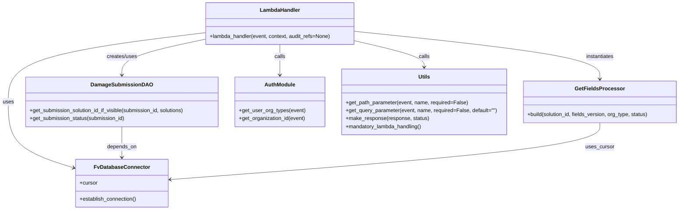

# Diagram: entity_core/entity_service/entity_service/damageview/submission/get_fields.py


> Auto-generated by Obscura crawlers

## Diagram 1

```mermaid
flowchart TD
    Start([Event received]) --> CheckSubmission{submission_id present?}
    CheckSubmission -- Yes --> AuthGet[Get org_type and org_id from auth]
    AuthGet --> GetSolutions[solutions = get_solution_id_list_for_org(org_type, org_id)]
    GetSolutions --> SolutionsEmpty{solutions empty?}
    SolutionsEmpty -- Yes --> RaiseNotFound[Raise NotFoundError("No valid solution found for this organization")]
    SolutionsEmpty -- No --> LookupSolution[solution_id = dao.get_submission_solution_id_if_visible(submission_id, solutions)]
    LookupSolution --> SolutionFound{solution_id found?}
    SolutionFound -- No --> RaiseNotFound
    SolutionFound -- Yes --> GetStatus[status = dao.get_submission_status(submission_id)]
    GetStatus --> QueryFields[fields_version = get_query_parameter(event, "fieldsVersion", required=False, default="")]
    QueryFields --> BuildFields[response = GetFieldsProcessor(cursor).build(solution_id, fields_version, org_type, status)]
    BuildFields --> ReturnResp[return make_response(response, 200)]
    CheckSubmission -- No --> RequireSolution[solution_id = get_path_parameter(event, "solution_id", required=True)]
    RequireSolution --> AuthType[org_type = fv.aws.lambdas.auth.get_user_org_types(event)[0]]
    AuthType --> QueryFields
```

> SVG rendering failed for this diagram.

## Diagram 2



### SVG

<svg id="container" width="2052.28125" xmlns="http://www.w3.org/2000/svg" class="classDiagram" height="632" viewBox="0 0 2052.28125 632" role="graphics-document document" aria-roledescription="class"><style>#container{font-family:"trebuchet ms",verdana,arial,sans-serif;font-size:16px;fill:#333;}@keyframes edge-animation-frame{from{stroke-dashoffset:0;}}@keyframes dash{to{stroke-dashoffset:0;}}#container .edge-animation-slow{stroke-dasharray:9,5!important;stroke-dashoffset:900;animation:dash 50s linear infinite;stroke-linecap:round;}#container .edge-animation-fast{stroke-dasharray:9,5!important;stroke-dashoffset:900;animation:dash 20s linear infinite;stroke-linecap:round;}#container .error-icon{fill:#552222;}#container .error-text{fill:#552222;stroke:#552222;}#container .edge-thickness-normal{stroke-width:1px;}#container .edge-thickness-thick{stroke-width:3.5px;}#container .edge-pattern-solid{stroke-dasharray:0;}#container .edge-thickness-invisible{stroke-width:0;fill:none;}#container .edge-pattern-dashed{stroke-dasharray:3;}#container .edge-pattern-dotted{stroke-dasharray:2;}#container .marker{fill:#333333;stroke:#333333;}#container .marker.cross{stroke:#333333;}#container svg{font-family:"trebuchet ms",verdana,arial,sans-serif;font-size:16px;}#container p{margin:0;}#container g.classGroup text{fill:#9370DB;stroke:none;font-family:"trebuchet ms",verdana,arial,sans-serif;font-size:10px;}#container g.classGroup text .title{font-weight:bolder;}#container .nodeLabel,#container .edgeLabel{color:#131300;}#container .edgeLabel .label rect{fill:#ECECFF;}#container .label text{fill:#131300;}#container .labelBkg{background:#ECECFF;}#container .edgeLabel .label span{background:#ECECFF;}#container .classTitle{font-weight:bolder;}#container .node rect,#container .node circle,#container .node ellipse,#container .node polygon,#container .node path{fill:#ECECFF;stroke:#9370DB;stroke-width:1px;}#container .divider{stroke:#9370DB;stroke-width:1;}#container g.clickable{cursor:pointer;}#container g.classGroup rect{fill:#ECECFF;stroke:#9370DB;}#container g.classGroup line{stroke:#9370DB;stroke-width:1;}#container .classLabel .box{stroke:none;stroke-width:0;fill:#ECECFF;opacity:0.5;}#container .classLabel .label{fill:#9370DB;font-size:10px;}#container .relation{stroke:#333333;stroke-width:1;fill:none;}#container .dashed-line{stroke-dasharray:3;}#container .dotted-line{stroke-dasharray:1 2;}#container #compositionStart,#container .composition{fill:#333333!important;stroke:#333333!important;stroke-width:1;}#container #compositionEnd,#container .composition{fill:#333333!important;stroke:#333333!important;stroke-width:1;}#container #dependencyStart,#container .dependency{fill:#333333!important;stroke:#333333!important;stroke-width:1;}#container #dependencyStart,#container .dependency{fill:#333333!important;stroke:#333333!important;stroke-width:1;}#container #extensionStart,#container .extension{fill:transparent!important;stroke:#333333!important;stroke-width:1;}#container #extensionEnd,#container .extension{fill:transparent!important;stroke:#333333!important;stroke-width:1;}#container #aggregationStart,#container .aggregation{fill:transparent!important;stroke:#333333!important;stroke-width:1;}#container #aggregationEnd,#container .aggregation{fill:transparent!important;stroke:#333333!important;stroke-width:1;}#container #lollipopStart,#container .lollipop{fill:#ECECFF!important;stroke:#333333!important;stroke-width:1;}#container #lollipopEnd,#container .lollipop{fill:#ECECFF!important;stroke:#333333!important;stroke-width:1;}#container .edgeTerminals{font-size:11px;line-height:initial;}#container .classTitleText{text-anchor:middle;font-size:18px;fill:#333;}#container .label-icon{display:inline-block;height:1em;overflow:visible;vertical-align:-0.125em;}#container .node .label-icon path{fill:currentColor;stroke:revert;stroke-width:revert;}#container :root{--mermaid-font-family:"trebuchet ms",verdana,arial,sans-serif;}</style><g><defs><marker id="container_class-aggregationStart" class="marker aggregation class" refX="18" refY="7" markerWidth="190" markerHeight="240" orient="auto"><path d="M 18,7 L9,13 L1,7 L9,1 Z"></path></marker></defs><defs><marker id="container_class-aggregationEnd" class="marker aggregation class" refX="1" refY="7" markerWidth="20" markerHeight="28" orient="auto"><path d="M 18,7 L9,13 L1,7 L9,1 Z"></path></marker></defs><defs><marker id="container_class-extensionStart" class="marker extension class" refX="18" refY="7" markerWidth="190" markerHeight="240" orient="auto"><path d="M 1,7 L18,13 V 1 Z"></path></marker></defs><defs><marker id="container_class-extensionEnd" class="marker extension class" refX="1" refY="7" markerWidth="20" markerHeight="28" orient="auto"><path d="M 1,1 V 13 L18,7 Z"></path></marker></defs><defs><marker id="container_class-compositionStart" class="marker composition class" refX="18" refY="7" markerWidth="190" markerHeight="240" orient="auto"><path d="M 18,7 L9,13 L1,7 L9,1 Z"></path></marker></defs><defs><marker id="container_class-compositionEnd" class="marker composition class" refX="1" refY="7" markerWidth="20" markerHeight="28" orient="auto"><path d="M 18,7 L9,13 L1,7 L9,1 Z"></path></marker></defs><defs><marker id="container_class-dependencyStart" class="marker dependency class" refX="6" refY="7" markerWidth="190" markerHeight="240" orient="auto"><path d="M 5,7 L9,13 L1,7 L9,1 Z"></path></marker></defs><defs><marker id="container_class-dependencyEnd" class="marker dependency class" refX="13" refY="7" markerWidth="20" markerHeight="28" orient="auto"><path d="M 18,7 L9,13 L14,7 L9,1 Z"></path></marker></defs><defs><marker id="container_class-lollipopStart" class="marker lollipop class" refX="13" refY="7" markerWidth="190" markerHeight="240" orient="auto"><circle stroke="black" fill="transparent" cx="7" cy="7" r="6"></circle></marker></defs><defs><marker id="container_class-lollipopEnd" class="marker lollipop class" refX="1" refY="7" markerWidth="190" markerHeight="240" orient="auto"><circle stroke="black" fill="transparent" cx="7" cy="7" r="6"></circle></marker></defs><g class="root"><g class="clusters"></g><g class="edgePaths"><path d="M621.961,98.369L522.383,110.474C422.805,122.579,223.648,146.79,124.07,181.562C24.492,216.333,24.492,261.667,24.492,307C24.492,352.333,24.492,397.667,57.912,430.907C91.331,464.147,158.171,485.293,191.59,495.866L225.01,506.44" id="id_LambdaHandler_FvDatabaseConnector_1" class="edge-thickness-normal edge-pattern-solid relation" style=";;;" data-edge="true" data-et="edge" data-id="id_LambdaHandler_FvDatabaseConnector_1" data-points="W3sieCI6NjIxLjk2MDkzNzUsInkiOjk4LjM2OTA4MDg1OTMwODIzfSx7IngiOjI0LjQ5MjE4NzUsInkiOjE3MX0seyJ4IjoyNC40OTIxODc1LCJ5IjozMDd9LHsieCI6MjQuNDkyMTg3NSwieSI6NDQzfSx7IngiOjIzMC43MzA0Njg3NSwieSI6NTA4LjI0OTQ3Mjc3NzE2MDQ2fV0=" marker-end="url(#container_class-dependencyEnd)"></path><path d="M621.961,118.092L579.803,126.91C537.646,135.728,453.331,153.364,411.173,171.349C369.016,189.333,369.016,207.667,369.016,216.833L369.016,226" id="id_LambdaHandler_DamageSubmissionDAO_2" class="edge-thickness-normal edge-pattern-solid relation" style=";;;" data-edge="true" data-et="edge" data-id="id_LambdaHandler_DamageSubmissionDAO_2" data-points="W3sieCI6NjIxLjk2MDkzNzUsInkiOjExOC4wOTIwODI2ODY0OTR9LHsieCI6MzY5LjAxNTYyNSwieSI6MTcxfSx7IngiOjM2OS4wMTU2MjUsInkiOjIzMn1d" marker-end="url(#container_class-dependencyEnd)"></path><path d="M1072.242,94.329L1195.565,107.107C1318.888,119.886,1565.534,145.443,1688.857,169.388C1812.18,193.333,1812.18,215.667,1812.18,226.833L1812.18,238" id="id_LambdaHandler_GetFieldsProcessor_3" class="edge-thickness-normal edge-pattern-solid relation" style=";;;" data-edge="true" data-et="edge" data-id="id_LambdaHandler_GetFieldsProcessor_3" data-points="W3sieCI6MTA3Mi4yNDIxODc1LCJ5Ijo5NC4zMjg3NDYwNTM1OTAyMn0seyJ4IjoxODEyLjE3OTY4NzUsInkiOjE3MX0seyJ4IjoxODEyLjE3OTY4NzUsInkiOjI0NH1d" marker-end="url(#container_class-dependencyEnd)"></path><path d="M847.102,134L847.102,140.167C847.102,146.333,847.102,158.667,847.102,174C847.102,189.333,847.102,207.667,847.102,216.833L847.102,226" id="id_LambdaHandler_AuthModule_4" class="edge-thickness-normal edge-pattern-solid relation" style=";;;" data-edge="true" data-et="edge" data-id="id_LambdaHandler_AuthModule_4" data-points="W3sieCI6ODQ3LjEwMTU2MjUsInkiOjEzNH0seyJ4Ijo4NDcuMTAxNTYyNSwieSI6MTcxfSx7IngiOjg0Ny4xMDE1NjI1LCJ5IjoyMzJ9XQ==" marker-end="url(#container_class-dependencyEnd)"></path><path d="M1072.242,122.874L1107.055,130.895C1141.867,138.916,1211.492,154.958,1246.305,168.146C1281.117,181.333,1281.117,191.667,1281.117,196.833L1281.117,202" id="id_LambdaHandler_Utils_5" class="edge-thickness-normal edge-pattern-solid relation" style=";;;" data-edge="true" data-et="edge" data-id="id_LambdaHandler_Utils_5" data-points="W3sieCI6MTA3Mi4yNDIxODc1LCJ5IjoxMjIuODczODUyNDY3ODY5MX0seyJ4IjoxMjgxLjExNzE4NzUsInkiOjE3MX0seyJ4IjoxMjgxLjExNzE4NzUsInkiOjIwOH1d" marker-end="url(#container_class-dependencyEnd)"></path><path d="M369.016,382L369.016,392.167C369.016,402.333,369.016,422.667,369.016,438C369.016,453.333,369.016,463.667,369.016,468.833L369.016,474" id="id_DamageSubmissionDAO_FvDatabaseConnector_6" class="edge-thickness-normal edge-pattern-solid relation" style=";;;" data-edge="true" data-et="edge" data-id="id_DamageSubmissionDAO_FvDatabaseConnector_6" data-points="W3sieCI6MzY5LjAxNTYyNSwieSI6MzgyfSx7IngiOjM2OS4wMTU2MjUsInkiOjQ0M30seyJ4IjozNjkuMDE1NjI1LCJ5Ijo0ODB9XQ==" marker-end="url(#container_class-dependencyEnd)"></path><path d="M1812.18,370L1812.18,382.167C1812.18,394.333,1812.18,418.667,1595.697,447.184C1379.214,475.701,946.249,508.402,729.766,524.753L513.284,541.104" id="id_GetFieldsProcessor_FvDatabaseConnector_7" class="edge-thickness-normal edge-pattern-solid relation" style=";;;" data-edge="true" data-et="edge" data-id="id_GetFieldsProcessor_FvDatabaseConnector_7" data-points="W3sieCI6MTgxMi4xNzk2ODc1LCJ5IjozNzB9LHsieCI6MTgxMi4xNzk2ODc1LCJ5Ijo0NDN9LHsieCI6NTA3LjMwMDc4MTI1LCJ5Ijo1NDEuNTU1NTMxMTk1MDE5Nn1d" marker-end="url(#container_class-dependencyEnd)"></path></g><g class="edgeLabels"><g class="edgeLabel" transform="translate(24.4921875, 307)"><g class="label" data-id="id_LambdaHandler_FvDatabaseConnector_1" transform="translate(-16.4921875, -12)"><foreignObject width="32.984375" height="24"><div xmlns="http://www.w3.org/1999/xhtml" class="labelBkg" style="display: table-cell; white-space: nowrap; line-height: 1.5; max-width: 200px; text-align: center;"><span class="edgeLabel"><p>uses</p></span></div></foreignObject></g></g><g class="edgeLabel" transform="translate(369.015625, 171)"><g class="label" data-id="id_LambdaHandler_DamageSubmissionDAO_2" transform="translate(-46.578125, -12)"><foreignObject width="93.15625" height="24"><div xmlns="http://www.w3.org/1999/xhtml" class="labelBkg" style="display: table-cell; white-space: nowrap; line-height: 1.5; max-width: 200px; text-align: center;"><span class="edgeLabel"><p>creates/uses</p></span></div></foreignObject></g></g><g class="edgeLabel" transform="translate(1812.1796875, 171)"><g class="label" data-id="id_LambdaHandler_GetFieldsProcessor_3" transform="translate(-42.9140625, -12)"><foreignObject width="85.828125" height="24"><div xmlns="http://www.w3.org/1999/xhtml" class="labelBkg" style="display: table-cell; white-space: nowrap; line-height: 1.5; max-width: 200px; text-align: center;"><span class="edgeLabel"><p>instantiates</p></span></div></foreignObject></g></g><g class="edgeLabel" transform="translate(847.1015625, 171)"><g class="label" data-id="id_LambdaHandler_AuthModule_4" transform="translate(-16.4453125, -12)"><foreignObject width="32.890625" height="24"><div xmlns="http://www.w3.org/1999/xhtml" class="labelBkg" style="display: table-cell; white-space: nowrap; line-height: 1.5; max-width: 200px; text-align: center;"><span class="edgeLabel"><p>calls</p></span></div></foreignObject></g></g><g class="edgeLabel" transform="translate(1281.1171875, 171)"><g class="label" data-id="id_LambdaHandler_Utils_5" transform="translate(-16.4453125, -12)"><foreignObject width="32.890625" height="24"><div xmlns="http://www.w3.org/1999/xhtml" class="labelBkg" style="display: table-cell; white-space: nowrap; line-height: 1.5; max-width: 200px; text-align: center;"><span class="edgeLabel"><p>calls</p></span></div></foreignObject></g></g><g class="edgeLabel" transform="translate(369.015625, 443)"><g class="label" data-id="id_DamageSubmissionDAO_FvDatabaseConnector_6" transform="translate(-44.671875, -12)"><foreignObject width="89.34375" height="24"><div xmlns="http://www.w3.org/1999/xhtml" class="labelBkg" style="display: table-cell; white-space: nowrap; line-height: 1.5; max-width: 200px; text-align: center;"><span class="edgeLabel"><p>depends_on</p></span></div></foreignObject></g></g><g class="edgeLabel" transform="translate(1812.1796875, 443)"><g class="label" data-id="id_GetFieldsProcessor_FvDatabaseConnector_7" transform="translate(-43.1953125, -12)"><foreignObject width="86.390625" height="24"><div xmlns="http://www.w3.org/1999/xhtml" class="labelBkg" style="display: table-cell; white-space: nowrap; line-height: 1.5; max-width: 200px; text-align: center;"><span class="edgeLabel"><p>uses_cursor</p></span></div></foreignObject></g></g></g><g class="nodes"><g class="node default" id="classId-LambdaHandler-0" transform="translate(847.1015625, 71)"><g class="basic label-container"><path d="M-225.140625 -63 L225.140625 -63 L225.140625 63 L-225.140625 63" stroke="none" stroke-width="0" fill="#ECECFF" style=""></path><path d="M-225.140625 -63 C-107.91419683269244 -63, 9.31223133461512 -63, 225.140625 -63 M-225.140625 -63 C-104.28672958759937 -63, 16.567165824801265 -63, 225.140625 -63 M225.140625 -63 C225.140625 -21.732541078360995, 225.140625 19.53491784327801, 225.140625 63 M225.140625 -63 C225.140625 -35.5419806966191, 225.140625 -8.083961393238198, 225.140625 63 M225.140625 63 C80.50403728967532 63, -64.13255042064935 63, -225.140625 63 M225.140625 63 C48.36080406821995 63, -128.4190168635601 63, -225.140625 63 M-225.140625 63 C-225.140625 15.159967290068579, -225.140625 -32.68006541986284, -225.140625 -63 M-225.140625 63 C-225.140625 17.88874784900274, -225.140625 -27.22250430199452, -225.140625 -63" stroke="#9370DB" stroke-width="1.3" fill="none" stroke-dasharray="0 0" style=""></path></g><g class="annotation-group text" transform="translate(0, -39)"></g><g class="label-group text" transform="translate(-58.21875, -39)"><g class="label" style="font-weight: bolder" transform="translate(0,-12)"><foreignObject width="116.4375" height="24"><div xmlns="http://www.w3.org/1999/xhtml" style="display: table-cell; white-space: nowrap; line-height: 1.5; max-width: 167px; text-align: center;"><span class="nodeLabel markdown-node-label" style=""><p>LambdaHandler</p></span></div></foreignObject></g></g><g class="members-group text" transform="translate(-213.140625, 9)"></g><g class="methods-group text" transform="translate(-213.140625, 39)"><g class="label" style="" transform="translate(0,-12)"><foreignObject width="368.0625" height="24"><div xmlns="http://www.w3.org/1999/xhtml" style="display: table-cell; white-space: nowrap; line-height: 1.5; max-width: 425px; text-align: center;"><span class="nodeLabel markdown-node-label" style=""><p>+lambda_handler(event, context, audit_refs=None)</p></span></div></foreignObject></g></g><g class="divider" style=""><path d="M-225.140625 -15 C-124.91122170553119 -15, -24.68181841106238 -15, 225.140625 -15 M-225.140625 -15 C-57.152311360964575 -15, 110.83600227807085 -15, 225.140625 -15" stroke="#9370DB" stroke-width="1.3" fill="none" stroke-dasharray="0 0" style=""></path></g><g class="divider" style=""><path d="M-225.140625 9 C-67.78817510449122 9, 89.56427479101757 9, 225.140625 9 M-225.140625 9 C-100.95608159731283 9, 23.228461805374337 9, 225.140625 9" stroke="#9370DB" stroke-width="1.3" fill="none" stroke-dasharray="0 0" style=""></path></g></g><g class="node default" id="classId-FvDatabaseConnector-1" transform="translate(369.015625, 552)"><g class="basic label-container"><path d="M-138.28515625 -72 L138.28515625 -72 L138.28515625 72 L-138.28515625 72" stroke="none" stroke-width="0" fill="#ECECFF" style=""></path><path d="M-138.28515625 -72 C-63.510118092798464 -72, 11.264920064403071 -72, 138.28515625 -72 M-138.28515625 -72 C-38.751595075519305 -72, 60.78196609896139 -72, 138.28515625 -72 M138.28515625 -72 C138.28515625 -37.65163965538494, 138.28515625 -3.303279310769881, 138.28515625 72 M138.28515625 -72 C138.28515625 -17.578064557758005, 138.28515625 36.84387088448399, 138.28515625 72 M138.28515625 72 C56.03848090130009 72, -26.20819444739982 72, -138.28515625 72 M138.28515625 72 C77.61125944991144 72, 16.937362649822887 72, -138.28515625 72 M-138.28515625 72 C-138.28515625 41.01471128307834, -138.28515625 10.02942256615669, -138.28515625 -72 M-138.28515625 72 C-138.28515625 21.57033949233014, -138.28515625 -28.859321015339717, -138.28515625 -72" stroke="#9370DB" stroke-width="1.3" fill="none" stroke-dasharray="0 0" style=""></path></g><g class="annotation-group text" transform="translate(0, -48)"></g><g class="label-group text" transform="translate(-79.3046875, -48)"><g class="label" style="font-weight: bolder" transform="translate(0,-12)"><foreignObject width="158.609375" height="24"><div xmlns="http://www.w3.org/1999/xhtml" style="display: table-cell; white-space: nowrap; line-height: 1.5; max-width: 207px; text-align: center;"><span class="nodeLabel markdown-node-label" style=""><p>FvDatabaseConnector</p></span></div></foreignObject></g></g><g class="members-group text" transform="translate(-126.28515625, 0)"><g class="label" style="" transform="translate(0,-12)"><foreignObject width="53.71875" height="24"><div xmlns="http://www.w3.org/1999/xhtml" style="display: table-cell; white-space: nowrap; line-height: 1.5; max-width: 112px; text-align: center;"><span class="nodeLabel markdown-node-label" style=""><p>+cursor</p></span></div></foreignObject></g></g><g class="methods-group text" transform="translate(-126.28515625, 48)"><g class="label" style="" transform="translate(0,-12)"><foreignObject width="173.265625" height="24"><div xmlns="http://www.w3.org/1999/xhtml" style="display: table-cell; white-space: nowrap; line-height: 1.5; max-width: 231px; text-align: center;"><span class="nodeLabel markdown-node-label" style=""><p>+establish_connection()</p></span></div></foreignObject></g></g><g class="divider" style=""><path d="M-138.28515625 -24 C-56.150559482627074 -24, 25.984037284745853 -24, 138.28515625 -24 M-138.28515625 -24 C-44.00382410319874 -24, 50.27750804360252 -24, 138.28515625 -24" stroke="#9370DB" stroke-width="1.3" fill="none" stroke-dasharray="0 0" style=""></path></g><g class="divider" style=""><path d="M-138.28515625 24 C-30.05003488837764 24, 78.18508647324472 24, 138.28515625 24 M-138.28515625 24 C-38.553995805502396 24, 61.17716463899521 24, 138.28515625 24" stroke="#9370DB" stroke-width="1.3" fill="none" stroke-dasharray="0 0" style=""></path></g></g><g class="node default" id="classId-DamageSubmissionDAO-2" transform="translate(369.015625, 307)"><g class="basic label-container"><path d="M-293.03125 -75 L293.03125 -75 L293.03125 75 L-293.03125 75" stroke="none" stroke-width="0" fill="#ECECFF" style=""></path><path d="M-293.03125 -75 C-124.75849657264084 -75, 43.514256854718326 -75, 293.03125 -75 M-293.03125 -75 C-98.61062818387103 -75, 95.80999363225794 -75, 293.03125 -75 M293.03125 -75 C293.03125 -18.127534344172084, 293.03125 38.74493131165583, 293.03125 75 M293.03125 -75 C293.03125 -26.106738314663843, 293.03125 22.786523370672313, 293.03125 75 M293.03125 75 C80.43803364301101 75, -132.15518271397798 75, -293.03125 75 M293.03125 75 C112.03171565524192 75, -68.96781868951615 75, -293.03125 75 M-293.03125 75 C-293.03125 36.2071269401525, -293.03125 -2.5857461196950027, -293.03125 -75 M-293.03125 75 C-293.03125 20.43120571974253, -293.03125 -34.13758856051494, -293.03125 -75" stroke="#9370DB" stroke-width="1.3" fill="none" stroke-dasharray="0 0" style=""></path></g><g class="annotation-group text" transform="translate(0, -51)"></g><g class="label-group text" transform="translate(-86.6875, -51)"><g class="label" style="font-weight: bolder" transform="translate(0,-12)"><foreignObject width="173.375" height="24"><div xmlns="http://www.w3.org/1999/xhtml" style="display: table-cell; white-space: nowrap; line-height: 1.5; max-width: 222px; text-align: center;"><span class="nodeLabel markdown-node-label" style=""><p>DamageSubmissionDAO</p></span></div></foreignObject></g></g><g class="members-group text" transform="translate(-281.03125, -3)"></g><g class="methods-group text" transform="translate(-281.03125, 27)"><g class="label" style="" transform="translate(0,-12)"><foreignObject width="475.375" height="24"><div xmlns="http://www.w3.org/1999/xhtml" style="display: table-cell; white-space: nowrap; line-height: 1.5; max-width: 533px; text-align: center;"><span class="nodeLabel markdown-node-label" style=""><p>+get_submission_solution_id_if_visible(submission_id, solutions)</p></span></div></foreignObject></g><g class="label" style="" transform="translate(0,12)"><foreignObject width="289.421875" height="24"><div xmlns="http://www.w3.org/1999/xhtml" style="display: table-cell; white-space: nowrap; line-height: 1.5; max-width: 347px; text-align: center;"><span class="nodeLabel markdown-node-label" style=""><p>+get_submission_status(submission_id)</p></span></div></foreignObject></g></g><g class="divider" style=""><path d="M-293.03125 -27 C-106.17549085312243 -27, 80.68026829375515 -27, 293.03125 -27 M-293.03125 -27 C-94.6412578271524 -27, 103.7487343456952 -27, 293.03125 -27" stroke="#9370DB" stroke-width="1.3" fill="none" stroke-dasharray="0 0" style=""></path></g><g class="divider" style=""><path d="M-293.03125 -3 C-128.3385286816289 -3, 36.3541926367422 -3, 293.03125 -3 M-293.03125 -3 C-73.89111115362866 -3, 145.2490276927427 -3, 293.03125 -3" stroke="#9370DB" stroke-width="1.3" fill="none" stroke-dasharray="0 0" style=""></path></g></g><g class="node default" id="classId-GetFieldsProcessor-3" transform="translate(1812.1796875, 307)"><g class="basic label-container"><path d="M-232.1015625 -63 L232.1015625 -63 L232.1015625 63 L-232.1015625 63" stroke="none" stroke-width="0" fill="#ECECFF" style=""></path><path d="M-232.1015625 -63 C-58.42231340421378 -63, 115.25693569157244 -63, 232.1015625 -63 M-232.1015625 -63 C-47.14864820441832 -63, 137.80426609116336 -63, 232.1015625 -63 M232.1015625 -63 C232.1015625 -31.785581877047186, 232.1015625 -0.5711637540943713, 232.1015625 63 M232.1015625 -63 C232.1015625 -17.66470900476861, 232.1015625 27.67058199046278, 232.1015625 63 M232.1015625 63 C100.74482652907781 63, -30.611909441844375 63, -232.1015625 63 M232.1015625 63 C136.57953928040314 63, 41.05751606080628 63, -232.1015625 63 M-232.1015625 63 C-232.1015625 31.107221125778665, -232.1015625 -0.7855577484426703, -232.1015625 -63 M-232.1015625 63 C-232.1015625 29.890618590132405, -232.1015625 -3.21876281973519, -232.1015625 -63" stroke="#9370DB" stroke-width="1.3" fill="none" stroke-dasharray="0 0" style=""></path></g><g class="annotation-group text" transform="translate(0, -39)"></g><g class="label-group text" transform="translate(-69.921875, -39)"><g class="label" style="font-weight: bolder" transform="translate(0,-12)"><foreignObject width="139.84375" height="24"><div xmlns="http://www.w3.org/1999/xhtml" style="display: table-cell; white-space: nowrap; line-height: 1.5; max-width: 188px; text-align: center;"><span class="nodeLabel markdown-node-label" style=""><p>GetFieldsProcessor</p></span></div></foreignObject></g></g><g class="members-group text" transform="translate(-220.1015625, 9)"></g><g class="methods-group text" transform="translate(-220.1015625, 39)"><g class="label" style="" transform="translate(0,-12)"><foreignObject width="370.28125" height="24"><div xmlns="http://www.w3.org/1999/xhtml" style="display: table-cell; white-space: nowrap; line-height: 1.5; max-width: 428px; text-align: center;"><span class="nodeLabel markdown-node-label" style=""><p>+build(solution_id, fields_version, org_type, status)</p></span></div></foreignObject></g></g><g class="divider" style=""><path d="M-232.1015625 -15 C-105.42365133767318 -15, 21.254259824653644 -15, 232.1015625 -15 M-232.1015625 -15 C-116.36621271843303 -15, -0.6308629368660661 -15, 232.1015625 -15" stroke="#9370DB" stroke-width="1.3" fill="none" stroke-dasharray="0 0" style=""></path></g><g class="divider" style=""><path d="M-232.1015625 9 C-74.97807736085053 9, 82.14540777829893 9, 232.1015625 9 M-232.1015625 9 C-75.0531751630968 9, 81.99521217380641 9, 232.1015625 9" stroke="#9370DB" stroke-width="1.3" fill="none" stroke-dasharray="0 0" style=""></path></g></g><g class="node default" id="classId-AuthModule-4" transform="translate(847.1015625, 307)"><g class="basic label-container"><path d="M-135.0546875 -75 L135.0546875 -75 L135.0546875 75 L-135.0546875 75" stroke="none" stroke-width="0" fill="#ECECFF" style=""></path><path d="M-135.0546875 -75 C-71.94857653360339 -75, -8.842465567206773 -75, 135.0546875 -75 M-135.0546875 -75 C-35.22883626333936 -75, 64.59701497332128 -75, 135.0546875 -75 M135.0546875 -75 C135.0546875 -30.821079968415546, 135.0546875 13.357840063168908, 135.0546875 75 M135.0546875 -75 C135.0546875 -30.82996542274101, 135.0546875 13.340069154517977, 135.0546875 75 M135.0546875 75 C73.80546408708395 75, 12.556240674167896 75, -135.0546875 75 M135.0546875 75 C55.87375294931162 75, -23.307181601376755 75, -135.0546875 75 M-135.0546875 75 C-135.0546875 31.62392301698641, -135.0546875 -11.75215396602718, -135.0546875 -75 M-135.0546875 75 C-135.0546875 18.146043702133923, -135.0546875 -38.707912595732154, -135.0546875 -75" stroke="#9370DB" stroke-width="1.3" fill="none" stroke-dasharray="0 0" style=""></path></g><g class="annotation-group text" transform="translate(0, -51)"></g><g class="label-group text" transform="translate(-44.09375, -51)"><g class="label" style="font-weight: bolder" transform="translate(0,-12)"><foreignObject width="88.1875" height="24"><div xmlns="http://www.w3.org/1999/xhtml" style="display: table-cell; white-space: nowrap; line-height: 1.5; max-width: 138px; text-align: center;"><span class="nodeLabel markdown-node-label" style=""><p>AuthModule</p></span></div></foreignObject></g></g><g class="members-group text" transform="translate(-123.0546875, -3)"></g><g class="methods-group text" transform="translate(-123.0546875, 27)"><g class="label" style="" transform="translate(0,-12)"><foreignObject width="198.578125" height="24"><div xmlns="http://www.w3.org/1999/xhtml" style="display: table-cell; white-space: nowrap; line-height: 1.5; max-width: 256px; text-align: center;"><span class="nodeLabel markdown-node-label" style=""><p>+get_user_org_types(event)</p></span></div></foreignObject></g><g class="label" style="" transform="translate(0,12)"><foreignObject width="202.015625" height="24"><div xmlns="http://www.w3.org/1999/xhtml" style="display: table-cell; white-space: nowrap; line-height: 1.5; max-width: 259px; text-align: center;"><span class="nodeLabel markdown-node-label" style=""><p>+get_organization_id(event)</p></span></div></foreignObject></g></g><g class="divider" style=""><path d="M-135.0546875 -27 C-48.35150564838273 -27, 38.35167620323455 -27, 135.0546875 -27 M-135.0546875 -27 C-32.07953571735193 -27, 70.89561606529614 -27, 135.0546875 -27" stroke="#9370DB" stroke-width="1.3" fill="none" stroke-dasharray="0 0" style=""></path></g><g class="divider" style=""><path d="M-135.0546875 -3 C-75.1874768064171 -3, -15.32026611283419 -3, 135.0546875 -3 M-135.0546875 -3 C-64.71192777795181 -3, 5.6308319440963714 -3, 135.0546875 -3" stroke="#9370DB" stroke-width="1.3" fill="none" stroke-dasharray="0 0" style=""></path></g></g><g class="node default" id="classId-Utils-5" transform="translate(1281.1171875, 307)"><g class="basic label-container"><path d="M-248.9609375 -99 L248.9609375 -99 L248.9609375 99 L-248.9609375 99" stroke="none" stroke-width="0" fill="#ECECFF" style=""></path><path d="M-248.9609375 -99 C-61.90409221197058 -99, 125.15275307605884 -99, 248.9609375 -99 M-248.9609375 -99 C-81.84768039531403 -99, 85.26557670937194 -99, 248.9609375 -99 M248.9609375 -99 C248.9609375 -44.876247510657244, 248.9609375 9.247504978685512, 248.9609375 99 M248.9609375 -99 C248.9609375 -44.27007426814665, 248.9609375 10.459851463706698, 248.9609375 99 M248.9609375 99 C142.37198934556545 99, 35.78304119113088 99, -248.9609375 99 M248.9609375 99 C79.37081147222236 99, -90.21931455555529 99, -248.9609375 99 M-248.9609375 99 C-248.9609375 34.89391691909155, -248.9609375 -29.212166161816896, -248.9609375 -99 M-248.9609375 99 C-248.9609375 33.868284553476556, -248.9609375 -31.263430893046888, -248.9609375 -99" stroke="#9370DB" stroke-width="1.3" fill="none" stroke-dasharray="0 0" style=""></path></g><g class="annotation-group text" transform="translate(0, -75)"></g><g class="label-group text" transform="translate(-16.796875, -75)"><g class="label" style="font-weight: bolder" transform="translate(0,-12)"><foreignObject width="33.59375" height="24"><div xmlns="http://www.w3.org/1999/xhtml" style="display: table-cell; white-space: nowrap; line-height: 1.5; max-width: 83px; text-align: center;"><span class="nodeLabel markdown-node-label" style=""><p>Utils</p></span></div></foreignObject></g></g><g class="members-group text" transform="translate(-236.9609375, -27)"></g><g class="methods-group text" transform="translate(-236.9609375, 3)"><g class="label" style="" transform="translate(0,-12)"><foreignObject width="369.015625" height="24"><div xmlns="http://www.w3.org/1999/xhtml" style="display: table-cell; white-space: nowrap; line-height: 1.5; max-width: 426px; text-align: center;"><span class="nodeLabel markdown-node-label" style=""><p>+get_path_parameter(event, name, required=False)</p></span></div></foreignObject></g><g class="label" style="" transform="translate(0,12)"><foreignObject width="457.125" height="24"><div xmlns="http://www.w3.org/1999/xhtml" style="display: table-cell; white-space: nowrap; line-height: 1.5; max-width: 514px; text-align: center;"><span class="nodeLabel markdown-node-label" style=""><p>+get_query_parameter(event, name, required=False, default="")</p></span></div></foreignObject></g><g class="label" style="" transform="translate(0,36)"><foreignObject width="250.46875" height="24"><div xmlns="http://www.w3.org/1999/xhtml" style="display: table-cell; white-space: nowrap; line-height: 1.5; max-width: 308px; text-align: center;"><span class="nodeLabel markdown-node-label" style=""><p>+make_response(response, status)</p></span></div></foreignObject></g><g class="label" style="" transform="translate(0,60)"><foreignObject width="232.078125" height="24"><div xmlns="http://www.w3.org/1999/xhtml" style="display: table-cell; white-space: nowrap; line-height: 1.5; max-width: 289px; text-align: center;"><span class="nodeLabel markdown-node-label" style=""><p>+mandatory_lambda_handling()</p></span></div></foreignObject></g></g><g class="divider" style=""><path d="M-248.9609375 -51 C-100.85304648973022 -51, 47.254844520539564 -51, 248.9609375 -51 M-248.9609375 -51 C-95.28687823481167 -51, 58.38718103037667 -51, 248.9609375 -51" stroke="#9370DB" stroke-width="1.3" fill="none" stroke-dasharray="0 0" style=""></path></g><g class="divider" style=""><path d="M-248.9609375 -27 C-66.44130006007634 -27, 116.07833737984731 -27, 248.9609375 -27 M-248.9609375 -27 C-73.10836130291403 -27, 102.74421489417193 -27, 248.9609375 -27" stroke="#9370DB" stroke-width="1.3" fill="none" stroke-dasharray="0 0" style=""></path></g></g></g></g></g></svg>
