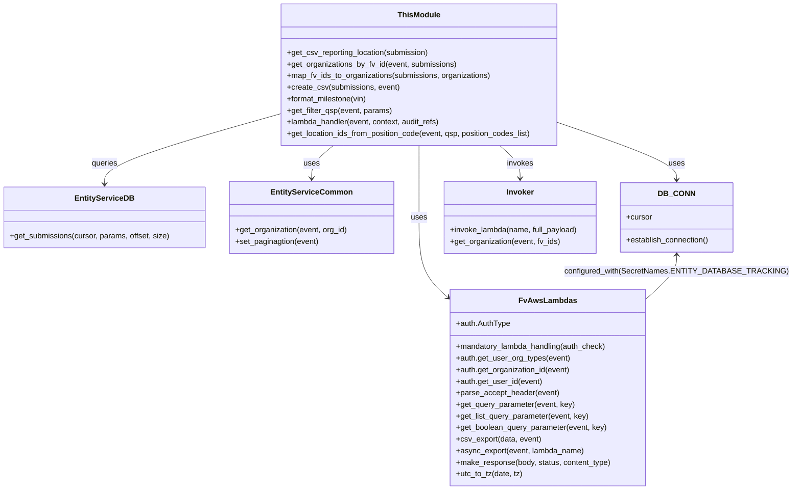

# Diagram: entity_core/entity_service/entity_service/damageview/submission/get_submission.py


> Auto-generated by Obscura crawlers

## Diagram 1

```mermaid
flowchart TD
    A[Event received: lambda_handler] --> B[Auth: get user org type, org_id, user_id]
    B --> C[Parse Accept header & query params]
    C --> D{Async CSV export requested?}
    D -- yes --> E[Call async_export(CSV_LAMBDAS.DAMAGE_VIEW_SUBMISSIONS)]
    D -- no --> F[Validate search_version]
    F --> G[Build params (user_email, search_version, pagination, sort)]
    G --> H[DB_CONN.establish_connection()]
    H --> I[get_solution_id_list_for_org(org_type, org_id)]
    I --> J{solution_id found?}
    J -- no --> K[Raise NotFoundError("No valid solution")]
    J -- yes --> L[entity_service.db.damageview.get_submissions(cursor, params, page_offset, page_size)]
    L --> M[For each submission: resolve reportingLocationId -> get_address_as_admin or set "In transit"]
    M --> N{export_file_type == CSV?}
    N -- yes --> O[create_csv(submissions, event)]
    O --> P[get_organizations_by_fv_id(event, submissions) -> get_organization(event, fv_ids)]
    P --> Q[map_fv_ids_to_organizations(submissions, organizations)]
    Q --> R[csv_export(data, event) -> make_response(response, 200, content_type="text/csv")]
    N -- no --> S[Build JSON response with meta and data]
    S --> T[make_response(response, 200)]
    R --> U[Return response]
    T --> U[Return response]
```

> SVG rendering failed for this diagram.

## Diagram 2



### SVG

<svg id="container" width="1620.1015625" xmlns="http://www.w3.org/2000/svg" class="classDiagram" height="1016" viewBox="0 0 1620.1015625 1016" role="graphics-document document" aria-roledescription="class"><style>#container{font-family:"trebuchet ms",verdana,arial,sans-serif;font-size:16px;fill:#333;}@keyframes edge-animation-frame{from{stroke-dashoffset:0;}}@keyframes dash{to{stroke-dashoffset:0;}}#container .edge-animation-slow{stroke-dasharray:9,5!important;stroke-dashoffset:900;animation:dash 50s linear infinite;stroke-linecap:round;}#container .edge-animation-fast{stroke-dasharray:9,5!important;stroke-dashoffset:900;animation:dash 20s linear infinite;stroke-linecap:round;}#container .error-icon{fill:#552222;}#container .error-text{fill:#552222;stroke:#552222;}#container .edge-thickness-normal{stroke-width:1px;}#container .edge-thickness-thick{stroke-width:3.5px;}#container .edge-pattern-solid{stroke-dasharray:0;}#container .edge-thickness-invisible{stroke-width:0;fill:none;}#container .edge-pattern-dashed{stroke-dasharray:3;}#container .edge-pattern-dotted{stroke-dasharray:2;}#container .marker{fill:#333333;stroke:#333333;}#container .marker.cross{stroke:#333333;}#container svg{font-family:"trebuchet ms",verdana,arial,sans-serif;font-size:16px;}#container p{margin:0;}#container g.classGroup text{fill:#9370DB;stroke:none;font-family:"trebuchet ms",verdana,arial,sans-serif;font-size:10px;}#container g.classGroup text .title{font-weight:bolder;}#container .nodeLabel,#container .edgeLabel{color:#131300;}#container .edgeLabel .label rect{fill:#ECECFF;}#container .label text{fill:#131300;}#container .labelBkg{background:#ECECFF;}#container .edgeLabel .label span{background:#ECECFF;}#container .classTitle{font-weight:bolder;}#container .node rect,#container .node circle,#container .node ellipse,#container .node polygon,#container .node path{fill:#ECECFF;stroke:#9370DB;stroke-width:1px;}#container .divider{stroke:#9370DB;stroke-width:1;}#container g.clickable{cursor:pointer;}#container g.classGroup rect{fill:#ECECFF;stroke:#9370DB;}#container g.classGroup line{stroke:#9370DB;stroke-width:1;}#container .classLabel .box{stroke:none;stroke-width:0;fill:#ECECFF;opacity:0.5;}#container .classLabel .label{fill:#9370DB;font-size:10px;}#container .relation{stroke:#333333;stroke-width:1;fill:none;}#container .dashed-line{stroke-dasharray:3;}#container .dotted-line{stroke-dasharray:1 2;}#container #compositionStart,#container .composition{fill:#333333!important;stroke:#333333!important;stroke-width:1;}#container #compositionEnd,#container .composition{fill:#333333!important;stroke:#333333!important;stroke-width:1;}#container #dependencyStart,#container .dependency{fill:#333333!important;stroke:#333333!important;stroke-width:1;}#container #dependencyStart,#container .dependency{fill:#333333!important;stroke:#333333!important;stroke-width:1;}#container #extensionStart,#container .extension{fill:transparent!important;stroke:#333333!important;stroke-width:1;}#container #extensionEnd,#container .extension{fill:transparent!important;stroke:#333333!important;stroke-width:1;}#container #aggregationStart,#container .aggregation{fill:transparent!important;stroke:#333333!important;stroke-width:1;}#container #aggregationEnd,#container .aggregation{fill:transparent!important;stroke:#333333!important;stroke-width:1;}#container #lollipopStart,#container .lollipop{fill:#ECECFF!important;stroke:#333333!important;stroke-width:1;}#container #lollipopEnd,#container .lollipop{fill:#ECECFF!important;stroke:#333333!important;stroke-width:1;}#container .edgeTerminals{font-size:11px;line-height:initial;}#container .classTitleText{text-anchor:middle;font-size:18px;fill:#333;}#container .label-icon{display:inline-block;height:1em;overflow:visible;vertical-align:-0.125em;}#container .node .label-icon path{fill:currentColor;stroke:revert;stroke-width:revert;}#container :root{--mermaid-font-family:"trebuchet ms",verdana,arial,sans-serif;}</style><g><defs><marker id="container_class-aggregationStart" class="marker aggregation class" refX="18" refY="7" markerWidth="190" markerHeight="240" orient="auto"><path d="M 18,7 L9,13 L1,7 L9,1 Z"></path></marker></defs><defs><marker id="container_class-aggregationEnd" class="marker aggregation class" refX="1" refY="7" markerWidth="20" markerHeight="28" orient="auto"><path d="M 18,7 L9,13 L1,7 L9,1 Z"></path></marker></defs><defs><marker id="container_class-extensionStart" class="marker extension class" refX="18" refY="7" markerWidth="190" markerHeight="240" orient="auto"><path d="M 1,7 L18,13 V 1 Z"></path></marker></defs><defs><marker id="container_class-extensionEnd" class="marker extension class" refX="1" refY="7" markerWidth="20" markerHeight="28" orient="auto"><path d="M 1,1 V 13 L18,7 Z"></path></marker></defs><defs><marker id="container_class-compositionStart" class="marker composition class" refX="18" refY="7" markerWidth="190" markerHeight="240" orient="auto"><path d="M 18,7 L9,13 L1,7 L9,1 Z"></path></marker></defs><defs><marker id="container_class-compositionEnd" class="marker composition class" refX="1" refY="7" markerWidth="20" markerHeight="28" orient="auto"><path d="M 18,7 L9,13 L1,7 L9,1 Z"></path></marker></defs><defs><marker id="container_class-dependencyStart" class="marker dependency class" refX="6" refY="7" markerWidth="190" markerHeight="240" orient="auto"><path d="M 5,7 L9,13 L1,7 L9,1 Z"></path></marker></defs><defs><marker id="container_class-dependencyEnd" class="marker dependency class" refX="13" refY="7" markerWidth="20" markerHeight="28" orient="auto"><path d="M 18,7 L9,13 L14,7 L9,1 Z"></path></marker></defs><defs><marker id="container_class-lollipopStart" class="marker lollipop class" refX="13" refY="7" markerWidth="190" markerHeight="240" orient="auto"><circle stroke="black" fill="transparent" cx="7" cy="7" r="6"></circle></marker></defs><defs><marker id="container_class-lollipopEnd" class="marker lollipop class" refX="1" refY="7" markerWidth="190" markerHeight="240" orient="auto"><circle stroke="black" fill="transparent" cx="7" cy="7" r="6"></circle></marker></defs><g class="root"><g class="clusters"></g><g class="edgePaths"><path d="M860.313,302L860.313,308.167C860.313,314.333,860.313,326.667,860.313,351.5C860.313,376.333,860.313,413.667,860.313,451C860.313,488.333,860.313,525.667,870.704,553.675C881.095,581.684,901.877,600.368,912.268,609.71L922.659,619.052" id="id_ThisModule_FvAwsLambdas_1" class="edge-thickness-normal edge-pattern-solid relation" style=";;;" data-edge="true" data-et="edge" data-id="id_ThisModule_FvAwsLambdas_1" data-points="W3sieCI6ODYwLjMxMjUsInkiOjMwMn0seyJ4Ijo4NjAuMzEyNSwieSI6MzM5fSx7IngiOjg2MC4zMTI1LCJ5Ijo0NTF9LHsieCI6ODYwLjMxMjUsInkiOjU2M30seyJ4Ijo5MjcuMTIxMDkzNzUsInkiOjYyMy4wNjM4Njk3ODMxNjYyfV0=" marker-end="url(#container_class-dependencyEnd)"></path><path d="M569.98,237.729L510.747,254.608C451.513,271.486,333.046,305.243,273.812,329.288C214.578,353.333,214.578,367.667,214.578,374.833L214.578,382" id="id_ThisModule_EntityServiceDB_2" class="edge-thickness-normal edge-pattern-solid relation" style=";;;" data-edge="true" data-et="edge" data-id="id_ThisModule_EntityServiceDB_2" data-points="W3sieCI6NTY5Ljk4MDQ2ODc1LCJ5IjoyMzcuNzI5MjA4NTA3NzU1MjN9LHsieCI6MjE0LjU3ODEyNSwieSI6MzM5fSx7IngiOjIxNC41NzgxMjUsInkiOjM4OH1d" marker-end="url(#container_class-dependencyEnd)"></path><path d="M684.293,302L676.909,308.167C669.524,314.333,654.756,326.667,647.372,338C639.988,349.333,639.988,359.667,639.988,364.833L639.988,370" id="id_ThisModule_EntityServiceCommon_3" class="edge-thickness-normal edge-pattern-solid relation" style=";;;" data-edge="true" data-et="edge" data-id="id_ThisModule_EntityServiceCommon_3" data-points="W3sieCI6Njg0LjI5MjYwNzg0NjQ2NzQsInkiOjMwMn0seyJ4Ijo2MzkuOTg4MjgxMjUsInkiOjMzOX0seyJ4Ijo2MzkuOTg4MjgxMjUsInkiOjM3Nn1d" marker-end="url(#container_class-dependencyEnd)"></path><path d="M1150.645,254.643L1191.61,268.702C1232.576,282.762,1314.507,310.881,1355.472,330.607C1396.438,350.333,1396.438,361.667,1396.438,367.333L1396.438,373" id="id_ThisModule_DB_CONN_4" class="edge-thickness-normal edge-pattern-solid relation" style=";;;" data-edge="true" data-et="edge" data-id="id_ThisModule_DB_CONN_4" data-points="W3sieCI6MTE1MC42NDQ1MzEyNSwieSI6MjU0LjY0Mjk4MjA0NzA5NzIzfSx7IngiOjEzOTYuNDM3NSwieSI6MzM5fSx7IngiOjEzOTYuNDM3NSwieSI6Mzc5fV0=" marker-end="url(#container_class-dependencyEnd)"></path><path d="M1028.796,302L1035.864,308.167C1042.932,314.333,1057.067,326.667,1064.135,338C1071.203,349.333,1071.203,359.667,1071.203,364.833L1071.203,370" id="id_ThisModule_Invoker_5" class="edge-thickness-normal edge-pattern-solid relation" style=";;;" data-edge="true" data-et="edge" data-id="id_ThisModule_Invoker_5" data-points="W3sieCI6MTAyOC43OTU3NzEwNTk3ODI1LCJ5IjozMDJ9LHsieCI6MTA3MS4yMDMxMjUsInkiOjMzOX0seyJ4IjoxMDcxLjIwMzEyNSwieSI6Mzc2fV0=" marker-end="url(#container_class-dependencyEnd)"></path><path d="M1396.438,529L1396.438,534.667C1396.438,540.333,1396.438,551.667,1385.303,567.344C1374.168,583.021,1351.898,603.043,1340.764,613.053L1329.629,623.064" id="id_DB_CONN_FvAwsLambdas_6" class="edge-thickness-normal edge-pattern-solid relation" style=";;;" data-edge="true" data-et="edge" data-id="id_DB_CONN_FvAwsLambdas_6" data-points="W3sieCI6MTM5Ni40Mzc1LCJ5Ijo1MjN9LHsieCI6MTM5Ni40Mzc1LCJ5Ijo1NjN9LHsieCI6MTMyOS42Mjg5MDYyNSwieSI6NjIzLjA2Mzg2OTc4MzE2NjJ9XQ==" marker-start="url(#container_class-dependencyStart)"></path></g><g class="edgeLabels"><g class="edgeLabel" transform="translate(860.3125, 451)"><g class="label" data-id="id_ThisModule_FvAwsLambdas_1" transform="translate(-16.4921875, -12)"><foreignObject width="32.984375" height="24"><div xmlns="http://www.w3.org/1999/xhtml" class="labelBkg" style="display: table-cell; white-space: nowrap; line-height: 1.5; max-width: 200px; text-align: center;"><span class="edgeLabel"><p>uses</p></span></div></foreignObject></g></g><g class="edgeLabel" transform="translate(214.578125, 339)"><g class="label" data-id="id_ThisModule_EntityServiceDB_2" transform="translate(-27.2421875, -12)"><foreignObject width="54.484375" height="24"><div xmlns="http://www.w3.org/1999/xhtml" class="labelBkg" style="display: table-cell; white-space: nowrap; line-height: 1.5; max-width: 200px; text-align: center;"><span class="edgeLabel"><p>queries</p></span></div></foreignObject></g></g><g class="edgeLabel" transform="translate(639.98828125, 339)"><g class="label" data-id="id_ThisModule_EntityServiceCommon_3" transform="translate(-16.4921875, -12)"><foreignObject width="32.984375" height="24"><div xmlns="http://www.w3.org/1999/xhtml" class="labelBkg" style="display: table-cell; white-space: nowrap; line-height: 1.5; max-width: 200px; text-align: center;"><span class="edgeLabel"><p>uses</p></span></div></foreignObject></g></g><g class="edgeLabel" transform="translate(1396.4375, 339)"><g class="label" data-id="id_ThisModule_DB_CONN_4" transform="translate(-16.4921875, -12)"><foreignObject width="32.984375" height="24"><div xmlns="http://www.w3.org/1999/xhtml" class="labelBkg" style="display: table-cell; white-space: nowrap; line-height: 1.5; max-width: 200px; text-align: center;"><span class="edgeLabel"><p>uses</p></span></div></foreignObject></g></g><g class="edgeLabel" transform="translate(1071.203125, 339)"><g class="label" data-id="id_ThisModule_Invoker_5" transform="translate(-27.5859375, -12)"><foreignObject width="55.171875" height="24"><div xmlns="http://www.w3.org/1999/xhtml" class="labelBkg" style="display: table-cell; white-space: nowrap; line-height: 1.5; max-width: 200px; text-align: center;"><span class="edgeLabel"><p>invokes</p></span></div></foreignObject></g></g><g class="edgeLabel" transform="translate(1396.4375, 563)"><g class="label" data-id="id_DB_CONN_FvAwsLambdas_6" transform="translate(-215.6640625, -12)"><foreignObject width="431.328125" height="24"><div xmlns="http://www.w3.org/1999/xhtml" class="labelBkg" style="display: table; white-space: break-spaces; line-height: 1.5; max-width: 200px; text-align: center; width: 200px;"><span class="edgeLabel"><p>configured_with(SecretNames.ENTITY_DATABASE_TRACKING)</p></span></div></foreignObject></g></g></g><g class="nodes"><g class="node default" id="classId-ThisModule-0" transform="translate(860.3125, 155)"><g class="basic label-container"><path d="M-290.33203125 -147 L290.33203125 -147 L290.33203125 147 L-290.33203125 147" stroke="none" stroke-width="0" fill="#ECECFF" style=""></path><path d="M-290.33203125 -147 C-64.4817320434546 -147, 161.3685671630908 -147, 290.33203125 -147 M-290.33203125 -147 C-135.1527227868409 -147, 20.026585676318177 -147, 290.33203125 -147 M290.33203125 -147 C290.33203125 -61.90546648488639, 290.33203125 23.18906703022722, 290.33203125 147 M290.33203125 -147 C290.33203125 -59.3220371546674, 290.33203125 28.355925690665202, 290.33203125 147 M290.33203125 147 C82.09231798567819 147, -126.14739527864361 147, -290.33203125 147 M290.33203125 147 C149.03369106473784 147, 7.735350879475675 147, -290.33203125 147 M-290.33203125 147 C-290.33203125 50.919697405320264, -290.33203125 -45.16060518935947, -290.33203125 -147 M-290.33203125 147 C-290.33203125 53.86558034946317, -290.33203125 -39.268839301073655, -290.33203125 -147" stroke="#9370DB" stroke-width="1.3" fill="none" stroke-dasharray="0 0" style=""></path></g><g class="annotation-group text" transform="translate(0, -123)"></g><g class="label-group text" transform="translate(-42.1484375, -123)"><g class="label" style="font-weight: bolder" transform="translate(0,-12)"><foreignObject width="84.296875" height="24"><div xmlns="http://www.w3.org/1999/xhtml" style="display: table-cell; white-space: nowrap; line-height: 1.5; max-width: 134px; text-align: center;"><span class="nodeLabel markdown-node-label" style=""><p>ThisModule</p></span></div></foreignObject></g></g><g class="members-group text" transform="translate(-278.33203125, -75)"></g><g class="methods-group text" transform="translate(-278.33203125, -45)"><g class="label" style="" transform="translate(0,-12)"><foreignObject width="296.8125" height="24"><div xmlns="http://www.w3.org/1999/xhtml" style="display: table-cell; white-space: nowrap; line-height: 1.5; max-width: 354px; text-align: center;"><span class="nodeLabel markdown-node-label" style=""><p>+get_csv_reporting_location(submission)</p></span></div></foreignObject></g><g class="label" style="" transform="translate(0,12)"><foreignObject width="353.203125" height="24"><div xmlns="http://www.w3.org/1999/xhtml" style="display: table-cell; white-space: nowrap; line-height: 1.5; max-width: 411px; text-align: center;"><span class="nodeLabel markdown-node-label" style=""><p>+get_organizations_by_fv_id(event, submissions)</p></span></div></foreignObject></g><g class="label" style="" transform="translate(0,36)"><foreignObject width="424.546875" height="24"><div xmlns="http://www.w3.org/1999/xhtml" style="display: table-cell; white-space: nowrap; line-height: 1.5; max-width: 482px; text-align: center;"><span class="nodeLabel markdown-node-label" style=""><p>+map_fv_ids_to_organizations(submissions, organizations)</p></span></div></foreignObject></g><g class="label" style="" transform="translate(0,60)"><foreignObject width="232.046875" height="24"><div xmlns="http://www.w3.org/1999/xhtml" style="display: table-cell; white-space: nowrap; line-height: 1.5; max-width: 289px; text-align: center;"><span class="nodeLabel markdown-node-label" style=""><p>+create_csv(submissions, event)</p></span></div></foreignObject></g><g class="label" style="" transform="translate(0,84)"><foreignObject width="169.109375" height="24"><div xmlns="http://www.w3.org/1999/xhtml" style="display: table-cell; white-space: nowrap; line-height: 1.5; max-width: 226px; text-align: center;"><span class="nodeLabel markdown-node-label" style=""><p>+format_milestone(vin)</p></span></div></foreignObject></g><g class="label" style="" transform="translate(0,108)"><foreignObject width="218.53125" height="24"><div xmlns="http://www.w3.org/1999/xhtml" style="display: table-cell; white-space: nowrap; line-height: 1.5; max-width: 276px; text-align: center;"><span class="nodeLabel markdown-node-label" style=""><p>+get_filter_qsp(event, params)</p></span></div></foreignObject></g><g class="label" style="" transform="translate(0,132)"><foreignObject width="321.6875" height="24"><div xmlns="http://www.w3.org/1999/xhtml" style="display: table-cell; white-space: nowrap; line-height: 1.5; max-width: 379px; text-align: center;"><span class="nodeLabel markdown-node-label" style=""><p>+lambda_handler(event, context, audit_refs)</p></span></div></foreignObject></g><g class="label" style="" transform="translate(0,156)"><foreignObject width="514.515625" height="24"><div xmlns="http://www.w3.org/1999/xhtml" style="display: table-cell; white-space: nowrap; line-height: 1.5; max-width: 572px; text-align: center;"><span class="nodeLabel markdown-node-label" style=""><p>+get_location_ids_from_position_code(event, qsp, position_codes_list)</p></span></div></foreignObject></g></g><g class="divider" style=""><path d="M-290.33203125 -99 C-141.13307888118376 -99, 8.065873487632473 -99, 290.33203125 -99 M-290.33203125 -99 C-98.74636145708567 -99, 92.83930833582866 -99, 290.33203125 -99" stroke="#9370DB" stroke-width="1.3" fill="none" stroke-dasharray="0 0" style=""></path></g><g class="divider" style=""><path d="M-290.33203125 -75 C-81.09451198647201 -75, 128.14300727705597 -75, 290.33203125 -75 M-290.33203125 -75 C-110.3494125545532 -75, 69.6332061408936 -75, 290.33203125 -75" stroke="#9370DB" stroke-width="1.3" fill="none" stroke-dasharray="0 0" style=""></path></g></g><g class="node default" id="classId-FvAwsLambdas-1" transform="translate(1128.375, 804)"><g class="basic label-container"><path d="M-201.25390625 -204 L201.25390625 -204 L201.25390625 204 L-201.25390625 204" stroke="none" stroke-width="0" fill="#ECECFF" style=""></path><path d="M-201.25390625 -204 C-85.85099952301725 -204, 29.5519072039655 -204, 201.25390625 -204 M-201.25390625 -204 C-100.00923324472893 -204, 1.2354397605421354 -204, 201.25390625 -204 M201.25390625 -204 C201.25390625 -41.45531768481138, 201.25390625 121.08936463037725, 201.25390625 204 M201.25390625 -204 C201.25390625 -53.451371921366416, 201.25390625 97.09725615726717, 201.25390625 204 M201.25390625 204 C92.17546274416851 204, -16.902980761662974 204, -201.25390625 204 M201.25390625 204 C92.37059551357521 204, -16.51271522284958 204, -201.25390625 204 M-201.25390625 204 C-201.25390625 68.07935082089728, -201.25390625 -67.84129835820545, -201.25390625 -204 M-201.25390625 204 C-201.25390625 109.27973199341051, -201.25390625 14.559463986821015, -201.25390625 -204" stroke="#9370DB" stroke-width="1.3" fill="none" stroke-dasharray="0 0" style=""></path></g><g class="annotation-group text" transform="translate(0, -180)"></g><g class="label-group text" transform="translate(-55.2109375, -180)"><g class="label" style="font-weight: bolder" transform="translate(0,-12)"><foreignObject width="110.421875" height="24"><div xmlns="http://www.w3.org/1999/xhtml" style="display: table-cell; white-space: nowrap; line-height: 1.5; max-width: 159px; text-align: center;"><span class="nodeLabel markdown-node-label" style=""><p>FvAwsLambdas</p></span></div></foreignObject></g></g><g class="members-group text" transform="translate(-189.25390625, -132)"><g class="label" style="" transform="translate(0,-12)"><foreignObject width="112.1875" height="24"><div xmlns="http://www.w3.org/1999/xhtml" style="display: table-cell; white-space: nowrap; line-height: 1.5; max-width: 170px; text-align: center;"><span class="nodeLabel markdown-node-label" style=""><p>+auth.AuthType</p></span></div></foreignObject></g></g><g class="methods-group text" transform="translate(-189.25390625, -84)"><g class="label" style="" transform="translate(0,-12)"><foreignObject width="314.828125" height="24"><div xmlns="http://www.w3.org/1999/xhtml" style="display: table-cell; white-space: nowrap; line-height: 1.5; max-width: 372px; text-align: center;"><span class="nodeLabel markdown-node-label" style=""><p>+mandatory_lambda_handling(auth_check)</p></span></div></foreignObject></g><g class="label" style="" transform="translate(0,12)"><foreignObject width="235.1875" height="24"><div xmlns="http://www.w3.org/1999/xhtml" style="display: table-cell; white-space: nowrap; line-height: 1.5; max-width: 293px; text-align: center;"><span class="nodeLabel markdown-node-label" style=""><p>+auth.get_user_org_types(event)</p></span></div></foreignObject></g><g class="label" style="" transform="translate(0,36)"><foreignObject width="238.609375" height="24"><div xmlns="http://www.w3.org/1999/xhtml" style="display: table-cell; white-space: nowrap; line-height: 1.5; max-width: 296px; text-align: center;"><span class="nodeLabel markdown-node-label" style=""><p>+auth.get_organization_id(event)</p></span></div></foreignObject></g><g class="label" style="" transform="translate(0,60)"><foreignObject width="178.671875" height="24"><div xmlns="http://www.w3.org/1999/xhtml" style="display: table-cell; white-space: nowrap; line-height: 1.5; max-width: 236px; text-align: center;"><span class="nodeLabel markdown-node-label" style=""><p>+auth.get_user_id(event)</p></span></div></foreignObject></g><g class="label" style="" transform="translate(0,84)"><foreignObject width="213.34375" height="24"><div xmlns="http://www.w3.org/1999/xhtml" style="display: table-cell; white-space: nowrap; line-height: 1.5; max-width: 271px; text-align: center;"><span class="nodeLabel markdown-node-label" style=""><p>+parse_accept_header(event)</p></span></div></foreignObject></g><g class="label" style="" transform="translate(0,108)"><foreignObject width="246.703125" height="24"><div xmlns="http://www.w3.org/1999/xhtml" style="display: table-cell; white-space: nowrap; line-height: 1.5; max-width: 304px; text-align: center;"><span class="nodeLabel markdown-node-label" style=""><p>+get_query_parameter(event, key)</p></span></div></foreignObject></g><g class="label" style="" transform="translate(0,132)"><foreignObject width="277.296875" height="24"><div xmlns="http://www.w3.org/1999/xhtml" style="display: table-cell; white-space: nowrap; line-height: 1.5; max-width: 335px; text-align: center;"><span class="nodeLabel markdown-node-label" style=""><p>+get_list_query_parameter(event, key)</p></span></div></foreignObject></g><g class="label" style="" transform="translate(0,156)"><foreignObject width="314.453125" height="24"><div xmlns="http://www.w3.org/1999/xhtml" style="display: table-cell; white-space: nowrap; line-height: 1.5; max-width: 372px; text-align: center;"><span class="nodeLabel markdown-node-label" style=""><p>+get_boolean_query_parameter(event, key)</p></span></div></foreignObject></g><g class="label" style="" transform="translate(0,180)"><foreignObject width="176.796875" height="24"><div xmlns="http://www.w3.org/1999/xhtml" style="display: table-cell; white-space: nowrap; line-height: 1.5; max-width: 234px; text-align: center;"><span class="nodeLabel markdown-node-label" style=""><p>+csv_export(data, event)</p></span></div></foreignObject></g><g class="label" style="" transform="translate(0,204)"><foreignObject width="266.015625" height="24"><div xmlns="http://www.w3.org/1999/xhtml" style="display: table-cell; white-space: nowrap; line-height: 1.5; max-width: 323px; text-align: center;"><span class="nodeLabel markdown-node-label" style=""><p>+async_export(event, lambda_name)</p></span></div></foreignObject></g><g class="label" style="" transform="translate(0,228)"><foreignObject width="323.296875" height="24"><div xmlns="http://www.w3.org/1999/xhtml" style="display: table-cell; white-space: nowrap; line-height: 1.5; max-width: 381px; text-align: center;"><span class="nodeLabel markdown-node-label" style=""><p>+make_response(body, status, content_type)</p></span></div></foreignObject></g><g class="label" style="" transform="translate(0,252)"><foreignObject width="137.40625" height="24"><div xmlns="http://www.w3.org/1999/xhtml" style="display: table-cell; white-space: nowrap; line-height: 1.5; max-width: 195px; text-align: center;"><span class="nodeLabel markdown-node-label" style=""><p>+utc_to_tz(date, tz)</p></span></div></foreignObject></g></g><g class="divider" style=""><path d="M-201.25390625 -156 C-100.0653961032867 -156, 1.1231140434265967 -156, 201.25390625 -156 M-201.25390625 -156 C-82.82278837253031 -156, 35.60832950493938 -156, 201.25390625 -156" stroke="#9370DB" stroke-width="1.3" fill="none" stroke-dasharray="0 0" style=""></path></g><g class="divider" style=""><path d="M-201.25390625 -108 C-44.85451698592641 -108, 111.54487227814718 -108, 201.25390625 -108 M-201.25390625 -108 C-91.2166227124925 -108, 18.82066082501501 -108, 201.25390625 -108" stroke="#9370DB" stroke-width="1.3" fill="none" stroke-dasharray="0 0" style=""></path></g></g><g class="node default" id="classId-EntityServiceDB-2" transform="translate(214.578125, 451)"><g class="basic label-container"><path d="M-206.578125 -63 L206.578125 -63 L206.578125 63 L-206.578125 63" stroke="none" stroke-width="0" fill="#ECECFF" style=""></path><path d="M-206.578125 -63 C-108.88037130717002 -63, -11.182617614340046 -63, 206.578125 -63 M-206.578125 -63 C-91.6273401424583 -63, 23.32344471508341 -63, 206.578125 -63 M206.578125 -63 C206.578125 -20.27454946162065, 206.578125 22.450901076758697, 206.578125 63 M206.578125 -63 C206.578125 -23.242593808037796, 206.578125 16.514812383924408, 206.578125 63 M206.578125 63 C42.91264168545513 63, -120.75284162908974 63, -206.578125 63 M206.578125 63 C107.87197808939318 63, 9.165831178786362 63, -206.578125 63 M-206.578125 63 C-206.578125 13.487853543020115, -206.578125 -36.02429291395977, -206.578125 -63 M-206.578125 63 C-206.578125 21.260426819039303, -206.578125 -20.479146361921394, -206.578125 -63" stroke="#9370DB" stroke-width="1.3" fill="none" stroke-dasharray="0 0" style=""></path></g><g class="annotation-group text" transform="translate(0, -39)"></g><g class="label-group text" transform="translate(-58.078125, -39)"><g class="label" style="font-weight: bolder" transform="translate(0,-12)"><foreignObject width="116.15625" height="24"><div xmlns="http://www.w3.org/1999/xhtml" style="display: table-cell; white-space: nowrap; line-height: 1.5; max-width: 164px; text-align: center;"><span class="nodeLabel markdown-node-label" style=""><p>EntityServiceDB</p></span></div></foreignObject></g></g><g class="members-group text" transform="translate(-194.578125, 9)"></g><g class="methods-group text" transform="translate(-194.578125, 39)"><g class="label" style="" transform="translate(0,-12)"><foreignObject width="331.078125" height="24"><div xmlns="http://www.w3.org/1999/xhtml" style="display: table-cell; white-space: nowrap; line-height: 1.5; max-width: 388px; text-align: center;"><span class="nodeLabel markdown-node-label" style=""><p>+get_submissions(cursor, params, offset, size)</p></span></div></foreignObject></g></g><g class="divider" style=""><path d="M-206.578125 -15 C-56.46762480806723 -15, 93.64287538386554 -15, 206.578125 -15 M-206.578125 -15 C-56.95935348392504 -15, 92.65941803214992 -15, 206.578125 -15" stroke="#9370DB" stroke-width="1.3" fill="none" stroke-dasharray="0 0" style=""></path></g><g class="divider" style=""><path d="M-206.578125 9 C-111.49519727582648 9, -16.41226955165297 9, 206.578125 9 M-206.578125 9 C-69.74322908711494 9, 67.09166682577012 9, 206.578125 9" stroke="#9370DB" stroke-width="1.3" fill="none" stroke-dasharray="0 0" style=""></path></g></g><g class="node default" id="classId-EntityServiceCommon-3" transform="translate(639.98828125, 451)"><g class="basic label-container"><path d="M-168.83203125 -75 L168.83203125 -75 L168.83203125 75 L-168.83203125 75" stroke="none" stroke-width="0" fill="#ECECFF" style=""></path><path d="M-168.83203125 -75 C-68.73786246887794 -75, 31.35630631224413 -75, 168.83203125 -75 M-168.83203125 -75 C-98.19310156084481 -75, -27.55417187168962 -75, 168.83203125 -75 M168.83203125 -75 C168.83203125 -36.06425156390166, 168.83203125 2.871496872196687, 168.83203125 75 M168.83203125 -75 C168.83203125 -37.048498187824116, 168.83203125 0.9030036243517685, 168.83203125 75 M168.83203125 75 C90.92452919207828 75, 13.017027134156564 75, -168.83203125 75 M168.83203125 75 C94.68019728429377 75, 20.528363318587537 75, -168.83203125 75 M-168.83203125 75 C-168.83203125 26.35960185954628, -168.83203125 -22.28079628090744, -168.83203125 -75 M-168.83203125 75 C-168.83203125 40.556201567347884, -168.83203125 6.112403134695768, -168.83203125 -75" stroke="#9370DB" stroke-width="1.3" fill="none" stroke-dasharray="0 0" style=""></path></g><g class="annotation-group text" transform="translate(0, -51)"></g><g class="label-group text" transform="translate(-79.8515625, -51)"><g class="label" style="font-weight: bolder" transform="translate(0,-12)"><foreignObject width="159.703125" height="24"><div xmlns="http://www.w3.org/1999/xhtml" style="display: table-cell; white-space: nowrap; line-height: 1.5; max-width: 208px; text-align: center;"><span class="nodeLabel markdown-node-label" style=""><p>EntityServiceCommon</p></span></div></foreignObject></g></g><g class="members-group text" transform="translate(-156.83203125, -3)"></g><g class="methods-group text" transform="translate(-156.83203125, 27)"><g class="label" style="" transform="translate(0,-12)"><foreignObject width="233.8125" height="24"><div xmlns="http://www.w3.org/1999/xhtml" style="display: table-cell; white-space: nowrap; line-height: 1.5; max-width: 291px; text-align: center;"><span class="nodeLabel markdown-node-label" style=""><p>+get_organization(event, org_id)</p></span></div></foreignObject></g><g class="label" style="" transform="translate(0,12)"><foreignObject width="174.953125" height="24"><div xmlns="http://www.w3.org/1999/xhtml" style="display: table-cell; white-space: nowrap; line-height: 1.5; max-width: 232px; text-align: center;"><span class="nodeLabel markdown-node-label" style=""><p>+set_paginagtion(event)</p></span></div></foreignObject></g></g><g class="divider" style=""><path d="M-168.83203125 -27 C-35.488058600910335 -27, 97.85591404817933 -27, 168.83203125 -27 M-168.83203125 -27 C-64.93822074989852 -27, 38.95558975020296 -27, 168.83203125 -27" stroke="#9370DB" stroke-width="1.3" fill="none" stroke-dasharray="0 0" style=""></path></g><g class="divider" style=""><path d="M-168.83203125 -3 C-79.62764807445437 -3, 9.57673510109126 -3, 168.83203125 -3 M-168.83203125 -3 C-55.82147798272008 -3, 57.189075284559834 -3, 168.83203125 -3" stroke="#9370DB" stroke-width="1.3" fill="none" stroke-dasharray="0 0" style=""></path></g></g><g class="node default" id="classId-DB_CONN-4" transform="translate(1396.4375, 451)"><g class="basic label-container"><path d="M-115.8359375 -72 L115.8359375 -72 L115.8359375 72 L-115.8359375 72" stroke="none" stroke-width="0" fill="#ECECFF" style=""></path><path d="M-115.8359375 -72 C-37.248348999799376 -72, 41.33923950040125 -72, 115.8359375 -72 M-115.8359375 -72 C-28.366115367764664 -72, 59.10370676447067 -72, 115.8359375 -72 M115.8359375 -72 C115.8359375 -22.27360539448567, 115.8359375 27.45278921102866, 115.8359375 72 M115.8359375 -72 C115.8359375 -23.188648701859137, 115.8359375 25.622702596281727, 115.8359375 72 M115.8359375 72 C55.632667782613076 72, -4.570601934773848 72, -115.8359375 72 M115.8359375 72 C55.84723824775482 72, -4.141461004490367 72, -115.8359375 72 M-115.8359375 72 C-115.8359375 40.791841934892545, -115.8359375 9.583683869785098, -115.8359375 -72 M-115.8359375 72 C-115.8359375 30.692897660327162, -115.8359375 -10.614204679345676, -115.8359375 -72" stroke="#9370DB" stroke-width="1.3" fill="none" stroke-dasharray="0 0" style=""></path></g><g class="annotation-group text" transform="translate(0, -48)"></g><g class="label-group text" transform="translate(-34.40625, -48)"><g class="label" style="font-weight: bolder" transform="translate(0,-12)"><foreignObject width="68.8125" height="24"><div xmlns="http://www.w3.org/1999/xhtml" style="display: table-cell; white-space: nowrap; line-height: 1.5; max-width: 119px; text-align: center;"><span class="nodeLabel markdown-node-label" style=""><p>DB_CONN</p></span></div></foreignObject></g></g><g class="members-group text" transform="translate(-103.8359375, 0)"><g class="label" style="" transform="translate(0,-12)"><foreignObject width="53.71875" height="24"><div xmlns="http://www.w3.org/1999/xhtml" style="display: table-cell; white-space: nowrap; line-height: 1.5; max-width: 112px; text-align: center;"><span class="nodeLabel markdown-node-label" style=""><p>+cursor</p></span></div></foreignObject></g></g><g class="methods-group text" transform="translate(-103.8359375, 48)"><g class="label" style="" transform="translate(0,-12)"><foreignObject width="173.265625" height="24"><div xmlns="http://www.w3.org/1999/xhtml" style="display: table-cell; white-space: nowrap; line-height: 1.5; max-width: 231px; text-align: center;"><span class="nodeLabel markdown-node-label" style=""><p>+establish_connection()</p></span></div></foreignObject></g></g><g class="divider" style=""><path d="M-115.8359375 -24 C-55.55279982039267 -24, 4.730337859214657 -24, 115.8359375 -24 M-115.8359375 -24 C-56.4785389052018 -24, 2.8788596895963963 -24, 115.8359375 -24" stroke="#9370DB" stroke-width="1.3" fill="none" stroke-dasharray="0 0" style=""></path></g><g class="divider" style=""><path d="M-115.8359375 24 C-45.17000095914456 24, 25.49593558171088 24, 115.8359375 24 M-115.8359375 24 C-56.524605795872425 24, 2.78672590825515 24, 115.8359375 24" stroke="#9370DB" stroke-width="1.3" fill="none" stroke-dasharray="0 0" style=""></path></g></g><g class="node default" id="classId-Invoker-5" transform="translate(1071.203125, 451)"><g class="basic label-container"><path d="M-159.3984375 -75 L159.3984375 -75 L159.3984375 75 L-159.3984375 75" stroke="none" stroke-width="0" fill="#ECECFF" style=""></path><path d="M-159.3984375 -75 C-91.17842023453869 -75, -22.958402969077383 -75, 159.3984375 -75 M-159.3984375 -75 C-83.76586918009103 -75, -8.13330086018206 -75, 159.3984375 -75 M159.3984375 -75 C159.3984375 -26.422452373854014, 159.3984375 22.15509525229197, 159.3984375 75 M159.3984375 -75 C159.3984375 -17.91651502906928, 159.3984375 39.16696994186144, 159.3984375 75 M159.3984375 75 C65.41071449772566 75, -28.577008504548672 75, -159.3984375 75 M159.3984375 75 C83.70957428509533 75, 8.020711070190657 75, -159.3984375 75 M-159.3984375 75 C-159.3984375 38.797284507331945, -159.3984375 2.5945690146638896, -159.3984375 -75 M-159.3984375 75 C-159.3984375 43.37835105268648, -159.3984375 11.756702105372973, -159.3984375 -75" stroke="#9370DB" stroke-width="1.3" fill="none" stroke-dasharray="0 0" style=""></path></g><g class="annotation-group text" transform="translate(0, -51)"></g><g class="label-group text" transform="translate(-27.5625, -51)"><g class="label" style="font-weight: bolder" transform="translate(0,-12)"><foreignObject width="55.125" height="24"><div xmlns="http://www.w3.org/1999/xhtml" style="display: table-cell; white-space: nowrap; line-height: 1.5; max-width: 105px; text-align: center;"><span class="nodeLabel markdown-node-label" style=""><p>Invoker</p></span></div></foreignObject></g></g><g class="members-group text" transform="translate(-147.3984375, -3)"></g><g class="methods-group text" transform="translate(-147.3984375, 27)"><g class="label" style="" transform="translate(0,-12)"><foreignObject width="267.234375" height="24"><div xmlns="http://www.w3.org/1999/xhtml" style="display: table-cell; white-space: nowrap; line-height: 1.5; max-width: 325px; text-align: center;"><span class="nodeLabel markdown-node-label" style=""><p>+invoke_lambda(name, full_payload)</p></span></div></foreignObject></g><g class="label" style="" transform="translate(0,12)"><foreignObject width="230.375" height="24"><div xmlns="http://www.w3.org/1999/xhtml" style="display: table-cell; white-space: nowrap; line-height: 1.5; max-width: 288px; text-align: center;"><span class="nodeLabel markdown-node-label" style=""><p>+get_organization(event, fv_ids)</p></span></div></foreignObject></g></g><g class="divider" style=""><path d="M-159.3984375 -27 C-53.79699294327985 -27, 51.80445161344031 -27, 159.3984375 -27 M-159.3984375 -27 C-69.22190911858355 -27, 20.954619262832892 -27, 159.3984375 -27" stroke="#9370DB" stroke-width="1.3" fill="none" stroke-dasharray="0 0" style=""></path></g><g class="divider" style=""><path d="M-159.3984375 -3 C-49.88839356594889 -3, 59.62165036810222 -3, 159.3984375 -3 M-159.3984375 -3 C-79.21225637712489 -3, 0.9739247457502245 -3, 159.3984375 -3" stroke="#9370DB" stroke-width="1.3" fill="none" stroke-dasharray="0 0" style=""></path></g></g></g></g></g></svg>
