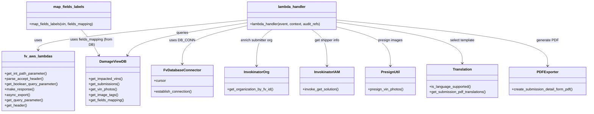

# Diagram: entity_core/entity_service/entity_service/damageview/submission/get_submission_details.py


> Auto-generated by Obscura crawlers

## Diagram 1

```mermaid
sequenceDiagram
participant Event
participant Lambda as lambda_handler
participant Auth as AuthService
participant DB as FvDatabaseConnector
participant EntityDB as DamageViewDB
participant InvOrg as InvokinatorOrg
participant InvIAM as InvokinatorIAM
participant S3 as S3Client
participant PDF as PDFCreator
participant Client
Event->>Lambda: invoke(event, context, audit_refs)
Lambda->>Auth: get_user_org_types(event)\nget_organization_id(event)\nget_user_id(event)
Lambda->>DB: DB_CONN.establish_connection()
DB-->>Lambda: cursor
Lambda->>EntityDB: get_impacted_vins(cursor, submission_id, solution_id)
EntityDB-->>Lambda: vins_with_counts
Lambda->>EntityDB: get_submissions(cursor, params)
EntityDB-->>Lambda: submission_details
alt submission_details empty
Lambda->>Client: make_response("Submission not found", 404)
else submission found
Lambda->>EntityDB: get_address_as_admin(location_id) (if location)
Lambda->>InvOrg: get_organization_by_fv_id(submitterOrgFvId)
InvOrg-->>Lambda: organization_id
Lambda->>InvIAM: invoke_get_solution(solution_id, get_shipper_name=True)
InvIAM-->>Lambda: shipper_org_info
alt export_file_type is not set
Lambda->>Client: make_response(submission_details, 200)
else export_file_type == PDF
alt is_async_export
Lambda->>Client: async_export(event, CSV_LAMBDAS.DAMAGEVIEW_SUBMISSION_DETAILS, file_type="pdf")
else sync PDF export
Lambda->>EntityDB: get_impacted_vins(cursor, submission_id, solution_id)
EntityDB-->>Lambda: vins
Lambda->>EntityDB: get_vin_photos(cursor, submission_id)
EntityDB-->>Lambda: vin_photos
Lambda->>S3: presign_vin_photos(vin_photos[vin], s3client)
S3-->>Lambda: presigned_urls
Lambda->>EntityDB: get_image_tags(cursor, solution_id)
EntityDB-->>Lambda: image_tags
Lambda->>EntityDB: get_fields_mapping(cursor, solution_id)
EntityDB-->>Lambda: fields_mapping
loop per vin
Lambda->>Lambda: map_fields_labels(vin, fields_mapping)
end
Lambda->>PDF: create_submission_detail_form_pdf(submission_details,vins,vin_photos,event,template,language,timezone,cursor)
PDF-->>Lambda: pdf_binary
Lambda->>Client: make_response(pdf_binary,200,content_type="application/pdf")
end
end
```

> SVG rendering failed for this diagram.

## Diagram 2



### SVG

<svg id="container" width="2636.6875" xmlns="http://www.w3.org/2000/svg" class="classDiagram" height="510" viewBox="0 0 2636.6875 510" role="graphics-document document" aria-roledescription="class"><style>#container{font-family:"trebuchet ms",verdana,arial,sans-serif;font-size:16px;fill:#333;}@keyframes edge-animation-frame{from{stroke-dashoffset:0;}}@keyframes dash{to{stroke-dashoffset:0;}}#container .edge-animation-slow{stroke-dasharray:9,5!important;stroke-dashoffset:900;animation:dash 50s linear infinite;stroke-linecap:round;}#container .edge-animation-fast{stroke-dasharray:9,5!important;stroke-dashoffset:900;animation:dash 20s linear infinite;stroke-linecap:round;}#container .error-icon{fill:#552222;}#container .error-text{fill:#552222;stroke:#552222;}#container .edge-thickness-normal{stroke-width:1px;}#container .edge-thickness-thick{stroke-width:3.5px;}#container .edge-pattern-solid{stroke-dasharray:0;}#container .edge-thickness-invisible{stroke-width:0;fill:none;}#container .edge-pattern-dashed{stroke-dasharray:3;}#container .edge-pattern-dotted{stroke-dasharray:2;}#container .marker{fill:#333333;stroke:#333333;}#container .marker.cross{stroke:#333333;}#container svg{font-family:"trebuchet ms",verdana,arial,sans-serif;font-size:16px;}#container p{margin:0;}#container g.classGroup text{fill:#9370DB;stroke:none;font-family:"trebuchet ms",verdana,arial,sans-serif;font-size:10px;}#container g.classGroup text .title{font-weight:bolder;}#container .nodeLabel,#container .edgeLabel{color:#131300;}#container .edgeLabel .label rect{fill:#ECECFF;}#container .label text{fill:#131300;}#container .labelBkg{background:#ECECFF;}#container .edgeLabel .label span{background:#ECECFF;}#container .classTitle{font-weight:bolder;}#container .node rect,#container .node circle,#container .node ellipse,#container .node polygon,#container .node path{fill:#ECECFF;stroke:#9370DB;stroke-width:1px;}#container .divider{stroke:#9370DB;stroke-width:1;}#container g.clickable{cursor:pointer;}#container g.classGroup rect{fill:#ECECFF;stroke:#9370DB;}#container g.classGroup line{stroke:#9370DB;stroke-width:1;}#container .classLabel .box{stroke:none;stroke-width:0;fill:#ECECFF;opacity:0.5;}#container .classLabel .label{fill:#9370DB;font-size:10px;}#container .relation{stroke:#333333;stroke-width:1;fill:none;}#container .dashed-line{stroke-dasharray:3;}#container .dotted-line{stroke-dasharray:1 2;}#container #compositionStart,#container .composition{fill:#333333!important;stroke:#333333!important;stroke-width:1;}#container #compositionEnd,#container .composition{fill:#333333!important;stroke:#333333!important;stroke-width:1;}#container #dependencyStart,#container .dependency{fill:#333333!important;stroke:#333333!important;stroke-width:1;}#container #dependencyStart,#container .dependency{fill:#333333!important;stroke:#333333!important;stroke-width:1;}#container #extensionStart,#container .extension{fill:transparent!important;stroke:#333333!important;stroke-width:1;}#container #extensionEnd,#container .extension{fill:transparent!important;stroke:#333333!important;stroke-width:1;}#container #aggregationStart,#container .aggregation{fill:transparent!important;stroke:#333333!important;stroke-width:1;}#container #aggregationEnd,#container .aggregation{fill:transparent!important;stroke:#333333!important;stroke-width:1;}#container #lollipopStart,#container .lollipop{fill:#ECECFF!important;stroke:#333333!important;stroke-width:1;}#container #lollipopEnd,#container .lollipop{fill:#ECECFF!important;stroke:#333333!important;stroke-width:1;}#container .edgeTerminals{font-size:11px;line-height:initial;}#container .classTitleText{text-anchor:middle;font-size:18px;fill:#333;}#container .label-icon{display:inline-block;height:1em;overflow:visible;vertical-align:-0.125em;}#container .node .label-icon path{fill:currentColor;stroke:revert;stroke-width:revert;}#container :root{--mermaid-font-family:"trebuchet ms",verdana,arial,sans-serif;}</style><g><defs><marker id="container_class-aggregationStart" class="marker aggregation class" refX="18" refY="7" markerWidth="190" markerHeight="240" orient="auto"><path d="M 18,7 L9,13 L1,7 L9,1 Z"></path></marker></defs><defs><marker id="container_class-aggregationEnd" class="marker aggregation class" refX="1" refY="7" markerWidth="20" markerHeight="28" orient="auto"><path d="M 18,7 L9,13 L1,7 L9,1 Z"></path></marker></defs><defs><marker id="container_class-extensionStart" class="marker extension class" refX="18" refY="7" markerWidth="190" markerHeight="240" orient="auto"><path d="M 1,7 L18,13 V 1 Z"></path></marker></defs><defs><marker id="container_class-extensionEnd" class="marker extension class" refX="1" refY="7" markerWidth="20" markerHeight="28" orient="auto"><path d="M 1,1 V 13 L18,7 Z"></path></marker></defs><defs><marker id="container_class-compositionStart" class="marker composition class" refX="18" refY="7" markerWidth="190" markerHeight="240" orient="auto"><path d="M 18,7 L9,13 L1,7 L9,1 Z"></path></marker></defs><defs><marker id="container_class-compositionEnd" class="marker composition class" refX="1" refY="7" markerWidth="20" markerHeight="28" orient="auto"><path d="M 18,7 L9,13 L1,7 L9,1 Z"></path></marker></defs><defs><marker id="container_class-dependencyStart" class="marker dependency class" refX="6" refY="7" markerWidth="190" markerHeight="240" orient="auto"><path d="M 5,7 L9,13 L1,7 L9,1 Z"></path></marker></defs><defs><marker id="container_class-dependencyEnd" class="marker dependency class" refX="13" refY="7" markerWidth="20" markerHeight="28" orient="auto"><path d="M 18,7 L9,13 L14,7 L9,1 Z"></path></marker></defs><defs><marker id="container_class-lollipopStart" class="marker lollipop class" refX="13" refY="7" markerWidth="190" markerHeight="240" orient="auto"><circle stroke="black" fill="transparent" cx="7" cy="7" r="6"></circle></marker></defs><defs><marker id="container_class-lollipopEnd" class="marker lollipop class" refX="1" refY="7" markerWidth="190" markerHeight="240" orient="auto"><circle stroke="black" fill="transparent" cx="7" cy="7" r="6"></circle></marker></defs><g class="root"><g class="clusters"></g><g class="edgePaths"><path d="M1099.084,91.083L944.359,106.402C789.634,121.722,480.184,152.361,325.459,174.847C170.734,197.333,170.734,211.667,170.734,218.833L170.734,226" id="id_lambda_handler_fv_aws_lambdas_1" class="edge-thickness-normal edge-pattern-solid relation" style=";;;" data-edge="true" data-et="edge" data-id="id_lambda_handler_fv_aws_lambdas_1" data-points="W3sieCI6MTA5OS4wODM5ODQzNzUsInkiOjkxLjA4MjcwNTI3Mzk3MjAxfSx7IngiOjE3MC43MzQzNzUsInkiOjE4M30seyJ4IjoxNzAuNzM0Mzc1LCJ5IjoyMzJ9XQ==" marker-end="url(#container_class-dependencyEnd)"></path><path d="M1099.084,117.414L1051.315,128.345C1003.547,139.276,908.01,161.138,860.241,189.736C812.473,218.333,812.473,253.667,812.473,271.333L812.473,289" id="id_lambda_handler_FvDatabaseConnector_2" class="edge-thickness-normal edge-pattern-solid relation" style=";;;" data-edge="true" data-et="edge" data-id="id_lambda_handler_FvDatabaseConnector_2" data-points="W3sieCI6MTA5OS4wODM5ODQzNzUsInkiOjExNy40MTQzMzM4ODUzNTI4Nn0seyJ4Ijo4MTIuNDcyNjU2MjUsInkiOjE4M30seyJ4Ijo4MTIuNDcyNjU2MjUsInkiOjI5NX1d" marker-end="url(#container_class-dependencyEnd)"></path><path d="M1099.084,103.737L1017.234,116.947C935.383,130.158,771.683,156.579,683.438,181.086C595.194,205.593,582.405,228.186,576.01,239.482L569.616,250.778" id="id_lambda_handler_DamageViewDB_3" class="edge-thickness-normal edge-pattern-solid relation" style=";;;" data-edge="true" data-et="edge" data-id="id_lambda_handler_DamageViewDB_3" data-points="W3sieCI6MTA5OS4wODM5ODQzNzUsInkiOjEwMy43MzY4MzIwMzIwNjM1OX0seyJ4Ijo2MDcuOTgyNDIxODc1LCJ5IjoxODN9LHsieCI6NTY2LjY2MDMzNjcwMTc2NjMsInkiOjI1Nn1d" marker-end="url(#container_class-dependencyEnd)"></path><path d="M1213.163,134L1201.658,142.167C1190.153,150.333,1167.143,166.667,1155.638,194C1144.133,221.333,1144.133,259.667,1144.133,278.833L1144.133,298" id="id_lambda_handler_InvokinatorOrg_4" class="edge-thickness-normal edge-pattern-solid relation" style=";;;" data-edge="true" data-et="edge" data-id="id_lambda_handler_InvokinatorOrg_4" data-points="W3sieCI6MTIxMy4xNjI5NjM4NjcxODc1LCJ5IjoxMzR9LHsieCI6MTE0NC4xMzI4MTI1LCJ5IjoxODN9LHsieCI6MTE0NC4xMzI4MTI1LCJ5IjozMDR9XQ==" marker-end="url(#container_class-dependencyEnd)"></path><path d="M1390.669,134L1402.174,142.167C1413.679,150.333,1436.689,166.667,1448.194,194C1459.699,221.333,1459.699,259.667,1459.699,278.833L1459.699,298" id="id_lambda_handler_InvokinatorIAM_5" class="edge-thickness-normal edge-pattern-solid relation" style=";;;" data-edge="true" data-et="edge" data-id="id_lambda_handler_InvokinatorIAM_5" data-points="W3sieCI6MTM5MC42NjkwNjczODI4MTI1LCJ5IjoxMzR9LHsieCI6MTQ1OS42OTkyMTg3NSwieSI6MTgzfSx7IngiOjE0NTkuNjk5MjE4NzUsInkiOjMwNH1d" marker-end="url(#container_class-dependencyEnd)"></path><path d="M1504.748,122.367L1544.651,132.473C1584.555,142.578,1664.361,162.789,1704.265,192.061C1744.168,221.333,1744.168,259.667,1744.168,278.833L1744.168,298" id="id_lambda_handler_PresignUtil_6" class="edge-thickness-normal edge-pattern-solid relation" style=";;;" data-edge="true" data-et="edge" data-id="id_lambda_handler_PresignUtil_6" data-points="W3sieCI6MTUwNC43NDgwNDY4NzUsInkiOjEyMi4zNjcwNzEwNTQxMzA4fSx7IngiOjE3NDQuMTY3OTY4NzUsInkiOjE4M30seyJ4IjoxNzQ0LjE2Nzk2ODc1LCJ5IjozMDR9XQ==" marker-end="url(#container_class-dependencyEnd)"></path><path d="M1504.748,100.636L1598.698,114.364C1692.648,128.091,1880.549,155.545,1974.499,186.439C2068.449,217.333,2068.449,251.667,2068.449,268.833L2068.449,286" id="id_lambda_handler_Translation_7" class="edge-thickness-normal edge-pattern-solid relation" style=";;;" data-edge="true" data-et="edge" data-id="id_lambda_handler_Translation_7" data-points="W3sieCI6MTUwNC43NDgwNDY4NzUsInkiOjEwMC42MzYyNzMyOTgyNTU5fSx7IngiOjIwNjguNDQ5MjE4NzUsInkiOjE4M30seyJ4IjoyMDY4LjQ0OTIxODc1LCJ5IjoyOTJ9XQ==" marker-end="url(#container_class-dependencyEnd)"></path><path d="M1504.748,90.709L1663.052,106.09C1821.355,121.472,2137.963,152.236,2296.267,186.785C2454.57,221.333,2454.57,259.667,2454.57,278.833L2454.57,298" id="id_lambda_handler_PDFExporter_8" class="edge-thickness-normal edge-pattern-solid relation" style=";;;" data-edge="true" data-et="edge" data-id="id_lambda_handler_PDFExporter_8" data-points="W3sieCI6MTUwNC43NDgwNDY4NzUsInkiOjkwLjcwODU4NzAwNzkwODA0fSx7IngiOjI0NTQuNTcwMzEyNSwieSI6MTgzfSx7IngiOjI0NTQuNTcwMzEyNSwieSI6MzA0fV0=" marker-end="url(#container_class-dependencyEnd)"></path><path d="M362.521,134L369.689,142.167C376.856,150.333,391.192,166.667,404.388,186.118C417.585,205.569,429.642,228.139,435.671,239.423L441.7,250.708" id="id_map_fields_labels_DamageViewDB_9" class="edge-thickness-normal edge-pattern-solid relation" style=";;;" data-edge="true" data-et="edge" data-id="id_map_fields_labels_DamageViewDB_9" data-points="W3sieCI6MzYyLjUyMDc1MTk1MzEyNSwieSI6MTM0fSx7IngiOjQwNS41MjczNDM3NSwieSI6MTgzfSx7IngiOjQ0NC41MjcxMTAyMjQxODQ3NSwieSI6MjU2fV0=" marker-end="url(#container_class-dependencyEnd)"></path></g><g class="edgeLabels"><g class="edgeLabel" transform="translate(170.734375, 183)"><g class="label" data-id="id_lambda_handler_fv_aws_lambdas_1" transform="translate(-16.4921875, -12)"><foreignObject width="32.984375" height="24"><div xmlns="http://www.w3.org/1999/xhtml" class="labelBkg" style="display: table-cell; white-space: nowrap; line-height: 1.5; max-width: 200px; text-align: center;"><span class="edgeLabel"><p>uses</p></span></div></foreignObject></g></g><g class="edgeLabel" transform="translate(812.47265625, 183)"><g class="label" data-id="id_lambda_handler_FvDatabaseConnector_2" transform="translate(-53.09375, -12)"><foreignObject width="106.1875" height="24"><div xmlns="http://www.w3.org/1999/xhtml" class="labelBkg" style="display: table-cell; white-space: nowrap; line-height: 1.5; max-width: 200px; text-align: center;"><span class="edgeLabel"><p>uses DB_CONN</p></span></div></foreignObject></g></g><g class="edgeLabel" transform="translate(812.12707, 150.05131)"><g class="label" data-id="id_lambda_handler_DamageViewDB_3" transform="translate(-27.2421875, -12)"><foreignObject width="54.484375" height="24"><div xmlns="http://www.w3.org/1999/xhtml" class="labelBkg" style="display: table-cell; white-space: nowrap; line-height: 1.5; max-width: 200px; text-align: center;"><span class="edgeLabel"><p>queries</p></span></div></foreignObject></g></g><g class="edgeLabel" transform="translate(1144.1328125, 183)"><g class="label" data-id="id_lambda_handler_InvokinatorOrg_4" transform="translate(-74.3046875, -12)"><foreignObject width="148.609375" height="24"><div xmlns="http://www.w3.org/1999/xhtml" class="labelBkg" style="display: table-cell; white-space: nowrap; line-height: 1.5; max-width: 200px; text-align: center;"><span class="edgeLabel"><p>enrich submitter org</p></span></div></foreignObject></g></g><g class="edgeLabel" transform="translate(1459.69921875, 183)"><g class="label" data-id="id_lambda_handler_InvokinatorIAM_5" transform="translate(-57.375, -12)"><foreignObject width="114.75" height="24"><div xmlns="http://www.w3.org/1999/xhtml" class="labelBkg" style="display: table-cell; white-space: nowrap; line-height: 1.5; max-width: 200px; text-align: center;"><span class="edgeLabel"><p>get shipper info</p></span></div></foreignObject></g></g><g class="edgeLabel" transform="translate(1744.16796875, 183)"><g class="label" data-id="id_lambda_handler_PresignUtil_6" transform="translate(-54.4375, -12)"><foreignObject width="108.875" height="24"><div xmlns="http://www.w3.org/1999/xhtml" class="labelBkg" style="display: table-cell; white-space: nowrap; line-height: 1.5; max-width: 200px; text-align: center;"><span class="edgeLabel"><p>presign images</p></span></div></foreignObject></g></g><g class="edgeLabel" transform="translate(2068.44921875, 183)"><g class="label" data-id="id_lambda_handler_Translation_7" transform="translate(-56.1171875, -12)"><foreignObject width="112.234375" height="24"><div xmlns="http://www.w3.org/1999/xhtml" class="labelBkg" style="display: table-cell; white-space: nowrap; line-height: 1.5; max-width: 200px; text-align: center;"><span class="edgeLabel"><p>select template</p></span></div></foreignObject></g></g><g class="edgeLabel" transform="translate(2454.5703125, 183)"><g class="label" data-id="id_lambda_handler_PDFExporter_8" transform="translate(-47.578125, -12)"><foreignObject width="95.15625" height="24"><div xmlns="http://www.w3.org/1999/xhtml" class="labelBkg" style="display: table-cell; white-space: nowrap; line-height: 1.5; max-width: 200px; text-align: center;"><span class="edgeLabel"><p>generate PDF</p></span></div></foreignObject></g></g><g class="edgeLabel" transform="translate(409.66654, 190.74777)"><g class="label" data-id="id_map_fields_labels_DamageViewDB_9" transform="translate(-100, -24)"><foreignObject width="200" height="48"><div xmlns="http://www.w3.org/1999/xhtml" class="labelBkg" style="display: table; white-space: break-spaces; line-height: 1.5; max-width: 200px; text-align: center; width: 200px;"><span class="edgeLabel"><p>uses fields_mapping (from DB)</p></span></div></foreignObject></g></g></g><g class="nodes"><g class="node default" id="classId-lambda_handler-0" transform="translate(1301.916015625, 71)"><g class="basic label-container"><path d="M-202.83203125 -63 L202.83203125 -63 L202.83203125 63 L-202.83203125 63" stroke="none" stroke-width="0" fill="#ECECFF" style=""></path><path d="M-202.83203125 -63 C-90.98693430717988 -63, 20.85816263564024 -63, 202.83203125 -63 M-202.83203125 -63 C-110.39316120079306 -63, -17.95429115158612 -63, 202.83203125 -63 M202.83203125 -63 C202.83203125 -24.9086121148098, 202.83203125 13.182775770380402, 202.83203125 63 M202.83203125 -63 C202.83203125 -18.445147854208805, 202.83203125 26.10970429158239, 202.83203125 63 M202.83203125 63 C94.93986284697344 63, -12.952305556053119 63, -202.83203125 63 M202.83203125 63 C94.01839470198571 63, -14.795241846028574 63, -202.83203125 63 M-202.83203125 63 C-202.83203125 15.922818209012746, -202.83203125 -31.154363581974508, -202.83203125 -63 M-202.83203125 63 C-202.83203125 17.246251844402302, -202.83203125 -28.507496311195396, -202.83203125 -63" stroke="#9370DB" stroke-width="1.3" fill="none" stroke-dasharray="0 0" style=""></path></g><g class="annotation-group text" transform="translate(0, -39)"></g><g class="label-group text" transform="translate(-59.9765625, -39)"><g class="label" style="font-weight: bolder" transform="translate(0,-12)"><foreignObject width="119.953125" height="24"><div xmlns="http://www.w3.org/1999/xhtml" style="display: table-cell; white-space: nowrap; line-height: 1.5; max-width: 170px; text-align: center;"><span class="nodeLabel markdown-node-label" style=""><p>lambda_handler</p></span></div></foreignObject></g></g><g class="members-group text" transform="translate(-190.83203125, 9)"></g><g class="methods-group text" transform="translate(-190.83203125, 39)"><g class="label" style="" transform="translate(0,-12)"><foreignObject width="321.6875" height="24"><div xmlns="http://www.w3.org/1999/xhtml" style="display: table-cell; white-space: nowrap; line-height: 1.5; max-width: 379px; text-align: center;"><span class="nodeLabel markdown-node-label" style=""><p>+lambda_handler(event, context, audit_refs)</p></span></div></foreignObject></g></g><g class="divider" style=""><path d="M-202.83203125 -15 C-65.33474497887295 -15, 72.1625412922541 -15, 202.83203125 -15 M-202.83203125 -15 C-70.16332882073817 -15, 62.505373608523655 -15, 202.83203125 -15" stroke="#9370DB" stroke-width="1.3" fill="none" stroke-dasharray="0 0" style=""></path></g><g class="divider" style=""><path d="M-202.83203125 9 C-87.01614770912379 9, 28.79973583175243 9, 202.83203125 9 M-202.83203125 9 C-94.4273021498232 9, 13.977426950353589 9, 202.83203125 9" stroke="#9370DB" stroke-width="1.3" fill="none" stroke-dasharray="0 0" style=""></path></g></g><g class="node default" id="classId-map_fields_labels-1" transform="translate(307.2265625, 71)"><g class="basic label-container"><path d="M-190.078125 -63 L190.078125 -63 L190.078125 63 L-190.078125 63" stroke="none" stroke-width="0" fill="#ECECFF" style=""></path><path d="M-190.078125 -63 C-61.08100571417788 -63, 67.91611357164425 -63, 190.078125 -63 M-190.078125 -63 C-73.17648564973669 -63, 43.72515370052662 -63, 190.078125 -63 M190.078125 -63 C190.078125 -34.95944578252764, 190.078125 -6.918891565055276, 190.078125 63 M190.078125 -63 C190.078125 -36.6895200081889, 190.078125 -10.3790400163778, 190.078125 63 M190.078125 63 C42.98221755625784 63, -104.11368988748433 63, -190.078125 63 M190.078125 63 C99.61686218603391 63, 9.155599372067826 63, -190.078125 63 M-190.078125 63 C-190.078125 28.229913779324335, -190.078125 -6.540172441351331, -190.078125 -63 M-190.078125 63 C-190.078125 19.953772874966077, -190.078125 -23.092454250067846, -190.078125 -63" stroke="#9370DB" stroke-width="1.3" fill="none" stroke-dasharray="0 0" style=""></path></g><g class="annotation-group text" transform="translate(0, -39)"></g><g class="label-group text" transform="translate(-66.046875, -39)"><g class="label" style="font-weight: bolder" transform="translate(0,-12)"><foreignObject width="132.09375" height="24"><div xmlns="http://www.w3.org/1999/xhtml" style="display: table-cell; white-space: nowrap; line-height: 1.5; max-width: 181px; text-align: center;"><span class="nodeLabel markdown-node-label" style=""><p>map_fields_labels</p></span></div></foreignObject></g></g><g class="members-group text" transform="translate(-178.078125, 9)"></g><g class="methods-group text" transform="translate(-178.078125, 39)"><g class="label" style="" transform="translate(0,-12)"><foreignObject width="290.109375" height="24"><div xmlns="http://www.w3.org/1999/xhtml" style="display: table-cell; white-space: nowrap; line-height: 1.5; max-width: 347px; text-align: center;"><span class="nodeLabel markdown-node-label" style=""><p>+map_fields_labels(vin, fields_mapping)</p></span></div></foreignObject></g></g><g class="divider" style=""><path d="M-190.078125 -15 C-67.62116497207545 -15, 54.835795055849104 -15, 190.078125 -15 M-190.078125 -15 C-101.98469677884462 -15, -13.891268557689244 -15, 190.078125 -15" stroke="#9370DB" stroke-width="1.3" fill="none" stroke-dasharray="0 0" style=""></path></g><g class="divider" style=""><path d="M-190.078125 9 C-85.63928200420973 9, 18.799560991580535 9, 190.078125 9 M-190.078125 9 C-52.802150324606345 9, 84.47382435078731 9, 190.078125 9" stroke="#9370DB" stroke-width="1.3" fill="none" stroke-dasharray="0 0" style=""></path></g></g><g class="node default" id="classId-FvDatabaseConnector-2" transform="translate(812.47265625, 367)"><g class="basic label-container"><path d="M-138.28515625 -72 L138.28515625 -72 L138.28515625 72 L-138.28515625 72" stroke="none" stroke-width="0" fill="#ECECFF" style=""></path><path d="M-138.28515625 -72 C-52.24686978349433 -72, 33.791416683011334 -72, 138.28515625 -72 M-138.28515625 -72 C-73.32297931109393 -72, -8.360802372187862 -72, 138.28515625 -72 M138.28515625 -72 C138.28515625 -42.167627605559815, 138.28515625 -12.335255211119623, 138.28515625 72 M138.28515625 -72 C138.28515625 -25.58389361135076, 138.28515625 20.83221277729848, 138.28515625 72 M138.28515625 72 C49.710346749640166 72, -38.86446275071967 72, -138.28515625 72 M138.28515625 72 C46.986216407409074 72, -44.31272343518185 72, -138.28515625 72 M-138.28515625 72 C-138.28515625 34.284749269947284, -138.28515625 -3.4305014601054324, -138.28515625 -72 M-138.28515625 72 C-138.28515625 41.69633601547962, -138.28515625 11.392672030959247, -138.28515625 -72" stroke="#9370DB" stroke-width="1.3" fill="none" stroke-dasharray="0 0" style=""></path></g><g class="annotation-group text" transform="translate(0, -48)"></g><g class="label-group text" transform="translate(-79.3046875, -48)"><g class="label" style="font-weight: bolder" transform="translate(0,-12)"><foreignObject width="158.609375" height="24"><div xmlns="http://www.w3.org/1999/xhtml" style="display: table-cell; white-space: nowrap; line-height: 1.5; max-width: 207px; text-align: center;"><span class="nodeLabel markdown-node-label" style=""><p>FvDatabaseConnector</p></span></div></foreignObject></g></g><g class="members-group text" transform="translate(-126.28515625, 0)"><g class="label" style="" transform="translate(0,-12)"><foreignObject width="53.71875" height="24"><div xmlns="http://www.w3.org/1999/xhtml" style="display: table-cell; white-space: nowrap; line-height: 1.5; max-width: 112px; text-align: center;"><span class="nodeLabel markdown-node-label" style=""><p>+cursor</p></span></div></foreignObject></g></g><g class="methods-group text" transform="translate(-126.28515625, 48)"><g class="label" style="" transform="translate(0,-12)"><foreignObject width="173.265625" height="24"><div xmlns="http://www.w3.org/1999/xhtml" style="display: table-cell; white-space: nowrap; line-height: 1.5; max-width: 231px; text-align: center;"><span class="nodeLabel markdown-node-label" style=""><p>+establish_connection()</p></span></div></foreignObject></g></g><g class="divider" style=""><path d="M-138.28515625 -24 C-64.34085164915311 -24, 9.603452951693782 -24, 138.28515625 -24 M-138.28515625 -24 C-78.18871515980075 -24, -18.092274069601487 -24, 138.28515625 -24" stroke="#9370DB" stroke-width="1.3" fill="none" stroke-dasharray="0 0" style=""></path></g><g class="divider" style=""><path d="M-138.28515625 24 C-68.72548962263741 24, 0.8341770047251771 24, 138.28515625 24 M-138.28515625 24 C-64.61296163238056 24, 9.059232985238879 24, 138.28515625 24" stroke="#9370DB" stroke-width="1.3" fill="none" stroke-dasharray="0 0" style=""></path></g></g><g class="node default" id="classId-fv_aws_lambdas-3" transform="translate(170.734375, 367)"><g class="basic label-container"><path d="M-162.734375 -135 L162.734375 -135 L162.734375 135 L-162.734375 135" stroke="none" stroke-width="0" fill="#ECECFF" style=""></path><path d="M-162.734375 -135 C-91.86748631399564 -135, -21.000597627991283 -135, 162.734375 -135 M-162.734375 -135 C-52.64089863018283 -135, 57.452577739634336 -135, 162.734375 -135 M162.734375 -135 C162.734375 -49.06114323090061, 162.734375 36.877713538198776, 162.734375 135 M162.734375 -135 C162.734375 -44.343352021018745, 162.734375 46.31329595796251, 162.734375 135 M162.734375 135 C36.30012329479905 135, -90.1341284104019 135, -162.734375 135 M162.734375 135 C87.0430667502424 135, 11.351758500484806 135, -162.734375 135 M-162.734375 135 C-162.734375 60.76650239521966, -162.734375 -13.466995209560679, -162.734375 -135 M-162.734375 135 C-162.734375 37.415167541875334, -162.734375 -60.16966491624933, -162.734375 -135" stroke="#9370DB" stroke-width="1.3" fill="none" stroke-dasharray="0 0" style=""></path></g><g class="annotation-group text" transform="translate(0, -111)"></g><g class="label-group text" transform="translate(-60.0625, -111)"><g class="label" style="font-weight: bolder" transform="translate(0,-12)"><foreignObject width="120.125" height="24"><div xmlns="http://www.w3.org/1999/xhtml" style="display: table-cell; white-space: nowrap; line-height: 1.5; max-width: 168px; text-align: center;"><span class="nodeLabel markdown-node-label" style=""><p>fv_aws_lambdas</p></span></div></foreignObject></g></g><g class="members-group text" transform="translate(-150.734375, -63)"></g><g class="methods-group text" transform="translate(-150.734375, -33)"><g class="label" style="" transform="translate(0,-12)"><foreignObject width="193.96875" height="24"><div xmlns="http://www.w3.org/1999/xhtml" style="display: table-cell; white-space: nowrap; line-height: 1.5; max-width: 251px; text-align: center;"><span class="nodeLabel markdown-node-label" style=""><p>+get_int_path_parameter()</p></span></div></foreignObject></g><g class="label" style="" transform="translate(0,12)"><foreignObject width="173" height="24"><div xmlns="http://www.w3.org/1999/xhtml" style="display: table-cell; white-space: nowrap; line-height: 1.5; max-width: 230px; text-align: center;"><span class="nodeLabel markdown-node-label" style=""><p>+parse_accept_header()</p></span></div></foreignObject></g><g class="label" style="" transform="translate(0,36)"><foreignObject width="241.40625" height="24"><div xmlns="http://www.w3.org/1999/xhtml" style="display: table-cell; white-space: nowrap; line-height: 1.5; max-width: 299px; text-align: center;"><span class="nodeLabel markdown-node-label" style=""><p>+get_boolean_query_parameter()</p></span></div></foreignObject></g><g class="label" style="" transform="translate(0,60)"><foreignObject width="131.84375" height="24"><div xmlns="http://www.w3.org/1999/xhtml" style="display: table-cell; white-space: nowrap; line-height: 1.5; max-width: 189px; text-align: center;"><span class="nodeLabel markdown-node-label" style=""><p>+make_response()</p></span></div></foreignObject></g><g class="label" style="" transform="translate(0,84)"><foreignObject width="113.890625" height="24"><div xmlns="http://www.w3.org/1999/xhtml" style="display: table-cell; white-space: nowrap; line-height: 1.5; max-width: 171px; text-align: center;"><span class="nodeLabel markdown-node-label" style=""><p>+async_export()</p></span></div></foreignObject></g><g class="label" style="" transform="translate(0,108)"><foreignObject width="173.640625" height="24"><div xmlns="http://www.w3.org/1999/xhtml" style="display: table-cell; white-space: nowrap; line-height: 1.5; max-width: 231px; text-align: center;"><span class="nodeLabel markdown-node-label" style=""><p>+get_query_parameter()</p></span></div></foreignObject></g><g class="label" style="" transform="translate(0,132)"><foreignObject width="100.34375" height="24"><div xmlns="http://www.w3.org/1999/xhtml" style="display: table-cell; white-space: nowrap; line-height: 1.5; max-width: 158px; text-align: center;"><span class="nodeLabel markdown-node-label" style=""><p>+get_header()</p></span></div></foreignObject></g></g><g class="divider" style=""><path d="M-162.734375 -87 C-74.95463704639604 -87, 12.825100907207911 -87, 162.734375 -87 M-162.734375 -87 C-50.41081233712798 -87, 61.91275032574404 -87, 162.734375 -87" stroke="#9370DB" stroke-width="1.3" fill="none" stroke-dasharray="0 0" style=""></path></g><g class="divider" style=""><path d="M-162.734375 -63 C-43.56952304092617 -63, 75.59532891814766 -63, 162.734375 -63 M-162.734375 -63 C-87.16763435197353 -63, -11.600893703947065 -63, 162.734375 -63" stroke="#9370DB" stroke-width="1.3" fill="none" stroke-dasharray="0 0" style=""></path></g></g><g class="node default" id="classId-DamageViewDB-4" transform="translate(503.828125, 367)"><g class="basic label-container"><path d="M-120.359375 -111 L120.359375 -111 L120.359375 111 L-120.359375 111" stroke="none" stroke-width="0" fill="#ECECFF" style=""></path><path d="M-120.359375 -111 C-46.01798648247245 -111, 28.323402035055096 -111, 120.359375 -111 M-120.359375 -111 C-64.94411747726966 -111, -9.528859954539328 -111, 120.359375 -111 M120.359375 -111 C120.359375 -55.74432817103144, 120.359375 -0.4886563420628818, 120.359375 111 M120.359375 -111 C120.359375 -48.41489228933717, 120.359375 14.170215421325665, 120.359375 111 M120.359375 111 C68.48177167625781 111, 16.604168352515615 111, -120.359375 111 M120.359375 111 C33.55780603535361 111, -53.243762929292785 111, -120.359375 111 M-120.359375 111 C-120.359375 44.47808700314236, -120.359375 -22.043825993715274, -120.359375 -111 M-120.359375 111 C-120.359375 30.87774310847179, -120.359375 -49.24451378305642, -120.359375 -111" stroke="#9370DB" stroke-width="1.3" fill="none" stroke-dasharray="0 0" style=""></path></g><g class="annotation-group text" transform="translate(0, -87)"></g><g class="label-group text" transform="translate(-56.59375, -87)"><g class="label" style="font-weight: bolder" transform="translate(0,-12)"><foreignObject width="113.1875" height="24"><div xmlns="http://www.w3.org/1999/xhtml" style="display: table-cell; white-space: nowrap; line-height: 1.5; max-width: 162px; text-align: center;"><span class="nodeLabel markdown-node-label" style=""><p>DamageViewDB</p></span></div></foreignObject></g></g><g class="members-group text" transform="translate(-108.359375, -39)"></g><g class="methods-group text" transform="translate(-108.359375, -9)"><g class="label" style="" transform="translate(0,-12)"><foreignObject width="154.0625" height="24"><div xmlns="http://www.w3.org/1999/xhtml" style="display: table-cell; white-space: nowrap; line-height: 1.5; max-width: 211px; text-align: center;"><span class="nodeLabel markdown-node-label" style=""><p>+get_impacted_vins()</p></span></div></foreignObject></g><g class="label" style="" transform="translate(0,12)"><foreignObject width="139.234375" height="24"><div xmlns="http://www.w3.org/1999/xhtml" style="display: table-cell; white-space: nowrap; line-height: 1.5; max-width: 197px; text-align: center;"><span class="nodeLabel markdown-node-label" style=""><p>+get_submissions()</p></span></div></foreignObject></g><g class="label" style="" transform="translate(0,36)"><foreignObject width="129.421875" height="24"><div xmlns="http://www.w3.org/1999/xhtml" style="display: table-cell; white-space: nowrap; line-height: 1.5; max-width: 187px; text-align: center;"><span class="nodeLabel markdown-node-label" style=""><p>+get_vin_photos()</p></span></div></foreignObject></g><g class="label" style="" transform="translate(0,60)"><foreignObject width="130.359375" height="24"><div xmlns="http://www.w3.org/1999/xhtml" style="display: table-cell; white-space: nowrap; line-height: 1.5; max-width: 188px; text-align: center;"><span class="nodeLabel markdown-node-label" style=""><p>+get_image_tags()</p></span></div></foreignObject></g><g class="label" style="" transform="translate(0,84)"><foreignObject width="160.125" height="24"><div xmlns="http://www.w3.org/1999/xhtml" style="display: table-cell; white-space: nowrap; line-height: 1.5; max-width: 217px; text-align: center;"><span class="nodeLabel markdown-node-label" style=""><p>+get_fields_mapping()</p></span></div></foreignObject></g></g><g class="divider" style=""><path d="M-120.359375 -63 C-30.379585203043845 -63, 59.60020459391231 -63, 120.359375 -63 M-120.359375 -63 C-36.502493446108915 -63, 47.35438810778217 -63, 120.359375 -63" stroke="#9370DB" stroke-width="1.3" fill="none" stroke-dasharray="0 0" style=""></path></g><g class="divider" style=""><path d="M-120.359375 -39 C-66.16061987303044 -39, -11.961864746060897 -39, 120.359375 -39 M-120.359375 -39 C-41.28654013061731 -39, 37.78629473876538 -39, 120.359375 -39" stroke="#9370DB" stroke-width="1.3" fill="none" stroke-dasharray="0 0" style=""></path></g></g><g class="node default" id="classId-InvokinatorOrg-5" transform="translate(1144.1328125, 367)"><g class="basic label-container"><path d="M-143.375 -63 L143.375 -63 L143.375 63 L-143.375 63" stroke="none" stroke-width="0" fill="#ECECFF" style=""></path><path d="M-143.375 -63 C-52.9925673492817 -63, 37.3898653014366 -63, 143.375 -63 M-143.375 -63 C-56.00033738335287 -63, 31.374325233294257 -63, 143.375 -63 M143.375 -63 C143.375 -37.376069371640455, 143.375 -11.752138743280902, 143.375 63 M143.375 -63 C143.375 -35.369297494470516, 143.375 -7.738594988941024, 143.375 63 M143.375 63 C77.6329334252161 63, 11.89086685043219 63, -143.375 63 M143.375 63 C79.07604366078887 63, 14.777087321577739 63, -143.375 63 M-143.375 63 C-143.375 30.426271304989882, -143.375 -2.147457390020236, -143.375 -63 M-143.375 63 C-143.375 29.93396081591068, -143.375 -3.1320783681786395, -143.375 -63" stroke="#9370DB" stroke-width="1.3" fill="none" stroke-dasharray="0 0" style=""></path></g><g class="annotation-group text" transform="translate(0, -39)"></g><g class="label-group text" transform="translate(-55.171875, -39)"><g class="label" style="font-weight: bolder" transform="translate(0,-12)"><foreignObject width="110.34375" height="24"><div xmlns="http://www.w3.org/1999/xhtml" style="display: table-cell; white-space: nowrap; line-height: 1.5; max-width: 159px; text-align: center;"><span class="nodeLabel markdown-node-label" style=""><p>InvokinatorOrg</p></span></div></foreignObject></g></g><g class="members-group text" transform="translate(-131.375, 9)"></g><g class="methods-group text" transform="translate(-131.375, 39)"><g class="label" style="" transform="translate(0,-12)"><foreignObject width="207.578125" height="24"><div xmlns="http://www.w3.org/1999/xhtml" style="display: table-cell; white-space: nowrap; line-height: 1.5; max-width: 265px; text-align: center;"><span class="nodeLabel markdown-node-label" style=""><p>+get_organization_by_fv_id()</p></span></div></foreignObject></g></g><g class="divider" style=""><path d="M-143.375 -15 C-76.62093189891124 -15, -9.866863797822475 -15, 143.375 -15 M-143.375 -15 C-81.88287625737418 -15, -20.390752514748357 -15, 143.375 -15" stroke="#9370DB" stroke-width="1.3" fill="none" stroke-dasharray="0 0" style=""></path></g><g class="divider" style=""><path d="M-143.375 9 C-79.50127638566815 9, -15.627552771336283 9, 143.375 9 M-143.375 9 C-61.44014424126679 9, 20.494711517466413 9, 143.375 9" stroke="#9370DB" stroke-width="1.3" fill="none" stroke-dasharray="0 0" style=""></path></g></g><g class="node default" id="classId-InvokinatorIAM-6" transform="translate(1459.69921875, 367)"><g class="basic label-container"><path d="M-122.19140625 -63 L122.19140625 -63 L122.19140625 63 L-122.19140625 63" stroke="none" stroke-width="0" fill="#ECECFF" style=""></path><path d="M-122.19140625 -63 C-29.86625777200031 -63, 62.45889070599938 -63, 122.19140625 -63 M-122.19140625 -63 C-29.59411153700013 -63, 63.00318317599974 -63, 122.19140625 -63 M122.19140625 -63 C122.19140625 -32.710989715353776, 122.19140625 -2.421979430707559, 122.19140625 63 M122.19140625 -63 C122.19140625 -16.69290581018373, 122.19140625 29.614188379632537, 122.19140625 63 M122.19140625 63 C35.227546755968405 63, -51.73631273806319 63, -122.19140625 63 M122.19140625 63 C56.34831519653186 63, -9.494775856936286 63, -122.19140625 63 M-122.19140625 63 C-122.19140625 36.700705201179744, -122.19140625 10.401410402359488, -122.19140625 -63 M-122.19140625 63 C-122.19140625 16.66105082496805, -122.19140625 -29.6778983500639, -122.19140625 -63" stroke="#9370DB" stroke-width="1.3" fill="none" stroke-dasharray="0 0" style=""></path></g><g class="annotation-group text" transform="translate(0, -39)"></g><g class="label-group text" transform="translate(-55.4765625, -39)"><g class="label" style="font-weight: bolder" transform="translate(0,-12)"><foreignObject width="110.953125" height="24"><div xmlns="http://www.w3.org/1999/xhtml" style="display: table-cell; white-space: nowrap; line-height: 1.5; max-width: 159px; text-align: center;"><span class="nodeLabel markdown-node-label" style=""><p>InvokinatorIAM</p></span></div></foreignObject></g></g><g class="members-group text" transform="translate(-110.19140625, 9)"></g><g class="methods-group text" transform="translate(-110.19140625, 39)"><g class="label" style="" transform="translate(0,-12)"><foreignObject width="164.90625" height="24"><div xmlns="http://www.w3.org/1999/xhtml" style="display: table-cell; white-space: nowrap; line-height: 1.5; max-width: 222px; text-align: center;"><span class="nodeLabel markdown-node-label" style=""><p>+invoke_get_solution()</p></span></div></foreignObject></g></g><g class="divider" style=""><path d="M-122.19140625 -15 C-60.94165032247022 -15, 0.3081056050595663 -15, 122.19140625 -15 M-122.19140625 -15 C-63.696694070460914 -15, -5.201981890921829 -15, 122.19140625 -15" stroke="#9370DB" stroke-width="1.3" fill="none" stroke-dasharray="0 0" style=""></path></g><g class="divider" style=""><path d="M-122.19140625 9 C-64.13753071752771 9, -6.083655185055434 9, 122.19140625 9 M-122.19140625 9 C-29.604188457372757 9, 62.983029335254486 9, 122.19140625 9" stroke="#9370DB" stroke-width="1.3" fill="none" stroke-dasharray="0 0" style=""></path></g></g><g class="node default" id="classId-Translation-7" transform="translate(2068.44921875, 367)"><g class="basic label-container"><path d="M-162.00390625 -75 L162.00390625 -75 L162.00390625 75 L-162.00390625 75" stroke="none" stroke-width="0" fill="#ECECFF" style=""></path><path d="M-162.00390625 -75 C-85.47818777946736 -75, -8.952469308934724 -75, 162.00390625 -75 M-162.00390625 -75 C-58.74705198829024 -75, 44.509802273419524 -75, 162.00390625 -75 M162.00390625 -75 C162.00390625 -20.60101074161018, 162.00390625 33.79797851677964, 162.00390625 75 M162.00390625 -75 C162.00390625 -36.932386956899585, 162.00390625 1.1352260862008308, 162.00390625 75 M162.00390625 75 C69.64772985829134 75, -22.708446533417316 75, -162.00390625 75 M162.00390625 75 C44.99156789309484 75, -72.02077046381032 75, -162.00390625 75 M-162.00390625 75 C-162.00390625 22.27139824288011, -162.00390625 -30.45720351423978, -162.00390625 -75 M-162.00390625 75 C-162.00390625 20.192724894425773, -162.00390625 -34.614550211148455, -162.00390625 -75" stroke="#9370DB" stroke-width="1.3" fill="none" stroke-dasharray="0 0" style=""></path></g><g class="annotation-group text" transform="translate(0, -51)"></g><g class="label-group text" transform="translate(-41.2265625, -51)"><g class="label" style="font-weight: bolder" transform="translate(0,-12)"><foreignObject width="82.453125" height="24"><div xmlns="http://www.w3.org/1999/xhtml" style="display: table-cell; white-space: nowrap; line-height: 1.5; max-width: 131px; text-align: center;"><span class="nodeLabel markdown-node-label" style=""><p>Translation</p></span></div></foreignObject></g></g><g class="members-group text" transform="translate(-150.00390625, -3)"></g><g class="methods-group text" transform="translate(-150.00390625, 27)"><g class="label" style="" transform="translate(0,-12)"><foreignObject width="186.8125" height="24"><div xmlns="http://www.w3.org/1999/xhtml" style="display: table-cell; white-space: nowrap; line-height: 1.5; max-width: 244px; text-align: center;"><span class="nodeLabel markdown-node-label" style=""><p>+is_language_supported()</p></span></div></foreignObject></g><g class="label" style="" transform="translate(0,12)"><foreignObject width="258.78125" height="24"><div xmlns="http://www.w3.org/1999/xhtml" style="display: table-cell; white-space: nowrap; line-height: 1.5; max-width: 316px; text-align: center;"><span class="nodeLabel markdown-node-label" style=""><p>+get_submission_pdf_translations()</p></span></div></foreignObject></g></g><g class="divider" style=""><path d="M-162.00390625 -27 C-42.602582797615824 -27, 76.79874065476835 -27, 162.00390625 -27 M-162.00390625 -27 C-64.44579622768767 -27, 33.11231379462467 -27, 162.00390625 -27" stroke="#9370DB" stroke-width="1.3" fill="none" stroke-dasharray="0 0" style=""></path></g><g class="divider" style=""><path d="M-162.00390625 -3 C-69.11016838864927 -3, 23.78356947270146 -3, 162.00390625 -3 M-162.00390625 -3 C-61.83948928603354 -3, 38.32492767793292 -3, 162.00390625 -3" stroke="#9370DB" stroke-width="1.3" fill="none" stroke-dasharray="0 0" style=""></path></g></g><g class="node default" id="classId-PresignUtil-8" transform="translate(1744.16796875, 367)"><g class="basic label-container"><path d="M-112.27734375 -63 L112.27734375 -63 L112.27734375 63 L-112.27734375 63" stroke="none" stroke-width="0" fill="#ECECFF" style=""></path><path d="M-112.27734375 -63 C-30.915471484442406 -63, 50.44640078111519 -63, 112.27734375 -63 M-112.27734375 -63 C-46.191424551430245 -63, 19.89449464713951 -63, 112.27734375 -63 M112.27734375 -63 C112.27734375 -25.55499943258662, 112.27734375 11.890001134826761, 112.27734375 63 M112.27734375 -63 C112.27734375 -20.524617504251125, 112.27734375 21.95076499149775, 112.27734375 63 M112.27734375 63 C24.374225286208002 63, -63.528893177583996 63, -112.27734375 63 M112.27734375 63 C43.483645211227525 63, -25.31005332754495 63, -112.27734375 63 M-112.27734375 63 C-112.27734375 30.324257861188705, -112.27734375 -2.351484277622589, -112.27734375 -63 M-112.27734375 63 C-112.27734375 26.61109787935424, -112.27734375 -9.77780424129152, -112.27734375 -63" stroke="#9370DB" stroke-width="1.3" fill="none" stroke-dasharray="0 0" style=""></path></g><g class="annotation-group text" transform="translate(0, -39)"></g><g class="label-group text" transform="translate(-40.1015625, -39)"><g class="label" style="font-weight: bolder" transform="translate(0,-12)"><foreignObject width="80.203125" height="24"><div xmlns="http://www.w3.org/1999/xhtml" style="display: table-cell; white-space: nowrap; line-height: 1.5; max-width: 129px; text-align: center;"><span class="nodeLabel markdown-node-label" style=""><p>PresignUtil</p></span></div></foreignObject></g></g><g class="members-group text" transform="translate(-100.27734375, 9)"></g><g class="methods-group text" transform="translate(-100.27734375, 39)"><g class="label" style="" transform="translate(0,-12)"><foreignObject width="160.453125" height="24"><div xmlns="http://www.w3.org/1999/xhtml" style="display: table-cell; white-space: nowrap; line-height: 1.5; max-width: 218px; text-align: center;"><span class="nodeLabel markdown-node-label" style=""><p>+presign_vin_photos()</p></span></div></foreignObject></g></g><g class="divider" style=""><path d="M-112.27734375 -15 C-55.389323895471634 -15, 1.4986959590567324 -15, 112.27734375 -15 M-112.27734375 -15 C-51.48092568109265 -15, 9.3154923878147 -15, 112.27734375 -15" stroke="#9370DB" stroke-width="1.3" fill="none" stroke-dasharray="0 0" style=""></path></g><g class="divider" style=""><path d="M-112.27734375 9 C-67.31960264730544 9, -22.36186154461089 9, 112.27734375 9 M-112.27734375 9 C-25.983552724397583 9, 60.31023830120483 9, 112.27734375 9" stroke="#9370DB" stroke-width="1.3" fill="none" stroke-dasharray="0 0" style=""></path></g></g><g class="node default" id="classId-PDFExporter-9" transform="translate(2454.5703125, 367)"><g class="basic label-container"><path d="M-174.1171875 -63 L174.1171875 -63 L174.1171875 63 L-174.1171875 63" stroke="none" stroke-width="0" fill="#ECECFF" style=""></path><path d="M-174.1171875 -63 C-54.856237840709085 -63, 64.40471181858183 -63, 174.1171875 -63 M-174.1171875 -63 C-70.84376519638454 -63, 32.42965710723092 -63, 174.1171875 -63 M174.1171875 -63 C174.1171875 -19.026000772138353, 174.1171875 24.947998455723294, 174.1171875 63 M174.1171875 -63 C174.1171875 -17.542850391825347, 174.1171875 27.914299216349306, 174.1171875 63 M174.1171875 63 C101.20251002200041 63, 28.28783254400082 63, -174.1171875 63 M174.1171875 63 C39.601592750630545 63, -94.91400199873891 63, -174.1171875 63 M-174.1171875 63 C-174.1171875 20.526148297970536, -174.1171875 -21.947703404058927, -174.1171875 -63 M-174.1171875 63 C-174.1171875 17.877574432277136, -174.1171875 -27.244851135445728, -174.1171875 -63" stroke="#9370DB" stroke-width="1.3" fill="none" stroke-dasharray="0 0" style=""></path></g><g class="annotation-group text" transform="translate(0, -39)"></g><g class="label-group text" transform="translate(-45.4375, -39)"><g class="label" style="font-weight: bolder" transform="translate(0,-12)"><foreignObject width="90.875" height="24"><div xmlns="http://www.w3.org/1999/xhtml" style="display: table-cell; white-space: nowrap; line-height: 1.5; max-width: 140px; text-align: center;"><span class="nodeLabel markdown-node-label" style=""><p>PDFExporter</p></span></div></foreignObject></g></g><g class="members-group text" transform="translate(-162.1171875, 9)"></g><g class="methods-group text" transform="translate(-162.1171875, 39)"><g class="label" style="" transform="translate(0,-12)"><foreignObject width="278.796875" height="24"><div xmlns="http://www.w3.org/1999/xhtml" style="display: table-cell; white-space: nowrap; line-height: 1.5; max-width: 336px; text-align: center;"><span class="nodeLabel markdown-node-label" style=""><p>+create_submission_detail_form_pdf()</p></span></div></foreignObject></g></g><g class="divider" style=""><path d="M-174.1171875 -15 C-48.912365151672745 -15, 76.29245719665451 -15, 174.1171875 -15 M-174.1171875 -15 C-43.12168081329668 -15, 87.87382587340664 -15, 174.1171875 -15" stroke="#9370DB" stroke-width="1.3" fill="none" stroke-dasharray="0 0" style=""></path></g><g class="divider" style=""><path d="M-174.1171875 9 C-45.37732469824667 9, 83.36253810350667 9, 174.1171875 9 M-174.1171875 9 C-71.17329191666047 9, 31.77060366667905 9, 174.1171875 9" stroke="#9370DB" stroke-width="1.3" fill="none" stroke-dasharray="0 0" style=""></path></g></g></g></g></g></svg>
