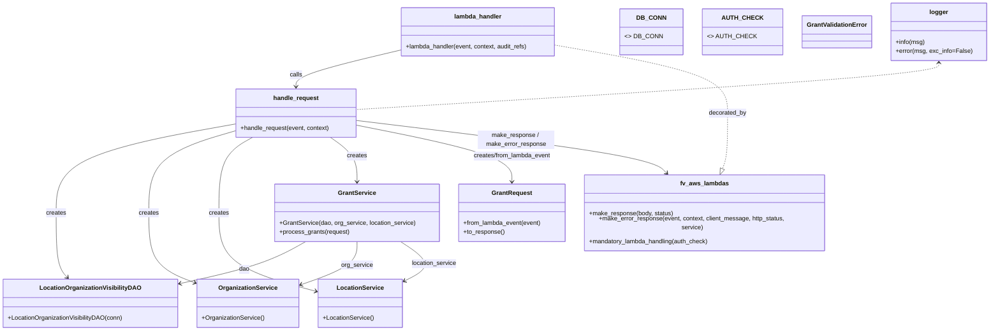

# Diagram: entity_core/entity_service/entity_service/damageview/submission/location_visibility.py


> Auto-generated by Obscura crawlers

## Diagram 1



### SVG

<svg id="container" width="2539.556640625" xmlns="http://www.w3.org/2000/svg" class="classDiagram" height="838" viewBox="0 0 2539.556640625 838" role="graphics-document document" aria-roledescription="class"><style>#container{font-family:"trebuchet ms",verdana,arial,sans-serif;font-size:16px;fill:#333;}@keyframes edge-animation-frame{from{stroke-dashoffset:0;}}@keyframes dash{to{stroke-dashoffset:0;}}#container .edge-animation-slow{stroke-dasharray:9,5!important;stroke-dashoffset:900;animation:dash 50s linear infinite;stroke-linecap:round;}#container .edge-animation-fast{stroke-dasharray:9,5!important;stroke-dashoffset:900;animation:dash 20s linear infinite;stroke-linecap:round;}#container .error-icon{fill:#552222;}#container .error-text{fill:#552222;stroke:#552222;}#container .edge-thickness-normal{stroke-width:1px;}#container .edge-thickness-thick{stroke-width:3.5px;}#container .edge-pattern-solid{stroke-dasharray:0;}#container .edge-thickness-invisible{stroke-width:0;fill:none;}#container .edge-pattern-dashed{stroke-dasharray:3;}#container .edge-pattern-dotted{stroke-dasharray:2;}#container .marker{fill:#333333;stroke:#333333;}#container .marker.cross{stroke:#333333;}#container svg{font-family:"trebuchet ms",verdana,arial,sans-serif;font-size:16px;}#container p{margin:0;}#container g.classGroup text{fill:#9370DB;stroke:none;font-family:"trebuchet ms",verdana,arial,sans-serif;font-size:10px;}#container g.classGroup text .title{font-weight:bolder;}#container .nodeLabel,#container .edgeLabel{color:#131300;}#container .edgeLabel .label rect{fill:#ECECFF;}#container .label text{fill:#131300;}#container .labelBkg{background:#ECECFF;}#container .edgeLabel .label span{background:#ECECFF;}#container .classTitle{font-weight:bolder;}#container .node rect,#container .node circle,#container .node ellipse,#container .node polygon,#container .node path{fill:#ECECFF;stroke:#9370DB;stroke-width:1px;}#container .divider{stroke:#9370DB;stroke-width:1;}#container g.clickable{cursor:pointer;}#container g.classGroup rect{fill:#ECECFF;stroke:#9370DB;}#container g.classGroup line{stroke:#9370DB;stroke-width:1;}#container .classLabel .box{stroke:none;stroke-width:0;fill:#ECECFF;opacity:0.5;}#container .classLabel .label{fill:#9370DB;font-size:10px;}#container .relation{stroke:#333333;stroke-width:1;fill:none;}#container .dashed-line{stroke-dasharray:3;}#container .dotted-line{stroke-dasharray:1 2;}#container #compositionStart,#container .composition{fill:#333333!important;stroke:#333333!important;stroke-width:1;}#container #compositionEnd,#container .composition{fill:#333333!important;stroke:#333333!important;stroke-width:1;}#container #dependencyStart,#container .dependency{fill:#333333!important;stroke:#333333!important;stroke-width:1;}#container #dependencyStart,#container .dependency{fill:#333333!important;stroke:#333333!important;stroke-width:1;}#container #extensionStart,#container .extension{fill:transparent!important;stroke:#333333!important;stroke-width:1;}#container #extensionEnd,#container .extension{fill:transparent!important;stroke:#333333!important;stroke-width:1;}#container #aggregationStart,#container .aggregation{fill:transparent!important;stroke:#333333!important;stroke-width:1;}#container #aggregationEnd,#container .aggregation{fill:transparent!important;stroke:#333333!important;stroke-width:1;}#container #lollipopStart,#container .lollipop{fill:#ECECFF!important;stroke:#333333!important;stroke-width:1;}#container #lollipopEnd,#container .lollipop{fill:#ECECFF!important;stroke:#333333!important;stroke-width:1;}#container .edgeTerminals{font-size:11px;line-height:initial;}#container .classTitleText{text-anchor:middle;font-size:18px;fill:#333;}#container .label-icon{display:inline-block;height:1em;overflow:visible;vertical-align:-0.125em;}#container .node .label-icon path{fill:currentColor;stroke:revert;stroke-width:revert;}#container :root{--mermaid-font-family:"trebuchet ms",verdana,arial,sans-serif;}</style><g><defs><marker id="container_class-aggregationStart" class="marker aggregation class" refX="18" refY="7" markerWidth="190" markerHeight="240" orient="auto"><path d="M 18,7 L9,13 L1,7 L9,1 Z"></path></marker></defs><defs><marker id="container_class-aggregationEnd" class="marker aggregation class" refX="1" refY="7" markerWidth="20" markerHeight="28" orient="auto"><path d="M 18,7 L9,13 L1,7 L9,1 Z"></path></marker></defs><defs><marker id="container_class-extensionStart" class="marker extension class" refX="18" refY="7" markerWidth="190" markerHeight="240" orient="auto"><path d="M 1,7 L18,13 V 1 Z"></path></marker></defs><defs><marker id="container_class-extensionEnd" class="marker extension class" refX="1" refY="7" markerWidth="20" markerHeight="28" orient="auto"><path d="M 1,1 V 13 L18,7 Z"></path></marker></defs><defs><marker id="container_class-compositionStart" class="marker composition class" refX="18" refY="7" markerWidth="190" markerHeight="240" orient="auto"><path d="M 18,7 L9,13 L1,7 L9,1 Z"></path></marker></defs><defs><marker id="container_class-compositionEnd" class="marker composition class" refX="1" refY="7" markerWidth="20" markerHeight="28" orient="auto"><path d="M 18,7 L9,13 L1,7 L9,1 Z"></path></marker></defs><defs><marker id="container_class-dependencyStart" class="marker dependency class" refX="6" refY="7" markerWidth="190" markerHeight="240" orient="auto"><path d="M 5,7 L9,13 L1,7 L9,1 Z"></path></marker></defs><defs><marker id="container_class-dependencyEnd" class="marker dependency class" refX="13" refY="7" markerWidth="20" markerHeight="28" orient="auto"><path d="M 18,7 L9,13 L14,7 L9,1 Z"></path></marker></defs><defs><marker id="container_class-lollipopStart" class="marker lollipop class" refX="13" refY="7" markerWidth="190" markerHeight="240" orient="auto"><circle stroke="black" fill="transparent" cx="7" cy="7" r="6"></circle></marker></defs><defs><marker id="container_class-lollipopEnd" class="marker lollipop class" refX="1" refY="7" markerWidth="190" markerHeight="240" orient="auto"><circle stroke="black" fill="transparent" cx="7" cy="7" r="6"></circle></marker></defs><g class="root"><g class="clusters"></g><g class="edgePaths"><path d="M772.789,618L756.986,626.167C741.184,634.333,709.579,650.667,658.007,666.867C606.434,683.068,534.894,699.137,499.124,707.171L463.354,715.205" id="id_GrantService_LocationOrganizationVisibilityDAO_1" class="edge-thickness-normal edge-pattern-solid relation" style=";;;" data-edge="true" data-et="edge" data-id="id_GrantService_LocationOrganizationVisibilityDAO_1" data-points="W3sieCI6NzcyLjc4ODYyMTQ3MTc3NDEsInkiOjYxOH0seyJ4Ijo2NzcuOTc0NjA5Mzc1LCJ5Ijo2Njd9LHsieCI6NDU3LjUsInkiOjcxNi41MTk4NjEzNzYxNDg4fV0=" marker-end="url(#container_class-dependencyEnd)"></path><path d="M917.912,618L917.912,626.167C917.912,634.333,917.912,650.667,893.757,667.445C869.601,684.223,821.291,701.446,797.135,710.058L772.98,718.67" id="id_GrantService_OrganizationService_2" class="edge-thickness-normal edge-pattern-solid relation" style=";;;" data-edge="true" data-et="edge" data-id="id_GrantService_OrganizationService_2" data-points="W3sieCI6OTE3LjkxMjEwOTM3NSwieSI6NjE4fSx7IngiOjkxNy45MTIxMDkzNzUsInkiOjY2N30seyJ4Ijo3NjcuMzI4MTI1LCJ5Ijo3MjAuNjg0NTAzNzA3ODN9XQ==" marker-end="url(#container_class-dependencyEnd)"></path><path d="M1041.211,618L1054.636,626.167C1068.062,634.333,1094.914,650.667,1094.243,665.982C1093.573,681.298,1065.38,695.596,1051.284,702.744L1037.187,709.893" id="id_GrantService_LocationService_3" class="edge-thickness-normal edge-pattern-solid relation" style=";;;" data-edge="true" data-et="edge" data-id="id_GrantService_LocationService_3" data-points="W3sieCI6MTA0MS4yMTA2MDY3Mjg4MzA3LCJ5Ijo2MTh9LHsieCI6MTEyMS43NjU2MjUsInkiOjY2N30seyJ4IjoxMDMxLjgzNTkzNzUsInkiOjcxMi42MDcwODQxMzM5OTYzfV0=" marker-end="url(#container_class-dependencyEnd)"></path><path d="M623.271,322.71L543.31,336.759C463.348,350.807,303.424,378.903,223.462,415.618C143.5,452.333,143.5,497.667,143.5,541C143.5,584.333,143.5,625.667,148.338,651.754C153.176,677.841,162.852,688.682,167.689,694.103L172.527,699.524" id="id_handle_request_LocationOrganizationVisibilityDAO_4" class="edge-thickness-normal edge-pattern-solid relation" style=";;;" data-edge="true" data-et="edge" data-id="id_handle_request_LocationOrganizationVisibilityDAO_4" data-points="W3sieCI6NjIzLjI3MTQ4NDM3NSwieSI6MzIyLjcxMDQ3NzA1NDE1NzY1fSx7IngiOjE0My41LCJ5Ijo0MDd9LHsieCI6MTQzLjUsInkiOjU0M30seyJ4IjoxNDMuNSwieSI6NjY3fSx7IngiOjE3Ni41MjI1LCJ5Ijo3MDR9XQ==" marker-end="url(#container_class-dependencyEnd)"></path><path d="M623.271,339.275L583.06,350.562C542.849,361.85,462.426,384.425,422.215,418.379C382.004,452.333,382.004,497.667,382.004,541C382.004,584.333,382.004,625.667,401.989,654.158C421.974,682.649,461.943,698.298,481.928,706.123L501.913,713.948" id="id_handle_request_OrganizationService_5" class="edge-thickness-normal edge-pattern-solid relation" style=";;;" data-edge="true" data-et="edge" data-id="id_handle_request_OrganizationService_5" data-points="W3sieCI6NjIzLjI3MTQ4NDM3NSwieSI6MzM5LjI3NDc3Mjk4ODcxNjczfSx7IngiOjM4Mi4wMDM5MDYyNSwieSI6NDA3fSx7IngiOjM4Mi4wMDM5MDYyNSwieSI6NTQzfSx7IngiOjM4Mi4wMDM5MDYyNSwieSI6NjY3fSx7IngiOjUwNy41LCJ5Ijo3MTYuMTM1MTIyNzM0NTcyMn1d" marker-end="url(#container_class-dependencyEnd)"></path><path d="M657.677,358L641.69,366.167C625.704,374.333,593.732,390.667,577.746,421.5C561.76,452.333,561.76,497.667,561.76,541C561.76,584.333,561.76,625.667,603.39,657.807C645.021,689.948,728.282,712.896,769.913,724.371L811.544,735.845" id="id_handle_request_LocationService_6" class="edge-thickness-normal edge-pattern-solid relation" style=";;;" data-edge="true" data-et="edge" data-id="id_handle_request_LocationService_6" data-points="W3sieCI6NjU3LjY3NjUxMzY3MTg3NSwieSI6MzU4fSx7IngiOjU2MS43NTk3NjU2MjUsInkiOjQwN30seyJ4Ijo1NjEuNzU5NzY1NjI1LCJ5Ijo1NDN9LHsieCI6NTYxLjc1OTc2NTYyNSwieSI6NjY3fSx7IngiOjgxNy4zMjgxMjUsInkiOjczNy40Mzg5OTU1MDUwNzM2fV0=" marker-end="url(#container_class-dependencyEnd)"></path><path d="M858.012,358L867.996,366.167C877.979,374.333,897.945,390.667,907.929,408C917.912,425.333,917.912,443.667,917.912,452.833L917.912,462" id="id_handle_request_GrantService_7" class="edge-thickness-normal edge-pattern-solid relation" style=";;;" data-edge="true" data-et="edge" data-id="id_handle_request_GrantService_7" data-points="W3sieCI6ODU4LjAxMjIwNzAzMTI1LCJ5IjozNTh9LHsieCI6OTE3LjkxMjEwOTM3NSwieSI6NDA3fSx7IngiOjkxNy45MTIxMDkzNzUsInkiOjQ2OH1d" marker-end="url(#container_class-dependencyEnd)"></path><path d="M938.725,327.8L1002.2,341C1065.675,354.2,1192.626,380.6,1256.101,402.967C1319.576,425.333,1319.576,443.667,1319.576,452.833L1319.576,462" id="id_handle_request_GrantRequest_8" class="edge-thickness-normal edge-pattern-solid relation" style=";;;" data-edge="true" data-et="edge" data-id="id_handle_request_GrantRequest_8" data-points="W3sieCI6OTM4LjcyNDYwOTM3NSwieSI6MzI3LjgwMDAyMzIwOTI2MDV9LHsieCI6MTMxOS41NzYxNzE4NzUsInkiOjQwN30seyJ4IjoxMzE5LjU3NjE3MTg3NSwieSI6NDY4fV0=" marker-end="url(#container_class-dependencyEnd)"></path><path d="M938.725,314.584L1062.772,329.987C1186.82,345.39,1434.915,376.195,1566.688,399.069C1698.462,421.943,1713.915,436.886,1721.641,444.358L1729.367,451.829" id="id_handle_request_fv_aws_lambdas_9" class="edge-thickness-normal edge-pattern-solid relation" style=";;;" data-edge="true" data-et="edge" data-id="id_handle_request_fv_aws_lambdas_9" data-points="W3sieCI6OTM4LjcyNDYwOTM3NSwieSI6MzE0LjU4NDQxODUwODk3NTE1fSx7IngiOjE2ODMuMDA5NzY1NjI1LCJ5Ijo0MDd9LHsieCI6MTczMy42ODAzNDgxMTU4MDg4LCJ5Ijo0NTZ9XQ==" marker-end="url(#container_class-dependencyEnd)"></path><path d="M1031.033,133.163L989.361,143.469C947.688,153.775,864.343,174.388,822.671,189.861C780.998,205.333,780.998,215.667,780.998,220.833L780.998,226" id="id_lambda_handler_handle_request_10" class="edge-thickness-normal edge-pattern-solid relation" style=";;;" data-edge="true" data-et="edge" data-id="id_lambda_handler_handle_request_10" data-points="W3sieCI6MTAzMS4wMzMyMDMxMjUsInkiOjEzMy4xNjMwMjM3ODkzOTc0fSx7IngiOjc4MC45OTgwNDY4NzUsInkiOjE5NX0seyJ4Ijo3ODAuOTk4MDQ2ODc1LCJ5IjoyMzJ9XQ==" marker-end="url(#container_class-dependencyEnd)"></path><path d="M1436.697,117.961L1511.189,130.801C1585.68,143.641,1734.663,169.32,1809.155,198.827C1883.646,228.333,1883.646,261.667,1883.646,297C1883.646,332.333,1883.646,369.667,1881.204,393.87C1878.762,418.073,1873.877,429.145,1871.434,434.681L1868.992,440.218" id="id_lambda_handler_fv_aws_lambdas_11" class="edge-thickness-normal edge-pattern-dashed relation" style=";;;" data-edge="true" data-et="edge" data-id="id_lambda_handler_fv_aws_lambdas_11" data-points="W3sieCI6MTQzNi42OTcyNjU2MjUsInkiOjExNy45NjEyODUwNDc4NTI2NH0seyJ4IjoxODgzLjY0NjQ4NDM3NSwieSI6MTk1fSx7IngiOjE4ODMuNjQ2NDg0Mzc1LCJ5IjoyOTV9LHsieCI6MTg4My42NDY0ODQzNzUsInkiOjQwN30seyJ4IjoxODYyLjAyODgzNzMxNjE3NjYsInkiOjQ1Nn1d" marker-end="url(#container_class-extensionEnd)"></path><path d="M2409.436,164L2409.436,169.167C2409.436,174.333,2409.436,184.667,2164.317,204.886C1919.199,225.105,1428.962,255.209,1183.843,270.262L938.725,285.314" id="id_logger_handle_request_12" class="edge-thickness-normal edge-pattern-dashed relation" style=";;;" data-edge="true" data-et="edge" data-id="id_logger_handle_request_12" data-points="W3sieCI6MjQwOS40MzU1NDY4NzUsInkiOjE1OH0seyJ4IjoyNDA5LjQzNTU0Njg3NSwieSI6MTk1fSx7IngiOjkzOC43MjQ2MDkzNzUsInkiOjI4NS4zMTQyMzkxMDk1NzU5fV0=" marker-start="url(#container_class-dependencyStart)"></path></g><g class="edgeLabels"><g class="edgeLabel" transform="translate(677.974609375, 667)"><g class="label" data-id="id_GrantService_LocationOrganizationVisibilityDAO_1" transform="translate(-13.8125, -12)"><foreignObject width="27.625" height="24"><div xmlns="http://www.w3.org/1999/xhtml" class="labelBkg" style="display: table-cell; white-space: nowrap; line-height: 1.5; max-width: 200px; text-align: center;"><span class="edgeLabel"><p>dao</p></span></div></foreignObject></g></g><g class="edgeLabel" transform="translate(917.912109375, 667)"><g class="label" data-id="id_GrantService_OrganizationService_2" transform="translate(-41.3984375, -12)"><foreignObject width="82.796875" height="24"><div xmlns="http://www.w3.org/1999/xhtml" class="labelBkg" style="display: table-cell; white-space: nowrap; line-height: 1.5; max-width: 200px; text-align: center;"><span class="edgeLabel"><p>org_service</p></span></div></foreignObject></g></g><g class="edgeLabel" transform="translate(1118.84659, 668.48037)"><g class="label" data-id="id_GrantService_LocationService_3" transform="translate(-59.140625, -12)"><foreignObject width="118.28125" height="24"><div xmlns="http://www.w3.org/1999/xhtml" class="labelBkg" style="display: table-cell; white-space: nowrap; line-height: 1.5; max-width: 200px; text-align: center;"><span class="edgeLabel"><p>location_service</p></span></div></foreignObject></g></g><g class="edgeLabel" transform="translate(143.5, 543)"><g class="label" data-id="id_handle_request_LocationOrganizationVisibilityDAO_4" transform="translate(-26.171875, -12)"><foreignObject width="52.34375" height="24"><div xmlns="http://www.w3.org/1999/xhtml" class="labelBkg" style="display: table-cell; white-space: nowrap; line-height: 1.5; max-width: 200px; text-align: center;"><span class="edgeLabel"><p>creates</p></span></div></foreignObject></g></g><g class="edgeLabel" transform="translate(382.00390625, 543)"><g class="label" data-id="id_handle_request_OrganizationService_5" transform="translate(-26.171875, -12)"><foreignObject width="52.34375" height="24"><div xmlns="http://www.w3.org/1999/xhtml" class="labelBkg" style="display: table-cell; white-space: nowrap; line-height: 1.5; max-width: 200px; text-align: center;"><span class="edgeLabel"><p>creates</p></span></div></foreignObject></g></g><g class="edgeLabel" transform="translate(561.759765625, 543)"><g class="label" data-id="id_handle_request_LocationService_6" transform="translate(-26.171875, -12)"><foreignObject width="52.34375" height="24"><div xmlns="http://www.w3.org/1999/xhtml" class="labelBkg" style="display: table-cell; white-space: nowrap; line-height: 1.5; max-width: 200px; text-align: center;"><span class="edgeLabel"><p>creates</p></span></div></foreignObject></g></g><g class="edgeLabel" transform="translate(917.912109375, 407)"><g class="label" data-id="id_handle_request_GrantService_7" transform="translate(-26.171875, -12)"><foreignObject width="52.34375" height="24"><div xmlns="http://www.w3.org/1999/xhtml" class="labelBkg" style="display: table-cell; white-space: nowrap; line-height: 1.5; max-width: 200px; text-align: center;"><span class="edgeLabel"><p>creates</p></span></div></foreignObject></g></g><g class="edgeLabel" transform="translate(1319.576171875, 407)"><g class="label" data-id="id_handle_request_GrantRequest_8" transform="translate(-102.796875, -12)"><foreignObject width="205.59375" height="24"><div xmlns="http://www.w3.org/1999/xhtml" class="labelBkg" style="display: table; white-space: break-spaces; line-height: 1.5; max-width: 200px; text-align: center; width: 200px;"><span class="edgeLabel"><p>creates/from_lambda_event</p></span></div></foreignObject></g></g><g class="edgeLabel" transform="translate(1345.84243, 365.13498)"><g class="label" data-id="id_handle_request_fv_aws_lambdas_9" transform="translate(-100, -24)"><foreignObject width="200" height="48"><div xmlns="http://www.w3.org/1999/xhtml" class="labelBkg" style="display: table; white-space: break-spaces; line-height: 1.5; max-width: 200px; text-align: center; width: 200px;"><span class="edgeLabel"><p>make_response / make_error_response</p></span></div></foreignObject></g></g><g class="edgeLabel" transform="translate(780.998046875, 195)"><g class="label" data-id="id_lambda_handler_handle_request_10" transform="translate(-16.4453125, -12)"><foreignObject width="32.890625" height="24"><div xmlns="http://www.w3.org/1999/xhtml" class="labelBkg" style="display: table-cell; white-space: nowrap; line-height: 1.5; max-width: 200px; text-align: center;"><span class="edgeLabel"><p>calls</p></span></div></foreignObject></g></g><g class="edgeLabel" transform="translate(1883.646484375, 295)"><g class="label" data-id="id_lambda_handler_fv_aws_lambdas_11" transform="translate(-49.375, -12)"><foreignObject width="98.75" height="24"><div xmlns="http://www.w3.org/1999/xhtml" class="labelBkg" style="display: table-cell; white-space: nowrap; line-height: 1.5; max-width: 200px; text-align: center;"><span class="edgeLabel"><p>decorated_by</p></span></div></foreignObject></g></g><g class="edgeLabel"><g class="label" data-id="id_logger_handle_request_12" transform="translate(0, 0)"><foreignObject width="0" height="0"><div xmlns="http://www.w3.org/1999/xhtml" class="labelBkg" style="display: table-cell; white-space: nowrap; line-height: 1.5; max-width: 200px; text-align: center;"><span class="edgeLabel"></span></div></foreignObject></g></g></g><g class="nodes"><g class="node default" id="classId-handle_request-0" transform="translate(780.998046875, 295)"><g class="basic label-container"><path d="M-157.7265625 -63 L157.7265625 -63 L157.7265625 63 L-157.7265625 63" stroke="none" stroke-width="0" fill="#ECECFF" style=""></path><path d="M-157.7265625 -63 C-66.81117689206263 -63, 24.104208715874734 -63, 157.7265625 -63 M-157.7265625 -63 C-53.160343021152855 -63, 51.40587645769429 -63, 157.7265625 -63 M157.7265625 -63 C157.7265625 -28.239577029649418, 157.7265625 6.5208459407011645, 157.7265625 63 M157.7265625 -63 C157.7265625 -27.033099191747944, 157.7265625 8.933801616504113, 157.7265625 63 M157.7265625 63 C84.94259882212083 63, 12.158635144241657 63, -157.7265625 63 M157.7265625 63 C77.57343922374638 63, -2.579684052507247 63, -157.7265625 63 M-157.7265625 63 C-157.7265625 33.311890232063696, -157.7265625 3.6237804641273925, -157.7265625 -63 M-157.7265625 63 C-157.7265625 15.410888638182797, -157.7265625 -32.178222723634406, -157.7265625 -63" stroke="#9370DB" stroke-width="1.3" fill="none" stroke-dasharray="0 0" style=""></path></g><g class="annotation-group text" transform="translate(0, -39)"></g><g class="label-group text" transform="translate(-57.296875, -39)"><g class="label" style="font-weight: bolder" transform="translate(0,-12)"><foreignObject width="114.59375" height="24"><div xmlns="http://www.w3.org/1999/xhtml" style="display: table-cell; white-space: nowrap; line-height: 1.5; max-width: 164px; text-align: center;"><span class="nodeLabel markdown-node-label" style=""><p>handle_request</p></span></div></foreignObject></g></g><g class="members-group text" transform="translate(-145.7265625, 9)"></g><g class="methods-group text" transform="translate(-145.7265625, 39)"><g class="label" style="" transform="translate(0,-12)"><foreignObject width="234.15625" height="24"><div xmlns="http://www.w3.org/1999/xhtml" style="display: table-cell; white-space: nowrap; line-height: 1.5; max-width: 292px; text-align: center;"><span class="nodeLabel markdown-node-label" style=""><p>+handle_request(event, context)</p></span></div></foreignObject></g></g><g class="divider" style=""><path d="M-157.7265625 -15 C-73.78145258730436 -15, 10.163657325391284 -15, 157.7265625 -15 M-157.7265625 -15 C-58.58829709451933 -15, 40.54996831096133 -15, 157.7265625 -15" stroke="#9370DB" stroke-width="1.3" fill="none" stroke-dasharray="0 0" style=""></path></g><g class="divider" style=""><path d="M-157.7265625 9 C-88.216399118776 9, -18.706235737551992 9, 157.7265625 9 M-157.7265625 9 C-52.96363001120889 9, 51.799302477582216 9, 157.7265625 9" stroke="#9370DB" stroke-width="1.3" fill="none" stroke-dasharray="0 0" style=""></path></g></g><g class="node default" id="classId-lambda_handler-1" transform="translate(1233.865234375, 83)"><g class="basic label-container"><path d="M-202.83203125 -63 L202.83203125 -63 L202.83203125 63 L-202.83203125 63" stroke="none" stroke-width="0" fill="#ECECFF" style=""></path><path d="M-202.83203125 -63 C-102.87907210450841 -63, -2.9261129590168196 -63, 202.83203125 -63 M-202.83203125 -63 C-82.24231354514919 -63, 38.347404159701625 -63, 202.83203125 -63 M202.83203125 -63 C202.83203125 -26.768926460294253, 202.83203125 9.462147079411494, 202.83203125 63 M202.83203125 -63 C202.83203125 -19.12720382090575, 202.83203125 24.745592358188503, 202.83203125 63 M202.83203125 63 C52.61180008764907 63, -97.60843107470185 63, -202.83203125 63 M202.83203125 63 C79.00145262597215 63, -44.8291259980557 63, -202.83203125 63 M-202.83203125 63 C-202.83203125 32.49800283906005, -202.83203125 1.996005678120106, -202.83203125 -63 M-202.83203125 63 C-202.83203125 16.940998400066455, -202.83203125 -29.11800319986709, -202.83203125 -63" stroke="#9370DB" stroke-width="1.3" fill="none" stroke-dasharray="0 0" style=""></path></g><g class="annotation-group text" transform="translate(0, -39)"></g><g class="label-group text" transform="translate(-59.9765625, -39)"><g class="label" style="font-weight: bolder" transform="translate(0,-12)"><foreignObject width="119.953125" height="24"><div xmlns="http://www.w3.org/1999/xhtml" style="display: table-cell; white-space: nowrap; line-height: 1.5; max-width: 170px; text-align: center;"><span class="nodeLabel markdown-node-label" style=""><p>lambda_handler</p></span></div></foreignObject></g></g><g class="members-group text" transform="translate(-190.83203125, 9)"></g><g class="methods-group text" transform="translate(-190.83203125, 39)"><g class="label" style="" transform="translate(0,-12)"><foreignObject width="321.6875" height="24"><div xmlns="http://www.w3.org/1999/xhtml" style="display: table-cell; white-space: nowrap; line-height: 1.5; max-width: 379px; text-align: center;"><span class="nodeLabel markdown-node-label" style=""><p>+lambda_handler(event, context, audit_refs)</p></span></div></foreignObject></g></g><g class="divider" style=""><path d="M-202.83203125 -15 C-121.26329925045265 -15, -39.694567250905294 -15, 202.83203125 -15 M-202.83203125 -15 C-41.12193871655978 -15, 120.58815381688044 -15, 202.83203125 -15" stroke="#9370DB" stroke-width="1.3" fill="none" stroke-dasharray="0 0" style=""></path></g><g class="divider" style=""><path d="M-202.83203125 9 C-65.08479261876465 9, 72.6624460124707 9, 202.83203125 9 M-202.83203125 9 C-76.35869021011605 9, 50.114650829767896 9, 202.83203125 9" stroke="#9370DB" stroke-width="1.3" fill="none" stroke-dasharray="0 0" style=""></path></g></g><g class="node default" id="classId-DB_CONN-2" transform="translate(1704.494140625, 83)"><g class="basic label-container"><path d="M-73.8046875 -60 L73.8046875 -60 L73.8046875 60 L-73.8046875 60" stroke="none" stroke-width="0" fill="#ECECFF" style=""></path><path d="M-73.8046875 -60 C-43.71669632394003 -60, -13.628705147880062 -60, 73.8046875 -60 M-73.8046875 -60 C-36.1052467535579 -60, 1.5941939928842004 -60, 73.8046875 -60 M73.8046875 -60 C73.8046875 -32.74939491268259, 73.8046875 -5.498789825365179, 73.8046875 60 M73.8046875 -60 C73.8046875 -29.154926383784836, 73.8046875 1.690147232430327, 73.8046875 60 M73.8046875 60 C43.573964328068925 60, 13.343241156137857 60, -73.8046875 60 M73.8046875 60 C18.017082863420406 60, -37.77052177315919 60, -73.8046875 60 M-73.8046875 60 C-73.8046875 21.09501763095122, -73.8046875 -17.809964738097563, -73.8046875 -60 M-73.8046875 60 C-73.8046875 12.846186197671429, -73.8046875 -34.30762760465714, -73.8046875 -60" stroke="#9370DB" stroke-width="1.3" fill="none" stroke-dasharray="0 0" style=""></path></g><g class="annotation-group text" transform="translate(0, -36)"></g><g class="label-group text" transform="translate(-34.40625, -36)"><g class="label" style="font-weight: bolder" transform="translate(0,-12)"><foreignObject width="68.8125" height="24"><div xmlns="http://www.w3.org/1999/xhtml" style="display: table-cell; white-space: nowrap; line-height: 1.5; max-width: 119px; text-align: center;"><span class="nodeLabel markdown-node-label" style=""><p>DB_CONN</p></span></div></foreignObject></g></g><g class="members-group text" transform="translate(-61.8046875, 12)"><g class="label" style="" transform="translate(0,-12)"><foreignObject width="89.203125" height="24"><div xmlns="http://www.w3.org/1999/xhtml" style="display: table-cell; white-space: nowrap; line-height: 1.5; max-width: 179px; text-align: center;"><span class="nodeLabel markdown-node-label" style=""><p>&lt;&gt; DB_CONN</p></span></div></foreignObject></g></g><g class="methods-group text" transform="translate(-61.8046875, 60)"></g><g class="divider" style=""><path d="M-73.8046875 -12 C-29.597950443547468 -12, 14.608786612905064 -12, 73.8046875 -12 M-73.8046875 -12 C-27.288622222235738 -12, 19.227443055528525 -12, 73.8046875 -12" stroke="#9370DB" stroke-width="1.3" fill="none" stroke-dasharray="0 0" style=""></path></g><g class="divider" style=""><path d="M-73.8046875 36 C-19.416232213497636 36, 34.97222307300473 36, 73.8046875 36 M-73.8046875 36 C-27.176279297651817 36, 19.452128904696366 36, 73.8046875 36" stroke="#9370DB" stroke-width="1.3" fill="none" stroke-dasharray="0 0" style=""></path></g></g><g class="node default" id="classId-AUTH_CHECK-3" transform="translate(1920.447265625, 83)"><g class="basic label-container"><path d="M-92.1484375 -60 L92.1484375 -60 L92.1484375 60 L-92.1484375 60" stroke="none" stroke-width="0" fill="#ECECFF" style=""></path><path d="M-92.1484375 -60 C-51.43210545183661 -60, -10.715773403673225 -60, 92.1484375 -60 M-92.1484375 -60 C-29.371214147528654 -60, 33.40600920494269 -60, 92.1484375 -60 M92.1484375 -60 C92.1484375 -15.243668278182675, 92.1484375 29.51266344363465, 92.1484375 60 M92.1484375 -60 C92.1484375 -17.896777576633262, 92.1484375 24.206444846733476, 92.1484375 60 M92.1484375 60 C51.36599337164353 60, 10.583549243287067 60, -92.1484375 60 M92.1484375 60 C50.83199085926686 60, 9.51554421853372 60, -92.1484375 60 M-92.1484375 60 C-92.1484375 18.92429503107345, -92.1484375 -22.151409937853103, -92.1484375 -60 M-92.1484375 60 C-92.1484375 20.33857361827171, -92.1484375 -19.32285276345658, -92.1484375 -60" stroke="#9370DB" stroke-width="1.3" fill="none" stroke-dasharray="0 0" style=""></path></g><g class="annotation-group text" transform="translate(0, -36)"></g><g class="label-group text" transform="translate(-47.03125, -36)"><g class="label" style="font-weight: bolder" transform="translate(0,-12)"><foreignObject width="94.0625" height="24"><div xmlns="http://www.w3.org/1999/xhtml" style="display: table-cell; white-space: nowrap; line-height: 1.5; max-width: 144px; text-align: center;"><span class="nodeLabel markdown-node-label" style=""><p>AUTH_CHECK</p></span></div></foreignObject></g></g><g class="members-group text" transform="translate(-80.1484375, 12)"><g class="label" style="" transform="translate(0,-12)"><foreignObject width="113.265625" height="24"><div xmlns="http://www.w3.org/1999/xhtml" style="display: table-cell; white-space: nowrap; line-height: 1.5; max-width: 204px; text-align: center;"><span class="nodeLabel markdown-node-label" style=""><p>&lt;&gt; AUTH_CHECK</p></span></div></foreignObject></g></g><g class="methods-group text" transform="translate(-80.1484375, 60)"></g><g class="divider" style=""><path d="M-92.1484375 -12 C-34.22196179729857 -12, 23.704513905402862 -12, 92.1484375 -12 M-92.1484375 -12 C-49.65053852451494 -12, -7.152639549029885 -12, 92.1484375 -12" stroke="#9370DB" stroke-width="1.3" fill="none" stroke-dasharray="0 0" style=""></path></g><g class="divider" style=""><path d="M-92.1484375 36 C-27.274089885979876 36, 37.60025772804025 36, 92.1484375 36 M-92.1484375 36 C-19.468576915069207 36, 53.21128366986159 36, 92.1484375 36" stroke="#9370DB" stroke-width="1.3" fill="none" stroke-dasharray="0 0" style=""></path></g></g><g class="node default" id="classId-LocationOrganizationVisibilityDAO-4" transform="translate(232.75, 767)"><g class="basic label-container"><path d="M-224.75 -63 L224.75 -63 L224.75 63 L-224.75 63" stroke="none" stroke-width="0" fill="#ECECFF" style=""></path><path d="M-224.75 -63 C-61.71023833720017 -63, 101.32952332559967 -63, 224.75 -63 M-224.75 -63 C-76.98930906389398 -63, 70.77138187221203 -63, 224.75 -63 M224.75 -63 C224.75 -34.251948216234005, 224.75 -5.503896432468011, 224.75 63 M224.75 -63 C224.75 -15.64462079478568, 224.75 31.71075841042864, 224.75 63 M224.75 63 C131.8412128630215 63, 38.93242572604302 63, -224.75 63 M224.75 63 C75.0457010238132 63, -74.65859795237361 63, -224.75 63 M-224.75 63 C-224.75 35.265794666559884, -224.75 7.5315893331197685, -224.75 -63 M-224.75 63 C-224.75 22.58185719016496, -224.75 -17.83628561967008, -224.75 -63" stroke="#9370DB" stroke-width="1.3" fill="none" stroke-dasharray="0 0" style=""></path></g><g class="annotation-group text" transform="translate(0, -39)"></g><g class="label-group text" transform="translate(-125.125, -39)"><g class="label" style="font-weight: bolder" transform="translate(0,-12)"><foreignObject width="250.25" height="24"><div xmlns="http://www.w3.org/1999/xhtml" style="display: table-cell; white-space: nowrap; line-height: 1.5; max-width: 297px; text-align: center;"><span class="nodeLabel markdown-node-label" style=""><p>LocationOrganizationVisibilityDAO</p></span></div></foreignObject></g></g><g class="members-group text" transform="translate(-212.75, 9)"></g><g class="methods-group text" transform="translate(-212.75, 39)"><g class="label" style="" transform="translate(0,-12)"><foreignObject width="300.375" height="24"><div xmlns="http://www.w3.org/1999/xhtml" style="display: table-cell; white-space: nowrap; line-height: 1.5; max-width: 358px; text-align: center;"><span class="nodeLabel markdown-node-label" style=""><p>+LocationOrganizationVisibilityDAO(conn)</p></span></div></foreignObject></g></g><g class="divider" style=""><path d="M-224.75 -15 C-81.34793673060992 -15, 62.05412653878017 -15, 224.75 -15 M-224.75 -15 C-57.0144685184149 -15, 110.7210629631702 -15, 224.75 -15" stroke="#9370DB" stroke-width="1.3" fill="none" stroke-dasharray="0 0" style=""></path></g><g class="divider" style=""><path d="M-224.75 9 C-112.36657736524097 9, 0.01684526951805765 9, 224.75 9 M-224.75 9 C-70.61717468957534 9, 83.51565062084933 9, 224.75 9" stroke="#9370DB" stroke-width="1.3" fill="none" stroke-dasharray="0 0" style=""></path></g></g><g class="node default" id="classId-OrganizationService-5" transform="translate(637.4140625, 767)"><g class="basic label-container"><path d="M-129.9140625 -63 L129.9140625 -63 L129.9140625 63 L-129.9140625 63" stroke="none" stroke-width="0" fill="#ECECFF" style=""></path><path d="M-129.9140625 -63 C-77.6822365287889 -63, -25.45041055757781 -63, 129.9140625 -63 M-129.9140625 -63 C-71.27670443961155 -63, -12.639346379223099 -63, 129.9140625 -63 M129.9140625 -63 C129.9140625 -37.64352943294172, 129.9140625 -12.287058865883438, 129.9140625 63 M129.9140625 -63 C129.9140625 -24.631722107989283, 129.9140625 13.736555784021434, 129.9140625 63 M129.9140625 63 C26.53856386183348 63, -76.83693477633304 63, -129.9140625 63 M129.9140625 63 C71.95006273079008 63, 13.98606296158016 63, -129.9140625 63 M-129.9140625 63 C-129.9140625 36.34184824325314, -129.9140625 9.683696486506278, -129.9140625 -63 M-129.9140625 63 C-129.9140625 14.721956514103411, -129.9140625 -33.55608697179318, -129.9140625 -63" stroke="#9370DB" stroke-width="1.3" fill="none" stroke-dasharray="0 0" style=""></path></g><g class="annotation-group text" transform="translate(0, -39)"></g><g class="label-group text" transform="translate(-73.34375, -39)"><g class="label" style="font-weight: bolder" transform="translate(0,-12)"><foreignObject width="146.6875" height="24"><div xmlns="http://www.w3.org/1999/xhtml" style="display: table-cell; white-space: nowrap; line-height: 1.5; max-width: 194px; text-align: center;"><span class="nodeLabel markdown-node-label" style=""><p>OrganizationService</p></span></div></foreignObject></g></g><g class="members-group text" transform="translate(-117.9140625, 9)"></g><g class="methods-group text" transform="translate(-117.9140625, 39)"><g class="label" style="" transform="translate(0,-12)"><foreignObject width="162.484375" height="24"><div xmlns="http://www.w3.org/1999/xhtml" style="display: table-cell; white-space: nowrap; line-height: 1.5; max-width: 220px; text-align: center;"><span class="nodeLabel markdown-node-label" style=""><p>+OrganizationService()</p></span></div></foreignObject></g></g><g class="divider" style=""><path d="M-129.9140625 -15 C-71.51430208003406 -15, -13.114541660068113 -15, 129.9140625 -15 M-129.9140625 -15 C-26.60975274481504 -15, 76.69455701036992 -15, 129.9140625 -15" stroke="#9370DB" stroke-width="1.3" fill="none" stroke-dasharray="0 0" style=""></path></g><g class="divider" style=""><path d="M-129.9140625 9 C-41.25711843303711 9, 47.399825633925786 9, 129.9140625 9 M-129.9140625 9 C-40.36959953439495 9, 49.1748634312101 9, 129.9140625 9" stroke="#9370DB" stroke-width="1.3" fill="none" stroke-dasharray="0 0" style=""></path></g></g><g class="node default" id="classId-LocationService-6" transform="translate(924.58203125, 767)"><g class="basic label-container"><path d="M-107.25390625 -63 L107.25390625 -63 L107.25390625 63 L-107.25390625 63" stroke="none" stroke-width="0" fill="#ECECFF" style=""></path><path d="M-107.25390625 -63 C-38.66005459575523 -63, 29.933797058489546 -63, 107.25390625 -63 M-107.25390625 -63 C-21.641288999399094 -63, 63.97132825120181 -63, 107.25390625 -63 M107.25390625 -63 C107.25390625 -37.556252380614254, 107.25390625 -12.112504761228514, 107.25390625 63 M107.25390625 -63 C107.25390625 -32.85115671325056, 107.25390625 -2.702313426501121, 107.25390625 63 M107.25390625 63 C51.90526372761097 63, -3.443378794778056 63, -107.25390625 63 M107.25390625 63 C58.33288613773765 63, 9.411866025475305 63, -107.25390625 63 M-107.25390625 63 C-107.25390625 27.12460887576114, -107.25390625 -8.75078224847772, -107.25390625 -63 M-107.25390625 63 C-107.25390625 15.657480396015721, -107.25390625 -31.685039207968558, -107.25390625 -63" stroke="#9370DB" stroke-width="1.3" fill="none" stroke-dasharray="0 0" style=""></path></g><g class="annotation-group text" transform="translate(0, -39)"></g><g class="label-group text" transform="translate(-57.9921875, -39)"><g class="label" style="font-weight: bolder" transform="translate(0,-12)"><foreignObject width="115.984375" height="24"><div xmlns="http://www.w3.org/1999/xhtml" style="display: table-cell; white-space: nowrap; line-height: 1.5; max-width: 164px; text-align: center;"><span class="nodeLabel markdown-node-label" style=""><p>LocationService</p></span></div></foreignObject></g></g><g class="members-group text" transform="translate(-95.25390625, 9)"></g><g class="methods-group text" transform="translate(-95.25390625, 39)"><g class="label" style="" transform="translate(0,-12)"><foreignObject width="132.515625" height="24"><div xmlns="http://www.w3.org/1999/xhtml" style="display: table-cell; white-space: nowrap; line-height: 1.5; max-width: 190px; text-align: center;"><span class="nodeLabel markdown-node-label" style=""><p>+LocationService()</p></span></div></foreignObject></g></g><g class="divider" style=""><path d="M-107.25390625 -15 C-52.807721927635065 -15, 1.6384623947298707 -15, 107.25390625 -15 M-107.25390625 -15 C-49.17802001692849 -15, 8.897866216143015 -15, 107.25390625 -15" stroke="#9370DB" stroke-width="1.3" fill="none" stroke-dasharray="0 0" style=""></path></g><g class="divider" style=""><path d="M-107.25390625 9 C-30.17446211130823 9, 46.90498202738354 9, 107.25390625 9 M-107.25390625 9 C-35.148915462627585 9, 36.95607532474483 9, 107.25390625 9" stroke="#9370DB" stroke-width="1.3" fill="none" stroke-dasharray="0 0" style=""></path></g></g><g class="node default" id="classId-GrantService-7" transform="translate(917.912109375, 543)"><g class="basic label-container"><path d="M-212.65625 -75 L212.65625 -75 L212.65625 75 L-212.65625 75" stroke="none" stroke-width="0" fill="#ECECFF" style=""></path><path d="M-212.65625 -75 C-74.98539211754468 -75, 62.685465764910646 -75, 212.65625 -75 M-212.65625 -75 C-76.00827693305158 -75, 60.63969613389685 -75, 212.65625 -75 M212.65625 -75 C212.65625 -35.04783059649692, 212.65625 4.904338807006155, 212.65625 75 M212.65625 -75 C212.65625 -42.815117185819645, 212.65625 -10.63023437163929, 212.65625 75 M212.65625 75 C114.76346888925251 75, 16.870687778505015 75, -212.65625 75 M212.65625 75 C69.15778071516087 75, -74.34068856967826 75, -212.65625 75 M-212.65625 75 C-212.65625 38.13518703366745, -212.65625 1.2703740673348989, -212.65625 -75 M-212.65625 75 C-212.65625 41.2197339234719, -212.65625 7.439467846943799, -212.65625 -75" stroke="#9370DB" stroke-width="1.3" fill="none" stroke-dasharray="0 0" style=""></path></g><g class="annotation-group text" transform="translate(0, -51)"></g><g class="label-group text" transform="translate(-46.828125, -51)"><g class="label" style="font-weight: bolder" transform="translate(0,-12)"><foreignObject width="93.65625" height="24"><div xmlns="http://www.w3.org/1999/xhtml" style="display: table-cell; white-space: nowrap; line-height: 1.5; max-width: 142px; text-align: center;"><span class="nodeLabel markdown-node-label" style=""><p>GrantService</p></span></div></foreignObject></g></g><g class="members-group text" transform="translate(-200.65625, -3)"></g><g class="methods-group text" transform="translate(-200.65625, 27)"><g class="label" style="" transform="translate(0,-12)"><foreignObject width="354.484375" height="24"><div xmlns="http://www.w3.org/1999/xhtml" style="display: table-cell; white-space: nowrap; line-height: 1.5; max-width: 412px; text-align: center;"><span class="nodeLabel markdown-node-label" style=""><p>+GrantService(dao, org_service, location_service)</p></span></div></foreignObject></g><g class="label" style="" transform="translate(0,12)"><foreignObject width="182.40625" height="24"><div xmlns="http://www.w3.org/1999/xhtml" style="display: table-cell; white-space: nowrap; line-height: 1.5; max-width: 240px; text-align: center;"><span class="nodeLabel markdown-node-label" style=""><p>+process_grants(request)</p></span></div></foreignObject></g></g><g class="divider" style=""><path d="M-212.65625 -27 C-102.78809203039955 -27, 7.0800659392008924 -27, 212.65625 -27 M-212.65625 -27 C-84.55833305398502 -27, 43.53958389202995 -27, 212.65625 -27" stroke="#9370DB" stroke-width="1.3" fill="none" stroke-dasharray="0 0" style=""></path></g><g class="divider" style=""><path d="M-212.65625 -3 C-46.194288362662064 -3, 120.26767327467587 -3, 212.65625 -3 M-212.65625 -3 C-89.45252629435244 -3, 33.751197411295124 -3, 212.65625 -3" stroke="#9370DB" stroke-width="1.3" fill="none" stroke-dasharray="0 0" style=""></path></g></g><g class="node default" id="classId-GrantRequest-8" transform="translate(1319.576171875, 543)"><g class="basic label-container"><path d="M-139.0078125 -75 L139.0078125 -75 L139.0078125 75 L-139.0078125 75" stroke="none" stroke-width="0" fill="#ECECFF" style=""></path><path d="M-139.0078125 -75 C-35.374711499984286 -75, 68.25838950003143 -75, 139.0078125 -75 M-139.0078125 -75 C-29.717024097249123 -75, 79.57376430550175 -75, 139.0078125 -75 M139.0078125 -75 C139.0078125 -20.45647832274976, 139.0078125 34.08704335450048, 139.0078125 75 M139.0078125 -75 C139.0078125 -17.418929979206467, 139.0078125 40.162140041587065, 139.0078125 75 M139.0078125 75 C44.21297240221527 75, -50.58186769556946 75, -139.0078125 75 M139.0078125 75 C77.0249188861463 75, 15.042025272292591 75, -139.0078125 75 M-139.0078125 75 C-139.0078125 36.9565404037295, -139.0078125 -1.0869191925410036, -139.0078125 -75 M-139.0078125 75 C-139.0078125 43.921285326901, -139.0078125 12.842570653801992, -139.0078125 -75" stroke="#9370DB" stroke-width="1.3" fill="none" stroke-dasharray="0 0" style=""></path></g><g class="annotation-group text" transform="translate(0, -51)"></g><g class="label-group text" transform="translate(-50.15625, -51)"><g class="label" style="font-weight: bolder" transform="translate(0,-12)"><foreignObject width="100.3125" height="24"><div xmlns="http://www.w3.org/1999/xhtml" style="display: table-cell; white-space: nowrap; line-height: 1.5; max-width: 149px; text-align: center;"><span class="nodeLabel markdown-node-label" style=""><p>GrantRequest</p></span></div></foreignObject></g></g><g class="members-group text" transform="translate(-127.0078125, -3)"></g><g class="methods-group text" transform="translate(-127.0078125, 27)"><g class="label" style="" transform="translate(0,-12)"><foreignObject width="203.859375" height="24"><div xmlns="http://www.w3.org/1999/xhtml" style="display: table-cell; white-space: nowrap; line-height: 1.5; max-width: 261px; text-align: center;"><span class="nodeLabel markdown-node-label" style=""><p>+from_lambda_event(event)</p></span></div></foreignObject></g><g class="label" style="" transform="translate(0,12)"><foreignObject width="107.46875" height="24"><div xmlns="http://www.w3.org/1999/xhtml" style="display: table-cell; white-space: nowrap; line-height: 1.5; max-width: 165px; text-align: center;"><span class="nodeLabel markdown-node-label" style=""><p>+to_response()</p></span></div></foreignObject></g></g><g class="divider" style=""><path d="M-139.0078125 -27 C-43.18764913705044 -27, 52.632514225899115 -27, 139.0078125 -27 M-139.0078125 -27 C-69.40349137642842 -27, 0.20082974714316038 -27, 139.0078125 -27" stroke="#9370DB" stroke-width="1.3" fill="none" stroke-dasharray="0 0" style=""></path></g><g class="divider" style=""><path d="M-139.0078125 -3 C-79.94112499324234 -3, -20.874437486484695 -3, 139.0078125 -3 M-139.0078125 -3 C-38.74629610443871 -3, 61.515220291122574 -3, 139.0078125 -3" stroke="#9370DB" stroke-width="1.3" fill="none" stroke-dasharray="0 0" style=""></path></g></g><g class="node default" id="classId-GrantValidationError-9" transform="translate(2149.955078125, 83)"><g class="basic label-container"><path d="M-87.359375 -42 L87.359375 -42 L87.359375 42 L-87.359375 42" stroke="none" stroke-width="0" fill="#ECECFF" style=""></path><path d="M-87.359375 -42 C-24.851282380117958 -42, 37.656810239764084 -42, 87.359375 -42 M-87.359375 -42 C-25.895955276110058 -42, 35.567464447779884 -42, 87.359375 -42 M87.359375 -42 C87.359375 -21.159328268510286, 87.359375 -0.3186565370205727, 87.359375 42 M87.359375 -42 C87.359375 -16.604439487256865, 87.359375 8.79112102548627, 87.359375 42 M87.359375 42 C25.210315452163172 42, -36.938744095673655 42, -87.359375 42 M87.359375 42 C38.177027087910986 42, -11.005320824178028 42, -87.359375 42 M-87.359375 42 C-87.359375 17.230022736131396, -87.359375 -7.539954527737208, -87.359375 -42 M-87.359375 42 C-87.359375 17.739515163938215, -87.359375 -6.52096967212357, -87.359375 -42" stroke="#9370DB" stroke-width="1.3" fill="none" stroke-dasharray="0 0" style=""></path></g><g class="annotation-group text" transform="translate(0, -18)"></g><g class="label-group text" transform="translate(-75.359375, -18)"><g class="label" style="font-weight: bolder" transform="translate(0,-12)"><foreignObject width="150.71875" height="24"><div xmlns="http://www.w3.org/1999/xhtml" style="display: table-cell; white-space: nowrap; line-height: 1.5; max-width: 199px; text-align: center;"><span class="nodeLabel markdown-node-label" style=""><p>GrantValidationError</p></span></div></foreignObject></g></g><g class="members-group text" transform="translate(-75.359375, 30)"></g><g class="methods-group text" transform="translate(-75.359375, 60)"></g><g class="divider" style=""><path d="M-87.359375 6 C-45.27645066946766 6, -3.193526338935314 6, 87.359375 6 M-87.359375 6 C-47.03236377243043 6, -6.705352544860858 6, 87.359375 6" stroke="#9370DB" stroke-width="1.3" fill="none" stroke-dasharray="0 0" style=""></path></g><g class="divider" style=""><path d="M-87.359375 24 C-44.74878304928648 24, -2.1381910985729604 24, 87.359375 24 M-87.359375 24 C-40.23605821772427 24, 6.887258564551459 24, 87.359375 24" stroke="#9370DB" stroke-width="1.3" fill="none" stroke-dasharray="0 0" style=""></path></g></g><g class="node default" id="classId-fv_aws_lambdas-10" transform="translate(1823.646484375, 543)"><g class="basic label-container"><path d="M-315.0625 -87 L315.0625 -87 L315.0625 87 L-315.0625 87" stroke="none" stroke-width="0" fill="#ECECFF" style=""></path><path d="M-315.0625 -87 C-92.64009192452363 -87, 129.78231615095274 -87, 315.0625 -87 M-315.0625 -87 C-76.56421887815333 -87, 161.93406224369335 -87, 315.0625 -87 M315.0625 -87 C315.0625 -31.46792654818467, 315.0625 24.064146903630657, 315.0625 87 M315.0625 -87 C315.0625 -31.942280140744415, 315.0625 23.11543971851117, 315.0625 87 M315.0625 87 C175.15417498248686 87, 35.24584996497373 87, -315.0625 87 M315.0625 87 C120.93376210793909 87, -73.19497578412182 87, -315.0625 87 M-315.0625 87 C-315.0625 43.358047227041986, -315.0625 -0.2839055459160278, -315.0625 -87 M-315.0625 87 C-315.0625 37.64982697389955, -315.0625 -11.7003460522009, -315.0625 -87" stroke="#9370DB" stroke-width="1.3" fill="none" stroke-dasharray="0 0" style=""></path></g><g class="annotation-group text" transform="translate(0, -63)"></g><g class="label-group text" transform="translate(-60.0625, -63)"><g class="label" style="font-weight: bolder" transform="translate(0,-12)"><foreignObject width="120.125" height="24"><div xmlns="http://www.w3.org/1999/xhtml" style="display: table-cell; white-space: nowrap; line-height: 1.5; max-width: 168px; text-align: center;"><span class="nodeLabel markdown-node-label" style=""><p>fv_aws_lambdas</p></span></div></foreignObject></g></g><g class="members-group text" transform="translate(-303.0625, -15)"></g><g class="methods-group text" transform="translate(-303.0625, 15)"><g class="label" style="" transform="translate(0,-12)"><foreignObject width="219.96875" height="24"><div xmlns="http://www.w3.org/1999/xhtml" style="display: table-cell; white-space: nowrap; line-height: 1.5; max-width: 277px; text-align: center;"><span class="nodeLabel markdown-node-label" style=""><p>+make_response(body, status)</p></span></div></foreignObject></g><g class="label" style="" transform="translate(0,12)"><foreignObject width="546.0625" height="24"><div xmlns="http://www.w3.org/1999/xhtml" style="display: table-cell; white-space: nowrap; line-height: 1.5; max-width: 603px; text-align: center;"><span class="nodeLabel markdown-node-label" style=""><p>+make_error_response(event, context, client_message, http_status, service)</p></span></div></foreignObject></g><g class="label" style="" transform="translate(0,36)"><foreignObject width="314.828125" height="24"><div xmlns="http://www.w3.org/1999/xhtml" style="display: table-cell; white-space: nowrap; line-height: 1.5; max-width: 372px; text-align: center;"><span class="nodeLabel markdown-node-label" style=""><p>+mandatory_lambda_handling(auth_check)</p></span></div></foreignObject></g></g><g class="divider" style=""><path d="M-315.0625 -39 C-169.2956395566601 -39, -23.528779113320184 -39, 315.0625 -39 M-315.0625 -39 C-180.6734428602301 -39, -46.28438572046019 -39, 315.0625 -39" stroke="#9370DB" stroke-width="1.3" fill="none" stroke-dasharray="0 0" style=""></path></g><g class="divider" style=""><path d="M-315.0625 -15 C-84.45956170760178 -15, 146.14337658479644 -15, 315.0625 -15 M-315.0625 -15 C-108.32232839401013 -15, 98.41784321197974 -15, 315.0625 -15" stroke="#9370DB" stroke-width="1.3" fill="none" stroke-dasharray="0 0" style=""></path></g></g><g class="node default" id="classId-logger-11" transform="translate(2409.435546875, 83)"><g class="basic label-container"><path d="M-122.12109375 -75 L122.12109375 -75 L122.12109375 75 L-122.12109375 75" stroke="none" stroke-width="0" fill="#ECECFF" style=""></path><path d="M-122.12109375 -75 C-71.94576695893646 -75, -21.77044016787292 -75, 122.12109375 -75 M-122.12109375 -75 C-65.52496800028767 -75, -8.928842250575343 -75, 122.12109375 -75 M122.12109375 -75 C122.12109375 -44.068989853226256, 122.12109375 -13.137979706452505, 122.12109375 75 M122.12109375 -75 C122.12109375 -41.66635206035472, 122.12109375 -8.332704120709437, 122.12109375 75 M122.12109375 75 C32.64284991606068 75, -56.83539391787863 75, -122.12109375 75 M122.12109375 75 C61.762928673775534 75, 1.4047635975510673 75, -122.12109375 75 M-122.12109375 75 C-122.12109375 22.346979173525355, -122.12109375 -30.30604165294929, -122.12109375 -75 M-122.12109375 75 C-122.12109375 26.86185282951122, -122.12109375 -21.276294340977557, -122.12109375 -75" stroke="#9370DB" stroke-width="1.3" fill="none" stroke-dasharray="0 0" style=""></path></g><g class="annotation-group text" transform="translate(0, -51)"></g><g class="label-group text" transform="translate(-23.2734375, -51)"><g class="label" style="font-weight: bolder" transform="translate(0,-12)"><foreignObject width="46.546875" height="24"><div xmlns="http://www.w3.org/1999/xhtml" style="display: table-cell; white-space: nowrap; line-height: 1.5; max-width: 96px; text-align: center;"><span class="nodeLabel markdown-node-label" style=""><p>logger</p></span></div></foreignObject></g></g><g class="members-group text" transform="translate(-110.12109375, -3)"></g><g class="methods-group text" transform="translate(-110.12109375, 27)"><g class="label" style="" transform="translate(0,-12)"><foreignObject width="76.296875" height="24"><div xmlns="http://www.w3.org/1999/xhtml" style="display: table-cell; white-space: nowrap; line-height: 1.5; max-width: 134px; text-align: center;"><span class="nodeLabel markdown-node-label" style=""><p>+info(msg)</p></span></div></foreignObject></g><g class="label" style="" transform="translate(0,12)"><foreignObject width="196.96875" height="24"><div xmlns="http://www.w3.org/1999/xhtml" style="display: table-cell; white-space: nowrap; line-height: 1.5; max-width: 254px; text-align: center;"><span class="nodeLabel markdown-node-label" style=""><p>+error(msg, exc_info=False)</p></span></div></foreignObject></g></g><g class="divider" style=""><path d="M-122.12109375 -27 C-65.94780613147297 -27, -9.774518512945946 -27, 122.12109375 -27 M-122.12109375 -27 C-62.839247337283076 -27, -3.557400924566153 -27, 122.12109375 -27" stroke="#9370DB" stroke-width="1.3" fill="none" stroke-dasharray="0 0" style=""></path></g><g class="divider" style=""><path d="M-122.12109375 -3 C-47.403940221716766 -3, 27.313213306566468 -3, 122.12109375 -3 M-122.12109375 -3 C-61.66681275337501 -3, -1.2125317567500247 -3, 122.12109375 -3" stroke="#9370DB" stroke-width="1.3" fill="none" stroke-dasharray="0 0" style=""></path></g></g></g></g></g></svg>

## Diagram 2

```mermaid
sequenceDiagram
participant Wrapper as fv.aws.lambdas.mandatory_lambda_handling
participant LambdaHandler as lambda_handler
participant Handler as handle_request
participant Logger as logger
participant DAO as LocationOrganizationVisibilityDAO
participant OrgSvc as OrganizationService
participant LocSvc as LocationService
participant GrantSvc as GrantService
participant GrantReq as GrantRequest
participant FVLambdas as fv.aws.lambdas

Wrapper->>LambdaHandler: invoke(event, context, audit_refs)
activate LambdaHandler
LambdaHandler->>Logger: info("Received event")
LambdaHandler->>Handler: call handle_request(event, context)
activate Handler
Handler->>DAO: new LocationOrganizationVisibilityDAO(DB_CONN)
Handler->>OrgSvc: new OrganizationService()
Handler->>LocSvc: new LocationService()
Handler->>GrantSvc: new GrantService(dao, org_service, location_service)
Handler->>GrantReq: GrantRequest.from_lambda_event(event)
Handler->>Logger: info("Processing grant request")
Handler->>GrantSvc: process_grants(grant_request)
activate GrantSvc
alt grant processed successfully
GrantSvc-->>Handler: grant_result
deactivate GrantSvc
Handler->>Logger: info("Successfully processed grant request")
Handler->>FVLambdas: make_response(grant_result.to_response(), 200)
Handler-->>LambdaHandler: return response
else validation error
GrantSvc--x Handler: throws GrantValidationError
deactivate GrantSvc
Handler->>FVLambdas: make_error_response(event, context, "Validation error: ...", 400, "damageview_location_grant")
Handler-->>LambdaHandler: return error response
else unexpected exception
GrantSvc--x Handler: throws Exception
deactivate GrantSvc
Handler->>Logger: error("Error processing request: ...", exc_info=True)
Handler->>FVLambdas: make_error_response(event, context, "Internal Server Error: ...", 500, "damageview_location_grant")
Handler-->>LambdaHandler: return error response
end
deactivate Handler
LambdaHandler-->>Wrapper: return response
deactivate LambdaHandler
```

> SVG rendering failed for this diagram.
