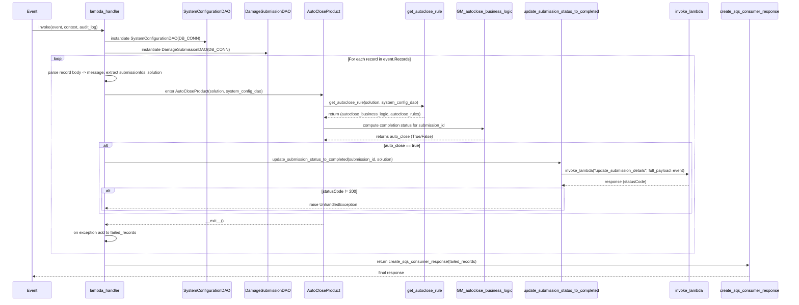
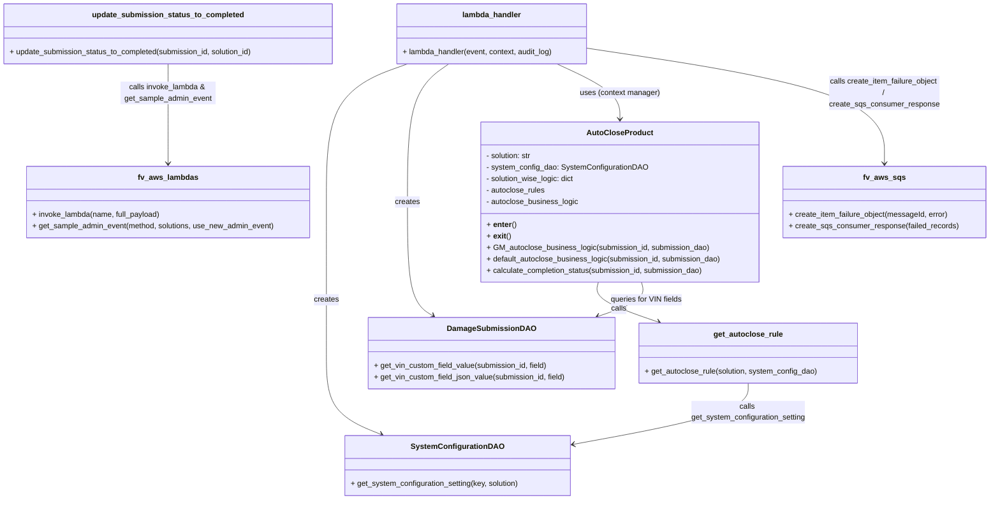

# Diagram: entity_core/entity_service/entity_service/damageview/submission/post_processing_submission_consumer.py

> Auto-generated by Obscura crawlers

## Diagram 1

### SVG

<svg id="container" width="3295.5" xmlns="http://www.w3.org/2000/svg" height="1242" viewBox="-50 -10 3295.5 1242" role="graphics-document document" aria-roledescription="sequence"><g><rect x="2945.5" y="1156" fill="#eaeaea" stroke="#666" width="250" height="65" name="SQS" rx="3" ry="3" class="actor actor-bottom"></rect><text x="3070.5" y="1188.5" dominant-baseline="central" alignment-baseline="central" class="actor actor-box" style="text-anchor: middle; font-size: 16px; font-weight: 400;"><tspan x="3070.5" dy="0">create_sqs_consumer_response</tspan></text></g><g><rect x="2745.5" y="1156" fill="#eaeaea" stroke="#666" width="150" height="65" name="Invoker" rx="3" ry="3" class="actor actor-bottom"></rect><text x="2820.5" y="1188.5" dominant-baseline="central" alignment-baseline="central" class="actor actor-box" style="text-anchor: middle; font-size: 16px; font-weight: 400;"><tspan x="2820.5" dy="0">invoke_lambda</tspan></text></g><g><rect x="2112.5" y="1156" fill="#eaeaea" stroke="#666" width="322" height="65" name="Updater" rx="3" ry="3" class="actor actor-bottom"></rect><text x="2273.5" y="1188.5" dominant-baseline="central" alignment-baseline="central" class="actor actor-box" style="text-anchor: middle; font-size: 16px; font-weight: 400;"><tspan x="2273.5" dy="0">update_submission_status_to_completed</tspan></text></g><g><rect x="1826.5" y="1156" fill="#eaeaea" stroke="#666" width="236" height="65" name="GMLogic" rx="3" ry="3" class="actor actor-bottom"></rect><text x="1944.5" y="1188.5" dominant-baseline="central" alignment-baseline="central" class="actor actor-box" style="text-anchor: middle; font-size: 16px; font-weight: 400;"><tspan x="1944.5" dy="0">GM_autoclose_business_logic</tspan></text></g><g><rect x="1618.5" y="1156" fill="#eaeaea" stroke="#666" width="158" height="65" name="Rules" rx="3" ry="3" class="actor actor-bottom"></rect><text x="1697.5" y="1188.5" dominant-baseline="central" alignment-baseline="central" class="actor actor-box" style="text-anchor: middle; font-size: 16px; font-weight: 400;"><tspan x="1697.5" dy="0">get_autoclose_rule</tspan></text></g><g><rect x="1184.5" y="1156" fill="#eaeaea" stroke="#666" width="150" height="65" name="AutoClose" rx="3" ry="3" class="actor actor-bottom"></rect><text x="1259.5" y="1188.5" dominant-baseline="central" alignment-baseline="central" class="actor actor-box" style="text-anchor: middle; font-size: 16px; font-weight: 400;"><tspan x="1259.5" dy="0">AutoCloseProduct</tspan></text></g><g><rect x="942.5" y="1156" fill="#eaeaea" stroke="#666" width="192" height="65" name="SubmissionDAO" rx="3" ry="3" class="actor actor-bottom"></rect><text x="1038.5" y="1188.5" dominant-baseline="central" alignment-baseline="central" class="actor actor-box" style="text-anchor: middle; font-size: 16px; font-weight: 400;"><tspan x="1038.5" dy="0">DamageSubmissionDAO</tspan></text></g><g><rect x="693.5" y="1156" fill="#eaeaea" stroke="#666" width="199" height="65" name="SystemConfigDAO" rx="3" ry="3" class="actor actor-bottom"></rect><text x="793" y="1188.5" dominant-baseline="central" alignment-baseline="central" class="actor actor-box" style="text-anchor: middle; font-size: 16px; font-weight: 400;"><tspan x="793" dy="0">SystemConfigurationDAO</tspan></text></g><g><rect x="307" y="1156" fill="#eaeaea" stroke="#666" width="150" height="65" name="Lambda" rx="3" ry="3" class="actor actor-bottom"></rect><text x="382" y="1188.5" dominant-baseline="central" alignment-baseline="central" class="actor actor-box" style="text-anchor: middle; font-size: 16px; font-weight: 400;"><tspan x="382" dy="0">lambda_handler</tspan></text></g><g><rect x="0" y="1156" fill="#eaeaea" stroke="#666" width="150" height="65" name="Event" rx="3" ry="3" class="actor actor-bottom"></rect><text x="75" y="1188.5" dominant-baseline="central" alignment-baseline="central" class="actor actor-box" style="text-anchor: middle; font-size: 16px; font-weight: 400;"><tspan x="75" dy="0">Event</tspan></text></g><g><line id="actor9" x1="3070.5" y1="65" x2="3070.5" y2="1156" class="actor-line 200" stroke-width="0.5px" stroke="#999" name="SQS"></line><g id="root-9"><rect x="2945.5" y="0" fill="#eaeaea" stroke="#666" width="250" height="65" name="SQS" rx="3" ry="3" class="actor actor-top"></rect><text x="3070.5" y="32.5" dominant-baseline="central" alignment-baseline="central" class="actor actor-box" style="text-anchor: middle; font-size: 16px; font-weight: 400;"><tspan x="3070.5" dy="0">create_sqs_consumer_response</tspan></text></g></g><g><line id="actor8" x1="2820.5" y1="65" x2="2820.5" y2="1156" class="actor-line 200" stroke-width="0.5px" stroke="#999" name="Invoker"></line><g id="root-8"><rect x="2745.5" y="0" fill="#eaeaea" stroke="#666" width="150" height="65" name="Invoker" rx="3" ry="3" class="actor actor-top"></rect><text x="2820.5" y="32.5" dominant-baseline="central" alignment-baseline="central" class="actor actor-box" style="text-anchor: middle; font-size: 16px; font-weight: 400;"><tspan x="2820.5" dy="0">invoke_lambda</tspan></text></g></g><g><line id="actor7" x1="2273.5" y1="65" x2="2273.5" y2="1156" class="actor-line 200" stroke-width="0.5px" stroke="#999" name="Updater"></line><g id="root-7"><rect x="2112.5" y="0" fill="#eaeaea" stroke="#666" width="322" height="65" name="Updater" rx="3" ry="3" class="actor actor-top"></rect><text x="2273.5" y="32.5" dominant-baseline="central" alignment-baseline="central" class="actor actor-box" style="text-anchor: middle; font-size: 16px; font-weight: 400;"><tspan x="2273.5" dy="0">update_submission_status_to_completed</tspan></text></g></g><g><line id="actor6" x1="1944.5" y1="65" x2="1944.5" y2="1156" class="actor-line 200" stroke-width="0.5px" stroke="#999" name="GMLogic"></line><g id="root-6"><rect x="1826.5" y="0" fill="#eaeaea" stroke="#666" width="236" height="65" name="GMLogic" rx="3" ry="3" class="actor actor-top"></rect><text x="1944.5" y="32.5" dominant-baseline="central" alignment-baseline="central" class="actor actor-box" style="text-anchor: middle; font-size: 16px; font-weight: 400;"><tspan x="1944.5" dy="0">GM_autoclose_business_logic</tspan></text></g></g><g><line id="actor5" x1="1697.5" y1="65" x2="1697.5" y2="1156" class="actor-line 200" stroke-width="0.5px" stroke="#999" name="Rules"></line><g id="root-5"><rect x="1618.5" y="0" fill="#eaeaea" stroke="#666" width="158" height="65" name="Rules" rx="3" ry="3" class="actor actor-top"></rect><text x="1697.5" y="32.5" dominant-baseline="central" alignment-baseline="central" class="actor actor-box" style="text-anchor: middle; font-size: 16px; font-weight: 400;"><tspan x="1697.5" dy="0">get_autoclose_rule</tspan></text></g></g><g><line id="actor4" x1="1259.5" y1="65" x2="1259.5" y2="1156" class="actor-line 200" stroke-width="0.5px" stroke="#999" name="AutoClose"></line><g id="root-4"><rect x="1184.5" y="0" fill="#eaeaea" stroke="#666" width="150" height="65" name="AutoClose" rx="3" ry="3" class="actor actor-top"></rect><text x="1259.5" y="32.5" dominant-baseline="central" alignment-baseline="central" class="actor actor-box" style="text-anchor: middle; font-size: 16px; font-weight: 400;"><tspan x="1259.5" dy="0">AutoCloseProduct</tspan></text></g></g><g><line id="actor3" x1="1038.5" y1="65" x2="1038.5" y2="1156" class="actor-line 200" stroke-width="0.5px" stroke="#999" name="SubmissionDAO"></line><g id="root-3"><rect x="942.5" y="0" fill="#eaeaea" stroke="#666" width="192" height="65" name="SubmissionDAO" rx="3" ry="3" class="actor actor-top"></rect><text x="1038.5" y="32.5" dominant-baseline="central" alignment-baseline="central" class="actor actor-box" style="text-anchor: middle; font-size: 16px; font-weight: 400;"><tspan x="1038.5" dy="0">DamageSubmissionDAO</tspan></text></g></g><g><line id="actor2" x1="793" y1="65" x2="793" y2="1156" class="actor-line 200" stroke-width="0.5px" stroke="#999" name="SystemConfigDAO"></line><g id="root-2"><rect x="693.5" y="0" fill="#eaeaea" stroke="#666" width="199" height="65" name="SystemConfigDAO" rx="3" ry="3" class="actor actor-top"></rect><text x="793" y="32.5" dominant-baseline="central" alignment-baseline="central" class="actor actor-box" style="text-anchor: middle; font-size: 16px; font-weight: 400;"><tspan x="793" dy="0">SystemConfigurationDAO</tspan></text></g></g><g><line id="actor1" x1="382" y1="65" x2="382" y2="1156" class="actor-line 200" stroke-width="0.5px" stroke="#999" name="Lambda"></line><g id="root-1"><rect x="307" y="0" fill="#eaeaea" stroke="#666" width="150" height="65" name="Lambda" rx="3" ry="3" class="actor actor-top"></rect><text x="382" y="32.5" dominant-baseline="central" alignment-baseline="central" class="actor actor-box" style="text-anchor: middle; font-size: 16px; font-weight: 400;"><tspan x="382" dy="0">lambda_handler</tspan></text></g></g><g><line id="actor0" x1="75" y1="65" x2="75" y2="1156" class="actor-line 200" stroke-width="0.5px" stroke="#999" name="Event"></line><g id="root-0"><rect x="0" y="0" fill="#eaeaea" stroke="#666" width="150" height="65" name="Event" rx="3" ry="3" class="actor actor-top"></rect><text x="75" y="32.5" dominant-baseline="central" alignment-baseline="central" class="actor actor-box" style="text-anchor: middle; font-size: 16px; font-weight: 400;"><tspan x="75" dy="0">Event</tspan></text></g></g><g></g><defs><symbol id="computer" width="24" height="24"><path transform="scale(.5)" d="M2 2v13h20v-13h-20zm18 11h-16v-9h16v9zm-10.228 6l.466-1h3.524l.467 1h-4.457zm14.228 3h-24l2-6h2.104l-1.33 4h18.45l-1.297-4h2.073l2 6zm-5-10h-14v-7h14v7z"></path></symbol></defs><defs><symbol id="database" fill-rule="evenodd" clip-rule="evenodd"><path transform="scale(.5)" d="M12.258.001l.256.004.255.005.253.008.251.01.249.012.247.015.246.016.242.019.241.02.239.023.236.024.233.027.231.028.229.031.225.032.223.034.22.036.217.038.214.04.211.041.208.043.205.045.201.046.198.048.194.05.191.051.187.053.183.054.18.056.175.057.172.059.168.06.163.061.16.063.155.064.15.066.074.033.073.033.071.034.07.034.069.035.068.035.067.035.066.035.064.036.064.036.062.036.06.036.06.037.058.037.058.037.055.038.055.038.053.038.052.038.051.039.05.039.048.039.047.039.045.04.044.04.043.04.041.04.04.041.039.041.037.041.036.041.034.041.033.042.032.042.03.042.029.042.027.042.026.043.024.043.023.043.021.043.02.043.018.044.017.043.015.044.013.044.012.044.011.045.009.044.007.045.006.045.004.045.002.045.001.045v17l-.001.045-.002.045-.004.045-.006.045-.007.045-.009.044-.011.045-.012.044-.013.044-.015.044-.017.043-.018.044-.02.043-.021.043-.023.043-.024.043-.026.043-.027.042-.029.042-.03.042-.032.042-.033.042-.034.041-.036.041-.037.041-.039.041-.04.041-.041.04-.043.04-.044.04-.045.04-.047.039-.048.039-.05.039-.051.039-.052.038-.053.038-.055.038-.055.038-.058.037-.058.037-.06.037-.06.036-.062.036-.064.036-.064.036-.066.035-.067.035-.068.035-.069.035-.07.034-.071.034-.073.033-.074.033-.15.066-.155.064-.16.063-.163.061-.168.06-.172.059-.175.057-.18.056-.183.054-.187.053-.191.051-.194.05-.198.048-.201.046-.205.045-.208.043-.211.041-.214.04-.217.038-.22.036-.223.034-.225.032-.229.031-.231.028-.233.027-.236.024-.239.023-.241.02-.242.019-.246.016-.247.015-.249.012-.251.01-.253.008-.255.005-.256.004-.258.001-.258-.001-.256-.004-.255-.005-.253-.008-.251-.01-.249-.012-.247-.015-.245-.016-.243-.019-.241-.02-.238-.023-.236-.024-.234-.027-.231-.028-.228-.031-.226-.032-.223-.034-.22-.036-.217-.038-.214-.04-.211-.041-.208-.043-.204-.045-.201-.046-.198-.048-.195-.05-.19-.051-.187-.053-.184-.054-.179-.056-.176-.057-.172-.059-.167-.06-.164-.061-.159-.063-.155-.064-.151-.066-.074-.033-.072-.033-.072-.034-.07-.034-.069-.035-.068-.035-.067-.035-.066-.035-.064-.036-.063-.036-.062-.036-.061-.036-.06-.037-.058-.037-.057-.037-.056-.038-.055-.038-.053-.038-.052-.038-.051-.039-.049-.039-.049-.039-.046-.039-.046-.04-.044-.04-.043-.04-.041-.04-.04-.041-.039-.041-.037-.041-.036-.041-.034-.041-.033-.042-.032-.042-.03-.042-.029-.042-.027-.042-.026-.043-.024-.043-.023-.043-.021-.043-.02-.043-.018-.044-.017-.043-.015-.044-.013-.044-.012-.044-.011-.045-.009-.044-.007-.045-.006-.045-.004-.045-.002-.045-.001-.045v-17l.001-.045.002-.045.004-.045.006-.045.007-.045.009-.044.011-.045.012-.044.013-.044.015-.044.017-.043.018-.044.02-.043.021-.043.023-.043.024-.043.026-.043.027-.042.029-.042.03-.042.032-.042.033-.042.034-.041.036-.041.037-.041.039-.041.04-.041.041-.04.043-.04.044-.04.046-.04.046-.039.049-.039.049-.039.051-.039.052-.038.053-.038.055-.038.056-.038.057-.037.058-.037.06-.037.061-.036.062-.036.063-.036.064-.036.066-.035.067-.035.068-.035.069-.035.07-.034.072-.034.072-.033.074-.033.151-.066.155-.064.159-.063.164-.061.167-.06.172-.059.176-.057.179-.056.184-.054.187-.053.19-.051.195-.05.198-.048.201-.046.204-.045.208-.043.211-.041.214-.04.217-.038.22-.036.223-.034.226-.032.228-.031.231-.028.234-.027.236-.024.238-.023.241-.02.243-.019.245-.016.247-.015.249-.012.251-.01.253-.008.255-.005.256-.004.258-.001.258.001zm-9.258 20.499v.01l.001.021.003.021.004.022.005.021.006.022.007.022.009.023.01.022.011.023.012.023.013.023.015.023.016.024.017.023.018.024.019.024.021.024.022.025.023.024.024.025.052.049.056.05.061.051.066.051.07.051.075.051.079.052.084.052.088.052.092.052.097.052.102.051.105.052.11.052.114.051.119.051.123.051.127.05.131.05.135.05.139.048.144.049.147.047.152.047.155.047.16.045.163.045.167.043.171.043.176.041.178.041.183.039.187.039.19.037.194.035.197.035.202.033.204.031.209.03.212.029.216.027.219.025.222.024.226.021.23.02.233.018.236.016.24.015.243.012.246.01.249.008.253.005.256.004.259.001.26-.001.257-.004.254-.005.25-.008.247-.011.244-.012.241-.014.237-.016.233-.018.231-.021.226-.021.224-.024.22-.026.216-.027.212-.028.21-.031.205-.031.202-.034.198-.034.194-.036.191-.037.187-.039.183-.04.179-.04.175-.042.172-.043.168-.044.163-.045.16-.046.155-.046.152-.047.148-.048.143-.049.139-.049.136-.05.131-.05.126-.05.123-.051.118-.052.114-.051.11-.052.106-.052.101-.052.096-.052.092-.052.088-.053.083-.051.079-.052.074-.052.07-.051.065-.051.06-.051.056-.05.051-.05.023-.024.023-.025.021-.024.02-.024.019-.024.018-.024.017-.024.015-.023.014-.024.013-.023.012-.023.01-.023.01-.022.008-.022.006-.022.006-.022.004-.022.004-.021.001-.021.001-.021v-4.127l-.077.055-.08.053-.083.054-.085.053-.087.052-.09.052-.093.051-.095.05-.097.05-.1.049-.102.049-.105.048-.106.047-.109.047-.111.046-.114.045-.115.045-.118.044-.12.043-.122.042-.124.042-.126.041-.128.04-.13.04-.132.038-.134.038-.135.037-.138.037-.139.035-.142.035-.143.034-.144.033-.147.032-.148.031-.15.03-.151.03-.153.029-.154.027-.156.027-.158.026-.159.025-.161.024-.162.023-.163.022-.165.021-.166.02-.167.019-.169.018-.169.017-.171.016-.173.015-.173.014-.175.013-.175.012-.177.011-.178.01-.179.008-.179.008-.181.006-.182.005-.182.004-.184.003-.184.002h-.37l-.184-.002-.184-.003-.182-.004-.182-.005-.181-.006-.179-.008-.179-.008-.178-.01-.176-.011-.176-.012-.175-.013-.173-.014-.172-.015-.171-.016-.17-.017-.169-.018-.167-.019-.166-.02-.165-.021-.163-.022-.162-.023-.161-.024-.159-.025-.157-.026-.156-.027-.155-.027-.153-.029-.151-.03-.15-.03-.148-.031-.146-.032-.145-.033-.143-.034-.141-.035-.14-.035-.137-.037-.136-.037-.134-.038-.132-.038-.13-.04-.128-.04-.126-.041-.124-.042-.122-.042-.12-.044-.117-.043-.116-.045-.113-.045-.112-.046-.109-.047-.106-.047-.105-.048-.102-.049-.1-.049-.097-.05-.095-.05-.093-.052-.09-.051-.087-.052-.085-.053-.083-.054-.08-.054-.077-.054v4.127zm0-5.654v.011l.001.021.003.021.004.021.005.022.006.022.007.022.009.022.01.022.011.023.012.023.013.023.015.024.016.023.017.024.018.024.019.024.021.024.022.024.023.025.024.024.052.05.056.05.061.05.066.051.07.051.075.052.079.051.084.052.088.052.092.052.097.052.102.052.105.052.11.051.114.051.119.052.123.05.127.051.131.05.135.049.139.049.144.048.147.048.152.047.155.046.16.045.163.045.167.044.171.042.176.042.178.04.183.04.187.038.19.037.194.036.197.034.202.033.204.032.209.03.212.028.216.027.219.025.222.024.226.022.23.02.233.018.236.016.24.014.243.012.246.01.249.008.253.006.256.003.259.001.26-.001.257-.003.254-.006.25-.008.247-.01.244-.012.241-.015.237-.016.233-.018.231-.02.226-.022.224-.024.22-.025.216-.027.212-.029.21-.03.205-.032.202-.033.198-.035.194-.036.191-.037.187-.039.183-.039.179-.041.175-.042.172-.043.168-.044.163-.045.16-.045.155-.047.152-.047.148-.048.143-.048.139-.05.136-.049.131-.05.126-.051.123-.051.118-.051.114-.052.11-.052.106-.052.101-.052.096-.052.092-.052.088-.052.083-.052.079-.052.074-.051.07-.052.065-.051.06-.05.056-.051.051-.049.023-.025.023-.024.021-.025.02-.024.019-.024.018-.024.017-.024.015-.023.014-.023.013-.024.012-.022.01-.023.01-.023.008-.022.006-.022.006-.022.004-.021.004-.022.001-.021.001-.021v-4.139l-.077.054-.08.054-.083.054-.085.052-.087.053-.09.051-.093.051-.095.051-.097.05-.1.049-.102.049-.105.048-.106.047-.109.047-.111.046-.114.045-.115.044-.118.044-.12.044-.122.042-.124.042-.126.041-.128.04-.13.039-.132.039-.134.038-.135.037-.138.036-.139.036-.142.035-.143.033-.144.033-.147.033-.148.031-.15.03-.151.03-.153.028-.154.028-.156.027-.158.026-.159.025-.161.024-.162.023-.163.022-.165.021-.166.02-.167.019-.169.018-.169.017-.171.016-.173.015-.173.014-.175.013-.175.012-.177.011-.178.009-.179.009-.179.007-.181.007-.182.005-.182.004-.184.003-.184.002h-.37l-.184-.002-.184-.003-.182-.004-.182-.005-.181-.007-.179-.007-.179-.009-.178-.009-.176-.011-.176-.012-.175-.013-.173-.014-.172-.015-.171-.016-.17-.017-.169-.018-.167-.019-.166-.02-.165-.021-.163-.022-.162-.023-.161-.024-.159-.025-.157-.026-.156-.027-.155-.028-.153-.028-.151-.03-.15-.03-.148-.031-.146-.033-.145-.033-.143-.033-.141-.035-.14-.036-.137-.036-.136-.037-.134-.038-.132-.039-.13-.039-.128-.04-.126-.041-.124-.042-.122-.043-.12-.043-.117-.044-.116-.044-.113-.046-.112-.046-.109-.046-.106-.047-.105-.048-.102-.049-.1-.049-.097-.05-.095-.051-.093-.051-.09-.051-.087-.053-.085-.052-.083-.054-.08-.054-.077-.054v4.139zm0-5.666v.011l.001.02.003.022.004.021.005.022.006.021.007.022.009.023.01.022.011.023.012.023.013.023.015.023.016.024.017.024.018.023.019.024.021.025.022.024.023.024.024.025.052.05.056.05.061.05.066.051.07.051.075.052.079.051.084.052.088.052.092.052.097.052.102.052.105.051.11.052.114.051.119.051.123.051.127.05.131.05.135.05.139.049.144.048.147.048.152.047.155.046.16.045.163.045.167.043.171.043.176.042.178.04.183.04.187.038.19.037.194.036.197.034.202.033.204.032.209.03.212.028.216.027.219.025.222.024.226.021.23.02.233.018.236.017.24.014.243.012.246.01.249.008.253.006.256.003.259.001.26-.001.257-.003.254-.006.25-.008.247-.01.244-.013.241-.014.237-.016.233-.018.231-.02.226-.022.224-.024.22-.025.216-.027.212-.029.21-.03.205-.032.202-.033.198-.035.194-.036.191-.037.187-.039.183-.039.179-.041.175-.042.172-.043.168-.044.163-.045.16-.045.155-.047.152-.047.148-.048.143-.049.139-.049.136-.049.131-.051.126-.05.123-.051.118-.052.114-.051.11-.052.106-.052.101-.052.096-.052.092-.052.088-.052.083-.052.079-.052.074-.052.07-.051.065-.051.06-.051.056-.05.051-.049.023-.025.023-.025.021-.024.02-.024.019-.024.018-.024.017-.024.015-.023.014-.024.013-.023.012-.023.01-.022.01-.023.008-.022.006-.022.006-.022.004-.022.004-.021.001-.021.001-.021v-4.153l-.077.054-.08.054-.083.053-.085.053-.087.053-.09.051-.093.051-.095.051-.097.05-.1.049-.102.048-.105.048-.106.048-.109.046-.111.046-.114.046-.115.044-.118.044-.12.043-.122.043-.124.042-.126.041-.128.04-.13.039-.132.039-.134.038-.135.037-.138.036-.139.036-.142.034-.143.034-.144.033-.147.032-.148.032-.15.03-.151.03-.153.028-.154.028-.156.027-.158.026-.159.024-.161.024-.162.023-.163.023-.165.021-.166.02-.167.019-.169.018-.169.017-.171.016-.173.015-.173.014-.175.013-.175.012-.177.01-.178.01-.179.009-.179.007-.181.006-.182.006-.182.004-.184.003-.184.001-.185.001-.185-.001-.184-.001-.184-.003-.182-.004-.182-.006-.181-.006-.179-.007-.179-.009-.178-.01-.176-.01-.176-.012-.175-.013-.173-.014-.172-.015-.171-.016-.17-.017-.169-.018-.167-.019-.166-.02-.165-.021-.163-.023-.162-.023-.161-.024-.159-.024-.157-.026-.156-.027-.155-.028-.153-.028-.151-.03-.15-.03-.148-.032-.146-.032-.145-.033-.143-.034-.141-.034-.14-.036-.137-.036-.136-.037-.134-.038-.132-.039-.13-.039-.128-.041-.126-.041-.124-.041-.122-.043-.12-.043-.117-.044-.116-.044-.113-.046-.112-.046-.109-.046-.106-.048-.105-.048-.102-.048-.1-.05-.097-.049-.095-.051-.093-.051-.09-.052-.087-.052-.085-.053-.083-.053-.08-.054-.077-.054v4.153zm8.74-8.179l-.257.004-.254.005-.25.008-.247.011-.244.012-.241.014-.237.016-.233.018-.231.021-.226.022-.224.023-.22.026-.216.027-.212.028-.21.031-.205.032-.202.033-.198.034-.194.036-.191.038-.187.038-.183.04-.179.041-.175.042-.172.043-.168.043-.163.045-.16.046-.155.046-.152.048-.148.048-.143.048-.139.049-.136.05-.131.05-.126.051-.123.051-.118.051-.114.052-.11.052-.106.052-.101.052-.096.052-.092.052-.088.052-.083.052-.079.052-.074.051-.07.052-.065.051-.06.05-.056.05-.051.05-.023.025-.023.024-.021.024-.02.025-.019.024-.018.024-.017.023-.015.024-.014.023-.013.023-.012.023-.01.023-.01.022-.008.022-.006.023-.006.021-.004.022-.004.021-.001.021-.001.021.001.021.001.021.004.021.004.022.006.021.006.023.008.022.01.022.01.023.012.023.013.023.014.023.015.024.017.023.018.024.019.024.02.025.021.024.023.024.023.025.051.05.056.05.06.05.065.051.07.052.074.051.079.052.083.052.088.052.092.052.096.052.101.052.106.052.11.052.114.052.118.051.123.051.126.051.131.05.136.05.139.049.143.048.148.048.152.048.155.046.16.046.163.045.168.043.172.043.175.042.179.041.183.04.187.038.191.038.194.036.198.034.202.033.205.032.21.031.212.028.216.027.22.026.224.023.226.022.231.021.233.018.237.016.241.014.244.012.247.011.25.008.254.005.257.004.26.001.26-.001.257-.004.254-.005.25-.008.247-.011.244-.012.241-.014.237-.016.233-.018.231-.021.226-.022.224-.023.22-.026.216-.027.212-.028.21-.031.205-.032.202-.033.198-.034.194-.036.191-.038.187-.038.183-.04.179-.041.175-.042.172-.043.168-.043.163-.045.16-.046.155-.046.152-.048.148-.048.143-.048.139-.049.136-.05.131-.05.126-.051.123-.051.118-.051.114-.052.11-.052.106-.052.101-.052.096-.052.092-.052.088-.052.083-.052.079-.052.074-.051.07-.052.065-.051.06-.05.056-.05.051-.05.023-.025.023-.024.021-.024.02-.025.019-.024.018-.024.017-.023.015-.024.014-.023.013-.023.012-.023.01-.023.01-.022.008-.022.006-.023.006-.021.004-.022.004-.021.001-.021.001-.021-.001-.021-.001-.021-.004-.021-.004-.022-.006-.021-.006-.023-.008-.022-.01-.022-.01-.023-.012-.023-.013-.023-.014-.023-.015-.024-.017-.023-.018-.024-.019-.024-.02-.025-.021-.024-.023-.024-.023-.025-.051-.05-.056-.05-.06-.05-.065-.051-.07-.052-.074-.051-.079-.052-.083-.052-.088-.052-.092-.052-.096-.052-.101-.052-.106-.052-.11-.052-.114-.052-.118-.051-.123-.051-.126-.051-.131-.05-.136-.05-.139-.049-.143-.048-.148-.048-.152-.048-.155-.046-.16-.046-.163-.045-.168-.043-.172-.043-.175-.042-.179-.041-.183-.04-.187-.038-.191-.038-.194-.036-.198-.034-.202-.033-.205-.032-.21-.031-.212-.028-.216-.027-.22-.026-.224-.023-.226-.022-.231-.021-.233-.018-.237-.016-.241-.014-.244-.012-.247-.011-.25-.008-.254-.005-.257-.004-.26-.001-.26.001z"></path></symbol></defs><defs><symbol id="clock" width="24" height="24"><path transform="scale(.5)" d="M12 2c5.514 0 10 4.486 10 10s-4.486 10-10 10-10-4.486-10-10 4.486-10 10-10zm0-2c-6.627 0-12 5.373-12 12s5.373 12 12 12 12-5.373 12-12-5.373-12-12-12zm5.848 12.459c.202.038.202.333.001.372-1.907.361-6.045 1.111-6.547 1.111-.719 0-1.301-.582-1.301-1.301 0-.512.77-5.447 1.125-7.445.034-.192.312-.181.343.014l.985 6.238 5.394 1.011z"></path></symbol></defs><defs><marker id="arrowhead" refX="7.9" refY="5" markerUnits="userSpaceOnUse" markerWidth="12" markerHeight="12" orient="auto-start-reverse"><path d="M -1 0 L 10 5 L 0 10 z"></path></marker></defs><defs><marker id="crosshead" markerWidth="15" markerHeight="8" orient="auto" refX="4" refY="4.5"><path fill="none" stroke="#000000" stroke-width="1pt" d="M 1,2 L 6,7 M 6,2 L 1,7" style="stroke-dasharray: 0, 0;"></path></marker></defs><defs><marker id="filled-head" refX="15.5" refY="7" markerWidth="20" markerHeight="28" orient="auto"><path d="M 18,7 L9,13 L14,7 L9,1 Z"></path></marker></defs><defs><marker id="sequencenumber" refX="15" refY="15" markerWidth="60" markerHeight="40" orient="auto"><circle cx="15" cy="15" r="6"></circle></marker></defs><g><line x1="371" y1="771" x2="2284.5" y2="771" class="loopLine"></line><line x1="2284.5" y1="771" x2="2284.5" y2="864" class="loopLine"></line><line x1="371" y1="864" x2="2284.5" y2="864" class="loopLine"></line><line x1="371" y1="771" x2="371" y2="864" class="loopLine"></line><polygon points="371,771 421,771 421,784 412.6,791 371,791" class="labelBox"></polygon><text x="396" y="784" text-anchor="middle" dominant-baseline="middle" alignment-baseline="middle" class="labelText" style="font-size: 16px; font-weight: 400;">alt</text><text x="1352.75" y="789" text-anchor="middle" class="loopText" style="font-size: 16px; font-weight: 400;"><tspan x="1352.75">[statusCode != 200]</tspan></text></g><g><line x1="361" y1="582" x2="2831.5" y2="582" class="loopLine"></line><line x1="2831.5" y1="582" x2="2831.5" y2="874" class="loopLine"></line><line x1="361" y1="874" x2="2831.5" y2="874" class="loopLine"></line><line x1="361" y1="582" x2="361" y2="874" class="loopLine"></line><polygon points="361,582 411,582 411,595 402.6,602 361,602" class="labelBox"></polygon><text x="386" y="595" text-anchor="middle" dominant-baseline="middle" alignment-baseline="middle" class="labelText" style="font-size: 16px; font-weight: 400;">alt</text><text x="1621.25" y="600" text-anchor="middle" class="loopText" style="font-size: 16px; font-weight: 400;"><tspan x="1621.25">[auto_close == true]</tspan></text></g><g><line x1="147.5" y1="219" x2="2841.5" y2="219" class="loopLine"></line><line x1="2841.5" y1="219" x2="2841.5" y2="1040" class="loopLine"></line><line x1="147.5" y1="1040" x2="2841.5" y2="1040" class="loopLine"></line><line x1="147.5" y1="219" x2="147.5" y2="1040" class="loopLine"></line><polygon points="147.5,219 197.5,219 197.5,232 189.1,239 147.5,239" class="labelBox"></polygon><text x="173" y="232" text-anchor="middle" dominant-baseline="middle" alignment-baseline="middle" class="labelText" style="font-size: 16px; font-weight: 400;">loop</text><text x="1519.5" y="237" text-anchor="middle" class="loopText" style="font-size: 16px; font-weight: 400;"><tspan x="1519.5">[For each record in event.Records]</tspan></text></g><text x="227" y="80" text-anchor="middle" dominant-baseline="middle" alignment-baseline="middle" class="messageText" dy="1em" style="font-size: 16px; font-weight: 400;">invoke(event, context, audit_log)</text><line x1="76" y1="113" x2="378" y2="113" class="messageLine0" stroke-width="2" stroke="none" marker-end="url(#arrowhead)" style="fill: none;"></line><text x="586" y="128" text-anchor="middle" dominant-baseline="middle" alignment-baseline="middle" class="messageText" dy="1em" style="font-size: 16px; font-weight: 400;">instantiate SystemConfigurationDAO(DB_CONN)</text><line x1="383" y1="161" x2="789" y2="161" class="messageLine0" stroke-width="2" stroke="none" marker-end="url(#arrowhead)" style="fill: none;"></line><text x="709" y="176" text-anchor="middle" dominant-baseline="middle" alignment-baseline="middle" class="messageText" dy="1em" style="font-size: 16px; font-weight: 400;">instantiate DamageSubmissionDAO(DB_CONN)</text><line x1="383" y1="209" x2="1034.5" y2="209" class="messageLine0" stroke-width="2" stroke="none" marker-end="url(#arrowhead)" style="fill: none;"></line><text x="383" y="269" text-anchor="middle" dominant-baseline="middle" alignment-baseline="middle" class="messageText" dy="1em" style="font-size: 16px; font-weight: 400;">parse record body -&gt; message, extract submissionIds, solution</text><path d="M 383,302 C 443,292 443,332 383,322" class="messageLine0" stroke-width="2" stroke="none" marker-end="url(#arrowhead)" style="fill: none;"></path><text x="819" y="347" text-anchor="middle" dominant-baseline="middle" alignment-baseline="middle" class="messageText" dy="1em" style="font-size: 16px; font-weight: 400;">enter AutoCloseProduct(solution, system_config_dao)</text><line x1="383" y1="380" x2="1255.5" y2="380" class="messageLine0" stroke-width="2" stroke="none" marker-end="url(#arrowhead)" style="fill: none;"></line><text x="1477" y="395" text-anchor="middle" dominant-baseline="middle" alignment-baseline="middle" class="messageText" dy="1em" style="font-size: 16px; font-weight: 400;">get_autoclose_rule(solution, system_config_dao)</text><line x1="1260.5" y1="428" x2="1693.5" y2="428" class="messageLine0" stroke-width="2" stroke="none" marker-end="url(#arrowhead)" style="fill: none;"></line><text x="1480" y="443" text-anchor="middle" dominant-baseline="middle" alignment-baseline="middle" class="messageText" dy="1em" style="font-size: 16px; font-weight: 400;">return (autoclose_business_logic, autoclose_rules)</text><line x1="1696.5" y1="476" x2="1263.5" y2="476" class="messageLine1" stroke-width="2" stroke="none" marker-end="url(#arrowhead)" style="stroke-dasharray: 3, 3; fill: none;"></line><text x="1601" y="491" text-anchor="middle" dominant-baseline="middle" alignment-baseline="middle" class="messageText" dy="1em" style="font-size: 16px; font-weight: 400;">compute completion status for submission_id</text><line x1="1260.5" y1="524" x2="1940.5" y2="524" class="messageLine0" stroke-width="2" stroke="none" marker-end="url(#arrowhead)" style="fill: none;"></line><text x="1604" y="539" text-anchor="middle" dominant-baseline="middle" alignment-baseline="middle" class="messageText" dy="1em" style="font-size: 16px; font-weight: 400;">returns auto_close (True/False)</text><line x1="1943.5" y1="572" x2="1263.5" y2="572" class="messageLine1" stroke-width="2" stroke="none" marker-end="url(#arrowhead)" style="stroke-dasharray: 3, 3; fill: none;"></line><text x="1326" y="632" text-anchor="middle" dominant-baseline="middle" alignment-baseline="middle" class="messageText" dy="1em" style="font-size: 16px; font-weight: 400;">update_submission_status_to_completed(submission_id, solution)</text><line x1="383" y1="665" x2="2269.5" y2="665" class="messageLine0" stroke-width="2" stroke="none" marker-end="url(#arrowhead)" style="fill: none;"></line><text x="2546" y="680" text-anchor="middle" dominant-baseline="middle" alignment-baseline="middle" class="messageText" dy="1em" style="font-size: 16px; font-weight: 400;">invoke_lambda("update_submission_details", full_payload=event)</text><line x1="2274.5" y1="713" x2="2816.5" y2="713" class="messageLine0" stroke-width="2" stroke="none" marker-end="url(#arrowhead)" style="fill: none;"></line><text x="2549" y="728" text-anchor="middle" dominant-baseline="middle" alignment-baseline="middle" class="messageText" dy="1em" style="font-size: 16px; font-weight: 400;">response (statusCode)</text><line x1="2819.5" y1="761" x2="2277.5" y2="761" class="messageLine1" stroke-width="2" stroke="none" marker-end="url(#arrowhead)" style="stroke-dasharray: 3, 3; fill: none;"></line><text x="1329" y="821" text-anchor="middle" dominant-baseline="middle" alignment-baseline="middle" class="messageText" dy="1em" style="font-size: 16px; font-weight: 400;">raise UnhandledException</text><line x1="2272.5" y1="854" x2="386" y2="854" class="messageLine1" stroke-width="2" stroke="none" marker-end="url(#arrowhead)" style="stroke-dasharray: 3, 3; fill: none;"></line><text x="822" y="889" text-anchor="middle" dominant-baseline="middle" alignment-baseline="middle" class="messageText" dy="1em" style="font-size: 16px; font-weight: 400;">__exit__()</text><line x1="1258.5" y1="922" x2="386" y2="922" class="messageLine1" stroke-width="2" stroke="none" marker-end="url(#arrowhead)" style="stroke-dasharray: 3, 3; fill: none;"></line><text x="383" y="937" text-anchor="middle" dominant-baseline="middle" alignment-baseline="middle" class="messageText" dy="1em" style="font-size: 16px; font-weight: 400;">on exception add to failed_records</text><path d="M 383,970 C 443,960 443,1000 383,990" class="messageLine0" stroke-width="2" stroke="none" marker-end="url(#arrowhead)" style="fill: none;"></path><text x="1725" y="1055" text-anchor="middle" dominant-baseline="middle" alignment-baseline="middle" class="messageText" dy="1em" style="font-size: 16px; font-weight: 400;">return create_sqs_consumer_response(failed_records)</text><line x1="383" y1="1088" x2="3066.5" y2="1088" class="messageLine0" stroke-width="2" stroke="none" marker-end="url(#arrowhead)" style="fill: none;"></line><text x="1574" y="1103" text-anchor="middle" dominant-baseline="middle" alignment-baseline="middle" class="messageText" dy="1em" style="font-size: 16px; font-weight: 400;">final response</text><line x1="3069.5" y1="1136" x2="79" y2="1136" class="messageLine1" stroke-width="2" stroke="none" marker-end="url(#arrowhead)" style="stroke-dasharray: 3, 3; fill: none;"></line></svg>

## Diagram 2

### SVG

<svg id="container" width="2079.35546875" xmlns="http://www.w3.org/2000/svg" class="classDiagram" height="1048" viewBox="0 0 2079.35546875 1048" role="graphics-document document" aria-roledescription="class"><g><defs><marker id="container_class-aggregationStart" class="marker aggregation class" refX="18" refY="7" markerWidth="190" markerHeight="240" orient="auto"><path d="M 18,7 L9,13 L1,7 L9,1 Z"></path></marker></defs><defs><marker id="container_class-aggregationEnd" class="marker aggregation class" refX="1" refY="7" markerWidth="20" markerHeight="28" orient="auto"><path d="M 18,7 L9,13 L1,7 L9,1 Z"></path></marker></defs><defs><marker id="container_class-extensionStart" class="marker extension class" refX="18" refY="7" markerWidth="190" markerHeight="240" orient="auto"><path d="M 1,7 L18,13 V 1 Z"></path></marker></defs><defs><marker id="container_class-extensionEnd" class="marker extension class" refX="1" refY="7" markerWidth="20" markerHeight="28" orient="auto"><path d="M 1,1 V 13 L18,7 Z"></path></marker></defs><defs><marker id="container_class-compositionStart" class="marker composition class" refX="18" refY="7" markerWidth="190" markerHeight="240" orient="auto"><path d="M 18,7 L9,13 L1,7 L9,1 Z"></path></marker></defs><defs><marker id="container_class-compositionEnd" class="marker composition class" refX="1" refY="7" markerWidth="20" markerHeight="28" orient="auto"><path d="M 18,7 L9,13 L1,7 L9,1 Z"></path></marker></defs><defs><marker id="container_class-dependencyStart" class="marker dependency class" refX="6" refY="7" markerWidth="190" markerHeight="240" orient="auto"><path d="M 5,7 L9,13 L1,7 L9,1 Z"></path></marker></defs><defs><marker id="container_class-dependencyEnd" class="marker dependency class" refX="13" refY="7" markerWidth="20" markerHeight="28" orient="auto"><path d="M 18,7 L9,13 L14,7 L9,1 Z"></path></marker></defs><defs><marker id="container_class-lollipopStart" class="marker lollipop class" refX="13" refY="7" markerWidth="190" markerHeight="240" orient="auto"><circle stroke="black" fill="transparent" cx="7" cy="7" r="6"></circle></marker></defs><defs><marker id="container_class-lollipopEnd" class="marker lollipop class" refX="1" refY="7" markerWidth="190" markerHeight="240" orient="auto"><circle stroke="black" fill="transparent" cx="7" cy="7" r="6"></circle></marker></defs><g class="root"><g class="clusters"></g><g class="edgePaths"><path d="M860.43,134L831.94,144.167C803.449,154.333,746.469,174.667,717.979,223C689.488,271.333,689.488,347.667,689.488,420C689.488,492.333,689.488,560.667,689.488,613.5C689.488,666.333,689.488,703.667,689.488,743C689.488,782.333,689.488,823.667,708.818,852.126C728.147,880.586,766.806,896.171,786.135,903.964L805.465,911.757" id="id_lambda_handler_SystemConfigurationDAO_1" class="edge-thickness-normal edge-pattern-solid relation" style=";;;" data-edge="true" data-et="edge" data-id="id_lambda_handler_SystemConfigurationDAO_1" data-points="W3sieCI6ODYwLjQzMDA5NzAyNjIwOTYsInkiOjEzNH0seyJ4Ijo2ODkuNDg4MjgxMjUsInkiOjE5NX0seyJ4Ijo2ODkuNDg4MjgxMjUsInkiOjQyNH0seyJ4Ijo2ODkuNDg4MjgxMjUsInkiOjYyOX0seyJ4Ijo2ODkuNDg4MjgxMjUsInkiOjc0MX0seyJ4Ijo2ODkuNDg4MjgxMjUsInkiOjg2NX0seyJ4Ijo4MTEuMDI5NTQxMDE1NjI1LCJ5Ijo5MTR9XQ==" marker-end="url(#container_class-dependencyEnd)"></path><path d="M946.819,134L932.27,144.167C917.72,154.333,888.622,174.667,874.073,223C859.523,271.333,859.523,347.667,859.523,420C859.523,492.333,859.523,560.667,868.448,600.466C877.373,640.266,895.223,651.532,904.148,657.165L913.072,662.798" id="id_lambda_handler_DamageSubmissionDAO_2" class="edge-thickness-normal edge-pattern-solid relation" style=";;;" data-edge="true" data-et="edge" data-id="id_lambda_handler_DamageSubmissionDAO_2" data-points="W3sieCI6OTQ2LjgxODkyNjQxMTI5MDQsInkiOjEzNH0seyJ4Ijo4NTkuNTIzNDM3NSwieSI6MTk1fSx7IngiOjg1OS41MjM0Mzc1LCJ5Ijo0MjR9LHsieCI6ODU5LjUyMzQzNzUsInkiOjYyOX0seyJ4Ijo5MTguMTQ2MzQ0ODY2MDcxNCwieSI6NjY2fV0=" marker-end="url(#container_class-dependencyEnd)"></path><path d="M1173.898,134L1195.994,144.167C1218.09,154.333,1262.281,174.667,1284.377,194C1306.473,213.333,1306.473,231.667,1306.473,240.833L1306.473,250" id="id_lambda_handler_AutoCloseProduct_3" class="edge-thickness-normal edge-pattern-solid relation" style=";;;" data-edge="true" data-et="edge" data-id="id_lambda_handler_AutoCloseProduct_3" data-points="W3sieCI6MTE3My44OTc5NjQ5Njk3NTgsInkiOjEzNH0seyJ4IjoxMzA2LjQ3MjY1NjI1LCJ5IjoxOTV9LHsieCI6MTMwNi40NzI2NTYyNSwieSI6MjU2fV0=" marker-end="url(#container_class-dependencyEnd)"></path><path d="M1260.388,592L1258.696,598.167C1257.005,604.333,1253.621,616.667,1274.735,630.675C1295.849,644.683,1341.46,660.366,1364.266,668.208L1387.071,676.049" id="id_AutoCloseProduct_get_autoclose_rule_4" class="edge-thickness-normal edge-pattern-solid relation" style=";;;" data-edge="true" data-et="edge" data-id="id_AutoCloseProduct_get_autoclose_rule_4" data-points="W3sieCI6MTI2MC4zODc5MDAxNTI0MzksInkiOjU5Mn0seyJ4IjoxMjUwLjIzODI4MTI1LCJ5Ijo2Mjl9LHsieCI6MTM5Mi43NDUzNjEzMjgxMjUsInkiOjY3OH1d" marker-end="url(#container_class-dependencyEnd)"></path><path d="M1575.969,804L1575.969,814.167C1575.969,824.333,1575.969,844.667,1514.946,866.062C1453.923,887.457,1331.877,909.915,1270.854,921.143L1209.831,932.372" id="id_get_autoclose_rule_SystemConfigurationDAO_5" class="edge-thickness-normal edge-pattern-solid relation" style=";;;" data-edge="true" data-et="edge" data-id="id_get_autoclose_rule_SystemConfigurationDAO_5" data-points="W3sieCI6MTU3NS45Njg3NSwieSI6ODA0fSx7IngiOjE1NzUuOTY4NzUsInkiOjg2NX0seyJ4IjoxMjAzLjkyOTY4NzUsInkiOjkzMy40NTc4NjE2MzUyMjAxfV0=" marker-end="url(#container_class-dependencyEnd)"></path><path d="M1352.557,592L1354.249,598.167C1355.941,604.333,1359.324,616.667,1344.027,628.675C1328.729,640.683,1294.751,652.366,1277.763,658.208L1260.774,664.049" id="id_AutoCloseProduct_DamageSubmissionDAO_6" class="edge-thickness-normal edge-pattern-solid relation" style=";;;" data-edge="true" data-et="edge" data-id="id_AutoCloseProduct_DamageSubmissionDAO_6" data-points="W3sieCI6MTM1Mi41NTc0MTIzNDc1NjEsInkiOjU5Mn0seyJ4IjoxMzYyLjcwNzAzMTI1LCJ5Ijo2Mjl9LHsieCI6MTI1NS4wOTk2NDQyNTIyMzIsInkiOjY2Nn1d" marker-end="url(#container_class-dependencyEnd)"></path><path d="M356.035,134L356.035,144.167C356.035,154.333,356.035,174.667,356.035,209.5C356.035,244.333,356.035,293.667,356.035,318.333L356.035,343" id="id_update_submission_status_to_completed_fv_aws_lambdas_7" class="edge-thickness-normal edge-pattern-solid relation" style=";;;" data-edge="true" data-et="edge" data-id="id_update_submission_status_to_completed_fv_aws_lambdas_7" data-points="W3sieCI6MzU2LjAzNTE1NjI1LCJ5IjoxMzR9LHsieCI6MzU2LjAzNTE1NjI1LCJ5IjoxOTV9LHsieCI6MzU2LjAzNTE1NjI1LCJ5IjozNDl9XQ==" marker-end="url(#container_class-dependencyEnd)"></path><path d="M1239.402,101.469L1342.965,117.058C1446.529,132.646,1653.655,163.823,1757.218,204.078C1860.781,244.333,1860.781,293.667,1860.781,318.333L1860.781,343" id="id_lambda_handler_fv_aws_sqs_8" class="edge-thickness-normal edge-pattern-solid relation" style=";;;" data-edge="true" data-et="edge" data-id="id_lambda_handler_fv_aws_sqs_8" data-points="W3sieCI6MTIzOS40MDIzNDM3NSwieSI6MTAxLjQ2OTM1NDI3Mjc2MjYyfSx7IngiOjE4NjAuNzgxMjUsInkiOjE5NX0seyJ4IjoxODYwLjc4MTI1LCJ5IjozNDl9XQ==" marker-end="url(#container_class-dependencyEnd)"></path></g><g class="edgeLabels"><g class="edgeLabel" transform="translate(689.48828125, 629)"><g class="label" data-id="id_lambda_handler_SystemConfigurationDAO_1" transform="translate(-26.171875, -12)"><foreignObject width="52.34375" height="24">

creates

</foreignObject></g></g><g class="edgeLabel" transform="translate(859.5234375, 424)"><g class="label" data-id="id_lambda_handler_DamageSubmissionDAO_2" transform="translate(-26.171875, -12)"><foreignObject width="52.34375" height="24">

creates

</foreignObject></g></g><g class="edgeLabel" transform="translate(1306.47265625, 195)"><g class="label" data-id="id_lambda_handler_AutoCloseProduct_3" transform="translate(-84.4140625, -12)"><foreignObject width="168.828125" height="24">

uses (context manager)

</foreignObject></g></g><g class="edgeLabel" transform="translate(1303.35083, 647.26236)"><g class="label" data-id="id_AutoCloseProduct_get_autoclose_rule_4" transform="translate(-16.4453125, -12)"><foreignObject width="32.890625" height="24">

calls

</foreignObject></g></g><g class="edgeLabel" transform="translate(1575.96875, 865)"><g class="label" data-id="id_get_autoclose_rule_SystemConfigurationDAO_5" transform="translate(-121.8046875, -24)"><foreignObject width="243.609375" height="48">

calls get_system_configuration_setting

</foreignObject></g></g><g class="edgeLabel" transform="translate(1362.70703125, 629)"><g class="label" data-id="id_AutoCloseProduct_DamageSubmissionDAO_6" transform="translate(-76.0234375, -12)"><foreignObject width="152.046875" height="24">

queries for VIN fields

</foreignObject></g></g><g class="edgeLabel" transform="translate(356.03515625, 195)"><g class="label" data-id="id_update_submission_status_to_completed_fv_aws_lambdas_7" transform="translate(-100, -24)"><foreignObject width="200" height="48">

calls invoke_lambda &amp; get_sample_admin_event

</foreignObject></g></g><g class="edgeLabel" transform="translate(1860.78125, 195)"><g class="label" data-id="id_lambda_handler_fv_aws_sqs_8" transform="translate(-114.921875, -36)"><foreignObject width="229.84375" height="72">

calls create_item_failure_object / create_sqs_consumer_response

</foreignObject></g></g></g><g class="nodes"><g class="node default" id="classId-AutoCloseProduct-0" transform="translate(1306.47265625, 424)"><g class="basic label-container"><path d="M-293.734375 -168 L293.734375 -168 L293.734375 168 L-293.734375 168" stroke="none" stroke-width="0" fill="#ECECFF" style=""></path><path d="M-293.734375 -168 C-61.55480989107329 -168, 170.62475521785342 -168, 293.734375 -168 M-293.734375 -168 C-68.20897936252044 -168, 157.31641627495912 -168, 293.734375 -168 M293.734375 -168 C293.734375 -88.8479044305652, 293.734375 -9.695808861130388, 293.734375 168 M293.734375 -168 C293.734375 -50.436459826213465, 293.734375 67.12708034757307, 293.734375 168 M293.734375 168 C162.28547824344258 168, 30.836581486885166 168, -293.734375 168 M293.734375 168 C67.23332516166587 168, -159.26772467666825 168, -293.734375 168 M-293.734375 168 C-293.734375 64.95959425479344, -293.734375 -38.08081149041311, -293.734375 -168 M-293.734375 168 C-293.734375 98.123284586227, -293.734375 28.246569172454002, -293.734375 -168" stroke="#9370DB" stroke-width="1.3" fill="none" stroke-dasharray="0 0" style=""></path></g><g class="annotation-group text" transform="translate(0, -144)"></g><g class="label-group text" transform="translate(-65.296875, -144)"><g class="label" style="font-weight: bolder" transform="translate(0,-12)"><foreignObject width="130.59375" height="24">

AutoCloseProduct

</foreignObject></g></g><g class="members-group text" transform="translate(-281.734375, -96)"><g class="label" style="" transform="translate(0,-12)"><foreignObject width="98.03125" height="24">

- solution: str

</foreignObject></g><g class="label" style="" transform="translate(0,12)"><foreignObject width="335.765625" height="24">

- system_config_dao: SystemConfigurationDAO

</foreignObject></g><g class="label" style="" transform="translate(0,36)"><foreignObject width="188.609375" height="24">

- solution_wise_logic: dict

</foreignObject></g><g class="label" style="" transform="translate(0,60)"><foreignObject width="125.671875" height="24">

- autoclose_rules

</foreignObject></g><g class="label" style="" transform="translate(0,84)"><foreignObject width="195.34375" height="24">

- autoclose_business_logic

</foreignObject></g></g><g class="methods-group text" transform="translate(-281.734375, 48)"><g class="label" style="" transform="translate(0,-12)"><foreignObject width="61.8125" height="24">

+ <strong>enter</strong>()

</foreignObject></g><g class="label" style="" transform="translate(0,12)"><foreignObject width="50.125" height="24">

+ <strong>exit</strong>()

</foreignObject></g><g class="label" style="" transform="translate(0,36)"><foreignObject width="468.9375" height="24">

+ GM_autoclose_business_logic(submission_id, submission_dao)

</foreignObject></g><g class="label" style="" transform="translate(0,60)"><foreignObject width="498.171875" height="24">

+ default_autoclose_business_logic(submission_id, submission_dao)

</foreignObject></g><g class="label" style="" transform="translate(0,84)"><foreignObject width="461.390625" height="24">

+ calculate_completion_status(submission_id, submission_dao)

</foreignObject></g></g><g class="divider" style=""><path d="M-293.734375 -120 C-117.70496229713473 -120, 58.324450405730545 -120, 293.734375 -120 M-293.734375 -120 C-97.3075397833197 -120, 99.1192954333606 -120, 293.734375 -120" stroke="#9370DB" stroke-width="1.3" fill="none" stroke-dasharray="0 0" style=""></path></g><g class="divider" style=""><path d="M-293.734375 24 C-134.8035933772026 24, 24.127188245594823 24, 293.734375 24 M-293.734375 24 C-104.3378121766682 24, 85.05875064666361 24, 293.734375 24" stroke="#9370DB" stroke-width="1.3" fill="none" stroke-dasharray="0 0" style=""></path></g></g><g class="node default" id="classId-SystemConfigurationDAO-1" transform="translate(967.296875, 977)"><g class="basic label-container"><path d="M-236.6328125 -63 L236.6328125 -63 L236.6328125 63 L-236.6328125 63" stroke="none" stroke-width="0" fill="#ECECFF" style=""></path><path d="M-236.6328125 -63 C-107.02054082739974 -63, 22.591730845200516 -63, 236.6328125 -63 M-236.6328125 -63 C-99.48565784380827 -63, 37.66149681238346 -63, 236.6328125 -63 M236.6328125 -63 C236.6328125 -13.165944958195247, 236.6328125 36.668110083609506, 236.6328125 63 M236.6328125 -63 C236.6328125 -19.667722901745513, 236.6328125 23.664554196508973, 236.6328125 63 M236.6328125 63 C68.63746313642238 63, -99.35788622715523 63, -236.6328125 63 M236.6328125 63 C118.79455033198985 63, 0.956288163979707 63, -236.6328125 63 M-236.6328125 63 C-236.6328125 34.774545715601846, -236.6328125 6.549091431203692, -236.6328125 -63 M-236.6328125 63 C-236.6328125 35.60192731190029, -236.6328125 8.20385462380058, -236.6328125 -63" stroke="#9370DB" stroke-width="1.3" fill="none" stroke-dasharray="0 0" style=""></path></g><g class="annotation-group text" transform="translate(0, -39)"></g><g class="label-group text" transform="translate(-91.21875, -39)"><g class="label" style="font-weight: bolder" transform="translate(0,-12)"><foreignObject width="182.4375" height="24">

SystemConfigurationDAO

</foreignObject></g></g><g class="members-group text" transform="translate(-224.6328125, 9)"></g><g class="methods-group text" transform="translate(-224.6328125, 39)"><g class="label" style="" transform="translate(0,-12)"><foreignObject width="358.046875" height="24">

+ get_system_configuration_setting(key, solution)

</foreignObject></g></g><g class="divider" style=""><path d="M-236.6328125 -15 C-140.35134941770772 -15, -44.06988633541545 -15, 236.6328125 -15 M-236.6328125 -15 C-98.65837743837773 -15, 39.31605762324455 -15, 236.6328125 -15" stroke="#9370DB" stroke-width="1.3" fill="none" stroke-dasharray="0 0" style=""></path></g><g class="divider" style=""><path d="M-236.6328125 9 C-140.03177155283896 9, -43.43073060567795 9, 236.6328125 9 M-236.6328125 9 C-86.66792260635967 9, 63.296967287280665 9, 236.6328125 9" stroke="#9370DB" stroke-width="1.3" fill="none" stroke-dasharray="0 0" style=""></path></g></g><g class="node default" id="classId-DamageSubmissionDAO-2" transform="translate(1036.9765625, 741)"><g class="basic label-container"><path d="M-258.8984375 -75 L258.8984375 -75 L258.8984375 75 L-258.8984375 75" stroke="none" stroke-width="0" fill="#ECECFF" style=""></path><path d="M-258.8984375 -75 C-122.7138859680224 -75, 13.470665563955208 -75, 258.8984375 -75 M-258.8984375 -75 C-109.06526451810481 -75, 40.76790846379038 -75, 258.8984375 -75 M258.8984375 -75 C258.8984375 -25.091169369650864, 258.8984375 24.817661260698273, 258.8984375 75 M258.8984375 -75 C258.8984375 -37.56829613615746, 258.8984375 -0.136592272314914, 258.8984375 75 M258.8984375 75 C154.0991849334294 75, 49.29993236685877 75, -258.8984375 75 M258.8984375 75 C67.23507365381184 75, -124.42829019237632 75, -258.8984375 75 M-258.8984375 75 C-258.8984375 20.003646636794734, -258.8984375 -34.99270672641053, -258.8984375 -75 M-258.8984375 75 C-258.8984375 40.69633391619651, -258.8984375 6.392667832393016, -258.8984375 -75" stroke="#9370DB" stroke-width="1.3" fill="none" stroke-dasharray="0 0" style=""></path></g><g class="annotation-group text" transform="translate(0, -51)"></g><g class="label-group text" transform="translate(-86.6875, -51)"><g class="label" style="font-weight: bolder" transform="translate(0,-12)"><foreignObject width="173.375" height="24">

DamageSubmissionDAO

</foreignObject></g></g><g class="members-group text" transform="translate(-246.8984375, -3)"></g><g class="methods-group text" transform="translate(-246.8984375, 27)"><g class="label" style="" transform="translate(0,-12)"><foreignObject width="367.546875" height="24">

+ get_vin_custom_field_value(submission_id, field)

</foreignObject></g><g class="label" style="" transform="translate(0,12)"><foreignObject width="407.109375" height="24">

+ get_vin_custom_field_json_value(submission_id, field)

</foreignObject></g></g><g class="divider" style=""><path d="M-258.8984375 -27 C-81.68970182493572 -27, 95.51903385012855 -27, 258.8984375 -27 M-258.8984375 -27 C-137.04135341880766 -27, -15.18426933761532 -27, 258.8984375 -27" stroke="#9370DB" stroke-width="1.3" fill="none" stroke-dasharray="0 0" style=""></path></g><g class="divider" style=""><path d="M-258.8984375 -3 C-117.54601083629942 -3, 23.806415827401167 -3, 258.8984375 -3 M-258.8984375 -3 C-68.85308443051451 -3, 121.19226863897097 -3, 258.8984375 -3" stroke="#9370DB" stroke-width="1.3" fill="none" stroke-dasharray="0 0" style=""></path></g></g><g class="node default" id="classId-lambda_handler-3" transform="translate(1036.9765625, 71)"><g class="basic label-container"><path d="M-202.42578125 -63 L202.42578125 -63 L202.42578125 63 L-202.42578125 63" stroke="none" stroke-width="0" fill="#ECECFF" style=""></path><path d="M-202.42578125 -63 C-78.74161603645186 -63, 44.94254917709628 -63, 202.42578125 -63 M-202.42578125 -63 C-87.0405842936621 -63, 28.344612662675786 -63, 202.42578125 -63 M202.42578125 -63 C202.42578125 -36.18291000468411, 202.42578125 -9.365820009368221, 202.42578125 63 M202.42578125 -63 C202.42578125 -15.281445512761223, 202.42578125 32.43710897447755, 202.42578125 63 M202.42578125 63 C99.3721903136878 63, -3.681400622624409 63, -202.42578125 63 M202.42578125 63 C51.18871643254212 63, -100.04834838491576 63, -202.42578125 63 M-202.42578125 63 C-202.42578125 28.126745285365125, -202.42578125 -6.74650942926975, -202.42578125 -63 M-202.42578125 63 C-202.42578125 32.42241128012086, -202.42578125 1.8448225602417239, -202.42578125 -63" stroke="#9370DB" stroke-width="1.3" fill="none" stroke-dasharray="0 0" style=""></path></g><g class="annotation-group text" transform="translate(0, -39)"></g><g class="label-group text" transform="translate(-59.9765625, -39)"><g class="label" style="font-weight: bolder" transform="translate(0,-12)"><foreignObject width="119.953125" height="24">

lambda_handler

</foreignObject></g></g><g class="members-group text" transform="translate(-190.42578125, 9)"></g><g class="methods-group text" transform="translate(-190.42578125, 39)"><g class="label" style="" transform="translate(0,-12)"><foreignObject width="320.875" height="24">

+ lambda_handler(event, context, audit_log)

</foreignObject></g></g><g class="divider" style=""><path d="M-202.42578125 -15 C-85.96611588757126 -15, 30.493549474857474 -15, 202.42578125 -15 M-202.42578125 -15 C-109.52448050002315 -15, -16.62317975004629 -15, 202.42578125 -15" stroke="#9370DB" stroke-width="1.3" fill="none" stroke-dasharray="0 0" style=""></path></g><g class="divider" style=""><path d="M-202.42578125 9 C-96.08413808131995 9, 10.257505087360101 9, 202.42578125 9 M-202.42578125 9 C-45.014490834983974 9, 112.39679958003205 9, 202.42578125 9" stroke="#9370DB" stroke-width="1.3" fill="none" stroke-dasharray="0 0" style=""></path></g></g><g class="node default" id="classId-get_autoclose_rule-4" transform="translate(1575.96875, 741)"><g class="basic label-container"><path d="M-230.09375 -63 L230.09375 -63 L230.09375 63 L-230.09375 63" stroke="none" stroke-width="0" fill="#ECECFF" style=""></path><path d="M-230.09375 -63 C-100.08462347526293 -63, 29.92450304947414 -63, 230.09375 -63 M-230.09375 -63 C-55.54335111176303 -63, 119.00704777647394 -63, 230.09375 -63 M230.09375 -63 C230.09375 -16.232589208669452, 230.09375 30.534821582661095, 230.09375 63 M230.09375 -63 C230.09375 -24.067749048156315, 230.09375 14.86450190368737, 230.09375 63 M230.09375 63 C122.88267694424545 63, 15.671603888490893 63, -230.09375 63 M230.09375 63 C91.12524793460415 63, -47.843254130791706 63, -230.09375 63 M-230.09375 63 C-230.09375 32.004467514652774, -230.09375 1.0089350293055404, -230.09375 -63 M-230.09375 63 C-230.09375 28.896411606017423, -230.09375 -5.207176787965153, -230.09375 -63" stroke="#9370DB" stroke-width="1.3" fill="none" stroke-dasharray="0 0" style=""></path></g><g class="annotation-group text" transform="translate(0, -39)"></g><g class="label-group text" transform="translate(-69.96875, -39)"><g class="label" style="font-weight: bolder" transform="translate(0,-12)"><foreignObject width="139.9375" height="24">

get_autoclose_rule

</foreignObject></g></g><g class="members-group text" transform="translate(-218.09375, 9)"></g><g class="methods-group text" transform="translate(-218.09375, 39)"><g class="label" style="" transform="translate(0,-12)"><foreignObject width="366.21875" height="24">

+ get_autoclose_rule(solution, system_config_dao)

</foreignObject></g></g><g class="divider" style=""><path d="M-230.09375 -15 C-103.41808530547196 -15, 23.257579389056076 -15, 230.09375 -15 M-230.09375 -15 C-61.39824564718481 -15, 107.29725870563038 -15, 230.09375 -15" stroke="#9370DB" stroke-width="1.3" fill="none" stroke-dasharray="0 0" style=""></path></g><g class="divider" style=""><path d="M-230.09375 9 C-74.84736286416822 9, 80.39902427166356 9, 230.09375 9 M-230.09375 9 C-59.075469154064024 9, 111.94281169187195 9, 230.09375 9" stroke="#9370DB" stroke-width="1.3" fill="none" stroke-dasharray="0 0" style=""></path></g></g><g class="node default" id="classId-update_submission_status_to_completed-5" transform="translate(356.03515625, 71)"><g class="basic label-container"><path d="M-348.03515625 -63 L348.03515625 -63 L348.03515625 63 L-348.03515625 63" stroke="none" stroke-width="0" fill="#ECECFF" style=""></path><path d="M-348.03515625 -63 C-119.8562909307588 -63, 108.3225743884824 -63, 348.03515625 -63 M-348.03515625 -63 C-175.1706482501592 -63, -2.3061402503183785 -63, 348.03515625 -63 M348.03515625 -63 C348.03515625 -27.489808975901887, 348.03515625 8.020382048196225, 348.03515625 63 M348.03515625 -63 C348.03515625 -29.04168531400539, 348.03515625 4.916629371989217, 348.03515625 63 M348.03515625 63 C181.2586342580835 63, 14.482112266167007 63, -348.03515625 63 M348.03515625 63 C111.62812685272701 63, -124.77890254454599 63, -348.03515625 63 M-348.03515625 63 C-348.03515625 18.591930670278636, -348.03515625 -25.81613865944273, -348.03515625 -63 M-348.03515625 63 C-348.03515625 27.359149421793873, -348.03515625 -8.281701156412254, -348.03515625 -63" stroke="#9370DB" stroke-width="1.3" fill="none" stroke-dasharray="0 0" style=""></path></g><g class="annotation-group text" transform="translate(0, -39)"></g><g class="label-group text" transform="translate(-152.3671875, -39)"><g class="label" style="font-weight: bolder" transform="translate(0,-12)"><foreignObject width="304.734375" height="24">

update_submission_status_to_completed

</foreignObject></g></g><g class="members-group text" transform="translate(-336.03515625, 9)"></g><g class="methods-group text" transform="translate(-336.03515625, 39)"><g class="label" style="" transform="translate(0,-12)"><foreignObject width="519.703125" height="24">

+ update_submission_status_to_completed(submission_id, solution_id)

</foreignObject></g></g><g class="divider" style=""><path d="M-348.03515625 -15 C-104.3640101303971 -15, 139.3071359892058 -15, 348.03515625 -15 M-348.03515625 -15 C-120.08054771360119 -15, 107.87406082279762 -15, 348.03515625 -15" stroke="#9370DB" stroke-width="1.3" fill="none" stroke-dasharray="0 0" style=""></path></g><g class="divider" style=""><path d="M-348.03515625 9 C-88.52904572565865 9, 170.9770647986827 9, 348.03515625 9 M-348.03515625 9 C-186.36980015166898 9, -24.704444053337966 9, 348.03515625 9" stroke="#9370DB" stroke-width="1.3" fill="none" stroke-dasharray="0 0" style=""></path></g></g><g class="node default" id="classId-fv_aws_lambdas-6" transform="translate(356.03515625, 424)"><g class="basic label-container"><path d="M-298.453125 -75 L298.453125 -75 L298.453125 75 L-298.453125 75" stroke="none" stroke-width="0" fill="#ECECFF" style=""></path><path d="M-298.453125 -75 C-108.86107615141239 -75, 80.73097269717522 -75, 298.453125 -75 M-298.453125 -75 C-123.53368535670725 -75, 51.385754286585495 -75, 298.453125 -75 M298.453125 -75 C298.453125 -18.620470644608623, 298.453125 37.75905871078275, 298.453125 75 M298.453125 -75 C298.453125 -26.226489282581284, 298.453125 22.547021434837433, 298.453125 75 M298.453125 75 C64.14548544023887 75, -170.16215411952226 75, -298.453125 75 M298.453125 75 C122.13679493587182 75, -54.17953512825636 75, -298.453125 75 M-298.453125 75 C-298.453125 37.21826910245747, -298.453125 -0.5634617950850611, -298.453125 -75 M-298.453125 75 C-298.453125 20.08539471785118, -298.453125 -34.82921056429764, -298.453125 -75" stroke="#9370DB" stroke-width="1.3" fill="none" stroke-dasharray="0 0" style=""></path></g><g class="annotation-group text" transform="translate(0, -51)"></g><g class="label-group text" transform="translate(-60.0625, -51)"><g class="label" style="font-weight: bolder" transform="translate(0,-12)"><foreignObject width="120.125" height="24">

fv_aws_lambdas

</foreignObject></g></g><g class="members-group text" transform="translate(-286.453125, -3)"></g><g class="methods-group text" transform="translate(-286.453125, 27)"><g class="label" style="" transform="translate(0,-12)"><foreignObject width="271.484375" height="24">

+ invoke_lambda(name, full_payload)

</foreignObject></g><g class="label" style="" transform="translate(0,12)"><foreignObject width="512.84375" height="24">

+ get_sample_admin_event(method, solutions, use_new_admin_event)

</foreignObject></g></g><g class="divider" style=""><path d="M-298.453125 -27 C-163.67379069981624 -27, -28.894456399632475 -27, 298.453125 -27 M-298.453125 -27 C-157.17727580945962 -27, -15.901426618919231 -27, 298.453125 -27" stroke="#9370DB" stroke-width="1.3" fill="none" stroke-dasharray="0 0" style=""></path></g><g class="divider" style=""><path d="M-298.453125 -3 C-133.89048610184355 -3, 30.6721527963129 -3, 298.453125 -3 M-298.453125 -3 C-139.38082312212515 -3, 19.6914787557497 -3, 298.453125 -3" stroke="#9370DB" stroke-width="1.3" fill="none" stroke-dasharray="0 0" style=""></path></g></g><g class="node default" id="classId-fv_aws_sqs-7" transform="translate(1860.78125, 424)"><g class="basic label-container"><path d="M-210.57421875 -75 L210.57421875 -75 L210.57421875 75 L-210.57421875 75" stroke="none" stroke-width="0" fill="#ECECFF" style=""></path><path d="M-210.57421875 -75 C-66.27614021451316 -75, 78.02193832097367 -75, 210.57421875 -75 M-210.57421875 -75 C-92.0477455819058 -75, 26.4787275861884 -75, 210.57421875 -75 M210.57421875 -75 C210.57421875 -31.46177184745647, 210.57421875 12.076456305087063, 210.57421875 75 M210.57421875 -75 C210.57421875 -30.779858612130056, 210.57421875 13.440282775739888, 210.57421875 75 M210.57421875 75 C53.55279044944845 75, -103.4686378511031 75, -210.57421875 75 M210.57421875 75 C121.35500458573597 75, 32.13579042147194 75, -210.57421875 75 M-210.57421875 75 C-210.57421875 24.968643938835406, -210.57421875 -25.062712122329188, -210.57421875 -75 M-210.57421875 75 C-210.57421875 39.25876170054645, -210.57421875 3.5175234010929017, -210.57421875 -75" stroke="#9370DB" stroke-width="1.3" fill="none" stroke-dasharray="0 0" style=""></path></g><g class="annotation-group text" transform="translate(0, -51)"></g><g class="label-group text" transform="translate(-41.4453125, -51)"><g class="label" style="font-weight: bolder" transform="translate(0,-12)"><foreignObject width="82.890625" height="24">

fv_aws_sqs

</foreignObject></g></g><g class="members-group text" transform="translate(-198.57421875, -3)"></g><g class="methods-group text" transform="translate(-198.57421875, 27)"><g class="label" style="" transform="translate(0,-12)"><foreignObject width="336.59375" height="24">

+ create_item_failure_object(messageId, error)

</foreignObject></g><g class="label" style="" transform="translate(0,12)"><foreignObject width="355.703125" height="24">

+ create_sqs_consumer_response(failed_records)

</foreignObject></g></g><g class="divider" style=""><path d="M-210.57421875 -27 C-49.83153708167322 -27, 110.91114458665356 -27, 210.57421875 -27 M-210.57421875 -27 C-49.72597924001019 -27, 111.12226026997962 -27, 210.57421875 -27" stroke="#9370DB" stroke-width="1.3" fill="none" stroke-dasharray="0 0" style=""></path></g><g class="divider" style=""><path d="M-210.57421875 -3 C-119.43324379904749 -3, -28.292268848094977 -3, 210.57421875 -3 M-210.57421875 -3 C-113.75239211754781 -3, -16.930565485095627 -3, 210.57421875 -3" stroke="#9370DB" stroke-width="1.3" fill="none" stroke-dasharray="0 0" style=""></path></g></g></g></g></g></svg>
