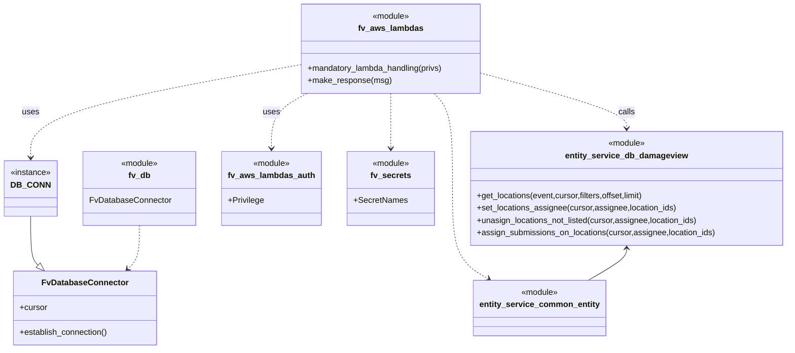

# Diagram: entity_core/entity_service/entity_service/damageview/submission/set_locations_assignee.py


> Auto-generated by Obscura crawlers

## Diagram 1

```mermaid
flowchart LR
  Event[HTTP Event: PATCH /locations/assignee]
  LH[lambda_handler(event, context, audit_refs)]
  Parse[parse body -> assignee, locations]
  Connect[DB_CONN.establish_connection()]
  Cursor[cursor = DB_CONN.cursor]
  HasLocations{assign_locations provided?}
  GetLocs[get_locations(event, cursor, {"location_ids": assign_locations}, 0, 100)]
  Normalize[assign_locations = [loc.id for loc in locations_data]]
  SetAssignee[set_locations_assignee(cursor, assignee, assign_locations)]
  Unassign[unasign_locations_not_listed(cursor, assignee, assign_locations)]
  UpdateSubs[assign_submissions_on_locations(cursor, assignee, assign_locations)]
  Response[fv.aws.lambdas.make_response(...)]
  Event --> LH
  LH --> Parse
  Parse --> Connect
  Connect --> Cursor
  Cursor --> HasLocations
  HasLocations -- "yes" --> GetLocs
  GetLocs --> Normalize
  Normalize --> SetAssignee
  HasLocations -- "no" --> SetAssignee
  SetAssignee --> Unassign
  Unassign --> UpdateSubs
  UpdateSubs --> Response
  Response --> HTTPResp[HTTP Response]
```

> SVG rendering failed for this diagram.

## Diagram 2



### SVG

<svg id="container" width="1510.34375" xmlns="http://www.w3.org/2000/svg" class="classDiagram" height="680" viewBox="0 0 1510.34375 680" role="graphics-document document" aria-roledescription="class"><style>#container{font-family:"trebuchet ms",verdana,arial,sans-serif;font-size:16px;fill:#333;}@keyframes edge-animation-frame{from{stroke-dashoffset:0;}}@keyframes dash{to{stroke-dashoffset:0;}}#container .edge-animation-slow{stroke-dasharray:9,5!important;stroke-dashoffset:900;animation:dash 50s linear infinite;stroke-linecap:round;}#container .edge-animation-fast{stroke-dasharray:9,5!important;stroke-dashoffset:900;animation:dash 20s linear infinite;stroke-linecap:round;}#container .error-icon{fill:#552222;}#container .error-text{fill:#552222;stroke:#552222;}#container .edge-thickness-normal{stroke-width:1px;}#container .edge-thickness-thick{stroke-width:3.5px;}#container .edge-pattern-solid{stroke-dasharray:0;}#container .edge-thickness-invisible{stroke-width:0;fill:none;}#container .edge-pattern-dashed{stroke-dasharray:3;}#container .edge-pattern-dotted{stroke-dasharray:2;}#container .marker{fill:#333333;stroke:#333333;}#container .marker.cross{stroke:#333333;}#container svg{font-family:"trebuchet ms",verdana,arial,sans-serif;font-size:16px;}#container p{margin:0;}#container g.classGroup text{fill:#9370DB;stroke:none;font-family:"trebuchet ms",verdana,arial,sans-serif;font-size:10px;}#container g.classGroup text .title{font-weight:bolder;}#container .nodeLabel,#container .edgeLabel{color:#131300;}#container .edgeLabel .label rect{fill:#ECECFF;}#container .label text{fill:#131300;}#container .labelBkg{background:#ECECFF;}#container .edgeLabel .label span{background:#ECECFF;}#container .classTitle{font-weight:bolder;}#container .node rect,#container .node circle,#container .node ellipse,#container .node polygon,#container .node path{fill:#ECECFF;stroke:#9370DB;stroke-width:1px;}#container .divider{stroke:#9370DB;stroke-width:1;}#container g.clickable{cursor:pointer;}#container g.classGroup rect{fill:#ECECFF;stroke:#9370DB;}#container g.classGroup line{stroke:#9370DB;stroke-width:1;}#container .classLabel .box{stroke:none;stroke-width:0;fill:#ECECFF;opacity:0.5;}#container .classLabel .label{fill:#9370DB;font-size:10px;}#container .relation{stroke:#333333;stroke-width:1;fill:none;}#container .dashed-line{stroke-dasharray:3;}#container .dotted-line{stroke-dasharray:1 2;}#container #compositionStart,#container .composition{fill:#333333!important;stroke:#333333!important;stroke-width:1;}#container #compositionEnd,#container .composition{fill:#333333!important;stroke:#333333!important;stroke-width:1;}#container #dependencyStart,#container .dependency{fill:#333333!important;stroke:#333333!important;stroke-width:1;}#container #dependencyStart,#container .dependency{fill:#333333!important;stroke:#333333!important;stroke-width:1;}#container #extensionStart,#container .extension{fill:transparent!important;stroke:#333333!important;stroke-width:1;}#container #extensionEnd,#container .extension{fill:transparent!important;stroke:#333333!important;stroke-width:1;}#container #aggregationStart,#container .aggregation{fill:transparent!important;stroke:#333333!important;stroke-width:1;}#container #aggregationEnd,#container .aggregation{fill:transparent!important;stroke:#333333!important;stroke-width:1;}#container #lollipopStart,#container .lollipop{fill:#ECECFF!important;stroke:#333333!important;stroke-width:1;}#container #lollipopEnd,#container .lollipop{fill:#ECECFF!important;stroke:#333333!important;stroke-width:1;}#container .edgeTerminals{font-size:11px;line-height:initial;}#container .classTitleText{text-anchor:middle;font-size:18px;fill:#333;}#container .label-icon{display:inline-block;height:1em;overflow:visible;vertical-align:-0.125em;}#container .node .label-icon path{fill:currentColor;stroke:revert;stroke-width:revert;}#container :root{--mermaid-font-family:"trebuchet ms",verdana,arial,sans-serif;}</style><g><defs><marker id="container_class-aggregationStart" class="marker aggregation class" refX="18" refY="7" markerWidth="190" markerHeight="240" orient="auto"><path d="M 18,7 L9,13 L1,7 L9,1 Z"></path></marker></defs><defs><marker id="container_class-aggregationEnd" class="marker aggregation class" refX="1" refY="7" markerWidth="20" markerHeight="28" orient="auto"><path d="M 18,7 L9,13 L1,7 L9,1 Z"></path></marker></defs><defs><marker id="container_class-extensionStart" class="marker extension class" refX="18" refY="7" markerWidth="190" markerHeight="240" orient="auto"><path d="M 1,7 L18,13 V 1 Z"></path></marker></defs><defs><marker id="container_class-extensionEnd" class="marker extension class" refX="1" refY="7" markerWidth="20" markerHeight="28" orient="auto"><path d="M 1,1 V 13 L18,7 Z"></path></marker></defs><defs><marker id="container_class-compositionStart" class="marker composition class" refX="18" refY="7" markerWidth="190" markerHeight="240" orient="auto"><path d="M 18,7 L9,13 L1,7 L9,1 Z"></path></marker></defs><defs><marker id="container_class-compositionEnd" class="marker composition class" refX="1" refY="7" markerWidth="20" markerHeight="28" orient="auto"><path d="M 18,7 L9,13 L1,7 L9,1 Z"></path></marker></defs><defs><marker id="container_class-dependencyStart" class="marker dependency class" refX="6" refY="7" markerWidth="190" markerHeight="240" orient="auto"><path d="M 5,7 L9,13 L1,7 L9,1 Z"></path></marker></defs><defs><marker id="container_class-dependencyEnd" class="marker dependency class" refX="13" refY="7" markerWidth="20" markerHeight="28" orient="auto"><path d="M 18,7 L9,13 L14,7 L9,1 Z"></path></marker></defs><defs><marker id="container_class-lollipopStart" class="marker lollipop class" refX="13" refY="7" markerWidth="190" markerHeight="240" orient="auto"><circle stroke="black" fill="transparent" cx="7" cy="7" r="6"></circle></marker></defs><defs><marker id="container_class-lollipopEnd" class="marker lollipop class" refX="1" refY="7" markerWidth="190" markerHeight="240" orient="auto"><circle stroke="black" fill="transparent" cx="7" cy="7" r="6"></circle></marker></defs><g class="root"><g class="clusters"></g><g class="edgePaths"><path d="M59.547,421L59.547,434.667C59.547,448.333,59.547,475.667,61.948,491.55C64.349,507.433,69.152,511.866,71.553,514.083L73.954,516.299" id="id_DB_CONN_FvDatabaseConnector_1" class="edge-thickness-normal edge-pattern-solid relation" style=";;;" data-edge="true" data-et="edge" data-id="id_DB_CONN_FvDatabaseConnector_1" data-points="W3sieCI6NTkuNTQ2ODc1LCJ5Ijo0MjF9LHsieCI6NTkuNTQ2ODc1LCJ5Ijo1MDN9LHsieCI6ODYuNjI5MzY5MzYyMTEzNDEsInkiOjUyOH1d" marker-end="url(#container_class-extensionEnd)"></path><path d="M269.707,439L269.707,449.667C269.707,460.333,269.707,481.667,265.928,495.822C262.149,509.977,254.591,516.954,250.812,520.442L247.033,523.93" id="id_fv_db_FvDatabaseConnector_2" class="edge-thickness-normal edge-pattern-dashed relation" style=";;;" data-edge="true" data-et="edge" data-id="id_fv_db_FvDatabaseConnector_2" data-points="W3sieCI6MjY5LjcwNzAzMTI1LCJ5Ijo0Mzl9LHsieCI6MjY5LjcwNzAzMTI1LCJ5Ijo1MDN9LHsieCI6MjQyLjYyNDUzNjg4Nzg4NjYsInkiOjUyOH1d" marker-end="url(#container_class-dependencyEnd)"></path><path d="M587.814,182L576.658,188.167C565.503,194.333,543.193,206.667,532.038,224.5C520.883,242.333,520.883,265.667,520.883,277.333L520.883,289" id="id_fv_aws_lambdas_fv_aws_lambdas_auth_3" class="edge-thickness-normal edge-pattern-dashed relation" style=";;;" data-edge="true" data-et="edge" data-id="id_fv_aws_lambdas_fv_aws_lambdas_auth_3" data-points="W3sieCI6NTg3LjgxMzYwMjU3MDU2NDUsInkiOjE4Mn0seyJ4Ijo1MjAuODgyODEyNSwieSI6MjE5fSx7IngiOjUyMC44ODI4MTI1LCJ5IjoyOTV9XQ==" marker-end="url(#container_class-dependencyEnd)"></path><path d="M745.191,182L745.191,188.167C745.191,194.333,745.191,206.667,745.191,224.5C745.191,242.333,745.191,265.667,745.191,277.333L745.191,289" id="id_fv_aws_lambdas_fv_secrets_4" class="edge-thickness-normal edge-pattern-dashed relation" style=";;;" data-edge="true" data-et="edge" data-id="id_fv_aws_lambdas_fv_secrets_4" data-points="W3sieCI6NzQ1LjE5MTQwNjI1LCJ5IjoxODJ9LHsieCI6NzQ1LjE5MTQwNjI1LCJ5IjoyMTl9LHsieCI6NzQ1LjE5MTQwNjI1LCJ5IjoyOTV9XQ==" marker-end="url(#container_class-dependencyEnd)"></path><path d="M569.41,126.79L484.433,142.159C399.456,157.527,229.501,188.263,144.524,218.298C59.547,248.333,59.547,277.667,59.547,292.333L59.547,307" id="id_fv_aws_lambdas_DB_CONN_5" class="edge-thickness-normal edge-pattern-dashed relation" style=";;;" data-edge="true" data-et="edge" data-id="id_fv_aws_lambdas_DB_CONN_5" data-points="W3sieCI6NTY5LjQxMDE1NjI1LCJ5IjoxMjYuNzkwMzQzMjU1OTQ2NDV9LHsieCI6NTkuNTQ2ODc1LCJ5IjoyMTl9LHsieCI6NTkuNTQ2ODc1LCJ5IjozMTN9XQ==" marker-end="url(#container_class-dependencyEnd)"></path><path d="M920.973,142.963L967.417,155.636C1013.862,168.309,1106.751,193.654,1153.196,211.494C1199.641,229.333,1199.641,239.667,1199.641,244.833L1199.641,250" id="id_fv_aws_lambdas_entity_service_db_damageview_6" class="edge-thickness-normal edge-pattern-dashed relation" style=";;;" data-edge="true" data-et="edge" data-id="id_fv_aws_lambdas_entity_service_db_damageview_6" data-points="W3sieCI6OTIwLjk3MjY1NjI1LCJ5IjoxNDIuOTYzMjc5NzI1NjI5NH0seyJ4IjoxMTk5LjY0MDYyNSwieSI6MjE5fSx7IngiOjExOTkuNjQwNjI1LCJ5IjoyNTZ9XQ==" marker-end="url(#container_class-dependencyEnd)"></path><path d="M827.102,182L832.908,188.167C838.714,194.333,850.326,206.667,856.132,237.5C861.938,268.333,861.938,317.667,861.938,365C861.938,412.333,861.938,457.667,873.546,487.002C885.154,516.337,908.37,529.674,919.978,536.343L931.587,543.011" id="id_fv_aws_lambdas_entity_service_common_entity_7" class="edge-thickness-normal edge-pattern-dashed relation" style=";;;" data-edge="true" data-et="edge" data-id="id_fv_aws_lambdas_entity_service_common_entity_7" data-points="W3sieCI6ODI3LjEwMTk3MjAyNjIwOTYsInkiOjE4Mn0seyJ4Ijo4NjEuOTM3NSwieSI6MjE5fSx7IngiOjg2MS45Mzc1LCJ5IjozNjd9LHsieCI6ODYxLjkzNzUsInkiOjUwM30seyJ4Ijo5MzYuNzg5MjIzNTgyNDc0MywieSI6NTQ2fV0=" marker-end="url(#container_class-dependencyEnd)"></path><path d="M1199.641,484L1199.641,487.167C1199.641,490.333,1199.641,496.667,1187.165,507C1174.69,517.333,1149.739,531.667,1137.264,538.833L1124.789,546" id="id_entity_service_db_damageview_entity_service_common_entity_8" class="edge-thickness-normal edge-pattern-solid relation" style=";;;" data-edge="true" data-et="edge" data-id="id_entity_service_db_damageview_entity_service_common_entity_8" data-points="W3sieCI6MTE5OS42NDA2MjUsInkiOjQ3OH0seyJ4IjoxMTk5LjY0MDYyNSwieSI6NTAzfSx7IngiOjExMjQuNzg4OTAxNDE3NTI1NywieSI6NTQ2fV0=" marker-start="url(#container_class-dependencyStart)"></path></g><g class="edgeLabels"><g class="edgeLabel"><g class="label" data-id="id_DB_CONN_FvDatabaseConnector_1" transform="translate(0, 0)"><foreignObject width="0" height="0"><div xmlns="http://www.w3.org/1999/xhtml" class="labelBkg" style="display: table-cell; white-space: nowrap; line-height: 1.5; max-width: 200px; text-align: center;"><span class="edgeLabel"></span></div></foreignObject></g></g><g class="edgeLabel"><g class="label" data-id="id_fv_db_FvDatabaseConnector_2" transform="translate(0, 0)"><foreignObject width="0" height="0"><div xmlns="http://www.w3.org/1999/xhtml" class="labelBkg" style="display: table-cell; white-space: nowrap; line-height: 1.5; max-width: 200px; text-align: center;"><span class="edgeLabel"></span></div></foreignObject></g></g><g class="edgeLabel" transform="translate(520.8828125, 219)"><g class="label" data-id="id_fv_aws_lambdas_fv_aws_lambdas_auth_3" transform="translate(-16.4921875, -12)"><foreignObject width="32.984375" height="24"><div xmlns="http://www.w3.org/1999/xhtml" class="labelBkg" style="display: table-cell; white-space: nowrap; line-height: 1.5; max-width: 200px; text-align: center;"><span class="edgeLabel"><p>uses</p></span></div></foreignObject></g></g><g class="edgeLabel"><g class="label" data-id="id_fv_aws_lambdas_fv_secrets_4" transform="translate(0, 0)"><foreignObject width="0" height="0"><div xmlns="http://www.w3.org/1999/xhtml" class="labelBkg" style="display: table-cell; white-space: nowrap; line-height: 1.5; max-width: 200px; text-align: center;"><span class="edgeLabel"></span></div></foreignObject></g></g><g class="edgeLabel" transform="translate(59.546875, 219)"><g class="label" data-id="id_fv_aws_lambdas_DB_CONN_5" transform="translate(-16.4921875, -12)"><foreignObject width="32.984375" height="24"><div xmlns="http://www.w3.org/1999/xhtml" class="labelBkg" style="display: table-cell; white-space: nowrap; line-height: 1.5; max-width: 200px; text-align: center;"><span class="edgeLabel"><p>uses</p></span></div></foreignObject></g></g><g class="edgeLabel" transform="translate(1199.640625, 219)"><g class="label" data-id="id_fv_aws_lambdas_entity_service_db_damageview_6" transform="translate(-16.4453125, -12)"><foreignObject width="32.890625" height="24"><div xmlns="http://www.w3.org/1999/xhtml" class="labelBkg" style="display: table-cell; white-space: nowrap; line-height: 1.5; max-width: 200px; text-align: center;"><span class="edgeLabel"><p>calls</p></span></div></foreignObject></g></g><g class="edgeLabel"><g class="label" data-id="id_fv_aws_lambdas_entity_service_common_entity_7" transform="translate(0, 0)"><foreignObject width="0" height="0"><div xmlns="http://www.w3.org/1999/xhtml" class="labelBkg" style="display: table-cell; white-space: nowrap; line-height: 1.5; max-width: 200px; text-align: center;"><span class="edgeLabel"></span></div></foreignObject></g></g><g class="edgeLabel"><g class="label" data-id="id_entity_service_db_damageview_entity_service_common_entity_8" transform="translate(0, 0)"><foreignObject width="0" height="0"><div xmlns="http://www.w3.org/1999/xhtml" class="labelBkg" style="display: table-cell; white-space: nowrap; line-height: 1.5; max-width: 200px; text-align: center;"><span class="edgeLabel"></span></div></foreignObject></g></g></g><g class="nodes"><g class="node default" id="classId-fv_db-0" transform="translate(269.70703125, 367)"><g class="basic label-container"><path d="M-108.61328125 -72 L108.61328125 -72 L108.61328125 72 L-108.61328125 72" stroke="none" stroke-width="0" fill="#ECECFF" style=""></path><path d="M-108.61328125 -72 C-64.5003704970661 -72, -20.3874597441322 -72, 108.61328125 -72 M-108.61328125 -72 C-55.013251059240325 -72, -1.41322086848065 -72, 108.61328125 -72 M108.61328125 -72 C108.61328125 -37.342695539792494, 108.61328125 -2.6853910795849885, 108.61328125 72 M108.61328125 -72 C108.61328125 -33.14153337602836, 108.61328125 5.716933247943274, 108.61328125 72 M108.61328125 72 C25.70831363022677 72, -57.19665398954646 72, -108.61328125 72 M108.61328125 72 C29.72559442158378 72, -49.16209240683244 72, -108.61328125 72 M-108.61328125 72 C-108.61328125 20.057758146459236, -108.61328125 -31.88448370708153, -108.61328125 -72 M-108.61328125 72 C-108.61328125 36.335123101210044, -108.61328125 0.6702462024200884, -108.61328125 -72" stroke="#9370DB" stroke-width="1.3" fill="none" stroke-dasharray="0 0" style=""></path></g><g class="annotation-group text" transform="translate(-36.6015625, -48)"><g class="label" style="" transform="translate(0,-12)"><foreignObject width="73.203125" height="24"><div xmlns="http://www.w3.org/1999/xhtml" style="display: table-cell; white-space: nowrap; line-height: 1.5; max-width: 123px; text-align: center;"><span class="nodeLabel markdown-node-label" style=""><p>«module»</p></span></div></foreignObject></g></g><g class="label-group text" transform="translate(-20.2890625, -24)"><g class="label" style="font-weight: bolder" transform="translate(0,-12)"><foreignObject width="40.578125" height="24"><div xmlns="http://www.w3.org/1999/xhtml" style="display: table-cell; white-space: nowrap; line-height: 1.5; max-width: 90px; text-align: center;"><span class="nodeLabel markdown-node-label" style=""><p>fv_db</p></span></div></foreignObject></g></g><g class="members-group text" transform="translate(-96.61328125, 24)"><g class="label" style="" transform="translate(0,-12)"><foreignObject width="156.625" height="24"><div xmlns="http://www.w3.org/1999/xhtml" style="display: table-cell; white-space: nowrap; line-height: 1.5; max-width: 207px; text-align: center;"><span class="nodeLabel markdown-node-label" style=""><p>FvDatabaseConnector</p></span></div></foreignObject></g></g><g class="methods-group text" transform="translate(-96.61328125, 72)"></g><g class="divider" style=""><path d="M-108.61328125 0 C-28.066505063208496 0, 52.48027112358301 0, 108.61328125 0 M-108.61328125 0 C-33.96341211117772 0, 40.686457027644565 0, 108.61328125 0" stroke="#9370DB" stroke-width="1.3" fill="none" stroke-dasharray="0 0" style=""></path></g><g class="divider" style=""><path d="M-108.61328125 48 C-61.658795724522264 48, -14.704310199044528 48, 108.61328125 48 M-108.61328125 48 C-24.17446289495757 48, 60.26435546008486 48, 108.61328125 48" stroke="#9370DB" stroke-width="1.3" fill="none" stroke-dasharray="0 0" style=""></path></g></g><g class="node default" id="classId-FvDatabaseConnector-1" transform="translate(164.626953125, 600)"><g class="basic label-container"><path d="M-138.28515625 -72 L138.28515625 -72 L138.28515625 72 L-138.28515625 72" stroke="none" stroke-width="0" fill="#ECECFF" style=""></path><path d="M-138.28515625 -72 C-53.91684781137282 -72, 30.451460627254363 -72, 138.28515625 -72 M-138.28515625 -72 C-35.52071737889479 -72, 67.24372149221043 -72, 138.28515625 -72 M138.28515625 -72 C138.28515625 -40.85376500290265, 138.28515625 -9.707530005805296, 138.28515625 72 M138.28515625 -72 C138.28515625 -32.12921597424146, 138.28515625 7.741568051517078, 138.28515625 72 M138.28515625 72 C53.50655218419655 72, -31.2720518816069 72, -138.28515625 72 M138.28515625 72 C55.00525687501165 72, -28.274642499976693 72, -138.28515625 72 M-138.28515625 72 C-138.28515625 29.651124298724184, -138.28515625 -12.697751402551631, -138.28515625 -72 M-138.28515625 72 C-138.28515625 15.722192686524053, -138.28515625 -40.55561462695189, -138.28515625 -72" stroke="#9370DB" stroke-width="1.3" fill="none" stroke-dasharray="0 0" style=""></path></g><g class="annotation-group text" transform="translate(0, -48)"></g><g class="label-group text" transform="translate(-79.3046875, -48)"><g class="label" style="font-weight: bolder" transform="translate(0,-12)"><foreignObject width="158.609375" height="24"><div xmlns="http://www.w3.org/1999/xhtml" style="display: table-cell; white-space: nowrap; line-height: 1.5; max-width: 207px; text-align: center;"><span class="nodeLabel markdown-node-label" style=""><p>FvDatabaseConnector</p></span></div></foreignObject></g></g><g class="members-group text" transform="translate(-126.28515625, 0)"><g class="label" style="" transform="translate(0,-12)"><foreignObject width="53.71875" height="24"><div xmlns="http://www.w3.org/1999/xhtml" style="display: table-cell; white-space: nowrap; line-height: 1.5; max-width: 112px; text-align: center;"><span class="nodeLabel markdown-node-label" style=""><p>+cursor</p></span></div></foreignObject></g></g><g class="methods-group text" transform="translate(-126.28515625, 48)"><g class="label" style="" transform="translate(0,-12)"><foreignObject width="173.265625" height="24"><div xmlns="http://www.w3.org/1999/xhtml" style="display: table-cell; white-space: nowrap; line-height: 1.5; max-width: 231px; text-align: center;"><span class="nodeLabel markdown-node-label" style=""><p>+establish_connection()</p></span></div></foreignObject></g></g><g class="divider" style=""><path d="M-138.28515625 -24 C-32.429847697667896 -24, 73.42546085466421 -24, 138.28515625 -24 M-138.28515625 -24 C-35.3430585262805 -24, 67.599039197439 -24, 138.28515625 -24" stroke="#9370DB" stroke-width="1.3" fill="none" stroke-dasharray="0 0" style=""></path></g><g class="divider" style=""><path d="M-138.28515625 24 C-82.45244277817173 24, -26.619729306343473 24, 138.28515625 24 M-138.28515625 24 C-48.31571303739456 24, 41.65373017521088 24, 138.28515625 24" stroke="#9370DB" stroke-width="1.3" fill="none" stroke-dasharray="0 0" style=""></path></g></g><g class="node default" id="classId-DB_CONN-2" transform="translate(59.546875, 367)"><g class="basic label-container"><path d="M-51.546875 -54 L51.546875 -54 L51.546875 54 L-51.546875 54" stroke="none" stroke-width="0" fill="#ECECFF" style=""></path><path d="M-51.546875 -54 C-14.50694006578609 -54, 22.53299486842782 -54, 51.546875 -54 M-51.546875 -54 C-11.185380681761323 -54, 29.176113636477353 -54, 51.546875 -54 M51.546875 -54 C51.546875 -19.786033452023396, 51.546875 14.427933095953207, 51.546875 54 M51.546875 -54 C51.546875 -27.13726719867183, 51.546875 -0.2745343973436576, 51.546875 54 M51.546875 54 C16.37156294919386 54, -18.803749101612283 54, -51.546875 54 M51.546875 54 C20.330477485130544 54, -10.885920029738912 54, -51.546875 54 M-51.546875 54 C-51.546875 17.46465889278563, -51.546875 -19.070682214428743, -51.546875 -54 M-51.546875 54 C-51.546875 20.467058580171447, -51.546875 -13.065882839657107, -51.546875 -54" stroke="#9370DB" stroke-width="1.3" fill="none" stroke-dasharray="0 0" style=""></path></g><g class="annotation-group text" transform="translate(-39.546875, -30)"><g class="label" style="" transform="translate(0,-12)"><foreignObject width="79.09375" height="24"><div xmlns="http://www.w3.org/1999/xhtml" style="display: table-cell; white-space: nowrap; line-height: 1.5; max-width: 129px; text-align: center;"><span class="nodeLabel markdown-node-label" style=""><p>«instance»</p></span></div></foreignObject></g></g><g class="label-group text" transform="translate(-34.40625, -6)"><g class="label" style="font-weight: bolder" transform="translate(0,-12)"><foreignObject width="68.8125" height="24"><div xmlns="http://www.w3.org/1999/xhtml" style="display: table-cell; white-space: nowrap; line-height: 1.5; max-width: 119px; text-align: center;"><span class="nodeLabel markdown-node-label" style=""><p>DB_CONN</p></span></div></foreignObject></g></g><g class="members-group text" transform="translate(-39.546875, 42)"></g><g class="methods-group text" transform="translate(-39.546875, 72)"></g><g class="divider" style=""><path d="M-51.546875 18 C-26.938081072828464 18, -2.3292871456569273 18, 51.546875 18 M-51.546875 18 C-20.773657430074287 18, 9.999560139851425 18, 51.546875 18" stroke="#9370DB" stroke-width="1.3" fill="none" stroke-dasharray="0 0" style=""></path></g><g class="divider" style=""><path d="M-51.546875 36 C-22.69734595378723 36, 6.152183092425538 36, 51.546875 36 M-51.546875 36 C-10.686990071947243 36, 30.172894856105515 36, 51.546875 36" stroke="#9370DB" stroke-width="1.3" fill="none" stroke-dasharray="0 0" style=""></path></g></g><g class="node default" id="classId-fv_aws_lambdas-3" transform="translate(745.19140625, 95)"><g class="basic label-container"><path d="M-175.78125 -87 L175.78125 -87 L175.78125 87 L-175.78125 87" stroke="none" stroke-width="0" fill="#ECECFF" style=""></path><path d="M-175.78125 -87 C-87.02210219161826 -87, 1.7370456167634813 -87, 175.78125 -87 M-175.78125 -87 C-86.9837863658428 -87, 1.8136772683143931 -87, 175.78125 -87 M175.78125 -87 C175.78125 -35.30118347052685, 175.78125 16.397633058946298, 175.78125 87 M175.78125 -87 C175.78125 -18.517025416593185, 175.78125 49.96594916681363, 175.78125 87 M175.78125 87 C56.50820455635889 87, -62.76484088728222 87, -175.78125 87 M175.78125 87 C53.14454006809669 87, -69.49216986380662 87, -175.78125 87 M-175.78125 87 C-175.78125 21.419882240749786, -175.78125 -44.16023551850043, -175.78125 -87 M-175.78125 87 C-175.78125 32.49703525767337, -175.78125 -22.005929484653265, -175.78125 -87" stroke="#9370DB" stroke-width="1.3" fill="none" stroke-dasharray="0 0" style=""></path></g><g class="annotation-group text" transform="translate(-36.6015625, -63)"><g class="label" style="" transform="translate(0,-12)"><foreignObject width="73.203125" height="24"><div xmlns="http://www.w3.org/1999/xhtml" style="display: table-cell; white-space: nowrap; line-height: 1.5; max-width: 123px; text-align: center;"><span class="nodeLabel markdown-node-label" style=""><p>«module»</p></span></div></foreignObject></g></g><g class="label-group text" transform="translate(-60.0625, -39)"><g class="label" style="font-weight: bolder" transform="translate(0,-12)"><foreignObject width="120.125" height="24"><div xmlns="http://www.w3.org/1999/xhtml" style="display: table-cell; white-space: nowrap; line-height: 1.5; max-width: 168px; text-align: center;"><span class="nodeLabel markdown-node-label" style=""><p>fv_aws_lambdas</p></span></div></foreignObject></g></g><g class="members-group text" transform="translate(-163.78125, 9)"></g><g class="methods-group text" transform="translate(-163.78125, 39)"><g class="label" style="" transform="translate(0,-12)"><foreignObject width="267.5" height="24"><div xmlns="http://www.w3.org/1999/xhtml" style="display: table-cell; white-space: nowrap; line-height: 1.5; max-width: 325px; text-align: center;"><span class="nodeLabel markdown-node-label" style=""><p>+mandatory_lambda_handling(privs)</p></span></div></foreignObject></g><g class="label" style="" transform="translate(0,12)"><foreignObject width="161.359375" height="24"><div xmlns="http://www.w3.org/1999/xhtml" style="display: table-cell; white-space: nowrap; line-height: 1.5; max-width: 219px; text-align: center;"><span class="nodeLabel markdown-node-label" style=""><p>+make_response(msg)</p></span></div></foreignObject></g></g><g class="divider" style=""><path d="M-175.78125 -15 C-67.74640107481775 -15, 40.28844785036449 -15, 175.78125 -15 M-175.78125 -15 C-88.01465982963586 -15, -0.24806965927172087 -15, 175.78125 -15" stroke="#9370DB" stroke-width="1.3" fill="none" stroke-dasharray="0 0" style=""></path></g><g class="divider" style=""><path d="M-175.78125 9 C-104.5488869745544 9, -33.31652394910881 9, 175.78125 9 M-175.78125 9 C-69.62683207498665 9, 36.527585850026696 9, 175.78125 9" stroke="#9370DB" stroke-width="1.3" fill="none" stroke-dasharray="0 0" style=""></path></g></g><g class="node default" id="classId-fv_aws_lambdas_auth-4" transform="translate(520.8828125, 367)"><g class="basic label-container"><path d="M-92.5625 -72 L92.5625 -72 L92.5625 72 L-92.5625 72" stroke="none" stroke-width="0" fill="#ECECFF" style=""></path><path d="M-92.5625 -72 C-20.92942946678943 -72, 50.70364106642114 -72, 92.5625 -72 M-92.5625 -72 C-49.56814860117598 -72, -6.573797202351955 -72, 92.5625 -72 M92.5625 -72 C92.5625 -19.94993712754426, 92.5625 32.10012574491148, 92.5625 72 M92.5625 -72 C92.5625 -29.648982220055494, 92.5625 12.702035559889012, 92.5625 72 M92.5625 72 C46.275552711012786 72, -0.011394577974428444 72, -92.5625 72 M92.5625 72 C24.373486782938485 72, -43.81552643412303 72, -92.5625 72 M-92.5625 72 C-92.5625 28.124740761641462, -92.5625 -15.750518476717076, -92.5625 -72 M-92.5625 72 C-92.5625 37.81599281204295, -92.5625 3.6319856240858996, -92.5625 -72" stroke="#9370DB" stroke-width="1.3" fill="none" stroke-dasharray="0 0" style=""></path></g><g class="annotation-group text" transform="translate(-36.6015625, -48)"><g class="label" style="" transform="translate(0,-12)"><foreignObject width="73.203125" height="24"><div xmlns="http://www.w3.org/1999/xhtml" style="display: table-cell; white-space: nowrap; line-height: 1.5; max-width: 123px; text-align: center;"><span class="nodeLabel markdown-node-label" style=""><p>«module»</p></span></div></foreignObject></g></g><g class="label-group text" transform="translate(-80.5625, -24)"><g class="label" style="font-weight: bolder" transform="translate(0,-12)"><foreignObject width="161.125" height="24"><div xmlns="http://www.w3.org/1999/xhtml" style="display: table-cell; white-space: nowrap; line-height: 1.5; max-width: 209px; text-align: center;"><span class="nodeLabel markdown-node-label" style=""><p>fv_aws_lambdas_auth</p></span></div></foreignObject></g></g><g class="members-group text" transform="translate(-80.5625, 24)"><g class="label" style="" transform="translate(0,-12)"><foreignObject width="70.15625" height="24"><div xmlns="http://www.w3.org/1999/xhtml" style="display: table-cell; white-space: nowrap; line-height: 1.5; max-width: 128px; text-align: center;"><span class="nodeLabel markdown-node-label" style=""><p>+Privilege</p></span></div></foreignObject></g></g><g class="methods-group text" transform="translate(-80.5625, 72)"></g><g class="divider" style=""><path d="M-92.5625 0 C-32.93903584710962 0, 26.684428305780756 0, 92.5625 0 M-92.5625 0 C-31.800973023543385 0, 28.96055395291323 0, 92.5625 0" stroke="#9370DB" stroke-width="1.3" fill="none" stroke-dasharray="0 0" style=""></path></g><g class="divider" style=""><path d="M-92.5625 48 C-40.88955935141777 48, 10.783381297164453 48, 92.5625 48 M-92.5625 48 C-36.41483816810549 48, 19.73282366378902 48, 92.5625 48" stroke="#9370DB" stroke-width="1.3" fill="none" stroke-dasharray="0 0" style=""></path></g></g><g class="node default" id="classId-fv_secrets-5" transform="translate(745.19140625, 367)"><g class="basic label-container"><path d="M-81.74609375 -72 L81.74609375 -72 L81.74609375 72 L-81.74609375 72" stroke="none" stroke-width="0" fill="#ECECFF" style=""></path><path d="M-81.74609375 -72 C-29.69391394784725 -72, 22.3582658543055 -72, 81.74609375 -72 M-81.74609375 -72 C-29.366863122797362 -72, 23.012367504405276 -72, 81.74609375 -72 M81.74609375 -72 C81.74609375 -35.70282354405711, 81.74609375 0.5943529118857782, 81.74609375 72 M81.74609375 -72 C81.74609375 -40.481968634044904, 81.74609375 -8.9639372680898, 81.74609375 72 M81.74609375 72 C34.91246529086108 72, -11.921163168277843 72, -81.74609375 72 M81.74609375 72 C44.24861385864603 72, 6.751133967292063 72, -81.74609375 72 M-81.74609375 72 C-81.74609375 19.11268134586315, -81.74609375 -33.7746373082737, -81.74609375 -72 M-81.74609375 72 C-81.74609375 40.9765912833704, -81.74609375 9.9531825667408, -81.74609375 -72" stroke="#9370DB" stroke-width="1.3" fill="none" stroke-dasharray="0 0" style=""></path></g><g class="annotation-group text" transform="translate(-36.6015625, -48)"><g class="label" style="" transform="translate(0,-12)"><foreignObject width="73.203125" height="24"><div xmlns="http://www.w3.org/1999/xhtml" style="display: table-cell; white-space: nowrap; line-height: 1.5; max-width: 123px; text-align: center;"><span class="nodeLabel markdown-node-label" style=""><p>«module»</p></span></div></foreignObject></g></g><g class="label-group text" transform="translate(-37.3203125, -24)"><g class="label" style="font-weight: bolder" transform="translate(0,-12)"><foreignObject width="74.640625" height="24"><div xmlns="http://www.w3.org/1999/xhtml" style="display: table-cell; white-space: nowrap; line-height: 1.5; max-width: 123px; text-align: center;"><span class="nodeLabel markdown-node-label" style=""><p>fv_secrets</p></span></div></foreignObject></g></g><g class="members-group text" transform="translate(-69.74609375, 24)"><g class="label" style="" transform="translate(0,-12)"><foreignObject width="102.171875" height="24"><div xmlns="http://www.w3.org/1999/xhtml" style="display: table-cell; white-space: nowrap; line-height: 1.5; max-width: 160px; text-align: center;"><span class="nodeLabel markdown-node-label" style=""><p>+SecretNames</p></span></div></foreignObject></g></g><g class="methods-group text" transform="translate(-69.74609375, 72)"></g><g class="divider" style=""><path d="M-81.74609375 0 C-37.72816335910845 0, 6.2897670317831 0, 81.74609375 0 M-81.74609375 0 C-43.724229705888376 0, -5.702365661776753 0, 81.74609375 0" stroke="#9370DB" stroke-width="1.3" fill="none" stroke-dasharray="0 0" style=""></path></g><g class="divider" style=""><path d="M-81.74609375 48 C-30.79198391341143 48, 20.162125923177143 48, 81.74609375 48 M-81.74609375 48 C-20.600174270601016 48, 40.54574520879797 48, 81.74609375 48" stroke="#9370DB" stroke-width="1.3" fill="none" stroke-dasharray="0 0" style=""></path></g></g><g class="node default" id="classId-entity_service_db_damageview-6" transform="translate(1199.640625, 367)"><g class="basic label-container"><path d="M-302.703125 -111 L302.703125 -111 L302.703125 111 L-302.703125 111" stroke="none" stroke-width="0" fill="#ECECFF" style=""></path><path d="M-302.703125 -111 C-162.08611702738014 -111, -21.46910905476028 -111, 302.703125 -111 M-302.703125 -111 C-117.17757581432113 -111, 68.34797337135774 -111, 302.703125 -111 M302.703125 -111 C302.703125 -26.237043089904148, 302.703125 58.525913820191704, 302.703125 111 M302.703125 -111 C302.703125 -63.149268162218874, 302.703125 -15.298536324437748, 302.703125 111 M302.703125 111 C177.44808180128615 111, 52.19303860257233 111, -302.703125 111 M302.703125 111 C71.76920807061722 111, -159.16470885876555 111, -302.703125 111 M-302.703125 111 C-302.703125 58.761458671993424, -302.703125 6.5229173439868475, -302.703125 -111 M-302.703125 111 C-302.703125 29.663559337229557, -302.703125 -51.672881325540885, -302.703125 -111" stroke="#9370DB" stroke-width="1.3" fill="none" stroke-dasharray="0 0" style=""></path></g><g class="annotation-group text" transform="translate(-36.6015625, -87)"><g class="label" style="" transform="translate(0,-12)"><foreignObject width="73.203125" height="24"><div xmlns="http://www.w3.org/1999/xhtml" style="display: table-cell; white-space: nowrap; line-height: 1.5; max-width: 123px; text-align: center;"><span class="nodeLabel markdown-node-label" style=""><p>«module»</p></span></div></foreignObject></g></g><g class="label-group text" transform="translate(-114.28125, -63)"><g class="label" style="font-weight: bolder" transform="translate(0,-12)"><foreignObject width="228.5625" height="24"><div xmlns="http://www.w3.org/1999/xhtml" style="display: table-cell; white-space: nowrap; line-height: 1.5; max-width: 275px; text-align: center;"><span class="nodeLabel markdown-node-label" style=""><p>entity_service_db_damageview</p></span></div></foreignObject></g></g><g class="members-group text" transform="translate(-290.703125, -15)"></g><g class="methods-group text" transform="translate(-290.703125, 15)"><g class="label" style="" transform="translate(0,-12)"><foreignObject width="332.140625" height="24"><div xmlns="http://www.w3.org/1999/xhtml" style="display: table-cell; white-space: nowrap; line-height: 1.5; max-width: 390px; text-align: center;"><span class="nodeLabel markdown-node-label" style=""><p>+get_locations(event,cursor,filters,offset,limit)</p></span></div></foreignObject></g><g class="label" style="" transform="translate(0,12)"><foreignObject width="389.734375" height="24"><div xmlns="http://www.w3.org/1999/xhtml" style="display: table-cell; white-space: nowrap; line-height: 1.5; max-width: 447px; text-align: center;"><span class="nodeLabel markdown-node-label" style=""><p>+set_locations_assignee(cursor,assignee,location_ids)</p></span></div></foreignObject></g><g class="label" style="" transform="translate(0,36)"><foreignObject width="435.171875" height="24"><div xmlns="http://www.w3.org/1999/xhtml" style="display: table-cell; white-space: nowrap; line-height: 1.5; max-width: 493px; text-align: center;"><span class="nodeLabel markdown-node-label" style=""><p>+unasign_locations_not_listed(cursor,assignee,location_ids)</p></span></div></foreignObject></g><g class="label" style="" transform="translate(0,60)"><foreignObject width="467.125" height="24"><div xmlns="http://www.w3.org/1999/xhtml" style="display: table-cell; white-space: nowrap; line-height: 1.5; max-width: 524px; text-align: center;"><span class="nodeLabel markdown-node-label" style=""><p>+assign_submissions_on_locations(cursor,assignee,location_ids)</p></span></div></foreignObject></g></g><g class="divider" style=""><path d="M-302.703125 -39 C-85.76194076245946 -39, 131.17924347508108 -39, 302.703125 -39 M-302.703125 -39 C-169.19377732935982 -39, -35.68442965871964 -39, 302.703125 -39" stroke="#9370DB" stroke-width="1.3" fill="none" stroke-dasharray="0 0" style=""></path></g><g class="divider" style=""><path d="M-302.703125 -15 C-172.51411233545548 -15, -42.32509967091096 -15, 302.703125 -15 M-302.703125 -15 C-122.2746107622734 -15, 58.153903475453205 -15, 302.703125 -15" stroke="#9370DB" stroke-width="1.3" fill="none" stroke-dasharray="0 0" style=""></path></g></g><g class="node default" id="classId-entity_service_common_entity-7" transform="translate(1030.7890625, 600)"><g class="basic label-container"><path d="M-123.984375 -54 L123.984375 -54 L123.984375 54 L-123.984375 54" stroke="none" stroke-width="0" fill="#ECECFF" style=""></path><path d="M-123.984375 -54 C-29.744628519019074 -54, 64.49511796196185 -54, 123.984375 -54 M-123.984375 -54 C-28.252654895944815 -54, 67.47906520811037 -54, 123.984375 -54 M123.984375 -54 C123.984375 -12.30555864060748, 123.984375 29.38888271878504, 123.984375 54 M123.984375 -54 C123.984375 -31.59411407297417, 123.984375 -9.188228145948337, 123.984375 54 M123.984375 54 C35.07246462053776 54, -53.839445758924484 54, -123.984375 54 M123.984375 54 C36.76297915106137 54, -50.458416697877254 54, -123.984375 54 M-123.984375 54 C-123.984375 21.019601525588506, -123.984375 -11.960796948822988, -123.984375 -54 M-123.984375 54 C-123.984375 31.397148294733604, -123.984375 8.794296589467208, -123.984375 -54" stroke="#9370DB" stroke-width="1.3" fill="none" stroke-dasharray="0 0" style=""></path></g><g class="annotation-group text" transform="translate(-36.6015625, -30)"><g class="label" style="" transform="translate(0,-12)"><foreignObject width="73.203125" height="24"><div xmlns="http://www.w3.org/1999/xhtml" style="display: table-cell; white-space: nowrap; line-height: 1.5; max-width: 123px; text-align: center;"><span class="nodeLabel markdown-node-label" style=""><p>«module»</p></span></div></foreignObject></g></g><g class="label-group text" transform="translate(-111.984375, -6)"><g class="label" style="font-weight: bolder" transform="translate(0,-12)"><foreignObject width="223.96875" height="24"><div xmlns="http://www.w3.org/1999/xhtml" style="display: table-cell; white-space: nowrap; line-height: 1.5; max-width: 271px; text-align: center;"><span class="nodeLabel markdown-node-label" style=""><p>entity_service_common_entity</p></span></div></foreignObject></g></g><g class="members-group text" transform="translate(-111.984375, 42)"></g><g class="methods-group text" transform="translate(-111.984375, 72)"></g><g class="divider" style=""><path d="M-123.984375 18 C-48.329629734946366 18, 27.32511553010727 18, 123.984375 18 M-123.984375 18 C-27.66113918636519 18, 68.66209662726962 18, 123.984375 18" stroke="#9370DB" stroke-width="1.3" fill="none" stroke-dasharray="0 0" style=""></path></g><g class="divider" style=""><path d="M-123.984375 36 C-72.43647083562256 36, -20.888566671245115 36, 123.984375 36 M-123.984375 36 C-25.552828031756476 36, 72.87871893648705 36, 123.984375 36" stroke="#9370DB" stroke-width="1.3" fill="none" stroke-dasharray="0 0" style=""></path></g></g></g></g></g></svg>
