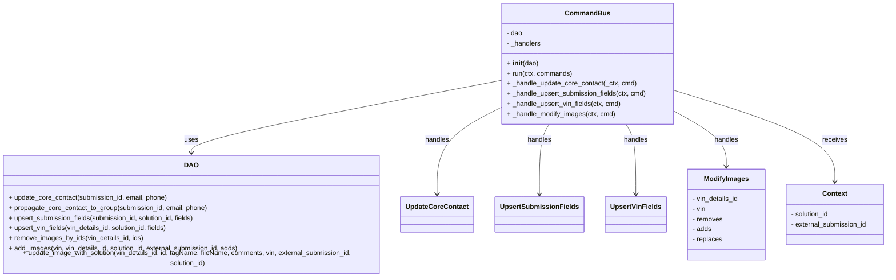

# Diagram: entity_core/entity_service/entity_service/damageview/submission/update_submission/command/command_bus.py


> Auto-generated by Obscura crawlers

## Diagram 1



### SVG

<svg id="container" width="2117.6328125" xmlns="http://www.w3.org/2000/svg" class="classDiagram" height="648" viewBox="0 0 2117.6328125 648" role="graphics-document document" aria-roledescription="class"><style>#container{font-family:"trebuchet ms",verdana,arial,sans-serif;font-size:16px;fill:#333;}@keyframes edge-animation-frame{from{stroke-dashoffset:0;}}@keyframes dash{to{stroke-dashoffset:0;}}#container .edge-animation-slow{stroke-dasharray:9,5!important;stroke-dashoffset:900;animation:dash 50s linear infinite;stroke-linecap:round;}#container .edge-animation-fast{stroke-dasharray:9,5!important;stroke-dashoffset:900;animation:dash 20s linear infinite;stroke-linecap:round;}#container .error-icon{fill:#552222;}#container .error-text{fill:#552222;stroke:#552222;}#container .edge-thickness-normal{stroke-width:1px;}#container .edge-thickness-thick{stroke-width:3.5px;}#container .edge-pattern-solid{stroke-dasharray:0;}#container .edge-thickness-invisible{stroke-width:0;fill:none;}#container .edge-pattern-dashed{stroke-dasharray:3;}#container .edge-pattern-dotted{stroke-dasharray:2;}#container .marker{fill:#333333;stroke:#333333;}#container .marker.cross{stroke:#333333;}#container svg{font-family:"trebuchet ms",verdana,arial,sans-serif;font-size:16px;}#container p{margin:0;}#container g.classGroup text{fill:#9370DB;stroke:none;font-family:"trebuchet ms",verdana,arial,sans-serif;font-size:10px;}#container g.classGroup text .title{font-weight:bolder;}#container .nodeLabel,#container .edgeLabel{color:#131300;}#container .edgeLabel .label rect{fill:#ECECFF;}#container .label text{fill:#131300;}#container .labelBkg{background:#ECECFF;}#container .edgeLabel .label span{background:#ECECFF;}#container .classTitle{font-weight:bolder;}#container .node rect,#container .node circle,#container .node ellipse,#container .node polygon,#container .node path{fill:#ECECFF;stroke:#9370DB;stroke-width:1px;}#container .divider{stroke:#9370DB;stroke-width:1;}#container g.clickable{cursor:pointer;}#container g.classGroup rect{fill:#ECECFF;stroke:#9370DB;}#container g.classGroup line{stroke:#9370DB;stroke-width:1;}#container .classLabel .box{stroke:none;stroke-width:0;fill:#ECECFF;opacity:0.5;}#container .classLabel .label{fill:#9370DB;font-size:10px;}#container .relation{stroke:#333333;stroke-width:1;fill:none;}#container .dashed-line{stroke-dasharray:3;}#container .dotted-line{stroke-dasharray:1 2;}#container #compositionStart,#container .composition{fill:#333333!important;stroke:#333333!important;stroke-width:1;}#container #compositionEnd,#container .composition{fill:#333333!important;stroke:#333333!important;stroke-width:1;}#container #dependencyStart,#container .dependency{fill:#333333!important;stroke:#333333!important;stroke-width:1;}#container #dependencyStart,#container .dependency{fill:#333333!important;stroke:#333333!important;stroke-width:1;}#container #extensionStart,#container .extension{fill:transparent!important;stroke:#333333!important;stroke-width:1;}#container #extensionEnd,#container .extension{fill:transparent!important;stroke:#333333!important;stroke-width:1;}#container #aggregationStart,#container .aggregation{fill:transparent!important;stroke:#333333!important;stroke-width:1;}#container #aggregationEnd,#container .aggregation{fill:transparent!important;stroke:#333333!important;stroke-width:1;}#container #lollipopStart,#container .lollipop{fill:#ECECFF!important;stroke:#333333!important;stroke-width:1;}#container #lollipopEnd,#container .lollipop{fill:#ECECFF!important;stroke:#333333!important;stroke-width:1;}#container .edgeTerminals{font-size:11px;line-height:initial;}#container .classTitleText{text-anchor:middle;font-size:18px;fill:#333;}#container .label-icon{display:inline-block;height:1em;overflow:visible;vertical-align:-0.125em;}#container .node .label-icon path{fill:currentColor;stroke:revert;stroke-width:revert;}#container :root{--mermaid-font-family:"trebuchet ms",verdana,arial,sans-serif;}</style><g><defs><marker id="container_class-aggregationStart" class="marker aggregation class" refX="18" refY="7" markerWidth="190" markerHeight="240" orient="auto"><path d="M 18,7 L9,13 L1,7 L9,1 Z"></path></marker></defs><defs><marker id="container_class-aggregationEnd" class="marker aggregation class" refX="1" refY="7" markerWidth="20" markerHeight="28" orient="auto"><path d="M 18,7 L9,13 L1,7 L9,1 Z"></path></marker></defs><defs><marker id="container_class-extensionStart" class="marker extension class" refX="18" refY="7" markerWidth="190" markerHeight="240" orient="auto"><path d="M 1,7 L18,13 V 1 Z"></path></marker></defs><defs><marker id="container_class-extensionEnd" class="marker extension class" refX="1" refY="7" markerWidth="20" markerHeight="28" orient="auto"><path d="M 1,1 V 13 L18,7 Z"></path></marker></defs><defs><marker id="container_class-compositionStart" class="marker composition class" refX="18" refY="7" markerWidth="190" markerHeight="240" orient="auto"><path d="M 18,7 L9,13 L1,7 L9,1 Z"></path></marker></defs><defs><marker id="container_class-compositionEnd" class="marker composition class" refX="1" refY="7" markerWidth="20" markerHeight="28" orient="auto"><path d="M 18,7 L9,13 L1,7 L9,1 Z"></path></marker></defs><defs><marker id="container_class-dependencyStart" class="marker dependency class" refX="6" refY="7" markerWidth="190" markerHeight="240" orient="auto"><path d="M 5,7 L9,13 L1,7 L9,1 Z"></path></marker></defs><defs><marker id="container_class-dependencyEnd" class="marker dependency class" refX="13" refY="7" markerWidth="20" markerHeight="28" orient="auto"><path d="M 18,7 L9,13 L14,7 L9,1 Z"></path></marker></defs><defs><marker id="container_class-lollipopStart" class="marker lollipop class" refX="13" refY="7" markerWidth="190" markerHeight="240" orient="auto"><circle stroke="black" fill="transparent" cx="7" cy="7" r="6"></circle></marker></defs><defs><marker id="container_class-lollipopEnd" class="marker lollipop class" refX="1" refY="7" markerWidth="190" markerHeight="240" orient="auto"><circle stroke="black" fill="transparent" cx="7" cy="7" r="6"></circle></marker></defs><g class="root"><g class="clusters"></g><g class="edgePaths"><path d="M1204.141,191.398L1081.823,214.998C959.505,238.599,714.87,285.799,592.552,314.566C470.234,343.333,470.234,353.667,470.234,358.833L470.234,364" id="id_CommandBus_DAO_1" class="edge-thickness-normal edge-pattern-solid relation" style=";;;" data-edge="true" data-et="edge" data-id="id_CommandBus_DAO_1" data-points="W3sieCI6MTIwNC4xNDA2MjUsInkiOjE5MS4zOTgwMjc5MzIwNzY5fSx7IngiOjQ3MC4yMzQzNzUsInkiOjMzM30seyJ4Ijo0NzAuMjM0Mzc1LCJ5IjozNzB9XQ==" marker-end="url(#container_class-dependencyEnd)"></path><path d="M1204.141,259.812L1181.038,272.01C1157.935,284.208,1111.729,308.604,1088.626,341.469C1065.523,374.333,1065.523,415.667,1065.523,436.333L1065.523,457" id="id_CommandBus_UpdateCoreContact_2" class="edge-thickness-normal edge-pattern-solid relation" style=";;;" data-edge="true" data-et="edge" data-id="id_CommandBus_UpdateCoreContact_2" data-points="W3sieCI6MTIwNC4xNDA2MjUsInkiOjI1OS44MTIxNDY3NjM5MDE1fSx7IngiOjEwNjUuNTIzNDM3NSwieSI6MzMzfSx7IngiOjEwNjUuNTIzNDM3NSwieSI6NDYzfV0=" marker-end="url(#container_class-dependencyEnd)"></path><path d="M1321.065,296L1317.327,302.167C1313.59,308.333,1306.115,320.667,1302.378,347.5C1298.641,374.333,1298.641,415.667,1298.641,436.333L1298.641,457" id="id_CommandBus_UpsertSubmissionFields_3" class="edge-thickness-normal edge-pattern-solid relation" style=";;;" data-edge="true" data-et="edge" data-id="id_CommandBus_UpsertSubmissionFields_3" data-points="W3sieCI6MTMyMS4wNjQ1Mjg2NjAyMjEsInkiOjI5Nn0seyJ4IjoxMjk4LjY0MDYyNSwieSI6MzMzfSx7IngiOjEyOTguNjQwNjI1LCJ5Ijo0NjN9XQ==" marker-end="url(#container_class-dependencyEnd)"></path><path d="M1495.607,296L1499.345,302.167C1503.082,308.333,1510.557,320.667,1514.294,347.5C1518.031,374.333,1518.031,415.667,1518.031,436.333L1518.031,457" id="id_CommandBus_UpsertVinFields_4" class="edge-thickness-normal edge-pattern-solid relation" style=";;;" data-edge="true" data-et="edge" data-id="id_CommandBus_UpsertVinFields_4" data-points="W3sieCI6MTQ5NS42MDczNDYzMzk3NzksInkiOjI5Nn0seyJ4IjoxNTE4LjAzMTI1LCJ5IjozMzN9LHsieCI6MTUxOC4wMzEyNSwieSI6NDYzfV0=" marker-end="url(#container_class-dependencyEnd)"></path><path d="M1612.531,266.632L1632.235,277.693C1651.939,288.755,1691.346,310.877,1711.05,331.605C1730.754,352.333,1730.754,371.667,1730.754,381.333L1730.754,391" id="id_CommandBus_ModifyImages_5" class="edge-thickness-normal edge-pattern-solid relation" style=";;;" data-edge="true" data-et="edge" data-id="id_CommandBus_ModifyImages_5" data-points="W3sieCI6MTYxMi41MzEyNSwieSI6MjY2LjYzMTc5ODMwMTQwOTA1fSx7IngiOjE3MzAuNzUzOTA2MjUsInkiOjMzM30seyJ4IjoxNzMwLjc1MzkwNjI1LCJ5IjozOTd9XQ==" marker-end="url(#container_class-dependencyEnd)"></path><path d="M1612.531,215.335L1675.758,234.946C1738.984,254.557,1865.438,293.778,1928.664,329.056C1991.891,364.333,1991.891,395.667,1991.891,411.333L1991.891,427" id="id_CommandBus_Context_6" class="edge-thickness-normal edge-pattern-solid relation" style=";;;" data-edge="true" data-et="edge" data-id="id_CommandBus_Context_6" data-points="W3sieCI6MTYxMi41MzEyNSwieSI6MjE1LjMzNDg1NTA3NzMxNDQyfSx7IngiOjE5OTEuODkwNjI1LCJ5IjozMzN9LHsieCI6MTk5MS44OTA2MjUsInkiOjQzM31d" marker-end="url(#container_class-dependencyEnd)"></path></g><g class="edgeLabels"><g class="edgeLabel" transform="translate(470.234375, 333)"><g class="label" data-id="id_CommandBus_DAO_1" transform="translate(-16.4921875, -12)"><foreignObject width="32.984375" height="24"><div xmlns="http://www.w3.org/1999/xhtml" class="labelBkg" style="display: table-cell; white-space: nowrap; line-height: 1.5; max-width: 200px; text-align: center;"><span class="edgeLabel"><p>uses</p></span></div></foreignObject></g></g><g class="edgeLabel" transform="translate(1065.5234375, 333)"><g class="label" data-id="id_CommandBus_UpdateCoreContact_2" transform="translate(-28.9140625, -12)"><foreignObject width="57.828125" height="24"><div xmlns="http://www.w3.org/1999/xhtml" class="labelBkg" style="display: table-cell; white-space: nowrap; line-height: 1.5; max-width: 200px; text-align: center;"><span class="edgeLabel"><p>handles</p></span></div></foreignObject></g></g><g class="edgeLabel" transform="translate(1298.640625, 333)"><g class="label" data-id="id_CommandBus_UpsertSubmissionFields_3" transform="translate(-28.9140625, -12)"><foreignObject width="57.828125" height="24"><div xmlns="http://www.w3.org/1999/xhtml" class="labelBkg" style="display: table-cell; white-space: nowrap; line-height: 1.5; max-width: 200px; text-align: center;"><span class="edgeLabel"><p>handles</p></span></div></foreignObject></g></g><g class="edgeLabel" transform="translate(1518.03125, 333)"><g class="label" data-id="id_CommandBus_UpsertVinFields_4" transform="translate(-28.9140625, -12)"><foreignObject width="57.828125" height="24"><div xmlns="http://www.w3.org/1999/xhtml" class="labelBkg" style="display: table-cell; white-space: nowrap; line-height: 1.5; max-width: 200px; text-align: center;"><span class="edgeLabel"><p>handles</p></span></div></foreignObject></g></g><g class="edgeLabel" transform="translate(1730.75390625, 333)"><g class="label" data-id="id_CommandBus_ModifyImages_5" transform="translate(-28.9140625, -12)"><foreignObject width="57.828125" height="24"><div xmlns="http://www.w3.org/1999/xhtml" class="labelBkg" style="display: table-cell; white-space: nowrap; line-height: 1.5; max-width: 200px; text-align: center;"><span class="edgeLabel"><p>handles</p></span></div></foreignObject></g></g><g class="edgeLabel" transform="translate(1991.890625, 333)"><g class="label" data-id="id_CommandBus_Context_6" transform="translate(-29.4921875, -12)"><foreignObject width="58.984375" height="24"><div xmlns="http://www.w3.org/1999/xhtml" class="labelBkg" style="display: table-cell; white-space: nowrap; line-height: 1.5; max-width: 200px; text-align: center;"><span class="edgeLabel"><p>receives</p></span></div></foreignObject></g></g></g><g class="nodes"><g class="node default" id="classId-CommandBus-0" transform="translate(1408.3359375, 152)"><g class="basic label-container"><path d="M-204.1953125 -144 L204.1953125 -144 L204.1953125 144 L-204.1953125 144" stroke="none" stroke-width="0" fill="#ECECFF" style=""></path><path d="M-204.1953125 -144 C-53.890921066341264 -144, 96.41347036731747 -144, 204.1953125 -144 M-204.1953125 -144 C-91.64386808297319 -144, 20.90757633405363 -144, 204.1953125 -144 M204.1953125 -144 C204.1953125 -82.46057468496576, 204.1953125 -20.921149369931527, 204.1953125 144 M204.1953125 -144 C204.1953125 -34.043944169832145, 204.1953125 75.91211166033571, 204.1953125 144 M204.1953125 144 C56.62752423371222 144, -90.94026403257556 144, -204.1953125 144 M204.1953125 144 C78.85081760475477 144, -46.49367729049047 144, -204.1953125 144 M-204.1953125 144 C-204.1953125 74.93110102084147, -204.1953125 5.862202041682934, -204.1953125 -144 M-204.1953125 144 C-204.1953125 48.503408795997956, -204.1953125 -46.99318240800409, -204.1953125 -144" stroke="#9370DB" stroke-width="1.3" fill="none" stroke-dasharray="0 0" style=""></path></g><g class="annotation-group text" transform="translate(0, -120)"></g><g class="label-group text" transform="translate(-49.8125, -120)"><g class="label" style="font-weight: bolder" transform="translate(0,-12)"><foreignObject width="99.625" height="24"><div xmlns="http://www.w3.org/1999/xhtml" style="display: table-cell; white-space: nowrap; line-height: 1.5; max-width: 150px; text-align: center;"><span class="nodeLabel markdown-node-label" style=""><p>CommandBus</p></span></div></foreignObject></g></g><g class="members-group text" transform="translate(-192.1953125, -72)"><g class="label" style="" transform="translate(0,-12)"><foreignObject width="38.3125" height="24"><div xmlns="http://www.w3.org/1999/xhtml" style="display: table-cell; white-space: nowrap; line-height: 1.5; max-width: 96px; text-align: center;"><span class="nodeLabel markdown-node-label" style=""><p>- dao</p></span></div></foreignObject></g><g class="label" style="" transform="translate(0,12)"><foreignObject width="82.78125" height="24"><div xmlns="http://www.w3.org/1999/xhtml" style="display: table-cell; white-space: nowrap; line-height: 1.5; max-width: 140px; text-align: center;"><span class="nodeLabel markdown-node-label" style=""><p>- _handlers</p></span></div></foreignObject></g></g><g class="methods-group text" transform="translate(-192.1953125, 0)"><g class="label" style="" transform="translate(0,-12)"><foreignObject width="74.65625" height="24"><div xmlns="http://www.w3.org/1999/xhtml" style="display: table-cell; white-space: nowrap; line-height: 1.5; max-width: 165px; text-align: center;"><span class="nodeLabel markdown-node-label" style=""><p>+ <strong>init</strong>(dao)</p></span></div></foreignObject></g><g class="label" style="" transform="translate(0,12)"><foreignObject width="156.015625" height="24"><div xmlns="http://www.w3.org/1999/xhtml" style="display: table-cell; white-space: nowrap; line-height: 1.5; max-width: 213px; text-align: center;"><span class="nodeLabel markdown-node-label" style=""><p>+ run(ctx, commands)</p></span></div></foreignObject></g><g class="label" style="" transform="translate(0,36)"><foreignObject width="308.984375" height="24"><div xmlns="http://www.w3.org/1999/xhtml" style="display: table-cell; white-space: nowrap; line-height: 1.5; max-width: 366px; text-align: center;"><span class="nodeLabel markdown-node-label" style=""><p>+ _handle_update_core_contact(_ctx, cmd)</p></span></div></foreignObject></g><g class="label" style="" transform="translate(0,60)"><foreignObject width="334.578125" height="24"><div xmlns="http://www.w3.org/1999/xhtml" style="display: table-cell; white-space: nowrap; line-height: 1.5; max-width: 392px; text-align: center;"><span class="nodeLabel markdown-node-label" style=""><p>+ _handle_upsert_submission_fields(ctx, cmd)</p></span></div></foreignObject></g><g class="label" style="" transform="translate(0,84)"><foreignObject width="273.34375" height="24"><div xmlns="http://www.w3.org/1999/xhtml" style="display: table-cell; white-space: nowrap; line-height: 1.5; max-width: 331px; text-align: center;"><span class="nodeLabel markdown-node-label" style=""><p>+ _handle_upsert_vin_fields(ctx, cmd)</p></span></div></foreignObject></g><g class="label" style="" transform="translate(0,108)"><foreignObject width="258.765625" height="24"><div xmlns="http://www.w3.org/1999/xhtml" style="display: table-cell; white-space: nowrap; line-height: 1.5; max-width: 316px; text-align: center;"><span class="nodeLabel markdown-node-label" style=""><p>+ _handle_modify_images(ctx, cmd)</p></span></div></foreignObject></g></g><g class="divider" style=""><path d="M-204.1953125 -96 C-117.21642489031342 -96, -30.23753728062684 -96, 204.1953125 -96 M-204.1953125 -96 C-81.40153570300055 -96, 41.392241093998905 -96, 204.1953125 -96" stroke="#9370DB" stroke-width="1.3" fill="none" stroke-dasharray="0 0" style=""></path></g><g class="divider" style=""><path d="M-204.1953125 -24 C-72.74978405819164 -24, 58.69574438361673 -24, 204.1953125 -24 M-204.1953125 -24 C-61.46538706801624 -24, 81.26453836396752 -24, 204.1953125 -24" stroke="#9370DB" stroke-width="1.3" fill="none" stroke-dasharray="0 0" style=""></path></g></g><g class="node default" id="classId-DAO-1" transform="translate(470.234375, 505)"><g class="basic label-container"><path d="M-462.234375 -135 L462.234375 -135 L462.234375 135 L-462.234375 135" stroke="none" stroke-width="0" fill="#ECECFF" style=""></path><path d="M-462.234375 -135 C-256.9156062493604 -135, -51.59683749872073 -135, 462.234375 -135 M-462.234375 -135 C-211.51889292285327 -135, 39.19658915429346 -135, 462.234375 -135 M462.234375 -135 C462.234375 -59.58201152302955, 462.234375 15.8359769539409, 462.234375 135 M462.234375 -135 C462.234375 -47.821385288052355, 462.234375 39.35722942389529, 462.234375 135 M462.234375 135 C241.47137420401089 135, 20.70837340802177 135, -462.234375 135 M462.234375 135 C266.61345985620306 135, 70.99254471240613 135, -462.234375 135 M-462.234375 135 C-462.234375 68.67173179217184, -462.234375 2.343463584343681, -462.234375 -135 M-462.234375 135 C-462.234375 46.15426057075115, -462.234375 -42.6914788584977, -462.234375 -135" stroke="#9370DB" stroke-width="1.3" fill="none" stroke-dasharray="0 0" style=""></path></g><g class="annotation-group text" transform="translate(0, -111)"></g><g class="label-group text" transform="translate(-15.296875, -111)"><g class="label" style="font-weight: bolder" transform="translate(0,-12)"><foreignObject width="30.59375" height="24"><div xmlns="http://www.w3.org/1999/xhtml" style="display: table-cell; white-space: nowrap; line-height: 1.5; max-width: 80px; text-align: center;"><span class="nodeLabel markdown-node-label" style=""><p>DAO</p></span></div></foreignObject></g></g><g class="members-group text" transform="translate(-450.234375, -63)"></g><g class="methods-group text" transform="translate(-450.234375, -33)"><g class="label" style="" transform="translate(0,-12)"><foreignObject width="382.046875" height="24"><div xmlns="http://www.w3.org/1999/xhtml" style="display: table-cell; white-space: nowrap; line-height: 1.5; max-width: 439px; text-align: center;"><span class="nodeLabel markdown-node-label" style=""><p>+ update_core_contact(submission_id, email, phone)</p></span></div></foreignObject></g><g class="label" style="" transform="translate(0,12)"><foreignObject width="477.3125" height="24"><div xmlns="http://www.w3.org/1999/xhtml" style="display: table-cell; white-space: nowrap; line-height: 1.5; max-width: 535px; text-align: center;"><span class="nodeLabel markdown-node-label" style=""><p>+ propagate_core_contact_to_group(submission_id, email, phone)</p></span></div></foreignObject></g><g class="label" style="" transform="translate(0,36)"><foreignObject width="450.859375" height="24"><div xmlns="http://www.w3.org/1999/xhtml" style="display: table-cell; white-space: nowrap; line-height: 1.5; max-width: 508px; text-align: center;"><span class="nodeLabel markdown-node-label" style=""><p>+ upsert_submission_fields(submission_id, solution_id, fields)</p></span></div></foreignObject></g><g class="label" style="" transform="translate(0,60)"><foreignObject width="385.84375" height="24"><div xmlns="http://www.w3.org/1999/xhtml" style="display: table-cell; white-space: nowrap; line-height: 1.5; max-width: 443px; text-align: center;"><span class="nodeLabel markdown-node-label" style=""><p>+ upsert_vin_fields(vin_details_id, solution_id, fields)</p></span></div></foreignObject></g><g class="label" style="" transform="translate(0,84)"><foreignObject width="321.0625" height="24"><div xmlns="http://www.w3.org/1999/xhtml" style="display: table-cell; white-space: nowrap; line-height: 1.5; max-width: 378px; text-align: center;"><span class="nodeLabel markdown-node-label" style=""><p>+ remove_images_by_ids(vin_details_id, ids)</p></span></div></foreignObject></g><g class="label" style="" transform="translate(0,108)"><foreignObject width="555.1875" height="24"><div xmlns="http://www.w3.org/1999/xhtml" style="display: table-cell; white-space: nowrap; line-height: 1.5; max-width: 613px; text-align: center;"><span class="nodeLabel markdown-node-label" style=""><p>+ add_images(vin, vin_details_id, solution_id, external_submission_id, adds)</p></span></div></foreignObject></g><g class="label" style="" transform="translate(0,132)"><foreignObject width="885.171875" height="24"><div xmlns="http://www.w3.org/1999/xhtml" style="display: table-cell; white-space: nowrap; line-height: 1.5; max-width: 943px; text-align: center;"><span class="nodeLabel markdown-node-label" style=""><p>+ update_image_with_solution(vin_details_id, id, tagName, fileName, comments, vin, external_submission_id, solution_id)</p></span></div></foreignObject></g></g><g class="divider" style=""><path d="M-462.234375 -87 C-106.25405258618969 -87, 249.72626982762063 -87, 462.234375 -87 M-462.234375 -87 C-177.08111963120655 -87, 108.0721357375869 -87, 462.234375 -87" stroke="#9370DB" stroke-width="1.3" fill="none" stroke-dasharray="0 0" style=""></path></g><g class="divider" style=""><path d="M-462.234375 -63 C-149.9094900690127 -63, 162.41539486197462 -63, 462.234375 -63 M-462.234375 -63 C-194.44341892131695 -63, 73.3475371573661 -63, 462.234375 -63" stroke="#9370DB" stroke-width="1.3" fill="none" stroke-dasharray="0 0" style=""></path></g></g><g class="node default" id="classId-UpdateCoreContact-2" transform="translate(1065.5234375, 505)"><g class="basic label-container"><path d="M-83.0546875 -42 L83.0546875 -42 L83.0546875 42 L-83.0546875 42" stroke="none" stroke-width="0" fill="#ECECFF" style=""></path><path d="M-83.0546875 -42 C-40.73931610402518 -42, 1.5760552919496433 -42, 83.0546875 -42 M-83.0546875 -42 C-25.376512106337124 -42, 32.30166328732575 -42, 83.0546875 -42 M83.0546875 -42 C83.0546875 -12.914203654668711, 83.0546875 16.171592690662578, 83.0546875 42 M83.0546875 -42 C83.0546875 -20.077753498337323, 83.0546875 1.8444930033253542, 83.0546875 42 M83.0546875 42 C37.1206675734425 42, -8.813352353114993 42, -83.0546875 42 M83.0546875 42 C39.17425260972163 42, -4.706182280556746 42, -83.0546875 42 M-83.0546875 42 C-83.0546875 22.82951701724867, -83.0546875 3.6590340344973384, -83.0546875 -42 M-83.0546875 42 C-83.0546875 16.976026283890285, -83.0546875 -8.04794743221943, -83.0546875 -42" stroke="#9370DB" stroke-width="1.3" fill="none" stroke-dasharray="0 0" style=""></path></g><g class="annotation-group text" transform="translate(0, -18)"></g><g class="label-group text" transform="translate(-71.0546875, -18)"><g class="label" style="font-weight: bolder" transform="translate(0,-12)"><foreignObject width="142.109375" height="24"><div xmlns="http://www.w3.org/1999/xhtml" style="display: table-cell; white-space: nowrap; line-height: 1.5; max-width: 190px; text-align: center;"><span class="nodeLabel markdown-node-label" style=""><p>UpdateCoreContact</p></span></div></foreignObject></g></g><g class="members-group text" transform="translate(-71.0546875, 30)"></g><g class="methods-group text" transform="translate(-71.0546875, 60)"></g><g class="divider" style=""><path d="M-83.0546875 6 C-28.783159274701845 6, 25.48836895059631 6, 83.0546875 6 M-83.0546875 6 C-31.25711225705696 6, 20.54046298588608 6, 83.0546875 6" stroke="#9370DB" stroke-width="1.3" fill="none" stroke-dasharray="0 0" style=""></path></g><g class="divider" style=""><path d="M-83.0546875 24 C-31.87898432299464 24, 19.29671885401072 24, 83.0546875 24 M-83.0546875 24 C-40.12590162311518 24, 2.8028842537696335 24, 83.0546875 24" stroke="#9370DB" stroke-width="1.3" fill="none" stroke-dasharray="0 0" style=""></path></g></g><g class="node default" id="classId-UpsertSubmissionFields-3" transform="translate(1298.640625, 505)"><g class="basic label-container"><path d="M-100.0625 -42 L100.0625 -42 L100.0625 42 L-100.0625 42" stroke="none" stroke-width="0" fill="#ECECFF" style=""></path><path d="M-100.0625 -42 C-58.87930067693939 -42, -17.696101353878774 -42, 100.0625 -42 M-100.0625 -42 C-45.36347189619255 -42, 9.3355562076149 -42, 100.0625 -42 M100.0625 -42 C100.0625 -24.169809107902392, 100.0625 -6.339618215804784, 100.0625 42 M100.0625 -42 C100.0625 -23.644048328284065, 100.0625 -5.288096656568129, 100.0625 42 M100.0625 42 C54.990819819213876 42, 9.919139638427751 42, -100.0625 42 M100.0625 42 C27.55565994713173 42, -44.95118010573654 42, -100.0625 42 M-100.0625 42 C-100.0625 20.587395174209334, -100.0625 -0.8252096515813321, -100.0625 -42 M-100.0625 42 C-100.0625 19.683003616118132, -100.0625 -2.6339927677637363, -100.0625 -42" stroke="#9370DB" stroke-width="1.3" fill="none" stroke-dasharray="0 0" style=""></path></g><g class="annotation-group text" transform="translate(0, -18)"></g><g class="label-group text" transform="translate(-88.0625, -18)"><g class="label" style="font-weight: bolder" transform="translate(0,-12)"><foreignObject width="176.125" height="24"><div xmlns="http://www.w3.org/1999/xhtml" style="display: table-cell; white-space: nowrap; line-height: 1.5; max-width: 224px; text-align: center;"><span class="nodeLabel markdown-node-label" style=""><p>UpsertSubmissionFields</p></span></div></foreignObject></g></g><g class="members-group text" transform="translate(-88.0625, 30)"></g><g class="methods-group text" transform="translate(-88.0625, 60)"></g><g class="divider" style=""><path d="M-100.0625 6 C-20.809362180648634 6, 58.44377563870273 6, 100.0625 6 M-100.0625 6 C-37.025818086864014 6, 26.010863826271972 6, 100.0625 6" stroke="#9370DB" stroke-width="1.3" fill="none" stroke-dasharray="0 0" style=""></path></g><g class="divider" style=""><path d="M-100.0625 24 C-31.316042506562653 24, 37.430414986874695 24, 100.0625 24 M-100.0625 24 C-42.21525207079705 24, 15.631995858405901 24, 100.0625 24" stroke="#9370DB" stroke-width="1.3" fill="none" stroke-dasharray="0 0" style=""></path></g></g><g class="node default" id="classId-UpsertVinFields-4" transform="translate(1518.03125, 505)"><g class="basic label-container"><path d="M-69.328125 -42 L69.328125 -42 L69.328125 42 L-69.328125 42" stroke="none" stroke-width="0" fill="#ECECFF" style=""></path><path d="M-69.328125 -42 C-19.527641020207966 -42, 30.272842959584068 -42, 69.328125 -42 M-69.328125 -42 C-17.951809124682846 -42, 33.42450675063431 -42, 69.328125 -42 M69.328125 -42 C69.328125 -19.596332242881417, 69.328125 2.8073355142371668, 69.328125 42 M69.328125 -42 C69.328125 -11.563925111480028, 69.328125 18.872149777039944, 69.328125 42 M69.328125 42 C17.24757362102477 42, -34.83297775795046 42, -69.328125 42 M69.328125 42 C28.318332600373623 42, -12.691459799252755 42, -69.328125 42 M-69.328125 42 C-69.328125 11.007941232806868, -69.328125 -19.984117534386264, -69.328125 -42 M-69.328125 42 C-69.328125 24.727753261479954, -69.328125 7.455506522959908, -69.328125 -42" stroke="#9370DB" stroke-width="1.3" fill="none" stroke-dasharray="0 0" style=""></path></g><g class="annotation-group text" transform="translate(0, -18)"></g><g class="label-group text" transform="translate(-57.328125, -18)"><g class="label" style="font-weight: bolder" transform="translate(0,-12)"><foreignObject width="114.65625" height="24"><div xmlns="http://www.w3.org/1999/xhtml" style="display: table-cell; white-space: nowrap; line-height: 1.5; max-width: 163px; text-align: center;"><span class="nodeLabel markdown-node-label" style=""><p>UpsertVinFields</p></span></div></foreignObject></g></g><g class="members-group text" transform="translate(-57.328125, 30)"></g><g class="methods-group text" transform="translate(-57.328125, 60)"></g><g class="divider" style=""><path d="M-69.328125 6 C-20.865330647217476 6, 27.597463705565048 6, 69.328125 6 M-69.328125 6 C-40.30412651413876 6, -11.280128028277524 6, 69.328125 6" stroke="#9370DB" stroke-width="1.3" fill="none" stroke-dasharray="0 0" style=""></path></g><g class="divider" style=""><path d="M-69.328125 24 C-32.51591504766629 24, 4.29629490466742 24, 69.328125 24 M-69.328125 24 C-17.01377790531616 24, 35.30056918936768 24, 69.328125 24" stroke="#9370DB" stroke-width="1.3" fill="none" stroke-dasharray="0 0" style=""></path></g></g><g class="node default" id="classId-ModifyImages-5" transform="translate(1730.75390625, 505)"><g class="basic label-container"><path d="M-93.39453125 -108 L93.39453125 -108 L93.39453125 108 L-93.39453125 108" stroke="none" stroke-width="0" fill="#ECECFF" style=""></path><path d="M-93.39453125 -108 C-24.04406463605133 -108, 45.30640197789734 -108, 93.39453125 -108 M-93.39453125 -108 C-28.50753016745621 -108, 36.37947091508758 -108, 93.39453125 -108 M93.39453125 -108 C93.39453125 -39.52113858820357, 93.39453125 28.95772282359286, 93.39453125 108 M93.39453125 -108 C93.39453125 -40.3557450665425, 93.39453125 27.288509866915007, 93.39453125 108 M93.39453125 108 C35.30851436744453 108, -22.77750251511094 108, -93.39453125 108 M93.39453125 108 C43.7052692531669 108, -5.983992743666207 108, -93.39453125 108 M-93.39453125 108 C-93.39453125 23.811964317852883, -93.39453125 -60.37607136429423, -93.39453125 -108 M-93.39453125 108 C-93.39453125 29.470333543921626, -93.39453125 -49.05933291215675, -93.39453125 -108" stroke="#9370DB" stroke-width="1.3" fill="none" stroke-dasharray="0 0" style=""></path></g><g class="annotation-group text" transform="translate(0, -84)"></g><g class="label-group text" transform="translate(-50.9296875, -84)"><g class="label" style="font-weight: bolder" transform="translate(0,-12)"><foreignObject width="101.859375" height="24"><div xmlns="http://www.w3.org/1999/xhtml" style="display: table-cell; white-space: nowrap; line-height: 1.5; max-width: 150px; text-align: center;"><span class="nodeLabel markdown-node-label" style=""><p>ModifyImages</p></span></div></foreignObject></g></g><g class="members-group text" transform="translate(-81.39453125, -36)"><g class="label" style="" transform="translate(0,-12)"><foreignObject width="111.859375" height="24"><div xmlns="http://www.w3.org/1999/xhtml" style="display: table-cell; white-space: nowrap; line-height: 1.5; max-width: 169px; text-align: center;"><span class="nodeLabel markdown-node-label" style=""><p>- vin_details_id</p></span></div></foreignObject></g><g class="label" style="" transform="translate(0,12)"><foreignObject width="32.453125" height="24"><div xmlns="http://www.w3.org/1999/xhtml" style="display: table-cell; white-space: nowrap; line-height: 1.5; max-width: 90px; text-align: center;"><span class="nodeLabel markdown-node-label" style=""><p>- vin</p></span></div></foreignObject></g><g class="label" style="" transform="translate(0,36)"><foreignObject width="72.109375" height="24"><div xmlns="http://www.w3.org/1999/xhtml" style="display: table-cell; white-space: nowrap; line-height: 1.5; max-width: 129px; text-align: center;"><span class="nodeLabel markdown-node-label" style=""><p>- removes</p></span></div></foreignObject></g><g class="label" style="" transform="translate(0,60)"><foreignObject width="46.015625" height="24"><div xmlns="http://www.w3.org/1999/xhtml" style="display: table-cell; white-space: nowrap; line-height: 1.5; max-width: 103px; text-align: center;"><span class="nodeLabel markdown-node-label" style=""><p>- adds</p></span></div></foreignObject></g><g class="label" style="" transform="translate(0,84)"><foreignObject width="71.453125" height="24"><div xmlns="http://www.w3.org/1999/xhtml" style="display: table-cell; white-space: nowrap; line-height: 1.5; max-width: 129px; text-align: center;"><span class="nodeLabel markdown-node-label" style=""><p>- replaces</p></span></div></foreignObject></g></g><g class="methods-group text" transform="translate(-81.39453125, 108)"></g><g class="divider" style=""><path d="M-93.39453125 -60 C-45.60900879098298 -60, 2.1765136680340333 -60, 93.39453125 -60 M-93.39453125 -60 C-33.19759030788272 -60, 26.99935063423456 -60, 93.39453125 -60" stroke="#9370DB" stroke-width="1.3" fill="none" stroke-dasharray="0 0" style=""></path></g><g class="divider" style=""><path d="M-93.39453125 84 C-52.763575434228414 84, -12.132619618456829 84, 93.39453125 84 M-93.39453125 84 C-50.514223256497836 84, -7.6339152629956715 84, 93.39453125 84" stroke="#9370DB" stroke-width="1.3" fill="none" stroke-dasharray="0 0" style=""></path></g></g><g class="node default" id="classId-Context-6" transform="translate(1991.890625, 505)"><g class="basic label-container"><path d="M-117.7421875 -72 L117.7421875 -72 L117.7421875 72 L-117.7421875 72" stroke="none" stroke-width="0" fill="#ECECFF" style=""></path><path d="M-117.7421875 -72 C-60.03546792447926 -72, -2.328748348958527 -72, 117.7421875 -72 M-117.7421875 -72 C-36.59032963904801 -72, 44.561528221903984 -72, 117.7421875 -72 M117.7421875 -72 C117.7421875 -32.96497346832655, 117.7421875 6.070053063346904, 117.7421875 72 M117.7421875 -72 C117.7421875 -41.12279434115762, 117.7421875 -10.245588682315244, 117.7421875 72 M117.7421875 72 C55.42229139465844 72, -6.897604710683126 72, -117.7421875 72 M117.7421875 72 C32.273331262250736 72, -53.19552497549853 72, -117.7421875 72 M-117.7421875 72 C-117.7421875 38.71278002251552, -117.7421875 5.425560045031034, -117.7421875 -72 M-117.7421875 72 C-117.7421875 35.1091080295674, -117.7421875 -1.7817839408651963, -117.7421875 -72" stroke="#9370DB" stroke-width="1.3" fill="none" stroke-dasharray="0 0" style=""></path></g><g class="annotation-group text" transform="translate(0, -48)"></g><g class="label-group text" transform="translate(-28.171875, -48)"><g class="label" style="font-weight: bolder" transform="translate(0,-12)"><foreignObject width="56.34375" height="24"><div xmlns="http://www.w3.org/1999/xhtml" style="display: table-cell; white-space: nowrap; line-height: 1.5; max-width: 105px; text-align: center;"><span class="nodeLabel markdown-node-label" style=""><p>Context</p></span></div></foreignObject></g></g><g class="members-group text" transform="translate(-105.7421875, 0)"><g class="label" style="" transform="translate(0,-12)"><foreignObject width="92.921875" height="24"><div xmlns="http://www.w3.org/1999/xhtml" style="display: table-cell; white-space: nowrap; line-height: 1.5; max-width: 150px; text-align: center;"><span class="nodeLabel markdown-node-label" style=""><p>- solution_id</p></span></div></foreignObject></g><g class="label" style="" transform="translate(0,12)"><foreignObject width="183.3125" height="24"><div xmlns="http://www.w3.org/1999/xhtml" style="display: table-cell; white-space: nowrap; line-height: 1.5; max-width: 241px; text-align: center;"><span class="nodeLabel markdown-node-label" style=""><p>- external_submission_id</p></span></div></foreignObject></g></g><g class="methods-group text" transform="translate(-105.7421875, 72)"></g><g class="divider" style=""><path d="M-117.7421875 -24 C-60.76806650104265 -24, -3.7939455020852932 -24, 117.7421875 -24 M-117.7421875 -24 C-43.19787511607376 -24, 31.34643726785248 -24, 117.7421875 -24" stroke="#9370DB" stroke-width="1.3" fill="none" stroke-dasharray="0 0" style=""></path></g><g class="divider" style=""><path d="M-117.7421875 48 C-57.55638204743812 48, 2.6294234051237595 48, 117.7421875 48 M-117.7421875 48 C-49.830705593221694 48, 18.080776313556612 48, 117.7421875 48" stroke="#9370DB" stroke-width="1.3" fill="none" stroke-dasharray="0 0" style=""></path></g></g></g></g></g></svg>

## Diagram 2

```mermaid
flowchart TD
    Start([run(ctx, commands)]) --> Loop{For each command}
    Loop --> Lookup[handler = _handlers.get(type(command))]
    Lookup --> HasHandler{handler exists?}
    HasHandler -- No --> Error[Raised: RuntimeError("Unhandled command type")]
    HasHandler -- Yes --> Invoke[Invoke handler(ctx, command)]
    Invoke --> Dispatch{command type}
    Dispatch -- UpdateCoreContact --> U1[dao.update_core_contact(submission_id, email, phone)]
    U1 --> U2[dao.propagate_core_contact_to_group(submission_id, email, phone)]
    Dispatch -- UpsertSubmissionFields --> V1[dao.upsert_submission_fields(submission_id, ctx.solution_id, fields)]
    Dispatch -- UpsertVinFields --> W1[dao.upsert_vin_fields(vin_details_id, ctx.solution_id, fields)]
    Dispatch -- ModifyImages --> M1{cmd.removes?}
    M1 -- Yes --> M2[dao.remove_images_by_ids(vin_details_id, removes)]
    M1 -- No --> M3[skip removes]
    Dispatch --> A1{cmd.adds?}
    A1 -- Yes --> A2[dao.add_images(vin, vin_details_id, ctx.solution_id, ctx.external_submission_id, adds)]
    A1 -- No --> A3[skip adds]
    Dispatch --> R1{cmd.replaces non-empty?}
    R1 -- Yes --> R2[for replacement in cmd.replaces: dao.update_image_with_solution(...)]
    R1 -- No --> R3[skip replaces]
    U2 --> Continue[Continue next command]
    V1 --> Continue
    W1 --> Continue
    M2 --> Continue
    A2 --> Continue
    R2 --> Continue
    Continue --> Loop
```

> SVG rendering failed for this diagram.
