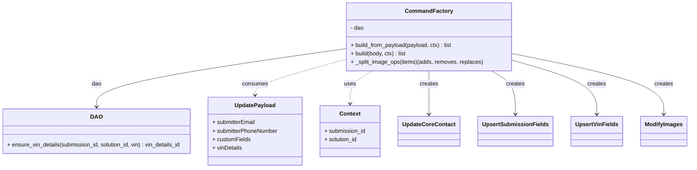

# Diagram: entity_core/entity_service/entity_service/damageview/submission/update_submission/command/command_factory.py


> Auto-generated by Obscura crawlers

## Diagram 1



### SVG

<svg id="container" width="1918.96875" xmlns="http://www.w3.org/2000/svg" class="classDiagram" height="474" viewBox="0 0 1918.96875 474" role="graphics-document document" aria-roledescription="class"><style>#container{font-family:"trebuchet ms",verdana,arial,sans-serif;font-size:16px;fill:#333;}@keyframes edge-animation-frame{from{stroke-dashoffset:0;}}@keyframes dash{to{stroke-dashoffset:0;}}#container .edge-animation-slow{stroke-dasharray:9,5!important;stroke-dashoffset:900;animation:dash 50s linear infinite;stroke-linecap:round;}#container .edge-animation-fast{stroke-dasharray:9,5!important;stroke-dashoffset:900;animation:dash 20s linear infinite;stroke-linecap:round;}#container .error-icon{fill:#552222;}#container .error-text{fill:#552222;stroke:#552222;}#container .edge-thickness-normal{stroke-width:1px;}#container .edge-thickness-thick{stroke-width:3.5px;}#container .edge-pattern-solid{stroke-dasharray:0;}#container .edge-thickness-invisible{stroke-width:0;fill:none;}#container .edge-pattern-dashed{stroke-dasharray:3;}#container .edge-pattern-dotted{stroke-dasharray:2;}#container .marker{fill:#333333;stroke:#333333;}#container .marker.cross{stroke:#333333;}#container svg{font-family:"trebuchet ms",verdana,arial,sans-serif;font-size:16px;}#container p{margin:0;}#container g.classGroup text{fill:#9370DB;stroke:none;font-family:"trebuchet ms",verdana,arial,sans-serif;font-size:10px;}#container g.classGroup text .title{font-weight:bolder;}#container .nodeLabel,#container .edgeLabel{color:#131300;}#container .edgeLabel .label rect{fill:#ECECFF;}#container .label text{fill:#131300;}#container .labelBkg{background:#ECECFF;}#container .edgeLabel .label span{background:#ECECFF;}#container .classTitle{font-weight:bolder;}#container .node rect,#container .node circle,#container .node ellipse,#container .node polygon,#container .node path{fill:#ECECFF;stroke:#9370DB;stroke-width:1px;}#container .divider{stroke:#9370DB;stroke-width:1;}#container g.clickable{cursor:pointer;}#container g.classGroup rect{fill:#ECECFF;stroke:#9370DB;}#container g.classGroup line{stroke:#9370DB;stroke-width:1;}#container .classLabel .box{stroke:none;stroke-width:0;fill:#ECECFF;opacity:0.5;}#container .classLabel .label{fill:#9370DB;font-size:10px;}#container .relation{stroke:#333333;stroke-width:1;fill:none;}#container .dashed-line{stroke-dasharray:3;}#container .dotted-line{stroke-dasharray:1 2;}#container #compositionStart,#container .composition{fill:#333333!important;stroke:#333333!important;stroke-width:1;}#container #compositionEnd,#container .composition{fill:#333333!important;stroke:#333333!important;stroke-width:1;}#container #dependencyStart,#container .dependency{fill:#333333!important;stroke:#333333!important;stroke-width:1;}#container #dependencyStart,#container .dependency{fill:#333333!important;stroke:#333333!important;stroke-width:1;}#container #extensionStart,#container .extension{fill:transparent!important;stroke:#333333!important;stroke-width:1;}#container #extensionEnd,#container .extension{fill:transparent!important;stroke:#333333!important;stroke-width:1;}#container #aggregationStart,#container .aggregation{fill:transparent!important;stroke:#333333!important;stroke-width:1;}#container #aggregationEnd,#container .aggregation{fill:transparent!important;stroke:#333333!important;stroke-width:1;}#container #lollipopStart,#container .lollipop{fill:#ECECFF!important;stroke:#333333!important;stroke-width:1;}#container #lollipopEnd,#container .lollipop{fill:#ECECFF!important;stroke:#333333!important;stroke-width:1;}#container .edgeTerminals{font-size:11px;line-height:initial;}#container .classTitleText{text-anchor:middle;font-size:18px;fill:#333;}#container .label-icon{display:inline-block;height:1em;overflow:visible;vertical-align:-0.125em;}#container .node .label-icon path{fill:currentColor;stroke:revert;stroke-width:revert;}#container :root{--mermaid-font-family:"trebuchet ms",verdana,arial,sans-serif;}</style><g><defs><marker id="container_class-aggregationStart" class="marker aggregation class" refX="18" refY="7" markerWidth="190" markerHeight="240" orient="auto"><path d="M 18,7 L9,13 L1,7 L9,1 Z"></path></marker></defs><defs><marker id="container_class-aggregationEnd" class="marker aggregation class" refX="1" refY="7" markerWidth="20" markerHeight="28" orient="auto"><path d="M 18,7 L9,13 L1,7 L9,1 Z"></path></marker></defs><defs><marker id="container_class-extensionStart" class="marker extension class" refX="18" refY="7" markerWidth="190" markerHeight="240" orient="auto"><path d="M 1,7 L18,13 V 1 Z"></path></marker></defs><defs><marker id="container_class-extensionEnd" class="marker extension class" refX="1" refY="7" markerWidth="20" markerHeight="28" orient="auto"><path d="M 1,1 V 13 L18,7 Z"></path></marker></defs><defs><marker id="container_class-compositionStart" class="marker composition class" refX="18" refY="7" markerWidth="190" markerHeight="240" orient="auto"><path d="M 18,7 L9,13 L1,7 L9,1 Z"></path></marker></defs><defs><marker id="container_class-compositionEnd" class="marker composition class" refX="1" refY="7" markerWidth="20" markerHeight="28" orient="auto"><path d="M 18,7 L9,13 L1,7 L9,1 Z"></path></marker></defs><defs><marker id="container_class-dependencyStart" class="marker dependency class" refX="6" refY="7" markerWidth="190" markerHeight="240" orient="auto"><path d="M 5,7 L9,13 L1,7 L9,1 Z"></path></marker></defs><defs><marker id="container_class-dependencyEnd" class="marker dependency class" refX="13" refY="7" markerWidth="20" markerHeight="28" orient="auto"><path d="M 18,7 L9,13 L14,7 L9,1 Z"></path></marker></defs><defs><marker id="container_class-lollipopStart" class="marker lollipop class" refX="13" refY="7" markerWidth="190" markerHeight="240" orient="auto"><circle stroke="black" fill="transparent" cx="7" cy="7" r="6"></circle></marker></defs><defs><marker id="container_class-lollipopEnd" class="marker lollipop class" refX="1" refY="7" markerWidth="190" markerHeight="240" orient="auto"><circle stroke="black" fill="transparent" cx="7" cy="7" r="6"></circle></marker></defs><g class="root"><g class="clusters"></g><g class="edgePaths"><path d="M983.402,136.625L865.532,153.354C747.661,170.083,511.921,203.542,394.05,230.938C276.18,258.333,276.18,279.667,276.18,290.333L276.18,301" id="id_CommandFactory_DAO_1" class="edge-thickness-normal edge-pattern-solid relation" style=";;;" data-edge="true" data-et="edge" data-id="id_CommandFactory_DAO_1" data-points="W3sieCI6OTgzLjQwMjM0Mzc1LCJ5IjoxMzYuNjI1MTgzNDEyODEyMjJ9LHsieCI6Mjc2LjE3OTY4NzUsInkiOjIzN30seyJ4IjoyNzYuMTc5Njg3NSwieSI6MzA3fV0=" marker-end="url(#container_class-dependencyEnd)"></path><path d="M983.402,166.953L940.773,178.627C898.143,190.302,812.884,213.651,770.255,230.492C727.625,247.333,727.625,257.667,727.625,262.833L727.625,268" id="id_CommandFactory_UpdatePayload_2" class="edge-thickness-normal edge-pattern-dashed relation" style=";;;" data-edge="true" data-et="edge" data-id="id_CommandFactory_UpdatePayload_2" data-points="W3sieCI6OTgzLjQwMjM0Mzc1LCJ5IjoxNjYuOTUyNjQ4NjgxNjkxN30seyJ4Ijo3MjcuNjI1LCJ5IjoyMzd9LHsieCI6NzI3LjYyNSwieSI6Mjc0fV0=" marker-end="url(#container_class-dependencyEnd)"></path><path d="M1056.123,200L1046.028,206.167C1035.934,212.333,1015.744,224.667,1005.649,240C995.555,255.333,995.555,273.667,995.555,282.833L995.555,292" id="id_CommandFactory_Context_3" class="edge-thickness-normal edge-pattern-dashed relation" style=";;;" data-edge="true" data-et="edge" data-id="id_CommandFactory_Context_3" data-points="W3sieCI6MTA1Ni4xMjMwNjE1NjAxNTAzLCJ5IjoyMDB9LHsieCI6OTk1LjU1NDY4NzUsInkiOjIzN30seyJ4Ijo5OTUuNTU0Njg3NSwieSI6Mjk4fV0=" marker-end="url(#container_class-dependencyEnd)"></path><path d="M1213.273,200L1213.273,206.167C1213.273,212.333,1213.273,224.667,1213.273,245C1213.273,265.333,1213.273,293.667,1213.273,307.833L1213.273,322" id="id_CommandFactory_UpdateCoreContact_4" class="edge-thickness-normal edge-pattern-solid relation" style=";;;" data-edge="true" data-et="edge" data-id="id_CommandFactory_UpdateCoreContact_4" data-points="W3sieCI6MTIxMy4yNzM0Mzc1LCJ5IjoyMDB9LHsieCI6MTIxMy4yNzM0Mzc1LCJ5IjoyMzd9LHsieCI6MTIxMy4yNzM0Mzc1LCJ5IjozMjh9XQ==" marker-end="url(#container_class-dependencyEnd)"></path><path d="M1381.538,200L1392.347,206.167C1403.156,212.333,1424.773,224.667,1435.582,245C1446.391,265.333,1446.391,293.667,1446.391,307.833L1446.391,322" id="id_CommandFactory_UpsertSubmissionFields_5" class="edge-thickness-normal edge-pattern-solid relation" style=";;;" data-edge="true" data-et="edge" data-id="id_CommandFactory_UpsertSubmissionFields_5" data-points="W3sieCI6MTM4MS41Mzg0NzUwOTM5ODUsInkiOjIwMH0seyJ4IjoxNDQ2LjM5MDYyNSwieSI6MjM3fSx7IngiOjE0NDYuMzkwNjI1LCJ5IjozMjh9XQ==" marker-end="url(#container_class-dependencyEnd)"></path><path d="M1443.145,171.563L1480.251,182.469C1517.357,193.375,1591.569,215.188,1628.675,240.261C1665.781,265.333,1665.781,293.667,1665.781,307.833L1665.781,322" id="id_CommandFactory_UpsertVinFields_6" class="edge-thickness-normal edge-pattern-solid relation" style=";;;" data-edge="true" data-et="edge" data-id="id_CommandFactory_UpsertVinFields_6" data-points="W3sieCI6MTQ0My4xNDQ1MzEyNSwieSI6MTcxLjU2MzE1NDk4Njk2NX0seyJ4IjoxNjY1Ljc4MTI1LCJ5IjoyMzd9LHsieCI6MTY2NS43ODEyNSwieSI6MzI4fV0=" marker-end="url(#container_class-dependencyEnd)"></path><path d="M1443.145,152.164L1510.627,166.303C1578.109,180.443,1713.074,208.721,1780.557,237.027C1848.039,265.333,1848.039,293.667,1848.039,307.833L1848.039,322" id="id_CommandFactory_ModifyImages_7" class="edge-thickness-normal edge-pattern-solid relation" style=";;;" data-edge="true" data-et="edge" data-id="id_CommandFactory_ModifyImages_7" data-points="W3sieCI6MTQ0My4xNDQ1MzEyNSwieSI6MTUyLjE2NDAwNjE1Mzg0NjE1fSx7IngiOjE4NDguMDM5MDYyNSwieSI6MjM3fSx7IngiOjE4NDguMDM5MDYyNSwieSI6MzI4fV0=" marker-end="url(#container_class-dependencyEnd)"></path></g><g class="edgeLabels"><g class="edgeLabel" transform="translate(276.1796875, 237)"><g class="label" data-id="id_CommandFactory_DAO_1" transform="translate(-13.8125, -12)"><foreignObject width="27.625" height="24"><div xmlns="http://www.w3.org/1999/xhtml" class="labelBkg" style="display: table-cell; white-space: nowrap; line-height: 1.5; max-width: 200px; text-align: center;"><span class="edgeLabel"><p>dao</p></span></div></foreignObject></g></g><g class="edgeLabel" transform="translate(727.625, 237)"><g class="label" data-id="id_CommandFactory_UpdatePayload_2" transform="translate(-36.375, -12)"><foreignObject width="72.75" height="24"><div xmlns="http://www.w3.org/1999/xhtml" class="labelBkg" style="display: table-cell; white-space: nowrap; line-height: 1.5; max-width: 200px; text-align: center;"><span class="edgeLabel"><p>consumes</p></span></div></foreignObject></g></g><g class="edgeLabel" transform="translate(995.5546875, 237)"><g class="label" data-id="id_CommandFactory_Context_3" transform="translate(-16.4921875, -12)"><foreignObject width="32.984375" height="24"><div xmlns="http://www.w3.org/1999/xhtml" class="labelBkg" style="display: table-cell; white-space: nowrap; line-height: 1.5; max-width: 200px; text-align: center;"><span class="edgeLabel"><p>uses</p></span></div></foreignObject></g></g><g class="edgeLabel" transform="translate(1213.2734375, 237)"><g class="label" data-id="id_CommandFactory_UpdateCoreContact_4" transform="translate(-26.171875, -12)"><foreignObject width="52.34375" height="24"><div xmlns="http://www.w3.org/1999/xhtml" class="labelBkg" style="display: table-cell; white-space: nowrap; line-height: 1.5; max-width: 200px; text-align: center;"><span class="edgeLabel"><p>creates</p></span></div></foreignObject></g></g><g class="edgeLabel" transform="translate(1446.390625, 237)"><g class="label" data-id="id_CommandFactory_UpsertSubmissionFields_5" transform="translate(-26.171875, -12)"><foreignObject width="52.34375" height="24"><div xmlns="http://www.w3.org/1999/xhtml" class="labelBkg" style="display: table-cell; white-space: nowrap; line-height: 1.5; max-width: 200px; text-align: center;"><span class="edgeLabel"><p>creates</p></span></div></foreignObject></g></g><g class="edgeLabel" transform="translate(1665.78125, 237)"><g class="label" data-id="id_CommandFactory_UpsertVinFields_6" transform="translate(-26.171875, -12)"><foreignObject width="52.34375" height="24"><div xmlns="http://www.w3.org/1999/xhtml" class="labelBkg" style="display: table-cell; white-space: nowrap; line-height: 1.5; max-width: 200px; text-align: center;"><span class="edgeLabel"><p>creates</p></span></div></foreignObject></g></g><g class="edgeLabel" transform="translate(1848.0390625, 237)"><g class="label" data-id="id_CommandFactory_ModifyImages_7" transform="translate(-26.171875, -12)"><foreignObject width="52.34375" height="24"><div xmlns="http://www.w3.org/1999/xhtml" class="labelBkg" style="display: table-cell; white-space: nowrap; line-height: 1.5; max-width: 200px; text-align: center;"><span class="edgeLabel"><p>creates</p></span></div></foreignObject></g></g></g><g class="nodes"><g class="node default" id="classId-CommandFactory-0" transform="translate(1213.2734375, 104)"><g class="basic label-container"><path d="M-229.87109375 -96 L229.87109375 -96 L229.87109375 96 L-229.87109375 96" stroke="none" stroke-width="0" fill="#ECECFF" style=""></path><path d="M-229.87109375 -96 C-101.14334013631441 -96, 27.584413477371186 -96, 229.87109375 -96 M-229.87109375 -96 C-73.4318802722839 -96, 83.00733320543219 -96, 229.87109375 -96 M229.87109375 -96 C229.87109375 -36.77866736751743, 229.87109375 22.442665264965143, 229.87109375 96 M229.87109375 -96 C229.87109375 -43.954024134632434, 229.87109375 8.091951730735133, 229.87109375 96 M229.87109375 96 C85.55508031773189 96, -58.760933114536215 96, -229.87109375 96 M229.87109375 96 C60.27289785015137 96, -109.32529804969727 96, -229.87109375 96 M-229.87109375 96 C-229.87109375 27.053238106856043, -229.87109375 -41.893523786287915, -229.87109375 -96 M-229.87109375 96 C-229.87109375 39.8897923125204, -229.87109375 -16.220415374959202, -229.87109375 -96" stroke="#9370DB" stroke-width="1.3" fill="none" stroke-dasharray="0 0" style=""></path></g><g class="annotation-group text" transform="translate(0, -72)"></g><g class="label-group text" transform="translate(-63.0390625, -72)"><g class="label" style="font-weight: bolder" transform="translate(0,-12)"><foreignObject width="126.078125" height="24"><div xmlns="http://www.w3.org/1999/xhtml" style="display: table-cell; white-space: nowrap; line-height: 1.5; max-width: 175px; text-align: center;"><span class="nodeLabel markdown-node-label" style=""><p>CommandFactory</p></span></div></foreignObject></g></g><g class="members-group text" transform="translate(-217.87109375, -24)"><g class="label" style="" transform="translate(0,-12)"><foreignObject width="38.3125" height="24"><div xmlns="http://www.w3.org/1999/xhtml" style="display: table-cell; white-space: nowrap; line-height: 1.5; max-width: 96px; text-align: center;"><span class="nodeLabel markdown-node-label" style=""><p>- dao</p></span></div></foreignObject></g></g><g class="methods-group text" transform="translate(-217.87109375, 24)"><g class="label" style="" transform="translate(0,-12)"><foreignObject width="290.0625" height="24"><div xmlns="http://www.w3.org/1999/xhtml" style="display: table-cell; white-space: nowrap; line-height: 1.5; max-width: 348px; text-align: center;"><span class="nodeLabel markdown-node-label" style=""><p>+ build_from_payload(payload, ctx) : list</p></span></div></foreignObject></g><g class="label" style="" transform="translate(0,12)"><foreignObject width="159.78125" height="24"><div xmlns="http://www.w3.org/1999/xhtml" style="display: table-cell; white-space: nowrap; line-height: 1.5; max-width: 217px; text-align: center;"><span class="nodeLabel markdown-node-label" style=""><p>+ build(body, ctx) : list</p></span></div></foreignObject></g><g class="label" style="" transform="translate(0,36)"><foreignObject width="372.703125" height="24"><div xmlns="http://www.w3.org/1999/xhtml" style="display: table-cell; white-space: nowrap; line-height: 1.5; max-width: 430px; text-align: center;"><span class="nodeLabel markdown-node-label" style=""><p>+ _split_image_ops(items)(adds, removes, replaces)</p></span></div></foreignObject></g></g><g class="divider" style=""><path d="M-229.87109375 -48 C-112.74878984167849 -48, 4.3735140666430254 -48, 229.87109375 -48 M-229.87109375 -48 C-79.96046635170202 -48, 69.95016104659595 -48, 229.87109375 -48" stroke="#9370DB" stroke-width="1.3" fill="none" stroke-dasharray="0 0" style=""></path></g><g class="divider" style=""><path d="M-229.87109375 0 C-75.24735764701435 0, 79.37637845597129 0, 229.87109375 0 M-229.87109375 0 C-120.63610372331107 0, -11.401113696622133 0, 229.87109375 0" stroke="#9370DB" stroke-width="1.3" fill="none" stroke-dasharray="0 0" style=""></path></g></g><g class="node default" id="classId-UpdatePayload-1" transform="translate(727.625, 370)"><g class="basic label-container"><path d="M-133.265625 -96 L133.265625 -96 L133.265625 96 L-133.265625 96" stroke="none" stroke-width="0" fill="#ECECFF" style=""></path><path d="M-133.265625 -96 C-49.53821768046929 -96, 34.189189639061425 -96, 133.265625 -96 M-133.265625 -96 C-78.65799916639665 -96, -24.050373332793285 -96, 133.265625 -96 M133.265625 -96 C133.265625 -24.481646949478744, 133.265625 47.03670610104251, 133.265625 96 M133.265625 -96 C133.265625 -41.58102073900098, 133.265625 12.837958521998047, 133.265625 96 M133.265625 96 C54.37728850680642 96, -24.511047986387155 96, -133.265625 96 M133.265625 96 C42.44956177260224 96, -48.366501454795525 96, -133.265625 96 M-133.265625 96 C-133.265625 20.596846416819716, -133.265625 -54.80630716636057, -133.265625 -96 M-133.265625 96 C-133.265625 47.53260381233322, -133.265625 -0.9347923753335579, -133.265625 -96" stroke="#9370DB" stroke-width="1.3" fill="none" stroke-dasharray="0 0" style=""></path></g><g class="annotation-group text" transform="translate(0, -72)"></g><g class="label-group text" transform="translate(-55.4375, -72)"><g class="label" style="font-weight: bolder" transform="translate(0,-12)"><foreignObject width="110.875" height="24"><div xmlns="http://www.w3.org/1999/xhtml" style="display: table-cell; white-space: nowrap; line-height: 1.5; max-width: 159px; text-align: center;"><span class="nodeLabel markdown-node-label" style=""><p>UpdatePayload</p></span></div></foreignObject></g></g><g class="members-group text" transform="translate(-121.265625, -24)"><g class="label" style="" transform="translate(0,-12)"><foreignObject width="122.96875" height="24"><div xmlns="http://www.w3.org/1999/xhtml" style="display: table-cell; white-space: nowrap; line-height: 1.5; max-width: 181px; text-align: center;"><span class="nodeLabel markdown-node-label" style=""><p>+ submitterEmail</p></span></div></foreignObject></g><g class="label" style="" transform="translate(0,12)"><foreignObject width="187.09375" height="24"><div xmlns="http://www.w3.org/1999/xhtml" style="display: table-cell; white-space: nowrap; line-height: 1.5; max-width: 245px; text-align: center;"><span class="nodeLabel markdown-node-label" style=""><p>+ submitterPhoneNumber</p></span></div></foreignObject></g><g class="label" style="" transform="translate(0,36)"><foreignObject width="107.265625" height="24"><div xmlns="http://www.w3.org/1999/xhtml" style="display: table-cell; white-space: nowrap; line-height: 1.5; max-width: 165px; text-align: center;"><span class="nodeLabel markdown-node-label" style=""><p>+ customFields</p></span></div></foreignObject></g><g class="label" style="" transform="translate(0,60)"><foreignObject width="84.0625" height="24"><div xmlns="http://www.w3.org/1999/xhtml" style="display: table-cell; white-space: nowrap; line-height: 1.5; max-width: 141px; text-align: center;"><span class="nodeLabel markdown-node-label" style=""><p>+ vinDetails</p></span></div></foreignObject></g></g><g class="methods-group text" transform="translate(-121.265625, 96)"></g><g class="divider" style=""><path d="M-133.265625 -48 C-73.86241788398104 -48, -14.459210767962063 -48, 133.265625 -48 M-133.265625 -48 C-77.21630845603701 -48, -21.16699191207401 -48, 133.265625 -48" stroke="#9370DB" stroke-width="1.3" fill="none" stroke-dasharray="0 0" style=""></path></g><g class="divider" style=""><path d="M-133.265625 72 C-29.83970534226954 72, 73.58621431546092 72, 133.265625 72 M-133.265625 72 C-43.229934597329745 72, 46.80575580534051 72, 133.265625 72" stroke="#9370DB" stroke-width="1.3" fill="none" stroke-dasharray="0 0" style=""></path></g></g><g class="node default" id="classId-Context-2" transform="translate(995.5546875, 370)"><g class="basic label-container"><path d="M-84.6640625 -72 L84.6640625 -72 L84.6640625 72 L-84.6640625 72" stroke="none" stroke-width="0" fill="#ECECFF" style=""></path><path d="M-84.6640625 -72 C-47.887495053974035 -72, -11.11092760794807 -72, 84.6640625 -72 M-84.6640625 -72 C-35.55990883123562 -72, 13.544244837528765 -72, 84.6640625 -72 M84.6640625 -72 C84.6640625 -18.24899286657434, 84.6640625 35.50201426685132, 84.6640625 72 M84.6640625 -72 C84.6640625 -27.709009656976058, 84.6640625 16.581980686047885, 84.6640625 72 M84.6640625 72 C23.94895083696531 72, -36.76616082606938 72, -84.6640625 72 M84.6640625 72 C25.142414214628197 72, -34.37923407074361 72, -84.6640625 72 M-84.6640625 72 C-84.6640625 16.498444906525087, -84.6640625 -39.003110186949826, -84.6640625 -72 M-84.6640625 72 C-84.6640625 25.868312224319688, -84.6640625 -20.263375551360625, -84.6640625 -72" stroke="#9370DB" stroke-width="1.3" fill="none" stroke-dasharray="0 0" style=""></path></g><g class="annotation-group text" transform="translate(0, -48)"></g><g class="label-group text" transform="translate(-28.171875, -48)"><g class="label" style="font-weight: bolder" transform="translate(0,-12)"><foreignObject width="56.34375" height="24"><div xmlns="http://www.w3.org/1999/xhtml" style="display: table-cell; white-space: nowrap; line-height: 1.5; max-width: 105px; text-align: center;"><span class="nodeLabel markdown-node-label" style=""><p>Context</p></span></div></foreignObject></g></g><g class="members-group text" transform="translate(-72.6640625, 0)"><g class="label" style="" transform="translate(0,-12)"><foreignObject width="117.15625" height="24"><div xmlns="http://www.w3.org/1999/xhtml" style="display: table-cell; white-space: nowrap; line-height: 1.5; max-width: 175px; text-align: center;"><span class="nodeLabel markdown-node-label" style=""><p>+ submission_id</p></span></div></foreignObject></g><g class="label" style="" transform="translate(0,12)"><foreignObject width="94.453125" height="24"><div xmlns="http://www.w3.org/1999/xhtml" style="display: table-cell; white-space: nowrap; line-height: 1.5; max-width: 152px; text-align: center;"><span class="nodeLabel markdown-node-label" style=""><p>+ solution_id</p></span></div></foreignObject></g></g><g class="methods-group text" transform="translate(-72.6640625, 72)"></g><g class="divider" style=""><path d="M-84.6640625 -24 C-49.77500417642117 -24, -14.88594585284234 -24, 84.6640625 -24 M-84.6640625 -24 C-33.90793436613672 -24, 16.848193767726556 -24, 84.6640625 -24" stroke="#9370DB" stroke-width="1.3" fill="none" stroke-dasharray="0 0" style=""></path></g><g class="divider" style=""><path d="M-84.6640625 48 C-34.43082905346417 48, 15.802404393071654 48, 84.6640625 48 M-84.6640625 48 C-21.506593941524862 48, 41.650874616950276 48, 84.6640625 48" stroke="#9370DB" stroke-width="1.3" fill="none" stroke-dasharray="0 0" style=""></path></g></g><g class="node default" id="classId-DAO-3" transform="translate(276.1796875, 370)"><g class="basic label-container"><path d="M-268.1796875 -63 L268.1796875 -63 L268.1796875 63 L-268.1796875 63" stroke="none" stroke-width="0" fill="#ECECFF" style=""></path><path d="M-268.1796875 -63 C-101.24210888989617 -63, 65.69546972020765 -63, 268.1796875 -63 M-268.1796875 -63 C-94.29057160969887 -63, 79.59854428060225 -63, 268.1796875 -63 M268.1796875 -63 C268.1796875 -35.379639122782706, 268.1796875 -7.759278245565412, 268.1796875 63 M268.1796875 -63 C268.1796875 -29.23071417300561, 268.1796875 4.538571653988782, 268.1796875 63 M268.1796875 63 C60.53557945557384 63, -147.10852858885232 63, -268.1796875 63 M268.1796875 63 C85.51767067541743 63, -97.14434614916513 63, -268.1796875 63 M-268.1796875 63 C-268.1796875 32.55905029750772, -268.1796875 2.1181005950154344, -268.1796875 -63 M-268.1796875 63 C-268.1796875 17.305423818894283, -268.1796875 -28.389152362211433, -268.1796875 -63" stroke="#9370DB" stroke-width="1.3" fill="none" stroke-dasharray="0 0" style=""></path></g><g class="annotation-group text" transform="translate(0, -39)"></g><g class="label-group text" transform="translate(-15.296875, -39)"><g class="label" style="font-weight: bolder" transform="translate(0,-12)"><foreignObject width="30.59375" height="24"><div xmlns="http://www.w3.org/1999/xhtml" style="display: table-cell; white-space: nowrap; line-height: 1.5; max-width: 80px; text-align: center;"><span class="nodeLabel markdown-node-label" style=""><p>DAO</p></span></div></foreignObject></g></g><g class="members-group text" transform="translate(-256.1796875, 9)"></g><g class="methods-group text" transform="translate(-256.1796875, 39)"><g class="label" style="" transform="translate(0,-12)"><foreignObject width="497.0625" height="24"><div xmlns="http://www.w3.org/1999/xhtml" style="display: table-cell; white-space: nowrap; line-height: 1.5; max-width: 554px; text-align: center;"><span class="nodeLabel markdown-node-label" style=""><p>+ ensure_vin_details(submission_id, solution_id, vin) : vin_details_id</p></span></div></foreignObject></g></g><g class="divider" style=""><path d="M-268.1796875 -15 C-154.92007271226097 -15, -41.66045792452195 -15, 268.1796875 -15 M-268.1796875 -15 C-55.68420014138846 -15, 156.81128721722308 -15, 268.1796875 -15" stroke="#9370DB" stroke-width="1.3" fill="none" stroke-dasharray="0 0" style=""></path></g><g class="divider" style=""><path d="M-268.1796875 9 C-135.32072048460992 9, -2.4617534692198433 9, 268.1796875 9 M-268.1796875 9 C-129.96879641129877 9, 8.242094677402463 9, 268.1796875 9" stroke="#9370DB" stroke-width="1.3" fill="none" stroke-dasharray="0 0" style=""></path></g></g><g class="node default" id="classId-UpdateCoreContact-4" transform="translate(1213.2734375, 370)"><g class="basic label-container"><path d="M-83.0546875 -42 L83.0546875 -42 L83.0546875 42 L-83.0546875 42" stroke="none" stroke-width="0" fill="#ECECFF" style=""></path><path d="M-83.0546875 -42 C-20.198381256457097 -42, 42.657924987085806 -42, 83.0546875 -42 M-83.0546875 -42 C-47.48253928619883 -42, -11.910391072397658 -42, 83.0546875 -42 M83.0546875 -42 C83.0546875 -21.38569887799213, 83.0546875 -0.7713977559842604, 83.0546875 42 M83.0546875 -42 C83.0546875 -24.490767653650693, 83.0546875 -6.981535307301385, 83.0546875 42 M83.0546875 42 C45.947889563641525 42, 8.841091627283049 42, -83.0546875 42 M83.0546875 42 C20.40977501904551 42, -42.23513746190898 42, -83.0546875 42 M-83.0546875 42 C-83.0546875 19.335261745881425, -83.0546875 -3.32947650823715, -83.0546875 -42 M-83.0546875 42 C-83.0546875 21.113294190792327, -83.0546875 0.226588381584655, -83.0546875 -42" stroke="#9370DB" stroke-width="1.3" fill="none" stroke-dasharray="0 0" style=""></path></g><g class="annotation-group text" transform="translate(0, -18)"></g><g class="label-group text" transform="translate(-71.0546875, -18)"><g class="label" style="font-weight: bolder" transform="translate(0,-12)"><foreignObject width="142.109375" height="24"><div xmlns="http://www.w3.org/1999/xhtml" style="display: table-cell; white-space: nowrap; line-height: 1.5; max-width: 190px; text-align: center;"><span class="nodeLabel markdown-node-label" style=""><p>UpdateCoreContact</p></span></div></foreignObject></g></g><g class="members-group text" transform="translate(-71.0546875, 30)"></g><g class="methods-group text" transform="translate(-71.0546875, 60)"></g><g class="divider" style=""><path d="M-83.0546875 6 C-23.10326237646293 6, 36.84816274707414 6, 83.0546875 6 M-83.0546875 6 C-17.17081157628529 6, 48.71306434742942 6, 83.0546875 6" stroke="#9370DB" stroke-width="1.3" fill="none" stroke-dasharray="0 0" style=""></path></g><g class="divider" style=""><path d="M-83.0546875 24 C-39.552081757386645 24, 3.9505239852267096 24, 83.0546875 24 M-83.0546875 24 C-23.061215612581776 24, 36.93225627483645 24, 83.0546875 24" stroke="#9370DB" stroke-width="1.3" fill="none" stroke-dasharray="0 0" style=""></path></g></g><g class="node default" id="classId-UpsertSubmissionFields-5" transform="translate(1446.390625, 370)"><g class="basic label-container"><path d="M-100.0625 -42 L100.0625 -42 L100.0625 42 L-100.0625 42" stroke="none" stroke-width="0" fill="#ECECFF" style=""></path><path d="M-100.0625 -42 C-51.12002589835256 -42, -2.1775517967051172 -42, 100.0625 -42 M-100.0625 -42 C-38.97942322992818 -42, 22.10365354014364 -42, 100.0625 -42 M100.0625 -42 C100.0625 -21.21398089482559, 100.0625 -0.42796178965117804, 100.0625 42 M100.0625 -42 C100.0625 -10.909586960476684, 100.0625 20.180826079046632, 100.0625 42 M100.0625 42 C36.605557558021985 42, -26.85138488395603 42, -100.0625 42 M100.0625 42 C58.83084082357992 42, 17.59918164715984 42, -100.0625 42 M-100.0625 42 C-100.0625 20.606025788022055, -100.0625 -0.7879484239558892, -100.0625 -42 M-100.0625 42 C-100.0625 24.422947893778527, -100.0625 6.845895787557055, -100.0625 -42" stroke="#9370DB" stroke-width="1.3" fill="none" stroke-dasharray="0 0" style=""></path></g><g class="annotation-group text" transform="translate(0, -18)"></g><g class="label-group text" transform="translate(-88.0625, -18)"><g class="label" style="font-weight: bolder" transform="translate(0,-12)"><foreignObject width="176.125" height="24"><div xmlns="http://www.w3.org/1999/xhtml" style="display: table-cell; white-space: nowrap; line-height: 1.5; max-width: 224px; text-align: center;"><span class="nodeLabel markdown-node-label" style=""><p>UpsertSubmissionFields</p></span></div></foreignObject></g></g><g class="members-group text" transform="translate(-88.0625, 30)"></g><g class="methods-group text" transform="translate(-88.0625, 60)"></g><g class="divider" style=""><path d="M-100.0625 6 C-22.217681776771585 6, 55.62713644645683 6, 100.0625 6 M-100.0625 6 C-56.07885702526917 6, -12.095214050538345 6, 100.0625 6" stroke="#9370DB" stroke-width="1.3" fill="none" stroke-dasharray="0 0" style=""></path></g><g class="divider" style=""><path d="M-100.0625 24 C-53.03602897599093 24, -6.009557951981861 24, 100.0625 24 M-100.0625 24 C-29.855967983725947 24, 40.35056403254811 24, 100.0625 24" stroke="#9370DB" stroke-width="1.3" fill="none" stroke-dasharray="0 0" style=""></path></g></g><g class="node default" id="classId-UpsertVinFields-6" transform="translate(1665.78125, 370)"><g class="basic label-container"><path d="M-69.328125 -42 L69.328125 -42 L69.328125 42 L-69.328125 42" stroke="none" stroke-width="0" fill="#ECECFF" style=""></path><path d="M-69.328125 -42 C-17.952291151052222 -42, 33.423542697895556 -42, 69.328125 -42 M-69.328125 -42 C-20.028004975922478 -42, 29.272115048155044 -42, 69.328125 -42 M69.328125 -42 C69.328125 -11.61689619406982, 69.328125 18.76620761186036, 69.328125 42 M69.328125 -42 C69.328125 -11.706773758689089, 69.328125 18.586452482621823, 69.328125 42 M69.328125 42 C33.83678656639889 42, -1.6545518672022155 42, -69.328125 42 M69.328125 42 C39.08898040055104 42, 8.849835801102067 42, -69.328125 42 M-69.328125 42 C-69.328125 13.105036981919149, -69.328125 -15.789926036161702, -69.328125 -42 M-69.328125 42 C-69.328125 12.549744803954287, -69.328125 -16.900510392091427, -69.328125 -42" stroke="#9370DB" stroke-width="1.3" fill="none" stroke-dasharray="0 0" style=""></path></g><g class="annotation-group text" transform="translate(0, -18)"></g><g class="label-group text" transform="translate(-57.328125, -18)"><g class="label" style="font-weight: bolder" transform="translate(0,-12)"><foreignObject width="114.65625" height="24"><div xmlns="http://www.w3.org/1999/xhtml" style="display: table-cell; white-space: nowrap; line-height: 1.5; max-width: 163px; text-align: center;"><span class="nodeLabel markdown-node-label" style=""><p>UpsertVinFields</p></span></div></foreignObject></g></g><g class="members-group text" transform="translate(-57.328125, 30)"></g><g class="methods-group text" transform="translate(-57.328125, 60)"></g><g class="divider" style=""><path d="M-69.328125 6 C-39.654582752947135 6, -9.981040505894278 6, 69.328125 6 M-69.328125 6 C-14.784184485365898 6, 39.7597560292682 6, 69.328125 6" stroke="#9370DB" stroke-width="1.3" fill="none" stroke-dasharray="0 0" style=""></path></g><g class="divider" style=""><path d="M-69.328125 24 C-30.414082429863804 24, 8.499960140272393 24, 69.328125 24 M-69.328125 24 C-29.465377279712726 24, 10.397370440574548 24, 69.328125 24" stroke="#9370DB" stroke-width="1.3" fill="none" stroke-dasharray="0 0" style=""></path></g></g><g class="node default" id="classId-ModifyImages-7" transform="translate(1848.0390625, 370)"><g class="basic label-container"><path d="M-62.9296875 -42 L62.9296875 -42 L62.9296875 42 L-62.9296875 42" stroke="none" stroke-width="0" fill="#ECECFF" style=""></path><path d="M-62.9296875 -42 C-33.53154232779503 -42, -4.13339715559006 -42, 62.9296875 -42 M-62.9296875 -42 C-27.844788150133247 -42, 7.240111199733505 -42, 62.9296875 -42 M62.9296875 -42 C62.9296875 -14.734424020486877, 62.9296875 12.531151959026246, 62.9296875 42 M62.9296875 -42 C62.9296875 -17.163809735705218, 62.9296875 7.672380528589564, 62.9296875 42 M62.9296875 42 C34.046984740708176 42, 5.164281981416352 42, -62.9296875 42 M62.9296875 42 C24.598496381761755 42, -13.732694736476489 42, -62.9296875 42 M-62.9296875 42 C-62.9296875 10.067109870194326, -62.9296875 -21.86578025961135, -62.9296875 -42 M-62.9296875 42 C-62.9296875 13.164344880927057, -62.9296875 -15.671310238145885, -62.9296875 -42" stroke="#9370DB" stroke-width="1.3" fill="none" stroke-dasharray="0 0" style=""></path></g><g class="annotation-group text" transform="translate(0, -18)"></g><g class="label-group text" transform="translate(-50.9296875, -18)"><g class="label" style="font-weight: bolder" transform="translate(0,-12)"><foreignObject width="101.859375" height="24"><div xmlns="http://www.w3.org/1999/xhtml" style="display: table-cell; white-space: nowrap; line-height: 1.5; max-width: 150px; text-align: center;"><span class="nodeLabel markdown-node-label" style=""><p>ModifyImages</p></span></div></foreignObject></g></g><g class="members-group text" transform="translate(-50.9296875, 30)"></g><g class="methods-group text" transform="translate(-50.9296875, 60)"></g><g class="divider" style=""><path d="M-62.9296875 6 C-32.447123169330396 6, -1.9645588386607855 6, 62.9296875 6 M-62.9296875 6 C-30.37983400357598 6, 2.1700194928480414 6, 62.9296875 6" stroke="#9370DB" stroke-width="1.3" fill="none" stroke-dasharray="0 0" style=""></path></g><g class="divider" style=""><path d="M-62.9296875 24 C-31.869653652223512 24, -0.8096198044470242 24, 62.9296875 24 M-62.9296875 24 C-29.001093024928196 24, 4.927501450143609 24, 62.9296875 24" stroke="#9370DB" stroke-width="1.3" fill="none" stroke-dasharray="0 0" style=""></path></g></g></g></g></g></svg>

## Diagram 2

```mermaid
flowchart TD
Start([Start]) --> CheckContact{payload.submitterEmail OR payload.submitterPhoneNumber?}
CheckContact -- yes --> AddContact[Append UpdateCoreContact(ctx.submission_id, email, phone)]
CheckContact -- no --> CheckCustomFields
AddContact --> CheckCustomFields
CheckCustomFields{payload.customFields?}
CheckCustomFields -- yes --> UpsertSubmissionFieldsNode[Append UpsertSubmissionFields(ctx.submission_id, customFields)]
CheckCustomFields -- no --> CheckVinDetails
UpsertSubmissionFieldsNode --> CheckVinDetails
CheckVinDetails{payload.vinDetails?}
CheckVinDetails -- no --> End([Return commands])
CheckVinDetails -- yes --> VinLoop[For each vin in payload.vinDetails]
VinLoop --> EnsureVin[vin_details_id = dao.ensure_vin_details(ctx.submission_id, ctx.solution_id, vin.vin)]
EnsureVin --> VinCustomFields{vin.customFields?}
VinCustomFields -- yes --> UpsertVin[Append UpsertVinFields(vin_details_id, vin.customFields)]
UpsertVin --> VinImageCheck
VinCustomFields -- no --> VinImageCheck[Check vin.imageDetails?]
VinImageCheck{vin.imageDetails?}
VinImageCheck -- no --> ContinueLoop[continue]
VinImageCheck -- yes --> SplitOps[adds, removes, replaces = _split_image_ops(vin.imageDetails)]
SplitOps --> ModifyImagesNode[Append ModifyImages(vin_details_id, vin.vin, adds, removes, replaces)]
ModifyImagesNode --> ContinueLoop
ContinueLoop --> VinLoop
VinLoop --> End
```

> SVG rendering failed for this diagram.
