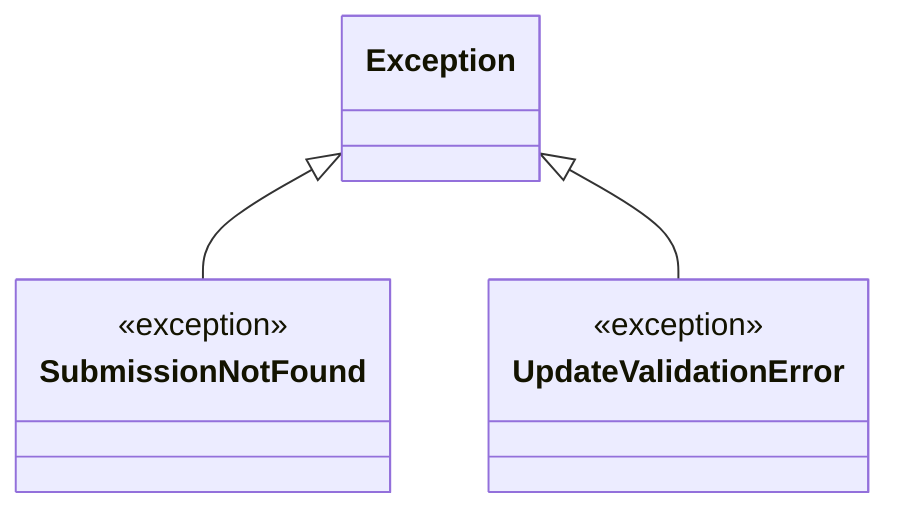

# Diagram: entity_core/entity_service/entity_service/damageview/submission/update_submission/exceptions.py

> Auto-generated by Obscura crawlers

## Mermaid

### SVG

<svg id="container" width="432.4375" xmlns="http://www.w3.org/2000/svg" class="classDiagram" height="258" viewBox="0 0 432.4375 258" role="graphics-document document" aria-roledescription="class"><g><defs><marker id="container_class-aggregationStart" class="marker aggregation class" refX="18" refY="7" markerWidth="190" markerHeight="240" orient="auto"><path d="M 18,7 L9,13 L1,7 L9,1 Z"></path></marker></defs><defs><marker id="container_class-aggregationEnd" class="marker aggregation class" refX="1" refY="7" markerWidth="20" markerHeight="28" orient="auto"><path d="M 18,7 L9,13 L1,7 L9,1 Z"></path></marker></defs><defs><marker id="container_class-extensionStart" class="marker extension class" refX="18" refY="7" markerWidth="190" markerHeight="240" orient="auto"><path d="M 1,7 L18,13 V 1 Z"></path></marker></defs><defs><marker id="container_class-extensionEnd" class="marker extension class" refX="1" refY="7" markerWidth="20" markerHeight="28" orient="auto"><path d="M 1,1 V 13 L18,7 Z"></path></marker></defs><defs><marker id="container_class-compositionStart" class="marker composition class" refX="18" refY="7" markerWidth="190" markerHeight="240" orient="auto"><path d="M 18,7 L9,13 L1,7 L9,1 Z"></path></marker></defs><defs><marker id="container_class-compositionEnd" class="marker composition class" refX="1" refY="7" markerWidth="20" markerHeight="28" orient="auto"><path d="M 18,7 L9,13 L1,7 L9,1 Z"></path></marker></defs><defs><marker id="container_class-dependencyStart" class="marker dependency class" refX="6" refY="7" markerWidth="190" markerHeight="240" orient="auto"><path d="M 5,7 L9,13 L1,7 L9,1 Z"></path></marker></defs><defs><marker id="container_class-dependencyEnd" class="marker dependency class" refX="13" refY="7" markerWidth="20" markerHeight="28" orient="auto"><path d="M 18,7 L9,13 L14,7 L9,1 Z"></path></marker></defs><defs><marker id="container_class-lollipopStart" class="marker lollipop class" refX="13" refY="7" markerWidth="190" markerHeight="240" orient="auto"><circle stroke="black" fill="transparent" cx="7" cy="7" r="6"></circle></marker></defs><defs><marker id="container_class-lollipopEnd" class="marker lollipop class" refX="1" refY="7" markerWidth="190" markerHeight="240" orient="auto"><circle stroke="black" fill="transparent" cx="7" cy="7" r="6"></circle></marker></defs><g class="root"><g class="clusters"></g><g class="edgePaths"><path d="M151.457,86.002L142.466,91.169C133.474,96.335,115.491,106.667,106.499,116C97.508,125.333,97.508,133.667,97.508,137.833L97.508,142" id="id_Exception_SubmissionNotFound_1" class="edge-thickness-normal edge-pattern-solid relation" style=";;;" data-edge="true" data-et="edge" data-id="id_Exception_SubmissionNotFound_1" data-points="W3sieCI6MTY2LjQxNDA2MjUsInkiOjc3LjQwODY4MjgzNTMyMDkyfSx7IngiOjk3LjUwNzgxMjUsInkiOjExN30seyJ4Ijo5Ny41MDc4MTI1LCJ5IjoxNDJ9XQ==" marker-start="url(#container_class-extensionStart)"></path><path d="M276.777,86.002L285.769,91.169C294.76,96.335,312.743,106.667,321.735,116C330.727,125.333,330.727,133.667,330.727,137.833L330.727,142" id="id_Exception_UpdateValidationError_2" class="edge-thickness-normal edge-pattern-solid relation" style=";;;" data-edge="true" data-et="edge" data-id="id_Exception_UpdateValidationError_2" data-points="W3sieCI6MjYxLjgyMDMxMjUsInkiOjc3LjQwODY4MjgzNTMyMDkyfSx7IngiOjMzMC43MjY1NjI1LCJ5IjoxMTd9LHsieCI6MzMwLjcyNjU2MjUsInkiOjE0Mn1d" marker-start="url(#container_class-extensionStart)"></path></g><g class="edgeLabels"><g class="edgeLabel"><g class="label" data-id="id_Exception_SubmissionNotFound_1" transform="translate(0, 0)"><foreignObject width="0" height="0">

</foreignObject></g></g><g class="edgeLabel"><g class="label" data-id="id_Exception_UpdateValidationError_2" transform="translate(0, 0)"><foreignObject width="0" height="0">

</foreignObject></g></g></g><g class="nodes"><g class="node default" id="classId-Exception-0" transform="translate(214.1171875, 50)"><g class="basic label-container"><path d="M-47.703125 -42 L47.703125 -42 L47.703125 42 L-47.703125 42" stroke="none" stroke-width="0" fill="#ECECFF" style=""></path><path d="M-47.703125 -42 C-11.708736799760878 -42, 24.285651400478244 -42, 47.703125 -42 M-47.703125 -42 C-16.985886744402542 -42, 13.731351511194916 -42, 47.703125 -42 M47.703125 -42 C47.703125 -20.31998348983719, 47.703125 1.3600330203256235, 47.703125 42 M47.703125 -42 C47.703125 -10.626178612947815, 47.703125 20.74764277410437, 47.703125 42 M47.703125 42 C19.106858683554997 42, -9.489407632890007 42, -47.703125 42 M47.703125 42 C21.771108226723264 42, -4.160908546553472 42, -47.703125 42 M-47.703125 42 C-47.703125 12.252870446592283, -47.703125 -17.494259106815434, -47.703125 -42 M-47.703125 42 C-47.703125 23.422478229785632, -47.703125 4.844956459571264, -47.703125 -42" stroke="#9370DB" stroke-width="1.3" fill="none" stroke-dasharray="0 0" style=""></path></g><g class="annotation-group text" transform="translate(0, -18)"></g><g class="label-group text" transform="translate(-35.703125, -18)"><g class="label" style="font-weight: bolder" transform="translate(0,-12)"><foreignObject width="71.40625" height="24">

Exception

</foreignObject></g></g><g class="members-group text" transform="translate(-35.703125, 30)"></g><g class="methods-group text" transform="translate(-35.703125, 60)"></g><g class="divider" style=""><path d="M-47.703125 6 C-23.702692439658215 6, 0.2977401206835708 6, 47.703125 6 M-47.703125 6 C-25.307733664154632 6, -2.912342328309265 6, 47.703125 6" stroke="#9370DB" stroke-width="1.3" fill="none" stroke-dasharray="0 0" style=""></path></g><g class="divider" style=""><path d="M-47.703125 24 C-14.351005027154592 24, 19.001114945690816 24, 47.703125 24 M-47.703125 24 C-14.661602018820325 24, 18.37992096235935 24, 47.703125 24" stroke="#9370DB" stroke-width="1.3" fill="none" stroke-dasharray="0 0" style=""></path></g></g><g class="node default" id="classId-SubmissionNotFound-1" transform="translate(97.5078125, 196)"><g class="basic label-container"><path d="M-89.5078125 -54 L89.5078125 -54 L89.5078125 54 L-89.5078125 54" stroke="none" stroke-width="0" fill="#ECECFF" style=""></path><path d="M-89.5078125 -54 C-34.406712216203665 -54, 20.69438806759267 -54, 89.5078125 -54 M-89.5078125 -54 C-25.206810048765078 -54, 39.094192402469844 -54, 89.5078125 -54 M89.5078125 -54 C89.5078125 -28.101526555872805, 89.5078125 -2.2030531117456107, 89.5078125 54 M89.5078125 -54 C89.5078125 -24.518668994455435, 89.5078125 4.9626620110891295, 89.5078125 54 M89.5078125 54 C28.498007088567803 54, -32.511798322864394 54, -89.5078125 54 M89.5078125 54 C45.4536675329875 54, 1.3995225659750048 54, -89.5078125 54 M-89.5078125 54 C-89.5078125 12.557553256506047, -89.5078125 -28.884893486987906, -89.5078125 -54 M-89.5078125 54 C-89.5078125 21.64174298411308, -89.5078125 -10.71651403177384, -89.5078125 -54" stroke="#9370DB" stroke-width="1.3" fill="none" stroke-dasharray="0 0" style=""></path></g><g class="annotation-group text" transform="translate(-44.3515625, -30)"><g class="label" style="" transform="translate(0,-12)"><foreignObject width="88.703125" height="24">

«exception»

</foreignObject></g></g><g class="label-group text" transform="translate(-77.5078125, -6)"><g class="label" style="font-weight: bolder" transform="translate(0,-12)"><foreignObject width="155.015625" height="24">

SubmissionNotFound

</foreignObject></g></g><g class="members-group text" transform="translate(-77.5078125, 42)"></g><g class="methods-group text" transform="translate(-77.5078125, 72)"></g><g class="divider" style=""><path d="M-89.5078125 18 C-45.8428082744008 18, -2.1778040488016046 18, 89.5078125 18 M-89.5078125 18 C-18.133621748978 18, 53.240569002044 18, 89.5078125 18" stroke="#9370DB" stroke-width="1.3" fill="none" stroke-dasharray="0 0" style=""></path></g><g class="divider" style=""><path d="M-89.5078125 36 C-31.425849613434735 36, 26.65611327313053 36, 89.5078125 36 M-89.5078125 36 C-40.171925189862506 36, 9.163962120274988 36, 89.5078125 36" stroke="#9370DB" stroke-width="1.3" fill="none" stroke-dasharray="0 0" style=""></path></g></g><g class="node default" id="classId-UpdateValidationError-2" transform="translate(330.7265625, 196)"><g class="basic label-container"><path d="M-93.7109375 -54 L93.7109375 -54 L93.7109375 54 L-93.7109375 54" stroke="none" stroke-width="0" fill="#ECECFF" style=""></path><path d="M-93.7109375 -54 C-33.79806851779613 -54, 26.114800464407736 -54, 93.7109375 -54 M-93.7109375 -54 C-52.191961139128075 -54, -10.67298477825615 -54, 93.7109375 -54 M93.7109375 -54 C93.7109375 -31.397216239501212, 93.7109375 -8.794432479002424, 93.7109375 54 M93.7109375 -54 C93.7109375 -19.162084998801006, 93.7109375 15.675830002397987, 93.7109375 54 M93.7109375 54 C36.11263368221318 54, -21.485670135573642 54, -93.7109375 54 M93.7109375 54 C40.93105055709838 54, -11.848836385803239 54, -93.7109375 54 M-93.7109375 54 C-93.7109375 21.168211523029534, -93.7109375 -11.663576953940932, -93.7109375 -54 M-93.7109375 54 C-93.7109375 19.615238683101595, -93.7109375 -14.76952263379681, -93.7109375 -54" stroke="#9370DB" stroke-width="1.3" fill="none" stroke-dasharray="0 0" style=""></path></g><g class="annotation-group text" transform="translate(-44.3515625, -30)"><g class="label" style="" transform="translate(0,-12)"><foreignObject width="88.703125" height="24">

«exception»

</foreignObject></g></g><g class="label-group text" transform="translate(-81.7109375, -6)"><g class="label" style="font-weight: bolder" transform="translate(0,-12)"><foreignObject width="163.421875" height="24">

UpdateValidationError

</foreignObject></g></g><g class="members-group text" transform="translate(-81.7109375, 42)"></g><g class="methods-group text" transform="translate(-81.7109375, 72)"></g><g class="divider" style=""><path d="M-93.7109375 18 C-26.268378234948173 18, 41.174181030103654 18, 93.7109375 18 M-93.7109375 18 C-51.85368629608972 18, -9.99643509217944 18, 93.7109375 18" stroke="#9370DB" stroke-width="1.3" fill="none" stroke-dasharray="0 0" style=""></path></g><g class="divider" style=""><path d="M-93.7109375 36 C-38.67838970416003 36, 16.354158091679935 36, 93.7109375 36 M-93.7109375 36 C-26.184976642324187 36, 41.340984215351625 36, 93.7109375 36" stroke="#9370DB" stroke-width="1.3" fill="none" stroke-dasharray="0 0" style=""></path></g></g></g></g></g></svg>
