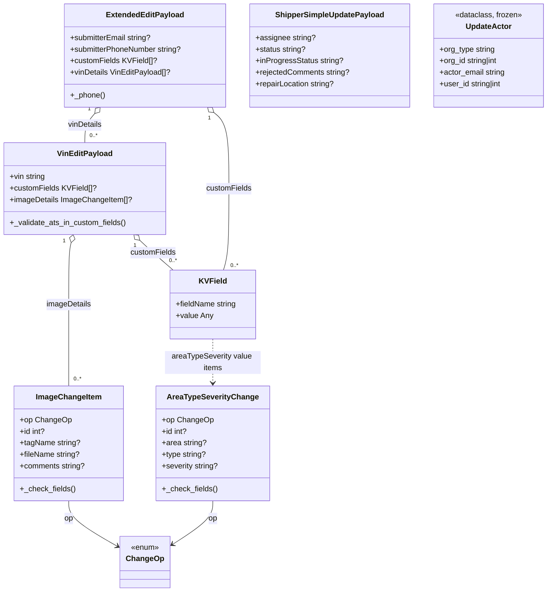

# Diagram: entity_core/entity_service/entity_service/damageview/submission/update_submission/models/damage_payload.py

> Auto-generated by Obscura crawlers

## Mermaid

### SVG

<svg id="container" width="1136.23828125" xmlns="http://www.w3.org/2000/svg" class="classDiagram" height="1236" viewBox="0 0 1136.23828125 1236" role="graphics-document document" aria-roledescription="class"><g><defs><marker id="container_class-aggregationStart" class="marker aggregation class" refX="18" refY="7" markerWidth="190" markerHeight="240" orient="auto"><path d="M 18,7 L9,13 L1,7 L9,1 Z"></path></marker></defs><defs><marker id="container_class-aggregationEnd" class="marker aggregation class" refX="1" refY="7" markerWidth="20" markerHeight="28" orient="auto"><path d="M 18,7 L9,13 L1,7 L9,1 Z"></path></marker></defs><defs><marker id="container_class-extensionStart" class="marker extension class" refX="18" refY="7" markerWidth="190" markerHeight="240" orient="auto"><path d="M 1,7 L18,13 V 1 Z"></path></marker></defs><defs><marker id="container_class-extensionEnd" class="marker extension class" refX="1" refY="7" markerWidth="20" markerHeight="28" orient="auto"><path d="M 1,1 V 13 L18,7 Z"></path></marker></defs><defs><marker id="container_class-compositionStart" class="marker composition class" refX="18" refY="7" markerWidth="190" markerHeight="240" orient="auto"><path d="M 18,7 L9,13 L1,7 L9,1 Z"></path></marker></defs><defs><marker id="container_class-compositionEnd" class="marker composition class" refX="1" refY="7" markerWidth="20" markerHeight="28" orient="auto"><path d="M 18,7 L9,13 L1,7 L9,1 Z"></path></marker></defs><defs><marker id="container_class-dependencyStart" class="marker dependency class" refX="6" refY="7" markerWidth="190" markerHeight="240" orient="auto"><path d="M 5,7 L9,13 L1,7 L9,1 Z"></path></marker></defs><defs><marker id="container_class-dependencyEnd" class="marker dependency class" refX="13" refY="7" markerWidth="20" markerHeight="28" orient="auto"><path d="M 18,7 L9,13 L14,7 L9,1 Z"></path></marker></defs><defs><marker id="container_class-lollipopStart" class="marker lollipop class" refX="13" refY="7" markerWidth="190" markerHeight="240" orient="auto"><circle stroke="black" fill="transparent" cx="7" cy="7" r="6"></circle></marker></defs><defs><marker id="container_class-lollipopEnd" class="marker lollipop class" refX="1" refY="7" markerWidth="190" markerHeight="240" orient="auto"><circle stroke="black" fill="transparent" cx="7" cy="7" r="6"></circle></marker></defs><g class="root"><g class="clusters"></g><g class="edgePaths"><path d="M139.996,1046L139.996,1052.167C139.996,1058.333,139.996,1070.667,157.264,1086.785C174.533,1102.904,209.069,1122.807,226.338,1132.759L243.606,1142.711" id="id_ImageChangeItem_ChangeOp_1" class="edge-thickness-normal edge-pattern-solid relation" style=";;;" data-edge="true" data-et="edge" data-id="id_ImageChangeItem_ChangeOp_1" data-points="W3sieCI6MTM5Ljk5NjA5Mzc1LCJ5IjoxMDQ2fSx7IngiOjEzOS45OTYwOTM3NSwieSI6MTA4M30seyJ4IjoyNDguODA0Njg3NSwieSI6MTE0NS43MDY5OTg0OTA5NTh9XQ==" marker-end="url(#container_class-dependencyEnd)"></path><path d="M437.398,1046L437.398,1052.167C437.398,1058.333,437.398,1070.667,423.168,1086.116C408.938,1101.566,380.478,1120.131,366.248,1129.414L352.017,1138.697" id="id_AreaTypeSeverityChange_ChangeOp_2" class="edge-thickness-normal edge-pattern-solid relation" style=";;;" data-edge="true" data-et="edge" data-id="id_AreaTypeSeverityChange_ChangeOp_2" data-points="W3sieCI6NDM3LjM5ODQzNzUsInkiOjEwNDZ9LHsieCI6NDM3LjM5ODQzNzUsInkiOjEwODN9LHsieCI6MzQ2Ljk5MjE4NzUsInkiOjExNDEuOTc0Njg2Mzc5OTI4Mn1d" marker-end="url(#container_class-dependencyEnd)"></path><path d="M286.935,501.903L291.322,506.086C295.709,510.269,304.483,518.634,315.894,528.984C327.304,539.333,341.351,551.667,348.374,557.833L355.397,564" id="id_VinEditPayload_KVField_3" class="edge-thickness-normal edge-pattern-solid relation" style=";;;" data-edge="true" data-et="edge" data-id="id_VinEditPayload_KVField_3" data-points="W3sieCI6Mjc0LjQ0OTU0MTgyMzMwODI3LCJ5Ijo0OTB9LHsieCI6MzEzLjI1NzgxMjUsInkiOjUyN30seyJ4IjozNTUuMzk3MjkwNzExMDA5MiwieSI6NTY0fV0=" marker-start="url(#container_class-aggregationStart)"></path><path d="M145.144,506.72L144.286,510.1C143.428,513.48,141.712,520.24,140.854,541.787C139.996,563.333,139.996,599.667,139.996,638C139.996,676.333,139.996,716.667,139.996,745C139.996,773.333,139.996,789.667,139.996,797.833L139.996,806" id="id_VinEditPayload_ImageChangeItem_4" class="edge-thickness-normal edge-pattern-solid relation" style=";;;" data-edge="true" data-et="edge" data-id="id_VinEditPayload_ImageChangeItem_4" data-points="W3sieCI6MTQ5LjM4ODQ1MTU5Nzc0NDM2LCJ5Ijo0OTB9LHsieCI6MTM5Ljk5NjA5Mzc1LCJ5Ijo1Mjd9LHsieCI6MTM5Ljk5NjA5Mzc1LCJ5Ijo2MzZ9LHsieCI6MTM5Ljk5NjA5Mzc1LCJ5Ijo3NTd9LHsieCI6MTM5Ljk5NjA5Mzc1LCJ5Ijo4MDZ9XQ==" marker-start="url(#container_class-aggregationStart)"></path><path d="M440.177,235.071L445.341,239.392C450.505,243.714,460.833,252.357,465.996,278.845C471.16,305.333,471.16,349.667,471.16,394C471.16,438.333,471.16,482.667,469.25,511C467.34,539.333,463.52,551.667,461.61,557.833L459.7,564" id="id_ExtendedEditPayload_KVField_5" class="edge-thickness-normal edge-pattern-solid relation" style=";;;" data-edge="true" data-et="edge" data-id="id_ExtendedEditPayload_KVField_5" data-points="W3sieCI6NDI2Ljk0ODU0NTI1ODYyMDcsInkiOjIyNH0seyJ4Ijo0NzEuMTYwMTU2MjUsInkiOjI2MX0seyJ4Ijo0NzEuMTYwMTU2MjUsInkiOjM5NH0seyJ4Ijo0NzEuMTYwMTU2MjUsInkiOjUyN30seyJ4Ijo0NTkuNjk5NzU2MzA3MzM5NDQsInkiOjU2NH1d" marker-start="url(#container_class-aggregationStart)"></path><path d="M194.216,237.104L190.807,241.086C187.397,245.069,180.577,253.035,177.168,263.184C173.758,273.333,173.758,285.667,173.758,291.833L173.758,298" id="id_ExtendedEditPayload_VinEditPayload_6" class="edge-thickness-normal edge-pattern-solid relation" style=";;;" data-edge="true" data-et="edge" data-id="id_ExtendedEditPayload_VinEditPayload_6" data-points="W3sieCI6MjA1LjQzNTA3NTQzMTAzNDQ4LCJ5IjoyMjR9LHsieCI6MTczLjc1NzgxMjUsInkiOjI2MX0seyJ4IjoxNzMuNzU3ODEyNSwieSI6Mjk4fV0=" marker-start="url(#container_class-aggregationStart)"></path><path d="M437.398,708L437.398,716.167C437.398,724.333,437.398,740.667,437.398,756C437.398,771.333,437.398,785.667,437.398,792.833L437.398,800" id="id_KVField_AreaTypeSeverityChange_7" class="edge-thickness-normal edge-pattern-dashed relation" style=";;;" data-edge="true" data-et="edge" data-id="id_KVField_AreaTypeSeverityChange_7" data-points="W3sieCI6NDM3LjM5ODQzNzUsInkiOjcwOH0seyJ4Ijo0MzcuMzk4NDM3NSwieSI6NzU3fSx7IngiOjQzNy4zOTg0Mzc1LCJ5Ijo4MDZ9XQ==" marker-end="url(#container_class-dependencyEnd)"></path></g><g class="edgeLabels"><g class="edgeLabel" transform="translate(139.99609375, 1083)"><g class="label" data-id="id_ImageChangeItem_ChangeOp_1" transform="translate(-9.4296875, -12)"><foreignObject width="18.859375" height="24">

op

</foreignObject></g></g><g class="edgeLabel" transform="translate(437.3984375, 1083)"><g class="label" data-id="id_AreaTypeSeverityChange_ChangeOp_2" transform="translate(-9.4296875, -12)"><foreignObject width="18.859375" height="24">

op

</foreignObject></g></g><g class="edgeLabel" transform="translate(314.1814, 527.81094)"><g class="label" data-id="id_VinEditPayload_KVField_3" transform="translate(-47.5234375, -12)"><foreignObject width="95.046875" height="24">

customFields

</foreignObject></g></g><g class="edgeLabel" transform="translate(139.99609375, 636)"><g class="label" data-id="id_VinEditPayload_ImageChangeItem_4" transform="translate(-46.8125, -12)"><foreignObject width="93.625" height="24">

imageDetails

</foreignObject></g></g><g class="edgeLabel" transform="translate(471.16015625, 394)"><g class="label" data-id="id_ExtendedEditPayload_KVField_5" transform="translate(-47.5234375, -12)"><foreignObject width="95.046875" height="24">

customFields

</foreignObject></g></g><g class="edgeLabel" transform="translate(173.7578125, 261)"><g class="label" data-id="id_ExtendedEditPayload_VinEditPayload_6" transform="translate(-35.9140625, -12)"><foreignObject width="71.828125" height="24">

vinDetails

</foreignObject></g></g><g class="edgeLabel" transform="translate(437.3984375, 757)"><g class="label" data-id="id_KVField_AreaTypeSeverityChange_7" transform="translate(-100, -24)"><foreignObject width="200" height="48">

areaTypeSeverity value items

</foreignObject></g></g><g class="edgeTerminals" transform="translate(276.7648199720291, 512.93228016922)"><g class="inner" transform="translate(0, 0)"><foreignObject style="width: 9px; height: 12px;">
1
</foreignObject></g></g><g class="edgeTerminals" transform="translate(130.54380114202527, 503.27136403972145)"><g class="inner" transform="translate(0, 0)"><foreignObject style="width: 9px; height: 12px;">
1
</foreignObject></g></g><g class="edgeTerminals" transform="translate(430.74210255466704, 246.7345314069259)"><g class="inner" transform="translate(0, 0)"><foreignObject style="width: 9px; height: 12px;">
1
</foreignObject></g></g><g class="edgeTerminals" transform="translate(182.6594166675186, 227.53826391803508)"><g class="inner" transform="translate(0, 0)"><foreignObject style="width: 9px; height: 12px;">
1
</foreignObject></g></g><g class="edgeTerminals" transform="translate(347.14394453666665, 536.1818977707175)"><g class="inner" transform="translate(0, 0)"></g><foreignObject style="width: 36px; height: 12px;">
0..*
</foreignObject></g><g class="edgeTerminals" transform="translate(149.9960918749999, 783.4999983928572)"><g class="inner" transform="translate(0, 0)"></g><foreignObject style="width: 36px; height: 12px;">
0..*
</foreignObject></g><g class="edgeTerminals" transform="translate(474.20593900014387, 546.7216099736983)"><g class="inner" transform="translate(0, 0)"></g><foreignObject style="width: 36px; height: 12px;">
0..*
</foreignObject></g><g class="edgeTerminals" transform="translate(183.75781124999997, 275.4999989285714)"><g class="inner" transform="translate(0, 0)"></g><foreignObject style="width: 36px; height: 12px;">
0..*
</foreignObject></g></g><g class="nodes"><g class="node default" id="classId-ChangeOp-0" transform="translate(297.8984375, 1174)"><g class="basic label-container"><path d="M-49.09375 -54 L49.09375 -54 L49.09375 54 L-49.09375 54" stroke="none" stroke-width="0" fill="#ECECFF" style=""></path><path d="M-49.09375 -54 C-17.811846525171095 -54, 13.47005694965781 -54, 49.09375 -54 M-49.09375 -54 C-29.138569034654896 -54, -9.183388069309792 -54, 49.09375 -54 M49.09375 -54 C49.09375 -16.37919267858846, 49.09375 21.24161464282308, 49.09375 54 M49.09375 -54 C49.09375 -26.22660179252525, 49.09375 1.5467964149494975, 49.09375 54 M49.09375 54 C10.710090826459577 54, -27.673568347080845 54, -49.09375 54 M49.09375 54 C9.963725998818681 54, -29.166298002362637 54, -49.09375 54 M-49.09375 54 C-49.09375 26.50778239285846, -49.09375 -0.9844352142830815, -49.09375 -54 M-49.09375 54 C-49.09375 21.734591745650377, -49.09375 -10.530816508699246, -49.09375 -54" stroke="#9370DB" stroke-width="1.3" fill="none" stroke-dasharray="0 0" style=""></path></g><g class="annotation-group text" transform="translate(-29.53125, -30)"><g class="label" style="" transform="translate(0,-12)"><foreignObject width="59.0625" height="24">

«enum»

</foreignObject></g></g><g class="label-group text" transform="translate(-37.09375, -6)"><g class="label" style="font-weight: bolder" transform="translate(0,-12)"><foreignObject width="74.1875" height="24">

ChangeOp

</foreignObject></g></g><g class="members-group text" transform="translate(-37.09375, 42)"></g><g class="methods-group text" transform="translate(-37.09375, 72)"></g><g class="divider" style=""><path d="M-49.09375 18 C-29.314031972191437 18, -9.534313944382873 18, 49.09375 18 M-49.09375 18 C-26.19788757671023 18, -3.302025153420459 18, 49.09375 18" stroke="#9370DB" stroke-width="1.3" fill="none" stroke-dasharray="0 0" style=""></path></g><g class="divider" style=""><path d="M-49.09375 36 C-20.928504666240183 36, 7.2367406675196335 36, 49.09375 36 M-49.09375 36 C-11.101794360630052 36, 26.890161278739896 36, 49.09375 36" stroke="#9370DB" stroke-width="1.3" fill="none" stroke-dasharray="0 0" style=""></path></g></g><g class="node default" id="classId-ImageChangeItem-1" transform="translate(139.99609375, 926)"><g class="basic label-container"><path d="M-112.81640625 -120 L112.81640625 -120 L112.81640625 120 L-112.81640625 120" stroke="none" stroke-width="0" fill="#ECECFF" style=""></path><path d="M-112.81640625 -120 C-56.07725192084655 -120, 0.6619024083069007 -120, 112.81640625 -120 M-112.81640625 -120 C-37.85850591269528 -120, 37.09939442460944 -120, 112.81640625 -120 M112.81640625 -120 C112.81640625 -35.69149043919168, 112.81640625 48.617019121616636, 112.81640625 120 M112.81640625 -120 C112.81640625 -46.222196235505464, 112.81640625 27.55560752898907, 112.81640625 120 M112.81640625 120 C29.554415669841347 120, -53.707574910317305 120, -112.81640625 120 M112.81640625 120 C26.763188758774817 120, -59.29002873245037 120, -112.81640625 120 M-112.81640625 120 C-112.81640625 26.446964495667743, -112.81640625 -67.10607100866451, -112.81640625 -120 M-112.81640625 120 C-112.81640625 34.80738927798201, -112.81640625 -50.38522144403598, -112.81640625 -120" stroke="#9370DB" stroke-width="1.3" fill="none" stroke-dasharray="0 0" style=""></path></g><g class="annotation-group text" transform="translate(0, -96)"></g><g class="label-group text" transform="translate(-65.3046875, -96)"><g class="label" style="font-weight: bolder" transform="translate(0,-12)"><foreignObject width="130.609375" height="24">

ImageChangeItem

</foreignObject></g></g><g class="members-group text" transform="translate(-100.81640625, -48)"><g class="label" style="" transform="translate(0,-12)"><foreignObject width="104.703125" height="24">

+op ChangeOp

</foreignObject></g><g class="label" style="" transform="translate(0,12)"><foreignObject width="52.84375" height="24">

+id int?

</foreignObject></g><g class="label" style="" transform="translate(0,36)"><foreignObject width="125.40625" height="24">

+tagName string?

</foreignObject></g><g class="label" style="" transform="translate(0,60)"><foreignObject width="125.234375" height="24">

+fileName string?

</foreignObject></g><g class="label" style="" transform="translate(0,84)"><foreignObject width="136.328125" height="24">

+comments string?

</foreignObject></g></g><g class="methods-group text" transform="translate(-100.81640625, 96)"><g class="label" style="" transform="translate(0,-12)"><foreignObject width="114.234375" height="24">

+_check_fields()

</foreignObject></g></g><g class="divider" style=""><path d="M-112.81640625 -72 C-60.235438862761725 -72, -7.654471475523451 -72, 112.81640625 -72 M-112.81640625 -72 C-57.763315935189226 -72, -2.710225620378452 -72, 112.81640625 -72" stroke="#9370DB" stroke-width="1.3" fill="none" stroke-dasharray="0 0" style=""></path></g><g class="divider" style=""><path d="M-112.81640625 72 C-59.05754788236609 72, -5.298689514732175 72, 112.81640625 72 M-112.81640625 72 C-37.97829091495149 72, 36.85982442009703 72, 112.81640625 72" stroke="#9370DB" stroke-width="1.3" fill="none" stroke-dasharray="0 0" style=""></path></g></g><g class="node default" id="classId-AreaTypeSeverityChange-2" transform="translate(437.3984375, 926)"><g class="basic label-container"><path d="M-116.18359375 -120 L116.18359375 -120 L116.18359375 120 L-116.18359375 120" stroke="none" stroke-width="0" fill="#ECECFF" style=""></path><path d="M-116.18359375 -120 C-32.63992024897897 -120, 50.903753252042065 -120, 116.18359375 -120 M-116.18359375 -120 C-24.54493296080217 -120, 67.09372782839566 -120, 116.18359375 -120 M116.18359375 -120 C116.18359375 -26.675479349804235, 116.18359375 66.64904130039153, 116.18359375 120 M116.18359375 -120 C116.18359375 -68.6608381546898, 116.18359375 -17.321676309379598, 116.18359375 120 M116.18359375 120 C68.07942408852423 120, 19.97525442704847 120, -116.18359375 120 M116.18359375 120 C52.50220265747599 120, -11.179188435048019 120, -116.18359375 120 M-116.18359375 120 C-116.18359375 31.010087050236947, -116.18359375 -57.979825899526105, -116.18359375 -120 M-116.18359375 120 C-116.18359375 58.08756729329454, -116.18359375 -3.824865413410919, -116.18359375 -120" stroke="#9370DB" stroke-width="1.3" fill="none" stroke-dasharray="0 0" style=""></path></g><g class="annotation-group text" transform="translate(0, -96)"></g><g class="label-group text" transform="translate(-90.5703125, -96)"><g class="label" style="font-weight: bolder" transform="translate(0,-12)"><foreignObject width="181.140625" height="24">

AreaTypeSeverityChange

</foreignObject></g></g><g class="members-group text" transform="translate(-104.18359375, -48)"><g class="label" style="" transform="translate(0,-12)"><foreignObject width="104.703125" height="24">

+op ChangeOp

</foreignObject></g><g class="label" style="" transform="translate(0,12)"><foreignObject width="52.84375" height="24">

+id int?

</foreignObject></g><g class="label" style="" transform="translate(0,36)"><foreignObject width="92.3125" height="24">

+area string?

</foreignObject></g><g class="label" style="" transform="translate(0,60)"><foreignObject width="92.59375" height="24">

+type string?

</foreignObject></g><g class="label" style="" transform="translate(0,84)"><foreignObject width="117.796875" height="24">

+severity string?

</foreignObject></g></g><g class="methods-group text" transform="translate(-104.18359375, 96)"><g class="label" style="" transform="translate(0,-12)"><foreignObject width="114.234375" height="24">

+_check_fields()

</foreignObject></g></g><g class="divider" style=""><path d="M-116.18359375 -72 C-62.94784283503981 -72, -9.712091920079615 -72, 116.18359375 -72 M-116.18359375 -72 C-30.163434600865955 -72, 55.85672454826809 -72, 116.18359375 -72" stroke="#9370DB" stroke-width="1.3" fill="none" stroke-dasharray="0 0" style=""></path></g><g class="divider" style=""><path d="M-116.18359375 72 C-29.253985494037053 72, 57.675622761925894 72, 116.18359375 72 M-116.18359375 72 C-35.86487244859747 72, 44.453848852805066 72, 116.18359375 72" stroke="#9370DB" stroke-width="1.3" fill="none" stroke-dasharray="0 0" style=""></path></g></g><g class="node default" id="classId-KVField-3" transform="translate(437.3984375, 636)"><g class="basic label-container"><path d="M-89.44140625 -72 L89.44140625 -72 L89.44140625 72 L-89.44140625 72" stroke="none" stroke-width="0" fill="#ECECFF" style=""></path><path d="M-89.44140625 -72 C-36.067066583372785 -72, 17.30727308325443 -72, 89.44140625 -72 M-89.44140625 -72 C-35.77069423392174 -72, 17.900017782156525 -72, 89.44140625 -72 M89.44140625 -72 C89.44140625 -14.424641632924, 89.44140625 43.150716734152, 89.44140625 72 M89.44140625 -72 C89.44140625 -39.44158946651096, 89.44140625 -6.883178933021924, 89.44140625 72 M89.44140625 72 C41.71730313749729 72, -6.006799975005421 72, -89.44140625 72 M89.44140625 72 C49.44391640236018 72, 9.446426554720361 72, -89.44140625 72 M-89.44140625 72 C-89.44140625 35.86775485919219, -89.44140625 -0.2644902816156218, -89.44140625 -72 M-89.44140625 72 C-89.44140625 15.972107070319787, -89.44140625 -40.05578585936043, -89.44140625 -72" stroke="#9370DB" stroke-width="1.3" fill="none" stroke-dasharray="0 0" style=""></path></g><g class="annotation-group text" transform="translate(0, -48)"></g><g class="label-group text" transform="translate(-27.1015625, -48)"><g class="label" style="font-weight: bolder" transform="translate(0,-12)"><foreignObject width="54.203125" height="24">

KVField

</foreignObject></g></g><g class="members-group text" transform="translate(-77.44140625, 0)"><g class="label" style="" transform="translate(0,-12)"><foreignObject width="127.78125" height="24">

+fieldName string

</foreignObject></g><g class="label" style="" transform="translate(0,12)"><foreignObject width="77.25" height="24">

+value Any

</foreignObject></g></g><g class="methods-group text" transform="translate(-77.44140625, 72)"></g><g class="divider" style=""><path d="M-89.44140625 -24 C-32.057656156666575 -24, 25.32609393666685 -24, 89.44140625 -24 M-89.44140625 -24 C-44.35945811432483 -24, 0.7224900213503389 -24, 89.44140625 -24" stroke="#9370DB" stroke-width="1.3" fill="none" stroke-dasharray="0 0" style=""></path></g><g class="divider" style=""><path d="M-89.44140625 48 C-38.19299106946566 48, 13.055424111068675 48, 89.44140625 48 M-89.44140625 48 C-21.97234361100108 48, 45.49671902799784 48, 89.44140625 48" stroke="#9370DB" stroke-width="1.3" fill="none" stroke-dasharray="0 0" style=""></path></g></g><g class="node default" id="classId-VinEditPayload-4" transform="translate(173.7578125, 394)"><g class="basic label-container"><path d="M-165.7578125 -96 L165.7578125 -96 L165.7578125 96 L-165.7578125 96" stroke="none" stroke-width="0" fill="#ECECFF" style=""></path><path d="M-165.7578125 -96 C-76.42745427572224 -96, 12.902903948555519 -96, 165.7578125 -96 M-165.7578125 -96 C-77.76889458752066 -96, 10.220023324958674 -96, 165.7578125 -96 M165.7578125 -96 C165.7578125 -48.46224453770445, 165.7578125 -0.9244890754088999, 165.7578125 96 M165.7578125 -96 C165.7578125 -50.71393601413553, 165.7578125 -5.427872028271054, 165.7578125 96 M165.7578125 96 C63.17835406616405 96, -39.401104367671905 96, -165.7578125 96 M165.7578125 96 C39.542811399579435 96, -86.67218970084113 96, -165.7578125 96 M-165.7578125 96 C-165.7578125 56.029648648506246, -165.7578125 16.059297297012492, -165.7578125 -96 M-165.7578125 96 C-165.7578125 44.59178734274728, -165.7578125 -6.816425314505437, -165.7578125 -96" stroke="#9370DB" stroke-width="1.3" fill="none" stroke-dasharray="0 0" style=""></path></g><g class="annotation-group text" transform="translate(0, -72)"></g><g class="label-group text" transform="translate(-54.53125, -72)"><g class="label" style="font-weight: bolder" transform="translate(0,-12)"><foreignObject width="109.0625" height="24">

VinEditPayload

</foreignObject></g></g><g class="members-group text" transform="translate(-153.7578125, -24)"><g class="label" style="" transform="translate(0,-12)"><foreignObject width="75.46875" height="24">

+vin string

</foreignObject></g><g class="label" style="" transform="translate(0,12)"><foreignObject width="177.9375" height="24">

+customFields KVField[]?

</foreignObject></g><g class="label" style="" transform="translate(0,36)"><foreignObject width="252.984375" height="24">

+imageDetails ImageChangeItem[]?

</foreignObject></g></g><g class="methods-group text" transform="translate(-153.7578125, 72)"><g class="label" style="" transform="translate(0,-12)"><foreignObject width="242.765625" height="24">

+_validate_ats_in_custom_fields()

</foreignObject></g></g><g class="divider" style=""><path d="M-165.7578125 -48 C-58.86052380453256 -48, 48.036764890934876 -48, 165.7578125 -48 M-165.7578125 -48 C-76.02900344727537 -48, 13.699805605449257 -48, 165.7578125 -48" stroke="#9370DB" stroke-width="1.3" fill="none" stroke-dasharray="0 0" style=""></path></g><g class="divider" style=""><path d="M-165.7578125 48 C-76.39135475890201 48, 12.975102982195978 48, 165.7578125 48 M-165.7578125 48 C-94.52365037051001 48, -23.289488241020024 48, 165.7578125 48" stroke="#9370DB" stroke-width="1.3" fill="none" stroke-dasharray="0 0" style=""></path></g></g><g class="node default" id="classId-ExtendedEditPayload-5" transform="translate(297.8984375, 116)"><g class="basic label-container"><path d="M-168.57421875 -108 L168.57421875 -108 L168.57421875 108 L-168.57421875 108" stroke="none" stroke-width="0" fill="#ECECFF" style=""></path><path d="M-168.57421875 -108 C-44.17057577869859 -108, 80.23306719260282 -108, 168.57421875 -108 M-168.57421875 -108 C-51.48819858497819 -108, 65.59782158004361 -108, 168.57421875 -108 M168.57421875 -108 C168.57421875 -63.0284991671895, 168.57421875 -18.056998334379003, 168.57421875 108 M168.57421875 -108 C168.57421875 -29.18021723661846, 168.57421875 49.63956552676308, 168.57421875 108 M168.57421875 108 C73.35754649147648 108, -21.859125767047033 108, -168.57421875 108 M168.57421875 108 C90.4811655567424 108, 12.388112363484794 108, -168.57421875 108 M-168.57421875 108 C-168.57421875 50.295248255138006, -168.57421875 -7.409503489723988, -168.57421875 -108 M-168.57421875 108 C-168.57421875 45.89445932452372, -168.57421875 -16.211081350952554, -168.57421875 -108" stroke="#9370DB" stroke-width="1.3" fill="none" stroke-dasharray="0 0" style=""></path></g><g class="annotation-group text" transform="translate(0, -84)"></g><g class="label-group text" transform="translate(-77.3984375, -84)"><g class="label" style="font-weight: bolder" transform="translate(0,-12)"><foreignObject width="154.796875" height="24">

ExtendedEditPayload

</foreignObject></g></g><g class="members-group text" transform="translate(-156.57421875, -36)"><g class="label" style="" transform="translate(0,-12)"><foreignObject width="171.625" height="24">

+submitterEmail string?

</foreignObject></g><g class="label" style="" transform="translate(0,12)"><foreignObject width="235.75" height="24">

+submitterPhoneNumber string?

</foreignObject></g><g class="label" style="" transform="translate(0,36)"><foreignObject width="177.9375" height="24">

+customFields KVField[]?

</foreignObject></g><g class="label" style="" transform="translate(0,60)"><foreignObject width="209.234375" height="24">

+vinDetails VinEditPayload[]?

</foreignObject></g></g><g class="methods-group text" transform="translate(-156.57421875, 84)"><g class="label" style="" transform="translate(0,-12)"><foreignObject width="71.71875" height="24">

+_phone()

</foreignObject></g></g><g class="divider" style=""><path d="M-168.57421875 -60 C-43.23932400912912 -60, 82.09557073174176 -60, 168.57421875 -60 M-168.57421875 -60 C-88.5674985502991 -60, -8.560778350598213 -60, 168.57421875 -60" stroke="#9370DB" stroke-width="1.3" fill="none" stroke-dasharray="0 0" style=""></path></g><g class="divider" style=""><path d="M-168.57421875 60 C-79.28769560646133 60, 9.998827537077347 60, 168.57421875 60 M-168.57421875 60 C-49.009975785735065 60, 70.55426717852987 60, 168.57421875 60" stroke="#9370DB" stroke-width="1.3" fill="none" stroke-dasharray="0 0" style=""></path></g></g><g class="node default" id="classId-ShipperSimpleUpdatePayload-6" transform="translate(681.4296875, 116)"><g class="basic label-container"><path d="M-164.95703125 -108 L164.95703125 -108 L164.95703125 108 L-164.95703125 108" stroke="none" stroke-width="0" fill="#ECECFF" style=""></path><path d="M-164.95703125 -108 C-63.24684539125337 -108, 38.46334046749325 -108, 164.95703125 -108 M-164.95703125 -108 C-80.11820077194898 -108, 4.720629706102045 -108, 164.95703125 -108 M164.95703125 -108 C164.95703125 -64.75952680831716, 164.95703125 -21.519053616634338, 164.95703125 108 M164.95703125 -108 C164.95703125 -42.6529947764252, 164.95703125 22.694010447149594, 164.95703125 108 M164.95703125 108 C38.63148261361668 108, -87.69406602276663 108, -164.95703125 108 M164.95703125 108 C71.06408381900027 108, -22.828863611999452 108, -164.95703125 108 M-164.95703125 108 C-164.95703125 43.471396400699845, -164.95703125 -21.05720719860031, -164.95703125 -108 M-164.95703125 108 C-164.95703125 32.211909892368, -164.95703125 -43.576180215264, -164.95703125 -108" stroke="#9370DB" stroke-width="1.3" fill="none" stroke-dasharray="0 0" style=""></path></g><g class="annotation-group text" transform="translate(0, -84)"></g><g class="label-group text" transform="translate(-109.1796875, -84)"><g class="label" style="font-weight: bolder" transform="translate(0,-12)"><foreignObject width="218.359375" height="24">

ShipperSimpleUpdatePayload

</foreignObject></g></g><g class="members-group text" transform="translate(-152.95703125, -36)"><g class="label" style="" transform="translate(0,-12)"><foreignObject width="123.625" height="24">

+assignee string?

</foreignObject></g><g class="label" style="" transform="translate(0,12)"><foreignObject width="105.28125" height="24">

+status string?

</foreignObject></g><g class="label" style="" transform="translate(0,36)"><foreignObject width="181.953125" height="24">

+inProgressStatus string?

</foreignObject></g><g class="label" style="" transform="translate(0,60)"><foreignObject width="196.734375" height="24">

+rejectedComments string?

</foreignObject></g><g class="label" style="" transform="translate(0,84)"><foreignObject width="166.15625" height="24">

+repairLocation string?

</foreignObject></g></g><g class="methods-group text" transform="translate(-152.95703125, 108)"></g><g class="divider" style=""><path d="M-164.95703125 -60 C-65.07530358954874 -60, 34.80642407090252 -60, 164.95703125 -60 M-164.95703125 -60 C-74.3651232608238 -60, 16.226784728352413 -60, 164.95703125 -60" stroke="#9370DB" stroke-width="1.3" fill="none" stroke-dasharray="0 0" style=""></path></g><g class="divider" style=""><path d="M-164.95703125 84 C-34.87225776862866 84, 95.21251571274269 84, 164.95703125 84 M-164.95703125 84 C-98.9247028306336 84, -32.89237441126721 84, 164.95703125 84" stroke="#9370DB" stroke-width="1.3" fill="none" stroke-dasharray="0 0" style=""></path></g></g><g class="node default" id="classId-UpdateActor-7" transform="translate(1012.3125, 116)"><g class="basic label-container"><path d="M-115.92578125 -108 L115.92578125 -108 L115.92578125 108 L-115.92578125 108" stroke="none" stroke-width="0" fill="#ECECFF" style=""></path><path d="M-115.92578125 -108 C-38.97114458578574 -108, 37.983492078428526 -108, 115.92578125 -108 M-115.92578125 -108 C-39.06646974605536 -108, 37.79284175788928 -108, 115.92578125 -108 M115.92578125 -108 C115.92578125 -25.8186869447929, 115.92578125 56.3626261104142, 115.92578125 108 M115.92578125 -108 C115.92578125 -57.680836792586724, 115.92578125 -7.361673585173449, 115.92578125 108 M115.92578125 108 C42.12431051069862 108, -31.67716022860276 108, -115.92578125 108 M115.92578125 108 C54.6754088493063 108, -6.574963551387398 108, -115.92578125 108 M-115.92578125 108 C-115.92578125 52.1670244327967, -115.92578125 -3.6659511344065976, -115.92578125 -108 M-115.92578125 108 C-115.92578125 29.258282874125413, -115.92578125 -49.48343425174917, -115.92578125 -108" stroke="#9370DB" stroke-width="1.3" fill="none" stroke-dasharray="0 0" style=""></path></g><g class="annotation-group text" transform="translate(-69.7578125, -84)"><g class="label" style="" transform="translate(0,-12)"><foreignObject width="139.515625" height="24">

«dataclass, frozen»

</foreignObject></g></g><g class="label-group text" transform="translate(-45.90625, -60)"><g class="label" style="font-weight: bolder" transform="translate(0,-12)"><foreignObject width="91.8125" height="24">

UpdateActor

</foreignObject></g></g><g class="members-group text" transform="translate(-103.92578125, -12)"><g class="label" style="" transform="translate(0,-12)"><foreignObject width="117.3125" height="24">

+org_type string

</foreignObject></g><g class="label" style="" transform="translate(0,12)"><foreignObject width="126.046875" height="24">

+org_id string|int

</foreignObject></g><g class="label" style="" transform="translate(0,36)"><foreignObject width="138.09375" height="24">

+actor_email string

</foreignObject></g><g class="label" style="" transform="translate(0,60)"><foreignObject width="132.78125" height="24">

+user_id string|int

</foreignObject></g></g><g class="methods-group text" transform="translate(-103.92578125, 108)"></g><g class="divider" style=""><path d="M-115.92578125 -36 C-39.63219829558781 -36, 36.661384658824375 -36, 115.92578125 -36 M-115.92578125 -36 C-50.29695954394961 -36, 15.331862162100776 -36, 115.92578125 -36" stroke="#9370DB" stroke-width="1.3" fill="none" stroke-dasharray="0 0" style=""></path></g><g class="divider" style=""><path d="M-115.92578125 84 C-37.50821741904956 84, 40.909346411900884 84, 115.92578125 84 M-115.92578125 84 C-30.116277636565812 84, 55.693225976868376 84, 115.92578125 84" stroke="#9370DB" stroke-width="1.3" fill="none" stroke-dasharray="0 0" style=""></path></g></g></g></g></g></svg>
