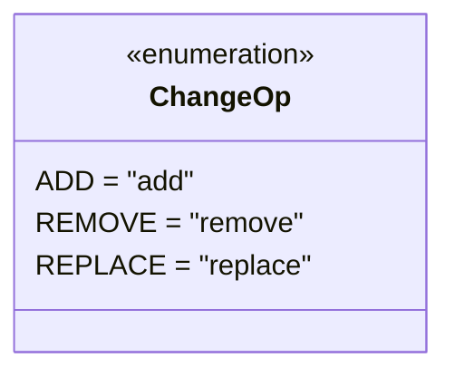

# Diagram: entity_core/entity_service/entity_service/damageview/submission/update_submission/models/enums.py

> Auto-generated by Obscura crawlers

## Mermaid

### SVG

<svg id="container" width="239.9609375" xmlns="http://www.w3.org/2000/svg" class="classDiagram" height="208" viewBox="0 0 239.9609375 208" role="graphics-document document" aria-roledescription="class"><g><defs><marker id="container_class-aggregationStart" class="marker aggregation class" refX="18" refY="7" markerWidth="190" markerHeight="240" orient="auto"><path d="M 18,7 L9,13 L1,7 L9,1 Z"></path></marker></defs><defs><marker id="container_class-aggregationEnd" class="marker aggregation class" refX="1" refY="7" markerWidth="20" markerHeight="28" orient="auto"><path d="M 18,7 L9,13 L1,7 L9,1 Z"></path></marker></defs><defs><marker id="container_class-extensionStart" class="marker extension class" refX="18" refY="7" markerWidth="190" markerHeight="240" orient="auto"><path d="M 1,7 L18,13 V 1 Z"></path></marker></defs><defs><marker id="container_class-extensionEnd" class="marker extension class" refX="1" refY="7" markerWidth="20" markerHeight="28" orient="auto"><path d="M 1,1 V 13 L18,7 Z"></path></marker></defs><defs><marker id="container_class-compositionStart" class="marker composition class" refX="18" refY="7" markerWidth="190" markerHeight="240" orient="auto"><path d="M 18,7 L9,13 L1,7 L9,1 Z"></path></marker></defs><defs><marker id="container_class-compositionEnd" class="marker composition class" refX="1" refY="7" markerWidth="20" markerHeight="28" orient="auto"><path d="M 18,7 L9,13 L1,7 L9,1 Z"></path></marker></defs><defs><marker id="container_class-dependencyStart" class="marker dependency class" refX="6" refY="7" markerWidth="190" markerHeight="240" orient="auto"><path d="M 5,7 L9,13 L1,7 L9,1 Z"></path></marker></defs><defs><marker id="container_class-dependencyEnd" class="marker dependency class" refX="13" refY="7" markerWidth="20" markerHeight="28" orient="auto"><path d="M 18,7 L9,13 L14,7 L9,1 Z"></path></marker></defs><defs><marker id="container_class-lollipopStart" class="marker lollipop class" refX="13" refY="7" markerWidth="190" markerHeight="240" orient="auto"><circle stroke="black" fill="transparent" cx="7" cy="7" r="6"></circle></marker></defs><defs><marker id="container_class-lollipopEnd" class="marker lollipop class" refX="1" refY="7" markerWidth="190" markerHeight="240" orient="auto"><circle stroke="black" fill="transparent" cx="7" cy="7" r="6"></circle></marker></defs><g class="root"><g class="clusters"></g><g class="edgePaths"></g><g class="edgeLabels"></g><g class="nodes"><g class="node default" id="classId-ChangeOp-0" transform="translate(119.98046875, 104)"><g class="basic label-container"><path d="M-111.98046875 -96 L111.98046875 -96 L111.98046875 96 L-111.98046875 96" stroke="none" stroke-width="0" fill="#ECECFF" style=""></path><path d="M-111.98046875 -96 C-26.76872466330026 -96, 58.44301942339948 -96, 111.98046875 -96 M-111.98046875 -96 C-61.884200825306976 -96, -11.787932900613953 -96, 111.98046875 -96 M111.98046875 -96 C111.98046875 -33.29251547447733, 111.98046875 29.414969051045347, 111.98046875 96 M111.98046875 -96 C111.98046875 -27.574910081907205, 111.98046875 40.85017983618559, 111.98046875 96 M111.98046875 96 C25.817126826636027 96, -60.346215096727946 96, -111.98046875 96 M111.98046875 96 C43.896726834338835 96, -24.18701508132233 96, -111.98046875 96 M-111.98046875 96 C-111.98046875 47.05690122572936, -111.98046875 -1.8861975485412756, -111.98046875 -96 M-111.98046875 96 C-111.98046875 43.403463397874994, -111.98046875 -9.193073204250013, -111.98046875 -96" stroke="#9370DB" stroke-width="1.3" fill="none" stroke-dasharray="0 0" style=""></path></g><g class="annotation-group text" transform="translate(-55.5546875, -72)"><g class="label" style="" transform="translate(0,-12)"><foreignObject width="111.109375" height="24">

«enumeration»

</foreignObject></g></g><g class="label-group text" transform="translate(-37.09375, -48)"><g class="label" style="font-weight: bolder" transform="translate(0,-12)"><foreignObject width="74.1875" height="24">

ChangeOp

</foreignObject></g></g><g class="members-group text" transform="translate(-99.98046875, 0)"><g class="label" style="" transform="translate(0,-12)"><foreignObject width="86.625" height="24">

ADD = "add"

</foreignObject></g><g class="label" style="" transform="translate(0,12)"><foreignObject width="142.015625" height="24">

REMOVE = "remove"

</foreignObject></g><g class="label" style="" transform="translate(0,36)"><foreignObject width="144.40625" height="24">

REPLACE = "replace"

</foreignObject></g></g><g class="methods-group text" transform="translate(-99.98046875, 96)"></g><g class="divider" style=""><path d="M-111.98046875 -24 C-57.67265109264652 -24, -3.3648334352930362 -24, 111.98046875 -24 M-111.98046875 -24 C-42.78251424581589 -24, 26.41544025836822 -24, 111.98046875 -24" stroke="#9370DB" stroke-width="1.3" fill="none" stroke-dasharray="0 0" style=""></path></g><g class="divider" style=""><path d="M-111.98046875 72 C-30.413360036237492 72, 51.153748677525016 72, 111.98046875 72 M-111.98046875 72 C-24.46021167602784 72, 63.06004539794432 72, 111.98046875 72" stroke="#9370DB" stroke-width="1.3" fill="none" stroke-dasharray="0 0" style=""></path></g></g></g></g></g></svg>
