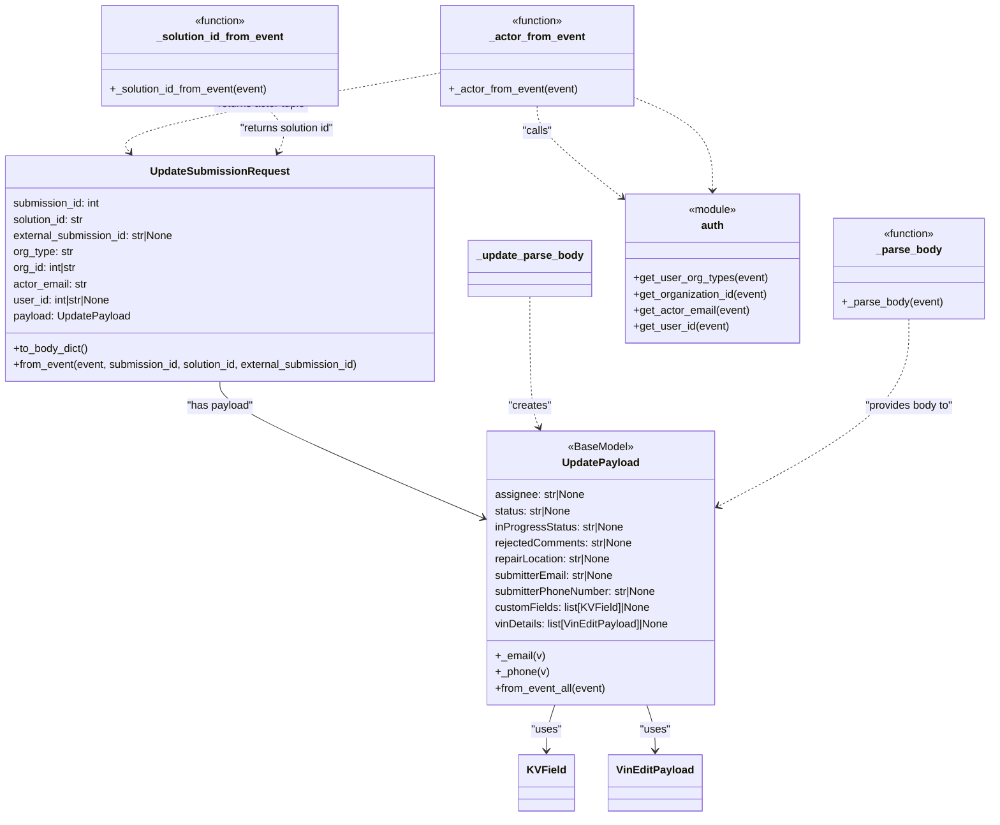

# Diagram: entity_core/entity_service/entity_service/damageview/submission/update_submission/models/event.py


> Auto-generated by Obscura crawlers

## Diagram 1



> SVG rendering failed for this diagram.

## Diagram 2

```mermaid
sequenceDiagram
participant Client as Event
participant Parser as _parse_body
participant Payload as UpdatePayload
participant Actor as _actor_from_event
participant Sol as _solution_id_from_event
participant Request as UpdateSubmissionRequest
participant Auth as auth

Client->>Parser: send event with body/headers/pathParameters
alt body is string
  Parser->>Parser: attempt JSON loads
  alt JSON valid
    Parser-->>Payload: return parsed dict
  else JSON invalid
    Parser-->>Client: raise ValueError("Invalid request body JSON")
  end
else body is dict
  Parser-->>Payload: return dict
end
Payload->>Payload: field validators (_email, _phone) run
Client->>Actor: request actor info
Actor->>Auth: get_user_org_types / get_organization_id / get_actor_email / get_user_id
Auth-->>Actor: return org_type, org_id, actor_email, user_id
Actor-->>Request: provide actor tuple
Client->>Sol: check pathParameters.headers
Sol-->>Request: return solution_id or None
Request->>Payload: call UpdatePayload.from_event_all(event)
Request-->>Client: return UpdateSubmissionRequest instance
```

> SVG rendering failed for this diagram.
