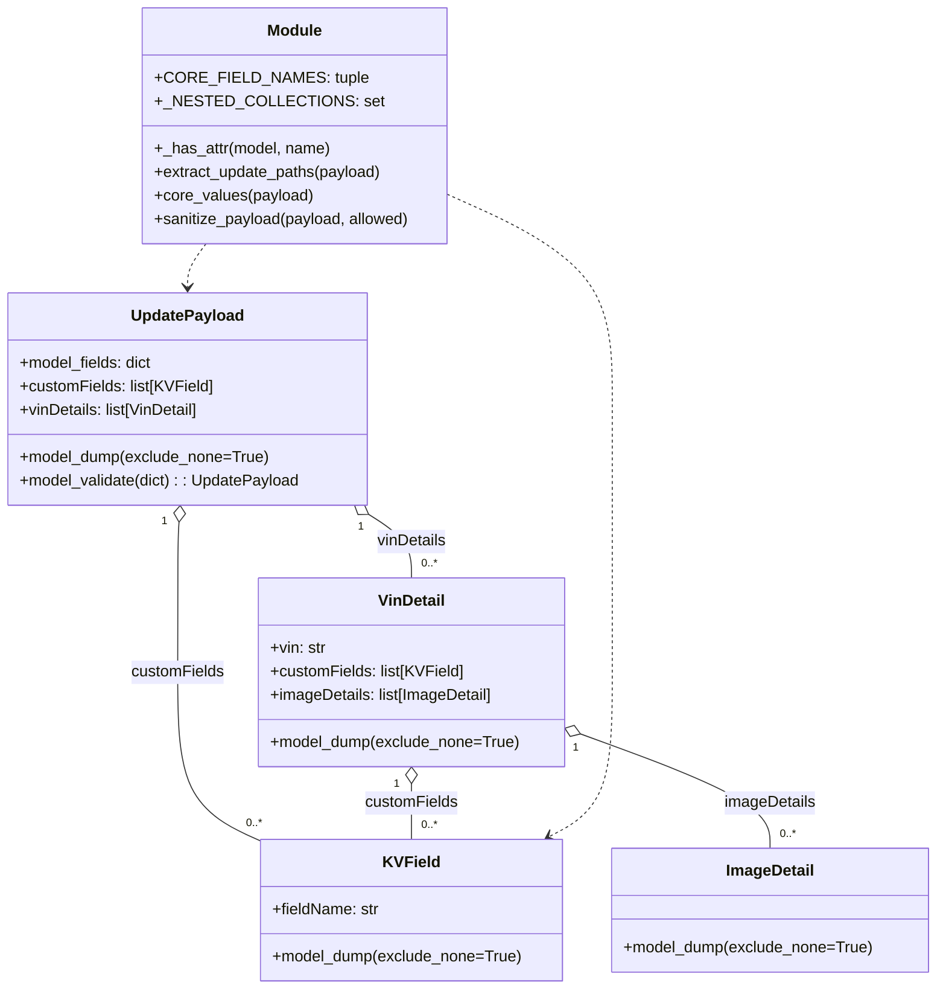

# Diagram: entity_core/entity_service/entity_service/damageview/submission/update_submission/payload/paths.py


> Auto-generated by Obscura crawlers

## Diagram 1



### SVG

<svg id="container" width="954.470703125" xmlns="http://www.w3.org/2000/svg" class="classDiagram" height="1006" viewBox="0 0 954.470703125 1006" role="graphics-document document" aria-roledescription="class"><style>#container{font-family:"trebuchet ms",verdana,arial,sans-serif;font-size:16px;fill:#333;}@keyframes edge-animation-frame{from{stroke-dashoffset:0;}}@keyframes dash{to{stroke-dashoffset:0;}}#container .edge-animation-slow{stroke-dasharray:9,5!important;stroke-dashoffset:900;animation:dash 50s linear infinite;stroke-linecap:round;}#container .edge-animation-fast{stroke-dasharray:9,5!important;stroke-dashoffset:900;animation:dash 20s linear infinite;stroke-linecap:round;}#container .error-icon{fill:#552222;}#container .error-text{fill:#552222;stroke:#552222;}#container .edge-thickness-normal{stroke-width:1px;}#container .edge-thickness-thick{stroke-width:3.5px;}#container .edge-pattern-solid{stroke-dasharray:0;}#container .edge-thickness-invisible{stroke-width:0;fill:none;}#container .edge-pattern-dashed{stroke-dasharray:3;}#container .edge-pattern-dotted{stroke-dasharray:2;}#container .marker{fill:#333333;stroke:#333333;}#container .marker.cross{stroke:#333333;}#container svg{font-family:"trebuchet ms",verdana,arial,sans-serif;font-size:16px;}#container p{margin:0;}#container g.classGroup text{fill:#9370DB;stroke:none;font-family:"trebuchet ms",verdana,arial,sans-serif;font-size:10px;}#container g.classGroup text .title{font-weight:bolder;}#container .nodeLabel,#container .edgeLabel{color:#131300;}#container .edgeLabel .label rect{fill:#ECECFF;}#container .label text{fill:#131300;}#container .labelBkg{background:#ECECFF;}#container .edgeLabel .label span{background:#ECECFF;}#container .classTitle{font-weight:bolder;}#container .node rect,#container .node circle,#container .node ellipse,#container .node polygon,#container .node path{fill:#ECECFF;stroke:#9370DB;stroke-width:1px;}#container .divider{stroke:#9370DB;stroke-width:1;}#container g.clickable{cursor:pointer;}#container g.classGroup rect{fill:#ECECFF;stroke:#9370DB;}#container g.classGroup line{stroke:#9370DB;stroke-width:1;}#container .classLabel .box{stroke:none;stroke-width:0;fill:#ECECFF;opacity:0.5;}#container .classLabel .label{fill:#9370DB;font-size:10px;}#container .relation{stroke:#333333;stroke-width:1;fill:none;}#container .dashed-line{stroke-dasharray:3;}#container .dotted-line{stroke-dasharray:1 2;}#container #compositionStart,#container .composition{fill:#333333!important;stroke:#333333!important;stroke-width:1;}#container #compositionEnd,#container .composition{fill:#333333!important;stroke:#333333!important;stroke-width:1;}#container #dependencyStart,#container .dependency{fill:#333333!important;stroke:#333333!important;stroke-width:1;}#container #dependencyStart,#container .dependency{fill:#333333!important;stroke:#333333!important;stroke-width:1;}#container #extensionStart,#container .extension{fill:transparent!important;stroke:#333333!important;stroke-width:1;}#container #extensionEnd,#container .extension{fill:transparent!important;stroke:#333333!important;stroke-width:1;}#container #aggregationStart,#container .aggregation{fill:transparent!important;stroke:#333333!important;stroke-width:1;}#container #aggregationEnd,#container .aggregation{fill:transparent!important;stroke:#333333!important;stroke-width:1;}#container #lollipopStart,#container .lollipop{fill:#ECECFF!important;stroke:#333333!important;stroke-width:1;}#container #lollipopEnd,#container .lollipop{fill:#ECECFF!important;stroke:#333333!important;stroke-width:1;}#container .edgeTerminals{font-size:11px;line-height:initial;}#container .classTitleText{text-anchor:middle;font-size:18px;fill:#333;}#container .label-icon{display:inline-block;height:1em;overflow:visible;vertical-align:-0.125em;}#container .node .label-icon path{fill:currentColor;stroke:revert;stroke-width:revert;}#container :root{--mermaid-font-family:"trebuchet ms",verdana,arial,sans-serif;}</style><g><defs><marker id="container_class-aggregationStart" class="marker aggregation class" refX="18" refY="7" markerWidth="190" markerHeight="240" orient="auto"><path d="M 18,7 L9,13 L1,7 L9,1 Z"></path></marker></defs><defs><marker id="container_class-aggregationEnd" class="marker aggregation class" refX="1" refY="7" markerWidth="20" markerHeight="28" orient="auto"><path d="M 18,7 L9,13 L1,7 L9,1 Z"></path></marker></defs><defs><marker id="container_class-extensionStart" class="marker extension class" refX="18" refY="7" markerWidth="190" markerHeight="240" orient="auto"><path d="M 1,7 L18,13 V 1 Z"></path></marker></defs><defs><marker id="container_class-extensionEnd" class="marker extension class" refX="1" refY="7" markerWidth="20" markerHeight="28" orient="auto"><path d="M 1,1 V 13 L18,7 Z"></path></marker></defs><defs><marker id="container_class-compositionStart" class="marker composition class" refX="18" refY="7" markerWidth="190" markerHeight="240" orient="auto"><path d="M 18,7 L9,13 L1,7 L9,1 Z"></path></marker></defs><defs><marker id="container_class-compositionEnd" class="marker composition class" refX="1" refY="7" markerWidth="20" markerHeight="28" orient="auto"><path d="M 18,7 L9,13 L1,7 L9,1 Z"></path></marker></defs><defs><marker id="container_class-dependencyStart" class="marker dependency class" refX="6" refY="7" markerWidth="190" markerHeight="240" orient="auto"><path d="M 5,7 L9,13 L1,7 L9,1 Z"></path></marker></defs><defs><marker id="container_class-dependencyEnd" class="marker dependency class" refX="13" refY="7" markerWidth="20" markerHeight="28" orient="auto"><path d="M 18,7 L9,13 L14,7 L9,1 Z"></path></marker></defs><defs><marker id="container_class-lollipopStart" class="marker lollipop class" refX="13" refY="7" markerWidth="190" markerHeight="240" orient="auto"><circle stroke="black" fill="transparent" cx="7" cy="7" r="6"></circle></marker></defs><defs><marker id="container_class-lollipopEnd" class="marker lollipop class" refX="1" refY="7" markerWidth="190" markerHeight="240" orient="auto"><circle stroke="black" fill="transparent" cx="7" cy="7" r="6"></circle></marker></defs><g class="root"><g class="clusters"></g><g class="edgePaths"><path d="M182.678,531.208L182.447,534.506C182.216,537.805,181.753,544.403,181.522,569.868C181.291,595.333,181.291,639.667,181.291,684C181.291,728.333,181.291,772.667,195.542,801.339C209.794,830.011,238.296,843.022,252.548,849.528L266.799,856.034" id="id_UpdatePayload_KVField_1" class="edge-thickness-normal edge-pattern-solid relation" style=";;;" data-edge="true" data-et="edge" data-id="id_UpdatePayload_KVField_1" data-points="W3sieCI6MTgzLjg4NDEwNTYwMzQ0ODMsInkiOjUxNH0seyJ4IjoxODEuMjkxMDE1NjI1LCJ5Ijo1NTF9LHsieCI6MTgxLjI5MTAxNTYyNSwieSI6Njg0fSx7IngiOjE4MS4yOTEwMTU2MjUsInkiOjgxN30seyJ4IjoyNjYuNzk4ODI4MTI1LCJ5Ijo4NTYuMDMzNjUxMjUwNjc0OH1d" marker-start="url(#container_class-aggregationStart)"></path><path d="M376.299,523.239L383.594,527.866C390.889,532.493,405.479,541.746,412.773,552.54C420.068,563.333,420.068,575.667,420.068,581.833L420.068,588" id="id_UpdatePayload_VinDetail_2" class="edge-thickness-normal edge-pattern-solid relation" style=";;;" data-edge="true" data-et="edge" data-id="id_UpdatePayload_VinDetail_2" data-points="W3sieCI6MzYxLjczMjA1ODE4OTY1NTE2LCJ5Ijo1MTR9LHsieCI6NDIwLjA2ODM1OTM3NSwieSI6NTUxfSx7IngiOjQyMC4wNjgzNTkzNzUsInkiOjU4OH1d" marker-start="url(#container_class-aggregationStart)"></path><path d="M420.068,797.25L420.068,800.542C420.068,803.833,420.068,810.417,420.068,819.875C420.068,829.333,420.068,841.667,420.068,847.833L420.068,854" id="id_VinDetail_KVField_3" class="edge-thickness-normal edge-pattern-solid relation" style=";;;" data-edge="true" data-et="edge" data-id="id_VinDetail_KVField_3" data-points="W3sieCI6NDIwLjA2ODM1OTM3NSwieSI6NzgwfSx7IngiOjQyMC4wNjgzNTkzNzUsInkiOjgxN30seyJ4Ijo0MjAuMDY4MzU5Mzc1LCJ5Ijo4NTR9XQ==" marker-start="url(#container_class-aggregationStart)"></path><path d="M592.529,746.87L624.592,758.558C656.654,770.247,720.779,793.623,752.842,812.978C784.904,832.333,784.904,847.667,784.904,855.333L784.904,863" id="id_VinDetail_ImageDetail_4" class="edge-thickness-normal edge-pattern-solid relation" style=";;;" data-edge="true" data-et="edge" data-id="id_VinDetail_ImageDetail_4" data-points="W3sieCI6NTc2LjMyMjI2NTYyNSwieSI6NzQwLjk2MTk1ODUwMDE4Mn0seyJ4Ijo3ODQuOTA0Mjk2ODc1LCJ5Ijo4MTd9LHsieCI6Nzg0LjkwNDI5Njg3NSwieSI6ODYzfV0=" marker-start="url(#container_class-aggregationStart)"></path><path d="M210.285,248L207.147,252.167C204.008,256.333,197.731,264.667,194.592,272C191.453,279.333,191.453,285.667,191.453,288.833L191.453,292" id="id_Module_UpdatePayload_5" class="edge-thickness-normal edge-pattern-dashed relation" style=";;;" data-edge="true" data-et="edge" data-id="id_Module_UpdatePayload_5" data-points="W3sieCI6MjEwLjI4NTI5MDk0ODI3NTg3LCJ5IjoyNDh9LHsieCI6MTkxLjQ1MzEyNSwieSI6MjczfSx7IngiOjE5MS40NTMxMjUsInkiOjI5OH1d" marker-end="url(#container_class-dependencyEnd)"></path><path d="M457.563,198.157L485.456,210.631C513.349,223.105,569.135,248.052,597.029,282.693C624.922,317.333,624.922,361.667,624.922,408C624.922,454.333,624.922,502.667,624.922,549C624.922,595.333,624.922,639.667,624.922,684C624.922,728.333,624.922,772.667,614.215,800.53C603.508,828.394,582.095,839.788,571.388,845.485L560.681,851.182" id="id_Module_KVField_6" class="edge-thickness-normal edge-pattern-dashed relation" style=";;;" data-edge="true" data-et="edge" data-id="id_Module_KVField_6" data-points="W3sieCI6NDU3LjU2MjUsInkiOjE5OC4xNTc0NTg0OTY5NzYxMn0seyJ4Ijo2MjQuOTIxODc1LCJ5IjoyNzN9LHsieCI6NjI0LjkyMTg3NSwieSI6NDA2fSx7IngiOjYyNC45MjE4NzUsInkiOjU1MX0seyJ4Ijo2MjQuOTIxODc1LCJ5Ijo2ODR9LHsieCI6NjI0LjkyMTg3NSwieSI6ODE3fSx7IngiOjU1NS4zODQ0NDMwOTA1OTYzLCJ5Ijo4NTR9XQ==" marker-end="url(#container_class-dependencyEnd)"></path></g><g class="edgeLabels"><g class="edgeLabel" transform="translate(181.291015625, 684)"><g class="label" data-id="id_UpdatePayload_KVField_1" transform="translate(-47.5234375, -12)"><foreignObject width="95.046875" height="24"><div xmlns="http://www.w3.org/1999/xhtml" class="labelBkg" style="display: table-cell; white-space: nowrap; line-height: 1.5; max-width: 200px; text-align: center;"><span class="edgeLabel"><p>customFields</p></span></div></foreignObject></g></g><g class="edgeLabel" transform="translate(420.068359375, 551)"><g class="label" data-id="id_UpdatePayload_VinDetail_2" transform="translate(-35.9140625, -12)"><foreignObject width="71.828125" height="24"><div xmlns="http://www.w3.org/1999/xhtml" class="labelBkg" style="display: table-cell; white-space: nowrap; line-height: 1.5; max-width: 200px; text-align: center;"><span class="edgeLabel"><p>vinDetails</p></span></div></foreignObject></g></g><g class="edgeLabel" transform="translate(420.068359375, 817)"><g class="label" data-id="id_VinDetail_KVField_3" transform="translate(-47.5234375, -12)"><foreignObject width="95.046875" height="24"><div xmlns="http://www.w3.org/1999/xhtml" class="labelBkg" style="display: table-cell; white-space: nowrap; line-height: 1.5; max-width: 200px; text-align: center;"><span class="edgeLabel"><p>customFields</p></span></div></foreignObject></g></g><g class="edgeLabel" transform="translate(784.904296875, 817)"><g class="label" data-id="id_VinDetail_ImageDetail_4" transform="translate(-46.8125, -12)"><foreignObject width="93.625" height="24"><div xmlns="http://www.w3.org/1999/xhtml" class="labelBkg" style="display: table-cell; white-space: nowrap; line-height: 1.5; max-width: 200px; text-align: center;"><span class="edgeLabel"><p>imageDetails</p></span></div></foreignObject></g></g><g class="edgeLabel"><g class="label" data-id="id_Module_UpdatePayload_5" transform="translate(0, 0)"><foreignObject width="0" height="0"><div xmlns="http://www.w3.org/1999/xhtml" class="labelBkg" style="display: table-cell; white-space: nowrap; line-height: 1.5; max-width: 200px; text-align: center;"><span class="edgeLabel"></span></div></foreignObject></g></g><g class="edgeLabel"><g class="label" data-id="id_Module_KVField_6" transform="translate(0, 0)"><foreignObject width="0" height="0"><div xmlns="http://www.w3.org/1999/xhtml" class="labelBkg" style="display: table-cell; white-space: nowrap; line-height: 1.5; max-width: 200px; text-align: center;"><span class="edgeLabel"></span></div></foreignObject></g></g><g class="edgeTerminals" transform="translate(167.69734553133335, 530.4084975895842)"><g class="inner" transform="translate(0, 0)"><foreignObject style="width: 9px; height: 12px;"><div xmlns="http://www.w3.org/1999/xhtml" style="display: inline-block; padding-right: 1px; white-space: nowrap;"><span class="edgeLabel">1</span></div></foreignObject></g></g><g class="edgeTerminals" transform="translate(368.4761463556799, 536.0401301779265)"><g class="inner" transform="translate(0, 0)"><foreignObject style="width: 9px; height: 12px;"><div xmlns="http://www.w3.org/1999/xhtml" style="display: inline-block; padding-right: 1px; white-space: nowrap;"><span class="edgeLabel">1</span></div></foreignObject></g></g><g class="edgeTerminals" transform="translate(405.0683596875, 797.5000002678571)"><g class="inner" transform="translate(0, 0)"><foreignObject style="width: 9px; height: 12px;"><div xmlns="http://www.w3.org/1999/xhtml" style="display: inline-block; padding-right: 1px; white-space: nowrap;"><span class="edgeLabel">1</span></div></foreignObject></g></g><g class="edgeTerminals" transform="translate(587.626348808337, 761.0484625082886)"><g class="inner" transform="translate(0, 0)"><foreignObject style="width: 9px; height: 12px;"><div xmlns="http://www.w3.org/1999/xhtml" style="display: inline-block; padding-right: 1px; white-space: nowrap;"><span class="edgeLabel">1</span></div></foreignObject></g></g><g class="edgeTerminals" transform="translate(252.1081593613573, 830.1209526626914)"><g class="inner" transform="translate(0, 0)"></g><foreignObject style="width: 36px; height: 12px;"><div xmlns="http://www.w3.org/1999/xhtml" style="display: inline-block; padding-right: 1px; white-space: nowrap;"><span class="edgeLabel">0..*</span></div></foreignObject></g><g class="edgeTerminals" transform="translate(430.0683596875, 565.5000002678571)"><g class="inner" transform="translate(0, 0)"></g><foreignObject style="width: 36px; height: 12px;"><div xmlns="http://www.w3.org/1999/xhtml" style="display: inline-block; padding-right: 1px; white-space: nowrap;"><span class="edgeLabel">0..*</span></div></foreignObject></g><g class="edgeTerminals" transform="translate(430.0683596875, 831.5000002678571)"><g class="inner" transform="translate(0, 0)"></g><foreignObject style="width: 36px; height: 12px;"><div xmlns="http://www.w3.org/1999/xhtml" style="display: inline-block; padding-right: 1px; white-space: nowrap;"><span class="edgeLabel">0..*</span></div></foreignObject></g><g class="edgeTerminals" transform="translate(794.9042984375, 840.5000013392857)"><g class="inner" transform="translate(0, 0)"></g><foreignObject style="width: 36px; height: 12px;"><div xmlns="http://www.w3.org/1999/xhtml" style="display: inline-block; padding-right: 1px; white-space: nowrap;"><span class="edgeLabel">0..*</span></div></foreignObject></g></g><g class="nodes"><g class="node default" id="classId-UpdatePayload-0" transform="translate(191.453125, 406)"><g class="basic label-container"><path d="M-183.453125 -108 L183.453125 -108 L183.453125 108 L-183.453125 108" stroke="none" stroke-width="0" fill="#ECECFF" style=""></path><path d="M-183.453125 -108 C-38.49560795230164 -108, 106.46190909539672 -108, 183.453125 -108 M-183.453125 -108 C-49.305135985605915 -108, 84.84285302878817 -108, 183.453125 -108 M183.453125 -108 C183.453125 -46.81405733538597, 183.453125 14.371885329228064, 183.453125 108 M183.453125 -108 C183.453125 -24.527096919016657, 183.453125 58.945806161966686, 183.453125 108 M183.453125 108 C104.46813979698372 108, 25.48315459396744 108, -183.453125 108 M183.453125 108 C90.31205892225726 108, -2.8290071554854705 108, -183.453125 108 M-183.453125 108 C-183.453125 59.25501541287235, -183.453125 10.510030825744707, -183.453125 -108 M-183.453125 108 C-183.453125 21.916045766122295, -183.453125 -64.16790846775541, -183.453125 -108" stroke="#9370DB" stroke-width="1.3" fill="none" stroke-dasharray="0 0" style=""></path></g><g class="annotation-group text" transform="translate(0, -84)"></g><g class="label-group text" transform="translate(-55.4375, -84)"><g class="label" style="font-weight: bolder" transform="translate(0,-12)"><foreignObject width="110.875" height="24"><div xmlns="http://www.w3.org/1999/xhtml" style="display: table-cell; white-space: nowrap; line-height: 1.5; max-width: 159px; text-align: center;"><span class="nodeLabel markdown-node-label" style=""><p>UpdatePayload</p></span></div></foreignObject></g></g><g class="members-group text" transform="translate(-171.453125, -36)"><g class="label" style="" transform="translate(0,-12)"><foreignObject width="137.171875" height="24"><div xmlns="http://www.w3.org/1999/xhtml" style="display: table-cell; white-space: nowrap; line-height: 1.5; max-width: 195px; text-align: center;"><span class="nodeLabel markdown-node-label" style=""><p>+model_fields: dict</p></span></div></foreignObject></g><g class="label" style="" transform="translate(0,12)"><foreignObject width="196.890625" height="24"><div xmlns="http://www.w3.org/1999/xhtml" style="display: table-cell; white-space: nowrap; line-height: 1.5; max-width: 254px; text-align: center;"><span class="nodeLabel markdown-node-label" style=""><p>+customFields: list[KVField]</p></span></div></foreignObject></g><g class="label" style="" transform="translate(0,36)"><foreignObject width="186.140625" height="24"><div xmlns="http://www.w3.org/1999/xhtml" style="display: table-cell; white-space: nowrap; line-height: 1.5; max-width: 244px; text-align: center;"><span class="nodeLabel markdown-node-label" style=""><p>+vinDetails: list[VinDetail]</p></span></div></foreignObject></g></g><g class="methods-group text" transform="translate(-171.453125, 60)"><g class="label" style="" transform="translate(0,-12)"><foreignObject width="255.4375" height="24"><div xmlns="http://www.w3.org/1999/xhtml" style="display: table-cell; white-space: nowrap; line-height: 1.5; max-width: 313px; text-align: center;"><span class="nodeLabel markdown-node-label" style=""><p>+model_dump(exclude_none=True)</p></span></div></foreignObject></g><g class="label" style="" transform="translate(0,12)"><foreignObject width="287.46875" height="24"><div xmlns="http://www.w3.org/1999/xhtml" style="display: table-cell; white-space: nowrap; line-height: 1.5; max-width: 345px; text-align: center;"><span class="nodeLabel markdown-node-label" style=""><p>+model_validate(dict) : : UpdatePayload</p></span></div></foreignObject></g></g><g class="divider" style=""><path d="M-183.453125 -60 C-106.50227339240956 -60, -29.551421784819127 -60, 183.453125 -60 M-183.453125 -60 C-72.79935503768023 -60, 37.85441492463954 -60, 183.453125 -60" stroke="#9370DB" stroke-width="1.3" fill="none" stroke-dasharray="0 0" style=""></path></g><g class="divider" style=""><path d="M-183.453125 36 C-73.64379439250514 36, 36.165536214989714 36, 183.453125 36 M-183.453125 36 C-92.90049501993471 36, -2.3478650398694185 36, 183.453125 36" stroke="#9370DB" stroke-width="1.3" fill="none" stroke-dasharray="0 0" style=""></path></g></g><g class="node default" id="classId-KVField-1" transform="translate(420.068359375, 926)"><g class="basic label-container"><path d="M-153.26953125 -72 L153.26953125 -72 L153.26953125 72 L-153.26953125 72" stroke="none" stroke-width="0" fill="#ECECFF" style=""></path><path d="M-153.26953125 -72 C-78.25209032348768 -72, -3.2346493969753567 -72, 153.26953125 -72 M-153.26953125 -72 C-88.55771498351889 -72, -23.845898717037784 -72, 153.26953125 -72 M153.26953125 -72 C153.26953125 -33.58870225673297, 153.26953125 4.8225954865340555, 153.26953125 72 M153.26953125 -72 C153.26953125 -42.57373034118763, 153.26953125 -13.147460682375247, 153.26953125 72 M153.26953125 72 C53.36904615988617 72, -46.531438930227665 72, -153.26953125 72 M153.26953125 72 C76.80310257296074 72, 0.33667389592147856 72, -153.26953125 72 M-153.26953125 72 C-153.26953125 37.94777268121062, -153.26953125 3.8955453624212453, -153.26953125 -72 M-153.26953125 72 C-153.26953125 21.44950550274052, -153.26953125 -29.100988994518957, -153.26953125 -72" stroke="#9370DB" stroke-width="1.3" fill="none" stroke-dasharray="0 0" style=""></path></g><g class="annotation-group text" transform="translate(0, -48)"></g><g class="label-group text" transform="translate(-27.1015625, -48)"><g class="label" style="font-weight: bolder" transform="translate(0,-12)"><foreignObject width="54.203125" height="24"><div xmlns="http://www.w3.org/1999/xhtml" style="display: table-cell; white-space: nowrap; line-height: 1.5; max-width: 103px; text-align: center;"><span class="nodeLabel markdown-node-label" style=""><p>KVField</p></span></div></foreignObject></g></g><g class="members-group text" transform="translate(-141.26953125, 0)"><g class="label" style="" transform="translate(0,-12)"><foreignObject width="109.421875" height="24"><div xmlns="http://www.w3.org/1999/xhtml" style="display: table-cell; white-space: nowrap; line-height: 1.5; max-width: 168px; text-align: center;"><span class="nodeLabel markdown-node-label" style=""><p>+fieldName: str</p></span></div></foreignObject></g></g><g class="methods-group text" transform="translate(-141.26953125, 48)"><g class="label" style="" transform="translate(0,-12)"><foreignObject width="255.4375" height="24"><div xmlns="http://www.w3.org/1999/xhtml" style="display: table-cell; white-space: nowrap; line-height: 1.5; max-width: 313px; text-align: center;"><span class="nodeLabel markdown-node-label" style=""><p>+model_dump(exclude_none=True)</p></span></div></foreignObject></g></g><g class="divider" style=""><path d="M-153.26953125 -24 C-60.21043289141538 -24, 32.84866546716924 -24, 153.26953125 -24 M-153.26953125 -24 C-77.84607687341976 -24, -2.422622496839523 -24, 153.26953125 -24" stroke="#9370DB" stroke-width="1.3" fill="none" stroke-dasharray="0 0" style=""></path></g><g class="divider" style=""><path d="M-153.26953125 24 C-36.32490293352565 24, 80.6197253829487 24, 153.26953125 24 M-153.26953125 24 C-39.609786832124385 24, 74.04995758575123 24, 153.26953125 24" stroke="#9370DB" stroke-width="1.3" fill="none" stroke-dasharray="0 0" style=""></path></g></g><g class="node default" id="classId-VinDetail-2" transform="translate(420.068359375, 684)"><g class="basic label-container"><path d="M-156.25390625 -96 L156.25390625 -96 L156.25390625 96 L-156.25390625 96" stroke="none" stroke-width="0" fill="#ECECFF" style=""></path><path d="M-156.25390625 -96 C-80.25711006487829 -96, -4.2603138797565805 -96, 156.25390625 -96 M-156.25390625 -96 C-52.16517936228121 -96, 51.923547525437584 -96, 156.25390625 -96 M156.25390625 -96 C156.25390625 -43.19553015356653, 156.25390625 9.60893969286694, 156.25390625 96 M156.25390625 -96 C156.25390625 -36.09283971989599, 156.25390625 23.814320560208017, 156.25390625 96 M156.25390625 96 C66.77809920131808 96, -22.69770784736383 96, -156.25390625 96 M156.25390625 96 C66.09824258360756 96, -24.057421082784884 96, -156.25390625 96 M-156.25390625 96 C-156.25390625 30.336587370293643, -156.25390625 -35.326825259412715, -156.25390625 -96 M-156.25390625 96 C-156.25390625 42.18798111055854, -156.25390625 -11.624037778882922, -156.25390625 -96" stroke="#9370DB" stroke-width="1.3" fill="none" stroke-dasharray="0 0" style=""></path></g><g class="annotation-group text" transform="translate(0, -72)"></g><g class="label-group text" transform="translate(-33.0703125, -72)"><g class="label" style="font-weight: bolder" transform="translate(0,-12)"><foreignObject width="66.140625" height="24"><div xmlns="http://www.w3.org/1999/xhtml" style="display: table-cell; white-space: nowrap; line-height: 1.5; max-width: 116px; text-align: center;"><span class="nodeLabel markdown-node-label" style=""><p>VinDetail</p></span></div></foreignObject></g></g><g class="members-group text" transform="translate(-144.25390625, -24)"><g class="label" style="" transform="translate(0,-12)"><foreignObject width="57.09375" height="24"><div xmlns="http://www.w3.org/1999/xhtml" style="display: table-cell; white-space: nowrap; line-height: 1.5; max-width: 115px; text-align: center;"><span class="nodeLabel markdown-node-label" style=""><p>+vin: str</p></span></div></foreignObject></g><g class="label" style="" transform="translate(0,12)"><foreignObject width="196.890625" height="24"><div xmlns="http://www.w3.org/1999/xhtml" style="display: table-cell; white-space: nowrap; line-height: 1.5; max-width: 254px; text-align: center;"><span class="nodeLabel markdown-node-label" style=""><p>+customFields: list[KVField]</p></span></div></foreignObject></g><g class="label" style="" transform="translate(0,36)"><foreignObject width="228.859375" height="24"><div xmlns="http://www.w3.org/1999/xhtml" style="display: table-cell; white-space: nowrap; line-height: 1.5; max-width: 286px; text-align: center;"><span class="nodeLabel markdown-node-label" style=""><p>+imageDetails: list[ImageDetail]</p></span></div></foreignObject></g></g><g class="methods-group text" transform="translate(-144.25390625, 72)"><g class="label" style="" transform="translate(0,-12)"><foreignObject width="255.4375" height="24"><div xmlns="http://www.w3.org/1999/xhtml" style="display: table-cell; white-space: nowrap; line-height: 1.5; max-width: 313px; text-align: center;"><span class="nodeLabel markdown-node-label" style=""><p>+model_dump(exclude_none=True)</p></span></div></foreignObject></g></g><g class="divider" style=""><path d="M-156.25390625 -48 C-61.63158529498446 -48, 32.99073566003108 -48, 156.25390625 -48 M-156.25390625 -48 C-85.36687430744044 -48, -14.47984236488088 -48, 156.25390625 -48" stroke="#9370DB" stroke-width="1.3" fill="none" stroke-dasharray="0 0" style=""></path></g><g class="divider" style=""><path d="M-156.25390625 48 C-92.65115870690903 48, -29.048411163818045 48, 156.25390625 48 M-156.25390625 48 C-47.04271697692538 48, 62.16847229614925 48, 156.25390625 48" stroke="#9370DB" stroke-width="1.3" fill="none" stroke-dasharray="0 0" style=""></path></g></g><g class="node default" id="classId-ImageDetail-3" transform="translate(784.904296875, 926)"><g class="basic label-container"><path d="M-161.56640625 -63 L161.56640625 -63 L161.56640625 63 L-161.56640625 63" stroke="none" stroke-width="0" fill="#ECECFF" style=""></path><path d="M-161.56640625 -63 C-67.14749157014819 -63, 27.27142310970362 -63, 161.56640625 -63 M-161.56640625 -63 C-79.19405069447596 -63, 3.178304861048076 -63, 161.56640625 -63 M161.56640625 -63 C161.56640625 -33.2604806876478, 161.56640625 -3.5209613752955917, 161.56640625 63 M161.56640625 -63 C161.56640625 -14.63429865596023, 161.56640625 33.73140268807954, 161.56640625 63 M161.56640625 63 C84.74256146758538 63, 7.91871668517075 63, -161.56640625 63 M161.56640625 63 C71.68128592047393 63, -18.20383440905215 63, -161.56640625 63 M-161.56640625 63 C-161.56640625 32.94551486932013, -161.56640625 2.891029738640256, -161.56640625 -63 M-161.56640625 63 C-161.56640625 14.544660069065806, -161.56640625 -33.91067986186839, -161.56640625 -63" stroke="#9370DB" stroke-width="1.3" fill="none" stroke-dasharray="0 0" style=""></path></g><g class="annotation-group text" transform="translate(0, -39)"></g><g class="label-group text" transform="translate(-43.6953125, -39)"><g class="label" style="font-weight: bolder" transform="translate(0,-12)"><foreignObject width="87.390625" height="24"><div xmlns="http://www.w3.org/1999/xhtml" style="display: table-cell; white-space: nowrap; line-height: 1.5; max-width: 137px; text-align: center;"><span class="nodeLabel markdown-node-label" style=""><p>ImageDetail</p></span></div></foreignObject></g></g><g class="members-group text" transform="translate(-149.56640625, 9)"></g><g class="methods-group text" transform="translate(-149.56640625, 39)"><g class="label" style="" transform="translate(0,-12)"><foreignObject width="255.4375" height="24"><div xmlns="http://www.w3.org/1999/xhtml" style="display: table-cell; white-space: nowrap; line-height: 1.5; max-width: 313px; text-align: center;"><span class="nodeLabel markdown-node-label" style=""><p>+model_dump(exclude_none=True)</p></span></div></foreignObject></g></g><g class="divider" style=""><path d="M-161.56640625 -15 C-66.46963717285455 -15, 28.627131904290906 -15, 161.56640625 -15 M-161.56640625 -15 C-79.34930615591088 -15, 2.867793938178238 -15, 161.56640625 -15" stroke="#9370DB" stroke-width="1.3" fill="none" stroke-dasharray="0 0" style=""></path></g><g class="divider" style=""><path d="M-161.56640625 9 C-44.15747957822421 9, 73.25144709355158 9, 161.56640625 9 M-161.56640625 9 C-92.05475811436985 9, -22.543109978739693 9, 161.56640625 9" stroke="#9370DB" stroke-width="1.3" fill="none" stroke-dasharray="0 0" style=""></path></g></g><g class="node default" id="classId-Module-4" transform="translate(300.6796875, 128)"><g class="basic label-container"><path d="M-156.8828125 -120 L156.8828125 -120 L156.8828125 120 L-156.8828125 120" stroke="none" stroke-width="0" fill="#ECECFF" style=""></path><path d="M-156.8828125 -120 C-77.99483248661241 -120, 0.8931475267751807 -120, 156.8828125 -120 M-156.8828125 -120 C-69.38027493644933 -120, 18.12226262710135 -120, 156.8828125 -120 M156.8828125 -120 C156.8828125 -56.307184153775665, 156.8828125 7.385631692448669, 156.8828125 120 M156.8828125 -120 C156.8828125 -59.64118840178001, 156.8828125 0.7176231964399733, 156.8828125 120 M156.8828125 120 C58.17427435052767 120, -40.534263798944664 120, -156.8828125 120 M156.8828125 120 C79.16787349268493 120, 1.452934485369866 120, -156.8828125 120 M-156.8828125 120 C-156.8828125 25.824278776097245, -156.8828125 -68.35144244780551, -156.8828125 -120 M-156.8828125 120 C-156.8828125 61.793824400592804, -156.8828125 3.5876488011856082, -156.8828125 -120" stroke="#9370DB" stroke-width="1.3" fill="none" stroke-dasharray="0 0" style=""></path></g><g class="annotation-group text" transform="translate(0, -96)"></g><g class="label-group text" transform="translate(-27.09375, -96)"><g class="label" style="font-weight: bolder" transform="translate(0,-12)"><foreignObject width="54.1875" height="24"><div xmlns="http://www.w3.org/1999/xhtml" style="display: table-cell; white-space: nowrap; line-height: 1.5; max-width: 104px; text-align: center;"><span class="nodeLabel markdown-node-label" style=""><p>Module</p></span></div></foreignObject></g></g><g class="members-group text" transform="translate(-144.8828125, -48)"><g class="label" style="" transform="translate(0,-12)"><foreignObject width="197.015625" height="24"><div xmlns="http://www.w3.org/1999/xhtml" style="display: table-cell; white-space: nowrap; line-height: 1.5; max-width: 254px; text-align: center;"><span class="nodeLabel markdown-node-label" style=""><p>+CORE_FIELD_NAMES: tuple</p></span></div></foreignObject></g><g class="label" style="" transform="translate(0,12)"><foreignObject width="203.484375" height="24"><div xmlns="http://www.w3.org/1999/xhtml" style="display: table-cell; white-space: nowrap; line-height: 1.5; max-width: 261px; text-align: center;"><span class="nodeLabel markdown-node-label" style=""><p>+_NESTED_COLLECTIONS: set</p></span></div></foreignObject></g></g><g class="methods-group text" transform="translate(-144.8828125, 24)"><g class="label" style="" transform="translate(0,-12)"><foreignObject width="179.59375" height="24"><div xmlns="http://www.w3.org/1999/xhtml" style="display: table-cell; white-space: nowrap; line-height: 1.5; max-width: 237px; text-align: center;"><span class="nodeLabel markdown-node-label" style=""><p>+_has_attr(model, name)</p></span></div></foreignObject></g><g class="label" style="" transform="translate(0,12)"><foreignObject width="233.96875" height="24"><div xmlns="http://www.w3.org/1999/xhtml" style="display: table-cell; white-space: nowrap; line-height: 1.5; max-width: 291px; text-align: center;"><span class="nodeLabel markdown-node-label" style=""><p>+extract_update_paths(payload)</p></span></div></foreignObject></g><g class="label" style="" transform="translate(0,36)"><foreignObject width="161.0625" height="24"><div xmlns="http://www.w3.org/1999/xhtml" style="display: table-cell; white-space: nowrap; line-height: 1.5; max-width: 218px; text-align: center;"><span class="nodeLabel markdown-node-label" style=""><p>+core_values(payload)</p></span></div></foreignObject></g><g class="label" style="" transform="translate(0,60)"><foreignObject width="262.671875" height="24"><div xmlns="http://www.w3.org/1999/xhtml" style="display: table-cell; white-space: nowrap; line-height: 1.5; max-width: 320px; text-align: center;"><span class="nodeLabel markdown-node-label" style=""><p>+sanitize_payload(payload, allowed)</p></span></div></foreignObject></g></g><g class="divider" style=""><path d="M-156.8828125 -72 C-32.64359349439107 -72, 91.59562551121786 -72, 156.8828125 -72 M-156.8828125 -72 C-51.37486831271123 -72, 54.13307587457754 -72, 156.8828125 -72" stroke="#9370DB" stroke-width="1.3" fill="none" stroke-dasharray="0 0" style=""></path></g><g class="divider" style=""><path d="M-156.8828125 0 C-69.38504253103552 0, 18.112727437928953 0, 156.8828125 0 M-156.8828125 0 C-50.38787462327804 0, 56.107063253443926 0, 156.8828125 0" stroke="#9370DB" stroke-width="1.3" fill="none" stroke-dasharray="0 0" style=""></path></g></g></g></g></g></svg>

## Diagram 2

```mermaid
flowchart TD
    Start([sanitize_payload(payload, allowed)]) --> CV[core_values(payload)]
    CV --> ForCore{for each name in CORE_FIELD_NAMES}
    ForCore -->|has attr and not None| AddCore[add name:val to out]
    ForCore -->|missing or None| SkipCore[skip]
    AddCore --> CFProcess[Process payload.customFields]
    SkipCore --> CFProcess
    CFProcess --> CFLoop{for each cf in payload.customFields or []}
    CFLoop -->|is KVField and fieldName allowed| KeepCF[append cf.model_dump(exclude_none=True) to kept_sub]
    CFLoop -->|else| SkipCF
    KeepCF --> CFAfter
    SkipCF --> CFAfter
    CFAfter -->|kept_sub non-empty| SetCustomFields[out["customFields"]=kept_sub]
    CFAfter -->|kept_sub empty| NextVin
    SetCustomFields --> NextVin
    NextVin[Process payload.vinDetails] --> VinLoop{for each vin in payload.vinDetails or []}
    VinLoop --> VinInit[vin_out = {"vin": vin.vin}]
    VinInit --> VinCFLoop{for each cf in vin.customFields or []}
    VinCFLoop -->|is KVField and allowed| KeepVinCF[append cf.model_dump to kept_vin_cfs]
    VinCFLoop -->|else| SkipVinCF
    KeepVinCF --> VinCFAfter
    SkipVinCF --> VinCFAfter
    VinCFAfter -->|kept_vin_cfs non-empty| SetVinCF[vin_out["customFields"]=kept_vin_cfs]
    VinCFAfter --> CheckImages
    SetVinCF --> CheckImages
    CheckImages{vin.imageDetails and "vinDetails.imageDetails.*" in allowed?} -->|yes| KeepImages[vin_out["imageDetails"]=dumped images]
    CheckImages -->|no| NoImages
    KeepImages --> VinOutCheck
    NoImages --> VinOutCheck
    VinOutCheck{vin_out has keys besides "vin"?} -->|yes| AppendVin[append vin_out to kept_vins]
    VinOutCheck -->|no| Continue
    AppendVin --> Continue
    Continue --> VinLoop
    VinLoop --> AfterVins
    AfterVins -->|kept_vins non-empty| SetVinDetails[out["vinDetails"]=kept_vins]
    AfterVins --> Validate
    SetVinDetails --> Validate
    Validate[return UpdatePayload.model_validate(out)] --> End([Done])
```

> SVG rendering failed for this diagram.
